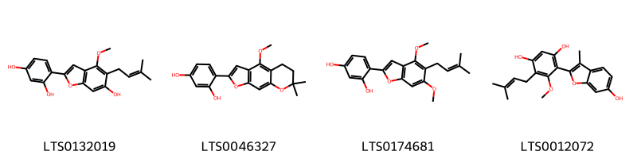
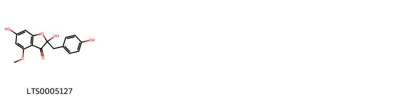
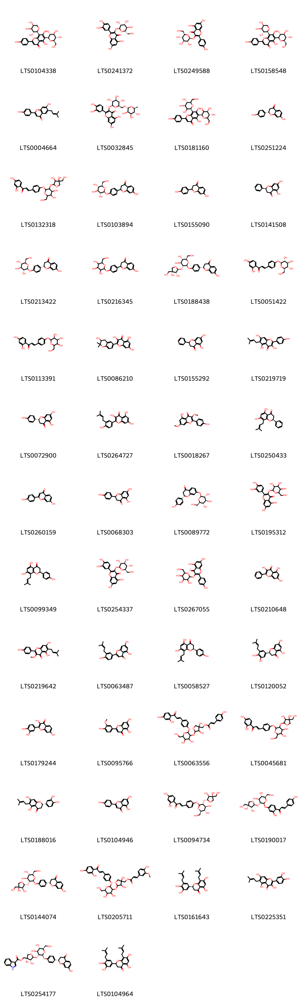
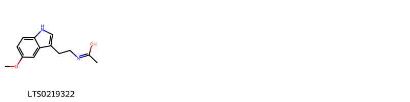
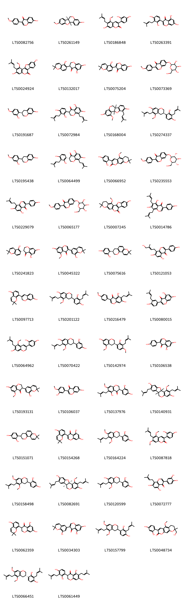
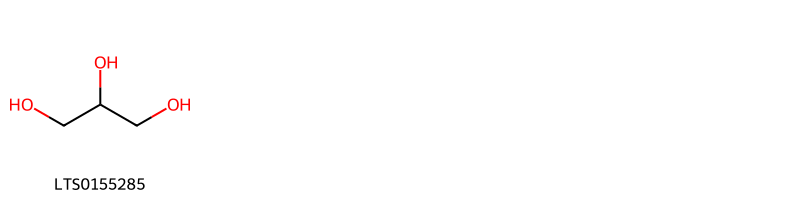
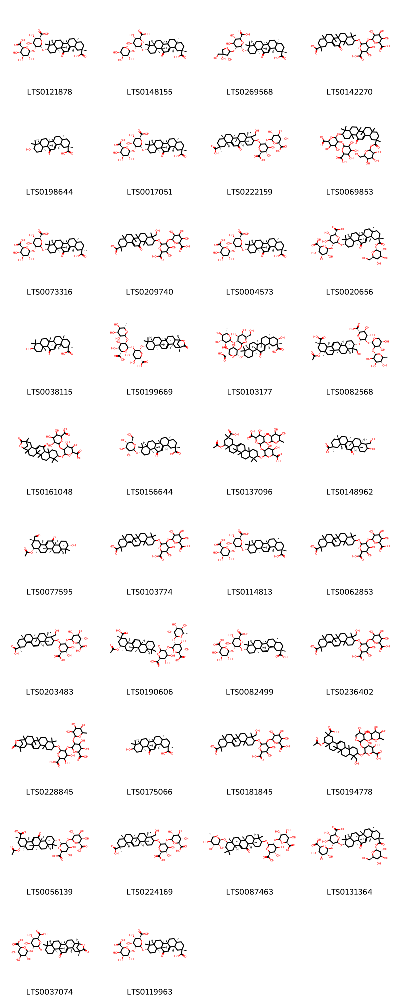

!!! abstract "Tóm tắt"
    Cam Thảo (Radix et Rhizoma Glycyrrhizae) là một vị thuốc rất thông dụng trong đông y và tây y, được lấy từ rễ và thân rễ của nhiều loài bao gồm: Glycyrrhiza uralensis Fisch., Glycyrrhiza inflata Bat. hoặc Glycyrrhiza glabra L., thuộc họ  Đậu (Fabaceae). Nguyên sản ở vùng ôn đới Âu Á, phân bố chủ yếu ở Liên Bang Nga, Trung Quốc, Mông Cổ, Afghanistan… Theo kinh nghiệm sử dụng dân gian, cam thảo sống được dùng chữa cảm, ho mất tiếng, viêm họng, mụn nhọt, đau dạ dày, ngộ độc; cam thảo chích có tác dụng bổ, chữa tỳ vị hư nhược, tiêu chảy, thân thể mệt mỏi, kém ăn. Ngày nay, cam thảo còn dùng để chữa bệnh loét dạ dày và ruột, bệnh Addison. Về tác dụng dược lý, cam thảo có tác dụng giải độc; tiêu giật đối với cơ trơn ống tiêu hóa, giải co thắt cơ trơn; tác dụng đối với vị toan ức chế tăng tiết dịch vị; ngoài ra còn có tác dụng lợi tiểu, tiêu viêm, chữa táo bón. Dược liệu chứa các hoạt chất saponosid và flavonoid. Hoạt chất chính trong cam thảo là chất glycyrrhizin với tỷ lệ 6-14%, có khi tới 23%, thuộc nhóm saponosid. Nhóm flavonoid là liquiritin, liquiritigenin, isoliquiritin, isoliquiritigenin, neoliquiritin,...

## Thông tin về thực vật

### Đặc điểm thực vật

Dược liệu **Cam Thảo (Rễ Và Thân Rễ)** từ bộ phận **nan** từ loài *Glycyrrhiza uralensis Fisch.* thuộc họ Fabaceae. - Cây cam thảo (Glycyrrhiza uralensis) là một cây sống lâu năm thân có thể cao tới 1m hay 1,5m. Toàn thân cây có lông rất nhỏ. Lá kép lông chim lẻ, lá chét 9-17, hình trứng, đầu nhọn, mép nguyên, dài 2-5,5cm, rộng 1,5-3cm. Vào mùa hạ và mùa thu nở hoa màu tím nhạt, hình cánh bướm dài 14-22mm (cây trồng ở Việt nam sau 3 năm chưa thấy ra hoa). Quả giáp cong hình lưỡi liềm dài 3-4cm, rộng 6-8cm, màu nâu đen, mặt quả có nhiều lông. Trong quả có 2-8 hạt nhỏ dẹt, đường kính 1,5-2mm màu xám nâu, hoặc xanh đen nhạt, mặt bóng. Tại Trung Quốc mùa hoa tháng 6- 7, mùa quả tháng 7-9.
- Cây cam thảo (Glycyrrhiza glabra) rất giống loài cam thảo G. Uralensis, nhưng khác ở chỗ lá chét thuôn dài hơn, dài 1,5-4cm, rộng 0,8- 2,3mm, quả giáp thẳng hoặc hơi cong, dài 2- 3cm, rộng 4-4mm, mặt quả gần như bóng hoặc có lông ngắn, số hạt ít hơn loài trên. Mùa hoa tháng 6-8, mùa quả tháng 7-9.
- Glycyrrhiza inflata Bat. : Cây thảo, sống lâu năm. Rễ và thân rễ khỏe. Thân cao 50-150cm, hóa gỗ ở gốc. Lá 4-20 cm, 3-7 (hoặc 9) lá chét. Chùm hoa có trục ngắn hơn hoặc dài bằng lá, có đốm tuyến dày, có lông tơ dày khi còn non. Đài hoa hình chuông, 5-7 mm, có tuyến dày đặc, có lông tơ và có lông. Tràng hoa màu tím hoặc tím nhạt; chuẩn hình elip hẹp, gốc có vuốt ngắn, đỉnh tròn. Hạt màu xanh lục, hình cầu, đường kính 2-3 mm. Mùa xuân. Tháng 5-7, tháng 6-10. 

!!! info "Phân loại thực vật của *Glycyrrhiza uralensis*"
    - **Kingdom:** Plantae
    - **Phylum:** Tracheophyta
    - **Order:** Fabales
    - **Family:** Fabaceae
    - **Genus:** Glycyrrhiza
    - **Species:** *Glycyrrhiza uralensis*

*Tài liệu tham khảo:* "Những cây thuốc và vị thuốc Việt Nam" - Đỗ Tất Lợi

 

### Loài thay thế (Nếu có)

Dược liệu này cũng có thể từ loài *Glycyrrhiza inflata Bat.*, thông tin về phân loại thực vật loài này như sau:
!!! info "Thông tin về phân loại thực vật của *Glycyrrhiza inflata*"
    - **kingdom:** Plantae
    - **phylum:** Tracheophyta
    - **order:** Fabales
    - **family:** Fabaceae
    - **genus:** Glycyrrhiza
    - **species:** *Glycyrrhiza inflata*

Hình ảnh của loài *Glycyrrhiza inflata Bat.*:

Dược liệu này cũng có thể từ loài *Glycyrrhiza glabra L.*, thông tin về phân loại thực vật loài này như sau:
!!! info "Thông tin về phân loại thực vật của *Glycyrrhiza glabra*"
    - **kingdom:** Plantae
    - **phylum:** Tracheophyta
    - **order:** Fabales
    - **family:** Fabaceae
    - **genus:** Glycyrrhiza
    - **species:** *Glycyrrhiza glabra*

Hình ảnh của loài *Glycyrrhiza glabra L.*:

### Phân bố trên thế giới
**Từ vườn thực vật KEW: **: 1. Glycyrrhiza uralensis Fisch.
- Native to: Afghanistan, Altay, Buryatiya, China North-Central, Chita, East European Russia, Inner Mongolia, Irkutsk, Kazakhstan, Kirgizstan, Krasnoyarsk, Manchuria, Mongolia, Northwest European Russia, Pakistan, Qinghai, South European Russia, Tadzhikistan, Tuva, West Siberia, Xinjiang
- Introduced into: Korea

2. Glycyrrhiza inflata Batalin
- Native to: China North-Central, Inner Mongolia, Mongolia, Xinjiang

3. Glycyrrhiza glabra L.
- Native to:
Afghanistan, Albania, Bulgaria, Central European Russia, China North-Central, Cyprus, East Aegean Is., East European Russia, Greece, Iran, Iraq, Italy, Kazakhstan, Kirgizstan, Krym, Lebanon-Syria, Mongolia, North Caucasus, Pakistan, Turkey, Ukraine, Uzbekistan, West Siberia, Xinjiang, Yugoslavia
- Introduced into:
Algeria, Austria, Bangladesh, California, Cape Provinces, Czechoslovakia, Egypt, France, Germany, Hungary, Maldives, Nevada, New South Wales, Portugal, South Australia, Spain, Switzerland, Utah, Victoria.

**Từ CSDL GIBF** Mongolia, Kyrgyzstan, China, Kazakhstan, Russian Federation

### Phân bố tại Việt Nam
** "Những cây thuốc và vị thuốc Việt Nam" - Đỗ Tất Lợi**: Cây cam thảo bắc trước đây không có ở nước ta. Trồng ở Vĩnh Phúc, Hà Nội, Hưng Yên... Từ năm 1958, trồng thử ở các cơ sở nghiên cứu của Viện Dược liệu, trồng bằng hạt hoặc bằng thân rễ.  Sau 4-5 năm trở lên có thể thu hoạch. Đào rễ và thân rễ vào mùa xuân hoặc thu đông, mùa thu đông cam thảo tốt hơn.
Tại Liên Xô cũ, Trung Quốc và nhiều nước khác cây cam thảo mọc hoang - những nơi có đất khô, đất có canxi, đất cát, đất cát vàng.

**Từ CSDL GIBF**: Không có ghi nhận ở Việt Nam

---

## Thông tin về dược liệu 

### Định danh

!!! info "Thông tin về tên gọi của nan"
    - Dược liệu tiếng Việt: nan
    - Dược liệu tiếng Trung: nan (nan)
    - Dược liệu tiếng Anh: nan
    - Dược liệu latin thông dụng: nan
    - Dược liệu latin kiểu DĐVN: radix et rhizoma glycyrrhizae
    - Dược liệu latin kiểu DĐVN: nan
    - Dược liệu latin kiểu thông tư: nan
    - Bộ phận dùng: nan (nan)

### Mô tả dược liệu 
- **Theo dược điển Việt nam V:** nan

- **Mô tả dược liệu theo thông tư chế biến dược liệu theo phương pháp cổ truyền:** nan

### Chế biến 

- **Chế biến theo dược điển việt nam V**: nan

- **Chế biến theo thông tư:** nan

--- 

## Thành phần hóa học

- Theo tài liệu của GS. Đỗ Tất Lợi:  (1) Nhóm hóa học
Trong cam thảo người ta đã phân tích thấy 3- 8% glucoza, 2,4-6,5% sacaroza, 25-30% tinh bột, 0,3-0,35% tinh dầu, 2-4% asparagin, 11- 30mg% vitamin C, các chất anbuyminoit, gôm, nhựa...
- Rễ của Cam thảo - G. uralensis chứa: glucid 4,7-10,97%, tinh bột 4,17-5,92%. 
+ Hoạt chất thuộc nhóm saponosid là glycyrrhizin.
+ Nhóm flavonoid là liquiritin, liquiritigenin, isoliquiritin, isoliquiritigenin, neoliquiritin, neoiso-liquiritin, licurazid.
- Rễ Cam thảo nhẵn - G. glabra chứa: 20-25% tinh bột, 3-10% glucose và saccharose, các coumarin, triterpen và các sterol. 
+ Dược liệu chứa các hoạt chất saponosid và flavonoid
+ Nhóm saponosid, có hoạt chất ngọt là glycyrrhizin, acid liquiritic… 
+ Nhóm các flavonoid có liquiritin, isoliquirtin, liquiritigentin, isoliquiritigenin, licurasid, và các hợp chất oestrogen có nhân sterol.
(2) Biomarker trong dược điển: Glycyrrhizin
    
- Theo cơ sở dữ liệu lotus: Từ loài *Glycyrrhiza uralensis* đã phân lập và xác định được 258 hoạt chất thuộc về các nhóm Phenanthrenes and derivatives, Linear 1,3-diarylpropanoids, Organooxygen compounds, Stilbenes, Isoflavonoids, Diarylheptanoids, Prenol lipids, Coumarins and derivatives, Isobenzofurans, Benzene and substituted derivatives, Indoles and derivatives, Aurone flavonoids, Flavonoids, 2-arylbenzofuran flavonoids. 

|    | chemicalTaxonomyClassyfireClass     |   smiles_count |
|---:|:------------------------------------|---------------:|
|  0 | 2-arylbenzofuran flavonoids         |              4 |
|  1 | Aurone flavonoids                   |              1 |
|  2 | Benzene and substituted derivatives |              1 |
|  3 | Coumarins and derivatives           |              3 |
|  4 | Diarylheptanoids                    |              3 |
|  5 | Flavonoids                          |             61 |
|  6 | Indoles and derivatives             |              1 |
|  7 | Isobenzofurans                      |              1 |
|  8 | Isoflavonoids                       |            122 |
|  9 | Linear 1,3-diarylpropanoids         |             12 |
| 10 | Organooxygen compounds              |              1 |
| 11 | Phenanthrenes and derivatives       |              2 |
| 12 | Prenol lipids                       |             38 |
| 13 | Stilbenes                           |              7 |

### Nhóm 2-arylbenzofuran flavonoids
<figure markdown="span">
    { width=100% }
    <figcaption>Hình ảnh cấu trúc hóa học của 4 hoạt chất thuộc nhóm 2-arylbenzofuran flavonoids gồm ['licocoumarone (LTS0132019)', '4-{8-methoxy-12,12-dimethyl-4,13-dioxatricyclo[7.4.0.0³,⁷]trideca-1(9),2,5,7-tetraen-5-yl}benzene-1,3-diol (LTS0046327)', 'gancaonin i (LTS0174681)', '4-(6-hydroxy-3-methyl-1-benzofuran-2-yl)-5-methoxy-6-(3-methylbut-2-en-1-yl)benzene-1,3-diol (LTS0012072)'].</figcaption>
</figure>
### Nhóm Aurone flavonoids
<figure markdown="span">
    { width=100% }
    <figcaption>Hình ảnh cấu trúc hóa học của 1 hoạt chất thuộc nhóm Aurone flavonoids gồm ['carpusin (LTS0005127)'].</figcaption>
</figure>
### Nhóm Benzene and substituted derivatives
<figure markdown="span">
    { width=100% }
    <figcaption>Hình ảnh cấu trúc hóa học của 1 hoạt chất thuộc nhóm Benzene and substituted derivatives gồm ['p-hydroxybenzoic acid (LTS0263634)'].</figcaption>
</figure>
### Nhóm Coumarins and derivatives
<figure markdown="span">
    { width=100% }
    <figcaption>Hình ảnh cấu trúc hóa học của 3 hoạt chất thuộc nhóm Coumarins and derivatives gồm ['cyclocumarol (LTS0160896)', 'scopoletin (LTS0193112)', '5-methoxy-8,8-dimethyl-6h,7h-pyrano[3,2-g]chromen-2-one (LTS0038777)'].</figcaption>
</figure>
### Nhóm Diarylheptanoids
<figure markdown="span">
    { width=100% }
    <figcaption>Hình ảnh cấu trúc hóa học của 3 hoạt chất thuộc nhóm Diarylheptanoids gồm ['(7s,8s)-8-(3,4-dihydroxy-2-methoxyphenyl)-6,7-bis(4-hydroxybenzoyl)-1-methoxy-7,8-dihydronaphthalene-2,3-diol (LTS0235238)', '8-(3,4-dihydroxy-2-methoxyphenyl)-6,7-bis(4-hydroxybenzoyl)-1-methoxy-7,8-dihydronaphthalene-2,3-diol (LTS0229041)', '(7r,8r)-8-(3,4-dihydroxy-2-methoxyphenyl)-6,7-bis(4-hydroxybenzoyl)-1-methoxy-7,8-dihydronaphthalene-2,3-diol (LTS0178722)'].</figcaption>
</figure>
### Nhóm Flavonoids
<figure markdown="span">
    { width=100% }
    <figcaption>Hình ảnh cấu trúc hóa học của 61 hoạt chất thuộc nhóm Flavonoids gồm ['schaftoside (LTS0104338)', '2-(3,4-dihydroxyphenyl)-5,7-dihydroxy-3-{[(2s,3r,4r,5r,6s)-3,4,5-trihydroxy-6-(hydroxymethyl)oxan-2-yl]oxy}chromen-4-one (LTS0241372)', 'astragalin (LTS0249588)', '5,7-dihydroxy-2-(4-hydroxyphenyl)-6-[(3r,4r,5s,6r)-3,4,5-trihydroxy-6-(hydroxymethyl)oxan-2-yl]-8-[(2s,3r,4s,5s)-3,4,5-trihydroxyoxan-2-yl]chromen-4-one (LTS0158548)', 'licoflavone a (LTS0004664)', '3-rutinosyl quercetin (LTS0032845)', 'vicenin 2 (LTS0181160)', '5-deoxyflavanone (LTS0251224)', 'licuroside (LTS0132318)', 'liquiritin (LTS0103894)', "7,4'-dihydroxyflavanone (LTS0155090)", 'pinocembrine (LTS0141508)', 'liquiritin (LTS0213422)', '7-hydroxy-2-(4-{[3,4,5-trihydroxy-6-(hydroxymethyl)oxan-2-yl]oxy}phenyl)-2,3-dihydro-1-benzopyran-4-one (LTS0216345)', 'liquiritin apioside (LTS0188438)', 'isoliquiritin (LTS0051422)', '1-(2,4-dihydroxyphenyl)-3-(4-{[3,4,5-trihydroxy-6-(hydroxymethyl)oxan-2-yl]oxy}phenyl)prop-2-en-1-one (LTS0113391)', 'glycyrrhiza flavonol a (LTS0086210)', 'pinocembrin (LTS0155292)', 'licoflavonol (LTS0219719)', '(-)-naringenin (LTS0072900)', 'isolicoflavonol (LTS0264727)', 'kumatakenin (LTS0018267)', 'glabranin (LTS0250433)', "7,4'-dihydroxyflavone (LTS0260159)", 'asahina (LTS0068303)', 'neoliquiritin (LTS0089772)', '2-(3,4-dihydroxyphenyl)-5,7-dihydroxy-3-{[3,4,5-trihydroxy-6-(hydroxymethyl)oxan-2-yl]oxy}chromen-4-one (LTS0195312)', 'sophoraflavanone b (LTS0099349)', 'isoquercetin (LTS0254337)', 'trifolin (LTS0267055)', 'galangin (LTS0210648)', 'topazolin (LTS0219642)', 'yinyanghuo d (LTS0063487)', 'sophoraflavanone b (LTS0058527)', 'sigmoidin b (LTS0120052)', "3,7,3',4'-tetrahydroxyflavone (LTS0179244)", 'chrysoeriol (LTS0095766)', '{5-[(2-{4-[(1e)-3-(2,4-dihydroxyphenyl)-3-oxoprop-1-en-1-yl]phenoxy}-4,5-dihydroxy-6-(hydroxymethyl)oxan-3-yl)oxy]-3,4-dihydroxyoxolan-3-yl}methyl (2e)-3-(4-hydroxyphenyl)prop-2-enoate (LTS0063556)', '3-{4-[(3-{[3,4-dihydroxy-4-(hydroxymethyl)oxolan-2-yl]oxy}-4,5-dihydroxy-6-(hydroxymethyl)oxan-2-yl)oxy]phenyl}-1-(2,4-dihydroxyphenyl)prop-2-en-1-one (LTS0045681)', '(2s)-2-(3,4-dihydroxyphenyl)-5,7-dihydroxy-6-(3-methylbut-2-en-1-yl)-2,3-dihydro-1-benzopyran-4-one (LTS0188016)', 'chamomile (LTS0104946)', '(2e)-3-(4-{[(2s,3r,4s,5s,6r)-3-{[(2r,3s,4s)-3,4-dihydroxy-4-(hydroxymethyl)oxolan-2-yl]oxy}-4,5-dihydroxy-6-(hydroxymethyl)oxan-2-yl]oxy}phenyl)-1-(2,4-dihydroxyphenyl)prop-2-en-1-one (LTS0094734)', 'licuraside (LTS0190017)', '(2s)-2-(4-{[(2s,3r,4s,5s,6r)-3-{[(2r,3s,4s)-3,4-dihydroxy-4-(hydroxymethyl)oxolan-2-yl]oxy}-4,5-dihydroxy-6-(hydroxymethyl)oxan-2-yl]oxy}phenyl)-7-hydroxy-2,3-dihydro-1-benzopyran-4-one (LTS0144074)', '{5-[(2-{4-[(1e)-3-(2,4-dihydroxyphenyl)-3-oxoprop-1-en-1-yl]phenoxy}-4,5-dihydroxy-6-(hydroxymethyl)oxan-3-yl)oxy]-3,4-dihydroxyoxolan-3-yl}methyl (2e)-3-(4-hydroxy-3-methoxyphenyl)prop-2-enoate (LTS0205711)', '(2s)-2-[3,4-dihydroxy-5-(3-methylbut-2-en-1-yl)phenyl]-5,7-dihydroxy-8-(3-methylbut-2-en-1-yl)-2,3-dihydro-1-benzopyran-4-one (LTS0161643)', 'gancaonin p (LTS0225351)', '[(3s,4r,5s)-5-{[(2s,3r,4s,5s,6r)-4,5-dihydroxy-2-{4-[(2s)-7-hydroxy-4-oxo-2,3-dihydro-1-benzopyran-2-yl]phenoxy}-6-(hydroxymethyl)oxan-3-yl]oxy}-3,4-dihydroxyoxolan-3-yl]methyl 1h-indole-3-carboxylate (LTS0254177)', 'gancaonin e (LTS0104964)', 'kaempherol (LTS0155822)', '{3,4,5-trihydroxy-6-[4-(7-hydroxy-4-oxo-2,3-dihydro-1-benzopyran-2-yl)phenoxy]oxan-2-yl}methyl acetate (LTS0175206)', '(2e)-3-(4-{[(2s,3r,4s,5s,6r)-3-{[(2s,3r,4r)-3,4-dihydroxy-4-(hydroxymethyl)oxolan-2-yl]oxy}-4,5-dihydroxy-6-(hydroxymethyl)oxan-2-yl]oxy}phenyl)-1-(2,4-dihydroxyphenyl)prop-2-en-1-one (LTS0243414)', '6-prenyleriodictyol (LTS0273031)', '1-{4-[(3-{[3,4-dihydroxy-4-(hydroxymethyl)oxolan-2-yl]oxy}-4,5-dihydroxy-6-(hydroxymethyl)oxan-2-yl)oxy]-2-hydroxyphenyl}-3-(4-hydroxyphenyl)prop-2-en-1-one (LTS0276267)', '2-{4-[(3-{[3,4-dihydroxy-4-(hydroxymethyl)oxolan-2-yl]oxy}-4,5-dihydroxy-6-(hydroxymethyl)oxan-2-yl)oxy]phenyl}-7-hydroxy-2,3-dihydro-1-benzopyran-4-one (LTS0176153)', 'gancaonin q (LTS0031929)', 'licoleafol (LTS0053828)', 'isokaempferide (LTS0011732)', '2-(3,4-dihydroxyphenyl)-5,7-dihydroxy-8-(4-hydroxy-3-methylbut-2-en-1-yl)-2,3-dihydro-1-benzopyran-4-one (LTS0025054)', 'gancaonin o (LTS0026504)'].</figcaption>
</figure>
### Nhóm Indoles and derivatives
<figure markdown="span">
    { width=100% }
    <figcaption>Hình ảnh cấu trúc hóa học của 1 hoạt chất thuộc nhóm Indoles and derivatives gồm ['n-[2-(5-methoxy-1h-indol-3-yl)ethyl]ethanimidic acid (LTS0219322)'].</figcaption>
</figure>
### Nhóm Isobenzofurans
<figure markdown="span">
    { width=100% }
    <figcaption>Hình ảnh cấu trúc hóa học của 1 hoạt chất thuộc nhóm Isobenzofurans gồm ['4-[6-hydroxy-4-methoxy-5-(3-methylbut-2-en-1-yl)-2-benzofuran-1-yl]benzene-1,3-diol (LTS0177648)'].</figcaption>
</figure>
### Nhóm Isoflavonoids
<figure markdown="span">
    { width=100% }
    <figcaption>Hình ảnh cấu trúc hóa học của 122 hoạt chất thuộc nhóm Isoflavonoids gồm ['formononetin (LTS0082756)', 'medicarpin, (-)- (LTS0261149)', 'glycycoumarin (LTS0186848)', 'licoisoflavone a (LTS0263391)', 'glycyrol (LTS0024924)', 'licoisoflavanone (LTS0132017)', 'glabrone (LTS0075204)', 'formononetin 7-o-glucoside (LTS0073369)', '(-)-vestitol (LTS0191687)', "3'-dimethylallylkievitone (LTS0072984)", '(1s,10s)-3-methoxy-15-(3-methylbut-2-en-1-yl)-8,17-dioxatetracyclo[8.7.0.0²,⁷.0¹¹,¹⁶]heptadeca-2(7),3,5,11(16),12,14-hexaene-5,14-diol (LTS0168004)', 'licoricidin (LTS0274337)', '(+/-)-vestitol (LTS0195438)', '(3s)-3-[2,4-dihydroxy-3-(3-methylbut-2-en-1-yl)phenyl]-5,7-dihydroxy-8-(3-methylbut-2-en-1-yl)-2,3-dihydro-1-benzopyran-4-one (LTS0064499)', 'isoglycycoumarin (LTS0066952)', 'ononin (LTS0235553)', 'lupiwighteone (LTS0229079)', 'ononin (LTS0065177)', '6-hydroxy-21-methoxy-17,17-dimethyl-3,12,16-trioxapentacyclo[11.8.0.0²,¹⁰.0⁴,⁹.0¹⁵,²⁰]henicosa-1(13),2(10),4(9),5,7,14,20-heptaen-11-one (LTS0007245)', '6,8-diprenylgenistein (LTS0014786)', '(3r)-5,7-dihydroxy-3-(5-hydroxy-2,2-dimethylchromen-6-yl)-2,3-dihydro-1-benzopyran-4-one (LTS0241823)', 'glycyrrhiza isoflavone b (LTS0045322)', 'glabridin (LTS0075616)', 'gancaonin c (LTS0121053)', 'glabrene (LTS0097713)', '4-[7-hydroxy-5-methoxy-6-(3-methylbut-2-en-1-yl)-3,4-dihydro-2h-1-benzopyran-3-yl]-2-(3-methylbut-2-en-1-yl)benzene-1,3-diol (LTS0201122)', 'gancaonin a (LTS0216479)', 'isowighteone (LTS0080015)', 'dehydroglyasperin c (LTS0064962)', '4-[7-hydroxy-5-methoxy-6-(3-methylbut-2-en-1-yl)-3,4-dihydro-2h-1-benzopyran-3-yl]benzene-1,3-diol (LTS0070422)', '(3r)-3-[2-hydroxy-4-methoxy-3-(3-methylbut-2-en-1-yl)phenyl]-5-methoxy-3,4-dihydro-2h-1-benzopyran-7-ol (LTS0142974)', 'genistein (LTS0106538)', 'glycyrrhisoflavanone (LTS0193131)', 'calycosin (LTS0106037)', '3-(2,4-dihydroxyphenyl)-5-hydroxy-7-methoxy-6-(3-methylbut-2-en-1-yl)-2,3-dihydro-1-benzopyran-4-one (LTS0137976)', '(1s,10s)-3-methoxy-4,13-bis(3-methylbut-2-en-1-yl)-8,17-dioxatetracyclo[8.7.0.0²,⁷.0¹¹,¹⁶]heptadeca-2(7),3,5,11,13,15-hexaene-5,14-diol (LTS0140931)', '4-{8,8-dimethyl-2h,3h,4h-pyrano[2,3-f]chromen-3-yl}benzene-1,3-diol (LTS0151071)', 'sophoraisoflavone a (LTS0154268)', 'glyasperin d (LTS0164224)', 'glycyrin (LTS0087818)', '4-[5,7-dimethoxy-6-(3-methylbut-2-en-1-yl)-3,4-dihydro-2h-1-benzopyran-3-yl]benzene-1,3-diol (LTS0158498)', '1-methoxyficifolinol (LTS0082691)', 'glyasperin c (LTS0120599)', 'gancaonin l (LTS0072777)', '5,7-dihydroxy-3-(5-hydroxy-2,2-dimethylchromen-8-yl)-2,3-dihydro-1-benzopyran-4-one (LTS0062359)', 'semilicoisoflavone b (LTS0034303)', 'licorisoflavan a (LTS0157799)', 'licopyranocoumarin (LTS0048734)', '4-[(3s)-5,7-dimethoxy-6-(3-methylbut-2-en-1-yl)-3,4-dihydro-2h-1-benzopyran-3-yl]-2-(3-methylbut-2-en-1-yl)benzene-1,3-diol (LTS0066451)', '3-[2,4-dihydroxy-3-(3-methylbut-2-en-1-yl)phenyl]-5,7-dihydroxy-6-(3-methylbut-2-en-1-yl)-2,3-dihydro-1-benzopyran-4-one (LTS0061449)', '1-methoxyficifolinol (LTS0007158)', 'glycyrol (LTS0020999)', 'gancaonin g (LTS0003159)', '(3s)-3-(2,4-dihydroxyphenyl)-5-hydroxy-7-methoxy-6-(3-methylbut-2-en-1-yl)-2,3-dihydro-1-benzopyran-4-one (LTS0016356)', '4-[(6r)-9-methoxy-13,13-dimethyl-4,14-dioxatricyclo[8.4.0.0³,⁸]tetradeca-1(10),2,8-trien-6-yl]-2-(3-methylbut-2-en-1-yl)benzene-1,3-diol (LTS0229128)', '5,7-dihydroxy-3-(8-hydroxy-2,2-dimethyl-3,4-dihydro-1-benzopyran-6-yl)chromen-4-one (LTS0113182)', 'gancaonin b (LTS0130577)', '3-[2,4-dihydroxy-3-(3-methylbut-2-en-1-yl)phenyl]-5-hydroxy-7-methoxy-6-(3-methylbut-2-en-1-yl)chromen-4-one (LTS0037471)', 'vestitol (LTS0125669)', 'isoangustone a (LTS0076706)', '3-[4,6-dihydroxy-2-methoxy-3-(3-methylbut-2-en-1-yl)phenyl]-7-hydroxychromen-4-one (LTS0137980)', '5,14-dihydroxy-4-(3-hydroxy-3-methylbutyl)-3-methoxy-8,17-dioxatetracyclo[8.7.0.0²,⁷.0¹¹,¹⁶]heptadeca-1(10),2(7),3,5,11(16),12,14-heptaen-9-one (LTS0239751)', "5,5',7-trihydroxy-2',2'-dimethyl-6,8-bis(3-methylbut-2-en-1-yl)-[3,8'-bichromen]-4-one (LTS0130363)", '8-{9-methoxy-13,13-dimethyl-4,14-dioxatricyclo[8.4.0.0³,⁸]tetradeca-1(10),2,8-trien-6-yl}-2,2-dimethylchromen-5-ol (LTS0208294)', '3,5-dimethoxy-4-(3-methylbut-2-en-1-yl)-8,17-dioxatetracyclo[8.7.0.0²,⁷.0¹¹,¹⁶]heptadeca-2(7),3,5,11,13,15-hexaen-14-ol (LTS0218990)', 'gancaonin d (LTS0095468)', '4-{9-methoxy-13,13-dimethyl-4,14-dioxatricyclo[8.4.0.0³,⁸]tetradeca-1(10),2,8-trien-6-yl}-2-(3-methylbut-2-en-1-yl)benzene-1,3-diol (LTS0028102)', '7-{[(2s,4s,6r)-3-{[(2s,3r)-3,4-dihydroxy-4-(hydroxymethyl)oxolan-2-yl]oxy}-4,5-dihydroxy-6-(hydroxymethyl)oxan-2-yl]oxy}-3-(4-methoxyphenyl)chromen-4-one (LTS0088976)', '(3r)-7-hydroxy-3-(5-hydroxy-2,2-dimethylchromen-8-yl)-5-methoxy-3,4-dihydro-2h-1-benzopyran-8-carbaldehyde (LTS0000358)', 'glycycarpan (LTS0179742)', 'licofuranocoumarin (LTS0165654)', '(8r)-3-(2,4-dihydroxyphenyl)-8-(hydroxymethyl)-5-methoxy-8-methyl-6h,7h-pyrano[3,2-g]chromen-2-one (LTS0183820)', 'dihydrolicoisoflavone a (LTS0039421)', '3-(2,4-dihydroxyphenyl)-7-hydroxy-5-methoxy-8,8-dimethyl-6h,7h-pyrano[3,2-g]chromen-2-one (LTS0092751)', 'licorisoflavan a (LTS0163058)', '(3r)-3-[2,4-dihydroxy-3-(3-methylbut-2-en-1-yl)phenyl]-7-hydroxy-5-methoxy-3,4-dihydro-2h-1-benzopyran-8-carbaldehyde (LTS0117639)', '(3s)-5,7-dihydroxy-3-(5-hydroxy-2,2-dimethylchromen-8-yl)-2,3-dihydro-1-benzopyran-4-one (LTS0090708)', '7-hydroxy-3-(5-hydroxy-2,2-dimethylchromen-8-yl)-5-methoxy-3,4-dihydro-2h-1-benzopyran-8-carbaldehyde (LTS0153405)', 'daidzein (LTS0130369)', 'edudiol (LTS0201128)', '(3r)-3-[2,4-dihydroxy-3-(3-methylbut-2-en-1-yl)phenyl]-5,7-dimethoxy-6-(3-methylbut-2-en-1-yl)-2,3-dihydro-1-benzopyran-4-one (LTS0259427)', '7-hydroxy-3-[2-hydroxy-4-methoxy-3-(3-methylbut-2-en-1-yl)phenyl]-5-methoxy-3,4-dihydro-2h-1-benzopyran-8-carbaldehyde (LTS0142526)', '3-(2,4-dimethoxyphenyl)-5,7-dimethoxy-6-(3-methylbut-2-en-1-yl)chromen-2-one (LTS0162180)', '2-hydroxy-5-[(3r)-7-hydroxy-5-methoxy-6-(3-methylbut-2-en-1-yl)-3,4-dihydro-2h-1-benzopyran-3-yl]-3-(3-methylbut-2-en-1-yl)cyclohexa-2,5-diene-1,4-dione (LTS0166733)', '5-o-methylglycyrol (LTS0274207)', 'licoricone (LTS0153934)', '3-methoxy-4-(3-methylbut-2-en-1-yl)-8,17-dioxatetracyclo[8.7.0.0²,⁷.0¹¹,¹⁶]heptadeca-1(10),2(7),3,5,11,13,15-heptaene-5,14-diol (LTS0139130)', '8-(7-hydroxy-5-methoxy-3,4-dihydro-2h-1-benzopyran-3-yl)-2,2-dimethylchromen-5-ol (LTS0121459)', 'glisoflavone (LTS0114253)', '8-[(3r)-5,7-dimethoxy-6-(3-methylbut-2-en-1-yl)-3,4-dihydro-2h-1-benzopyran-3-yl]-2,2-dimethylchromen-5-ol (LTS0249029)', 'glycyrrhizol b (LTS0156726)', 'quercitin (LTS0111889)', '4-[(3s)-7-hydroxy-5-methoxy-6-(3-methylbut-2-en-1-yl)-3,4-dihydro-2h-1-benzopyran-3-yl]-2-(3-methylbut-2-en-1-yl)benzene-1,3-diol (LTS0190024)', '7-hydroxy-5-methoxy-3-(5-methoxy-2,2-dimethyl-3,4-dihydro-1-benzopyran-6-yl)chromen-2-one (LTS0269446)', 'isotrifoliol (LTS0252864)', '(3s)-3-[2,4-dihydroxy-3-(3-methylbut-2-en-1-yl)phenyl]-5-hydroxy-7-methoxy-6-(3-methylbut-2-en-1-yl)-2,3-dihydro-1-benzopyran-4-one (LTS0270926)', '4-[(3s)-5,7-dimethoxy-6-(3-methylbut-2-en-1-yl)-3,4-dihydro-2h-1-benzopyran-3-yl]benzene-1,3-diol (LTS0271744)', 'gancanin m (LTS0262454)', 'gancaonin n (LTS0211874)', '8-hydroxy-6-methoxy-17,17-dimethyl-3,12,18-trioxapentacyclo[11.8.0.0²,¹⁰.0⁴,⁹.0¹⁴,¹⁹]henicosa-1(13),2(10),4(9),5,7,14(19),15,20-octaen-11-one (LTS0073943)', 'edudiol (LTS0067144)', '5-[(3r)-5,7-dimethoxy-6-(3-methylbut-2-en-1-yl)-3,4-dihydro-2h-1-benzopyran-3-yl]-2-hydroxy-3-(3-methylbut-2-en-1-yl)cyclohexa-2,5-diene-1,4-dione (LTS0101151)', 'kanzonol p (LTS0195724)', 'glycyrrhizol (LTS0221272)', '7-o-methylluteone (LTS0238727)', '15-methoxy-7,7-dimethyl-16-(3-methylbut-2-en-1-yl)-8,12,20-trioxapentacyclo[11.8.0.0²,¹¹.0⁴,⁹.0¹⁴,¹⁹]henicosa-2,4(9),5,10,14(19),15,17-heptaen-17-ol (LTS0062893)', '3-[3,4-dihydroxy-5-(3-methylbut-2-en-1-yl)phenyl]-5,7-dihydroxy-8-(3-methylbut-2-en-1-yl)chromen-4-one (LTS0177286)', 'medicarpin (LTS0225787)', 'dehydroglyasperin d (LTS0001906)', '8-[5,7-dimethoxy-6-(3-methylbut-2-en-1-yl)-3,4-dihydro-2h-1-benzopyran-3-yl]-2,2-dimethylchromen-5-ol (LTS0004105)', '(1r,13r)-15-methoxy-7,7-dimethyl-16-(3-methylbut-2-en-1-yl)-8,12,20-trioxapentacyclo[11.8.0.0²,¹¹.0⁴,⁹.0¹⁴,¹⁹]henicosa-2,4(9),5,10,14(19),15,17-heptaen-17-ol (LTS0018092)', 'allolicoisoflavone a (LTS0002909)', '7-hydroxy-3-[6-hydroxy-2,4-dimethoxy-3-(3-methylbut-2-en-1-yl)phenyl]-2,3-dihydro-1-benzopyran-4-one (LTS0103199)', '8-[(6r)-9-methoxy-13,13-dimethyl-4,14-dioxatricyclo[8.4.0.0³,⁸]tetradeca-1(10),2,8-trien-6-yl]-2,2-dimethylchromen-5-ol (LTS0001957)', '(1r,10s)-3,5-dimethoxy-4-(3-methylbut-2-en-1-yl)-8,17-dioxatetracyclo[8.7.0.0²,⁷.0¹¹,¹⁶]heptadeca-2(7),3,5,11,13,15-hexaen-14-ol (LTS0001552)', '(3r)-7-hydroxy-3-[2-hydroxy-4-methoxy-3-(3-methylbut-2-en-1-yl)phenyl]-5-methoxy-3,4-dihydro-2h-1-benzopyran-8-carbaldehyde (LTS0019244)', '7-{[(2s,3r,4s,5s,6r)-3-{[(2s,3r,4r)-3,4-dihydroxy-4-(hydroxymethyl)oxolan-2-yl]oxy}-4,5-dihydroxy-6-(hydroxymethyl)oxan-2-yl]oxy}-3-(4-methoxyphenyl)chromen-4-one (LTS0130400)', 'licoarylcoumarin (LTS0110314)', '3-[3,4-dihydroxy-5-(3-methylbut-2-en-1-yl)phenyl]-5,7-dihydroxychromen-4-one (LTS0087067)', '(3s)-7-hydroxy-3-(5-hydroxy-2,2-dimethylchromen-8-yl)-5-methoxy-3,4-dihydro-2h-1-benzopyran-8-carbaldehyde (LTS0047502)', '3-[2,4-dihydroxy-3-(3-methylbut-2-en-1-yl)phenyl]-5-hydroxy-7-methoxy-6-(3-methylbut-2-en-1-yl)-2,3-dihydro-1-benzopyran-4-one (LTS0036681)', '3-[2,4-dihydroxy-3-(3-methylbut-2-en-1-yl)phenyl]-7-hydroxy-5-methoxy-3,4-dihydro-2h-1-benzopyran-8-carbaldehyde (LTS0041943)'].</figcaption>
</figure>
### Nhóm Linear 1_3-diarylpropanoids
<figure markdown="span">
    { width=100% }
    <figcaption>Hình ảnh cấu trúc hóa học của Không tìm thấy chú thích hoạt chất thuộc nhóm Linear 1_3-diarylpropanoids gồm Không tìm thấy chú thích.</figcaption>
</figure>
### Nhóm Organooxygen compounds
<figure markdown="span">
    { width=100% }
    <figcaption>Hình ảnh cấu trúc hóa học của 1 hoạt chất thuộc nhóm Organooxygen compounds gồm ['glycerol (LTS0155285)'].</figcaption>
</figure>
### Nhóm Phenanthrenes and derivatives
<figure markdown="span">
    { width=100% }
    <figcaption>Hình ảnh cấu trúc hóa học của 2 hoạt chất thuộc nhóm Phenanthrenes and derivatives gồm ['8-(3-methylbut-2-en-1-yl)-9,10-dihydrophenanthrene-2,3,5,7-tetrol (LTS0196267)', '6,8-bis(3-methylbut-2-en-1-yl)-9,10-dihydrophenanthrene-2,3,5,7-tetrol (LTS0244154)'].</figcaption>
</figure>
### Nhóm Prenol lipids
<figure markdown="span">
    { width=100% }
    <figcaption>Hình ảnh cấu trúc hóa học của 38 hoạt chất thuộc nhóm Prenol lipids gồm ['glycyrrhizin (LTS0121878)', '(2s,3s,4s,5r,6s)-6-{[(3s,4ar,6ar,6bs,8as,11s,12ar,14ar,14bs)-11-carboxy-4,4,6a,6b,8a,11,14b-heptamethyl-14-oxo-2,3,4a,5,6,7,8,9,10,12,12a,14a-dodecahydro-1h-picen-3-yl]oxy}-3,4-dihydroxy-5-{[(2s,3r,4s,5s)-3,4,5-trihydroxyoxan-2-yl]oxy}oxane-2-carboxylic acid (LTS0148155)', '(2s,3s,4s,5r,6s)-6-{[(3s,4ar,6ar,6bs,8as,11s,12ar,14ar,14bs)-11-carboxy-4,4,6a,6b,8a,11,14b-heptamethyl-14-oxo-2,3,4a,5,6,7,8,9,10,12,12a,14a-dodecahydro-1h-picen-3-yl]oxy}-5-{[(2s,3r,4r)-3,4-dihydroxy-4-(hydroxymethyl)oxolan-2-yl]oxy}-3,4-dihydroxyoxane-2-carboxylic acid (LTS0269568)', 'liquorice (LTS0142270)', 'glycyrrhetinic acid (LTS0198644)', '(2s,3s,4s,5r,6s)-6-{[(3s,4ar,6ar,6bs,8as,11s,12as,14ar,14bs)-11-carboxy-4,4,6a,6b,8a,11,14b-heptamethyl-14-oxo-2,3,4a,5,6,7,8,9,10,12,12a,14a-dodecahydro-1h-picen-3-yl]oxy}-5-{[(2r,3r,4s,5s,6s)-6-carboxy-3,4,5-trihydroxyoxan-2-yl]oxy}-3,4-dihydroxyoxane-2-carboxylic acid (LTS0017051)', 'licoricesaponin g2 (LTS0222159)', '6-{[4,4,6a,6b,8a,11,14b-heptamethyl-14-oxo-11-({[3,4,5-trihydroxy-6-(hydroxymethyl)oxan-2-yl]oxy}carbonyl)-2,3,4a,5,6,7,8,9,10,12,12a,14a-dodecahydro-1h-picen-3-yl]oxy}-5-[(6-carboxy-3,4,5-trihydroxyoxan-2-yl)oxy]-3,4-dihydroxyoxane-2-carboxylic acid (LTS0069853)', '(2s,3s,4s,5r,6r)-6-{[(3s,4ar,6ar,6bs,8as,11r,12ar,14ar,14bs)-11-carboxy-4,4,6a,6b,8a,11,14b-heptamethyl-14-oxo-2,3,4a,5,6,7,8,9,10,12,12a,14a-dodecahydro-1h-picen-3-yl]oxy}-5-{[(2r,3r,4s,5s,6s)-6-carboxy-3,4,5-trihydroxyoxan-2-yl]oxy}-3,4-dihydroxyoxane-2-carboxylic acid (LTS0073316)', '5-[(6-carboxy-3,4,5-trihydroxyoxan-2-yl)oxy]-6-{[11-carboxy-4-(hydroxymethyl)-4,6a,6b,8a,11,14b-hexamethyl-14-oxo-2,3,4a,5,6,7,8,9,10,12,12a,14a-dodecahydro-1h-picen-3-yl]oxy}-3,4-dihydroxyoxane-2-carboxylic acid (LTS0209740)', '(2s,3s,4s,5r,6r)-6-{[(3s,4ar,6ar,6bs,8as,11s,12ar,14ar,14bs)-11-carboxy-4,4,6a,6b,8a,11,14b-heptamethyl-14-oxo-2,3,4a,5,6,7,8,9,10,12,12a,14a-dodecahydro-1h-picen-3-yl]oxy}-5-{[(2r,3r,4s,5s,6s)-6-carboxy-3,4,5-trihydroxyoxan-2-yl]oxy}-3,4-dihydroxyoxane-2-carboxylic acid (LTS0004573)', 'licoricesaponin a3 (LTS0020656)', '(2r,4ar,6ar,6bs,10r,12ar,14bs)-10-hydroxy-2,4a,6a,6b,9,9,12a-heptamethyl-13-oxo-3,4,5,6,7,8,8a,10,11,12,12b,14b-dodecahydro-1h-picene-2-carboxylic acid (LTS0038115)', '(2s,3s,4s,5r,6r)-6-{[(2r,3r,4s,5s,6s)-6-carboxy-2-{[(1r,2r,5s,6r,9r,11s,14r,15r,19s,21r)-2,5,6,10,10,14,21-heptamethyl-22-oxo-23-oxahexacyclo[19.2.1.0²,¹⁹.0⁵,¹⁸.0⁶,¹⁵.0⁹,¹⁴]tetracos-17-en-11-yl]oxy}-4,5-dihydroxyoxan-3-yl]oxy}-3,4-dihydroxy-5-{[(2s,3r,4r,5r,6s)-3,4,5-trihydroxy-6-methyloxan-2-yl]oxy}oxane-2-carboxylic acid (LTS0199669)', '(2s,3s,4s,5r,6r)-6-{[(3s,4ar,6ar,6bs,8as,10r,11r,12ar,14ar,14bs)-11-carboxy-10-hydroxy-4,4,6a,6b,8a,11,14b-heptamethyl-14-oxo-2,3,4a,5,6,7,8,9,10,12,12a,14a-dodecahydro-1h-picen-3-yl]oxy}-5-{[(2s,3r,4s,5s,6r)-4,5-dihydroxy-6-(hydroxymethyl)-3-{[(2s,3r,4r,5r,6s)-3,4,5-trihydroxy-6-methyloxan-2-yl]oxy}oxan-2-yl]oxy}-3,4-dihydroxyoxane-2-carboxylic acid (LTS0103177)', '(2s,3s,4s,5r,6r)-6-{[(3s,4s,4ar,6ar,6bs,8ar,9r,11r,12as,14ar,14br)-9-(acetyloxy)-11-carboxy-4-(hydroxymethyl)-4,6a,6b,8a,11,14b-hexamethyl-1,2,3,4a,5,6,7,8,9,10,12,12a,14,14a-tetradecahydropicen-3-yl]oxy}-5-{[(2s,3r,4s,5s)-4,5-dihydroxy-3-{[(2s,3r,4r,5r,6s)-3,4,5-trihydroxy-6-methyloxan-2-yl]oxy}oxan-2-yl]oxy}-3,4-dihydroxyoxane-2-carboxylic acid (LTS0082568)', '5-[(6-carboxy-3,4,5-trihydroxyoxan-2-yl)oxy]-6-({2,5,6,10,10,14,21-heptamethyl-16,22-dioxo-23-oxahexacyclo[19.2.1.0²,¹⁹.0⁵,¹⁸.0⁶,¹⁵.0⁹,¹⁴]tetracos-17-en-11-yl}oxy)-3,4-dihydroxyoxane-2-carboxylic acid (LTS0161048)', '(2s,4as,6as,6br,8ar,10s,12as,12br,14br)-2,4a,6a,6b,9,9,12a-heptamethyl-13-oxo-10-{[(2r,3r,4s,5s,6r)-3,4,5-trihydroxy-6-(hydroxymethyl)oxan-2-yl]oxy}-3,4,5,6,7,8,8a,10,11,12,12b,14b-dodecahydro-1h-picene-2-carboxylic acid (LTS0156644)', '6-{[9-(acetyloxy)-11-carboxy-4,4,6a,6b,8a,11,14b-heptamethyl-1,2,3,4a,5,6,7,8,9,10,12,12a,14,14a-tetradecahydropicen-3-yl]oxy}-5-({6-carboxy-4,5-dihydroxy-3-[(3,4,5-trihydroxy-6-methyloxan-2-yl)oxy]oxan-2-yl}oxy)-3,4-dihydroxyoxane-2-carboxylic acid (LTS0137096)', '(2s,4as,6as,6br,8ar,9s,10s,12as,12br,14br)-10-hydroxy-9-(hydroxymethyl)-2,4a,6a,6b,9,12a-hexamethyl-13-oxo-3,4,5,6,7,8,8a,10,11,12,12b,14b-dodecahydro-1h-picene-2-carboxylic acid (LTS0148962)', '(2r,4r,4ar,6as,6br,8ar,10s,12as,12br,14bs)-2-formyl-10-hydroxy-2,4a,6a,6b,9,9,12a-heptamethyl-13-oxo-3,4,5,6,7,8,8a,10,11,12,12b,14b-dodecahydro-1h-picen-4-yl acetate (LTS0077595)', '5-[(6-carboxy-3,4,5-trihydroxyoxan-2-yl)oxy]-6-[(11-carboxy-4,4,6a,6b,8a,11,14b-heptamethyl-1,2,3,4a,5,6,7,8,9,10,12,14a-dodecahydropicen-3-yl)oxy]-3,4-dihydroxyoxane-2-carboxylic acid (LTS0103774)', '(2s,3s,4s,5r,6r)-6-{[(3s,4ar,6ar,6bs,8as,11s,12ar,14ar,14br)-11-carboxy-4,4,6a,6b,8a,11,14b-heptamethyl-1,2,3,4a,5,6,7,8,9,10,12,12a,14,14a-tetradecahydropicen-3-yl]oxy}-5-{[(2r,3r,4s,5s,6s)-6-carboxy-3,4,5-trihydroxyoxan-2-yl]oxy}-3,4-dihydroxyoxane-2-carboxylic acid (LTS0114813)', '5-[(6-carboxy-3,4,5-trihydroxyoxan-2-yl)oxy]-6-[(11-carboxy-4,4,6a,6b,8a,11,14b-heptamethyl-1,2,3,4a,5,6,7,8,9,10,12,12a,14,14a-tetradecahydropicen-3-yl)oxy]-3,4-dihydroxyoxane-2-carboxylic acid (LTS0062853)', '(2s,3s,4s,5r,6r)-6-{[(3s,4s,4ar,6ar,6bs,8as,11s,14ar,14bs)-11-carboxy-4-(hydroxymethyl)-4,6a,6b,8a,11,14b-hexamethyl-1,2,3,4a,5,6,7,8,9,10,12,14a-dodecahydropicen-3-yl]oxy}-5-{[(2r,3r,4s,5s,6s)-6-carboxy-3,4,5-trihydroxyoxan-2-yl]oxy}-3,4-dihydroxyoxane-2-carboxylic acid (LTS0203483)', '(2s,3s,4s,5r,6r)-6-{[(3s,4ar,6ar,6bs,8ar,9r,11r,12as,14ar,14br)-9-(acetyloxy)-11-carboxy-4,4,6a,6b,8a,11,14b-heptamethyl-1,2,3,4a,5,6,7,8,9,10,12,12a,14,14a-tetradecahydropicen-3-yl]oxy}-5-{[(2r,3r,4s,5s,6s)-6-carboxy-4,5-dihydroxy-3-{[(2s,3r,4r,5r,6s)-3,4,5-trihydroxy-6-methyloxan-2-yl]oxy}oxan-2-yl]oxy}-3,4-dihydroxyoxane-2-carboxylic acid (LTS0190606)', '(2s,3s,4s,5r,6r)-6-{[(3s,4ar,6ar,6bs,8as,11s,14ar,14bs)-11-carboxy-4,4,6a,6b,8a,11,14b-heptamethyl-1,2,3,4a,5,6,7,8,9,10,12,14a-dodecahydropicen-3-yl]oxy}-5-{[(2r,3r,4s,5s,6s)-6-carboxy-3,4,5-trihydroxyoxan-2-yl]oxy}-3,4-dihydroxyoxane-2-carboxylic acid (LTS0082499)', '5-[(6-carboxy-3,4,5-trihydroxyoxan-2-yl)oxy]-6-{[11-carboxy-4-(hydroxymethyl)-4,6a,6b,8a,11,14b-hexamethyl-1,2,3,4a,5,6,7,8,9,10,12,14a-dodecahydropicen-3-yl]oxy}-3,4-dihydroxyoxane-2-carboxylic acid (LTS0236402)', '6-{[6-carboxy-2-({2,5,6,10,10,14,21-heptamethyl-22-oxo-23-oxahexacyclo[19.2.1.0²,¹⁹.0⁵,¹⁸.0⁶,¹⁵.0⁹,¹⁴]tetracos-17-en-11-yl}oxy)-4,5-dihydroxyoxan-3-yl]oxy}-3,4-dihydroxy-5-[(3,4,5-trihydroxy-6-methyloxan-2-yl)oxy]oxane-2-carboxylic acid (LTS0228845)', '(2r,4as,6as,6br,8ar,12as,12br,14br)-10-hydroxy-2,4a,6a,6b,9,9,12a-heptamethyl-13-oxo-3,4,5,6,7,8,8a,10,11,12,12b,14b-dodecahydro-1h-picene-2-carboxylic acid (LTS0175066)', '5-[(6-carboxy-3,4,5-trihydroxyoxan-2-yl)oxy]-6-{[11-carboxy-4-(hydroxymethyl)-4,6a,6b,8a,11,14b-hexamethyl-1,2,3,4a,5,6,7,8,9,10,12,12a,14,14a-tetradecahydropicen-3-yl]oxy}-3,4-dihydroxyoxane-2-carboxylic acid (LTS0181845)', '6-{[9-(acetyloxy)-11-carboxy-4-(hydroxymethyl)-4,6a,6b,8a,11,14b-hexamethyl-1,2,3,4a,5,6,7,8,9,10,12,12a,14,14a-tetradecahydropicen-3-yl]oxy}-5-({4,5-dihydroxy-3-[(3,4,5-trihydroxy-6-methyloxan-2-yl)oxy]oxan-2-yl}oxy)-3,4-dihydroxyoxane-2-carboxylic acid (LTS0194778)', '(2s,3s,4s,5r,6s)-6-{[(3s,4ar,6ar,6bs,8ar,9r,11r,12as,14ar,14bs)-9-(acetyloxy)-11-carboxy-4,4,6a,6b,8a,11,14b-heptamethyl-14-oxo-2,3,4a,5,6,7,8,9,10,12,12a,14a-dodecahydro-1h-picen-3-yl]oxy}-5-{[(2r,3r,4s,5s,6s)-6-carboxy-3,4,5-trihydroxyoxan-2-yl]oxy}-3,4-dihydroxyoxane-2-carboxylic acid (LTS0056139)', '(2s,3s,4s,5r,6r)-6-{[(3s,4s,4ar,6ar,6bs,8as,11s,12ar,14ar,14br)-11-carboxy-4-(hydroxymethyl)-4,6a,6b,8a,11,14b-hexamethyl-1,2,3,4a,5,6,7,8,9,10,12,12a,14,14a-tetradecahydropicen-3-yl]oxy}-5-{[(2r,3r,4s,5s,6s)-6-carboxy-3,4,5-trihydroxyoxan-2-yl]oxy}-3,4-dihydroxyoxane-2-carboxylic acid (LTS0224169)', '(2s,3s,4s,5r,6r)-6-{[(3s,4ar,6ar,6bs,8ar,9r,12as,14ar,14bs)-4,4,6a,6b,8a,11,11,14b-octamethyl-14-oxo-9-{[(2r,3r,4r,5r,6s)-3,4,5-trihydroxy-6-methyloxan-2-yl]oxy}-2,3,4a,5,6,7,8,9,10,12,12a,14a-dodecahydro-1h-picen-3-yl]oxy}-5-{[(2r,3r,4s,5s,6s)-6-carboxy-3,4,5-trihydroxyoxan-2-yl]oxy}-3,4-dihydroxyoxane-2-carboxylic acid (LTS0087463)', '(2s,3s,4s,5r,6r)-6-{[(3s,4ar,6ar,6bs,8as,11s,12ar,14as,14bs)-4,4,6a,6b,8a,11,14b-heptamethyl-14-oxo-11-({[(2s,3r,4s,5s,6r)-3,4,5-trihydroxy-6-(hydroxymethyl)oxan-2-yl]oxy}carbonyl)-2,3,4a,5,6,7,8,9,10,12,12a,14a-dodecahydro-1h-picen-3-yl]oxy}-5-{[(2r,3r,4s,5s,6s)-6-carboxy-3,4,5-trihydroxyoxan-2-yl]oxy}-3,4-dihydroxyoxane-2-carboxylic acid (LTS0131364)', 'licoricesaponin e2 (LTS0037074)', '(2s,3s,4s,5r,6r)-6-{[(3s,4ar,6ar,6bs,8as,11s,12ar,14ar,14bs)-11-carboxy-4,4,6a,6b,8a,11,14b-heptamethyl-14-oxo-2,3,4a,5,6,7,8,9,10,12,12a,14a-dodecahydro-1h-picen-3-yl]oxy}-5-{[(2r,3r,4s,5r,6s)-6-carboxy-3,4,5-trihydroxyoxan-2-yl]oxy}-3,4-dihydroxyoxane-2-carboxylic acid (LTS0119963)'].</figcaption>
</figure>
### Nhóm Stilbenes
<figure markdown="span">
    { width=100% }
    <figcaption>Hình ảnh cấu trúc hóa học của 7 hoạt chất thuộc nhóm Stilbenes gồm ['4-{2-[5-hydroxy-2-(3-methylbut-2-en-1-yl)-3-[(3-methylbut-2-en-1-yl)oxy]phenyl]ethyl}benzene-1,2-diol (LTS0028135)', '2-[4,6-dihydroxy-2-methoxy-3-(3-methylbut-2-en-1-yl)phenyl]-1-(2,4-dihydroxyphenyl)ethanone (LTS0088917)', '5-[2-(3,4-dihydroxyphenyl)ethyl]-2,4-bis(3-methylbut-2-en-1-yl)benzene-1,3-diol (LTS0263003)', '5-[2-(3,4-dihydroxyphenyl)ethyl]-2,2-dimethyl-6-(3-methylbut-2-en-1-yl)-3,4-dihydro-1-benzopyran-3,7-diol (LTS0208789)', '5-[2-(3,4-dihydroxyphenyl)ethyl]-4,6-bis(3-methylbut-2-en-1-yl)benzene-1,3-diol (LTS0251329)', '(3r)-5-[2-(3,4-dihydroxyphenyl)ethyl]-2,2-dimethyl-6-(3-methylbut-2-en-1-yl)-3,4-dihydro-1-benzopyran-3,7-diol (LTS0038746)', '1-(2,4-dihydroxyphenyl)-2-[6-hydroxy-2,4-dimethoxy-3-(3-methylbut-2-en-1-yl)phenyl]ethanone (LTS0053988)'].</figcaption>
</figure>

---

## Tác dụng dược lý

Theo tài liệu "Những cây thuốc và vị thuốc Việt Nam" - Đỗ Tất Lợi:Trước đây tây y chỉ coi cam thảo như một vị thuốc phụ có tác dụng hỗ trợ, làm cho đơn thuốc dễ uống, trái lại đông y coi vị cam thảo có khả y năng chữa rất nhiều bệnh và dùng trong hầu hết các đơn thuốc.
- Tác dụng giải độc
- Tác dụng như cortisol
- Tác dụng đối với vị toan (nước chua của dạ dày)
- Tác dụng tiêu giật đối với cơ trơn ống tiêu hóa
- Tác dụng của nội tiết tố dục tính
- Tác dụng khác: tác dụng lợi tiểu, tiêu viêm, chữa táo bón.

Theo tài liệu quốc tế: nan

---

## Dược điển Việt Nam V

### Soi bột:
nan
<!-- Hình ảnh soi bột sẽ được tự động chèn vào đây sau -->
### Vi phẫu:
nan
<!-- Hình ảnh vi phẫu sẽ được tự động chèn vào đây sau -->
### Định tính

nan

### Định lượng

nan

### Thông tin khác 
- ** Độ ẩm: ** nan

- ** Bảo quản:** nan
## Dược điển Hồng kong

<!-- PDF sẽ được tự động chèn vào đây sau -->

---

## Y dược học cổ truyền

- **Tên vị thuốc:** nan
- **Tính vị quy kinh:** Cam, bình. Vào các kinh tâm, phế, tỳ, vị và thông 12 kinh.
- **Công năng chủ trị:** Kiện tỳ ích khí, nhuận phế chỉ ho, giải độc, chi thống, điều hòa tác dụng các thuốc.

Chích Cam thảo: Bồ tỳ, ích khí, phục mạch. Chủ trị: Tỳ vị hư nhược, mệt mỏi yếu sức, hóa đờm chỉ ho, đánh trống ngực, mạch kết đại (mạch dừng), loạn nhịp tim.

Sinh Cam thảo: Giải độc tả hoả. Chủ trị: Đau họng, mụn nhọt, thải độc.
- **Chú ý:** nan
- **Kiêng kỵ:** nan

