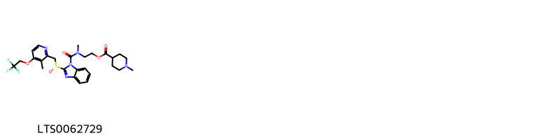
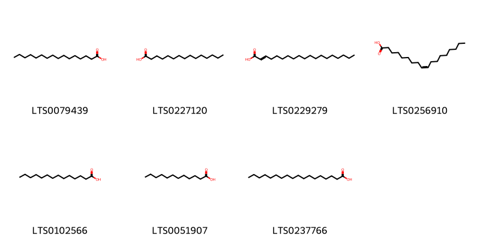
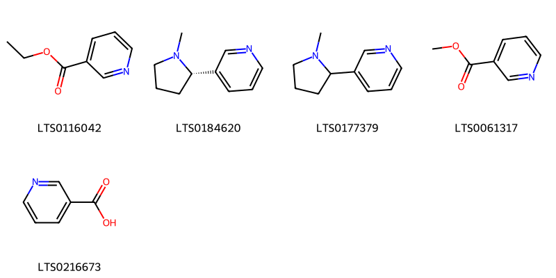

!!! abstract "Tóm tắt"
    Hạt cau (Semen Arecae catechi) là hạt đã phơi hay sấy khô lấy từ quả chín của cây Cau (Areca catechu L.), họ Cau (Arecaceae). Cây được trồng ở khắp nơi trong nước ta để lấy quả ăn trầu và xuất cảng. Hạt cau thường được dùng làm thuốc chữa giun sán cho súc vật như chó hay có thể chữa giun sán cho người bằng cách phối hợp với hạt bí ngô. Dùng hạt cau khô mỗi ngày 0,5 đến 4g giúp tiêu hóa, chữa viêm ruột, lỵ. Mài hạt cau thành bột phơi khô hòa với dầu bôi lên giúp chữa trẻ con chốc đầu. Nhân dân còn dùng hạt phối hợp với thường sơn, thảo quả chữa sốt rét. Hạt cau có chứa alkaloid (như arecolin), giúp kích thích tiết nước bọt và dịch vị, hỗ trợ tiêu hóa. Dung dịch hạt cau có tác dụng độc đối với thần kinh của sán, làm cho tê bại các cơ trơn của sán và không bám vào thành ruột được nữa. Dung dịch 1% arecolin bromhydrat làm co nhỏ đồng tử có thể dùng làm giảm áp nhãn trong bệnh glôcôm.  Areclin còn làm tim đập chậm trừ khi có mặt của canxi, tăng nhu động ruột, liều nhỏ kích thích thần kinh, liều lớn gây liệt thần kinh. Trong hạt non có tỷ lệ tanin khoảng 70% nhưng khi chín chỉ còn 15-20%. Hoạt chất chính là 4 alkaloid: Arecolin, guvacolin , arecaidin , guvaxin

## Thông tin về thực vật

### Đặc điểm thực vật

Dược liệu **Cau (Hạt)** từ bộ phận **Hạt** từ loài *Areca catechu L.* thuộc họ Arecaceae. Cây cau là một cây có thân mọc thẳng cao chừng 15-20m, đường kính 10-15cm. Toàn thân không có lá mà có nhiều vết lá cũ mọc, chỉ ở ngọn có một chùm lá to rộng xẻ lông chim. Lá có bẹ to. Mo ở bông mo sớm rụng. Trong cụm hoa hoa đực ở trên, hoa cái ở dưới. Hoa đực nhỏ màu trắng, thơm gồm 3 lá đài màu lục, 3 cánh hoa trắng, 6 nhị. Hoa cái to, bao hoa không phân hóa. Noãn sào thượng 3 ô. Quả hạch hình trứng to bằng quả trứng gà. Quả bì có sợi, hạt có nội nhũ xếp cuốn. Hạt hơi hình nón cụt, đầu tròn giữa dáy hơi lõm, màu nâu nhạt, vị chát. 

!!! info "Phân loại thực vật của *Areca catechu*"
    - **Kingdom:** Plantae
    - **Phylum:** Tracheophyta
    - **Order:** Arecales
    - **Family:** Arecaceae
    - **Genus:** Areca
    - **Species:** *Areca catechu*

*Tài liệu tham khảo:* "Những cây thuốc và vị thuốc Việt Nam" - Đỗ Tất Lợi

 

### Loài thay thế (Nếu có)

### Phân bố trên thế giới
**Từ vườn thực vật KEW: **: Native to:
Philippines

Introduced into:
Andaman Is., Bangladesh, Bismarck Archipelago, Borneo, Cambodia, Caroline Is., China South-Central, Comoros, Dominican Republic, East Himalaya, Fiji, Guinea, Hainan, Haiti, India, Jamaica, Jawa, Laos, Leeward Is., Lesser Sunda Is., Malaya, Maldives, Maluku, Marianas, New Guinea, Nicobar Is., Puerto Rico, Santa Cruz Is., Society Is., Solomon Is., Sri Lanka, Sulawesi, Sumatera, Taiwan, Thailand, Trinidad-Tobago, Vanuatu, Vietnam

**Từ CSDL GIBF** Grenada, nan, Myanmar, Puerto Rico, Cambodia, Madagascar, Malaysia, Thailand, Bhutan, Papua New Guinea, Singapore, Indonesia, Maldives, India, Comoros, Costa Rica, Solomon Islands, Seychelles, Micronesia (Federated States of), Colombia, French Polynesia, China, Mayotte, Palau, Fiji, South Africa, Philippines, Dominican Republic, Trinidad and Tobago, Guam, Viet Nam, Bangladesh, United States of America, Chinese Taipei, Timor-Leste, Sri Lanka

### Phân bố tại Việt Nam
** "Những cây thuốc và vị thuốc Việt Nam" - Đỗ Tất Lợi**: Được trồng ở khắp nơi trong nước ta. Miền Bắc Việt Nam chủ yếu là Hải Hưng, sau đến Kiến An, Quảng Ninh và cuối cùng đến Nam Hà, Thái Bình. Tại miền Nam trồng nhiều ở Mỹ Tho, Bến Tre, Rạch Giá, Cần Thơ,..

**Từ CSDL GIBF**: Gia Lai, Hà Nội

---

## Thông tin về dược liệu 

### Định danh

!!! info "Thông tin về tên gọi của cau"
    - Dược liệu tiếng Việt: cau
    - Dược liệu tiếng Trung: 槟榔 (Bing Lang)
    - Dược liệu tiếng Anh: Areca Catechu
    - Dược liệu latin thông dụng: Semen Arecae catechinArecae Semen
    - Dược liệu latin kiểu DĐVN: semen arecae catechi
    - Dược liệu latin kiểu DĐVN: Arecae Semen
    - Dược liệu latin kiểu thông tư: 
    - Bộ phận dùng: Hạt (Semen)

### Mô tả dược liệu 
- **Theo dược điển Việt nam V:** 

- **Mô tả dược liệu theo thông tư chế biến dược liệu theo phương pháp cổ truyền:** 

### Chế biến 

- **Chế biến theo dược điển việt nam V**: 

- **Chế biến theo thông tư:** 

--- 

## Thành phần hóa học

- Theo tài liệu của GS. Đỗ Tất Lợi:  (1) Tỷ lệ tanin trong hạt cau khoảng  chừng 70% nhưng khi chín chỉ còn 15-20%.
Hoạt chất chính là 4 ancaloit: Arecolin C3H13NO2, guvacolin C7H11NO2, arecaidin C7H11NO2, guvaxin C6H9NO2.
Ngoài ra còn chất mỡ (14%) với thành phần chủ yếu gồm: myristin 1/5, olein 1/4, laurin 1/2, các chất đường: sacaroza, mannan, galactan 2% và muối vò cơ.
(2) Trong dược điển Hồng Kông, hoạt chất chính của hạt cau là Arecolin
    
- Theo cơ sở dữ liệu lotus: Từ loài *Areca catechu* đã phân lập và xác định được 65 hoạt chất thuộc về các nhóm Harmala alkaloids, Pyridines and derivatives, Benzimidazoles, Fatty Acyls, Piperidines, Carboxylic acids and derivatives, Indoles and derivatives, Flavonoids. 

|    | chemicalTaxonomyClassyfireClass   |   smiles_count |
|---:|:----------------------------------|---------------:|
|  0 |                                   |              5 |
|  1 | Benzimidazoles                    |              1 |
|  2 | Carboxylic acids and derivatives  |             19 |
|  3 | Fatty Acyls                       |              7 |
|  4 | Flavonoids                        |             19 |
|  5 | Harmala alkaloids                 |              2 |
|  6 | Indoles and derivatives           |              2 |
|  7 | Piperidines                       |              5 |
|  8 | Pyridines and derivatives         |              5 |

### Nhóm 
<figure markdown="span">
    { width=100% }
    <figcaption>Hình ảnh cấu trúc hóa học của 5 hoạt chất thuộc nhóm  gồm ['ethyl 1-methyl-5,6-dihydro-2h-pyridine-3-carboxylate (LTS0084130)', 'guvacine (LTS0119984)', 'arecoline (LTS0116578)', 'arecaidine (LTS0048904)', 'guvacoline (LTS0003782)'].</figcaption>
</figure>
### Nhóm Benzimidazoles
<figure markdown="span">
    { width=100% }
    <figcaption>Hình ảnh cấu trúc hóa học của 1 hoạt chất thuộc nhóm Benzimidazoles gồm ['2-[methyl(2-[(r)-[3-methyl-4-(2,2,2-trifluoroethoxy)pyridin-2-yl]methanesulfinyl]-1,3-benzodiazole-1-carbonyl)amino]ethyl 1-methylpiperidine-4-carboxylate (LTS0062729)'].</figcaption>
</figure>
### Nhóm Carboxylic acids and derivatives
<figure markdown="span">
    { width=100% }
    <figcaption>Hình ảnh cấu trúc hóa học của 19 hoạt chất thuộc nhóm Carboxylic acids and derivatives gồm ['l-threonine (LTS0184056)', 'l-serine (LTS0106692)', 'l-alanine (LTS0042208)', 'l-lysine (LTS0068734)', 'd-methionine (LTS0108782)', 'l-aspartic acid (LTS0205466)', 'l-proline (LTS0090383)', 'd-phenylalanine (LTS0048920)', 'l-methionine (LTS0196746)', 'l-isoleucine (LTS0249538)', '(2s)-2-(phenylamino)propanoic acid (LTS0199539)', 'l-valine (LTS0231703)', 'd-aspartic acid (LTS0144001)', 'd-alanine (LTS0272178)', 'l-glutamic acid (LTS0037133)', 'l-arginine (LTS0064737)', 'l-tyrosine (LTS0029981)', 'l-leucine (LTS0113423)', 'l-histidine (LTS0094081)'].</figcaption>
</figure>
### Nhóm Fatty Acyls
<figure markdown="span">
    { width=100% }
    <figcaption>Hình ảnh cấu trúc hóa học của 7 hoạt chất thuộc nhóm Fatty Acyls gồm ['palmitic acid (LTS0079439)', 'pentadecanoic acid (LTS0227120)', 'nonadec-2-enoic acid (LTS0229279)', 'oleic acid (LTS0256910)', 'myristic acid (LTS0102566)', 'lauric acid (LTS0051907)', 'stearic acid (LTS0237766)'].</figcaption>
</figure>
### Nhóm Flavonoids
<figure markdown="span">
    { width=100% }
    <figcaption>Hình ảnh cấu trúc hóa học của 19 hoạt chất thuộc nhóm Flavonoids gồm ['(+)-catechol (LTS0117079)', '2-(3,4-dihydroxyphenyl)-8-[2-(3,4-dihydroxyphenyl)-3,5,7-trihydroxy-3,4-dihydro-2h-1-benzopyran-4-yl]-4-[2-(3,4-dihydroxyphenyl)-4-[2-(3,4-dihydroxyphenyl)-3,5,7-trihydroxy-3,4-dihydro-2h-1-benzopyran-8-yl]-3,5,7-trihydroxy-3,4-dihydro-2h-1-benzopyran-8-yl]-3,4-dihydro-2h-1-benzopyran-3,5,7-triol (LTS0039604)', 'arecatannin b1 (LTS0091361)', '2-(3,4-dihydroxyphenyl)-4-[2-(3,4-dihydroxyphenyl)-3,5,7-trihydroxy-3,4-dihydro-2h-1-benzopyran-6-yl]-3,4-dihydro-2h-1-benzopyran-3,5,7-triol (LTS0072400)', '(2r,3r,4s)-2-(3,4-dihydroxyphenyl)-4-[(2r,3s)-2-(3,4-dihydroxyphenyl)-3,5,7-trihydroxy-3,4-dihydro-2h-1-benzopyran-6-yl]-3,4-dihydro-2h-1-benzopyran-3,5,7-triol (LTS0105674)', '(2r,3r,4r)-2-(3,4-dihydroxyphenyl)-8-[(2r,3r,4r)-2-(3,4-dihydroxyphenyl)-3,5,7-trihydroxy-3,4-dihydro-2h-1-benzopyran-4-yl]-4-[(2r,3r,4s)-2-(3,4-dihydroxyphenyl)-4-[(2r,3s)-2-(3,4-dihydroxyphenyl)-3,5,7-trihydroxy-3,4-dihydro-2h-1-benzopyran-6-yl]-3,5,7-trihydroxy-3,4-dihydro-2h-1-benzopyran-8-yl]-3,4-dihydro-2h-1-benzopyran-3,5,7-triol (LTS0037836)', '(2r,3s,4s)-2-(3,4-dihydroxyphenyl)-4-[(2r,3r)-2-(3,4-dihydroxyphenyl)-3,5,7-trihydroxy-3,4-dihydro-2h-1-benzopyran-8-yl]-3,4-dihydro-2h-1-benzopyran-3,5,7-triol (LTS0116257)', '2-(3,4-dihydroxyphenyl)-8-[2-(3,4-dihydroxyphenyl)-3,5,7-trihydroxy-3,4-dihydro-2h-1-benzopyran-4-yl]-4-[2-(3,4-dihydroxyphenyl)-4-[2-(3,4-dihydroxyphenyl)-3,5,7-trihydroxy-3,4-dihydro-2h-1-benzopyran-6-yl]-3,5,7-trihydroxy-3,4-dihydro-2h-1-benzopyran-8-yl]-3,4-dihydro-2h-1-benzopyran-3,5,7-triol (LTS0039478)', '(2r,3r,4r)-2-(3,4-dihydroxyphenyl)-8-[(2r,3r,4r)-2-(3,4-dihydroxyphenyl)-3,5,7-trihydroxy-3,4-dihydro-2h-1-benzopyran-4-yl]-4-[(2r,3r,4s)-2-(3,4-dihydroxyphenyl)-4-[(2r,3s)-2-(3,4-dihydroxyphenyl)-3,5,7-trihydroxy-3,4-dihydro-2h-1-benzopyran-8-yl]-3,5,7-trihydroxy-3,4-dihydro-2h-1-benzopyran-8-yl]-3,4-dihydro-2h-1-benzopyran-3,5,7-triol (LTS0111899)', '(2r,3r,4r)-2-(3,4-dihydroxyphenyl)-4-[(2r,3r)-2-(3,4-dihydroxyphenyl)-3,5,7-trihydroxy-3,4-dihydro-2h-1-benzopyran-8-yl]-3,4-dihydro-2h-1-benzopyran-3,5,7-triol (LTS0135510)', 'arecatannin b1 (LTS0143493)', '(2r,3r)-2-(3,4-dihydroxyphenyl)-4-[(2r,3r)-2-(3,4-dihydroxyphenyl)-3,5,7-trihydroxy-3,4-dihydro-2h-1-benzopyran-8-yl]-3,4-dihydro-2h-1-benzopyran-3,5,7-triol (LTS0097406)', 'procyanidin c2 (LTS0226053)', 'procyanidin c1 (LTS0260445)', '2-(3,4-dihydroxyphenyl)-4-[2-(3,4-dihydroxyphenyl)-3,5,7-trihydroxy-3,4-dihydro-2h-1-benzopyran-8-yl]-3,4-dihydro-2h-1-benzopyran-3,5,7-triol (LTS0040252)', '(2r,3r,4r)-2-(3,4-dihydroxyphenyl)-4-[(2r,3s)-2-(3,4-dihydroxyphenyl)-3,5,7-trihydroxy-3,4-dihydro-2h-1-benzopyran-8-yl]-3,4-dihydro-2h-1-benzopyran-3,5,7-triol (LTS0066122)', '(2r,3r,4s)-2-(3,4-dihydroxyphenyl)-8-[(2r,3r,4r)-2-(3,4-dihydroxyphenyl)-3,5,7-trihydroxy-3,4-dihydro-2h-1-benzopyran-4-yl]-4-[(2r,3s)-2-(3,4-dihydroxyphenyl)-3,5,7-trihydroxy-3,4-dihydro-2h-1-benzopyran-8-yl]-3,4-dihydro-2h-1-benzopyran-3,5,7-triol (LTS0027230)', 'catechol (LTS0090912)', 'ent-epicatechin (LTS0265245)'].</figcaption>
</figure>
### Nhóm Harmala alkaloids
<figure markdown="span">
    { width=100% }
    <figcaption>Hình ảnh cấu trúc hóa học của 2 hoạt chất thuộc nhóm Harmala alkaloids gồm ['harmane (LTS0068205)', '1-methyl-3h,4h,9h-pyrido[3,4-b]indole (LTS0027115)'].</figcaption>
</figure>
### Nhóm Indoles and derivatives
<figure markdown="span">
    { width=100% }
    <figcaption>Hình ảnh cấu trúc hóa học của 2 hoạt chất thuộc nhóm Indoles and derivatives gồm ['l-tryptophan (LTS0263809)', 'β-carboline (LTS0263207)'].</figcaption>
</figure>
### Nhóm Piperidines
<figure markdown="span">
    { width=100% }
    <figcaption>Hình ảnh cấu trúc hóa học của 5 hoạt chất thuộc nhóm Piperidines gồm ['ethyl 1-methylpiperidine-3-carboxylate (LTS0082807)', 'ethyl (3s)-1-methylpiperidine-3-carboxylate (LTS0123043)', '1-methylpiperidine-3-carboxylic acid (LTS0221482)', 'methyl n-methylnipecotate (LTS0024921)', 'methyl (3s)-1-methylpiperidine-3-carboxylate (LTS0074657)'].</figcaption>
</figure>
### Nhóm Pyridines and derivatives
<figure markdown="span">
    { width=100% }
    <figcaption>Hình ảnh cấu trúc hóa học của 5 hoạt chất thuộc nhóm Pyridines and derivatives gồm ['ethyl nicotinate (LTS0116042)', '(-)-nicotine (LTS0184620)', 'nicotine (LTS0177379)', 'heat spray (LTS0061317)', 'niacin (LTS0216673)'].</figcaption>
</figure>

---

## Tác dụng dược lý

Theo tài liệu "Những cây thuốc và vị thuốc Việt Nam" - Đỗ Tất Lợi:- Arecolin gây chảy nước bọt rất nhiều. Nó còn làm tăng bài tiết dịch vị, dịch tràng và làm co nhỏ đồng tử.
- Dung dịch 1% arecolin bromhydrat làm co nhỏ đồng tử sau khi nhỏ từ 3 đến 5 phút. Sự co
nhỏ đồng tử kéo dài từ nửa giờ đến 2 giờ. Có thể dùng làm giảm áp nhãn trong bệnh glôcôm.
- Areclin còn làm tim đập chậm trừ khi có mặt của canxi, tăng nhu động ruột, liều nhỏ kích thích thần kinh, liều lớn gây liệt thần kinh.
- Dung dịch hạt cau có tác dụng độc đối với thần kinh của sán, làm cho tê bại các cơ trơn của sán, 20 phút sau khi thuốc vào tới ruột, con sán bị tê liệt và không bám vào thành ruột được nữa. Alkaloid trong hạt cau làm tăng co bóp ruột, giúp loại bỏ giun ra khỏi cơ thể.

Theo tài liệu quốc tế: 1. To kill parasites; 2. To promote qi circulation; 3. To promote water metabolism

---

## Dược điển Việt Nam V

### Soi bột:

<!-- Hình ảnh soi bột sẽ được tự động chèn vào đây sau -->
### Vi phẫu:

<!-- Hình ảnh vi phẫu sẽ được tự động chèn vào đây sau -->
### Định tính

### Định lượng

### Thông tin khác 
- ** Độ ẩm: ** 

- ** Bảo quản:** 
## Dược điển Hồng kong

<!-- PDF sẽ được tự động chèn vào đây sau -->

---

## Y dược học cổ truyền

- **Tên vị thuốc:** 
- **Tính vị quy kinh:** Tân, khô, ôn. Vào kinh vị, đại tràng.
- **Công năng chủ trị:** Binh lang: Sát trùng, tiêu tích, hành khí, thông tiện, lợi thủy. Chủ trị: Trừ sán dây, giun đũa, sán xơ mít, trùng tích, phúc thong, tích trộ, tả lỵ, thủy thũng, cước khí, sốt rét.
Binh lang sao đen: Tiêu thực, đạo trệ. Chủ tri: ăn vào không tiêu sau tả lỵ nặng.
- **Chú ý:** 
- **Kiêng kỵ:** 

