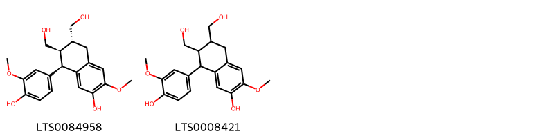
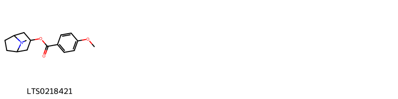
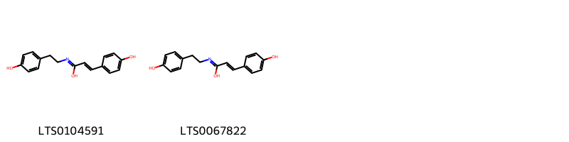
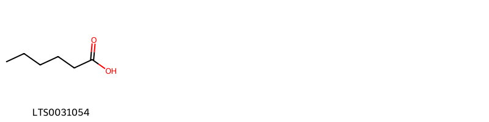
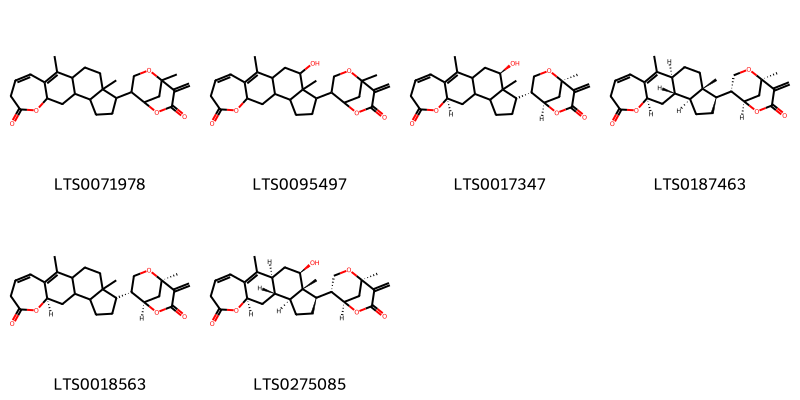

!!! abstract "Tóm tắt"
    Cà độc dược, tên khoa học Datura metel L, họ Cà (Solanaceae). Bộ phận dùng làm dược liệu là lá, tên khoa học của dược liệu là Folium Daturae metelis
 Phân bố tại các vùng châu mỹ, châu phi, nam châu á và 1 số vùng khác trên thế giới. Tại Việt Nam Cây mọc hoang và được trồng khắp nơi để làm cảnh và làm thuốc. Thường mọc hoang ở những nơi đất hoang, đất mùn, hơi ẩm. Nhiều nhất ở Vĩnh Phúc, Phú Thọ, Thanh Hóa, Nghệ An, Hà Tĩnh. 
Theo tài liệu cổ cà độc dược vị cay, tính ôn có độc, vào kinh phế. Có tác dụng khử phong thấp, chữa hen xuyễn. Nước sắc dùng rửa những nơi da tê dại, hàn thấp, cước khí, uống trong dùng chữa kinh sợ, cuộn thành thuốc lá hút chữa họ do hàn. Những người thể lực yếu không dùng được. 
Tác dụng của cà độc dược là tác dụng của hyoxin và của atropin.
1. Atropin làm cơ vòng của mắt dãn ra, nên đồng tử dãn. Nhãn cầu dẹt lại, áp lực mắt tăng lên. Sự tiết nước bọt, mồ hôi, dịch vị, dịch ruột ngừng lại.
Làm nở khí đạo khi khí đạo bị co thắt và phó giao cảm bị kích thích. Lúc bình thường, atropin không tác dụng. Ít tác động trên nhu động ruột và co thắt ruột.
Liều độc atropin tác động lên não làm say có khi phát điên, hô hấp tăng, sốt, cuối cùng thần kinh trung ương bị ức chế và tê liệt.
2. Tác dụng của hyoxin gần giống atropin, nhưng làm giãn đồng tử trong thời gian ngắn hơn. Khác với atropin, là khi ngộ độc thì hyoxin ức chế thần kinh nhiều hơn là kích thích. Vì vậy hyoxin được dùng ở khoa thần kinh để chữa cơn co giật của bệnh Pakinxon, phối hợp với atrpin để chống say phi cơ hoặc tàu thủy, làm thuốc dịu thần kinh.
Thành phần hóa học: Trong lá, hoa, hạt và rễ cà độc dược có chứa chất hyoxin hay scopolamin C17H21NO4. Ngoài ra còn có hyoxyamin và atropin C17H21NO3 (atropin=dI. hyoxyamin).

## Thông tin về thực vật

### Đặc điểm thực vật

Dược liệu **Cà Độc Dược (Lá)** từ bộ phận **nan** từ loài *Datura metel L.* thuộc họ Solanaceae. Các dạng cà độc dược đều là những cây loại cỏ nhỏ, mọc hàng năm, cao từ 1-2m. Toàn thân gần như nhẵn, có nhiều bì khổng. Cành non và các bộ phận non có nhiều lông tơ ngắn. Thân cây có màu xanh, hoặc màu tím, tùy theo dạng. Lá đơn, mọc cách, nhưng gần đầu cành trông như mọc đối hay mọc vòng. Phiến lá hình trứng dài 9-10cm, rộng từ 4-9 cm, ngọn lá nhọn, phía đáy lá hơi hẹp lại. Hai bên của đáy lá không đều nhau. Mép lá ít khi nguyên, thường lượn sống hay hơi xẻ răng cưa (độ 3-4 răng cưa). Mặt lá màu xanh xám, mặt dưới màu xanh nhạt, gân chính và phụ màu xanh, hoặc tím tùy theo dạng. Cuống lá dài 4-8cm. Mặt lá lúc non có nhiều lông, sau rụng dần. Hoa đơn mọc ở kẽ lá, cuống lá dài 1-2cm. Khi hoa héo, một phần còn lại trưởng thành với quả giống hình cái mâm. Loại hoa tím có đốm tím ở trên. Quả hình cầu mặt ngoài có gai, đường kính chừng 3cm, khi non có màu xanh, khi chín có màu nâu. Quả khi già, nứt theo 3-4 đường hay nứt lung tung ở phía trên. Hạt rất nhiều, hình trứng, dẹt, màu vàng đen, dài 3-5mm, dày 1mm. Ở cạnh có những vẫn nổi lên. 

!!! info "Phân loại thực vật của *Datura metel*"
    - **Kingdom:** Plantae
    - **Phylum:** Tracheophyta
    - **Order:** Solanales
    - **Family:** Solanaceae
    - **Genus:** Datura
    - **Species:** *Datura metel*

*Tài liệu tham khảo:* "Những cây thuốc và vị thuốc Việt Nam" - Đỗ Tất Lợi

 

### Loài thay thế (Nếu có)

### Phân bố trên thế giới
**Từ vườn thực vật KEW: **: Native to:
Colombia, Costa Rica, Honduras, Mexico Central, Mexico Northeast, Mexico Southeast, Mexico Southwest, Panamá, Texas

Introduced into:
Afghanistan, Aldabra, Algeria, Andaman Is., Angola, Aruba, Assam, Bahamas, Bangladesh, Benin, Bismarck Archipelago, Bolivia, Botswana, Brazil Northeast, Cambodia, Cameroon, Canary Is., Cape Verde, Caroline Is., Central African Republic, Chad, China South-Central, China Southeast, Christmas I., Comoros, Cook Is., Cuba, Dominican Republic, East Himalaya, Egypt, Equatorial Guinea, Ethiopia, Fiji, Florida, Gambia, Germany, Ghana, Gilbert Is., Guinea, Guinea-Bissau, Gulf of Guinea Is., Gulf States, Hainan, Haiti, Hawaii, India, Ivory Coast, Jamaica, Jawa, Kenya, Korea, KwaZulu-Natal, Laccadive Is., Laos, Lebanon-Syria, Leeward Is., Lesser Sunda Is., Libya, Madagascar, Madeira, Malawi, Maldives, Mali, Marianas, Mauritania, Mauritius, Morocco, Mozambique, Myanmar, Nepal, Netherlands Antilles, New Caledonia, New Guinea, New South Wales, New York, Nicobar Is., Nigeria, Niue, Northern Provinces, Northern Territory, Oman, Pakistan, Philippines, Puerto Rico, Queensland, Rodrigues, Réunion, Sardegna, Saudi Arabia, Senegal, Seychelles, Sierra Leone, Sinai, Society Is., Socotra, Somalia, South Australia, South China Sea, South European Russia, Sri Lanka, Sudan, Sulawesi, Taiwan, Tanzania, Thailand, Trinidad-Tobago, Tuamotu, Tubuai Is., Tunisia, Turkey, Uganda, Vanuatu, Venezuela, Venezuelan Antilles, Vietnam, West Himalaya, Western Australia, Windward Is., Yemen, Zaïre, Zimbabwe

**Từ CSDL GIBF** nan, Spain, Belize, Nigeria, Paraguay, Malaysia, Bhutan, Thailand, Bolivia (Plurinational State of), Malawi, Brazil, Honduras, Indonesia, Hong Kong, Vanuatu, Uganda, India, Argentina, Mexico, Panama, Greece, Saint Lucia, Colombia, Ecuador, China, Türkiye, Japan, Peru, Sierra Leone, El Salvador, Mozambique, Philippines, Bonaire, Sint Eustatius and Saba, South Africa, Sao Tome and Principe, Trinidad and Tobago, Nepal, Viet Nam, Bermuda, United States of America, Bangladesh, Chinese Taipei, Benin, Timor-Leste, Canada, Sri Lanka, Tonga

### Phân bố tại Việt Nam
** "Những cây thuốc và vị thuốc Việt Nam" - Đỗ Tất Lợi**: Cây mọc hoang và được trồng khắp nơi ở Việt Nam, Cămpuchia, Lào để làm cảnh và làm thuốc. Thường mọc hoang ở những nơi đất hoang, đất mùn, hơi ẩm. Nhiều nhất ở Vĩnh Phúc, Phú Thọ, Thanh Hóa, Nghệ An, Hà Tĩnh.

**Từ CSDL GIBF**: Quảng Ngãi, Nam Định

---

## Thông tin về dược liệu 

### Định danh

!!! info "Thông tin về tên gọi của nan"
    - Dược liệu tiếng Việt: nan
    - Dược liệu tiếng Trung: nan (nan)
    - Dược liệu tiếng Anh: nan
    - Dược liệu latin thông dụng: nan
    - Dược liệu latin kiểu DĐVN: folium daturae metelis
    - Dược liệu latin kiểu DĐVN: nan
    - Dược liệu latin kiểu thông tư: nan
    - Bộ phận dùng: nan (nan)

### Mô tả dược liệu 
- **Theo dược điển Việt nam V:** nan

- **Mô tả dược liệu theo thông tư chế biến dược liệu theo phương pháp cổ truyền:** nan

### Chế biến 

- **Chế biến theo dược điển việt nam V**: nan

- **Chế biến theo thông tư:** nan

--- 

## Thành phần hóa học

- Theo tài liệu của GS. Đỗ Tất Lợi:  nhóm hóa học: Atropin, scopolamin, hyoxyamin
biomaker:
    
- Theo cơ sở dữ liệu lotus: Từ loài *Datura metel* đã phân lập và xác định được 149 hoạt chất thuộc về các nhóm Hydroxy acids and derivatives, Pyridines and derivatives, Lactones, Saccharolipids, Tropane alkaloids, Steroids and steroid derivatives, Prenol lipids, Benzene and substituted derivatives, Fatty Acyls, Sphingolipids, Aryltetralin lignans, Cinnamic acids and derivatives. 

|    | chemicalTaxonomyClassyfireClass     |   smiles_count |
|---:|:------------------------------------|---------------:|
|  0 | Aryltetralin lignans                |              2 |
|  1 | Benzene and substituted derivatives |              1 |
|  2 | Cinnamic acids and derivatives      |              2 |
|  3 | Fatty Acyls                         |              1 |
|  4 | Hydroxy acids and derivatives       |              3 |
|  5 | Lactones                            |              6 |
|  6 | Prenol lipids                       |              1 |
|  7 | Pyridines and derivatives           |              1 |
|  8 | Saccharolipids                      |              4 |
|  9 | Sphingolipids                       |              2 |
| 10 | Steroids and steroid derivatives    |            115 |
| 11 | Tropane alkaloids                   |             11 |

### Nhóm Aryltetralin lignans
<figure markdown="span">
    { width=100% }
    <figcaption>Hình ảnh cấu trúc hóa học của 2 hoạt chất thuộc nhóm Aryltetralin lignans gồm ['(6r,7r,8r)-8-(4-hydroxy-3-methoxyphenyl)-6,7-bis(hydroxymethyl)-3-methoxy-5,6,7,8-tetrahydronaphthalen-2-ol (LTS0084958)', '8-(4-hydroxy-3-methoxyphenyl)-6,7-bis(hydroxymethyl)-3-methoxy-5,6,7,8-tetrahydronaphthalen-2-ol (LTS0008421)'].</figcaption>
</figure>
### Nhóm Benzene and substituted derivatives
<figure markdown="span">
    { width=100% }
    <figcaption>Hình ảnh cấu trúc hóa học của 1 hoạt chất thuộc nhóm Benzene and substituted derivatives gồm ['8-methyl-8-azabicyclo[3.2.1]octan-3-yl 4-methoxybenzoate (LTS0218421)'].</figcaption>
</figure>
### Nhóm Cinnamic acids and derivatives
<figure markdown="span">
    { width=100% }
    <figcaption>Hình ảnh cấu trúc hóa học của 2 hoạt chất thuộc nhóm Cinnamic acids and derivatives gồm ['3-(4-hydroxyphenyl)-n-[2-(4-hydroxyphenyl)ethyl]prop-2-enimidic acid (LTS0104591)', '(2e)-3-(4-hydroxyphenyl)-n-[2-(4-hydroxyphenyl)ethyl]prop-2-enimidic acid (LTS0067822)'].</figcaption>
</figure>
### Nhóm Fatty Acyls
<figure markdown="span">
    { width=100% }
    <figcaption>Hình ảnh cấu trúc hóa học của 1 hoạt chất thuộc nhóm Fatty Acyls gồm ['hexanoic acid (LTS0031054)'].</figcaption>
</figure>
### Nhóm Hydroxy acids and derivatives
<figure markdown="span">
    { width=100% }
    <figcaption>Hình ảnh cấu trúc hóa học của 3 hoạt chất thuộc nhóm Hydroxy acids and derivatives gồm ['scopolamine (LTS0172796)', '(2r,4s)-9-methyl-3-oxa-9-azatricyclo[3.3.1.0²,⁴]nonan-7-yl (2r)-3-hydroxy-2-phenylpropanoate (LTS0204987)', 'buscopan (LTS0213778)'].</figcaption>
</figure>
### Nhóm Lactones
<figure markdown="span">
    { width=100% }
    <figcaption>Hình ảnh cấu trúc hóa học của 6 hoạt chất thuộc nhóm Lactones gồm ['2,16-dimethyl-15-{1-methyl-8-methylidene-7-oxo-2,6-dioxabicyclo[3.3.1]nonan-4-yl}-8-oxatetracyclo[9.7.0.0³,⁹.0¹²,¹⁶]octadeca-2,4-dien-7-one (LTS0071978)', '17-hydroxy-2,16-dimethyl-15-{1-methyl-8-methylidene-7-oxo-2,6-dioxabicyclo[3.3.1]nonan-4-yl}-8-oxatetracyclo[9.7.0.0³,⁹.0¹²,¹⁶]octadeca-2,4-dien-7-one (LTS0095497)', '(9r,17r)-17-hydroxy-2,16-dimethyl-15-[(1r,4r,5r)-1-methyl-8-methylidene-7-oxo-2,6-dioxabicyclo[3.3.1]nonan-4-yl]-8-oxatetracyclo[9.7.0.0³,⁹.0¹²,¹⁶]octadeca-2,4-dien-7-one (LTS0017347)', '(1s,9r,11s,12s,15r,16s)-2,16-dimethyl-15-[(1r,4r,5r)-1-methyl-8-methylidene-7-oxo-2,6-dioxabicyclo[3.3.1]nonan-4-yl]-8-oxatetracyclo[9.7.0.0³,⁹.0¹²,¹⁶]octadeca-2,4-dien-7-one (LTS0187463)', '(9r)-2,16-dimethyl-15-[(1r,4r,5r)-1-methyl-8-methylidene-7-oxo-2,6-dioxabicyclo[3.3.1]nonan-4-yl]-8-oxatetracyclo[9.7.0.0³,⁹.0¹²,¹⁶]octadeca-2,4-dien-7-one (LTS0018563)', '(1s,9r,11r,12s,15r,16s,17r)-17-hydroxy-2,16-dimethyl-15-[(1r,4r,5r)-1-methyl-8-methylidene-7-oxo-2,6-dioxabicyclo[3.3.1]nonan-4-yl]-8-oxatetracyclo[9.7.0.0³,⁹.0¹²,¹⁶]octadeca-2,4-dien-7-one (LTS0275085)'].</figcaption>
</figure>
### Nhóm Prenol lipids
<figure markdown="span">
    { width=100% }
    <figcaption>Hình ảnh cấu trúc hóa học của 1 hoạt chất thuộc nhóm Prenol lipids gồm ['(3s,4ar,5r,6ar,6bs,8ar,12ar,14ar,14br)-4,4,6a,6b,8a,11,11,14b-octamethyl-1,2,3,4a,5,6,7,8,9,10,12,12a,14,14a-tetradecahydropicene-3,5-diol (LTS0210837)'].</figcaption>
</figure>
### Nhóm Pyridines and derivatives
<figure markdown="span">
    { width=100% }
    <figcaption>Hình ảnh cấu trúc hóa học của 1 hoạt chất thuộc nhóm Pyridines and derivatives gồm ['niacin (LTS0216673)'].</figcaption>
</figure>
### Nhóm Saccharolipids
<figure markdown="span">
    { width=100% }
    <figcaption>Hình ảnh cấu trúc hóa học của 4 hoạt chất thuộc nhóm Saccharolipids gồm ['(2s,3r,4s,5r,6r)-4-(hexanoyloxy)-2,5-dihydroxy-6-(hydroxymethyl)oxan-3-yl hexanoate (LTS0195089)', '(2r,3r,4s,5r,6r)-3,4-bis(hexanoyloxy)-5-hydroxy-6-(hydroxymethyl)oxan-2-yl hexanoate (LTS0242481)', '3-(hexanoyloxy)-2,5-dihydroxy-6-(hydroxymethyl)oxan-4-yl hexanoate (LTS0253573)', '2,3-bis(hexanoyloxy)-5-hydroxy-6-(hydroxymethyl)oxan-4-yl hexanoate (LTS0064285)'].</figcaption>
</figure>
### Nhóm Sphingolipids
<figure markdown="span">
    { width=100% }
    <figcaption>Hình ảnh cấu trúc hóa học của 2 hoạt chất thuộc nhóm Sphingolipids gồm ['(2r)-2-hydroxy-n-[(2s,3r,4e,8z)-3-hydroxy-1-{[(2r,3r,4s,5s,6r)-3,4,5-trihydroxy-6-(hydroxymethyl)oxan-2-yl]oxy}octadeca-4,8-dien-2-yl]hexadecanimidic acid (LTS0070116)', '2-hydroxy-n-(3-hydroxy-1-{[3,4,5-trihydroxy-6-(hydroxymethyl)oxan-2-yl]oxy}octadeca-4,8-dien-2-yl)hexadecanimidic acid (LTS0121977)'].</figcaption>
</figure>
### Nhóm Steroids and steroid derivatives
<figure markdown="span">
    { width=100% }
    <figcaption>Hình ảnh cấu trúc hóa học của 115 hoạt chất thuộc nhóm Steroids and steroid derivatives gồm ['8-{9a,11a-dimethyl-9-oxo-1h,2h,3h,3ah,3bh,4h,6h,9bh,10h,11h-cyclopenta[a]phenanthren-1-yl}-5-methyl-4-methylidene-2,6-dioxabicyclo[3.3.1]nonan-3-one (LTS0049042)', '(1r,5s,8r)-8-[(1r,3as,3bs,9ar,9bs,11as)-9a,11a-dimethyl-9-oxo-1h,2h,3h,3ah,3bh,4h,6h,9bh,10h,11h-cyclopenta[a]phenanthren-1-yl]-5-methyl-4-methylidene-2,6-dioxabicyclo[3.3.1]nonan-3-one (LTS0039904)', '(1r,5r,8r)-8-[(1r,3as,3bs,9ar,9bs,11as)-9a,11a-dimethyl-9-oxo-1h,2h,3h,3ah,3bh,4h,6h,9bh,10h,11h-cyclopenta[a]phenanthren-1-yl]-5-methyl-4-methylidene-2,6-dioxabicyclo[3.3.1]nonan-3-one (LTS0243447)', '15-[1-(4,5-dimethyl-6-oxo-2,3-dihydropyran-2-yl)ethyl]-5-hydroxy-10,14-dimethyl-3-oxapentacyclo[9.7.0.0²,⁴.0⁵,¹⁰.0¹⁴,¹⁸]octadec-7-en-9-one (LTS0182645)', '5,13-dihydroxy-15-{1-[5-(hydroxymethyl)-4-methyl-6-oxo-2,3-dihydropyran-2-yl]ethyl}-10,14-dimethyl-3-oxapentacyclo[9.7.0.0²,⁴.0⁵,¹⁰.0¹⁴,¹⁸]octadec-7-en-9-one (LTS0264296)', '15-[1-(4,5-dimethyl-6-oxo-2,3-dihydropyran-2-yl)-2-hydroxyethyl]-2,16-dimethyl-8-oxapentacyclo[9.7.0.0²,⁷.0⁷,⁹.0¹²,¹⁶]octadecan-3-one (LTS0066002)', '(1s,2r,7s,9r,11s,12s,15r,16s)-15-[(1r)-1-[(2r)-4,5-dimethyl-6-oxo-2,3-dihydropyran-2-yl]-2-hydroxyethyl]-2,16-dimethyl-8-oxapentacyclo[9.7.0.0²,⁷.0⁷,⁹.0¹²,¹⁶]octadecan-3-one (LTS0093651)', '2,16-dimethyl-15-{1-methyl-8-methylidene-7-oxo-2,6-dioxabicyclo[3.3.1]nonan-4-yl}-8-oxapentacyclo[9.7.0.0²,⁷.0⁷,⁹.0¹²,¹⁶]octadec-4-en-3-one (LTS0270289)', '(1s,2r,7s,9r,11s,12s,15r,16s)-2,16-dimethyl-15-[(1r,4r,5r)-1-methyl-8-methylidene-7-oxo-2,6-dioxabicyclo[3.3.1]nonan-4-yl]-8-oxapentacyclo[9.7.0.0²,⁷.0⁷,⁹.0¹²,¹⁶]octadec-4-en-3-one (LTS0137700)', '(6r)-6-[(1r)-1-[(1r,3as,3bs,5r,5ar,9ar,9bs,11as)-5,5a-dihydroxy-9a,11a-dimethyl-9-oxo-1h,2h,3h,3ah,3bh,4h,5h,6h,9bh,10h,11h-cyclopenta[a]phenanthren-1-yl]-2-hydroxyethyl]-3-(methoxymethyl)-4-methyl-5,6-dihydropyran-2-one (LTS0010827)', '8-{11-hydroxy-9a,11a-dimethyl-9-oxo-1h,2h,3h,3ah,3bh,4h,8h,9bh,10h,11h-cyclopenta[a]phenanthren-1-yl}-5-methyl-4-methylidene-2,6-dioxabicyclo[3.3.1]nonan-3-one (LTS0105419)', '15-[1-(4,5-dimethyl-6-oxo-2,3-dihydropyran-2-yl)ethyl]-5,13,17-trihydroxy-10,14-dimethyl-3-oxapentacyclo[9.7.0.0²,⁴.0⁵,¹⁰.0¹⁴,¹⁸]octadec-7-en-9-one (LTS0065708)', '8-{11-hydroxy-9a,11a-dimethyl-9-oxo-1h,2h,3h,3ah,3bh,4h,6h,9bh,10h,11h-cyclopenta[a]phenanthren-1-yl}-5-methyl-4-methylidene-2,6-dioxabicyclo[3.3.1]nonan-3-one (LTS0234974)', '(1s,2s,4s,5r,10r,11s,13r,14r,15r,18s)-5,13-dihydroxy-15-[(1s)-1-[(2r)-5-(hydroxymethyl)-4-methyl-6-oxo-2,3-dihydropyran-2-yl]ethyl]-10,14-dimethyl-3-oxapentacyclo[9.7.0.0²,⁴.0⁵,¹⁰.0¹⁴,¹⁸]octadec-7-en-9-one (LTS0252384)', '6-(1-{5,5a-dihydroxy-9a,11a-dimethyl-9-oxo-1h,2h,3h,3ah,3bh,4h,5h,6h,9bh,10h,11h-cyclopenta[a]phenanthren-1-yl}-2-hydroxyethyl)-3-(hydroxymethyl)-4-methyl-5,6-dihydropyran-2-one (LTS0176365)', '17-hydroxy-15-{2-hydroxy-1-[5-(hydroxymethyl)-4-methyl-6-oxo-2,3-dihydropyran-2-yl]ethyl}-2,16-dimethyl-8-oxapentacyclo[9.7.0.0²,⁷.0⁷,⁹.0¹²,¹⁶]octadec-4-en-3-one (LTS0197932)', '6-{1-[(9ar,11as)-9a,11a-dimethyl-9-oxo-1h,2h,3h,3ah,3bh,4h,6h,9bh,10h,11h-cyclopenta[a]phenanthren-1-yl]-2-hydroxyethyl}-3-(methoxymethyl)-4-methyl-5,6-dihydropyran-2-one (LTS0092111)', '(1s,5s)-8-[(9ar,11as)-9a,11a-dimethyl-9-oxo-1h,2h,3h,3ah,3bh,4h,6h,9bh,10h,11h-cyclopenta[a]phenanthren-1-yl]-5-methyl-4-methylidene-2,6-dioxabicyclo[3.3.1]nonan-3-one (LTS0179667)', '(6r)-6-[(1r)-1-[(1r,5r,5ar,9ar,11as)-5,5a-dihydroxy-9a,11a-dimethyl-9-oxo-1h,2h,3h,3ah,3bh,4h,5h,6h,9bh,10h,11h-cyclopenta[a]phenanthren-1-yl]-2-hydroxyethyl]-3-(hydroxymethyl)-4-methyl-5,6-dihydropyran-2-one (LTS0107861)', '(9ar,11as)-9a,11a-dimethyl-1-{1-methyl-7,8-dioxo-2,6-dioxabicyclo[3.3.1]nonan-4-yl}-9-oxo-1h,2h,3h,3ah,3bh,4h,6h,7h,8h,9bh,10h,11h-cyclopenta[a]phenanthrene-7-sulfonic acid (LTS0205049)', '(1s,2r,5r,7s,9r,11s,12s,15r,16s)-5-methoxy-2,16-dimethyl-15-[(1r,4r,5r)-1-methyl-8-methylidene-7-oxo-2,6-dioxabicyclo[3.3.1]nonan-4-yl]-8-oxapentacyclo[9.7.0.0²,⁷.0⁷,⁹.0¹²,¹⁶]octadecan-3-one (LTS0191843)', '(6r)-6-[(1r)-1-[(1s,3as,3br,5r,5ar,9ar,9bs,11as)-5,5a-dihydroxy-9a,11a-dimethyl-9-oxo-1h,2h,3h,3ah,3bh,4h,5h,6h,9bh,10h,11h-cyclopenta[a]phenanthren-1-yl]-2-hydroxyethyl]-3-(hydroxymethyl)-4-methyl-5,6-dihydropyran-2-one (LTS0206609)', '(1r,2r,7s,9r,11r,12s,15r,16s,17r)-17-hydroxy-15-[(1r)-2-hydroxy-1-[(2r)-5-(hydroxymethyl)-4-methyl-6-oxo-2,3-dihydropyran-2-yl]ethyl]-2,16-dimethyl-8-oxapentacyclo[9.7.0.0²,⁷.0⁷,⁹.0¹²,¹⁶]octadec-4-en-3-one (LTS0164638)', '(1s,2r,7s,9r,11s,12s,15r,16s)-15-[(1r,4r,5r,8r)-8-(hydroxymethyl)-1-methyl-7-oxo-2,6-dioxabicyclo[3.3.1]nonan-4-yl]-2,16-dimethyl-8-oxapentacyclo[9.7.0.0²,⁷.0⁷,⁹.0¹²,¹⁶]octadecan-3-one (LTS0173724)', '15-[8-(hydroxymethyl)-1-methyl-7-oxo-2,6-dioxabicyclo[3.3.1]nonan-4-yl]-2,16-dimethyl-8-oxapentacyclo[9.7.0.0²,⁷.0⁷,⁹.0¹²,¹⁶]octadecan-3-one (LTS0267413)', '(1s,2r,7s,9r,11s,12s,15r,16s)-15-[(1r,4r,5r,8r)-8-(hydroxymethyl)-1-methyl-7-oxo-2,6-dioxabicyclo[3.3.1]nonan-4-yl]-2,16-dimethyl-8-oxapentacyclo[9.7.0.0²,⁷.0⁷,⁹.0¹²,¹⁶]octadec-4-en-3-one (LTS0263985)', '(6r)-6-[(1r)-1-[(1r,3as,3bs,5r,5ar,9ar,9bs,11r,11as)-5,5a,11-trihydroxy-9a,11a-dimethyl-9-oxo-1h,2h,3h,3ah,3bh,4h,5h,6h,9bh,10h,11h-cyclopenta[a]phenanthren-1-yl]-2-hydroxyethyl]-3-(hydroxymethyl)-4-methyl-5,6-dihydropyran-2-one (LTS0235517)', '(1r,5s,8r)-8-[(1r,3as,3bs,9ar,9bs,11r,11as)-11-hydroxy-9a,11a-dimethyl-9-oxo-1h,2h,3h,3ah,3bh,4h,6h,9bh,10h,11h-cyclopenta[a]phenanthren-1-yl]-5-methyl-4-methylidene-2,6-dioxabicyclo[3.3.1]nonan-3-one (LTS0177475)', '(1s,5s)-8-[(9ar,11as)-9a,11a-dimethyl-9-oxo-1h,2h,3h,3ah,3bh,4h,6h,9bh,10h,11h-cyclopenta[a]phenanthren-1-yl]-4-(hydroxymethyl)-5-methyl-2,6-dioxabicyclo[3.3.1]nonan-3-one (LTS0060461)', '(1r,5r,8r)-8-[(1r,3as,3bs,5r,9ar,9bs,11as)-5-hydroxy-9a,11a-dimethyl-9-oxo-1h,2h,3h,3ah,3bh,4h,5h,9bh,10h,11h-cyclopenta[a]phenanthren-1-yl]-5-methyl-4-methylidene-2,6-dioxabicyclo[3.3.1]nonan-3-one (LTS0067658)', '15-[8-(hydroxymethyl)-1-methyl-7-oxo-2,6-dioxabicyclo[3.3.1]nonan-4-yl]-2,16-dimethyl-8-oxapentacyclo[9.7.0.0²,⁷.0⁷,⁹.0¹²,¹⁶]octadec-4-en-3-one (LTS0064923)', '(6r)-6-[(1r)-1-[(1r,3as,3bs,5r,5ar,9ar,9bs,11as)-5,5a-dihydroxy-9a,11a-dimethyl-9-oxo-1h,2h,3h,3ah,3bh,4h,5h,6h,9bh,10h,11h-cyclopenta[a]phenanthren-1-yl]-2-hydroxyethyl]-3-(hydroxymethyl)-4-methyl-5,6-dihydropyran-2-one (LTS0029571)', '6-(1-{5,5a,11-trihydroxy-9a,11a-dimethyl-9-oxo-1h,2h,3h,3ah,3bh,4h,5h,6h,9bh,10h,11h-cyclopenta[a]phenanthren-1-yl}-2-hydroxyethyl)-3-(hydroxymethyl)-4-methyl-5,6-dihydropyran-2-one (LTS0039232)', '5-methoxy-2,16-dimethyl-15-{1-methyl-8-methylidene-7-oxo-2,6-dioxabicyclo[3.3.1]nonan-4-yl}-8-oxapentacyclo[9.7.0.0²,⁷.0⁷,⁹.0¹²,¹⁶]octadecan-3-one (LTS0020698)', '(6r)-6-[(1r)-1-[(1r,3as,3bs,5r,5ar,9ar,9br,11r,11as)-5,5a,11-trihydroxy-9a,11a-dimethyl-9-oxo-1h,2h,3h,3ah,3bh,4h,5h,6h,9bh,10h,11h-cyclopenta[a]phenanthren-1-yl]-2-hydroxyethyl]-3-(hydroxymethyl)-4-methyl-5,6-dihydropyran-2-one (LTS0034741)', '(9ar,11as)-1-{2-hydroxy-1-[5-(methoxymethyl)-4-methyl-6-oxo-2,3-dihydropyran-2-yl]ethyl}-9a,11a-dimethyl-9-oxo-1h,2h,3h,3ah,3bh,4h,6h,7h,8h,9bh,10h,11h-cyclopenta[a]phenanthrene-7-sulfonic acid (LTS0256467)', '(6r)-6-[(1r)-1-[(5r,5ar)-5,5a-dihydroxy-9a,11a-dimethyl-9-oxo-1h,2h,3h,3ah,3bh,4h,5h,6h,9bh,10h,11h-cyclopenta[a]phenanthren-1-yl]-2-hydroxyethyl]-4-methyl-3-({[(2r,3r,4s,5s,6r)-3,4,5-trihydroxy-6-(hydroxymethyl)oxan-2-yl]oxy}methyl)-5,6-dihydropyran-2-one (LTS0200744)', '6-(1-{5,5a,11-trihydroxy-9a,11a-dimethyl-9-oxo-1h,2h,3h,3ah,3bh,4h,5h,6h,9bh,10h,11h-cyclopenta[a]phenanthren-1-yl}-2-hydroxyethyl)-3,4-dimethyl-5,6-dihydropyran-2-one (LTS0082448)', '(6r)-6-[(1r)-1-[(1r,3as,3bs,5r,5ar,9ar,9bs,11as)-5,5a-dihydroxy-9a,11a-dimethyl-9-oxo-1h,2h,3h,3ah,3bh,4h,5h,6h,9bh,10h,11h-cyclopenta[a]phenanthren-1-yl]-2-hydroxyethyl]-4-methyl-3-({[(2r,3r,4s,5s,6r)-3,4,5-trihydroxy-6-(hydroxymethyl)oxan-2-yl]oxy}methyl)-5,6-dihydropyran-2-one (LTS0221103)', '(6r)-6-[(1r)-1-[(1r,3as,3bs,5r,5ar,9ar,9bs,11r,11as)-5,5a,11-trihydroxy-9a,11a-dimethyl-9-oxo-dodecahydro-1h-cyclopenta[a]phenanthren-1-yl]-2-hydroxyethyl]-3,4-dimethyl-5,6-dihydropyran-2-one (LTS0134846)', '(6r)-6-[(1r)-1-[(1r,3as,3bs,5r,5ar,9ar,9bs,11as)-5,5a-dihydroxy-9a,11a-dimethyl-9-oxo-1h,2h,3h,3ah,3bh,4h,5h,6h,9bh,10h,11h-cyclopenta[a]phenanthren-1-yl]-2-hydroxyethyl]-3,4-dimethyl-5,6-dihydropyran-2-one (LTS0123396)', '{6-[(8-{9a,11a-dimethyl-9-oxo-1h,2h,3h,3ah,3bh,4h,6h,9bh,10h,11h-cyclopenta[a]phenanthren-1-yl}-5-methyl-3-oxo-2,6-dioxabicyclo[3.3.1]nonan-4-yl)methoxy]-3,4,5-tris(acetyloxy)oxan-2-yl}methyl acetate (LTS0124960)', '6-(1-{5,5a,11-trihydroxy-9a,11a-dimethyl-9-oxo-dodecahydro-1h-cyclopenta[a]phenanthren-1-yl}-2-hydroxyethyl)-3,4-dimethyl-5,6-dihydropyran-2-one (LTS0056279)', '[(1r,3as,3bs,7s,9ar,9bs,11as)-1-[(1r)-2-hydroxy-1-[(2r)-5-(methoxymethyl)-4-methyl-6-oxo-2,3-dihydropyran-2-yl]ethyl]-9a,11a-dimethyl-9-oxo-1h,2h,3h,3ah,3bh,4h,6h,7h,8h,9bh,10h,11h-cyclopenta[a]phenanthren-7-yl]oxidanesulfonic acid (LTS0075066)', '5-hydroxy-15-{1-[5-(hydroxymethyl)-4-methyl-6-oxo-2,3-dihydropyran-2-yl]ethyl}-10,14-dimethyl-3-oxapentacyclo[9.7.0.0²,⁴.0⁵,¹⁰.0¹⁴,¹⁸]octadec-7-en-9-one (LTS0239730)', '(1s,2s,4s,5r,10r,11r,13r,14r,15r,18s)-5,13-dihydroxy-15-[(1s)-1-[(2r)-5-(hydroxymethyl)-4-methyl-6-oxo-2,3-dihydropyran-2-yl]ethyl]-10,14-dimethyl-3-oxapentacyclo[9.7.0.0²,⁴.0⁵,¹⁰.0¹⁴,¹⁸]octadec-7-en-9-one (LTS0084045)', '8-{5-hydroxy-9a,11a-dimethyl-9-oxo-1h,2h,3h,3ah,3bh,4h,5h,9bh,10h,11h-cyclopenta[a]phenanthren-1-yl}-5-methyl-4-methylidene-2,6-dioxabicyclo[3.3.1]nonan-3-one (LTS0089898)', '[(2r,3r,4s,5r,6r)-6-{[(1r,4r,5r,8r)-8-[(1s,3as,3bs,9ar,9bs,11as)-9a,11a-dimethyl-9-oxo-1h,2h,3h,3ah,3bh,4h,6h,9bh,10h,11h-cyclopenta[a]phenanthren-1-yl]-5-methyl-3-oxo-2,6-dioxabicyclo[3.3.1]nonan-4-yl]methoxy}-3,4,5-tris(acetyloxy)oxan-2-yl]methyl acetate (LTS0080109)', '(6r)-6-[(1r)-1-[(1r,3as,3bs,9ar,9bs,11as)-9a,11a-dimethyl-9-oxo-1h,2h,3h,3ah,3bh,4h,6h,9bh,10h,11h-cyclopenta[a]phenanthren-1-yl]-2-hydroxyethyl]-4-methyl-3-({[(2r,3r,4s,5s,6r)-3,4,5-trihydroxy-6-(hydroxymethyl)oxan-2-yl]oxy}methyl)-5,6-dihydropyran-2-one (LTS0091559)', '(1s,5s,7s,9r,11s,12s)-5-hydroxy-2,16-dimethyl-15-[(1r,4r,5r)-1-methyl-8-methylidene-7-oxo-2,6-dioxabicyclo[3.3.1]nonan-4-yl]-8-oxapentacyclo[9.7.0.0²,⁷.0⁷,⁹.0¹²,¹⁶]octadecan-3-one (LTS0101684)', '(1r,5r,8r)-8-[(1r,3as,3bs,9ar,9bs,11r,11as)-11-hydroxy-9a,11a-dimethyl-9-oxo-1h,2h,3h,3ah,3bh,4h,8h,9bh,10h,11h-cyclopenta[a]phenanthren-1-yl]-5-methyl-4-methylidene-2,6-dioxabicyclo[3.3.1]nonan-3-one (LTS0147953)', '(7s,9r,17r)-17-hydroxy-2,16-dimethyl-15-[(1r,4r,5r)-1-methyl-8-methylidene-7-oxo-2,6-dioxabicyclo[3.3.1]nonan-4-yl]-8-oxapentacyclo[9.7.0.0²,⁷.0⁷,⁹.0¹²,¹⁶]octadec-4-en-3-one (LTS0092314)', '17-hydroxy-2,16-dimethyl-15-{1-methyl-8-methylidene-7-oxo-2,6-dioxabicyclo[3.3.1]nonan-4-yl}-8-oxapentacyclo[9.7.0.0²,⁷.0⁷,⁹.0¹²,¹⁶]octadec-4-en-3-one (LTS0012392)', '(1s,4s,5s,8r)-8-[(1r,3as,3bs,9ar,9br,11as)-9a,11a-dimethyl-9-oxo-1h,2h,3h,3ah,3bh,4h,6h,9bh,10h,11h-cyclopenta[a]phenanthren-1-yl]-4-(methoxymethyl)-5-methyl-2,6-dioxabicyclo[3.3.1]nonan-3-one (LTS0091430)', '(6r)-6-[(1s)-1-[(1r,3as,3bs,5r,5ar,9ar,9bs,11r,11as)-5,5a,11-trihydroxy-9a,11a-dimethyl-9-oxo-1h,2h,3h,3ah,3bh,4h,5h,6h,9bh,10h,11h-cyclopenta[a]phenanthren-1-yl]-2-hydroxyethyl]-3-(methoxymethyl)-4-methyl-5,6-dihydropyran-2-one (LTS0038284)', '8-{5,5a,11-trihydroxy-9a,11a-dimethyl-9-oxo-1h,2h,3h,3ah,3bh,4h,5h,6h,9bh,10h,11h-cyclopenta[a]phenanthren-1-yl}-4-(methoxymethyl)-5-methyl-2,6-dioxabicyclo[3.3.1]nonan-3-one (LTS0201717)', '(1-{2-hydroxy-1-[5-(methoxymethyl)-4-methyl-6-oxo-2,3-dihydropyran-2-yl]ethyl}-9a,11a-dimethyl-9-oxo-1h,2h,3h,3ah,3bh,4h,6h,7h,8h,9bh,10h,11h-cyclopenta[a]phenanthren-7-yl)oxidanesulfonic acid (LTS0092557)', '(6r)-6-[(1r)-1-[(1r,3as,3br,5r,5ar,9ar,9br,11as)-5,5a-dihydroxy-9a,11a-dimethyl-9-oxo-1h,2h,3h,3ah,3bh,4h,5h,6h,9bh,10h,11h-cyclopenta[a]phenanthren-1-yl]-2-hydroxyethyl]-3,4-dimethyl-5,6-dihydropyran-2-one (LTS0048551)', '6-(1-{3,5,5a-trihydroxy-9a,11a-dimethyl-9-oxo-dodecahydro-1h-cyclopenta[a]phenanthren-1-yl}-2-hydroxyethyl)-3,4-dimethyl-5,6-dihydropyran-2-one (LTS0057560)', '[(1r,3as,3bs,7r,9ar,9bs,11as)-9a,11a-dimethyl-1-[(1r,4r,5r)-1-methyl-8-methylidene-7-oxo-2,6-dioxabicyclo[3.3.1]nonan-4-yl]-9-oxo-1h,2h,3h,3ah,3bh,4h,6h,7h,8h,9bh,10h,11h-cyclopenta[a]phenanthren-7-yl]oxidanesulfonic acid (LTS0194326)', '(1r,5r,8r)-8-[(5r,11r)-5,11-dihydroxy-9a,11a-dimethyl-9-oxo-1h,2h,3h,3ah,3bh,4h,5h,9bh,10h,11h-cyclopenta[a]phenanthren-1-yl]-5-methyl-4-methylidene-2,6-dioxabicyclo[3.3.1]nonan-3-one (LTS0088387)', '(1r,5r,8r)-8-[(1r,3as,3bs,5r,5ar,9ar,9bs,11r,11as)-5,5a,11-trihydroxy-9a,11a-dimethyl-9-oxo-1h,2h,3h,3ah,3bh,4h,5h,6h,9bh,10h,11h-cyclopenta[a]phenanthren-1-yl]-5-methyl-4-methylidene-2,6-dioxabicyclo[3.3.1]nonan-3-one (LTS0179231)', '(1s,2r,5s,7s,9r,11s,12s,15r,16s)-5-hydroxy-2,16-dimethyl-15-[(1r,4r,5r)-1-methyl-8-methylidene-7-oxo-2,6-dioxabicyclo[3.3.1]nonan-4-yl]-8-oxapentacyclo[9.7.0.0²,⁷.0⁷,⁹.0¹²,¹⁶]octadecan-3-one (LTS0147554)', '(1r,4s,5r,8r)-8-[(1r,3as,3bs,5r,5ar,9ar,9bs,11r,11as)-5,5a,11-trihydroxy-9a,11a-dimethyl-9-oxo-1h,2h,3h,3ah,3bh,4h,5h,6h,9bh,10h,11h-cyclopenta[a]phenanthren-1-yl]-4-(hydroxymethyl)-5-methyl-2,6-dioxabicyclo[3.3.1]nonan-3-one (LTS0109850)', '(1r,5r,8r)-8-[(1r,3as,3bs,9bs,11as)-6,11a-dimethyl-1h,2h,3h,3ah,3bh,4h,5h,9bh,10h,11h-cyclopenta[a]phenanthren-1-yl]-5-methyl-4-methylidene-2,6-dioxabicyclo[3.3.1]nonan-3-one (LTS0141387)', '6-(1-{5,5a-dihydroxy-9a,11a-dimethyl-9-oxo-dodecahydro-1h-cyclopenta[a]phenanthren-1-yl}-2-hydroxyethyl)-3,4-dimethyl-5,6-dihydropyran-2-one (LTS0165793)', '(1r,5r,8r)-8-[(1r,3as,3bs,9ar,9bs,11r,11as)-11-hydroxy-9a,11a-dimethyl-9-oxo-1h,2h,3h,3ah,3bh,4h,6h,9bh,10h,11h-cyclopenta[a]phenanthren-1-yl]-5-methyl-4-methylidene-2,6-dioxabicyclo[3.3.1]nonan-3-one (LTS0271783)', '8-{5,5a-dihydroxy-9a,11a-dimethyl-9-oxo-1h,2h,3h,3ah,3bh,4h,5h,6h,9bh,10h,11h-cyclopenta[a]phenanthren-1-yl}-5-methyl-4-methylidene-2,6-dioxabicyclo[3.3.1]nonan-3-one (LTS0148644)', '(1r,5r,8r)-8-[(1r,3as,3bs,5r,5ar,9ar,9bs,11as)-5,5a-dihydroxy-9a,11a-dimethyl-9-oxo-1h,2h,3h,3ah,3bh,4h,5h,6h,9bh,10h,11h-cyclopenta[a]phenanthren-1-yl]-5-methyl-4-methylidene-2,6-dioxabicyclo[3.3.1]nonan-3-one (LTS0146222)', '6-(1-{9a,11a-dimethyl-9-oxo-1h,2h,3h,3ah,3bh,4h,6h,9bh,10h,11h-cyclopenta[a]phenanthren-1-yl}-2-hydroxyethyl)-4-methyl-3-({[3,4,5-trihydroxy-6-(hydroxymethyl)oxan-2-yl]oxy}methyl)-5,6-dihydropyran-2-one (LTS0138437)', '(6r)-6-[(1r)-1-[(1r,3as,3bs,5r,5ar,9ar,9bs,11r,11as)-5,5a,11-trihydroxy-9a,11a-dimethyl-9-oxo-1h,2h,3h,3ah,3bh,4h,5h,6h,9bh,10h,11h-cyclopenta[a]phenanthren-1-yl]-2-hydroxyethyl]-3,4-dimethyl-5,6-dihydropyran-2-one (LTS0163476)', '(1s,2r,7s,9r,11s,12s,15r,16s,17r)-17-hydroxy-2,16-dimethyl-15-[(1r,4r,5r)-1-methyl-8-methylidene-7-oxo-2,6-dioxabicyclo[3.3.1]nonan-4-yl]-8-oxapentacyclo[9.7.0.0²,⁷.0⁷,⁹.0¹²,¹⁶]octadec-4-en-3-one (LTS0161661)', '(1r,5r,8r)-8-[(1r,3as,3bs,9ar,9bs,11as)-9a,11a-dimethyl-9-oxo-1h,2h,3h,3ah,3bh,4h,6h,9bh,10h,11h-cyclopenta[a]phenanthren-1-yl]-4-(methoxymethyl)-5-methyl-2,6-dioxabicyclo[3.3.1]nonan-3-one (LTS0137985)', '(1r,4r,5r,8r)-8-[(1s,3as,3bs,9ar,9bs,11as)-9a,11a-dimethyl-9-oxo-1h,2h,3h,3ah,3bh,4h,6h,9bh,10h,11h-cyclopenta[a]phenanthren-1-yl]-4-(methoxymethyl)-5-methyl-2,6-dioxabicyclo[3.3.1]nonan-3-one (LTS0128372)', '5-hydroxy-10,14-dimethyl-15-{1-[4-methyl-6-oxo-5-({[3,4,5-trihydroxy-6-(hydroxymethyl)oxan-2-yl]oxy}methyl)-2,3-dihydropyran-2-yl]ethyl}-3-oxapentacyclo[9.7.0.0²,⁴.0⁵,¹⁰.0¹⁴,¹⁸]octadec-7-en-9-one (LTS0165301)', '(1s,4r,5s,8r)-8-[(1r,3as,3bs,9ar,9bs,11as)-9a,11a-dimethyl-9-oxo-1h,2h,3h,3ah,3bh,4h,6h,9bh,10h,11h-cyclopenta[a]phenanthren-1-yl]-4-(hydroxymethyl)-5-methyl-2,6-dioxabicyclo[3.3.1]nonan-3-one (LTS0126492)', '(6r)-6-[(1r)-1-[(1r,3as,3bs,9ar,9bs,11as)-9a,11a-dimethyl-9-oxo-1h,2h,3h,3ah,3bh,4h,6h,9bh,10h,11h-cyclopenta[a]phenanthren-1-yl]-2-hydroxyethyl]-3-(methoxymethyl)-4-methyl-5,6-dihydropyran-2-one (LTS0117654)', '6-(1-{5,5a-dihydroxy-9a,11a-dimethyl-9-oxo-1h,2h,3h,3ah,3bh,4h,5h,6h,9bh,10h,11h-cyclopenta[a]phenanthren-1-yl}-2-hydroxyethyl)-3,4-dimethyl-5,6-dihydropyran-2-one (LTS0068957)', '(1s,2s,4s,5r,10r,11s,14r,15r,18s)-5-hydroxy-10,14-dimethyl-15-[(1s)-1-[(2r)-4-methyl-6-oxo-5-({[(2r,3r,4s,5s,6r)-3,4,5-trihydroxy-6-(hydroxymethyl)oxan-2-yl]oxy}methyl)-2,3-dihydropyran-2-yl]ethyl]-3-oxapentacyclo[9.7.0.0²,⁴.0⁵,¹⁰.0¹⁴,¹⁸]octadec-7-en-9-one (LTS0068372)', '8-{5,11-dihydroxy-9a,11a-dimethyl-9-oxo-1h,2h,3h,3ah,3bh,4h,5h,9bh,10h,11h-cyclopenta[a]phenanthren-1-yl}-5-methyl-4-methylidene-2,6-dioxabicyclo[3.3.1]nonan-3-one (LTS0192770)', '(1r,4s,5r,8r)-8-[(1r,3as,3bs,5r,5ar,9ar,9bs,11r,11as)-5,5a,11-trihydroxy-9a,11a-dimethyl-9-oxo-1h,2h,3h,3ah,3bh,4h,5h,6h,9bh,10h,11h-cyclopenta[a]phenanthren-1-yl]-4-(methoxymethyl)-5-methyl-2,6-dioxabicyclo[3.3.1]nonan-3-one (LTS0175238)', '(6s)-6-[(1r)-1-[(1r,3as,3bs,5r,5ar,9ar,9bs,11ar)-5,5a-dihydroxy-9a,11a-dimethyl-9-oxo-1h,2h,3h,3ah,3bh,4h,5h,6h,9bh,10h,11h-cyclopenta[a]phenanthren-1-yl]-2-hydroxyethyl]-4-methyl-3-({[(2r,3r,4s,5s,6r)-3,4,5-trihydroxy-6-(hydroxymethyl)oxan-2-yl]oxy}methyl)-5,6-dihydropyran-2-one (LTS0212025)', '8-{5,5a,11-trihydroxy-9a,11a-dimethyl-9-oxo-1h,2h,3h,3ah,3bh,4h,5h,6h,9bh,10h,11h-cyclopenta[a]phenanthren-1-yl}-5-methyl-4-methylidene-2,6-dioxabicyclo[3.3.1]nonan-3-one (LTS0208001)', 'withanolide b (LTS0218560)', '(1s,2s,4s,5r,10r,11s,13s,14r,15r,18s)-5,13-dihydroxy-10,14-dimethyl-15-[(1s)-1-[(2r)-4-methyl-6-oxo-5-({[(2r,3r,4s,5s,6r)-3,4,5-trihydroxy-6-(hydroxymethyl)oxan-2-yl]oxy}methyl)-2,3-dihydropyran-2-yl]ethyl]-3-oxapentacyclo[9.7.0.0²,⁴.0⁵,¹⁰.0¹⁴,¹⁸]octadec-7-en-9-one (LTS0071238)', '(1s,2s,4s,5r,10r,11r,14r,15r,18s)-15-[(1s)-1-[(2r)-4,5-dimethyl-6-oxo-2,3-dihydropyran-2-yl]ethyl]-5-hydroxy-10,14-dimethyl-3-oxapentacyclo[9.7.0.0²,⁴.0⁵,¹⁰.0¹⁴,¹⁸]octadec-7-en-9-one (LTS0214206)', '(1r,5r,8r)-8-[(11r)-11-hydroxy-9a,11a-dimethyl-9-oxo-1h,2h,3h,3ah,3bh,4h,8h,9bh,10h,11h-cyclopenta[a]phenanthren-1-yl]-5-methyl-4-methylidene-2,6-dioxabicyclo[3.3.1]nonan-3-one (LTS0210659)', '(1s,2r,7s,9r,11s,12s,15r,16s)-15-[(1r)-2-hydroxy-1-[(2r)-5-(hydroxymethyl)-4-methyl-6-oxo-2,3-dihydropyran-2-yl]ethyl]-2,16-dimethyl-8-oxapentacyclo[9.7.0.0²,⁷.0⁷,⁹.0¹²,¹⁶]octadec-4-en-3-one (LTS0168296)', '(1r,5r,8r)-8-[(1r,3as,3bs,5s,5as,9ar,9bs,11as)-5,5a-dihydroxy-9a,11a-dimethyl-9-oxo-1h,2h,3h,3ah,3bh,4h,5h,6h,9bh,10h,11h-cyclopenta[a]phenanthren-1-yl]-5-methyl-4-methylidene-2,6-dioxabicyclo[3.3.1]nonan-3-one (LTS0165759)', '(6r)-6-[(1r)-1-[(1r,3as,3bs,5r,5ar,9ar,9bs,11as)-5,5a-dihydroxy-9a,11a-dimethyl-9-oxo-dodecahydro-1h-cyclopenta[a]phenanthren-1-yl]-2-hydroxyethyl]-3,4-dimethyl-5,6-dihydropyran-2-one (LTS0246933)', '(9a,11a-dimethyl-1-{1-methyl-8-methylidene-7-oxo-2,6-dioxabicyclo[3.3.1]nonan-4-yl}-9-oxo-1h,2h,3h,3ah,3bh,4h,6h,7h,8h,9bh,10h,11h-cyclopenta[a]phenanthren-7-yl)oxidanesulfonic acid (LTS0229617)', '(6r)-6-[(1r)-1-[(1r,3as,3bs,9ar,9bs,11as)-9a,11a-dimethyl-9-oxo-1h,2h,3h,3ah,3bh,4h,6h,9bh,10h,11h-cyclopenta[a]phenanthren-1-yl]-2-hydroxyethyl]-4-methyl-3-({[(3r,4s,5s,6r)-3,4,5-trihydroxy-6-(hydroxymethyl)oxan-2-yl]oxy}methyl)-5,6-dihydropyran-2-one (LTS0049892)', '(6r)-6-[(1s)-1-[(1r,3as,3bs,5r,5ar,9ar,9bs,11as)-5,5a-dihydroxy-9a,11a-dimethyl-9-oxo-dodecahydro-1h-cyclopenta[a]phenanthren-1-yl]-2-hydroxyethyl]-3,4-dimethyl-5,6-dihydropyran-2-one (LTS0051622)', '(1r,2s,4s,5r,10r,11s,13r,14r,15r,17r,18s)-15-[(1r)-1-[(2r)-4,5-dimethyl-6-oxo-2,3-dihydropyran-2-yl]ethyl]-5,13,17-trihydroxy-10,14-dimethyl-3-oxapentacyclo[9.7.0.0²,⁴.0⁵,¹⁰.0¹⁴,¹⁸]octadec-7-en-9-one (LTS0041156)', '8-{9a,11a-dimethyl-9-oxo-1h,2h,3h,3ah,3bh,4h,6h,9bh,10h,11h-cyclopenta[a]phenanthren-1-yl}-4-(methoxymethyl)-5-methyl-2,6-dioxabicyclo[3.3.1]nonan-3-one (LTS0057054)', '6-(1-{9a,11a-dimethyl-9-oxo-1h,2h,3h,3ah,3bh,4h,6h,9bh,10h,11h-cyclopenta[a]phenanthren-1-yl}ethyl)-4-methyl-3-({[3,4,5-trihydroxy-6-(hydroxymethyl)oxan-2-yl]oxy}methyl)-5,6-dihydropyran-2-one (LTS0058348)', '6-(1-{5,5a-dihydroxy-9a,11a-dimethyl-9-oxo-1h,2h,3h,3ah,3bh,4h,5h,6h,9bh,10h,11h-cyclopenta[a]phenanthren-1-yl}-2-hydroxyethyl)-3-(methoxymethyl)-4-methyl-5,6-dihydropyran-2-one (LTS0011877)', '7-{9a,11a-dimethyl-9-oxo-1h,2h,3h,3ah,3bh,4h,6h,9bh,10h,11h-cyclopenta[a]phenanthren-1-yl}-5-methyl-4-methylidene-2,6-dioxabicyclo[3.3.1]nonan-3-one (LTS0273563)', '8-{5,5a,11-trihydroxy-9a,11a-dimethyl-9-oxo-1h,2h,3h,3ah,3bh,4h,5h,6h,9bh,10h,11h-cyclopenta[a]phenanthren-1-yl}-4-(hydroxymethyl)-5-methyl-2,6-dioxabicyclo[3.3.1]nonan-3-one (LTS0122737)', '(6r)-6-[(1s)-1-[(1r,3r,3as,3br,5r,5ar,9ar,9bs,11ar)-3,5,5a-trihydroxy-9a,11a-dimethyl-9-oxo-dodecahydro-1h-cyclopenta[a]phenanthren-1-yl]-2-hydroxyethyl]-3,4-dimethyl-5,6-dihydropyran-2-one (LTS0040841)', '5,13-dihydroxy-10,14-dimethyl-15-{1-[4-methyl-6-oxo-5-({[3,4,5-trihydroxy-6-(hydroxymethyl)oxan-2-yl]oxy}methyl)-2,3-dihydropyran-2-yl]ethyl}-3-oxapentacyclo[9.7.0.0²,⁴.0⁵,¹⁰.0¹⁴,¹⁸]octadec-7-en-9-one (LTS0068704)', '(1r,5r,8r)-8-[(5s,5as)-5,5a-dihydroxy-9a,11a-dimethyl-9-oxo-1h,2h,3h,3ah,3bh,4h,5h,6h,9bh,10h,11h-cyclopenta[a]phenanthren-1-yl]-5-methyl-4-methylidene-2,6-dioxabicyclo[3.3.1]nonan-3-one (LTS0265819)', '8-{9a,11a-dimethyl-9-oxo-1h,2h,3h,3ah,3bh,4h,6h,9bh,10h,11h-cyclopenta[a]phenanthren-1-yl}-4-(hydroxymethyl)-5-methyl-2,6-dioxabicyclo[3.3.1]nonan-3-one (LTS0001229)', '(6r)-6-[(1s)-1-[(1r,3as,3bs,9ar,9bs,11as)-9a,11a-dimethyl-9-oxo-1h,2h,3h,3ah,3bh,4h,6h,9bh,10h,11h-cyclopenta[a]phenanthren-1-yl]ethyl]-4-methyl-3-({[(2r,3r,4s,5s,6r)-3,4,5-trihydroxy-6-(hydroxymethyl)oxan-2-yl]oxy}methyl)-5,6-dihydropyran-2-one (LTS0000833)', '6-(1-{9a,11a-dimethyl-9-oxo-1h,2h,3h,3ah,3bh,4h,6h,9bh,10h,11h-cyclopenta[a]phenanthren-1-yl}-2-hydroxyethyl)-3-(methoxymethyl)-4-methyl-5,6-dihydropyran-2-one (LTS0092457)', '(1r,5r,8r)-8-[(1r,3as,3bs,5r,9ar,9bs,11r,11as)-5,11-dihydroxy-9a,11a-dimethyl-9-oxo-1h,2h,3h,3ah,3bh,4h,5h,9bh,10h,11h-cyclopenta[a]phenanthren-1-yl]-5-methyl-4-methylidene-2,6-dioxabicyclo[3.3.1]nonan-3-one (LTS0212682)', '(1r,5s,7r)-7-[(1s,3as,3bs,9ar,9bs,11as)-9a,11a-dimethyl-9-oxo-1h,2h,3h,3ah,3bh,4h,6h,9bh,10h,11h-cyclopenta[a]phenanthren-1-yl]-5-methyl-4-methylidene-2,6-dioxabicyclo[3.3.1]nonan-3-one (LTS0110348)', '6-(1-{5,5a,11-trihydroxy-9a,11a-dimethyl-9-oxo-1h,2h,3h,3ah,3bh,4h,5h,6h,9bh,10h,11h-cyclopenta[a]phenanthren-1-yl}-2-hydroxyethyl)-3-(methoxymethyl)-4-methyl-5,6-dihydropyran-2-one (LTS0019929)', '(6r)-6-[(1s)-1-[(1r,3as,3bs,5r,5ar,9ar,9bs,11as)-5,5a-dihydroxy-9a,11a-dimethyl-9-oxo-1h,2h,3h,3ah,3bh,4h,5h,6h,9bh,10h,11h-cyclopenta[a]phenanthren-1-yl]-2-hydroxyethyl]-3-(hydroxymethyl)-4-methyl-5,6-dihydropyran-2-one (LTS0244656)', '(1r,5r,8r)-8-[(5r,5ar,11r)-5,5a,11-trihydroxy-9a,11a-dimethyl-9-oxo-1h,2h,3h,3ah,3bh,4h,5h,6h,9bh,10h,11h-cyclopenta[a]phenanthren-1-yl]-5-methyl-4-methylidene-2,6-dioxabicyclo[3.3.1]nonan-3-one (LTS0271711)', '(1s,2s,4s,5r,10r,11s,13r,14r,15r,18s)-5,13-dihydroxy-10,14-dimethyl-15-[(1s)-1-[(2r)-4-methyl-6-oxo-5-({[(2r,3r,4s,5s,6r)-3,4,5-trihydroxy-6-(hydroxymethyl)oxan-2-yl]oxy}methyl)-2,3-dihydropyran-2-yl]ethyl]-3-oxapentacyclo[9.7.0.0²,⁴.0⁵,¹⁰.0¹⁴,¹⁸]octadec-7-en-9-one (LTS0029157)', '5-hydroxy-2,16-dimethyl-15-{1-methyl-8-methylidene-7-oxo-2,6-dioxabicyclo[3.3.1]nonan-4-yl}-8-oxapentacyclo[9.7.0.0²,⁷.0⁷,⁹.0¹²,¹⁶]octadecan-3-one (LTS0118801)', '6-(1-{5,5a-dihydroxy-9a,11a-dimethyl-9-oxo-1h,2h,3h,3ah,3bh,4h,5h,6h,9bh,10h,11h-cyclopenta[a]phenanthren-1-yl}-2-hydroxyethyl)-4-methyl-3-({[3,4,5-trihydroxy-6-(hydroxymethyl)oxan-2-yl]oxy}methyl)-5,6-dihydropyran-2-one (LTS0259109)', '15-{2-hydroxy-1-[5-(hydroxymethyl)-4-methyl-6-oxo-2,3-dihydropyran-2-yl]ethyl}-2,16-dimethyl-8-oxapentacyclo[9.7.0.0²,⁷.0⁷,⁹.0¹²,¹⁶]octadec-4-en-3-one (LTS0260546)', '(1s,2s,4s,5r,10r,11s,14r,15r,18s)-5-hydroxy-15-[(1s)-1-[(2r)-5-(hydroxymethyl)-4-methyl-6-oxo-2,3-dihydropyran-2-yl]ethyl]-10,14-dimethyl-3-oxapentacyclo[9.7.0.0²,⁴.0⁵,¹⁰.0¹⁴,¹⁸]octadec-7-en-9-one (LTS0038821)'].</figcaption>
</figure>
### Nhóm Tropane alkaloids
<figure markdown="span">
    { width=100% }
    <figcaption>Hình ảnh cấu trúc hóa học của 11 hoạt chất thuộc nhóm Tropane alkaloids gồm ['(1s,5s)-8-methyl-8-azabicyclo[3.2.1]octan-3-yl (2s)-3-hydroxy-2-phenylpropanoate (LTS0070885)', 'hyoscyamine (LTS0183038)', 'tropigline (LTS0267395)', '()-hyoscyamine (LTS0063401)', '6,7-dihydroxy-8-methyl-8-azabicyclo[3.2.1]octan-3-yl 2-methylbut-2-enoate (LTS0207605)', '8-methyl-8-azabicyclo[3.2.1]octan-3-yl 2-methylbut-2-enoate (LTS0124726)', 'acetyltropine (LTS0199111)', 'hyoscyamine (LTS0039980)', '(1r,3s,5s,6r,7r)-6,7-dihydroxy-8-methyl-8-azabicyclo[3.2.1]octan-3-yl (2e)-2-methylbut-2-enoate (LTS0037566)', 'atropine (LTS0065918)', '4-methoxy-3-{8-methyl-8-azabicyclo[3.2.1]octan-3-yl}benzoic acid (LTS0009495)'].</figcaption>
</figure>

---

## Tác dụng dược lý

Theo tài liệu "Những cây thuốc và vị thuốc Việt Nam" - Đỗ Tất Lợi:- Atropin làm cơ vòng của mắt dãn ra, nên đồng tử dãn. Nhãn cầu dẹt lại, áp lực mắt tăng lên. Sự tiết nước bọt, mồ hôi, dịch vị, dịch ruột ngừng lại.
- Làm nở khí đạo khi khí đạo bị co thắt và phó giao cảm bị kích thích. Lúc bình thường, atropin không tác dụng. Ít tác động trên nhu động ruột và co thắt ruột.
- Liều độc atropin tác động lên não làm say có khi phát điên, hô hấp tăng, sốt, cuối cùng thần kinh trung ương bị ức chế và tê liệt.

- Tác dụng của hyoxin gần giống atropin, nhưng làm giãn đồng tử trong thời gian ngắn hơn. Khác với atropin, là khi ngộ độc thì hyoxin ức chế thần kinh nhiều hơn là kích thích. Vì vậy hyoxin được dùng ở khoa thần kinh để chữa cơn co giật của bệnh Pakinxon, phối hợp với atrpin để chống say phi cơ hoặc tàu thủy, làm thuốc dịu thần kinh.

Theo tài liệu quốc tế: nan

---

## Dược điển Việt Nam V

### Soi bột:
nan
<!-- Hình ảnh soi bột sẽ được tự động chèn vào đây sau -->
### Vi phẫu:
nan
<!-- Hình ảnh vi phẫu sẽ được tự động chèn vào đây sau -->
### Định tính

nan

### Định lượng

nan

### Thông tin khác 
- ** Độ ẩm: ** nan

- ** Bảo quản:** nan
## Dược điển Hồng kong

<!-- PDF sẽ được tự động chèn vào đây sau -->

---

## Y dược học cổ truyền

- **Tên vị thuốc:** nan
- **Tính vị quy kinh:** Tân, ôn, có độc. Vào kinh tâm, phế.
- **Công năng chủ trị:** Bình xuyễn, chỉ khái, chỉ thống.

Chủ trị: Hen suyễn, đau loét dạ dày ruột, nôn say tàu xe, đau răng, phong thấp, động kinh ở trẻ em, gây tê mê cho phẫu thuật, cai nghiện ma tuý.
- **Chú ý:** nan
- **Kiêng kỵ:** nan

