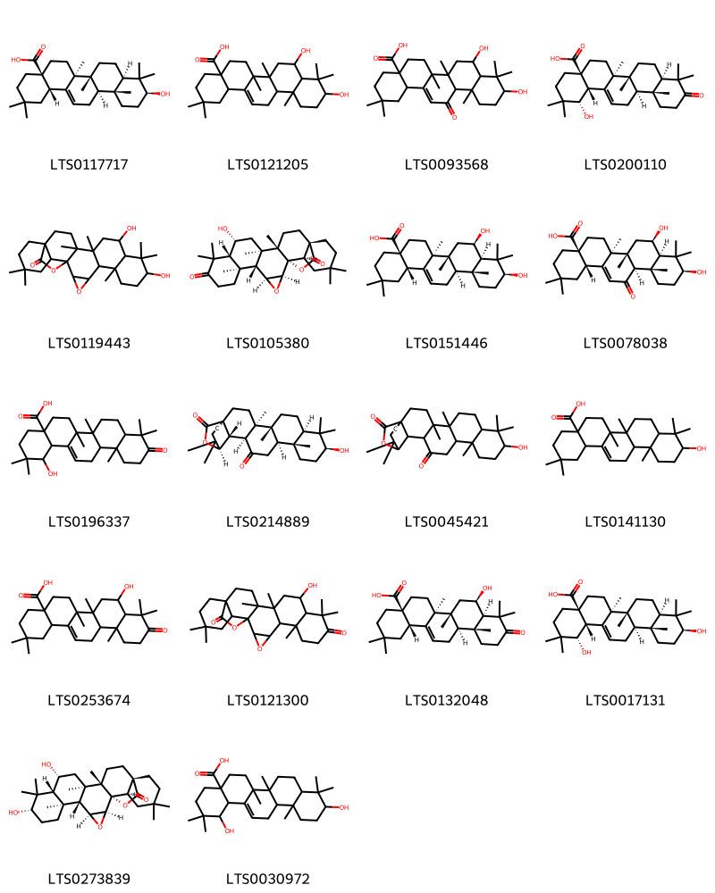

!!! abstract "Tóm tắt"
    Cánh kiến trắng (Benzoinum), tên khoa học là Styrax tonkinensis (Pierre) Craib ex Hardw., thuộc họ bồ đề (Styracaceae). Cánh kiến trắng là một cây nhỏ, có thể cao chừng 15m, với búp non phủ lông mịn và lá hình trứng. Hoa nhỏ, trắng, thơm, mọc thành chùm, quả hình cầu, có lông hình sao. Cây phân bố chủ yếu ở các tỉnh miền núi nước ta như Hòa Bình, Hà Tĩnh, Thanh Hóa, và Nghệ An, đồng thời cũng có ở các quốc gia như Campuchia, Lào, Thái Lan và Trung Quốc. Thành phần hóa học của cánh kiến trắng rất phong phú, bao gồm các triterpenoid, neolignan, và các hợp chất thơm như axit benzoic, vanillin, dehydrodivanillin. Cánh kiến trắng có tác dụng dược lý bao gồm chống khối u, bảo vệ thần kinh, chống viêm, kháng khuẩn và chống oxy hóa. Cánh kiến trắng đã được sử dụng trong y học cổ truyền để khai khiếu trấn tĩnh, khư hủ sinh cơ, chỉ khái. Trong đông y, cánh kiến trắng được dùng trong trị sản hậu huyết vậng, tâm phúc đông thống, trẻ em kinh giản, phong thấp đau lưng, trúng phong hôn mê, suyễn khan, cảm mạo, trúng thử, đau dạ dày và ngoại thương xuất huyết. Lá dùng trị ho do phế nhiệt. Dùng ngoài làm mau lành các vết thương, chữa nẻ vú. Hiện nay cánh kiến trắng dùng trong chữa viêm phế quản kinh niên và xổ nước đường hô hấp.

## Thông tin về thực vật

### Đặc điểm thực vật

Dược liệu **Cánh Kiến Trắng (Nhựa)** từ bộ phận **nan** từ loài *Styrax tonkinensis (Pierre) Craib. ex Hardw.* thuộc họ Styracaceae. Cánh kiến trắng là một cây nhỏ, có thể cao chừng 15m. Búp non phủ lông mịn màu vàng nhạt. Lá mọc so le, có cuống. Phiến lá nguyên, hình trứng, tròn ở phía dưới, nhọn dài ở đầu, mặt dưới màu trắng nhạt. Lá dài 6-15cm, rộng 2-2,5cm. Hoa nhỏ trắng thơm mọc thành chùm, ít phân nhánh mang ít hoa. Quả hình cầu, đường kính 10-16mm phía dưới mang đài còn sót lại, mặt ngoài quả có lông hình sao. 

!!! info "Phân loại thực vật của *Styrax tonkinensis*"
    - **Kingdom:** Plantae
    - **Phylum:** Tracheophyta
    - **Order:** Ericales
    - **Family:** Styracaceae
    - **Genus:** Styrax
    - **Species:** *Styrax tonkinensis*

*Tài liệu tham khảo:* "Những cây thuốc và vị thuốc Việt Nam" - Đỗ Tất Lợi

 

### Loài thay thế (Nếu có)

### Phân bố trên thế giới
**Từ vườn thực vật KEW: **: Native to: Cambodia, China South-Central, China Southeast, Laos, Thailand, Vietnam

**Từ CSDL GIBF** nan, Thailand, Viet Nam, China, Canada, Lao People’s Democratic Republic

### Phân bố tại Việt Nam
** "Những cây thuốc và vị thuốc Việt Nam" - Đỗ Tất Lợi**: Mọc hoang ở nhiều tỉnh miền núi nước ta, nhiều nhất Hòa Bình, Hà Tây, Thanh Hóa, Nghệ An, Hà Tĩnh, Lào Cai, Hà Giang, Tuyên Quang, Sơn La, Lai Châu.

**Từ CSDL GIBF**: Ha Noi, 宣光省

---

## Thông tin về dược liệu 

### Định danh

!!! info "Thông tin về tên gọi của nan"
    - Dược liệu tiếng Việt: nan
    - Dược liệu tiếng Trung: nan (nan)
    - Dược liệu tiếng Anh: nan
    - Dược liệu latin thông dụng: nan
    - Dược liệu latin kiểu DĐVN: benzoinum
    - Dược liệu latin kiểu DĐVN: nan
    - Dược liệu latin kiểu thông tư: nan
    - Bộ phận dùng: nan (nan)

### Mô tả dược liệu 
- **Theo dược điển Việt nam V:** nan

- **Mô tả dược liệu theo thông tư chế biến dược liệu theo phương pháp cổ truyền:** nan

### Chế biến 

- **Chế biến theo dược điển việt nam V**: nan

- **Chế biến theo thông tư:** nan

--- 

## Thành phần hóa học

- Theo tài liệu của GS. Đỗ Tất Lợi:  (1) Nhóm hóa học: 
- Triterpenoid: 6beta-hydroxy-3-oxo-11alpha,12alpha-epoxyolean-28,13beta-olide; 3beta,6beta-dihydroxy-11alpha,12alpha-epoxyolean-28,13beta-olide; 3beta, 6beta-dihydroxy-11-oxo-olean-12-en-28-oic acid; 3beta-hydroxy-12-oxo-13Halpha-olean-28,19beta-olide; 19alpha -hydroxy-3-oxo-olean-12-en-28-oic acid; 6beta-hydroxy-3-oxo-olean-12-en-28-oic acid; sumaresinolic acid, siaresinolic axit, axit oleanolic; 3b,6b-dihydroxy-12-oxo13Ha-olean-28,19b-olide và 3-oxoolean-11,13(18)-dien-28,19b-olide
- Neolignan: tonkinensisin A, B và C 
- Các hợp chất thơm gồm: axit benzoic, vanillin, dehydrodivanillin, axit vanillic, aldehyde coniferyl, trans-(tetrahydro-2-(4-hydroxy-3-metoxyphenyl)-5-oxofuran-3-yl)metyl benzoat và 3-(4-hydroxy-3-metoxyphenyl)-2- oxopropyl benzoat. 
- Ngoài ra còn có các thành phần khác như benzoat coniferyl, cinnamat benzyl, Acid benzoic tự do, acid hydroxy-19 oleanolic và các vết nanillin
(2) Tên hoạt chất là biomaker: 
- Dược điển Việt Nam: acid balsamic 
- Dược điển Trung Quốc: acid balsamic, acid benzoic
    
- Theo cơ sở dữ liệu lotus: Từ loài *Styrax tonkinensis* đã phân lập và xác định được 18 hoạt chất thuộc về các nhóm Prenol lipids. 

|    | chemicalTaxonomyClassyfireClass   |   smiles_count |
|---:|:----------------------------------|---------------:|
|  0 | Prenol lipids                     |             18 |

### Nhóm Prenol lipids
<figure markdown="span">
    { width=100% }
    <figcaption>Hình ảnh cấu trúc hóa học của 18 hoạt chất thuộc nhóm Prenol lipids gồm ['oleanolic acid (LTS0117717)', '8,10-dihydroxy-2,2,6a,6b,9,9,12a-heptamethyl-1,3,4,5,6,7,8,8a,10,11,12,12b,13,14b-tetradecahydropicene-4a-carboxylic acid (LTS0121205)', '8,10-dihydroxy-2,2,6a,6b,9,9,12a-heptamethyl-13-oxo-3,4,5,6,7,8,8a,10,11,12,12b,14b-dodecahydro-1h-picene-4a-carboxylic acid (LTS0093568)', '(1s,4ar,6as,6br,8ar,12ar,12br,14bs)-1-hydroxy-2,2,6a,6b,9,9,12a-heptamethyl-10-oxo-3,4,5,6,7,8,8a,11,12,12b,13,14b-dodecahydro-1h-picene-4a-carboxylic acid (LTS0200110)', '9,12-dihydroxy-6,10,10,14,15,21,21-heptamethyl-3,24-dioxaheptacyclo[16.5.2.0¹,¹⁵.0²,⁴.0⁵,¹⁴.0⁶,¹¹.0¹⁸,²³]pentacosan-25-one (LTS0119443)', '(1s,2s,4s,5r,6s,11r,12r,14r,15s,18s,23r)-12-hydroxy-6,10,10,14,15,21,21-heptamethyl-3,24-dioxaheptacyclo[16.5.2.0¹,¹⁵.0²,⁴.0⁵,¹⁴.0⁶,¹¹.0¹⁸,²³]pentacosane-9,25-dione (LTS0105380)', 'sumaresinolic acid (LTS0151446)', '(4as,6as,6br,8r,8ar,10s,12as,12br,14bs)-8,10-dihydroxy-2,2,6a,6b,9,9,12a-heptamethyl-13-oxo-3,4,5,6,7,8,8a,10,11,12,12b,14b-dodecahydro-1h-picene-4a-carboxylic acid (LTS0078038)', '1-hydroxy-2,2,6a,6b,9,9,12a-heptamethyl-10-oxo-3,4,5,6,7,8,8a,11,12,12b,13,14b-dodecahydro-1h-picene-4a-carboxylic acid (LTS0196337)', '(1r,4r,5r,8r,10s,13r,14r,17s,18s,19r)-10-hydroxy-4,5,9,9,13,20,20-heptamethyl-24-oxahexacyclo[17.3.2.0¹,¹⁸.0⁴,¹⁷.0⁵,¹⁴.0⁸,¹³]tetracosane-16,23-dione (LTS0214889)', '10-hydroxy-4,5,9,9,13,20,20-heptamethyl-24-oxahexacyclo[17.3.2.0¹,¹⁸.0⁴,¹⁷.0⁵,¹⁴.0⁸,¹³]tetracosane-16,23-dione (LTS0045421)', 'oleanolic acid (LTS0141130)', '8-hydroxy-2,2,6a,6b,9,9,12a-heptamethyl-10-oxo-3,4,5,6,7,8,8a,11,12,12b,13,14b-dodecahydro-1h-picene-4a-carboxylic acid (LTS0253674)', '12-hydroxy-6,10,10,14,15,21,21-heptamethyl-3,24-dioxaheptacyclo[16.5.2.0¹,¹⁵.0²,⁴.0⁵,¹⁴.0⁶,¹¹.0¹⁸,²³]pentacosane-9,25-dione (LTS0121300)', '(4as,6as,6br,8r,8ar,12ar,12br,14bs)-8-hydroxy-2,2,6a,6b,9,9,12a-heptamethyl-10-oxo-3,4,5,6,7,8,8a,11,12,12b,13,14b-dodecahydro-1h-picene-4a-carboxylic acid (LTS0132048)', 'siaresinol (LTS0017131)', '(1s,2s,4s,5r,6s,9s,11r,12r,14r,15s,18s,23r)-9,12-dihydroxy-6,10,10,14,15,21,21-heptamethyl-3,24-dioxaheptacyclo[16.5.2.0¹,¹⁵.0²,⁴.0⁵,¹⁴.0⁶,¹¹.0¹⁸,²³]pentacosan-25-one (LTS0273839)', '1,10-dihydroxy-2,2,6a,6b,9,9,12a-heptamethyl-1,3,4,5,6,7,8,8a,10,11,12,12b,13,14b-tetradecahydropicene-4a-carboxylic acid (LTS0030972)'].</figcaption>
</figure>

---

## Tác dụng dược lý

Theo tài liệu "Những cây thuốc và vị thuốc Việt Nam" - Đỗ Tất Lợi:- Chống khối u
- Bảo vệ thần kinh và não bộ
- Chống viêm
- Chống oxy hóa
- Kháng khuẩn

Theo tài liệu quốc tế: nan

---

## Dược điển Việt Nam V

### Soi bột:
nan
<!-- Hình ảnh soi bột sẽ được tự động chèn vào đây sau -->
### Vi phẫu:
nan
<!-- Hình ảnh vi phẫu sẽ được tự động chèn vào đây sau -->
### Định tính

nan

### Định lượng

nan

### Thông tin khác 
- ** Độ ẩm: ** nan

- ** Bảo quản:** nan
## Dược điển Hồng kong

<!-- PDF sẽ được tự động chèn vào đây sau -->

---

## Y dược học cổ truyền

- **Tên vị thuốc:** nan
- **Tính vị quy kinh:** Tân, khổ, bình. Vào các kinh tâm, tỳ
- **Công năng chủ trị:** Khai khiếu tinh thần, hành khí hoạt huyết, chỉ thống.
Chủ trị: Trúng phong đàm quyết, khí uất bạo quyết, trúng ác hôn mê, tâm phúc thống, trẻ em kinh phong, sản hậu huyết vậng
- **Chú ý:** nan
- **Kiêng kỵ:** nan

