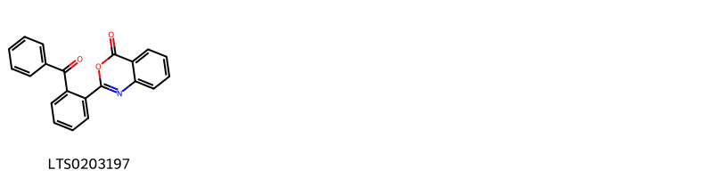
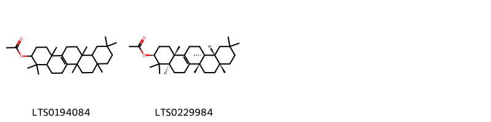
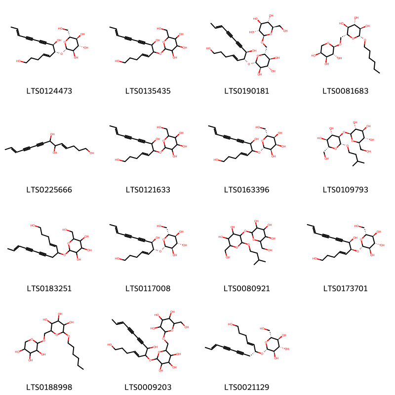
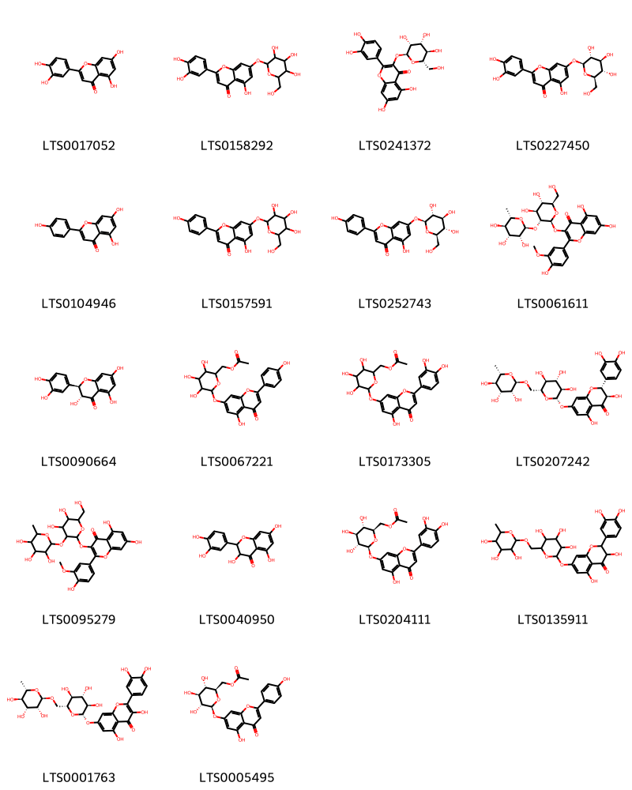
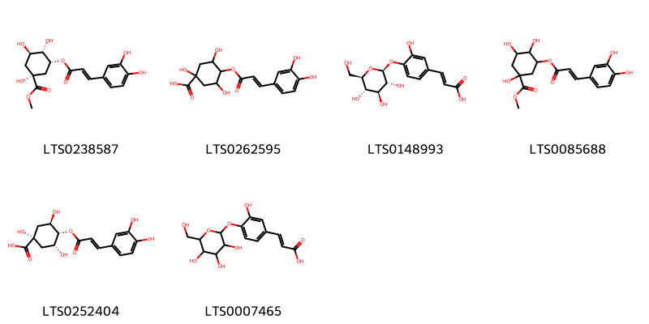
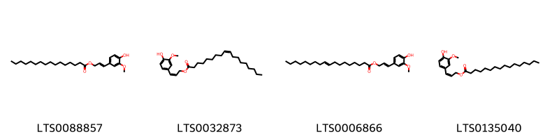
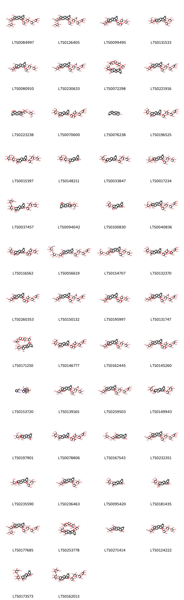
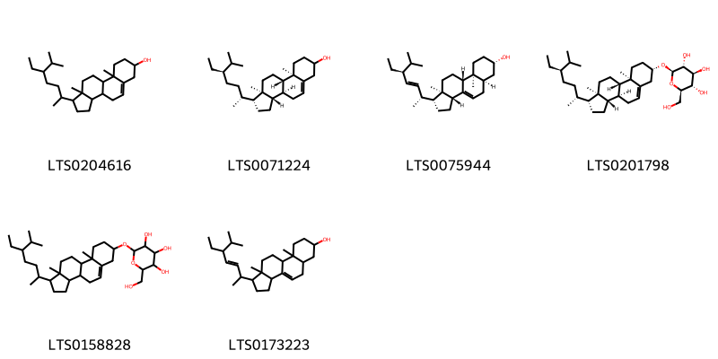

!!! abstract "Tóm tắt"
    Cát cánh (Radix Platycodi grandiflori) là rễ để nguyên hoặc đã cạo vỏ ngoài, phơi hoặc sấy khô của cây cát cánh [Platycodon grandiflorum (Jacq.) A. DC.], họ Hoa chuông (Campanulaceae). Cây được nhập vào Việt Nam khoảng gần 40 năm, được trồng ở các nơi như Sapa, Tam Đảo, Lào Cai, Nam Định, Hà Nam, Thái Bình. Nhân dân ta sử dụng cát cánh để chữa ho, tiêu đờm. Trong cát cánh có saponin có tác dụng trừ đờm, phá huyết cao.

## Thông tin về thực vật

### Đặc điểm thực vật

Dược liệu **Cát Cánh (Rễ)** từ bộ phận **Rễ** từ loài *Platycodon grandiflorum (Jacq.) A.DC.* thuộc họ Campanulaceae. Cát cánh là một loại cỏ nhỏ, mọc lâu năm. Thân cao chừng 60cm-90cm. Lá gần như không có cuống; lá phía dưới mọc đối hoặc mọc vòng 3-4 lá. Phiến lá hình trứng, mép có răng cưa to. Lá phía trên nhỏ, có khi mọc so le, dài từ 3-6cm, rộng 1-2,5cm. Hoa mọc đơn độc hoặc thành bóng thưa. Đài màu xanh, hình chuông rộng, dài 1cm, mép có 5 răng; tràng hoa hình chuông, màu lam tím hay màu trắng, đường kính 3-5cm. Quả hình trứng ngược. Mùa hoa tháng 5-8, mùa quả tháng 7-9. 

!!! info "Phân loại thực vật của *Platycodon grandiflorus*"
    - **Kingdom:** Plantae
    - **Phylum:** Tracheophyta
    - **Order:** Asterales
    - **Family:** Campanulaceae
    - **Genus:** Platycodon
    - **Species:** *Platycodon grandiflorus*

*Tài liệu tham khảo:* "Những cây thuốc và vị thuốc Việt Nam" - Đỗ Tất Lợi

 

### Loài thay thế (Nếu có)

### Phân bố trên thế giới
**Từ vườn thực vật KEW: **: Native to:
Amur, China North-Central, China South-Central, China Southeast, Chita, Inner Mongolia, Japan, Khabarovsk, Korea, Manchuria, Primorye
Introduced into:
Austria, Germany, Hawaii

**Từ CSDL GIBF** nan, Belgium, Spain, Austria, Germany, Netherlands, Denmark, Korea, Republic of, Hong Kong, Luxembourg, Sweden, Hungary, Italy, China, United Kingdom of Great Britain and Northern Ireland, Japan, Russian Federation, Czechia, Switzerland, United States of America, Canada

### Phân bố tại Việt Nam
** "Những cây thuốc và vị thuốc Việt Nam" - Đỗ Tất Lợi**: Cây được nhập vào Việt Nam khoảng gần 40 năm, được trồng ở các nơi như Sapa, Tam Đảo, Lào Cai, Nam Định, Hà Nam, Thái Bình.

**Từ CSDL GIBF**: Không có ghi nhận ở Việt Nam

---

## Thông tin về dược liệu 

### Định danh

!!! info "Thông tin về tên gọi của cát cánh"
    - Dược liệu tiếng Việt: cát cánh
    - Dược liệu tiếng Trung: 桔梗 (Jie Geng)
    - Dược liệu tiếng Anh: Platycodon Grandiflorum
    - Dược liệu latin thông dụng: Radix Platycodi grandiflorinRadix Platycodi
    - Dược liệu latin kiểu DĐVN: radix platycodi grandiflori
    - Dược liệu latin kiểu DĐVN: Radix Platycodi
    - Dược liệu latin kiểu thông tư: Radix Platycodi grandiflori
    - Bộ phận dùng: Rễ (Radix)

### Mô tả dược liệu 
- **Theo dược điển Việt nam V:** 
Rễ hình trụ thuôn dần về phía dưới hoặc có dạng hình trụ nhỏ và dài, hơi vặn xoăn lại, đôi khi phân nhánh, dài 7 cm đến 20 cm, đường kính 0,7 cm đến 2 cm. Phần đỉnh rễ còn sót lại một đoạn ngắn của thân rễ mang nhiều sẹo nhỏ là vết tích của gốc thân. Mặt ngoài màu vàng nhạt hay vàng nâu nhạt, có nhiều rãnh nhăn nheo theo chiều dọc và những nếp nhăn ngang. Thể chất giòn, mặt bẻ không phẳng. Mặt cắt ngang có phần vỏ màu trắng hoặc hơi vàng, phần gỗ màu trắng ngà hoặc nâu nhạt; tầng phát sinh libe- gỗ thành vòng rõ, màu nâu, nâu nhạt. Không mùi hoặc có mùi đường cháy nhẹ, vị ngọt sau hơi đắng. Dược liệu thái lát: Các phiến mỏng, hình tròn hoặc không đều, thường có vỏ còn sót lại. Mặt cắt có phần ngoài màu trắng nhạt, tương đối hẹp, hình thành tầng vân vỏng màu nâu nhạt. Phần gỗ rộng có nhiều khe nứt. Chất giòn, dễ bẻ gãy, mùi thơm nhẹ, vị ngọt, sau đấng. Khi dùng chích gừng.

- **Mô tả dược liệu theo thông tư chế biến dược liệu theo phương pháp cổ truyền:** 

### Chế biến 

- **Chế biến theo dược điển việt nam V**: 
Thu hoạch vào mùa thu đông hoặc mùa xuân. Đào lấy rễ, cắt bỏ đầu rễ và rễ con, rửa sạch, để ráo nước hoặc ủ khoảng 12 h, thái lát mỏng phơi hay sấy khô.

- **Chế biến theo thông tư:** 

--- 

## Thành phần hóa học

- Theo tài liệu của GS. Đỗ Tất Lợi:  (1) Saponin
(2) Biomaker trong dược điển Việt Nam là platycodin D
      Biomaker trong dược điển Hồng Kông là platycoside E
    
- Theo cơ sở dữ liệu lotus: Từ loài *Platycodon grandiflorus* đã phân lập và xác định được 145 hoạt chất thuộc về các nhóm Organooxygen compounds, Fatty Acyls, Steroids and steroid derivatives, Prenol lipids, Benzene and substituted derivatives, Carboxylic acids and derivatives, Phenols, Flavonoids. 

|    | chemicalTaxonomyClassyfireClass     |   smiles_count |
|---:|:------------------------------------|---------------:|
|  0 | Benzene and substituted derivatives |              1 |
|  1 | Carboxylic acids and derivatives    |              2 |
|  2 | Fatty Acyls                         |             15 |
|  3 | Flavonoids                          |             18 |
|  4 | Organooxygen compounds              |              6 |
|  5 | Phenols                             |              4 |
|  6 | Prenol lipids                       |             93 |
|  7 | Steroids and steroid derivatives    |              6 |

### Nhóm Benzene and substituted derivatives
<figure markdown="span">
    { width=100% }
    <figcaption>Hình ảnh cấu trúc hóa học của 1 hoạt chất thuộc nhóm Benzene and substituted derivatives gồm ['2-(2-benzoylphenyl)-3,1-benzoxazin-4-one (LTS0203197)'].</figcaption>
</figure>
### Nhóm Carboxylic acids and derivatives
<figure markdown="span">
    { width=100% }
    <figcaption>Hình ảnh cấu trúc hóa học của 2 hoạt chất thuộc nhóm Carboxylic acids and derivatives gồm ['4,4,6b,8a,11,11,12b,14b-octamethyl-1,2,3,4a,5,6,7,8,9,10,12,12a,13,14-tetradecahydropicen-3-yl acetate (LTS0194084)', '(3s,4ar,6bs,8ar,12ar,12bs,14bs)-4,4,6b,8a,11,11,12b,14b-octamethyl-1,2,3,4a,5,6,7,8,9,10,12,12a,13,14-tetradecahydropicen-3-yl acetate (LTS0229984)'].</figcaption>
</figure>
### Nhóm Fatty Acyls
<figure markdown="span">
    { width=100% }
    <figcaption>Hình ảnh cấu trúc hóa học của 15 hoạt chất thuộc nhóm Fatty Acyls gồm ['(2r,3r,4s,5s,6r)-2-{[(4e,6r,7r,12e)-1,7-dihydroxytetradeca-4,12-dien-8,10-diyn-6-yl]oxy}-6-(hydroxymethyl)oxane-3,4,5-triol (LTS0124473)', '2-{[(4e,12e)-1,7-dihydroxytetradeca-4,12-dien-8,10-diyn-6-yl]oxy}-6-(hydroxymethyl)oxane-3,4,5-triol (LTS0135435)', '(2r,3r,4s,5s,6r)-2-{[(4e,6r,7r,12e)-1,7-dihydroxytetradeca-4,12-dien-8,10-diyn-6-yl]oxy}-6-({[(2r,3r,4s,5s,6r)-3,4,5-trihydroxy-6-(hydroxymethyl)oxan-2-yl]oxy}methyl)oxane-3,4,5-triol (LTS0190181)', '(2r,3r,4s,5s,6r)-2-(hexyloxy)-6-({[(2s,3r,4s,5s)-3,4,5-trihydroxyoxan-2-yl]oxy}methyl)oxane-3,4,5-triol (LTS0081683)', '(4e,12e)-tetradeca-4,12-dien-8,10-diyne-1,6,7-triol (LTS0225666)', '2-[(1,7-dihydroxytetradeca-4,12-dien-8,10-diyn-6-yl)oxy]-6-(hydroxymethyl)oxane-3,4,5-triol (LTS0121633)', '(2r,3r,4r,5s,6r)-2-[(1,7-dihydroxytetradeca-4,12-dien-8,10-diyn-6-yl)oxy]-6-(hydroxymethyl)oxane-3,4,5-triol (LTS0163396)', '(2s,3r,4s,5s,6r)-2-{[(2r,3r,4s,5s,6r)-4,5-dihydroxy-6-(hydroxymethyl)-2-(3-methylbutoxy)oxan-3-yl]oxy}-6-(hydroxymethyl)oxane-3,4,5-triol (LTS0109793)', '2-(hydroxymethyl)-6-[(1-hydroxytetradeca-4,12-dien-8,10-diyn-6-yl)oxy]oxane-3,4,5-triol (LTS0183251)', '(2r,3r,4s,5s,6r)-2-{[(6r,7r)-1,7-dihydroxytetradeca-4,12-dien-8,10-diyn-6-yl]oxy}-6-(hydroxymethyl)oxane-3,4,5-triol (LTS0117008)', '2-{[4,5-dihydroxy-6-(hydroxymethyl)-2-(3-methylbutoxy)oxan-3-yl]oxy}-6-(hydroxymethyl)oxane-3,4,5-triol (LTS0080921)', '(2r,3r,4s,5s,6r)-2-{[(4e,6s,7r,12e)-1,7-dihydroxytetradeca-4,12-dien-8,10-diyn-6-yl]oxy}-6-(hydroxymethyl)oxane-3,4,5-triol (LTS0173701)', '2-(hexyloxy)-6-{[(3,4,5-trihydroxyoxan-2-yl)oxy]methyl}oxane-3,4,5-triol (LTS0188998)', '2-{[(4e,12e)-1,7-dihydroxytetradeca-4,12-dien-8,10-diyn-6-yl]oxy}-6-({[3,4,5-trihydroxy-6-(hydroxymethyl)oxan-2-yl]oxy}methyl)oxane-3,4,5-triol (LTS0009203)', '(2r,3s,4s,5r,6r)-2-(hydroxymethyl)-6-{[(4e,6r,12e)-1-hydroxytetradeca-4,12-dien-8,10-diyn-6-yl]oxy}oxane-3,4,5-triol (LTS0021129)'].</figcaption>
</figure>
### Nhóm Flavonoids
<figure markdown="span">
    { width=100% }
    <figcaption>Hình ảnh cấu trúc hóa học của 18 hoạt chất thuộc nhóm Flavonoids gồm ['luteolin (LTS0017052)', '2-(3,4-dihydroxyphenyl)-5-hydroxy-7-{[3,4,5-trihydroxy-6-(hydroxymethyl)oxan-2-yl]oxy}chromen-4-one (LTS0158292)', '2-(3,4-dihydroxyphenyl)-5,7-dihydroxy-3-{[(2s,3r,4r,5r,6s)-3,4,5-trihydroxy-6-(hydroxymethyl)oxan-2-yl]oxy}chromen-4-one (LTS0241372)', 'luteolin 7-o-glucoside (LTS0227450)', 'chamomile (LTS0104946)', 'apigetrin (LTS0157591)', 'apigenin 7-o-β-glucoside (LTS0252743)', '3-{[(2s,3r,4s,5s,6r)-4,5-dihydroxy-6-(hydroxymethyl)-3-{[(2s,3r,4r,5r,6s)-3,4,5-trihydroxy-6-methyloxan-2-yl]oxy}oxan-2-yl]oxy}-5,7-dihydroxy-2-(4-hydroxy-3-methoxyphenyl)chromen-4-one (LTS0061611)', '(+)-taxifolin (LTS0090664)', '(3,4,5-trihydroxy-6-{[5-hydroxy-2-(4-hydroxyphenyl)-4-oxochromen-7-yl]oxy}oxan-2-yl)methyl acetate (LTS0067221)', '(6-{[2-(3,4-dihydroxyphenyl)-5-hydroxy-4-oxochromen-7-yl]oxy}-3,4,5-trihydroxyoxan-2-yl)methyl acetate (LTS0173305)', '(2r,3r)-2-(3,4-dihydroxyphenyl)-3,5-dihydroxy-7-{[(2s,3r,4s,5s,6r)-3,4,5-trihydroxy-6-({[(2r,3r,4r,5r,6s)-3,4,5-trihydroxy-6-methyloxan-2-yl]oxy}methyl)oxan-2-yl]oxy}-2,3-dihydro-1-benzopyran-4-one (LTS0207242)', '3-{[4,5-dihydroxy-6-(hydroxymethyl)-3-[(3,4,5-trihydroxy-6-methyloxan-2-yl)oxy]oxan-2-yl]oxy}-5,7-dihydroxy-2-(4-hydroxy-3-methoxyphenyl)chromen-4-one (LTS0095279)', '2,3-dihydroquercetin (LTS0040950)', '[(2r,3s,4s,5r,6s)-6-{[2-(3,4-dihydroxyphenyl)-5-hydroxy-4-oxochromen-7-yl]oxy}-3,4,5-trihydroxyoxan-2-yl]methyl acetate (LTS0204111)', '2-(3,4-dihydroxyphenyl)-3,5-dihydroxy-7-[(3,4,5-trihydroxy-6-{[(3,4,5-trihydroxy-6-methyloxan-2-yl)oxy]methyl}oxan-2-yl)oxy]-2,3-dihydro-1-benzopyran-4-one (LTS0135911)', '2-(3,4-dihydroxyphenyl)-3,5-dihydroxy-7-{[(2s,3r,4s,5s,6r)-3,4,5-trihydroxy-6-({[(2r,3r,4r,5r,6s)-3,4,5-trihydroxy-6-methyloxan-2-yl]oxy}methyl)oxan-2-yl]oxy}chromen-4-one (LTS0001763)', '[(2r,3s,4s,5r,6s)-3,4,5-trihydroxy-6-{[5-hydroxy-2-(4-hydroxyphenyl)-4-oxochromen-7-yl]oxy}oxan-2-yl]methyl acetate (LTS0005495)'].</figcaption>
</figure>
### Nhóm Organooxygen compounds
<figure markdown="span">
    { width=100% }
    <figcaption>Hình ảnh cấu trúc hóa học của 6 hoạt chất thuộc nhóm Organooxygen compounds gồm ['methyl (1r,3r,4s,5r)-3-{[(2e)-3-(3,4-dihydroxyphenyl)prop-2-enoyl]oxy}-1,4,5-trihydroxycyclohexane-1-carboxylate (LTS0238587)', '4-{[3-(3,4-dihydroxyphenyl)prop-2-enoyl]oxy}-1,3,5-trihydroxycyclohexane-1-carboxylic acid (LTS0262595)', '(2e)-3-(3-hydroxy-4-{[(2s,3r,4s,5s,6r)-3,4,5-trihydroxy-6-(hydroxymethyl)oxan-2-yl]oxy}phenyl)prop-2-enoic acid (LTS0148993)', 'methyl 3-{[3-(3,4-dihydroxyphenyl)prop-2-enoyl]oxy}-1,4,5-trihydroxycyclohexane-1-carboxylate (LTS0085688)', 'cryptochlorogenic acid (LTS0252404)', '3-(3-hydroxy-4-{[3,4,5-trihydroxy-6-(hydroxymethyl)oxan-2-yl]oxy}phenyl)prop-2-enoic acid (LTS0007465)'].</figcaption>
</figure>
### Nhóm Phenols
<figure markdown="span">
    { width=100% }
    <figcaption>Hình ảnh cấu trúc hóa học của 4 hoạt chất thuộc nhóm Phenols gồm ['3-(4-hydroxy-3-methoxyphenyl)prop-2-en-1-yl hexadecanoate (LTS0088857)', '(2z)-3-(4-hydroxy-3-methoxyphenyl)prop-2-en-1-yl (9z)-octadec-9-enoate (LTS0032873)', '3-(4-hydroxy-3-methoxyphenyl)prop-2-en-1-yl octadec-9-enoate (LTS0006866)', '(2z)-3-(4-hydroxy-3-methoxyphenyl)prop-2-en-1-yl hexadecanoate (LTS0135040)'].</figcaption>
</figure>
### Nhóm Prenol lipids
<figure markdown="span">
    { width=100% }
    <figcaption>Hình ảnh cấu trúc hóa học của 93 hoạt chất thuộc nhóm Prenol lipids gồm ['(2s,3r,4s,5s)-3-{[(2s,3r,4s,5r,6s)-5-{[(2s,3r,4s,5r)-4-{[(2s,3r,4r)-3,4-dihydroxy-4-(hydroxymethyl)oxolan-2-yl]oxy}-3,5-dihydroxyoxan-2-yl]oxy}-3,4-dihydroxy-6-methyloxan-2-yl]oxy}-4,5-dihydroxyoxan-2-yl (4ar,5r,6as,6br,8ar,9r,10r,11s,12ar,12br,14bs)-10-{[(2r,3r,4s,5r,6r)-3,5-dihydroxy-6-(hydroxymethyl)-4-{[(2s,3r,4s,5s,6r)-3,4,5-trihydroxy-6-(hydroxymethyl)oxan-2-yl]oxy}oxan-2-yl]oxy}-5,11-dihydroxy-9-(hydroxymethyl)-2,2,6a,6b,9,12a-hexamethyl-1,3,4,5,6,7,8,8a,10,11,12,12b,13,14b-tetradecahydropicene-4a-carboxylate (LTS0084997)', '(2s,3r,4s,5s)-3-{[(2s,3r,4s,5s,6s)-4-(acetyloxy)-5-{[(2s,3r,4s,5r)-4-{[(2s,3r,4r)-3,4-dihydroxy-4-(hydroxymethyl)oxolan-2-yl]oxy}-3,5-dihydroxyoxan-2-yl]oxy}-3-hydroxy-6-methyloxan-2-yl]oxy}-4,5-dihydroxyoxan-2-yl (4ar,5r,6as,6br,8ar,9r,10r,11s,12ar,12br,14bs)-10-{[(2r,3r,4s,5r,6r)-3,5-dihydroxy-6-(hydroxymethyl)-4-{[(2s,3r,4s,5s,6r)-3,4,5-trihydroxy-6-(hydroxymethyl)oxan-2-yl]oxy}oxan-2-yl]oxy}-5,11-dihydroxy-9-(hydroxymethyl)-2,2,6a,6b,9,12a-hexamethyl-1,3,4,5,6,7,8,8a,10,11,12,12b,13,14b-tetradecahydropicene-4a-carboxylate (LTS0126405)', '(2s,3r,4s,5s)-3-{[(2s,3r,4r,5r,6s)-3-(acetyloxy)-4-hydroxy-6-methyl-5-{[(2s,3r,4s,5r)-3,4,5-trihydroxyoxan-2-yl]oxy}oxan-2-yl]oxy}-4,5-dihydroxyoxan-2-yl (4ar,5r,6as,6br,8ar,10r,11s,12ar,12br,14bs)-5,11-dihydroxy-9,9-bis(hydroxymethyl)-2,2,6a,6b,12a-pentamethyl-10-{[(2r,3r,4s,5s,6r)-3,4,5-trihydroxy-6-(hydroxymethyl)oxan-2-yl]oxy}-1,3,4,5,6,7,8,8a,10,11,12,12b,13,14b-tetradecahydropicene-4a-carboxylate (LTS0099495)', '(2s,3r,4s,5s)-4,5-dihydroxy-3-{[(2s,3r,4r,5r,6s)-3,4,5-trihydroxy-6-methyloxan-2-yl]oxy}oxan-2-yl (1s,2r,5r,6s,8r,9r,14s,18r,19r,21s,24r)-8-hydroxy-1-(hydroxymethyl)-5,6,12,12,19-pentamethyl-23-oxo-24-{[(2r,3r,4s,5s,6r)-3,4,5-trihydroxy-6-(hydroxymethyl)oxan-2-yl]oxy}-22-oxahexacyclo[19.2.1.0²,¹⁹.0⁵,¹⁸.0⁶,¹⁵.0⁹,¹⁴]tetracos-15-ene-9-carboxylate (LTS0131533)', '(2s,3r,4s,5s)-3-{[(2s,3r,4s,5r,6s)-3,4-dihydroxy-6-methyl-5-{[(2s,3r,4s,5r)-3,4,5-trihydroxyoxan-2-yl]oxy}oxan-2-yl]oxy}-4,5-dihydroxyoxan-2-yl (4ar,5r,6as,6br,8ar,10r,11s,12ar)-5,11-dihydroxy-9,9-bis(hydroxymethyl)-2,2,6a,6b,12a-pentamethyl-10-{[(2r,3r,4s,5s,6r)-3,4,5-trihydroxy-6-(hydroxymethyl)oxan-2-yl]oxy}-1,3,4,5,6,7,8,8a,10,11,12,12b,13,14b-tetradecahydropicene-4a-carboxylate (LTS0080910)', "3''o-acetylplatycodin d (LTS0230633)", '8a-[3-({5-[(4-{[3,4-dihydroxy-4-(hydroxymethyl)oxolan-2-yl]oxy}-3,5-dihydroxyoxan-2-yl)oxy]-3,4-dihydroxy-6-methyloxan-2-yl}oxy)-4,5-dihydroxyoxan-2-yl] 4-methyl 8-hydroxy-4-(hydroxymethyl)-2-methoxy-6a,6b,11,11,14b-pentamethyl-3-{[3,4,5-trihydroxy-6-(hydroxymethyl)oxan-2-yl]oxy}-1,2,3,4a,5,6,7,8,9,10,12,12a,14,14a-tetradecahydropicene-4,8a-dicarboxylate (LTS0072298)', '(2s,3r,4s,4ar,6ar,6bs,8r,8ar,12as,14ar,14br)-8a-({[(2s,3r,4s,5s)-3-{[(2s,3r,4s,5s,6s)-4-(acetyloxy)-5-{[(2s,3r,4s,5r)-4-{[(2s,3r,4r)-3,4-dihydroxy-4-(hydroxymethyl)oxolan-2-yl]oxy}-3,5-dihydroxyoxan-2-yl]oxy}-3-hydroxy-6-methyloxan-2-yl]oxy}-4,5-dihydroxyoxan-2-yl]oxy}carbonyl)-2,8-dihydroxy-4-(hydroxymethyl)-6a,6b,11,11,14b-pentamethyl-3-{[(2r,3r,4s,5s,6r)-3,4,5-trihydroxy-6-(hydroxymethyl)oxan-2-yl]oxy}-1,2,3,4a,5,6,7,8,9,10,12,12a,14,14a-tetradecahydropicene-4-carboxylic acid (LTS0221916)', '(4ar,5r,6as,6br,8ar,10r,11s,12ar,12br,14bs)-5,11-dihydroxy-9,9-bis(hydroxymethyl)-2,2,6a,6b,12a-pentamethyl-10-{[(2r,3r,4s,5s,6r)-3,4,5-trihydroxy-6-({[(2r,4s,5s,6r)-3,4,5-trihydroxy-6-(hydroxymethyl)oxan-2-yl]oxy}methyl)oxan-2-yl]oxy}-1,3,4,5,6,7,8,8a,10,11,12,12b,13,14b-tetradecahydropicene-4a-carboxylic acid (LTS0223238)', '3-{[3-(acetyloxy)-5-[(4-{[3,4-dihydroxy-4-(hydroxymethyl)oxolan-2-yl]oxy}-3,5-dihydroxyoxan-2-yl)oxy]-4-hydroxy-6-methyloxan-2-yl]oxy}-4,5-dihydroxyoxan-2-yl 5,11-dihydroxy-9,9-bis(hydroxymethyl)-2,2,6a,6b,12a-pentamethyl-10-{[3,4,5-trihydroxy-6-(hydroxymethyl)oxan-2-yl]oxy}-1,3,4,5,6,7,8,8a,10,11,12,12b,13,14b-tetradecahydropicene-4a-carboxylate (LTS0070600)', 'alnulin (LTS0076238)', '3-({5-[(4-{[3,4-dihydroxy-4-(hydroxymethyl)oxolan-2-yl]oxy}-3,5-dihydroxyoxan-2-yl)oxy]-3,4-dihydroxy-6-methyloxan-2-yl}oxy)-4,5-dihydroxyoxan-2-yl 5,11-dihydroxy-9,9-bis(hydroxymethyl)-2,2,6a,6b,12a-pentamethyl-10-{[3,4,5-trihydroxy-6-(hydroxymethyl)oxan-2-yl]oxy}-1,3,4,5,6,7,8,8a,10,11,12,12b,13,14b-tetradecahydropicene-4a-carboxylate (LTS0196525)', '3-({3,4-dihydroxy-6-methyl-5-[(3,4,5-trihydroxyoxan-2-yl)oxy]oxan-2-yl}oxy)-4,5-dihydroxyoxan-2-yl 10-{[3,5-dihydroxy-6-(hydroxymethyl)-4-{[3,4,5-trihydroxy-6-(hydroxymethyl)oxan-2-yl]oxy}oxan-2-yl]oxy}-5,11-dihydroxy-9,9-bis(hydroxymethyl)-2,2,6a,6b,12a-pentamethyl-1,3,4,5,6,7,8,8a,10,11,12,12b,13,14b-tetradecahydropicene-4a-carboxylate (LTS0015397)', 'methyl 10-{[3,5-dihydroxy-6-(hydroxymethyl)-4-{[3,4,5-trihydroxy-6-(hydroxymethyl)oxan-2-yl]oxy}oxan-2-yl]oxy}-5,11-dihydroxy-9-(hydroxymethyl)-2,2,6a,6b,9,12a-hexamethyl-1,3,4,5,6,7,8,8a,10,11,12,12b,13,14b-tetradecahydropicene-4a-carboxylate (LTS0148211)', '3-({3,4-dihydroxy-6-methyl-5-[(3,4,5-trihydroxyoxan-2-yl)oxy]oxan-2-yl}oxy)-4,5-dihydroxyoxan-2-yl 8-hydroxy-1-(hydroxymethyl)-5,6,12,12,19-pentamethyl-23-oxo-24-{[3,4,5-trihydroxy-6-(hydroxymethyl)oxan-2-yl]oxy}-22-oxahexacyclo[19.2.1.0²,¹⁹.0⁵,¹⁸.0⁶,¹⁵.0⁹,¹⁴]tetracos-15-ene-9-carboxylate (LTS0033847)', '(2s,3r,4s,5s)-3-{[(2s,3r,4s,5r,6s)-3,4-dihydroxy-6-methyl-5-{[(2s,3r,4s,5r)-3,4,5-trihydroxyoxan-2-yl]oxy}oxan-2-yl]oxy}-4,5-dihydroxyoxan-2-yl (1s,2r,5r,6s,8r,9r,14s,18r,19r,21s,24r)-8-hydroxy-1-(hydroxymethyl)-5,6,12,12,19-pentamethyl-23-oxo-24-{[(2r,3r,4s,5s,6r)-3,4,5-trihydroxy-6-(hydroxymethyl)oxan-2-yl]oxy}-22-oxahexacyclo[19.2.1.0²,¹⁹.0⁵,¹⁸.0⁶,¹⁵.0⁹,¹⁴]tetracos-15-ene-9-carboxylate (LTS0017234)', '3-({3,4-dihydroxy-6-methyl-5-[(3,4,5-trihydroxyoxan-2-yl)oxy]oxan-2-yl}oxy)-4,5-dihydroxyoxan-2-yl 5,11-dihydroxy-9,9-bis(hydroxymethyl)-2,2,6a,6b,12a-pentamethyl-10-{[3,4,5-trihydroxy-6-({[3,4,5-trihydroxy-6-(hydroxymethyl)oxan-2-yl]oxy}methyl)oxan-2-yl]oxy}-1,3,4,5,6,7,8,8a,10,11,12,12b,13,14b-tetradecahydropicene-4a-carboxylate (LTS0037457)', '(1s,2r,5r,6s,8r,9r,14s,18r,19r,21s,24r)-8-hydroxy-1-(hydroxymethyl)-5,6,12,12,19-pentamethyl-23-oxo-24-{[(2r,3r,4s,5s,6r)-3,4,5-trihydroxy-6-(hydroxymethyl)oxan-2-yl]oxy}-22-oxahexacyclo[19.2.1.0²,¹⁹.0⁵,¹⁸.0⁶,¹⁵.0⁹,¹⁴]tetracos-15-ene-9-carboxylic acid (LTS0094042)', 'methyl 5,11-dihydroxy-9,9-bis(hydroxymethyl)-2,2,6a,6b,12a-pentamethyl-10-{[3,4,5-trihydroxy-6-(hydroxymethyl)oxan-2-yl]oxy}-1,3,4,5,6,7,8,8a,10,11,12,12b,13,14b-tetradecahydropicene-4a-carboxylate (LTS0100830)', '(2s,3r,4s,5s)-3-{[(2s,3r,4s,5r,6s)-5-{[(2s,3r,4s,5r)-4-{[(2s,3r,4r)-3,4-dihydroxy-4-(hydroxymethyl)oxolan-2-yl]oxy}-3,5-dihydroxyoxan-2-yl]oxy}-3,4-dihydroxy-6-methyloxan-2-yl]oxy}-4,5-dihydroxyoxan-2-yl (1s,2r,5r,6s,8r,9r,14s,18r,19r,21s,24r)-8-hydroxy-1-(hydroxymethyl)-5,6,12,12,19-pentamethyl-23-oxo-24-{[(2r,3r,4s,5s,6r)-3,4,5-trihydroxy-6-(hydroxymethyl)oxan-2-yl]oxy}-22-oxahexacyclo[19.2.1.0²,¹⁹.0⁵,¹⁸.0⁶,¹⁵.0⁹,¹⁴]tetracos-15-ene-9-carboxylate (LTS0040836)', '8a-{[(3-{[3-(acetyloxy)-4-hydroxy-6-methyl-5-[(3,4,5-trihydroxyoxan-2-yl)oxy]oxan-2-yl]oxy}-4,5-dihydroxyoxan-2-yl)oxy]carbonyl}-2,8-dihydroxy-4-(hydroxymethyl)-6a,6b,11,11,14b-pentamethyl-3-{[3,4,5-trihydroxy-6-(hydroxymethyl)oxan-2-yl]oxy}-1,2,3,4a,5,6,7,8,9,10,12,12a,14,14a-tetradecahydropicene-4-carboxylic acid (LTS0116562)', '(2s,3r,4s,5s)-3-{[(2s,3r,4s,5r,6s)-5-{[(2s,3r,4s,5r)-4-{[(2s,3r,4r)-3,4-dihydroxy-4-(hydroxymethyl)oxolan-2-yl]oxy}-3,5-dihydroxyoxan-2-yl]oxy}-3,4-dihydroxy-6-methyloxan-2-yl]oxy}-4,5-dihydroxyoxan-2-yl (4as,6as,6br,8ar,9r,10r,11s,12ar,12br,14bs)-11-hydroxy-9-(hydroxymethyl)-2,2,6a,6b,9,12a-hexamethyl-10-{[(2r,3r,4s,5s,6r)-3,4,5-trihydroxy-6-({[(2r,3r,4s,5s,6r)-3,4,5-trihydroxy-6-({[(2r,3r,4s,5s,6r)-3,4,5-trihydroxy-6-(hydroxymethyl)oxan-2-yl]oxy}methyl)oxan-2-yl]oxy}methyl)oxan-2-yl]oxy}-1,3,4,5,6,7,8,8a,10,11,12,12b,13,14b-tetradecahydropicene-4a-carboxylate (LTS0056619)', '(2s,3r,4s,4ar,6ar,6bs,8r,8ar,12as,14ar,14br)-8a-({[(2s,3r,4s,5s)-3-{[(2s,3r,4s,5r,6s)-3,4-dihydroxy-6-methyl-5-{[(2s,3r,4s,5r)-3,4,5-trihydroxyoxan-2-yl]oxy}oxan-2-yl]oxy}-4,5-dihydroxyoxan-2-yl]oxy}carbonyl)-2,8-dihydroxy-4-(hydroxymethyl)-6a,6b,11,11,14b-pentamethyl-3-{[(2r,3r,4s,5s,6r)-3,4,5-trihydroxy-6-({[(2r,3r,4s,5s,6r)-3,4,5-trihydroxy-6-(hydroxymethyl)oxan-2-yl]oxy}methyl)oxan-2-yl]oxy}-1,2,3,4a,5,6,7,8,9,10,12,12a,14,14a-tetradecahydropicene-4-carboxylic acid (LTS0154707)', '3-{[4-(acetyloxy)-5-[(4-{[3,4-dihydroxy-4-(hydroxymethyl)oxolan-2-yl]oxy}-3,5-dihydroxyoxan-2-yl)oxy]-3-hydroxy-6-methyloxan-2-yl]oxy}-4,5-dihydroxyoxan-2-yl 5,11-dihydroxy-9-(hydroxymethyl)-2,2,6a,6b,9,12a-hexamethyl-10-{[3,4,5-trihydroxy-6-(hydroxymethyl)oxan-2-yl]oxy}-1,3,4,5,6,7,8,8a,10,11,12,12b,13,14b-tetradecahydropicene-4a-carboxylate (LTS0132370)', "2''o-acetylplatycodin d (LTS0260353)", '(2s,3r,4s,5s)-3-{[(2s,3r,4s,5s,6s)-4-(acetyloxy)-5-{[(2s,3r,4s,5r)-4-{[(2s,3r,4r)-3,4-dihydroxy-4-(hydroxymethyl)oxolan-2-yl]oxy}-3,5-dihydroxyoxan-2-yl]oxy}-3-hydroxy-6-methyloxan-2-yl]oxy}-4,5-dihydroxyoxan-2-yl (4ar,5r,6as,6br,8ar,9r,10r,11s,12ar,12br,14bs)-5,11-dihydroxy-9-(hydroxymethyl)-2,2,6a,6b,9,12a-hexamethyl-10-{[(2r,3r,4s,5s,6r)-3,4,5-trihydroxy-6-(hydroxymethyl)oxan-2-yl]oxy}-1,3,4,5,6,7,8,8a,10,11,12,12b,13,14b-tetradecahydropicene-4a-carboxylate (LTS0150132)', '(2s,3r,4s,4ar,6ar,6bs,8r,8ar,12as,14ar,14br)-8a-({[(2s,3r,4s,5s)-3-{[(2s,3r,4r,5r,6s)-3-(acetyloxy)-4-hydroxy-6-methyl-5-{[(2s,3r,4s,5r)-3,4,5-trihydroxyoxan-2-yl]oxy}oxan-2-yl]oxy}-4,5-dihydroxyoxan-2-yl]oxy}carbonyl)-2,8-dihydroxy-4-(hydroxymethyl)-6a,6b,11,11,14b-pentamethyl-3-{[(2r,3r,4s,5s,6r)-3,4,5-trihydroxy-6-(hydroxymethyl)oxan-2-yl]oxy}-1,2,3,4a,5,6,7,8,9,10,12,12a,14,14a-tetradecahydropicene-4-carboxylic acid (LTS0195997)', '(2s,3s,4s,5r,6r)-6-{[(2s,3r,4ar,6ar,6bs,8r,8ar,12as,14ar,14br)-8a-({[(2s,3r,4s,5s)-3-{[(2s,3r,4s,5s,6s)-4-(acetyloxy)-5-{[(2s,3r,4s,5r)-4-{[(2s,3r,4r)-3,4-dihydroxy-4-(hydroxymethyl)oxolan-2-yl]oxy}-3,5-dihydroxyoxan-2-yl]oxy}-3-hydroxy-6-methyloxan-2-yl]oxy}-4,5-dihydroxyoxan-2-yl]oxy}carbonyl)-2,8-dihydroxy-4,4-bis(hydroxymethyl)-6a,6b,11,11,14b-pentamethyl-1,2,3,4a,5,6,7,8,9,10,12,12a,14,14a-tetradecahydropicen-3-yl]oxy}-3,4,5-trihydroxyoxane-2-carboxylic acid (LTS0131747)', '8a-(2s,3r,4s,5s)-3-{[(2s,3r,4s,5r,6s)-5-{[(2s,3r,4s,5r)-4-{[(2s,3r,4r)-3,4-dihydroxy-4-(hydroxymethyl)oxolan-2-yl]oxy}-3,5-dihydroxyoxan-2-yl]oxy}-3,4-dihydroxy-6-methyloxan-2-yl]oxy}-4,5-dihydroxyoxan-2-yl 4-methyl (2s,3r,4s,4ar,6ar,6bs,8r,8ar,12as,14ar,14br)-8-hydroxy-4-(hydroxymethyl)-2-methoxy-6a,6b,11,11,14b-pentamethyl-3-{[(2r,3r,4s,5s,6r)-3,4,5-trihydroxy-6-(hydroxymethyl)oxan-2-yl]oxy}-1,2,3,4a,5,6,7,8,9,10,12,12a,14,14a-tetradecahydropicene-4,8a-dicarboxylate (LTS0171250)', '6-[(8a-{[(3-{[3-(acetyloxy)-5-[(4-{[3,4-dihydroxy-4-(hydroxymethyl)oxolan-2-yl]oxy}-3,5-dihydroxyoxan-2-yl)oxy]-4-hydroxy-6-methyloxan-2-yl]oxy}-4,5-dihydroxyoxan-2-yl)oxy]carbonyl}-2,8-dihydroxy-4,4-bis(hydroxymethyl)-6a,6b,11,11,14b-pentamethyl-1,2,3,4a,5,6,7,8,9,10,12,12a,14,14a-tetradecahydropicen-3-yl)oxy]-3,4,5-trihydroxyoxane-2-carboxylic acid (LTS0146777)', 'deapio-platycodin d (LTS0162445)', '(2s,3r,4s,5s)-3-{[(2s,3r,4r,5r,6s)-3-(acetyloxy)-5-{[(2s,3r,4s,5r)-4-{[(2s,3r,4r)-3,4-dihydroxy-4-(hydroxymethyl)oxolan-2-yl]oxy}-3,5-dihydroxyoxan-2-yl]oxy}-4-hydroxy-6-methyloxan-2-yl]oxy}-4,5-dihydroxyoxan-2-yl (4ar,5r,6as,6br,8ar,9r,10r,11s,12ar,12br,14bs)-5,11-dihydroxy-9-(hydroxymethyl)-2,2,6a,6b,9,12a-hexamethyl-10-{[(2r,3r,4s,5s,6r)-3,4,5-trihydroxy-6-(hydroxymethyl)oxan-2-yl]oxy}-1,3,4,5,6,7,8,8a,10,11,12,12b,13,14b-tetradecahydropicene-4a-carboxylate (LTS0145260)', '[(1s,4s,5r,6s,8r,9r,13s,16s,18s)-11-ethyl-8,9-dihydroxy-4,6,16,18-tetramethoxy-11-azahexacyclo[7.7.2.1²,⁵.0¹,¹⁰.0³,⁸.0¹³,¹⁷]nonadecan-13-yl]methyl 2-aminobenzoate (LTS0153720)', '(2s,3r,4s,5s)-3-{[(2s,3r,4s,5s,6s)-4-(acetyloxy)-3-hydroxy-6-methyl-5-{[(2s,3r,4s,5r)-3,4,5-trihydroxyoxan-2-yl]oxy}oxan-2-yl]oxy}-4,5-dihydroxyoxan-2-yl (4ar,5r,6as,6br,8ar,10r,11s,12ar,12br,14bs)-5,11-dihydroxy-9,9-bis(hydroxymethyl)-2,2,6a,6b,12a-pentamethyl-10-{[(2r,3r,4s,5s,6r)-3,4,5-trihydroxy-6-(hydroxymethyl)oxan-2-yl]oxy}-1,3,4,5,6,7,8,8a,10,11,12,12b,13,14b-tetradecahydropicene-4a-carboxylate (LTS0139165)', '(2s,3r,4s,5s)-3-{[(2s,3r,4s,5r,6s)-5-{[(2s,3r,4s,5r)-4-{[(2s,3r,4r)-3,4-dihydroxy-4-(hydroxymethyl)oxolan-2-yl]oxy}-3,5-dihydroxyoxan-2-yl]oxy}-3,4-dihydroxy-6-methyloxan-2-yl]oxy}-4,5-dihydroxyoxan-2-yl (4ar,5r,6as,6br,8ar,9r,10r,11s,12ar,12br,14bs)-5,11-dihydroxy-9-(hydroxymethyl)-2,2,6a,6b,9,12a-hexamethyl-10-{[(2r,3r,4s,5s,6r)-3,4,5-trihydroxy-6-(hydroxymethyl)oxan-2-yl]oxy}-1,3,4,5,6,7,8,8a,10,11,12,12b,13,14b-tetradecahydropicene-4a-carboxylate (LTS0259503)', '4,5-dihydroxy-3-[(3,4,5-trihydroxy-6-methyloxan-2-yl)oxy]oxan-2-yl 8-hydroxy-1-(hydroxymethyl)-5,6,12,12,19-pentamethyl-23-oxo-24-{[3,4,5-trihydroxy-6-(hydroxymethyl)oxan-2-yl]oxy}-22-oxahexacyclo[19.2.1.0²,¹⁹.0⁵,¹⁸.0⁶,¹⁵.0⁹,¹⁴]tetracos-15-ene-9-carboxylate (LTS0149943)', 'methyl (1s,2r,5r,6s,8r,9r,14s,18r,19r,21s,24r)-8-hydroxy-1-(hydroxymethyl)-5,6,12,12,19-pentamethyl-23-oxo-24-{[(2r,3r,4s,5s,6r)-3,4,5-trihydroxy-6-(hydroxymethyl)oxan-2-yl]oxy}-22-oxahexacyclo[19.2.1.0²,¹⁹.0⁵,¹⁸.0⁶,¹⁵.0⁹,¹⁴]tetracos-15-ene-9-carboxylate (LTS0197901)', '3-{[3-(acetyloxy)-5-[(4-{[3,4-dihydroxy-4-(hydroxymethyl)oxolan-2-yl]oxy}-3,5-dihydroxyoxan-2-yl)oxy]-4-hydroxy-6-methyloxan-2-yl]oxy}-4,5-dihydroxyoxan-2-yl 5,11-dihydroxy-9-(hydroxymethyl)-2,2,6a,6b,9,12a-hexamethyl-10-{[3,4,5-trihydroxy-6-(hydroxymethyl)oxan-2-yl]oxy}-1,3,4,5,6,7,8,8a,10,11,12,12b,13,14b-tetradecahydropicene-4a-carboxylate (LTS0078806)', 'methyl (4ar,5r,6as,6br,8ar,10r,11s,12ar,12br,14bs)-5,11-dihydroxy-9,9-bis(hydroxymethyl)-2,2,6a,6b,12a-pentamethyl-10-{[(2r,3r,4s,5s,6r)-3,4,5-trihydroxy-6-({[(2r,3r,4s,5s,6r)-3,4,5-trihydroxy-6-(hydroxymethyl)oxan-2-yl]oxy}methyl)oxan-2-yl]oxy}-1,3,4,5,6,7,8,8a,10,11,12,12b,13,14b-tetradecahydropicene-4a-carboxylate (LTS0167543)', 'platycodin d (LTS0232351)', '(2s,3r,4r,5s)-4,5-dihydroxy-3-{[(2s,3r,4r,5r,6s)-3,4,5-trihydroxy-6-methyloxan-2-yl]oxy}oxan-2-yl (1r,2r,5r,6s,8r,9r,14s,18r,19r,24r)-8-hydroxy-1-(hydroxymethyl)-5,6,12,12,19-pentamethyl-23-oxo-24-{[(2r,3r,4s,5s,6r)-3,4,5-trihydroxy-6-(hydroxymethyl)oxan-2-yl]oxy}-22-oxahexacyclo[19.2.1.0²,¹⁹.0⁵,¹⁸.0⁶,¹⁵.0⁹,¹⁴]tetracos-15-ene-9-carboxylate (LTS0235590)', '(2s,3r,4s,5s)-4,5-dihydroxy-3-{[(2s,3r,4r,5r,6s)-3,4,5-trihydroxy-6-methyloxan-2-yl]oxy}oxan-2-yl (4ar,5r,6as,6br,8ar,10r,11s,12ar,12br,14bs)-5,11-dihydroxy-9,9-bis(hydroxymethyl)-2,2,6a,6b,12a-pentamethyl-10-{[(2r,3r,4s,5s,6r)-3,4,5-trihydroxy-6-(hydroxymethyl)oxan-2-yl]oxy}-1,3,4,5,6,7,8,8a,10,11,12,12b,13,14b-tetradecahydropicene-4a-carboxylate (LTS0236463)', 'methyl 5,11-dihydroxy-9-(hydroxymethyl)-2,2,6a,6b,9,12a-hexamethyl-10-{[3,4,5-trihydroxy-6-(hydroxymethyl)oxan-2-yl]oxy}-1,3,4,5,6,7,8,8a,10,11,12,12b,13,14b-tetradecahydropicene-4a-carboxylate (LTS0095420)', '4,8a-dimethyl 2,8-dihydroxy-4-(hydroxymethyl)-6a,6b,11,11,14b-pentamethyl-3-{[3,4,5-trihydroxy-6-(hydroxymethyl)oxan-2-yl]oxy}-1,2,3,4a,5,6,7,8,9,10,12,12a,14,14a-tetradecahydropicene-4,8a-dicarboxylate (LTS0181435)', 'platycodin d2 (LTS0177685)', '8a-[3-({5-[(4-{[3,4-dihydroxy-4-(hydroxymethyl)oxolan-2-yl]oxy}-3,5-dihydroxyoxan-2-yl)oxy]-3,4-dihydroxy-6-methyloxan-2-yl}oxy)-4,5-dihydroxyoxan-2-yl] 4-methyl 2,8-dihydroxy-4-(hydroxymethyl)-6a,6b,11,11,14b-pentamethyl-3-{[3,4,5-trihydroxy-6-(hydroxymethyl)oxan-2-yl]oxy}-1,2,3,4a,5,6,7,8,9,10,12,12a,14,14a-tetradecahydropicene-4,8a-dicarboxylate (LTS0253778)', 'methyl (4ar,5r,6as,6br,8ar,9r,10r,11s,12ar,12br,14bs)-5,11-dihydroxy-9-(hydroxymethyl)-2,2,6a,6b,9,12a-hexamethyl-10-{[(2r,3r,4s,5s,6r)-3,4,5-trihydroxy-6-(hydroxymethyl)oxan-2-yl]oxy}-1,3,4,5,6,7,8,8a,10,11,12,12b,13,14b-tetradecahydropicene-4a-carboxylate (LTS0271414)', '(2r,3r,4r,5r)-3-{[(2s,3r,4s,5r,6s)-3,4-dihydroxy-6-methyl-5-{[(2s,3r,4s,5r)-3,4,5-trihydroxyoxan-2-yl]oxy}oxan-2-yl]oxy}-4,5-dihydroxyoxan-2-yl (4ar,5r,6as,6br,8ar,9r,10r,11s,12ar,12br,14bs)-5,11-dihydroxy-9-(hydroxymethyl)-2,2,6a,6b,9,12a-hexamethyl-10-{[(2r,3r,4s,5s,6r)-3,4,5-trihydroxy-6-(hydroxymethyl)oxan-2-yl]oxy}-1,3,4,5,6,7,8,8a,10,11,12,12b,13,14b-tetradecahydropicene-4a-carboxylate (LTS0124222)', 'methyl 5,11-dihydroxy-9,9-bis(hydroxymethyl)-2,2,6a,6b,12a-pentamethyl-10-{[3,4,5-trihydroxy-6-({[3,4,5-trihydroxy-6-(hydroxymethyl)oxan-2-yl]oxy}methyl)oxan-2-yl]oxy}-1,3,4,5,6,7,8,8a,10,11,12,12b,13,14b-tetradecahydropicene-4a-carboxylate (LTS0173573)', '3-({5-[(4-{[3,4-dihydroxy-4-(hydroxymethyl)oxolan-2-yl]oxy}-3,5-dihydroxyoxan-2-yl)oxy]-3,4-dihydroxy-6-methyloxan-2-yl}oxy)-4,5-dihydroxyoxan-2-yl 5,11-dihydroxy-9,9-bis(hydroxymethyl)-2,2,6a,6b,12a-pentamethyl-10-{[3,4,5-trihydroxy-6-({[3,4,5-trihydroxy-6-(hydroxymethyl)oxan-2-yl]oxy}methyl)oxan-2-yl]oxy}-1,3,4,5,6,7,8,8a,10,11,12,12b,13,14b-tetradecahydropicene-4a-carboxylate (LTS0162013)', '3-({5-[(4-{[3,4-dihydroxy-4-(hydroxymethyl)oxolan-2-yl]oxy}-3,5-dihydroxyoxan-2-yl)oxy]-3,4-dihydroxy-6-methyloxan-2-yl}oxy)-4,5-dihydroxyoxan-2-yl 10-{[3,5-dihydroxy-6-(hydroxymethyl)-4-{[3,4,5-trihydroxy-6-(hydroxymethyl)oxan-2-yl]oxy}oxan-2-yl]oxy}-5,11-dihydroxy-9,9-bis(hydroxymethyl)-2,2,6a,6b,12a-pentamethyl-1,3,4,5,6,7,8,8a,10,11,12,12b,13,14b-tetradecahydropicene-4a-carboxylate (LTS0199147)', '8a-({[3-({5-[(4-{[3,4-dihydroxy-4-(hydroxymethyl)oxolan-2-yl]oxy}-3,5-dihydroxyoxan-2-yl)oxy]-3,4-dihydroxy-6-methyloxan-2-yl}oxy)-4,5-dihydroxyoxan-2-yl]oxy}carbonyl)-2,8-dihydroxy-4-(hydroxymethyl)-6a,6b,11,11,14b-pentamethyl-3-{[3,4,5-trihydroxy-6-(hydroxymethyl)oxan-2-yl]oxy}-1,2,3,4a,5,6,7,8,9,10,12,12a,14,14a-tetradecahydropicene-4-carboxylic acid (LTS0062253)', '8a-({[3-({3,4-dihydroxy-6-methyl-5-[(3,4,5-trihydroxyoxan-2-yl)oxy]oxan-2-yl}oxy)-4,5-dihydroxyoxan-2-yl]oxy}carbonyl)-2,8-dihydroxy-4-(hydroxymethyl)-6a,6b,11,11,14b-pentamethyl-3-{[3,4,5-trihydroxy-6-({[3,4,5-trihydroxy-6-(hydroxymethyl)oxan-2-yl]oxy}methyl)oxan-2-yl]oxy}-1,2,3,4a,5,6,7,8,9,10,12,12a,14,14a-tetradecahydropicene-4-carboxylic acid (LTS0173584)', '4,8a-dimethyl 8-hydroxy-4-(hydroxymethyl)-2-methoxy-6a,6b,11,11,14b-pentamethyl-3-{[3,4,5-trihydroxy-6-(hydroxymethyl)oxan-2-yl]oxy}-1,2,3,4a,5,6,7,8,9,10,12,12a,14,14a-tetradecahydropicene-4,8a-dicarboxylate (LTS0206612)', '3-({5-[(4-{[3,4-dihydroxy-4-(hydroxymethyl)oxolan-2-yl]oxy}-3,5-dihydroxyoxan-2-yl)oxy]-3,4-dihydroxy-6-methyloxan-2-yl}oxy)-4,5-dihydroxyoxan-2-yl 8-hydroxy-1-(hydroxymethyl)-5,6,12,12,19-pentamethyl-23-oxo-24-{[3,4,5-trihydroxy-6-(hydroxymethyl)oxan-2-yl]oxy}-22-oxahexacyclo[19.2.1.0²,¹⁹.0⁵,¹⁸.0⁶,¹⁵.0⁹,¹⁴]tetracos-15-ene-9-carboxylate (LTS0069118)', '5,10-dihydroxy-2,2,6a,6b,9,9,12a-heptamethyl-3,11-bis({[3,4,5-trihydroxy-6-(hydroxymethyl)oxan-2-yl]oxy})-1,3,4,5,6,7,8,8a,10,11,12,12b,13,14b-tetradecahydropicene-4a-carboxylic acid (LTS0215260)', '(3s,4ar,5s,6as,6br,8ar,10r,11s,12ar,12br,14bs)-5,10-dihydroxy-2,2,6a,6b,9,9,12a-heptamethyl-3,11-bis({[(2r,3r,4s,5s,6r)-3,4,5-trihydroxy-6-(hydroxymethyl)oxan-2-yl]oxy})-1,3,4,5,6,7,8,8a,10,11,12,12b,13,14b-tetradecahydropicene-4a-carboxylic acid (LTS0096608)', '(4ar,5r,6as,6br,8ar,10r,11s,12ar,12br,14bs)-5,11-dihydroxy-9,9-bis(hydroxymethyl)-2,2,6a,6b,12a-pentamethyl-10-{[(2r,3r,4s,5s,6r)-3,4,5-trihydroxy-6-({[(2r,3r,4s,5s,6r)-3,4,5-trihydroxy-6-(hydroxymethyl)oxan-2-yl]oxy}methyl)oxan-2-yl]oxy}-1,3,4,5,6,7,8,8a,10,11,12,12b,13,14b-tetradecahydropicene-4a-carboxylic acid (LTS0221660)', '8a-{[(3-{[4-(acetyloxy)-5-[(4-{[3,4-dihydroxy-4-(hydroxymethyl)oxolan-2-yl]oxy}-3,5-dihydroxyoxan-2-yl)oxy]-3-hydroxy-6-methyloxan-2-yl]oxy}-4,5-dihydroxyoxan-2-yl)oxy]carbonyl}-2,8-dihydroxy-4-(hydroxymethyl)-6a,6b,11,11,14b-pentamethyl-3-{[3,4,5-trihydroxy-6-(hydroxymethyl)oxan-2-yl]oxy}-1,2,3,4a,5,6,7,8,9,10,12,12a,14,14a-tetradecahydropicene-4-carboxylic acid (LTS0210109)', '(4ar,5r,6as,6br,8ar,10r,11s,12ar,12br,14bs)-10-{[(2r,3r,4s,5r,6r)-3,5-dihydroxy-6-(hydroxymethyl)-4-{[(2s,3r,4s,5s,6r)-3,4,5-trihydroxy-6-(hydroxymethyl)oxan-2-yl]oxy}oxan-2-yl]oxy}-5,11-dihydroxy-9,9-bis(hydroxymethyl)-2,2,6a,6b,12a-pentamethyl-1,3,4,5,6,7,8,8a,10,11,12,12b,13,14b-tetradecahydropicene-4a-carboxylic acid (LTS0211587)', '(2s,3s,4s,5s)-3-{[(2s,3r,4r,5r,6s)-3-(acetyloxy)-4-hydroxy-6-methyl-5-{[(2s,3r,4s,5r)-3,4,5-trihydroxyoxan-2-yl]oxy}oxan-2-yl]oxy}-4,5-dihydroxyoxan-2-yl (4ar,5r,6as,6br,8ar,10r,11s,12as,12br,14bs)-5,11-dihydroxy-9,9-bis(hydroxymethyl)-2,2,6a,6b,12a-pentamethyl-10-{[(2r,3r,4s,5s,6r)-3,4,5-trihydroxy-6-(hydroxymethyl)oxan-2-yl]oxy}-1,3,4,5,6,7,8,8a,10,11,12,12b,13,14b-tetradecahydropicene-4a-carboxylate (LTS0260475)', '(2s,3r,4s,5s)-3-{[(2s,3r,4r,5r,6s)-3-(acetyloxy)-5-{[(2s,3r,4s,5r)-4-{[(2s,3r,4r)-3,4-dihydroxy-4-(hydroxymethyl)oxolan-2-yl]oxy}-3,5-dihydroxyoxan-2-yl]oxy}-4-hydroxy-6-methyloxan-2-yl]oxy}-4,5-dihydroxyoxan-2-yl (4ar,5r,6as,6br,8ar,9r,10r,11s,12ar,12br,14bs)-10-{[(2r,3r,4s,5r,6r)-3,5-dihydroxy-6-(hydroxymethyl)-4-{[(2s,3r,4s,5s,6r)-3,4,5-trihydroxy-6-(hydroxymethyl)oxan-2-yl]oxy}oxan-2-yl]oxy}-5,11-dihydroxy-9-(hydroxymethyl)-2,2,6a,6b,9,12a-hexamethyl-1,3,4,5,6,7,8,8a,10,11,12,12b,13,14b-tetradecahydropicene-4a-carboxylate (LTS0084976)', '8a-(2s,3r,4s,5s)-3-{[(2s,3r,4s,5r,6s)-5-{[(2s,3r,4s,5r)-4-{[(2s,3r,4r)-3,4-dihydroxy-4-(hydroxymethyl)oxolan-2-yl]oxy}-3,5-dihydroxyoxan-2-yl]oxy}-3,4-dihydroxy-6-methyloxan-2-yl]oxy}-4,5-dihydroxyoxan-2-yl 4-methyl (2s,3r,4s,4ar,6ar,6bs,8r,8ar,12as,14ar,14br)-2,8-dihydroxy-4-(hydroxymethyl)-6a,6b,11,11,14b-pentamethyl-3-{[(2r,3r,4s,5s,6r)-3,4,5-trihydroxy-6-(hydroxymethyl)oxan-2-yl]oxy}-1,2,3,4a,5,6,7,8,9,10,12,12a,14,14a-tetradecahydropicene-4,8a-dicarboxylate (LTS0082853)', 'platyconic acid a (LTS0182816)', '6-{[8a-({[3-({5-[(4-{[3,4-dihydroxy-4-(hydroxymethyl)oxolan-2-yl]oxy}-3,5-dihydroxyoxan-2-yl)oxy]-3,4-dihydroxy-6-methyloxan-2-yl}oxy)-4,5-dihydroxyoxan-2-yl]oxy}carbonyl)-2,8-dihydroxy-4,4-bis(hydroxymethyl)-6a,6b,11,11,14b-pentamethyl-1,2,3,4a,5,6,7,8,9,10,12,12a,14,14a-tetradecahydropicen-3-yl]oxy}-3,4,5-trihydroxyoxane-2-carboxylic acid (LTS0044244)', 'methyl 8-hydroxy-1-(hydroxymethyl)-5,6,12,12,19-pentamethyl-23-oxo-24-{[3,4,5-trihydroxy-6-(hydroxymethyl)oxan-2-yl]oxy}-22-oxahexacyclo[19.2.1.0²,¹⁹.0⁵,¹⁸.0⁶,¹⁵.0⁹,¹⁴]tetracos-15-ene-9-carboxylate (LTS0171560)', 'platycoside e (LTS0172981)', '(4ar,6as,6br,8ar,12ar,12bs,14bs)-5,10,11-trihydroxy-9,9-bis(hydroxymethyl)-2,2,6a,6b,12a-pentamethyl-1,3,4,5,6,7,8,8a,10,11,12,12b,13,14b-tetradecahydropicene-4a-carboxylic acid (LTS0018824)', 'polygalacin d2 (LTS0033500)', '(2r,3s,4s,5s)-3-{[(2s,3r,4s,5r,6s)-3,4-dihydroxy-6-methyl-5-{[(2s,3r,4s,5r)-3,4,5-trihydroxyoxan-2-yl]oxy}oxan-2-yl]oxy}-4,5-dihydroxyoxan-2-yl (4ar,5r,6as,6br,8ar,9r,10r,11s,12ar,12br,14bs)-5,11-dihydroxy-9-(hydroxymethyl)-2,2,6a,6b,9,12a-hexamethyl-10-{[(2r,3r,4s,5s,6r)-3,4,5-trihydroxy-6-({[(2r,3r,4s,5s,6r)-3,4,5-trihydroxy-6-({[(2r,3r,4s,5s,6r)-3,4,5-trihydroxy-6-(hydroxymethyl)oxan-2-yl]oxy}methyl)oxan-2-yl]oxy}methyl)oxan-2-yl]oxy}-1,3,4,5,6,7,8,8a,10,11,12,12b,13,14b-tetradecahydropicene-4a-carboxylate (LTS0243765)', '(2s,3s,4s,5r,6r)-6-{[(2s,3r,4ar,6ar,6bs,8r,8ar,12as,14ar,14br)-8a-({[(2s,3r,4s,5s)-3-{[(2s,3r,4r,5r,6s)-3-(acetyloxy)-5-{[(2s,3r,4s,5r)-4-{[(2s,3r,4r)-3,4-dihydroxy-4-(hydroxymethyl)oxolan-2-yl]oxy}-3,5-dihydroxyoxan-2-yl]oxy}-4-hydroxy-6-methyloxan-2-yl]oxy}-4,5-dihydroxyoxan-2-yl]oxy}carbonyl)-2,8-dihydroxy-4,4-bis(hydroxymethyl)-6a,6b,11,11,14b-pentamethyl-1,2,3,4a,5,6,7,8,9,10,12,12a,14,14a-tetradecahydropicen-3-yl]oxy}-3,4,5-trihydroxyoxane-2-carboxylic acid (LTS0252364)', 'platycodin d3 (LTS0114585)', 'deapio-platycodin d3 (LTS0125134)', '3-({5-[(4-{[3,4-dihydroxy-4-(hydroxymethyl)oxolan-2-yl]oxy}-3,5-dihydroxyoxan-2-yl)oxy]-3,4-dihydroxy-6-methyloxan-2-yl}oxy)-4,5-dihydroxyoxan-2-yl 5,11-dihydroxy-9-(hydroxymethyl)-2,2,6a,6b,9,12a-hexamethyl-10-{[3,4,5-trihydroxy-6-(hydroxymethyl)oxan-2-yl]oxy}-1,3,4,5,6,7,8,8a,10,11,12,12b,13,14b-tetradecahydropicene-4a-carboxylate (LTS0057785)', '(2s,3r,4r,5s)-4,5-dihydroxy-3-{[(2s,3r,4r,5r,6s)-3,4,5-trihydroxy-6-methyloxan-2-yl]oxy}oxan-2-yl (1r,2r,5r,6s,8r,9r,14s,18r,19r,21s,24r)-8-hydroxy-1-(hydroxymethyl)-5,6,12,12,19-pentamethyl-23-oxo-24-{[(2r,3r,4s,5s,6r)-3,4,5-trihydroxy-6-(hydroxymethyl)oxan-2-yl]oxy}-22-oxahexacyclo[19.2.1.0²,¹⁹.0⁵,¹⁸.0⁶,¹⁵.0⁹,¹⁴]tetracos-15-ene-9-carboxylate (LTS0246618)', '(2r,3s,4r,5r)-3-{[(2r,3s,4r,5s,6r)-3,4-dihydroxy-6-methyl-5-{[(2r,3s,4r,5s)-3,4,5-trihydroxyoxan-2-yl]oxy}oxan-2-yl]oxy}-4,5-dihydroxyoxan-2-yl (4as,5s,6ar,6bs,8as,10s,11r,12as,12bs,14br)-10-{[(2s,3s,4r,5s,6s)-3,5-dihydroxy-6-(hydroxymethyl)-4-{[(2r,3s,4r,5r,6s)-3,4,5-trihydroxy-6-(hydroxymethyl)oxan-2-yl]oxy}oxan-2-yl]oxy}-5,11-dihydroxy-9,9-bis(hydroxymethyl)-2,2,6a,6b,12a-pentamethyl-1,3,4,5,6,7,8,8a,10,11,12,12b,13,14b-tetradecahydropicene-4a-carboxylate (LTS0000717)', '(2r,3s,4r,5s)-4,5-dihydroxy-3-{[(2s,3r,4r,5r,6s)-3,4,5-trihydroxy-6-methyloxan-2-yl]oxy}oxan-2-yl (4ar,5r,6as,6br,8ar,10r,11s,12ar,12br,14bs)-5,11-dihydroxy-9,9-bis(hydroxymethyl)-2,2,6a,6b,12a-pentamethyl-10-{[(2r,3r,4s,5s,6r)-3,4,5-trihydroxy-6-(hydroxymethyl)oxan-2-yl]oxy}-1,3,4,5,6,7,8,8a,10,11,12,12b,13,14b-tetradecahydropicene-4a-carboxylate (LTS0055624)', 'methyl (4ar,5r,6as,6br,8ar,9r,10r,11s,12ar,12br,14bs)-10-{[(2r,3r,4s,5r,6r)-3,5-dihydroxy-6-(hydroxymethyl)-4-{[(2r,3r,4s,5s,6r)-3,4,5-trihydroxy-6-(hydroxymethyl)oxan-2-yl]oxy}oxan-2-yl]oxy}-5,11-dihydroxy-9-(hydroxymethyl)-2,2,6a,6b,9,12a-hexamethyl-1,3,4,5,6,7,8,8a,10,11,12,12b,13,14b-tetradecahydropicene-4a-carboxylate (LTS0027080)', '8-hydroxy-1-(hydroxymethyl)-5,6,12,12,19-pentamethyl-23-oxo-24-{[3,4,5-trihydroxy-6-(hydroxymethyl)oxan-2-yl]oxy}-22-oxahexacyclo[19.2.1.0²,¹⁹.0⁵,¹⁸.0⁶,¹⁵.0⁹,¹⁴]tetracos-15-ene-9-carboxylic acid (LTS0009320)', '3-{[4-(acetyloxy)-5-[(4-{[3,4-dihydroxy-4-(hydroxymethyl)oxolan-2-yl]oxy}-3,5-dihydroxyoxan-2-yl)oxy]-3-hydroxy-6-methyloxan-2-yl]oxy}-4,5-dihydroxyoxan-2-yl 5,11-dihydroxy-9,9-bis(hydroxymethyl)-2,2,6a,6b,12a-pentamethyl-10-{[3,4,5-trihydroxy-6-(hydroxymethyl)oxan-2-yl]oxy}-1,3,4,5,6,7,8,8a,10,11,12,12b,13,14b-tetradecahydropicene-4a-carboxylate (LTS0006733)', '(2r,3s,4r,5s)-3-{[(2s,3r,4s,5s,6s)-4-(acetyloxy)-3-hydroxy-6-methyl-5-{[(2s,3r,4s,5r)-3,4,5-trihydroxyoxan-2-yl]oxy}oxan-2-yl]oxy}-4,5-dihydroxyoxan-2-yl (4ar,5r,6as,6br,8ar,10r,11s,12as,12br,14bs)-5,11-dihydroxy-9,9-bis(hydroxymethyl)-2,2,6a,6b,12a-pentamethyl-10-{[(2r,3r,4s,5s,6r)-3,4,5-trihydroxy-6-(hydroxymethyl)oxan-2-yl]oxy}-1,3,4,5,6,7,8,8a,10,11,12,12b,13,14b-tetradecahydropicene-4a-carboxylate (LTS0010453)', '3-({5-[(4-{[3,4-dihydroxy-4-(hydroxymethyl)oxolan-2-yl]oxy}-3,5-dihydroxyoxan-2-yl)oxy]-3,4-dihydroxy-6-methyloxan-2-yl}oxy)-4,5-dihydroxyoxan-2-yl 10-{[3,5-dihydroxy-6-(hydroxymethyl)-4-{[3,4,5-trihydroxy-6-(hydroxymethyl)oxan-2-yl]oxy}oxan-2-yl]oxy}-5,11-dihydroxy-9-(hydroxymethyl)-2,2,6a,6b,9,12a-hexamethyl-1,3,4,5,6,7,8,8a,10,11,12,12b,13,14b-tetradecahydropicene-4a-carboxylate (LTS0020721)', '4,8a-dimethyl (2s,3r,4s,4ar,6ar,6bs,8r,8ar,12as,14ar,14br)-8-hydroxy-4-(hydroxymethyl)-2-methoxy-6a,6b,11,11,14b-pentamethyl-3-{[(2r,3r,4s,5s,6r)-3,4,5-trihydroxy-6-(hydroxymethyl)oxan-2-yl]oxy}-1,2,3,4a,5,6,7,8,9,10,12,12a,14,14a-tetradecahydropicene-4,8a-dicarboxylate (LTS0020836)', '6-[(8a-{[(3-{[4-(acetyloxy)-5-[(4-{[3,4-dihydroxy-4-(hydroxymethyl)oxolan-2-yl]oxy}-3,5-dihydroxyoxan-2-yl)oxy]-3-hydroxy-6-methyloxan-2-yl]oxy}-4,5-dihydroxyoxan-2-yl)oxy]carbonyl}-2,8-dihydroxy-4,4-bis(hydroxymethyl)-6a,6b,11,11,14b-pentamethyl-1,2,3,4a,5,6,7,8,9,10,12,12a,14,14a-tetradecahydropicen-3-yl)oxy]-3,4,5-trihydroxyoxane-2-carboxylic acid (LTS0233200)', '4,8a-dimethyl (2s,3r,4s,4ar,6ar,6bs,8r,8ar,12as,14ar,14br)-2,8-dihydroxy-4-(hydroxymethyl)-6a,6b,11,11,14b-pentamethyl-3-{[(2r,3r,4s,5s,6r)-3,4,5-trihydroxy-6-(hydroxymethyl)oxan-2-yl]oxy}-1,2,3,4a,5,6,7,8,9,10,12,12a,14,14a-tetradecahydropicene-4,8a-dicarboxylate (LTS0097270)', '3-({3,4-dihydroxy-6-methyl-5-[(3,4,5-trihydroxyoxan-2-yl)oxy]oxan-2-yl}oxy)-4,5-dihydroxyoxan-2-yl 5,11-dihydroxy-9,9-bis(hydroxymethyl)-2,2,6a,6b,12a-pentamethyl-10-{[3,4,5-trihydroxy-6-(hydroxymethyl)oxan-2-yl]oxy}-1,3,4,5,6,7,8,8a,10,11,12,12b,13,14b-tetradecahydropicene-4a-carboxylate (LTS0032158)', '(2r,3s,4s,5s)-3-{[(2s,3r,4s,5r,6s)-3,4-dihydroxy-6-methyl-5-{[(2s,3r,4s,5r)-3,4,5-trihydroxyoxan-2-yl]oxy}oxan-2-yl]oxy}-4,5-dihydroxyoxan-2-yl (4ar,5r,6as,6br,8ar,9r,10r,11s,12ar,12br,14bs)-5,11-dihydroxy-9-(hydroxymethyl)-2,2,6a,6b,9,12a-hexamethyl-10-{[(2r,3r,4s,5s,6r)-3,4,5-trihydroxy-6-({[(2r,3r,4s,5s,6r)-3,4,5-trihydroxy-6-(hydroxymethyl)oxan-2-yl]oxy}methyl)oxan-2-yl]oxy}-1,3,4,5,6,7,8,8a,10,11,12,12b,13,14b-tetradecahydropicene-4a-carboxylate (LTS0017458)', 'methyl 10-{[3,5-dihydroxy-6-(hydroxymethyl)-4-{[3,4,5-trihydroxy-6-(hydroxymethyl)oxan-2-yl]oxy}oxan-2-yl]oxy}-5,11-dihydroxy-9,9-bis(hydroxymethyl)-2,2,6a,6b,12a-pentamethyl-1,3,4,5,6,7,8,8a,10,11,12,12b,13,14b-tetradecahydropicene-4a-carboxylate (LTS0033701)', 'methyl (4ar,5r,6as,6br,8ar,10r,11s,12ar,12br,14bs)-10-{[(2r,3r,4s,5r,6r)-3,5-dihydroxy-6-(hydroxymethyl)-4-{[(2s,3r,4s,5s,6r)-3,4,5-trihydroxy-6-(hydroxymethyl)oxan-2-yl]oxy}oxan-2-yl]oxy}-5,11-dihydroxy-9,9-bis(hydroxymethyl)-2,2,6a,6b,12a-pentamethyl-1,3,4,5,6,7,8,8a,10,11,12,12b,13,14b-tetradecahydropicene-4a-carboxylate (LTS0031765)', '3-({3,4-dihydroxy-6-methyl-5-[(3,4,5-trihydroxyoxan-2-yl)oxy]oxan-2-yl}oxy)-4,5-dihydroxyoxan-2-yl 5,11-dihydroxy-9,9-bis(hydroxymethyl)-2,2,6a,6b,12a-pentamethyl-10-{[3,4,5-trihydroxy-6-({[3,4,5-trihydroxy-6-({[3,4,5-trihydroxy-6-(hydroxymethyl)oxan-2-yl]oxy}methyl)oxan-2-yl]oxy}methyl)oxan-2-yl]oxy}-1,3,4,5,6,7,8,8a,10,11,12,12b,13,14b-tetradecahydropicene-4a-carboxylate (LTS0230077)', '(2s,3s,4s,5r,6r)-6-{[(2s,3r,4ar,6ar,6bs,8r,8ar,12as,14ar,14br)-8a-({[(2s,3r,4s,5s)-3-{[(2s,3r,4s,5r,6s)-5-{[(2s,3r,4s,5r)-4-{[(2s,3r,4r)-3,4-dihydroxy-4-(hydroxymethyl)oxolan-2-yl]oxy}-3,5-dihydroxyoxan-2-yl]oxy}-3,4-dihydroxy-6-methyloxan-2-yl]oxy}-4,5-dihydroxyoxan-2-yl]oxy}carbonyl)-2,8-dihydroxy-4,4-bis(hydroxymethyl)-6a,6b,11,11,14b-pentamethyl-1,2,3,4a,5,6,7,8,9,10,12,12a,14,14a-tetradecahydropicen-3-yl]oxy}-3,4,5-trihydroxyoxane-2-carboxylic acid (LTS0257768)', '3-({5-[(4-{[(4r)-3,4-dihydroxy-4-(hydroxymethyl)oxolan-2-yl]oxy}-3,5-dihydroxyoxan-2-yl)oxy]-3,4-dihydroxy-6-methyloxan-2-yl}oxy)-4,5-dihydroxyoxan-2-yl (6as,6br,8as,9s,12ar,12br,14br)-5,11-dihydroxy-9-(hydroxymethyl)-2,2,6a,6b,9,12a-hexamethyl-10-{[3,4,5-trihydroxy-6-(hydroxymethyl)oxan-2-yl]oxy}-1,3,4,5,6,7,8,8a,10,11,12,12b,13,14b-tetradecahydropicene-4a-carboxylate (LTS0257172)', 'methyl (4ar,5r,6as,6br,8ar,10r,11s,12ar,12br,14bs)-5,11-dihydroxy-9,9-bis(hydroxymethyl)-2,2,6a,6b,12a-pentamethyl-10-{[(2r,3r,4s,5s,6r)-3,4,5-trihydroxy-6-(hydroxymethyl)oxan-2-yl]oxy}-1,3,4,5,6,7,8,8a,10,11,12,12b,13,14b-tetradecahydropicene-4a-carboxylate (LTS0129349)'].</figcaption>
</figure>
### Nhóm Steroids and steroid derivatives
<figure markdown="span">
    { width=100% }
    <figcaption>Hình ảnh cấu trúc hóa học của 6 hoạt chất thuộc nhóm Steroids and steroid derivatives gồm ['stigmast-5-en-3-ol, (3β)- (LTS0204616)', 'stigmast-5-en-3-ol (LTS0071224)', '(1r,3ar,5ar,7s,9as,9br,11ar)-1-[(2r,3e,5s)-5-ethyl-6-methylhept-3-en-2-yl]-9a,11a-dimethyl-1h,2h,3h,3ah,5h,5ah,6h,7h,8h,9h,9bh,10h,11h-cyclopenta[a]phenanthren-7-ol (LTS0075944)', 'sitogluside (LTS0201798)', '2-{[1-(5-ethyl-6-methylheptan-2-yl)-9a,11a-dimethyl-1h,2h,3h,3ah,3bh,4h,6h,7h,8h,9h,9bh,10h,11h-cyclopenta[a]phenanthren-7-yl]oxy}-6-(hydroxymethyl)oxane-3,4,5-triol (LTS0158828)', '1-(5-ethyl-6-methylhept-3-en-2-yl)-9a,11a-dimethyl-1h,2h,3h,3ah,5h,5ah,6h,7h,8h,9h,9bh,10h,11h-cyclopenta[a]phenanthren-7-ol (LTS0173223)'].</figcaption>
</figure>

---

## Tác dụng dược lý

Theo tài liệu "Những cây thuốc và vị thuốc Việt Nam" - Đỗ Tất Lợi:Tác dụng phá huyết, tiêu đờm và long đờm.

Theo tài liệu quốc tế: 

---

## Dược điển Việt Nam V

### Soi bột:

Màu vàng xám tới màu nâu xám. Soi kính hiển vi thấy: Các tế bào bần hình đa giác, thành dày, màu nâu nhạt. Mảnh của đám ống nhựa chứa các hạt màu vàng hoặc nâu vàng. Tinh thể inulin hình gần tròn hoặc hình quạt rải rác trong mô mềm hoặc tụ thành đám. Mảnh mạch vạch, mạch mạng.nn

<!-- Hình ảnh soi bột sẽ được tự động chèn vào đây sau -->
### Vi phẫu:

Ở rễ không cạo vở, lớp bần gồm nhiều hàng tế bào. Mô mềm vở hẹp gồm những tế bào to nhở không đều, xếp lộn xộn, có những khuyết (khe) nằm rải rác. Các ống nhựa tụ thành đám rải rác trong libe, chứa các hạt màu nâu vàng. Libe xếp thành tia, thỉnh thoảng có những vùng đậm lên đều đặn giong như libe kết tầng. Tầng phát sinh libe-gỗ tạo thành vòng liên tục. Mạch gỗ nằm rải rác hay tụ thành đám, xếp thành những dải xuyên tâm nằm trong mô mềm gỗ không hóa gỗ. Trong cùng là mô mềm ruột gồm những tế bào gần tròn. nn

<!-- Hình ảnh vi phẫu sẽ được tự động chèn vào đây sau -->
### Định tính

Soi lát cắt dược liệu dưới ánh sáng tử ngoại ở bước sóng 366 nm, phần vỏ phát quang sáng trẳng hơi vàng, phần lõi không phát quang. Lấy 1 g bột dược liệu, thêm 10 ml ethanoỉ 70 % (TT), đun cách thủy trong 5 min, lọc, cô dịch lọc còn khoảng 5 ml (dung dịch A). Nhỏ vài giọt dung dịch A lên giấy lọc, nhỏ tiếp một giọt dung dịch natri hydroxyd 5 % (TT), sấy nhẹ cho khô, che nửa vết dung dịch A bằng miếng kim loại mỏng và soi dưới ánh sáng tử ngoại có bước sóng 366 nm trong vài phút, lấy miếng kim loại ra, phần không bị che có phát quang sáng hơn. Tiếp tục chiếu tia tử ngoại, phần bị che sẽ sáng dần lên như phần kia. Lấy 2 ml dung dịch A pha loãng thành 10 ml bằng nước, lắc mạnh trong 15s, có bọt bền trong 30 min. c . Lấy 1 g bột dược liệu, thêm 10 ml nước, đun cách thủy trong 15 min, lọc. Lấy 5 ml dịch lọc, thêm 2 ml acid hycirocloric (TT) và vài tinh thể resorcin (TT), đun cách thủy vài min, xuất hiện tủa màu đỏ sẫm. Phương pháp sắc ký lớp mỏng (Phụ lục 5,4). Bản mỏng: Silica gel G, Dung môi khai triển: Cloroform – ether (1 : 1). Dung dịch thử: Lấy 1 g bột dược liệu, thêm 20 ml hỗn hợp dung dịch acid sulfuric 7 % trong ethanol – nước (1 : 3), đun hồi lưu trong cách thủy 3 h, để nguội. Lọc, lắc dịch lọc với cloroform (TT) 2 lần, mỗi lần 20 ml. Gộp các dịch chiết cloroform và rửa 2 lần bằng nước, mỗi lần 30 ml, bỏ dịch rửa. Thêm natri suựưt khan (TT) vào dịch cloroform để loại nước còn sót lại, lọc. Bay hơi dịch lọc đến khô, hòa tan cắn trong 1 ml methanol (TT) được dung dịch chấm sắc ký. Đun % dịch đối chiếu: Lấy 1 g bột Cát cánh (mẫu chuẩn), tiến hành chiết như mô tả ở phần Dung dịch thử. Cách tiến hành: Chấm riêng biệt lên bản mỏng 10 μl mỗi dung dịch trên. Sau khi triển khai sắc ký, lấy bản mỏng ra để khô trong không khí, phun dung dịch acid sulfuric 10% trong ethanol (TT), sấy ở 105 °c đến khi các vết hiện rõ. Quan sát bản mỏng dưới ánh sáng thường hoặc dưới ánh sáng tử ngoại ờ bước sóng 366 nm. Trên sắc ký đồ của dung dịch thừ phải có các vết cùng giá trị Rf và màu sắc với các vết thu được trên sắc ký đồ của dung dịch đối chiếu.

### Định lượng

Áp dụng một trong hai phương pháp sau đây: Cân chính xác khoảng 4 g bột dược liệu (qua rây số 355), cho vào dụng cụ Soxhlet, thêm 25 ml methanol (TT), ngâm qua đêm. Thêm 2 5 ml ethanol (TT) nữa rồi chiết trong 6 h. Để yên trong 1 h. Lọc, bốc hơi dịch lọc trên cách thủy còn khoảng 15 ml đến 20 ml. Để nguội, rồi cho dịch chiết methanol vào 50 ml ether (TT), khuấy đều và để lắng. Loại bỏ dung dịch phía trên và hòa tan cắn bằng cách đun nóng trên cách thủy với 20 ml, 10 ml và 5 ml methanol (TT), để nguội và lọc, gộp các dịch lọc methanol, cô trộn cách thủy còn 15 ml đến 20 ml, để nguội. Thêm 50 ml ether (TT), xử lý và hòa tan cắn với methanol (TT) tương tự như trên, lọc. Gộp tất cả các dung dịch methanol đã thu được vào một cốc đã cân bì. Bốc hơi dịch này trên cách thuỷ tới cắn, sấy khô ở 105 ◦C tới khối lượng không đổi, cân. Tính hàm lượng phần trăm của saponin trong dược liệu. Hàm lượng saponin toàn phần không được ít hơn 5,0 % tính theo dược liệu khô kiệt. Phương pháp sắc ký lỏng (Phụ lục 5.3). Pha động: Acetonitril – nước (25 : 75 ). Dung dịch chuẩn: Hòa tan platycodin D chuẩn trong methanol (TT) để được dung dịch có nồng độ chính xác khoảng 0,5 mg/ml. Dung dịch thử: Cân chính xác khoảng 2 g bột dược liệu (qua rây số 180) vào một bình nón nút mài, thêm chính xác 50 ml methanol 50 % (TT) và cân. Lắc siêu âm trong 30 min, để nguội và cân lại. Bo sung methanol 50 % (TT) để được khối lượng ban đầu, lắc đều, lọc. Hút chính xác 25 ml dịch lọc, cô trên cách thủy đến cắn, hòa tan cắn trong 20 ml nước bằng cách làm ấm, lắc dung dịch thu được với n-butanol bão hòa nước (TT) 3 lần, mỗi lần 20 ml, gộp các dịch chiết n-butanol, rửa bằng 50 ml ammoniac (TT). Bỏ dịch amoniac, rửa lại bằng 50 ml nước bão hòa n-butanol (TT), loại bỏ nước rửa và bay hơi dịch chiết n-butanol đến cắn khô. Hòa tan cắn thu được trong 3 ml methanol (TT), trộn dung dịch thu được với 0,5 g silica gel (TT) và bốc hơi hỗn hợp trên cách thủy đến khô, chuyển hỗn hợp vào cột (đường kính trong 2 cm, đã nhồi sẵn 10 g silica gel (TT) có hạt từ 100 mesh đến 120 mesh) bằng hỗn hợp dung môi gồm cloroform- methanol (9 : 1). Rửa giải bằng 50 ml hỗn hợp dung môi gồm cloroform methanol (9 : 1), bỏ dịch rửa giải, rửa giải tiếp bằng hỗn hợp dung môi gồm cloroform- methanol – nước (60 : 20 : 1) hai lần, mỗi lần 100 ml. Gộp dịch rửa giải, cô trên cách thủy đến cắn. Dùng methanol (TT) để hòa tan và chuyển toàn bộ cắn vào bình định mức 5 mí, thêm methanol (TT) vừa đủ đến vạch, lắc đều, lọc qua màng lọc 0,45 μm. Điều kiện sắc ký: Cột kích thước (25 cm X 4,6 mm), được nhồi pha tĩnh C (5 μm). Detector tán xạ ánh sáng bay hơi. Tốc độ dòng: 1 ml/min. Thể tích tiêm: 10 pl. Cách tiến hành: Tiến hành sắc ký dung dịch chuẩn với và tính số đĩa lý thuyết của cột. số đĩa lý thuyết của cột tính theo pic platycodin D phải không dưới 5000. Tiến hành sắc ký lần lượt với dung dịch chuẩn và dung dịch thử. Tính hàm lượng platycodin D trong dược liệu dựa vào diện tích pic thu được trộn sắc ký đồ của dung dịch thử, dung dịch chuẩn, hàm lượng C57H9,0 -&gt; S của platycođin D chuẩn. Dược liệu phải chứa không dưới 0,10 % platycodin D (C57H92O28), tính theo dược liệu khô kiệt.

### Thông tin khác 
- ** Độ ẩm: ** 
Không quá 14,0 % (Phụ lục 9.6, 1 g, 105 °c, 5 h).

- ** Bảo quản:** 
## Dược điển Hồng kong

<!-- PDF sẽ được tự động chèn vào đây sau -->

---

## Y dược học cổ truyền

- **Tên vị thuốc:** Cát cánh
- **Tính vị quy kinh:** Khổ, tân, hơi ôn. Vào kinh phế.
- **Công năng chủ trị:** Ôn hóa hàn đàm, trừ mủ, lợi hầu họng.
Chủ trị: Ho đờm nhiều, ngực tức, họng đau, tiếng khàn, áp xe phổi, tiêu mủ, mụn nhọt.
- **Chú ý:** 
- **Kiêng kỵ:** 

