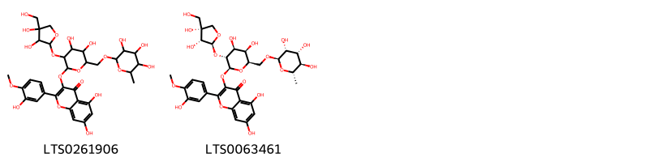
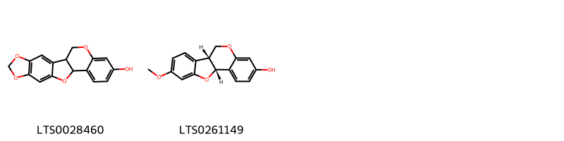
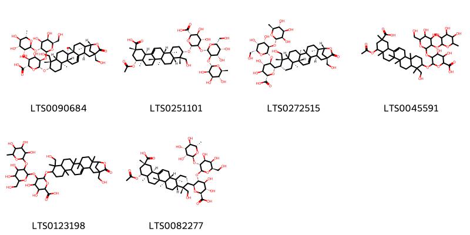
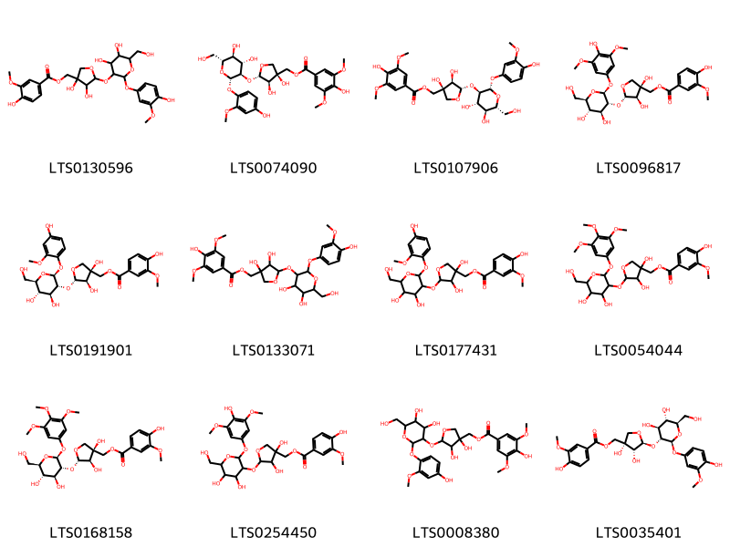

!!! abstract "Tóm tắt"
    Tên khoa học: Millettia speciosa Champ. (Fabaceae - Họ Đậu)
Phân bố: Cát Sâm phân bố chủ yếu tại miền Nam Trung Quốc (Hải Nam, Trung Trung Quốc, Đông Nam Trung Quốc) và Việt Nam. Ở Việt Nam, cây mọc nhiều tại các tỉnh miền núi và trung du như Thái Nguyên, Cao Bằng, Lạng Sơn, Yên Bái, thường gặp ở rừng thứ sinh, khu vực núi đá vôi dưới độ cao 1000m.
Kinh nghiệm sử dụng dân gian/y học cổ truyền: Trong y học cổ truyền, Cát Sâm được dùng để sinh tân dịch, chỉ khát, nhuận phế, lợi tiểu, điều trị các chứng như tân dịch hao tổn, háo khát, ho do phế nhiệt, đái buốt rắt. Khi sao vàng hoặc tẩm gừng, dược liệu có tác dụng bổ tỳ, ích khí, tiêu đờm và bồi bổ cơ thể.
Tác dụng dược lý: Cát Sâm có tác dụng chống ho, đồng thời có độc tính trong thân và lá.
Thành phần hóa học: Rễ Cát Sâm chứa alcaloid

## Thông tin về thực vật

### Đặc điểm thực vật

Dược liệu **Cát Sâm (Rễ)** từ bộ phận **** từ loài *Millettia speciosa Champ.* thuộc họ Fabaceae. Cát Sâm thuộc dạng cây nhỏ, thân gỗ, cây leo, chiều dài cây lên đến hàng mét.
Cành cây khi non có phủ một lớp lông mềm màu trắng, sau phát triển cành nhẵn, có màu nâu.
Lá kép lông chim, mọc so le. Các cuống lá có lông. Thường có 11 lá chét, phiến lá có dạng hình mũi mác thuôn hoặc hình bầu dục. Chiều dài lá khoảng 4 đến 7cm, chiều rộng từ 2 đến 3cm. Gốc lá có dạng hình tròn, đầu lá nhọn. Mặt trên của lá có màu lục sẫm, gần gân có nhiều lông, mặt dưới có lông dày màu trắng. Gân lá tạo thành hình mạng nhện rõ.
Cụm hoa tạo thành chùy ở tận cùng của cành, chiều dài cụm hoa từ 10 đến 20cm, có lông. Mỗi cụm hoa có nhiều hoa màu trắng hơi ngà.
Quả phủ nhiều lông mềm, các quả thắt lại ở các hạt, có từ 4-6 hạt, vỏ dày, màu đen.
Mùa hoa rơi vào tháng 7 đến tháng 9, mùa quả rơi vào tháng 10 đến tháng 12.
Lưu ý: Cần tránh nhầm lẫn với cây Sâm Gạo có tên khoa học là Vigna vexillata (L.) Benth. là loài cây có cùng họ nhưng chỉ có 3 lá chét. 

!!! info "Phân loại thực vật của *N/A*"
    - **Kingdom:** Plantae
    - **Phylum:** Tracheophyta
    - **Order:** Fabales
    - **Family:** Fabaceae
    - **Genus:** N/A
    - **Species:** *N/A*

*Tài liệu tham khảo:* "Những cây thuốc và vị thuốc Việt Nam" - Đỗ Tất Lợi

 

### Loài thay thế (Nếu có)

### Phân bố trên thế giới
**Từ vườn thực vật KEW: **: Bản địa: China South-Central, China Southeast, Hainan, Vietnam

**Từ CSDL GIBF** Tanzania, United Republic of, Australia, Spain, Croatia, Norfolk Island, Chile, Cambodia, Germany, Malaysia, Ireland, Thailand, Gambia, Brazil, New Zealand, Uganda, India, Argentina, Italy, China, United Kingdom of Great Britain and Northern Ireland, South Africa, Guam, Viet Nam, United States of America, Chinese Taipei, Portugal, France, Sri Lanka

### Phân bố tại Việt Nam
** "Những cây thuốc và vị thuốc Việt Nam" - Đỗ Tất Lợi**: Cát Sâm phân bố chủ yếu ở một số nước như Lào, Trung Quốc và Việt Nam. Tại nước ta, cây được tìm thấy ở các tỉnh thuộc miền núi và vùng trung du. Các tỉnh mà Cát Sâm tập trung nhiều như Thái Nguyên, Cao Bằng, Lạng Sơn, Bắc Kạn, Quảng Ninh, Yên Bái,... Độ cao phân bố thường dưới 1000 mét.
Là loại cây ưa ẩm, có khả năng chịu bóng khi còn non. Cát Sâm thường mọc lẫn trong các đám cây bụi hoặc cây gỗ ở những khu rừng thứ sinh, ven bờ nương, ven đồi, điển hình là những khu vực rừng ẩm thuộc núi đá vôi. Tại đây, những cây Cát Sâm thường có kích thước lớn hơn so với những cây mọc ở khu vực khác.
Cát Sâm ra hoa quả nhiều, tái sinh tốt từ hạt. Khi bị chặt phá, phần gốc vẫn có khả năng tái sinh thành cây mới.

**Từ CSDL GIBF**: Bà Rịa - Vũng Tàu, Đà Nẵng

---

## Thông tin về dược liệu 

### Định danh

!!! info "Thông tin về tên gọi của cát sâm"
    - Dược liệu tiếng Việt: cát sâm
    - Dược liệu tiếng Trung:  ()
    - Dược liệu tiếng Anh: 
    - Dược liệu latin thông dụng: Radix Millettiae speciosae
    - Dược liệu latin kiểu DĐVN: radix millettiae speciosae
    - Dược liệu latin kiểu DĐVN: 
    - Dược liệu latin kiểu thông tư: 
    - Bộ phận dùng:  (Radix)

### Mô tả dược liệu 
- **Theo dược điển Việt nam V:** Rễ củ hình trụ đều hay hai đầu thuôn nhỏ, được cắt thành đoạn dài 5 cm đến 15 cm, đường kính 1 cm đến 4 cm, có khi bổ dọc thành từng miếng. Mặt ngoài màu vàng nhạt đến vàng nâu, có nhiều vết nhăn dọc và rãnh ngang. Mặt cắt ngang màu trắng ngà, nhiều bột, có những tia ruột như hình nan hoa bánh xe.

- **Mô tả dược liệu theo thông tư chế biến dược liệu theo phương pháp cổ truyền:** 

### Chế biến 

- **Chế biến theo dược điển việt nam V**: Đào lấy rễ củ ở cây trồng được một năm, rửa sạch. Loại nhỏ để nguyên, loại to bổ dọc, phơi hay sấy khô, rễ củ bên ngoài vỏ màu vàng, bên trong trắng có ít xơ, nhiều bột là tốt.nBào chế cát sâm Lấy Cát sâm sạch, khi dùng thái mỏng, để sống hoặc tẩm nước gừng hay mật sao vàng. nn

- **Chế biến theo thông tư:** 

--- 

## Thành phần hóa học

- Theo tài liệu của GS. Đỗ Tất Lợi:  Rễ chứa Alcaloid
    
- Theo cơ sở dữ liệu lotus: Từ loài *N/A* đã phân lập và xác định được 22 hoạt chất thuộc về các nhóm Prenol lipids, Tannins, Flavonoids, Isoflavonoids. 

|    | chemicalTaxonomyClassyfireClass   |   smiles_count |
|---:|:----------------------------------|---------------:|
|  0 | Flavonoids                        |              2 |
|  1 | Isoflavonoids                     |              2 |
|  2 | Prenol lipids                     |              6 |
|  3 | Tannins                           |             12 |

### Nhóm Flavonoids
<figure markdown="span">
    { width=100% }
    <figcaption>Hình ảnh cấu trúc hóa học của 2 hoạt chất thuộc nhóm Flavonoids gồm ['3-[(3-{[3,4-dihydroxy-4-(hydroxymethyl)oxolan-2-yl]oxy}-4,5-dihydroxy-6-{[(3,4,5-trihydroxy-6-methyloxan-2-yl)oxy]methyl}oxan-2-yl)oxy]-5,7-dihydroxy-2-(3-hydroxy-4-methoxyphenyl)chromen-4-one (LTS0261906)', '3-{[(2s,3r,4s,5r,6r)-3-{[(2s,3r,4r)-3,4-dihydroxy-4-(hydroxymethyl)oxolan-2-yl]oxy}-4,5-dihydroxy-6-({[(2r,3r,4r,5r,6s)-3,4,5-trihydroxy-6-methyloxan-2-yl]oxy}methyl)oxan-2-yl]oxy}-5,7-dihydroxy-2-(3-hydroxy-4-methoxyphenyl)chromen-4-one (LTS0063461)'].</figcaption>
</figure>
### Nhóm Isoflavonoids
<figure markdown="span">
    { width=100% }
    <figcaption>Hình ảnh cấu trúc hóa học của 2 hoạt chất thuộc nhóm Isoflavonoids gồm ['maackiain (LTS0028460)', 'medicarpin, (-)- (LTS0261149)'].</figcaption>
</figure>
### Nhóm Prenol lipids
<figure markdown="span">
    { width=100% }
    <figcaption>Hình ảnh cấu trúc hóa học của 6 hoạt chất thuộc nhóm Prenol lipids gồm ['(2s,3s,4s,5r,6r)-6-{[(1r,2r,5s,6r,9r,10s,11s,14r,15r,19s,21r)-10,21-bis(hydroxymethyl)-2,5,6,10,14-pentamethyl-22-oxo-23-oxahexacyclo[19.2.1.0²,¹⁹.0⁵,¹⁸.0⁶,¹⁵.0⁹,¹⁴]tetracos-17-en-11-yl]oxy}-5-{[(2s,3r,4s,5r,6r)-4,5-dihydroxy-6-(hydroxymethyl)-3-{[(2s,3r,4r,5r,6s)-3,4,5-trihydroxy-6-methyloxan-2-yl]oxy}oxan-2-yl]oxy}-3,4-dihydroxyoxane-2-carboxylic acid (LTS0090684)', '(2s,3s,4s,5r,6r)-6-{[(3s,4s,4ar,6ar,6bs,8ar,9r,11r,12as,14ar,14br)-9-(acetyloxy)-11-carboxy-4-(hydroxymethyl)-4,6a,6b,8a,11,14b-hexamethyl-1,2,3,4a,5,6,7,8,9,10,12,12a,14,14a-tetradecahydropicen-3-yl]oxy}-5-{[(2s,3r,4s,5r,6r)-4,5-dihydroxy-6-(hydroxymethyl)-3-{[(2s,3r,4r,5r,6s)-3,4,5-trihydroxy-6-methyloxan-2-yl]oxy}oxan-2-yl]oxy}-3,4-dihydroxyoxane-2-carboxylic acid (LTS0251101)', '(2s,3s,4s,5r,6s)-6-[(1r,2r,5s,6r,9r,10r,11s,14r,15r,19s,21r)-10,21-bis(hydroxymethyl)-2,5,6,10,14-pentamethyl-22-oxo-23-oxahexacyclo[19.2.1.0²,¹⁹.0⁵,¹⁸.0⁶,¹⁵.0⁹,¹⁴]tetracos-17-en-11-yl]-5-{[(2s,3r,4s,5r,6r)-4,5-dihydroxy-6-(hydroxymethyl)-3-{[(2s,3r,4r,5r,6s)-3,4,5-trihydroxy-6-methyloxan-2-yl]oxy}oxan-2-yl]oxy}-3,4-dihydroxyoxane-2-carboxylic acid (LTS0272515)', '6-{[9-(acetyloxy)-11-carboxy-4-(hydroxymethyl)-4,6a,6b,8a,11,14b-hexamethyl-1,2,3,4a,5,6,7,8,9,10,12,12a,14,14a-tetradecahydropicen-3-yl]oxy}-5-{[4,5-dihydroxy-6-(hydroxymethyl)-3-[(3,4,5-trihydroxy-6-methyloxan-2-yl)oxy]oxan-2-yl]oxy}-3,4-dihydroxyoxane-2-carboxylic acid (LTS0045591)', '6-{[10,21-bis(hydroxymethyl)-2,5,6,10,14-pentamethyl-22-oxo-23-oxahexacyclo[19.2.1.0²,¹⁹.0⁵,¹⁸.0⁶,¹⁵.0⁹,¹⁴]tetracos-17-en-11-yl]oxy}-5-{[4,5-dihydroxy-6-(hydroxymethyl)-3-[(3,4,5-trihydroxy-6-methyloxan-2-yl)oxy]oxan-2-yl]oxy}-3,4-dihydroxyoxane-2-carboxylic acid (LTS0123198)', '(2s,3s,4s,5r,6s)-6-[(3s,4r,4ar,6ar,6bs,8ar,9r,11r,12as,14ar,14br)-9-(acetyloxy)-11-carboxy-4-(hydroxymethyl)-4,6a,6b,8a,11,14b-hexamethyl-1,2,3,4a,5,6,7,8,9,10,12,12a,14,14a-tetradecahydropicen-3-yl]-5-{[(2s,3r,4s,5r,6r)-4,5-dihydroxy-6-(hydroxymethyl)-3-{[(2s,3r,4r,5r,6s)-3,4,5-trihydroxy-6-methyloxan-2-yl]oxy}oxan-2-yl]oxy}-3,4-dihydroxyoxane-2-carboxylic acid (LTS0082277)'].</figcaption>
</figure>
### Nhóm Tannins
<figure markdown="span">
    { width=100% }
    <figcaption>Hình ảnh cấu trúc hóa học của 12 hoạt chất thuộc nhóm Tannins gồm ['(5-{[4,5-dihydroxy-2-(4-hydroxy-3-methoxyphenoxy)-6-(hydroxymethyl)oxan-3-yl]oxy}-3,4-dihydroxyoxolan-3-yl)methyl 4-hydroxy-3-methoxybenzoate (LTS0130596)', '[(3s,4r,5s)-5-{[(2s,3r,4s,5s,6r)-4,5-dihydroxy-2-(4-hydroxy-2-methoxyphenoxy)-6-(hydroxymethyl)oxan-3-yl]oxy}-3,4-dihydroxyoxolan-3-yl]methyl 4-hydroxy-3,5-dimethoxybenzoate (LTS0074090)', '[(3s,4r,5s)-5-{[(2s,3r,4s,5s,6r)-4,5-dihydroxy-2-(4-hydroxy-3-methoxyphenoxy)-6-(hydroxymethyl)oxan-3-yl]oxy}-3,4-dihydroxyoxolan-3-yl]methyl 4-hydroxy-3,5-dimethoxybenzoate (LTS0107906)', '[(3s,4r,5s)-5-{[(2s,3r,4s,5s,6r)-4,5-dihydroxy-2-(4-hydroxy-3,5-dimethoxyphenoxy)-6-(hydroxymethyl)oxan-3-yl]oxy}-3,4-dihydroxyoxolan-3-yl]methyl 4-hydroxy-3-methoxybenzoate (LTS0096817)', '[(3s,4r,5s)-5-{[(2s,3r,4s,5s,6r)-4,5-dihydroxy-2-(4-hydroxy-2-methoxyphenoxy)-6-(hydroxymethyl)oxan-3-yl]oxy}-3,4-dihydroxyoxolan-3-yl]methyl 4-hydroxy-3-methoxybenzoate (LTS0191901)', '(5-{[4,5-dihydroxy-2-(4-hydroxy-3-methoxyphenoxy)-6-(hydroxymethyl)oxan-3-yl]oxy}-3,4-dihydroxyoxolan-3-yl)methyl 4-hydroxy-3,5-dimethoxybenzoate (LTS0133071)', '(5-{[4,5-dihydroxy-2-(4-hydroxy-2-methoxyphenoxy)-6-(hydroxymethyl)oxan-3-yl]oxy}-3,4-dihydroxyoxolan-3-yl)methyl 4-hydroxy-3-methoxybenzoate (LTS0177431)', '(5-{[4,5-dihydroxy-6-(hydroxymethyl)-2-(3,4,5-trimethoxyphenoxy)oxan-3-yl]oxy}-3,4-dihydroxyoxolan-3-yl)methyl 4-hydroxy-3-methoxybenzoate (LTS0054044)', '[(3s,4r,5s)-5-{[(2s,3r,4s,5s,6r)-4,5-dihydroxy-6-(hydroxymethyl)-2-(3,4,5-trimethoxyphenoxy)oxan-3-yl]oxy}-3,4-dihydroxyoxolan-3-yl]methyl 4-hydroxy-3-methoxybenzoate (LTS0168158)', '(5-{[4,5-dihydroxy-2-(4-hydroxy-3,5-dimethoxyphenoxy)-6-(hydroxymethyl)oxan-3-yl]oxy}-3,4-dihydroxyoxolan-3-yl)methyl 4-hydroxy-3-methoxybenzoate (LTS0254450)', '(5-{[4,5-dihydroxy-2-(4-hydroxy-2-methoxyphenoxy)-6-(hydroxymethyl)oxan-3-yl]oxy}-3,4-dihydroxyoxolan-3-yl)methyl 4-hydroxy-3,5-dimethoxybenzoate (LTS0008380)', '[(3s,4r,5s)-5-{[(2s,3r,4s,5s,6r)-4,5-dihydroxy-2-(4-hydroxy-3-methoxyphenoxy)-6-(hydroxymethyl)oxan-3-yl]oxy}-3,4-dihydroxyoxolan-3-yl]methyl 4-hydroxy-3-methoxybenzoate (LTS0035401)'].</figcaption>
</figure>

---

## Tác dụng dược lý

Theo tài liệu "Những cây thuốc và vị thuốc Việt Nam" - Đỗ Tất Lợi:- Chống ho
- Độc tính của thân và lá của cây Cát Sâm

Theo tài liệu quốc tế: 

---

## Dược điển Việt Nam V

### Soi bột:
Bột màu vàng nhạt. Soi kính hiển vi thấy: Nhiều sợi dài có thành dày. Tinh thể calci oxalat hình thoi, mảnh mô mềm chứa tinh bột, mảnh mạch điểm. Đám tế bào mô cứng màu vàng. Hạt tinh bột hình tròn, hình chuông, hình trứng, có hạt kép đôi, kép ba, rốn hình điểm hay hình chữ V. nn
<!-- Hình ảnh soi bột sẽ được tự động chèn vào đây sau -->
### Vi phẫu:
Lớp bần gồm 4 đến 8 hàng tế bào hình chữ nhật nằm ngang đều đặn. Tầng phát sinh ngoài có một hàng tế bào. Mô cứng gồm 3 đến 4 hàng tế bào thành dày, có chứa linh thể calci oxalat hình thoi. Mô mềm vỏ gồm những tế bào thành mỏng hình đa giác. Trong mô mềm vỏ có sợi hợp thành từng bó. Libe gồm những tế bào nhỏ đều đặn. Trong libe cũng có bó sợi rải rác. Tầng phát sinh libe-gỗ có một hàng tế bào. Mạch gỗ to, tròn. Xung quanh mạch gỗcó những hàng tế bào mô mềm gỗ vuông văn xếp đều đặn. Tia ruột có 3 đến 4 hàng tế bào hình chữ nhật xếp theo hướng xuyên tâm. Mô mềm ruột gồm những tế bào hình đa giác.
<!-- Hình ảnh vi phẫu sẽ được tự động chèn vào đây sau -->
### Định tính

Dưới ánh súng tử ngoại, bột dược liệu có màu trắng sáng. Lấy 5 g bột dược liệu, thêm 10 ml ethanol 90 % (TT), đun cách thủy trong 15 min. Lọc lấy dịch lọc để làm các phản ứng sau: Cho 5 ml dịch chiết vào ống nghiệm, bịt miệng ống, lắc trong 15 s. Cột bọt bền ít nhất trong vòng 10 min. Lấy 1 ml dịch chiết vào ống nghiệm sạch, cô cạn, hòa tan cắn bằng 1 ml anhydrid acetic (TT), thêm từ từ theo thành ống 1ml acid sulfuric (TT). Xuất hiện vòng đỏ đậm giữa 2 lớp dung dịch thử.

### Định lượng

### Thông tin khác 
- ** Độ ẩm: ** Không quá 12,0 % (Phụ lục 9.6, 1 g, 105 °c, 5 h).

- ** Bảo quản:** 
## Dược điển Hồng kong

<!-- PDF sẽ được tự động chèn vào đây sau -->

---

## Y dược học cổ truyền

- **Tên vị thuốc:** 
- **Tính vị quy kinh:** Cam, bình. Vào các kinh phế, tỳ.
- **Công năng chủ trị:** Sinh tân dịch, chì khát, nhuận phế, lợi tiểu. Chủ trị: Tân dịch hao tổn, háo khát, ho do phế nhiệt, đái buốt rắt.
Sao vàng: Bổ tỳ, ích khí, tiêu đờm. Tẩm gừng ích tỳ, tâm mật bồi dưỡng cơ thế. Chủ trị: Cơ thể suy yếu, nhức đầu, khát nước, sốt về chiều, bí tiểu tiện.
- **Chú ý:** 
- **Kiêng kỵ:** Không dùng chung với Lê lô; đang nôn mửa, ỉa chảy do lạnh, không phải âm hư, phổi rảo, không nên dùng.nn

