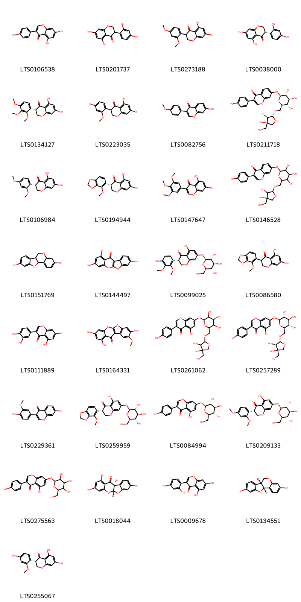
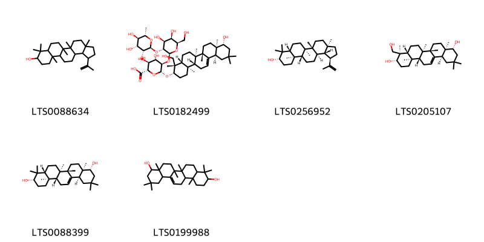

!!! abstract "Tóm tắt"
    Kim tiền thảo có tên khoa học là Desmodium styracifolium (Osbeck.) Merr. Họ thực vật Fabaceae (Họ Đậu). Là loại cây cỏ, mọc bò, cao 30-50cm. Ngọn non dẹt, phủ lông trắng. Lá so le, 1-3 lá chét tròn, mặt dưới trắng bạc, gân rõ. Hoa màu tía, mọc xim ở kẽ lá. Quả đậu nhỏ, giữa các hạt thắt lại. Ra hoa quả từ tháng 3-5. Người ta dùng toàn cây, thu hái chủ yếu vào mùa hè và thu, dùng tươi hay phơi hoặc sao khô. Phân bố trên thế giới chủ yếu ở Nam Á, Đông Nam Á, Đông Nam Trung Quốc, và các đảo khu vực Đông Nam Á. Còn ở Việt Nam cây mọc hoang dại trên những đổi vùng đồi núi trung du, một số ít vùng núi. Thành phần hóa học gồm Polysaccharid, Saponin triterpenic, Flavonoid isovitexin, vicenin glycosid, isoorientin và các nhóm khác như desmodimin, desmodilacton, lupenon, lupcol, tritriacontan, acid stearic, cicosanoic acid eicosylester, beta - sitosterol. Cây kim tiền thảo có tác dụng dược lý là ức chế hình thành sỏi thận (calci oxalat), tăng tiết mật, bảo vệ gan mật, hạ huyết áp, giảm nhịp tim, tăng lưu lượng mạch vành, giảm tiêu thụ oxy cơ tim, chống thiếu máu cơ tim, rối loạn nhịp tim, tăng sức co bóp tim trên chuột lang, hạ huyết áp qua thụ thể cholinergic và ức chế adrenergic. Tính vị quy kinh là Cam, hàm, lương. Quy vào các kinh can, đơm, thận, bàng quang. Cây có công năng chủ trị là thanh thấp nhiệt, lợi tiểu và chủ trị là nhiệt lâm, thạch lâm, phù thũng, hoàng đản.

## Thông tin về thực vật

### Đặc điểm thực vật

Dược liệu **Cây Kim Tiền Thảo - Phần Trên Mặt Đất** từ bộ phận **Trên mặt đất** từ loài *Desmodium styracifolium (Osbeck.) Merr* thuộc họ Fabaceae. Cây cỏ, cao 30-50cm, mọc bò. Ngọn non dẹt và có phủ lông tơ, màu trắng. Lá mọc so le, gồm một hoặc ba lá chét tròn dài 1,8-3,4cm, rộng 2-3,5cm, do đó có tên đồng tiền, mặt dưới có lòng trắng bạc, mặt trên có những đường gân rất rõ. Hoa màu tía, mọc thành thịnh xim ở kẽ lá. Quả đậu nhỏ, giữa các hạt thắt lại. Mùa hoa quả: Tháng 3-5 

!!! info "Phân loại thực vật của *Grona styracifolia*"
    - **Kingdom:** Plantae
    - **Phylum:** Tracheophyta
    - **Order:** Fabales
    - **Family:** Fabaceae
    - **Genus:** Grona
    - **Species:** *Grona styracifolia*

*Tài liệu tham khảo:* "Những cây thuốc và vị thuốc Việt Nam" - Đỗ Tất Lợi

 

### Loài thay thế (Nếu có)

### Phân bố trên thế giới
**Từ vườn thực vật KEW: **: Assam, Bangladesh, Cambodia, Caroline Is., China South-Central, China Southeast, East Himalaya, Hainan, India, Jawa, Lesser Sunda Is., Malaya, Maluku, Myanmar, Philippines, Sri Lanka, Sulawesi, Sumatera, Thailand, Vietnam

**Từ CSDL GIBF** nan, Lao People’s Democratic Republic, Viet Nam, China, Indonesia, United States of America, Cambodia, Palau, Malaysia, Philippines, Thailand

### Phân bố tại Việt Nam
** "Những cây thuốc và vị thuốc Việt Nam" - Đỗ Tất Lợi**: Cây mọc hoang dại trên những đổi vùng đồi núi trung du, một số ít vùng núi

**Từ CSDL GIBF**: Tay Ninh, Dac Lac, Dong Nai, Thanh Hoa, Ba Ria Vung Tau, Song Be

---

## Thông tin về dược liệu 

### Định danh

!!! info "Thông tin về tên gọi của kim tiền thảo"
    - Dược liệu tiếng Việt: kim tiền thảo
    - Dược liệu tiếng Trung: 广金钱草 (Guang Jin Qian Cao)
    - Dược liệu tiếng Anh: Desmodium Styracifolium
    - Dược liệu latin thông dụng: Herba Desmodii styracifoliinHerba Desmodii Styracifolii
    - Dược liệu latin kiểu DĐVN: herba desmodii styracifolii
    - Dược liệu latin kiểu DĐVN: Herba Desmodii Styracifolii
    - Dược liệu latin kiểu thông tư: None
    - Bộ phận dùng: Trên mặt đất (Herba)

### Mô tả dược liệu 
- **Theo dược điển Việt nam V:** 
Dược liệu có thân hình trụ, cắt ngắn thành đoạn dài 3 cm đến 5 cm, đường kính khoảng 0,2 cm đến 0,3 cm, phủ đầy lông mềm, ngắn, màu vàng. Chất hơi giòn, mặt bẻ lởm chởm. Lá đơn hay kép mọc so le, lá kép gồm 3 lá chét, tròn hoặc thuôn, đường kính 2 cm đến 4 cm, đinh tròn, tù, gốc hình tim hoặc tù, mép nguyên, mặt trên màu lục hơi vàng hoặc màu lục xám, nhẵn; mặt dưới hơi trắng, có lông. Gân hình lông chim, cuống dài 1 cm đến 2 cm, hai lá kèm hình mũi mác dài khoảng 0,8 cm. Mùi thơm.

- **Mô tả dược liệu theo thông tư chế biến dược liệu theo phương pháp cổ truyền:** 

### Chế biến 

- **Chế biến theo dược điển việt nam V**: 
Thu hoạch vào mùa hạ, mùa thu, rửa sạch dược liệu, loại bỏ tạp chất, cắt thành đoạn ngắn, phơi khô. Bào chế Loại bỏ tạp chất, rửa sạch, cắt đoạn và phơi khô.nn

- **Chế biến theo thông tư:** 

--- 

## Thành phần hóa học

- Theo tài liệu của GS. Đỗ Tất Lợi:  (1) Nhóm hoá học
- Polysaccharid 
- Saponin triterpenic, trong đó có soyasaponin I
- Flavonoid isovitexin, vicenin glycosid, isoorientin 
- Các nhóm khác: desmodimin, desmodilacton, lupenon, lupcol, tritriacontan, acid stearic, cicosanoic acid eicosylester, beta - sitosterol
    
- Theo cơ sở dữ liệu lotus: Từ loài *Grona styracifolia* đã phân lập và xác định được 63 hoạt chất thuộc về các nhóm Isoflavonoids, Prenol lipids, Carboxylic acids and derivatives, Indoles and derivatives, Flavonoids. 

|    | chemicalTaxonomyClassyfireClass   |   smiles_count |
|---:|:----------------------------------|---------------:|
|  0 | Carboxylic acids and derivatives  |              2 |
|  1 | Flavonoids                        |             25 |
|  2 | Indoles and derivatives           |              1 |
|  3 | Isoflavonoids                     |             29 |
|  4 | Prenol lipids                     |              6 |

### Nhóm Carboxylic acids and derivatives
<figure markdown="span">
    { width=100% }
    <figcaption>Hình ảnh cấu trúc hóa học của 2 hoạt chất thuộc nhóm Carboxylic acids and derivatives gồm ['n-(4,5-dimethyl-2-oxooxolan-3-yl)ethanimidic acid (LTS0124965)', 'n-[(3r,4r,5s)-4,5-dimethyl-2-oxooxolan-3-yl]ethanimidic acid (LTS0179019)'].</figcaption>
</figure>
### Nhóm Flavonoids
<figure markdown="span">
    { width=100% }
    <figcaption>Hình ảnh cấu trúc hóa học của 25 hoạt chất thuộc nhóm Flavonoids gồm ['isoschaftoside (LTS0157117)', '5,7-dihydroxy-2-(4-hydroxyphenyl)-8-[3,4,5-trihydroxy-6-(hydroxymethyl)oxan-2-yl]-6-(3,4,5-trihydroxyoxan-2-yl)chromen-4-one (LTS0108519)', 'orientin (LTS0143863)', 'orientin (LTS0172349)', 'isoorientin (LTS0043542)', 'astragalin (LTS0249588)', 'isovitexin (LTS0035187)', 'isoorientin (LTS0061958)', 'schaftoside (LTS0104338)', 'chrysoeriol (LTS0095766)', '(+)-dihydrokaempferol (LTS0134832)', 'isoscoparin (LTS0179973)', '(2s,3r)-2-(2,4-dihydroxyphenyl)-3,5,7-trihydroxy-2,3-dihydro-1-benzopyran-4-one (LTS0096236)', '2-(3,4-dihydroxyphenyl)-5,7-dihydroxy-3-{[3,4,5-trihydroxy-6-(hydroxymethyl)oxan-2-yl]oxy}chromen-4-one (LTS0195312)', '5,7-dihydroxy-2-(4-hydroxy-3-methoxyphenyl)-6-[3,4,5-trihydroxy-6-(hydroxymethyl)oxan-2-yl]chromen-4-one (LTS0187801)', 'aromadendrin (LTS0153299)', 'isovitexin (LTS0209186)', 'kaempherol (LTS0155822)', 'carlinoside (LTS0088939)', 'isoquercetin (LTS0254337)', 'trifolin (LTS0267055)', '5,7-dihydroxy-2-(4-hydroxyphenyl)-6-[3,4,5-trihydroxy-6-(hydroxymethyl)oxan-2-yl]-8-(3,4,5-trihydroxyoxan-2-yl)chromen-4-one (LTS0218423)', 'quercetin (LTS0004651)', 'luteolin (LTS0017052)', '2-(2,4-dihydroxyphenyl)-3,5,7-trihydroxy-2,3-dihydro-1-benzopyran-4-one (LTS0092162)'].</figcaption>
</figure>
### Nhóm Indoles and derivatives
<figure markdown="span">
    { width=100% }
    <figcaption>Hình ảnh cấu trúc hóa học của 1 hoạt chất thuộc nhóm Indoles and derivatives gồm ['n-[2-(5-methoxy-1h-indol-3-yl)ethyl]ethanimidic acid (LTS0219322)'].</figcaption>
</figure>
### Nhóm Isoflavonoids
<figure markdown="span">
    { width=100% }
    <figcaption>Hình ảnh cấu trúc hóa học của 29 hoạt chất thuộc nhóm Isoflavonoids gồm ['genistein (LTS0106538)', '(+-)-dalbergioidin (LTS0201737)', 'homoferreirin (LTS0273188)', '(3s)-3-(2,4-dihydroxyphenyl)-5,7-dihydroxy-2,3-dihydro-1-benzopyran-4-one (LTS0038000)', '(3s)-5,7-dihydroxy-3-(2,3,4-trimethoxyphenyl)-2,3-dihydro-1-benzopyran-4-one (LTS0134127)', 'isoferreirin (LTS0223035)', 'formononetin (LTS0082756)', 'ambonin (LTS0211718)', '(3s)-3-(2,4-dimethoxyphenyl)-5,7-dihydroxy-2,3-dihydro-1-benzopyran-4-one (LTS0106984)', '(3s)-5,7-dihydroxy-3-(4-methoxy-2h-1,3-benzodioxol-5-yl)-2,3-dihydro-1-benzopyran-4-one (LTS0194944)', 'panchovillin (LTS0147647)', '7-{[6-({[3,4-dihydroxy-4-(hydroxymethyl)oxolan-2-yl]oxy}methyl)-3,4,5-trihydroxyoxan-2-yl]oxy}-3-(4-hydroxyphenyl)chromen-4-one (LTS0146528)', 'demethylmedicarpin (LTS0151769)', 'lupinalbin a (LTS0144497)', '(3s)-5-hydroxy-3-(4-hydroxy-2,3-dimethoxyphenyl)-7-{[(2s,3r,4s,5s,6r)-3,4,5-trihydroxy-6-(hydroxymethyl)oxan-2-yl]oxy}-2,3-dihydro-1-benzopyran-4-one (LTS0099025)', '5,7-dihydroxy-3-(4-methoxy-2h-1,3-benzodioxol-5-yl)-2,3-dihydro-1-benzopyran-4-one (LTS0086580)', 'quercitin (LTS0111889)', '5,7,14-trihydroxy-13-methoxy-2,17-dioxatetracyclo[8.7.0.0³,⁸.0¹¹,¹⁶]heptadeca-1(10),3,5,7,11(16),12,14-heptaen-9-one (LTS0164331)', '7-{[6-({[3,4-dihydroxy-4-(hydroxymethyl)oxolan-2-yl]oxy}methyl)-3,4,5-trihydroxyoxan-2-yl]oxy}-5-hydroxy-3-(4-hydroxyphenyl)chromen-4-one (LTS0261062)', 'ambocin (LTS0257289)', "3'-methoxydaidzein (LTS0229361)", '(3s)-5-hydroxy-3-(4-methoxy-2h-1,3-benzodioxol-5-yl)-7-{[(2s,3r,4s,5s,6r)-3,4,5-trihydroxy-6-(hydroxymethyl)oxan-2-yl]oxy}-2,3-dihydro-1-benzopyran-4-one (LTS0259959)', 'genistin (LTS0084994)', '(3s)-3-(2,4-dimethoxyphenyl)-5-hydroxy-7-{[(2s,3r,4s,5s,6r)-3,4,5-trihydroxy-6-(hydroxymethyl)oxan-2-yl]oxy}-2,3-dihydro-1-benzopyran-4-one (LTS0209133)', '5-hydroxy-3-(4-hydroxyphenyl)-7-{[3,4,5-trihydroxy-6-(hydroxymethyl)oxan-2-yl]oxy}chromen-4-one (LTS0275563)', '(1r,10r)-5,7,10,14-tetrahydroxy-2,17-dioxatetracyclo[8.7.0.0³,⁸.0¹¹,¹⁶]heptadeca-3,5,7,11,13,15-hexaen-9-one (LTS0018044)', "2'-hydroxygenistein (LTS0009678)", '3,9-dihydroxypterocarpan (LTS0134551)', '(3s)-5,7-dihydroxy-3-(4-hydroxy-2-methoxyphenyl)-2,3-dihydro-1-benzopyran-4-one (LTS0255067)'].</figcaption>
</figure>
### Nhóm Prenol lipids
<figure markdown="span">
    { width=100% }
    <figcaption>Hình ảnh cấu trúc hóa học của 6 hoạt chất thuộc nhóm Prenol lipids gồm ['lupeol (LTS0088634)', 'soyasaponin i (LTS0182499)', 'lupeol (LTS0256952)', '(3s,4r,4ar,6ar,6bs,8ar,9r,12as,14ar,14br)-4-(hydroxymethyl)-4,6a,6b,8a,11,11,14b-heptamethyl-1,2,3,4a,5,6,7,8,9,10,12,12a,14,14a-tetradecahydropicene-3,9-diol (LTS0205107)', 'sophoradiol (LTS0088399)', '4,4,6a,6b,8a,11,11,14b-octamethyl-1,2,3,4a,5,6,7,8,9,10,12,12a,14,14a-tetradecahydropicene-3,9-diol (LTS0199988)'].</figcaption>
</figure>

---

## Tác dụng dược lý

Theo tài liệu "Những cây thuốc và vị thuốc Việt Nam" - Đỗ Tất Lợi:- Tác dụng ức chế sự hình thành sỏi calci oxalat ở thận
- Đối với gan mật, kim tiền thảo có tác dụng tăng cường sự phân tiết dịch mật.
- Đối với hệ tim mạch,làm tăng lưu lượng mạch vành 197%, hạ huyết áp khoảng 30%, làm tim đập chậm, đồng thời giảm mức tiêu thụ oxygen của cơ tim.
- Kim tiền thảo có tác dụng chống lại các triệu chứng do pituitrin gây ra như giảm lưu lượng mạch vành, thiếu máu cơ tim trên điện tâm đồ, và rối loạn nhịp tim.
- Trên tiêu bản tim cô lập chuột lang, kim tiền thảo có tác dụng tăng sức co bóp.
- Dạng chiết nước của kim tiền thảo có tác dụng hạ huyết áp bằng cách kích thích thụ thể cholinergic, ức chế thụ thể adrenergic, và giảm co bóp động mạch chủ do methoxamin gây ra.
- Ngoài ra, còn có tác dụng hạ huyết áp do có thành phần flavonoid

Theo tài liệu quốc tế: To remove damp-heat, induce diuresis and relieve dysuria.

---

## Dược điển Việt Nam V

### Soi bột:

Bột có màu lục nhạt, mùi thơm, vị ngọt nhạt. Soi kính hiển vi thấỵ: Lông che chở đa bào gồm chân có 1 đến 2 tế bào rất ngắn, phần trên của lông rất dài, có đầu nhọn; lông che chở đơn bào ngắn, đầu nhọn hay có móc hình câu. Lông tiết đa bào chân phình to gồm 2 hàng tế bào, mỗi hàng khoảng 4 đến 5 tế bào với chất tiết màu vàng, phần trên của lông thuôn dài, đầu tù. Mảnh biểu bì mang lông che chở và lỗ chân lông bị gãy còn sót lại, có hình tròn. Lỗ khí kiểu song bào (1 to, 1 nhỏ) thường nằm rời. Mảnh biểu bì dưới của lá mang đầy lông che chở. Mảnh biểu bì thân gồm những tế bào dài, thành mỏng bên trong thường có rải rác vết sắc to màu nâu, vàng nâu. Thỉnh thoảng có tế bào mô cứng có thành dày. Nhiều bó sợi bị tưa ra. Mảnh mạch vạch, mạch xoắn, mạch điểm.

<!-- Hình ảnh soi bột sẽ được tự động chèn vào đây sau -->
### Vi phẫu:

Lá: Có gân lồi ở mặt dưới. Tế bào biểu bì của gân chính có kích thước nhỏ hơn so với tế bào ở phiến lá. Mặt trên của phiến lá nhẵn, mặt dưới mang nhiều lông che chở và lông tiết. Lông che chở có loại đa bào, dài (chân có 1 đến 2 tế bào rất ngắn, tế bào ở đầu rất dài), cũng có loại đơn bào ngắn hơn và đầu thường cong hình móc câu. Lông tiết đa bào có chân phình to gồm nhiều tế bào, phía trên lông thon nhỏ, đầu tù. Mô mềm dậu và mô mềm ở 2 bên phiến lá hơi lấn sâu vào phần gân lá khá đặc biệt. Lớp mô dày góc nằm sát biểu bì trên và dưới của gân chính. Đám mô cứng nhỏ có hình tròn rất đặc sắc bao bọc bó libe-gỗ phụ, nằm sát lớp mô dày trên. Bó libe-gỗ chính hình cung, sát libe là một vòng mô cứng, đa số phát triển thành sợi. Thân: Mặt cắt gần như tròn. Biểu bì gồm những tế bào khá nhỏ mang nhiều lông che chở, lông tiết (giống như ở lá). Mô dày phiến gồm 2 đến 3 lớp tế bào. Mô mềm vỏ, thỉnh thoảng có những khoảng gian bào, thành hơi nhẵn, ở vùng sát với mô cứng thường có chứa tinh thể calci oxalat hình khối lập phương. Mô cứng thường hóa sợi tạo thành cung phủ lên bó libe. Bó libe-gỗ gồm libe cấp 1 là những tế bào nhỏ có thành mỏng, xếp lộn xộn, có nhiều quản bào. Libe cấp 2 gần như liên tục gồm những tế bào xếp đồng tâm và xuyên tâm khá đều đặn, Gỗ tạo từng bó gồm gỗ cấp 2 và gỗ cấp 1, xen kẽ giữa những tia gỗ. Tầng sinh libe-gỗ khá liên tục. Mô mềm tủy rộng, cấu tạo bởi những tế bào hình nhiều cạnh, rải rác có tinh thể calci oxalat hình khối lăng trụ (nằm sát phần bị nhuộm màu xanh với thuốc nhuộm carmin-lục iod) rất đặc biệt.

<!-- Hình ảnh vi phẫu sẽ được tự động chèn vào đây sau -->
### Định tính

A. Lấy 2 g bột dược liệu, thêm 50 ml nước, đun nóng trong cách thủy trong 15 min, thỉnh thoảng lắc nhẹ. Để nguội, lọc qua giấy lọc, bốc hơi dịch lọc đến cắn. Hòa tan cắn bằng 5 ml ethanol 96 % (TT) được dung dịch A. Lấy 2 ml dung dịch A, thêm vào một ít bột magnesi (TT) và 3 giọt đến 5 giọt acid hydrocloric (TT), sẽ xuất hiện màu hồng đen đỏ. B. Phương pháp sắc ký lớp mỏng (Phụ lục 5.4). Bản mỏng: Silica gel GF254 Dung môi khai triển: Ethyl acetat – acid formic – acid acetic – nước (100 : 11 : 11 : 26). Dung dịch thử: Lấy 3 g bột dược liệu cho vào bình nón nút mài 100 ml, thêm 50 ml methanol (TT). Lắc siêu âm trong 30 min, lọc qua giấy lọc, cô dịch lọc trên cách thủy đến cắn. Hòa cắn trong 30 ml nước nóng rồi chuyển vào bình gan, đổ nguội, thêm 30 ml cloroform (TT), lắc kỹ. Gạn bỏ dịch chiết cloroform (lớp dưới), lớp nước được lắc hai lần với n-butanol (TT), mỗi lần 30 ml. Gộp các dịch chiết n-butanol, cô trên cách thủy đến cạn. Hòa tan cắn trong 2 ml ethanol (TT) được dung dịch thử. Dung dịch đối chiếu: Lấy 3 g Kim tiền thảo (mẫu chuẩn). Tiến hành chiết như mô tả ở phần Dung dịch thử. Cách tiến hành: Chấm riêng biệt lên bản mỏng 10 µl mỗi dung dịch thử và dung dịch đối chiếu. Sau khi triển khai xong, lấy bản mỏng ra để khô trong không khí, phun dung dịch nhôm clorid 3 % (TT). Quan sát dưới ánh sáng tử ngoại ở bước sóng 366 nm. Sắc ký đồ của dung dịch thử phải có các vết có cùng màu sắc và cùng giá trị Rf với các vết trên sắc ký đồ của dung dịch đối chiếu.

### Định lượng

Không được dưới 8,0 % tính theo dược liệu khô kiệt. Tiến hành theo phương pháp chiết nóng (Phụ lục 12.10). Dùng ethanol 95 % (TT) làm dung môi.

### Thông tin khác 
- ** Độ ẩm: ** 
Không quá 13,0 % (Phụ lục 9.6, 1 g, 85 °C, 5 h).

- ** Bảo quản:** 
Để nơi khô ráo, thoáng mát.nn

## Dược điển Hồng kong

<!-- PDF sẽ được tự động chèn vào đây sau -->

---

## Y dược học cổ truyền

- **Tên vị thuốc:** Kim tiền thảo
- **Tính vị quy kinh:** Cam, hàm, lương. Quy vào các kinh can, đơm, thận, bàng quang.
- **Công năng chủ trị:** Thanh thấp nhiệt, lợi tiểu. Chủ trị: Nhiệt lâm, thạch lâm, phù thũng, hoàng đản.
- **Chú ý:** 
- **Kiêng kỵ:** 

