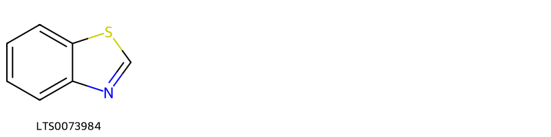
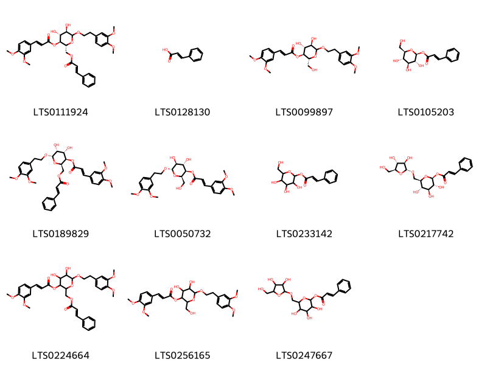
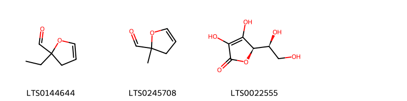
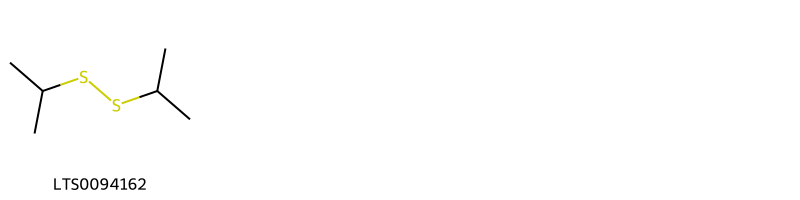
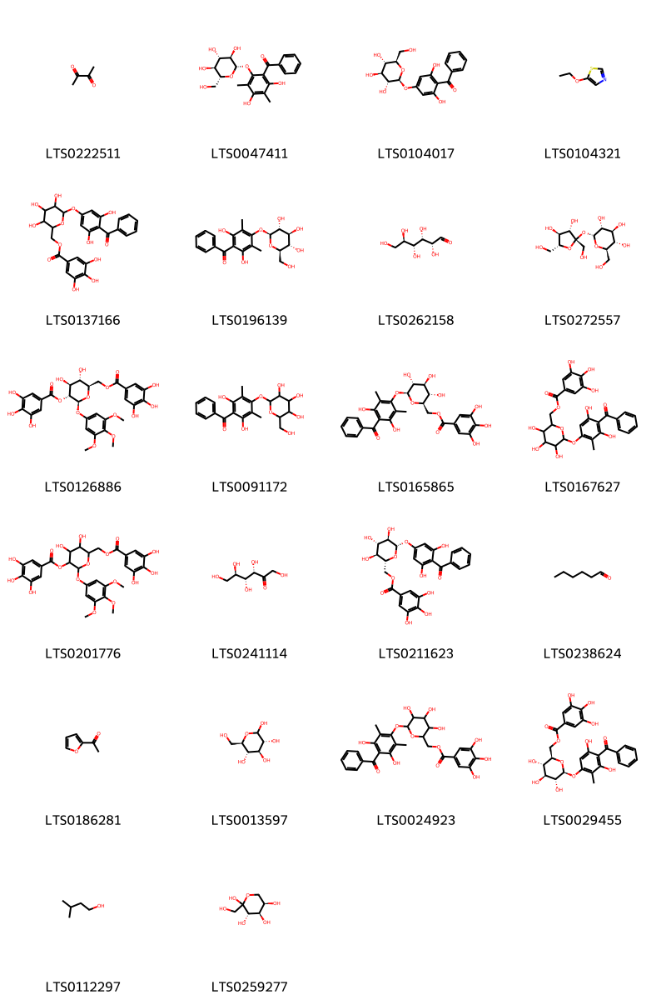
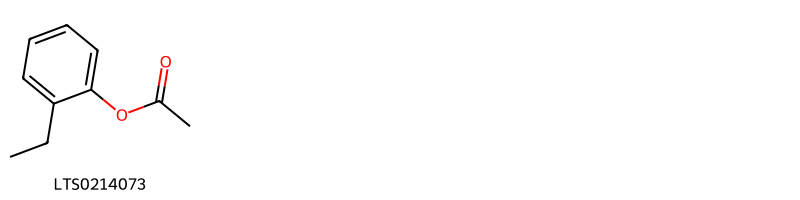
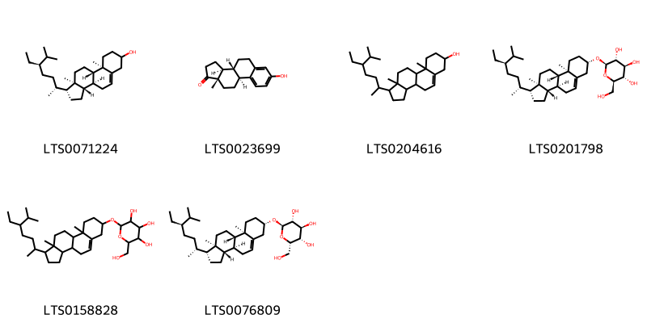
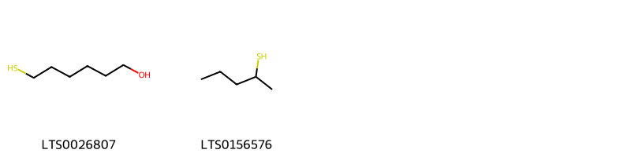

!!! abstract "Tóm tắt"
    Cây Ổi (Lá), tên khoa học Psidium guajava L., thuộc họ Sim (Myrtaceae), là cây nhỡ cao khoảng 3-5m, có lá mọc đối, phiến nguyên, chứa túi tinh dầu, hoa màu trắng, và quả mọng nhiều hạt, hình dáng thay đổi tùy loài. Cây có nguồn gốc từ Nam Mỹ, hiện phân bố rộng rãi trên thế giới và được trồng phổ biến tại Việt Nam để ăn quả cũng như làm thuốc.

Lá ổi chứa nhiều thành phần hóa học có giá trị như tinh dầu (0,36%), tanin pyrogalic (7-10%), nhựa (khoảng 3%), acid psiditanic, chất triterpenic (lupeol, amyrin), cùng với flavonoid (quercetin), acid phenolic (gallic acid, chlorogenic acid), và vitamin C. Các thành phần này mang lại nhiều tác dụng dược lý, đặc biệt là khả năng kháng khuẩn, kháng viêm, chống oxy hóa và làm săn mô niêm mạc.

Trong y học cổ truyền, lá non được dùng phổ biến để chữa đau bụng, đi ngoài, và tiêu chảy bằng cách sắc nước uống riêng hoặc phối hợp với các vị thuốc như gừng, chè. Nước sắc lá ổi được sử dụng để trị bệnh lỵ, tắm hạ sốt, chống co thắt. Đắp lá giã nát lên vùng khớp giúp giảm đau, viêm khớp. Cao chiết từ lá còn được ứng dụng trong điều trị động kinh, múa giật, trong khi cồn thuốc từ lá xoa lên cột sống hỗ trợ giảm co giật ở trẻ em. Nước sắc lá ổi súc miệng giúp giảm đau răng, trị nhọt ở lợi.

Không chỉ tại Việt Nam, lá ổi cũng được dùng rộng rãi ở các quốc gia khác với mục đích tương tự. Ở Haiti, nước sắc lá ổi được uống để trị tiêu chảy, trong khi tại Mexico, cao chiết từ lá được ứng dụng chữa tiêu chảy không nhiễm khuẩn. Tại Bờ Biển Ngà, nước sắc lá ổi không chỉ giúp thông mặt mà còn hỗ trợ điều trị tiêu chảy hiệu quả. Những ứng dụng đa dạng này cho thấy lá ổi là một nguồn dược liệu quý giá trong y học dân gian và hiện đại.

## Thông tin về thực vật

### Đặc điểm thực vật

Dược liệu **Cây Ổi (Lá)** từ bộ phận **nan** từ loài *Psidium guajava L.* thuộc họ Myrtaceae. Ổi là một cây nhỡ, cao chừng 3-5m, cành nhỏ thì vuông cạnh. Lá mọc đối có cuống ngắn, hình bầu dục, nhẵn hoặc hơi có lông ở mặt trên, mặt dưới có lông mịn, phiến nguyên, khi soi lên có thấy túi tinh dầu trong. Hoa màu trắng, mọc đơn độc ở kẽ lá. Quả là một quả mọng có vỏ quả giữa dày, hình dáng thay đổi tùy theo loài; ở đầu quả có sẹo của đài tồn tại. Rất nhiều hạt, hình thận, không đều, màu hơi hung. 

!!! info "Phân loại thực vật của *Psidium guajava*"
    - **Kingdom:** Plantae
    - **Phylum:** Tracheophyta
    - **Order:** Myrtales
    - **Family:** Myrtaceae
    - **Genus:** Psidium
    - **Species:** *Psidium guajava*

*Tài liệu tham khảo:* "Những cây thuốc và vị thuốc Việt Nam" - Đỗ Tất Lợi

 

### Loài thay thế (Nếu có)

### Phân bố trên thế giới
**Từ vườn thực vật KEW: **: Nguồn gốc:
Argentina Northeast, Argentina Northwest, Bolivia, Brazil Northeast, Brazil South, Brazil Southeast, Brazil West-Central, Colombia, Ecuador, Paraguay, Peru, Venezuela.
Di thực:
Andaman Is., Angola, Ascension, Assam, Bahamas, Bangladesh, Belize, Bermuda, Bismarck Archipelago, Borneo, Burkina, Canary Is., Cape Provinces, Cape Verde, Caroline Is., Cayman Is., Central African Republic, Chagos Archipelago, China South-Central, China Southeast, Christmas I., Comoros, Cook Is., Costa Rica, Cuba, Dominican Republic, Easter Is., El Salvador, Eritrea, Ethiopia, Florida, French Guiana, Gabon, Galápagos, Gambia, Gilbert Is., Guatemala, Guinea, Guinea-Bissau, Gulf of Guinea Is., Guyana, Hainan, Haiti, Hawaii, Honduras, India, Ivory Coast, Jamaica, Kenya, Kermadec Is., KwaZulu-Natal, Leeward Is., Lesser Sunda Is., Line Is., Louisiana, Madeira, Malawi, Malaya, Marianas, Marquesas, Marshall Is., Mauritania, Mexico Central, Mexico Gulf, Mexico Northeast, Mexico Northwest, Mexico Southeast, Mexico Southwest, Mozambique, Namibia, Nansei-shoto, Nauru, New Caledonia, Nicaragua, Nicobar Is., Niue, Norfolk Is., Northern Provinces, Ogasawara-shoto, Panamá, Puerto Rico, Samoa, Society Is., South China Sea, Southwest Caribbean, St.Helena, Sulawesi, Suriname, Taiwan, Tanzania, Tonga, Trinidad-Tobago, Tuamotu, Tubuai Is., Turks-Caicos Is., Uganda, Vanuatu, Venezuelan Antilles, Wallis-Futuna Is., Windward Is., Zambia, Zaïre, Zimbabwe.

**Từ CSDL GIBF** Australia, Puerto Rico, Haiti, Thailand, Brazil, Singapore, Antigua and Barbuda, Uganda, India, Argentina, Ethiopia, Mexico, Costa Rica, Colombia, Ecuador, Peru, South Africa, Bonaire, Sint Eustatius and Saba, Philippines, Dominican Republic, Jamaica, United States of America, Bahamas, Chinese Taipei, Benin

### Phân bố tại Việt Nam
** "Những cây thuốc và vị thuốc Việt Nam" - Đỗ Tất Lợi**: Mọc hoang tại nhiều vùng núi miền Bắc, phần nhiều trồng lấy ăn quả.

**Từ CSDL GIBF**: Không có ghi nhận ở Việt Nam

---

## Thông tin về dược liệu 

### Định danh

!!! info "Thông tin về tên gọi của nan"
    - Dược liệu tiếng Việt: nan
    - Dược liệu tiếng Trung: nan (nan)
    - Dược liệu tiếng Anh: nan
    - Dược liệu latin thông dụng: nan
    - Dược liệu latin kiểu DĐVN: psidium guajava l.
    - Dược liệu latin kiểu DĐVN: nan
    - Dược liệu latin kiểu thông tư: nan
    - Bộ phận dùng: nan (nan)

### Mô tả dược liệu 
- **Theo dược điển Việt nam V:** nan

- **Mô tả dược liệu theo thông tư chế biến dược liệu theo phương pháp cổ truyền:** nan

### Chế biến 

- **Chế biến theo dược điển việt nam V**: nan

- **Chế biến theo thông tư:** nan

--- 

## Thành phần hóa học

- Theo tài liệu của GS. Đỗ Tất Lợi:  Nhóm Tanin: Tanin pyrogalic (7-10%): 
Nhóm Acid hữu cơ: Axit psiditanic
Nhóm Nhựa (khoảng 3%)
Nhóm Tinh dầu (0,36%)
Nhóm Triterpenoid
Nhóm Flavonoid (quercetin, quercetin glycoside)
Nhóm Acid phenolic (gallic acid, chlorogenic acid)
Nhóm Vitamin và Khoáng chất (Vitamin C và vi chất)
    
- Theo cơ sở dữ liệu lotus: Từ loài *Psidium guajava* đã phân lập và xác định được 266 hoạt chất thuộc về các nhóm Dihydrofurans, Organic disulfides, Benzothiazoles, Tannins, Organooxygen compounds, Thiols, Prenol lipids, Carboxylic acids and derivatives, Steroids and steroid derivatives, Fatty Acyls, Neoflavonoids, Benzene and substituted derivatives, Saturated hydrocarbons, Heteroaromatic compounds, Coumarins and derivatives, Phenol esters, Cinnamic acids and derivatives, Flavonoids. 

|    | chemicalTaxonomyClassyfireClass     |   smiles_count |
|---:|:------------------------------------|---------------:|
|  0 | Benzene and substituted derivatives |             10 |
|  1 | Benzothiazoles                      |              1 |
|  2 | Carboxylic acids and derivatives    |              5 |
|  3 | Cinnamic acids and derivatives      |             11 |
|  4 | Coumarins and derivatives           |              1 |
|  5 | Dihydrofurans                       |              3 |
|  6 | Fatty Acyls                         |             15 |
|  7 | Flavonoids                          |             47 |
|  8 | Heteroaromatic compounds            |              3 |
|  9 | Neoflavonoids                       |              3 |
| 10 | Organic disulfides                  |              1 |
| 11 | Organooxygen compounds              |             22 |
| 12 | Phenol esters                       |              1 |
| 13 | Prenol lipids                       |             84 |
| 14 | Saturated hydrocarbons              |              1 |
| 15 | Steroids and steroid derivatives    |              6 |
| 16 | Tannins                             |             50 |
| 17 | Thiols                              |              2 |

### Nhóm Benzene and substituted derivatives
<figure markdown="span">
    { width=100% }
    <figcaption>Hình ảnh cấu trúc hóa học của 10 hoạt chất thuộc nhóm Benzene and substituted derivatives gồm ['toluene (LTS0047403)', 'm-xylene (LTS0151729)', 'benzaldehyde (LTS0094193)', 'phenethyl acetate (LTS0136181)', 'ortho-xylene (LTS0161849)', 'galop (LTS0222857)', 'methyl gallate (LTS0043810)', 'para-xylene (LTS0005367)', 'ethylbenzene (LTS0122434)', '4-vinyltoluene (LTS0274783)'].</figcaption>
</figure>
### Nhóm Benzothiazoles
<figure markdown="span">
    { width=100% }
    <figcaption>Hình ảnh cấu trúc hóa học của 1 hoạt chất thuộc nhóm Benzothiazoles gồm ['benzothiazole (LTS0073984)'].</figcaption>
</figure>
### Nhóm Carboxylic acids and derivatives
<figure markdown="span">
    { width=100% }
    <figcaption>Hình ảnh cấu trúc hóa học của 5 hoạt chất thuộc nhóm Carboxylic acids and derivatives gồm ['ethyl acetate (LTS0196824)', 'banana oil (LTS0226270)', 'hexyl acetate (LTS0202355)', 'butyl acetate (LTS0047300)', 'isobutyl acetate (LTS0266600)'].</figcaption>
</figure>
### Nhóm Cinnamic acids and derivatives
<figure markdown="span">
    { width=100% }
    <figcaption>Hình ảnh cấu trúc hóa học của 11 hoạt chất thuộc nhóm Cinnamic acids and derivatives gồm ['[(2r,3s,4r,5r)-6-[2-(3,4-dimethoxyphenyl)ethoxy]-3-{[(2e)-3-(3,4-dimethoxyphenyl)prop-2-enoyl]oxy}-4,5-dihydroxyoxan-2-yl]methyl (2e)-3-phenylprop-2-enoate (LTS0111924)', 'cinnamic acid (LTS0128130)', '(2r,3s,4r,5r)-6-[2-(3,4-dimethoxyphenyl)ethoxy]-4,5-dihydroxy-2-(hydroxymethyl)oxan-3-yl (2e)-3-(3,4-dimethoxyphenyl)prop-2-enoate (LTS0099897)', 'trans-cinnamoyl β-d-glucoside (LTS0105203)', '[(2r,3r,4s,5r,6s)-6-[2-(3,4-dimethoxyphenyl)ethoxy]-3-{[(2e)-3-(3,4-dimethoxyphenyl)prop-2-enoyl]oxy}-4,5-dihydroxyoxan-2-yl]methyl (2e)-3-phenylprop-2-enoate (LTS0189829)', '(2r,3r,4s,5s,6s)-6-[2-(3,4-dimethoxyphenyl)ethoxy]-4,5-dihydroxy-2-(hydroxymethyl)oxan-3-yl (2e)-3-(3,4-dimethoxyphenyl)prop-2-enoate (LTS0050732)', '3,4,5-trihydroxy-6-(hydroxymethyl)oxan-2-yl 3-phenylprop-2-enoate (LTS0233142)', '(2s,3r,4s,5s,6r)-6-({[(2r,3r,4r,5s)-3,4-dihydroxy-5-(hydroxymethyl)oxolan-2-yl]oxy}methyl)-3,4,5-trihydroxyoxan-2-yl (2e)-3-phenylprop-2-enoate (LTS0217742)', '{6-[2-(3,4-dimethoxyphenyl)ethoxy]-3-{[3-(3,4-dimethoxyphenyl)prop-2-enoyl]oxy}-4,5-dihydroxyoxan-2-yl}methyl 3-phenylprop-2-enoate (LTS0224664)', '6-[2-(3,4-dimethoxyphenyl)ethoxy]-4,5-dihydroxy-2-(hydroxymethyl)oxan-3-yl 3-(3,4-dimethoxyphenyl)prop-2-enoate (LTS0256165)', '6-({[3,4-dihydroxy-5-(hydroxymethyl)oxolan-2-yl]oxy}methyl)-3,4,5-trihydroxyoxan-2-yl 3-phenylprop-2-enoate (LTS0247667)'].</figcaption>
</figure>
### Nhóm Coumarins and derivatives
<figure markdown="span">
    { width=100% }
    <figcaption>Hình ảnh cấu trúc hóa học của 1 hoạt chất thuộc nhóm Coumarins and derivatives gồm ['7-(2,3-dihydroxy-3-methylbutoxy)-6-methoxychromen-2-one (LTS0226325)'].</figcaption>
</figure>
### Nhóm Dihydrofurans
<figure markdown="span">
    { width=100% }
    <figcaption>Hình ảnh cấu trúc hóa học của 3 hoạt chất thuộc nhóm Dihydrofurans gồm ['2-ethyl-3h-furan-2-carbaldehyde (LTS0144644)', '2-methyl-3h-furan-2-carbaldehyde (LTS0245708)', 'vitamin c (LTS0022555)'].</figcaption>
</figure>
### Nhóm Fatty Acyls
<figure markdown="span">
    { width=100% }
    <figcaption>Hình ảnh cấu trúc hóa học của 15 hoạt chất thuộc nhóm Fatty Acyls gồm ['palmitic acid (LTS0079439)', 'octyl acetate (LTS0217143)', 'ethyl butyrate (LTS0106732)', 'ethyl caprate (LTS0106514)', 'ethyl palmitate (LTS0111042)', 'ethyl octanoate (LTS0207229)', 'octanol (LTS0250216)', 'myristic acid (LTS0102566)', 'methyl caproate (LTS0235403)', 'ethyl hexanoate (LTS0021856)', 'ethyl laurate (LTS0057246)', 'lauric acid (LTS0051907)', 'caprylic acid (LTS0254176)', 'capric acid (LTS0039856)', 'ethylmyristate (LTS0033616)'].</figcaption>
</figure>
### Nhóm Flavonoids
<figure markdown="span">
    { width=100% }
    <figcaption>Hình ảnh cấu trúc hóa học của 47 hoạt chất thuộc nhóm Flavonoids gồm ['bois d,arc (LTS0113386)', '(+)-catechol (LTS0117079)', "quercetin-4'-glucuronide (LTS0120473)", '4-(2,4,6-trihydroxyphenyl)-2-(3,4,5-trihydroxyphenyl)-3,4-dihydro-2h-1-benzopyran-3,5,7-triol (LTS0138014)', 'epigallocatechin (LTS0175767)', 'isorhamnetin 3-glucoside (LTS0135622)', '(2r,3r,4s)-4-[(2r,3s)-3,5,7-trihydroxy-2-(3,4,5-trihydroxyphenyl)-3,4-dihydro-2h-1-benzopyran-8-yl]-2-(3,4,5-trihydroxyphenyl)-3,4-dihydro-2h-1-benzopyran-3,5,7-triol (LTS0205697)', 'hyperoside (LTS0089156)', '(5-{[2-(3,4-dihydroxyphenyl)-5,7-dihydroxy-4-oxochromen-3-yl]oxy}-3,4-dihydroxyoxolan-2-yl)methyl 3,4,5-trihydroxybenzoate (LTS0067672)', '4-[2-(3,4-dihydroxyphenyl)-3,5,7-trihydroxy-3,4-dihydro-2h-1-benzopyran-8-yl]-2-(3,4,5-trihydroxyphenyl)-3,4-dihydro-2h-1-benzopyran-3,5,7-triol (LTS0166764)', '2-(3,4-dihydroxyphenyl)-5,7-dihydroxy-3-{[3,4,5-trihydroxy-6-(hydroxymethyl)oxan-2-yl]oxy}chromen-4-one (LTS0195312)', '2-(3,4-dihydroxyphenyl)-5,7-dihydroxy-3-{[(2r,3r,4s,5r)-3,4,5-trihydroxyoxan-2-yl]oxy}chromen-4-one (LTS0058760)', '(2r,3r,4s)-4-(2,4,6-trihydroxyphenyl)-2-(3,4,5-trihydroxyphenyl)-3,4-dihydro-2h-1-benzopyran-3,5,7-triol (LTS0090730)', 'prodelphinidin b6 (LTS0189036)', '2-(3,4-dihydroxyphenyl)-5,7-dihydroxy-3-{[(2s,3r,4s,5r)-3,4,5-trihydroxyoxan-2-yl]oxy}-2,3-dihydro-1-benzopyran-4-one (LTS0135293)', '(2r,3r,4r)-2-(3,4-dihydroxyphenyl)-4-[(2r,3r)-2-(3,4-dihydroxyphenyl)-3,5,7-trihydroxy-3,4-dihydro-2h-1-benzopyran-8-yl]-3,4-dihydro-2h-1-benzopyran-3,5,7-triol (LTS0135510)', 'gallocatechol (LTS0267305)', '4-[3,5,7-trihydroxy-2-(3,4,5-trihydroxyphenyl)-3,4-dihydro-2h-1-benzopyran-8-yl]-2-(3,4,5-trihydroxyphenyl)-3,4-dihydro-2h-1-benzopyran-3,5,7-triol (LTS0144797)', '3-{[3,4-dihydroxy-5-(hydroxymethyl)oxolan-2-yl]oxy}-2-(3,4-dihydroxyphenyl)-5,7-dihydroxychromen-4-one (LTS0145172)', '(2r,3s,4s)-2-(3,4-dihydroxyphenyl)-4-[(2r,3s)-2-(3,4-dihydroxyphenyl)-3,5,7-trihydroxy-3,4-dihydro-2h-1-benzopyran-8-yl]-3,4-dihydro-2h-1-benzopyran-3,5,7-triol (LTS0151498)', '(2r,3r,4r)-2-(3,4-dihydroxyphenyl)-4-[(2r,3r,4s)-2-(3,4-dihydroxyphenyl)-5,7-dihydroxy-3-(3,4,5-trihydroxybenzoyloxy)-4-(2,4,6-trihydroxyphenyl)-3,4-dihydro-2h-1-benzopyran-8-yl]-5,7-dihydroxy-3,4-dihydro-2h-1-benzopyran-3-yl 3,4,5-trihydroxybenzoate (LTS0113413)', '(2r,3r)-2-(3,4-dihydroxyphenyl)-4-[(2r,3r)-2-(3,4-dihydroxyphenyl)-3,5,7-trihydroxy-3,4-dihydro-2h-1-benzopyran-8-yl]-3,4-dihydro-2h-1-benzopyran-3,5,7-triol (LTS0097406)', 'isorhamnetin (LTS0107505)', '2-(3,4-dihydroxyphenyl)-5,7-dihydroxy-3-{[(2s,3r,4s,5r)-3,4,5-trihydroxyoxan-2-yl]oxy}chromen-4-one (LTS0096793)', '2-(2,4-dihydroxyphenyl)-5,7-dihydroxy-3-{[(2s,3r,4r,5s)-3,4,5-trihydroxyoxan-2-yl]oxy}chromen-4-one (LTS0165225)', '5,7-dihydroxy-4-(2,4,6-trihydroxyphenyl)-2-(3,4,5-trihydroxyphenyl)-3,4-dihydro-2h-1-benzopyran-3-yl 3,4,5-trihydroxybenzoate (LTS0108335)', '[(2s,3r,4r,5s)-5-{[2-(3,4-dihydroxyphenyl)-5,7-dihydroxy-4-oxochromen-3-yl]oxy}-3,4-dihydroxyoxolan-2-yl]methyl 3,4,5-trihydroxybenzoate (LTS0181998)', 'isoquercetin (LTS0254337)', '2-(3,4-dihydroxyphenyl)-4-(2,4,6-trihydroxyphenyl)-3,4-dihydro-2h-1-benzopyran-3,5,7-triol (LTS0217490)', '(2r,3r,4s)-2-(3,4-dihydroxyphenyl)-5,7-dihydroxy-4-(2,4,6-trihydroxyphenyl)-3,4-dihydro-2h-1-benzopyran-3-yl 3,4,5-trihydroxybenzoate (LTS0080185)', 'guaijaverin (LTS0065676)', '(2s,3s,4r,5s,6s)-6-{[2-(3,4-dihydroxyphenyl)-5,7-dihydroxy-4-oxochromen-3-yl]oxy}-3,4,5-trihydroxyoxane-2-carboxylic acid (LTS0221249)', '2-(3,4-dihydroxyphenyl)-5,7-dihydroxy-3-{[(2s,3r,4r,5s,6r)-3,4,5-trihydroxy-6-(hydroxymethyl)oxan-2-yl]oxy}chromen-4-one (LTS0220665)', '2-(3,4-dihydroxyphenyl)-4-[2-(3,4-dihydroxyphenyl)-3,5,7-trihydroxy-3,4-dihydro-2h-1-benzopyran-8-yl]-3,4-dihydro-2h-1-benzopyran-3,5,7-triol (LTS0040252)', '(2r,3r,4s)-5,7-dihydroxy-4-(2,4,6-trihydroxyphenyl)-2-(3,4,5-trihydroxyphenyl)-3,4-dihydro-2h-1-benzopyran-3-yl 3,4,5-trihydroxybenzoate (LTS0164241)', 'avicularin (LTS0034490)', '(2r,3s,4s)-4-[(2r,3s)-2-(3,4-dihydroxyphenyl)-3,5,7-trihydroxy-3,4-dihydro-2h-1-benzopyran-8-yl]-2-(3,4,5-trihydroxyphenyl)-3,4-dihydro-2h-1-benzopyran-3,5,7-triol (LTS0226562)', '2-(3,4-dihydroxyphenyl)-5,7-dihydroxy-4-(2,4,6-trihydroxyphenyl)-3,4-dihydro-2h-1-benzopyran-3-yl 3,4,5-trihydroxybenzoate (LTS0262848)', '(2r,3r,4r)-2-(3,4-dihydroxyphenyl)-4-[(2r,3s)-2-(3,4-dihydroxyphenyl)-3,5,7-trihydroxy-3,4-dihydro-2h-1-benzopyran-8-yl]-3,4-dihydro-2h-1-benzopyran-3,5,7-triol (LTS0066122)', 'quercetin (LTS0004651)', 'guaijaverin (LTS0015984)', '2-(2,4-dihydroxyphenyl)-5,7-dihydroxy-3-[(3,4,5-trihydroxyoxan-2-yl)oxy]chromen-4-one (LTS0012927)', 'catechol (LTS0090912)', '2-(2,4-dihydroxyphenyl)-5,7-dihydroxy-3-{[(2s,3r,4s,5s)-3,4,5-trihydroxyoxan-2-yl]oxy}chromen-4-one (LTS0088793)', '(2r,3s,4s)-4-[(2r,3s)-3,5,7-trihydroxy-2-(3,4,5-trihydroxyphenyl)-3,4-dihydro-2h-1-benzopyran-8-yl]-2-(3,4,5-trihydroxyphenyl)-3,4-dihydro-2h-1-benzopyran-3,5,7-triol (LTS0116861)', 'guaijaverin (LTS0119144)', '2-(3,4-dihydroxyphenyl)-4-[2-(3,4-dihydroxyphenyl)-5,7-dihydroxy-3-(3,4,5-trihydroxybenzoyloxy)-4-(2,4,6-trihydroxyphenyl)-3,4-dihydro-2h-1-benzopyran-8-yl]-5,7-dihydroxy-3,4-dihydro-2h-1-benzopyran-3-yl 3,4,5-trihydroxybenzoate (LTS0042465)'].</figcaption>
</figure>
### Nhóm Heteroaromatic compounds
<figure markdown="span">
    { width=100% }
    <figcaption>Hình ảnh cấu trúc hóa học của 3 hoạt chất thuộc nhóm Heteroaromatic compounds gồm ['2-methylthiophene (LTS0159316)', '3-methylthiophene (LTS0170362)', '2-ethylthiophene (LTS0066895)'].</figcaption>
</figure>
### Nhóm Neoflavonoids
<figure markdown="span">
    { width=100% }
    <figcaption>Hình ảnh cấu trúc hóa học của 3 hoạt chất thuộc nhóm Neoflavonoids gồm ['14,16-dihydroxy-1,5,5-trimethyl-8-methylidene-12-phenyl-19-oxatetracyclo[9.8.0.0⁴,⁷.0¹³,¹⁸]nonadeca-13,15,17-triene-15,17-dicarbaldehyde (LTS0072352)', '(1s,4s,7r,11r,12s)-14,16-dihydroxy-1,5,5-trimethyl-8-methylidene-12-phenyl-19-oxatetracyclo[9.8.0.0⁴,⁷.0¹³,¹⁸]nonadeca-13,15,17-triene-15,17-dicarbaldehyde (LTS0200238)', '(1s,4s,7r,11r,12r)-14,16-dihydroxy-1,5,5-trimethyl-8-methylidene-12-phenyl-19-oxatetracyclo[9.8.0.0⁴,⁷.0¹³,¹⁸]nonadeca-13,15,17-triene-15,17-dicarbaldehyde (LTS0014065)'].</figcaption>
</figure>
### Nhóm Organic disulfides
<figure markdown="span">
    { width=100% }
    <figcaption>Hình ảnh cấu trúc hóa học của 1 hoạt chất thuộc nhóm Organic disulfides gồm ['isopropyl disulfide (LTS0094162)'].</figcaption>
</figure>
### Nhóm Organooxygen compounds
<figure markdown="span">
    { width=100% }
    <figcaption>Hình ảnh cấu trúc hóa học của 22 hoạt chất thuộc nhóm Organooxygen compounds gồm ['diacetyl (LTS0222511)', '(2s,3r,4s,5s,6r)-2-(2-benzoyl-3,5-dihydroxy-4,6-dimethylphenoxy)-6-(hydroxymethyl)oxane-3,4,5-triol (LTS0047411)', '(2s,3r,4s,5s,6r)-2-(4-benzoyl-3,5-dihydroxyphenoxy)-6-(hydroxymethyl)oxane-3,4,5-triol (LTS0104017)', '5-ethoxy-1,3-thiazole (LTS0104321)', '[6-(4-benzoyl-3,5-dihydroxyphenoxy)-3,4,5-trihydroxyoxan-2-yl]methyl 3,4,5-trihydroxybenzoate (LTS0137166)', '(2s,3r,4s,5s,6r)-2-(4-benzoyl-3,5-dihydroxy-2,6-dimethylphenoxy)-6-(hydroxymethyl)oxane-3,4,5-triol (LTS0196139)', '(+)-glucose (LTS0262158)', 'sucrose (LTS0272557)', '[(2r,3s,4s,5r,6s)-3,4-dihydroxy-5-(3,4,5-trihydroxybenzoyloxy)-6-(3,4,5-trimethoxyphenoxy)oxan-2-yl]methyl 3,4,5-trihydroxybenzoate (LTS0126886)', '2-(4-benzoyl-3,5-dihydroxy-2,6-dimethylphenoxy)-6-(hydroxymethyl)oxane-3,4,5-triol (LTS0091172)', '[(2r,3s,4s,5r,6s)-6-(4-benzoyl-3,5-dihydroxy-2,6-dimethylphenoxy)-3,4,5-trihydroxyoxan-2-yl]methyl 3,4,5-trihydroxybenzoate (LTS0165865)', '[6-(4-benzoyl-3,5-dihydroxy-2-methylphenoxy)-3,4,5-trihydroxyoxan-2-yl]methyl 3,4,5-trihydroxybenzoate (LTS0167627)', '[3,4-dihydroxy-5-(3,4,5-trihydroxybenzoyloxy)-6-(3,4,5-trimethoxyphenoxy)oxan-2-yl]methyl 3,4,5-trihydroxybenzoate (LTS0201776)', 'keto-d-fructose (LTS0241114)', '[(2r,3s,4s,5r,6s)-6-(4-benzoyl-3,5-dihydroxyphenoxy)-3,4,5-trihydroxyoxan-2-yl]methyl 3,4,5-trihydroxybenzoate (LTS0211623)', 'hexanal (LTS0238624)', 'acetylfuran (LTS0186281)', 'glucose (LTS0013597)', '[6-(4-benzoyl-3,5-dihydroxy-2,6-dimethylphenoxy)-3,4,5-trihydroxyoxan-2-yl]methyl 3,4,5-trihydroxybenzoate (LTS0024923)', '[(2r,3s,4s,5r,6s)-6-(4-benzoyl-3,5-dihydroxy-2-methylphenoxy)-3,4,5-trihydroxyoxan-2-yl]methyl 3,4,5-trihydroxybenzoate (LTS0029455)', 'isoamyl alcohol (LTS0112297)', 'd-fructopyranose (LTS0259277)'].</figcaption>
</figure>
### Nhóm Phenol esters
<figure markdown="span">
    { width=100% }
    <figcaption>Hình ảnh cấu trúc hóa học của 1 hoạt chất thuộc nhóm Phenol esters gồm ['2-ethylphenyl acetate (LTS0214073)'].</figcaption>
</figure>
### Nhóm Prenol lipids
<figure markdown="span">
    { width=100% }
    <figcaption>Hình ảnh cấu trúc hóa học của 84 hoạt chất thuộc nhóm Prenol lipids gồm ['urs-12-ene-3β,28-diol (LTS0136738)', '(6e,8e,10e,12e,14z,16e,18e,20e,22e,24e,26e)-2,6,10,14,19,23,27,31-octamethyldotriaconta-2,6,8,10,12,14,16,18,20,22,24,26,30-tridecaene (LTS0195810)', 'squalene (LTS0217821)', '10-hydroxy-11-{[3-(4-hydroxyphenyl)prop-2-enoyl]oxy}-1,2,6a,6b,9,9,12a-heptamethyl-2,3,4,5,6,7,8,8a,10,11,12,12b,13,14b-tetradecahydro-1h-picene-4a-carboxylic acid (LTS0128070)', '4,4,7a-trimethyl-2-[(2e,4e,6e,8e)-6,11,15-trimethyl-17-(2,6,6-trimethylcyclohex-1-en-1-yl)heptadeca-2,4,6,8,10,12,14,16-octaen-2-yl]-2,5,6,7-tetrahydro-1-benzofuran-6-ol (LTS0220535)', 'carotenoid (LTS0205297)', '2-[(1r,2e,4r,7e)-4,8-dimethylcyclodeca-2,7-dien-1-yl]propan-2-ol (LTS0206499)', '2-(acetyloxy)-10,11-dihydroxy-1,2,6a,6b,9,9,12a-heptamethyl-1,3,4,5,6,7,8,8a,10,11,12,12b,13,14b-tetradecahydropicene-4a-carboxylic acid (LTS0041606)', '(1s,4s,5r,8r,10r,11r,13s,14r,17s,18r,19s,20r)-10,11-dihydroxy-4,5,9,9,13,19,20-heptamethyl-24-oxahexacyclo[15.5.2.0¹,¹⁸.0⁴,¹⁷.0⁵,¹⁴.0⁸,¹³]tetracos-15-en-23-one (LTS0081334)', '3,5,5-trimethyl-4-[(1e,3e,5e,7e,9e)-3,7,12,16-tetramethyl-18-(2,6,6-trimethylcyclohex-1-en-1-yl)octadeca-1,3,5,7,9,11,13,15,17-nonaen-1-yl]cyclohex-3-en-1-ol (LTS0132454)', '(r)-β-bisabolene (LTS0077209)', '(1s,4s,5s,8s,10s,11r,13r,14r,17s,18s,19s,20r)-10,11-dihydroxy-4,5,9,9,13,19,20-heptamethyl-24-oxahexacyclo[15.5.2.0¹,¹⁸.0⁴,¹⁷.0⁵,¹⁴.0⁸,¹³]tetracos-15-en-23-one (LTS0190805)', '(16e,18e,20e,22e,24e,26e)-2,6,10,14,19,23,27,31-octamethyldotriaconta-2,6,8,10,12,14,16,18,20,22,24,26,30-tridecaene (LTS0046783)', 'caryophyllene oxide (LTS0159789)', 'α-myrcene (LTS0115731)', 'β-selinene (LTS0096341)', '2,4,6-trihydroxy-5-({4-hydroxy-1,1,4,7-tetramethyl-octahydrocyclopropa[e]azulen-7-yl}(phenyl)methyl)benzene-1,3-dicarbaldehyde (LTS0120439)', 'lycopene (LTS0116567)', 'nerolidol (LTS0197738)', '(12e,14e,16e,18e,20e,22e,24e,26e)-2,6,10,14,19,23,27,31-octamethyldotriaconta-2,6,8,10,12,14,16,18,20,22,24,26,30-tridecaene (LTS0205714)', '(1r,4ar,8as)-4-isopropyl-1,6-dimethyl-3,4,4a,7,8,8a-hexahydro-2h-naphthalen-1-ol (LTS0136437)', 'α pinene (LTS0132416)', 'asiatic acid (LTS0198395)', 'humulene (LTS0263171)', '(6e,8e,10z,12z,14e,16e,18e,20e,22e,24e,26e)-2,6,10,14,19,23,27,31-octamethyldotriaconta-2,6,8,10,12,14,16,18,20,22,24,26,30-tridecaene (LTS0192109)', '5-[(s)-[(1ar,4r,4ar,7s,7as,7br)-4-hydroxy-1,1,4,7-tetramethyl-octahydrocyclopropa[e]azulen-7-yl](phenyl)methyl]-2,4,6-trihydroxybenzene-1,3-dicarbaldehyde (LTS0132798)', '(3r,6e)-nerolidol (LTS0145065)', '1,3,3-trimethyl-2-[3,7,12,16-tetramethyl-18-(2,6,6-trimethylcyclohex-1-en-1-yl)octadeca-1,3,5,7,9,11,13,15,17-nonaen-1-yl]cyclohex-1-ene (LTS0165867)', '(1r)-4-[(1e,3e,5e,7e,9e,11e,13e,15e,17z,19e)-3,7,12,16,20,24-hexamethylpentacosa-1,3,5,7,9,11,13,15,17,19,23-undecaen-1-yl]-3,5,5-trimethylcyclohex-3-en-1-ol (LTS0151341)', '10,11-dihydroxy-9-({[3-(4-hydroxyphenyl)prop-2-enoyl]oxy}methyl)-1,2,6a,6b,9,12a-hexamethyl-2,3,4,5,6,7,8,8a,10,11,12,12b,13,14b-tetradecahydro-1h-picene-4a-carboxylic acid (LTS0142647)', 'β-eudesmol (LTS0203280)', '10,11-dihydroxy-1,2,6a,6b,9,9,12a-heptamethyl-2,3,4,5,6,7,8,8a,10,11,12,12b,13,14b-tetradecahydro-1h-picene-4a-carboxylic acid (LTS0122037)', 'limonene,  (LTS0155981)', '(1s,2r,4as,6as,6br,10r,11r,12ar,14bs)-11-hydroxy-10-{[(2e)-3-(4-hydroxyphenyl)prop-2-enoyl]oxy}-1,2,6a,6b,9,9,12a-heptamethyl-2,3,4,5,6,7,8,8a,10,11,12,12b,13,14b-tetradecahydro-1h-picene-4a-carboxylic acid (LTS0140007)', 'ursolic acid (LTS0250838)', 'β,β-carotene (LTS0168447)', 'phytofluene (LTS0181914)', 'cryptoxanthin (LTS0132646)', '(1s,4as,6br,12ar,14bs)-11-hydroxy-10-{[(2e)-3-(4-hydroxyphenyl)prop-2-enoyl]oxy}-1,2,6a,6b,9,9,12a-heptamethyl-2,3,4,5,6,7,8,8a,10,11,12,12b,13,14b-tetradecahydro-1h-picene-4a-carboxylic acid (LTS0249725)', '(15z)-lycopene (LTS0066147)', 'caryophyllene (LTS0085212)', '(1s,2r,4as,6as,6br,9s,10r,11r,12ar)-10,11-dihydroxy-9-({[(2e)-3-(4-hydroxyphenyl)prop-2-enoyl]oxy}methyl)-1,2,6a,6b,9,12a-hexamethyl-2,3,4,5,6,7,8,8a,10,11,12,12b,13,14b-tetradecahydro-1h-picene-4a-carboxylic acid (LTS0201436)', '(1r,2s,4ar,6as,6br,8ar,10r,11r,12ar,12br,14bs)-2-(acetyloxy)-10,11-dihydroxy-1,2,6a,6b,9,9,12a-heptamethyl-1,3,4,5,6,7,8,8a,10,11,12,12b,13,14b-tetradecahydropicene-4a-carboxylic acid (LTS0191646)', 'β-carotene (LTS0275716)', '(1r,2s,4ar,6as,6br,10r,11r,12ar)-2-(acetyloxy)-10,11-dihydroxy-1,2,6a,6b,9,9,12a-heptamethyl-1,3,4,5,6,7,8,8a,10,11,12,12b,13,14b-tetradecahydropicene-4a-carboxylic acid (LTS0200158)', '(2r,4as,6as,6br,8ar,10r,11r,12ar,12br)-10,11-dihydroxy-1,2,6a,6b,9,9,12a-heptamethyl-3,4,5,6,7,8,8a,10,11,12,12b,13-dodecahydro-2h-picene-4a-carboxylic acid (LTS0261726)', '(18e,20e,22e,24e,26e)-2,6,10,14,19,23,27,31-octamethyldotriaconta-2,6,8,10,12,14,16,18,20,22,24,26,30-tridecaene (LTS0202068)', '4-(3,7,12,16,20,24-hexamethylpentacosa-1,3,5,7,9,11,13,15,17,19,23-undecaen-1-yl)-3,5,5-trimethylcyclohex-3-en-1-ol (LTS0242927)', '2,6,10,14,19,23,27,31-octamethyldotriaconta-2,6,8,10,12,14,16,18,20,22,24,26,30-tridecaene (LTS0219851)', '(1r,3s)-6-[(3e,5e,7e,9e,11e,13e,15e)-16-[(2r,6s,7ar)-6-hydroxy-4,4,7a-trimethyl-2,5,6,7-tetrahydro-1-benzofuran-2-yl]-3,7,12-trimethylheptadeca-1,3,5,7,9,11,13,15-octaen-1-ylidene]-1,5,5-trimethylcyclohexane-1,3-diol (LTS0076274)', 'α-eudesmol (LTS0222498)', 'β-caryophyllene oxide (LTS0213960)', 'selinene (LTS0197809)', 'α-copaene (LTS0207598)', '(1r,2e,6e,10s)-3,7,11,11-tetramethylbicyclo[8.1.0]undeca-2,6-diene (LTS0079959)', '(1s,2r,4as,6as,6br,8ar,9s,10r,11r,12ar,12br,14bs)-10,11-dihydroxy-9-({[(2z)-3-(4-hydroxyphenyl)prop-2-enoyl]oxy}methyl)-1,2,6a,6b,9,12a-hexamethyl-2,3,4,5,6,7,8,8a,10,11,12,12b,13,14b-tetradecahydro-1h-picene-4a-carboxylic acid (LTS0219641)', 'delta-selinene (LTS0181591)', 'delta-cadinol (LTS0008282)', 'corosolic acid (LTS0231285)', '11-hydroxy-10-{[3-(4-hydroxyphenyl)prop-2-enoyl]oxy}-1,2,6a,6b,9,9,12a-heptamethyl-2,3,4,5,6,7,8,8a,10,11,12,12b,13,14b-tetradecahydro-1h-picene-4a-carboxylic acid (LTS0240711)', '3,7,11,11-tetramethylbicyclo[8.1.0]undeca-2,6-diene (LTS0249608)', '(9z)-β-carotene (LTS0252839)', 'α-cadinol (LTS0178794)', 'asiatic acid (LTS0249826)', 'β-ocimene (LTS0242381)', '(15z)-β-carotene (LTS0039051)', '(1r,2s,7s,8s)-8-isopropyl-1,3-dimethyltricyclo[4.4.0.0²,⁷]dec-3-ene (LTS0190031)', 'all-trans-phytofluene (LTS0269894)', '(-)-β-bisabolene (LTS0009940)', 'uvaol (LTS0008025)', 'neoxanthin (LTS0000701)', '(2s,6s,7ar)-4,4,7a-trimethyl-2-[(2e,4e,6e,8e,10e,12e,14e,16e)-6,11,15-trimethyl-17-(2,6,6-trimethylcyclohex-1-en-1-yl)heptadeca-2,4,6,8,10,12,14,16-octaen-2-yl]-2,5,6,7-tetrahydro-1-benzofuran-6-ol (LTS0081618)', '(1s,2r,4as,6as,6br,8ar,10r,11r,12ar,12br,14bs)-11-hydroxy-10-{[(2e)-3-(4-hydroxyphenyl)prop-2-enoyl]oxy}-1,2,6a,6b,9,9,12a-heptamethyl-2,3,4,5,6,7,8,8a,10,11,12,12b,13,14b-tetradecahydro-1h-picene-4a-carboxylic acid (LTS0112820)', 'α-selinene (LTS0024564)', '2-(3,7,12,16,20,24-hexamethylpentacosa-1,3,5,7,9,11,13,15,17,19,23-undecaen-1-yl)-1,3,3-trimethylcyclohex-1-ene (LTS0086978)', '(1s,2r,4as,6as,6br,8ar,10r,11r,12ar,12br,14bs)-10-hydroxy-11-{[(2e)-3-(4-hydroxyphenyl)prop-2-enoyl]oxy}-1,2,6a,6b,9,9,12a-heptamethyl-2,3,4,5,6,7,8,8a,10,11,12,12b,13,14b-tetradecahydro-1h-picene-4a-carboxylic acid (LTS0020421)', '2-(4,8-dimethylcyclodeca-2,7-dien-1-yl)propan-2-ol (LTS0229694)', 'rubixanthin (LTS0040991)', '(6e,8e,10z,12e,14e,16e,18e,20e,22e,24e,26e)-2,6,10,14,19,23,27,31-octamethyldotriaconta-2,6,8,10,12,14,16,18,20,22,24,26,30-tridecaene (LTS0116496)', 'α-citral (LTS0246122)', 'gamma-carotene (LTS0108535)', 'phytofluene (LTS0267709)', 'oleanolic acid (LTS0117717)', '1,3,3-trimethyl-2-[(9e,11e,13e,15e,17e)-3,7,12,16-tetramethyl-18-(2,6,6-trimethylcyclohex-1-en-1-yl)octadeca-1,3,5,7,9,11,13,15,17-nonaen-1-yl]cyclohex-1-ene (LTS0110068)'].</figcaption>
</figure>
### Nhóm Saturated hydrocarbons
<figure markdown="span">
    { width=100% }
    <figcaption>Hình ảnh cấu trúc hóa học của 1 hoạt chất thuộc nhóm Saturated hydrocarbons gồm ['octane (LTS0186469)'].</figcaption>
</figure>
### Nhóm Steroids and steroid derivatives
<figure markdown="span">
    { width=100% }
    <figcaption>Hình ảnh cấu trúc hóa học của 6 hoạt chất thuộc nhóm Steroids and steroid derivatives gồm ['stigmast-5-en-3-ol (LTS0071224)', 'estrone (LTS0023699)', 'stigmast-5-en-3-ol, (3β)- (LTS0204616)', 'sitogluside (LTS0201798)', '2-{[1-(5-ethyl-6-methylheptan-2-yl)-9a,11a-dimethyl-1h,2h,3h,3ah,3bh,4h,6h,7h,8h,9h,9bh,10h,11h-cyclopenta[a]phenanthren-7-yl]oxy}-6-(hydroxymethyl)oxane-3,4,5-triol (LTS0158828)', '(2r,3r,4s,5s,6s)-2-{[(1r,3as,3bs,7s,9ar,9bs,11ar)-1-[(2r,5r)-5-ethyl-6-methylheptan-2-yl]-9a,11a-dimethyl-1h,2h,3h,3ah,3bh,4h,6h,7h,8h,9h,9bh,10h,11h-cyclopenta[a]phenanthren-7-yl]oxy}-6-(hydroxymethyl)oxane-3,4,5-triol (LTS0076809)'].</figcaption>
</figure>
### Nhóm Tannins
<figure markdown="span">
    { width=100% }
    <figcaption>Hình ảnh cấu trúc hóa học của 50 hoạt chất thuộc nhóm Tannins gồm ['(1r,2r,20s,42s,46r)-46-[(2r,3s)-2-(3,4-dihydroxyphenyl)-3,5,7-trihydroxy-3,4-dihydro-2h-1-benzopyran-8-yl]-7,8,9,12,13,14,25,26,27,30,31,32,35,36,37-pentadecahydroxy-3,18,21,41,43-pentaoxanonacyclo[27.13.3.1³⁸,⁴².0²,²⁰.0⁵,¹⁰.0¹¹,¹⁶.0²³,²⁸.0³³,⁴⁵.0³⁴,³⁹]hexatetraconta-5,7,9,11(16),12,14,23,25,27,29,31,33(45),34(39),35,37-pentadecaene-4,17,22,40,44-pentone (LTS0073345)', '10-{19-[2-(3,4-dihydroxyphenyl)-3,5,7-trihydroxy-3,4-dihydro-2h-1-benzopyran-8-yl]-3,3,4,8,9-pentahydroxy-2,12,17-trioxo-13,16,20-trioxapentacyclo[13.3.1.1⁴,⁷.0⁵,¹⁸.0⁶,¹¹]icosa-1(18),6(11),7,9-tetraen-14-yl}-3,4,5,17,18,19-hexahydroxy-8,14-dioxo-9,13-dioxatricyclo[13.4.0.0²,⁷]nonadeca-1(15),2,4,6,16,18-hexaen-11-yl 3,4,5-trihydroxybenzoate (LTS0075911)', '(1s,2s,20s,42s,46r)-7,8,9,12,13,14,25,26,27,30,31,32,35,36,37-pentadecahydroxy-46-[(2r,3r)-3,5,7-trihydroxy-2-(3,4,5-trihydroxyphenyl)-3,4-dihydro-2h-1-benzopyran-6-yl]-3,18,21,41,43-pentaoxanonacyclo[27.13.3.1³⁸,⁴².0²,²⁰.0⁵,¹⁰.0¹¹,¹⁶.0²³,²⁸.0³³,⁴⁵.0³⁴,³⁹]hexatetraconta-5,7,9,11(16),12,14,23,25,27,29,31,33(45),34(39),35,37-pentadecaene-4,17,22,40,44-pentone (LTS0085134)', '(1r,2r,20r,37s,43r,44s,49s,50r,56r)-7,8,9,12,13,14,25,26,27,30,31,32,35,44,47-pentadecahydroxy-43-(3,4,5-trihydroxyphenyl)-3,18,21,38,42,51,54-heptaoxadodecacyclo[27.21.3.3³⁴,⁵⁰.0²,²⁰.0⁵,¹⁰.0¹¹,¹⁶.0²³,²⁸.0³³,⁵³.0³⁷,⁴⁹.0³⁹,⁴⁸.0⁴¹,⁴⁶.0³⁷,⁵⁶]hexapentaconta-5,7,9,11(16),12,14,23,25,27,29,31,33(53),34,39,41(46),47-hexadecaene-4,17,22,36,52,55-hexone (LTS0227202)', '6,7,13-trihydroxy-14-methoxy-2,9-dioxatetracyclo[6.6.2.0⁴,¹⁶.0¹¹,¹⁵]hexadeca-1(15),4,6,8(16),11,13-hexaene-3,10-dione (LTS0125222)', '(1r,2r,20r,44s,45r,49r,50s)-45-(3,4-dihydroxyphenyl)-7,8,9,12,13,14,25,26,27,30,31,32,35,41,44-pentadecahydroxy-3,18,21,38,46,51,54-heptaoxadodecacyclo[27.21.3.3³⁴,⁵⁰.0²,²⁰.0⁵,¹⁰.0¹¹,¹⁶.0²³,²⁸.0³³,⁵³.0³⁷,⁴⁹.0³⁹,⁴⁸.0⁴²,⁴⁷.0³⁷,⁵⁶]hexapentaconta-5,7,9,11(16),12,14,23,25,27,29,31,33(53),34,39,41,47-hexadecaene-4,17,22,36,52,55-hexone (LTS0050147)', '45-(3,4-dihydroxyphenyl)-7,8,9,12,13,14,25,26,27,30,31,32,35,41,44-pentadecahydroxy-3,18,21,38,46,51,54-heptaoxadodecacyclo[27.21.3.3³⁴,⁵⁰.0²,²⁰.0⁵,¹⁰.0¹¹,¹⁶.0²³,²⁸.0³³,⁵³.0³⁷,⁴⁹.0³⁹,⁴⁸.0⁴²,⁴⁷.0³⁷,⁵⁶]hexapentaconta-5,7,9,11(16),12,14,23,25,27,29,31,33(53),34,39,41,47-hexadecaene-4,17,22,36,52,55-hexone (LTS0027123)', '(10s,11r,12r,13s,15s)-13-(4-benzoyl-3,5-dihydroxyphenoxy)-3,4,5,11,12,21,22,23-octahydroxy-9,14,17-trioxatetracyclo[17.4.0.0²,⁷.0¹⁰,¹⁵]tricosa-1(19),2,4,6,20,22-hexaene-8,18-dione (LTS0139805)', '(1s,2s,20s,42s,46r)-46-[(3r)-2-(3,4-dihydroxyphenyl)-3,5,7-trihydroxy-3,4-dihydro-2h-1-benzopyran-8-yl]-7,8,9,12,13,14,25,26,27,30,31,32,35,36,37-pentadecahydroxy-3,18,21,41,43-pentaoxanonacyclo[27.13.3.1³⁸,⁴².0²,²⁰.0⁵,¹⁰.0¹¹,¹⁶.0²³,²⁸.0³³,⁴⁵.0³⁴,³⁹]hexatetraconta-5,7,9,11(16),12,14,23,25,27,29,31,33(45),34(39),35,37-pentadecaene-4,17,22,40,44-pentone (LTS0107409)', '7,8,9,13,14,15,25,26,27,30,31,32,35,36,37-pentadecahydroxy-4,17,22,40,44-pentaoxo-3,18,21,41,43-pentaoxanonacyclo[27.13.3.1³⁸,⁴².0²,²⁰.0⁵,¹⁰.0¹¹,¹⁶.0²³,²⁸.0³³,⁴⁵.0³⁴,³⁹]hexatetraconta-5(10),6,8,11(16),12,14,23,25,27,29,31,33(45),34(39),35,37-pentadecaene-46-carboxylic acid (LTS0115913)', '[(10s,12r,13s,14s,15r)-3,4,5,13,14,20,21,22-octahydroxy-8,17-dioxo-9,11,16-trioxatetracyclo[16.4.0.0²,⁷.0¹⁰,¹⁵]docosa-1(18),2,4,6,19,21-hexaen-12-yl]methyl 3,4,5-trihydroxybenzoate (LTS0190913)', '12-{19-[2-(3,4-dihydroxyphenyl)-3,5,7-trihydroxy-3,4-dihydro-2h-1-benzopyran-8-yl]-3,3,4,8,9-pentahydroxy-2,12,17-trioxo-13,16,20-trioxapentacyclo[13.3.1.1⁴,⁷.0⁵,¹⁸.0⁶,¹¹]icosa-1(18),6,8,10-tetraen-14-yl}-3,4,5,17,18,19-hexahydroxy-8,14-dioxo-9,13-dioxatricyclo[13.4.0.0²,⁷]nonadeca-1(15),2,4,6,16,18-hexaen-11-yl acetate (LTS0021323)', '6,7,14-trimethoxy-13-{[(2s,3r,4s,5s,6r)-3,4,5-trihydroxy-6-({[(3r,4s,5s,6r)-3,4,5-trihydroxy-6-(hydroxymethyl)oxan-2-yl]oxy}methyl)oxan-2-yl]oxy}-2,9-dioxatetracyclo[6.6.2.0⁴,¹⁶.0¹¹,¹⁵]hexadeca-1(15),4(16),5,7,11,13-hexaene-3,10-dione (LTS0140064)', '46-[2-(3,4-dihydroxyphenyl)-3,5,7-trihydroxy-3,4-dihydro-2h-1-benzopyran-8-yl]-7,8,9,12,13,14,25,26,27,30,31,32,35,36,37-pentadecahydroxy-3,18,21,41,43-pentaoxanonacyclo[27.13.3.1³⁸,⁴².0²,²⁰.0⁵,¹⁰.0¹¹,¹⁶.0²³,²⁸.0³³,⁴⁵.0³⁴,³⁹]hexatetraconta-5,7,9,11(16),12,14,23,25,27,29,31,33(45),34(39),35,37-pentadecaene-4,17,22,40,44-pentone (LTS0151816)', '(10r,11s)-10-[(4s,5s,14r,15r,19r)-19-[(2r,3s)-2-(3,4-dihydroxyphenyl)-3,5,7-trihydroxy-3,4-dihydro-2h-1-benzopyran-8-yl]-3,3,4,8,9-pentahydroxy-2,12,17-trioxo-13,16,20-trioxapentacyclo[13.3.1.1⁴,⁷.0⁵,¹⁸.0⁶,¹¹]icosa-1(18),6(11),7,9-tetraen-14-yl]-3,4,5,17,18,19-hexahydroxy-8,14-dioxo-9,13-dioxatricyclo[13.4.0.0²,⁷]nonadeca-1(15),2,4,6,16,18-hexaen-11-yl 3,4,5-trihydroxybenzoate (LTS0193338)', '(1s,2r,20r,37s,44s,45r,49r,50r,56r)-45-(3,4-dihydroxyphenyl)-7,8,9,12,13,14,25,26,27,30,31,32,35,41,44-pentadecahydroxy-3,18,21,38,46,51,54-heptaoxadodecacyclo[27.21.3.3³⁴,⁵⁰.0²,²⁰.0⁵,¹⁰.0¹¹,¹⁶.0²³,²⁸.0³³,⁵³.0³⁷,⁴⁹.0³⁹,⁴⁸.0⁴²,⁴⁷.0³⁷,⁵⁶]hexapentaconta-5,7,9,11(16),12,14,23,25,27,29,31,33(53),34,39,41,47-hexadecaene-4,17,22,36,52,55-hexone (LTS0148114)', '(1s,2r,20r,37s,44s,45r,49r,50r,56r)-7,8,9,12,13,14,25,26,27,30,31,32,35,41,44-pentadecahydroxy-45-(3,4,5-trihydroxyphenyl)-3,18,21,38,46,51,54-heptaoxadodecacyclo[27.21.3.3³⁴,⁵⁰.0²,²⁰.0⁵,¹⁰.0¹¹,¹⁶.0²³,²⁸.0³³,⁵³.0³⁷,⁴⁹.0³⁹,⁴⁸.0⁴²,⁴⁷.0³⁷,⁵⁶]hexapentaconta-5,7,9,11(16),12,14,23,25,27,29,31,33(53),34,39,41,47-hexadecaene-4,17,22,36,52,55-hexone (LTS0214387)', '7,8,9,12,13,14,25,26,27,30,31,32,35,44,47-pentadecahydroxy-43-(3,4,5-trihydroxyphenyl)-3,18,21,38,42,51,54-heptaoxadodecacyclo[27.21.3.3³⁴,⁵⁰.0²,²⁰.0⁵,¹⁰.0¹¹,¹⁶.0²³,²⁸.0³³,⁵³.0³⁷,⁴⁹.0³⁹,⁴⁸.0⁴¹,⁴⁶.0³⁷,⁵⁶]hexapentaconta-5,7,9,11(16),12,14,23,25,27,29,31,33(53),34,39,41(46),47-hexadecaene-4,17,22,36,52,55-hexone (LTS0230344)', '(1r,2r,20r,42s,46r)-7,8,9,12,13,14,25,26,27,30,31,32,35,36,37,46-hexadecahydroxy-3,18,21,41,43-pentaoxanonacyclo[27.13.3.1³⁸,⁴².0²,²⁰.0⁵,¹⁰.0¹¹,¹⁶.0²³,²⁸.0³³,⁴⁵.0³⁴,³⁹]hexatetraconta-5,7,9,11(16),12,14,23,25,27,29,31,33(45),34(39),35,37-pentadecaene-4,17,22,40,44-pentone (LTS0131190)', '12-{2,3,4,7,8,9-hexahydroxy-12,17-dioxo-19-[3,5,7-trihydroxy-2-(3,4,5-trihydroxyphenyl)-3,4-dihydro-2h-1-benzopyran-8-yl]-13,16-dioxatetracyclo[13.3.1.0⁵,¹⁸.0⁶,¹¹]nonadeca-1(18),2,4,6,8,10-hexaen-14-yl}-3,4,5,17,18,19-hexahydroxy-8,14-dioxo-9,13-dioxatricyclo[13.4.0.0²,⁷]nonadeca-1(15),2,4,6,16,18-hexaen-11-yl 3,4,5-trihydroxybenzoate (LTS0247590)', '(11r,12r)-12-[(14r,15s,19s)-2,3,4,7,8,9,19-heptahydroxy-12,17-dioxo-13,16-dioxatetracyclo[13.3.1.0⁵,¹⁸.0⁶,¹¹]nonadeca-1(18),2,4,6,8,10-hexaen-14-yl]-3,4,5,17,18,19-hexahydroxy-8,14-dioxo-9,13-dioxatricyclo[13.4.0.0²,⁷]nonadeca-1(15),2,4,6,16,18-hexaen-11-yl 3,4,5-trihydroxybenzoate (LTS0124879)', '(1r,2r,20r,42r,46r)-7,8,9,12,13,14,25,26,27,30,31,32,35,36,37-pentadecahydroxy-46-[(2r,3s)-3,5,7-trihydroxy-2-(3,4,5-trihydroxyphenyl)-3,4-dihydro-2h-1-benzopyran-8-yl]-3,18,21,41,43-pentaoxanonacyclo[27.13.3.1³⁸,⁴².0²,²⁰.0⁵,¹⁰.0¹¹,¹⁶.0²³,²⁸.0³³,⁴⁵.0³⁴,³⁹]hexatetraconta-5,7,9,11(16),12,14,23,25,27,29,31,33(45),34(39),35,37-pentadecaene-4,17,22,40,44-pentone (LTS0188008)', '[23-(carboxymethyl)-7,8,9,12,13,14,26,27,28,31,32,33,42-tridecahydroxy-4,17,22,36,40-pentaoxo-3,18,21,37,39-pentaoxaoctacyclo[23.13.3.1³⁴,³⁸.0²,²⁰.0⁵,¹⁰.0¹¹,¹⁶.0²⁹,⁴¹.0³⁰,³⁵]dotetraconta-5(10),6,8,11,13,15,25,27,29(41),30,32,34-dodecaen-24-yl](hydroxy)acetic acid (LTS0062870)', '(10r,11s)-3,4,5,17,18,19-hexahydroxy-8,14-dioxo-10-[(4s,5s,14r,15r,19r)-3,3,4,8,9-pentahydroxy-2,12,17-trioxo-19-[(2r,3s)-3,5,7-trihydroxy-2-(3,4,5-trihydroxyphenyl)-3,4-dihydro-2h-1-benzopyran-8-yl]-13,16,20-trioxapentacyclo[13.3.1.1⁴,⁷.0⁵,¹⁸.0⁶,¹¹]icosa-1(18),6(11),7,9-tetraen-14-yl]-9,13-dioxatricyclo[13.4.0.0²,⁷]nonadeca-1(15),2,4,6,16,18-hexaen-11-yl 3,4,5-trihydroxybenzoate (LTS0059105)', '3,4,5,17,18,19-hexahydroxy-8,14-dioxo-10-{3,3,4,8,9-pentahydroxy-2,12,17-trioxo-19-[3,5,7-trihydroxy-2-(3,4,5-trihydroxyphenyl)-3,4-dihydro-2h-1-benzopyran-8-yl]-13,16,20-trioxapentacyclo[13.3.1.1⁴,⁷.0⁵,¹⁸.0⁶,¹¹]icosa-1(18),6(11),7,9-tetraen-14-yl}-9,13-dioxatricyclo[13.4.0.0²,⁷]nonadeca-1(15),2,4,6,16,18-hexaen-11-yl 3,4,5-trihydroxybenzoate (LTS0273950)', '7,8,9,12,13,14,25,26,27,30,31,32,35,41,44-pentadecahydroxy-45-(3,4,5-trihydroxyphenyl)-3,18,21,38,46,51,54-heptaoxadodecacyclo[27.21.3.3³⁴,⁵⁰.0²,²⁰.0⁵,¹⁰.0¹¹,¹⁶.0²³,²⁸.0³³,⁵³.0³⁷,⁴⁹.0³⁹,⁴⁸.0⁴²,⁴⁷.0³⁷,⁵⁶]hexapentaconta-5,7,9,11(16),12,14,23,25,27,29,31,33(53),34,39,41,47-hexadecaene-4,17,22,36,52,55-hexone (LTS0060341)', '9,11,19,25,26,27,30,31,32,42,43,44,47,48,49,61-hexadecahydroxy-3,14,21,35,38,53,55-heptaoxatetradecacyclo[26.26.3.2¹²,¹⁵.1⁶,²².1¹⁶,¹⁹.1²⁹,³³.0²,⁷.0⁵,²³.0⁸,¹³.0²⁴,⁵⁷.0³⁶,⁵⁴.0⁴⁰,⁴⁵.0⁴⁶,⁵¹.0²²,⁶⁰]dohexaconta-5,8,10,12,16,24,26,28(57),29,31,33(58),40(45),41,43,46,48,50-heptadecaen-4,18,20,34,39,52,56,59-octone (LTS0260564)', '(1s,2s,20s,42s,46r)-7,8,9,12,13,14,25,26,27,30,31,32,35,36,37-pentadecahydroxy-46-[(3r)-3,5,7-trihydroxy-2-(3,4,5-trihydroxyphenyl)-3,4-dihydro-2h-1-benzopyran-8-yl]-3,18,21,41,43-pentaoxanonacyclo[27.13.3.1³⁸,⁴².0²,²⁰.0⁵,¹⁰.0¹¹,¹⁶.0²³,²⁸.0³³,⁴⁵.0³⁴,³⁹]hexatetraconta-5,7,9,11(16),12,14,23,25,27,29,31,33(45),34(39),35,37-pentadecaene-4,17,22,40,44-pentone (LTS0272600)', '(1r,2r,20s,42s,46r)-7,8,9,12,13,14,25,26,27,30,31,32,35,36,37-pentadecahydroxy-46-[(2r,3s)-3,5,7-trihydroxy-2-(3,4,5-trihydroxyphenyl)-3,4-dihydro-2h-1-benzopyran-6-yl]-3,18,21,41,43-pentaoxanonacyclo[27.13.3.1³⁸,⁴².0²,²⁰.0⁵,¹⁰.0¹¹,¹⁶.0²³,²⁸.0³³,⁴⁵.0³⁴,³⁹]hexatetraconta-5,7,9,11(16),12,14,23,25,27,29,31,33(45),34(39),35,37-pentadecaene-4,17,22,40,44-pentone (LTS0060020)', '7,8,9,12,13,14,25,26,27,30,31,32,35,36,37-pentadecahydroxy-46-[3,5,7-trihydroxy-2-(3,4,5-trihydroxyphenyl)-3,4-dihydro-2h-1-benzopyran-8-yl]-3,18,21,41,43-pentaoxanonacyclo[27.13.3.1³⁸,⁴².0²,²⁰.0⁵,¹⁰.0¹¹,¹⁶.0²³,²⁸.0³³,⁴⁵.0³⁴,³⁹]hexatetraconta-5,7,9,11(16),12,14,23,25,27,29,31,33(45),34(39),35,37-pentadecaene-4,17,22,40,44-pentone (LTS0208752)', '(11s,12r)-12-[(14r,15s,19r)-2,3,4,7,8,9-hexahydroxy-12,17-dioxo-19-[(2r,3s)-3,5,7-trihydroxy-2-(3,4,5-trihydroxyphenyl)-3,4-dihydro-2h-1-benzopyran-8-yl]-13,16-dioxatetracyclo[13.3.1.0⁵,¹⁸.0⁶,¹¹]nonadeca-1(18),2,4,6,8,10-hexaen-14-yl]-3,4,5,17,18,19-hexahydroxy-8,14-dioxo-9,13-dioxatricyclo[13.4.0.0²,⁷]nonadeca-1(15),2,4,6,16,18-hexaen-11-yl 3,4,5-trihydroxybenzoate (LTS0238422)', 'casuarictin (LTS0241644)', '(1s,2s,20s,42s,46r)-46-[(2r,3r)-2-(3,4-dihydroxyphenyl)-3,5,7-trihydroxy-3,4-dihydro-2h-1-benzopyran-6-yl]-7,8,9,12,13,14,25,26,27,30,31,32,35,36,37-pentadecahydroxy-3,18,21,41,43-pentaoxanonacyclo[27.13.3.1³⁸,⁴².0²,²⁰.0⁵,¹⁰.0¹¹,¹⁶.0²³,²⁸.0³³,⁴⁵.0³⁴,³⁹]hexatetraconta-5,7,9,11(16),12,14,23,25,27,29,31,33(45),34(39),35,37-pentadecaene-4,17,22,40,44-pentone (LTS0171115)', '(46r)-7,8,9,12,13,14,25,26,27,30,31,32,35,36,37-pentadecahydroxy-46-[(3r,4s)-2,3,4-trihydroxy-5-(hydroxymethyl)oxolan-2-yl]-3,18,21,41,43-pentaoxanonacyclo[27.13.3.1³⁸,⁴².0²,²⁰.0⁵,¹⁰.0¹¹,¹⁶.0²³,²⁸.0³³,⁴⁵.0³⁴,³⁹]hexatetraconta-5,7,9,11(16),12,14,23,25,27,29,31,33(45),34(39),35,37-pentadecaene-4,17,22,40,44-pentone (LTS0028952)', '46-[2-(3,4-dihydroxyphenyl)-3,5,7-trihydroxy-3,4-dihydro-2h-1-benzopyran-6-yl]-7,8,9,12,13,14,25,26,27,30,31,32,35,36,37-pentadecahydroxy-3,18,21,41,43-pentaoxanonacyclo[27.13.3.1³⁸,⁴².0²,²⁰.0⁵,¹⁰.0¹¹,¹⁶.0²³,²⁸.0³³,⁴⁵.0³⁴,³⁹]hexatetraconta-5,7,9,11(16),12,14,23,25,27,29,31,33(45),34(39),35,37-pentadecaene-4,17,22,40,44-pentone (LTS0188982)', '7,8,9,12,13,14,25,26,27,30,31,32,35,42,47-pentadecahydroxy-43-(3,4,5-trihydroxyphenyl)-3,18,21,38,44,51,54-heptaoxadodecacyclo[27.21.3.3³⁴,⁵⁰.0²,²⁰.0⁵,¹⁰.0¹¹,¹⁶.0²³,²⁸.0³³,⁵³.0³⁷,⁴⁹.0³⁹,⁴⁸.0⁴⁰,⁴⁵.0³⁷,⁵⁶]hexapentaconta-5,7,9,11(16),12,14,23,25,27,29,31,33(53),34,39,45,47-hexadecaene-4,17,22,36,52,55-hexone (LTS0254417)', '(1r,2r,20r,42s,46s)-46-[(2r,3s)-2-(3,4-dihydroxyphenyl)-3,5,7-trihydroxy-3,4-dihydro-2h-1-benzopyran-8-yl]-7,8,9,12,13,14,25,26,27,30,31,32,35,36,37-pentadecahydroxy-3,18,21,41,43-pentaoxanonacyclo[27.13.3.1³⁸,⁴².0²,²⁰.0⁵,¹⁰.0¹¹,¹⁶.0²³,²⁸.0³³,⁴⁵.0³⁴,³⁹]hexatetraconta-5,7,9,11(16),12,14,23,25,27,29,31,33(45),34(39),35,37-pentadecaene-4,17,22,40,44-pentone (LTS0245530)', '7,8,9,12,13,14,25,26,27,30,31,32,35,36,37-pentadecahydroxy-46-(2,3,4,5-tetrahydroxyoxan-2-yl)-3,18,21,41,43-pentaoxanonacyclo[27.13.3.1³⁸,⁴².0²,²⁰.0⁵,¹⁰.0¹¹,¹⁶.0²³,²⁸.0³³,⁴⁵.0³⁴,³⁹]hexatetraconta-5,7,9,11(16),12,14,23,25,27,29,31,33(45),34(39),35,37-pentadecaene-4,17,22,40,44-pentone (LTS0228955)', '(11s,12r)-12-[(1s,8s,9r,13s,14s,15r,27r)-5,8,20,21,22,25-hexahydroxy-17,26,28-trioxo-9-(3,4,5-trihydroxyphenyl)-2,10,16,29-tetraoxaheptacyclo[12.12.3.0¹,¹³.0³,¹².0⁶,¹¹.0¹⁸,²³.0²⁴,²⁷]nonacosa-3,5,11,18,20,22,24-heptaen-15-yl]-3,4,5,17,18,19-hexahydroxy-8,14-dioxo-9,13-dioxatricyclo[13.4.0.0²,⁷]nonadeca-1(15),2,4,6,16,18-hexaen-11-yl 3,4,5-trihydroxybenzoate (LTS0067065)', '7,8,9,12,13,14,25,26,27,30,31,32,35,36,37,46-hexadecahydroxy-3,18,21,41,43-pentaoxanonacyclo[27.13.3.1³⁸,⁴².0²,²⁰.0⁵,¹⁰.0¹¹,¹⁶.0²³,²⁸.0³³,⁴⁵.0³⁴,³⁹]hexatetraconta-5,7,9,11(16),12,14,23,25,27,29,31,33(45),34(39),35,37-pentadecaene-4,17,22,40,44-pentone (LTS0060522)', '(1r,2s,19r,22r)-7,8,9,12,13,14,20,28,29,30,33,34,35-tridecahydroxy-3,18,21,24,39-pentaoxaheptacyclo[20.17.0.0²,¹⁹.0⁵,¹⁰.0¹¹,¹⁶.0²⁶,³¹.0³²,³⁷]nonatriaconta-5(10),6,8,11,13,15,26(31),27,29,32,34,36-dodecaene-4,17,25,38-tetrone (LTS0137167)', '7,8,9,12,13,14,28,29,30,33,34,35-dodecahydroxy-4,17,25,38-tetraoxo-3,18,21,24,39-pentaoxaheptacyclo[20.17.0.0²,¹⁹.0⁵,¹⁰.0¹¹,¹⁶.0²⁶,³¹.0³²,³⁷]nonatriaconta-5,7,9,11(16),12,14,26,28,30,32(37),33,35-dodecaen-20-yl 3,4,5-trihydroxybenzoate (LTS0009009)', '(11r,12r,13s)-13-(4-benzoyl-3,5-dihydroxyphenoxy)-3,4,5,11,12,21,22,23-octahydroxy-9,14,17-trioxatetracyclo[17.4.0.0²,⁷.0¹⁰,¹⁵]tricosa-1(19),2,4,6,20,22-hexaene-8,18-dione (LTS0014760)', '{3,4,5,13,14,20,21,22-octahydroxy-8,17-dioxo-9,11,16-trioxatetracyclo[16.4.0.0²,⁷.0¹⁰,¹⁵]docosa-1(18),2,4,6,19,21-hexaen-12-yl}methyl 3,4,5-trihydroxybenzoate (LTS0015896)', '7,8,9,12,13,14,25,26,27,30,31,32,35,36,37-pentadecahydroxy-46-[3,5,7-trihydroxy-2-(3,4,5-trihydroxyphenyl)-3,4-dihydro-2h-1-benzopyran-6-yl]-3,18,21,41,43-pentaoxanonacyclo[27.13.3.1³⁸,⁴².0²,²⁰.0⁵,¹⁰.0¹¹,¹⁶.0²³,²⁸.0³³,⁴⁵.0³⁴,³⁹]hexatetraconta-5,7,9,11(16),12,14,23,25,27,29,31,33(45),34(39),35,37-pentadecaene-4,17,22,40,44-pentone (LTS0217553)', '(1r,2r,20s,42s,46r)-46-[(2r,3s)-2-(3,4-dihydroxyphenyl)-3,5,7-trihydroxy-3,4-dihydro-2h-1-benzopyran-6-yl]-7,8,9,12,13,14,25,26,27,30,31,32,35,36,37-pentadecahydroxy-3,18,21,41,43-pentaoxanonacyclo[27.13.3.1³⁸,⁴².0²,²⁰.0⁵,¹⁰.0¹¹,¹⁶.0²³,²⁸.0³³,⁴⁵.0³⁴,³⁹]hexatetraconta-5,7,9,11(16),12,14,23,25,27,29,31,33(45),34(39),35,37-pentadecaene-4,17,22,40,44-pentone (LTS0010544)', '12-[5,8,20,21,22,25-hexahydroxy-17,26,28-trioxo-9-(3,4,5-trihydroxyphenyl)-2,10,16,29-tetraoxaheptacyclo[12.12.3.0¹,¹³.0³,¹².0⁶,¹¹.0¹⁸,²³.0²⁴,²⁷]nonacosa-3,5,11,18,20,22,24-heptaen-15-yl]-3,4,5,17,18,19-hexahydroxy-8,14-dioxo-9,13-dioxatricyclo[13.4.0.0²,⁷]nonadeca-1(15),2,4,6,16,18-hexaen-11-yl 3,4,5-trihydroxybenzoate (LTS0232910)', 'ellagic acid (LTS0037297)', '6,7,14-trimethoxy-13-{[(2s,3r,4s,5s,6r)-3,4,5-trihydroxy-6-(hydroxymethyl)oxan-2-yl]oxy}-2,9-dioxatetracyclo[6.6.2.0⁴,¹⁶.0¹¹,¹⁵]hexadeca-1(15),4(16),5,7,11,13-hexaene-3,10-dione (LTS0087639)', '(11r,12r)-12-[(15s,19s)-2,3,4,7,8,9,19-heptahydroxy-12,17-dioxo-13,16-dioxatetracyclo[13.3.1.0⁵,¹⁸.0⁶,¹¹]nonadeca-1(18),2,4,6,8,10-hexaen-14-yl]-3,4,5,17,18,19-hexahydroxy-8,14-dioxo-9,13-dioxatricyclo[13.4.0.0²,⁷]nonadeca-1(15),2,4,6,16,18-hexaen-11-yl 3,4,5-trihydroxybenzoate (LTS0107688)'].</figcaption>
</figure>
### Nhóm Thiols
<figure markdown="span">
    { width=100% }
    <figcaption>Hình ảnh cấu trúc hóa học của 2 hoạt chất thuộc nhóm Thiols gồm ['6-sulfanylhexan-1-ol (LTS0026807)', '2-pentanethiol (LTS0156576)'].</figcaption>
</figure>

---

## Tác dụng dược lý

Theo tài liệu "Những cây thuốc và vị thuốc Việt Nam" - Đỗ Tất Lợi:- Lá non là một vị thuốc chữa đại bụng đi ngoài kinh nghiệm lâu đời trong nhân dân.
- Tinh dầu từ lá ổi ức chế sự phát triển của E. coli, Bacillus subtilis, tụ cầu vàng.
- Nước sắc lá ổi 1/1 - 2/1 được dùng rửa đắp chữa vết thương phần mềm, làm sạch mủ, mất mùi hôi, làm tổ chức hạt phát triển tốt. 
- Cao đặc lá ổi với tỷ lệ 6/1 - 10/1 bởi lên các vết bỏng độ II, III có tác dụng nhanh chóng tạo màng che phủ, làm sẽ khô vết thương.

Theo tài liệu quốc tế: nan

---

## Dược điển Việt Nam V

### Soi bột:
nan
<!-- Hình ảnh soi bột sẽ được tự động chèn vào đây sau -->
### Vi phẫu:
nan
<!-- Hình ảnh vi phẫu sẽ được tự động chèn vào đây sau -->
### Định tính

nan

### Định lượng

nan

### Thông tin khác 
- ** Độ ẩm: ** nan

- ** Bảo quản:** nan
## Dược điển Hồng kong

<!-- PDF sẽ được tự động chèn vào đây sau -->

---

## Y dược học cổ truyền

- **Tên vị thuốc:** nan
- **Tính vị quy kinh:** Vị đắng, chát, hơi chua, tính ấm. Vào kinh đại tràng, vị.
- **Công năng chủ trị:** Sáp trường chỉ tả, sát trùng. Chủ trị: Đau bụng tiêu chảy, lỵ.
Dùng ngoài: Nấu nước rửa vết thương, mụn nhọt lở loét với lượng thích hợp.
- **Chú ý:** nan
- **Kiêng kỵ:** nan

