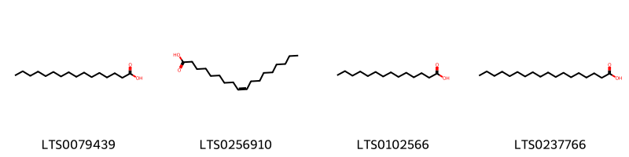
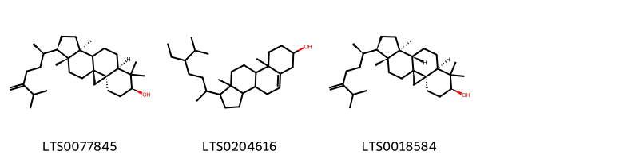

!!! abstract "Tóm tắt"
    Cây cúc gai (Silybum marianum (L.) Gaertn) hay còn được gọi là kế sữa, thuộc họ Cúc (Asteraceae). Cây mọc hoang có nguồn gốc từ Địa Trung Hải, hiện có mặt ở nhiều nơi trên thế giới như: Trung Âu, Bắc Phi, Trung Quốc, Ấn Độ, Nam Mỹ… Cây kế sữa ở Việt Nam rất hiếm được tìm thấy. Trong y học cổ truyền, cây kế sữa được sử dụng để bảo vệ gan, hỗ trợ tiêu hóa và làm dịu các triệu chứng viêm. Tác dụng dược lý của cây kế sữa là để điều trị các vấn đề về gan như viêm gan, xơ gan, gan nhiễm mỡ.. Thành phần hóa học chính của cây kế sữa là silymarin. Silymarin là một hỗn hợp các flavonoid có tác dụng bảo vệ gan rất mạnh.

## Thông tin về thực vật

### Đặc điểm thực vật

Dược liệu **Cúc Gai (Quả)** từ bộ phận **nan** từ loài *Silybum marianum (L.) Gaertn.* thuộc họ Asteraceae. Kế sữa là một loại cây thân thảo sống một năm hoặc hai năm một lần, thân cứng, tán rộng và có răng cưa. Cây cao tới 2,5m và có tán rộng 0,9m. Mỗi cây tạo ra tối đa bốn nhánh, hình cầu và chứa đầy Nhựa màu trắng đục. Lá to, rộng và có màu xanh bóng, đặc trưng bởi các vân trắng giống như đánh dấu, có mép gai. Lá trưởng thành có thùy xẻ sâu hơn với mép lượn sóng, trong khi những chiếc lá non có thùy nông với hình tròn, ôm vào thân cây. 
Cụm hoa đầu màu tím, hiếm khi màu trắng, mọc đơn lẻ, hoa có 5 cánh, 5 nhị. Chúng có nhiều hoa con hình ống có đường kính khoảng 6cm và được bao quanh bởi các lá bắc cứng có đầu như gai nhọn. Sau khi ra hoa, cây kế có lông dày màu trắng phát triển và phát tán hạt. Quả hình bầu dục, dài 7-8cm, màu đen bóng có vân vàng, chứa hạt. Hạt hình trứng xiên, dài 6-7mm và rộng 3mm. Hạt màu nâu và có một vòng mở rộng ngoại suy màu vàng ở đầu và một lỗ rốn hình ống ở đầu kia. 

!!! info "Phân loại thực vật của *Silybum marianum*"
    - **Kingdom:** Plantae
    - **Phylum:** Tracheophyta
    - **Order:** Asterales
    - **Family:** Asteraceae
    - **Genus:** Silybum
    - **Species:** *Silybum marianum*

*Tài liệu tham khảo:* "Những cây thuốc và vị thuốc Việt Nam" - Đỗ Tất Lợi

 

### Loài thay thế (Nếu có)

### Phân bố trên thế giới
**Từ vườn thực vật KEW: **: Afghanistan, Albania, Algeria, Azores, Baleares, Bulgaria, Canary Is., Corse, Síp, Đông Aegean Is., Ai Cập, Ethiopia, Pháp, Hy Lạp, các quốc gia vùng Vịnh, Ấn Độ, Iran, Iraq, Ý, Kazakhstan, Kriti, Kuwait, Lebanon-Syria, Libya, Madeira, Maroc, Bắc Kavkaz, Pakistan, Palestine, Bồ Đào Nha, Sardegna, Ả Rập Saudi, Sicilia, Sinai, Tây Ban Nha, Tadzhikistan, Transcaucasus, Tunisia, Thổ Nhĩ Kỳ, Thổ Nhĩ Kỳ ở Châu Âu, Turkmenistan, Uzbekistan, Tây Himalaya, Tây Sahara, Yemen, Nam Tư
Được giới thiệu thêm:
Alabama, Alberta, Đông Bắc Argentina, Tây Bắc Argentina, Nam Argentina, Arizona, Arkansas, Áo, Các quốc gia vùng Baltic, Belarus, Bỉ, Bolivia, Borneo, Bắc Brazil, Đông Bắc Brazil, Nam Brazil, Đông Nam Brazil, Tây Trung Brazil, British Columbia, California, Các tỉnh Cape, Nga Trung Âu, Đảo Chatham, Trung Chile, Bắc Chile, Nam Chile, Trung Quốc Bắc Trung Bộ, Trung Quốc Nam Trung Bộ, Đông Nam Trung Quốc, Colombia, Colorado, Connecticut, Tiệp Khắc, Đan Mạch, Nga Đông Âu, Ecuador, Đảo Falkland, Georgia, Đức, Anh, Hải Nam, Hungary, Illinois, Indiana, Nội Mông, Ireland, Jawa, Đảo Juan Fernández, Hàn Quốc, Krym, Đảo Lesser Sunda, Louisiana, Malaya, Mãn Châu, Maryland, Đông Nam Mexico, Michigan, Mississippi, Hà Lan, Nevada, New Brunswick, New Hampshire, New Jersey, New Mexico, New South Wales, New York, Bắc New Zealand, Nam New Zealand, Đảo Norfolk, Bắc Carolina, Nga Bắc Âu, Các tỉnh phía Bắc, Lãnh thổ phía Bắc, Tây Bắc Âu Nga, Na Uy, Nova Scotia, Ohio, Oklahoma, Ontario, Oregon, Paraguay, Pennsylvania, Peru, Philippines, Ba Lan,Primorye, Thanh Hải, Queensland, Québec, Romania, Saskatchewan, Nam Úc, Nam Âu của Nga, Sulawesi, Sumatera, Thụy Điển, Thụy Sĩ, Đài Loan, Tasmania, Tennessee, Texas, Thái Lan, Tây Tạng, Ukraine, Uruguay, Venezuela, Vermont, Victoria, Việt Nam, Virginia, Washington, Tây Siberia, Tây Virginia, Tây Úc, Wisconsin, Tân Cương

**Từ CSDL GIBF** nan, Iran (Islamic Republic of), Spain, Australia, Belgium, Chile, Germany, Pakistan, Netherlands, Albania, New Zealand, Palestine, State of, Mexico, Jordan, Italy, Greece, United Kingdom of Great Britain and Northern Ireland, Türkiye, Switzerland, United States of America, France, Portugal, Israel, Canada

### Phân bố tại Việt Nam
** "Những cây thuốc và vị thuốc Việt Nam" - Đỗ Tất Lợi**: Cây mọc hoang có nguồn gốc từ Địa Trung Hải, hiện có mặt ở nhiều nơi trên thế giới như: Trung Âu, Bắc Phi, Trung Quốc, Ấn Độ, Nam Mỹ… Cây Kế sữa ở Việt Nam rất hiếm được tìm thấy.

**Từ CSDL GIBF**: Không có ghi nhận ở Việt Nam

---

## Thông tin về dược liệu 

### Định danh

!!! info "Thông tin về tên gọi của nan"
    - Dược liệu tiếng Việt: nan
    - Dược liệu tiếng Trung: nan (nan)
    - Dược liệu tiếng Anh: nan
    - Dược liệu latin thông dụng: nan
    - Dược liệu latin kiểu DĐVN: silybum marianum (l.) gaertn.
    - Dược liệu latin kiểu DĐVN: nan
    - Dược liệu latin kiểu thông tư: nan
    - Bộ phận dùng: nan (nan)

### Mô tả dược liệu 
- **Theo dược điển Việt nam V:** nan

- **Mô tả dược liệu theo thông tư chế biến dược liệu theo phương pháp cổ truyền:** nan

### Chế biến 

- **Chế biến theo dược điển việt nam V**: nan

- **Chế biến theo thông tư:** nan

--- 

## Thành phần hóa học

- Theo tài liệu của GS. Đỗ Tất Lợi:  (1) Nhóm hóa học: Flavonoid
(2)Tên hoạt chất: Silymarin
    
- Theo cơ sở dữ liệu lotus: Từ loài *Silybum marianum* đã phân lập và xác định được 87 hoạt chất thuộc về các nhóm Flavonolignans, Steroids and steroid derivatives, Prenol lipids, Fatty Acyls, Flavonoids, 2-arylbenzofuran flavonoids. 

|    | chemicalTaxonomyClassyfireClass   |   smiles_count |
|---:|:----------------------------------|---------------:|
|  0 | 2-arylbenzofuran flavonoids       |             10 |
|  1 | Fatty Acyls                       |              4 |
|  2 | Flavonoids                        |             31 |
|  3 | Flavonolignans                    |             17 |
|  4 | Prenol lipids                     |             22 |
|  5 | Steroids and steroid derivatives  |              3 |

### Nhóm 2-arylbenzofuran flavonoids
<figure markdown="span">
    { width=100% }
    <figcaption>Hình ảnh cấu trúc hóa học của 10 hoạt chất thuộc nhóm 2-arylbenzofuran flavonoids gồm ['(2s)-5,7-dihydroxy-2-[(2r,3s)-7-hydroxy-2-(4-hydroxy-3-methoxyphenyl)-3-(hydroxymethyl)-2,3-dihydro-1-benzofuran-5-yl]-2,3-dihydro-1-benzopyran-4-one (LTS0068654)', '(2r,3r)-3,5,7-trihydroxy-2-[(2s,3r)-7-hydroxy-2-(4-hydroxy-3-methoxyphenyl)-3-(hydroxymethyl)-2,3-dihydro-1-benzofuran-5-yl]-2,3-dihydro-1-benzopyran-4-one (LTS0085689)', '[7-(acetyloxy)-2-[4-(acetyloxy)-3-methoxyphenyl]-5-[3,5,7-tris(acetyloxy)-4-oxo-2,3-dihydro-1-benzopyran-2-yl]-2,3-dihydro-1-benzofuran-3-yl]methyl acetate (LTS0116856)', '3,5,7-trihydroxy-2-[7-hydroxy-2-(4-hydroxy-3-methoxyphenyl)-3-(hydroxymethyl)-2,3-dihydro-1-benzofuran-5-yl]-2,3-dihydro-1-benzopyran-4-one (LTS0108239)', '(2r,3r)-3,5,7-trihydroxy-2-[(2s,3r)-7-hydroxy-2-(4-hydroxy-3-methoxyphenyl)-3-(hydroxymethyl)-2,3-dihydro-1-benzofuran-4-yl]-2,3-dihydro-1-benzopyran-4-one (LTS0256085)', 'silychristin (LTS0213394)', '(2s)-5,7-dihydroxy-2-[(2r,3r)-7-hydroxy-2-(4-hydroxy-3-methoxyphenyl)-3-(hydroxymethyl)-2,3-dihydro-1-benzofuran-4-yl]-2,3-dihydro-1-benzopyran-4-one (LTS0019749)', '3,5,7-trihydroxy-2-[7-hydroxy-2-(4-hydroxy-3-methoxyphenyl)-3-(hydroxymethyl)-2,3-dihydro-1-benzofuran-4-yl]-2,3-dihydro-1-benzopyran-4-one (LTS0267929)', '(2r)-5,7-dihydroxy-2-[(2s,3s)-7-hydroxy-2-(4-hydroxy-3-methoxyphenyl)-3-(hydroxymethyl)-2,3-dihydro-1-benzofuran-4-yl]-2,3-dihydro-1-benzopyran-4-one (LTS0130916)', '(2r,3r)-3,5,7-trihydroxy-2-[(2r,3s)-7-hydroxy-2-(4-hydroxy-3-methoxyphenyl)-3-(hydroxymethyl)-2,3-dihydro-1-benzofuran-4-yl]-2,3-dihydro-1-benzopyran-4-one (LTS0037679)'].</figcaption>
</figure>
### Nhóm Fatty Acyls
<figure markdown="span">
    { width=100% }
    <figcaption>Hình ảnh cấu trúc hóa học của 4 hoạt chất thuộc nhóm Fatty Acyls gồm ['palmitic acid (LTS0079439)', 'oleic acid (LTS0256910)', 'myristic acid (LTS0102566)', 'stearic acid (LTS0237766)'].</figcaption>
</figure>
### Nhóm Flavonoids
<figure markdown="span">
    { width=100% }
    <figcaption>Hình ảnh cấu trúc hóa học của 31 hoạt chất thuộc nhóm Flavonoids gồm ['(+)-dihydrokaempferol (LTS0134832)', '(2s,3s,4s,5r,6s)-3,4,5-trihydroxy-6-{[8-hydroxy-2-(4-hydroxyphenyl)-4-oxochromen-7-yl]oxy}oxane-2-carboxylic acid (LTS0164477)', '(+)-taxifolin (LTS0090664)', 'chamomile (LTS0104946)', 'kaempferol 3-o-sulfate (LTS0130811)', 'ethyl (2s,3r,4s,5r,6s)-3,4,5-trihydroxy-6-{[5-hydroxy-2-(4-hydroxyphenyl)-4-oxochromen-7-yl]oxy}oxane-2-carboxylate (LTS0178253)', '(2s,3r,4s,5r,6s)-3,4,5-trihydroxy-6-{[8-hydroxy-2-(4-hydroxyphenyl)-4-oxo-3-{[(2s,3r,4r,5r,6s)-3,4,5-trihydroxy-6-methyloxan-2-yl]oxy}chromen-6-yl]oxy}oxane-2-carboxylic acid (LTS0155187)', 'aromadendrin (LTS0153299)', 'apigenin 7-o-β-glucoside (LTS0252743)', '(1r,3s,6r,7s,10r)-3-hydroxy-10-(4-hydroxy-3-methoxyphenyl)-8-[(2r,3r)-3,5,7-trihydroxy-4-oxo-2,3-dihydro-1-benzopyran-2-yl]-4-oxatricyclo[4.3.1.0³,⁷]dec-8-en-2-one (LTS0112654)', '3-hydroxy-10-(4-hydroxy-3-methoxyphenyl)-8-(3,5,7-trihydroxy-4-oxo-2,3-dihydro-1-benzopyran-2-yl)-4-oxatricyclo[4.3.1.0³,⁷]dec-8-en-2-one (LTS0158475)', '(1r,3r,6r,7r,10r)-3-hydroxy-10-(4-hydroxy-3-methoxyphenyl)-8-[(2r)-3,5,7-trihydroxy-4-oxo-2,3-dihydro-1-benzopyran-2-yl]-4-oxatricyclo[4.3.1.0³,⁷]dec-8-en-2-one (LTS0273069)', 'ethyl 3,4,5-trihydroxy-6-{[8-hydroxy-2-(4-hydroxyphenyl)-4-oxochromen-7-yl]oxy}oxane-2-carboxylate (LTS0239425)', 'kaempherol (LTS0155822)', '(2r,3s,4s,5s,6r)-3,4,5-trihydroxy-6-methyloxan-2-yl (2s,3r,4s,5r,6s)-3,4,5-trihydroxy-6-{[5-hydroxy-2-(4-hydroxyphenyl)-4-oxochromen-7-yl]oxy}oxane-2-carboxylate (LTS0222928)', 'apigenin 7-galactoside (LTS0204933)', 'ethyl (2s,3s,4s,5r,6s)-3,4,5-trihydroxy-6-{[8-hydroxy-2-(4-hydroxyphenyl)-4-oxochromen-7-yl]oxy}oxane-2-carboxylate (LTS0211796)', '2-(3,5-dihydroxyphenyl)-3,5,7-trihydroxy-2,3-dihydro-1-benzopyran-4-one (LTS0220398)', '(2s,3r,4s,5r,6s)-3,4,5-trihydroxy-6-{[5-hydroxy-2-(4-hydroxyphenyl)-4-oxo-3-{[(2s,3r,4r,5r,6s)-3,4,5-trihydroxy-6-methyloxan-2-yl]oxy}chromen-7-yl]oxy}oxane-2-carboxylic acid (LTS0026495)', '2,3-dihydroquercetin (LTS0040950)', 'luteolin 7-o-glucoside (LTS0227450)', '3,4,5-trihydroxy-6-{[8-hydroxy-2-(4-hydroxyphenyl)-4-oxo-3-[(3,4,5-trihydroxy-6-methyloxan-2-yl)oxy]chromen-6-yl]oxy}oxane-2-carboxylic acid (LTS0037427)', '3,4-dihydroxy-6-{[5-hydroxy-2-(4-hydroxyphenyl)-4-oxochromen-7-yl]oxy}-5-[(3,4,5-trihydroxy-6-methyloxan-2-yl)oxy]oxane-2-carboxylic acid (LTS0243526)', 'silidianin (LTS0255450)', 'quercetin (LTS0004651)', 'apigenin 7-o-glucoside (LTS0007959)', 'kaempferol 7-o-glucoside (LTS0025882)', '3,4,5-trihydroxy-6-{[8-hydroxy-2-(4-hydroxyphenyl)-4-oxochromen-7-yl]oxy}oxane-2-carboxylic acid (LTS0019728)', 'luteolin (LTS0017052)', '(2s,3r,4s,5r,6s)-3,4-dihydroxy-6-{[5-hydroxy-2-(4-hydroxyphenyl)-4-oxochromen-7-yl]oxy}-5-{[(2s,3r,4r,5r,6s)-3,4,5-trihydroxy-6-methyloxan-2-yl]oxy}oxane-2-carboxylic acid (LTS0086800)', '(1r,3r,6s,7r)-3-hydroxy-10-(4-hydroxy-3-methoxyphenyl)-8-(3,5,7-trihydroxy-4-oxo-2,3-dihydro-1-benzopyran-2-yl)-4-oxatricyclo[4.3.1.0³,⁷]dec-8-en-2-one (LTS0116135)'].</figcaption>
</figure>
### Nhóm Flavonolignans
<figure markdown="span">
    { width=100% }
    <figcaption>Hình ảnh cấu trúc hóa học của 17 hoạt chất thuộc nhóm Flavonolignans gồm ['5,7-dihydroxy-2-[2-(4-hydroxy-3-methoxyphenyl)-3-(hydroxymethyl)-2,3-dihydro-1,4-benzodioxin-6-yl]-2,3-dihydro-1-benzopyran-4-one (LTS0097211)', '3,5,7-trihydroxy-2-[3-(4-hydroxy-3-methoxyphenyl)-2-(hydroxymethyl)-2,3-dihydro-1,4-benzodioxin-6-yl]chromen-4-one (LTS0177071)', 'silandrin (LTS0103673)', 'silibinin (LTS0276467)', '(2r,3r)-3,5,7-trihydroxy-2-[(2r,3r)-3-(3-hydroxy-4-methoxyphenyl)-2-(hydroxymethyl)-2,3-dihydro-1,4-benzodioxin-6-yl]-2,3-dihydro-1-benzopyran-4-one (LTS0165267)', '(3s)-3,5,7-trihydroxy-2-[2-(4-hydroxy-3-methoxyphenyl)-3-(hydroxymethyl)-2,3-dihydro-1,4-benzodioxin-6-yl]-2,3-dihydro-1-benzopyran-4-one (LTS0101575)', '(2r,3r)-3,5,7-trihydroxy-2-[(2r,3r)-2-(3-hydroxy-5-methoxyphenyl)-3-(hydroxymethyl)-2,3-dihydro-1,4-benzodioxin-6-yl]-2,3-dihydro-1-benzopyran-4-one (LTS0222853)', 'silymarin (LTS0228416)', '(2r,3s)-3,5,7-trihydroxy-2-[(2r,3r)-2-(4-hydroxy-3-methoxyphenyl)-3-(hydroxymethyl)-2,3-dihydro-1,4-benzodioxin-6-yl]-2,3-dihydro-1-benzopyran-4-one (LTS0116779)', '(2r,3r)-3,5,7-trihydroxy-2-[(2s,3s)-2-(3-hydroxy-5-methoxyphenyl)-3-(hydroxymethyl)-2,3-dihydro-1,4-benzodioxin-6-yl]-2,3-dihydro-1-benzopyran-4-one (LTS0209006)', '(2r,3r)-3,5,7-trihydroxy-2-[(2r,3s)-2-(4-hydroxy-3-methoxyphenyl)-3-(hydroxymethyl)-2,3-dihydro-1,4-benzodioxin-6-yl]-2,3-dihydro-1-benzopyran-4-one (LTS0226367)', 'isosilybin b (LTS0037870)', '3,5,7-trihydroxy-2-[3-(3-hydroxy-4-methoxyphenyl)-2-(hydroxymethyl)-2,3-dihydro-1,4-benzodioxin-6-yl]-2,3-dihydro-1-benzopyran-4-one (LTS0029136)', 'silibinin b (LTS0068471)', '(3r)-3,5,7-trihydroxy-2-[(3r)-3-(4-hydroxy-3-methoxyphenyl)-2-(hydroxymethyl)-2,3-dihydro-1,4-benzodioxin-6-yl]-2,3-dihydro-1-benzopyran-4-one (LTS0246473)', 'isosilybin a (LTS0259754)', '3,5,7-trihydroxy-2-[2-(4-hydroxy-3-methoxyphenyl)-3-(hydroxymethyl)-2,3-dihydro-1,4-benzodioxin-6-yl]-2,3-dihydro-1-benzopyran-4-one (LTS0122333)'].</figcaption>
</figure>
### Nhóm Prenol lipids
<figure markdown="span">
    { width=100% }
    <figcaption>Hình ảnh cấu trúc hóa học của 22 hoạt chất thuộc nhóm Prenol lipids gồm ['(2r,3r,4s,5s,6r)-2-{[(1r,3ar,5ar,6r,7s,9ar,11ar)-1-[(2r)-6-hydroxy-6-methyl-5-methylideneheptan-2-yl]-6-(hydroxymethyl)-3a,6,9a,11a-tetramethyl-1h,2h,3h,4h,5h,5ah,7h,8h,9h,10h,11h-cyclopenta[a]phenanthren-7-yl]oxy}-6-(hydroxymethyl)oxane-3,4,5-triol (LTS0135940)', 'amyrin (LTS0222826)', '2,7,8-trimethyl-2-(4,8,12-trimethyltridecyl)-3,4-dihydro-1-benzopyran-6-ol (LTS0095444)', 'marianoside a (LTS0037114)', '(2r)-2,5,7,8-tetramethyl-2-(4,8,12-trimethyltridecyl)-3,4-dihydro-1-benzopyran-6-ol (LTS0118303)', '(4ar,6ar,6br,8as,12ar,12br,14ar,14br)-4,4,6a,6b,8a,11,12,14b-octamethyl-2,3,4a,5,6,7,8,9,12,12a,12b,13,14,14a-tetradecahydro-1h-picen-3-ol (LTS0269929)', '7-hydroxy-1-(6-hydroxy-6-methyl-5-methylideneheptan-2-yl)-3a,6,6,9a,11a-pentamethyl-1h,2h,3h,5h,5ah,7h,8h,9h,10h,11h-cyclopenta[a]phenanthren-4-one (LTS0126221)', '(3s,4ar,6ar,6br,8ar,10s,12as,12br,14bs)-3,10-dihydroxy-2,2,6a,6b,9,9,12a-heptamethyl-7-oxo-3,4,5,6,8,8a,10,11,12,12b,13,14b-dodecahydro-1h-picene-4a-carboxylic acid (LTS0144575)', 'marianine (LTS0142102)', 'β-amyrin (LTS0251864)', '2-{[3a,6,6,9a,11a-pentamethyl-1-(6-methyl-5-methylideneheptan-2-yl)-1h,2h,3h,4h,5h,5ah,7h,8h,9h,10h,11h-cyclopenta[a]phenanthren-7-yl]oxy}-6-(hydroxymethyl)oxane-3,4,5-triol (LTS0163261)', 'lupeol (LTS0256952)', '(1r,3ar,5ar,6r,7s,9as,11ar)-1-[(2r)-6-hydroxy-6-methyl-5-methylideneheptan-2-yl]-6-(hydroxymethyl)-3a,6,9a,11a-tetramethyl-7-{[(2r,3r,4s,5s,6r)-3,4,5-trihydroxy-6-(hydroxymethyl)oxan-2-yl]oxy}-1h,2h,3h,5h,5ah,7h,8h,9h,10h,11h-cyclopenta[a]phenanthren-4-one (LTS0264200)', '(6ar,6br,8ar,14br)-4,4,6a,6b,8a,12,14b-heptamethyl-11-methylidene-hexadecahydropicen-3-ol (LTS0274865)', 'vitamin e (LTS0263269)', '(2r,3r,4s,5s,6r)-2-{[(1r,3ar,5as,7s,9ar,11ar)-3a,6,6,9a,11a-pentamethyl-1-[(2r)-6-methyl-5-methylideneheptan-2-yl]-1h,2h,3h,4h,5h,5ah,7h,8h,9h,10h,11h-cyclopenta[a]phenanthren-7-yl]oxy}-6-(hydroxymethyl)oxane-3,4,5-triol (LTS0083676)', 'taraxasterol (LTS0006950)', 'marianoside b (LTS0157791)', '1-(6-hydroxy-6-methyl-5-methylideneheptan-2-yl)-6-(hydroxymethyl)-3a,6,9a,11a-tetramethyl-7-{[3,4,5-trihydroxy-6-(hydroxymethyl)oxan-2-yl]oxy}-1h,2h,3h,5h,5ah,7h,8h,9h,10h,11h-cyclopenta[a]phenanthren-4-one (LTS0048150)', '(1s,3s,4ar,6ar,6br,8ar,10s,12as,12br,14bs)-3,10-dihydroxy-1,6a,6b,9,9,12a-hexamethyl-2-methylidene-7-oxo-3,4,5,6,8,8a,10,11,12,12b,13,14b-dodecahydro-1h-picene-4a-carboxylic acid (LTS0053872)', '3,10-dihydroxy-2,2,6a,6b,9,9,12a-heptamethyl-7-oxo-3,4,5,6,8,8a,10,11,12,12b,13,14b-dodecahydro-1h-picene-4a-carboxylic acid (LTS0258476)', '3,10-dihydroxy-1,6a,6b,9,9,12a-hexamethyl-2-methylidene-7-oxo-3,4,5,6,8,8a,10,11,12,12b,13,14b-dodecahydro-1h-picene-4a-carboxylic acid (LTS0049387)'].</figcaption>
</figure>
### Nhóm Steroids and steroid derivatives
<figure markdown="span">
    { width=100% }
    <figcaption>Hình ảnh cấu trúc hóa học của 3 hoạt chất thuộc nhóm Steroids and steroid derivatives gồm ['24-methylene-cycloartanol (LTS0077845)', 'stigmast-5-en-3-ol, (3β)- (LTS0204616)', '24-methylenecycloartanol (LTS0018584)'].</figcaption>
</figure>

---

## Tác dụng dược lý

Theo tài liệu "Những cây thuốc và vị thuốc Việt Nam" - Đỗ Tất Lợi:- Giải độc gan, ngăn ngừa xơ gan
- Bảo vệ thần kinh
- Chống tiểu đường
- Chống ung thư
- Tăng tiết sữa mẹ
- Cải thiện mụn trứng cá
- Ngăn ngừa loãng xương

Theo tài liệu quốc tế: nan

---

## Dược điển Việt Nam V

### Soi bột:
nan
<!-- Hình ảnh soi bột sẽ được tự động chèn vào đây sau -->
### Vi phẫu:
nan
<!-- Hình ảnh vi phẫu sẽ được tự động chèn vào đây sau -->
### Định tính

nan

### Định lượng

nan

### Thông tin khác 
- ** Độ ẩm: ** nan

- ** Bảo quản:** nan
## Dược điển Hồng kong

<!-- PDF sẽ được tự động chèn vào đây sau -->

---

## Y dược học cổ truyền

- **Tên vị thuốc:** nan
- **Tính vị quy kinh:** Vị đắng, tính hàn. Vào kinh can, đởm, phế
- **Công năng chủ trị:** Thanh trừ thấp nhiệt.
Chủ trị: Chứng thấp nhiệt (viêm gan, viêm túi mật, bệnh đau gan, vàng da), chứng phế nhiệt (ho suyễn lâu ngày, có bội nhiễm).
- **Chú ý:** nan
- **Kiêng kỵ:** nan

