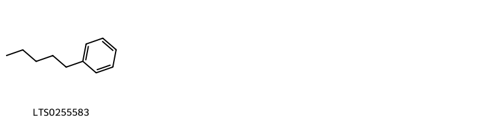
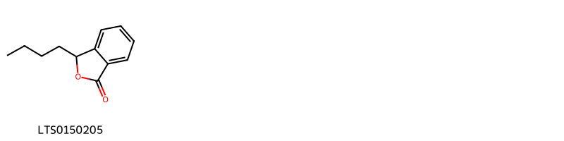
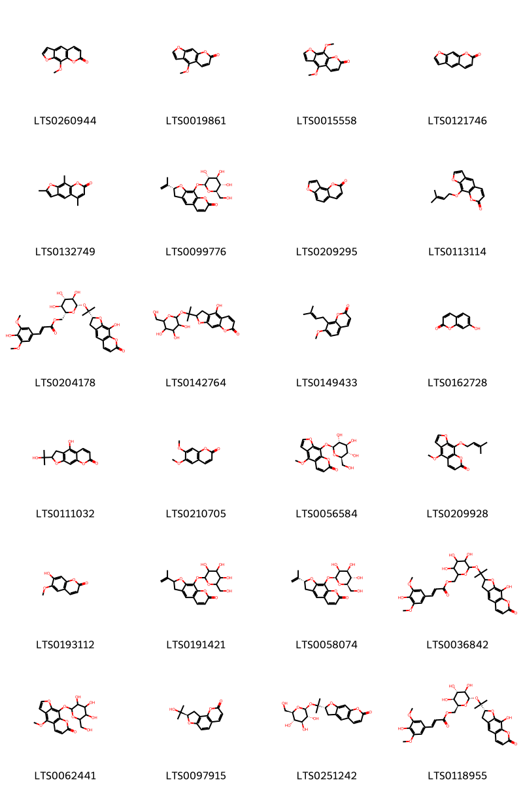
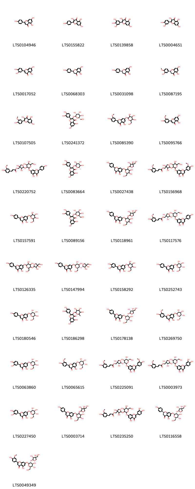
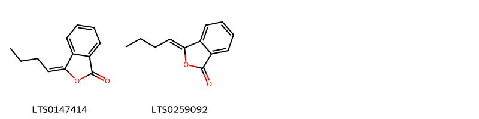
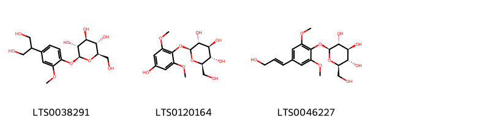
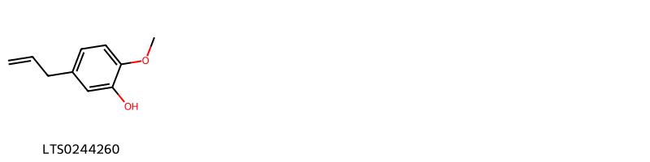
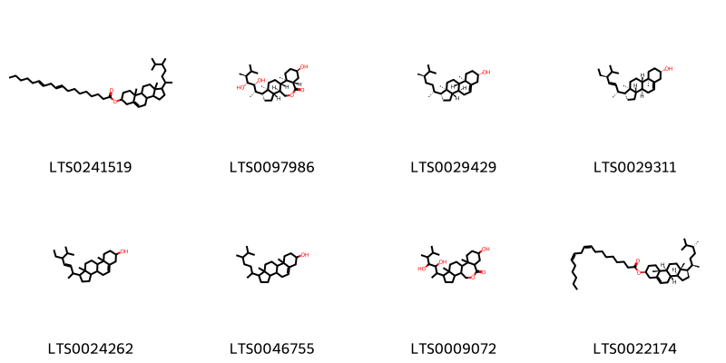

!!! abstract "Tóm tắt"
    Tên khoa học: Apium graveolens L. (Apiaceae – Họ Hoa tán)
Phân bố:
Cần tây có nguồn gốc từ vùng Địa Trung Hải và bờ biển Đại Tây Dương, hiện được trồng rộng rãi trên toàn thế giới, bao gồm châu Âu, châu Á, châu Phi và châu Mỹ. Tại Việt Nam, Cần tây được trồng phổ biến ở khắp các vùng như một loại rau ăn.
Kinh nghiệm sử dụng dân gian/y học cổ truyền:
Trong y học cổ truyền, Cần tây được dùng để trị các bệnh về hô hấp như hen suyễn, viêm phế quản, viêm màng phổi, cũng như các vấn đề về tiêu hóa như trướng bụng, đầy hơi và tiêu hóa kém.
Tác dụng dược lý:
Ngăn ngừa bệnh tim mạch, bệnh gan, vàng da, bệnh gút, thấp khớp, tắc nghẽn đường tiết niệu. Giảm glucose, lipid máu, huyết áp, cải thiện chức năng tim mạch. Kháng nấm, kháng khuẩn, chống viêm.
Thành phần hóa học:
Cần tây chứa apigenin

## Thông tin về thực vật

### Đặc điểm thực vật

Dược liệu **Cần Tây (Quả)** từ bộ phận **Quả** từ loài *Apium graveolens L.* thuộc họ Apiaceae. Cây thảo sống sống từ 1-2 năm, có thân mọc thẳng cao khoảng 1m và có các rãnh dọc. Lá gốc có cuống, xẻ thành ba thuỳ hình tam giác, trong khi các lá ở giữa và lá ở ngọn không có cuống, và chia thành ba thuỳ, hoặc không chia thuỳ. Hoa được sắp xếp thành tán và có màu trắng hoặc xanh lục. 

!!! info "Phân loại thực vật của *Apium graveolens*"
    - **Kingdom:** Plantae
    - **Phylum:** Tracheophyta
    - **Order:** Apiales
    - **Family:** Apiaceae
    - **Genus:** Apium
    - **Species:** *Apium graveolens*

*Tài liệu tham khảo:* "Những cây thuốc và vị thuốc Việt Nam" - Đỗ Tất Lợi

 

### Loài thay thế (Nếu có)

### Phân bố trên thế giới
**Từ vườn thực vật KEW: **: Bản địa:
Afghanistan, Albania, Algeria, Austria, Azores, Baleares, Belgium, Bulgaria, Canary Is., Corse, Cyprus, Denmark, France, Germany, Great Britain, Greece, Gulf States, Iran, Iraq, Ireland, Italy, Kazakhstan, Kriti, Krym, Lebanon-Syria, Libya, Madeira, Morocco, Netherlands, North Caucasus, Nova Scotia, Oman, Pakistan, Palestine, Poland, Portugal, Romania, Sardegna, Saudi Arabia, Sicilia, South European Russia, Spain, Tadzhikistan, Transcaucasus, Tunisia, Turkey, Turkey-in-Europe, Turkmenistan, Ukraine, Uzbekistan, West Himalaya, Yemen, Yugoslavia
Di thực:
Amsterdam-St.Paul Is., Argentina Northeast, Argentina Northwest, Argentina South, Arizona, Assam, Bangladesh, Bermuda, Botswana, Brazil South, Buryatiya, California, Cameroon, Cape Provinces, Cape Verde, Central European Russia, Chatham Is., Chile North, Chile South, China North-Central, China South-Central, China Southeast, Connecticut, Costa Rica, Cuba, Czechoslovakia, Dominican Republic, East Aegean Is., East European Russia, East Himalaya, Ecuador, Egypt, Eritrea, Ethiopia, Finland, Florida, Free State, Guatemala, Hainan, Haiti, Hungary, Idaho, India, Inner Mongolia, Juan Fernández Is., Kirgizstan, KwaZulu-Natal, Lesotho, Louisiana, Marianas, Marshall Is., Maryland, Massachusetts, Mexico Northwest, Mississippi, Missouri, Mongolia, Mozambique, Myanmar, Namibia, Nepal, Nevada, New Jersey, New Mexico, New York, New Zealand North, New Zealand South, Norfolk Is., North Carolina, Northern Provinces, Norway, Ohio, Oklahoma, Oregon, Pennsylvania, Peru, Puerto Rico, Réunion, Sinai, Socotra, South Carolina, South Dakota, St.Helena, Sweden, Switzerland, Taiwan, Texas, Thailand, Trinidad-Tobago, Utah, Vietnam, Washington, West Virginia

**Từ CSDL GIBF** Australia, Belgium, Austria, Spain, Germany, Ireland, Netherlands, Denmark, United Arab Emirates, New Zealand, India, Argentina, Sweden, Mexico, Mongolia, Costa Rica, Panama, Greece, Ecuador, United Kingdom of Great Britain and Northern Ireland, South Africa, Russian Federation, United States of America, Chinese Taipei, Portugal

### Phân bố tại Việt Nam
** "Những cây thuốc và vị thuốc Việt Nam" - Đỗ Tất Lợi**: Cây này có nguồn gốc từ bờ biển Đại Tây Dương và Địa Trung Hải và đã được trồng lâu đời ở các nước phương Tây. Hiện nay, nó đã được nhập vào Việt Nam và được trồng như một loại rau ăn. Cây này được trồng ở nhiều nơi trên toàn quốc.

**Từ CSDL GIBF**: Không có ghi nhận ở Việt Nam

---

## Thông tin về dược liệu 

### Định danh

!!! info "Thông tin về tên gọi của cần tây"
    - Dược liệu tiếng Việt: cần tây
    - Dược liệu tiếng Trung:  ()
    - Dược liệu tiếng Anh: 
    - Dược liệu latin thông dụng: Fructus Apii graveolens
    - Dược liệu latin kiểu DĐVN: fructus apii graveolens
    - Dược liệu latin kiểu DĐVN: 
    - Dược liệu latin kiểu thông tư: 
    - Bộ phận dùng: Quả (Fructus)

### Mô tả dược liệu 
- **Theo dược điển Việt nam V:** Quả nhỏ, màu nâu, hình cầu, dài khoảng 1 mm đến 1,5 mm, rộng khoảng 0,5 mm đến 1 mm, có 6 cánh, mép ngoài mỗi cánh màu vàng nhạt. Thường bị tách làm 2 nửa, hình bầu dục hoặc hình thận. Mùi thơm đặc trưng, vị đắng, hơi cay.

- **Mô tả dược liệu theo thông tư chế biến dược liệu theo phương pháp cổ truyền:** 

### Chế biến 

- **Chế biến theo dược điển việt nam V**: Quả cần tây thu hái vào tháng 11 hàng năm, đem phơi hoặc sấy khô.

- **Chế biến theo thông tư:** 

--- 

## Thành phần hóa học

- Theo tài liệu của GS. Đỗ Tất Lợi:  apigenin
    
- Theo cơ sở dữ liệu lotus: Từ loài *Apium graveolens* đã phân lập và xác định được 163 hoạt chất thuộc về các nhóm Coumarins and derivatives, Benzene and substituted derivatives, Indoles and derivatives, Isocoumarans, Dihydrofurans, Organonitrogen compounds, Steroids and steroid derivatives, Phenols, Glycerolipids, Benzodioxoles, Organooxygen compounds, Prenol lipids, Fatty Acyls, Cinnamaldehydes, Furanoid lignans, Dibenzylbutane lignans, Benzofurans, Isobenzofurans, Unsaturated hydrocarbons, Flavonoids. 

|    | chemicalTaxonomyClassyfireClass     |   smiles_count |
|---:|:------------------------------------|---------------:|
|  0 | Benzene and substituted derivatives |              1 |
|  1 | Benzodioxoles                       |              1 |
|  2 | Benzofurans                         |              1 |
|  3 | Cinnamaldehydes                     |              2 |
|  4 | Coumarins and derivatives           |             24 |
|  5 | Dibenzylbutane lignans              |              2 |
|  6 | Dihydrofurans                       |              1 |
|  7 | Fatty Acyls                         |              8 |
|  8 | Flavonoids                          |             37 |
|  9 | Furanoid lignans                    |              1 |
| 10 | Glycerolipids                       |              2 |
| 11 | Indoles and derivatives             |              1 |
| 12 | Isobenzofurans                      |             11 |
| 13 | Isocoumarans                        |              2 |
| 14 | Organonitrogen compounds            |              1 |
| 15 | Organooxygen compounds              |              3 |
| 16 | Phenols                             |              1 |
| 17 | Prenol lipids                       |             53 |
| 18 | Steroids and steroid derivatives    |              8 |
| 19 | Unsaturated hydrocarbons            |              1 |

### Nhóm Benzene and substituted derivatives
<figure markdown="span">
    { width=100% }
    <figcaption>Hình ảnh cấu trúc hóa học của 1 hoạt chất thuộc nhóm Benzene and substituted derivatives gồm ['pentylbenzene (LTS0255583)'].</figcaption>
</figure>
### Nhóm Benzodioxoles
<figure markdown="span">
    { width=100% }
    <figcaption>Hình ảnh cấu trúc hóa học của 1 hoạt chất thuộc nhóm Benzodioxoles gồm ['apiol (LTS0153514)'].</figcaption>
</figure>
### Nhóm Benzofurans
<figure markdown="span">
    { width=100% }
    <figcaption>Hình ảnh cấu trúc hóa học của 1 hoạt chất thuộc nhóm Benzofurans gồm ['butylphthalide (LTS0150205)'].</figcaption>
</figure>
### Nhóm Cinnamaldehydes
<figure markdown="span">
    { width=100% }
    <figcaption>Hình ảnh cấu trúc hóa học của 2 hoạt chất thuộc nhóm Cinnamaldehydes gồm ['3-phenyl-2-propenal (LTS0204346)', 'cinnamal (LTS0271313)'].</figcaption>
</figure>
### Nhóm Coumarins and derivatives
<figure markdown="span">
    { width=100% }
    <figcaption>Hình ảnh cấu trúc hóa học của 24 hoạt chất thuộc nhóm Coumarins and derivatives gồm ['methoxsalen (LTS0260944)', 'bergapten (LTS0019861)', 'isopimpinellin (LTS0015558)', 'psoralen (LTS0121746)', 'trioxsalen (LTS0132749)', '(2r)-2-(prop-1-en-2-yl)-9-{[(2s,3r,4s,5s,6r)-3,4,5-trihydroxy-6-(hydroxymethyl)oxan-2-yl]oxy}-2h,3h-furo[3,2-g]chromen-7-one (LTS0099776)', 'angelicin (LTS0209295)', 'imperatorin (LTS0113114)', '[(2r,3s,4s,5r,6s)-3,4,5-trihydroxy-6-({2-[(2r)-9-hydroxy-7-oxo-2h,3h-furo[3,2-g]chromen-2-yl]propan-2-yl}oxy)oxan-2-yl]methyl (2e)-3-(4-hydroxy-3,5-dimethoxyphenyl)prop-2-enoate (LTS0204178)', '4-hydroxy-2-(2-{[3,4,5-trihydroxy-6-(hydroxymethyl)oxan-2-yl]oxy}propan-2-yl)-2h,3h-furo[3,2-g]chromen-7-one (LTS0142764)', 'osthole (LTS0149433)', 'umbelliferone (LTS0162728)', '4-hydroxy-2-(2-hydroxypropan-2-yl)-2h,3h-furo[3,2-g]chromen-7-one (LTS0111032)', 'scoparone (LTS0210705)', '4-methoxy-9-{[(2s,3r,4s,5s,6r)-3,4,5-trihydroxy-6-(hydroxymethyl)oxan-2-yl]oxy}furo[3,2-g]chromen-7-one (LTS0056584)', 'phellopterin (LTS0209928)', 'scopoletin (LTS0193112)', '2-(prop-1-en-2-yl)-9-{[3,4,5-trihydroxy-6-(hydroxymethyl)oxan-2-yl]oxy}-2h,3h-furo[3,2-g]chromen-7-one (LTS0191421)', '(2r)-2-(prop-1-en-2-yl)-9-{[(2s,3s,4s,5s,6r)-3,4,5-trihydroxy-6-(hydroxymethyl)oxan-2-yl]oxy}-2h,3h-furo[3,2-g]chromen-7-one (LTS0058074)', '{3,4,5-trihydroxy-6-[(2-{9-hydroxy-7-oxo-2h,3h-furo[3,2-g]chromen-2-yl}propan-2-yl)oxy]oxan-2-yl}methyl 3-(4-hydroxy-3,5-dimethoxyphenyl)prop-2-enoate (LTS0036842)', '4-methoxy-9-{[3,4,5-trihydroxy-6-(hydroxymethyl)oxan-2-yl]oxy}furo[3,2-g]chromen-7-one (LTS0062441)', '(-)-columbianetin (LTS0097915)', 'nodakenin (LTS0251242)', '[(2s,3s,4s,5r,6s)-3,4,5-trihydroxy-6-({2-[(2r)-9-hydroxy-7-oxo-2h,3h-furo[3,2-g]chromen-2-yl]propan-2-yl}oxy)oxan-2-yl]methyl (2e)-3-(4-hydroxy-3,5-dimethoxyphenyl)prop-2-enoate (LTS0118955)'].</figcaption>
</figure>
### Nhóm Dibenzylbutane lignans
<figure markdown="span">
    { width=100% }
    <figcaption>Hình ảnh cấu trúc hóa học của 2 hoạt chất thuộc nhóm Dibenzylbutane lignans gồm ['(2s,3r)-2,3-bis[(4-hydroxy-3-methoxyphenyl)(¹³c)methyl](1-¹³c)butane-1,4-diol (LTS0268699)', 'secoisolariciresinol (LTS0086727)'].</figcaption>
</figure>
### Nhóm Dihydrofurans
<figure markdown="span">
    { width=100% }
    <figcaption>Hình ảnh cấu trúc hóa học của 1 hoạt chất thuộc nhóm Dihydrofurans gồm ['(2-{[(2r)-2-[(1s)-1,2-dihydroxyethyl]-4-hydroxy-5-oxo-2h-furan-3-yl]oxy}ethyl)trimethylazanium (LTS0233802)'].</figcaption>
</figure>
### Nhóm Fatty Acyls
<figure markdown="span">
    { width=100% }
    <figcaption>Hình ảnh cấu trúc hóa học của 8 hoạt chất thuộc nhóm Fatty Acyls gồm ['geranyl acetate (LTS0093224)', 'falcarinol (LTS0184823)', '3-[(3s)-3-{[(2r,3r,4s,5s,6r)-6-({[(2r,3r,4r)-3,4-dihydroxy-4-(hydroxymethyl)oxolan-2-yl]oxy}methyl)-3,4,5-trihydroxyoxan-2-yl]oxy}butyl]-3h-2-benzofuran-1-one (LTS0185401)', 'oleic acid (LTS0256910)', '(3r,3as)-3-[(3s)-3-{[(2r,3r,4s,5s,6r)-3,4,5-trihydroxy-6-(hydroxymethyl)oxan-2-yl]oxy}butyl]-3a,4,5,6-tetrahydro-3h-2-benzofuran-1-one (LTS0239338)', '(z)-falcarinol (LTS0237637)', '3-[(3s)-3-{[(2r,3r,4s,5s,6r)-3,4,5-trihydroxy-6-(hydroxymethyl)oxan-2-yl]oxy}butyl]-3h-2-benzofuran-1-one (LTS0052879)', 'petroselinic acid (LTS0057266)'].</figcaption>
</figure>
### Nhóm Flavonoids
<figure markdown="span">
    { width=100% }
    <figcaption>Hình ảnh cấu trúc hóa học của 37 hoạt chất thuộc nhóm Flavonoids gồm ['chamomile (LTS0104946)', 'kaempherol (LTS0155822)', 'myricetin (LTS0139858)', 'quercetin (LTS0004651)', 'luteolin (LTS0017052)', 'asahina (LTS0068303)', 'naringenin (LTS0031098)', 'hesperetin (LTS0087195)', 'isorhamnetin (LTS0107505)', '2-(3,4-dihydroxyphenyl)-5,7-dihydroxy-3-{[(2s,3r,4r,5r,6s)-3,4,5-trihydroxy-6-(hydroxymethyl)oxan-2-yl]oxy}chromen-4-one (LTS0241372)', '5-hydroxy-2-(4-hydroxy-3-methoxyphenyl)-7-{[3,4,5-trihydroxy-6-(hydroxymethyl)oxan-2-yl]oxy}chromen-4-one (LTS0085390)', 'chrysoeriol (LTS0095766)', '{5-[(4,5-dihydroxy-2-{[5-hydroxy-2-(4-hydroxyphenyl)-4-oxochromen-7-yl]oxy}-6-(hydroxymethyl)oxan-3-yl)oxy]-3,4-dihydroxyoxolan-3-yl}methyl 3-(4-hydroxy-3-methoxyphenyl)prop-2-enoate (LTS0220752)', '2-(3,4-dihydroxyphenyl)-5,7-dihydroxy-3-{[(2s,3s,4r,5r,6s)-3,4,5-trihydroxy-6-methyloxan-2-yl]oxy}chromen-4-one (LTS0083664)', '7-[(3-{[3,4-dihydroxy-4-(hydroxymethyl)oxolan-2-yl]oxy}-4,5-dihydroxy-6-(hydroxymethyl)oxan-2-yl)oxy]-5-hydroxy-2-(4-hydroxyphenyl)-2,3-dihydro-1-benzopyran-4-one (LTS0027438)', '{5-[(4,5-dihydroxy-2-{[5-hydroxy-2-(4-hydroxy-3-methoxyphenyl)-4-oxochromen-7-yl]oxy}-6-(hydroxymethyl)oxan-3-yl)oxy]-3,4-dihydroxyoxolan-3-yl}methyl 3-(4-hydroxy-3-methoxyphenyl)prop-2-enoate (LTS0156968)', 'apigetrin (LTS0157591)', 'hyperoside (LTS0089156)', '7-[(3-{[(4r)-3,4-dihydroxy-4-(hydroxymethyl)oxolan-2-yl]oxy}-4,5-dihydroxy-6-(hydroxymethyl)oxan-2-yl)oxy]-5-hydroxy-2-(4-hydroxyphenyl)chromen-4-one (LTS0118961)', '[(3s,4r,5s)-5-{[(2s,3r,4s,5s,6r)-4,5-dihydroxy-2-{[5-hydroxy-2-(4-hydroxyphenyl)-4-oxochromen-7-yl]oxy}-6-(hydroxymethyl)oxan-3-yl]oxy}-3,4-dihydroxyoxolan-3-yl]methyl (2e)-3-(4-hydroxy-3-methoxyphenyl)prop-2-enoate (LTS0117576)', '7-[(5-{[3,4-dihydroxy-4-(hydroxymethyl)oxolan-2-yl]oxy}-3,4-dihydroxy-6-(hydroxymethyl)oxan-2-yl)oxy]-5-hydroxy-2-(4-hydroxyphenyl)chromen-4-one (LTS0126335)', '7-{[(2s,3r,4r,5s,6r)-5-{[(2s,3r,4r)-3,4-dihydroxy-4-(hydroxymethyl)oxolan-2-yl]oxy}-3,4-dihydroxy-6-(hydroxymethyl)oxan-2-yl]oxy}-5-hydroxy-2-(4-hydroxyphenyl)chromen-4-one (LTS0147994)', '2-(3,4-dihydroxyphenyl)-5-hydroxy-7-{[3,4,5-trihydroxy-6-(hydroxymethyl)oxan-2-yl]oxy}chromen-4-one (LTS0158292)', 'apigenin 7-o-β-glucoside (LTS0252743)', '5-hydroxy-2-(4-hydroxyphenyl)-7-{[(2s,3r,4r,5r,6r)-3,4,5-trihydroxy-6-(hydroxymethyl)oxan-2-yl]oxy}chromen-4-one (LTS0180546)', 'quercitrin (LTS0186298)', 'apiin (LTS0178138)', '5-hydroxy-2-(4-hydroxy-3-methoxyphenyl)-7-{[(2s,3r,4s,5s,6s)-3,4,5-trihydroxy-6-(hydroxymethyl)oxan-2-yl]oxy}chromen-4-one (LTS0269750)', '2-(3,4-dihydroxyphenyl)-5-hydroxy-7-{[(2s,3r,4r,5r,6r)-3,4,5-trihydroxy-6-(hydroxymethyl)oxan-2-yl]oxy}chromen-4-one (LTS0063860)', '5-hydroxy-2-(4-hydroxy-3-methoxyphenyl)-7-{[(2s,3r,4s,5s,6r)-3,4,5-trihydroxy-6-(hydroxymethyl)oxan-2-yl]oxy}chromen-4-one (LTS0065615)', '[(3s,4r,5s)-5-{[(2s,3r,4s,5s,6r)-4,5-dihydroxy-2-{[5-hydroxy-2-(4-hydroxy-3-methoxyphenyl)-4-oxochromen-7-yl]oxy}-6-(hydroxymethyl)oxan-3-yl]oxy}-3,4-dihydroxyoxolan-3-yl]methyl (2e)-3-(4-hydroxy-3-methoxyphenyl)prop-2-enoate (LTS0225091)', '[(3s,4r,5s)-5-{[(2s,3r,4s,5s,6r)-2-{[2-(3,4-dihydroxyphenyl)-5-hydroxy-4-oxochromen-7-yl]oxy}-4,5-dihydroxy-6-(hydroxymethyl)oxan-3-yl]oxy}-3,4-dihydroxyoxolan-3-yl]methyl (2e)-3-(4-hydroxy-3-methoxyphenyl)prop-2-enoate (LTS0003973)', 'luteolin 7-o-glucoside (LTS0227450)', '7-[(3-{[3,4-dihydroxy-4-(hydroxymethyl)oxolan-2-yl]oxy}-4,5-dihydroxy-6-(hydroxymethyl)oxan-2-yl)oxy]-5-hydroxy-2-(4-hydroxyphenyl)chromen-4-one (LTS0003714)', '{5-[(2-{[2-(3,4-dihydroxyphenyl)-5-hydroxy-4-oxochromen-7-yl]oxy}-4,5-dihydroxy-6-(hydroxymethyl)oxan-3-yl)oxy]-3,4-dihydroxyoxolan-3-yl}methyl 3-(4-hydroxy-3-methoxyphenyl)prop-2-enoate (LTS0235250)', '(2s)-7-{[(2s,3r,4s,5s,6r)-3-{[(2s,3r,4r)-3,4-dihydroxy-4-(hydroxymethyl)oxolan-2-yl]oxy}-4,5-dihydroxy-6-(hydroxymethyl)oxan-2-yl]oxy}-5-hydroxy-2-(4-hydroxyphenyl)-2,3-dihydro-1-benzopyran-4-one (LTS0116558)', '7-{[(2s,3r,4s,5s,6r)-3-{[(2s,3s,4r)-3,4-dihydroxy-4-(hydroxymethyl)oxolan-2-yl]oxy}-4,5-dihydroxy-6-(hydroxymethyl)oxan-2-yl]oxy}-5-hydroxy-2-(4-hydroxy-3-methoxyphenyl)chromen-4-one (LTS0049349)'].</figcaption>
</figure>
### Nhóm Furanoid lignans
<figure markdown="span">
    { width=100% }
    <figcaption>Hình ảnh cấu trúc hóa học của 1 hoạt chất thuộc nhóm Furanoid lignans gồm ['matairesinol (LTS0193475)'].</figcaption>
</figure>
### Nhóm Glycerolipids
<figure markdown="span">
    { width=100% }
    <figcaption>Hình ảnh cấu trúc hóa học của 2 hoạt chất thuộc nhóm Glycerolipids gồm ['1,3-bis(octadec-9-enoyloxy)propan-2-yl octadeca-9,12-dienoate (LTS0263929)', '1,3-bis[(9z)-octadec-9-enoyloxy]propan-2-yl (9z,12z)-octadeca-9,12-dienoate (LTS0045889)'].</figcaption>
</figure>
### Nhóm Indoles and derivatives
<figure markdown="span">
    { width=100% }
    <figcaption>Hình ảnh cấu trúc hóa học của 1 hoạt chất thuộc nhóm Indoles and derivatives gồm ['l-tryptophan (LTS0263809)'].</figcaption>
</figure>
### Nhóm Isobenzofurans
<figure markdown="span">
    { width=100% }
    <figcaption>Hình ảnh cấu trúc hóa học của 11 hoạt chất thuộc nhóm Isobenzofurans gồm ['3-butyl-4,5-dihydro-3h-2-benzofuran-1-one (LTS0217963)', '(z)-ligustilide (LTS0042891)', '(3s,6r,7r)-3-butyl-6,7-dihydroxy-4,5,6,7-tetrahydro-3h-2-benzofuran-1-one (LTS0071588)', '(3r)-3-butyl-4,5-dihydro-3h-2-benzofuran-1-one (LTS0081985)', '(3s,3ar)-(-)-sedanolide (LTS0112773)', '(3s,6s,7s)-3-butyl-6,7-dihydroxy-4,5,6,7-tetrahydro-3h-2-benzofuran-1-one (LTS0244033)', 'sedanolide (LTS0189939)', '(3z)-3-butylidene-3a,4,5,6-tetrahydro-2-benzofuran-1-one (LTS0212983)', '(3r,6s,7s)-3-butyl-6,7-dihydroxy-4,5,6,7-tetrahydro-3h-2-benzofuran-1-one (LTS0234021)', 'cnidilide (LTS0005896)', '3-butyl-6,7-dihydroxy-4,5,6,7-tetrahydro-3h-2-benzofuran-1-one (LTS0035215)'].</figcaption>
</figure>
### Nhóm Isocoumarans
<figure markdown="span">
    { width=100% }
    <figcaption>Hình ảnh cấu trúc hóa học của 2 hoạt chất thuộc nhóm Isocoumarans gồm ['butylidenephthalide (LTS0147414)', 'butylidenephthalide (LTS0259092)'].</figcaption>
</figure>
### Nhóm Organonitrogen compounds
<figure markdown="span">
    { width=100% }
    <figcaption>Hình ảnh cấu trúc hóa học của 1 hoạt chất thuộc nhóm Organonitrogen compounds gồm ['choline ascorbate (LTS0084310)'].</figcaption>
</figure>
### Nhóm Organooxygen compounds
<figure markdown="span">
    { width=100% }
    <figcaption>Hình ảnh cấu trúc hóa học của 3 hoạt chất thuộc nhóm Organooxygen compounds gồm ['(2s,3r,4s,5s,6r)-2-[4-(1,3-dihydroxypropan-2-yl)-2-methoxyphenoxy]-6-(hydroxymethyl)oxane-3,4,5-triol (LTS0038291)', '(2s,3r,4s,5s,6r)-2-(4-hydroxy-2,6-dimethoxyphenoxy)-6-(hydroxymethyl)oxane-3,4,5-triol (LTS0120164)', 'syringin (LTS0046227)'].</figcaption>
</figure>
### Nhóm Phenols
<figure markdown="span">
    { width=100% }
    <figcaption>Hình ảnh cấu trúc hóa học của 1 hoạt chất thuộc nhóm Phenols gồm ['chavibetol (LTS0244260)'].</figcaption>
</figure>
### Nhóm Prenol lipids
<figure markdown="span">
    { width=100% }
    <figcaption>Hình ảnh cấu trúc hóa học của 53 hoạt chất thuộc nhóm Prenol lipids gồm ['squalene (LTS0217821)', 'carvone (LTS0196605)', '6,10-dihydroxy-2,2,4a,6a,6b,9,12a-heptamethyl-9-({[3,4,5-trihydroxy-6-(hydroxymethyl)oxan-2-yl]oxy}methyl)-1,4,5,6,7,8,8a,10,11,12,12b,14b-dodecahydropicene-3,13-dione (LTS0083758)', 'linalool, (+-)- (LTS0128839)', 'β phellandrene (LTS0124668)', '(1r,4r,6s,10r)-4,12,12-trimethyl-9-methylidene-5-oxatricyclo[8.2.0.0⁴,⁶]dodecane (LTS0072982)', 'allo-ocimene (LTS0090999)', '(3s,4ar,6ar,6bs,8ar,12ar,14ar,14br)-4,4,6a,6b,8a,11,11,14b-octamethyl-1,2,3,4a,5,6,7,8,9,10,12,12a,14,14a-tetradecahydropicen-3-yl hexadecanoate (LTS0162161)', 'α-myrcene (LTS0115731)', 'β-selinene (LTS0096341)', 'trans-β-ocimene (LTS0049765)', 'β-pinene (LTS0117550)', 'cymene (LTS0181568)', 'citroside b (LTS0127892)', 'monoterpenes (LTS0106881)', 'α pinene (LTS0132416)', '4,4,6a,6b,8a,11,11,14b-octamethyl-1,2,3,4a,5,6,7,8,9,10,12,12a,14,14a-tetradecahydropicen-3-yl octadeca-9,12-dienoate (LTS0134056)', 'humulene (LTS0263171)', '(2s,3r,4s,5s,6r)-2-({2-[(2r,4ar,5s,8as)-5-hydroxy-4a-(hydroxymethyl)-8-methylidene-octahydronaphthalen-2-yl]propan-2-yl}oxy)-6-(hydroxymethyl)oxane-3,4,5-triol (LTS0259376)', '4a-methyl-1-methylidene-7-(prop-1-en-2-yl)-octahydronaphthalene (LTS0165615)', 'camphene (LTS0267242)', '(3s,4ar,6ar,6bs,8ar,12ar,14ar,14br)-4,4,6a,6b,8a,11,11,14b-octamethyl-1,2,3,4a,5,6,7,8,9,10,12,12a,14,14a-tetradecahydropicen-3-yl (9z,12z)-octadeca-9,12-dienoate (LTS0155065)', 'limonene,  (LTS0155981)', 'β-elemene (LTS0225699)', '(1r,2s,4as,6s,6as,6br,8ar,9s,10s,12as,12br,14br)-6,10-dihydroxy-1,2,4a,6a,6b,9,12a-heptamethyl-9-({[(2r,3r,4s,5s,6r)-3,4,5-trihydroxy-6-(hydroxymethyl)oxan-2-yl]oxy}methyl)-2,4,5,6,7,8,8a,10,11,12,12b,14b-dodecahydro-1h-picene-3,13-dione (LTS0162604)', 'phellandrene (LTS0157173)', '2,6,6-trimethyl-3,3-bis({2,6,6-trimethylbicyclo[3.1.1]hept-1-en-3-yl})bicyclo[3.1.1]hept-1-ene (LTS0141045)', '(1r,3as,3bs,7s,9ar,9bs,11ar)-1-[(2r,3e,5s)-5-ethyl-6-methylhept-3-en-2-yl]-9a,11a-dimethyl-1h,2h,3h,3ah,3bh,4h,6h,7h,8h,9h,9bh,10h,11h-cyclopenta[a]phenanthren-7-yl (9z,12z)-octadeca-9,12-dienoate (LTS0244602)', '(2s,3r,4s,5s,6r)-2-({2-[(1r,4r,6r,7s,10s)-10-hydroxy-7-methyl-12-oxatricyclo[5.3.2.0¹,⁶]dodecan-4-yl]propan-2-yl}oxy)-6-(hydroxymethyl)oxane-3,4,5-triol (LTS0169702)', 'caryophyllene (LTS0085212)', '(2s,3r,4s,5s,6r)-2-({2-[(2r,4ar,5s,8r,8ar)-5,8-dihydroxy-4a,8-dimethyl-octahydronaphthalen-2-yl]propan-2-yl}oxy)-6-(hydroxymethyl)oxane-3,4,5-triol (LTS0201783)', 'α-limonene (LTS0244943)', '(1s,4r,6r,7s,10s)-10-hydroxy-7-methyl-4-(2-{[(2s,3r,4s,5s,6r)-3,4,5-trihydroxy-6-(hydroxymethyl)oxan-2-yl]oxy}propan-2-yl)-12-oxatricyclo[5.3.2.0¹,⁶]dodecan-11-one (LTS0221442)', '(2s,3r,4s,5s,6r)-2-({2-[(2r,4ar,5r,6s,8as)-5,6-dihydroxy-4a-methyl-8-methylidene-octahydronaphthalen-2-yl]propan-2-yl}oxy)-6-(hydroxymethyl)oxane-3,4,5-triol (LTS0059966)', 'selinene (LTS0197809)', 'sabinene (LTS0224133)', 'thymol (LTS0168527)', 'isopulegone (LTS0226394)', 'cedrol (LTS0251071)', 'ionone (LTS0252546)', 'β-ocimene (LTS0242381)', '(2r,3r,4r,5r,6r)-2-({2-[(1r,4r,6s,7s,10r)-10-hydroxy-7-methyl-12-oxatricyclo[5.3.2.0¹,⁶]dodecan-4-yl]propan-2-yl}oxy)-6-(hydroxymethyl)oxane-3,4,5-triol (LTS0251140)', '(-)-chamigrene (LTS0274399)', '6,10-dihydroxy-1,2,4a,6a,6b,9,12a-heptamethyl-9-({[3,4,5-trihydroxy-6-(hydroxymethyl)oxan-2-yl]oxy}methyl)-2,4,5,6,7,8,8a,10,11,12,12b,14b-dodecahydro-1h-picene-3,13-dione (LTS0066047)', '(4as,6s,6as,6br,8ar,9s,10s,12as,12br,14br)-6,10-dihydroxy-2,2,4a,6a,6b,9,12a-heptamethyl-9-({[(2r,3r,4s,5s,6r)-3,4,5-trihydroxy-6-(hydroxymethyl)oxan-2-yl]oxy}methyl)-1,4,5,6,7,8,8a,10,11,12,12b,14b-dodecahydropicene-3,13-dione (LTS0010455)', 'caryophyllene (LTS0131870)', '6,10-dihydroxy-1,2,4a,6a,6b,9,9,12a-octamethyl-11-{[3,4,5-trihydroxy-6-(hydroxymethyl)oxan-2-yl]oxy}-2,4,5,6,7,8,8a,10,11,12,12b,14b-dodecahydro-1h-picene-3,13-dione (LTS0022498)', '4,4,6a,6b,8a,11,11,14b-octamethyl-1,2,3,4a,5,6,7,8,9,10,12,12a,14,14a-tetradecahydropicen-3-yl hexadecanoate (LTS0232124)', '1-(5-ethyl-6-methylhept-3-en-2-yl)-9a,11a-dimethyl-1h,2h,3h,3ah,3bh,4h,6h,7h,8h,9h,9bh,10h,11h-cyclopenta[a]phenanthren-7-yl octadeca-9,12-dienoate (LTS0245831)', 'α-selinene (LTS0024564)', 'carvone, (+)- (LTS0027671)', '(4as,7s,8as)-4a-methyl-1-methylidene-7-(prop-1-en-2-yl)-octahydronaphthalene (LTS0244362)', '(1r,2s,4as,6s,6as,6br,8ar,10r,11s,12as,12br,14br)-6,10-dihydroxy-1,2,4a,6a,6b,9,9,12a-octamethyl-11-{[(2r,3r,4s,5s,6r)-3,4,5-trihydroxy-6-(hydroxymethyl)oxan-2-yl]oxy}-2,4,5,6,7,8,8a,10,11,12,12b,14b-dodecahydro-1h-picene-3,13-dione (LTS0046183)'].</figcaption>
</figure>
### Nhóm Steroids and steroid derivatives
<figure markdown="span">
    { width=100% }
    <figcaption>Hình ảnh cấu trúc hóa học của 8 hoạt chất thuộc nhóm Steroids and steroid derivatives gồm ['1-(5,6-dimethylheptan-2-yl)-9a,11a-dimethyl-1h,2h,3h,3ah,3bh,4h,6h,7h,8h,9h,9bh,10h,11h-cyclopenta[a]phenanthren-7-yl octadeca-9,12-dienoate (LTS0241519)', '(1s,2r,5r,7s,11s,12s,15r,16s)-15-[(2s,3r,4r,5s)-3,4-dihydroxy-5,6-dimethylheptan-2-yl]-5-hydroxy-2,16-dimethyl-9-oxatetracyclo[9.7.0.0²,⁷.0¹²,¹⁶]octadecan-8-one (LTS0097986)', 'campesterol (LTS0029429)', 'phytosterol (LTS0029311)', 'stigmasterol (LTS0024262)', 'campesterol (LTS0046755)', '15-(3,4-dihydroxy-5,6-dimethylheptan-2-yl)-5-hydroxy-2,16-dimethyl-9-oxatetracyclo[9.7.0.0²,⁷.0¹²,¹⁶]octadecan-8-one (LTS0009072)', '(1r,3as,3bs,7s,9ar,9bs,11ar)-1-[(2r,5r)-5,6-dimethylheptan-2-yl]-9a,11a-dimethyl-1h,2h,3h,3ah,3bh,4h,6h,7h,8h,9h,9bh,10h,11h-cyclopenta[a]phenanthren-7-yl (9z,12z)-octadeca-9,12-dienoate (LTS0022174)'].</figcaption>
</figure>
### Nhóm Unsaturated hydrocarbons
<figure markdown="span">
    { width=100% }
    <figcaption>Hình ảnh cấu trúc hóa học của 1 hoạt chất thuộc nhóm Unsaturated hydrocarbons gồm ['α terpinene (LTS0232891)'].</figcaption>
</figure>

---

## Tác dụng dược lý

Theo tài liệu "Những cây thuốc và vị thuốc Việt Nam" - Đỗ Tất Lợi:- ngăn ngừa bệnh tim mạch, bệnh vàng da, bệnh gan, bệnh tắc nghẽn đường tiết niệu, bệnh gút và bệnh thấp khớp.
- giảm Glucose, lipid máu và huyết áp, và có thể cải thiện chức năng tim mạch. 
- tính kháng nấm và chống viêm
- tinh dầu có khả năng kháng khuẩn.

Theo tài liệu quốc tế: 

---

## Dược điển Việt Nam V

### Soi bột:
Bột màu nâu, mùi thơm, vị đắng, hơi cay. Soi dưới kính hiển vi thấy: Mảnh biểu bì gồm những tế bào ngoằn ngoèo thành mỏng. Mảnh mô mềm gồm những tế bào tròn, thành mỏng. Mảnh nội nhũ gồm các tế bào hình chữ nhật, thành dày bên trong chứa nội nhũ. Mảnh vỏ quả gồm các tế bào dài thành mỏng. Sợi dài đứng riêng lẻ. Các mảnh mạch thường là mạch điểm. Hạt tinh bột tròn, rốn hạt hình sao rõ có đường kính 12 pm đến 15 pm, nằm rải rác.
<!-- Hình ảnh soi bột sẽ được tự động chèn vào đây sau -->
### Vi phẫu:

<!-- Hình ảnh vi phẫu sẽ được tự động chèn vào đây sau -->
### Định tính

A* Cân khoảng 10 g bột dược liệu cho vào bình nón, thêm 30 ml ethanol 90 % (TT), đun sôi trong cách thủy 10 min, lọc nóng. Dùng dịch lọc làm các phản ứng sau: Lấy 1 ml dịch lọc, thêm một ít bột magnesi (TT). Nhỏ từ từ 3 – 5 giọt acid hydrocloric (TT). Để yên vài phút, dung dịch phải chuyển từ màu vàng sang màu đỏ. Nhỏ 2 – 3 giọt dịch lọc lên một tờ giấy lọc. Hơ khô rồi để lên miệng lọ amoniac (TT) vừa mở nắp đậy, màu vàng của vết dịch chiết phải đậm lên. Cho vào hai ống nghiệm, mỗi ông 1 ml dịch lọc. Ống 1: Thêm 0,5 ml dung dịch natri hydroxyd 10 % (TT), Ống 2: giữ nguyên. Đun cả hai ống đến sôi, để nguội, thấy ống 1 xuất hiện tủa vàng, ống 2 trong. Thêm vào mỗi ống 2 ml nước cất. Lắc đều, ống 1 phải trong suốt, ống 2 phải có tủa đục. Acid hóa ống 1 bằng vài giọt acid hydrocloric (TT), ống 1 trở lại tủa đục như ống 2. B. Phương pháp sắc ký lớp mỏng (Phụ lục 5.4). Bản mỏng: Silica gel F254- Dung môi khai triển: Toluen – ethyl acetat – acid fomic – methanol (4 : 4 : 0,5 : 1). Dung dịch thử-. Lấy 5 g bột thô dược liệu cho vào bình Soxhlet, thêm 100 ml ether dầu hỏa (40 °c đến 60 °c.) (TT), chiết trong 2 h, lấy bã dược liệu để bay hết hơi ether, chiết tiếp như trên bằng 100 ml methanol (TT) trong 6 h. Lấy 20 ml dịch chiết methanol, cất thu hồi dung môi đến còn khoảng 2 ml, dùng làm dung dịch chấm sắc ký. Dung dịch chất đối chiếu: Hòa tan apigenin chuẩn trong methanol (TT) để thu được dung dịch có nồng độ 0,1 mg/ml. Dung dịch dược liệu đối chiếu: Nếu không có apigenin chuẩn thì dùng 5 g bột quả cần tây (mẫu chuẩn), tiến hành chiết như mô tả ở phần Dung dịch thử. Cách tiến hành: Chấm riêng biệt lên bản mỏng 10 pl mỗi dung dịch trên. Triển khai sắc ký đến khi dung môi đi được 12 cm đến 15 cm, lấy bản mỏng ra để khô ở nhiệt độ phòng. Quan sát dưới ánh sáng tử ngoại ở bước sóng 254 nm sau đó phun dung dịch 2-aminoethyldiphenylborinat 1 % trong methanol. Sấy bản mỏng ở 105 °c khoảng 2 min, phun tiếp dung dịch polyethylen glycol 400 (dung dịch PEG 400) 5 % trong methanol, sấy bản mỏng ở 105 °c trong 5 min. Quan sát bản mỏng dưới ánh sáng tử ngoại ở bước sóng 366 nm. Trên sắc ký đồ của dung dịch thử phải có vết có cùng giá trị Rf (khoảng 0,53) và màu sắc tương đương với vết của apigenin chuẩn trên sắc ký đồ của dung dịch chất đối chiếu hoặc trên sắc ký đồ của dung dịch thử phải có các vết cùng màu sắc và giá trị Rf với các vết trên sắc ký đồ của dung dịch dược liệu đối chiếu.

### Định lượng

Chất chiết được trong dược liệu Không được nhỏ hơn 7,0 % tính theo dược liệu khô kiệt.Tiến hành theo phương pháp chiết nóng (Phụ lục 12.10) dùng ethanol (TT) làm dung môi.

### Thông tin khác 
- ** Độ ẩm: ** Không được quá 12,0 % (Phụ lục 12.13).

- ** Bảo quản:** Để nơi khô ráo, thoáng mát.nn
## Dược điển Hồng kong

<!-- PDF sẽ được tự động chèn vào đây sau -->

---

## Y dược học cổ truyền

- **Tên vị thuốc:** 
- **Tính vị quy kinh:** vị chát, mùi nồng
- **Công năng chủ trị:** Trị hen suyễn, khó thở, viêm phế quản, viêm màng phổi, trướng bụng, đầy hơi, tiêu hóa kém.
- **Chú ý:** 
- **Kiêng kỵ:** 

