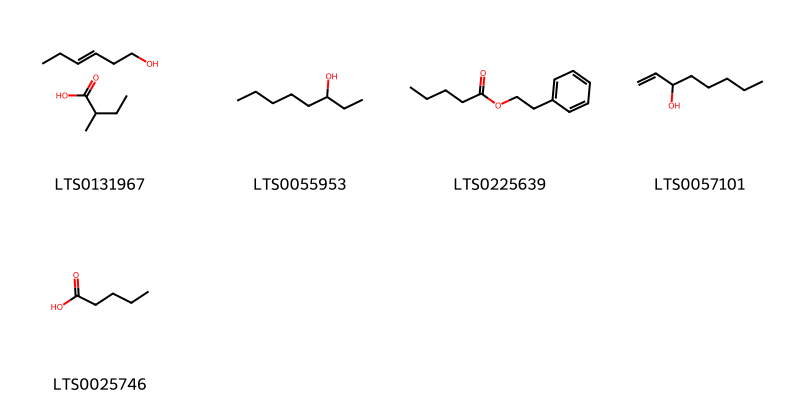
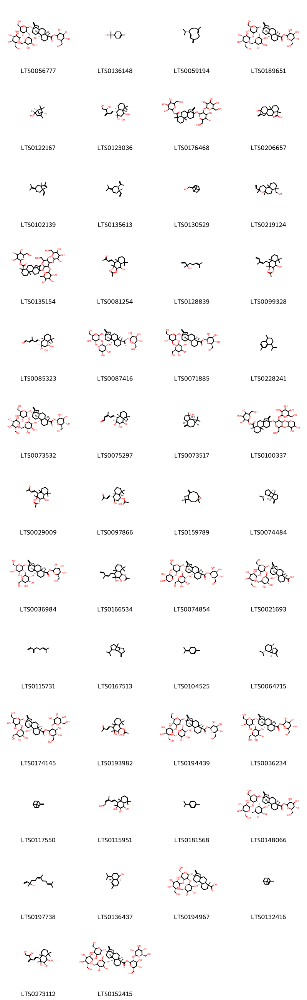

!!! abstract "Tóm tắt"
    Cỏ ngọt có tên khoa học là Stevia rebaudiana (Bertoni) Bertoni (Asteraceae - Cúc), bộ phận sử dụng là lá. Phân bố ở một số nơi của Việt Nam như: Thái Nguyên, Hà Nội, Đăk Lăk, Lâm Đồng, Bình Dương …; còn có ở Ấn Độ, Trung Quốc, Nhật Bản… Thành phần hóa học là steviosid, một diterpen glucosid có độ ngọt gấp 200-300 lần đường, có dulcosid A (0,5%), rebaudiosid A (2- 3%), C (1,5-2%) và steviolbiosid, rebaudiosid B, D, E ở dạng vết. Còn có một số dẫn chất diterpenoid khác, triterpenoid, sterol, tanin, tinh dầu, protex (6,2%), lipid (5,6%). Cây có một số tác dụng dược lý như. Tác dụng dược lý như giảm đường huyết, hỗ trợ phòng chống tăng huyết áp, tác dụng kháng khuẩn, kháng nấm, phòng ngừa tiểu đường. Trong dân gian người ta sử dụng làm chất điều vị ngọt trong các loại thực phẩm, hỗ trợ điều trị bệnh đái tháo đường, kiểm soát cân nặng, điều trị rối loạn mỡ máu…

## Thông tin về thực vật

### Đặc điểm thực vật

Dược liệu **Cỏ Ngọt (Lá)** từ bộ phận **nan** từ loài *Stevia rebaudiana (Bertoni) Hemsley* thuộc họ Asteraceae. Cây thảo lưu niên, caо 30-50cm, сó khi tới 120cm; mảnh, mọc thẳng đứng, có rãnh dọc và có lông lún phún, đường kính 5-80mm. Lá mọc đối, phiến lá hình thuôn-ngọn giáo, dài 3-7cm, rộng 0,8-1,9cm, mép có răng cưa tù, hai mặt lá phủ lông mịn, cuống dài 0,3-0,5cm. Cụm hoa đầu, hợp thành ngù, ở ngọn hay ở nách lá; mỗi cụm hoa đầu có 5 hoa nhỏ, đồng hình, lưỡng tỉnh. Tổng bao gồm 5-6 lá bắc. Để hoa trầm, phẳng, không có lông. Hoa hình ống, màu trắng, phớt hồng. Quả bế rất nhỏ. 

!!! info "Phân loại thực vật của *Stevia rebaudiana*"
    - **Kingdom:** Plantae
    - **Phylum:** Tracheophyta
    - **Order:** Asterales
    - **Family:** Asteraceae
    - **Genus:** Stevia
    - **Species:** *Stevia rebaudiana*

*Tài liệu tham khảo:* "Từ điển cây thuốc Việt Nam" - Võ Văn Chi

 

### Loài thay thế (Nếu có)

### Phân bố trên thế giới
**Từ vườn thực vật KEW: **: Native to: Brazil Southeast, Brazil West-Central, Paraguay
Introduced into: Bangladesh

**Từ CSDL GIBF** nan, Spain, Belgium, Australia, Norway, Chile, unknown or invalid, Germany, Paraguay, Malaysia, Pakistan, Bolivia (Plurinational State of), Brazil, Singapore, New Zealand, Guatemala, Korea, Republic of, India, Argentina, Italy, Colombia, Ecuador, China, Japan, El Salvador, Estonia, Cuba, United States of America, Portugal, Chinese Taipei

### Phân bố tại Việt Nam
** "Từ điển cây thuốc Việt Nam" - Võ Văn Chi**: Thái Nguyên, Hà Nội, Đăk Lăk, Lâm Đồng, Bình Dương …

**Từ CSDL GIBF**: Không có ghi nhận ở Việt Nam

---

## Thông tin về dược liệu 

### Định danh

!!! info "Thông tin về tên gọi của nan"
    - Dược liệu tiếng Việt: nan
    - Dược liệu tiếng Trung: nan (nan)
    - Dược liệu tiếng Anh: nan
    - Dược liệu latin thông dụng: nan
    - Dược liệu latin kiểu DĐVN: folium steviae rebaudiana
    - Dược liệu latin kiểu DĐVN: nan
    - Dược liệu latin kiểu thông tư: nan
    - Bộ phận dùng: nan (nan)

### Mô tả dược liệu 
- **Theo dược điển Việt nam V:** nan

- **Mô tả dược liệu theo thông tư chế biến dược liệu theo phương pháp cổ truyền:** nan

### Chế biến 

- **Chế biến theo dược điển việt nam V**: nan

- **Chế biến theo thông tư:** nan

--- 

## Thành phần hóa học

- Theo tài liệu của GS. Đỗ Tất Lợi:  (1) Thành phần chính trong cỏ ngọt là steviosid, một diterpen glucosid có độ ngọt gấp 200-300 lần đường. Ngoài ra, còn có dulcosid A (0,5%), rebaudiosid A (2- 3%), C (1,5-2%) và steviolbiosid, rebaudiosid B, D, E ở dạng vết. Còn có một số dẫn chất diterpenoid khác, triterpenoid, sterol, tanin, tinh dầu, protex (6,2%), lipid (5,6%).
(2)Dược điển Việt Nam: steviosid
    
- Theo cơ sở dữ liệu lotus: Từ loài *Stevia rebaudiana* đã phân lập và xác định được 168 hoạt chất thuộc về các nhóm Organooxygen compounds, Indolizidines, Prenol lipids, Fatty Acyls, Benzene and substituted derivatives, Heteroaromatic compounds, Phenols, Phenol ethers, Unsaturated hydrocarbons, Flavonoids. 

|    | chemicalTaxonomyClassyfireClass     |   smiles_count |
|---:|:------------------------------------|---------------:|
|  0 | Benzene and substituted derivatives |              1 |
|  1 | Fatty Acyls                         |              5 |
|  2 | Flavonoids                          |             17 |
|  3 | Heteroaromatic compounds            |              1 |
|  4 | Indolizidines                       |              2 |
|  5 | Organooxygen compounds              |              2 |
|  6 | Phenol ethers                       |              2 |
|  7 | Phenols                             |              1 |
|  8 | Prenol lipids                       |            135 |
|  9 | Unsaturated hydrocarbons            |              1 |

### Nhóm Benzene and substituted derivatives
<figure markdown="span">
    { width=100% }
    <figcaption>Hình ảnh cấu trúc hóa học của 1 hoạt chất thuộc nhóm Benzene and substituted derivatives gồm ['methyl eugenol (LTS0098881)'].</figcaption>
</figure>
### Nhóm Fatty Acyls
<figure markdown="span">
    { width=100% }
    <figcaption>Hình ảnh cấu trúc hóa học của 5 hoạt chất thuộc nhóm Fatty Acyls gồm ['2-methylbutanoic acid; 3-hexenol (LTS0131967)', '3-octanol (LTS0055953)', 'phenethyl valerate (LTS0225639)', '1-octen-3-ol (LTS0057101)', 'n-valeric acid (LTS0025746)'].</figcaption>
</figure>
### Nhóm Flavonoids
<figure markdown="span">
    { width=100% }
    <figcaption>Hình ảnh cấu trúc hóa học của 17 hoạt chất thuộc nhóm Flavonoids gồm ['quercitrin (LTS0093095)', 'apigetrin (LTS0157591)', '6-[(6-{[2-(3,4-dihydroxyphenyl)-5,7-dihydroxy-4-oxochromen-3-yl]oxy}-3,4,5-trihydroxyoxan-2-yl)methoxy]-4,5-dihydroxy-2-methyloxan-3-yl 3-(3,4-dihydroxyphenyl)prop-2-enoate (LTS0036217)', '(2r,3s,4r,5s,6s)-6-{[(2r,3r,4s,5r,6s)-6-{[2-(3,4-dihydroxyphenyl)-5,7-dihydroxy-4-oxochromen-3-yl]oxy}-3,4,5-trihydroxyoxan-2-yl]methoxy}-4,5-dihydroxy-2-methyloxan-3-yl (2e)-3-(3,4-dihydroxyphenyl)prop-2-enoate (LTS0206560)', '2-(3,4-dihydroxyphenyl)-5,7-dihydroxy-3-{[(2s,3r,4s,5r)-3,4,5-trihydroxyoxan-2-yl]oxy}-2,3-dihydro-1-benzopyran-4-one (LTS0135293)', '2-(3,4-dihydroxyphenyl)-5,7-dihydroxy-3-{[(2s,3s,4r,5r)-3,4,5-trihydroxyoxan-2-yl]oxy}chromen-4-one (LTS0159794)', '2-(3,4-dihydroxyphenyl)-5-hydroxy-7-{[3,4,5-trihydroxy-6-(hydroxymethyl)oxan-2-yl]oxy}chromen-4-one (LTS0158292)', 'apigenin 7-o-β-glucoside (LTS0252743)', 'quercitrin (LTS0186298)', '5,7-dihydroxy-2-(4-{[(2s,3r,4s,5s,6r)-3,4,5-trihydroxy-6-(hydroxymethyl)oxan-2-yl]oxy}phenyl)chromen-4-one (LTS0246588)', '5,7-dihydroxy-2-(4-hydroxyphenyl)-3-[(3,4,5-trihydroxy-6-methyloxan-2-yl)oxy]chromen-4-one (LTS0211340)', '2-(3,4-dihydroxyphenyl)-5,7-dihydroxy-3-{[(2s,3r,4r,5r,6s)-3,4,5-trihydroxy-6-(hydroxymethyl)oxan-2-yl]oxy}chromen-4-one (LTS0241372)', 'luteolin 7-o-glucoside (LTS0227450)', 'centaureidin (LTS0262608)', 'quercetin (LTS0004651)', 'luteolin (LTS0017052)', 'guaijaverin (LTS0119144)'].</figcaption>
</figure>
### Nhóm Heteroaromatic compounds
<figure markdown="span">
    { width=100% }
    <figcaption>Hình ảnh cấu trúc hóa học của 1 hoạt chất thuộc nhóm Heteroaromatic compounds gồm ['amylfuran (LTS0044471)'].</figcaption>
</figure>
### Nhóm Indolizidines
<figure markdown="span">
    { width=100% }
    <figcaption>Hình ảnh cấu trúc hóa học của 2 hoạt chất thuộc nhóm Indolizidines gồm ['(1r,2s,3r,5r,8ar)-3-(hydroxymethyl)-5-methyl-octahydroindolizine-1,2-diol (LTS0147196)', '3-(hydroxymethyl)-5-methyl-octahydroindolizine-1,2-diol (LTS0263302)'].</figcaption>
</figure>
### Nhóm Organooxygen compounds
<figure markdown="span">
    { width=100% }
    <figcaption>Hình ảnh cấu trúc hóa học của 2 hoạt chất thuộc nhóm Organooxygen compounds gồm ['3,4-dicaffeoylquinic acid (LTS0134972)', '3,4-bis({[3-(3,4-dihydroxyphenyl)prop-2-enoyl]oxy})-1,5-dihydroxycyclohexane-1-carboxylic acid (LTS0233490)'].</figcaption>
</figure>
### Nhóm Phenol ethers
<figure markdown="span">
    { width=100% }
    <figcaption>Hình ảnh cấu trúc hóa học của 2 hoạt chất thuộc nhóm Phenol ethers gồm ['p-propenylanisole (LTS0177188)', 'anethole (LTS0033696)'].</figcaption>
</figure>
### Nhóm Phenols
<figure markdown="span">
    { width=100% }
    <figcaption>Hình ảnh cấu trúc hóa học của 1 hoạt chất thuộc nhóm Phenols gồm ['eugenol (LTS0052342)'].</figcaption>
</figure>
### Nhóm Prenol lipids
<figure markdown="span">
    { width=100% }
    <figcaption>Hình ảnh cấu trúc hóa học của 135 hoạt chất thuộc nhóm Prenol lipids gồm ['rebaudioside a (LTS0056777)', 'terpineol (LTS0136148)', '(-)-germacrene d (LTS0059194)', '(2s,3s,4s,5s,6r)-3,4,5-trihydroxy-6-(hydroxymethyl)oxan-2-yl (1r,4s,5r,9s,10r,13s)-13-{[(2s,3r,4s,5r,6r)-5-hydroxy-6-(hydroxymethyl)-3,4-bis({[(2s,3r,4s,5s,6r)-3,4,5-trihydroxy-6-(hydroxymethyl)oxan-2-yl]oxy})oxan-2-yl]oxy}-5,9-dimethyl-14-methylidenetetracyclo[11.2.1.0¹,¹⁰.0⁴,⁹]hexadecane-5-carboxylate (LTS0189651)', '(1r,2s,5r)-4,6,6-trimethylbicyclo[3.1.1]hept-3-en-2-ol (LTS0122167)', '(1r,2s,3s,4r,4as,8as)-4-[(1e,4s)-4,5-dihydroxy-3-methylidenepent-1-en-1-yl]-3,4a,8,8-tetramethyl-hexahydro-1h-naphthalene-1,2,3-triol (LTS0123036)', 'stevioside (LTS0176468)', 'steviol (LTS0206657)', '1-ethenyl-1,2-dimethyl-2-(prop-1-en-2-yl)-4-(propan-2-ylidene)cyclohexane (LTS0102139)', '(1s,2s)-1-ethenyl-1-methyl-2-(prop-1-en-2-yl)-4-(propan-2-ylidene)cyclohexane (LTS0135613)', 'myrtenol (LTS0130529)', '{3-ethenyl-3,4a,7,10a-tetramethyl-octahydro-1h-naphtho[2,1-b]pyran-7-yl}methanol (LTS0219124)', '3,4,5-trihydroxy-6-(hydroxymethyl)oxan-2-yl 13-{[5-hydroxy-6-(hydroxymethyl)-4-{[3,4,5-trihydroxy-6-(hydroxymethyl)oxan-2-yl]oxy}-3-[(3,4,5-trihydroxy-6-methyloxan-2-yl)oxy]oxan-2-yl]oxy}-5,9-dimethyl-14-methylidenetetracyclo[11.2.1.0¹,¹⁰.0⁴,⁹]hexadecane-5-carboxylate (LTS0135154)', '1,3-dihydroxy-3,4a,8,8-tetramethyl-4-[(1e)-3-oxobut-1-en-1-yl]-hexahydro-1h-naphthalen-2-yl acetate (LTS0081254)', 'linalool, (+-)- (LTS0128839)', '1,3-dihydroxy-3,4a,8,8-tetramethyl-4-(3-methylpenta-2,4-dien-1-yl)-hexahydro-1h-naphthalen-2-yl acetate (LTS0099328)', '(2e,4e)-5-[(1r,2s,3s,4r,4as,8ar)-2,3,4-trihydroxy-2,5,5,8a-tetramethyl-hexahydro-1h-naphthalen-1-yl]-3-methylpenta-2,4-dienal (LTS0085323)', 'dulcoside a (LTS0087416)', '(2s,3r,4s,5s,6r)-3,4,5-trihydroxy-6-(hydroxymethyl)oxan-2-yl (1r,4s,5r,9s,10r,13s)-13-{[(2r,3r,4s,5s,6r)-4,5-dihydroxy-6-(hydroxymethyl)-3-{[(2s,3r,4s,5s,6r)-3,4,5-trihydroxy-6-(hydroxymethyl)oxan-2-yl]oxy}oxan-2-yl]oxy}-5,9-dimethyl-14-methylidenetetracyclo[11.2.1.0¹,¹⁰.0⁴,⁹]hexadecane-5-carboxylate (LTS0071885)', '(e)-calamene (LTS0228241)', '(2s,3r,4s,5s,6r)-3,4,5-trihydroxy-6-(hydroxymethyl)oxan-2-yl (1r,4r,5r,9s,10s,13s)-13-{[(2r,3r,4s,5r,6r)-5-hydroxy-6-(hydroxymethyl)-3,4-bis({[(2s,3r,4s,5s,6r)-3,4,5-trihydroxy-6-(hydroxymethyl)oxan-2-yl]oxy})oxan-2-yl]oxy}-5,9-dimethyl-14-methylidenetetracyclo[11.2.1.0¹,¹⁰.0⁴,⁹]hexadecane-5-carboxylate (LTS0073532)', '(2z,4e)-5-[(1r,2s,3s,4r,4as,8ar)-2,3,4-trihydroxy-2,5,5,8a-tetramethyl-hexahydro-1h-naphthalen-1-yl]-3-methylpenta-2,4-dienal (LTS0075297)', '(1as,4as,7s,7ar,7bs)-1,1,7-trimethyl-4-methylidene-octahydrocyclopropa[e]azulen-7-ol (LTS0073517)', '3,4,5-trihydroxy-6-(hydroxymethyl)oxan-2-yl 13-{[5-hydroxy-6-(hydroxymethyl)-3-{[3,4,5-trihydroxy-6-(hydroxymethyl)oxan-2-yl]oxy}-4-[(3,4,5-trihydroxyoxan-2-yl)oxy]oxan-2-yl]oxy}-5,9-dimethyl-14-methylidenetetracyclo[11.2.1.0¹,¹⁰.0⁴,⁹]hexadecane-5-carboxylate (LTS0100337)', '1,3-dihydroxy-3,4a,8,8-tetramethyl-4-(3-oxobut-1-en-1-yl)-hexahydro-1h-naphthalen-2-yl acetate (LTS0029009)', '(1r,2s,3s,4r,4as,8as)-2,3-dihydroxy-3,4a,8,8-tetramethyl-4-[(1e)-3-oxobut-1-en-1-yl]-hexahydro-1h-naphthalen-1-yl acetate (LTS0097866)', 'caryophyllene oxide (LTS0159789)', 'β-bourbonene (LTS0074484)', '(2s,3r,4r,5s,6r)-3,4,5-trihydroxy-6-(hydroxymethyl)oxan-2-yl (1r,4s,5r,9s,10r,13s)-13-{[(2s,3r,4s,5s,6r)-4,5-dihydroxy-6-(hydroxymethyl)-3-{[(2s,3r,4s,5s,6r)-3,4,5-trihydroxy-6-(hydroxymethyl)oxan-2-yl]oxy}oxan-2-yl]oxy}-5,9-dimethyl-14-methylidenetetracyclo[11.2.1.0¹,¹⁰.0⁴,⁹]hexadecane-5-carboxylate (LTS0036984)', '2,3-dihydroxy-3,4a,8,8-tetramethyl-4-(3-methylpenta-2,4-dien-1-yl)-hexahydro-1h-naphthalen-1-yl acetate (LTS0166534)', '(2s,3r,4s,5s,6r)-3,4,5-trihydroxy-6-(hydroxymethyl)oxan-2-yl (1r,4s,5r,9s,10r,13s)-13-{[(2s,3r,4s,5r,6r)-5-hydroxy-6-(hydroxymethyl)-3-{[(2s,3r,4s,5s,6r)-3,4,5-trihydroxy-6-(hydroxymethyl)oxan-2-yl]oxy}-4-{[(2s,3r,4s,5r)-3,4,5-trihydroxyoxan-2-yl]oxy}oxan-2-yl]oxy}-5,9-dimethyl-14-methylidenetetracyclo[11.2.1.0¹,¹⁰.0⁴,⁹]hexadecane-5-carboxylate (LTS0074854)', 'rebaudioside b (LTS0021693)', 'α-myrcene (LTS0115731)', 'β-bourbonene (LTS0167513)', 'terpinolene (LTS0104525)', '(1s,5r,7s,10r)-7-isopropyl-4,10-dimethyltricyclo[4.4.0.0¹,⁵]dec-3-ene (LTS0064715)', 'rebaudioside e (LTS0174145)', '2,3-dihydroxy-3,4a,8,8-tetramethyl-4-(3-oxobut-1-en-1-yl)-hexahydro-1h-naphthalen-1-yl acetate (LTS0193982)', '(2s,3r,4s,5s,6r)-3,4,5-trihydroxy-6-(hydroxymethyl)oxan-2-yl (1r,4s,5r,9s,10r,13s)-13-{[(2s,3r,4s,5r,6r)-5-hydroxy-6-(hydroxymethyl)-3-{[(2r,3s,4r,5r,6s)-3,4,5-trihydroxy-6-(hydroxymethyl)oxan-2-yl]oxy}-4-{[(2s,3r,4s,5s,6r)-3,4,5-trihydroxy-6-(hydroxymethyl)oxan-2-yl]oxy}oxan-2-yl]oxy}-5,9-dimethyl-14-methylidenetetracyclo[11.2.1.0¹,¹⁰.0⁴,⁹]hexadecane-5-carboxylate (LTS0194439)', '(2s,3s,4s,5s,6r)-3,4,5-trihydroxy-6-(hydroxymethyl)oxan-2-yl (1r,4s,5r,9s,10r,13s)-13-{[(2s,3r,4s,5r,6r)-4,5-dihydroxy-6-(hydroxymethyl)-3-{[(2s,3s,4s,5s,6r)-3,4,5-trihydroxy-6-(hydroxymethyl)oxan-2-yl]oxy}oxan-2-yl]oxy}-5,9-dimethyl-14-methylidenetetracyclo[11.2.1.0¹,¹⁰.0⁴,⁹]hexadecane-5-carboxylate (LTS0036234)', 'β-pinene (LTS0117550)', '4-[(1e,3z)-5-hydroxy-3-methylpenta-1,3-dien-1-yl]-3,4a,8,8-tetramethyl-hexahydro-1h-naphthalene-1,2,3-triol (LTS0115951)', 'cymene (LTS0181568)', '(2s,3r,4s,5s,6r)-3,4,5-trihydroxy-6-(hydroxymethyl)oxan-2-yl (1r,4s,5r,9s,10r,13s)-13-{[(2s,3r,4s,5r,6r)-5-hydroxy-6-(hydroxymethyl)-4-{[(2s,3r,4s,5s,6r)-3,4,5-trihydroxy-6-(hydroxymethyl)oxan-2-yl]oxy}-3-{[(2r,3s,4s,5s,6r)-3,4,5-trihydroxy-6-methyloxan-2-yl]oxy}oxan-2-yl]oxy}-5,9-dimethyl-14-methylidenetetracyclo[11.2.1.0¹,¹⁰.0⁴,⁹]hexadecane-5-carboxylate (LTS0148066)', 'nerolidol (LTS0197738)', '(1r,4ar,8as)-4-isopropyl-1,6-dimethyl-3,4,4a,7,8,8a-hexahydro-2h-naphthalen-1-ol (LTS0136437)', '(1r,5r,9s,13s)-13-{[(2r,3s,4r,5s,6s)-5-hydroxy-6-(hydroxymethyl)-3,4-bis({[(2r,3s,4r,5r,6s)-3,4,5-trihydroxy-6-(hydroxymethyl)oxan-2-yl]oxy})oxan-2-yl]oxy}-5,9-dimethyl-14-methylidenetetracyclo[11.2.1.0¹,¹⁰.0⁴,⁹]hexadecane-5-carboxylic acid (LTS0194967)', 'α pinene (LTS0132416)', '4-[(1e)-4,5-dihydroxy-3-methylidenepent-1-en-1-yl]-3,4a,8,8-tetramethyl-hexahydro-1h-naphthalene-1,2,3-triol (LTS0273112)', 'rebaudioside d (LTS0152415)', 'myrtenal (LTS0202475)', '(1s,4s)-4-isopropyl-1,6-dimethyl-1,2,3,4-tetrahydronaphthalene (LTS0139634)', 'α-cadinol (LTS0206935)', 'humulene (LTS0263171)', '4-(5-hydroxy-3-methylpenta-1,3-dien-1-yl)-3,4a,8,8-tetramethyl-hexahydro-1h-naphthalene-1,2,3-triol (LTS0246531)', '(1r,2s,3s,4r,4as,8as)-4-[(1e,3e)-5-methoxy-3-methylpenta-1,3-dien-1-yl]-3,4a,8,8-tetramethyl-hexahydro-1h-naphthalene-1,2,3-triol (LTS0174562)', '(3e)-4-(2,3-dihydroxy-2,5,5,8a-tetramethyl-hexahydro-1h-naphthalen-1-yl)but-3-en-2-one (LTS0106068)', '4-isopropyl-1,6-dimethyl-2,3,4,4a,7,8-hexahydronaphthalene (LTS0270743)', '(3r,6e)-nerolidol (LTS0145065)', 'limonene,  (LTS0155981)', '(3e)-4-(2,3,4-trihydroxy-2,5,5,8a-tetramethyl-hexahydro-1h-naphthalen-1-yl)but-3-en-2-one (LTS0143840)', 'β-ionone (LTS0155301)', '2,3-dihydroxy-3,4a,8,8-tetramethyl-4-[(1e)-3-oxobut-1-en-1-yl]-hexahydro-1h-naphthalen-1-yl acetate (LTS0138522)', 'pinocarvone (LTS0084836)', 'rebaudioside c (LTS0172455)', 'β-elemene (LTS0225699)', '(z)-γ-bisabolene (LTS0143321)', '(1r,4s,4ar)-4-isopropyl-1,6-dimethyl-3,4,4a,7,8,8a-hexahydro-2h-naphthalen-1-ol (LTS0164497)', 'austroinulin (LTS0257641)', '(2r,3r,4s,5s,6r)-3,4,5-trihydroxy-6-(hydroxymethyl)oxan-2-yl (1r,4s,5r,9s,10r,13s)-13-{[(2s,3r,4s,5r,6r)-5-hydroxy-6-(hydroxymethyl)-4-{[(2s,3r,4s,5s,6r)-3,4,5-trihydroxy-6-(hydroxymethyl)oxan-2-yl]oxy}-3-{[(2s,3r,4s,5r)-3,4,5-trihydroxyoxan-2-yl]oxy}oxan-2-yl]oxy}-5,9-dimethyl-14-methylidenetetracyclo[11.2.1.0¹,¹⁰.0⁴,⁹]hexadecane-5-carboxylate (LTS0183429)', 'borneol (LTS0264960)', '(+)-gamma-cadinene (LTS0103949)', 'α-bergamotene (LTS0226115)', '(1r,4s,5r,9s,10s,13s)-13-{[(2r,3s,4r,5s,6s)-5-hydroxy-6-(hydroxymethyl)-3,4-bis({[(2r,3s,4r,5r,6s)-3,4,5-trihydroxy-6-(hydroxymethyl)oxan-2-yl]oxy})oxan-2-yl]oxy}-5,9-dimethyl-14-methylidenetetracyclo[11.2.1.0¹,¹⁰.0⁴,⁹]hexadecane-5-carboxylic acid (LTS0105616)', '(1r,2s,3s,4r,4as,8as)-1,3-dihydroxy-3,4a,8,8-tetramethyl-4-[(1e)-3-oxobut-1-en-1-yl]-hexahydro-1h-naphthalen-2-yl acetate (LTS0261155)', '(2s,3r,4s,5s,6r)-3,4,5-trihydroxy-6-(hydroxymethyl)oxan-2-yl (1r,4s,5r,9s,10r,13s)-13-{[(2s,3r,4s,5s,6r)-4,5-dihydroxy-6-(hydroxymethyl)-3-{[(2r,3r,4s,5s,6r)-3,4,5-trihydroxy-6-(hydroxymethyl)oxan-2-yl]oxy}oxan-2-yl]oxy}-4,5,9,10-tetramethyl-14-methylidenetetracyclo[11.2.1.0¹,¹⁰.0⁴,⁹]hexadecane-5-carboxylate (LTS0178833)', 'caryophyllene (LTS0085212)', '4-(2,3-dihydroxy-2,5,5,8a-tetramethyl-hexahydro-1h-naphthalen-1-yl)but-3-en-2-one (LTS0268038)', '(1r,2s,3s,4r,4ar,8as)-4-[(1e,3r)-3-hydroxy-3-methylpenta-1,4-dien-1-yl]-3,4a,8,8-tetramethyl-hexahydro-1h-naphthalene-1,2,3-triol (LTS0082319)', 'stevioside (LTS0071721)', '(1r,2s,3s,4r,4ar,8as)-4-[(1e,3s)-3-hydroxy-3-methylpenta-1,4-dien-1-yl]-3,4a,8,8-tetramethyl-hexahydro-1h-naphthalene-1,2,3-triol (LTS0209970)', '(2e,4e)-5-[(1r,2s,3s,4r,4as,8as)-2,3,4-trihydroxy-2,5,5,8a-tetramethyl-hexahydro-1h-naphthalen-1-yl]-3-methylpenta-2,4-dienal (LTS0073547)', 'β-farnesene (LTS0067925)', '3,4a,8,8-tetramethyl-4-(3-methylpenta-2,4-dien-1-yl)-hexahydro-1h-naphthalene-1,2,3-triol (LTS0272012)', '(1z,6z,8s)-8-isopropyl-1-methyl-5-methylidenecyclodeca-1,6-diene (LTS0065195)', '(1r,2s,3s,4r,4as,8ar)-4-[(1e,3z)-5-hydroxy-3-methylpenta-1,3-dien-1-yl]-3,4a,8,8-tetramethyl-hexahydro-1h-naphthalene-1,2,3-triol (LTS0225216)', 'β-caryophyllene oxide (LTS0213960)', 'α-copaene (LTS0207598)', 'sabinene (LTS0224133)', '(3e)-2-oxo-4-(2,6,6-trimethylcyclohex-1-en-1-yl)but-3-enal (LTS0198571)', '4-(4,5-dihydroxy-3-methylidenepent-1-en-1-yl)-3,4a,8,8-tetramethyl-hexahydro-1h-naphthalene-1,2,3-triol (LTS0009844)', '3,4,5-trihydroxy-6-(hydroxymethyl)oxan-2-yl 13-{[5-hydroxy-6-(hydroxymethyl)-3,4-bis({[3,4,5-trihydroxy-6-(hydroxymethyl)oxan-2-yl]oxy})oxan-2-yl]oxy}-5,9-dimethyl-14-methylidenetetracyclo[11.2.1.0¹,¹⁰.0⁴,⁹]hexadecane-5-carboxylate (LTS0033223)', '3,4,5-trihydroxy-6-(hydroxymethyl)oxan-2-yl 13-{[4,5-dihydroxy-6-(hydroxymethyl)-3-{[3,4,5-trihydroxy-6-(hydroxymethyl)oxan-2-yl]oxy}oxan-2-yl]oxy}-4,5,9,10-tetramethyl-14-methylidenetetracyclo[11.2.1.0¹,¹⁰.0⁴,⁹]hexadecane-5-carboxylate (LTS0019036)', '(1r,2s,3s,4r,4as,8as)-4-[(1e,3e)-5-hydroxy-3-methylpenta-1,3-dien-1-yl]-3,4a,8,8-tetramethyl-hexahydro-1h-naphthalene-1,2,3-triol (LTS0226145)', '(2s,3r,4s,5s,6r)-3,4,5-trihydroxy-6-(hydroxymethyl)oxan-2-yl (1r,4s,5r,9s,10s,13s)-13-{[(2r,3s,4r,5s,6s)-5-hydroxy-6-(hydroxymethyl)-3,4-bis({[(2r,3s,4r,5r,6s)-3,4,5-trihydroxy-6-(hydroxymethyl)oxan-2-yl]oxy})oxan-2-yl]oxy}-5,9-dimethyl-14-methylidenetetracyclo[11.2.1.0¹,¹⁰.0⁴,⁹]hexadecane-5-carboxylate (LTS0159793)', 'delta-cadinol (LTS0008282)', 'cuminaldehyde (LTS0037806)', '4-(5-methoxy-3-methylpenta-1,3-dien-1-yl)-3,4a,8,8-tetramethyl-hexahydro-1h-naphthalene-1,2,3-triol (LTS0226732)', '(1r,2s,3s,4r,4as,8as)-4-[(1e,3z)-5-methoxy-3-methylpenta-1,3-dien-1-yl]-3,4a,8,8-tetramethyl-hexahydro-1h-naphthalene-1,2,3-triol (LTS0255667)', '(2s,3r,4s,5s,6r)-3,4,5-trihydroxy-6-(hydroxymethyl)oxan-2-yl (1r,4s,5r,9s,10r,13s)-13-{[(2s,3r,4s,5r,6r)-5-hydroxy-6-(hydroxymethyl)-4-{[(2s,3r,4s,5s,6r)-3,4,5-trihydroxy-6-(hydroxymethyl)oxan-2-yl]oxy}-3-{[(2r,3r,4r,5r,6s)-3,4,5-trihydroxy-6-methyloxan-2-yl]oxy}oxan-2-yl]oxy}-5,9-dimethyl-14-methylidenetetracyclo[11.2.1.0¹,¹⁰.0⁴,⁹]hexadecane-5-carboxylate (LTS0018871)', '(s)-trans-verbenol (LTS0175186)', '(1r,2s,7s,8s)-8-isopropyl-1,3-dimethyltricyclo[4.4.0.0²,⁷]dec-3-ene (LTS0190031)', '(2s,4r)-1,7,7-trimethylbicyclo[2.2.1]heptan-2-ol (LTS0010050)', '3,4,5-trihydroxy-6-(hydroxymethyl)oxan-2-yl 13-{[5-hydroxy-6-(hydroxymethyl)-4-{[3,4,5-trihydroxy-6-(hydroxymethyl)oxan-2-yl]oxy}-3-[(3,4,5-trihydroxyoxan-2-yl)oxy]oxan-2-yl]oxy}-5,9-dimethyl-14-methylidenetetracyclo[11.2.1.0¹,¹⁰.0⁴,⁹]hexadecane-5-carboxylate (LTS0270663)', '(1r,2s,3s,4r,4as,8as)-4-[(1e,4r)-4,5-dihydroxy-3-methylidenepent-1-en-1-yl]-3,4a,8,8-tetramethyl-hexahydro-1h-naphthalene-1,2,3-triol (LTS0061952)', '(2z,4e)-5-[(1r,2s,3s,4r,4as,8as)-2,3,4-trihydroxy-2,5,5,8a-tetramethyl-hexahydro-1h-naphthalen-1-yl]-3-methylpenta-2,4-dienal (LTS0041295)', '(3e)-4-[(1r,2s,3s,4r,4as,8as)-2,3,4-trihydroxy-2,5,5,8a-tetramethyl-hexahydro-1h-naphthalen-1-yl]but-3-en-2-one (LTS0125515)', '3-methyl-5-(2,3,4-trihydroxy-2,5,5,8a-tetramethyl-hexahydro-1h-naphthalen-1-yl)penta-2,4-dienal (LTS0037670)', 'carvacrol (LTS0012882)', '(1r,2s,3s,4r,4as,8as)-4-[(1e,3z)-5-hydroxy-3-methylpenta-1,3-dien-1-yl]-3,4a,8,8-tetramethyl-hexahydro-1h-naphthalene-1,2,3-triol (LTS0005788)', '3,4-dihydrocadalene (LTS0015523)', '(1s,2r,3r,4s,4ar,8as)-2,3-dihydroxy-3,4a,8,8-tetramethyl-4-[(2z)-3-methylpenta-2,4-dien-1-yl]-hexahydro-1h-naphthalen-1-yl acetate (LTS0091509)', 'rebaudioside f (LTS0083118)', '(1s,2r,3r,4s,4ar,8ar)-1,3-dihydroxy-3,4a,8,8-tetramethyl-4-[(2z)-3-methylpenta-2,4-dien-1-yl]-hexahydro-1h-naphthalen-2-yl acetate (LTS0233331)', '(1r,2s,3s,4r,4as,8as)-3,4a,8,8-tetramethyl-4-[(2z)-3-methylpenta-2,4-dien-1-yl]-hexahydro-1h-naphthalene-1,2,3-triol (LTS0080139)', 'delta-cadinene (LTS0019321)', 'pinocarveol (LTS0090950)', '(7ar)-1,1,7-trimethyl-4-methylidene-octahydrocyclopropa[e]azulen-7-ol (LTS0091612)', '(1r,4s,5r,9s,10r,13s)-13-{[(2s)-4,5-dihydroxy-6-(hydroxymethyl)-3-{[(2s)-3,4,5-trihydroxy-6-(hydroxymethyl)oxan-2-yl]oxy}oxan-2-yl]oxy}-5,9-dimethyl-14-methylidenetetracyclo[11.2.1.0¹,¹⁰.0⁴,⁹]hexadecane-5-carboxylic acid (LTS0020884)', 'rebaudioside c (LTS0029436)', '[(3r,4ar,6ar,7r,10as,10bs)-3-ethenyl-3,4a,7,10a-tetramethyl-octahydro-1h-naphtho[2,1-b]pyran-7-yl]methanol (LTS0239734)', '(3ar,5ar,5br,7ar,11ar,11br,13ar,13br)-3a,5a,5b,8,8,11a-hexamethyl-1-(prop-1-en-2-yl)-hexadecahydrocyclopenta[a]chrysen-9-yl hexadecanoate (LTS0228586)', '13-{[5-hydroxy-6-(hydroxymethyl)-3,4-bis({[3,4,5-trihydroxy-6-(hydroxymethyl)oxan-2-yl]oxy})oxan-2-yl]oxy}-5,9-dimethyl-14-methylidenetetracyclo[11.2.1.0¹,¹⁰.0⁴,⁹]hexadecane-5-carboxylic acid (LTS0134379)', '(2s,3r,4s,5s,6r)-3,4,5-trihydroxy-6-(hydroxymethyl)oxan-2-yl (1r,5r,13s)-13-{[(2s,3r,4s,5r,6r)-5-hydroxy-6-(hydroxymethyl)-4-{[(2s,3r,4s,5s,6r)-3,4,5-trihydroxy-6-(hydroxymethyl)oxan-2-yl]oxy}-3-{[(2s,3r,4s,5r)-3,4,5-trihydroxyoxan-2-yl]oxy}oxan-2-yl]oxy}-5,9-dimethyl-14-methylidenetetracyclo[11.2.1.0¹,¹⁰.0⁴,⁹]hexadecane-5-carboxylate (LTS0269689)', '4-(2,3,4-trihydroxy-2,5,5,8a-tetramethyl-hexahydro-1h-naphthalen-1-yl)but-3-en-2-one (LTS0029484)', '(1s,2r,3r,4s,4ar,8as)-3,4a,8,8-tetramethyl-4-[(2z)-3-methylpenta-2,4-dien-1-yl]-hexahydro-1h-naphthalene-1,2,3-triol (LTS0097063)', '(-)-α-cubebene (LTS0042045)', '(1r,2s,3s,4r,4as,8as)-2,3-dihydroxy-3,4a,8,8-tetramethyl-4-[(2z)-3-methylpenta-2,4-dien-1-yl]-hexahydro-1h-naphthalen-1-yl acetate (LTS0268787)', '(3e)-4-[(1r,2s,3s,4as,8as)-2,3-dihydroxy-2,5,5,8a-tetramethyl-hexahydro-1h-naphthalen-1-yl]but-3-en-2-one (LTS0026252)', '4-isopropyl-6-methyl-1-methylidene-3,4,4a,7,8,8a-hexahydro-2h-naphthalene (LTS0111070)', '4-[(1e)-5-methoxy-3-methylpenta-1,3-dien-1-yl]-3,4a,8,8-tetramethyl-hexahydro-1h-naphthalene-1,2,3-triol (LTS0042719)', 'steviol (LTS0036571)', '(-)-β-cubebene (LTS0123697)', '[(3r,4ar,6ar,7r,10as,10br)-3-ethenyl-3,4a,7,10a-tetramethyl-octahydro-1h-naphtho[2,1-b]pyran-7-yl]methanol (LTS0041383)', '(2r,3s,4r,5r,6s)-3,4,5-trihydroxy-6-(hydroxymethyl)oxan-2-yl (1s,4r,5s,9r,10s,13r)-13-{[(2r,3s,4r,5s,6s)-5-hydroxy-6-(hydroxymethyl)-4-{[(2r,3s,4r,5r,6s)-3,4,5-trihydroxy-6-(hydroxymethyl)oxan-2-yl]oxy}-3-{[(2r,3s,4r,5s)-3,4,5-trihydroxyoxan-2-yl]oxy}oxan-2-yl]oxy}-5,9-dimethyl-14-methylidenetetracyclo[11.2.1.0¹,¹⁰.0⁴,⁹]hexadecane-5-carboxylate (LTS0258184)'].</figcaption>
</figure>
### Nhóm Unsaturated hydrocarbons
<figure markdown="span">
    { width=100% }
    <figcaption>Hình ảnh cấu trúc hóa học của 1 hoạt chất thuộc nhóm Unsaturated hydrocarbons gồm ['α terpinene (LTS0232891)'].</figcaption>
</figure>

---

## Tác dụng dược lý

Theo tài liệu "Từ điển cây thuốc Việt Nam" - Võ Văn Chi:Tác dụng hạ đường huyết 
Tác dụng giãn mạch
Tác dụng trên thận và huyết áp
Tác dụng tránh thai
Tác dụng kháng khuẩn
….

Theo tài liệu quốc tế: nan

---

## Dược điển Việt Nam V

### Soi bột:
nan
<!-- Hình ảnh soi bột sẽ được tự động chèn vào đây sau -->
### Vi phẫu:
nan
<!-- Hình ảnh vi phẫu sẽ được tự động chèn vào đây sau -->
### Định tính

nan

### Định lượng

nan

### Thông tin khác 
- ** Độ ẩm: ** nan

- ** Bảo quản:** nan
## Dược điển Hồng kong

<!-- PDF sẽ được tự động chèn vào đây sau -->

---

## Y dược học cổ truyền

- **Tên vị thuốc:** nan
- **Tính vị quy kinh:** Vị ngọt, tính mát, vào kinh phế tỳ thận
- **Công năng chủ trị:** Trừ tiêu khát, lợi tiểu, hạ huyết áp dùng trong các trường hợp đái tháo đường, đái tháo nhạt, bí tiểu tiện, huyết áp cao.
- **Chú ý:** nan
- **Kiêng kỵ:** nan

