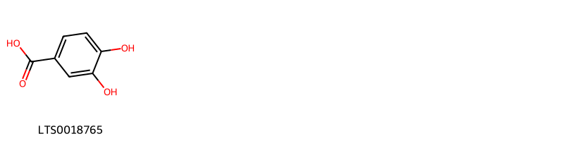
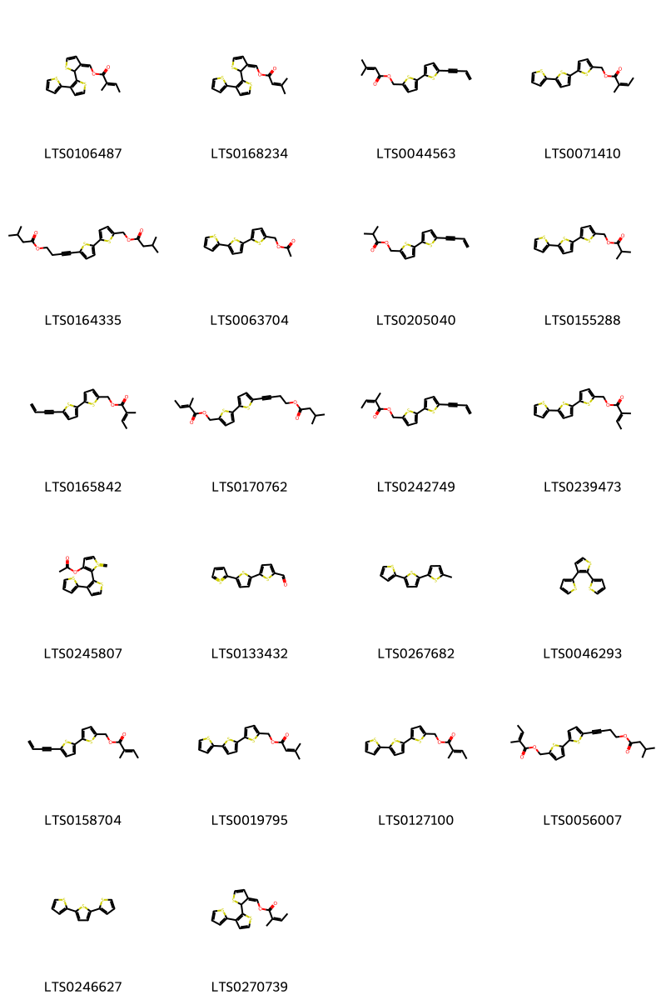
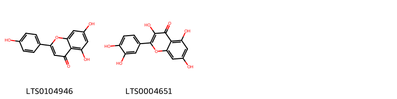
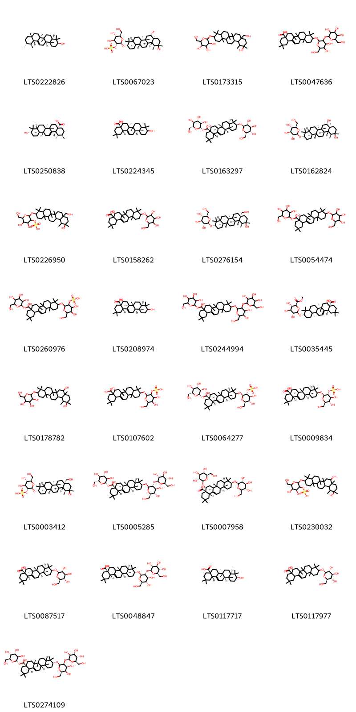

!!! abstract "Tóm tắt"
    Cỏ nhọ nồi hay còn gọi là cỏ mực, có tên khoa học - Eclipta prostrata L. (Asteraceae - Cúc). Phân bố phổ biến khắp nơi từ Bắc vào Nam, còn có ở các nước nhiệt đới khác thuộc châu Á, châu Phi. Thành phần hóa học gồm Coumarin nhóm coumestan (wedelolactone, norwedelo-lacton), alcaloid ecliptin, nicotin, saponin triterpen, còn có các dẫn chất triterpenoid tự do như β - amyrin, acid ursolic, acid oleanolic; các steroid tự do, các dẫn chất polyacetylen. Tác dụng dược lý để cầm máu, chống nhiễm độc gan, giảm đau, tác dụng kháng khuẩn đối với 1 số loài, làm lành vết thương, chữa tiểu đường. Dân gian sử dụng cây nhọ nồi giã vắt nước uống để cầm máu trong rong kinh, trĩ ra máu, bị thương chảy máu; còn dùng chữa ho, hen, họ lao, viêm cổ họng, dạng sắc uống hay làm thành viên mà uống; có người dùng chữa bệnh nấm ở ngoài da, làm thuốc mọc tóc, nhuộm tóc, bôi lên những chỗ trổ ở da thịt để có màu tím đen.

## Thông tin về thực vật

### Đặc điểm thực vật

Dược liệu **Cỏ Nhọ Nồi (Phần Cây Trên Mặt Đất)** từ bộ phận **Trên mặt đất** từ loài *Eclipta prostrata L.* thuộc họ Asteraceae. Cây thảo mọc hàng năm, thân cao 10 - 60cm, phân nhánh, màu lục, đôi khi hơi đỏ tía, phủ lông cứng. Lá mọc đối, phiến hình ngọn giáo tới bầu dục - thuôn, dài 3-10cm, rộng 0,5-2,5 cm, mép nguyên hoặc khía răng, có lông tơ dày ở cả hai mặt. Cụm hoa hình bán cầu, đường kính 1-1,2 cm, trên cuống dài 1,5mm, ở nách lá hoặc ở ngọn cành. Tổng bao gồm 1 hàng lá bắc hình bầu dục, có lông tơ ở mặt lưng. Đế hoa lồi, rộng 1 cm. Các hoa mép là hoa cái có tràng dạng lưỡi nhỏ, màu trắng, đầu có hai thuỳ; các hoa lưỡng tính ở giữa, hình ống, ở đầu có 4-5 thuỳ. Quả bế dẹt, có 3 cạnh, màu đen. 

!!! info "Phân loại thực vật của *Eclipta prostrata*"
    - **Kingdom:** Plantae
    - **Phylum:** Tracheophyta
    - **Order:** Asterales
    - **Family:** Asteraceae
    - **Genus:** Eclipta
    - **Species:** *Eclipta prostrata*

*Tài liệu tham khảo:* "Từ điển cây thuốc Việt Nam" - Võ Văn Chi

 

### Loài thay thế (Nếu có)

### Phân bố trên thế giới
**Từ vườn thực vật KEW: **: Native to: Alabama, Argentina Northeast, Argentina Northwest, Arizona, Arkansas, Bahamas, Belize, Bolivia, Brazil North, Brazil Northeast, Brazil South, Brazil Southeast, Brazil West-Central, California, Chile Central, Chile North, Chile South, Colombia, Connecticut, Costa Rica, Cuba, Delaware, District of Columbia, Dominican Republic, Ecuador, El Salvador, Florida, French Guiana, Georgia, Guatemala, Guyana, Haiti, Honduras, Illinois, Indiana, Iowa, Kansas, Kentucky, Louisiana, Maryland, Massachusetts, Mexico Central, Mexico Gulf, Mexico Northeast, Mexico Northwest, Mexico Southeast, Mexico Southwest, Michigan, Minnesota, Mississippi, Missouri, Nebraska, New Jersey, New Mexico, New York, Nicaragua, North Carolina, Ohio, Oklahoma, Ontario, Panamá, Paraguay, Pennsylvania, Peru, Puerto Rico, Rhode I., South Carolina, South Dakota, Suriname, Tennessee, Texas, Trinidad-Tobago, Uruguay, Venezuela, Vermont, Virginia, West Virginia, Wisconsin
Introduced into: Afghanistan, Albania, Andaman Is., Angola, Aruba, Assam, Baleares, Bangladesh, Benin, Borneo, Botswana, Bulgaria, Burkina, Burundi, Cambodia, Cameroon, Canary Is., Cape Provinces, Cape Verde, Caprivi Strip, Caroline Is., Cayman Is., Central African Republic, Chad, Chagos Archipelago, China North-Central, China South-Central, China Southeast, Christmas I., Comoros, Congo, Cook Is., Czechoslovakia, Djibouti, East Aegean Is., East Himalaya, Egypt, Eritrea, Ethiopia, Fiji, France, Free State, Gabon, Galápagos, Greece, Guinea, Guinea-Bissau, Gulf of Guinea Is., Gulf States, Hainan, Hawaii, India, Inner Mongolia, Iran, Iraq, Italy, Ivory Coast, Japan, Jawa, Korea, Kuwait, KwaZulu-Natal, Laccadive Is., Laos, Lebanon-Syria, Leeward Is., Lesotho, Madagascar, Madeira, Malawi, Malaya, Maldives, Mali, Manchuria, Marianas, Marquesas, Marshall Is., Mauritania, Mauritius, Morocco, Mozambique, Myanmar, Namibia, Nansei-shoto, Nepal, Netherlands Antilles, New Caledonia, New South Wales, Nicobar Is., Nigeria, Niue, North Caucasus, Northern Provinces, Northern Territory, Oman, Pakistan, Palestine, Philippines, Portugal, Primorye, Qinghai, Queensland, Rodrigues, Romania, Rwanda, Réunion, Samoa, Sardegna, Saudi Arabia, Senegal, Sicilia, Sinai, Society Is., Socotra, South Australia, South China Sea, Spain, Sri Lanka, Sudan, Sumatera, Swaziland, Taiwan, Tasmania, Thailand, Tibet, Togo, Transcaucasus, Tuamotu, Tubuai Is., Turkey, Tuvalu, Ukraine, Uzbekistan, Vanuatu, Venezuelan Antilles, Victoria, Vietnam, West Himalaya, Western Australia, Windward Is., Xinjiang, Yemen, Yugoslavia, Zambia, Zaïre, Zimbabwe

**Từ CSDL GIBF** nan, Australia, Puerto Rico, Malaysia, Pakistan, Thailand, Brazil, Honduras, Singapore, Saudi Arabia, Indonesia, Hong Kong, Curaçao, India, Argentina, Mexico, Panama, Costa Rica, Seychelles, Colombia, Ecuador, China, Peru, French Guiana, South Africa, Martinique, Philippines, Namibia, Uruguay, Dominican Republic, Nepal, Viet Nam, United States of America, Chinese Taipei, Benin, Sri Lanka

### Phân bố tại Việt Nam
** "Từ điển cây thuốc Việt Nam" - Võ Văn Chi**: Phổ biến khắp nơi từ Bắc vào Nam

**Từ CSDL GIBF**: Ninh Bình, Quảng Ninh

---

## Thông tin về dược liệu 

### Định danh

!!! info "Thông tin về tên gọi của cỏ nhọ nồi"
    - Dược liệu tiếng Việt: cỏ nhọ nồi
    - Dược liệu tiếng Trung: 旱莲草 (Han Lian Cao)
    - Dược liệu tiếng Anh: Eclipta
    - Dược liệu latin thông dụng: Herba EcliptaenEcliptae Herba
    - Dược liệu latin kiểu DĐVN: herba ecliptae
    - Dược liệu latin kiểu DĐVN: Ecliptae Herba
    - Dược liệu latin kiểu thông tư: 
    - Bộ phận dùng: Trên mặt đất (Herba)

### Mô tả dược liệu 
- **Theo dược điển Việt nam V:** Thân hình trụ, có khía dọc, dài khoảng 30 cm đến 50 cm, đường kính 2 mm đến 5 mm. Mặt ngoài thân màu nâu tím nhạt và mang lông cứng, trắng. Lá nguyên, mọc đối, hình mũi mác, màu xám đen và nhăn nheo, dài 2,5 cm đến 3 cm, rộng 1 cm đến 2,5 cm. Hai mặt đều có lông cứng ngắn, màu trắng. Mép phiến lá có răng cưa, to và nông. Gốc phiến lá men xuống nên trông như không có cuống lá. Cụm hoa hình đầu, màu trắng, đường kính 4 mm đến 8 mm, mọc ở kẽ lá hay ngọn cành. Đầu mang 2 loại hoa: hoa cái hình lưỡi nhỏ ở ngoài, hoa lưỡng tính hình ống ở trong, có khi các hoa đã rụng chỉ còn lại tông bao lá bắc và trục cụm hoa. Quả đóng hình trái xoan hơi dẹt, đầu cụt, màu đen. Dài 3 mm, rộng 1 mm đến 1,5 mm.

- **Mô tả dược liệu theo thông tư chế biến dược liệu theo phương pháp cổ truyền:** 

### Chế biến 

- **Chế biến theo dược điển việt nam V**: Thu hoạch cây đang ra hoa, bỏ gốc, rễ, rửa sạch, phơi khô. nn

- **Chế biến theo thông tư:** 

--- 

## Thành phần hóa học

- Theo tài liệu của GS. Đỗ Tất Lợi:  (1) Coumarin nhóm coumestan: wedelolactone, norwedelo-lacton .
Alcaloid: ecliptin, nicotin.
Saponin triterpen: eclalbasaponin I - VI (có cấu trúc oleanan) và VII - X (có cấu trúc taraxastan).
Ngoài ra, Cỏ mực còn có các dẫn chất triterpenoid tự do như β - amyrin, acid ursolic, acid oleanolic; các steroid tự do, các dẫn chất polyacetylen
(2) Dược điển Đài Loan: wedelolactone 
Dược điển Việt Nam: wedelolactone
Tiêu chuẩn dược liệu Trung Quốc của Hồng Kong: wedelolactone
    
- Theo cơ sở dữ liệu lotus: Từ loài *Eclipta prostrata* đã phân lập và xác định được 97 hoạt chất thuộc về các nhóm Bi- and oligothiophenes, Isoflavonoids, Steroids and steroid derivatives, Thiophenes, Prenol lipids, Fatty Acyls, Saturated hydrocarbons, Benzene and substituted derivatives, Flavonoids. 

|    | chemicalTaxonomyClassyfireClass     |   smiles_count |
|---:|:------------------------------------|---------------:|
|  0 | Benzene and substituted derivatives |              1 |
|  1 | Bi- and oligothiophenes             |             22 |
|  2 | Fatty Acyls                         |              3 |
|  3 | Flavonoids                          |              2 |
|  4 | Isoflavonoids                       |              2 |
|  5 | Prenol lipids                       |             29 |
|  6 | Saturated hydrocarbons              |              1 |
|  7 | Steroids and steroid derivatives    |             23 |
|  8 | Thiophenes                          |              9 |

### Nhóm Benzene and substituted derivatives
<figure markdown="span">
    { width=100% }
    <figcaption>Hình ảnh cấu trúc hóa học của 1 hoạt chất thuộc nhóm Benzene and substituted derivatives gồm ['3,4-dihydroxybenzoic acid (LTS0018765)'].</figcaption>
</figure>
### Nhóm Bi- and oligothiophenes
<figure markdown="span">
    { width=100% }
    <figcaption>Hình ảnh cấu trúc hóa học của 22 hoạt chất thuộc nhóm Bi- and oligothiophenes gồm ["(2-{[2,3'-bithiophen]-2'-yl}-2h-thiophen-3-ylidene)methyl (2e)-2-methylbut-2-enoate (LTS0106487)", "(2-{[2,3'-bithiophen]-2'-yl}-2h-thiophen-3-ylidene)methyl 3-methylbut-2-enoate (LTS0168234)", "[5'-(but-3-en-1-yn-1-yl)-[2,2'-bithiophen]-5-yl]methyl 3-methylbut-2-enoate (LTS0044563)", "(5-{[2,2'-bithiophen]-5-yl}thiophen-2-yl)methyl (2z)-2-methylbut-2-enoate (LTS0071410)", "4-(5'-{[(3-methylbutanoyl)oxy]methyl}-[2,2'-bithiophen]-5-yl)but-3-yn-1-yl 3-methylbutanoate (LTS0164335)", "(5-{[2,2'-bithiophen]-5-yl}thiophen-2-yl)methyl acetate (LTS0063704)", "[5'-(but-3-en-1-yn-1-yl)-[2,2'-bithiophen]-5-yl]methyl 2-methylpropanoate (LTS0205040)", "(5-{[2,2'-bithiophen]-5-yl}thiophen-2-yl)methyl 2-methylpropanoate (LTS0155288)", "[5'-(but-3-en-1-yn-1-yl)-[2,2'-bithiophen]-5-yl]methyl 2-methylbut-2-enoate (LTS0165842)", "(5'-{4-[(3-methylbutanoyl)oxy]but-1-yn-1-yl}-[2,2'-bithiophen]-5-yl)methyl (2e)-2-methylbut-2-enoate (LTS0170762)", "[5'-(but-3-en-1-yn-1-yl)-[2,2'-bithiophen]-5-yl]methyl (2z)-2-methylbut-2-enoate (LTS0242749)", "(5-{[2,2'-bithiophen]-5-yl}thiophen-2-yl)methyl 2-methylbut-2-enoate (LTS0239473)", "2-{[2,3'-bithiophen]-2'-yl}-1-methylidene-1λ⁴-thiophen-3-yl acetate (LTS0245807)", "5-{1λ⁴-[2,2'-bithiophen]-5'-yl}thiophene-2-carbaldehyde (LTS0133432)", "5-(5-methylthiophen-2-yl)-2,2'-bithiophene (LTS0267682)", "3-(thiophen-2-yl)-2,2'-bithiophene (LTS0046293)", "[5'-(but-3-en-1-yn-1-yl)-[2,2'-bithiophen]-5-yl]methyl (2e)-2-methylbut-2-enoate (LTS0158704)", "(5-{[2,2'-bithiophen]-5-yl}thiophen-2-yl)methyl 3-methylbut-2-enoate (LTS0019795)", "(5-{[2,2'-bithiophen]-5-yl}thiophen-2-yl)methyl (2e)-2-methylbut-2-enoate (LTS0127100)", "(5'-{4-[(3-methylbutanoyl)oxy]but-1-yn-1-yl}-[2,2'-bithiophen]-5-yl)methyl 2-methylbut-2-enoate (LTS0056007)", 'terthiophene (LTS0246627)', "(2-{[2,3'-bithiophen]-2'-yl}-2h-thiophen-3-ylidene)methyl (2z)-2-methylbut-2-enoate (LTS0270739)"].</figcaption>
</figure>
### Nhóm Fatty Acyls
<figure markdown="span">
    { width=100% }
    <figcaption>Hình ảnh cấu trúc hóa học của 3 hoạt chất thuộc nhóm Fatty Acyls gồm ['lacceroic acid (LTS0107569)', 'nonacosanol (LTS0205992)', 'stearic acid (LTS0237766)'].</figcaption>
</figure>
### Nhóm Flavonoids
<figure markdown="span">
    { width=100% }
    <figcaption>Hình ảnh cấu trúc hóa học của 2 hoạt chất thuộc nhóm Flavonoids gồm ['chamomile (LTS0104946)', 'quercetin (LTS0004651)'].</figcaption>
</figure>
### Nhóm Isoflavonoids
<figure markdown="span">
    { width=100% }
    <figcaption>Hình ảnh cấu trúc hóa học của 2 hoạt chất thuộc nhóm Isoflavonoids gồm ['demethylwedelolactone (LTS0150783)', 'wedelolactone (LTS0216902)'].</figcaption>
</figure>
### Nhóm Prenol lipids
<figure markdown="span">
    { width=100% }
    <figcaption>Hình ảnh cấu trúc hóa học của 29 hoạt chất thuộc nhóm Prenol lipids gồm ['amyrin (LTS0222826)', '[(2r,3r,4s,5s,6r)-2-{[(3s,4ar,6ar,6br,8s,8as,11s,12s,12as,12br,14ar,14br)-8,11-dihydroxy-4,4,6a,6b,8a,11,12,14b-octamethyl-hexadecahydropicen-3-yl]oxy}-4,5-dihydroxy-6-(hydroxymethyl)oxan-3-yl]oxidanesulfonic acid (LTS0067023)', '2-{[11-hydroxy-8a-(hydroxymethyl)-4,4,6a,6b,11,12,14b-heptamethyl-hexadecahydropicen-3-yl]oxy}-6-(hydroxymethyl)oxane-3,4,5-triol (LTS0173315)', '10-{[4,5-dihydroxy-6-(hydroxymethyl)-3-{[3,4,5-trihydroxy-6-(hydroxymethyl)oxan-2-yl]oxy}oxan-2-yl]oxy}-5-hydroxy-2,2,6a,6b,9,9,12a-heptamethyl-1,3,4,5,6,7,8,8a,10,11,12,12b,13,14b-tetradecahydropicene-4a-carboxylic acid (LTS0047636)', 'ursolic acid (LTS0250838)', '(4ar,6as,6br,12ar,12br,14bs)-5,10-dihydroxy-2,2,6a,6b,9,9,12a-heptamethyl-1,3,4,5,6,7,8,8a,10,11,12,12b,13,14b-tetradecahydropicene-4a-carboxylic acid (LTS0224345)', '(2s,3r,4s,5s,6r)-3,4,5-trihydroxy-6-(hydroxymethyl)oxan-2-yl (4ar,5r,6as,6br,8ar,10s,12ar,12br,14bs)-5-hydroxy-2,2,6a,6b,9,9,12a-heptamethyl-10-{[(2r,3r,4s,5s,6r)-3,4,5-trihydroxy-6-(hydroxymethyl)oxan-2-yl]oxy}-1,3,4,5,6,7,8,8a,10,11,12,12b,13,14b-tetradecahydropicene-4a-carboxylate (LTS0163297)', '(2r,3r,4s,5s,6r)-2-{[(3s,4ar,6ar,6br,8s,8as,11s,12s,12as,12br,14ar,14br)-8,11-dihydroxy-4,4,6a,6b,8a,11,12,14b-octamethyl-hexadecahydropicen-3-yl]oxy}-6-(hydroxymethyl)oxane-3,4,5-triol (LTS0162824)', '(4,5-dihydroxy-2-{[11-hydroxy-8a-(hydroxymethyl)-4,4,6a,6b,11,12,14b-heptamethyl-hexadecahydropicen-3-yl]oxy}-6-(hydroxymethyl)oxan-3-yl)oxidanesulfonic acid (LTS0226950)', '5-hydroxy-2,2,6a,6b,9,9,12a-heptamethyl-10-{[3,4,5-trihydroxy-6-(hydroxymethyl)oxan-2-yl]oxy}-1,3,4,5,6,7,8,8a,10,11,12,12b,13,14b-tetradecahydropicene-4a-carboxylic acid (LTS0158262)', '(2r,3r,4s,5s,6r)-2-{[(3s,4ar,6ar,6br,8ar,11s,12s,12as,12br,14ar,14br)-11-hydroxy-8a-(hydroxymethyl)-4,4,6a,6b,11,12,14b-heptamethyl-hexadecahydropicen-3-yl]oxy}-6-(hydroxymethyl)oxane-3,4,5-triol (LTS0276154)', '3,4,5-trihydroxy-6-(hydroxymethyl)oxan-2-yl 5-hydroxy-2,2,6a,6b,9,9,12a-heptamethyl-10-{[3,4,5-trihydroxy-6-(hydroxymethyl)oxan-2-yl]oxy}-1,3,4,5,6,7,8,8a,10,11,12,12b,13,14b-tetradecahydropicene-4a-carboxylate (LTS0054474)', '(4,5-dihydroxy-2-{[8-hydroxy-4,4,6a,6b,11,11,14b-heptamethyl-8a-({[3,4,5-trihydroxy-6-(hydroxymethyl)oxan-2-yl]oxy}carbonyl)-1,2,3,4a,5,6,7,8,9,10,12,12a,14,14a-tetradecahydropicen-3-yl]oxy}-6-(hydroxymethyl)oxan-3-yl)oxidanesulfonic acid (LTS0260976)', 'echinocystic acid (LTS0208974)', '3,4,5-trihydroxy-6-(hydroxymethyl)oxan-2-yl 10-{[4,5-dihydroxy-6-(hydroxymethyl)-3-{[3,4,5-trihydroxy-6-(hydroxymethyl)oxan-2-yl]oxy}oxan-2-yl]oxy}-5-hydroxy-2,2,6a,6b,9,9,12a-heptamethyl-1,3,4,5,6,7,8,8a,10,11,12,12b,13,14b-tetradecahydropicene-4a-carboxylate (LTS0244994)', '(4ar,6br,10s,12ar,14bs)-5-hydroxy-2,2,6a,6b,9,9,12a-heptamethyl-10-{[(2r,3r,4s,5s,6s)-3,4,5-trihydroxy-6-(methoxycarbonyl)oxan-2-yl]oxy}-1,3,4,5,6,7,8,8a,10,11,12,12b,13,14b-tetradecahydropicene-4a-carboxylic acid (LTS0035445)', '2-[(8,11-dihydroxy-4,4,6a,6b,8a,11,12,14b-octamethyl-hexadecahydropicen-3-yl)oxy]-6-(hydroxymethyl)oxane-3,4,5-triol (LTS0178782)', '10-{[4,5-dihydroxy-6-(hydroxymethyl)-3-(sulfooxy)oxan-2-yl]oxy}-5-hydroxy-2,2,6a,6b,9,9,12a-heptamethyl-1,3,4,5,6,7,8,8a,10,11,12,12b,13,14b-tetradecahydropicene-4a-carboxylic acid (LTS0107602)', '[(2r,3r,4s,5s,6r)-2-{[(3s,4ar,6ar,6bs,8r,8ar,12as,14ar,14br)-8-hydroxy-4,4,6a,6b,11,11,14b-heptamethyl-8a-({[(2s,3r,4s,5s,6r)-3,4,5-trihydroxy-6-(hydroxymethyl)oxan-2-yl]oxy}carbonyl)-1,2,3,4a,5,6,7,8,9,10,12,12a,14,14a-tetradecahydropicen-3-yl]oxy}-4,5-dihydroxy-6-(hydroxymethyl)oxan-3-yl]oxidanesulfonic acid (LTS0064277)', '(4ar,5r,6as,6br,8ar,10s,12ar,12br,14bs)-10-{[(2r,3r,4s,5s,6r)-4,5-dihydroxy-6-(hydroxymethyl)-3-(sulfooxy)oxan-2-yl]oxy}-5-hydroxy-2,2,6a,6b,9,9,12a-heptamethyl-1,3,4,5,6,7,8,8a,10,11,12,12b,13,14b-tetradecahydropicene-4a-carboxylic acid (LTS0009834)', '[(2r,3r,4s,5s,6r)-2-{[(3s,4ar,6ar,6br,8ar,11s,12s,12as,12br,14ar,14br)-11-hydroxy-8a-(hydroxymethyl)-4,4,6a,6b,11,12,14b-heptamethyl-hexadecahydropicen-3-yl]oxy}-4,5-dihydroxy-6-(hydroxymethyl)oxan-3-yl]oxidanesulfonic acid (LTS0003412)', '(2s,3r,4s,5s,6r)-3,4,5-trihydroxy-6-(hydroxymethyl)oxan-2-yl (4ar,5r,6as,6br,8ar,10s,12ar,12br,14bs)-10-{[(2r,3r,4s,5s,6r)-4,5-dihydroxy-6-(hydroxymethyl)-3-{[(2s,3r,4s,5s,6r)-3,4,5-trihydroxy-6-(hydroxymethyl)oxan-2-yl]oxy}oxan-2-yl]oxy}-5-hydroxy-2,2,6a,6b,9,9,12a-heptamethyl-1,3,4,5,6,7,8,8a,10,11,12,12b,13,14b-tetradecahydropicene-4a-carboxylate (LTS0005285)', '(4ar,5r,6as,6br,8ar,10s,12ar,12br,14bs)-2,2,6a,6b,9,9,12a-heptamethyl-5,10-bis({[(2r,3r,4s,5s,6r)-3,4,5-trihydroxy-6-(hydroxymethyl)oxan-2-yl]oxy})-1,3,4,5,6,7,8,8a,10,11,12,12b,13,14b-tetradecahydropicene-4a-carboxylic acid (LTS0007958)', '{2-[(8,11-dihydroxy-4,4,6a,6b,8a,11,12,14b-octamethyl-hexadecahydropicen-3-yl)oxy]-4,5-dihydroxy-6-(hydroxymethyl)oxan-3-yl}oxidanesulfonic acid (LTS0230032)', '(4ar,5r,6as,6br,8ar,10s,12ar,12br,14bs)-5-hydroxy-2,2,6a,6b,9,9,12a-heptamethyl-10-{[(2r,3r,4s,5s,6r)-3,4,5-trihydroxy-6-(hydroxymethyl)oxan-2-yl]oxy}-1,3,4,5,6,7,8,8a,10,11,12,12b,13,14b-tetradecahydropicene-4a-carboxylic acid (LTS0087517)', '(4ar,5r,6as,6br,8ar,10s,12ar,12br,14bs)-10-{[(2r,3r,4s,5s,6r)-4,5-dihydroxy-6-(hydroxymethyl)-3-{[(2s,3r,4s,5s,6r)-3,4,5-trihydroxy-6-(hydroxymethyl)oxan-2-yl]oxy}oxan-2-yl]oxy}-5-hydroxy-2,2,6a,6b,9,9,12a-heptamethyl-1,3,4,5,6,7,8,8a,10,11,12,12b,13,14b-tetradecahydropicene-4a-carboxylic acid (LTS0048847)', 'oleanolic acid (LTS0117717)', '5-hydroxy-2,2,6a,6b,9,9,12a-heptamethyl-10-{[(2r,3r,4s,5s,6r)-3,4,5-trihydroxy-6-(hydroxymethyl)oxan-2-yl]oxy}-1,3,4,5,6,7,8,8a,10,11,12,12b,13,14b-tetradecahydropicene-4a-carboxylic acid (LTS0117977)', '(2s,3r,4s,5r,6s)-3,4,5-trihydroxy-6-(hydroxymethyl)oxan-2-yl (4ar,5r,6ar,6br,8as,10r,12ar,12bs,14br)-10-{[(2r,3s,4s,5r,6r)-4,5-dihydroxy-6-(hydroxymethyl)-3-{[(2s,3s,4r,5s,6r)-3,4,5-trihydroxy-6-(hydroxymethyl)oxan-2-yl]oxy}oxan-2-yl]oxy}-5-hydroxy-2,2,6a,6b,9,9,12a-heptamethyl-1,3,4,5,6,7,8,8a,10,11,12,12b,13,14b-tetradecahydropicene-4a-carboxylate (LTS0274109)'].</figcaption>
</figure>
### Nhóm Saturated hydrocarbons
<figure markdown="span">
    { width=100% }
    <figcaption>Hình ảnh cấu trúc hóa học của 1 hoạt chất thuộc nhóm Saturated hydrocarbons gồm ['heptacosane (LTS0150428)'].</figcaption>
</figure>
### Nhóm Steroids and steroid derivatives
<figure markdown="span">
    { width=100% }
    <figcaption>Hình ảnh cấu trúc hóa học của 23 hoạt chất thuộc nhóm Steroids and steroid derivatives gồm ['(1r,3as,3bs,7s,9ar,9bs,11as)-9a,11a-dimethyl-1-[(1s)-1-[(5s)-5-methyl-3,4,5,6-tetrahydropyridin-2-yl]ethyl]-1h,2h,3h,3ah,3bh,4h,6h,7h,8h,9h,9bh,10h,11h-cyclopenta[a]phenanthren-7-ol (LTS0223029)', 'stigmast-5-en-3-ol (LTS0071224)', '(1r,3as,3bs,7s,9ar,9bs,11as)-9a,11a-dimethyl-1-[(1r)-1-[(5s)-5-methyl-3,4,5,6-tetrahydropyridin-2-yl]ethyl]-1h,2h,3h,3ah,3bh,4h,6h,7h,8h,9h,9bh,10h,11h-cyclopenta[a]phenanthren-7-ol (LTS0098837)', 'sitosterol (LTS0168132)', '(1r,3as,3bs,9ar,9bs,11as)-9a,11a-dimethyl-1-[(1r)-1-[(5s)-5-methyl-3,4,5,6-tetrahydropyridin-2-yl]ethyl]-1h,2h,3h,3ah,3bh,4h,5h,8h,9h,9bh,10h,11h-cyclopenta[a]phenanthren-7-one (LTS0162245)', '(2r,3r,4s,5s,6r)-2-{[(1r,3as,3bs,7s,9ar,9bs,11ar)-1-[(2r,3e,5s)-5-ethyl-6-methylhept-3-en-2-yl]-9a,11a-dimethyl-1h,2h,3h,3ah,3bh,4h,6h,7h,8h,9h,9bh,10h,11h-cyclopenta[a]phenanthren-7-yl]oxy}-6-(hydroxymethyl)oxane-3,4,5-triol (LTS0088971)', 'stigmast-5-en-3-ol, (3β)- (LTS0204616)', '(1r,3as,3bs,6r,7s,9ar,9bs,11as)-9a,11a-dimethyl-1-[(1s)-1-[(5s)-5-methyl-3,4,5,6-tetrahydropyridin-2-yl]ethyl]-1h,2h,3h,3ah,3bh,4h,6h,7h,8h,9h,9bh,10h,11h-cyclopenta[a]phenanthrene-6,7-diol (LTS0146307)', '(3r)-6-[(1s)-1-[(1r,3as,3bs,7s,9ar,9bs,11ar)-7-hydroxy-9a,11a-dimethyl-1h,2h,3h,3ah,3bh,4h,6h,7h,8h,9h,9bh,10h,11h-cyclopenta[a]phenanthren-1-yl]ethyl]-3-methyl-4,5-dihydro-2h-pyridin-3-ol (LTS0135401)', '(3r)-6-[(1r)-1-[(1r,3as,3bs,7s,9ar,9bs,11as)-7-hydroxy-9a,11a-dimethyl-1h,2h,3h,3ah,3bh,4h,6h,7h,8h,9h,9bh,10h,11h-cyclopenta[a]phenanthren-1-yl]ethyl]-3-methyl-4,5-dihydro-2h-pyridin-3-ol (LTS0251168)', '2-(1-{7-hydroxy-9a,11a-dimethyl-1h,2h,3h,3ah,3bh,4h,6h,7h,8h,9h,9bh,10h,11h-cyclopenta[a]phenanthren-1-yl}ethyl)-5-methylpyridin-3-ol (LTS0156923)', '(1r,3as,3bs,6r,7s,9ar,9bs,11as)-9a,11a-dimethyl-1-[(1r)-1-[(5s)-5-methyl-3,4,5,6-tetrahydropyridin-2-yl]ethyl]-1h,2h,3h,3ah,3bh,4h,6h,7h,8h,9h,9bh,10h,11h-cyclopenta[a]phenanthrene-6,7-diol (LTS0183308)', '9a,11a-dimethyl-1-[1-(5-methyl-3,4,5,6-tetrahydropyridin-2-yl)ethyl]-1h,2h,3h,3ah,3bh,4h,6h,7h,8h,9h,9bh,10h,11h-cyclopenta[a]phenanthrene-6,7-diol (LTS0240819)', '(3r)-6-[(1s)-1-[(1r,3as,3bs,7s,9ar,9bs,11as)-7-hydroxy-9a,11a-dimethyl-1h,2h,3h,3ah,3bh,4h,6h,7h,8h,9h,9bh,10h,11h-cyclopenta[a]phenanthren-1-yl]ethyl]-3-methyl-4,5-dihydro-2h-pyridin-3-ol (LTS0092680)', '9a,11a-dimethyl-1-[1-(5-methyl-3,4,5,6-tetrahydropyridin-2-yl)ethyl]-1h,2h,3h,3ah,3bh,4h,6h,7h,8h,9h,9bh,10h,11h-cyclopenta[a]phenanthren-7-ol (LTS0226634)', '(1r,3as,3bs,6r,7s,9ar,9bs,11ar)-9a,11a-dimethyl-1-[(1s)-1-[(5s)-5-methyl-3,4,5,6-tetrahydropyridin-2-yl]ethyl]-1h,2h,3h,3ah,3bh,4h,6h,7h,8h,9h,9bh,10h,11h-cyclopenta[a]phenanthrene-6,7-diol (LTS0175317)', 'phytosterol (LTS0029311)', 'stigmasterol (LTS0024262)', '2-[(1r)-1-[(1r,3as,3bs,7s,9ar,9bs,11as)-7-hydroxy-9a,11a-dimethyl-1h,2h,3h,3ah,3bh,4h,6h,7h,8h,9h,9bh,10h,11h-cyclopenta[a]phenanthren-1-yl]ethyl]-5-methylpyridin-3-ol (LTS0016493)', '2-[(1r)-1-[(1r,3as,3bs,7s,9ar,9bs,11ar)-7-hydroxy-9a,11a-dimethyl-1h,2h,3h,3ah,3bh,4h,6h,7h,8h,9h,9bh,10h,11h-cyclopenta[a]phenanthren-1-yl]ethyl]-5-methylpyridin-3-ol (LTS0059632)', '9a,11a-dimethyl-1-[1-(5-methyl-3,4,5,6-tetrahydropyridin-2-yl)ethyl]-1h,2h,3h,3ah,3bh,4h,5h,8h,9h,9bh,10h,11h-cyclopenta[a]phenanthren-7-one (LTS0253065)', '(1r,3as,3bs,7s,9ar,9bs,11ar)-9a,11a-dimethyl-1-[(1s)-1-[(5s)-5-methyl-3,4,5,6-tetrahydropyridin-2-yl]ethyl]-1h,2h,3h,3ah,3bh,4h,6h,7h,8h,9h,9bh,10h,11h-cyclopenta[a]phenanthren-7-ol (LTS0134461)', '6-(1-{7-hydroxy-9a,11a-dimethyl-1h,2h,3h,3ah,3bh,4h,6h,7h,8h,9h,9bh,10h,11h-cyclopenta[a]phenanthren-1-yl}ethyl)-3-methyl-4,5-dihydro-2h-pyridin-3-ol (LTS0252008)'].</figcaption>
</figure>
### Nhóm Thiophenes
<figure markdown="span">
    { width=100% }
    <figcaption>Hình ảnh cấu trúc hóa học của 9 hoạt chất thuộc nhóm Thiophenes gồm ['(2s)-2-hydroxy-4-[5-(penta-1,3-diyn-1-yl)thiophen-2-yl]but-3-yn-1-yl acetate (LTS0128137)', '(2r)-4-[5-(buta-1,3-diyn-1-yl)thiophen-2-yl]-1-chlorobut-3-yn-2-ol (LTS0156553)', '1-chloro-4-[5-(penta-1,3-diyn-1-yl)thiophen-2-yl]but-3-yn-2-ol (LTS0242829)', '4-[5-(buta-1,3-diyn-1-yl)thiophen-2-yl]-1-chlorobut-3-yn-2-ol (LTS0134945)', '2-(but-3-en-1-yn-1-yl)-5-(buta-1,3-diyn-1-yl)thiophene (LTS0220041)', '(2s)-1-chloro-4-[5-(penta-1,3-diyn-1-yl)thiophen-2-yl]but-3-yn-2-ol (LTS0157076)', '(2r)-1-chloro-4-[5-(penta-1,3-diyn-1-yl)thiophen-2-yl]but-3-yn-2-yl acetate (LTS0267183)', '1-chloro-4-[5-(penta-1,3-diyn-1-yl)thiophen-2-yl]but-3-yn-2-yl acetate (LTS0005759)', '2-hydroxy-4-[5-(penta-1,3-diyn-1-yl)thiophen-2-yl]but-3-yn-1-yl acetate (LTS0234776)'].</figcaption>
</figure>

---

## Tác dụng dược lý

Theo tài liệu "Từ điển cây thuốc Việt Nam" - Võ Văn Chi:- Cầm máu
- Tác dụng chống nhiễm độc tế bào gan. 
-Cao chiết có tác dụng kháng khuẩn .
- Cao cồn toàn phần của Cỏ mực có tác dụng giảm đau, chữa tiểu đường và làm lành vết thương

Theo tài liệu quốc tế: For tonifying ying

---

## Dược điển Việt Nam V

### Soi bột:
Bột màu lục xám, lông che chở gồm 3 tế bào. bề mặt sần sùi. Mảnh biểu bì gồm tế bào thành ngoằn ngoèo có lỗ khí. Mảnh mạch xoắn. Mảnh cánh hoa với tế bào hình chữ nhật, thành hơi nhăn nheo. Hạt phấn hoa màu vàng, hình cầu, đường kính 28 pm đến 30 pm, có 3 lỗ rãnh, có gai to và dài 4 pm đến 5 pm. Đầu nhụy gồm các tế bào mọc lồi lên.
<!-- Hình ảnh soi bột sẽ được tự động chèn vào đây sau -->
### Vi phẫu:
Lá: Biểu bì trên và dưới đều có lỗ khí và lông che chở đa bào thường bị gãy. ở phần gân giữa biểu bì dưới thường có 2 đến 3 hàng tế bào mô dày, có 3 đến 7 bó libe-gỗ xếp thành hình cung. Phần phiến lá có 1 hàng mô mềm giậu chiếm 1/3 bề dày của phiến lá. Thân: Biểu bì có lông che chở đa bào thường bị gãy. Dưới biểu bì là vòng mô dày gồm 2 đến 3 dãy tế bào. Bên trong là mô mềm vỏ, trong đó có những khuyết lớn phân bố rải rác. Trụ giữa gồm nhiều đám libe-gỗ xếp rời nhau, trên các đám mô dày thường có cung mô cứng.
<!-- Hình ảnh vi phẫu sẽ được tự động chèn vào đây sau -->
### Định tính

Lấy 1 g bột dược liệu, thêm 5 ml ether ethylic (TT), ngâm 10 min, thỉnh thoảng lắc, lọc. Lấy 1 ml dịch lọc cho vào ống nghiệm, thêm 10 giọt anhydrid acetic (TT) thêm từ từ 15 giọt acid sulfuric (TT) theo thành ống nghiệm. Nơi tiếp giáp giữa 2 lớp chất lỏng có màu nâu đỏ, đồng thời lớp ether chuyển sang màu xanh da trời. Phương pháp sắc ký lớp mỏng (Phụ lục 5.4). Bản mỏng: Silica gel F254. Dung môi khai triển: n-Hexan – ethyl acetat – acid formic (10 : 7 : 1). Dung dịch thử: Lấy 1,0 g bột dược liệu cho vào bình nón 50 ml, thêm 10 ml methanol (TT), siêu âm trong 30 min, lọc, dùng dịch lọc làm dung dịch thử. Dung dịch chất đối chiếu: Cân và hoà tan vvedelolacton chuẩn trong methanol (TT) để được dung dịch có chứa khoảng 0,1 mg/ml. Dung dịch dược liệu đối chiếu: Nếu không có wedelolacton chuẩn, lấy 1,0 g bột Cỏ nhọ nồi (mẫu chuẩn), tiến hành chiết như mô tả ở phần Dung dịch thử. Cách tiến hành: Chấm riêng biệt lên bản mỏng 3 pl dung dịch thử, 1,5 pl dung dịch chất đối chiếu hoặc 3 pl dung dịch dược liệu đối chiếu. Dùng bình khai triển có hai máng chứa dung môi, chuẩn bị dung môi khai triển ngay trước khi dùng. Cho dung môi khai triển vào một máng và đặt bản mỏng vào máng còn lại. Đậy nắp bình và để yên 15 min. Nghiêng bình cẩn thận đủ để dung môi chuyển từ máng chứa dung môi sang máng chứa bản mỏng và để dung môi triển khai. Sau khi triển khai được 8 cm, lấy bản mỏng ra, để khô trong không khí. Quan sát bản mỏng dưới ánh sáng tử ngoại ớ 366 nm. Trên sắc ký đồ của dung dịch thử phải có vết cùng màu sắc và giá trị Rf với các vết thu được trên sắc ký đồ của dung dịch chất đối chiếu hoặc trên sắc ký đồ của dung dịch thử phải có các vết cùng màu sắc và giá trị Rf với các vết thu được trên sắc ký đồ của dung dịch dược liệu đối chiếu.

### Định lượng

Chất chiết được trong dược liệu Không ít hơn 15,0 % tính theo dược liệu khô kiệt. Tiến hành theo phương pháp chiết nóng (Phụ lục 12.10), dùng ethanol 50 % (TT) làm dung môi.

### Thông tin khác 
- ** Độ ẩm: ** Không quá 13,0 % (Phụ lục 9.6, 2 g, 105 °c, 4 h).

- ** Bảo quản:** Để nơi khô.nn
## Dược điển Hồng kong

<!-- PDF sẽ được tự động chèn vào đây sau -->

---

## Y dược học cổ truyền

- **Tên vị thuốc:** 
- **Tính vị quy kinh:** Cam, toan, hàn. Vào hai kinh can, thận
- **Công năng chủ trị:** Lương huyết, chỉ huyết, bổ can thận.
Chủ trị: Can, thận âm hư, các chứng huyết nhiệt, chứng ho ra máu, nôn ra máu, đại tiện và tiểu tiện ra máu, chảy máu cam, chảy máu dưới da, băng huyết, rong huyết.
- **Chú ý:** 
- **Kiêng kỵ:** Tỳ vị hư hàn. ỉa chảy phân song không nên dùng.nn

