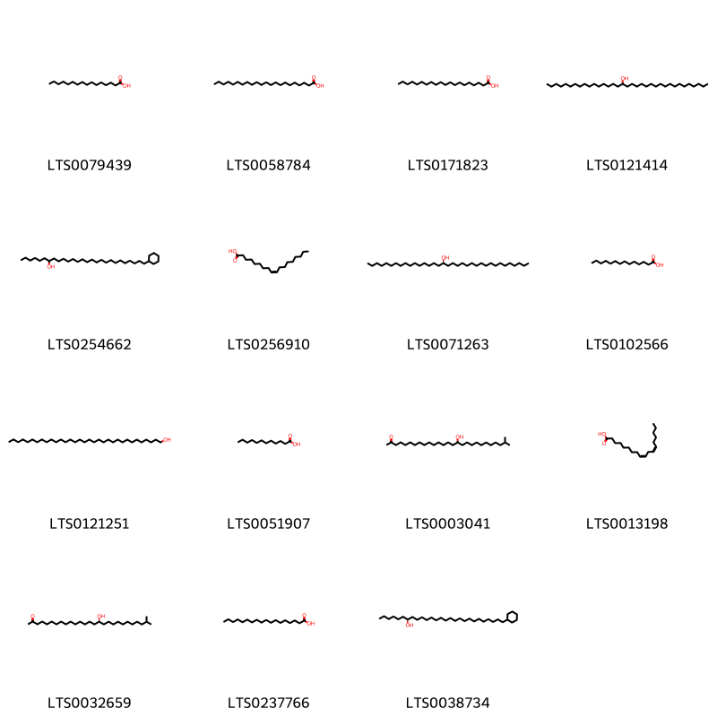
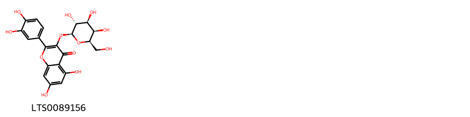
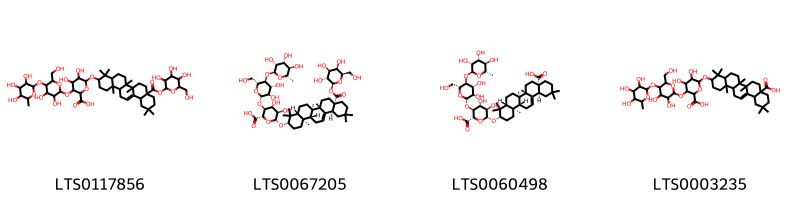
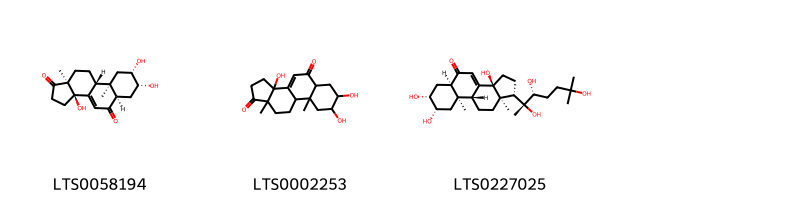

!!! abstract "Tóm tắt"
    Tên khoa học (họ): Achyranthes aspera L. (họ Amaranthaceae).
Phân bố:
Tại Việt Nam: Phổ biến từ vùng đồng bằng đến trung du và miền núi thấp trên khắp cả nước, đặc biệt ở các tỉnh miền Bắc, miền Trung và miền Nam.
Trên thế giới: Phân bố rộng rãi ở các vùng nhiệt đới và cận nhiệt đới, bao gồm Nam Á (Ấn Độ, Nepal, Sri Lanka), Đông Nam Á (Thái Lan, Indonesia, Philippines), châu Phi, Trung Mỹ, và các đảo Thái Bình Dương.
Kinh nghiệm sử dụng:
Y học cổ truyền dùng để chữa viêm khớp, đau lưng, sỏi thận, rối loạn kinh nguyệt và hỗ trợ tiêu hóa.
Tác dụng dược lý:
Kháng viêm, giảm đau, lợi tiểu, hạ đường huyết, hạ huyết áp, giảm lipid máu, kháng khuẩn, hỗ trợ tiêu hóa.
Thành phần hóa học:
Saponin (acid oleanolic), sterol (stigmasterol, β-sitosterol), flavonoid (quercetin), acid béo (dodecanoic acid), ecdysteroid (β-ecdysteron).

## Thông tin về thực vật

### Đặc điểm thực vật

Dược liệu **Cỏ Xước (Rễ)** từ bộ phận **Rễ** từ loài *Achyranthes aspera L.* thuộc họ Amaranthaceae. Cây ngưu tất là một loại cỏ xước cho nên người ta nhầm với cây cỏ xước Achyranthes aspera L. Cỏ có thân mảnh, hơi vuông, thường chỉ cao 1m, cũng có khi tới 2m. Lá mọc đối có cuống, dài 5-12cm, rộng 2-4cm, phiến lá hình trứng, đầu nhọn, mép nguyên. Cụm hoa mọc thành bông ở đầu cành hoặc kẽ lá 

!!! info "Phân loại thực vật của *Achyranthes aspera*"
    - **Kingdom:** Plantae
    - **Phylum:** Tracheophyta
    - **Order:** Caryophyllales
    - **Family:** Amaranthaceae
    - **Genus:** Achyranthes
    - **Species:** *Achyranthes aspera*

*Tài liệu tham khảo:* "Những cây thuốc và vị thuốc Việt Nam" - Đỗ Tất Lợi

 

### Loài thay thế (Nếu có)

### Phân bố trên thế giới
**Từ vườn thực vật KEW: **: Native to:
Afghanistan, Aldabra, Algeria, Andaman Is., Angola, Assam, Azores, Bangladesh, Benin, Bismarck Archipelago, Borneo, Botswana, Burkina, Burundi, Cambodia, Cameroon, Canary Is., Cape Provinces, Cape Verde, Caroline Is., Central African Republic, Chad, Chagos Archipelago, China South-Central, China Southeast, Christmas I., Cocos (Keeling) Is., Comoros, Congo, Djibouti, East Himalaya, Egypt, Eritrea, Ethiopia, Free State, Gabon, Gambia, Ghana, Gilbert Is., Guinea, Guinea-Bissau, Gulf of Guinea Is., Gulf States, Hainan, Hawaii, India, Iran, Italy, Ivory Coast, Jawa, Kazan-retto, Kenya, KwaZulu-Natal, Laccadive Is., Laos, Lebanon-Syria, Lesotho, Lesser Sunda Is., Liberia, Line Is., Madagascar, Madeira, Malawi, Malaya, Maldives, Mali, Maluku, Marianas, Marquesas, Marshall Is., Mauritania, Mauritius, Morocco, Mozambique, Mozambique Channel Is., Myanmar, Namibia, Nansei-shoto, Nauru, Nepal, New Guinea, Nicobar Is., Niger, Nigeria, Norfolk Is., Northern Provinces, Northern Territory, Ogasawara-shoto, Oman, Pakistan, Panamá, Philippines, Pitcairn Is., Queensland, Rodrigues, Rwanda, Réunion, Samoa, Sardegna, Saudi Arabia, Selvagens, Senegal, Sicilia, Sierra Leone, Society Is., Socotra, Solomon Is., Somalia, South China Sea, Spain, Sri Lanka, Sudan, Sulawesi, Sumatera, Swaziland, Taiwan, Tanzania, Thailand, Tokelau-Manihiki, Tuamotu, Tubuai Is., Tunisia, Tuvalu, Uganda, Vietnam, Wallis-Futuna Is., West Himalaya, Western Australia, Western Sahara, Yemen, Zambia, Zaïre, Zimbabwe

Introduced into:
Alabama, Aruba, Austria, Bahamas, Belize, Bolivia, Brazil North, Brazil Northeast, Brazil Southeast, Brazil West-Central, Colombia, Cook Is., Costa Rica, Cuba, Dominican Republic, El Salvador, Fiji, Florida, French Guiana, Galápagos, Germany, Guatemala, Guyana, Haiti, Honduras, Jamaica, Japan, Kermadec Is., Leeward Is., Louisiana, Maryland, Mexico Central, Mexico Gulf, Mexico Northeast, Mexico Northwest, Mexico Southeast, Mexico Southwest, Netherlands Antilles, New Caledonia, New Zealand North, Nicaragua, Niue, Palestine, Peru, Puerto Rico, Seychelles, South Carolina, Southwest Caribbean, St.Helena, Suriname, Texas, Tonga, Trinidad-Tobago, Turks-Caicos Is., Vanuatu, Venezuela, Venezuelan Antilles, Windward Is.

**Từ CSDL GIBF** Yemen, Tanzania, United Republic of, Spain, Australia, Puerto Rico, Gibraltar, Madagascar, Thailand, Antigua and Barbuda, Saint Kitts and Nevis, India, Ethiopia, Mexico, Italy, Cameroon, Malta, South Africa, Namibia, Viet Nam, Eswatini, United States of America, Portugal, Chinese Taipei, Israel, Botswana, Sri Lanka

### Phân bố tại Việt Nam
** "Những cây thuốc và vị thuốc Việt Nam" - Đỗ Tất Lợi**: phân bố rộng rãi tại Việt Nam, từ miền Bắc (Hà Nội, Bắc Giang) đến miền Trung (Nghệ An, Quảng Nam) và miền Nam (Đồng Tháp, An Giang). Cây thường mọc ở ven đường, bờ ruộng, và rừng thứ sinh, thích nghi tốt với khí hậu nhiệt đới gió mùa và đất cằn cỗi

**Từ CSDL GIBF**: Hồ Chí Minh city

---

## Thông tin về dược liệu 

### Định danh

!!! info "Thông tin về tên gọi của cỏ xước"
    - Dược liệu tiếng Việt: cỏ xước
    - Dược liệu tiếng Trung:  ()
    - Dược liệu tiếng Anh: 
    - Dược liệu latin thông dụng: Radix Achyranthis asperae
    - Dược liệu latin kiểu DĐVN: radix achyranthis asperae
    - Dược liệu latin kiểu DĐVN: 
    - Dược liệu latin kiểu thông tư: 
    - Bộ phận dùng: Rễ (Radix)

### Mô tả dược liệu 
- **Theo dược điển Việt nam V:** Rễ nhỏ cong queo, bé dần từ cổ rễ tới chóp rễ, dài 10 cm đến 15 cm, đường kính 0,2 cm đến 0,5 cm. Mặt ngoài màu nâu nhạt, nhẵn, đôi khi hơi nhăn, có các vết sần của rễ con hoặc lan cả rễ con. Mặt cắt ngang màu nâu nhạt hơn một chút, có các vân tròn xếp tương đối đều đặn, đó là các vòng libe-gỗ.

- **Mô tả dược liệu theo thông tư chế biến dược liệu theo phương pháp cổ truyền:** 

### Chế biến 

- **Chế biến theo dược điển việt nam V**: Đào rễ về, giũ sạch đất, cát, phơi hay sấy khô.nn

- **Chế biến theo thông tư:** 

--- 

## Thành phần hóa học

- Theo tài liệu của GS. Đỗ Tất Lợi:  (1)chứa nhiều thành phần hóa học thuộc các nhóm chính như saponin, steroid, flavonoid, acid béo và ecdysteroid. Trong đó, saponin là hợp chất nổi bật với aglycone chính là acid oleanolic. Cây còn chứa các sterol như stigmasterol, spinasterol, β-sitosterol, và flavonoid như quercetin cùng các dẫn xuất. Một số acid béo như dodecanoic acid và hợp chất β-ecdysteron thuộc nhóm ecdysteroid
    
- Theo cơ sở dữ liệu lotus: Từ loài *Achyranthes aspera* đã phân lập và xác định được 24 hoạt chất thuộc về các nhóm Fatty Acyls, Carboxylic acids and derivatives, Prenol lipids, Steroids and steroid derivatives, Flavonoids. 

|    | chemicalTaxonomyClassyfireClass   |   smiles_count |
|---:|:----------------------------------|---------------:|
|  0 | Carboxylic acids and derivatives  |              1 |
|  1 | Fatty Acyls                       |             15 |
|  2 | Flavonoids                        |              1 |
|  3 | Prenol lipids                     |              4 |
|  4 | Steroids and steroid derivatives  |              3 |

### Nhóm Carboxylic acids and derivatives
<figure markdown="span">
    { width=100% }
    <figcaption>Hình ảnh cấu trúc hóa học của 1 hoạt chất thuộc nhóm Carboxylic acids and derivatives gồm ['bet (LTS0164067)'].</figcaption>
</figure>
### Nhóm Fatty Acyls
<figure markdown="span">
    { width=100% }
    <figcaption>Hình ảnh cấu trúc hóa học của 15 hoạt chất thuộc nhóm Fatty Acyls gồm ['palmitic acid (LTS0079439)', 'behenic acid (LTS0058784)', 'arachidic acid (LTS0171823)', 'pentatriacontan-17-ol (LTS0121414)', '27-cyclohexylheptacosan-7-ol (LTS0254662)', 'oleic acid (LTS0256910)', '(17r)-pentatriacontan-17-ol (LTS0071263)', 'myristic acid (LTS0102566)', 'tritriacontan-1-ol (LTS0121251)', 'lauric acid (LTS0051907)', '16-hydroxy-26-methylheptacosan-2-one (LTS0003041)', 'linoleic (LTS0013198)', '(16r)-16-hydroxy-26-methylheptacosan-2-one (LTS0032659)', 'stearic acid (LTS0237766)', '(7s)-27-cyclohexylheptacosan-7-ol (LTS0038734)'].</figcaption>
</figure>
### Nhóm Flavonoids
<figure markdown="span">
    { width=100% }
    <figcaption>Hình ảnh cấu trúc hóa học của 1 hoạt chất thuộc nhóm Flavonoids gồm ['hyperoside (LTS0089156)'].</figcaption>
</figure>
### Nhóm Prenol lipids
<figure markdown="span">
    { width=100% }
    <figcaption>Hình ảnh cấu trúc hóa học của 4 hoạt chất thuộc nhóm Prenol lipids gồm ['6-{[4,4,6a,6b,11,11,14b-heptamethyl-8a-({[3,4,5-trihydroxy-6-(hydroxymethyl)oxan-2-yl]oxy}carbonyl)-1,2,3,4a,5,6,7,8,9,10,12,12a,14,14a-tetradecahydropicen-3-yl]oxy}-3-{[3,4-dihydroxy-6-(hydroxymethyl)-5-[(3,4,5-trihydroxy-6-methyloxan-2-yl)oxy]oxan-2-yl]oxy}-4,5-dihydroxyoxane-2-carboxylic acid (LTS0117856)', '(2s,3s,4r,5r,6r)-6-{[(3s,4ar,6ar,6bs,8as,12as,14ar,14br)-4,4,6a,6b,11,11,14b-heptamethyl-8a-({[(2s,3r,4s,5r,6r)-3,4,5-trihydroxy-6-(hydroxymethyl)oxan-2-yl]oxy}carbonyl)-1,2,3,4a,5,6,7,8,9,10,12,12a,14,14a-tetradecahydropicen-3-yl]oxy}-3-{[(2s,3r,4r,5s,6r)-3,4-dihydroxy-6-(hydroxymethyl)-5-{[(2s,3r,4r,5r,6s)-3,4,5-trihydroxy-6-methyloxan-2-yl]oxy}oxan-2-yl]oxy}-4,5-dihydroxyoxane-2-carboxylic acid (LTS0067205)', '(2s,3s,4r,5r,6r)-6-{[(3s,4ar,6ar,6bs,8as,12as,14ar,14br)-8a-carboxy-4,4,6a,6b,11,11,14b-heptamethyl-1,2,3,4a,5,6,7,8,9,10,12,12a,14,14a-tetradecahydropicen-3-yl]oxy}-3-{[(2s,3r,4r,5s,6r)-3,4-dihydroxy-6-(hydroxymethyl)-5-{[(2s,3r,4r,5r,6s)-3,4,5-trihydroxy-6-methyloxan-2-yl]oxy}oxan-2-yl]oxy}-4,5-dihydroxyoxane-2-carboxylic acid (LTS0060498)', '6-[(8a-carboxy-4,4,6a,6b,11,11,14b-heptamethyl-1,2,3,4a,5,6,7,8,9,10,12,12a,14,14a-tetradecahydropicen-3-yl)oxy]-3-{[3,4-dihydroxy-6-(hydroxymethyl)-5-[(3,4,5-trihydroxy-6-methyloxan-2-yl)oxy]oxan-2-yl]oxy}-4,5-dihydroxyoxane-2-carboxylic acid (LTS0003235)'].</figcaption>
</figure>
### Nhóm Steroids and steroid derivatives
<figure markdown="span">
    { width=100% }
    <figcaption>Hình ảnh cấu trúc hóa học của 3 hoạt chất thuộc nhóm Steroids and steroid derivatives gồm ['rubrosterone (LTS0058194)', '3a,7,8-trihydroxy-9a,11a-dimethyl-2h,3h,5ah,6h,7h,8h,9h,9bh,10h,11h-cyclopenta[a]phenanthrene-1,5-dione (LTS0002253)', '20-hydroxyecdysone (LTS0227025)'].</figcaption>
</figure>

---

## Tác dụng dược lý

Theo tài liệu "Những cây thuốc và vị thuốc Việt Nam" - Đỗ Tất Lợi:Kháng viêm, giảm đau: Điều trị viêm khớp, đau lưng.
Lợi tiểu: Hỗ trợ bệnh sỏi thận, phù nề.
Hạ đường huyết: Phù hợp trong hỗ trợ điều trị tiểu đường.
Hạ huyết áp, giảm lipid máu: Phòng ngừa bệnh tim mạch.
Điều hòa kinh nguyệt: Chữa rối loạn kinh nguyệt, đau bụng kinh.
Kháng khuẩn, kháng nấm: Điều trị viêm nhiễm, nhiễm khuẩn.
Hỗ trợ tiêu hóa: Kích thích tiêu hóa, cải thiện chức năng gan.

Theo tài liệu quốc tế: 

---

## Dược điển Việt Nam V

### Soi bột:
Màu trắng xám, vị nhạt. Soi kính hiển vi thấy: Mạch gỗ thường nhỏ và hẹp, chủ yếu là mạch điểm. Sợi gồm những tế bào dài hẹp, xếp thành từng bó hoặc có khi dài ra đứng riêng lẻ, hầu hết các sợi đều trong suốt, thành mỏng. Mảnh bần màu sẫm hơi vàng, các tế bào không rõ rệt, tập hợp thành từng đám nhỏ. Mảnh mô mềm, tinh thể calci oxalat nhỏ, hình khối. Hạt tinh bột nhỏ, hình tròn.nn
<!-- Hình ảnh soi bột sẽ được tự động chèn vào đây sau -->
### Vi phẫu:
Lớp bần gồm 3 đến 4 lớp tế bào hình chữ nhật, sần sùi, có chỗ bị bong ra. Mô mềm vỏ tương đối hẹp, khoảng 4 đến 5 hàng tế bào xếp lộn xộn. Thường có 3 đến 4 vòng libe-gỗ: Các vòng ngoài xếp liên tục, còn 1 đến 2 vòng trong cùng thường bị tia ruột chia thành các bó riêng lẻ đứng gần nhau, trong mỗi vòng libe và gỗ thì các libe xốp ngoài, gỗ ở phía trong. Mô mềm ruột tế bào tròn có thành mỏng. Phân cách giữa libe và gỗ là tầng phát sinh libe-gỗ không rõ.
<!-- Hình ảnh vi phẫu sẽ được tự động chèn vào đây sau -->
### Định tính

Dung dịch thử: Lấy 1,5 g bột dược liệu vào chén bằng sứ hoặc thạch anh, có nắp đậy. Đốt dần dần để than hóa hoàn toàn. Để nguội, thêm 1 ml hỗn hợp gồm 1 thể tích acid nitric (TT) và 3 thể tích acid hydrocloric (TT), bốc hơi tới khô trên cách thủy. Làm ẩm cắn bằng 3 giọt acid hydrocloric (TT), thêm 10 ml nước nóng và làm ấm trong 2 min. Sau đó thêm 1 giọt dung dịch phenolphtalein (TT). thêm từng giọt amoniac (TT) cho đến khi dung dịch xuất hiện màu đỏ nhạt, thêm 2 ml acid acetic loãng (TT), lọc nếu cần, rửa phễu và cắn bằng 10 ml nước. Chuyển dịch lọc và dịch rửa vào ống Nessler, thêm nước vừa đủ 50 ml. Dung dịch đối chiếu: Bốc hơi trên cách thủy đến khô 1 ml hỗn hợp (pha trước khi dùng) gồm 1 thể tích acid nitric (TT) và3 thể tích acid hydrocloric (TT). Sau đó tiến hành như chỉ dẫn với dung dịch thử, sau đó thêm 3,0 ml dung dịch chì mẫu 10 phần triệu Pb (TT) và thêm nước vừa đủ 50 ml. Cách tiến hành: Thêm 1 giọt dung dịch natri sulfid (TT) vào dung dịch thử và dung dịch đối chiếu, lắc mạnh, đc yên 5 min. So sánh màu của 2 ống nghiệm bằng cách nhin dọc ổng hoặc quan sát trên nền trắng. Dung dịch thử không được đậm màu hơn dung dịch đối chiếu.

### Định lượng

### Thông tin khác 
- ** Độ ẩm: ** Không quá 12,0 % (Phụ lục 9.6, 1 tỉ. 105 °c, 5 h).

- ** Bảo quản:** Để nơi khô, tránh mốc mọt.nn
## Dược điển Hồng kong

<!-- PDF sẽ được tự động chèn vào đây sau -->

---

## Y dược học cổ truyền

- **Tên vị thuốc:** 
- **Tính vị quy kinh:** Khổ, toan, binh. Vào hai kinh can, thận.
- **Công năng chủ trị:** Hoạt huyết khứ ứ, bổ can thận mạnh gân xương.

Chủ trị: Phong thấp, đau lưng, đau nhức xương khớp, chân tay co quắp, kinh nguyệt không đều, bế kinh đau bụng, bí tiểu tiện, đái rắt buốt.
- **Chú ý:** 
- **Kiêng kỵ:** Phụ nữ có thai, ỉa lỏng, người di tinh không dùng.nn

