!!! abstract "Tóm tắt"
    Dâu (Vỏ rễ) tên khoa học là Cortex Mori albae radicis, thuộc họ Dâu tằm (Moraceae). Dược liệu có nguồn gốc từ Trung Quốc và được di thực vào Việt Nam từ lâu, hiện nay được trồng ở khắp nơi để lấy lá nuôi tằm, một số bộ phận được khai thác dùng làm thuốc. Thành phần hóa học chính của vỏ rễ dâu tằm bao gồm flavonoid, coumarin, benzofuran, acid betulinic, tanin, ẞ amyrin, polysaccarid và một số thành phần khác. Theo nghiên cứu, vỏ rễ có tác dụng làm hạ đường huyết, hạ huyết áp, kháng viêm, kháng khuẩn, chống dòng tế bào ung thư. Trong dân gian, vỏ rễ cây dâu tằm thường được sử dụng để làm thuốc lợi tiểu tiện, dùng trong bệnh thuỷ thùng, chữa ho lâu ngày, hen, họ có đờm, băng huyết, chữa sốt, chữa cao huyết áp. Liều dùng hằng ngày 6-18g dưới dạng thuốc sắc hay thuốc bột.

## Thông tin về thực vật

### Đặc điểm thực vật

Dược liệu **Dâu (Vỏ Rễ)** từ bộ phận **Vỏ rễ** từ loài *Morus alba L.* thuộc họ Moraceae. Cây dâu là một cây có thể cao tới 15m, nhưng thường do hái lá luôn nên chỉ cao 2-3m. Lá mọc so le, hình bầu dục, nguyên hoặc chia thành 3 thuỳ, có lá kèm, đầu lá nhọn hay hơi tù, phía cuống hơi tròn hoặc hơi bằng, mép có răng cưa to. Từ cuống lá toả ra 3 gần rõ rệt. Hoa đơn tính, khác gốc, hoa đực mọc thành bông, có 4 lá đài, 4 nhị (có khi 3), hoa cái cũng mọc thành bông hay thành khối hình cầu, có 4 lá đài. Quả bế bao bọc trong các lá đài, mọng nước thành một quả phức (quả kép) màu đỏ, sau đen sẫm. Quả có thể ăn được và làm thuốc (tang thầm). 

!!! info "Phân loại thực vật của *Morus alba*"
    - **Kingdom:** Plantae
    - **Phylum:** Tracheophyta
    - **Order:** Rosales
    - **Family:** Moraceae
    - **Genus:** Morus
    - **Species:** *Morus alba*

*Tài liệu tham khảo:* "Những cây thuốc và vị thuốc Việt Nam" - Đỗ Tất Lợi

 

### Loài thay thế (Nếu có)

### Phân bố trên thế giới
**Từ vườn thực vật KEW: **: Bản địa: China North-Central, China South-Central
Di thực: Afghanistan, Alabama, Albania, Algeria, Argentina Northeast, Argentina Northwest, Arkansas, Assam, Austria, Bangladesh, Bulgaria, Buryatiya, Cambodia, Cameroon, Canary Is., Cape Provinces, Central African Republic, Central European Russia, Chagos Archipelago, China Southeast, Colombia, Colorado, Connecticut, Costa Rica, Cyprus, Czechoslovakia, Delaware, Denmark, District of Columbia, East Aegean Is., Ecuador, Florida, Free State, Gambia, Georgia, Germany, Greece, Hainan, Hawaii, Honduras, Hungary, Illinois, India, Indiana, Inner Mongolia, Iowa, Iran, Iraq, Italy, Japan, Kansas, Kazakhstan, Kentucky, Kirgizstan, Korea, Kriti, Krym, KwaZulu-Natal, Laos, Lebanon-Syria, Lesotho, Libya, Louisiana, Maine, Manchuria, Maryland, Massachusetts, Mexico Northeast, Mexico Northwest, Mexico Southwest, Michigan, Minnesota, Mississippi, Missouri, Morocco, Nebraska, New Hampshire, New Jersey, New Mexico, New York, Norfolk Is., North Carolina, North Dakota, Northern Provinces, Ohio, Oklahoma, Oman, Ontario, Pakistan, Palestine, Paraguay, Pennsylvania, Peru, Poland, Primorye, Qinghai, Rhode I., Romania, South Carolina, South Dakota, South European Russia, Spain, Sudan, Swaziland, Sweden, Tadzhikistan, Taiwan, Tennessee, Texas, Tibet, Tonga, Tunisia, Turkey, Turkey-in-Europe, Turkmenistan, Ukraine, Uruguay, Uzbekistan, Venezuela, Vermont, Vietnam, Virginia, West Himalaya, West Virginia, Wisconsin, Xinjiang

**Từ CSDL GIBF** Spain, Australia, Armenia, Hong Kong, Slovakia, Romania, Ukraine, India, Argentina, Mexico, Hungary, Italy, Greece, China, South Africa, Russian Federation, Viet Nam, United States of America, Chinese Taipei, Kazakhstan, Canada

### Phân bố tại Việt Nam
** "Những cây thuốc và vị thuốc Việt Nam" - Đỗ Tất Lợi**: Cây dâu tằm có nguồn gốc Trung Quốc. Đã được di thực vào Việt Nam từ lâu, hiện nay được trồng ở khắp nơi để lấy lá nuôi tằm, một số bộ phận được khai thác dùng làm thuốc.

**Từ CSDL GIBF**: Quảng Nam

---

## Thông tin về dược liệu 

### Định danh

!!! info "Thông tin về tên gọi của dâu"
    - Dược liệu tiếng Việt: dâu
    - Dược liệu tiếng Trung: 桑柏皮 (Sang Bai Pi)
    - Dược liệu tiếng Anh: White Mulberry Root-Bark
    - Dược liệu latin thông dụng: Cortex Mori albae radicisnCortex Mori
    - Dược liệu latin kiểu DĐVN: cortex mori albae radicis
    - Dược liệu latin kiểu DĐVN: Cortex Mori
    - Dược liệu latin kiểu thông tư: 
    - Bộ phận dùng: Vỏ rễ (Cortex)

### Mô tả dược liệu 
- **Theo dược điển Việt nam V:** 

- **Mô tả dược liệu theo thông tư chế biến dược liệu theo phương pháp cổ truyền:** 

### Chế biến 

- **Chế biến theo dược điển việt nam V**: 

- **Chế biến theo thông tư:** 

--- 

## Thành phần hóa học

- Theo tài liệu của GS. Đỗ Tất Lợi:  (1) Flavonoid, coumarin, benzofuran, acid betulinic, tanin, ẞ amyrin, polysaccarid và một số thành phần khác.
(2) Morusin
    
- Theo cơ sở dữ liệu lotus: Từ loài *Morus alba* đã phân lập và xác định được 370 hoạt chất thuộc về các nhóm Pyrrolidines, Linear 1,3-diarylpropanoids, Lactones, Stilbenes, Benzopyrans, Piperidines, Coumarins and derivatives, Benzene and substituted derivatives, Indoles and derivatives, Tropane alkaloids, Steroids and steroid derivatives, Phenols, Glycerolipids, Purine nucleosides, Organooxygen compounds, Diarylheptanoids, Prenol lipids, Fatty Acyls, Carboxylic acids and derivatives, Flavonoids, 2-arylbenzofuran flavonoids. 

|    | chemicalTaxonomyClassyfireClass     |   smiles_count |
|---:|:------------------------------------|---------------:|
|  0 | 2-arylbenzofuran flavonoids         |             79 |
|  1 | Benzene and substituted derivatives |              2 |
|  2 | Benzopyrans                         |              6 |
|  3 | Carboxylic acids and derivatives    |              9 |
|  4 | Coumarins and derivatives           |             19 |
|  5 | Diarylheptanoids                    |             31 |
|  6 | Fatty Acyls                         |             13 |
|  7 | Flavonoids                          |            104 |
|  8 | Glycerolipids                       |              2 |
|  9 | Indoles and derivatives             |              1 |
| 10 | Lactones                            |              1 |
| 11 | Linear 1,3-diarylpropanoids         |              4 |
| 12 | Organooxygen compounds              |             28 |
| 13 | Phenols                             |              1 |
| 14 | Piperidines                         |              7 |
| 15 | Prenol lipids                       |             17 |
| 16 | Purine nucleosides                  |              2 |
| 17 | Pyrrolidines                        |              3 |
| 18 | Steroids and steroid derivatives    |              6 |
| 19 | Stilbenes                           |             20 |
| 20 | Tropane alkaloids                   |             13 |

### Nhóm 2-arylbenzofuran flavonoids
<figure markdown="span">
    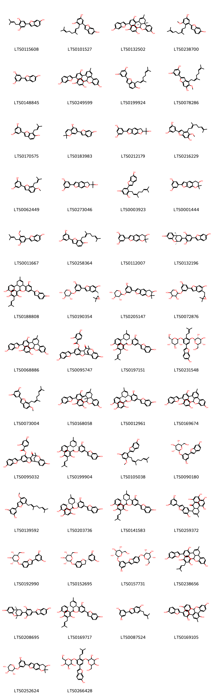{ width=100% }
    <figcaption>Hình ảnh cấu trúc hóa học của 79 hoạt chất thuộc nhóm 2-arylbenzofuran flavonoids gồm ['5-(6-hydroxy-1-benzofuran-2-yl)-2-(3-methylbut-2-en-1-yl)benzene-1,3-diol (LTS0115608)', 'albafuran a (LTS0101527)', '(1r,9s,13s,21r)-1-(2,4-dihydroxyphenyl)-17-(6-hydroxy-1-benzofuran-2-yl)-11-methyl-2,20-dioxapentacyclo[11.7.1.0³,⁸.0⁹,²¹.0¹⁴,¹⁹]henicosa-3,5,7,11,14,16,18-heptaene-5,15-diol (LTS0132502)', 'mulberrofuran a (LTS0238700)', 'moracin m (LTS0148845)', '1-(2,4-dihydroxyphenyl)-17-(6-hydroxy-1-benzofuran-2-yl)-11-methyl-2,20-dioxapentacyclo[11.7.1.0³,⁸.0⁹,²¹.0¹⁴,¹⁹]henicosa-3,5,7,9(21),10,12,14,16,18-nonaene-5,15-diol (LTS0249599)', '5-[7-(3,7-dimethylocta-2,6-dien-1-yl)-6-hydroxy-1-benzofuran-2-yl]benzene-1,3-diol (LTS0199924)', '5-[4-(3,7-dimethylocta-2,6-dien-1-yl)-6-hydroxy-5-methoxy-1-benzofuran-2-yl]benzene-1,3-diol (LTS0078286)', '5-[6-hydroxy-7-(3-methylbut-2-en-1-yl)-1-benzofuran-2-yl]benzene-1,3-diol (LTS0170575)', '7-(6-hydroxy-1-benzofuran-2-yl)-2,2-dimethylchromen-5-ol (LTS0183983)', '5-[11-(2-hydroxypropan-2-yl)-4,12-dioxatricyclo[7.3.0.0³,⁷]dodeca-1(9),2,5,7-tetraen-5-yl]benzene-1,3-diol (LTS0212179)', '5-{4-[(2e)-3,7-dimethylocta-2,6-dien-1-yl]-6-hydroxy-5-methoxy-1-benzofuran-2-yl}benzene-1,3-diol (LTS0216229)', '5-[6-methoxy-7-(3-methylbut-2-en-1-yl)-1-benzofuran-2-yl]benzene-1,3-diol (LTS0062449)', '5-[(11s)-11-(2-hydroxypropan-2-yl)-4,12-dioxatricyclo[7.3.0.0³,⁷]dodeca-1(9),2,5,7-tetraen-5-yl]benzene-1,3-diol (LTS0273046)', '4-(3,7-dimethylocta-2,6-dien-1-yl)-5-(6-hydroxy-1-benzofuran-2-yl)benzene-1,3-diol (LTS0003923)', '5-[(11r)-11-hydroxy-12,12-dimethyl-4,13-dioxatricyclo[7.4.0.0³,⁷]trideca-1(9),2,5,7-tetraen-5-yl]benzene-1,3-diol (LTS0001444)', '2-[3-hydroxy-5-methoxy-4-(3-methylbut-2-en-1-yl)phenyl]-1-benzofuran-6-ol (LTS0011667)', '5-{7-[(2e)-3,7-dimethylocta-2,6-dien-1-yl]-6-hydroxy-1-benzofuran-2-yl}benzene-1,3-diol (LTS0258364)', '5-{11-hydroxy-12,12-dimethyl-4,13-dioxatricyclo[7.4.0.0³,⁷]trideca-1(9),2,5,7-tetraen-5-yl}benzene-1,3-diol (LTS0112007)', '5-(6-hydroxy-1-benzofuran-2-yl)-2-[(1s,9s)-5-hydroxy-9-methyl-8-oxatricyclo[7.3.1.0²,⁷]trideca-2,4,6,10-tetraen-11-yl]benzene-1,3-diol (LTS0132196)', '2-{6-[2,4-dihydroxy-3-(3-methylbut-2-en-1-yl)benzoyl]-5-(4-hydroxyphenyl)-3-methylcyclohex-2-en-1-yl}-5-(6-hydroxy-1-benzofuran-2-yl)benzene-1,3-diol (LTS0188808)', '(2s,3r,4s,5r)-2-[3-(5-{[(2s)-3,3-dimethyloxiran-2-yl]methyl}-6-hydroxy-1-benzofuran-2-yl)-5-hydroxyphenoxy]oxane-3,4,5-triol (LTS0190354)', '(3r,4s,5r)-2-(3-hydroxy-5-{11-hydroxy-12,12-dimethyl-4,13-dioxatricyclo[7.4.0.0³,⁷]trideca-1(9),2,5,7-tetraen-5-yl}phenoxy)oxane-3,4,5-triol (LTS0205147)', '2-(3-{5-[(3,3-dimethyloxiran-2-yl)methyl]-6-hydroxy-1-benzofuran-2-yl}-5-hydroxyphenoxy)oxane-3,4,5-triol (LTS0072876)', '1-(2,4-dihydroxyphenyl)-17-(6-hydroxy-1-benzofuran-2-yl)-11-methyl-2,20-dioxapentacyclo[11.7.1.0³,⁸.0⁹,²¹.0¹⁴,¹⁹]henicosa-3,5,7,11,14,16,18-heptaene-5,15-diol (LTS0068886)', '16-hydroxy-6-(6-hydroxy-1-benzofuran-2-yl)-12-methyl-11-oxo-3,13-dioxapentacyclo[10.7.1.0²,¹⁰.0⁴,⁹.0¹⁴,¹⁹]icosa-1(20),4,6,8,14,16,18-heptaen-8-yl 2,4-dihydroxybenzoate (LTS0095747)', '2-[(1s,5s,6r)-6-[2,4-dihydroxy-3-(3-methylbut-2-en-1-yl)benzoyl]-5-(2,4-dihydroxyphenyl)-3-methylcyclohex-2-en-1-yl]-5-(6-hydroxy-1-benzofuran-2-yl)benzene-1,3-diol (LTS0197151)', '(2s,3r,4s,5s,6r)-2-[5-(6-hydroxy-1-benzofuran-2-yl)-2-(3-methylbut-2-en-1-yl)-3-{[(2s,3r,4s,5s,6r)-3,4,5-trihydroxy-6-(hydroxymethyl)oxan-2-yl]oxy}phenoxy]-6-(hydroxymethyl)oxane-3,4,5-triol (LTS0231548)', '5-[7-(3,7-dimethylocta-2,6-dien-1-yl)-6-methoxy-1-benzofuran-2-yl]benzene-1,3-diol (LTS0073004)', '(1s,13r,21s)-1-(2,4-dihydroxyphenyl)-17-(6-hydroxy-1-benzofuran-2-yl)-11-methyl-2,20-dioxapentacyclo[11.7.1.0³,⁸.0⁹,²¹.0¹⁴,¹⁹]henicosa-3,5,7,11,14,16,18-heptaene-5,15-diol (LTS0168058)', '2-[(1r,5s,6r)-6-(2,4-dihydroxybenzoyl)-5-(2,4-dihydroxyphenyl)-3-methylcyclohex-2-en-1-yl]-5-(6-hydroxy-1-benzofuran-2-yl)benzene-1,3-diol (LTS0012961)', '(1r)-1-(2,4-dihydroxyphenyl)-17-(6-hydroxy-1-benzofuran-2-yl)-11-methyl-2,20-dioxapentacyclo[11.7.1.0³,⁸.0⁹,²¹.0¹⁴,¹⁹]henicosa-3,5,7,9(21),10,12,14,16,18-nonaene-5,15-diol (LTS0169674)', '16-hydroxy-6-(6-hydroxy-1-benzofuran-2-yl)-12-methyl-11-oxo-3,13-dioxapentacyclo[10.7.1.0²,¹⁰.0⁴,⁹.0¹⁴,¹⁹]icosa-2(10),4,6,8,14,16,18-heptaen-8-yl 2,4-dihydroxybenzoate (LTS0095032)', '2-[(1s,5s,6r)-6-[2,4-dihydroxy-3-(3-methylbut-2-en-1-yl)benzoyl]-5-(4-hydroxyphenyl)-3-methylcyclohex-2-en-1-yl]-5-(6-hydroxy-1-benzofuran-2-yl)benzene-1,3-diol (LTS0199904)', '2-[2-(3,7-dimethylocta-2,6-dien-1-yl)-5-hydroxy-3-methoxyphenyl]-1-benzofuran-6-ol (LTS0105038)', '(2s,3r,4s,5s,6r)-2-[3-hydroxy-5-(6-hydroxy-1-benzofuran-2-yl)phenoxy]-6-(hydroxymethyl)oxane-3,4,5-triol (LTS0090180)', '5-{7-[(2e)-3,7-dimethylocta-2,6-dien-1-yl]-4-methoxy-1-benzofuran-2-yl}benzene-1,3-diol (LTS0139592)', '2-[(1s,5r,6s)-6-(2,4-dihydroxybenzoyl)-5-(2,4-dihydroxyphenyl)-3-methylcyclohex-2-en-1-yl]-5-(6-hydroxy-1-benzofuran-2-yl)benzene-1,3-diol (LTS0203736)', '2-[(1r,5r,6s)-6-[2,4-dihydroxy-3-(3-methylbut-2-en-1-yl)benzoyl]-5-(2,4-dihydroxyphenyl)-3-methylcyclohex-2-en-1-yl]-5-(6-hydroxy-1-benzofuran-2-yl)benzene-1,3-diol (LTS0141583)', '5-{5-[6-(2,4-dihydroxybenzoyl)-5-(2,4-dihydroxyphenyl)-3-methylcyclohex-2-en-1-yl]-6-hydroxy-1-benzofuran-2-yl}benzene-1,3-diol (LTS0259372)', '(2s,3r,4s,5s,6r)-2-{[2-(3,5-dihydroxyphenyl)-1-benzofuran-6-yl]oxy}-6-(hydroxymethyl)oxane-3,4,5-triol (LTS0192990)', '(2s,3r,4s,5s,6r)-2-{[(2s)-2-(3,5-dihydroxyphenyl)-2,3-dihydro-1-benzofuran-6-yl]oxy}-6-(hydroxymethyl)oxane-3,4,5-triol (LTS0152695)', '(2s,3r,4s,5s,6r)-2-[3-hydroxy-5-(6-{[(2s,3r,4s,5s,6r)-3,4,5-trihydroxy-6-(hydroxymethyl)oxan-2-yl]oxy}-1-benzofuran-2-yl)phenoxy]-6-(hydroxymethyl)oxane-3,4,5-triol (LTS0157731)', '1-[2,4-dihydroxy-3-(3-methylbut-2-en-1-yl)phenyl]-17-(6-hydroxy-1-benzofuran-2-yl)-11-methyl-2,20-dioxapentacyclo[11.7.1.0³,⁸.0⁹,²¹.0¹⁴,¹⁹]henicosa-3,5,7,11,14,16,18-heptaene-5,15-diol (LTS0238656)', '5-(6-hydroxy-1-benzofuran-2-yl)-2-[(1r,9r)-5-hydroxy-9-methyl-8-oxatricyclo[7.3.1.0²,⁷]trideca-2,4,6,10-tetraen-11-yl]benzene-1,3-diol (LTS0208695)', '2-[(1r,5r,6s)-6-[2,4-dihydroxy-3-(3-methylbut-2-en-1-yl)benzoyl]-5-(4-hydroxyphenyl)-3-methylcyclohex-2-en-1-yl]-5-(6-hydroxy-1-benzofuran-2-yl)benzene-1,3-diol (LTS0169717)', '5-[6-hydroxy-5-(3-methylbut-2-en-1-yl)-1-benzofuran-2-yl]benzene-1,3-diol (LTS0087524)', '(1r)-1-(2,4-dihydroxyphenyl)-17-(6-hydroxy-1-benzofuran-2-yl)-11-methyl-2,20-dioxapentacyclo[11.7.1.0³,⁸.0⁹,²¹.0¹⁴,¹⁹]henicosa-3,5,7,9,11,13(21),14,16,18-nonaene-5,10,15-triol (LTS0169105)', '(2s,3r,4s,5r)-2-(3-hydroxy-5-{11-hydroxy-12,12-dimethyl-4,13-dioxatricyclo[7.4.0.0³,⁷]trideca-1(9),2,5,7-tetraen-5-yl}phenoxy)oxane-3,4,5-triol (LTS0252624)', '2-[5-(6-hydroxy-1-benzofuran-2-yl)-2-(3-methylbut-2-en-1-yl)-3-{[3,4,5-trihydroxy-6-(hydroxymethyl)oxan-2-yl]oxy}phenoxy]-6-(hydroxymethyl)oxane-3,4,5-triol (LTS0266428)', '4-(2,4-dihydroxyphenyl)-10,18-dihydroxy-8-(6-hydroxy-1-benzofuran-2-yl)-14-methyl-3,5,15-trioxahexacyclo[12.7.1.0²,⁴.0²,¹².0⁶,¹¹.0¹⁶,²¹]docosa-6,8,10,16,18,20-hexaen-13-one (LTS0233355)', '2-(3,5-dihydroxyphenyl)-1-benzofuran-5,6-diol (LTS0236534)', '(1s,2r,4s,12r,14s)-4-(2,4-dihydroxyphenyl)-10,18-dihydroxy-8-(6-hydroxy-1-benzofuran-2-yl)-14-methyl-3,5,15-trioxahexacyclo[12.7.1.0²,⁴.0²,¹².0⁶,¹¹.0¹⁶,²¹]docosa-6,8,10,16,18,20-hexaen-13-one (LTS0210436)', '2-[(1r,5r,6s)-6-[2,4-dihydroxy-3-(3-methylbut-2-en-1-yl)benzoyl]-5-(2,4-dihydroxyphenyl)-3-methylcyclohex-2-en-1-yl]-5-[6-hydroxy-7-(3-methylbut-2-en-1-yl)-1-benzofuran-2-yl]benzene-1,3-diol (LTS0086783)', '1-[2-(3,5-dihydroxyphenyl)-6-hydroxy-5-methoxy-1-benzofuran-4-yl]-3-methylbutan-2-one (LTS0209715)', '2-[(1s,4s,5r)-5-[2,4-dihydroxy-3-(3-methylbut-2-en-1-yl)benzoyl]-4-(2,4-dihydroxyphenyl)-3-methylcyclohex-2-en-1-yl]-5-(6-hydroxy-1-benzofuran-2-yl)benzene-1,3-diol (LTS0176888)', '2-[(1s,5s,6r)-6-[2,4-dihydroxy-3-(3-methylbut-2-en-1-yl)benzoyl]-5-(2,4-dihydroxyphenyl)-3-methylcyclohex-2-en-1-yl]-5-[6-hydroxy-7-(3-methylbut-2-en-1-yl)-1-benzofuran-2-yl]benzene-1,3-diol (LTS0035560)', '2-(3,5-dihydroxyphenyl)-1-benzofuran-6,7-diol (LTS0226186)', '5-{4,12-dioxatricyclo[7.3.0.0³,⁷]dodeca-1(9),2,5,7,10-pentaen-5-yl}benzene-1,3-diol (LTS0228390)', '5-{6-hydroxy-5-[(2z)-4-hydroxy-3-methylbut-2-en-1-yl]-1-benzofuran-2-yl}benzene-1,3-diol (LTS0229403)', "3'-(2,4-dihydroxyphenyl)-4-(6-hydroxy-1-benzofuran-2-yl)-5'-methyl-[1,1'-biphenyl]-2,2',6-triol (LTS0253704)", '2-{[2-(3,5-dihydroxyphenyl)-1-benzofuran-6-yl]oxy}-6-(hydroxymethyl)oxane-3,4,5-triol (LTS0180662)', '5-[(11s)-11-hydroxy-12,12-dimethyl-4,13-dioxatricyclo[7.4.0.0³,⁷]trideca-1(9),2,5,7-tetraen-5-yl]benzene-1,3-diol (LTS0258360)', '(1s)-1-(2,4-dihydroxyphenyl)-17-(6-hydroxy-1-benzofuran-2-yl)-11-methyl-2,20-dioxapentacyclo[11.7.1.0³,⁸.0⁹,²¹.0¹⁴,¹⁹]henicosa-3,5,7,9(21),10,12,14,16,18-nonaene-5,15-diol (LTS0228043)', '(2s,3r,4s,5r)-2-{3-hydroxy-5-[(11r)-11-hydroxy-12,12-dimethyl-4,13-dioxatricyclo[7.4.0.0³,⁷]trideca-1(9),2,5,7-tetraen-5-yl]phenoxy}oxane-3,4,5-triol (LTS0034536)', '(1s,12s)-16-hydroxy-6-(6-hydroxy-1-benzofuran-2-yl)-12-methyl-11-oxo-3,13-dioxapentacyclo[10.7.1.0²,¹⁰.0⁴,⁹.0¹⁴,¹⁹]icosa-2(10),4,6,8,14,16,18-heptaen-8-yl 2,4-dihydroxybenzoate (LTS0189553)', '1-(2,4-dihydroxyphenyl)-17-(6-hydroxy-1-benzofuran-2-yl)-11-methyl-2,20-dioxapentacyclo[11.7.1.0³,⁸.0⁹,²¹.0¹⁴,¹⁹]henicosa-3,5,7,9,11,13(21),14,16,18-nonaene-5,10,15-triol (LTS0061123)', '1-(2,4-dihydroxyphenyl)-17-(7-hydroxy-1-benzofuran-2-yl)-11-methyl-2,20-dioxapentacyclo[11.7.1.0³,⁸.0⁹,²¹.0¹⁴,¹⁹]henicosa-3,5,7,9,11,13(21),14,16,18-nonaene-5,10,15-triol (LTS0033875)', '2-(3-hydroxy-5-{11-hydroxy-12,12-dimethyl-4,13-dioxatricyclo[7.4.0.0³,⁷]trideca-1(9),2,5,7-tetraen-5-yl}phenoxy)oxane-3,4,5-triol (LTS0001397)', '5-{7,7-dimethylfuro[3,2-g]chromen-2-yl}benzene-1,3-diol (LTS0061535)', 'mulberrofuran c (LTS0002301)', '2-[3-hydroxy-5-(6-{[3,4,5-trihydroxy-6-(hydroxymethyl)oxan-2-yl]oxy}-1-benzofuran-2-yl)phenoxy]-6-(hydroxymethyl)oxane-3,4,5-triol (LTS0054444)', '5-(6-hydroxy-1-benzofuran-2-yl)-2-{5-hydroxy-9-methyl-8-oxatricyclo[7.3.1.0²,⁷]trideca-2,4,6,10-tetraen-11-yl}benzene-1,3-diol (LTS0088402)', '2-[3-hydroxy-5-(6-hydroxy-1-benzofuran-2-yl)phenoxy]-6-(hydroxymethyl)oxane-3,4,5-triol (LTS0026487)', '(1s,9r,13r,21s)-1-[2,4-dihydroxy-3-(3-methylbut-2-en-1-yl)phenyl]-17-(6-hydroxy-1-benzofuran-2-yl)-11-methyl-2,20-dioxapentacyclo[11.7.1.0³,⁸.0⁹,²¹.0¹⁴,¹⁹]henicosa-3,5,7,11,14,16,18-heptaene-5,15-diol (LTS0110780)', '5-{7-[(2e)-3,7-dimethylocta-2,6-dien-1-yl]-6-methoxy-1-benzofuran-2-yl}benzene-1,3-diol (LTS0116819)', '2-{6-[2,4-dihydroxy-3-(3-methylbut-2-en-1-yl)benzoyl]-5-(2,4-dihydroxyphenyl)-3-methylcyclohex-2-en-1-yl}-5-(6-hydroxy-1-benzofuran-2-yl)benzene-1,3-diol (LTS0105224)', '2-[6-(2,4-dihydroxybenzoyl)-5-(2,4-dihydroxyphenyl)-3-methylcyclohex-2-en-1-yl]-5-(6-hydroxy-1-benzofuran-2-yl)benzene-1,3-diol (LTS0111262)', 'albanol a (LTS0036654)'].</figcaption>
</figure>
### Nhóm Benzene and substituted derivatives
<figure markdown="span">
    { width=100% }
    <figcaption>Hình ảnh cấu trúc hóa học của 2 hoạt chất thuộc nhóm Benzene and substituted derivatives gồm ['salicyclic acid (LTS0116548)', 'maclurin (LTS0130675)'].</figcaption>
</figure>
### Nhóm Benzopyrans
<figure markdown="span">
    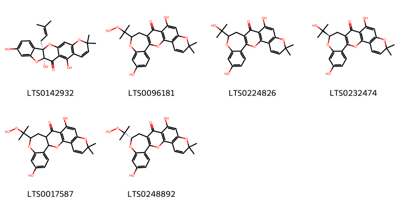{ width=100% }
    <figcaption>Hình ảnh cấu trúc hóa học của 6 hoạt chất thuộc nhóm Benzopyrans gồm ['(3r,11s)-7,11,14-trihydroxy-18,18-dimethyl-3-(3-methylbut-2-en-1-yl)-2,10,19-trioxapentacyclo[11.8.0.0³,¹¹.0⁴,⁹.0¹⁵,²⁰]henicosa-1(21),4,6,8,13,15(20),16-heptaen-12-one (LTS0142932)', '16-(2-hydroperoxypropan-2-yl)-11,20-dihydroxy-7,7-dimethyl-2,8,17-trioxapentacyclo[12.9.0.0³,¹².0⁴,⁹.0¹⁸,²³]tricosa-1(14),3,5,9,11,18,20,22-octaen-13-one (LTS0096181)', '11,20-dihydroxy-16-(2-hydroxypropan-2-yl)-7,7-dimethyl-2,8,17-trioxapentacyclo[12.9.0.0³,¹².0⁴,⁹.0¹⁸,²³]tricosa-1(14),3,5,9,11,18,20,22-octaen-13-one (LTS0224826)', '(16r)-11,20-dihydroxy-16-(2-hydroxypropan-2-yl)-7,7-dimethyl-2,8,17-trioxapentacyclo[12.9.0.0³,¹².0⁴,⁹.0¹⁸,²³]tricosa-1(14),3,5,9,11,18,20,22-octaen-13-one (LTS0232474)', '16-(2-hydroperoxypropan-2-yl)-11,20-dihydroxy-7,7-dimethyl-2,8,17-trioxapentacyclo[12.9.0.0³,¹².0⁴,⁹.0¹⁸,²³]tricosa-3(12),4(9),5,10,18,20,22-heptaen-13-one (LTS0017587)', '(16s)-16-(2-hydroperoxypropan-2-yl)-11,20-dihydroxy-7,7-dimethyl-2,8,17-trioxapentacyclo[12.9.0.0³,¹².0⁴,⁹.0¹⁸,²³]tricosa-1(14),3,5,9,11,18,20,22-octaen-13-one (LTS0248892)'].</figcaption>
</figure>
### Nhóm Carboxylic acids and derivatives
<figure markdown="span">
    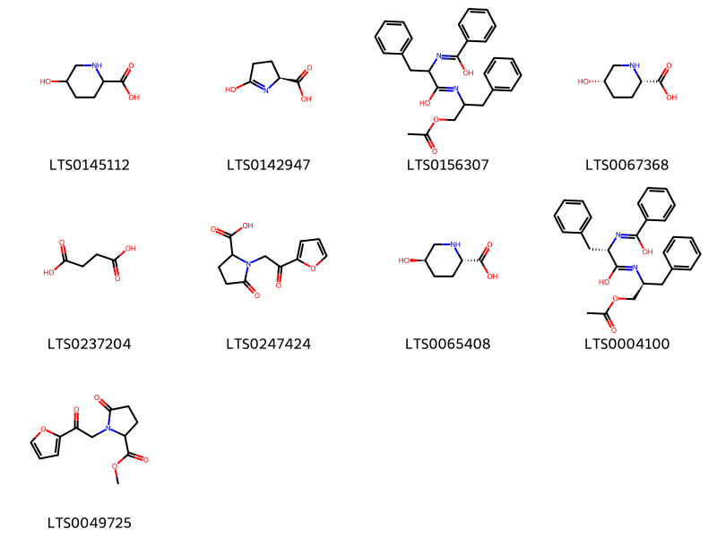{ width=100% }
    <figcaption>Hình ảnh cấu trúc hóa học của 9 hoạt chất thuộc nhóm Carboxylic acids and derivatives gồm ['5-hydroxypipecolic acid (LTS0145112)', 'pyroglutamic acid (LTS0142947)', 'n-[1-(acetyloxy)-3-phenylpropan-2-yl]-2-{[hydroxy(phenyl)methylidene]amino}-3-phenylpropanimidic acid (LTS0156307)', '(2s,5s)-5-hydroxypiperidine-2-carboxylic acid (LTS0067368)', 'succinic acid (LTS0237204)', '1-[2-(furan-2-yl)-2-oxoethyl]-5-oxopyrrolidine-2-carboxylic acid (LTS0247424)', '(2s,5r)-5-hydroxypiperidine-2-carboxylic acid (LTS0065408)', '(2s)-n-[(2s)-1-(acetyloxy)-3-phenylpropan-2-yl]-2-{[hydroxy(phenyl)methylidene]amino}-3-phenylpropanimidic acid (LTS0004100)', 'methyl 1-[2-(furan-2-yl)-2-oxoethyl]-5-oxopyrrolidine-2-carboxylate (LTS0049725)'].</figcaption>
</figure>
### Nhóm Coumarins and derivatives
<figure markdown="span">
    { width=100% }
    <figcaption>Hình ảnh cấu trúc hóa học của 19 hoạt chất thuộc nhóm Coumarins and derivatives gồm ['scopoletin (LTS0193112)', 'umbelliferone (LTS0162728)', 'scopolin (LTS0061811)', '7-{[(2s,3r,4s,5s,6r)-6-({[(2r,3r,4r)-3,4-dihydroxy-4-(hydroxymethyl)oxolan-2-yl]oxy}methyl)-3,4,5-trihydroxyoxan-2-yl]oxy}-5-hydroxychromen-2-one (LTS0200602)', '7-{[6-({[3,4-dihydroxy-4-(hydroxymethyl)oxolan-2-yl]oxy}methyl)-3,4,5-trihydroxyoxan-2-yl]oxy}-5-hydroxychromen-2-one (LTS0089329)', '5,7-dihydroxy-6-{[(2s,3r,4s,5s,6r)-3,4,5-trihydroxy-6-(hydroxymethyl)oxan-2-yl]oxy}chromen-2-one (LTS0179672)', '5-hydroxy-7-{[(2s,3r,4s,5s,6r)-3,4,5-trihydroxy-6-(hydroxymethyl)oxan-2-yl]oxy}chromen-2-one (LTS0011119)', 'cichoriin (LTS0075962)', '6-hydroxy-7-[(3,4,5-trihydroxy-6-{[(3,4,5-trihydroxy-6-methyloxan-2-yl)oxy]methyl}oxan-2-yl)oxy]chromen-2-one (LTS0120521)', '5-hydroxy-7-methoxychromen-2-one (LTS0183894)', '5,7-dihydroxy-6-[3,4,5-trihydroxy-6-(hydroxymethyl)oxan-2-yl]chromen-2-one (LTS0172764)', '7-{[(2s,3r,4s,5r,6r)-3,4,5-trihydroxy-6-(hydroxymethyl)oxan-2-yl]oxy}chromen-2-one (LTS0160726)', 'esculin (LTS0228636)', 'skimmin (LTS0102064)', '6-methoxy-7-{[3,4,5-trihydroxy-6-(hydroxymethyl)oxan-2-yl]oxy}chromen-2-one (LTS0042457)', 'skimmin (LTS0063676)', '6-hydroxy-7-{[(2s,3r,4s,5s,6r)-3,4,5-trihydroxy-6-({[(2r,3r,4r,5r,6s)-3,4,5-trihydroxy-6-methyloxan-2-yl]oxy}methyl)oxan-2-yl]oxy}chromen-2-one (LTS0013821)', '6-hydroxy-7-{[3,4,5-trihydroxy-6-(hydroxymethyl)oxan-2-yl]oxy}chromen-2-one (LTS0228835)', '5,7-dihydroxy-6-[(2s,3r,4r,5s,6r)-3,4,5-trihydroxy-6-(hydroxymethyl)oxan-2-yl]chromen-2-one (LTS0260708)'].</figcaption>
</figure>
### Nhóm Diarylheptanoids
<figure markdown="span">
    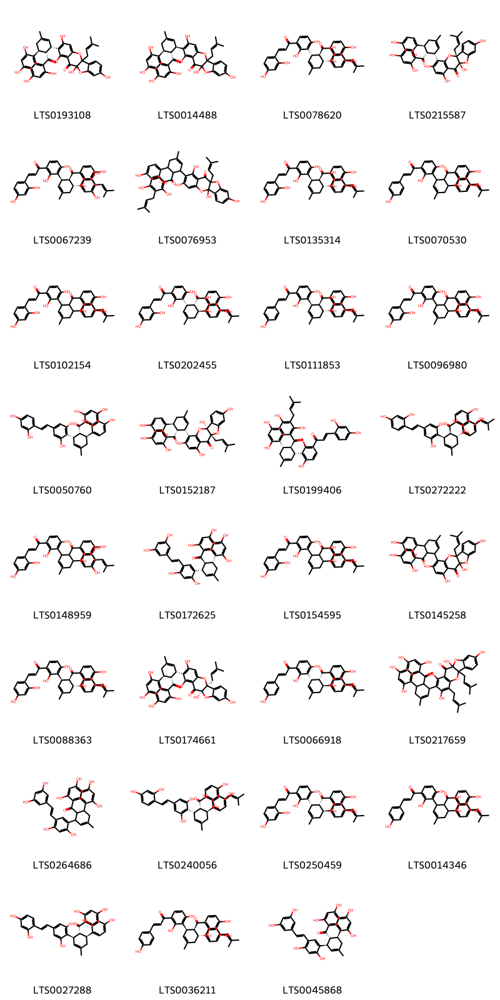{ width=100% }
    <figcaption>Hình ảnh cấu trúc hóa học của 31 hoạt chất thuộc nhóm Diarylheptanoids gồm ['sanggenon c (LTS0193108)', 'sanggenon d (LTS0014488)', '(2e)-1-{3-[(1s,5r,6s)-6-[2,4-dihydroxy-3-(3-methylbut-2-en-1-yl)benzoyl]-5-(2,4-dihydroxyphenyl)-3-methylcyclohex-2-en-1-yl]-2,4-dihydroxyphenyl}-3-(2,4-dihydroxyphenyl)prop-2-en-1-one (LTS0078620)', '(1s,10r)-7-[(1s,5s,6r)-6-(2,4-dihydroxybenzoyl)-5-(2,4-dihydroxyphenyl)-3-methylcyclohex-2-en-1-yl]-1,4,6,14-tetrahydroxy-10-(3-methylbut-2-en-1-yl)-9,17-dioxatetracyclo[8.7.0.0³,⁸.0¹¹,¹⁶]heptadeca-3(8),4,6,11,13,15-hexaen-2-one (LTS0215587)', '(2e)-1-{3-[(1r,5r,6s)-6-[2,4-dihydroxy-3-(3-methylbut-2-en-1-yl)benzoyl]-5-(3,5-dihydroxyphenyl)-3-methylcyclohex-2-en-1-yl]-2,4-dihydroxyphenyl}-3-(2,4-dihydroxyphenyl)prop-2-en-1-one (LTS0067239)', '5-{6-[2,4-dihydroxy-3-(3-methylbut-2-en-1-yl)benzoyl]-5-(2,4-dihydroxyphenyl)-3-methylcyclohex-2-en-1-yl}-4,6,10,14-tetrahydroxy-1-(3-methylbut-2-en-1-yl)-9,17-dioxatetracyclo[8.7.0.0³,⁸.0¹¹,¹⁶]heptadeca-3,5,7,11,13,15-hexaen-2-one (LTS0076953)', '(2e)-1-{3-[(1r,5r,6s)-6-[2,4-dihydroxy-3-(3-methylbut-2-en-1-yl)benzoyl]-5-(2,4-dihydroxyphenyl)-3-methylcyclohex-2-en-1-yl]-2,4-dihydroxyphenyl}-3-(2,4-dihydroxyphenyl)prop-2-en-1-one (LTS0135314)', '1-(3-{6-[2,4-dihydroxy-3-(3-methylbut-2-en-1-yl)benzoyl]-5-(4-hydroxyphenyl)-3-methylcyclohex-2-en-1-yl}-2,4-dihydroxyphenyl)-3-(4-hydroxyphenyl)prop-2-en-1-one (LTS0070530)', '1-(3-{6-[2,4-dihydroxy-3-(3-methylbut-2-en-1-yl)benzoyl]-5-(4-hydroxyphenyl)-3-methylcyclohex-2-en-1-yl}-2,4-dihydroxyphenyl)-3-(2,4-dihydroxyphenyl)prop-2-en-1-one (LTS0102154)', '(2e)-1-{3-[(1s,5s,6r)-6-[2,4-dihydroxy-3-(3-methylbut-2-en-1-yl)benzoyl]-5-(2,4-dihydroxyphenyl)-3-methylcyclohex-2-en-1-yl]-2,4-dihydroxyphenyl}-3-(2,4-dihydroxyphenyl)prop-2-en-1-one (LTS0202455)', '(2e)-1-{3-[(1r,5r,6s)-6-[2,4-dihydroxy-3-(3-methylbut-2-en-1-yl)benzoyl]-5-(2,4-dihydroxyphenyl)-3-methylcyclohex-2-en-1-yl]-2,4-dihydroxyphenyl}-3-(4-hydroxyphenyl)prop-2-en-1-one (LTS0111853)', '(2e)-1-(3-{6-[2,4-dihydroxy-3-(3-methylbut-2-en-1-yl)benzoyl]-5-(4-hydroxyphenyl)-3-methylcyclohex-2-en-1-yl}-2,4-dihydroxyphenyl)-3-(2,4-dihydroxyphenyl)prop-2-en-1-one (LTS0096980)', '2-[(1s,5s,6r)-6-(2,4-dihydroxybenzoyl)-5-(2,4-dihydroxyphenyl)-3-methylcyclohex-2-en-1-yl]-5-[(1e)-2-(2,4-dihydroxyphenyl)ethenyl]benzene-1,3-diol (LTS0050760)', '(1r,10s)-7-[(1s,5s,6r)-6-(2,4-dihydroxybenzoyl)-5-(2,4-dihydroxyphenyl)-3-methylcyclohex-2-en-1-yl]-4,6,10,14-tetrahydroxy-1-(3-methylbut-2-en-1-yl)-9,17-dioxatetracyclo[8.7.0.0³,⁸.0¹¹,¹⁶]heptadeca-3(8),4,6,11,13,15-hexaen-2-one (LTS0152187)', '(2e)-1-{3-[(1r,5s,6r)-6-[2,4-dihydroxy-3-(3-methylbut-2-en-1-yl)benzoyl]-5-(2,4-dihydroxyphenyl)-3-methylcyclohex-2-en-1-yl]-2,4-dihydroxyphenyl}-3-(2,4-dihydroxyphenyl)prop-2-en-1-one (LTS0199406)', '2-[(1r,5r,6s)-6-[2,4-dihydroxy-3-(3-methylbut-2-en-1-yl)benzoyl]-5-(2,4-dihydroxyphenyl)-3-methylcyclohex-2-en-1-yl]-5-[(1e)-2-(2,4-dihydroxyphenyl)ethenyl]benzene-1,3-diol (LTS0272222)', '1-(3-{6-[2,4-dihydroxy-3-(3-methylbut-2-en-1-yl)benzoyl]-5-(3,5-dihydroxyphenyl)-3-methylcyclohex-2-en-1-yl}-2,4-dihydroxyphenyl)-3-(2,4-dihydroxyphenyl)prop-2-en-1-one (LTS0148959)', '4-[(1s,5r,6s)-6-(2,4-dihydroxybenzoyl)-5-(2,4-dihydroxyphenyl)-3-methylcyclohex-2-en-1-yl]-6-[(1e)-2-(3,5-dihydroxyphenyl)ethenyl]benzene-1,3-diol (LTS0172625)', '1-(3-{6-[2,4-dihydroxy-3-(3-methylbut-2-en-1-yl)benzoyl]-5-(2,4-dihydroxyphenyl)-3-methylcyclohex-2-en-1-yl}-2,4-dihydroxyphenyl)-3-(2,4-dihydroxyphenyl)prop-2-en-1-one (LTS0154595)', '7-[6-(2,4-dihydroxybenzoyl)-5-(2,4-dihydroxyphenyl)-3-methylcyclohex-2-en-1-yl]-1,4,6,14-tetrahydroxy-10-(3-methylbut-2-en-1-yl)-9,17-dioxatetracyclo[8.7.0.0³,⁸.0¹¹,¹⁶]heptadeca-3(8),4,6,11,13,15-hexaen-2-one (LTS0145258)', '(2e)-1-{3-[(1r,5r,6s)-6-[2,4-dihydroxy-3-(3-methylbut-2-en-1-yl)benzoyl]-5-(4-hydroxyphenyl)-3-methylcyclohex-2-en-1-yl]-2,4-dihydroxyphenyl}-3-(2,4-dihydroxyphenyl)prop-2-en-1-one (LTS0088363)', '(1r,10s)-5-[(1s,5s,6r)-6-(2,4-dihydroxybenzoyl)-5-(2,4-dihydroxyphenyl)-3-methylcyclohex-2-en-1-yl]-1,4,6,14-tetrahydroxy-10-(3-methylbut-2-en-1-yl)-9,17-dioxatetracyclo[8.7.0.0³,⁸.0¹¹,¹⁶]heptadeca-3,5,7,11,13,15-hexaen-2-one (LTS0174661)', '(2e)-1-{3-[(1s,5s,6r)-6-[2,4-dihydroxy-3-(3-methylbut-2-en-1-yl)benzoyl]-5-(4-hydroxyphenyl)-3-methylcyclohex-2-en-1-yl]-2,4-dihydroxyphenyl}-3-(4-hydroxyphenyl)prop-2-en-1-one (LTS0066918)', '5-[6-(2,4-dihydroxybenzoyl)-5-(2,4-dihydroxyphenyl)-3-methylcyclohex-2-en-1-yl]-1,4,6,14-tetrahydroxy-7,10-bis(3-methylbut-2-en-1-yl)-9,17-dioxatetracyclo[8.7.0.0³,⁸.0¹¹,¹⁶]heptadeca-3(8),4,6,11,13,15-hexaen-2-one (LTS0217659)', '4-[6-(2,4-dihydroxybenzoyl)-5-(2,4-dihydroxyphenyl)-3-methylcyclohex-2-en-1-yl]-6-[2-(3,5-dihydroxyphenyl)ethenyl]benzene-1,3-diol (LTS0264686)', '2-[(1s,5s,6r)-6-[2,4-dihydroxy-3-(3-methylbut-2-en-1-yl)benzoyl]-5-(2,4-dihydroxyphenyl)-3-methylcyclohex-2-en-1-yl]-5-[(1e)-2-(2,4-dihydroxyphenyl)ethenyl]benzene-1,3-diol (LTS0240056)', '(2e)-1-{3-[(1s,5s,6r)-6-[2,4-dihydroxy-3-(3-methylbut-2-en-1-yl)benzoyl]-5-(4-hydroxyphenyl)-3-methylcyclohex-2-en-1-yl]-2,4-dihydroxyphenyl}-3-(2,4-dihydroxyphenyl)prop-2-en-1-one (LTS0250459)', '1-(3-{6-[2,4-dihydroxy-3-(3-methylbut-2-en-1-yl)benzoyl]-5-(2,4-dihydroxyphenyl)-3-methylcyclohex-2-en-1-yl}-2,4-dihydroxyphenyl)-3-(4-hydroxyphenyl)prop-2-en-1-one (LTS0014346)', '2-[(1r,5s,6r)-6-(2,4-dihydroxybenzoyl)-5-(2,4-dihydroxyphenyl)-3-methylcyclohex-2-en-1-yl]-5-[(1e)-2-(2,4-dihydroxyphenyl)ethenyl]benzene-1,3-diol (LTS0027288)', '(2e)-1-{3-[(1r,5r,6s)-6-[2,4-dihydroxy-3-(3-methylbut-2-en-1-yl)benzoyl]-5-(4-hydroxyphenyl)-3-methylcyclohex-2-en-1-yl]-2,4-dihydroxyphenyl}-3-(4-hydroxyphenyl)prop-2-en-1-one (LTS0036211)', '4-[(1r,5s,6r)-6-(2,4-dihydroxybenzoyl)-5-(2,4-dihydroxyphenyl)-3-methylcyclohex-2-en-1-yl]-6-[(1e)-2-(3,5-dihydroxyphenyl)ethenyl]benzene-1,3-diol (LTS0045868)'].</figcaption>
</figure>
### Nhóm Fatty Acyls
<figure markdown="span">
    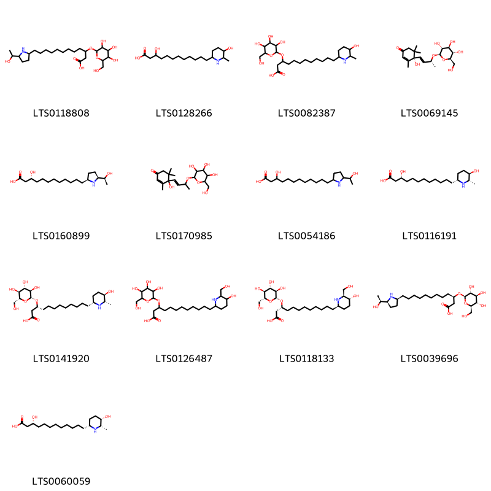{ width=100% }
    <figcaption>Hình ảnh cấu trúc hóa học của 13 hoạt chất thuộc nhóm Fatty Acyls gồm ['12-[5-(1-hydroxyethyl)pyrrolidin-2-yl]-3-{[3,4,5-trihydroxy-6-(hydroxymethyl)oxan-2-yl]oxy}dodecanoic acid (LTS0118808)', '3-hydroxy-12-(5-hydroxy-6-methylpiperidin-2-yl)dodecanoic acid (LTS0128266)', '12-(5-hydroxy-6-methylpiperidin-2-yl)-3-{[3,4,5-trihydroxy-6-(hydroxymethyl)oxan-2-yl]oxy}dodecanoic acid (LTS0082387)', '(4s)-4-hydroxy-3,5,5-trimethyl-4-[(1e,3r)-3-{[(2r,3r,4s,5s,6r)-3,4,5-trihydroxy-6-(hydroxymethyl)oxan-2-yl]oxy}but-1-en-1-yl]cyclohex-2-en-1-one (LTS0069145)', '(3r)-3-hydroxy-12-[(2s,5s)-5-[(1s)-1-hydroxyethyl]pyrrolidin-2-yl]dodecanoic acid (LTS0160899)', '4-hydroxy-3,5,5-trimethyl-4-(3-{[3,4,5-trihydroxy-6-(hydroxymethyl)oxan-2-yl]oxy}but-1-en-1-yl)cyclohex-2-en-1-one (LTS0170985)', '3-hydroxy-12-[5-(1-hydroxyethyl)pyrrolidin-2-yl]dodecanoic acid (LTS0054186)', '(3r)-3-hydroxy-12-[(2r,5r,6s)-5-hydroxy-6-methylpiperidin-2-yl]dodecanoic acid (LTS0116191)', '(3r)-12-[(2r,5r,6s)-5-hydroxy-6-methylpiperidin-2-yl]-3-{[(2r,3r,4s,5s,6r)-3,4,5-trihydroxy-6-(hydroxymethyl)oxan-2-yl]oxy}dodecanoic acid (LTS0141920)', '12-[5-hydroxy-6-(hydroxymethyl)piperidin-2-yl]-3-{[3,4,5-trihydroxy-6-(hydroxymethyl)oxan-2-yl]oxy}dodecanoic acid (LTS0126487)', '(3r)-12-[(2r,5r,6s)-5-hydroxy-6-(hydroxymethyl)piperidin-2-yl]-3-{[(2r,3r,4s,5s,6r)-3,4,5-trihydroxy-6-(hydroxymethyl)oxan-2-yl]oxy}dodecanoic acid (LTS0118133)', '(3r)-12-[(2s,5s)-5-[(1s)-1-hydroxyethyl]pyrrolidin-2-yl]-3-{[(2r,3r,4s,5s,6r)-3,4,5-trihydroxy-6-(hydroxymethyl)oxan-2-yl]oxy}dodecanoic acid (LTS0039696)', '(3r)-3-hydroxy-12-[(2r,5s,6s)-5-hydroxy-6-methylpiperidin-2-yl]dodecanoic acid (LTS0060059)'].</figcaption>
</figure>
### Nhóm Flavonoids
<figure markdown="span">
    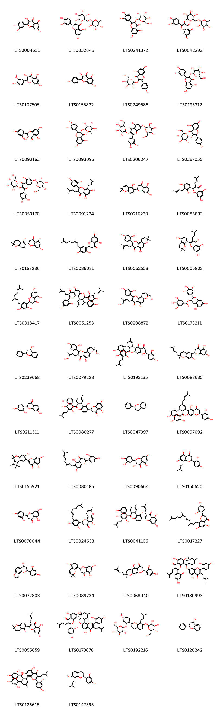{ width=100% }
    <figcaption>Hình ảnh cấu trúc hóa học của 104 hoạt chất thuộc nhóm Flavonoids gồm ['quercetin (LTS0004651)', '3-rutinosyl quercetin (LTS0032845)', '2-(3,4-dihydroxyphenyl)-5,7-dihydroxy-3-{[(2s,3r,4r,5r,6s)-3,4,5-trihydroxy-6-(hydroxymethyl)oxan-2-yl]oxy}chromen-4-one (LTS0241372)', 'rutin (LTS0042292)', 'isorhamnetin (LTS0107505)', 'kaempherol (LTS0155822)', 'astragalin (LTS0249588)', '2-(3,4-dihydroxyphenyl)-5,7-dihydroxy-3-{[3,4,5-trihydroxy-6-(hydroxymethyl)oxan-2-yl]oxy}chromen-4-one (LTS0195312)', '2-(2,4-dihydroxyphenyl)-3,5,7-trihydroxy-2,3-dihydro-1-benzopyran-4-one (LTS0092162)', 'quercitrin (LTS0093095)', '2-(3,4-dihydroxyphenyl)-5-hydroxy-3,7-bis({[3,4,5-trihydroxy-6-(hydroxymethyl)oxan-2-yl]oxy})chromen-4-one (LTS0206247)', 'trifolin (LTS0267055)', 'quercetin 3,7-diglucoside (LTS0059170)', 'mulberrin (LTS0091224)', 'sanggenon f (LTS0216230)', 'kuwanon t (LTS0086833)', '(2s)-5,7-dihydroxy-2-(5-hydroxy-2,2-dimethylchromen-6-yl)-2,3-dihydro-1-benzopyran-4-one (LTS0168286)', '2-[5-(3,7-dimethylocta-2,6-dien-1-yl)-2,4-dihydroxyphenyl]-5,7-dihydroxy-2,3-dihydro-1-benzopyran-4-one (LTS0036031)', 'morusin (LTS0062558)', 'kuwanon a (LTS0006823)', '(2s)-2-{5-[(2e)-3,7-dimethylocta-2,6-dien-1-yl]-2,4-dihydroxyphenyl}-5,7-dihydroxy-2,3-dihydro-1-benzopyran-4-one (LTS0018417)', '8-{6-[2,4-dihydroxy-3-(3-methylbut-2-en-1-yl)benzoyl]-5-(2,4-dihydroxyphenyl)-3-methylcyclohex-2-en-1-yl}-2-(2,4-dihydroxyphenyl)-5,7-dihydroxy-3-(3-methylbut-2-en-1-yl)chromen-4-one (LTS0051253)', '(8s)-2-(2,4-dihydroxyphenyl)-5-hydroxy-3-(4-hydroxy-3-methylbut-2-en-1-yl)-8-(hydroxymethyl)-8-methylpyrano[2,3-h]chromen-4-one (LTS0208872)', '(-)-epigallocatechin gallate (LTS0173211)', 'flavan-4-ol (LTS0239668)', '(8s)-2-(2,4-dihydroxyphenyl)-5-hydroxy-3-[(2z)-4-hydroxy-3-methylbut-2-en-1-yl]-8-(hydroxymethyl)-8-methylpyrano[2,3-h]chromen-4-one (LTS0079228)', '6-[(1s,5s,6r)-6-[2,4-dihydroxy-3-(3-methylbut-2-en-1-yl)benzoyl]-5-(2,4-dihydroxyphenyl)-3-methylcyclohex-2-en-1-yl]-2-(2,4-dihydroxyphenyl)-5,7-dihydroxychromen-4-one (LTS0193135)', 'kuwanon f (LTS0083635)', '2-(2,4-dihydroxyphenyl)-7-hydroxy-2,3-dihydro-1-benzopyran-4-one (LTS0211311)', '(2s)-2-{3-[(1s,5r,6s)-6-[2,4-dihydroxy-3-(3-methylbut-2-en-1-yl)benzoyl]-5-(2,4-dihydroxyphenyl)-3-methylcyclohex-2-en-1-yl]-2,4-dihydroxyphenyl}-5,7-dihydroxy-2,3-dihydro-1-benzopyran-4-one (LTS0080277)', 'flavan (LTS0047997)', '6-[(1r,5s,6r)-6-(2,4-dihydroxybenzoyl)-5-(2,4-dihydroxyphenyl)-3-(4-methylpent-3-en-1-yl)cyclohex-2-en-1-yl]-2-(2,4-dihydroxyphenyl)-5,7-dihydroxychromen-4-one (LTS0097092)', '5,7-dihydroxy-2-{10-hydroxy-3,3,4,6,6-pentamethyl-7-oxatricyclo[6.4.0.0²,⁵]dodeca-1(12),8,10-trien-11-yl}chromen-4-one (LTS0156921)', 'albanin e (LTS0080186)', '(+)-taxifolin (LTS0090664)', '2-(2,4-dihydroxyphenyl)-5,7-dihydroxy-8-(3-methylbut-2-en-1-yl)-2,3-dihydro-1-benzopyran-4-one (LTS0150620)', 'steppogenin (LTS0070044)', '(2s)-2-{5-[(2e)-3,7-dimethylocta-2,6-dien-1-yl]-2,4-dihydroxyphenyl}-5,7-dihydroxy-8-(3-methylbut-2-en-1-yl)-2,3-dihydro-1-benzopyran-4-one (LTS0024633)', '2-(3-{6-[2,4-dihydroxy-3-(3-methylbut-2-en-1-yl)benzoyl]-5-(2,4-dihydroxyphenyl)-3-methylcyclohex-2-en-1-yl}-2,4-dihydroxyphenyl)-5,7-dihydroxy-3-(3-methylbut-2-en-1-yl)chromen-4-one (LTS0041106)', '2-(2,4-dihydroxyphenyl)-5,7-dihydroxy-8-(3,7,11-trimethyldodeca-2,6,10-trien-1-yl)chromen-4-one (LTS0017227)', '4-{10-hydroxy-5,13-dioxatricyclo[7.4.0.0²,⁶]trideca-1,6,8-trien-12-yl}benzene-1,3-diol (LTS0072803)', '(2s)-5,7-dihydroxy-2-(5-hydroxy-2,2-dimethylchromen-8-yl)-2,3-dihydro-1-benzopyran-4-one (LTS0089734)', '(2s)-2-(2,4-dihydroxyphenyl)-5-hydroxy-8-methyl-8-(4-methylpent-3-en-1-yl)-2h,3h-pyrano[3,2-g]chromen-4-one (LTS0068040)', '2-(2,4-dihydroxyphenyl)-8-[2-(2,4-dihydroxyphenyl)-5-hydroxy-9,9,11-trimethyl-3-(3-methylbut-2-en-1-yl)-4-oxo-8h,8ah,10h,12ah-chromeno[7,8-c]isochromen-8-yl]-5,7-dihydroxy-3-(3-methylbut-2-en-1-yl)chromen-4-one (LTS0180993)', 'kuwanon b (LTS0055859)', '8-[(8s,8ar,12ar)-2-(2,4-dihydroxyphenyl)-5-hydroxy-9,9,11-trimethyl-3-(3-methylbut-2-en-1-yl)-4-oxo-8h,8ah,10h,12ah-chromeno[7,8-c]isochromen-8-yl]-2-(2,4-dihydroxyphenyl)-5,7-dihydroxy-3-(3-methylbut-2-en-1-yl)chromen-4-one (LTS0173678)', '(2r,3s,4s,5r,6s)-2-(hydroxymethyl)-6-{[(2s)-2-(4-methoxy-2-{[(2s,3r,4s,5s,6r)-3,4,5-trihydroxy-6-(hydroxymethyl)oxan-2-yl]oxy}phenyl)-8-(3-methylbut-2-en-1-yl)-3,4-dihydro-2h-1-benzopyran-7-yl]oxy}oxane-3,4,5-triol (LTS0192216)', '(2r,4s)-2-phenyl-3,4-dihydro-2h-1-benzopyran-4-ol (LTS0120242)', '8-[6-(2,4-dihydroxybenzoyl)-5-(2,4-dihydroxyphenyl)-3-methylcyclohex-2-en-1-yl]-2-(2,4-dihydroxyphenyl)-5,7-dihydroxy-3-(3-methylbut-2-en-1-yl)chromen-4-one (LTS0126618)', '4-[7-methoxy-8-(3-methylbut-2-en-1-yl)-3,4-dihydro-2h-1-benzopyran-2-yl]benzene-1,3-diol (LTS0147395)', '(1s,2r,4s,12r,14s)-4-(2,4-dihydroxyphenyl)-8-[(1e)-2-(2,4-dihydroxyphenyl)ethenyl]-10,18-dihydroxy-14-methyl-3,5,15-trioxahexacyclo[12.7.1.0²,⁴.0²,¹².0⁶,¹¹.0¹⁶,²¹]docosa-6,8,10,16,18,20-hexaen-13-one (LTS0205021)', '4-[(2s)-7-methoxy-8-(3-methylbut-2-en-1-yl)-3,4-dihydro-2h-1-benzopyran-2-yl]benzene-1,3-diol (LTS0133509)', 'cudraflavone b (LTS0140781)', 'gallocatechol (LTS0267305)', '(2s)-2-(2,4-dihydroxyphenyl)-5,7-dihydroxy-2,3-dihydro-1-benzopyran-4-one (LTS0150852)', '(2r)-5,7-dihydroxy-2-[(2r)-5-hydroxy-2-methyl-2-(4-methylpent-3-en-1-yl)chromen-8-yl]-2,3-dihydro-1-benzopyran-4-one (LTS0152870)', '8-[(1s,5s,6r)-6-(2,4-dihydroxybenzoyl)-5-(2,4-dihydroxyphenyl)-3-methylcyclohex-2-en-1-yl]-2-(2,4-dihydroxyphenyl)-5,7-dihydroxy-3-(3-hydroxy-3-methylbutyl)chromen-4-one (LTS0138926)', '4-[2-(2,4-dihydroxyphenyl)-7-methoxy-3,4-dihydro-2h-1-benzopyran-8-yl]butanoic acid (LTS0160015)', '2-[3-(3,7-dimethylocta-2,6-dien-1-yl)-4-hydroxyphenyl]-5,7-dihydroxychromen-4-one (LTS0094993)', '4-(2,4-dihydroxyphenyl)-8-[2-(2,4-dihydroxyphenyl)ethenyl]-10,18-dihydroxy-14-methyl-3,5,15-trioxahexacyclo[12.7.1.0²,⁴.0²,¹².0⁶,¹¹.0¹⁶,²¹]docosa-6,8,10,16,18,20-hexaen-13-one (LTS0163381)', 'leachianone g (LTS0160359)', '4-(2,4-dihydroxyphenyl)-8-[(1z)-2-(2,4-dihydroxyphenyl)ethenyl]-10,18-dihydroxy-14-methyl-3,5,15-trioxahexacyclo[12.7.1.0²,⁴.0²,¹².0⁶,¹¹.0¹⁶,²¹]docosa-6,8,10,16,18,20-hexaen-13-one (LTS0241434)', 'norartocarpetin (LTS0089058)', '(11r)-1,3,8-trihydroxy-4-(3-methylbut-2-en-1-yl)-11-(2-methylprop-1-en-1-yl)-11h-5,10-dioxatetraphen-12-one (LTS0246408)', '(1r,2s,4r,12s,14s)-4-(2,4-dihydroxyphenyl)-8-[(1e)-2-(2,4-dihydroxyphenyl)ethenyl]-10,18-dihydroxy-14-methyl-3,5,15-trioxahexacyclo[12.6.1.1¹⁶,²⁰.0²,⁴.0²,¹².0⁶,¹¹]docosa-6,8,10,16(22),17,19-hexaen-13-one (LTS0271332)', '(2r,3r,4s,5s,6r)-2-{5-hydroxy-2-[(2s)-8-(2-hydroxyethyl)-7-methoxy-3,4-dihydro-2h-1-benzopyran-2-yl]phenoxy}-6-(hydroxymethyl)oxane-3,4,5-triol (LTS0256632)', 'oxydihydromorusin (LTS0231362)', 'moralbanone (LTS0159371)', 'isoquercetin (LTS0254337)', '2-(2,4-dihydroxyphenyl)-8-[(1r,5r,6s)-6-(2,4-dihydroxyphenyl)-5-(5-hydroxy-2,2-dimethyl-3,4-dihydro-1-benzopyran-6-carbonyl)-3-methylcyclohex-2-en-1-yl]-5,7-dihydroxy-3-(3-methylbut-2-en-1-yl)chromen-4-one (LTS0254904)', '5,7-dihydroxy-2-(4-hydroxy-3-oxidophenyl)-3-{[(2s,3r,4s,5s,6r)-3,4,5-trihydroxy-6-(hydroxymethyl)oxan-2-yl]oxy}-1λ⁴-chromen-1-ylium (LTS0083222)', '4-[(2s)-2-(2,4-dihydroxyphenyl)-7-methoxy-3,4-dihydro-2h-1-benzopyran-8-yl]butanoic acid (LTS0274637)', 'cyclomulberrin (LTS0265851)', '(2r)-5,7-dihydroxy-2-(5-hydroxy-2,2-dimethylchromen-6-yl)-2,3-dihydro-1-benzopyran-4-one (LTS0192096)', '5,7-dihydroxy-2-[(2s,4s,5s)-10-hydroxy-3,3,4,6,6-pentamethyl-7-oxatricyclo[6.4.0.0²,⁵]dodeca-1(12),8,10-trien-11-yl]chromen-4-one (LTS0263111)', 'chrysanthemin (LTS0221391)', 'cudraflavone c (LTS0086862)', '2-(2,4-dihydroxyphenyl)-8-[5-(2,4-dihydroxyphenyl)-6-(5-hydroxy-2,2-dimethylchromene-6-carbonyl)-3-methylcyclohex-2-en-1-yl]-5,7-dihydroxy-3-(3-methylbut-2-en-1-yl)chromen-4-one (LTS0169646)', '4-[(10s,12r)-10-hydroxy-5,13-dioxatricyclo[7.4.0.0²,⁶]trideca-1,6,8-trien-12-yl]benzene-1,3-diol (LTS0176795)', '(2s)-2-(2-hydroxy-4-methoxyphenyl)-8-(3-methylbut-2-en-1-yl)-3,4-dihydro-2h-1-benzopyran-7-ol (LTS0237087)', '(2s)-5,7-dihydroxy-2-[(2r)-5-hydroxy-2-methyl-2-(4-methylpent-3-en-1-yl)chromen-6-yl]-2,3-dihydro-1-benzopyran-4-one (LTS0188087)', 'epigallocatechin (LTS0052496)', '(2s)-2-{5-[(2e)-3,7-dimethylocta-2,6-dien-1-yl]-2-hydroxy-4-methoxyphenyl}-5,7-dihydroxy-2,3-dihydro-1-benzopyran-4-one (LTS0107720)', '8-[(1r,5s,6r)-6-[2,4-dihydroxy-3-(3-methylbut-2-en-1-yl)benzoyl]-5-(2,4-dihydroxyphenyl)-3-methylcyclohex-2-en-1-yl]-2-(2,4-dihydroxyphenyl)-5,7-dihydroxy-3-(3-methylbut-2-en-1-yl)chromen-4-one (LTS0052274)', '2-(hydroxymethyl)-6-{[2-(4-methoxy-2-{[3,4,5-trihydroxy-6-(hydroxymethyl)oxan-2-yl]oxy}phenyl)-8-(3-methylbut-2-en-1-yl)-3,4-dihydro-2h-1-benzopyran-7-yl]oxy}oxane-3,4,5-triol (LTS0265185)', '2-(2,4-dihydroxyphenyl)-8-[6-(2,4-dihydroxyphenyl)-5-(5-hydroxy-2,2-dimethyl-3,4-dihydro-1-benzopyran-6-carbonyl)-3-methylcyclohex-2-en-1-yl]-5,7-dihydroxy-3-(3-methylbut-2-en-1-yl)chromen-4-one (LTS0275840)', 'cyclomorusin (LTS0010612)', '(15s)-11,19-dihydroxy-7,7-dimethyl-15-(2-methylprop-1-en-1-yl)-2,8,16-trioxapentacyclo[12.8.0.0³,¹².0⁴,⁹.0¹⁷,²²]docosa-1(14),3,5,9,11,17,19,21-octaen-13-one (LTS0015686)', '(2r,3r,4s,5s,6r)-2-{2-[(2s)-7-hydroxy-8-(2-hydroxyethyl)-3,4-dihydro-2h-1-benzopyran-2-yl]-5-methoxyphenoxy}-6-(hydroxymethyl)oxane-3,4,5-triol (LTS0016713)', 'isocyclomulberrin (LTS0124578)', 'kuwanon g (LTS0002394)', 'kuwanon e (LTS0052709)', '2-(2-hydroxy-4-methoxyphenyl)-8-(3-methylbut-2-en-1-yl)-3,4-dihydro-2h-1-benzopyran-7-ol (LTS0022485)', '2-[5-(3,7-dimethylocta-2,6-dien-1-yl)-2-hydroxy-4-methoxyphenyl]-5,7-dihydroxy-2,3-dihydro-1-benzopyran-4-one (LTS0113813)', 'flavan skeleton (LTS0244489)', '(2s)-2-[5-(3,7-dimethylocta-2,6-dien-1-yl)-2,4-dihydroxyphenyl]-5,7-dihydroxy-8-(3-methylbut-2-en-1-yl)-2,3-dihydro-1-benzopyran-4-one (LTS0019430)', '2-(2,4-dihydroxyphenyl)-8-[(1s,5r,6s)-5-(2,4-dihydroxyphenyl)-6-(5-hydroxy-2,2-dimethylchromene-6-carbonyl)-3-methylcyclohex-2-en-1-yl]-5,7-dihydroxy-3-(3-methylbut-2-en-1-yl)chromen-4-one (LTS0030596)', '5,7-dihydroxy-2-(4-methoxyphenyl)-3-{[(3r,4s,5s,6r)-3,4,5-trihydroxy-6-(hydroxymethyl)oxan-2-yl]oxy}chromen-4-one (LTS0229484)', '(2s)-5,7-dihydroxy-2-[(2r)-7-hydroxy-2-methyl-2-(4-methylpent-3-en-1-yl)chromen-6-yl]-2,3-dihydro-1-benzopyran-4-one (LTS0000426)', '(2r)-5,7-dihydroxy-2-(5-hydroxy-2,2-dimethylchromen-8-yl)-2,3-dihydro-1-benzopyran-4-one (LTS0031820)', '(2s)-2-{3-[(1s,5r,6s)-6-(2,4-dihydroxybenzoyl)-5-(2,4-dihydroxyphenyl)-3-methylcyclohex-2-en-1-yl]-2,4-dihydroxyphenyl}-5,7-dihydroxy-2,3-dihydro-1-benzopyran-4-one (LTS0102605)', '8-[6-(2,4-dihydroxybenzoyl)-5-(2,4-dihydroxyphenyl)-3-methylcyclohex-2-en-1-yl]-2-(2,4-dihydroxyphenyl)-5,7-dihydroxy-3-(3-hydroxy-3-methylbutyl)chromen-4-one (LTS0136607)', 'kuwanone s (LTS0044946)', '2-(2,4-dihydroxyphenyl)-8-[(1r,5s,6s)-6-(2,4-dihydroxyphenyl)-5-(5-hydroxy-2,2-dimethyl-3,4-dihydro-1-benzopyran-6-carbonyl)-3-methylcyclohex-2-en-1-yl]-5,7-dihydroxy-3-(3-methylbut-2-en-1-yl)chromen-4-one (LTS0048537)'].</figcaption>
</figure>
### Nhóm Glycerolipids
<figure markdown="span">
    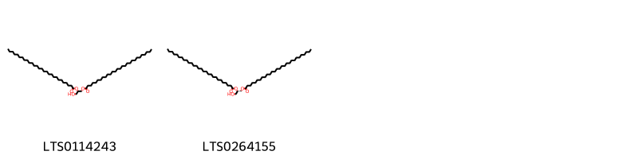{ width=100% }
    <figcaption>Hình ảnh cấu trúc hóa học của 2 hoạt chất thuộc nhóm Glycerolipids gồm ['1-hydroxy-3-(octacosanoyloxy)propan-2-yl octacosanoate (LTS0114243)', '(2s)-1-hydroxy-3-(octacosanoyloxy)propan-2-yl octacosanoate (LTS0264155)'].</figcaption>
</figure>
### Nhóm Indoles and derivatives
<figure markdown="span">
    { width=100% }
    <figcaption>Hình ảnh cấu trúc hóa học của 1 hoạt chất thuộc nhóm Indoles and derivatives gồm ['n-[2-(5-methoxy-1h-indol-3-yl)ethyl]ethanimidic acid (LTS0219322)'].</figcaption>
</figure>
### Nhóm Lactones
<figure markdown="span">
    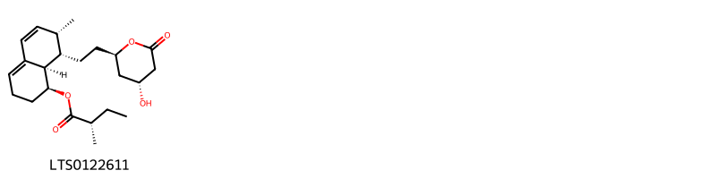{ width=100% }
    <figcaption>Hình ảnh cấu trúc hóa học của 1 hoạt chất thuộc nhóm Lactones gồm ['mevastatin (LTS0122611)'].</figcaption>
</figure>
### Nhóm Linear 1_3-diarylpropanoids
<figure markdown="span">
    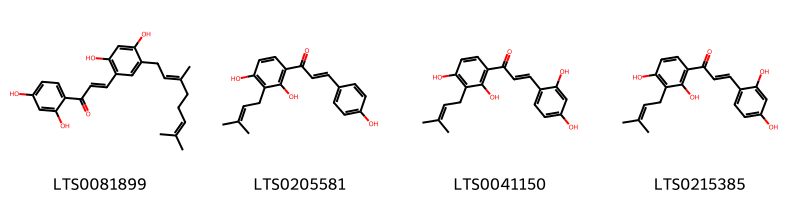{ width=100% }
    <figcaption>Hình ảnh cấu trúc hóa học của Không tìm thấy chú thích hoạt chất thuộc nhóm Linear 1_3-diarylpropanoids gồm Không tìm thấy chú thích.</figcaption>
</figure>
### Nhóm Organooxygen compounds
<figure markdown="span">
    { width=100% }
    <figcaption>Hình ảnh cấu trúc hóa học của 28 hoạt chất thuộc nhóm Organooxygen compounds gồm ['sucrose (LTS0272557)', '(2s,3r,4s,5s,6r)-2-{[(2r,3r,4r,5s)-3,5-dihydroxy-2-(hydroxymethyl)piperidin-4-yl]oxy}-6-(hydroxymethyl)oxane-3,4,5-triol (LTS0218106)', '(2s,3r,4s,5s,6r)-2-{[(3s,4s,5r,6r)-4,5-dihydroxy-6-(hydroxymethyl)piperidin-3-yl]oxy}-6-(hydroxymethyl)oxane-3,4,5-triol (LTS0112649)', '(2r,3r,4s,5r,6r)-2-(benzyloxy)-6-(hydroxymethyl)oxane-3,4,5-triol (LTS0107980)', '2-{[4-hydroxy-5-(hydroxymethyl)pyrrolidin-3-yl]oxy}-6-(hydroxymethyl)oxane-3,4,5-triol (LTS0271451)', '(2s,3r,4s,5s,6r)-2-{[(2r,3r,4r,5s)-4,5-dihydroxy-2-(hydroxymethyl)piperidin-3-yl]oxy}-6-(hydroxymethyl)oxane-3,4,5-triol (LTS0192387)', '2-({[3,4,5-trihydroxy-6-(hydroxymethyl)oxan-2-yl]oxy}methyl)piperidine-3,4,5-triol (LTS0142175)', '(2r,3r,4s,5s,6r)-2-{[(2r,3r,4r,5s)-4,5-dihydroxy-2-(hydroxymethyl)piperidin-3-yl]oxy}-6-(hydroxymethyl)oxane-3,4,5-triol (LTS0190353)', '2-{[4,5-dihydroxy-6-(hydroxymethyl)piperidin-3-yl]oxy}-6-(hydroxymethyl)oxane-3,4,5-triol (LTS0131738)', '4-[2-formyl-5-(hydroxymethyl)pyrrol-1-yl]butanoic acid (LTS0267573)', '(2s,3r,4s,5r,6r)-2-{[(3s,4s,5r,6r)-4,5-dihydroxy-6-(hydroxymethyl)piperidin-3-yl]oxy}-6-(hydroxymethyl)oxane-3,4,5-triol (LTS0235934)', '(2r,3r,4s,5s,6r)-2-{[(3r,4r,5r)-4-hydroxy-5-(hydroxymethyl)pyrrolidin-3-yl]oxy}-6-(hydroxymethyl)oxane-3,4,5-triol (LTS0245786)', '(2r,3r,4s,5s,6r)-2-{[(3s,4s,5r,6r)-4,5-dihydroxy-6-(hydroxymethyl)piperidin-3-yl]oxy}-6-(hydroxymethyl)oxane-3,4,5-triol (LTS0129667)', '4-(6-hydroxy-1-benzofuran-2-carbonyl)-2-[(2r)-2-hydroxy-3-methylbut-3-en-1-yl]benzene-1,3-diol (LTS0172446)', 'benzyl glucopyranoside (LTS0210495)', '4-(2-formylpyrrol-1-yl)butanoic acid (LTS0095322)', '(2r,3r,4r,5s)-2-({[(2r,3r,4s,5s,6r)-3,4,5-trihydroxy-6-(hydroxymethyl)oxan-2-yl]oxy}methyl)piperidine-3,4,5-triol (LTS0026334)', 'pyrraline (LTS0045469)', '4-(6-hydroxy-1-benzofuran-2-carbonyl)-2-(3-methylbut-2-en-1-yl)benzene-1,3-diol (LTS0231233)', '(2r,3s,4s,5r,6s)-2-(hydroxymethyl)-6-[(5-methylidene-2h-furan-3-yl)oxy]oxane-3,4,5-triol (LTS0256529)', 'benzyl β-d-glucoside (LTS0184698)', '(2r,3r,4r,5s)-2-({[(2s,3r,4s,5r,6r)-3,4,5-trihydroxy-6-(hydroxymethyl)oxan-2-yl]oxy}methyl)piperidine-3,4,5-triol (LTS0034442)', '2-{[4-hydroxy-2-(hydroxymethyl)piperidin-3-yl]oxy}-6-(hydroxymethyl)oxane-3,4,5-triol (LTS0060330)', '1-[2-(furan-2-yl)-2-oxoethyl]pyrrolidin-2-one (LTS0031414)', '2-{[4,5-dihydroxy-2-(hydroxymethyl)piperidin-3-yl]oxy}-6-(hydroxymethyl)oxane-3,4,5-triol (LTS0005290)', '2-{[3,5-dihydroxy-2-(hydroxymethyl)piperidin-4-yl]oxy}-6-(hydroxymethyl)oxane-3,4,5-triol (LTS0011514)', '4-[2-formyl-5-(methoxymethyl)pyrrol-1-yl]butanoic acid (LTS0111360)', '(2r,3r,4s,5s,6r)-2-{[(2r,3r,4r,5s)-3,5-dihydroxy-2-(hydroxymethyl)piperidin-4-yl]oxy}-6-(hydroxymethyl)oxane-3,4,5-triol (LTS0227259)'].</figcaption>
</figure>
### Nhóm Phenols
<figure markdown="span">
    { width=100% }
    <figcaption>Hình ảnh cấu trúc hóa học của 1 hoạt chất thuộc nhóm Phenols gồm ['5-{11-hydroxy-12,12-dimethyl-4,13-dioxatricyclo[7.4.0.0³,⁷]trideca-1(9),2,5-trien-5-yl}benzene-1,3-diol (LTS0243726)'].</figcaption>
</figure>
### Nhóm Piperidines
<figure markdown="span">
    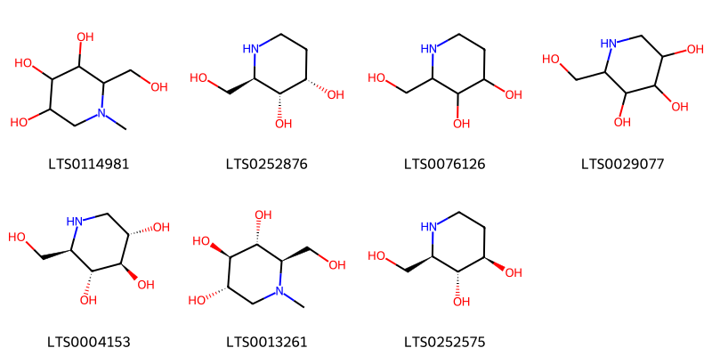{ width=100% }
    <figcaption>Hình ảnh cấu trúc hóa học của 7 hoạt chất thuộc nhóm Piperidines gồm ['2-(hydroxymethyl)-1-methylpiperidine-3,4,5-triol (LTS0114981)', '3-epi-fagomine (LTS0252876)', '2-(hydroxymethyl)piperidine-3,4-diol (LTS0076126)', '1 deoxynojirimycin (LTS0029077)', '1-deoxynojirimycin (LTS0004153)', 'n-methyldeoxynojirimycin (LTS0013261)', 'fagomine (LTS0252575)'].</figcaption>
</figure>
### Nhóm Prenol lipids
<figure markdown="span">
    { width=100% }
    <figcaption>Hình ảnh cấu trúc hóa học của 17 hoạt chất thuộc nhóm Prenol lipids gồm ['ursolic acid (LTS0250838)', '10-hydroxy-1,2,6a,6b,9,9,12a-heptamethyl-2,3,4,5,6,7,8,8a,10,11,12,12b,13,14b-tetradecahydro-1h-picene-4a-carboxylic acid (LTS0166564)', '(2r)-2,5,7,8-tetramethyl-2-[(4s,8s)-4,8,12-trimethyltridecyl]-3,4-dihydro-1-benzopyran-6-ol (LTS0130040)', 'amyrin (LTS0222826)', 'betulinic acid (LTS0210795)', '9-hydroxy-5a,5b,8,8,11a-pentamethyl-1-(prop-1-en-2-yl)-hexadecahydrocyclopenta[a]chrysene-3a-carboxylic acid (LTS0214300)', '8a-(hydroxymethyl)-4,4,6a,6b,11,12,14b-heptamethyl-2,3,4a,5,6,7,8,9,10,11,12,12a,14,14a-tetradecahydro-1h-picen-3-ol (LTS0178123)', 'uvaol (LTS0008025)', '(1r,3ar,9as,9br,11ar)-1-[(2r,5r)-5-ethyl-6-methylheptan-2-yl]-9a,11a-dimethyl-1h,2h,3h,3ah,5h,5ah,6h,7h,8h,9h,9bh,10h,11h-cyclopenta[a]phenanthren-7-yl acetate (LTS0124674)', 'hederagenin (LTS0157813)', 'β-amyrin (LTS0251864)', '4,4,6a,6b,8a,11,12,14b-octamethyl-2,3,4a,5,6,7,8,9,10,11,12,12a,14,14a-tetradecahydro-1h-picen-3-yl acetate (LTS0185406)', 'β-carotene (LTS0275716)', 'vitamin e (LTS0263269)', 'methyl (1s,2r,4as,6as,6br,8ar,10s,12ar,12br,14br)-10-hydroxy-1,2,6a,6b,9,9,12a-heptamethyl-2,3,4,5,6,7,8,8a,10,11,12,12b,13,14b-tetradecahydro-1h-picene-4a-carboxylate (LTS0231950)', '(-)-friedelin (LTS0041645)', 'α-amyrin acetate (LTS0224810)'].</figcaption>
</figure>
### Nhóm Purine nucleosides
<figure markdown="span">
    { width=100% }
    <figcaption>Hình ảnh cấu trúc hóa học của 2 hoạt chất thuộc nhóm Purine nucleosides gồm ['adenosine (LTS0052576)', 'adenosine (LTS0014061)'].</figcaption>
</figure>
### Nhóm Pyrrolidines
<figure markdown="span">
    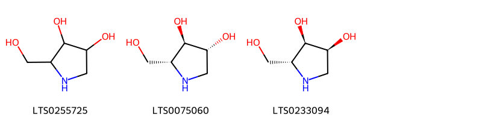{ width=100% }
    <figcaption>Hình ảnh cấu trúc hóa học của 3 hoạt chất thuộc nhóm Pyrrolidines gồm ['2-(hydroxymethyl)pyrrolidine-3,4-diol (LTS0255725)', '(2r,3r,4r)-2-(hydroxymethyl)pyrrolidine-3,4-diol (LTS0075060)', 'iminoribitol (LTS0233094)'].</figcaption>
</figure>
### Nhóm Steroids and steroid derivatives
<figure markdown="span">
    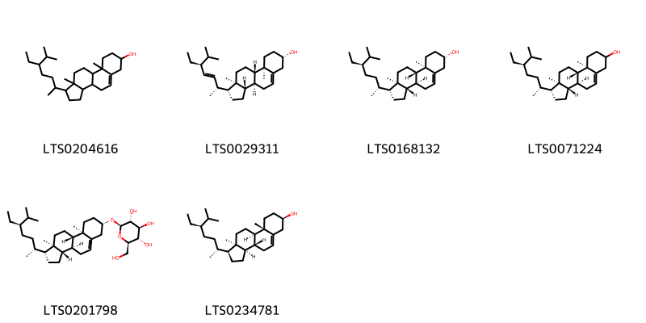{ width=100% }
    <figcaption>Hình ảnh cấu trúc hóa học của 6 hoạt chất thuộc nhóm Steroids and steroid derivatives gồm ['stigmast-5-en-3-ol, (3β)- (LTS0204616)', 'phytosterol (LTS0029311)', 'sitosterol (LTS0168132)', 'stigmast-5-en-3-ol (LTS0071224)', 'sitogluside (LTS0201798)', '(1s,3ar,3br,7r,9as,9br,11ar)-1-[(2r,5r)-5-ethyl-6-methylheptan-2-yl]-9a,11a-dimethyl-1h,2h,3h,3ah,3bh,4h,6h,7h,8h,9h,9bh,10h,11h-cyclopenta[a]phenanthren-7-ol (LTS0234781)'].</figcaption>
</figure>
### Nhóm Stilbenes
<figure markdown="span">
    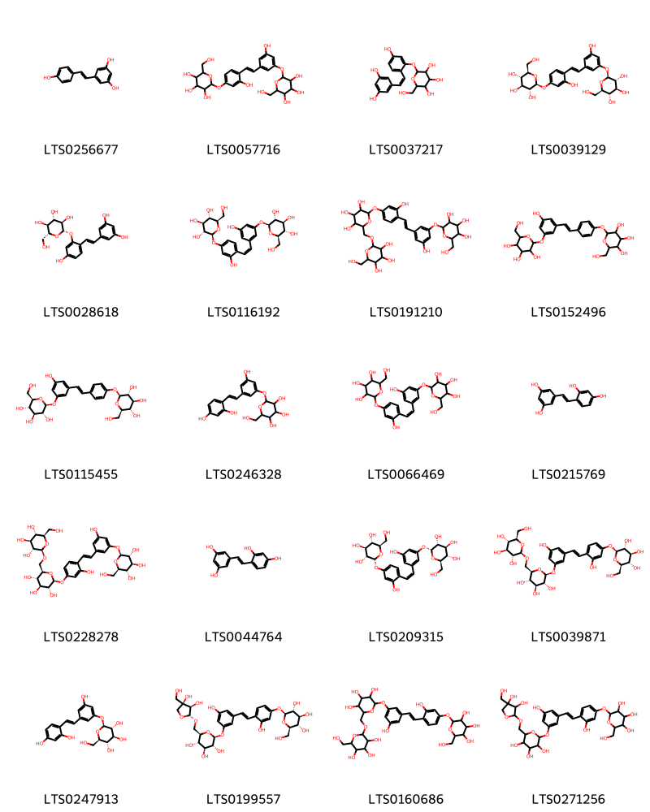{ width=100% }
    <figcaption>Hình ảnh cấu trúc hóa học của 20 hoạt chất thuộc nhóm Stilbenes gồm ['resveratrol (LTS0256677)', '2-{3-hydroxy-5-[2-(2-hydroxy-4-{[3,4,5-trihydroxy-6-(hydroxymethyl)oxan-2-yl]oxy}phenyl)ethenyl]phenoxy}-6-(hydroxymethyl)oxane-3,4,5-triol (LTS0057716)', '2-{2-[2-(3,5-dihydroxyphenyl)ethenyl]-5-hydroxyphenoxy}-6-(hydroxymethyl)oxane-3,4,5-triol (LTS0037217)', '(2s,3r,4s,5s,6r)-2-{3-hydroxy-5-[(1e)-2-(2-hydroxy-4-{[(2s,3r,4s,5s,6r)-3,4,5-trihydroxy-6-(hydroxymethyl)oxan-2-yl]oxy}phenyl)ethenyl]phenoxy}-6-(hydroxymethyl)oxane-3,4,5-triol (LTS0039129)', '(2s,3r,4s,5s,6r)-2-{2-[(1e)-2-(3,5-dihydroxyphenyl)ethenyl]-5-hydroxyphenoxy}-6-(hydroxymethyl)oxane-3,4,5-triol (LTS0028618)', '(2s,3r,4s,5s,6r)-2-{3-hydroxy-5-[(1z)-2-(2-hydroxy-4-{[(2s,3r,4s,5s,6r)-3,4,5-trihydroxy-6-(hydroxymethyl)oxan-2-yl]oxy}phenyl)ethenyl]phenoxy}-6-(hydroxymethyl)oxane-3,4,5-triol (LTS0116192)', '2-(hydroxymethyl)-6-[(3,4,5-trihydroxy-6-{3-hydroxy-4-[2-(3-hydroxy-5-{[3,4,5-trihydroxy-6-(hydroxymethyl)oxan-2-yl]oxy}phenyl)ethenyl]phenoxy}oxan-2-yl)methoxy]oxane-3,4,5-triol (LTS0191210)', '2-{4-[2-(3-hydroxy-5-{[3,4,5-trihydroxy-6-(hydroxymethyl)oxan-2-yl]oxy}phenyl)ethenyl]phenoxy}-6-(hydroxymethyl)oxane-3,4,5-triol (LTS0152496)', '(2s,3r,4s,5s,6r)-2-{4-[(1e)-2-(3-hydroxy-5-{[(2s,3r,4s,5s,6r)-3,4,5-trihydroxy-6-(hydroxymethyl)oxan-2-yl]oxy}phenyl)ethenyl]phenoxy}-6-(hydroxymethyl)oxane-3,4,5-triol (LTS0115455)', '2-{3-[2-(2,4-dihydroxyphenyl)ethenyl]-5-hydroxyphenoxy}-6-(hydroxymethyl)oxane-3,4,5-triol (LTS0246328)', '2-{3-hydroxy-5-[(1z)-2-(2-hydroxy-4-{[3,4,5-trihydroxy-6-(hydroxymethyl)oxan-2-yl]oxy}phenyl)ethenyl]phenoxy}-6-(hydroxymethyl)oxane-3,4,5-triol (LTS0066469)', '5-[2-(2,4-dihydroxyphenyl)ethenyl]benzene-1,3-diol (LTS0215769)', '(2s,3r,4s,5s,6r)-2-{3-hydroxy-5-[(1e)-2-(2-hydroxy-4-{[(2s,3r,4s,5s,6r)-3,4,5-trihydroxy-6-({[(2r,3r,4s,5s,6r)-3,4,5-trihydroxy-6-(hydroxymethyl)oxan-2-yl]oxy}methyl)oxan-2-yl]oxy}phenyl)ethenyl]phenoxy}-6-(hydroxymethyl)oxane-3,4,5-triol (LTS0228278)', '5-[(1e)-2-(2,4-dihydroxyphenyl)ethenyl]benzene-1,3-diol (LTS0044764)', '(2r,3r,4s,5s,6r)-2-{3-hydroxy-5-[(1z)-2-(2-hydroxy-4-{[(2r,3r,4s,5s,6r)-3,4,5-trihydroxy-6-(hydroxymethyl)oxan-2-yl]oxy}phenyl)ethenyl]phenoxy}-6-(hydroxymethyl)oxane-3,4,5-triol (LTS0209315)', '(2s,3r,4s,5s,6r)-2-{3-hydroxy-4-[(1e)-2-(3-hydroxy-5-{[(2s,3r,4s,5s,6r)-3,4,5-trihydroxy-6-({[(2r,3r,4s,5s,6r)-3,4,5-trihydroxy-6-(hydroxymethyl)oxan-2-yl]oxy}methyl)oxan-2-yl]oxy}phenyl)ethenyl]phenoxy}-6-(hydroxymethyl)oxane-3,4,5-triol (LTS0039871)', '(2s,3r,4s,5s,6r)-2-{3-[(1e)-2-(2,4-dihydroxyphenyl)ethenyl]-5-hydroxyphenoxy}-6-(hydroxymethyl)oxane-3,4,5-triol (LTS0247913)', '(2s,3r,4s,5s,6r)-2-{4-[(1e)-2-(3-{[(2s,3r,4s,5s,6r)-6-({[(2r,3r,4r)-3,4-dihydroxy-4-(hydroxymethyl)oxolan-2-yl]oxy}methyl)-3,4,5-trihydroxyoxan-2-yl]oxy}-5-hydroxyphenyl)ethenyl]-3-hydroxyphenoxy}-6-(hydroxymethyl)oxane-3,4,5-triol (LTS0199557)', '2-(hydroxymethyl)-6-[(3,4,5-trihydroxy-6-{3-hydroxy-5-[2-(2-hydroxy-4-{[3,4,5-trihydroxy-6-(hydroxymethyl)oxan-2-yl]oxy}phenyl)ethenyl]phenoxy}oxan-2-yl)methoxy]oxane-3,4,5-triol (LTS0160686)', '2-{4-[2-(3-{[6-({[3,4-dihydroxy-4-(hydroxymethyl)oxolan-2-yl]oxy}methyl)-3,4,5-trihydroxyoxan-2-yl]oxy}-5-hydroxyphenyl)ethenyl]-3-hydroxyphenoxy}-6-(hydroxymethyl)oxane-3,4,5-triol (LTS0271256)'].</figcaption>
</figure>
### Nhóm Tropane alkaloids
<figure markdown="span">
    { width=100% }
    <figcaption>Hình ảnh cấu trúc hóa học của 13 hoạt chất thuộc nhóm Tropane alkaloids gồm ['(1s,2r,3r,5s,6r)-8-azabicyclo[3.2.1]octane-2,3,6-triol (LTS0098382)', '(1s,2r,3r,5r)-8-azabicyclo[3.2.1]octane-2,3-diol (LTS0049151)', '8-azabicyclo[3.2.1]octane-3,6-diol (LTS0119568)', '(1r,3s,5s,6r)-8-azabicyclo[3.2.1]octane-3,6-diol (LTS0051274)', '8-azabicyclo[3.2.1]octane-2,3,4-triol (LTS0274985)', '(1r,2s,3r,4r,5s)-8-azabicyclo[3.2.1]octane-2,3,4-triol (LTS0224868)', '8-azabicyclo[3.2.1]octane-1,2,3,4-tetrol (LTS0108701)', '8-azabicyclo[3.2.1]octane-2,3-diol (LTS0216607)', '(1s,2s,3r,5r)-8-azabicyclo[3.2.1]octane-2,3-diol (LTS0254199)', '8-azabicyclo[3.2.1]octane-2,3,6-triol (LTS0255825)', '(1r,3r,5s)-8-azabicyclo[3.2.1]octan-3-ol (LTS0052092)', '(1r,2s,3r,4s,5r)-8-azabicyclo[3.2.1]octane-1,2,3,4-tetrol (LTS0001773)', '8-azabicyclo[3.2.1]octan-3-ol (LTS0050564)'].</figcaption>
</figure>

---

## Tác dụng dược lý

Theo tài liệu "Những cây thuốc và vị thuốc Việt Nam" - Đỗ Tất Lợi:- Hạ đường huyết, hạ huyết áp
- Kháng viêm, kháng khuẩn
- Chống dòng tế bào ung thư

Theo tài liệu quốc tế: To remove heat from the lung, to relieve asthma, and to induce diuresis.

---

## Dược điển Việt Nam V

### Soi bột:

<!-- Hình ảnh soi bột sẽ được tự động chèn vào đây sau -->
### Vi phẫu:

<!-- Hình ảnh vi phẫu sẽ được tự động chèn vào đây sau -->
### Định tính

### Định lượng

### Thông tin khác 
- ** Độ ẩm: ** 

- ** Bảo quản:** 
## Dược điển Hồng kong

<!-- PDF sẽ được tự động chèn vào đây sau -->

---

## Y dược học cổ truyền

- **Tên vị thuốc:** 
- **Tính vị quy kinh:** Cam, hàn. Vào kinh phế.
- **Công năng chủ trị:** Thanh phế, bình suyễn, lợi thủy tiêu thũng.
Chủ trị: Phế nhiệt ho suyễn, thủy thũng đầy trướng, tiểu tiện ít; cơ và da mặt, mắt phù thũng.
- **Chú ý:** 
- **Kiêng kỵ:** 

