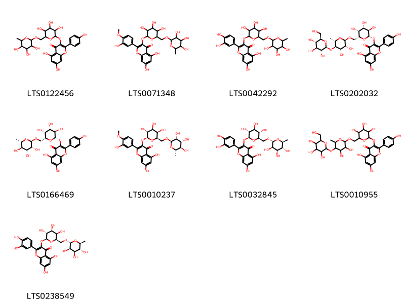
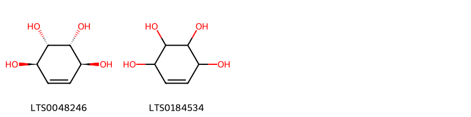
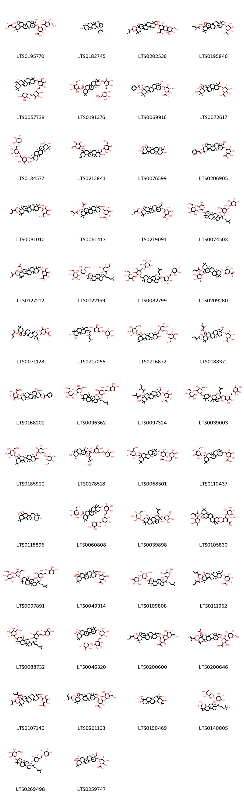
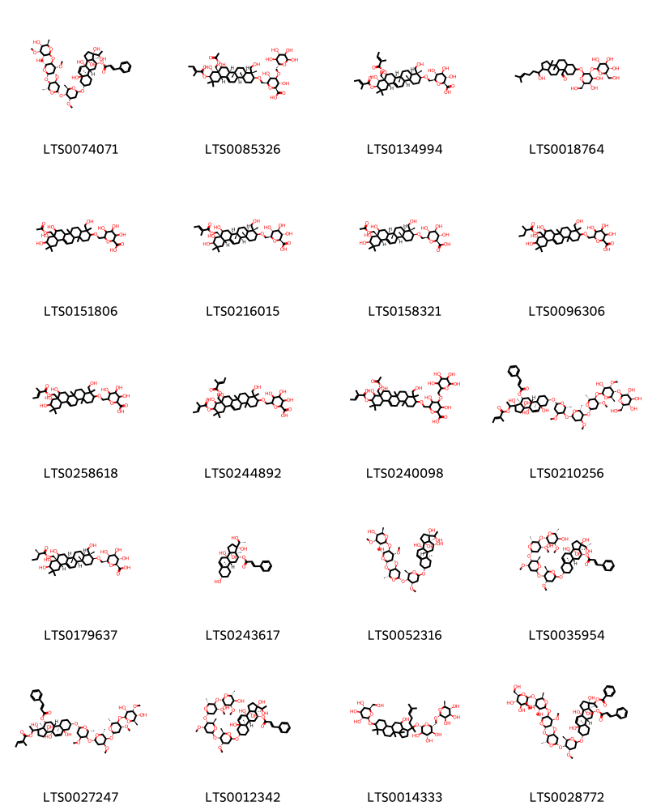

!!! abstract "Tóm tắt"
    Dược liệu Dây thìa canh (Dây, lá) tên khoa học là Caulis et folium Gymnemae sylvestris là phần dây và lá phơi hay sấy khô của cây Dây thìa canh [Gymnema sylvestre (Retz.) R. Br. ex Schult.], họ Thiên lý (Asclepiadaceae). Dược liệu khi khô có màu xanh lục. Lá có phiến bầu dục hoặc xoan ngược thon dài 6cm đến 7cm, rộng 2,5cm đến 5cm, đầu nhọn có mũi, gân phụ 4 đến 6 cặp, rõ ở mặt dưới, nhăn lúc khô; cuống dài 5cm đến 8cm. Cây phân bố chủ yếu ở Ấn Độ, Trung Quốc, Việt Nam và các quốc gia Đông Nam Á như Lào, Campuchia. 
Dây thìa canh được biết đến với tác dụng giảm đường huyết, giúp điều hòa glucose trong cơ thể và hỗ trợ điều trị bệnh tiểu đường. Ngoài ra, cây còn có tác dụng lợi tiểu, nhuận tràng và hỗ trợ điều trị táo bón do nhiệt. Dược liệu từ cây dây thìa canh có một số tác dụng phụ như kích thích tim và hệ tuần hoàn, gây bài tiết nước tiểu, và có thể gây suy nhược, ỉa chảy khi sử dụng quá liều.
Các thành phần hóa học trong cây bao gồm acid gymnemic (glucosidic), chlorophyll a và b, phytol, acid tartaric, các hợp chất anthraquinone, và inositol (carbohydrate). Theo y học cổ truyền, dây thìa canh có vị đắng, tính hàn, vào các kinh phế, tỳ và thận, với công năng lợi tiểu, nhuận tràng, hạ đường huyết. Cây còn được sử dụng trong dân gian ở Ấn Độ để đắp lên vết cắn của rắn và sắc uống để trị nọc độc. Ở Trung Quốc, toàn bộ cây, bao gồm rễ và quả, được dùng để chữa phong thấp, viêm mạch máu, trĩ, vết thương do dao đạn và còn có tác dụng diệt chấy rận.

## Thông tin về thực vật

### Đặc điểm thực vật

Dược liệu **Dây Thìa Canh (Dây, Lá)** từ bộ phận **** từ loài *Gymnema sylvestre (Retz.) R. Br. ex Schult.* thuộc họ Apocynaceae. Dây leo cao 6-10m, nhựa mủ màu vàng, thân có lông dài 8-12cm, to 3mm, có lỗ bì thưa. Lá có phiến bầu dục xoan ngược thon dài 6-7cm, rộng 2,5-5cm, đầu nhọn, có mũi, gân bên 4-6 đôi, rõ ở mặt dưới, nhăn lúc khô; cuống dài 5-8mm. Hoa nhỏ, màu vàng, xếp thành xím dạng tán ở nách lá, cao 8mm, rộng 12-15mm: đài có lông mịn và rìa lông, tràng không lông ở mặt ngoài, tràng phụ là 5 răng. Quả đại dài 5,5cm, rộng ở nửa dưới; hạt dẹp, lông mào dài 3cm. 

!!! info "Phân loại thực vật của *Gymnema sylvestre*"
    - **Kingdom:** Plantae
    - **Phylum:** Tracheophyta
    - **Order:** Gentianales
    - **Family:** Apocynaceae
    - **Genus:** Gymnema
    - **Species:** *Gymnema sylvestre*

*Tài liệu tham khảo:* "Từ điển cây thuốc Việt Nam" - Võ Văn Chi

 

### Loài thay thế (Nếu có)

### Phân bố trên thế giới
**Từ vườn thực vật KEW: **: - Bản địa: Angola, Assam, Bangladesh, Benin, Botswana, Burkina, Burundi, Cambodia, Cameroon, Cape Provinces, Caprivi Strip, Central African Republic, Chad, China South-Central, China Southeast, Comoros, Congo, Eritrea, Ethiopia, Gabon, Ghana, Guinea, Guinea-Bissau, Hainan, India, Ivory Coast, Kenya, KwaZulu-Natal, Laos, Madagascar, Malawi, Malaya, Mali, Mauritania, Mozambique, Namibia, Nansei-shoto, Niger, Nigeria, Northern Provinces, Northern Territory, Queensland, Rwanda, Saudi Arabia, Senegal, Sri Lanka, Sudan, Taiwan, Tanzania, Togo, Uganda, Vietnam, Western Australia, Yemen, Zambia, Zaïre, Zimbabwe.

**Từ CSDL GIBF** India, China, Hong Kong, Macao, Chinese Taipei, Madagascar, South Africa, Namibia

### Phân bố tại Việt Nam
** "Từ điển cây thuốc Việt Nam" - Võ Văn Chi**: Bắc Giang, Hải Phòng, Hải Dương, Ninh Bình, Thanh Hóa, Kon Tum.

**Từ CSDL GIBF**: Không có ghi nhận ở Việt Nam

---

## Thông tin về dược liệu 

### Định danh

!!! info "Thông tin về tên gọi của dây thìa canh"
    - Dược liệu tiếng Việt: dây thìa canh
    - Dược liệu tiếng Trung:  ()
    - Dược liệu tiếng Anh: 
    - Dược liệu latin thông dụng: Caulis et folium Gymnemae sylvestris
    - Dược liệu latin kiểu DĐVN: caulis et folium gymnemae sylvestris
    - Dược liệu latin kiểu DĐVN: 
    - Dược liệu latin kiểu thông tư: 
    - Bộ phận dùng:  (Caulis)

### Mô tả dược liệu 
- **Theo dược điển Việt nam V:** Dược liệu chưa cắt đoạn có dạng dây leo, dài tới 6 m, đường kính tới 3 mm. Thường cắt đoạn dài 1,5 cm đến 3 cm. Khi khô có màu xanh lục. Lá có phiến bầu dục hoặc xoan ngược thon dài 6 cm đến 7 cm, rộng 2,5 cm đến 5 cm, đầu nhọn có mũi, gân phụ 4 đến 6 cặp, rõ ở mặt dưới, nhăn lúc khô; cuống dài 5 cm đến 8 cm.

- **Mô tả dược liệu theo thông tư chế biến dược liệu theo phương pháp cổ truyền:** 

### Chế biến 

- **Chế biến theo dược điển việt nam V**: Thu hái quanh năm, phơi hoặc sấy khô, thái đoạn 1,5 cm đến 3 cm, khi dùng sao vàng.

- **Chế biến theo thông tư:** 

--- 

## Thành phần hóa học

- Theo tài liệu của GS. Đỗ Tất Lợi:  (1) Glucosidic (Acid gymnemic)
Hợp chất hữu cơ (Chlorophyll a và b, Phytol)
Hydrat carbon
Acid hữu cơ (Acid tartric)
Hợp chất anthraquinone
Chất nhựa
Carbohydrate (Inositol)
(2) Acid gymnemic
    
- Theo cơ sở dữ liệu lotus: Từ loài *Gymnema sylvestre* đã phân lập và xác định được 182 hoạt chất thuộc về các nhóm Organonitrogen compounds, Organooxygen compounds, Prenol lipids, Steroids and steroid derivatives, Carboxylic acids and derivatives, Flavonoids. 

|    | chemicalTaxonomyClassyfireClass   |   smiles_count |
|---:|:----------------------------------|---------------:|
|  0 | Carboxylic acids and derivatives  |              1 |
|  1 | Flavonoids                        |              9 |
|  2 | Organonitrogen compounds          |              1 |
|  3 | Organooxygen compounds            |              2 |
|  4 | Prenol lipids                     |            148 |
|  5 | Steroids and steroid derivatives  |             20 |

### Nhóm Carboxylic acids and derivatives
<figure markdown="span">
    { width=100% }
    <figcaption>Hình ảnh cấu trúc hóa học của 1 hoạt chất thuộc nhóm Carboxylic acids and derivatives gồm ['bet (LTS0164067)'].</figcaption>
</figure>
### Nhóm Flavonoids
<figure markdown="span">
    { width=100% }
    <figcaption>Hình ảnh cấu trúc hóa học của 9 hoạt chất thuộc nhóm Flavonoids gồm ['5,7-dihydroxy-2-(4-hydroxyphenyl)-3-[(3,4,5-trihydroxy-6-{[(3,4,5-trihydroxy-6-methyloxan-2-yl)oxy]methyl}oxan-2-yl)oxy]chromen-4-one (LTS0122456)', '5,7-dihydroxy-2-(3-hydroxy-4-methoxyphenyl)-3-[(3,4,5-trihydroxy-6-{[(3,4,5-trihydroxy-6-methyloxan-2-yl)oxy]methyl}oxan-2-yl)oxy]chromen-4-one (LTS0071348)', 'rutin (LTS0042292)', '3-{[(2s,3r,4s,5r,6r)-6-({[(2r,3r,4s,5r,6s)-3,4-dihydroxy-6-methyl-5-{[(2s,3r,4s,5s,6r)-3,4,5-trihydroxy-6-(hydroxymethyl)oxan-2-yl]oxy}oxan-2-yl]oxy}methyl)-3,4,5-trihydroxyoxan-2-yl]oxy}-5,7-dihydroxy-2-(4-hydroxyphenyl)chromen-4-one (LTS0202032)', '5,7-dihydroxy-2-(4-hydroxyphenyl)-3-{[(2s,3r,4s,5r,6r)-3,4,5-trihydroxy-6-({[(2r,3r,4r,5r,6s)-3,4,5-trihydroxy-6-methyloxan-2-yl]oxy}methyl)oxan-2-yl]oxy}chromen-4-one (LTS0166469)', '5,7-dihydroxy-2-(3-hydroxy-4-methoxyphenyl)-3-{[(2s,3r,4s,5r,6r)-3,4,5-trihydroxy-6-({[(2r,3r,4r,5r,6s)-3,4,5-trihydroxy-6-methyloxan-2-yl]oxy}methyl)oxan-2-yl]oxy}chromen-4-one (LTS0010237)', '3-rutinosyl quercetin (LTS0032845)', '3-[(6-{[(3,4-dihydroxy-6-methyl-5-{[3,4,5-trihydroxy-6-(hydroxymethyl)oxan-2-yl]oxy}oxan-2-yl)oxy]methyl}-3,4,5-trihydroxyoxan-2-yl)oxy]-5,7-dihydroxy-2-(4-hydroxyphenyl)chromen-4-one (LTS0010955)', '2-(3,4-dihydroxyphenyl)-5,7-dihydroxy-3-{[(2s,3r,4s,5r,6r)-3,4,5-trihydroxy-6-({[(2r,3r,4r,5r,6s)-3,4,5-trihydroxy-6-methyloxan-2-yl]oxy}methyl)oxan-2-yl]oxy}chromen-4-one (LTS0238549)'].</figcaption>
</figure>
### Nhóm Organonitrogen compounds
<figure markdown="span">
    { width=100% }
    <figcaption>Hình ảnh cấu trúc hóa học của 1 hoạt chất thuộc nhóm Organonitrogen compounds gồm ['choline (LTS0170307)'].</figcaption>
</figure>
### Nhóm Organooxygen compounds
<figure markdown="span">
    { width=100% }
    <figcaption>Hình ảnh cấu trúc hóa học của 2 hoạt chất thuộc nhóm Organooxygen compounds gồm ['(1r,2s,3r,4s)-cyclohex-5-ene-1,2,3,4-tetrol (LTS0048246)', 'conduritol (LTS0184534)'].</figcaption>
</figure>
### Nhóm Prenol lipids
<figure markdown="span">
    { width=100% }
    <figcaption>Hình ảnh cấu trúc hóa học của 148 hoạt chất thuộc nhóm Prenol lipids gồm ['gymnemic acid viii (LTS0195770)', '(1r,3ar,5ar,5br,7ar,9s,11ar,11br,13ar,13bs)-1-(3-hydroxyprop-1-en-2-yl)-3a,5a,5b,8,8,11a-hexamethyl-hexadecahydrocyclopenta[a]chrysen-9-ol (LTS0182745)', '13-{[8,9-dihydroxy-4,8a-bis(hydroxymethyl)-4,6a,6b,11,11,14b-hexamethyl-10-[(2-methylbutanoyl)oxy]-1,2,3,4a,5,6,7,8,9,10,12,12a,14,14a-tetradecahydropicen-3-yl]oxy}-6,7,8,14-tetrahydroxy-5-(hydroxymethyl)-2,4,9,12-tetraoxatricyclo[8.4.0.0³,⁸]tetradecane-11-carboxylic acid (LTS0202536)', 'gymnemic acid iv (LTS0195846)', '2,2,6a,6b,9,9,12a-heptamethyl-10-[(3,4,5-trihydroxy-6-{[(3,4,5-trihydroxy-6-{[(3,4,5-trihydroxyoxan-2-yl)oxy]methyl}oxan-2-yl)oxy]methyl}oxan-2-yl)oxy]-1,3,4,5,6,7,8,8a,10,11,12,12b,13,14b-tetradecahydropicene-4a-carboxylic acid (LTS0057738)', '(2s,3s,4r,5r,6s)-3,4,5-trihydroxy-6-(hydroxymethyl)oxan-2-yl (4ar,6ar,6br,8as,10s,12as,12br,14br)-2,2,6a,6b,9,9,12a-heptamethyl-10-{[(2r,3s,4s,5s,6s)-3,4,5-trihydroxy-6-({[(2s,3r,4s,5s,6r)-3,4,5-trihydroxy-6-(hydroxymethyl)oxan-2-yl]oxy}methyl)oxan-2-yl]oxy}-1,3,4,5,6,7,8,8a,10,11,12,12b,13,14b-tetradecahydropicene-4a-carboxylate (LTS0191376)', '(2s,3s,4s,5r,6r)-6-{[(3s,4r,4ar,6ar,6bs,8s,8ar,9r,10r,12as,14ar,14br)-8a-[(benzoyloxy)methyl]-8,9,10-trihydroxy-4-(hydroxymethyl)-4,6a,6b,11,11,14b-hexamethyl-1,2,3,4a,5,6,7,8,9,10,12,12a,14,14a-tetradecahydropicen-3-yl]oxy}-3,4,5-trihydroxyoxane-2-carboxylic acid (LTS0069916)', '3,4,5-trihydroxy-6-{[8,9,10-trihydroxy-4,8a-bis(hydroxymethyl)-4,6a,6b,11,11,14b-hexamethyl-1,2,3,4a,5,6,7,8,9,10,12,12a,14,14a-tetradecahydropicen-3-yl]oxy}oxane-2-carboxylic acid (LTS0072617)', '(2r,3r,4s,5s,6r)-2-{[(3s,4r,4ar,6ar,6bs,8s,8as,10s,12as,14ar,14br)-3,8,10-trihydroxy-8a-(hydroxymethyl)-4,6a,6b,11,11,14b-hexamethyl-1,2,3,4a,5,6,7,8,9,10,12,12a,14,14a-tetradecahydropicen-4-yl]methoxy}-6-({[(2r,3r,4s,5s,6r)-3,4,5-trihydroxy-6-({[(2s,3r,4s,5r)-3,4,5-trihydroxyoxan-2-yl]oxy}methyl)oxan-2-yl]oxy}methyl)oxane-3,4,5-triol (LTS0134577)', '2-{[5,10-dihydroxy-2,2,6a,6b,9,12a-hexamethyl-9-({[3,4,5-trihydroxy-6-(hydroxymethyl)oxan-2-yl]oxy}methyl)-1,3,4,5,6,7,8,8a,10,11,12,12b,13,14b-tetradecahydropicen-4a-yl]methoxy}-6-(hydroxymethyl)oxane-3,4,5-triol (LTS0212841)', 'gymnemagenin (LTS0076599)', '(2s,3s,4s,5r,6r)-6-{[(3s,4r,4ar,6ar,6bs,8s,8ar,9r,10r,12as,14ar,14br)-10-(benzoyloxy)-8,9-dihydroxy-4,8a-bis(hydroxymethyl)-4,6a,6b,11,11,14b-hexamethyl-1,2,3,4a,5,6,7,8,9,10,12,12a,14,14a-tetradecahydropicen-3-yl]oxy}-3,4,5-trihydroxyoxane-2-carboxylic acid (LTS0206905)', '6-{[8,9-dihydroxy-4,8a-bis(hydroxymethyl)-4,6a,6b,11,11,14b-hexamethyl-10-[(2-methylbut-2-enoyl)oxy]-1,2,3,4a,5,6,7,8,9,10,12,12a,14,14a-tetradecahydropicen-3-yl]oxy}-3,4,5-trihydroxyoxane-2-carboxylic acid (LTS0081010)', '(2s,3s,4s,5r,6r)-6-{[(3s,4r,4ar,6ar,6bs,8s,8as,9r,10r,12as,14ar,14br)-8-(acetyloxy)-9-hydroxy-4,8a-bis(hydroxymethyl)-4,6a,6b,11,11,14b-hexamethyl-10-{[(2e)-2-methylbut-2-enoyl]oxy}-1,2,3,4a,5,6,7,8,9,10,12,12a,14,14a-tetradecahydropicen-3-yl]oxy}-3,4,5-trihydroxyoxane-2-carboxylic acid (LTS0061413)', 'gymnemic acid iii (LTS0219091)', '(1s,3ar,3br,5as,7s,9as,9bs,11ar)-7-{[(2s,3r,4s,5s)-4,5-dihydroxy-3-{[(2s,3r,4s,5s,6r)-3,4,5-trihydroxy-6-(hydroxymethyl)oxan-2-yl]oxy}oxan-2-yl]oxy}-3a,3b,6,6-tetramethyl-1-[(2r)-6-methyl-2-{[(2s,3r,4s,5s,6r)-3,4,5-trihydroxy-6-({[(2s,3r,4s,5r)-3,4,5-trihydroxyoxan-2-yl]oxy}methyl)oxan-2-yl]oxy}hept-5-en-2-yl]-dodecahydro-1h-cyclopenta[a]phenanthrene-9a-carbaldehyde (LTS0074503)', '6-({8a-[(acetyloxy)methyl]-8,9-dihydroxy-4-(hydroxymethyl)-4,6a,6b,11,11,14b-hexamethyl-10-[(2-methylbut-2-enoyl)oxy]-1,2,3,4a,5,6,7,8,9,10,12,12a,14,14a-tetradecahydropicen-3-yl}oxy)-3,4,5-trihydroxyoxane-2-carboxylic acid (LTS0127212)', '(1s,3ar,3br,5as,7s,9as,9bs,11ar)-7-{[(2r,3r,4s,5s,6r)-4,5-dihydroxy-6-(hydroxymethyl)-3-{[(2s,3r,4s,5s,6r)-3,4,5-trihydroxy-6-(hydroxymethyl)oxan-2-yl]oxy}oxan-2-yl]oxy}-3a,3b,6,6-tetramethyl-1-[(2r)-6-methyl-2-{[(2s,3r,4s,5s,6r)-3,4,5-trihydroxy-6-(hydroxymethyl)oxan-2-yl]oxy}hept-5-en-2-yl]-dodecahydro-1h-cyclopenta[a]phenanthrene-9a-carbaldehyde (LTS0122159)', '(2s,3r,4s,5s,6r)-2-{[(2s)-2-[(3ar)-7-{[(2r,3r,4s,5s,6r)-4,5-dihydroxy-3-{[(2s,3r,4s,5s,6r)-3,4,5-trihydroxy-6-(hydroxymethyl)oxan-2-yl]oxy}-6-({[(2r,3r,4r,5r,6s)-3,4,5-trihydroxy-6-methyloxan-2-yl]oxy}methyl)oxan-2-yl]oxy}-11-hydroxy-3a,3b,6,6,9a-pentamethyl-dodecahydro-1h-cyclopenta[a]phenanthren-1-yl]-6-methylhept-5-en-2-yl]oxy}-6-({[(2r,3r,4r,5r,6s)-3,4,5-trihydroxy-6-methyloxan-2-yl]oxy}methyl)oxane-3,4,5-triol (LTS0082799)', '(2s,3s,4s,5r,6r)-6-{[(3s,4ar,6ar,6bs,8s,8ar,9s,12as,14ar,14br)-8-hydroxy-4,4,6a,6b,11,11,14b-heptamethyl-9-{[(2e)-2-methylbut-2-enoyl]oxy}-8a-({[(2r,3r,4r,5r,6s)-3,4,5-trihydroxy-6-methyloxan-2-yl]oxy}methyl)-1,2,3,4a,5,6,7,8,9,10,12,12a,14,14a-tetradecahydropicen-3-yl]oxy}-3,4,5-trihydroxyoxane-2-carboxylic acid (LTS0209280)', '3,4,5-trihydroxy-6-{[8-hydroxy-4,8a-bis(hydroxymethyl)-4,6a,6b,11,11,14b-hexamethyl-9-[(2-methylbut-2-enoyl)oxy]-1,2,3,4a,5,6,7,8,9,10,12,12a,14,14a-tetradecahydropicen-3-yl]oxy}oxane-2-carboxylic acid (LTS0071128)', '(2s,3r,4s,5s,6r)-2-{[(2s)-2-[(1s,3ar,3br,5ar,7r,8r,9ar,9br,11r,11ar)-7,8,11-trihydroxy-3a,3b,6,6,9a-pentamethyl-dodecahydro-1h-cyclopenta[a]phenanthren-1-yl]-6-methylhept-5-en-2-yl]oxy}-6-({[(2r,3r,4r,5r,6s)-3,4,5-trihydroxy-6-methyloxan-2-yl]oxy}methyl)oxane-3,4,5-triol (LTS0217056)', '(2r,3r,4s,5s,6r)-2-{[(4as,5s,6as,6br,8ar,9r,10s,12ar,12br,14bs)-5,10-dihydroxy-2,2,6a,6b,9,12a-hexamethyl-9-({[(2r,3r,4s,5s,6r)-3,4,5-trihydroxy-6-({[(2r,3r,4s,5s,6r)-3,4,5-trihydroxy-6-(hydroxymethyl)oxan-2-yl]oxy}methyl)oxan-2-yl]oxy}methyl)-1,3,4,5,6,7,8,8a,10,11,12,12b,13,14b-tetradecahydropicen-4a-yl]methoxy}-6-(hydroxymethyl)oxane-3,4,5-triol (LTS0216872)', 'gymnemic acid xi (LTS0188371)', '(2s,3s,4r,5s,6r)-6-{[(3s,4as,6as,6bs,8s,8as,10s,12as,14as,14bs)-10-(benzoyloxy)-8-hydroxy-8a-(hydroxymethyl)-4,4,6a,6b,11,11,14b-heptamethyl-1,2,3,4a,5,6,7,8,9,10,12,12a,14,14a-tetradecahydropicen-3-yl]oxy}-3,4,5-trihydroxyoxane-2-carboxylic acid (LTS0168202)', '7-{[(2r,3r,4s,5s,6r)-4,5-dihydroxy-6-(hydroxymethyl)-3-{[(2s,3r,4s,5s,6r)-3,4,5-trihydroxy-6-(hydroxymethyl)oxan-2-yl]oxy}oxan-2-yl]oxy}-3a,3b,6,6-tetramethyl-1-(6-methyl-2-{[(2s,3r,4s,5s,6r)-3,4,5-trihydroxy-6-({[(2r,3r,4s,5r)-3,4,5-trihydroxyoxan-2-yl]oxy}methyl)oxan-2-yl]oxy}hept-5-en-2-yl)-dodecahydro-1h-cyclopenta[a]phenanthrene-9a-carbaldehyde (LTS0096362)', '(2s,3s,4s,5r,6r)-6-{[(3s,4r,4ar,6ar,6bs,8s,8ar,9r,10r,12as,14ar,14br)-10-hydroxy-4,8a-bis(hydroxymethyl)-4,6a,6b,11,11,14b-hexamethyl-8,9-bis({[(2e)-2-methylbut-2-enoyl]oxy})-1,2,3,4a,5,6,7,8,9,10,12,12a,14,14a-tetradecahydropicen-3-yl]oxy}-3,4,5-trihydroxyoxane-2-carboxylic acid (LTS0097324)', '(2s,3r,4s,5s,6r)-2-{[2-(7-{[(2r,3r,4s,5s,6r)-4,5-dihydroxy-6-(hydroxymethyl)-3-{[(2s,3r,4s,5s,6r)-3,4,5-trihydroxy-6-(hydroxymethyl)oxan-2-yl]oxy}oxan-2-yl]oxy}-11-hydroxy-3a,3b,6,6,9a-pentamethyl-dodecahydro-1h-cyclopenta[a]phenanthren-1-yl)-6-methylhept-5-en-2-yl]oxy}-6-({[(2r,3r,4r,5r,6s)-3,4,5-trihydroxy-6-methyloxan-2-yl]oxy}methyl)oxane-3,4,5-triol (LTS0039003)', '(2r,3r,4s,5s,6r)-2-{[(4as,5s,6as,6br,8ar,9r,10s,12ar,12br,14br)-5,10-dihydroxy-2,2,6a,6b,9,12a-hexamethyl-9-({[(2r,3r,4s,5s,6r)-3,4,5-trihydroxy-6-({[(2r,3r,4s,5s,6r)-3,4,5-trihydroxy-6-(hydroxymethyl)oxan-2-yl]oxy}methyl)oxan-2-yl]oxy}methyl)-1,3,4,5,6,7,8,8a,10,11,12,12b,13,14b-tetradecahydropicen-4a-yl]methoxy}-6-(hydroxymethyl)oxane-3,4,5-triol (LTS0185920)', '(2s,3r,4s,5s,6r)-2-{[(2r,4e)-2-[(1s,3ar,3br,5ar,7r,8r,9ar,9br,11r,11ar)-7,8,11-trihydroxy-3a,3b,6,6,9a-pentamethyl-dodecahydro-1h-cyclopenta[a]phenanthren-1-yl]-6-hydroperoxy-6-methylhept-4-en-2-yl]oxy}-6-({[(2s,3r,4s,5r)-3,4,5-trihydroxyoxan-2-yl]oxy}methyl)oxane-3,4,5-triol (LTS0178518)', '(2s,3s,4s,5r,6r)-6-{[(3s,4ar,6ar,6bs,8s,8as,12as,14ar,14br)-8-hydroxy-4,4,6a,6b,11,11,14b-heptamethyl-8a-({[(2r,3r,4s,5s,6r)-3,4,5-trihydroxy-6-(hydroxymethyl)oxan-2-yl]oxy}methyl)-1,2,3,4a,5,6,7,8,9,10,12,12a,14,14a-tetradecahydropicen-3-yl]oxy}-3,5-dihydroxy-4-{[(2s,3r,4s,5s,6r)-3,4,5-trihydroxy-6-(hydroxymethyl)oxan-2-yl]oxy}oxane-2-carboxylic acid (LTS0068501)', '(2s,3s,4s,5r,6r)-6-{[(3s,4ar,6ar,6bs,8s,8as,12as,14ar,14br)-8-hydroxy-4,4,6a,6b,11,11,14b-heptamethyl-8a-({[(2r,3r,4s,5s,6r)-3,4,5-trihydroxy-6-(hydroxymethyl)oxan-2-yl]oxy}methyl)-1,2,3,4a,5,6,7,8,9,10,12,12a,14,14a-tetradecahydropicen-3-yl]oxy}-3,4,5-trihydroxyoxane-2-carboxylic acid (LTS0110437)', '(3s,4ar,6ar,6bs,8s,8as,9s,12as,14ar,14br)-8a-(hydroxymethyl)-4,4,6a,6b,11,11,14b-heptamethyl-1,2,3,4a,5,6,7,8,9,10,12,12a,14,14a-tetradecahydropicene-3,8,9-triol (LTS0118896)', '(2r,3r,4r,5s,6s)-3,4,5-trihydroxy-6-(hydroxymethyl)oxan-2-yl (4ar,6ar,6br,8as,10s,12as,12br,14br)-2,2,6a,6b,9,9,12a-heptamethyl-10-{[(2s,3s,4r,5s,6r)-3,4,5-trihydroxy-6-({[(2r,3s,4r,5s,6s)-3,4,5-trihydroxy-6-({[(2s,3r,4s,5s)-3,4,5-trihydroxyoxan-2-yl]oxy}methyl)oxan-2-yl]oxy}methyl)oxan-2-yl]oxy}-1,3,4,5,6,7,8,8a,10,11,12,12b,13,14b-tetradecahydropicene-4a-carboxylate (LTS0060808)', '(2s,3r,4s,5s,6r)-2-({2-[11-hydroxy-9a-(hydroxymethyl)-3a,3b,6,6-tetramethyl-7-{[(2r,3r,4s,5s,6r)-3,4,5-trihydroxy-6-(hydroxymethyl)oxan-2-yl]oxy}-dodecahydro-1h-cyclopenta[a]phenanthren-1-yl]-6-methylhept-5-en-2-yl}oxy)-6-(hydroxymethyl)oxane-3,4,5-triol (LTS0039898)', '(2s,3s,4s,5r,6r)-6-{[(3s,4ar,6ar,6bs,8s,8ar,9s,12as,14ar,14br)-8-hydroxy-4,4,6a,6b,11,11,14b-heptamethyl-9-{[(2e)-2-methylbut-2-enoyl]oxy}-8a-({[(2r,3r,4r,5r,6s)-3,4,5-trihydroxy-6-methyloxan-2-yl]oxy}methyl)-1,2,3,4a,5,6,7,8,9,10,12,12a,14,14a-tetradecahydropicen-3-yl]oxy}-3,5-dihydroxy-4-{[(2s,3r,4s,5s,6r)-3,4,5-trihydroxy-6-(hydroxymethyl)oxan-2-yl]oxy}oxane-2-carboxylic acid (LTS0105830)', '(2s,3r,4s,5s,6r)-2-{[2-(7-{[(2r,3r,4s,5s,6r)-4,5-dihydroxy-6-(hydroxymethyl)-3-{[(2s,3r,4s,5s,6r)-3,4,5-trihydroxy-6-(hydroxymethyl)oxan-2-yl]oxy}oxan-2-yl]oxy}-9a-(hydroxymethyl)-3a,3b,6,6-tetramethyl-dodecahydro-1h-cyclopenta[a]phenanthren-1-yl)-6-methylhept-5-en-2-yl]oxy}-6-({[(2r,3r,4s,5r)-3,4,5-trihydroxyoxan-2-yl]oxy}methyl)oxane-3,4,5-triol (LTS0097891)', '6-{[8,9-dihydroxy-4,8a-bis(hydroxymethyl)-4,6a,6b,11,11,14b-hexamethyl-1,2,3,4a,5,6,7,8,9,10,12,12a,14,14a-tetradecahydropicen-3-yl]oxy}-3,4,5-trihydroxyoxane-2-carboxylic acid (LTS0049314)', '(1s,3ar,3br,5as,7s,9as,9bs,11ar)-7-{[(2r,3r,4s,5s,6r)-4,5-dihydroxy-6-(hydroxymethyl)-3-{[(2s,3r,4s,5s)-3,4,5-trihydroxyoxan-2-yl]oxy}oxan-2-yl]oxy}-3a,3b,6,6-tetramethyl-1-[(2s)-6-methyl-2-{[(2s,3r,4s,5s,6r)-3,4,5-trihydroxy-6-(hydroxymethyl)oxan-2-yl]oxy}hept-5-en-2-yl]-dodecahydro-1h-cyclopenta[a]phenanthrene-9a-carbaldehyde (LTS0109808)', '(2s,3s,4s,5r,6r)-6-{[(3s,4r,4ar,6ar,6bs,8s,8ar,9s,10r,12as,14ar,14br)-8-hydroxy-4,8a-bis(hydroxymethyl)-4,6a,6b,11,11,14b-hexamethyl-9,10-bis({[(2e)-2-methylbut-2-enoyl]oxy})-1,2,3,4a,5,6,7,8,9,10,12,12a,14,14a-tetradecahydropicen-3-yl]oxy}-3,4,5-trihydroxyoxane-2-carboxylic acid (LTS0111952)', '3a,3b,6,6-tetramethyl-1-{6-methyl-2-[(3,4,5-trihydroxy-6-{[(3,4,5-trihydroxyoxan-2-yl)oxy]methyl}oxan-2-yl)oxy]hept-5-en-2-yl}-7-{[3,4,5-trihydroxy-6-(hydroxymethyl)oxan-2-yl]oxy}-dodecahydro-1h-cyclopenta[a]phenanthrene-9a-carbaldehyde (LTS0088732)', '(2r,3r,4s,5s,6r)-2-{[(3s,4ar,6ar,6bs,8s,8as,9s,12as,14ar,14br)-8,9-dihydroxy-8a-(hydroxymethyl)-4,4,6a,6b,11,11,14b-heptamethyl-1,2,3,4a,5,6,7,8,9,10,12,12a,14,14a-tetradecahydropicen-3-yl]oxy}-6-({[(2r,3r,4s,5s,6r)-3,4,5-trihydroxy-6-({[(2s,3r,4s,5r)-3,4,5-trihydroxyoxan-2-yl]oxy}methyl)oxan-2-yl]oxy}methyl)oxane-3,4,5-triol (LTS0046320)', '6-{[8,9-dihydroxy-4,8a-bis(hydroxymethyl)-4,6a,6b,11,11,14b-hexamethyl-10-[(2-methylbut-2-enoyl)oxy]-1,2,3,4a,5,6,7,8,9,10,12,12a,14,14a-tetradecahydropicen-3-yl]oxy}-3,5-dihydroxy-4-{[3,4,5-trihydroxy-6-(hydroxymethyl)oxan-2-yl]oxy}oxane-2-carboxylic acid (LTS0200600)', 'gymnemic acid xii (LTS0200646)', '3,4,5-trihydroxy-6-{[8-hydroxy-4,8a-bis(hydroxymethyl)-4,6a,6b,11,11,14b-hexamethyl-9,10-bis[(2-methylbut-2-enoyl)oxy]-1,2,3,4a,5,6,7,8,9,10,12,12a,14,14a-tetradecahydropicen-3-yl]oxy}oxane-2-carboxylic acid (LTS0107140)', '(2s,3s,4s,5r,6r)-6-{[(3s,4r,4ar,6ar,6bs,8s,8ar,9r,10r,12as,14ar,14br)-8,9-dihydroxy-4,8a-bis(hydroxymethyl)-4,6a,6b,11,11,14b-hexamethyl-10-{[(2z)-2-methylbut-2-enoyl]oxy}-1,2,3,4a,5,6,7,8,9,10,12,12a,14,14a-tetradecahydropicen-3-yl]oxy}-3,5-dihydroxy-4-{[(2s,3r,4s,5s,6r)-3,4,5-trihydroxy-6-(hydroxymethyl)oxan-2-yl]oxy}oxane-2-carboxylic acid (LTS0261163)', '4a,9-bis(hydroxymethyl)-2,2,6a,6b,9,12a-hexamethyl-1,3,4,5,6,7,8,8a,10,11,12,12b,13,14b-tetradecahydropicene-3,5,10-triol (LTS0190469)', '(2r,3r,4r,5r,6s)-2-{[(2r,3s,4s,5r,6s)-6-{[(2s,4e)-2-[(1r,3ar,3br,5as,7r,8r,9ar,9br,11r,11as)-7,8,11-trihydroxy-3a,3b,6,6,9a-pentamethyl-dodecahydro-1h-cyclopenta[a]phenanthren-1-yl]-6-hydroxy-6-methylhept-4-en-2-yl]oxy}-3,4,5-trihydroxyoxan-2-yl]methoxy}-6-methyloxane-3,4,5-triol (LTS0140005)', '(1r,3ar,3br,5as,7s,9as,9br,11as)-3a,3b,6,6-tetramethyl-1-[(2s)-6-methyl-2-{[(2s,3r,4s,5s,6r)-3,4,5-trihydroxy-6-({[(2s,3r,4s,5r)-3,4,5-trihydroxyoxan-2-yl]oxy}methyl)oxan-2-yl]oxy}hept-5-en-2-yl]-7-{[(2r,3r,4s,5s,6r)-3,4,5-trihydroxy-6-(hydroxymethyl)oxan-2-yl]oxy}-dodecahydro-1h-cyclopenta[a]phenanthrene-9a-carbaldehyde (LTS0269498)', '(2s,3s,4s,5r,6r)-6-{[(3s,4r,4ar,6ar,6bs,8s,8as,9s,12as,14ar,14br)-8,9-dihydroxy-4,8a-bis(hydroxymethyl)-4,6a,6b,11,11,14b-hexamethyl-1,2,3,4a,5,6,7,8,9,10,12,12a,14,14a-tetradecahydropicen-3-yl]oxy}-3,4,5-trihydroxyoxane-2-carboxylic acid (LTS0259747)', '(2s,3s,4s,5r,6r)-6-{[(3s,4r,4ar,6ar,6bs,8s,8ar,9r,10r,12as,14ar,14br)-8-hydroxy-4,8a-bis(hydroxymethyl)-4,6a,6b,11,11,14b-hexamethyl-9-{[(2e)-2-methylbut-2-enoyl]oxy}-10-{[(2r)-2-methylbutanoyl]oxy}-1,2,3,4a,5,6,7,8,9,10,12,12a,14,14a-tetradecahydropicen-3-yl]oxy}-3,4,5-trihydroxyoxane-2-carboxylic acid (LTS0134900)', '6-{[10-(benzoyloxy)-8,9-dihydroxy-4,8a-bis(hydroxymethyl)-4,6a,6b,11,11,14b-hexamethyl-1,2,3,4a,5,6,7,8,9,10,12,12a,14,14a-tetradecahydropicen-3-yl]oxy}-3,4,5-trihydroxyoxane-2-carboxylic acid (LTS0145131)', 'gymnemic acid i (LTS0142982)', '(2s,3s,4s,5r,6r)-6-{[(3s,4ar,6ar,6bs,8s,8as,9s,12as,14ar,14br)-8,9-dihydroxy-4,4,6a,6b,11,11,14b-heptamethyl-8a-({[(2r,3r,4s,5s,6r)-3,4,5-trihydroxy-6-(hydroxymethyl)oxan-2-yl]oxy}methyl)-1,2,3,4a,5,6,7,8,9,10,12,12a,14,14a-tetradecahydropicen-3-yl]oxy}-3,4,5-trihydroxyoxane-2-carboxylic acid (LTS0170950)', '(1s,3ar,3br,5as,7s,9as,9bs,11ar)-3a,3b,6,6-tetramethyl-1-[(2r)-6-methyl-2-{[(2s,3r,4s,5s,6r)-3,4,5-trihydroxy-6-({[(2s,3r,4s,5r)-3,4,5-trihydroxyoxan-2-yl]oxy}methyl)oxan-2-yl]oxy}hept-5-en-2-yl]-7-{[(2r,3r,4s,5s,6r)-3,4,5-trihydroxy-6-(hydroxymethyl)oxan-2-yl]oxy}-dodecahydro-1h-cyclopenta[a]phenanthrene-9a-carbaldehyde (LTS0200629)', 'gymnemic acid vi (LTS0139581)', '(2r,3r,4s,5s,6r)-2-{[(4as,5s,6as,6br,8ar,9r,10s,12ar,12br,14bs)-5,10-dihydroxy-2,2,6a,6b,9,12a-hexamethyl-9-({[(2r,3r,4s,5s,6r)-3,4,5-trihydroxy-6-({[(2r,3r,4s,5s,6r)-3,4,5-trihydroxy-6-(hydroxymethyl)oxan-2-yl]oxy}methyl)oxan-2-yl]oxy}methyl)-1,3,4,5,6,7,8,8a,10,11,12,12b,13,14b-tetradecahydropicen-4a-yl]methoxy}-6-({[(2r,3r,4s,5s,6r)-3,4,5-trihydroxy-6-(hydroxymethyl)oxan-2-yl]oxy}methyl)oxane-3,4,5-triol (LTS0140909)', '(2s,3s,4s,5r,6r)-6-{[(3s,4ar,6ar,6bs,8s,8as,12as,14ar,14br)-8-hydroxy-8a-(hydroxymethyl)-4,4,6a,6b,11,11,14b-heptamethyl-1,2,3,4a,5,6,7,8,9,10,12,12a,14,14a-tetradecahydropicen-3-yl]oxy}-3,5-dihydroxy-4-{[(2s,3r,4s,5s,6r)-3,4,5-trihydroxy-6-(hydroxymethyl)oxan-2-yl]oxy}oxane-2-carboxylic acid (LTS0140756)', '(4ar,6ar,6br,8as,10s,12as,12br,14br)-2,2,6a,6b,9,9,12a-heptamethyl-10-{[(2s,3r,4s,5r,6s)-3,4,5-trihydroxy-6-({[(2r,3r,4r,5r,6s)-3,4,5-trihydroxy-6-({[(2r,3r,4s,5s)-3,4,5-trihydroxyoxan-2-yl]oxy}methyl)oxan-2-yl]oxy}methyl)oxan-2-yl]oxy}-1,3,4,5,6,7,8,8a,10,11,12,12b,13,14b-tetradecahydropicene-4a-carboxylic acid (LTS0202397)', '(2s,3s,4s,5r,6r)-6-{[(3s,4ar,6ar,6bs,8s,8as,9s,12as,14ar,14br)-8-(acetyloxy)-9-hydroxy-4,4,6a,6b,11,11,14b-heptamethyl-8a-({[(2r,3r,4r,5r,6s)-3,4,5-trihydroxy-6-methyloxan-2-yl]oxy}methyl)-1,2,3,4a,5,6,7,8,9,10,12,12a,14,14a-tetradecahydropicen-3-yl]oxy}-3,4,5-trihydroxyoxane-2-carboxylic acid (LTS0148924)', '(2s,3s,4s,5r,6r)-6-{[(3s,4r,4ar,6ar,6bs,8s,8ar,9r,10r,12as,14ar,14br)-8,9-dihydroxy-4,8a-bis(hydroxymethyl)-4,6a,6b,11,11,14b-hexamethyl-10-{[(2z)-2-methylbut-2-enoyl]oxy}-1,2,3,4a,5,6,7,8,9,10,12,12a,14,14a-tetradecahydropicen-3-yl]oxy}-3,4,5-trihydroxyoxane-2-carboxylic acid (LTS0240605)', '(2s,3s,4s,5r,6r)-6-{[(3s,4r,4ar,6ar,6bs,8s,8ar,9r,10r,12as,14ar,14br)-8,9,10-trihydroxy-4,8a-bis(hydroxymethyl)-4,6a,6b,11,11,14b-hexamethyl-1,2,3,4a,5,6,7,8,9,10,12,12a,14,14a-tetradecahydropicen-3-yl]oxy}-3,4,5-trihydroxyoxane-2-carboxylic acid (LTS0114071)', '4a,9-bis(hydroxymethyl)-2,2,6a,6b,9,12a-hexamethyl-1,3,4,5,6,7,8,8a,10,11,12,12b,13,14b-tetradecahydropicene-3,4,5,10-tetrol (LTS0158781)', '(2r,3s,4r,5r,6s)-3,4,5-trihydroxy-6-({[(2s,3s,4r,5r,6s)-3,4,5-trihydroxy-6-(hydroxymethyl)oxan-2-yl]oxy}methyl)oxan-2-yl (4ar,6as,6br,8as,10r,12as,12bs,14br)-2,2,6a,6b,9,9,12a-heptamethyl-10-{[(2s,3s,4r,5r,6s)-3,4,5-trihydroxy-6-({[(2s,3s,4r,5r,6s)-3,4,5-trihydroxy-6-(hydroxymethyl)oxan-2-yl]oxy}methyl)oxan-2-yl]oxy}-1,3,4,5,6,7,8,8a,10,11,12,12b,13,14b-tetradecahydropicene-4a-carboxylate (LTS0214428)', '(2r,3r,4s,5s,6r)-2-{[(4as,5s,6as,6br,8ar,9r,10s,12ar,12br,14br)-5,10-dihydroxy-2,2,6a,6b,9,12a-hexamethyl-9-({[(2r,3r,4s,5s,6r)-3,4,5-trihydroxy-6-({[(2r,3r,4s,5s,6r)-3,4,5-trihydroxy-6-(hydroxymethyl)oxan-2-yl]oxy}methyl)oxan-2-yl]oxy}methyl)-1,3,4,5,6,7,8,8a,10,11,12,12b,13,14b-tetradecahydropicen-4a-yl]methoxy}-6-({[(2r,3r,4s,5s,6r)-3,4,5-trihydroxy-6-(hydroxymethyl)oxan-2-yl]oxy}methyl)oxane-3,4,5-triol (LTS0170987)', 'gymnemic acid vii (LTS0226313)', '6-{[8-(acetyloxy)-9-hydroxy-4,8a-bis(hydroxymethyl)-4,6a,6b,11,11,14b-hexamethyl-10-[(2-methylbut-2-enoyl)oxy]-1,2,3,4a,5,6,7,8,9,10,12,12a,14,14a-tetradecahydropicen-3-yl]oxy}-3,4,5-trihydroxyoxane-2-carboxylic acid (LTS0132282)', '(1r,3ar,3br,5as,7s,9as,9bs,11as)-7-{[(2r,3r,4s,5s,6r)-4,5-dihydroxy-6-(hydroxymethyl)-3-{[(2s,3r,4s,5s,6r)-3,4,5-trihydroxy-6-(hydroxymethyl)oxan-2-yl]oxy}oxan-2-yl]oxy}-1-[(2s)-2-hydroxy-6-methylhept-5-en-2-yl]-3a,3b,6,6-tetramethyl-dodecahydro-1h-cyclopenta[a]phenanthrene-9a-carbaldehyde (LTS0179261)', '(2s,3s,4s,5r,6r)-6-{[(3s,4r,4ar,6ar,6bs,8s,8ar,9s,12as,14ar,14br)-8-hydroxy-4,8a-bis(hydroxymethyl)-4,6a,6b,11,11,14b-hexamethyl-9-{[(2e)-2-methylbut-2-enoyl]oxy}-1,2,3,4a,5,6,7,8,9,10,12,12a,14,14a-tetradecahydropicen-3-yl]oxy}-3,4,5-trihydroxyoxane-2-carboxylic acid (LTS0113962)', '(2s,3s,4s,5r,6r)-6-{[(3s,4ar,6ar,6bs,8s,8ar,9s,12as,14ar,14br)-9-(acetyloxy)-8-hydroxy-4,4,6a,6b,11,11,14b-heptamethyl-8a-({[(2r,3r,4r,5r,6s)-3,4,5-trihydroxy-6-methyloxan-2-yl]oxy}methyl)-1,2,3,4a,5,6,7,8,9,10,12,12a,14,14a-tetradecahydropicen-3-yl]oxy}-3,4,5-trihydroxyoxane-2-carboxylic acid (LTS0236089)', '6-{[8,9-dihydroxy-4,8a-bis(hydroxymethyl)-4,6a,6b,11,11,14b-hexamethyl-10-[(2-methylbutanoyl)oxy]-1,2,3,4a,5,6,7,8,9,10,12,12a,14,14a-tetradecahydropicen-3-yl]oxy}-3,4,5-trihydroxyoxane-2-carboxylic acid (LTS0106622)', '(2r,3r,4s,5s,6r)-2-{[(4as,5s,6as,6br,8ar,9r,10s,12ar,12br,14bs)-5,10-dihydroxy-2,2,6a,6b,9,12a-hexamethyl-9-({[(2r,3r,4s,5s,6r)-3,4,5-trihydroxy-6-({[(2r,3r,4s,5s,6r)-3,4,5-trihydroxy-6-({[(2s,3r,4s,5r)-3,4,5-trihydroxyoxan-2-yl]oxy}methyl)oxan-2-yl]oxy}methyl)oxan-2-yl]oxy}methyl)-1,3,4,5,6,7,8,8a,10,11,12,12b,13,14b-tetradecahydropicen-4a-yl]methoxy}-6-({[(2r,3r,4s,5s,6r)-3,4,5-trihydroxy-6-(hydroxymethyl)oxan-2-yl]oxy}methyl)oxane-3,4,5-triol (LTS0241563)', '(2s,3s,4s,5r,6r)-6-{[(3s,4ar,6ar,6bs,8s,8ar,9s,12as,14ar,14br)-8-hydroxy-4,4,6a,6b,11,11,14b-heptamethyl-9-{[(2e)-2-methylbut-2-enoyl]oxy}-8a-({[(2r,3r,4s,5r)-3,4,5-trihydroxyoxan-2-yl]oxy}methyl)-1,2,3,4a,5,6,7,8,9,10,12,12a,14,14a-tetradecahydropicen-3-yl]oxy}-3,5-dihydroxy-4-{[(2s,3r,4s,5s,6r)-3,4,5-trihydroxy-6-(hydroxymethyl)oxan-2-yl]oxy}oxane-2-carboxylic acid (LTS0186307)', '7-{[4,5-dihydroxy-6-(hydroxymethyl)-3-{[3,4,5-trihydroxy-6-(hydroxymethyl)oxan-2-yl]oxy}oxan-2-yl]oxy}-1-(2-hydroxy-6-methylhept-5-en-2-yl)-3a,3b,6,6-tetramethyl-dodecahydro-1h-cyclopenta[a]phenanthrene-9a-carbaldehyde (LTS0260370)', '(2r,3r,4s,5s,6r)-2-{[(4as,5s,6as,6br,8ar,9r,10s,12ar,12br,14br)-5,10-dihydroxy-2,2,6a,6b,9,12a-hexamethyl-9-({[(2r,3r,4s,5s,6r)-3,4,5-trihydroxy-6-(hydroxymethyl)oxan-2-yl]oxy}methyl)-1,3,4,5,6,7,8,8a,10,11,12,12b,13,14b-tetradecahydropicen-4a-yl]methoxy}-6-(hydroxymethyl)oxane-3,4,5-triol (LTS0175265)', '(2s,3r,4s,5s,6r)-2-({2-[9a-(hydroxymethyl)-3a,3b,6,6-tetramethyl-7-{[(2r,3r,4s,5s,6r)-3,4,5-trihydroxy-6-(hydroxymethyl)oxan-2-yl]oxy}-dodecahydro-1h-cyclopenta[a]phenanthren-1-yl]-6-methylhept-5-en-2-yl}oxy)-6-({[(2r,3r,4s,5r)-3,4,5-trihydroxyoxan-2-yl]oxy}methyl)oxane-3,4,5-triol (LTS0256575)', '2-{[5,10-dihydroxy-9-(hydroxymethyl)-2,2,6a,6b,9,12a-hexamethyl-1,3,4,5,6,7,8,8a,10,11,12,12b,13,14b-tetradecahydropicen-4a-yl]methoxy}-6-(hydroxymethyl)oxane-3,4,5-triol (LTS0160711)', '(2s,3s,4s,5r,6r)-6-{[(6ar,6bs,8r,8ar,9s,10s,12ar,14br)-9-(acetyloxy)-8-hydroxy-4,8a-bis(hydroxymethyl)-4,6a,6b,11,11,14b-hexamethyl-10-{[(2e)-2-methylbut-2-enoyl]oxy}-1,2,3,4a,5,6,7,8,9,10,12,12a,14,14a-tetradecahydropicen-3-yl]oxy}-3,4,5-trihydroxyoxane-2-carboxylic acid (LTS0043579)', '(1s,3ar,3br,5as,7s,9as,9bs,11ar)-3a,3b,6,6-tetramethyl-1-[(2s)-6-methyl-2-{[(2s,3r,4s,5s,6r)-3,4,5-trihydroxy-6-(hydroxymethyl)oxan-2-yl]oxy}hept-5-en-2-yl]-7-{[(2r,3r,4s,5s,6r)-3,4,5-trihydroxy-6-(hydroxymethyl)oxan-2-yl]oxy}-dodecahydro-1h-cyclopenta[a]phenanthrene-9a-carbaldehyde (LTS0275236)', '(2s,3r,4s,5s,6r)-2-{[(2s,4e)-2-[(1r,3ar,3br,5as,7r,8r,9ar,9bs,11r,11ar)-7,8,11-trihydroxy-3a,3b,6,6,9a-pentamethyl-dodecahydro-1h-cyclopenta[a]phenanthren-1-yl]-6-hydroperoxy-6-methylhept-4-en-2-yl]oxy}-6-({[(2s,3r,4s,5r)-3,4,5-trihydroxyoxan-2-yl]oxy}methyl)oxane-3,4,5-triol (LTS0199790)', '(2s,3s,4s,5r,6r)-6-{[(3s,4ar,6ar,6bs,8s,8as,9s,12as,14ar,14br)-8,9-dihydroxy-4,4,6a,6b,11,11,14b-heptamethyl-8a-({[(2r,3r,4r,5r,6s)-3,4,5-trihydroxy-6-methyloxan-2-yl]oxy}methyl)-1,2,3,4a,5,6,7,8,9,10,12,12a,14,14a-tetradecahydropicen-3-yl]oxy}-3,5-dihydroxy-4-{[(2s,3r,4s,5s,6r)-3,4,5-trihydroxy-6-(hydroxymethyl)oxan-2-yl]oxy}oxane-2-carboxylic acid (LTS0043573)', '7-{[4,5-dihydroxy-6-(hydroxymethyl)-3-[(3,4,5-trihydroxyoxan-2-yl)oxy]oxan-2-yl]oxy}-3a,3b,6,6-tetramethyl-1-(6-methyl-2-{[3,4,5-trihydroxy-6-(hydroxymethyl)oxan-2-yl]oxy}hept-5-en-2-yl)-dodecahydro-1h-cyclopenta[a]phenanthrene-9a-carbaldehyde (LTS0053386)', '(3s,4as,5s,6as,6br,8ar,10s,12ar,12br,14bs)-4a-(hydroxymethyl)-2,2,6a,6b,9,9,12a-heptamethyl-1,3,4,5,6,7,8,8a,10,11,12,12b,13,14b-tetradecahydropicene-3,5,10-triol (LTS0275095)', '6-{[10-(benzoyloxy)-8-hydroxy-8a-(hydroxymethyl)-4,4,6a,6b,11,11,14b-heptamethyl-1,2,3,4a,5,6,7,8,9,10,12,12a,14,14a-tetradecahydropicen-3-yl]oxy}-3,5-dihydroxy-4-{[3,4,5-trihydroxy-6-(hydroxymethyl)oxan-2-yl]oxy}oxane-2-carboxylic acid (LTS0071255)', '(2s,3s,4s,5r,6r)-6-{[(6ar,6bs,8r,8as,9s,10s,12ar,14br)-8-(acetyloxy)-9-hydroxy-4,8a-bis(hydroxymethyl)-4,6a,6b,11,11,14b-hexamethyl-10-{[(2e)-2-methylbut-2-enoyl]oxy}-1,2,3,4a,5,6,7,8,9,10,12,12a,14,14a-tetradecahydropicen-3-yl]oxy}-3,4,5-trihydroxyoxane-2-carboxylic acid (LTS0202924)', '13-{[8,9-dihydroxy-4,8a-bis(hydroxymethyl)-4,6a,6b,11,11,14b-hexamethyl-10-[(2-methylbut-2-enoyl)oxy]-1,2,3,4a,5,6,7,8,9,10,12,12a,14,14a-tetradecahydropicen-3-yl]oxy}-6,7,8,14-tetrahydroxy-5-(hydroxymethyl)-2,4,9,12-tetraoxatricyclo[8.4.0.0³,⁸]tetradecane-11-carboxylic acid (LTS0274162)', '6-({8a-[(acetyloxy)methyl]-8,9-dihydroxy-4-(hydroxymethyl)-4,6a,6b,11,11,14b-hexamethyl-10-[(2-methylbutanoyl)oxy]-1,2,3,4a,5,6,7,8,9,10,12,12a,14,14a-tetradecahydropicen-3-yl}oxy)-3,4,5-trihydroxyoxane-2-carboxylic acid (LTS0250428)', 'gymnemic acid ix (LTS0216653)', '(2s,3s,4s,5r,6r)-6-{[(3s,4r,4ar,6ar,6bs,8s,8ar,9s,12as,14ar,14br)-8-hydroxy-4,8a-bis(hydroxymethyl)-4,6a,6b,11,11,14b-hexamethyl-9-{[(2e)-2-methylbut-2-enoyl]oxy}-1,2,3,4a,5,6,7,8,9,10,12,12a,14,14a-tetradecahydropicen-3-yl]oxy}-3,5-dihydroxy-4-{[(2s,3r,4s,5s,6r)-3,4,5-trihydroxy-6-(hydroxymethyl)oxan-2-yl]oxy}oxane-2-carboxylic acid (LTS0268087)', '3,4,5-trihydroxy-6-(hydroxymethyl)oxan-2-yl 2,2,6a,6b,9,9,12a-heptamethyl-10-[(3,4,5-trihydroxy-6-{[(3,4,5-trihydroxy-6-{[(3,4,5-trihydroxyoxan-2-yl)oxy]methyl}oxan-2-yl)oxy]methyl}oxan-2-yl)oxy]-1,3,4,5,6,7,8,8a,10,11,12,12b,13,14b-tetradecahydropicene-4a-carboxylate (LTS0216782)', '(2s,3s,4s,5r,6r)-6-{[(3s,4ar,6ar,6bs,8s,8ar,9s,12as,14ar,14br)-8-hydroxy-4,4,6a,6b,11,11,14b-heptamethyl-9-{[(2e)-2-methylbut-2-enoyl]oxy}-8a-({[(2r,3r,4s,5r,6r)-3,4,5-trihydroxy-6-methyloxan-2-yl]oxy}methyl)-1,2,3,4a,5,6,7,8,9,10,12,12a,14,14a-tetradecahydropicen-3-yl]oxy}-3,5-dihydroxy-4-{[(2s,3r,4s,5s,6r)-3,4,5-trihydroxy-6-(hydroxymethyl)oxan-2-yl]oxy}oxane-2-carboxylic acid (LTS0208707)', '6-{[10-(benzoyloxy)-8-hydroxy-8a-(hydroxymethyl)-4,4,6a,6b,11,11,14b-heptamethyl-1,2,3,4a,5,6,7,8,9,10,12,12a,14,14a-tetradecahydropicen-3-yl]oxy}-3,4,5-trihydroxyoxane-2-carboxylic acid (LTS0216110)', '(2s,3s,4s,5r,6r)-6-{[(3s,4ar,6ar,6bs,8s,8as,9s,12as,14ar,14br)-8,9-dihydroxy-8a-(hydroxymethyl)-4,4,6a,6b,11,11,14b-heptamethyl-1,2,3,4a,5,6,7,8,9,10,12,12a,14,14a-tetradecahydropicen-3-yl]oxy}-3,5-dihydroxy-4-{[(2s,3r,4s,5s,6r)-3,4,5-trihydroxy-6-(hydroxymethyl)oxan-2-yl]oxy}oxane-2-carboxylic acid (LTS0070405)', '(2r,3r,4s,5s,6r)-2-{[(4as,5s,6as,6br,8ar,9r,10s,12ar,12br,14br)-5,10-dihydroxy-9-(hydroxymethyl)-2,2,6a,6b,9,12a-hexamethyl-1,3,4,5,6,7,8,8a,10,11,12,12b,13,14b-tetradecahydropicen-4a-yl]methoxy}-6-(hydroxymethyl)oxane-3,4,5-triol (LTS0214185)', '2-{[5,10-dihydroxy-2,2,6a,6b,9,12a-hexamethyl-9-({[3,4,5-trihydroxy-6-(hydroxymethyl)oxan-2-yl]oxy}methyl)-1,3,4,5,6,7,8,8a,10,11,12,12b,13,14b-tetradecahydropicen-4a-yl]methoxy}-6-({[3,4,5-trihydroxy-6-(hydroxymethyl)oxan-2-yl]oxy}methyl)oxane-3,4,5-triol (LTS0191853)', '2-methyl-6-({3,4,5-trihydroxy-6-[(6-hydroxy-6-methyl-2-{7,8,11-trihydroxy-3a,3b,6,6,9a-pentamethyl-dodecahydro-1h-cyclopenta[a]phenanthren-1-yl}hept-4-en-2-yl)oxy]oxan-2-yl}methoxy)oxane-3,4,5-triol (LTS0083821)', '(1s,3ar,3br,5as,7s,9as,9bs,11ar)-7-{[(2r,3r,4s,5s,6r)-4,5-dihydroxy-6-(hydroxymethyl)-3-{[(2s,3r,4s,5s,6r)-3,4,5-trihydroxy-6-(hydroxymethyl)oxan-2-yl]oxy}oxan-2-yl]oxy}-3a,3b,6,6-tetramethyl-1-[(2r)-6-methyl-2-{[(2s,3r,4s,5s,6r)-3,4,5-trihydroxy-6-({[(2s,3r,4s,5r)-3,4,5-trihydroxyoxan-2-yl]oxy}methyl)oxan-2-yl]oxy}hept-5-en-2-yl]-dodecahydro-1h-cyclopenta[a]phenanthrene-9a-carbaldehyde (LTS0262977)', '(2r,3r,4r,5r,6s)-2-{[(2r,3s,4s,5r,6s)-6-{[(2r,4e)-2-[(1s,3ar,3br,5ar,7r,8r,9ar,9br,11r,11ar)-7,8,11-trihydroxy-3a,3b,6,6,9a-pentamethyl-dodecahydro-1h-cyclopenta[a]phenanthren-1-yl]-6-hydroxy-6-methylhept-4-en-2-yl]oxy}-3,4,5-trihydroxyoxan-2-yl]methoxy}-6-methyloxane-3,4,5-triol (LTS0044637)', '3,4,5-trihydroxy-6-{[10-hydroxy-4,8a-bis(hydroxymethyl)-4,6a,6b,11,11,14b-hexamethyl-8,9-bis[(2-methylbut-2-enoyl)oxy]-1,2,3,4a,5,6,7,8,9,10,12,12a,14,14a-tetradecahydropicen-3-yl]oxy}oxane-2-carboxylic acid (LTS0186674)', '(2s,3s,4s,5r,6r)-6-{[(3s,4r,4ar,6ar,6bs,8s,8ar,9r,10r,12as,14ar,14br)-9-(acetyloxy)-8-hydroxy-4,8a-bis(hydroxymethyl)-4,6a,6b,11,11,14b-hexamethyl-10-{[(2e)-2-methylbut-2-enoyl]oxy}-1,2,3,4a,5,6,7,8,9,10,12,12a,14,14a-tetradecahydropicen-3-yl]oxy}-3,4,5-trihydroxyoxane-2-carboxylic acid (LTS0231025)', '(2s,3s,4s,5r,6r)-6-{[(3s,4r,4ar,6ar,6bs,8s,8ar,9r,10r,12as,14ar,14br)-8-hydroxy-4,8a-bis(hydroxymethyl)-4,6a,6b,11,11,14b-hexamethyl-9,10-bis({[(2z)-2-methylbut-2-enoyl]oxy})-1,2,3,4a,5,6,7,8,9,10,12,12a,14,14a-tetradecahydropicen-3-yl]oxy}-3,4,5-trihydroxyoxane-2-carboxylic acid (LTS0017361)', '(2s,3s,4s,5r,6r)-6-{[(3s,4ar,6ar,6bs,8s,8as,10s,12as,14ar,14br)-10-(benzoyloxy)-8-hydroxy-8a-(hydroxymethyl)-4,4,6a,6b,11,11,14b-heptamethyl-1,2,3,4a,5,6,7,8,9,10,12,12a,14,14a-tetradecahydropicen-3-yl]oxy}-3,5-dihydroxy-4-{[(2s,3r,4s,5s,6r)-3,4,5-trihydroxy-6-(hydroxymethyl)oxan-2-yl]oxy}oxane-2-carboxylic acid (LTS0228708)', '(2s,3s,4s,5r,6r)-6-{[(3s,4ar,6ar,6bs,8s,8as,9s,12as,14ar,14br)-9-hydroxy-8a-(hydroxymethyl)-4,4,6a,6b,11,11,14b-heptamethyl-8-{[(2e)-2-methylbut-2-enoyl]oxy}-1,2,3,4a,5,6,7,8,9,10,12,12a,14,14a-tetradecahydropicen-3-yl]oxy}-3,5-dihydroxy-4-{[(2s,3r,4s,5s,6r)-3,4,5-trihydroxy-6-(hydroxymethyl)oxan-2-yl]oxy}oxane-2-carboxylic acid (LTS0226441)', '(2s,3s,4s,5r,6r)-6-{[(3s,4ar,6ar,6bs,8s,8as,9s,12as,14ar,14br)-8,9-dihydroxy-4,4,6a,6b,11,11,14b-heptamethyl-8a-({[(2r,3r,4s,5s,6r)-3,4,5-trihydroxy-6-(hydroxymethyl)oxan-2-yl]oxy}methyl)-1,2,3,4a,5,6,7,8,9,10,12,12a,14,14a-tetradecahydropicen-3-yl]oxy}-3,5-dihydroxy-4-{[(2s,3r,4s,5s,6r)-3,4,5-trihydroxy-6-(hydroxymethyl)oxan-2-yl]oxy}oxane-2-carboxylic acid (LTS0156670)', 'gymnemic acid v (LTS0225194)', 'gymnemic acid xiii (LTS0208085)', '6-{[8,10-dihydroxy-4,8a-bis(hydroxymethyl)-4,6a,6b,11,11,14b-hexamethyl-1,2,3,4a,5,6,7,8,9,10,12,12a,14,14a-tetradecahydropicen-3-yl]oxy}-3,4,5-trihydroxyoxane-2-carboxylic acid (LTS0037924)', '(2s,3s,4s,5r,6r)-6-{[(3s,4r,4ar,6ar,6bs,8s,8ar,10r,12as,14ar,14br)-9-(acetyloxy)-8-hydroxy-4,8a-bis(hydroxymethyl)-4,6a,6b,11,11,14b-hexamethyl-10-{[(2e)-2-methylbut-2-enoyl]oxy}-1,2,3,4a,5,6,7,8,9,10,12,12a,14,14a-tetradecahydropicen-3-yl]oxy}-3,4,5-trihydroxyoxane-2-carboxylic acid (LTS0212489)', '(2r,3r,4s,5s,6r)-2-{[(3s,4ar,6ar,6bs,8s,8as,12as,14ar,14br)-8-hydroxy-8a-(hydroxymethyl)-4,4,6a,6b,11,11,14b-heptamethyl-1,2,3,4a,5,6,7,8,9,10,12,12a,14,14a-tetradecahydropicen-3-yl]oxy}-6-({[(2r,3r,4s,5s,6r)-3,4,5-trihydroxy-6-({[(2s,3r,4s,5r)-3,4,5-trihydroxyoxan-2-yl]oxy}methyl)oxan-2-yl]oxy}methyl)oxane-3,4,5-triol (LTS0239451)', '7-{[4,5-dihydroxy-6-(hydroxymethyl)-3-[(3,4,5-trihydroxyoxan-2-yl)oxy]oxan-2-yl]oxy}-3a,3b,6,6-tetramethyl-1-{6-methyl-2-[(3,4,5-trihydroxy-6-{[(3,4,5-trihydroxyoxan-2-yl)oxy]methyl}oxan-2-yl)oxy]hept-5-en-2-yl}-dodecahydro-1h-cyclopenta[a]phenanthrene-9a-carbaldehyde (LTS0202308)', '3,4,5-trihydroxy-6-{[8-hydroxy-4,8a-bis(hydroxymethyl)-4,6a,6b,11,11,14b-hexamethyl-9-[(2-methylbut-2-enoyl)oxy]-10-[(2-methylbutanoyl)oxy]-1,2,3,4a,5,6,7,8,9,10,12,12a,14,14a-tetradecahydropicen-3-yl]oxy}oxane-2-carboxylic acid (LTS0201214)', '(2r,3r,4s,5s,6r)-2-{[(4as,5s,6as,6br,8ar,9r,10s,12ar,12br,14br)-5,10-dihydroxy-2,2,6a,6b,9,12a-hexamethyl-9-({[(2r,3r,4s,5s,6r)-3,4,5-trihydroxy-6-(hydroxymethyl)oxan-2-yl]oxy}methyl)-1,3,4,5,6,7,8,8a,10,11,12,12b,13,14b-tetradecahydropicen-4a-yl]methoxy}-6-({[(2r,3r,4s,5s,6r)-3,4,5-trihydroxy-6-(hydroxymethyl)oxan-2-yl]oxy}methyl)oxane-3,4,5-triol (LTS0184182)', '(1s,3ar,3br,5as,7s,9as,9bs,11as)-7-{[(2r,3r,4s,5s,6r)-4,5-dihydroxy-6-(hydroxymethyl)-3-{[(2s,3r,4s,5s)-3,4,5-trihydroxyoxan-2-yl]oxy}oxan-2-yl]oxy}-3a,3b,6,6-tetramethyl-1-[(2s)-6-methyl-2-{[(2s,3r,4s,5s,6r)-3,4,5-trihydroxy-6-({[(2s,3r,4s,5r)-3,4,5-trihydroxyoxan-2-yl]oxy}methyl)oxan-2-yl]oxy}hept-5-en-2-yl]-dodecahydro-1h-cyclopenta[a]phenanthrene-9a-carbaldehyde (LTS0160147)', '(1s,3ar,3br,5as,7s,9as,9bs,11ar)-3a,3b,6,6-tetramethyl-1-[(2r)-6-methyl-2-{[(2s,3r,4s,5s,6r)-3,4,5-trihydroxy-6-(hydroxymethyl)oxan-2-yl]oxy}hept-5-en-2-yl]-7-{[(2r,3r,4s,5s,6r)-3,4,5-trihydroxy-6-(hydroxymethyl)oxan-2-yl]oxy}-dodecahydro-1h-cyclopenta[a]phenanthrene-9a-carbaldehyde (LTS0256151)', '3,4,5-trihydroxy-6-(hydroxymethyl)oxan-2-yl 2,2,6a,6b,9,9,12a-heptamethyl-10-{[3,4,5-trihydroxy-6-({[3,4,5-trihydroxy-6-(hydroxymethyl)oxan-2-yl]oxy}methyl)oxan-2-yl]oxy}-1,3,4,5,6,7,8,8a,10,11,12,12b,13,14b-tetradecahydropicene-4a-carboxylate (LTS0196660)', '(2s,3s,4s,5r,6r)-6-{[(3s,4ar,6ar,6bs,8s,8as,12as,14ar,14br)-8-hydroxy-8a-(hydroxymethyl)-4,4,6a,6b,11,11,14b-heptamethyl-1,2,3,4a,5,6,7,8,9,10,12,12a,14,14a-tetradecahydropicen-3-yl]oxy}-3,4,5-trihydroxyoxane-2-carboxylic acid (LTS0186499)', '3,4,5-trihydroxy-6-{[8-hydroxy-8a-(hydroxymethyl)-4,4,6a,6b,11,11,14b-heptamethyl-1,2,3,4a,5,6,7,8,9,10,12,12a,14,14a-tetradecahydropicen-3-yl]oxy}oxane-2-carboxylic acid (LTS0266610)', '7-{[4,5-dihydroxy-6-(hydroxymethyl)-3-{[3,4,5-trihydroxy-6-(hydroxymethyl)oxan-2-yl]oxy}oxan-2-yl]oxy}-3a,3b,6,6-tetramethyl-1-(6-methyl-2-{[3,4,5-trihydroxy-6-(hydroxymethyl)oxan-2-yl]oxy}hept-5-en-2-yl)-dodecahydro-1h-cyclopenta[a]phenanthrene-9a-carbaldehyde (LTS0125541)', 'gymnemic acid xiv (LTS0006012)', '(2s,3s,4s,5r,6r)-6-{[(3s,4ar,6ar,6bs,8s,8as,9s,12as,14ar,14br)-8,9-dihydroxy-4,4,6a,6b,11,11,14b-heptamethyl-8a-({[(2e)-2-methylbut-2-enoyl]oxy}methyl)-1,2,3,4a,5,6,7,8,9,10,12,12a,14,14a-tetradecahydropicen-3-yl]oxy}-3,5-dihydroxy-4-{[(2s,3r,4s,5s,6r)-3,4,5-trihydroxy-6-(hydroxymethyl)oxan-2-yl]oxy}oxane-2-carboxylic acid (LTS0056730)', '(2r,3r,4s,5s,6r)-2-{[(4as,5s,6as,6br,8ar,10s,12ar,12br,14bs)-5-hydroxy-2,2,6a,6b,9,9,12a-heptamethyl-10-{[(2r,3r,4s,5s,6r)-3,4,5-trihydroxy-6-({[(2r,3r,4s,5s,6r)-3,4,5-trihydroxy-6-({[(2s,3r,4s,5r)-3,4,5-trihydroxyoxan-2-yl]oxy}methyl)oxan-2-yl]oxy}methyl)oxan-2-yl]oxy}-1,3,4,5,6,7,8,8a,10,11,12,12b,13,14b-tetradecahydropicen-4a-yl]methoxy}-6-(hydroxymethyl)oxane-3,4,5-triol (LTS0248102)', '(1r,3r,5r,6s,7s,8s,10s,11s,13r,14r)-13-{[(3s,4r,4ar,6ar,6bs,8s,8ar,9r,10r,12as,14ar,14br)-8,9-dihydroxy-4,8a-bis(hydroxymethyl)-4,6a,6b,11,11,14b-hexamethyl-10-{[(2z)-2-methylbut-2-enoyl]oxy}-1,2,3,4a,5,6,7,8,9,10,12,12a,14,14a-tetradecahydropicen-3-yl]oxy}-6,7,8,14-tetrahydroxy-5-(hydroxymethyl)-2,4,9,12-tetraoxatricyclo[8.4.0.0³,⁸]tetradecane-11-carboxylic acid (LTS0065269)', '(2s,3s,4s,5r,6r)-6-{[(3s,4ar,6ar,6bs,8s,8as,9s,12as,14ar,14br)-8-(acetyloxy)-9-hydroxy-4,4,6a,6b,11,11,14b-heptamethyl-8a-({[(2r,3r,4r,5r,6s)-3,4,5-trihydroxy-6-methyloxan-2-yl]oxy}methyl)-1,2,3,4a,5,6,7,8,9,10,12,12a,14,14a-tetradecahydropicen-3-yl]oxy}-3,5-dihydroxy-4-{[(2s,3r,4s,5s,6r)-3,4,5-trihydroxy-6-(hydroxymethyl)oxan-2-yl]oxy}oxane-2-carboxylic acid (LTS0271948)', '(1r,3ar,3br,5as,7s,9as,9br,11as)-7-{[(2r,3r,4s,5s,6r)-4,5-dihydroxy-6-(hydroxymethyl)-3-{[(2s,3r,4s,5s,6r)-3,4,5-trihydroxy-6-(hydroxymethyl)oxan-2-yl]oxy}oxan-2-yl]oxy}-3a,3b,6,6-tetramethyl-1-[(2s)-6-methyl-2-{[(2s,3r,4s,5s,6r)-3,4,5-trihydroxy-6-(hydroxymethyl)oxan-2-yl]oxy}hept-5-en-2-yl]-dodecahydro-1h-cyclopenta[a]phenanthrene-9a-carbaldehyde (LTS0009988)', '3a,3b,6,6-tetramethyl-1-(6-methyl-2-{[3,4,5-trihydroxy-6-(hydroxymethyl)oxan-2-yl]oxy}hept-5-en-2-yl)-7-{[3,4,5-trihydroxy-6-(hydroxymethyl)oxan-2-yl]oxy}-dodecahydro-1h-cyclopenta[a]phenanthrene-9a-carbaldehyde (LTS0023386)', '6-{[8,9-dihydroxy-4,8a-bis(hydroxymethyl)-4,6a,6b,11,11,14b-hexamethyl-1,2,3,4a,5,6,7,8,9,10,12,12a,14,14a-tetradecahydropicen-3-yl]oxy}-3,5-dihydroxy-4-{[3,4,5-trihydroxy-6-(hydroxymethyl)oxan-2-yl]oxy}oxane-2-carboxylic acid (LTS0004957)', 'gymnemic acid x (LTS0015555)', '2-[(6-hydroperoxy-6-methyl-2-{7,8,11-trihydroxy-3a,3b,6,6,9a-pentamethyl-dodecahydro-1h-cyclopenta[a]phenanthren-1-yl}hept-4-en-2-yl)oxy]-6-{[(3,4,5-trihydroxyoxan-2-yl)oxy]methyl}oxane-3,4,5-triol (LTS0000904)', '(1r,3r,5r,6s,7s,8s,10s,11s,13r,14r)-13-{[(3s,4r,4ar,6ar,6bs,8s,8ar,9r,10r,12as,14ar,14br)-8,9-dihydroxy-4,8a-bis(hydroxymethyl)-4,6a,6b,11,11,14b-hexamethyl-10-{[(2s)-2-methylbutanoyl]oxy}-1,2,3,4a,5,6,7,8,9,10,12,12a,14,14a-tetradecahydropicen-3-yl]oxy}-6,7,8,14-tetrahydroxy-5-(hydroxymethyl)-2,4,9,12-tetraoxatricyclo[8.4.0.0³,⁸]tetradecane-11-carboxylic acid (LTS0016737)', '6-({8a-[(benzoyloxy)methyl]-8,9,10-trihydroxy-4-(hydroxymethyl)-4,6a,6b,11,11,14b-hexamethyl-1,2,3,4a,5,6,7,8,9,10,12,12a,14,14a-tetradecahydropicen-3-yl}oxy)-3,4,5-trihydroxyoxane-2-carboxylic acid (LTS0052456)', '(2r,3r,4s,5s,6r)-2-{[(4as,5s,6as,6br,8ar,9r,10s,12ar,12br,14bs)-5,10-dihydroxy-2,2,6a,6b,9,12a-hexamethyl-9-({[(2r,3r,4s,5s,6r)-3,4,5-trihydroxy-6-(hydroxymethyl)oxan-2-yl]oxy}methyl)-1,3,4,5,6,7,8,8a,10,11,12,12b,13,14b-tetradecahydropicen-4a-yl]methoxy}-6-(hydroxymethyl)oxane-3,4,5-triol (LTS0019659)', 'gymnemic acid ii (LTS0016093)', '(3s,4as,5s,6as,6br,8ar,9r,10s,12ar,12br,14bs)-4a,9-bis(hydroxymethyl)-2,2,6a,6b,9,12a-hexamethyl-1,3,4,5,6,7,8,8a,10,11,12,12b,13,14b-tetradecahydropicene-3,5,10-triol (LTS0009130)', '2-{[5,10-dihydroxy-2,2,6a,6b,9,12a-hexamethyl-9-({[3,4,5-trihydroxy-6-({[3,4,5-trihydroxy-6-(hydroxymethyl)oxan-2-yl]oxy}methyl)oxan-2-yl]oxy}methyl)-1,3,4,5,6,7,8,8a,10,11,12,12b,13,14b-tetradecahydropicen-4a-yl]methoxy}-6-(hydroxymethyl)oxane-3,4,5-triol (LTS0075631)', '(1s,3ar,3br,5as,7s,9as,9bs,11ar)-7-{[(2r,3r,4s,5s,6r)-4,5-dihydroxy-6-(hydroxymethyl)-3-{[(2s,3r,4s,5s,6r)-3,4,5-trihydroxy-6-(hydroxymethyl)oxan-2-yl]oxy}oxan-2-yl]oxy}-1-[(2r)-2-hydroxy-6-methylhept-5-en-2-yl]-3a,3b,6,6-tetramethyl-dodecahydro-1h-cyclopenta[a]phenanthrene-9a-carbaldehyde (LTS0223849)', '(2r,3r,4s,5s,6r)-2-{[(3s,4r,4ar,6ar,6br,8s,8as,12bs,14ar,14br)-3,8-dihydroxy-4,6a,6b,11,11,14b-hexamethyl-8a-({[(2r,3r,4s,5s,6r)-3,4,5-trihydroxy-6-({[(2r,3r,4s,5s,6r)-3,4,5-trihydroxy-6-(hydroxymethyl)oxan-2-yl]oxy}methyl)oxan-2-yl]oxy}methyl)-1,2,3,4a,5,6,7,8,9,10,12b,13,14,14a-tetradecahydropicen-4-yl]methoxy}-6-({[(2r,3r,4s,5s,6r)-3,4,5-trihydroxy-6-({[(2s,3r,4s,5r)-3,4,5-trihydroxyoxan-2-yl]oxy}methyl)oxan-2-yl]oxy}methyl)oxane-3,4,5-triol (LTS0083461)', '(3s,6ar,6bs,8s,8as,12as,14br)-8a-(hydroxymethyl)-4,4,6a,6b,11,11,14b-heptamethyl-1,2,3,4a,5,6,7,8,9,10,12,12a,14,14a-tetradecahydropicene-3,8-diol (LTS0242569)', '3,5-dihydroxy-6-{[8-hydroxy-4,8a-bis(hydroxymethyl)-4,6a,6b,11,11,14b-hexamethyl-9-[(2-methylbut-2-enoyl)oxy]-1,2,3,4a,5,6,7,8,9,10,12,12a,14,14a-tetradecahydropicen-3-yl]oxy}-4-{[3,4,5-trihydroxy-6-(hydroxymethyl)oxan-2-yl]oxy}oxane-2-carboxylic acid (LTS0026358)', '2-{[5,10-dihydroxy-2,2,6a,6b,9,12a-hexamethyl-9-({[3,4,5-trihydroxy-6-({[3,4,5-trihydroxy-6-(hydroxymethyl)oxan-2-yl]oxy}methyl)oxan-2-yl]oxy}methyl)-1,3,4,5,6,7,8,8a,10,11,12,12b,13,14b-tetradecahydropicen-4a-yl]methoxy}-6-({[3,4,5-trihydroxy-6-(hydroxymethyl)oxan-2-yl]oxy}methyl)oxane-3,4,5-triol (LTS0004635)', '(2s,3s,4s,5r,6r)-6-{[(3s,4ar,6ar,6bs,8s,8ar,9s,12as,14ar,14br)-8-hydroxy-8a-(hydroxymethyl)-4,4,6a,6b,11,11,14b-heptamethyl-9-{[(2e)-2-methylbut-2-enoyl]oxy}-1,2,3,4a,5,6,7,8,9,10,12,12a,14,14a-tetradecahydropicen-3-yl]oxy}-3,5-dihydroxy-4-{[(2s,3r,4s,5s,6r)-3,4,5-trihydroxy-6-(hydroxymethyl)oxan-2-yl]oxy}oxane-2-carboxylic acid (LTS0040995)', '7-{[4,5-dihydroxy-6-(hydroxymethyl)-3-{[3,4,5-trihydroxy-6-(hydroxymethyl)oxan-2-yl]oxy}oxan-2-yl]oxy}-3a,3b,6,6-tetramethyl-1-{6-methyl-2-[(3,4,5-trihydroxy-6-{[(3,4,5-trihydroxyoxan-2-yl)oxy]methyl}oxan-2-yl)oxy]hept-5-en-2-yl}-dodecahydro-1h-cyclopenta[a]phenanthrene-9a-carbaldehyde (LTS0275047)', '(2s,3s,4s,5r,6r)-6-{[(3s,4ar,6ar,6bs,8s,8ar,9s,12as,14ar,14br)-9-(acetyloxy)-8-hydroxy-4,4,6a,6b,11,11,14b-heptamethyl-8a-({[(2r,3r,4r,5r,6s)-3,4,5-trihydroxy-6-methyloxan-2-yl]oxy}methyl)-1,2,3,4a,5,6,7,8,9,10,12,12a,14,14a-tetradecahydropicen-3-yl]oxy}-3,5-dihydroxy-4-{[(2s,3r,4s,5s,6r)-3,4,5-trihydroxy-6-(hydroxymethyl)oxan-2-yl]oxy}oxane-2-carboxylic acid (LTS0020057)', '(1s,3ar,3br,5as,7s,9as,9bs,11as)-7-{[(2r,3r,4s,5s,6r)-4,5-dihydroxy-6-(hydroxymethyl)-3-{[(2s,3r,4s,5s,6r)-3,4,5-trihydroxy-6-(hydroxymethyl)oxan-2-yl]oxy}oxan-2-yl]oxy}-3a,3b,6,6-tetramethyl-1-[(2s)-6-methyl-2-{[(2s,3r,4s,5s,6r)-3,4,5-trihydroxy-6-({[(2s,3r,4s,5r)-3,4,5-trihydroxyoxan-2-yl]oxy}methyl)oxan-2-yl]oxy}hept-5-en-2-yl]-dodecahydro-1h-cyclopenta[a]phenanthrene-9a-carbaldehyde (LTS0095395)', '(2s,3s,4s,5r,6r)-6-{[(3s,4r,4ar,6ar,6bs,8s,8ar,9r,10r,12as,14ar,14br)-8a-[(acetyloxy)methyl]-10-(benzoyloxy)-8,9-dihydroxy-4-(hydroxymethyl)-4,6a,6b,11,11,14b-hexamethyl-1,2,3,4a,5,6,7,8,9,10,12,12a,14,14a-tetradecahydropicen-3-yl]oxy}-3,4,5-trihydroxyoxane-2-carboxylic acid (LTS0109005)', '(2s,3s,4s,5r,6r)-6-{[(3s,4r,4ar,6ar,6bs,8s,8as,9s,12as,14ar,14br)-8,9-dihydroxy-4,8a-bis(hydroxymethyl)-4,6a,6b,11,11,14b-hexamethyl-1,2,3,4a,5,6,7,8,9,10,12,12a,14,14a-tetradecahydropicen-3-yl]oxy}-3,5-dihydroxy-4-{[(2s,3r,4s,5s,6r)-3,4,5-trihydroxy-6-(hydroxymethyl)oxan-2-yl]oxy}oxane-2-carboxylic acid (LTS0256393)', '3,4,5-trihydroxy-6-({[3,4,5-trihydroxy-6-(hydroxymethyl)oxan-2-yl]oxy}methyl)oxan-2-yl 2,2,6a,6b,9,9,12a-heptamethyl-10-{[3,4,5-trihydroxy-6-({[3,4,5-trihydroxy-6-(hydroxymethyl)oxan-2-yl]oxy}methyl)oxan-2-yl]oxy}-1,3,4,5,6,7,8,8a,10,11,12,12b,13,14b-tetradecahydropicene-4a-carboxylate (LTS0112487)', '6-{[9-(acetyloxy)-8-hydroxy-4,8a-bis(hydroxymethyl)-4,6a,6b,11,11,14b-hexamethyl-10-[(2-methylbut-2-enoyl)oxy]-1,2,3,4a,5,6,7,8,9,10,12,12a,14,14a-tetradecahydropicen-3-yl]oxy}-3,4,5-trihydroxyoxane-2-carboxylic acid (LTS0034730)', 'oleanolic acid (LTS0117717)'].</figcaption>
</figure>
### Nhóm Steroids and steroid derivatives
<figure markdown="span">
    { width=100% }
    <figcaption>Hình ảnh cấu trúc hóa học của 20 hoạt chất thuộc nhóm Steroids and steroid derivatives gồm ['(1s,3ar,3bs,5as,7s,9ar,9br,11r,11ar)-7-{[(2r,4s,5r,6r)-5-{[(2s,4s,5r,6r)-5-{[(2s,4r,5r,6r)-5-{[(2s,3r,4r,5r,6r)-3,5-dihydroxy-4-methoxy-6-methyloxan-2-yl]oxy}-4-methoxy-6-methyloxan-2-yl]oxy}-4-methoxy-6-methyloxan-2-yl]oxy}-4-methoxy-6-methyloxan-2-yl]oxy}-1,3a,3b,5a-tetrahydroxy-1-(1-hydroxyethyl)-9a,11a-dimethyl-2h,3h,6h,7h,8h,9h,9bh,10h,11h-cyclopenta[a]phenanthren-11-yl (2e)-3-phenylprop-2-enoate (LTS0074071)', '(2s,3s,4r,5s,6s)-6-({[(3s,4r,4ar,6ar,6bs,8s,8ar,9r,10r,12as,14as,14br)-8a-[(acetyloxy)methyl]-8,9-dihydroxy-4-(hydroxymethyl)-4,6a,11,11,14b-pentamethyl-10-{[(2e)-2-methylbut-2-enoyl]oxy}-2,3,4a,5,6,6b,7,8,9,10,12,12a,14,14a-tetradecahydro-1h-picen-3-yl]oxy}methyl)-3,5-dihydroxy-4-{[(2r,3s,4s,5r,6s)-3,4,5,6-tetrahydroxyoxan-2-yl]methoxy}oxane-2-carboxylic acid (LTS0085326)', '(2s,3s,4r,5r,6s)-6-({[(3s,4r,4ar,6ar,6bs,8s,8ar,9r,10r,12as,14as,14br)-8,9-dihydroxy-4-(hydroxymethyl)-4,6a,11,11,14b-pentamethyl-10-{[(2e)-2-methylbut-2-enoyl]oxy}-8a-({[(2e)-2-methylbut-2-enoyl]oxy}methyl)-2,3,4a,5,6,6b,7,8,9,10,12,12a,14,14a-tetradecahydro-1h-picen-3-yl]oxy}methyl)-3,4,5-trihydroxyoxane-2-carboxylic acid (LTS0134994)', '7-{[(2r,3r,4s,5s,6r)-4,5-dihydroxy-6-(hydroxymethyl)-3-{[(2s,3r,4s,5s,6r)-3,4,5-trihydroxy-6-(hydroxymethyl)oxan-2-yl]oxy}oxan-2-yl]oxy}-1-(1-hydroxy-5-methylhex-4-en-1-yl)-3a,3b-dimethyl-tetradecahydrocyclopenta[a]phenanthrene-9a-carbaldehyde (LTS0018764)', '6-[({8a-[(acetyloxy)methyl]-8,9,10-trihydroxy-4-(hydroxymethyl)-4,6a,11,11,14b-pentamethyl-2,3,4a,5,6,6b,7,8,9,10,12,12a,14,14a-tetradecahydro-1h-picen-3-yl}oxy)methyl]-3,4,5-trihydroxyoxane-2-carboxylic acid (LTS0151806)', '(2s,3s,4r,5r,6s)-6-({[(3s,4r,4ar,6ar,6bs,8s,8ar,9r,10r,12as,14as,14br)-8,9,10-trihydroxy-4-(hydroxymethyl)-4,6a,11,11,14b-pentamethyl-8a-({[(2e)-2-methylbut-2-enoyl]oxy}methyl)-2,3,4a,5,6,6b,7,8,9,10,12,12a,14,14a-tetradecahydro-1h-picen-3-yl]oxy}methyl)-3,4,5-trihydroxyoxane-2-carboxylic acid (LTS0216015)', '(2s,3s,4r,5r,6s)-6-({[(3s,4r,4ar,6ar,6bs,8s,8ar,9r,10r,12as,14as,14br)-8a-[(acetyloxy)methyl]-8,9,10-trihydroxy-4-(hydroxymethyl)-4,6a,11,11,14b-pentamethyl-2,3,4a,5,6,6b,7,8,9,10,12,12a,14,14a-tetradecahydro-1h-picen-3-yl]oxy}methyl)-3,4,5-trihydroxyoxane-2-carboxylic acid (LTS0158321)', '3,4,5-trihydroxy-6-({[8,9,10-trihydroxy-4-(hydroxymethyl)-4,6a,11,11,14b-pentamethyl-8a-{[(2-methylbutanoyl)oxy]methyl}-2,3,4a,5,6,6b,7,8,9,10,12,12a,14,14a-tetradecahydro-1h-picen-3-yl]oxy}methyl)oxane-2-carboxylic acid (LTS0096306)', '3,4,5-trihydroxy-6-({[8,9,10-trihydroxy-4-(hydroxymethyl)-4,6a,11,11,14b-pentamethyl-8a-{[(2-methylbut-2-enoyl)oxy]methyl}-2,3,4a,5,6,6b,7,8,9,10,12,12a,14,14a-tetradecahydro-1h-picen-3-yl]oxy}methyl)oxane-2-carboxylic acid (LTS0258618)', '6-({[8,9-dihydroxy-4-(hydroxymethyl)-4,6a,11,11,14b-pentamethyl-10-[(2-methylbut-2-enoyl)oxy]-8a-{[(2-methylbut-2-enoyl)oxy]methyl}-2,3,4a,5,6,6b,7,8,9,10,12,12a,14,14a-tetradecahydro-1h-picen-3-yl]oxy}methyl)-3,4,5-trihydroxyoxane-2-carboxylic acid (LTS0244892)', '6-[({8a-[(acetyloxy)methyl]-8,9-dihydroxy-4-(hydroxymethyl)-4,6a,11,11,14b-pentamethyl-10-[(2-methylbut-2-enoyl)oxy]-2,3,4a,5,6,6b,7,8,9,10,12,12a,14,14a-tetradecahydro-1h-picen-3-yl}oxy)methyl]-3,5-dihydroxy-4-[(3,4,5,6-tetrahydroxyoxan-2-yl)methoxy]oxane-2-carboxylic acid (LTS0240098)', '1-[(1s,3ar,3bs,5as,7s,9ar,9br,11r,11ar)-1,3a,3b,5a-tetrahydroxy-7-{[(2r,4s,5r,6r)-5-{[(2s,4s,5r,6r)-5-{[(2s,4r,5r,6r)-5-{[(2s,3r,4s,5r,6r)-3-hydroxy-4-methoxy-6-methyl-5-{[(2s,3r,4s,5s,6r)-3,4,5-trihydroxy-6-(hydroxymethyl)oxan-2-yl]oxy}oxan-2-yl]oxy}-4-methoxy-6-methyloxan-2-yl]oxy}-4-methoxy-6-methyloxan-2-yl]oxy}-4-methoxy-6-methyloxan-2-yl]oxy}-9a,11a-dimethyl-11-{[(2e)-3-phenylprop-2-enoyl]oxy}-2h,3h,6h,7h,8h,9h,9bh,10h,11h-cyclopenta[a]phenanthren-1-yl]ethyl (2e)-2-methylbut-2-enoate (LTS0210256)', '(2s,3s,4r,5r,6s)-6-({[(3s,4r,4ar,6ar,6bs,8s,8ar,9r,10r,12as,14as,14br)-8,9,10-trihydroxy-4-(hydroxymethyl)-4,6a,11,11,14b-pentamethyl-8a-({[(2r)-2-methylbutanoyl]oxy}methyl)-2,3,4a,5,6,6b,7,8,9,10,12,12a,14,14a-tetradecahydro-1h-picen-3-yl]oxy}methyl)-3,4,5-trihydroxyoxane-2-carboxylic acid (LTS0179637)', '(1s,3ar,3bs,7s,9ar,9br,11r,11ar)-1,3a,3b,7-tetrahydroxy-1-[(1r)-1-hydroxyethyl]-9a,11a-dimethyl-2h,3h,4h,6h,7h,8h,9h,9bh,10h,11h-cyclopenta[a]phenanthren-11-yl (2e)-3-phenylprop-2-enoate (LTS0243617)', '(1s,3ar,3bs,7s,9ar,9br,11r,11ar)-7-{[(2r,4s,5r,6r)-5-{[(2s,4s,5r,6r)-5-{[(2s,4r,5r,6r)-5-{[(2s,3r,4r,5r,6r)-3,5-dihydroxy-4-methoxy-6-methyloxan-2-yl]oxy}-4-methoxy-6-methyloxan-2-yl]oxy}-4-methoxy-6-methyloxan-2-yl]oxy}-4-methoxy-6-methyloxan-2-yl]oxy}-1-(1-hydroxyethyl)-9a,11a-dimethyl-2h,3h,4h,6h,7h,8h,9h,9bh,10h,11h-cyclopenta[a]phenanthrene-1,3a,3b,11-tetrol (LTS0052316)', '(1r,3ar,3bs,7s,9ar,9br,11r,11ar)-7-{[(2r,4s,5r,6r)-5-{[(2s,4s,5r,6r)-5-{[(2s,4r,5r,6r)-5-{[(2s,3r,4s,5r,6r)-3,5-dihydroxy-4-methoxy-6-methyloxan-2-yl]oxy}-4-methoxy-6-methyloxan-2-yl]oxy}-4-methoxy-6-methyloxan-2-yl]oxy}-4-methoxy-6-methyloxan-2-yl]oxy}-1,3a,3b-trihydroxy-1-[(1s)-1-hydroxyethyl]-9a,11a-dimethyl-2h,3h,4h,6h,7h,8h,9h,9bh,10h,11h-cyclopenta[a]phenanthren-11-yl (2e)-3-phenylprop-2-enoate (LTS0035954)', '1-[(1s,3ar,3bs,5as,7s,9ar,9br,11r,11ar)-7-{[(2r,4s,5r,6r)-5-{[(2s,4s,5r,6r)-5-{[(2s,4r,5r,6r)-5-{[(2s,3r,4r,5r,6r)-3,5-dihydroxy-4-methoxy-6-methyloxan-2-yl]oxy}-4-methoxy-6-methyloxan-2-yl]oxy}-4-methoxy-6-methyloxan-2-yl]oxy}-4-methoxy-6-methyloxan-2-yl]oxy}-1,3a,3b,5a-tetrahydroxy-9a,11a-dimethyl-11-{[(2e)-3-phenylprop-2-enoyl]oxy}-2h,3h,6h,7h,8h,9h,9bh,10h,11h-cyclopenta[a]phenanthren-1-yl]ethyl (2e)-2-methylbut-2-enoate (LTS0027247)', '(1s,3ar,3bs,5as,7s,9ar,9br,11r,11ar)-7-{[(2r,4s,5r,6r)-5-{[(2s,4s,5r,6r)-5-{[(2s,4r,5r,6r)-5-{[(2s,3r,4s,5r,6r)-3,5-dihydroxy-4-methoxy-6-methyloxan-2-yl]oxy}-4-methoxy-6-methyloxan-2-yl]oxy}-4-methoxy-6-methyloxan-2-yl]oxy}-4-methoxy-6-methyloxan-2-yl]oxy}-1,3a,3b,5a-tetrahydroxy-1-(1-hydroxyethyl)-9a,11a-dimethyl-2h,3h,6h,7h,8h,9h,9bh,10h,11h-cyclopenta[a]phenanthren-11-yl (2e)-3-phenylprop-2-enoate (LTS0012342)', '(2s,3r,4s,5s,6r)-2-{[2-(11-hydroxy-3a,3b,6,6-tetramethyl-7-{[(2r,3r,4s,5s,6r)-3,4,5-trihydroxy-6-(hydroxymethyl)oxan-2-yl]oxy}-tetradecahydrocyclopenta[a]phenanthren-1-yl)-6-methylhept-5-en-2-yl]oxy}-6-({[(2r,3r,4r,5r,6s)-3,4,5-trihydroxy-6-methyloxan-2-yl]oxy}methyl)oxane-3,4,5-triol (LTS0014333)', '1-[(1s,3ar,3bs,5as,7s,9ar,9br,11r,11ar)-1,3a,3b,5a-tetrahydroxy-7-{[(2r,4s,5r,6r)-5-{[(2s,4s,5r,6r)-5-{[(2s,4r,5r,6r)-5-{[(2s,3r,4s,5r,6r)-3-hydroxy-4-methoxy-6-methyl-5-{[(2s,3r,4s,5s,6r)-3,4,5-trihydroxy-6-(hydroxymethyl)oxan-2-yl]oxy}oxan-2-yl]oxy}-4-methoxy-6-methyloxan-2-yl]oxy}-4-methoxy-6-methyloxan-2-yl]oxy}-4-methoxy-6-methyloxan-2-yl]oxy}-9a,11a-dimethyl-11-{[(2e)-3-phenylprop-2-enoyl]oxy}-2h,3h,6h,7h,8h,9h,9bh,10h,11h-cyclopenta[a]phenanthren-1-yl]ethyl benzoate (LTS0028772)'].</figcaption>
</figure>

---

## Tác dụng dược lý

Theo tài liệu "Từ điển cây thuốc Việt Nam" - Võ Văn Chi:- Tác dụng độc biểu hiện ở trạng thái: Ăn kém ngon, ỉa chảy, suy nhược.
- Kích thích tim và hệ thống tuần hoàn gây bài tiết nước tiểu.
- Tác dụng gián tiếp lên sự tiết insulin của tụy tạng, làm giảm glucose-niệu, làm mất vị ngọt của đường và các vị đắng của thuốc đắng trong một vài giờ.
- Lá: có tính chất nhuận tràng do có các dẫn xuất anthraquinon; còn có tính gây nôn.
- Rễ: có tác dụng gây nôn và long đờm.

Theo tài liệu quốc tế: 

---

## Dược điển Việt Nam V

### Soi bột:
Màu xanh, mùi thơm nhẹ. Soi dưới kính hiển vi thấy: Lông che chở đa bào, mảnh mô mềm, mảnh biểu bì mang lỗ khí; tế bào lỗ khí; mảnh bần gồm các tế bào thành mỏng, tinh thể calci oxalat hình cầu gai, mạch xoắn, mạch vạch, mạch đồng tiền, sợi và bó sợi.nn
<!-- Hình ảnh soi bột sẽ được tự động chèn vào đây sau -->
### Vi phẫu:
Lá: Phần gân lá: Hơi lồi ở mặt trên, từ dưới lên trên bao gồm: biểu bì dưới, gồm một lớp tế bào hình tròn, đôi lúc có lông che chở đa bào; sát với biểu bì là 3 lớp đến 5 lớp mô dày dưới, có thành dày; bó libe-gỗ gồm có các mạch gỗ phía trong, cung libe ở ngoài bao quanh tùy ở giữa gân chính; mô mềm gồm các tế bào hình trứng thành mỏng, rải rác trong gân lá có tinh thể calci oxalat hình cầu gai; mô dày trên gồm 3 đến 4 lớp tế bào có cấu tạo tương tự như mô dày dưới; biểu bì trên gồm một lớp tế bào hình chữ nhật. Phần phiến lá: Biểu bì trên và dưới gồm một lớp tế bào hình chữ nhật, xếp đều đặn, có mang lông che chở đa bào. Mô dậu cấu tạo bởi 2 đến 3 hàng tế bào hình chữ nhật xếp vuông góc biểu bì trên, chiếm một phần năm bề dày phiến lá. Mô khuyết nằm ở phần thịt lá, cấu tạo bởi những tế bào tròn xếp lộn xộn, để hở những khuyết nhỏ. Tiếp giáp giữa mô khuyết và mô giậu là các bó libe-gỗ của gân phụ và các mạch. Thân: Mặt cắt thân hình tròn, từ ngoài vào trong bao gồm: lớp bần, gồm 2 đến 3 hàng tế bào hình chữ nhật xếp thành hệ đồng tâm, có nhiều lỗ vỏ lớn. Ở thân non là lớp biểu bì gồm 1 lớp tế bào hình chữ nhật, xếp đều đặn thành hàng, có nhiều lông che chở đa bào; mô mềm vỏ gồm nhiều lớp tế bào hình trứng, thành mỏng; các bó sợi liền nhau hoặc tạo thành đám; libe-gỗ gồm có libe quanh tủy, bao xung quanh mạch gỗ phía trong; gỗ cấp hai xếp thành vòng tròn để hở các tia ruột rất nhỏ; trong cùng là lớp mô mềm ruột.
<!-- Hình ảnh vi phẫu sẽ được tự động chèn vào đây sau -->
### Định tính

A. Lấy 1 g bột dược liệu, thêm 5 ml nước, đun sôi nhẹ, lọc nóng. Dịch lọc cho vào ống nghiệm to, thêm 10 ml nước. Lắc mạnh trong vòng 2 min theo chiều dọc của ống nghiệm. Xuất hiện cột bọt cao khoảng 4 cm, bên trong 15 min. B. Lấy 2 g bột dược liệu, thêm 10 ml ethanol 96 % (TT), đun nóng khoảng 80 °c trong 10 min, lọc nóng. Bốc hơi dịch lọc tới cắn. Thêm 1 ml cloroform (TT), lắc cho tan cắn. Thêm 1 ml acid sulfuric (TT), lắc đều. Xuất hiện màu đỏ.

### Định lượng

Chất chiết được trong dược liệu Không dưới 25,0 % tính theo dược liệu khô kiệt. Tiến hành theo phương pháp chiết nóng (Phụ lục 12.10), dùng nước làm dung môi.

### Thông tin khác 
- ** Độ ẩm: ** Không quá 13,0 % (Phụ lục 9.6, 1 g, 85 °c, 3 h).

- ** Bảo quản:** Để nơi khô, tránh ẩm.nn
## Dược điển Hồng kong

<!-- PDF sẽ được tự động chèn vào đây sau -->

---

## Y dược học cổ truyền

- **Tên vị thuốc:** 
- **Tính vị quy kinh:** Vị đắng, tính hàn. Vào kinh phế, tỳ, thận.
- **Công năng chủ trị:** Lợi tiểu, nhuận tràng, hạ đường huyết.
Chủ trị: Tiểu tiện bí dắt, tiểu vàng đỏ, tiểu đường, táo bón do nhiệt.
- **Chú ý:** 
- **Kiêng kỵ:** 

