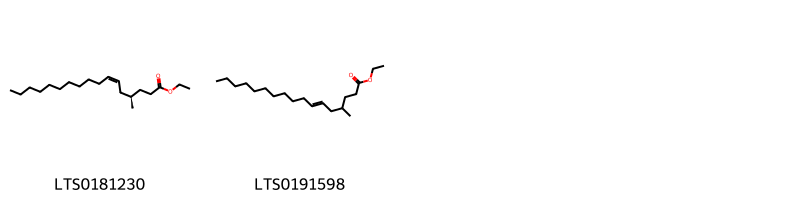
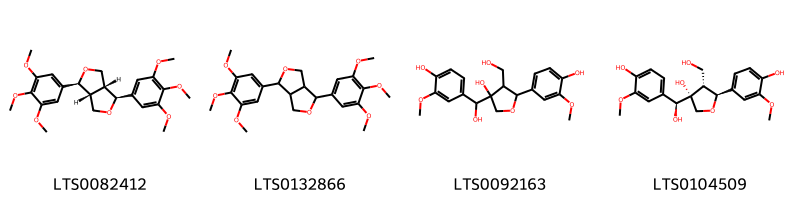
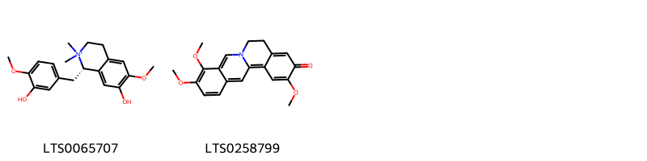
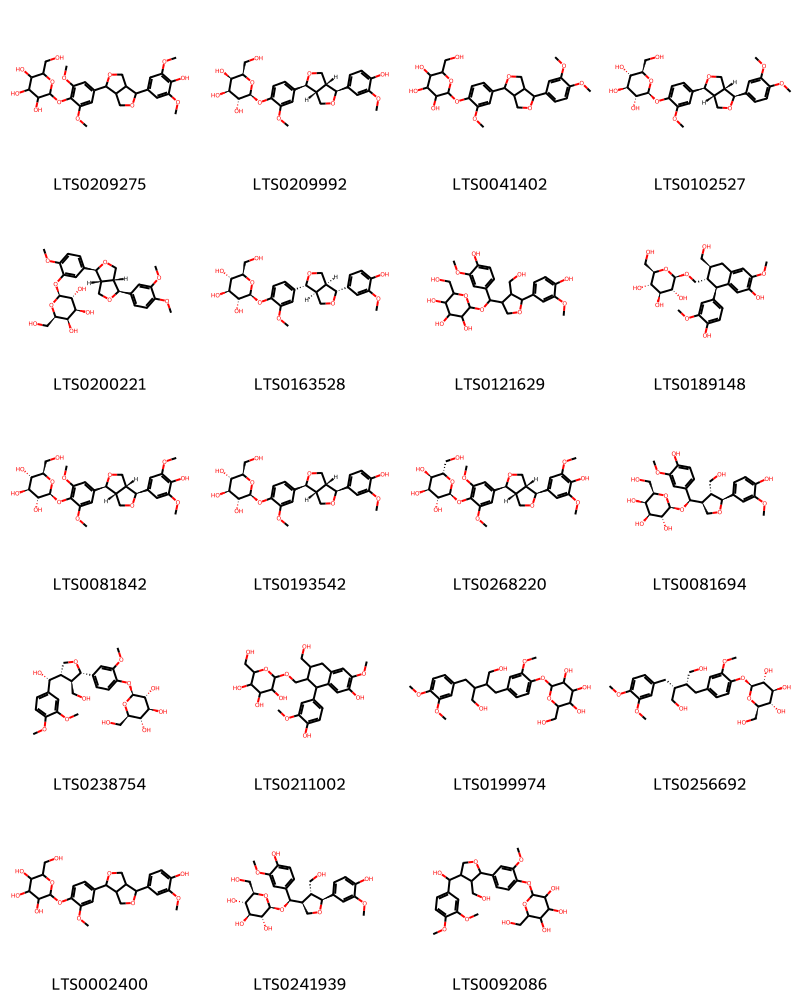
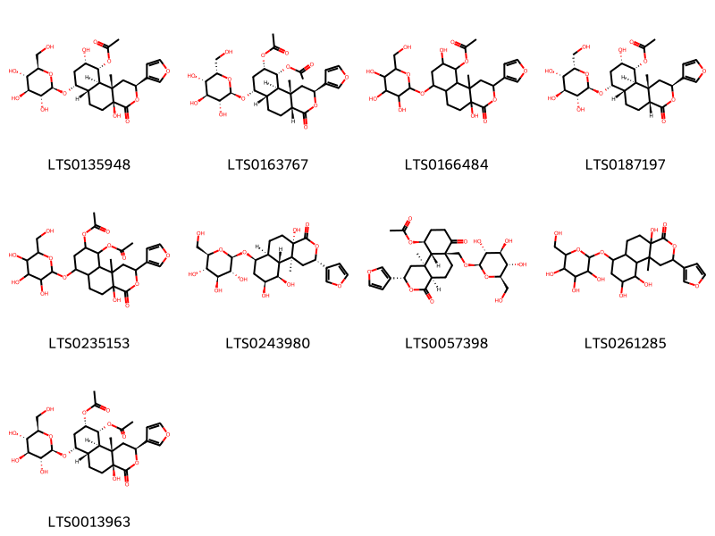
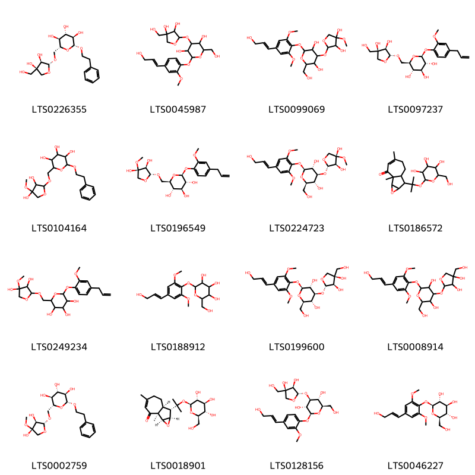
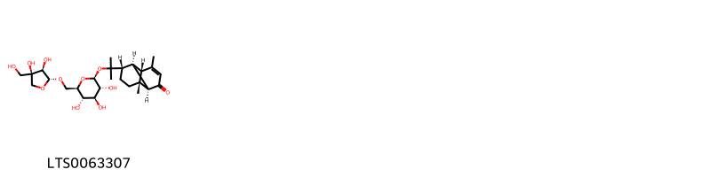
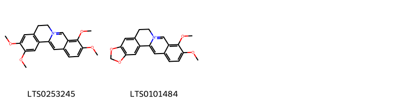
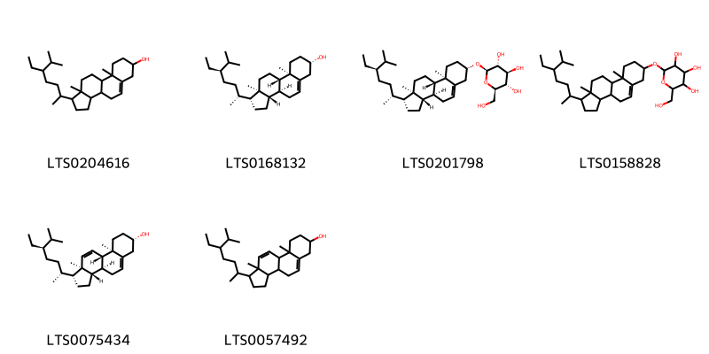

!!! abstract "Tóm tắt"
    Dược liệu Dây đau xương (Thân) tên khoa học là Caulis Tinosporae sinensis là phần thân đã thái phiến phơi hay sấy khô của cây Dây đau xương [Tinospora sinensis (Lour.) Merr.], họ Tiết dê (Menispermaceae).
Dược liệu là thân cây dây đau xương được thái thành phiến khô, dày từ 0,3 cm đến 0,5 cm, đường kính từ 0,5 cm đến 2 cm. Mặt ngoài màu nâu xám hoặc xanh xám, lớp bần mỏng dễ bong, có lỗ vỏ nổi rõ. Mặt cắt ngang màu trắng ngà hoặc vàng nhạt, phần gỗ có hình nan hoa bánh xe và ruột nhỏ ở giữa.
Cây dây đau xương phân bố rộng rãi ở Việt Nam, từ miền núi đến đồng bằng, và cũng mọc ở nhiều quốc gia như Ấn Độ, Trung Quốc, Nepal, Lào, Campuchia. Cây có tác dụng giảm đau, chống viêm, đặc biệt hiệu quả trong việc điều trị các bệnh liên quan đến phong thấp tê bại, đau nhức cơ khớp. Bên cạnh đó, cây còn được dùng ngoài để chữa các vết thương do đụng dập, sang chấn và chữa rắn cắn.
Theo y học cổ truyền, cây có tính khổ, lương, quy vào kinh can, với công năng khu phong trừ thấp, thư cân hoạt lạc. Thành phần hóa học của cây bao gồm các hợp chất như saponin và alkaloid,... Cây còn được sử dụng trong dân gian tại Ấn Độ để đắp lên vết cắn của rắn và sắc uống để điều trị nọc độc. Ở Trung Quốc, toàn bộ cây bỏ rễ và quả được sử dụng để chữa phong thấp, viêm mạch máu, trĩ, vết thương do dao, đạn và còn dùng để diệt chấy rận.

## Thông tin về thực vật

### Đặc điểm thực vật

Dược liệu **Dây Đau Xương (Thân)** từ bộ phận **nan** từ loài *Tinospora sinensis (Lour.) Merr.* thuộc họ Menispermaceae. Dây đau xương là một loại cây leo, dài 7-8m, có cành dài rũ xuống, lúc đầu có lông, sau thì nhẵn, có bì không sần sùi, mang lông. Lá có lông, nhất là ở mặt dưới làm cho mặt dưới có màu trắng nhạt, phiến lá hình tim, phía cuống tròn và hõm lại, phía đỉnh hẹp lại thành mũi nhọn, dài 10-12cm, rộng 8-10cm, có 5 gân rõ, tỏa hình chân vịt. Hoa mọc thành chùm ở kẽ lá hoặc đơn độc, hoặc mấy chùm tụ lại, chùm dài chừng 10cm, có lông măng, màu trắng nhạt. Quả hạch, khi chín có màu đỏ, có dịch nhầy, hạch hình bán cầu, mặt phẳng của bán cầu hõm lại. Mùa quả ở miền Bắc: tháng 3-4. 

!!! info "Phân loại thực vật của *Tinospora sinensis*"
    - **Kingdom:** Plantae
    - **Phylum:** Tracheophyta
    - **Order:** Ranunculales
    - **Family:** Menispermaceae
    - **Genus:** Tinospora
    - **Species:** *Tinospora sinensis*

*Tài liệu tham khảo:* "Những cây thuốc và vị thuốc Việt Nam" - Đỗ Tất Lợi

 

### Loài thay thế (Nếu có)

### Phân bố trên thế giới
**Từ vườn thực vật KEW: **: - Bản địa: Assam, Bangladesh, Cambodia, China South-Central, China Southeast, East Himalaya, India, Myanmar, Nepal, Sri Lanka, Thailand, Vietnam.
- Di thực: Pakistan

**Từ CSDL GIBF** nan, Bhutan, Nepal, Viet Nam, China, Myanmar, Korea, Republic of, Bangladesh, United States of America, Japan, Chinese Taipei, India, Sri Lanka, Thailand

### Phân bố tại Việt Nam
** "Những cây thuốc và vị thuốc Việt Nam" - Đỗ Tất Lợi**: Mọc hoang khắp nơi ở Việt Nam, miền núi cũng như miền đồng bằng.
Còn có ở Ấn Độ, Nepal, Trung Quốc, Lào, Campuchia.

**Từ CSDL GIBF**: Hải Phòng, Ninh Binh

---

## Thông tin về dược liệu 

### Định danh

!!! info "Thông tin về tên gọi của nan"
    - Dược liệu tiếng Việt: nan
    - Dược liệu tiếng Trung: nan (nan)
    - Dược liệu tiếng Anh: nan
    - Dược liệu latin thông dụng: nan
    - Dược liệu latin kiểu DĐVN: caulis tinosporae sinensis
    - Dược liệu latin kiểu DĐVN: nan
    - Dược liệu latin kiểu thông tư: nan
    - Bộ phận dùng: nan (nan)

### Mô tả dược liệu 
- **Theo dược điển Việt nam V:** nan

- **Mô tả dược liệu theo thông tư chế biến dược liệu theo phương pháp cổ truyền:** nan

### Chế biến 

- **Chế biến theo dược điển việt nam V**: nan

- **Chế biến theo thông tư:** nan

--- 

## Thành phần hóa học

- Theo tài liệu của GS. Đỗ Tất Lợi:  (1) Saponin, Alkaloid
(2) Saponin
    
- Theo cơ sở dữ liệu lotus: Từ loài *Tinospora sinensis* đã phân lập và xác định được 64 hoạt chất thuộc về các nhóm Lignan glycosides, Organonitrogen compounds, Organooxygen compounds, Protoberberine alkaloids and derivatives, Steroids and steroid derivatives, Fatty Acyls, Prenol lipids, Furanoid lignans, Isoquinolines and derivatives, Naphthopyrans, Cinnamic acids and derivatives. 

|    | chemicalTaxonomyClassyfireClass          |   smiles_count |
|---:|:-----------------------------------------|---------------:|
|  0 | Cinnamic acids and derivatives           |              2 |
|  1 | Fatty Acyls                              |              2 |
|  2 | Furanoid lignans                         |              4 |
|  3 | Isoquinolines and derivatives            |              2 |
|  4 | Lignan glycosides                        |             19 |
|  5 | Naphthopyrans                            |              9 |
|  6 | Organonitrogen compounds                 |              1 |
|  7 | Organooxygen compounds                   |             16 |
|  8 | Prenol lipids                            |              1 |
|  9 | Protoberberine alkaloids and derivatives |              2 |
| 10 | Steroids and steroid derivatives         |              6 |

### Nhóm Cinnamic acids and derivatives
<figure markdown="span">
    { width=100% }
    <figcaption>Hình ảnh cấu trúc hóa học của 2 hoạt chất thuộc nhóm Cinnamic acids and derivatives gồm ['3-(4-hydroxyphenyl)-n-[2-(4-hydroxyphenyl)ethyl]prop-2-enimidic acid (LTS0104591)', '(2e)-3-(4-hydroxyphenyl)-n-[2-(4-hydroxyphenyl)ethyl]prop-2-enimidic acid (LTS0067822)'].</figcaption>
</figure>
### Nhóm Fatty Acyls
<figure markdown="span">
    { width=100% }
    <figcaption>Hình ảnh cấu trúc hóa học của 2 hoạt chất thuộc nhóm Fatty Acyls gồm ['ethyl (4r,6z)-4-methylheptadec-6-enoate (LTS0181230)', 'ethyl 4-methylheptadec-6-enoate (LTS0191598)'].</figcaption>
</figure>
### Nhóm Furanoid lignans
<figure markdown="span">
    { width=100% }
    <figcaption>Hình ảnh cấu trúc hóa học của 4 hoạt chất thuộc nhóm Furanoid lignans gồm ['( )-yangabin (LTS0082412)', '1,4-bis(3,4,5-trimethoxyphenyl)-hexahydrofuro[3,4-c]furan (LTS0132866)', '3-[hydroxy(4-hydroxy-3-methoxyphenyl)methyl]-5-(4-hydroxy-3-methoxyphenyl)-4-(hydroxymethyl)oxolan-3-ol (LTS0092163)', '(3r,4r,5s)-3-[(s)-hydroxy(4-hydroxy-3-methoxyphenyl)methyl]-5-(4-hydroxy-3-methoxyphenyl)-4-(hydroxymethyl)oxolan-3-ol (LTS0104509)'].</figcaption>
</figure>
### Nhóm Isoquinolines and derivatives
<figure markdown="span">
    { width=100% }
    <figcaption>Hình ảnh cấu trúc hóa học của 2 hoạt chất thuộc nhóm Isoquinolines and derivatives gồm ['(1s)-7-hydroxy-1-[(3-hydroxy-4-methoxyphenyl)methyl]-6-methoxy-2,2-dimethyl-3,4-dihydro-1h-isoquinolin-2-ium (LTS0065707)', '3,4,11-trimethoxy-7,8-dihydro-6-azatetraphen-10-one (LTS0258799)'].</figcaption>
</figure>
### Nhóm Lignan glycosides
<figure markdown="span">
    { width=100% }
    <figcaption>Hình ảnh cấu trúc hóa học của 19 hoạt chất thuộc nhóm Lignan glycosides gồm ['2-{4-[4-(4-hydroxy-3,5-dimethoxyphenyl)-hexahydrofuro[3,4-c]furan-1-yl]-2,6-dimethoxyphenoxy}-6-(hydroxymethyl)oxane-3,4,5-triol (LTS0209275)', '(2s,3r,4s,5r,6r)-2-{4-[(1s,3ar,4s,6ar)-4-(4-hydroxy-3-methoxyphenyl)-hexahydrofuro[3,4-c]furan-1-yl]-2-methoxyphenoxy}-6-(hydroxymethyl)oxane-3,4,5-triol (LTS0209992)', 'phillyrin (LTS0041402)', '(2s,3r,4s,5s,6r)-2-{4-[(1s,3ar,4s,6ar)-4-(3,4-dimethoxyphenyl)-hexahydrofuro[3,4-c]furan-1-yl]-2-methoxyphenoxy}-6-(hydroxymethyl)oxane-3,4,5-triol (LTS0102527)', '(2s,3r,4s,5r,6r)-2-{5-[(1s,3ar,4s,6ar)-4-(3,4-dimethoxyphenyl)-hexahydrofuro[3,4-c]furan-1-yl]-2-methoxyphenoxy}-6-(hydroxymethyl)oxane-3,4,5-triol (LTS0200221)', '(-)-pinoresinol glucoside (LTS0163528)', '2-[(4-hydroxy-3-methoxyphenyl)[5-(4-hydroxy-3-methoxyphenyl)-4-(hydroxymethyl)oxolan-3-yl]methoxy]-6-(hydroxymethyl)oxane-3,4,5-triol (LTS0121629)', '(2r,3r,4s,5s,6r)-2-{[(1r,2s,3s)-7-hydroxy-1-(4-hydroxy-3-methoxyphenyl)-3-(hydroxymethyl)-6-methoxy-1,2,3,4-tetrahydronaphthalen-2-yl]methoxy}-6-(hydroxymethyl)oxane-3,4,5-triol (LTS0189148)', 'acanthoside b (LTS0081842)', '(2s,3r,4s,5s,6r)-2-{4-[(1s,3ar,4s,6ar)-4-(4-hydroxy-3-methoxyphenyl)-hexahydrofuro[3,4-c]furan-1-yl]-2-methoxyphenoxy}-6-(hydroxymethyl)oxane-3,4,5-triol (LTS0193542)', '(2s,3r,4s,5r,6s)-2-{4-[(1s,3ar,4s,6ar)-4-(4-hydroxy-3,5-dimethoxyphenyl)-hexahydrofuro[3,4-c]furan-1-yl]-2,6-dimethoxyphenoxy}-6-(hydroxymethyl)oxane-3,4,5-triol (LTS0268220)', '(2r,3r,4s,5r,6r)-2-[(r)-(4-hydroxy-3-methoxyphenyl)[(3s,4r,5s)-5-(4-hydroxy-3-methoxyphenyl)-4-(hydroxymethyl)oxolan-3-yl]methoxy]-6-(hydroxymethyl)oxane-3,4,5-triol (LTS0081694)', '(2s,3r,4s,5s,6r)-2-{4-[(2s,3r,4s)-4-[(r)-(3,4-dimethoxyphenyl)(hydroxy)methyl]-3-(hydroxymethyl)oxolan-2-yl]-2-methoxyphenoxy}-6-(hydroxymethyl)oxane-3,4,5-triol (LTS0238754)', '2-{[7-hydroxy-1-(4-hydroxy-3-methoxyphenyl)-3-(hydroxymethyl)-6-methoxy-1,2,3,4-tetrahydronaphthalen-2-yl]methoxy}-6-(hydroxymethyl)oxane-3,4,5-triol (LTS0211002)', '2-(4-{3-[(3,4-dimethoxyphenyl)methyl]-4-hydroxy-2-(hydroxymethyl)butyl}-2-methoxyphenoxy)-6-(hydroxymethyl)oxane-3,4,5-triol (LTS0199974)', '(2s,3r,4s,5s,6r)-2-{4-[(2r,3r)-3-[(3,4-dimethoxyphenyl)methyl]-4-hydroxy-2-(hydroxymethyl)butyl]-2-methoxyphenoxy}-6-(hydroxymethyl)oxane-3,4,5-triol (LTS0256692)', '2-{4-[4-(4-hydroxy-3-methoxyphenyl)-hexahydrofuro[3,4-c]furan-1-yl]-2-methoxyphenoxy}-6-(hydroxymethyl)oxane-3,4,5-triol (LTS0002400)', '(2r,3r,4s,5s,6r)-2-[(r)-(4-hydroxy-3-methoxyphenyl)[(3s,4r,5s)-5-(4-hydroxy-3-methoxyphenyl)-4-(hydroxymethyl)oxolan-3-yl]methoxy]-6-(hydroxymethyl)oxane-3,4,5-triol (LTS0241939)', '2-(4-{4-[(3,4-dimethoxyphenyl)(hydroxy)methyl]-3-(hydroxymethyl)oxolan-2-yl}-2-methoxyphenoxy)-6-(hydroxymethyl)oxane-3,4,5-triol (LTS0092086)'].</figcaption>
</figure>
### Nhóm Naphthopyrans
<figure markdown="span">
    { width=100% }
    <figcaption>Hình ảnh cấu trúc hóa học của 9 hoạt chất thuộc nhóm Naphthopyrans gồm ['(2s,4as,6as,7r,9s,10r,10ar,10bs)-2-(furan-3-yl)-4a,9-dihydroxy-10b-methyl-4-oxo-7-{[(2r,3r,4s,5s,6r)-3,4,5-trihydroxy-6-(hydroxymethyl)oxan-2-yl]oxy}-decahydronaphtho[2,1-c]pyran-10-yl acetate (LTS0135948)', '(2s,4ar,6as,7r,9s,10r,10ar,10bs)-9-(acetyloxy)-2-(furan-3-yl)-10b-methyl-4-oxo-7-{[(2r,3r,4s,5s,6s)-3,4,5-trihydroxy-6-(hydroxymethyl)oxan-2-yl]oxy}-decahydro-1h-naphtho[2,1-c]pyran-10-yl acetate (LTS0163767)', '2-(furan-3-yl)-4a,9-dihydroxy-10b-methyl-4-oxo-7-{[3,4,5-trihydroxy-6-(hydroxymethyl)oxan-2-yl]oxy}-decahydronaphtho[2,1-c]pyran-10-yl acetate (LTS0166484)', '(2s,4ar,6as,7r,9s,10r,10ar,10bs)-2-(furan-3-yl)-9-hydroxy-10b-methyl-4-oxo-7-{[(2r,3r,4s,5s,6s)-3,4,5-trihydroxy-6-(hydroxymethyl)oxan-2-yl]oxy}-decahydro-1h-naphtho[2,1-c]pyran-10-yl acetate (LTS0187197)', '9-(acetyloxy)-2-(furan-3-yl)-4a-hydroxy-10b-methyl-4-oxo-7-{[3,4,5-trihydroxy-6-(hydroxymethyl)oxan-2-yl]oxy}-decahydronaphtho[2,1-c]pyran-10-yl acetate (LTS0235153)', '(2s,4as,6as,7r,9s,10r,10ar,10bs)-2-(furan-3-yl)-4a,9,10-trihydroxy-10b-methyl-7-{[(2r,3r,4s,5s,6r)-3,4,5-trihydroxy-6-(hydroxymethyl)oxan-2-yl]oxy}-decahydronaphtho[2,1-c]pyran-4-one (LTS0243980)', '(2s,4ar,6ar,10s,10as,10bs)-2-(furan-3-yl)-10b-methyl-4,7-dioxo-6a-({[(2r,3r,4s,5s,6r)-3,4,5-trihydroxy-6-(hydroxymethyl)oxan-2-yl]oxy}methyl)-octahydro-1h-naphtho[2,1-c]pyran-10-yl acetate (LTS0057398)', '2-(furan-3-yl)-4a,9,10-trihydroxy-10b-methyl-7-{[3,4,5-trihydroxy-6-(hydroxymethyl)oxan-2-yl]oxy}-decahydronaphtho[2,1-c]pyran-4-one (LTS0261285)', '(2s,4as,6as,7r,9s,10r,10ar,10bs)-9-(acetyloxy)-2-(furan-3-yl)-4a-hydroxy-10b-methyl-4-oxo-7-{[(2r,3r,4s,5s,6r)-3,4,5-trihydroxy-6-(hydroxymethyl)oxan-2-yl]oxy}-decahydronaphtho[2,1-c]pyran-10-yl acetate (LTS0013963)'].</figcaption>
</figure>
### Nhóm Organonitrogen compounds
<figure markdown="span">
    { width=100% }
    <figcaption>Hình ảnh cấu trúc hóa học của 1 hoạt chất thuộc nhóm Organonitrogen compounds gồm ['choline (LTS0170307)'].</figcaption>
</figure>
### Nhóm Organooxygen compounds
<figure markdown="span">
    { width=100% }
    <figcaption>Hình ảnh cấu trúc hóa học của 16 hoạt chất thuộc nhóm Organooxygen compounds gồm ['(2r,3s,4s,5r,6r)-2-({[(2r,3r,4r)-3,4-dihydroxy-4-(hydroxymethyl)oxolan-2-yl]oxy}methyl)-6-(2-phenylethoxy)oxane-3,4,5-triol (LTS0226355)', '4-{[3,4-dihydroxy-4-(hydroxymethyl)oxolan-2-yl]oxy}-2-(hydroxymethyl)-6-[4-(3-hydroxyprop-1-en-1-yl)-2-methoxyphenoxy]oxane-3,5-diol (LTS0045987)', '4-[(3,4-dihydroxy-4-methoxyoxolan-2-yl)oxy]-2-(hydroxymethyl)-6-[4-(3-hydroxyprop-1-en-1-yl)-2,6-dimethoxyphenoxy]oxane-3,5-diol (LTS0099069)', '(2r,3s,4s,5r,6s)-2-({[(2r,3r,4r)-3,4-dihydroxy-4-(hydroxymethyl)oxolan-2-yl]oxy}methyl)-6-[2-methoxy-4-(prop-2-en-1-yl)phenoxy]oxane-3,4,5-triol (LTS0097237)', '2-{[(3,4-dihydroxy-4-methoxyoxolan-2-yl)oxy]methyl}-6-(2-phenylethoxy)oxane-3,4,5-triol (LTS0104164)', '(2r,3s,4s,5r,6s)-2-({[(2r,3s,4s)-3,4-dihydroxy-4-methoxyoxolan-2-yl]oxy}methyl)-6-[2-methoxy-4-(prop-2-en-1-yl)phenoxy]oxane-3,4,5-triol (LTS0196549)', '(2r,3r,4s,5r,6s)-4-{[(2s,3s,4s)-3,4-dihydroxy-4-methoxyoxolan-2-yl]oxy}-2-(hydroxymethyl)-6-{4-[(1e)-3-hydroxyprop-1-en-1-yl]-2,6-dimethoxyphenoxy}oxane-3,5-diol (LTS0224723)', '1b,4-dimethyl-7-(2-{[3,4,5-trihydroxy-6-(hydroxymethyl)oxan-2-yl]oxy}propan-2-yl)-1ah,5h,6h,6ah,7h,7ah-azuleno[1,2-b]oxiren-2-one (LTS0186572)', '2-{[(3,4-dihydroxy-4-methoxyoxolan-2-yl)oxy]methyl}-6-[2-methoxy-4-(prop-2-en-1-yl)phenoxy]oxane-3,4,5-triol (LTS0249234)', '2-(hydroxymethyl)-6-[4-(3-hydroxyprop-1-en-1-yl)-2,6-dimethoxyphenoxy]oxane-3,4,5-triol (LTS0188912)', '(2r,3r,4s,5r,6s)-4-{[(2s,3r,4r)-3,4-dihydroxy-4-(hydroxymethyl)oxolan-2-yl]oxy}-2-(hydroxymethyl)-6-{4-[(1e)-3-hydroxyprop-1-en-1-yl]-2,6-dimethoxyphenoxy}oxane-3,5-diol (LTS0199600)', '4-{[3,4-dihydroxy-4-(hydroxymethyl)oxolan-2-yl]oxy}-2-(hydroxymethyl)-6-[4-(3-hydroxyprop-1-en-1-yl)-2,6-dimethoxyphenoxy]oxane-3,5-diol (LTS0008914)', '(2r,3s,4s,5r,6r)-2-({[(2r,3s,4s)-3,4-dihydroxy-4-methoxyoxolan-2-yl]oxy}methyl)-6-(2-phenylethoxy)oxane-3,4,5-triol (LTS0002759)', '(1as,1bs,6as,7s,7ar)-1b,4-dimethyl-7-(2-{[(2s,3r,4s,5s,6r)-3,4,5-trihydroxy-6-(hydroxymethyl)oxan-2-yl]oxy}propan-2-yl)-1ah,5h,6h,6ah,7h,7ah-azuleno[1,2-b]oxiren-2-one (LTS0018901)', '(2r,3r,4s,5r,6s)-4-{[(2s,3r,4r)-3,4-dihydroxy-4-(hydroxymethyl)oxolan-2-yl]oxy}-2-(hydroxymethyl)-6-{4-[(1e)-3-hydroxyprop-1-en-1-yl]-2-methoxyphenoxy}oxane-3,5-diol (LTS0128156)', 'syringin (LTS0046227)'].</figcaption>
</figure>
### Nhóm Prenol lipids
<figure markdown="span">
    { width=100% }
    <figcaption>Hình ảnh cấu trúc hóa học của 1 hoạt chất thuộc nhóm Prenol lipids gồm ['(1r,2r,6r,7r,8s)-8-(2-{[(2s,3r,4s,5s,6r)-6-({[(2r,3r,4r)-3,4-dihydroxy-4-(hydroxymethyl)oxolan-2-yl]oxy}methyl)-3,4,5-trihydroxyoxan-2-yl]oxy}propan-2-yl)-1,5-dimethyltricyclo[4.4.0.0²,⁷]dec-4-en-3-one (LTS0063307)'].</figcaption>
</figure>
### Nhóm Protoberberine alkaloids and derivatives
<figure markdown="span">
    { width=100% }
    <figcaption>Hình ảnh cấu trúc hóa học của 2 hoạt chất thuộc nhóm Protoberberine alkaloids and derivatives gồm ['palmatine (LTS0253245)', 'berberine (LTS0101484)'].</figcaption>
</figure>
### Nhóm Steroids and steroid derivatives
<figure markdown="span">
    { width=100% }
    <figcaption>Hình ảnh cấu trúc hóa học của 6 hoạt chất thuộc nhóm Steroids and steroid derivatives gồm ['stigmast-5-en-3-ol, (3β)- (LTS0204616)', 'sitosterol (LTS0168132)', 'sitogluside (LTS0201798)', '2-{[1-(5-ethyl-6-methylheptan-2-yl)-9a,11a-dimethyl-1h,2h,3h,3ah,3bh,4h,6h,7h,8h,9h,9bh,10h,11h-cyclopenta[a]phenanthren-7-yl]oxy}-6-(hydroxymethyl)oxane-3,4,5-triol (LTS0158828)', '(1r,3as,3bs,7s,9ar,9bs,11ar)-1-[(2r,5r)-5-ethyl-6-methylheptan-2-yl]-9a,11a-dimethyl-1h,2h,3h,3ah,3bh,4h,6h,7h,8h,9h,9bh-cyclopenta[a]phenanthren-7-ol (LTS0075434)', '1-(5-ethyl-6-methylheptan-2-yl)-9a,11a-dimethyl-1h,2h,3h,3ah,3bh,4h,6h,7h,8h,9h,9bh-cyclopenta[a]phenanthren-7-ol (LTS0057492)'].</figcaption>
</figure>

---

## Tác dụng dược lý

Theo tài liệu "Những cây thuốc và vị thuốc Việt Nam" - Đỗ Tất Lợi:- Giảm đau, chống viêm

Theo tài liệu quốc tế: nan

---

## Dược điển Việt Nam V

### Soi bột:
nan
<!-- Hình ảnh soi bột sẽ được tự động chèn vào đây sau -->
### Vi phẫu:
nan
<!-- Hình ảnh vi phẫu sẽ được tự động chèn vào đây sau -->
### Định tính

nan

### Định lượng

nan

### Thông tin khác 
- ** Độ ẩm: ** nan

- ** Bảo quản:** nan
## Dược điển Hồng kong

<!-- PDF sẽ được tự động chèn vào đây sau -->

---

## Y dược học cổ truyền

- **Tên vị thuốc:** nan
- **Tính vị quy kinh:** Khổ, lương. Quy vào kinh can.
- **Công năng chủ trị:** Khu phong trừ thấp, thư cân hoạt lạc.
Chủ trị: Phong thấp tê bại, đau nhức cơ khớp.
Dùng ngoài chữa đụng dập, sang chấn, rắn cắn.
- **Chú ý:** nan
- **Kiêng kỵ:** nan

