!!! abstract "Tóm tắt"
    - Gừng có tên khoa học là Zingiber officinale thuộc họ Gừng (Zingiberaceae)
- Phân bố: Gừng có nguồn gốc từ các khu vực nhiệt đới của châu Á, đặc biệt là Đông Nam Á. Gừng được trồng trên khắp đất nước Việt Nam.
- Tác dụng dược lý:
   + Hỗ trợ tiêu hoá
   + Chữa ho mất tiếng
   + Giảm đau
   + Kháng viêm
   + Chống oxy hoá
   + Làm ấm cơ thể
   + Hỗ trợ điều trị cảm cúm
- Kinh nghiệm dân gian:
   + Làm ấm cơ thể: Giúp cơ thể ấm áp vào mùa đông
   + Chống nôn: Giảm cảm giác buồn nôn, say tàu xe
   + Chữa đau bụng, tiêu chảy và các vấn đề về tiêu hoá: đầy hơi, chướng bụng…
- Thành phần hoá học:
   + Tinh dầu: Là thành phần quan trọng nhất, gồm các hợp chất như gingerol, shogaol, zingiberen.
   + Các hợp chất phenolic: Như curcumin, có tác dụng chống viêm và chống oxy hoá mạnh.
   + Các vitamin và khoáng chất: Gừng chứa một lượng nhỏ các vitamin như vitamin C, vitamin B6 và các khoáng chất như kali, magie.

## Thông tin về thực vật

### Đặc điểm thực vật

Dược liệu **Gừng (Thân Rễ)** từ bộ phận **Thân rễ** từ loài *Zingiber officinale Rose.* thuộc họ Zingiberaceae. - Gừng là một loại cây nhỏ, sống lâu năm, cao 0,60 đến 1m. 
- Thân rễ mẫm lên thành củ, lâu dần thành xơ.
- Lá mọc so le, không cuống, có bẹ, hình mác dài 15 đến 20cm, rộng chừng 2cm, mặt bóng nhẵn, gân giữa hơi trắng nhạt, vò có mùi thơm. 
- Trục hoa xuất phát từ gốc, dài tới 20cm, cụm hoa thành bông mọc sít nhau, hoa dài 5cm, rộng 2-3cm, lá bắc hình trứng, dài 2.5cm, mép lưng màu vàng, đài hoa dài chừng 1cm, có 3 răng ngắn, 3 cành hoa dài chừng 2cm, màu vàng xanh, mép cánh hoa màu tím, nhị cũng tím. 
- Loài gừng trồng ít ra hoa. 

!!! info "Phân loại thực vật của *Zingiber officinale*"
    - **Kingdom:** Plantae
    - **Phylum:** Tracheophyta
    - **Order:** Zingiberales
    - **Family:** Zingiberaceae
    - **Genus:** Zingiber
    - **Species:** *Zingiber officinale*

*Tài liệu tham khảo:* "Những cây thuốc và vị thuốc Việt Nam" - Đỗ Tất Lợi

 

### Loài thay thế (Nếu có)

### Phân bố trên thế giới
**Từ vườn thực vật KEW: **: Introduced into:
Andaman Is., Bangladesh, Borneo, Cambodia, Caroline Is., China Southeast, Comoros, Costa Rica, Cuba, Dominican Republic, Gulf of Guinea Is., Hainan, Haiti, Honduras, Leeward Is., Lesser Sunda Is., Madagascar, Malaya, Mauritius, Mexico Southwest, Myanmar, New Guinea, Nicobar Is., Philippines, Puerto Rico, Queensland, Rodrigues, Réunion, Solomon Is., Sri Lanka, Taiwan, Thailand, Trinidad-Tobago, Vanuatu, Windward Is.

**Từ CSDL GIBF** nan, Réunion, Australia, Puerto Rico, Cambodia, Germany, Madagascar, Haiti, Malaysia, Pakistan, Thailand, Guadeloupe, Bolivia (Plurinational State of), Brazil, Guatemala, Indonesia, Hong Kong, India, Mexico, Panama, Costa Rica, Seychelles, Nicaragua, Iraq, Colombia, Ecuador, United Kingdom of Great Britain and Northern Ireland, China, Japan, Mayotte, French Guiana, Sierra Leone, El Salvador, Philippines, Martinique, Dominican Republic, Trinidad and Tobago, Nepal, Viet Nam, United States of America, Chinese Taipei, Sri Lanka

### Phân bố tại Việt Nam
** "Những cây thuốc và vị thuốc Việt Nam" - Đỗ Tất Lợi**: Gừng mọc hoang và được trồng ở khắp nơi trên cả nước Việt Nam

**Từ CSDL GIBF**: Hà Nội

---

## Thông tin về dược liệu 

### Định danh

!!! info "Thông tin về tên gọi của gừng"
    - Dược liệu tiếng Việt: gừng
    - Dược liệu tiếng Trung: 干姜 (Gan Jiang)
    - Dược liệu tiếng Anh: Zingiber Officinale
    - Dược liệu latin thông dụng: Rhizoma Zingiberis
    - Dược liệu latin kiểu DĐVN: rhizoma zingiberis
    - Dược liệu latin kiểu DĐVN: None
    - Dược liệu latin kiểu thông tư: None
    - Bộ phận dùng: Thân rễ (Rhizoma)

### Mô tả dược liệu 
- **Theo dược điển Việt nam V:** 
Thân rễ (quen gọi là củ) không có hình dạng nhất định, thường phân nhánh, dài 3 cm đến 7 cm. dày 0,5 cm đến  5 cm. Mặt ngoài màu trắng tro hay vàng nhạt, có vết nhăn dọc. Đỉnh các nhánh có đỉnh sinh trưởng của thân rễ. vết bẻ màu trắng tro hoặc ngà vàng, có bột, vân tròn rõ. Mặt cắt ngang có sợi thưa. Mùi thơm, vị cay nóng.

- **Mô tả dược liệu theo thông tư chế biến dược liệu theo phương pháp cổ truyền:** 

### Chế biến 

- **Chế biến theo dược điển việt nam V**: 
Thân rễ. Thu hoạch vào mùa đông. Muốn giữ tươi lâu, đặt gừng vào chậu, phủ cát lên. Gừng tươi là sinh khương, gừng khô là can khương.nĐào lấy củ gừng già, rửa sạch, phơi hoặc sấy đến khô (can khương). Khi dùng có thể sao vàng hoặc sao cháy (thán khương).nn

- **Chế biến theo thông tư:** 

--- 

## Thành phần hóa học

- Theo tài liệu của GS. Đỗ Tất Lợi:  Trong tinh dầu gừng chứa nhiều hợp chất khác nhau, nhưng nổi bật nhất là các hợp chất sesquiterpen như:
  - Zingiberen: Là thành phần chủ yếu, tạo nên hương thơm đặc trưng của gừng.
  - Shogaol: Đóng vai trò quan trọng trong việc tạo ra vị cay nồng và có hoạt tính chống oxy hóa mạnh.
  - Zingerone: Là một chất phenolic, tạo vị cay và có tác dụng chống viêm.
Các hợp chất khác
  - Gingerol: Là một loạt các hợp chất phenolic, có tác dụng chống viêm, giảm đau và chống oxy hóa.
  - Curcumin: Mặc dù thường được liên kết với nghệ, nhưng một lượng nhỏ curcumin cũng có mặt trong gừng, góp phần tăng cường tác dụng chống viêm và chống oxy hóa.
  - Các vitamin và khoáng chất: Gừng chứa một lượng nhỏ các vitamin như vitamin C, vitamin B6 và các khoáng chất như kali, magie.
    
- Theo cơ sở dữ liệu lotus: Từ loài *Zingiber officinale* đã phân lập và xác định được 383 hoạt chất thuộc về các nhóm Harmala alkaloids, Lactones, Imidazopyrimidines, Benzene and substituted derivatives, Thioethers, Indoles and derivatives, Tetrahydrofurans, Heteroaromatic compounds, Pyrans, Pyrimidine nucleosides, Oxanes, Saccharolipids, Steroids and steroid derivatives, Epoxides, Phenols, Glycerolipids, Cinnamic acids and derivatives, Organooxygen compounds, Diarylheptanoids, Prenol lipids, Fatty Acyls, Phenylpropanoic acids, Saturated hydrocarbons, Phenol esters, Carboxylic acids and derivatives, Unsaturated hydrocarbons. 

|    | chemicalTaxonomyClassyfireClass     |   smiles_count |
|---:|:------------------------------------|---------------:|
|  0 | Benzene and substituted derivatives |             18 |
|  1 | Carboxylic acids and derivatives    |              2 |
|  2 | Cinnamic acids and derivatives      |             14 |
|  3 | Diarylheptanoids                    |             66 |
|  4 | Epoxides                            |              1 |
|  5 | Fatty Acyls                         |             27 |
|  6 | Glycerolipids                       |              9 |
|  7 | Harmala alkaloids                   |              1 |
|  8 | Heteroaromatic compounds            |              2 |
|  9 | Imidazopyrimidines                  |              3 |
| 10 | Indoles and derivatives             |              1 |
| 11 | Lactones                            |              2 |
| 12 | Organooxygen compounds              |             20 |
| 13 | Oxanes                              |              3 |
| 14 | Phenol esters                       |              2 |
| 15 | Phenols                             |             77 |
| 16 | Phenylpropanoic acids               |              1 |
| 17 | Prenol lipids                       |            116 |
| 18 | Pyrans                              |              1 |
| 19 | Pyrimidine nucleosides              |              1 |
| 20 | Saccharolipids                      |              1 |
| 21 | Saturated hydrocarbons              |              3 |
| 22 | Steroids and steroid derivatives    |              5 |
| 23 | Tetrahydrofurans                    |              1 |
| 24 | Thioethers                          |              1 |
| 25 | Unsaturated hydrocarbons            |              1 |

### Nhóm Benzene and substituted derivatives
<figure markdown="span">
    { width=100% }
    <figcaption>Hình ảnh cấu trúc hóa học của 18 hoạt chất thuộc nhóm Benzene and substituted derivatives gồm ['(3r,5s)-1-(3,4-dimethoxyphenyl)decane-3,5-diol (LTS0077771)', '1-(3,4-dimethoxyphenyl)decane-3,5-diol (LTS0051201)', '1-[4-hydroxy-3-(hydroxymethyl)phenyl]tetradec-4-en-3-one (LTS0159826)', '(4e)-1-[4-hydroxy-3-(hydroxymethyl)phenyl]tetradec-4-en-3-one (LTS0100571)', '1-(3,4-dimethoxyphenyl)-5-hydroxydecan-3-one (LTS0102243)', "[1,1'-biphenyl]-3-carbaldehyde (LTS0067525)", '1-[4-hydroxy-3-(hydroxymethyl)phenyl]dec-4-en-3-one (LTS0145591)', 'benzaldehyde (LTS0094193)', 'vanillate (LTS0253904)', '(5s)-1-(3,4-dimethoxyphenyl)-5-hydroxydecan-3-one (LTS0256019)', '1-(3,4-dimethoxyphenyl)decan-3-one (LTS0102731)', '(4e)-1-(3,4-dimethoxyphenyl)dec-4-en-3-one (LTS0077972)', '4-(3,4-dimethoxyphenyl)butan-2-one (LTS0223473)', '4-biphenylaldehyde (LTS0057438)', '(4e)-1-(3,4-dimethoxyphenyl)dodec-4-en-3-one (LTS0267899)', '3,4-dimethoxyphenylacetic acid (LTS0271925)', '(4e)-1-[4-hydroxy-3-(hydroxymethyl)phenyl]dec-4-en-3-one (LTS0264518)', 'p-cymen-8-ol (LTS0223641)'].</figcaption>
</figure>
### Nhóm Carboxylic acids and derivatives
<figure markdown="span">
    { width=100% }
    <figcaption>Hình ảnh cấu trúc hóa học của 2 hoạt chất thuộc nhóm Carboxylic acids and derivatives gồm ['ethyl acetate (LTS0196824)', 'oxalic acid (LTS0217707)'].</figcaption>
</figure>
### Nhóm Cinnamic acids and derivatives
<figure markdown="span">
    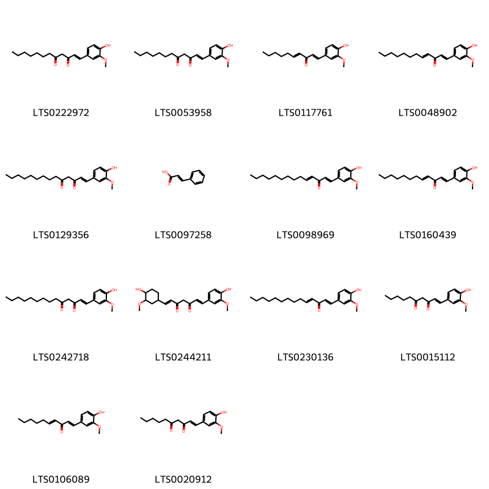{ width=100% }
    <figcaption>Hình ảnh cấu trúc hóa học của 14 hoạt chất thuộc nhóm Cinnamic acids and derivatives gồm ['(1e)-1-(4-hydroxy-3-methoxyphenyl)dodec-1-ene-3,5-dione (LTS0222972)', '1-(4-hydroxy-3-methoxyphenyl)dodec-1-ene-3,5-dione (LTS0053958)', '(1e,4e)-1-(4-hydroxy-3-methoxyphenyl)deca-1,4-dien-3-one (LTS0117761)', '(1e,4e)-1-(4-hydroxy-3-methoxyphenyl)dodeca-1,4-dien-3-one (LTS0048902)', '(1e)-1-(4-hydroxy-3-methoxyphenyl)tetradec-1-ene-3,5-dione (LTS0129356)', 'phenylacrylic acid (LTS0097258)', '1-(4-hydroxy-3-methoxyphenyl)tetradeca-1,4-dien-3-one (LTS0098969)', '1-(4-hydroxy-3-methoxyphenyl)dodeca-1,4-dien-3-one (LTS0160439)', '1-(4-hydroxy-3-methoxyphenyl)tetradec-1-ene-3,5-dione (LTS0242718)', '(1e,6e)-1-(4-hydroxy-3-methoxycyclohexyl)-7-(4-hydroxy-3-methoxyphenyl)hepta-1,6-diene-3,5-dione (LTS0244211)', '(1e,4e)-1-(4-hydroxy-3-methoxyphenyl)tetradeca-1,4-dien-3-one (LTS0230136)', '1-(4-hydroxy-3-methoxyphenyl)dec-1-ene-3,5-dione (LTS0015112)', '1-(4-hydroxy-3-methoxyphenyl)deca-1,4-dien-3-one (LTS0106089)', '(1e)-1-(4-hydroxy-3-methoxyphenyl)dec-1-ene-3,5-dione (LTS0020912)'].</figcaption>
</figure>
### Nhóm Diarylheptanoids
<figure markdown="span">
    { width=100% }
    <figcaption>Hình ảnh cấu trúc hóa học của 66 hoạt chất thuộc nhóm Diarylheptanoids gồm ['5-[(2s,4s,6s)-6-[2-(3,4-dihydroxyphenyl)ethyl]-4-hydroxyoxan-2-yl]-3-methoxybenzene-1,2-diol (LTS0117764)', '5-hydroxy-1,7-bis(4-hydroxy-3-methoxyphenyl)heptan-3-yl acetate (LTS0055885)', '(3r,5s)-5-hydroxy-1,7-bis(4-hydroxy-3-methoxyphenyl)heptan-3-yl acetate (LTS0126297)', '5-hydroxy-7-(4-hydroxy-3,5-dimethoxyphenyl)-1-(4-hydroxy-3-methoxyphenyl)heptan-3-one (LTS0059019)', '(2s,4r,6s)-2-(4-hydroxy-3,5-dimethoxyphenyl)-6-[2-(4-hydroxy-3-methoxyphenyl)ethyl]oxan-4-ol (LTS0209260)', '5-(acetyloxy)-7-(3,4-dihydroxyphenyl)-1-(4-hydroxy-3-methoxyphenyl)heptan-3-yl acetate (LTS0132283)', '(3r,5s)-1-(4-hydroxy-3,5-dimethoxyphenyl)-7-(4-hydroxy-3-methoxyphenyl)heptane-3,5-diol (LTS0201317)', '(4e)-1-(4-hydroxy-3,5-dimethoxyphenyl)-7-(4-hydroxy-3-methoxyphenyl)hept-4-en-3-one (LTS0098812)', '1-(4-hydroxy-3,5-dimethoxyphenyl)-7-(4-hydroxy-3-methoxyphenyl)hept-4-en-3-one (LTS0077863)', '1,7-bis(4-hydroxy-3-methoxyphenyl)heptane-3,5-diol (LTS0233727)', '5-(acetyloxy)-1,7-bis(4-hydroxy-3-methoxyphenyl)heptan-3-yl acetate (LTS0094590)', '1-(3,4-dihydroxyphenyl)-7-(4-hydroxy-3-methoxyphenyl)-5-oxoheptane-3-sulfonic acid (LTS0084287)', '5-(acetyloxy)-7-(4-hydroxy-3,5-dimethoxyphenyl)-1-(4-hydroxy-3-methoxyphenyl)heptan-3-yl acetate (LTS0007430)', '7-(3,4-dihydroxy-5-methoxyphenyl)-5-hydroxy-1-(4-hydroxy-3-methoxyphenyl)heptan-3-one (LTS0029629)', '(5r)-5-hydroxy-1-(4-hydroxy-3-methoxyphenyl)-7-(4-hydroxyphenyl)heptan-3-one (LTS0096483)', '(3s)-1,7-bis(4-hydroxy-3-methoxyphenyl)-5-oxoheptan-3-yl acetate (LTS0096165)', '5-hydroxy-1-(4-hydroxy-3-methoxyphenyl)-7-(4-hydroxyphenyl)heptan-3-one (LTS0184170)', '(5r)-7-(3,4-dihydroxy-5-methoxyphenyl)-5-hydroxy-1-(4-hydroxy-3-methoxyphenyl)heptan-3-one (LTS0087489)', 'gingerenone a (LTS0086301)', '5-hydroxy-1-(4-hydroxy-3,5-dimethoxyphenyl)-7-(4-hydroxy-3-methoxyphenyl)heptan-3-one (LTS0100682)', 'curcumin (LTS0114521)', '5-[(2s,4r,6s)-4-hydroxy-6-[2-(4-hydroxyphenyl)ethyl]oxan-2-yl]-3-methoxybenzene-1,2-diol (LTS0178100)', '1,7-bis(3,4-dihydroxy-5-methoxyphenyl)-5-oxoheptane-3-sulfonic acid (LTS0126249)', '(4e)-1-(4-hydroxy-3-methoxyphenyl)-7-(4-hydroxyphenyl)hept-4-en-3-one (LTS0128959)', '(5s)-5-hydroxy-1,7-bis(4-hydroxy-3-methoxyphenyl)heptan-3-one (LTS0173586)', '(3s,5s)-5-(acetyloxy)-1,7-bis(3,4-dihydroxyphenyl)heptan-3-yl acetate (LTS0266933)', '1-(4-hydroxy-3-methoxyphenyl)-7-(4-hydroxyphenyl)hept-4-en-3-one (LTS0198598)', '(3s,5r)-5-(acetyloxy)-1,7-bis(4-hydroxy-3-methoxyphenyl)heptan-3-yl acetate (LTS0193079)', '5-[(2s,4s,6s)-4-hydroxy-6-[2-(4-hydroxy-3-methoxyphenyl)ethyl]oxan-2-yl]-3-methoxybenzene-1,2-diol (LTS0150528)', '1,7-bis(4-hydroxy-3-methoxyphenyl)-5-oxoheptane-3-sulfonic acid (LTS0150892)', '1-(4-hydroxy-3,5-dimethoxyphenyl)-7-(4-hydroxy-3-methoxyphenyl)heptane-3,5-diol (LTS0153120)', '1,7-bis(4-hydroxy-3-methoxyphenyl)-5-oxoheptan-3-yl acetate (LTS0097904)', '(3s)-1,7-bis(3,4-dihydroxy-5-methoxyphenyl)-5-oxoheptane-3-sulfonic acid (LTS0225527)', '1,7-bis(3,4-dihydroxyphenyl)-5-oxoheptane-3-sulfonic acid (LTS0251316)', '(3r,5s)-5-(acetyloxy)-7-(3,4-dihydroxyphenyl)-1-(4-hydroxy-3-methoxyphenyl)heptan-3-yl acetate (LTS0212059)', '(2s,4r,6s)-2-(3,4-dihydroxy-5-methoxyphenyl)-6-[2-(4-hydroxy-3-methoxyphenyl)ethyl]oxan-4-yl acetate (LTS0171340)', '(5r)-7-(3,4-dihydroxyphenyl)-5-hydroxy-1-(4-hydroxy-3-methoxyphenyl)heptan-3-one (LTS0174155)', '7-(3,4-dihydroxyphenyl)-1-(4-hydroxy-3-methoxyphenyl)hept-4-en-3-one (LTS0206837)', '1-(3,4-dihydroxy-5-methoxyphenyl)-5-hydroxy-7-(4-hydroxy-3-methoxyphenyl)heptan-3-one (LTS0072360)', '5-[(2s,4r,6s)-4-hydroxy-6-[2-(4-hydroxy-3-methoxyphenyl)ethyl]oxan-2-yl]-3-methoxybenzene-1,2-diol (LTS0217733)', '(3s,5s)-1,7-bis(4-hydroxy-3-methoxyphenyl)heptane-3,5-diol (LTS0212413)', '(3r,5s)-5-(acetyloxy)-7-(4-hydroxy-3,5-dimethoxyphenyl)-1-(4-hydroxy-3-methoxyphenyl)heptan-3-yl acetate (LTS0070218)', '(5r)-5-hydroxy-7-(4-hydroxy-3,5-dimethoxyphenyl)-1-(4-hydroxy-3-methoxyphenyl)heptan-3-one (LTS0232006)', '(3s,5s)-5-(acetyloxy)-1,7-bis(4-hydroxy-3-methoxyphenyl)heptan-3-yl acetate (LTS0182199)', '7-(3,4-dihydroxyphenyl)-5-hydroxy-1-(4-hydroxy-3-methoxyphenyl)heptan-3-one (LTS0185017)', '(5s)-5-hydroxy-1-(4-hydroxy-3,5-dimethoxyphenyl)-7-(4-hydroxy-3-methoxyphenyl)heptan-3-one (LTS0175562)', '(2s,4s,6s)-2-(4-hydroxy-3,5-dimethoxyphenyl)-6-[2-(4-hydroxy-3-methoxyphenyl)ethyl]oxan-4-ol (LTS0022317)', '(3s,5s)-5-hydroxy-1,7-bis(4-hydroxy-3-methoxyphenyl)heptan-3-yl acetate (LTS0035327)', '2-(3,4-dihydroxy-5-methoxyphenyl)-6-[2-(4-hydroxy-3-methoxyphenyl)ethyl]oxan-4-yl acetate (LTS0231343)', '(3r)-1-(3,4-dihydroxyphenyl)-7-(4-hydroxy-3-methoxyphenyl)-5-oxoheptane-3-sulfonic acid (LTS0051594)', '(4e)-7-(3,4-dihydroxyphenyl)-1-(4-hydroxy-3-methoxyphenyl)hept-4-en-3-one (LTS0130084)', '(4e)-7-(4-hydroxy-3,5-dimethoxyphenyl)-1-(4-hydroxy-3-methoxyphenyl)hept-4-en-3-one (LTS0129836)', '1,7-bis(4-hydroxy-3-methoxyphenyl)heptan-3-one (LTS0260565)', '(2s,4s,6s)-2-(3,4-dihydroxy-5-methoxyphenyl)-6-[2-(4-hydroxy-3-methoxyphenyl)ethyl]oxan-4-yl acetate (LTS0255853)', '(3r,5s)-1,7-bis(4-hydroxy-3-methoxyphenyl)heptane-3,5-diol (LTS0028864)', '7-(4-hydroxy-3,5-dimethoxyphenyl)-1-(4-hydroxy-3-methoxyphenyl)hept-4-en-3-one (LTS0025738)', '(5s)-1-(3,4-dihydroxy-5-methoxyphenyl)-5-hydroxy-7-(4-hydroxy-3-methoxyphenyl)heptan-3-one (LTS0003753)', '(3s)-1,7-bis(4-hydroxy-3-methoxyphenyl)-5-oxoheptane-3-sulfonic acid (LTS0134625)', '(3r)-1,7-bis(4-hydroxy-3-methoxyphenyl)-5-oxoheptan-3-yl acetate (LTS0058941)', '2-(4-hydroxy-3,5-dimethoxyphenyl)-6-[2-(4-hydroxy-3-methoxyphenyl)ethyl]oxan-4-ol (LTS0015434)', 'hexahydrocurcumin (LTS0000795)', '(3r)-1,7-bis(3,4-dihydroxy-5-methoxyphenyl)-5-oxoheptane-3-sulfonic acid (LTS0262807)', '5-(acetyloxy)-1,7-bis(3,4-dihydroxyphenyl)heptan-3-yl acetate (LTS0011692)', '(3s)-1,7-bis(3,4-dihydroxyphenyl)-5-oxoheptane-3-sulfonic acid (LTS0254468)', '5-{4-hydroxy-6-[2-(4-hydroxy-3-methoxyphenyl)ethyl]oxan-2-yl}-3-methoxybenzene-1,2-diol (LTS0032006)', '1,7-bis(4-hydroxy-3-methoxyphenyl)hept-4-en-3-one (LTS0050456)'].</figcaption>
</figure>
### Nhóm Epoxides
<figure markdown="span">
    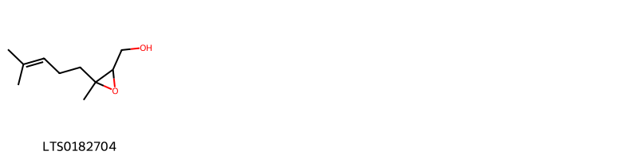{ width=100% }
    <figcaption>Hình ảnh cấu trúc hóa học của 1 hoạt chất thuộc nhóm Epoxides gồm ['[3-methyl-3-(4-methylpent-3-en-1-yl)oxiran-2-yl]methanol (LTS0182704)'].</figcaption>
</figure>
### Nhóm Fatty Acyls
<figure markdown="span">
    { width=100% }
    <figcaption>Hình ảnh cấu trúc hóa học của 27 hoạt chất thuộc nhóm Fatty Acyls gồm ['geranyl acetate (LTS0093224)', 'lauric acid (LTS0051907)', '2-{[3-hydroxy-1-(4-hydroxy-3-methoxyphenyl)decan-5-yl]oxy}-6-(hydroxymethyl)oxane-3,4,5-triol (LTS0127513)', 'octyl acetate (LTS0217143)', 'heptatriacontan-1-ol (LTS0189076)', '5-hydroxy-1-(4-hydroxy-3-methoxycyclohexyl)decan-3-one (LTS0255317)', '(3r,5s)-3-(acetyloxy)-1-(3,4-dimethoxyphenyl)decan-5-yl acetate (LTS0127305)', '5-hydroxy-1-(4-hydroxy-3-methoxyphenyl)decan-3-yl acetate (LTS0198639)', '2-heptanol (LTS0147404)', 'nonan-1-ol (LTS0157379)', '2-undecanol (LTS0141928)', '(3r,5s)-3-(acetyloxy)-1-(4-hydroxy-3-methoxyphenyl)decan-5-yl acetate (LTS0098377)', '6-methyl-5-hepten-2-ol (LTS0181977)', '2-nonanol (LTS0264829)', '(2r,3r,4s,5s,6r)-2-{[(3s,5s)-3-hydroxy-1-(4-hydroxy-3-methoxyphenyl)decan-5-yl]oxy}-6-(hydroxymethyl)oxane-3,4,5-triol (LTS0192380)', 'octanol (LTS0250216)', 'citronellyl acetate (LTS0049511)', '2-octanol (LTS0265860)', '(3r,5s)-3-(acetyloxy)-1-(4-hydroxy-3-methoxyphenyl)dodecan-5-yl acetate (LTS0084883)', '(3r,5s)-5-hydroxy-1-(4-hydroxy-3-methoxyphenyl)decan-3-yl acetate (LTS0236396)', 'hexanol (LTS0217299)', '3-(acetyloxy)-1-(4-hydroxy-3-methoxyphenyl)decan-5-yl acetate (LTS0235614)', '(5s)-1-(4-hydroxy-3-methoxyphenyl)-3-oxotetradecan-5-yl acetate (LTS0251304)', '3-(acetyloxy)-1-(3,4-dimethoxyphenyl)decan-5-yl acetate (LTS0053787)', '2-hexadecanol (LTS0056077)', 'hexadecanimidic acid (LTS0021816)', 'ethylmyristate (LTS0033616)'].</figcaption>
</figure>
### Nhóm Glycerolipids
<figure markdown="span">
    { width=100% }
    <figcaption>Hình ảnh cấu trúc hóa học của 9 hoạt chất thuộc nhóm Glycerolipids gồm ['2-hydroxy-3-{[3,4,5-trihydroxy-6-({[3,4,5-trihydroxy-6-(hydroxymethyl)oxan-2-yl]oxy}methyl)oxan-2-yl]oxy}propyl (9z)-octadec-9-enoate (LTS0205516)', '2-hydroxy-3-{[(2r,3r,4s,5r,6r)-3,4,5-trihydroxy-6-({[(2s,3r,4s,5r,6r)-3,4,5-trihydroxy-6-(hydroxymethyl)oxan-2-yl]oxy}methyl)oxan-2-yl]oxy}propyl (9z,12z)-octadeca-9,12-dienoate (LTS0076749)', '(2s)-2-hydroxy-3-{[(2r,3r,4s,5r,6r)-3,4,5-trihydroxy-6-({[(2s,3r,4s,5r,6r)-3,4,5-trihydroxy-6-(hydroxymethyl)oxan-2-yl]oxy}methyl)oxan-2-yl]oxy}propyl (9z)-octadec-9-enoate (LTS0024860)', '2-hydroxy-3-{[3,4,5-trihydroxy-6-({[3,4,5-trihydroxy-6-(hydroxymethyl)oxan-2-yl]oxy}methyl)oxan-2-yl]oxy}propyl (9z,12z,15z)-octadeca-9,12,15-trienoate (LTS0184445)', '(2s)-2-hydroxy-3-{[(2r,3r,4s,5r,6r)-3,4,5-trihydroxy-6-({[(2s,3r,4s,5r,6r)-3,4,5-trihydroxy-6-(hydroxymethyl)oxan-2-yl]oxy}methyl)oxan-2-yl]oxy}propyl (9z,12z)-octadeca-9,12-dienoate (LTS0237595)', '2-hydroxy-3-{[3,4,5-trihydroxy-6-({[3,4,5-trihydroxy-6-(hydroxymethyl)oxan-2-yl]oxy}methyl)oxan-2-yl]oxy}propyl octadec-9-enoate (LTS0035881)', '(2s)-2-hydroxy-3-{[(2r,3r,4s,5r,6r)-3,4,5-trihydroxy-6-({[(2s,3r,4s,5r,6r)-3,4,5-trihydroxy-6-(hydroxymethyl)oxan-2-yl]oxy}methyl)oxan-2-yl]oxy}propyl (9z,12z,15z)-octadeca-9,12,15-trienoate (LTS0011050)', '2-hydroxy-3-{[3,4,5-trihydroxy-6-({[3,4,5-trihydroxy-6-(hydroxymethyl)oxan-2-yl]oxy}methyl)oxan-2-yl]oxy}propyl octadeca-9,12-dienoate (LTS0033977)', '2-hydroxy-3-{[3,4,5-trihydroxy-6-({[3,4,5-trihydroxy-6-(hydroxymethyl)oxan-2-yl]oxy}methyl)oxan-2-yl]oxy}propyl octadeca-9,12,15-trienoate (LTS0123437)'].</figcaption>
</figure>
### Nhóm Harmala alkaloids
<figure markdown="span">
    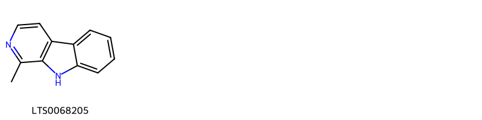{ width=100% }
    <figcaption>Hình ảnh cấu trúc hóa học của 1 hoạt chất thuộc nhóm Harmala alkaloids gồm ['harmane (LTS0068205)'].</figcaption>
</figure>
### Nhóm Heteroaromatic compounds
<figure markdown="span">
    { width=100% }
    <figcaption>Hình ảnh cấu trúc hóa học của 2 hoạt chất thuộc nhóm Heteroaromatic compounds gồm ['perillene (LTS0083458)', 'rosefuran (LTS0216128)'].</figcaption>
</figure>
### Nhóm Imidazopyrimidines
<figure markdown="span">
    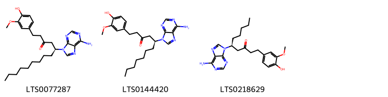{ width=100% }
    <figcaption>Hình ảnh cấu trúc hóa học của 3 hoạt chất thuộc nhóm Imidazopyrimidines gồm ['(5s)-5-(6-aminopurin-9-yl)-1-(4-hydroxy-3-methoxyphenyl)tetradecan-3-one (LTS0077287)', '(5s)-5-(6-aminopurin-9-yl)-1-(4-hydroxy-3-methoxyphenyl)dodecan-3-one (LTS0144420)', '(5s)-5-(6-aminopurin-9-yl)-1-(4-hydroxy-3-methoxyphenyl)decan-3-one (LTS0218629)'].</figcaption>
</figure>
### Nhóm Indoles and derivatives
<figure markdown="span">
    { width=100% }
    <figcaption>Hình ảnh cấu trúc hóa học của 1 hoạt chất thuộc nhóm Indoles and derivatives gồm ['β-carboline (LTS0263207)'].</figcaption>
</figure>
### Nhóm Lactones
<figure markdown="span">
    { width=100% }
    <figcaption>Hình ảnh cấu trúc hóa học của 2 hoạt chất thuộc nhóm Lactones gồm ["(3e)-3-{2-[(1r,2s)-5,5,8a-trimethyl-hexahydro-1h-spiro[naphthalene-2,2'-oxiran]-1-yl]ethylidene}oxolan-2-one (LTS0203906)", 'galanolactone (LTS0151774)'].</figcaption>
</figure>
### Nhóm Organooxygen compounds
<figure markdown="span">
    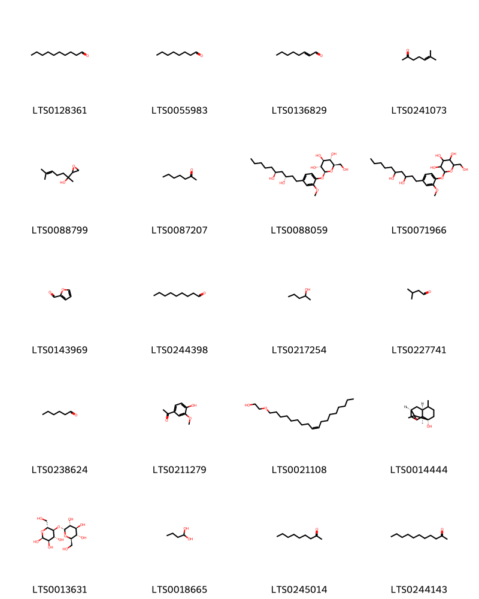{ width=100% }
    <figcaption>Hình ảnh cấu trúc hóa học của 20 hoạt chất thuộc nhóm Organooxygen compounds gồm ['decanal (LTS0128361)', 'octanal (LTS0055983)', '(e)-2-octenal (LTS0136829)', '6-methyl-5-hepten-2-one (LTS0241073)', 'linalool dihydroepoxide (LTS0088799)', '2-heptanone (LTS0087207)', '(2s,3r,4s,5s,6r)-2-{4-[(3s,5s)-3,5-dihydroxydecyl]-2-methoxyphenoxy}-6-(hydroxymethyl)oxane-3,4,5-triol (LTS0088059)', '2-[4-(3,5-dihydroxydecyl)-2-methoxyphenoxy]-6-(hydroxymethyl)oxane-3,4,5-triol (LTS0071966)', 'bran oil (LTS0143969)', 'nonanal (LTS0244398)', '2-pentanol (LTS0217254)', 'isovaleraldehyde (LTS0227741)', 'hexanal (LTS0238624)', 'apocynin (LTS0211279)', 'oleth-3 (LTS0021108)', '(1s,3r,7s,8s)-2,2,6,8-tetramethyltricyclo[5.3.1.0³,⁸]undecan-3-ol (LTS0014444)', 'α-maltose (LTS0013631)', 'butanediol (LTS0018665)', '2-nonanone (LTS0245014)', 'undecan-2-one (LTS0244143)'].</figcaption>
</figure>
### Nhóm Oxanes
<figure markdown="span">
    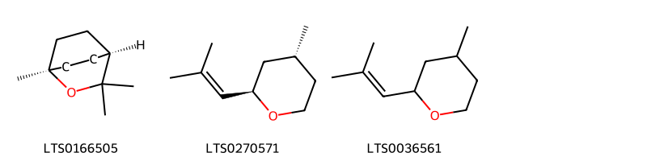{ width=100% }
    <figcaption>Hình ảnh cấu trúc hóa học của 3 hoạt chất thuộc nhóm Oxanes gồm ['1,8-cineole (LTS0166505)', '(2r,4r)-rose oxide (LTS0270571)', 'rose oxide (LTS0036561)'].</figcaption>
</figure>
### Nhóm Phenol esters
<figure markdown="span">
    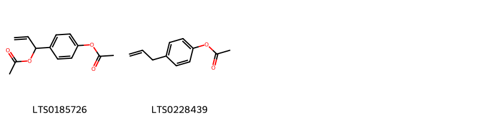{ width=100% }
    <figcaption>Hình ảnh cấu trúc hóa học của 2 hoạt chất thuộc nhóm Phenol esters gồm ['1-[4-(acetyloxy)phenyl]prop-2-en-1-yl acetate (LTS0185726)', '4-(prop-2-en-1-yl)phenyl acetate (LTS0228439)'].</figcaption>
</figure>
### Nhóm Phenols
<figure markdown="span">
    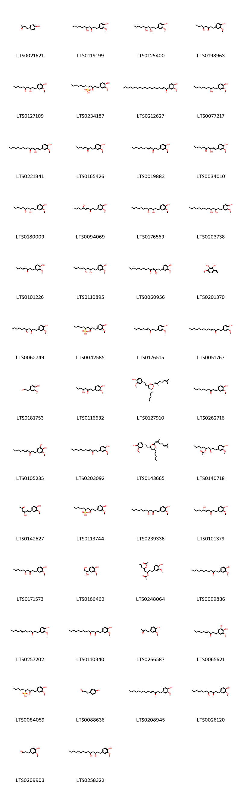{ width=100% }
    <figcaption>Hình ảnh cấu trúc hóa học của 77 hoạt chất thuộc nhóm Phenols gồm ['frambinone (LTS0021621)', '5-hydroxy-1-(4-hydroxy-3-methoxyphenyl)undecan-3-one (LTS0119199)', 'gingerdiol (LTS0125400)', '(5s)-5-hydroxy-1-(4-hydroxy-3-methoxyphenyl)octan-3-one (LTS0198963)', '1-(4-hydroxy-3-methoxyphenyl)decane-3,5-diol (LTS0127109)', '(5s)-1-(4-hydroxy-3-methoxyphenyl)-3-oxododecane-5-sulfonic acid (LTS0234187)', '1-(4-hydroxy-3-methoxyphenyl)nonadec-2-en-1-one (LTS0212627)', '4-(3-hydroxydecyl)-2-methoxyphenol (LTS0077217)', '(1e,3z)-3-hydroxy-1-(4-hydroxy-3-methoxyphenyl)tetradeca-1,3-dien-5-one (LTS0221841)', '(4e)-1-(4-hydroxy-3-methoxyphenyl)oct-4-en-3-one (LTS0165426)', '1-(4-hydroxy-3-methoxyphenyl)dodec-4-en-3-one (LTS0019883)', '(1e,3z)-3-hydroxy-1-(4-hydroxy-3-methoxyphenyl)deca-1,3-dien-5-one (LTS0034010)', '(3s,5s)-1-(4-hydroxy-3-methoxyphenyl)decane-3,5-diol (LTS0180009)', '(4e,6r)-6-hydroxy-1-(4-hydroxy-3-methoxyphenyl)dec-4-en-3-one (LTS0094069)', '1-(4-hydroxy-3-methoxyphenyl)dodecane-3,5-diol (LTS0176569)', '1-(4-hydroxy-3-methoxyphenyl)tetradecane-3,5-diol (LTS0203738)', '1-(4-hydroxy-3-methoxyphenyl)oct-4-en-3-one (LTS0101226)', '(3s,5r)-1-(4-hydroxy-3-methoxyphenyl)decane-3,5-diol (LTS0110895)', '(3z)-3-hydroxy-1-(4-hydroxy-3-methoxyphenyl)tetradec-3-en-5-one (LTS0060956)', '3-ethenyl-6-methoxybenzene-1,2-diol (LTS0201370)', '(5s)-5-hydroxy-1-(4-hydroxy-3-methoxyphenyl)undecan-3-one (LTS0062749)', '(5s)-1-(4-hydroxy-3-methoxyphenyl)-3-oxodecane-5-sulfonic acid (LTS0042585)', 'shogaol (LTS0176515)', '(10)-shogaol (LTS0051767)', 'homovanillyl alcohol (LTS0181753)', '5-hydroxy-1-(4-hydroxy-3-methoxyphenyl)octan-3-one (LTS0116632)', '4-{2-[(2s,4r,6r)-2-[(1e)-2,6-dimethylhepta-1,5-dien-1-yl]-6-pentyl-1,3-dioxan-4-yl]ethyl}-2-methoxyphenol (LTS0127910)', 'paradol (LTS0262716)', '(4e)-1-(3,4-dihydroxy-5-methoxyphenyl)dec-4-en-3-one (LTS0105235)', '(8)-shogaol (LTS0203092)', '4-{2-[2-(2,6-dimethylhepta-1,5-dien-1-yl)-6-pentyl-1,3-dioxan-4-yl]ethyl}-2-methoxyphenol (LTS0143665)', '(3r,5s)-3-hydroxy-1-(4-hydroxy-3-methoxyphenyl)decan-5-yl acetate (LTS0140718)', '(3e,5e)-4-hydroxy-6-(4-hydroxy-3-methoxyphenyl)hexa-3,5-dien-2-one (LTS0142627)', '1-(4-hydroxy-3-methoxyphenyl)-3-oxodecane-5-sulfonic acid (LTS0113744)', '5-hydroxy-1-(4-hydroxy-3-methoxyphenyl)dodecan-3-one (LTS0239336)', '6-hydroxy-1-(4-hydroxy-3-methoxyphenyl)dec-4-en-3-one (LTS0101379)', 'gingerol (LTS0171573)', '(1r,2s)-1-(4-hydroxy-3-methoxyphenyl)propane-1,2-diol (LTS0166462)', '5-(acetyloxy)-1-(4-hydroxy-3-methoxyphenyl)octan-3-yl acetate (LTS0248064)', '1-(4-hydroxy-3-methoxyphenyl)dodecan-3-one (LTS0099836)', '1-(4-hydroxy-3-methoxyphenyl)dodec-7-en-3-one (LTS0257202)', '1-(4-hydroxy-3-methoxyphenyl)tetradecane-3,5-dione (LTS0110340)', 'zingerone (LTS0266587)', '1-(3,4-dihydroxy-5-methoxyphenyl)dec-4-en-3-one (LTS0065621)', '(5r)-1-(4-hydroxy-3-methoxyphenyl)-3-oxodecane-5-sulfonic acid (LTS0084059)', '4-hydroxydihydrocinnamaldehyde (LTS0088636)', '1-(4-hydroxy-3-methoxyphenyl)tetradec-4-en-3-one (LTS0208945)', '(8)-gingerol (LTS0026120)', '3-(4-hydroxy-3-methoxyphenyl)propanal (LTS0209903)', '(3r,5s)-1-(4-hydroxy-3-methoxyphenyl)tetradecane-3,5-diol (LTS0258322)', 'gingerol (LTS0061759)', '(6s)-6-hydroxy-8-(4-hydroxy-3-methoxyphenyl)octan-4-one (LTS0241275)', 'homovanillic acid (LTS0251061)', '(5s)-1-(4-hydroxy-3-methoxyphenyl)-3-oxotetradecane-5-sulfonic acid (LTS0061661)', '1-(4-hydroxy-3-methoxyphenyl)dec-7-en-3-one (LTS0015210)', '(10)-gingerol (LTS0012062)', 'gingerdione (LTS0061248)', '8-(4-hydroxy-3-methoxyphenyl)-6-oxooctane-4-sulfonic acid (LTS0002278)', '3-hydroxy-1-(4-hydroxy-3-methoxyphenyl)decan-5-yl acetate (LTS0266911)', '4-hydroxy-6-(4-hydroxy-3-methoxyphenyl)hexa-3,5-dien-2-one (LTS0015760)', '5-hydroxy-1-(4-hydroxy-3-methoxyphenyl)tetradecan-3-one (LTS0068888)', '(3s,5s)-1-(4-hydroxy-3-methoxyphenyl)tetradecane-3,5-diol (LTS0064116)', '1-(3,4-dihydroxy-5-methoxyphenyl)-5-hydroxydecan-3-one (LTS0006138)', '(4s)-8-(4-hydroxy-3-methoxyphenyl)-6-oxooctane-4-sulfonic acid (LTS0003207)', '1-(4-hydroxy-3-methoxyphenyl)oct-7-en-3-one (LTS0013056)', '(5s)-1-(3,4-dihydroxy-5-methoxyphenyl)-5-hydroxydecan-3-one (LTS0232258)', '5-ethenyl-2-methoxyphenol (LTS0076260)', '5-hydroxy-1-(4-hydroxy-3-methoxyphenyl)hexadecan-3-one (LTS0258134)', 'shogaol (LTS0032763)', 'isoeugenol (LTS0136836)', '(3r,5s)-5-(acetyloxy)-1-(4-hydroxy-3-methoxyphenyl)octan-3-yl acetate (LTS0258204)', '(4e)-1-(4-hydroxy-3-methoxyphenyl)hexadec-4-en-3-one (LTS0097309)', '3-hydroxy-1-(4-hydroxy-3-methoxyphenyl)deca-1,3-dien-5-one (LTS0026943)', '(4r)-8-(4-hydroxy-3-methoxyphenyl)-6-oxooctane-4-sulfonic acid (LTS0135275)', '1-(4-hydroxy-3-methoxyphenyl)propane-1,2-diol (LTS0126894)', 'vanillyl alcohol (LTS0035070)', '6-gingerol (LTS0103909)'].</figcaption>
</figure>
### Nhóm Phenylpropanoic acids
<figure markdown="span">
    { width=100% }
    <figcaption>Hình ảnh cấu trúc hóa học của 1 hoạt chất thuộc nhóm Phenylpropanoic acids gồm ['homovanillinic acid (LTS0187038)'].</figcaption>
</figure>
### Nhóm Prenol lipids
<figure markdown="span">
    { width=100% }
    <figcaption>Hình ảnh cấu trúc hóa học của 116 hoạt chất thuộc nhóm Prenol lipids gồm ['terpineol (LTS0136148)', 'β phellandrene (LTS0124668)', 'α-myrcene (LTS0115731)', 'terpinolene (LTS0104525)', 'β-pinene (LTS0117550)', 'cymene (LTS0181568)', 'α pinene (LTS0132416)', 'camphene (LTS0267242)', 'limonene,  (LTS0155981)', 'phellandrene (LTS0157173)', 'sabinene (LTS0224133)', 'zingiberene (LTS0085287)', '1,7,7-trimethylbicyclo[2.2.1]heptane-2,5-diol (LTS0129326)', 'farnesene (LTS0057150)', '1,4a-dimethyl-7-(propan-2-ylidene)-hexahydro-2h-naphthalen-1-ol (LTS0123520)', '(1s,5s)-5-[(2r)-6-methylhept-5-en-2-yl]-2-methylidenecyclohex-3-en-1-ol (LTS0125899)', 'nerol oxide (LTS0076405)', '5-(6-methylhept-5-en-2-yl)-2-methylidenecyclohexan-1-ol (LTS0074008)', '(1s,2r,4r,6s)-1,7,7-trimethyltricyclo[2.2.1.0²,⁶]heptane (LTS0080510)', 'linalool, (+-)- (LTS0128839)', '(r)-β-bisabolene (LTS0077209)', '(r)-β-himachalene (LTS0085481)', '7-epi-sesquithujene (LTS0073580)', '2-[4-ethenyl-4-methyl-3-(prop-1-en-2-yl)cyclohexyl]propan-2-ol (LTS0072139)', '1-methyl-4-(6-methylhept-5-en-2-yl)cyclohex-2-en-1-ol (LTS0113579)', '(+)-borneol (LTS0189059)', '2-methyl-5-[(2s)-6-methylhept-5-en-2-yl]cyclohexa-1,3-diene (LTS0030348)', '(e,z)-farnesol (LTS0182151)', 'β-sesquiphellandrene (LTS0106193)', 'β-selinene (LTS0096341)', 'camphor (LTS0091905)', '8-isopropyl-1,2-dimethyltetracyclo[4.4.0.0²,⁴.0³,⁷]decane (LTS0040030)', '3,7,11-trimethyldodeca-1,6,10-trien-3-yl acetate (LTS0104577)', '3-[(2s)-6-methylhept-5-en-2-yl]-6-methylidenecyclohex-1-ene (LTS0195839)', 'nerolidol (LTS0197738)', 'menthyl acetate (LTS0132968)', 'monoterpenes (LTS0106881)', 'myrtenal (LTS0202475)', '(1s,4s)-4-isopropyl-1,6-dimethyl-1,2,3,4-tetrahydronaphthalene (LTS0139634)', 'α-cadinol (LTS0206935)', '3,7-dimethyl-2,6-octadienal (LTS0141353)', '4-isopropyl-1,6-dimethyl-2,3,4,4a,7,8-hexahydronaphthalene (LTS0270743)', '(1as,4ar,7as,7br)-1,1,7-trimethyl-4-methylidene-octahydro-1ah-cyclopropa[e]azulene (LTS0145331)', '(3r,6e)-nerolidol (LTS0145065)', '4-isopropyl-1,6-dimethyl-3,4,4a,7,8,8a-hexahydronaphthalene (LTS0154650)', 'β-eudesmol (LTS0203280)', 'citronella (LTS0151257)', '2-methyl-5-(6-methylhept-5-en-2-yl)cyclohexa-1,3-diene (LTS0164871)', '(1r,5s)-5-[(2r)-6-methylhept-5-en-2-yl]-2-methylidenecyclohexan-1-ol (LTS0267291)', 'β-eudesmol (LTS0266647)', '2-methoxy-1,7,7-trimethylbicyclo[2.2.1]heptane (LTS0154024)', 'β-ionone (LTS0155301)', '4,6,6-trimethylbicyclo[3.1.1]hept-3-en-1-ol (LTS0155332)', '5-(6-methylhept-5-en-2-yl)-2-methylidenecyclohex-3-en-1-ol (LTS0154687)', "(2e)-2-(2-{5,5,8a-trimethyl-hexahydro-1h-spiro[naphthalene-2,2'-oxiran]-1-yl}ethylidene)butanedial (LTS0141156)", 'β-elemene (LTS0225699)', 'α-ylangene (LTS0254603)', '(z)-γ-bisabolene (LTS0143321)', 'gamma-eudesmol (LTS0147389)', '4-terpineol (LTS0253733)', '4-isopropyl-1-methyl-6-methylidene-2,3,4,7,8,8a-hexahydro-1h-naphthalene (LTS0247064)', 'borneol (LTS0264960)', '(+)-gamma-cadinene (LTS0103949)', 'tricyclene (LTS0179930)', '(2r,3r,4s,5s,6r)-2-{[(2e)-3,7-dimethylocta-2,6-dien-1-yl]oxy}-6-(hydroxymethyl)oxane-3,4,5-triol (LTS0116837)', 'caryophyllene (LTS0085212)', '(-)-α-curcumene (LTS0216936)', 'verbenone (LTS0264577)', '(1s)-8-isopropyl-1,3-dimethyltricyclo[4.4.0.0²,⁷]dec-3-ene (LTS0199723)', 'β-farnesene (LTS0067925)', 'bornyl acetate (LTS0060565)', 'camphene hydrate (LTS0071319)', 'α-copaene (LTS0207598)', '1-(6-methylhept-5-en-2-yl)-4-methylidenebicyclo[3.1.0]hexane (LTS0264824)', '(2r,3r,4s,5s,6r)-2-{[(1r,2s,4r,5r)-5-hydroxy-1,7,7-trimethylbicyclo[2.2.1]heptan-2-yl]oxy}-6-(hydroxymethyl)oxane-3,4,5-triol (LTS0219389)', '3-{2-[(4ar,8as)-5,5,8a-trimethyl-2-methylidene-hexahydro-1h-naphthalen-1-yl]ethenyl}furan (LTS0071838)', '3-(6-methylhept-5-en-2-yl)-6-methylidenecyclohex-1-ene (LTS0016484)', 'guaiol (LTS0240901)', 'α-thujene (LTS0185078)', '(1as,4as,7as,7br)-1,1,7-trimethyl-4-methylidene-octahydro-1ah-cyclopropa[e]azulene (LTS0160636)', 'elemol (LTS0208556)', 'geranic acid (LTS0226491)', 'neral (LTS0165243)', '(+)-β-thujone (LTS0180873)', '2-methyl-5-(prop-1-en-2-yl)cyclopentane-1-carbaldehyde (LTS0035478)', 'geraniol (LTS0258838)', 'curcumene (LTS0190074)', '(1r,2s,7s,8s)-8-isopropyl-1,3-dimethyltricyclo[4.4.0.0²,⁷]dec-3-ene (LTS0190031)', 'nerolidol isomers (LTS0007569)', '(+)-α-terpineol (LTS0258249)', '(2s,4r)-1,7,7-trimethylbicyclo[2.2.1]heptan-2-ol (LTS0010050)', '(10e)-2,6,11,15-tetramethylhexadeca-2,7,10,14-tetraen-6-ol (LTS0057371)', 'β-cadinene (LTS0049088)', '(6e,10r)-10-hydroxy-2,6,10-trimethyldodeca-2,6,11-trien-4-one (LTS0067450)', 'gamma-muurolene (LTS0052920)', 'terpinene (LTS0136858)', '(-)-β-bisabolene (LTS0009940)', 'α-muurolene (LTS0022607)', '4-methyl-1-(6-methylhept-5-en-2-yl)cyclohex-3-en-1-ol (LTS0000924)', '(4s,4as,8as)-4-isopropyl-1,6-dimethyl-3,4,4a,7,8,8a-hexahydronaphthalene (LTS0014980)', 'α-curcumene (LTS0019880)', '(4r,4ar,8as)-4-isopropyl-6-methyl-1-methylidene-3,4,4a,7,8,8a-hexahydro-2h-naphthalene (LTS0057456)', '(1r,2s,6s,7s,8r)-8-isopropyl-1,3-dimethyltricyclo[4.4.0.0²,⁷]dec-3-ene (LTS0106607)', 'nerol (LTS0244289)', 'delta-cadinene (LTS0019321)', '2-({5-hydroxy-1,7,7-trimethylbicyclo[2.2.1]heptan-2-yl}oxy)-6-(hydroxymethyl)oxane-3,4,5-triol (LTS0031222)', 'α-selinene (LTS0024564)', 'cadinene (LTS0003360)', '7-epi-zingiberene (LTS0241514)', 'citronellol, (+-)- (LTS0090925)', '(-)-delta(3)-carene (LTS0104784)', '2-methyl-5-[(2r)-6-methylhept-5-en-2-yl]phenol (LTS0246670)', 'β-bisabolol (LTS0115229)', 'α-citral (LTS0246122)', '4-isopropyl-6-methyl-1-methylidene-3,4,4a,7,8,8a-hexahydro-2h-naphthalene (LTS0111070)', 'e,e-farnesal (LTS0118407)'].</figcaption>
</figure>
### Nhóm Pyrans
<figure markdown="span">
    { width=100% }
    <figcaption>Hình ảnh cấu trúc hóa học của 1 hoạt chất thuộc nhóm Pyrans gồm ['nerol oxide (LTS0174383)'].</figcaption>
</figure>
### Nhóm Pyrimidine nucleosides
<figure markdown="span">
    { width=100% }
    <figcaption>Hình ảnh cấu trúc hóa học của 1 hoạt chất thuộc nhóm Pyrimidine nucleosides gồm ['uridine (LTS0220125)'].</figcaption>
</figure>
### Nhóm Saccharolipids
<figure markdown="span">
    { width=100% }
    <figcaption>Hình ảnh cấu trúc hóa học của 1 hoạt chất thuộc nhóm Saccharolipids gồm ['(2r,4r,5s,6r)-3,3,4,5-tetrahydroxy-2-propoxy-6-({[(2s,3s,4s,5r,6r)-3,4,5-trihydroxy-6-(hydroxymethyl)oxan-2-yl]oxy}methyl)oxan-4-yl (9z,12z,15z)-octadeca-9,12,15-trienoate (LTS0174462)'].</figcaption>
</figure>
### Nhóm Saturated hydrocarbons
<figure markdown="span">
    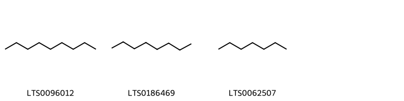{ width=100% }
    <figcaption>Hình ảnh cấu trúc hóa học của 3 hoạt chất thuộc nhóm Saturated hydrocarbons gồm ['nonane (LTS0096012)', 'octane (LTS0186469)', 'heptane (LTS0062507)'].</figcaption>
</figure>
### Nhóm Steroids and steroid derivatives
<figure markdown="span">
    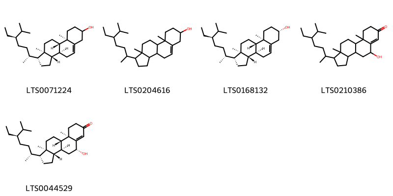{ width=100% }
    <figcaption>Hình ảnh cấu trúc hóa học của 5 hoạt chất thuộc nhóm Steroids and steroid derivatives gồm ['stigmast-5-en-3-ol (LTS0071224)', 'stigmast-5-en-3-ol, (3β)- (LTS0204616)', 'sitosterol (LTS0168132)', '1-(5-ethyl-6-methylheptan-2-yl)-5-hydroxy-9a,11a-dimethyl-1h,2h,3h,3ah,3bh,4h,5h,8h,9h,9bh,10h,11h-cyclopenta[a]phenanthren-7-one (LTS0210386)', '(1r,3as,3bs,5r,9ar,9bs,11ar)-1-[(2r,5r)-5-ethyl-6-methylheptan-2-yl]-5-hydroxy-9a,11a-dimethyl-1h,2h,3h,3ah,3bh,4h,5h,8h,9h,9bh,10h,11h-cyclopenta[a]phenanthren-7-one (LTS0044529)'].</figcaption>
</figure>
### Nhóm Tetrahydrofurans
<figure markdown="span">
    { width=100% }
    <figcaption>Hình ảnh cấu trúc hóa học của 1 hoạt chất thuộc nhóm Tetrahydrofurans gồm ['linalyl oxide (LTS0065533)'].</figcaption>
</figure>
### Nhóm Thioethers
<figure markdown="span">
    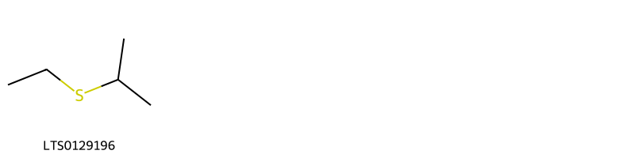{ width=100% }
    <figcaption>Hình ảnh cấu trúc hóa học của 1 hoạt chất thuộc nhóm Thioethers gồm ['ethyl isopropyl sulfide (LTS0129196)'].</figcaption>
</figure>
### Nhóm Unsaturated hydrocarbons
<figure markdown="span">
    { width=100% }
    <figcaption>Hình ảnh cấu trúc hóa học của 1 hoạt chất thuộc nhóm Unsaturated hydrocarbons gồm ['α terpinene (LTS0232891)'].</figcaption>
</figure>

---

## Tác dụng dược lý

Theo tài liệu "Những cây thuốc và vị thuốc Việt Nam" - Đỗ Tất Lợi:- Hỗ trợ tiêu hoá
- Chữa ho mất tiếng
- Giảm đau
- Kháng viêm
- Chống oxy hoá
- Làm ấm cơ thể
- Hỗ trợ điều trị cảm cúm

Theo tài liệu quốc tế: To dispel cold from the spleen and the stomach, to promote recovery from collapse, and to eliminate damp and phlegm.

---

## Dược điển Việt Nam V

### Soi bột:

Mảnh mô mềm gồm những tế bào hình nhiều cạnh, rải rác có chứa tế bào tiết tinh dầu màu vàng nhạt. Tinh bột hình trứng, có vân rõ. Mảnh bần gồm các tế bào hình chữ nhật, vách dày. màu vàng nâu. Sợi có thành mỏng. Mảnh mạch vạch, mạch vòng, mạch điểm.nn

<!-- Hình ảnh soi bột sẽ được tự động chèn vào đây sau -->
### Vi phẫu:

Biểu bì gồm một lớp tế bào nhỏ hình chữ nhật, xếp tương đối đều đặn. Dưới lớp biểu bì là lớp suberoid gồm 5 đến 6 hàng tế bào tròn hoặc gần tròn nhuộm màu xanh, xếp xen kẽ nhau. Phía dưới lớp suberoid là lớp bần gồm những tế bào hình chữ nhật, xếp xuyên tâm và đồng tâm. Mô mềm vỏ gồm các tế bào tròn. Phía trong, lớp nội bì tạo thành vòng không liên tục, sát lớp nội bì là lớp trụ bì. Các bó libe-gỗ rải rác trong phần mô mềm vỏ và mô mềm ruột, tập trung nhiều nhất ờ sát lớp nội bì. Mỗi bó hình tròn hay hình trứng có 1 đến 6 mạch gỗ ở giữa, libe chồng lên gỗ, rải rác có các mạch gỗ bị cắt dọc. Những tế bào tiết tinh dầu rải rác khắp mô mềm ruột và mô mềm vỏ.

<!-- Hình ảnh vi phẫu sẽ được tự động chèn vào đây sau -->
### Định tính

Lấy khoảng 5 g bột dược liệu, thêm 20 ml ethanol 70 % (TT), đun sôi, lắc đều, lọc. Lấy 1 ml dịch lọc, thêm 5 giọt dung dịch natri nitroprusiat 1 % (TT), thêm 3 giọt dung dịch natri hydroxyd 10 % (TT), xuất hiện màu đỏ. Thêm 2 giọt acid acetic băng (TT). có tủa chuyển sang màu vàng. Lấy 1 ml dịch lọc, thêm 3 giọt dung dịch paranitrovanilin (TT), thêm 0,5 ml dung dịch natri hydrocarbonat 5 % (TT), 4 ml nước, đun sôi, để nguội, dung dịch có màu nâu đỏ. Phương pháp sắc ký lớp mỏng (Phụ lục 5.4). Bản mỏng: Silicagel GF254 Dung môi khai triển: n-Hexan – aceton – acid acetic loãng (7,5 : 2,5 : 4 giọt). Dung dịch thử: Lấy 2 g bột dược liệu, thêm 5 ml aceton (TT), lắc trong 3 min. lọc, lấy dịch lọc làm dung dịch thử. Dung dịch đối chiếu: Lấy 2 g bột thân rễ Gừng (mẫu chuẩn) chiết như mô tả ở phần Dung dịch thử. Cách tiến hành: Chấm riêng biệt từng bản mỏng 5 pl mỗi dung dịch trên. Sau khi khai triển xong, lấy bản mỏng ra để khô ở nhiệt độ phòng. Phun thuốc thử vanilin – sulfuric (TT). Sấy bản mỏng ở 110 °c cho đến khi xuất hiện vết. Quan sát dưới ánh sáng thường. Trên sắc ký đồ của dung dịch thử phải có ít nhất 10 vết cùng màu sắc và giá trị R, với các vết trên sắc ký đồ của dung dịch đối chiếu.

### Định lượng

Tiến hành theo phương pháp chiết lạnh (Phụ lục 12.10). Chất chiết được trong nước: Không ít hơn 14,0 % tính theo dược liệu khô kiệt. Chất chiết được trong ethanol 90 %: Không ít hơn 6,0 % tính theo dược liệu khô kiệt.nĐịnh lượng Định lượng tinh dầu trong dược liệu (Phụ lục 12.7). Cho 30 g dược liệu đã được cắt nhỏ vào bình cầu dung tích 500 ml của bộ dụng cụ định lượng tinh dầu trong dược liệu. Thêm 300 ml nước, tiến hành cất trong 3 h. Dược liệu phải chứa ít nhất 0,5 % tinh dầu tính theo dược liệu khô kiệt.

### Thông tin khác 
- ** Độ ẩm: ** 
Không quá 13,0 % (Phụ lục 12.13).

- ** Bảo quản:** 
Để nơi khô, mát.nn

## Dược điển Hồng kong

<!-- PDF sẽ được tự động chèn vào đây sau -->

---

## Y dược học cổ truyền

- **Tên vị thuốc:** None
- **Tính vị quy kinh:** Tân, nhiệt. Vào các kinh tâm, phê, ty. vị, thận, đại tràng.
- **Công năng chủ trị:** - Công năng: Ôn trung tán hàn, hồi dương, thùng mạch, táo thấp tiêu đàm.
- Chủ trị: Đau bụng lạnh, đầy trướng không tiêu, nôn mửa ỉa chảy, tứ chi lạnh, đàm ẩm, ho suyễn.
- Thán khương tăng cường chỉ huyết.
- **Chú ý:** 
- **Kiêng kỵ:** 
Âm hư nội nhiệt sinh ho, biểu hư ra mồ hôi nhiều hoặc mất máu không nên dùng.nn

