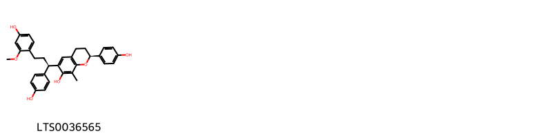
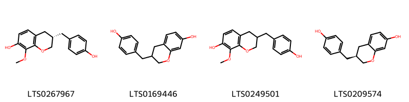
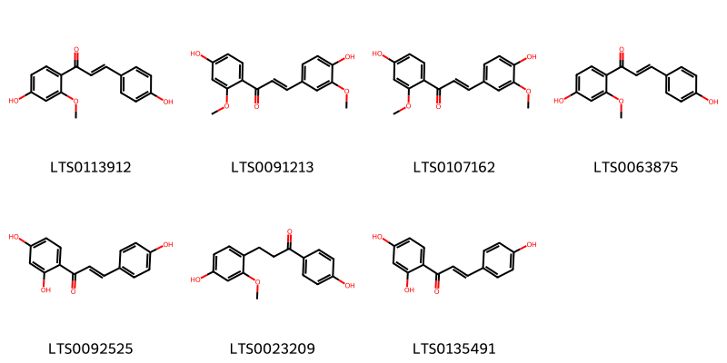
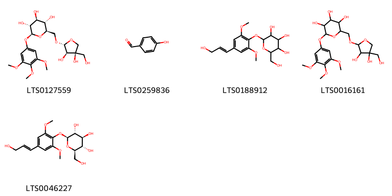
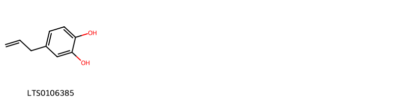
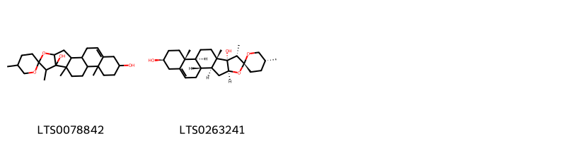
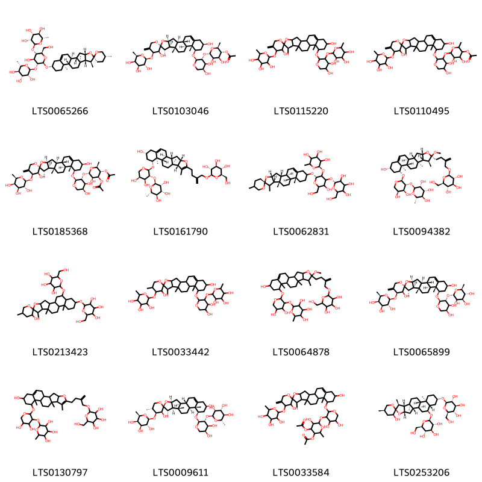

!!! abstract "Tóm tắt"
    Huyết giác (lõi gỗ) (Lignum Dracaenae), tên khoa học Huyết giác (Dracaena cochinchinensis), thuộc họ Huyết giác (Dracaenaceae). Lõi gỗ hình trụ rỗng ở giữa hoặc đôi khi là những mảnh gỗ có hình dạng và kích thước khác nhau, màu đỏ nâu. Chất cứng chắc không mùi, vị hơi chát. Thu hái quanh năm, lấy gỗ của những cây huyết giác già, lâu năm đã chết, lõi gỗ đã chuyển màu đỏ nâu, bỏ phần vỏ ngoài, gỗ mục và giác trắng, thái lát và phơi hay sấy khô. Huyết giác có chất màu đỏ tan trong cồn, axeton, axit, không tan trong ête, clorofoc và benzen, với kiềm màu đỏ vàng lúc đầu chuyển sang màu da cam. Có tính khổ, sáp, bình quy vào các kinh tâm và can. Có tác dụng giãn mạch. Huyết giác còn là một vị thuốc dân gian, chưa thấy được ghi trong một tài liệu nào. Dân gian dùng để chữa những trường hợp ứ huyết, bị thương, máu tím bầm không lưu thông. Dùng cho cả nam và nữ. Đối với nữ còn dùng khi kinh nguyệt bế. Liều dùng: ngày 10-20g dưới dạng thuốc sắc, ngâm rượu uống và xoa.

## Thông tin về thực vật

### Đặc điểm thực vật

Dược liệu **Huyết Giác (Lõi Gỗ)** từ bộ phận **nan** từ loài *Dracaena cambodiana* thuộc họ Asparagaceae. Huyết giác là một loại cây nhỏ, cao chừng 1- 1,5m, có thể tới 2-3m, sống lâu năm. Thân phân thành nhiều nhánh. Cây nhỏ có đường kính chừng 1,6-2cm, cây to có đường kính tới 20-25cm. Lá hình lưỡi kiếm, trung bình dài 25-80cm, rộng 3-4cm tới 6-7cm, cứng, màu xanh tươi, mọc cách, không có cuống. Lá rụng để lại trên thân một sẹo, Thường chỉ còn một bó lá tụ tập trên ngọn. Cụm hoa mọc thành chùm dài tới 1m, đường kính phía cuống tới 1,5-2cm trên có lá nhỏ, dài 15cm, rộng 2cm, phân cành nhỏ dài tới 30cm. Hoa tụ từng 2-4 hoa gần nhau. Hoa nhỏ, đường kính 7-8 mm, màu lục vàng nhạt. Quả mọng hình cầu, đường kính chừng 1cm. Khi khô có màu đen, hạt hình cầu, đường kính 6-7 cam. 

!!! info "Phân loại thực vật của *Dracaena cambodiana*"
    - **Kingdom:** Plantae
    - **Phylum:** Tracheophyta
    - **Order:** Asparagales
    - **Family:** Asparagaceae
    - **Genus:** Dracaena
    - **Species:** *Dracaena cambodiana*

*Tài liệu tham khảo:* "Những cây thuốc và vị thuốc Việt Nam" - Đỗ Tất Lợi

 

### Loài thay thế (Nếu có)

Dược liệu này cũng có thể từ loài *Dracaena cochinchinensis*, thông tin về phân loại thực vật loài này như sau:
!!! info "Thông tin về phân loại thực vật của *Dracaena cochinchinensis*"
    - **kingdom:** Plantae
    - **phylum:** Tracheophyta
    - **order:** Asparagales
    - **family:** Asparagaceae
    - **genus:** Dracaena
    - **species:** *Dracaena cochinchinensis*

Hình ảnh của loài *Dracaena cochinchinensis*:

### Phân bố trên thế giới
**Từ vườn thực vật KEW: **: Nguồn gốc bản địa: Campuchia, Trung Quốc Nam Trung Bộ, Trung Quốc Đông Nam Bộ, Lào, Thái Lan, Việt Nam.

**Từ CSDL GIBF** nan, Lao People’s Democratic Republic, Viet Nam, China, Hong Kong, Indonesia, Cambodia, Malaysia, Thailand

### Phân bố tại Việt Nam
** "Những cây thuốc và vị thuốc Việt Nam" - Đỗ Tất Lợi**: Vùng núi đá xanh vùng Quảng Ninh, Nam Định, Hà Nam, Hà Tây, Hòa Bình, Nghệ An, Hà Tĩnh.

**Từ CSDL GIBF**: Hải Phòng, Khánh Hòa, Quảng Ninh

---

## Thông tin về dược liệu 

### Định danh

!!! info "Thông tin về tên gọi của nan"
    - Dược liệu tiếng Việt: nan
    - Dược liệu tiếng Trung: nan (nan)
    - Dược liệu tiếng Anh: nan
    - Dược liệu latin thông dụng: nan
    - Dược liệu latin kiểu DĐVN: lignum dracaenae
    - Dược liệu latin kiểu DĐVN: nan
    - Dược liệu latin kiểu thông tư: nan
    - Bộ phận dùng: nan (nan)

### Mô tả dược liệu 
- **Theo dược điển Việt nam V:** nan

- **Mô tả dược liệu theo thông tư chế biến dược liệu theo phương pháp cổ truyền:** nan

### Chế biến 

- **Chế biến theo dược điển việt nam V**: nan

- **Chế biến theo thông tư:** nan

--- 

## Thành phần hóa học

- Theo tài liệu của GS. Đỗ Tất Lợi:  Chưa có tài liệu nghiên cứu. Năm 1961, nghiên cứu sơ bộ, Đặng Thị Mai An không thấy antoxyan, không thấy cacmin và cũng không thấy chất nhựa.

Chỉ mới biết rằng trong huyết giác có chất màu đỏ tan trong cồn, axeton, axit, không tan trong ête, clorofoc và benzen. Với kiềm, màu đỏ vàng lúc đầu chuyển sang màu da cam (Bộ môn dược liệu và thực vật trường đại học y dược, Hà Nội, 1961).
    
- Theo cơ sở dữ liệu lotus: Từ loài *Dracaena cambodiana* đã phân lập và xác định được 36 hoạt chất thuộc về các nhóm Linear 1,3-diarylpropanoids, Organooxygen compounds, Diarylheptanoids, Prenol lipids, Steroids and steroid derivatives, Phenols, Homoisoflavonoids. 

|    | chemicalTaxonomyClassyfireClass   |   smiles_count |
|---:|:----------------------------------|---------------:|
|  0 | Diarylheptanoids                  |              1 |
|  1 | Homoisoflavonoids                 |              4 |
|  2 | Linear 1,3-diarylpropanoids       |              7 |
|  3 | Organooxygen compounds            |              5 |
|  4 | Phenols                           |              1 |
|  5 | Prenol lipids                     |              2 |
|  6 | Steroids and steroid derivatives  |             16 |

### Nhóm Diarylheptanoids
<figure markdown="span">
    { width=100% }
    <figcaption>Hình ảnh cấu trúc hóa học của 1 hoạt chất thuộc nhóm Diarylheptanoids gồm ['(2s)-6-[(1r)-3-(4-hydroxy-2-methoxyphenyl)-1-(4-hydroxyphenyl)propyl]-2-(4-hydroxyphenyl)-8-methyl-3,4-dihydro-2h-1-benzopyran-7-ol (LTS0036565)'].</figcaption>
</figure>
### Nhóm Homoisoflavonoids
<figure markdown="span">
    { width=100% }
    <figcaption>Hình ảnh cấu trúc hóa học của 4 hoạt chất thuộc nhóm Homoisoflavonoids gồm ['(3s)-3-[(4-hydroxyphenyl)methyl]-8-methoxy-3,4-dihydro-2h-1-benzopyran-7-ol (LTS0267967)', '3-[(4-hydroxyphenyl)methyl]-3,4-dihydro-2h-1-benzopyran-7-ol (LTS0169446)', '3-[(4-hydroxyphenyl)methyl]-8-methoxy-3,4-dihydro-2h-1-benzopyran-7-ol (LTS0249501)', '(3s)-3-[(4-hydroxyphenyl)methyl]-3,4-dihydro-2h-1-benzopyran-7-ol (LTS0209574)'].</figcaption>
</figure>
### Nhóm Linear 1_3-diarylpropanoids
<figure markdown="span">
    { width=100% }
    <figcaption>Hình ảnh cấu trúc hóa học của Không tìm thấy chú thích hoạt chất thuộc nhóm Linear 1_3-diarylpropanoids gồm Không tìm thấy chú thích.</figcaption>
</figure>
### Nhóm Organooxygen compounds
<figure markdown="span">
    { width=100% }
    <figcaption>Hình ảnh cấu trúc hóa học của 5 hoạt chất thuộc nhóm Organooxygen compounds gồm ['(2r,3s,4s,5r,6s)-2-({[(2r,3r,4r)-3,4-dihydroxy-4-(hydroxymethyl)oxolan-2-yl]oxy}methyl)-6-(3,4,5-trimethoxyphenoxy)oxane-3,4,5-triol (LTS0127559)', 'p-hydroxybenzaldehyde (LTS0259836)', '2-(hydroxymethyl)-6-[4-(3-hydroxyprop-1-en-1-yl)-2,6-dimethoxyphenoxy]oxane-3,4,5-triol (LTS0188912)', '2-({[3,4-dihydroxy-4-(hydroxymethyl)oxolan-2-yl]oxy}methyl)-6-(3,4,5-trimethoxyphenoxy)oxane-3,4,5-triol (LTS0016161)', 'syringin (LTS0046227)'].</figcaption>
</figure>
### Nhóm Phenols
<figure markdown="span">
    { width=100% }
    <figcaption>Hình ảnh cấu trúc hóa học của 1 hoạt chất thuộc nhóm Phenols gồm ['4-allylpyrocatechol (LTS0106385)'].</figcaption>
</figure>
### Nhóm Prenol lipids
<figure markdown="span">
    { width=100% }
    <figcaption>Hình ảnh cấu trúc hóa học của 2 hoạt chất thuộc nhóm Prenol lipids gồm ["5,7',9',13'-tetramethyl-5'-oxaspiro[oxane-2,6'-pentacyclo[10.8.0.0²,⁹.0⁴,⁸.0¹³,¹⁸]icosan]-18'-ene-8',16'-diol (LTS0078842)", 'pennogenin (LTS0263241)'].</figcaption>
</figure>
### Nhóm Steroids and steroid derivatives
<figure markdown="span">
    { width=100% }
    <figcaption>Hình ảnh cấu trúc hóa học của 16 hoạt chất thuộc nhóm Steroids and steroid derivatives gồm ["(2s,3r,4r,5r,6s)-2-{[(2r,3s,4s,5r,6r)-4-hydroxy-2-(hydroxymethyl)-6-[(1's,2r,2's,4's,5r,7's,8'r,9's,12's,13'r,16's)-5,7',9',13'-tetramethyl-5'-oxaspiro[oxane-2,6'-pentacyclo[10.8.0.0²,⁹.0⁴,⁸.0¹³,¹⁸]icosan]-18'-eneoxy]-5-{[(2s,3r,4r,5r,6s)-3,4,5-trihydroxy-6-methyloxan-2-yl]oxy}oxan-3-yl]oxy}-6-methyloxane-3,4,5-triol (LTS0065266)", "(2s,3r,4s,5r,6s)-6-{[(2s,3r,4s,5s)-4,5-dihydroxy-2-[(1's,2s,2's,3s,4s,4's,7's,8'r,9's,12's,13'r,14'r,16'r)-7',9',13'-trimethyl-5-methylidene-4-{[(2s,3r,4s,5r,6r)-3,4,5-trihydroxy-6-methyloxan-2-yl]oxy}-5'-oxaspiro[oxane-2,6'-pentacyclo[10.8.0.0²,⁹.0⁴,⁸.0¹³,¹⁸]icosan]-18'-ene-3,16'-dioloxy]oxan-3-yl]oxy}-4,5-dihydroxy-2-methyloxan-3-yl acetate (LTS0103046)", "2-[(4,5-dihydroxy-2-{7',9',13'-trimethyl-5-methylidene-4-[(3,4,5-trihydroxy-6-methyloxan-2-yl)oxy]-5'-oxaspiro[oxane-2,6'-pentacyclo[10.8.0.0²,⁹.0⁴,⁸.0¹³,¹⁸]icosan]-18'-ene-3,16'-dioloxy}oxan-3-yl)oxy]-6-methyloxane-3,4,5-triol (LTS0115220)", "6-[(4,5-dihydroxy-2-{7',9',13'-trimethyl-5-methylidene-4-[(3,4,5-trihydroxy-6-methyloxan-2-yl)oxy]-5'-oxaspiro[oxane-2,6'-pentacyclo[10.8.0.0²,⁹.0⁴,⁸.0¹³,¹⁸]icosan]-18'-ene-3,16'-dioloxy}oxan-3-yl)oxy]-4,5-dihydroxy-2-methyloxan-3-yl acetate (LTS0110495)", "(2s,3s,4s,5r,6s)-4-(acetyloxy)-6-{[(2s,3r,4s,5s)-4,5-dihydroxy-2-[(1's,2s,2's,3s,4s,4's,7's,8'r,9's,12's,13'r,14'r,16'r)-7',9',13'-trimethyl-5-methylidene-4-{[(2s,3r,4s,5r,6r)-3,4,5-trihydroxy-6-methyloxan-2-yl]oxy}-5'-oxaspiro[oxane-2,6'-pentacyclo[10.8.0.0²,⁹.0⁴,⁸.0¹³,¹⁸]icosan]-18'-ene-3,16'-dioloxy]oxan-3-yl]oxy}-5-hydroxy-2-methyloxan-3-yl acetate (LTS0185368)", '(2s,3r,4r,5r,6s)-2-{[(2s,3r,4s,5s)-4,5-dihydroxy-2-{[(1s,2s,4s,8s,9s,12s,13r,14r,16r)-16-hydroxy-7,9,13-trimethyl-6-[3-({[(2r,3r,4s,5s,6r)-3,4,5-trihydroxy-6-(hydroxymethyl)oxan-2-yl]oxy}methyl)but-3-en-1-yl]-5-oxapentacyclo[10.8.0.0²,⁹.0⁴,⁸.0¹³,¹⁸]icosa-6,18-dien-14-yl]oxy}oxan-3-yl]oxy}-6-methyloxane-3,4,5-triol (LTS0161790)', "(2r)-2-{[(6s)-3-hydroxy-2-(hydroxymethyl)-6-[(1'r,2r,2'r,4'r,8's,9's,12'r,13'r)-5,7',9',13'-tetramethyl-5'-oxaspiro[oxane-2,6'-pentacyclo[10.8.0.0²,⁹.0⁴,⁸.0¹³,¹⁸]icosan]-18'-eneoxy]-5-{[(2r)-3,4,5-trihydroxy-6-methyloxan-2-yl]oxy}oxan-4-yl]oxy}-6-(hydroxymethyl)oxane-3,4,5-triol (LTS0062831)", '(2s,3r,4r,5r,6s)-2-{[(2s,3r,4s,5s)-4,5-dihydroxy-2-{[(1s,2s,4s,6r,7s,8r,9s,12s,13r,14r,16r)-16-hydroxy-6-methoxy-7,9,13-trimethyl-6-[3-({[(2r,3r,4s,5s,6r)-3,4,5-trihydroxy-6-(hydroxymethyl)oxan-2-yl]oxy}methyl)but-3-en-1-yl]-5-oxapentacyclo[10.8.0.0²,⁹.0⁴,⁸.0¹³,¹⁸]icos-18-en-14-yl]oxy}oxan-3-yl]oxy}-6-methyloxane-3,4,5-triol (LTS0094382)', "2-(hydroxymethyl)-6-(5,7',9',13'-tetramethyl-16'-{[3,4,5-trihydroxy-6-(hydroxymethyl)oxan-2-yl]oxy}-5'-oxaspiro[oxane-2,6'-pentacyclo[10.8.0.0²,⁹.0⁴,⁸.0¹³,¹⁸]icosan]-3-oloxy)oxane-3,4,5-triol (LTS0213423)", "2-[(4,5-dihydroxy-2-{5,7',9',13'-tetramethyl-4-[(3,4,5-trihydroxy-6-methyloxan-2-yl)oxy]-5'-oxaspiro[oxane-2,6'-pentacyclo[10.8.0.0²,⁹.0⁴,⁸.0¹³,¹⁸]icosan]-18'-ene-3,16'-dioloxy}oxan-3-yl)oxy]-6-methyloxane-3,4,5-triol (LTS0033442)", '2-{[4,5-dihydroxy-2-({16-hydroxy-6-methoxy-7,9,13-trimethyl-6-[3-({[3,4,5-trihydroxy-6-(hydroxymethyl)oxan-2-yl]oxy}methyl)but-3-en-1-yl]-5-oxapentacyclo[10.8.0.0²,⁹.0⁴,⁸.0¹³,¹⁸]icos-18-en-14-yl}oxy)oxan-3-yl]oxy}-6-methyloxane-3,4,5-triol (LTS0064878)', "(2s,3r,4r,5r,6s)-2-{[(2s,3r,4s,5s)-4,5-dihydroxy-2-[(1's,2s,2's,3s,4s,4's,7's,8'r,9's,12's,13'r,14'r,16'r)-7',9',13'-trimethyl-5-methylidene-4-{[(2s,3r,4s,5r,6r)-3,4,5-trihydroxy-6-methyloxan-2-yl]oxy}-5'-oxaspiro[oxane-2,6'-pentacyclo[10.8.0.0²,⁹.0⁴,⁸.0¹³,¹⁸]icosan]-18'-ene-3,16'-dioloxy]oxan-3-yl]oxy}-6-methyloxane-3,4,5-triol (LTS0065899)", '2-{[4,5-dihydroxy-2-({16-hydroxy-7,9,13-trimethyl-6-[3-({[3,4,5-trihydroxy-6-(hydroxymethyl)oxan-2-yl]oxy}methyl)but-3-en-1-yl]-5-oxapentacyclo[10.8.0.0²,⁹.0⁴,⁸.0¹³,¹⁸]icosa-6,18-dien-14-yl}oxy)oxan-3-yl]oxy}-6-methyloxane-3,4,5-triol (LTS0130797)', "(2s,3r,4r,5r,6s)-2-{[(2s,3r,4s,5s)-4,5-dihydroxy-2-[(1's,2s,2's,3s,4s,4's,5r,7's,8'r,9's,12's,13'r,14'r,16'r)-5,7',9',13'-tetramethyl-4-{[(2s,3r,4s,5r,6r)-3,4,5-trihydroxy-6-methyloxan-2-yl]oxy}-5'-oxaspiro[oxane-2,6'-pentacyclo[10.8.0.0²,⁹.0⁴,⁸.0¹³,¹⁸]icosan]-18'-ene-3,16'-dioloxy]oxan-3-yl]oxy}-6-methyloxane-3,4,5-triol (LTS0009611)", "4-(acetyloxy)-6-[(4,5-dihydroxy-2-{7',9',13'-trimethyl-5-methylidene-4-[(3,4,5-trihydroxy-6-methyloxan-2-yl)oxy]-5'-oxaspiro[oxane-2,6'-pentacyclo[10.8.0.0²,⁹.0⁴,⁸.0¹³,¹⁸]icosan]-18'-ene-3,16'-dioloxy}oxan-3-yl)oxy]-5-hydroxy-2-methyloxan-3-yl acetate (LTS0033584)", "(2r,3s,4s,5r,6r)-2-(hydroxymethyl)-6-[(1'r,2s,2's,3s,4's,5r,7's,8'r,9's,12's,13'r,16's,18's,19's)-5,7',9',13'-tetramethyl-16'-{[(2r,3r,4s,5s,6r)-3,4,5-trihydroxy-6-(hydroxymethyl)oxan-2-yl]oxy}-5'-oxaspiro[oxane-2,6'-pentacyclo[10.8.0.0²,⁹.0⁴,⁸.0¹³,¹⁸]icosan]-3-oloxy]oxane-3,4,5-triol (LTS0253206)"].</figcaption>
</figure>

---

## Tác dụng dược lý

Theo tài liệu "Những cây thuốc và vị thuốc Việt Nam" - Đỗ Tất Lợi:- Có tác  giãn mạch.

Theo tài liệu quốc tế: nan

---

## Dược điển Việt Nam V

### Soi bột:
nan
<!-- Hình ảnh soi bột sẽ được tự động chèn vào đây sau -->
### Vi phẫu:
nan
<!-- Hình ảnh vi phẫu sẽ được tự động chèn vào đây sau -->
### Định tính

nan

### Định lượng

nan

### Thông tin khác 
- ** Độ ẩm: ** nan

- ** Bảo quản:** nan
## Dược điển Hồng kong

<!-- PDF sẽ được tự động chèn vào đây sau -->

---

## Y dược học cổ truyền

- **Tên vị thuốc:** nan
- **Tính vị quy kinh:** Khổ, sáp, bình. Quy vào các kinh tâm và can.
- **Công năng chủ trị:** Hoạt huyết chỉ thống, tán ứ sinh tân, chi huyết sinh cơ.
Chủ trị: Dùng uống chữa chấn thương máu tụ sưng đau, sau đẻ huyết hôi ứ trệ, bế kinh.
Dùng ngoài: vết thương cháy máu, vết thương mụn nhọt lâu lành không liền miệng.
- **Chú ý:** nan
- **Kiêng kỵ:** nan

