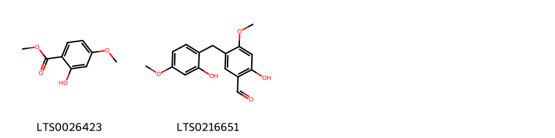
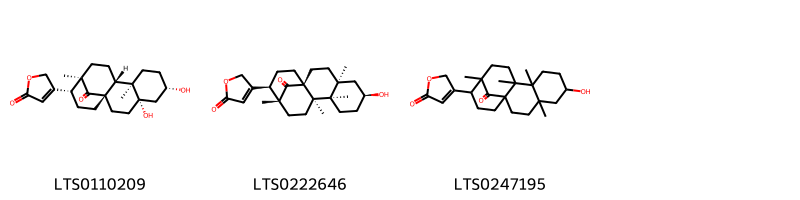
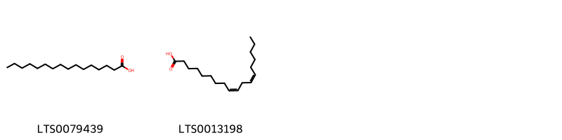
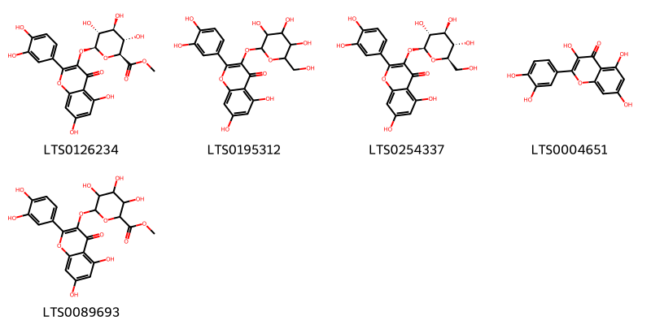
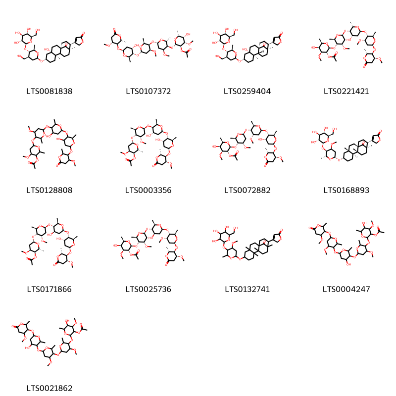
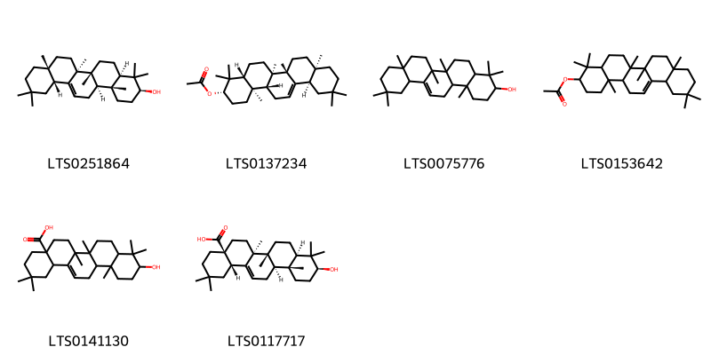
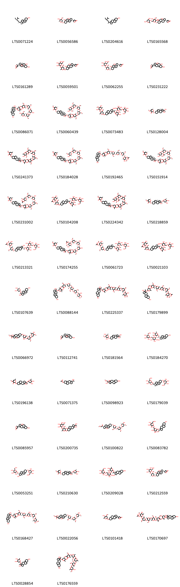

!!! abstract "Tóm tắt"
    Hương gia bì ( Vỏ rễ) (Cortex Periplocae), tên latin loài Periploca sepium Bunge, thuộc họ Thiên lý - Asclepiadaceae. Có nguồn gôc bản địa tại Trung Quốc Bắc-Trung, Trung Quốc Nam-Trung, Trung Quốc Đông Nam, Nội Mông, Mãn Châu, Primorye, Thanh Hải, Tây Tạng, Tân Cương. Không phân bố tại Việt Nam. Tác dụng dược lý bao gồm chống viêm, chống khối u, tác dụng trợ tim, tác dụng lên hệ thần kinh, phân hóa tế bào và tác dụng diệt côn trùng. Thành phần hóa học chứa glycoside C -steroid, glycoside tim, terpenoid, tinh dầu dễ bay hơi và axit béo, v.v... Vỏ rễ Hương gia bì được dùng làm thuốc chữa đau lưng gối, đau gân khớp, tiểu tiện khó khăn, mụn nhọt, sang lở, sang chấn gãy xương. Liều dùng gày dùng từ 6 g đến 12 g, dạng sắc hoặc ngâm rượu.

## Thông tin về thực vật

### Đặc điểm thực vật

Dược liệu **Hương Gia Bì (Vỏ Rễ)** từ bộ phận **** từ loài *Periploca sepium Bge.* thuộc họ Apocynaceae. Hương gia bì là cây thân cỏ, sống lâu năm, mọc thẳng, có chiều cao trung bình từ 30 – 70cm. Cành phân làm nhiều nhánh, cành non vuông và có phủ lớp lông dày. Khi cây già có thân tròn, mập. Lá Hương gia bì là lá đơn, mọc đối chéo hình chữ thập. Phiến lá dày, mọng nước, có hình gần tròn hoặc hình trứng rộng, chiều dài khoảng 4 – 8cm và chiều rộng khoảng 3 – 6cm. Đỉnh lá tù hoặc nhọn, gốc lá hình cụt hoặc hình tròn, mép lá có răng cưa to, cả 2 mặt lá đều có lông ngắn. Gân chính của lá to, gân bên thì nhỏ, có 4 – 5 đôi, gân lá có hình mạng nổi rõ ở mặt dưới của lá. Lá có mùi thơm dễ chịu, gần giống mùi chanh, có vị chua. Cuống lá có lông, hình lòng máng, với chiều dài khoảng 2 – 4cm. Hoa Hương gia bì rất hiếm. 

!!! info "Phân loại thực vật của *Periploca sepium*"
    - **Kingdom:** Plantae
    - **Phylum:** Tracheophyta
    - **Order:** Gentianales
    - **Family:** Apocynaceae
    - **Genus:** Periploca
    - **Species:** *Periploca sepium*

*Tài liệu tham khảo:* Tài liệu khác

 

### Loài thay thế (Nếu có)

### Phân bố trên thế giới
**Từ vườn thực vật KEW: **: Nguồn bản địa: Trung Quốc Bắc-Trung, Trung Quốc Nam-Trung, Trung Quốc Đông Nam, Nội Mông, Mãn Châu, Primorye, Thanh Hải, Tây Tạng, Tân Cương

**Từ CSDL GIBF** nan, China, United States of America, unknown or invalid, Russian Federation

### Phân bố tại Việt Nam
** Tài liệu khác**: Cây Hương gia bì không phân bố tại Việt

**Từ CSDL GIBF**: Không có ghi nhận ở Việt Nam

---

## Thông tin về dược liệu 

### Định danh

!!! info "Thông tin về tên gọi của hương gia bì"
    - Dược liệu tiếng Việt: hương gia bì
    - Dược liệu tiếng Trung:  ()
    - Dược liệu tiếng Anh: 
    - Dược liệu latin thông dụng: Cortex PeriplocaenPeriplocae Cortex
    - Dược liệu latin kiểu DĐVN: cortex periplocae
    - Dược liệu latin kiểu DĐVN: Periplocae Cortex
    - Dược liệu latin kiểu thông tư: 
    - Bộ phận dùng:  (Cortex)

### Mô tả dược liệu 
- **Theo dược điển Việt nam V:** Mảnh vỏ dày từ 0,5 mm đến 3 mm có hình ống hoặc hình máng, dài 3 cm đến 17 cm hoặc có thể dài hơn, thường cuộn tròn thành ống. Mặt ngoài màu vàng nâu, xù xì, có các đường vân nứt dọc, không đều, dễ bong. Nhẹ, giòn, dễ gãy, mùi thơm hắc đặc biệt.

- **Mô tả dược liệu theo thông tư chế biến dược liệu theo phương pháp cổ truyền:** 

### Chế biến 

- **Chế biến theo dược điển việt nam V**: Thu lấy vỏ rễ, rửa sạch, phơi hoặc sấy khô. nn

- **Chế biến theo thông tư:** 

--- 

## Thành phần hóa học

- Theo tài liệu của GS. Đỗ Tất Lợi:  (1) Chứa glycoside C -steroid, glycoside tim, terpenoid, tinh dầu dễ bay hơi và axit béo, v.v..
    
- Theo cơ sở dữ liệu lotus: Từ loài *Periploca sepium* đã phân lập và xác định được 169 hoạt chất thuộc về các nhóm Dihydrofurans, Organooxygen compounds, Steroids and steroid derivatives, Prenol lipids, Fatty Acyls, Benzene and substituted derivatives, Coumarins and derivatives, Phenols, Flavonoids. 

|    | chemicalTaxonomyClassyfireClass     |   smiles_count |
|---:|:------------------------------------|---------------:|
|  0 | Benzene and substituted derivatives |              2 |
|  1 | Coumarins and derivatives           |              1 |
|  2 | Dihydrofurans                       |              3 |
|  3 | Fatty Acyls                         |              2 |
|  4 | Flavonoids                          |              5 |
|  5 | Organooxygen compounds              |             13 |
|  6 | Phenols                             |              1 |
|  7 | Prenol lipids                       |              6 |
|  8 | Steroids and steroid derivatives    |            135 |

### Nhóm Benzene and substituted derivatives
<figure markdown="span">
    { width=100% }
    <figcaption>Hình ảnh cấu trúc hóa học của 2 hoạt chất thuộc nhóm Benzene and substituted derivatives gồm ['methyl 2-hydroxy-4-methoxybenzoate (LTS0026423)', '2-hydroxy-5-[(2-hydroxy-4-methoxyphenyl)methyl]-4-methoxybenzaldehyde (LTS0216651)'].</figcaption>
</figure>
### Nhóm Coumarins and derivatives
<figure markdown="span">
    { width=100% }
    <figcaption>Hình ảnh cấu trúc hóa học của 1 hoạt chất thuộc nhóm Coumarins and derivatives gồm ['scopoletin (LTS0193112)'].</figcaption>
</figure>
### Nhóm Dihydrofurans
<figure markdown="span">
    { width=100% }
    <figcaption>Hình ảnh cấu trúc hóa học của 3 hoạt chất thuộc nhóm Dihydrofurans gồm ['4-[(1s,4s,6s,9r,10r,13r,14r)-4,6-dihydroxy-9,13-dimethyl-17-oxotetracyclo[11.3.1.0¹,¹⁰.0⁴,⁹]heptadecan-14-yl]-5h-furan-2-one (LTS0110209)', '4-[(1s,4s,6s,9r,10r,13r,14r)-6-hydroxy-4,9,10,13-tetramethyl-17-oxotetracyclo[11.3.1.0¹,¹⁰.0⁴,⁹]heptadecan-14-yl]-5h-furan-2-one (LTS0222646)', '4-{6-hydroxy-4,9,10,13-tetramethyl-17-oxotetracyclo[11.3.1.0¹,¹⁰.0⁴,⁹]heptadecan-14-yl}-5h-furan-2-one (LTS0247195)'].</figcaption>
</figure>
### Nhóm Fatty Acyls
<figure markdown="span">
    { width=100% }
    <figcaption>Hình ảnh cấu trúc hóa học của 2 hoạt chất thuộc nhóm Fatty Acyls gồm ['palmitic acid (LTS0079439)', 'linoleic (LTS0013198)'].</figcaption>
</figure>
### Nhóm Flavonoids
<figure markdown="span">
    { width=100% }
    <figcaption>Hình ảnh cấu trúc hóa học của 5 hoạt chất thuộc nhóm Flavonoids gồm ['methyl (2s,3s,4s,5r,6s)-6-{[2-(3,4-dihydroxyphenyl)-5,7-dihydroxy-4-oxochromen-3-yl]oxy}-3,4,5-trihydroxyoxane-2-carboxylate (LTS0126234)', '2-(3,4-dihydroxyphenyl)-5,7-dihydroxy-3-{[3,4,5-trihydroxy-6-(hydroxymethyl)oxan-2-yl]oxy}chromen-4-one (LTS0195312)', 'isoquercetin (LTS0254337)', 'quercetin (LTS0004651)', 'methyl 6-{[2-(3,4-dihydroxyphenyl)-5,7-dihydroxy-4-oxochromen-3-yl]oxy}-3,4,5-trihydroxyoxane-2-carboxylate (LTS0089693)'].</figcaption>
</figure>
### Nhóm Organooxygen compounds
<figure markdown="span">
    { width=100% }
    <figcaption>Hình ảnh cấu trúc hóa học của 13 hoạt chất thuộc nhóm Organooxygen compounds gồm ['4-[(1r,4s,6s,9r,13r,14r)-4-hydroxy-6-{[(2r,4s,5s,6r)-4-(hydroxymethyl)-6-methyl-5-{[(2r,3r,4s,5s,6r)-3,4,5-trihydroxy-6-(hydroxymethyl)oxan-2-yl]oxy}oxan-2-yl]oxy}-9,13-dimethyl-17-oxotetracyclo[11.3.1.0¹,¹⁰.0⁴,⁹]heptadecan-14-yl]-5h-furan-2-one (LTS0081838)', '(2s,3r,4s,5s,6r)-5-hydroxy-2-{[(2r,3r,4s,6s)-6-{[(2s,3r,4s,6s)-6-{[(2r,3s,4s,6s)-4-hydroxy-6-{[(2r,3r,4r)-4-methoxy-2-methyl-6-oxooxan-3-yl]oxy}-2-methyloxan-3-yl]oxy}-4-methoxy-2-methyloxan-3-yl]oxy}-4-methoxy-2-methyloxan-3-yl]oxy}-4-methoxy-6-methyloxan-3-yl acetate (LTS0107372)', '4-[(1r,4s,6s,9r,10r,13r,14r)-4-hydroxy-6-{[(2r,4s,5s,6r)-4-(hydroxymethyl)-6-methyl-5-{[(2r,3r,4s,5s,6r)-3,4,5-trihydroxy-6-(hydroxymethyl)oxan-2-yl]oxy}oxan-2-yl]oxy}-9,13-dimethyl-17-oxotetracyclo[11.3.1.0¹,¹⁰.0⁴,⁹]heptadecan-14-yl]-5h-furan-2-one (LTS0259404)', '(2s,3r,4s,5s,6r)-5-hydroxy-2-{[(2r,3r,4s,6s)-6-{[(2s,3s,4s,6s)-4-hydroxy-6-{[(2r,3r,4s,6s)-4-methoxy-6-{[(2r,3r,4r)-4-methoxy-2-methyl-6-oxooxan-3-yl]oxy}-2-methyloxan-3-yl]oxy}-2-methyloxan-3-yl]oxy}-4-methoxy-2-methyloxan-3-yl]oxy}-4-methoxy-6-methyloxan-3-yl acetate (LTS0221421)', '6-[(6-{[4-hydroxy-6-({4-hydroxy-6-[(4-methoxy-2-methyl-6-oxooxan-3-yl)oxy]-2-methyloxan-3-yl}oxy)-2-methyloxan-3-yl]oxy}-4-methoxy-2-methyloxan-3-yl)oxy]-4-methoxy-2-methyloxan-3-yl acetate (LTS0128808)', '(2r,3r,4s,6s)-6-{[(2r,3r,4s,6s)-6-{[(2r,3r,4s,6s)-4-hydroxy-6-{[(2r,3s,4s,6s)-4-hydroxy-6-{[(2r,3r,4r)-4-methoxy-2-methyl-6-oxooxan-3-yl]oxy}-2-methyloxan-3-yl]oxy}-2-methyloxan-3-yl]oxy}-4-methoxy-2-methyloxan-3-yl]oxy}-4-methoxy-2-methyloxan-3-yl acetate (LTS0003356)', '(2s,3r,4s,5s,6r)-5-hydroxy-2-{[(2r,3r,4s,6s)-6-{[(2r,3r,4s,6s)-6-{[(2r,3s,4s,6s)-4-hydroxy-6-{[(2r,3r,4r)-4-methoxy-2-methyl-6-oxooxan-3-yl]oxy}-2-methyloxan-3-yl]oxy}-4-methoxy-2-methyloxan-3-yl]oxy}-4-methoxy-2-methyloxan-3-yl]oxy}-4-methoxy-6-methyloxan-3-yl acetate (LTS0072882)', '4-[(1r,4s,6s,9s,10r,13r,14r)-6-{[(2r,4s,5r,6r)-4-methoxy-6-methyl-5-{[(2s,3r,4s,5s,6r)-3,4,5-trihydroxy-6-(hydroxymethyl)oxan-2-yl]oxy}oxan-2-yl]oxy}-4,9,10,13-tetramethyl-17-oxotetracyclo[11.3.1.0¹,¹⁰.0⁴,⁹]heptadecan-14-yl]-5h-furan-2-one (LTS0168893)', '(2r,3r,4s,6s)-6-{[(2r,3r,4s,6s)-6-{[(2r,3s,4r,6s)-4-hydroxy-6-{[(2r,3s,4s,6s)-4-hydroxy-6-{[(2r,3r,4r)-4-methoxy-2-methyl-6-oxooxan-3-yl]oxy}-2-methyloxan-3-yl]oxy}-2-methyloxan-3-yl]oxy}-4-methoxy-2-methyloxan-3-yl]oxy}-4-methoxy-2-methyloxan-3-yl acetate (LTS0171866)', '(2s,3r,4s,5s,6r)-5-hydroxy-2-{[(2r,3r,4s,6s)-6-{[(2r,3s,4r,6s)-4-hydroxy-6-{[(2r,3r,4s,6s)-4-methoxy-6-{[(2r,3r,4r)-4-methoxy-2-methyl-6-oxooxan-3-yl]oxy}-2-methyloxan-3-yl]oxy}-2-methyloxan-3-yl]oxy}-4-methoxy-2-methyloxan-3-yl]oxy}-4-methoxy-6-methyloxan-3-yl acetate (LTS0025736)', '4-{6-[(4-methoxy-6-methyl-5-{[3,4,5-trihydroxy-6-(hydroxymethyl)oxan-2-yl]oxy}oxan-2-yl)oxy]-4,9,10,13-tetramethyl-17-oxotetracyclo[11.3.1.0¹,¹⁰.0⁴,⁹]heptadecan-14-yl}-5h-furan-2-one (LTS0132741)', '5-hydroxy-2-[(6-{[4-hydroxy-6-({4-methoxy-6-[(4-methoxy-2-methyl-6-oxooxan-3-yl)oxy]-2-methyloxan-3-yl}oxy)-2-methyloxan-3-yl]oxy}-4-methoxy-2-methyloxan-3-yl)oxy]-4-methoxy-6-methyloxan-3-yl acetate (LTS0004247)', '5-hydroxy-2-[(6-{[6-({4-hydroxy-6-[(4-methoxy-2-methyl-6-oxooxan-3-yl)oxy]-2-methyloxan-3-yl}oxy)-4-methoxy-2-methyloxan-3-yl]oxy}-4-methoxy-2-methyloxan-3-yl)oxy]-4-methoxy-6-methyloxan-3-yl acetate (LTS0021862)'].</figcaption>
</figure>
### Nhóm Phenols
<figure markdown="span">
    { width=100% }
    <figcaption>Hình ảnh cấu trúc hóa học của 1 hoạt chất thuộc nhóm Phenols gồm ['4-methoxysalicylaldehyde (LTS0030238)'].</figcaption>
</figure>
### Nhóm Prenol lipids
<figure markdown="span">
    { width=100% }
    <figcaption>Hình ảnh cấu trúc hóa học của 6 hoạt chất thuộc nhóm Prenol lipids gồm ['β-amyrin (LTS0251864)', 'β-amyrin acetate (LTS0137234)', 'β-amyrin (LTS0075776)', '4,4,6a,6b,8a,11,11,14b-octamethyl-1,2,3,4a,5,6,7,8,9,10,12,12a,14,14a-tetradecahydropicen-3-yl acetate (LTS0153642)', 'oleanolic acid (LTS0141130)', 'oleanolic acid (LTS0117717)'].</figcaption>
</figure>
### Nhóm Steroids and steroid derivatives
<figure markdown="span">
    { width=100% }
    <figcaption>Hình ảnh cấu trúc hóa học của 135 hoạt chất thuộc nhóm Steroids and steroid derivatives gồm ['stigmast-5-en-3-ol (LTS0071224)', 'periplocymarin (LTS0056586)', 'stigmast-5-en-3-ol, (3β)- (LTS0204616)', '4-[(1r,3as,5as,7s,9ar,11ar)-7-{[(2r,5r)-6-({[(3r,6s)-4,6-dihydroxy-2-methyloxan-3-yl]oxy}methyl)-3,5-dihydroxy-4-methoxyoxan-2-yl]oxy}-3a,5a-dihydroxy-9a,11a-dimethyl-dodecahydro-1h-cyclopenta[a]phenanthren-1-yl]-5h-furan-2-one (LTS0165568)', 'periplogenin (LTS0161289)', 'periplocin (LTS0059501)', 'periplocin (LTS0062255)', '4-{3a,5a,7-trihydroxy-9a,11a-dimethyl-dodecahydro-1h-cyclopenta[a]phenanthren-1-yl}-5h-furan-2-one (LTS0231222)', "(1r,3as,3br,7s,9ar,9bs,11as)-1-[(1s)-1-[(2s,4r,5r,5'ar,6r,7's,9'r,9'ar)-5-{[(2s,4s,5r,6r)-5-{[(2s,4r,5s,6r)-4-hydroxy-5-{[(2s,4s,5r,6r)-5-{[(2s,4s,5r,6r)-5-hydroxy-4-methoxy-6-methyloxan-2-yl]oxy}-4-methoxy-6-methyloxan-2-yl]oxy}-6-methyloxan-2-yl]oxy}-4-methoxy-6-methyloxan-2-yl]oxy}-4-methoxy-6,9'-dimethyl-hexahydrospiro[oxane-2,3'-pyrano[3,4-c][1,2,5]trioxepin]-7'-yloxy]ethyl]-9a,11a-dimethyl-2h,3h,3ah,3bh,4h,6h,7h,8h,9h,9bh,10h,11h-cyclopenta[a]phenanthrene-1,7-diol (LTS0086071)", "(2s,6s)-2-{[(1s,3as,3br,7s,9ar,9bs,11ar)-1-[(1r)-1-[(2r,4r,5r,5'ar,6s,7'r,9's,9'as)-5-{[(2r,4r,5r,6s)-5-{[(2s,4r,5s,6r)-5-{[(2r,4r,5r,6s)-5-{[(2r,3s,4r,5s,6s)-3,5-dihydroxy-4-methoxy-6-methyloxan-2-yl]oxy}-4-methoxy-6-methyloxan-2-yl]oxy}-4-methoxy-6-methyloxan-2-yl]oxy}-4-methoxy-6-methyloxan-2-yl]oxy}-4-methoxy-6,9'-dimethyl-hexahydrospiro[oxane-2,3'-pyrano[3,4-c][1,2,5]trioxepin]-7'-yloxy]ethyl]-1-hydroxy-9a,11a-dimethyl-2h,3h,3ah,3bh,4h,6h,7h,8h,9h,9bh,10h,11h-cyclopenta[a]phenanthren-7-yl]oxy}-4-methoxy-6-methyl-2,6-dihydropyran-3-one (LTS0060439)", '2-[(2-{1-[7-({5-[(3,5-dihydroxy-4-methoxy-6-methyloxan-2-yl)oxy]-4-methoxy-6-methyloxan-2-yl}oxy)-2-hydroxy-9a,11a-dimethyl-1h,2h,3h,3ah,3bh,4h,6h,7h,8h,9h,9bh,10h,11h-cyclopenta[a]phenanthren-1-yl]ethoxy}-5-hydroxy-4-methoxy-6-methyloxan-3-yl)oxy]-6-({[3,4,5-trihydroxy-6-(hydroxymethyl)oxan-2-yl]oxy}methyl)oxane-3,4,5-triol (LTS0073483)', '(2r,6s)-2-{[(1r,3as,3br,7s,9ar,9bs,11as)-1-hydroxy-1-[(1s)-1-hydroxyethyl]-9a,11a-dimethyl-2h,3h,3ah,3bh,4h,6h,7h,8h,9h,9bh,10h,11h-cyclopenta[a]phenanthren-7-yl]oxy}-4-methoxy-6-methyl-2,6-dihydropyran-3-one (LTS0128004)', "2-{[1-(1-{5-[(5-{[5-({5-[(3,5-dihydroxy-4-methoxy-6-methyloxan-2-yl)oxy]-4-methoxy-6-methyloxan-2-yl}oxy)-4-methoxy-6-methyloxan-2-yl]oxy}-4-methoxy-6-methyloxan-2-yl)oxy]-4-methoxy-6,9'-dimethyl-hexahydrospiro[oxane-2,3'-pyrano[3,4-c][1,2,5]trioxepin]-7'-yloxy}ethyl)-1-hydroxy-9a,11a-dimethyl-2h,3h,3ah,3bh,4h,6h,7h,8h,9h,9bh,10h,11h-cyclopenta[a]phenanthren-7-yl]oxy}-4-methoxy-6-methyl-2,6-dihydropyran-3-one (LTS0241373)", "(2r,6r)-2-{[(1r,3as,3br,7s,9ar,9bs,11as)-1-[(1s)-1-[(2s,4r,5r,5'ar,6r,7's,9'r,9'ar)-5-{[(2s,4s,5r,6r)-5-{[(2s,4r,5s,6r)-4-hydroxy-5-{[(2s,4s,5r,6r)-5-{[(2s,4s,5r,6r)-5-hydroxy-4-methoxy-6-methyloxan-2-yl]oxy}-4-methoxy-6-methyloxan-2-yl]oxy}-6-methyloxan-2-yl]oxy}-4-methoxy-6-methyloxan-2-yl]oxy}-4-methoxy-6,9'-dimethyl-hexahydrospiro[oxane-2,3'-pyrano[3,4-c][1,2,5]trioxepin]-7'-yloxy]ethyl]-1-hydroxy-9a,11a-dimethyl-2h,3h,3ah,3bh,4h,6h,7h,8h,9h,9bh,10h,11h-cyclopenta[a]phenanthren-7-yl]oxy}-4-methoxy-6-methyl-2,6-dihydropyran-3-one (LTS0184028)", "(2r,3s,4r,5s,6s)-2-{[(2s,3r,4s,6r)-6-{[(2s,3r,4s,6r)-6-{[(2r,3s,4s,6r)-6-[(2s,4r,5r,5'as,6r,7'r,9's,9'ar)-7'-[(1s)-1-[(1s,3as,3bs,7r,9ar,9bs,11as)-1,7-dihydroxy-9a,11a-dimethyl-2h,3h,3ah,3bh,4h,6h,7h,8h,9h,9bh,10h,11h-cyclopenta[a]phenanthren-1-yl]ethoxy]-4-methoxy-6,9'-dimethyl-hexahydrospiro[oxane-2,3'-pyrano[3,4-c][1,2,5]trioxepine]oxy]-4-methoxy-2-methyloxan-3-yl]oxy}-4-methoxy-2-methyloxan-3-yl]oxy}-4-methoxy-2-methyloxan-3-yl]oxy}-5-hydroxy-4-methoxy-6-methyloxan-3-yl acetate (LTS0192465)", "(2r,3s,4r,5s,6r)-2-{[(2r,3r,4r,6s)-6-{[(2s,3r,4s,6s)-6-{[(2r,3s,4r,6r)-6-[(2r,4s,5s,5'ar,6s,7'r,9'r,9'ar)-7'-[(1r)-1-[(1r,3ar,3bs,7r,9as,9br,11as)-1-hydroxy-7-{[(2r,6s)-4-methoxy-6-methyl-3-oxo-2,6-dihydropyran-2-yl]oxy}-9a,11a-dimethyl-2h,3h,3ah,3bh,4h,6h,7h,8h,9h,9bh,10h,11h-cyclopenta[a]phenanthren-1-yl]ethoxy]-4-methoxy-6,9'-dimethyl-hexahydrospiro[oxane-2,3'-pyrano[3,4-c][1,2,5]trioxepine]oxy]-4-methoxy-2-methyloxan-3-yl]oxy}-4-methoxy-2-methyloxan-3-yl]oxy}-4-methoxy-2-methyloxan-3-yl]oxy}-5-hydroxy-4-methoxy-6-methyloxan-3-yl acetate (LTS0151914)", "(2r,3r,4s,6s)-6-{[(2r,3r,4s,6s)-6-{[(2r,3s,4r,6s)-6-{[(2r,3r,4s,6s)-6-[(2s,4r,5r,5'ar,6r,7's,9'r,9'ar)-7'-[(1s)-1-[(1r,3as,3br,7s,9ar,9bs,11as)-1-hydroxy-7-{[(2s,6r)-4-methoxy-6-methyl-3-oxo-2,6-dihydropyran-2-yl]oxy}-9a,11a-dimethyl-2h,3h,3ah,3bh,4h,6h,7h,8h,9h,9bh,10h,11h-cyclopenta[a]phenanthren-1-yl]ethoxy]-4-methoxy-6,9'-dimethyl-hexahydrospiro[oxane-2,3'-pyrano[3,4-c][1,2,5]trioxepine]oxy]-4-methoxy-2-methyloxan-3-yl]oxy}-4-hydroxy-2-methyloxan-3-yl]oxy}-4-methoxy-2-methyloxan-3-yl]oxy}-4-methoxy-2-methyloxan-3-yl acetate (LTS0231002)", '5-hydroxy-2-({6-[(1-{1-[(5-hydroxy-4-methoxy-6-methyl-3-{[3,4,5-trihydroxy-6-({[3,4,5-trihydroxy-6-(hydroxymethyl)oxan-2-yl]oxy}methyl)oxan-2-yl]oxy}oxan-2-yl)oxy]ethyl}-9a,11a-dimethyl-1h,2h,3h,3ah,3bh,4h,6h,7h,8h,9h,9bh,10h,11h-cyclopenta[a]phenanthren-7-yl)oxy]-4-methoxy-2-methyloxan-3-yl}oxy)-4-methoxy-6-methyloxan-3-yl acetate (LTS0104208)', "5-hydroxy-2-[(6-{[6-({6-[7'-(1-{1-hydroxy-7-[(4-methoxy-6-methyl-3-oxo-2,6-dihydropyran-2-yl)oxy]-9a,11a-dimethyl-2h,3h,3ah,3bh,4h,6h,7h,8h,9h,9bh,10h,11h-cyclopenta[a]phenanthren-1-yl}ethoxy)-4-methoxy-6,9'-dimethyl-hexahydrospiro[oxane-2,3'-pyrano[3,4-c][1,2,5]trioxepine]oxy]-4-methoxy-2-methyloxan-3-yl}oxy)-4-methoxy-2-methyloxan-3-yl]oxy}-4-methoxy-2-methyloxan-3-yl)oxy]-4-methoxy-6-methyloxan-3-yl acetate (LTS0224342)", '(2r,6s)-2-{[(1r,3as,3br,7s,9ar,9bs,11as)-1-[(1r)-1-{[(2r,4s,5s,6s)-4,5-dihydroxy-6-methyloxan-2-yl]oxy}ethyl]-1-hydroxy-9a,11a-dimethyl-2h,3h,3ah,3bh,4h,6h,7h,8h,9h,9bh,10h,11h-cyclopenta[a]phenanthren-7-yl]oxy}-4-methoxy-6-methyl-2,6-dihydropyran-3-one (LTS0218859)', '(2s,3r,4s,5s,6r)-2-{[(2r,3r,4s,6r)-6-{[(1r,2r,3as,3bs,7s,9ar,9bs,11as)-2-hydroxy-1-[(1s)-1-{[(2r,3r,4s,5s,6r)-5-hydroxy-4-methoxy-6-methyl-3-{[(2s,3r,4s,5s,6r)-3,4,5-trihydroxy-6-({[(2r,3r,4s,5s,6r)-3,4,5-trihydroxy-6-(hydroxymethyl)oxan-2-yl]oxy}methyl)oxan-2-yl]oxy}oxan-2-yl]oxy}ethyl]-9a,11a-dimethyl-1h,2h,3h,3ah,3bh,4h,6h,7h,8h,9h,9bh,10h,11h-cyclopenta[a]phenanthren-7-yl]oxy}-4-methoxy-2-methyloxan-3-yl]oxy}-5-hydroxy-4-methoxy-6-methyloxan-3-yl acetate (LTS0213321)', "(2s,3r,4s,5s,6r)-2-{[(2r,3r,4s,6s)-6-{[(2r,3s,4r,6s)-6-{[(2r,3s,4s,6s)-6-[(2s,4r,5r,5'ar,6r,7's,9'r,9'ar)-7'-[(1s)-1-[(1r,3as,3br,7s,9ar,9bs,11as)-1-hydroxy-7-{[(2s,6r)-4-methoxy-6-methyl-3-oxo-2,6-dihydropyran-2-yl]oxy}-9a,11a-dimethyl-2h,3h,3ah,3bh,4h,6h,7h,8h,9h,9bh,10h,11h-cyclopenta[a]phenanthren-1-yl]ethoxy]-4-methoxy-6,9'-dimethyl-hexahydrospiro[oxane-2,3'-pyrano[3,4-c][1,2,5]trioxepine]oxy]-4-hydroxy-2-methyloxan-3-yl]oxy}-4-hydroxy-2-methyloxan-3-yl]oxy}-4-methoxy-2-methyloxan-3-yl]oxy}-5-hydroxy-4-methoxy-6-methyloxan-3-yl acetate (LTS0174255)", '(2s,3r,4s,5s,6r)-2-{[(2r,3r,4s,6r)-6-{[(1s,3as,3bs,7s,9ar,9bs,11as)-1-[(1s)-1-{[(2r,3r,4s,5s,6r)-5-hydroxy-4-methoxy-6-methyl-3-{[(2s,3r,4s,5s,6r)-3,4,5-trihydroxy-6-({[(2r,3r,4s,5s,6r)-3,4,5-trihydroxy-6-(hydroxymethyl)oxan-2-yl]oxy}methyl)oxan-2-yl]oxy}oxan-2-yl]oxy}ethyl]-9a,11a-dimethyl-1h,2h,3h,3ah,3bh,4h,6h,7h,8h,9h,9bh,10h,11h-cyclopenta[a]phenanthren-7-yl]oxy}-4-methoxy-2-methyloxan-3-yl]oxy}-5-hydroxy-4-methoxy-6-methyloxan-3-yl acetate (LTS0061723)', '5-hydroxy-2-({6-[(2-hydroxy-1-{1-[(5-hydroxy-4-methoxy-6-methyl-3-{[3,4,5-trihydroxy-6-({[3,4,5-trihydroxy-6-(hydroxymethyl)oxan-2-yl]oxy}methyl)oxan-2-yl]oxy}oxan-2-yl)oxy]ethyl}-9a,11a-dimethyl-1h,2h,3h,3ah,3bh,4h,6h,7h,8h,9h,9bh,10h,11h-cyclopenta[a]phenanthren-7-yl)oxy]-4-methoxy-2-methyloxan-3-yl}oxy)-4-methoxy-6-methyloxan-3-yl acetate (LTS0021103)', '(2s,3s,4s,6r)-6-[(1s)-1-[(1r,3as,3br,7s,9ar,9bs,11as)-1,7-dihydroxy-9a,11a-dimethyl-2h,3h,3ah,3bh,4h,6h,7h,8h,9h,9bh,10h,11h-cyclopenta[a]phenanthren-1-yl]ethoxy]-2-methyloxane-3,4-diol (LTS0107639)', "(2r,3s,4s,5r,6s)-2-{[(2s,3r,4s,6r)-6-{[(2r,3s,4s,6s)-6-{[(2r,3s,4r,6s)-6-[(2s,4r,5r,5'ar,6s,7's,9'r,9'as)-7'-[(1s)-1-[(1s,3as,3bs,7s,9as,9br,11ar)-1,7-dihydroxy-9a,11a-dimethyl-2h,3h,3ah,3bh,4h,6h,7h,8h,9h,9bh,10h,11h-cyclopenta[a]phenanthren-1-yl]ethoxy]-4-methoxy-6,9'-dimethyl-hexahydrospiro[oxane-2,3'-pyrano[3,4-c][1,2,5]trioxepine]oxy]-4-methoxy-2-methyloxan-3-yl]oxy}-4-methoxy-2-methyloxan-3-yl]oxy}-4-methoxy-2-methyloxan-3-yl]oxy}-4-methoxy-6-methyloxane-3,5-diol (LTS0088144)", "2-[(6-{[6-({6-[7'-(1-{1,7-dihydroxy-9a,11a-dimethyl-2h,3h,3ah,3bh,4h,6h,7h,8h,9h,9bh,10h,11h-cyclopenta[a]phenanthren-1-yl}ethoxy)-4-methoxy-6,9'-dimethyl-hexahydrospiro[oxane-2,3'-pyrano[3,4-c][1,2,5]trioxepine]oxy]-4-methoxy-2-methyloxan-3-yl}oxy)-4-methoxy-2-methyloxan-3-yl]oxy}-4-methoxy-2-methyloxan-3-yl)oxy]-4-methoxy-6-methyloxane-3,5-diol (LTS0225337)", "2-[(6-{[6-({6-[8'-(1-{1,7-dihydroxy-9a,11a-dimethyl-2h,3h,3ah,3bh,4h,6h,7h,8h,9h,9bh,10h,11h-cyclopenta[a]phenanthren-1-yl}ethoxy)-4-methoxy-6,6'-dimethyl-hexahydrospiro[oxane-2,4'-pyrano[3,4-f][1,3,5]trioxepine]oxy]-4-methoxy-2-methyloxan-3-yl}oxy)-4-methoxy-2-methyloxan-3-yl]oxy}-4-methoxy-2-methyloxan-3-yl)oxy]-5-hydroxy-4-methoxy-6-methyloxan-3-yl acetate (LTS0179899)", '1-(1,3a-dihydroxy-7-{[4-hydroxy-5-({5-[(5-hydroxy-4-methoxy-6-methyloxan-2-yl)oxy]-4-methoxy-6-methyloxan-2-yl}oxy)-6-methyloxan-2-yl]oxy}-9a,11a-dimethyl-2h,3h,3bh,4h,6h,7h,8h,9h,9bh,10h,11h-cyclopenta[a]phenanthren-1-yl)-2-methoxyethanone (LTS0066972)', '4-[(1r,3as,3bs,7s,9ar,9bs,11ar)-3a,7-dihydroxy-9a,11a-dimethyl-1h,2h,3h,3bh,4h,6h,7h,8h,9h,9bh,10h,11h-cyclopenta[a]phenanthren-1-yl]-5h-furan-2-one (LTS0112741)', '(2r,3r,4s,5s,6r)-2-{[(1r,3as,3br,7s,9ar,9bs,11as)-1-hydroxy-1-[(1s)-1-hydroxyethyl]-9a,11a-dimethyl-2h,3h,3ah,3bh,4h,6h,7h,8h,9h,9bh,10h,11h-cyclopenta[a]phenanthren-7-yl]oxy}-4-methoxy-6-methyloxane-3,5-diol (LTS0181564)', '(2s,3r,4s,5s,6r)-2-{[(2r,3r,4s,5s,6r)-2-[(1r)-1-[(1r,2s,3as,3bs,7s,9ar,9bs,11as)-2,7-dihydroxy-9a,11a-dimethyl-1h,2h,3h,3ah,3bh,4h,6h,7h,8h,9h,9bh,10h,11h-cyclopenta[a]phenanthren-1-yl]ethoxy]-5-hydroxy-4-methoxy-6-methyloxan-3-yl]oxy}-6-({[(2r,3r,4s,5s,6r)-3,4,5-trihydroxy-6-(hydroxymethyl)oxan-2-yl]oxy}methyl)oxane-3,4,5-triol (LTS0184270)', '2-[(1-{1-[(4,5-dihydroxy-6-methyloxan-2-yl)oxy]ethyl}-1-hydroxy-9a,11a-dimethyl-2h,3h,3ah,3bh,4h,6h,7h,8h,9h,9bh,10h,11h-cyclopenta[a]phenanthren-7-yl)oxy]-4-methoxy-6-methyl-2,6-dihydropyran-3-one (LTS0196138)', '1-(1-hydroxyethyl)-9a,11a-dimethyl-1h,2h,3h,3ah,3bh,4h,6h,7h,8h,9h,9bh,10h,11h-cyclopenta[a]phenanthren-7-yl acetate (LTS0071375)', '1-(1-hydroxy-2-methoxyethyl)-9a,11a-dimethyl-2h,3bh,4h,6h,7h,8h,9h,9bh,10h,11h-cyclopenta[a]phenanthrene-1,7-diol (LTS0098923)', '(2r,3r,4s,5s,6r)-2-[(1s)-1-[(1s,3as,3bs,7s,9ar,9bs,11as)-9a,11a-dimethyl-7-{[(2r,3r,4s,5s,6r)-3,4,5-trihydroxy-6-(hydroxymethyl)oxan-2-yl]oxy}-1h,2h,3h,3ah,3bh,4h,6h,7h,8h,9h,9bh,10h,11h-cyclopenta[a]phenanthren-1-yl]ethoxy]-6-(hydroxymethyl)oxane-3,4,5-triol (LTS0179039)', '4-{3a,7-dihydroxy-9a,11a-dimethyl-1h,2h,3h,3bh,4h,6h,7h,8h,9h,9bh,10h,11h-cyclopenta[a]phenanthren-1-yl}-5h-furan-2-one (LTS0085957)', '2-[(5-hydroxy-6-{[1-hydroxy-1-(1-hydroxyethyl)-9a,11a-dimethyl-2h,3h,3ah,3bh,4h,6h,7h,8h,9h,9bh,10h,11h-cyclopenta[a]phenanthren-7-yl]oxy}-4-methoxy-2-methyloxan-3-yl)oxy]-6-(hydroxymethyl)oxane-3,4,5-triol (LTS0200735)', '1-[(1s,3as,3br,7s,9ar,9bs,11ar)-3a-hydroxy-7-{[(2r,4s,5r,6r)-5-{[(2s,4s,5r,6r)-5-{[(2s,4r,5r,6r)-5-hydroxy-4-methoxy-6-methyloxan-2-yl]oxy}-4-methoxy-6-methyloxan-2-yl]oxy}-4-methoxy-6-methyloxan-2-yl]oxy}-9a,11a-dimethyl-1h,2h,3h,3bh,4h,6h,7h,8h,9h,9bh,10h,11h-cyclopenta[a]phenanthren-1-yl]-2-methoxyethanone (LTS0100822)', '2-(1-{7-hydroxy-9a,11a-dimethyl-1h,2h,3h,3ah,3bh,4h,6h,7h,8h,9h,9bh,10h,11h-cyclopenta[a]phenanthren-1-yl}ethoxy)-6-({[3,4,5-trihydroxy-6-(hydroxymethyl)oxan-2-yl]oxy}methyl)oxane-3,4,5-triol (LTS0083782)', '(2r,3r,4s,5s,6r)-2-[(1s)-1-[(1r,2r,3as,3bs,7s,9ar,9bs,11as)-2-hydroxy-9a,11a-dimethyl-7-{[(2r,3r,4s,5s,6r)-3,4,5-trihydroxy-6-(hydroxymethyl)oxan-2-yl]oxy}-1h,2h,3h,3ah,3bh,4h,6h,7h,8h,9h,9bh,10h,11h-cyclopenta[a]phenanthren-1-yl]ethoxy]-6-(hydroxymethyl)oxane-3,4,5-triol (LTS0053251)', '(2r,6s)-2-{[(1r,3as,3br,7s,9ar,9bs,11as)-1-[(1s)-1-{[(2r,4s,5s,6s)-4,5-dihydroxy-6-methyloxan-2-yl]oxy}ethyl]-1-hydroxy-9a,11a-dimethyl-2h,3h,3ah,3bh,4h,6h,7h,8h,9h,9bh,10h,11h-cyclopenta[a]phenanthren-7-yl]oxy}-4-methoxy-6-methyl-2,6-dihydropyran-3-one (LTS0210630)', '2-{[2-(1-{2,7-dihydroxy-9a,11a-dimethyl-1h,2h,3h,3ah,3bh,4h,6h,7h,8h,9h,9bh,10h,11h-cyclopenta[a]phenanthren-1-yl}ethoxy)-5-hydroxy-4-methoxy-6-methyloxan-3-yl]oxy}-6-({[3,4,5-trihydroxy-6-(hydroxymethyl)oxan-2-yl]oxy}methyl)oxane-3,4,5-triol (LTS0209028)', '4-[(1r,3as,3br,5as,7s,9ar,9bs,11ar)-3a,5a-dihydroxy-7-{[(2r,4s,5s,6r)-4-methoxy-6-methyl-5-{[(2s,3r,4s,5s,6r)-3,4,5-trihydroxy-6-(hydroxymethyl)oxan-2-yl]oxy}oxan-2-yl]oxy}-9a,11a-dimethyl-dodecahydro-1h-cyclopenta[a]phenanthren-1-yl]-5h-furan-2-one (LTS0212559)', "(1r,3as,3br,7s,9ar,9bs,11as)-1-[(1s)-1-[(2s,4r,5r,5'ar,6r,7's,9'r,9'ar)-5-{[(2s,4s,5r,6r)-5-{[(2s,4r,5s,6r)-4-hydroxy-5-{[(2s,4s,5r,6r)-5-{[(2s,4r,5r,6r)-5-hydroxy-4-methoxy-6-methyloxan-2-yl]oxy}-4-methoxy-6-methyloxan-2-yl]oxy}-6-methyloxan-2-yl]oxy}-4-methoxy-6-methyloxan-2-yl]oxy}-4-methoxy-6,9'-dimethyl-hexahydrospiro[oxane-2,3'-pyrano[3,4-c][1,2,5]trioxepin]-7'-yloxy]ethyl]-9a,11a-dimethyl-2h,3h,3ah,3bh,4h,6h,7h,8h,9h,9bh,10h,11h-cyclopenta[a]phenanthrene-1,7-diol (LTS0168427)", '1-[(1s,3as,3br,7s,9ar,9bs,11as)-1,3a-dihydroxy-7-{[(2r,4s,5r,6r)-5-{[(2s,4s,5r,6r)-5-{[(2s,4r,5r,6r)-5-hydroxy-4-methoxy-6-methyloxan-2-yl]oxy}-4-methoxy-6-methyloxan-2-yl]oxy}-4-methoxy-6-methyloxan-2-yl]oxy}-9a,11a-dimethyl-2h,3h,3bh,4h,6h,7h,8h,9h,9bh,10h,11h-cyclopenta[a]phenanthren-1-yl]-2-methoxyethanone (LTS0022056)', '4-{7-[(5-hydroxy-4-methoxy-6-methyloxan-2-yl)oxy]-3a,9a,11a-trimethyl-tetradecahydrocyclopenta[a]phenanthren-1-yl}-5h-furan-2-one (LTS0101418)', "2-[(6-{[6-({6-[9'-(1-{1,7-dihydroxy-9a,11a-dimethyl-2h,3h,3ah,3bh,4h,6h,7h,8h,9h,9bh,10h,11h-cyclopenta[a]phenanthren-1-yl}ethoxy)-4-methoxy-6,7'-dimethyl-hexahydro-2'h-spiro[oxane-2,4'-pyrano[4,3-d][1,3,6]trioxocine]oxy]-4-methoxy-2-methyloxan-3-yl}oxy)-4-methoxy-2-methyloxan-3-yl]oxy}-4-methoxy-2-methyloxan-3-yl)oxy]-5-hydroxy-4-methoxy-6-methyloxan-3-yl acetate (LTS0170697)", '6-(1-{1,7-dihydroxy-9a,11a-dimethyl-2h,3h,3ah,3bh,4h,6h,7h,8h,9h,9bh,10h,11h-cyclopenta[a]phenanthren-1-yl}ethoxy)-2-methyloxane-3,4-diol (LTS0028854)', "1-(1-{5-[(5-{[5-({5-[(4-hydroxy-5-methoxy-6-methyloxan-2-yl)oxy]-4-methoxy-6-methyloxan-2-yl}oxy)-4-methoxy-6-methyloxan-2-yl]oxy}-4-methoxy-6-methyloxan-2-yl)oxy]-4-methoxy-6,9'-dimethyl-hexahydrospiro[oxane-2,3'-pyrano[3,4-c][1,2,5]trioxepin]-7'-yloxy}ethyl)-9a,11a-dimethyl-2h,3h,3ah,3bh,4h,6h,7h,8h,9h,9bh,10h,11h-cyclopenta[a]phenanthrene-1,7-diol (LTS0176559)", '4-[(3as,3br,5as,9ar,9br,11ar)-3a,5a-dihydroxy-7-[(5-hydroxy-4-methoxy-6-methyloxan-2-yl)oxy]-9a,11a-dimethyl-dodecahydro-1h-cyclopenta[a]phenanthren-1-yl]-5h-furan-2-one (LTS0161457)', '(1s,3as,3bs,7s,9ar,9bs,11as)-1-[(1r)-1-hydroxyethyl]-9a,11a-dimethyl-1h,2h,3h,3ah,3bh,4h,6h,7h,8h,9h,9bh,10h,11h-cyclopenta[a]phenanthren-7-yl acetate (LTS0115824)', '2-{[1-hydroxy-1-(1-{[5-hydroxy-4-(methoxymethoxy)-6-methyloxan-2-yl]oxy}ethyl)-9a,11a-dimethyl-2h,3h,3ah,3bh,4h,6h,7h,8h,9h,9bh,10h,11h-cyclopenta[a]phenanthren-7-yl]oxy}-4-methoxy-6-methyl-2,6-dihydropyran-3-one (LTS0030131)', '(2s,3r,4s,5s,6r)-2-{[(2r,3s,4r,5r,6r)-6-{[(1r,3as,3br,7s,9ar,9bs,11as)-1-hydroxy-1-[(1s)-1-hydroxyethyl]-9a,11a-dimethyl-2h,3h,3ah,3bh,4h,6h,7h,8h,9h,9bh,10h,11h-cyclopenta[a]phenanthren-7-yl]oxy}-5-hydroxy-4-methoxy-2-methyloxan-3-yl]oxy}-6-(hydroxymethyl)oxane-3,4,5-triol (LTS0183646)', '1-[(1s,3as,3br,7s,9ar,9bs,11as)-1,3a-dihydroxy-7-{[(2r,4s,5s,6r)-4-hydroxy-5-{[(2s,4s,5r,6r)-5-{[(2s,4r,5r,6r)-5-hydroxy-4-methoxy-6-methyloxan-2-yl]oxy}-4-methoxy-6-methyloxan-2-yl]oxy}-6-methyloxan-2-yl]oxy}-9a,11a-dimethyl-2h,3h,3bh,4h,6h,7h,8h,9h,9bh,10h,11h-cyclopenta[a]phenanthren-1-yl]-2-methoxyethanone (LTS0089901)', '(1s,3as,3br,7s,9ar,9bs,11as)-1-[(1s)-1-hydroxy-2-methoxyethyl]-7-{[(2r,4s,5s,6r)-4-hydroxy-5-{[(2s,4s,5r,6r)-5-{[(2s,4r,5r,6r)-5-hydroxy-4-methoxy-6-methyloxan-2-yl]oxy}-4-methoxy-6-methyloxan-2-yl]oxy}-6-methyloxan-2-yl]oxy}-9a,11a-dimethyl-2h,3h,3bh,4h,6h,7h,8h,9h,9bh,10h,11h-cyclopenta[a]phenanthrene-1,3a-diol (LTS0155278)', "(2s,3r,4s,5s,6r)-2-{[(2r,3r,4s,6s)-6-{[(2r,3r,4s,6s)-6-{[(2r,3r,4s,6s)-6-[(2s,4r,5r,5'ar,6r,7's,9'r,9'ar)-7'-[(1s)-1-[(1r,3as,3br,7s,9ar,9bs,11as)-1,7-dihydroxy-9a,11a-dimethyl-2h,3h,3ah,3bh,4h,6h,7h,8h,9h,9bh,10h,11h-cyclopenta[a]phenanthren-1-yl]ethoxy]-4-methoxy-6,9'-dimethyl-hexahydrospiro[oxane-2,3'-pyrano[3,4-c][1,2,5]trioxepine]oxy]-4-methoxy-2-methyloxan-3-yl]oxy}-4-methoxy-2-methyloxan-3-yl]oxy}-4-methoxy-2-methyloxan-3-yl]oxy}-5-hydroxy-4-methoxy-6-methyloxan-3-yl acetate (LTS0200198)", '2-[(1-{1-[(4,5-dihydroxy-6-methyloxan-2-yl)oxy]ethyl}-1-hydroxy-9a,11a-dimethyl-2h,3h,3ah,3bh,4h,6h,7h,8h,9h,9bh,10h,11h-cyclopenta[a]phenanthren-7-yl)oxy]-4,6-dimethyl-2,6-dihydropyran-3-one (LTS0122999)', '(2s,3r,4s,5s,6r)-2-{[(2r,3s,4r,5r,6r)-6-{[(1s,3as,3bs,7s,9ar,9bs,11as)-9a,11a-dimethyl-1-[(1s)-1-{[(2r,3r,4s,5s,6r)-3,4,5-trihydroxy-6-({[(2r,3r,4s,5s,6r)-3,4,5-trihydroxy-6-(hydroxymethyl)oxan-2-yl]oxy}methyl)oxan-2-yl]oxy}ethyl]-1h,2h,3h,3ah,3bh,4h,6h,7h,8h,9h,9bh,10h,11h-cyclopenta[a]phenanthren-7-yl]oxy}-5-hydroxy-4-methoxy-2-methyloxan-3-yl]oxy}-6-(hydroxymethyl)oxane-3,4,5-triol (LTS0194135)', '1-(1-hydroxy-2-methoxyethyl)-7-({4-hydroxy-5-[(5-hydroxy-4-methoxy-6-methyloxan-2-yl)oxy]-6-methyloxan-2-yl}oxy)-9a,11a-dimethyl-2h,3h,3bh,4h,6h,7h,8h,9h,9bh,10h,11h-cyclopenta[a]phenanthrene-1,3a-diol (LTS0267057)', '(1s,3as,3br,7s,9ar,9bs,11as)-1-[(1s)-1-hydroxy-2-methoxyethyl]-7-{[(2r,4s,5s,6r)-4-hydroxy-5-{[(2s,4s,5r,6r)-5-hydroxy-4-methoxy-6-methyloxan-2-yl]oxy}-6-methyloxan-2-yl]oxy}-9a,11a-dimethyl-2h,3h,3bh,4h,6h,7h,8h,9h,9bh,10h,11h-cyclopenta[a]phenanthrene-1,3a-diol (LTS0141837)', 'sitogluside (LTS0201798)', '(2r,3s,4r,6r)-6-[(1s)-1-[(1r,3as,3br,7s,9ar,9bs,11as)-1,7-dihydroxy-9a,11a-dimethyl-2h,3h,3ah,3bh,4h,6h,7h,8h,9h,9bh,10h,11h-cyclopenta[a]phenanthren-1-yl]ethoxy]-2-methyloxane-3,4-diol (LTS0163532)', '4-{7-[(4-methoxy-6-methyl-5-{[3,4,5-trihydroxy-6-(hydroxymethyl)oxan-2-yl]oxy}oxan-2-yl)oxy]-3a,9a,11a-trimethyl-tetradecahydrocyclopenta[a]phenanthren-1-yl}-5h-furan-2-one (LTS0146017)', '1-[(1s,3as,3br,7s,9ar,9bs,11as)-1,3a,7-trihydroxy-9a,11a-dimethyl-2h,3h,3bh,4h,6h,7h,8h,9h,9bh,10h,11h-cyclopenta[a]phenanthren-1-yl]-2-methoxyethanone (LTS0158969)', '1-[(1s,3as,3br,7s,9ar,9bs,11as)-1,3a-dihydroxy-7-{[(2r,4s,5r,6r)-5-hydroxy-4-methoxy-6-methyloxan-2-yl]oxy}-9a,11a-dimethyl-2h,3h,3bh,4h,6h,7h,8h,9h,9bh,10h,11h-cyclopenta[a]phenanthren-1-yl]-2-methoxyethanone (LTS0141570)', '4-[(1r,3as,3br,7s,9ar,9bs,11ar)-3a,7-dihydroxy-9a,11a-dimethyl-1h,2h,3h,3bh,4h,6h,7h,8h,9h,9bh,10h,11h-cyclopenta[a]phenanthren-1-yl]-5h-furan-2-one (LTS0153484)', "2-[(1-hydroxy-1-{1-[5-({5-[(5-hydroxy-4-methoxy-6-methyloxan-2-yl)oxy]-4-methoxy-6-methyloxan-2-yl}oxy)-4-methoxy-6,9'-dimethyl-hexahydrospiro[oxane-2,3'-pyrano[3,4-c][1,2,5]trioxepin]-7'-yloxy]ethyl}-9a,11a-dimethyl-2h,3h,3ah,3bh,4h,6h,7h,8h,9h,9bh,10h,11h-cyclopenta[a]phenanthren-7-yl)oxy]-4-methoxy-6-methyl-2,6-dihydropyran-3-one (LTS0198726)", "(2s,3r,4s,5s,6r)-2-{[(2r,3r,4s,6s)-6-{[(2r,3r,4s,6s)-6-{[(2r,3r,4s,6s)-6-[(2s,4r,5r,5'ar,6r,6'r,8's,9'ar)-8'-[(1s)-1-[(1r,3as,3br,7s,9ar,9bs,11as)-1,7-dihydroxy-9a,11a-dimethyl-2h,3h,3ah,3bh,4h,6h,7h,8h,9h,9bh,10h,11h-cyclopenta[a]phenanthren-1-yl]ethoxy]-4-methoxy-6,6'-dimethyl-hexahydrospiro[oxane-2,4'-pyrano[3,4-f][1,3,5]trioxepine]oxy]-4-methoxy-2-methyloxan-3-yl]oxy}-4-methoxy-2-methyloxan-3-yl]oxy}-4-methoxy-2-methyloxan-3-yl]oxy}-5-hydroxy-4-methoxy-6-methyloxan-3-yl acetate (LTS0142742)", '(2s,3r,4s,5s,6r)-2-{[(2r,3r,4s,5s,6r)-2-[(1s)-1-[(1s,3as,3bs,7s,9ar,9bs,11as)-7-{[(2r,4s,5r,6r)-5-{[(2s,3r,4s,5s,6r)-3,5-dihydroxy-4-methoxy-6-methyloxan-2-yl]oxy}-4-methoxy-6-methyloxan-2-yl]oxy}-9a,11a-dimethyl-1h,2h,3h,3ah,3bh,4h,6h,7h,8h,9h,9bh,10h,11h-cyclopenta[a]phenanthren-1-yl]ethoxy]-5-hydroxy-4-methoxy-6-methyloxan-3-yl]oxy}-6-({[(2r,3r,4s,5s,6r)-3,4,5-trihydroxy-6-(hydroxymethyl)oxan-2-yl]oxy}methyl)oxane-3,4,5-triol (LTS0150381)', "(2r,6r)-2-{[(1r,3as,3br,7s,9ar,9bs,11as)-1-[(1s)-1-[(2s,4r,5r,5'ar,6r,7's,9'r,9'ar)-5-{[(2s,4s,5r,6r)-5-{[(2s,4s,5r,6r)-5-hydroxy-4-methoxy-6-methyloxan-2-yl]oxy}-4-methoxy-6-methyloxan-2-yl]oxy}-4-methoxy-6,9'-dimethyl-hexahydrospiro[oxane-2,3'-pyrano[3,4-c][1,2,5]trioxepin]-7'-yloxy]ethyl]-1-hydroxy-9a,11a-dimethyl-2h,3h,3ah,3bh,4h,6h,7h,8h,9h,9bh,10h,11h-cyclopenta[a]phenanthren-7-yl]oxy}-4-methoxy-6-methyl-2,6-dihydropyran-3-one (LTS0166211)", '(1s,3br,7s,9ar,9br,11as)-1-[(1s)-1-hydroxy-2-methoxyethyl]-9a,11a-dimethyl-2h,3bh,4h,6h,7h,8h,9h,9bh,10h,11h-cyclopenta[a]phenanthrene-1,7-diol (LTS0119585)', '1-[(1s,3as,3br,7s,9ar,9bs,11ar)-3a,7-dihydroxy-9a,11a-dimethyl-1h,2h,3h,3bh,4h,6h,7h,8h,9h,9bh,10h,11h-cyclopenta[a]phenanthren-1-yl]-2-methoxyethanone (LTS0172736)', "(1r,3as,3br,7s,9ar,9bs,11as)-1-[(1s)-1-[(2s,4r,5r,5'ar,6r,7's,9'r,9'ar)-5-{[(2s,4s,5r,6r)-5-{[(2s,4s,5r,6r)-5-{[(2s,4s,5r,6r)-5-{[(2s,4s,5r,6r)-4-hydroxy-5-methoxy-6-methyloxan-2-yl]oxy}-4-methoxy-6-methyloxan-2-yl]oxy}-4-methoxy-6-methyloxan-2-yl]oxy}-4-methoxy-6-methyloxan-2-yl]oxy}-4-methoxy-6,9'-dimethyl-hexahydrospiro[oxane-2,3'-pyrano[3,4-c][1,2,5]trioxepin]-7'-yloxy]ethyl]-9a,11a-dimethyl-2h,3h,3ah,3bh,4h,6h,7h,8h,9h,9bh,10h,11h-cyclopenta[a]phenanthrene-1,7-diol (LTS0155786)", "(2r,3s,4r,5s,6s)-2-{[(2r,3r,4r,6s)-6-{[(2r,3r,4r,6s)-6-{[(2r,3r,4r,6s)-6-[(2s,4r,5r,6r,6'as,7's,9'r,10'as)-9'-[(1r)-1-[(1r,3as,3br,7s,9ar,9br,11ar)-1,7-dihydroxy-9a,11a-dimethyl-2h,3h,3ah,3bh,4h,6h,7h,8h,9h,9bh,10h,11h-cyclopenta[a]phenanthren-1-yl]ethoxy]-4-methoxy-6,7'-dimethyl-hexahydro-2'h-spiro[oxane-2,4'-pyrano[4,3-d][1,3,6]trioxocine]oxy]-4-methoxy-2-methyloxan-3-yl]oxy}-4-methoxy-2-methyloxan-3-yl]oxy}-4-methoxy-2-methyloxan-3-yl]oxy}-5-hydroxy-4-methoxy-6-methyloxan-3-yl acetate (LTS0110710)", '1-(1-hydroxyethyl)-9a,11a-dimethyl-2h,3h,3ah,3bh,4h,6h,7h,8h,9h,9bh,10h,11h-cyclopenta[a]phenanthrene-1,7-diol (LTS0072364)', '(2r,3r,4s,5s,6r)-2-{[(1r,3as,3br,7s,9ar,9bs,11as)-1-hydroxy-1-[(1s)-1-hydroxyethyl]-9a,11a-dimethyl-2h,3h,3ah,3bh,4h,6h,7h,8h,9h,9bh,10h,11h-cyclopenta[a]phenanthren-7-yl]oxy}-6-({[(2r,3r,4s,5s,6r)-3,4,5-trihydroxy-6-(hydroxymethyl)oxan-2-yl]oxy}methyl)oxane-3,4,5-triol (LTS0155613)', '2-{[1-(5-ethyl-6-methylheptan-2-yl)-9a,11a-dimethyl-1h,2h,3h,3ah,3bh,4h,6h,7h,8h,9h,9bh,10h,11h-cyclopenta[a]phenanthren-7-yl]oxy}-6-(hydroxymethyl)oxane-3,4,5-triol (LTS0158828)', '4-[(1s,3ar,3br,5ar,7s,9as,9bs,11ar)-7-{[(2r,4s,5r,6r)-5-hydroxy-4-methoxy-6-methyloxan-2-yl]oxy}-3a,9a,11a-trimethyl-tetradecahydrocyclopenta[a]phenanthren-1-yl]-5h-furan-2-one (LTS0184490)', '(2r,6r)-2-{[(1r,3as,3br,7s,9ar,9bs,11as)-1-hydroxy-1-[(1r)-1-{[(2s,4r,5r,6r)-5-hydroxy-4-(methoxymethoxy)-6-methyloxan-2-yl]oxy}ethyl]-9a,11a-dimethyl-2h,3h,3ah,3bh,4h,6h,7h,8h,9h,9bh,10h,11h-cyclopenta[a]phenanthren-7-yl]oxy}-4-methoxy-6-methyl-2,6-dihydropyran-3-one (LTS0264587)', '(2s,3r,4s,5s,6r)-2-{[(2r,3r,4s,6r)-6-{[(1r,2s,3as,3bs,7s,9ar,9bs,11as)-2-hydroxy-1-[(1r)-1-{[(2r,3r,4s,5s,6r)-5-hydroxy-4-methoxy-6-methyl-3-{[(2s,3r,4s,5s,6r)-3,4,5-trihydroxy-6-({[(2r,3r,4s,5s,6r)-3,4,5-trihydroxy-6-(hydroxymethyl)oxan-2-yl]oxy}methyl)oxan-2-yl]oxy}oxan-2-yl]oxy}ethyl]-9a,11a-dimethyl-1h,2h,3h,3ah,3bh,4h,6h,7h,8h,9h,9bh,10h,11h-cyclopenta[a]phenanthren-7-yl]oxy}-4-methoxy-2-methyloxan-3-yl]oxy}-5-hydroxy-4-methoxy-6-methyloxan-3-yl acetate (LTS0088283)', '(2s,3r,4s,5s,6r)-2-{[(2r,3r,4s,6s)-6-{[(1s,3as,3bs,7s,9ar,9bs,11as)-1-[(1s)-1-{[(2r,3r,4s,5s,6r)-5-hydroxy-4-methoxy-6-methyl-3-{[(2s,3r,4s,5s,6r)-3,4,5-trihydroxy-6-({[(2r,3r,4s,5s,6r)-3,4,5-trihydroxy-6-(hydroxymethyl)oxan-2-yl]oxy}methyl)oxan-2-yl]oxy}oxan-2-yl]oxy}ethyl]-9a,11a-dimethyl-1h,2h,3h,3ah,3bh,4h,6h,7h,8h,9h,9bh,10h,11h-cyclopenta[a]phenanthren-7-yl]oxy}-4-methoxy-2-methyloxan-3-yl]oxy}-5-hydroxy-4-methoxy-6-methyloxan-3-yl acetate (LTS0184810)', '1-[(1s,3as,3bs,7s,9ar,9br,11as)-1,3a,7-trihydroxy-9a,11a-dimethyl-2h,3h,3bh,4h,6h,7h,8h,9h,9bh,10h,11h-cyclopenta[a]phenanthren-1-yl]-2-methoxyethanone (LTS0265271)', '2-{[6-(1-{1,7-dihydroxy-9a,11a-dimethyl-2h,3h,3ah,3bh,4h,6h,7h,8h,9h,9bh,10h,11h-cyclopenta[a]phenanthren-1-yl}ethoxy)-4-hydroxy-2-methyloxan-3-yl]oxy}-6-({[3,4,5-trihydroxy-6-(hydroxymethyl)oxan-2-yl]oxy}methyl)oxane-3,4,5-triol (LTS0206413)', "(2r,3s,4s,6s)-6-{[(2r,3r,4s,6s)-6-{[(2r,3r,4s,6s)-6-{[(2r,3r,4s,6s)-6-[(2s,4r,5r,5'ar,6r,7's,9'r,9'ar)-7'-[(1s)-1-[(1r,3as,3br,7s,9ar,9bs,11as)-1,7-dihydroxy-9a,11a-dimethyl-2h,3h,3ah,3bh,4h,6h,7h,8h,9h,9bh,10h,11h-cyclopenta[a]phenanthren-1-yl]ethoxy]-4-methoxy-6,9'-dimethyl-hexahydrospiro[oxane-2,3'-pyrano[3,4-c][1,2,5]trioxepine]oxy]-4-methoxy-2-methyloxan-3-yl]oxy}-4-methoxy-2-methyloxan-3-yl]oxy}-4-methoxy-2-methyloxan-3-yl]oxy}-3-methoxy-2-methyloxan-4-yl acetate (LTS0197051)", '2-(1-{7-[(3-hydroxy-4-methoxy-6-methyl-5-{[3,4,5-trihydroxy-6-(hydroxymethyl)oxan-2-yl]oxy}oxan-2-yl)oxy]-9a,11a-dimethyl-1h,2h,3h,3ah,3bh,4h,6h,7h,8h,9h,9bh,10h,11h-cyclopenta[a]phenanthren-1-yl}ethoxy)-6-({[3,4,5-trihydroxy-6-(hydroxymethyl)oxan-2-yl]oxy}methyl)oxane-3,4,5-triol (LTS0082512)', '(1s,3as,3br,7s,9ar,9bs,11as)-1-[(1s)-1-hydroxy-2-methoxyethyl]-9a,11a-dimethyl-2h,3h,3bh,4h,6h,7h,8h,9h,9bh,10h,11h-cyclopenta[a]phenanthrene-1,3a,7-triol (LTS0066014)', "2-{[1-hydroxy-1-(1-{5-[(5-hydroxy-4-methoxy-6-methyloxan-2-yl)oxy]-4-methoxy-6,9'-dimethyl-hexahydrospiro[oxane-2,3'-pyrano[3,4-c][1,2,5]trioxepin]-7'-yloxy}ethyl)-9a,11a-dimethyl-2h,3h,3ah,3bh,4h,6h,7h,8h,9h,9bh,10h,11h-cyclopenta[a]phenanthren-7-yl]oxy}-4-methoxy-6-methyl-2,6-dihydropyran-3-one (LTS0266289)", '(2s,3r,4s,5s,6r)-2-{[(2s,3s,4s,6r)-6-{[(1s,3as,3bs,7s,9ar,9bs,11as)-1-[(1s)-1-{[(2r,3r,4s,5s,6r)-5-hydroxy-4-methoxy-6-methyl-3-{[(2s,3r,4s,5s,6r)-3,4,5-trihydroxy-6-({[(2r,3r,4s,5s,6r)-3,4,5-trihydroxy-6-(hydroxymethyl)oxan-2-yl]oxy}methyl)oxan-2-yl]oxy}oxan-2-yl]oxy}ethyl]-9a,11a-dimethyl-1h,2h,3h,3ah,3bh,4h,6h,7h,8h,9h,9bh,10h,11h-cyclopenta[a]phenanthren-7-yl]oxy}-2-hydroxy-4-methoxyoxan-3-yl]oxy}-5-hydroxy-4-methoxy-6-methyloxan-3-yl acetate (LTS0214319)', '(2r,3s,4r,6s)-6-[(1s)-1-[(1r,3as,3br,7s,9ar,9bs,11as)-1,7-dihydroxy-9a,11a-dimethyl-2h,3h,3ah,3bh,4h,6h,7h,8h,9h,9bh,10h,11h-cyclopenta[a]phenanthren-1-yl]ethoxy]-2-methyloxane-3,4-diol (LTS0173504)', '2-{[1-hydroxy-1-(1-hydroxyethyl)-9a,11a-dimethyl-2h,3h,3ah,3bh,4h,6h,7h,8h,9h,9bh,10h,11h-cyclopenta[a]phenanthren-7-yl]oxy}-6-({[3,4,5-trihydroxy-6-(hydroxymethyl)oxan-2-yl]oxy}methyl)oxane-3,4,5-triol (LTS0095591)', '1-{1,3a-dihydroxy-7-[(5-hydroxy-4-methoxy-6-methyloxan-2-yl)oxy]-9a,11a-dimethyl-2h,3h,3bh,4h,6h,7h,8h,9h,9bh,10h,11h-cyclopenta[a]phenanthren-1-yl}-2-methoxyethanone (LTS0197122)', '(2r,6r)-2-{[(1r,3as,3br,7s,9ar,9bs,11as)-1-[(1s)-1-{[(2s,4r,5s,6r)-4,5-dihydroxy-6-methyloxan-2-yl]oxy}ethyl]-1-hydroxy-9a,11a-dimethyl-2h,3h,3ah,3bh,4h,6h,7h,8h,9h,9bh,10h,11h-cyclopenta[a]phenanthren-7-yl]oxy}-4,6-dimethyl-2,6-dihydropyran-3-one (LTS0075138)', '1-(1-hydroxy-2-methoxyethyl)-7-{[4-hydroxy-5-({5-[(5-hydroxy-4-methoxy-6-methyloxan-2-yl)oxy]-4-methoxy-6-methyloxan-2-yl}oxy)-6-methyloxan-2-yl]oxy}-9a,11a-dimethyl-2h,3h,3bh,4h,6h,7h,8h,9h,9bh,10h,11h-cyclopenta[a]phenanthrene-1,3a-diol (LTS0234769)', "(2r,3r,4s,6s)-6-{[(2r,3r,4s,6s)-6-{[(2r,3s,4r,6s)-6-{[(2r,3r,4s,6s)-6-[(2s,4r,5r,5'ar,6r,7's,9'r,9'ar)-7'-[(1s)-1-[(1r,3as,3br,7s,9ar,9bs,11as)-1,7-dihydroxy-9a,11a-dimethyl-2h,3h,3ah,3bh,4h,6h,7h,8h,9h,9bh,10h,11h-cyclopenta[a]phenanthren-1-yl]ethoxy]-4-methoxy-6,9'-dimethyl-hexahydrospiro[oxane-2,3'-pyrano[3,4-c][1,2,5]trioxepine]oxy]-4-methoxy-2-methyloxan-3-yl]oxy}-4-hydroxy-2-methyloxan-3-yl]oxy}-4-methoxy-2-methyloxan-3-yl]oxy}-4-methoxy-2-methyloxan-3-yl acetate (LTS0077574)", "6-[(6-{[6-({6-[7'-(1-{1,7-dihydroxy-9a,11a-dimethyl-2h,3h,3ah,3bh,4h,6h,7h,8h,9h,9bh,10h,11h-cyclopenta[a]phenanthren-1-yl}ethoxy)-4-methoxy-6,9'-dimethyl-hexahydrospiro[oxane-2,3'-pyrano[3,4-c][1,2,5]trioxepine]oxy]-4-methoxy-2-methyloxan-3-yl}oxy)-4-hydroxy-2-methyloxan-3-yl]oxy}-4-methoxy-2-methyloxan-3-yl)oxy]-4-methoxy-2-methyloxan-3-yl acetate (LTS0210784)", '1-acetyl-11-hydroxy-9a,11a-dimethyl-3h,3ah,3bh,8h,9h,9bh,10h,11h-cyclopenta[a]phenanthren-7-one (LTS0203916)', '(1s,3as,3bs,7s,9ar,9br,11as)-1-[(1s)-1-hydroxy-2-methoxyethyl]-9a,11a-dimethyl-2h,3h,3bh,4h,6h,7h,8h,9h,9bh,10h,11h-cyclopenta[a]phenanthrene-1,3a,7-triol (LTS0207685)', '(2r,3r,4s,5s,6r)-2-[(1s)-1-[(1s,3as,3bs,7s,9ar,9bs,11as)-7-hydroxy-9a,11a-dimethyl-1h,2h,3h,3ah,3bh,4h,6h,7h,8h,9h,9bh,10h,11h-cyclopenta[a]phenanthren-1-yl]ethoxy]-6-({[(2r,3r,4s,5s,6r)-3,4,5-trihydroxy-6-(hydroxymethyl)oxan-2-yl]oxy}methyl)oxane-3,4,5-triol (LTS0052760)', "2-[(6-{[6-({6-[7'-(1-{1,7-dihydroxy-9a,11a-dimethyl-2h,3h,3ah,3bh,4h,6h,7h,8h,9h,9bh,10h,11h-cyclopenta[a]phenanthren-1-yl}ethoxy)-4-methoxy-6,9'-dimethyl-hexahydrospiro[oxane-2,3'-pyrano[3,4-c][1,2,5]trioxepine]oxy]-4-hydroxy-2-methyloxan-3-yl}oxy)-4-hydroxy-2-methyloxan-3-yl]oxy}-4-methoxy-2-methyloxan-3-yl)oxy]-4-methoxy-6-methyloxane-3,5-diol (LTS0079603)", '1-(1-hydroxyethyl)-9a,11a-dimethyl-1h,2h,3h,3ah,3bh,4h,6h,7h,8h,9h,9bh,10h,11h-cyclopenta[a]phenanthren-7-ol (LTS0036525)', '(2s,6r)-2-{[(1r,3as,3br,7s,9ar,9bs,11as)-1-hydroxy-1-[(1s)-1-hydroxyethyl]-9a,11a-dimethyl-2h,3h,3ah,3bh,4h,6h,7h,8h,9h,9bh,10h,11h-cyclopenta[a]phenanthren-7-yl]oxy}-4-methoxy-6-methyl-2,6-dihydropyran-3-one (LTS0143176)', '4-[(3as,7s,9ar,11ar)-3a,7-dihydroxy-9a,11a-dimethyl-1h,2h,3h,3bh,4h,6h,7h,8h,9h,9bh,10h,11h-cyclopenta[a]phenanthren-1-yl]-5h-furan-2-one (LTS0179473)', 'pregn-5-ene-3β,20α-diol (LTS0017363)', "(2r,6r)-2-{[(1r,3as,3br,7s,9ar,9bs,11as)-1-[(1s)-1-[(2s,4r,5r,5'ar,6r,7's,9'r,9'ar)-5-{[(2s,4s,5r,6r)-5-hydroxy-4-methoxy-6-methyloxan-2-yl]oxy}-4-methoxy-6,9'-dimethyl-hexahydrospiro[oxane-2,3'-pyrano[3,4-c][1,2,5]trioxepin]-7'-yloxy]ethyl]-1-hydroxy-9a,11a-dimethyl-2h,3h,3ah,3bh,4h,6h,7h,8h,9h,9bh,10h,11h-cyclopenta[a]phenanthren-7-yl]oxy}-4-methoxy-6-methyl-2,6-dihydropyran-3-one (LTS0041724)", '2-{[1-hydroxy-1-(1-hydroxyethyl)-9a,11a-dimethyl-2h,3h,3ah,3bh,4h,6h,7h,8h,9h,9bh,10h,11h-cyclopenta[a]phenanthren-7-yl]oxy}-4-methoxy-6-methyl-2,6-dihydropyran-3-one (LTS0060340)', '(2s,3r,4s,5s,6r)-2-{[(2r,3s,4r,6s)-6-[(1s)-1-[(1r,3as,3br,7s,9ar,9bs,11as)-1,7-dihydroxy-9a,11a-dimethyl-2h,3h,3ah,3bh,4h,6h,7h,8h,9h,9bh,10h,11h-cyclopenta[a]phenanthren-1-yl]ethoxy]-4-hydroxy-2-methyloxan-3-yl]oxy}-6-({[(2r,3r,4s,5s,6r)-3,4,5-trihydroxy-6-(hydroxymethyl)oxan-2-yl]oxy}methyl)oxane-3,4,5-triol (LTS0254739)', '2-[1-(2-hydroxy-9a,11a-dimethyl-7-{[3,4,5-trihydroxy-6-(hydroxymethyl)oxan-2-yl]oxy}-1h,2h,3h,3ah,3bh,4h,6h,7h,8h,9h,9bh,10h,11h-cyclopenta[a]phenanthren-1-yl)ethoxy]-6-(hydroxymethyl)oxane-3,4,5-triol (LTS0242315)', "2-{[1-(1-{5-[(5-{[5-({5-[(3,5-dihydroxy-4-methoxy-6-methyloxan-2-yl)oxy]-4-methoxy-6-methyloxan-2-yl}oxy)-4-hydroxy-6-methyloxan-2-yl]oxy}-4-hydroxy-6-methyloxan-2-yl)oxy]-4-methoxy-6,9'-dimethyl-hexahydrospiro[oxane-2,3'-pyrano[3,4-c][1,2,5]trioxepin]-7'-yloxy}ethyl)-1-hydroxy-9a,11a-dimethyl-2h,3h,3ah,3bh,4h,6h,7h,8h,9h,9bh,10h,11h-cyclopenta[a]phenanthren-7-yl]oxy}-4-methoxy-6-methyl-2,6-dihydropyran-3-one (LTS0257329)", '2-{[1-hydroxy-1-(1-hydroxyethyl)-9a,11a-dimethyl-2h,3h,3ah,3bh,4h,6h,7h,8h,9h,9bh,10h,11h-cyclopenta[a]phenanthren-7-yl]oxy}-4-methoxy-6-methyloxane-3,5-diol (LTS0057187)', '(2s,3r,4s,5s,6r)-2-{[(2r,3r,4s,5s,6r)-2-[(1s)-1-[(1r,2r,3as,3bs,7s,9ar,9bs,11as)-7-{[(2r,4s,5r,6r)-5-{[(2s,3r,4s,5s,6r)-3,5-dihydroxy-4-methoxy-6-methyloxan-2-yl]oxy}-4-methoxy-6-methyloxan-2-yl]oxy}-2-hydroxy-9a,11a-dimethyl-1h,2h,3h,3ah,3bh,4h,6h,7h,8h,9h,9bh,10h,11h-cyclopenta[a]phenanthren-1-yl]ethoxy]-5-hydroxy-4-methoxy-6-methyloxan-3-yl]oxy}-6-({[(2r,3r,4s,5s,6r)-3,4,5-trihydroxy-6-(hydroxymethyl)oxan-2-yl]oxy}methyl)oxane-3,4,5-triol (LTS0066985)', '(3as,3br,9ar,9bs,11r,11as)-1-acetyl-11-hydroxy-9a,11a-dimethyl-3h,3ah,3bh,8h,9h,9bh,10h,11h-cyclopenta[a]phenanthren-7-one (LTS0266083)', "1-(1-{5-[(5-{[4-hydroxy-5-({5-[(5-hydroxy-4-methoxy-6-methyloxan-2-yl)oxy]-4-methoxy-6-methyloxan-2-yl}oxy)-6-methyloxan-2-yl]oxy}-4-methoxy-6-methyloxan-2-yl)oxy]-4-methoxy-6,9'-dimethyl-hexahydrospiro[oxane-2,3'-pyrano[3,4-c][1,2,5]trioxepin]-7'-yloxy}ethyl)-9a,11a-dimethyl-2h,3h,3ah,3bh,4h,6h,7h,8h,9h,9bh,10h,11h-cyclopenta[a]phenanthrene-1,7-diol (LTS0053172)", "(2s,3r,4s,5s,6r)-2-{[(2r,3r,4s,6s)-6-{[(2r,3s,4r,6s)-6-{[(2r,3s,4s,6s)-6-[(2s,4r,5r,5'ar,6r,7's,9'r,9'ar)-7'-[(1r)-1-[(1r,3as,3br,7s,9ar,9bs,11as)-1,7-dihydroxy-9a,11a-dimethyl-2h,3h,3ah,3bh,4h,6h,7h,8h,9h,9bh,10h,11h-cyclopenta[a]phenanthren-1-yl]ethoxy]-4-methoxy-6,9'-dimethyl-hexahydrospiro[oxane-2,3'-pyrano[3,4-c][1,2,5]trioxepine]oxy]-4-hydroxy-2-methyloxan-3-yl]oxy}-4-hydroxy-2-methyloxan-3-yl]oxy}-4-methoxy-2-methyloxan-3-yl]oxy}-4-methoxy-6-methyloxane-3,5-diol (LTS0267169)", "(2s,3r,4s,5s,6r)-2-{[(2r,3r,4s,6s)-6-{[(2r,3r,4s,6s)-6-{[(2r,3r,4s,6s)-6-[(2s,4r,5r,5'ar,6r,7's,9'r,9'ar)-7'-[(1r)-1-[(1r,3as,3br,7s,9ar,9bs,11as)-1,7-dihydroxy-9a,11a-dimethyl-2h,3h,3ah,3bh,4h,6h,7h,8h,9h,9bh,10h,11h-cyclopenta[a]phenanthren-1-yl]ethoxy]-4-methoxy-6,9'-dimethyl-hexahydrospiro[oxane-2,3'-pyrano[3,4-c][1,2,5]trioxepine]oxy]-4-methoxy-2-methyloxan-3-yl]oxy}-4-methoxy-2-methyloxan-3-yl]oxy}-4-methoxy-2-methyloxan-3-yl]oxy}-4-methoxy-6-methyloxane-3,5-diol (LTS0065809)", '(2s,3r,4s,5s,6r)-2-{[(2r,3r,4s,5s,6r)-2-{1-[(1s,3as,3bs,7s,9ar,9bs,11as)-7-hydroxy-9a,11a-dimethyl-1h,2h,3h,3ah,3bh,4h,6h,7h,8h,9h,9bh,10h,11h-cyclopenta[a]phenanthren-1-yl]ethoxy}-5-hydroxy-4-methoxy-6-methyloxan-3-yl]oxy}-6-({[(2r,3r,4s,5s,6r)-3,4,5-trihydroxy-6-(hydroxymethyl)oxan-2-yl]oxy}methyl)oxane-3,4,5-triol (LTS0059473)', "(2s,3r,4s,5s,6r)-2-{[(2r,3r,4s,6s)-6-{[(2r,3r,4s,6s)-6-{[(2r,3r,4s,6s)-6-[(2r,4r,5r,5'ar,6r,6'r,8's,9'ar)-8'-[(1s)-1-[(1r,3as,3br,7s,9ar,9bs,11as)-1-hydroxy-7-{[(2r,6r)-4-methoxy-6-methyl-3-oxo-2,6-dihydropyran-2-yl]oxy}-9a,11a-dimethyl-2h,3h,3ah,3bh,4h,6h,7h,8h,9h,9bh,10h,11h-cyclopenta[a]phenanthren-1-yl]ethoxy]-4-methoxy-6,6'-dimethyl-hexahydrospiro[oxane-2,4'-pyrano[3,4-f][1,3,5]trioxepine]oxy]-4-methoxy-2-methyloxan-3-yl]oxy}-4-methoxy-2-methyloxan-3-yl]oxy}-4-methoxy-2-methyloxan-3-yl]oxy}-5-hydroxy-4-methoxy-6-methyloxan-3-yl acetate (LTS0130411)", '(2r,6r)-2-{[(1r,3as,3br,7s,9ar,9bs,11as)-1-[(1s)-1-{[(2s,4r,5s,6r)-4,5-dihydroxy-6-methyloxan-2-yl]oxy}ethyl]-1-hydroxy-9a,11a-dimethyl-2h,3h,3ah,3bh,4h,6h,7h,8h,9h,9bh,10h,11h-cyclopenta[a]phenanthren-7-yl]oxy}-4-methoxy-6-methyl-2,6-dihydropyran-3-one (LTS0008466)', '(2r,6r)-2-{[(1r,3as,3br,7s,9ar,9bs,11as)-1-[(1s)-1-{[(2r,4r,5s,6r)-4,5-dihydroxy-6-methyloxan-2-yl]oxy}ethyl]-1-hydroxy-9a,11a-dimethyl-2h,3h,3ah,3bh,4h,6h,7h,8h,9h,9bh,10h,11h-cyclopenta[a]phenanthren-7-yl]oxy}-4-methoxy-6-methyl-2,6-dihydropyran-3-one (LTS0003190)', '(1r,3as,3br,7s,9ar,9bs,11as)-1-[(1s)-1-hydroxyethyl]-9a,11a-dimethyl-2h,3h,3ah,3bh,4h,6h,7h,8h,9h,9bh,10h,11h-cyclopenta[a]phenanthrene-1,7-diol (LTS0003568)', '1-{1,3a,7-trihydroxy-9a,11a-dimethyl-2h,3h,3bh,4h,6h,7h,8h,9h,9bh,10h,11h-cyclopenta[a]phenanthren-1-yl}-2-methoxyethanone (LTS0001639)', '4-[(1s,3ar,3br,5ar,7s,9as,9bs,11ar)-7-{[(2r,4s,5r,6r)-4-methoxy-6-methyl-5-{[(2s,3r,4s,5s,6r)-3,4,5-trihydroxy-6-(hydroxymethyl)oxan-2-yl]oxy}oxan-2-yl]oxy}-3a,9a,11a-trimethyl-tetradecahydrocyclopenta[a]phenanthren-1-yl]-5h-furan-2-one (LTS0262471)', "6-[(6-{[6-({6-[7'-(1-{1,7-dihydroxy-9a,11a-dimethyl-2h,3h,3ah,3bh,4h,6h,7h,8h,9h,9bh,10h,11h-cyclopenta[a]phenanthren-1-yl}ethoxy)-4-methoxy-6,9'-dimethyl-hexahydrospiro[oxane-2,3'-pyrano[3,4-c][1,2,5]trioxepine]oxy]-4-methoxy-2-methyloxan-3-yl}oxy)-4-methoxy-2-methyloxan-3-yl]oxy}-4-methoxy-2-methyloxan-3-yl)oxy]-3-methoxy-2-methyloxan-4-yl acetate (LTS0116238)", '(2r,6r)-2-{[(1r,3as,3br,7s,9ar,9bs,11as)-1-hydroxy-1-[(1s)-1-hydroxyethyl]-9a,11a-dimethyl-2h,3h,3ah,3bh,4h,6h,7h,8h,9h,9bh,10h,11h-cyclopenta[a]phenanthren-7-yl]oxy}-4-methoxy-6-methyl-2,6-dihydropyran-3-one (LTS0029574)', "2-[(6-{[6-({6-[7'-(1-{1,7-dihydroxy-9a,11a-dimethyl-2h,3h,3ah,3bh,4h,6h,7h,8h,9h,9bh,10h,11h-cyclopenta[a]phenanthren-1-yl}ethoxy)-4-methoxy-6,9'-dimethyl-hexahydrospiro[oxane-2,3'-pyrano[3,4-c][1,2,5]trioxepine]oxy]-4-methoxy-2-methyloxan-3-yl}oxy)-4-methoxy-2-methyloxan-3-yl]oxy}-4-methoxy-2-methyloxan-3-yl)oxy]-5-hydroxy-4-methoxy-6-methyloxan-3-yl acetate (LTS0017869)", '1-(3a-hydroxy-7-{[5-({5-[(5-hydroxy-4-methoxy-6-methyloxan-2-yl)oxy]-4-methoxy-6-methyloxan-2-yl}oxy)-4-methoxy-6-methyloxan-2-yl]oxy}-9a,11a-dimethyl-1h,2h,3h,3bh,4h,6h,7h,8h,9h,9bh,10h,11h-cyclopenta[a]phenanthren-1-yl)-2-methoxyethanone (LTS0213138)', '2-[(2-{1-[7-({5-[(3,5-dihydroxy-4-methoxy-6-methyloxan-2-yl)oxy]-4-methoxy-6-methyloxan-2-yl}oxy)-9a,11a-dimethyl-1h,2h,3h,3ah,3bh,4h,6h,7h,8h,9h,9bh,10h,11h-cyclopenta[a]phenanthren-1-yl]ethoxy}-5-hydroxy-4-methoxy-6-methyloxan-3-yl)oxy]-6-({[3,4,5-trihydroxy-6-(hydroxymethyl)oxan-2-yl]oxy}methyl)oxane-3,4,5-triol (LTS0240677)', '5-hydroxy-2-({2-hydroxy-6-[(1-{1-[(5-hydroxy-4-methoxy-6-methyl-3-{[3,4,5-trihydroxy-6-({[3,4,5-trihydroxy-6-(hydroxymethyl)oxan-2-yl]oxy}methyl)oxan-2-yl]oxy}oxan-2-yl)oxy]ethyl}-9a,11a-dimethyl-1h,2h,3h,3ah,3bh,4h,6h,7h,8h,9h,9bh,10h,11h-cyclopenta[a]phenanthren-7-yl)oxy]-4-methoxyoxan-3-yl}oxy)-4-methoxy-6-methyloxan-3-yl acetate (LTS0087710)', '4-[(1s,3ar,3bs,7r,9as,11as)-3a,7-dihydroxy-9a,11a-dimethyl-1h,2h,3h,3bh,4h,6h,7h,8h,9h,9bh,10h,11h-cyclopenta[a]phenanthren-1-yl]-5h-furan-2-one (LTS0024315)', '1-(1-hydroxy-2-methoxyethyl)-9a,11a-dimethyl-2h,3h,3bh,4h,6h,7h,8h,9h,9bh,10h,11h-cyclopenta[a]phenanthrene-1,3a,7-triol (LTS0109567)', '2-[1-(9a,11a-dimethyl-7-{[3,4,5-trihydroxy-6-(hydroxymethyl)oxan-2-yl]oxy}-1h,2h,3h,3ah,3bh,4h,6h,7h,8h,9h,9bh,10h,11h-cyclopenta[a]phenanthren-1-yl)ethoxy]-6-(hydroxymethyl)oxane-3,4,5-triol (LTS0263581)', '1-(1,3a-dihydroxy-7-{[5-({5-[(5-hydroxy-4-methoxy-6-methyloxan-2-yl)oxy]-4-methoxy-6-methyloxan-2-yl}oxy)-4-methoxy-6-methyloxan-2-yl]oxy}-9a,11a-dimethyl-2h,3h,3bh,4h,6h,7h,8h,9h,9bh,10h,11h-cyclopenta[a]phenanthren-1-yl)-2-methoxyethanone (LTS0030826)', 'cycloeucalenol (LTS0125739)', '(1s,3br,7s,9ar,9bs,11as)-1-[(1s)-1-hydroxy-2-methoxyethyl]-9a,11a-dimethyl-2h,3bh,4h,6h,7h,8h,9h,9bh,10h,11h-cyclopenta[a]phenanthrene-1,7-diol (LTS0030431)', '1-{3a,7-dihydroxy-9a,11a-dimethyl-1h,2h,3h,3bh,4h,6h,7h,8h,9h,9bh,10h,11h-cyclopenta[a]phenanthren-1-yl}-2-methoxyethanone (LTS0042944)'].</figcaption>
</figure>

---

## Tác dụng dược lý

Theo tài liệu Tài liệu khác:- Chống viêm (viêm khớp dạng thấp, khớp gối, khớp lưng,..)
- Chống khối u
- Tác dụng trợ tim
- Tác dụng lên hệ thần kinh
- Tác dụng diệt côn trùng
Tài liệu tham khảo: https://pmc.ncbi.nlm.nih.gov/articles/PMC6272874/

Theo tài liệu quốc tế: 

---

## Dược điển Việt Nam V

### Soi bột:
Bột màu nâu, mùi thơm, vị đắng. Soi dưới kính hiển vi thấy: Nhiều mảnh bần màu nâu sẫm, các mảnh mô mềm mang tinh bột, tinh thể calci oxalat hình khối chữ nhật, kích thước 30 μm đến 40 μm. Hạt tinh bột chủ yếu là hạt đơn nhỏ, hình gần tròn hoặc nhiều cạnh. Thế cứng hình đa giác có thành dày đứng riêng lẻ hay tập trung thành đám. Mảnh mạch thường là mạch điểm.
<!-- Hình ảnh soi bột sẽ được tự động chèn vào đây sau -->
### Vi phẫu:
Lớp bần gồm nhiều hàng tế bào hình chữ nhật xếp đều đặn thành hàng đồng tâm và dãy xuyên tâm. Mô mềm vỏ gồm những tế bào thành mỏng, hình đa giác xếp lộn xộn, rải rác mang tinh thể calci oxalat hình khối. Bó libe cấp 2 chiếm khoảng 2/3 vi phẫu. Những tia ruột gồm 2 đến 3 dãy tế bào. Rải rác trong mô mềm, libe có những túi chứa chất thơm.
<!-- Hình ảnh vi phẫu sẽ được tự động chèn vào đây sau -->
### Định tính

Phương pháp sắc ký lớp mỏng (Phụ lục 5.4). Bản mỏng: Silica gel G. Dung môi khai triển: Toluen – ethyl acetat – methanol (9:2: 0.5). Dung dịch thử; Lắc 1,0 g bột dược liệu với 5 ml methanol (TT) trong 3 min, lọc. Dùng dịch lọc làm dung dịch thử. Dung dịch đối chiếu: Lấy 1 g bột Hương gia bì (mẫu chuẩn), chiết như dung dịch thử. Cách tiến hành: Chấm riêng biệt lên bản mỏng 10 μl mỗi dung dịch trên. Sau khi triển khai sắc ký, lấy bản mỏng ra, để khô ở nhiệt độ phòng, phun thuốc thử vanilin 1 % trong acid sulfuric (TT), sấy bản mỏng ở 105 °c trong 3 min đến 5 min. Quan sát dưới ánh sáng thường. Trên sắc ký đồ của dung dịch thử phải có các vết cùng màu và giá trị Rf với các vết trên sắc ký đồ của dung dịch đối chiếu.

### Định lượng

### Thông tin khác 
- ** Độ ẩm: ** Không quá 13.0 % (Phụ lục 12.13).

- ** Bảo quản:** Để nơi khô mát, trong bao bì kín.nn
## Dược điển Hồng kong

<!-- PDF sẽ được tự động chèn vào đây sau -->

---

## Y dược học cổ truyền

- **Tên vị thuốc:** 
- **Tính vị quy kinh:** Tân, ôn, có độc. Vào kinh can, thận.
- **Công năng chủ trị:** Khử phong chì, kiện tỳ cổ thận, lợi niệu, chi thống
giải độc. Chủ trị: Đau lưng gối, đau gân khớp, tiểu tiện khó
khăn, mụn nhọt, sang , sang chấn gãy xương.
- **Chú ý:** 
- **Kiêng kỵ:** 

