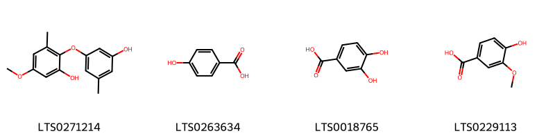
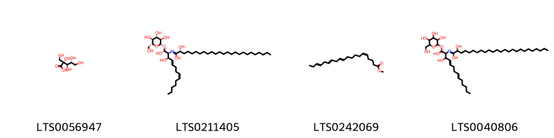
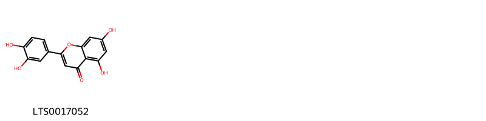
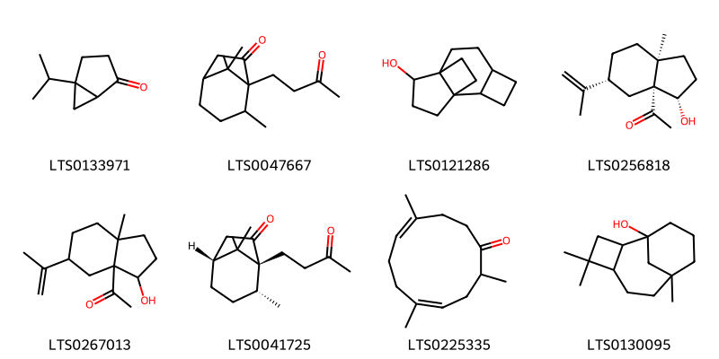
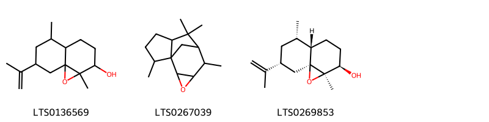
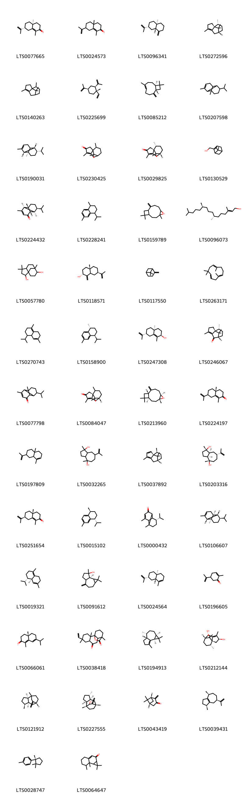
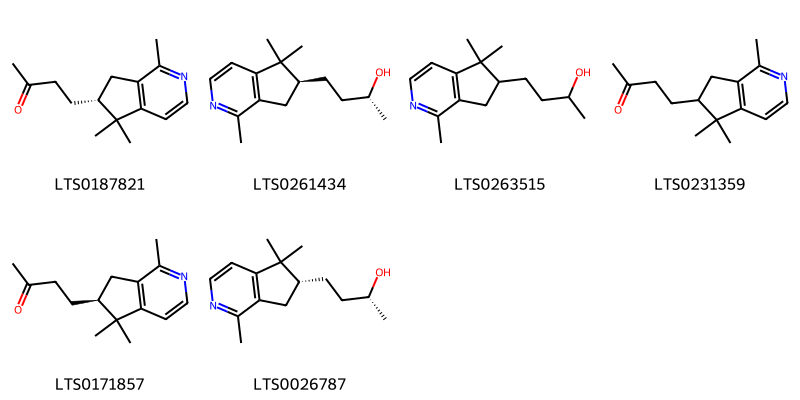
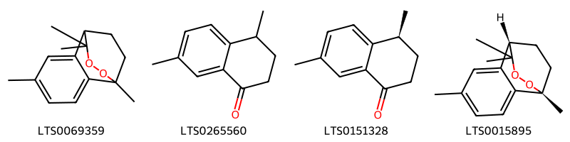

!!! abstract "Tóm tắt"
    Hương phụ có tên khoa học là Cyperus rotundus L.(Họ Cói - Cyperaceae) - là một loài cỏ sống lâu năm, có thân rễ phát triển thành củ, cao từ 20-60 cm. Cây có lá nhỏ hẹp, cứng và bóng, phần dưới lá ôm lấy thân cây. Vào tháng 6, cây ra hoa thành cụm tán màu xám nâu, với hoa lưỡng tính và quả 3 cạnh màu xám. Cây hương phụ phân bố rộng rãi ở các vùng nhiệt đới và cận nhiệt đới, bao gồm châu Á, châu Phi, châu  u và châu Mỹ. Tại Việt Nam, cây mọc hoang ở đồng ruộng và ven đường, đặc biệt ở các vùng đất ven biển.
Hương phụ có tác dụng ức chế sự co bóp của tử cung, giảm đau, tăng tiết mồ hôi và lợi tiểu, giãn mạch và hạ huyết áp. Theo y học cổ truyền, cây có vị hơi cay, hơi đắng, tính bình, quy vào các kinh can, tỳ, tam tiêu, và có công năng hành khí chỉ thống, giải uất điều kinh, kiện vị tiêu thực. Cây được dùng để trị các bệnh như đau dạ dày, tiêu hóa kém, đau cơ, đau ngực sườn, đau dây thần kinh ngoại biên, đau đầu, đau bụng kinh, và rối loạn kinh nguyệt.
Thành phần hóa học của hương phụ gồm tinh dầu, triterpenoid, saponin, flavonoid và đặc biệt là hoạt chất cyperone, góp phần vào các tác dụng dược lý của loài cây này.

## Thông tin về thực vật

### Đặc điểm thực vật

Dược liệu **Hương Phụ (Thân Rễ)** từ bộ phận **Thân rễ** từ loài *Cyperus rotundus L.* thuộc họ Cyperaceae. Cỏ gấu là một loại cỏ sống lâu năm, cao 20- 60cm, thân rễ phát triển thành củ, tùy theo đất rắn hay xốp củ phát triển to hay nhỏ, ở vùng bờ biển cả to dài còn gọi là hải hương phụ (hương phụ vùng biển). Lá nhỏ hẹp, ở giữa lưng có gần nổi lên, cứng và bóng, phần dưới lá ôm lấy thân cây.
Vào tháng 6, trên ngọn cây có 3 đến 8 cụm hoa hình tán màu xám nâu, hoa lưỡng tính, 3 nhị dài chừng 2mm, nhụy có đầu núm chia thành 2 nhánh như lông tơ. Quả 3 cạnh màu xám. 

!!! info "Phân loại thực vật của *Cyperus rotundus*"
    - **Kingdom:** Plantae
    - **Phylum:** Tracheophyta
    - **Order:** Poales
    - **Family:** Cyperaceae
    - **Genus:** Cyperus
    - **Species:** *Cyperus rotundus*

*Tài liệu tham khảo:* "Những cây thuốc và vị thuốc Việt Nam" - Đỗ Tất Lợi

 

### Loài thay thế (Nếu có)

Dược liệu này cũng có thể từ loài *Cyperus stoloniferus Retz.*, thông tin về phân loại thực vật loài này như sau:
!!! info "Thông tin về phân loại thực vật của *Cyperus stoloniferus*"
    - **kingdom:** Plantae
    - **phylum:** Tracheophyta
    - **order:** Poales
    - **family:** Cyperaceae
    - **genus:** Cyperus
    - **species:** *Cyperus stoloniferus*

Hình ảnh của loài *Cyperus stoloniferus Retz.*:

### Phân bố trên thế giới
**Từ vườn thực vật KEW: **: Native to:

Afghanistan, Albania, Aldabra, Algeria, Andaman Is., Angola, Assam, Austria, Azores, Baleares, Bangladesh, Benin, Borneo, Botswana, Bulgaria, Burkina, Burundi, Cambodia, Cameroon, Canary Is., Cape Provinces, Cape Verde, Caprivi Strip, Caroline Is., Central African Republic, Chad, Chagos Archipelago, China North-Central, China South-Central, China Southeast, Comoros, Congo, Corse, Cyprus, Djibouti, East Aegean Is., East Himalaya, Egypt, Equatorial Guinea, Eritrea, Ethiopia, France, Free State, Gabon, Gambia, Ghana, Greece, Guinea, Gulf of Guinea Is., Gulf States, Hainan, Hawaii, India, Iran, Iraq, Italy, Ivory Coast, Japan, Jawa, Kazakhstan, Kazan-retto, Kenya, Kirgizstan, Korea, Kriti, KwaZulu-Natal, Lebanon-Syria, Lesotho, Lesser Sunda Is., Libya, Madagascar, Madeira, Malawi, Malaya, Mali, Maluku, Manchuria, Marianas, Marshall Is., Mauritania, Mauritius, Morocco, Mozambique, Mozambique Channel Is., Myanmar, Namibia, Nansei-shoto, Nepal, New South Wales, Nicobar Is., Niger, Nigeria, North Caucasus, Northern Provinces, Northern Territory, Ogasawara-shoto, Oman, Pakistan, Palestine, Philippines, Portugal, Queensland, Rodrigues, Romania, Rwanda, Réunion, Sardegna, Saudi Arabia, Selvagens, Senegal, Seychelles, Sicilia, Sierra Leone, Sinai, Socotra, Somalia, South Australia, South China Sea, Spain, Sri Lanka, St.Helena, Sudan, Sulawesi, Sumatera, Swaziland, Switzerland, Tadzhikistan, Taiwan, Tanzania, Thailand, Tibet, Togo, Transcaucasus, Tunisia, Turkey, Turkey-in-Europe, Turkmenistan, Turks-Caicos Is., Uganda, Uzbekistan, Vanuatu, Vietnam, Wake I., West Himalaya, Western Australia, Western Sahara, Yemen, Yugoslavia, Zambia, Zaïre, Zimbabwe

Introduced into:

Alabama, Argentina Northeast, Argentina Northwest, Argentina South, Arizona, Arkansas, Aruba, Bahamas, Belize, Bolivia, Brazil North, Brazil Northeast, Brazil South, Brazil Southeast, Brazil West-Central, California, Cayman Is., Central American Pacific Is., Chile Central, Christmas I., Colombia, Cook Is., Costa Rica, Cuba, Czechoslovakia, Dominican Republic, Ecuador, El Salvador, Fiji, Florida, French Guiana, Galápagos, Georgia, Germany, Great Britain, Guatemala, Guyana, Haiti, Honduras, Jamaica, Kentucky, Kermadec Is., Leeward Is., Line Is., Louisiana, Maldives, Marquesas, Maryland, Mexican Pacific Is., Mexico Central, Mexico Gulf, Mexico Northeast, Mexico Northwest, Mexico Southeast, Mexico Southwest, Mississippi, Missouri, Nauru, Netherlands Antilles, New Caledonia, New Mexico, New York, Nicaragua, Niue, Norfolk Is., North Carolina, Panamá, Peru, Phoenix Is., Puerto Rico, Samoa, Society Is., South Carolina, Southwest Caribbean, Suriname, Tennessee, Texas, Tokelau-Manihiki, Tonga, Trinidad-Tobago, Tuamotu, Tubuai Is., Venezuela, Venezuelan Antilles, Virginia, Wallis-Futuna Is., Windward Is.

**Từ CSDL GIBF** Benin, Spain, Australia, Puerto Rico, Turks and Caicos Islands, Thailand, Algeria, Brazil, Singapore, New Zealand, Morocco, Indonesia, Hong Kong, Curaçao, Argentina, Mexico, Italy, China, French Guiana, Guam, United States of America, Chinese Taipei, Portugal, Israel

### Phân bố tại Việt Nam
** "Những cây thuốc và vị thuốc Việt Nam" - Đỗ Tất Lợi**: Cỏ gấu mọc hoang ở khắp nơi trên đồng ruộng, ven đường. Tại ven biển, đất cát xốp cũ to hơn, để đào hơn.

**Từ CSDL GIBF**: Không có ghi nhận ở Việt Nam

---

## Thông tin về dược liệu 

### Định danh

!!! info "Thông tin về tên gọi của Hương phụ"
    - Dược liệu tiếng Việt: Hương phụ
    - Dược liệu tiếng Trung: 制香附 (Zhi Xiang Fu)
    - Dược liệu tiếng Anh: Rhizome of Nutgrass Galingale
    - Dược liệu latin thông dụng: Rhizoma Cyperi
    - Dược liệu latin kiểu DĐVN: rhizoma cyperi
    - Dược liệu latin kiểu DĐVN: None
    - Dược liệu latin kiểu thông tư: None
    - Bộ phận dùng: Thân rễ (Rhizome)

### Mô tả dược liệu 
- **Theo dược điển Việt nam V:** 
Hương phụ vườn: Thân rễ (thường gọi là củ) hình thoi, thể chất chắc, dài 1 cm đến 3 cm, đường kính 0,4 cm đến 1 cm. Mặt ngoài màu xám đen, có nhiều nếp nhăn dọc và đốt ngang (mỗi đốt cách nhau 0,1 cm đến 0,6 cm); trên mỗi đốt có lông cứng mọc thẳng góc với củ, màu xám đen và có nhiều vết tích của rễ con. vết cắt ngang có sợi, mặt nhẵn bóng, phần vỏ có màu xám nhạt, trụ giữa màu nâu sẫm. Mùi thơm, vị hơi đắng ngọt, sau đó có vị cay. Hương phụ biển: Thân rễ hình thoi, thể chất chắc, kích thước củ không đều nhau, kích thước trung bình 1 cm đến 5 cm, đường kính 0,5 cm đến 1,5 cm, mặt ngoài có màu nâu hay nâu sẫm; có nhiều nếp nhăn dọc và đốt ngang củ (mỗi đốt cách nhau 0,1 cm đến 0,6 cm); trên mỗi đốt có lông cứng mọc nghiêng theo chiều dọc, về phía đầu củ, màu nâu hay nâu sẫm và có nhiều vết tích của rễ con. Vết cắt ngang có sợi, mặt nhẵn bóng, phần vỏ màu hồng nhạt, trụ giữa màu nâu sẫm. Mùi thơm, vị hơi đắng ngọt, sau đó có vị cay.

- **Mô tả dược liệu theo thông tư chế biến dược liệu theo phương pháp cổ truyền:** 

### Chế biến 

- **Chế biến theo dược điển việt nam V**: 
Thu hoạch vào mùa thu, lấy dược liệu về, phơi khô, đốt cháy hết thân lá, lông và rễ con, sau đó rửa sạch phơi khô.

Hương phụ: Lấy Hương phụ đã được chế biến ở trên, đập vụn hoặc làm ẩm và ủ một đêm cho mềm rồi thái lát mỏng, sấy khô. Dược liệu là những mảnh vụn, hoặc lát có mặt vỡ hoặc mặt cắt màu nâu vàng hay trắng, mùi thơm, vị đắng. Hương phụ chế: Lấy Hương phụ chia đều làm 4 phần: Tẩm 1 phần bằng nước muối 5 %, 1 phần bằng nước gừng 5 %, 1 phần bằng giấm và 1 phần bằng rượu. Tẩm đủ ướt hoặc theo tỷ lệ cứ 10 kg hương phụ dùng 2 L nước muối 5 % hoặc 2 L nước gừng 5 % hoặc 2 L giấm hoặc 2 L rượu, ủ riêng mỗi phần trong 12 h rồi sao vàng đến khi có mùi thơm. Riêng phần tẩm rượu nên sao xong mới tẩm. Khi dùng trộn đều 4 phần với nhau.

- **Chế biến theo thông tư:** 

--- 

## Thành phần hóa học

- Theo tài liệu của GS. Đỗ Tất Lợi:  Tinh dầu, triterpenoid, saponin, flavonoid,..
Hoạt chất: Cyperone
    
- Theo cơ sở dữ liệu lotus: Từ loài *Cyperus rotundus* đã phân lập và xác định được 208 hoạt chất thuộc về các nhóm Coumarins and derivatives, Benzene and substituted derivatives, Tetrahydrofurans, Heteroaromatic compounds, Oxanes, Steroids and steroid derivatives, Epoxides, Cinnamic acids and derivatives, Tetralins, Pyridines and derivatives, Organooxygen compounds, Prenol lipids, Fatty Acyls, Oxepanes, Polycyclic hydrocarbons, Unsaturated hydrocarbons, Flavonoids, 2-arylbenzofuran flavonoids. 

|    | chemicalTaxonomyClassyfireClass     |   smiles_count |
|---:|:------------------------------------|---------------:|
|  0 | 2-arylbenzofuran flavonoids         |              1 |
|  1 | Benzene and substituted derivatives |              4 |
|  2 | Cinnamic acids and derivatives      |              2 |
|  3 | Coumarins and derivatives           |              1 |
|  4 | Epoxides                            |              2 |
|  5 | Fatty Acyls                         |              4 |
|  6 | Flavonoids                          |              1 |
|  7 | Heteroaromatic compounds            |              2 |
|  8 | Organooxygen compounds              |              8 |
|  9 | Oxanes                              |              2 |
| 10 | Oxepanes                            |              3 |
| 11 | Polycyclic hydrocarbons             |              3 |
| 12 | Prenol lipids                       |            150 |
| 13 | Pyridines and derivatives           |              6 |
| 14 | Steroids and steroid derivatives    |              5 |
| 15 | Tetrahydrofurans                    |              2 |
| 16 | Tetralins                           |              4 |
| 17 | Unsaturated hydrocarbons            |              6 |

### Nhóm 2-arylbenzofuran flavonoids
<figure markdown="span">
    { width=100% }
    <figcaption>Hình ảnh cấu trúc hóa học của 1 hoạt chất thuộc nhóm 2-arylbenzofuran flavonoids gồm ['5-[2-(3,4-dihydroxyphenyl)-4-[(1e)-2-(3,4-dihydroxyphenyl)ethenyl]-6-hydroxy-2,3-dihydro-1-benzofuran-3-yl]benzene-1,3-diol (LTS0146751)'].</figcaption>
</figure>
### Nhóm Benzene and substituted derivatives
<figure markdown="span">
    { width=100% }
    <figcaption>Hình ảnh cấu trúc hóa học của 4 hoạt chất thuộc nhóm Benzene and substituted derivatives gồm ['cyperine (LTS0271214)', 'p-hydroxybenzoic acid (LTS0263634)', '3,4-dihydroxybenzoic acid (LTS0018765)', 'vanillic acid (LTS0229113)'].</figcaption>
</figure>
### Nhóm Cinnamic acids and derivatives
<figure markdown="span">
    { width=100% }
    <figcaption>Hình ảnh cấu trúc hóa học của 2 hoạt chất thuộc nhóm Cinnamic acids and derivatives gồm ['ferulic acid (LTS0077328)', 'para-coumaric acid (LTS0266252)'].</figcaption>
</figure>
### Nhóm Coumarins and derivatives
<figure markdown="span">
    { width=100% }
    <figcaption>Hình ảnh cấu trúc hóa học của 1 hoạt chất thuộc nhóm Coumarins and derivatives gồm ['2h-1-benzopyran-2-one (LTS0069773)'].</figcaption>
</figure>
### Nhóm Epoxides
<figure markdown="span">
    { width=100% }
    <figcaption>Hình ảnh cấu trúc hóa học của 2 hoạt chất thuộc nhóm Epoxides gồm ['31,32-dioxapentacyclo[20.8.1.1⁷,¹⁶.0¹,²².0⁷,¹⁶]dotriacontane (LTS0273504)', '(1r,3e,7e,11r)-1,5,5,7-tetramethyl-12-oxabicyclo[9.1.0]dodeca-3,7-diene (LTS0027633)'].</figcaption>
</figure>
### Nhóm Fatty Acyls
<figure markdown="span">
    { width=100% }
    <figcaption>Hình ảnh cấu trúc hóa học của 4 hoạt chất thuộc nhóm Fatty Acyls gồm ['2-carboxy-d-arabinitol (LTS0056947)', '(2r)-n-[(1r,2s,3r,4e,8z)-1,3-dihydroxy-1-{[(2s,3r,4s,5s,6r)-3,4,5-trihydroxy-6-(hydroxymethyl)oxan-2-yl]oxy}tetradeca-4,8-dien-2-yl]-2-hydroxypentacosanimidic acid (LTS0211405)', 'methyl (5z,11e,14e,17e)-icosa-5,11,14,17-tetraenoate (LTS0242069)', 'n-(1,3-dihydroxy-1-{[3,4,5-trihydroxy-6-(hydroxymethyl)oxan-2-yl]oxy}tetradeca-4,8-dien-2-yl)-2-hydroxypentacosanimidic acid (LTS0040806)'].</figcaption>
</figure>
### Nhóm Flavonoids
<figure markdown="span">
    { width=100% }
    <figcaption>Hình ảnh cấu trúc hóa học của 1 hoạt chất thuộc nhóm Flavonoids gồm ['luteolin (LTS0017052)'].</figcaption>
</figure>
### Nhóm Heteroaromatic compounds
<figure markdown="span">
    { width=100% }
    <figcaption>Hình ảnh cấu trúc hóa học của 2 hoạt chất thuộc nhóm Heteroaromatic compounds gồm ['perillene (LTS0083458)', '2-cyclopropylthiophene (LTS0194577)'].</figcaption>
</figure>
### Nhóm Organooxygen compounds
<figure markdown="span">
    { width=100% }
    <figcaption>Hình ảnh cấu trúc hóa học của 8 hoạt chất thuộc nhóm Organooxygen compounds gồm ['sabinaketone (LTS0133971)', '4,8,8-trimethyl-5-(3-oxobutyl)bicyclo[3.2.1]octan-6-one (LTS0047667)', 'tetracyclo[6.3.2.0¹,⁸.0²,⁵]tridecan-9-ol (LTS0121286)', 'cyperolone (LTS0256818)', '1-[3-hydroxy-7a-methyl-5-(prop-1-en-2-yl)-hexahydro-1h-inden-3a-yl]ethanone (LTS0267013)', '(1r,4r,5r)-4,8,8-trimethyl-5-(3-oxobutyl)bicyclo[3.2.1]octan-6-one (LTS0041725)', '(4z,8z)-2,5,9-trimethylcycloundeca-4,8-dien-1-one (LTS0225335)', 'caryophyllene alcohol (LTS0130095)'].</figcaption>
</figure>
### Nhóm Oxanes
<figure markdown="span">
    { width=100% }
    <figcaption>Hình ảnh cấu trúc hóa học của 2 hoạt chất thuộc nhóm Oxanes gồm ['1,8-cineole (LTS0166505)', 'eucalyptol (LTS0051374)'].</figcaption>
</figure>
### Nhóm Oxepanes
<figure markdown="span">
    { width=100% }
    <figcaption>Hình ảnh cấu trúc hóa học của 3 hoạt chất thuộc nhóm Oxepanes gồm ['1a,5-dimethyl-7-(prop-1-en-2-yl)-octahydronaphtho[1,8a-b]oxiren-2-ol (LTS0136569)', '2,6,6,8-tetramethyl-10-oxatetracyclo[5.4.1.0¹,⁵.0⁹,¹¹]dodecane (LTS0267039)', '(1ar,2r,4as,5s,7r,8as)-1a,5-dimethyl-7-(prop-1-en-2-yl)-octahydronaphtho[1,8a-b]oxiren-2-ol (LTS0269853)'].</figcaption>
</figure>
### Nhóm Polycyclic hydrocarbons
<figure markdown="span">
    { width=100% }
    <figcaption>Hình ảnh cấu trúc hóa học của 3 hoạt chất thuộc nhóm Polycyclic hydrocarbons gồm ['(1r,2s,5r,6r,8r)-1,5-dimethyltricyclo[6.2.2.0²,⁶]dodec-9-ene (LTS0262383)', 'bicyclo[3.2.0]hept-6-ene (LTS0249094)', '1,5-dimethyltricyclo[6.2.2.0²,⁶]dodec-9-ene (LTS0028533)'].</figcaption>
</figure>
### Nhóm Prenol lipids
<figure markdown="span">
    { width=100% }
    <figcaption>Hình ảnh cấu trúc hóa học của 150 hoạt chất thuộc nhóm Prenol lipids gồm ['(4as,7r)-1,4a-dimethyl-7-(prop-1-en-2-yl)-3,4,5,6,7,8-hexahydronaphthalen-2-one (LTS0077665)', '1,4a-dimethyl-7-(prop-1-en-2-yl)-3,4,5,6,7,8-hexahydronaphthalen-2-one (LTS0024573)', 'β-selinene (LTS0096341)', 'cyperene (LTS0272596)', 'cyperene (LTS0140263)', 'β-elemene (LTS0225699)', 'caryophyllene (LTS0085212)', 'α-copaene (LTS0207598)', '(1r,2s,7s,8s)-8-isopropyl-1,3-dimethyltricyclo[4.4.0.0²,⁷]dec-3-ene (LTS0190031)', 'cyperotundone (LTS0230425)', '(1r,7r,10r)-4,10,11,11-tetramethyltricyclo[5.3.1.0¹,⁵]undec-4-en-3-one (LTS0029825)', 'myrtenol (LTS0130529)', '(1s,2s,6s,7r,8s)-8-isopropyl-1,5-dimethyltricyclo[4.4.0.0²,⁷]dec-4-en-3-one (LTS0224432)', '(e)-calamene (LTS0228241)', 'caryophyllene oxide (LTS0159789)', 'phytol (LTS0096073)', '4,4,8-trimethyltricyclo[6.3.1.0¹,⁵]dodecane-2,9-diol (LTS0057780)', '(2r,4as,7r)-4a-methyl-1-methylidene-7-(prop-1-en-2-yl)-octahydronaphthalen-2-ol (LTS0118571)', 'β-pinene (LTS0117550)', 'humulene (LTS0263171)', '4-isopropyl-1,6-dimethyl-2,3,4,4a,7,8-hexahydronaphthalene (LTS0270743)', '(1r,4s)-4-isopropyl-1,6-dimethyl-1,2,3,4-tetrahydronaphthalene (LTS0158900)', 'cyperol (LTS0247308)', '(1r,7s,10r)-4,10,11,11-tetramethyltricyclo[5.3.1.0¹,⁵]undec-4-en-6-one (LTS0246067)', '8-isopropyl-1,5-dimethyltricyclo[4.4.0.0²,⁷]dec-4-en-3-one (LTS0077798)', '(1r,7r)-4,10,11,11-tetramethyltricyclo[5.3.1.0¹,⁵]undec-4-en-3-one (LTS0084047)', 'β-caryophyllene oxide (LTS0213960)', '(4ar)-1,4a-dimethyl-7-(prop-1-en-2-yl)-3,4,5,6,7,8-hexahydronaphthalen-2-one (LTS0224197)', 'selinene (LTS0197809)', '1,4-dimethyl-7-(prop-1-en-2-yl)-octahydroazulene-1,4-diol (LTS0032265)', '(1s,7r,10s)-4,10,11,11-tetramethyltricyclo[5.3.1.0¹,⁵]undeca-2,4-diene (LTS0037892)', '(1s,3as,4s,7r,8as)-1,4-dimethyl-7-(prop-1-en-2-yl)-octahydroazulene-1,4-diol (LTS0203316)', '(4ar,7s)-1,4a-dimethyl-7-(prop-1-en-2-yl)-3,4,5,6,7,8-hexahydronaphthalen-2-one (LTS0251654)', '(1s,4r)-4-isopropyl-1,6-dimethyl-1,2,3,4-tetrahydronaphthalene (LTS0015102)', 'mustakone (LTS0000432)', '(1r,2s,6s,7s,8r)-8-isopropyl-1,3-dimethyltricyclo[4.4.0.0²,⁷]dec-3-ene (LTS0106607)', 'delta-cadinene (LTS0019321)', '(7ar)-1,1,7-trimethyl-4-methylidene-octahydrocyclopropa[e]azulen-7-ol (LTS0091612)', 'α-selinene (LTS0024564)', 'carvone (LTS0196605)', '(4as)-7-isopropyl-1,4a-dimethyl-3,4,5,6-tetrahydronaphthalen-2-one (LTS0066061)', 'rosenonolactone (LTS0038418)', '(-)-α-gurjunene (LTS0194913)', '(1r,3s,6s,7s,10r)-4,10,11,11-tetramethyltricyclo[5.3.1.0¹,⁵]undec-4-ene-3,6-diol (LTS0212144)', '(2r,5s,6s,8r)-1,5-dimethyl-9-methylidenetricyclo[6.2.2.0²,⁶]dodecane (LTS0121912)', '(1r,2s,5s,6r,8s,10s)-1,5-dimethyl-9-methylidenetricyclo[6.2.2.0²,⁶]dodecan-10-ol (LTS0227555)', '(1r,5r)-6,6-dimethyl-2-methylidenebicyclo[3.1.1]heptan-3-one (LTS0043419)', 'guaiene (LTS0039431)', 'cuparene (LTS0028747)', 'aristolone (LTS0064647)', '(+)-borneol (LTS0189059)', 'α-myrcene (LTS0115731)', 'α-longipinene (LTS0199827)', 'sugeonyl acetate (LTS0060512)', '(-)-α-pinene (LTS0032699)', '(+)-camphene (LTS0109845)', 'terpinolene (LTS0104525)', 'cymene (LTS0181568)', 'α pinene (LTS0132416)', '(1s)-4-isopropyl-1,6-dimethyl-1,2-dihydronaphthalene (LTS0177753)', 'fenchol (LTS0261470)', '(1s,4s)-4-isopropyl-1,6-dimethyl-1,2,3,4-tetrahydronaphthalene (LTS0139634)', '4a-methyl-1-methylidene-7-(prop-1-en-2-yl)-octahydronaphthalene (LTS0165615)', '(1r,3s,5r)-6,6-dimethyl-2-methylidenebicyclo[3.1.1]heptan-3-ol (LTS0165758)', '10,11,11-trimethyltricyclo[5.3.1.0¹,⁵]undec-4-ene-4-carboxylic acid (LTS0166341)', '(4ar,7s,8as)-1,4a-dimethyl-7-(prop-1-en-2-yl)-4,5,6,7,8,8a-hexahydro-3h-naphthalene (LTS0148007)', '4-isopropyl-1,6-dimethyl-3,4,4a,7,8,8a-hexahydronaphthalene (LTS0154650)', '7-isopropyl-1,4a-dimethyl-3,4,5,6-tetrahydronaphthalen-2-one (LTS0149247)', '(1r,2s,5r,6r,8r)-1,5-dimethyl-9-methylidenetricyclo[6.2.2.0²,⁶]dodecane (LTS0154680)', 'camphene (LTS0267242)', 'limonene,  (LTS0155981)', '(+)-4-terpineol (LTS0140257)', 'germacrene b (LTS0265072)', 'verbenol (LTS0140945)', '(4as,6as,6br,8ar,10s,12ar,12br,14bs)-10-{[(2r,3r,4s,5s,6r)-4,5-dihydroxy-6-(hydroxymethyl)-3-{[(2s,3r,4r,5r,6s)-3,4,5-trihydroxy-6-methyloxan-2-yl]oxy}oxan-2-yl]oxy}-2,2,6a,6b,9,9,12a-heptamethyl-1,3,4,5,6,7,8,8a,10,11,12,12b,13,14b-tetradecahydropicene-4a-carboxylic acid (LTS0155345)', 'pinocarvone (LTS0084836)', 'solavetivone (LTS0097811)', 'gamma-eudesmol (LTS0147389)', 'phellandrene (LTS0157173)', '2,7,7,10-tetramethyl-3-oxatetracyclo[7.3.0.0²,⁴.0⁶,⁸]dodecane (LTS0156016)', '4a-hydroxy-4,8a-dimethyl-6-(prop-1-en-2-yl)-5,6,7,8-tetrahydro-1h-naphthalen-2-one (LTS0138648)', '(1ar,4ar,7s,7as,7br)-1,1,7-trimethyl-4-methylidene-octahydrocyclopropa[e]azulen-7-ol (LTS0243368)', '(-)-β-pinene (LTS0108757)', '(-)-β-selinene (LTS0273811)', '(1r,7r,10r)-10,11,11-trimethyltricyclo[5.3.1.0¹,⁵]undec-4-ene-4-carboxylic acid (LTS0102298)', '4,10,11,11-tetramethyltricyclo[5.3.1.0¹,⁵]undec-4-ene-3,6-diol (LTS0255374)', '(1r)-4-isopropyl-1,6-dimethyl-1,2-dihydronaphthalene (LTS0120131)', '1-[(1r,7r)-7-isopropyl-4-methylidene-octahydroinden-1-yl]ethanone (LTS0188339)', '(1r,2r,5r,7r,10s,11s)-5-ethenyl-2,5,11-trimethyl-15-oxatetracyclo[9.3.2.0¹,¹⁰.0²,⁷]hexadecane-8,16-dione (LTS0255704)', '6,9-bis(acetyloxy)-4,10,11,11-tetramethyltricyclo[5.3.1.0¹,⁵]undec-4-en-3-yl acetate (LTS0255435)', '(1r,6r,7s,10r)-4,10,11,11-tetramethyl-3-oxotricyclo[5.3.1.0¹,⁵]undec-4-en-6-yl acetate (LTS0183739)', '1,4-dimethyl-7-(prop-1-en-2-yl)-1,2,3,3a,4,5,6,7-octahydroazulene (LTS0217070)', 'cadalene (LTS0077722)', '(1s,2s,5s,8r)-2-methyl-6-methylidene-9-(propan-2-ylidene)-11-oxatricyclo[6.2.1.0¹,⁵]undecan-8-ol (LTS0063268)', '7-isopropyl-1,8a-dimethyl-octahydro-1h-naphthalene (LTS0261696)', '4,10,11,11-tetramethyltricyclo[5.3.1.0¹,⁵]undec-4-en-6-yl acetate (LTS0262130)', '(1r,3s,6s,7s,9s,10s)-6,9-bis(acetyloxy)-4,10,11,11-tetramethyltricyclo[5.3.1.0¹,⁵]undec-4-en-3-yl acetate (LTS0203765)', 'α-limonene (LTS0244943)', 'verbenone (LTS0275336)', '(1s,3as,4r,7s,8as)-1,4-dimethyl-7-(prop-1-en-2-yl)-octahydroazulene-1,4-diol (LTS0211728)', '(+)-borneol (LTS0059936)', 'nootkatone (LTS0027125)', 'aristolone (LTS0230263)', 'thymol (LTS0168527)', '1,4a-dimethyl-7-(propan-2-ylidene)-3,4,5,6,8,8a-hexahydronaphthalene (LTS0160369)', '2-[(1r,4s)-4-ethenyl-4-methyl-3-(prop-1-en-2-yl)cyclohexyl]propan-2-ol (LTS0235839)', 'ledol (LTS0168644)', 'oleanolic acid (LTS0141130)', '(4as,6r,8as)-4a-hydroxy-4,8a-dimethyl-6-(prop-1-en-2-yl)-5,6,7,8-tetrahydro-1h-naphthalen-2-one (LTS0004761)', 'cuminaldehyde (LTS0037806)', '1,1,4,7-tetramethyl-octahydro-1ah-cyclopropa[e]azulen-4a-ol (LTS0248056)', '(1r,7r,8as)-1,8a-dimethyl-7-(prop-1-en-2-yl)-2,6,7,8-tetrahydro-1h-naphthalene (LTS0183545)', 'nootkatone (LTS0183338)', '7-isopropyl-1,4a-dimethyl-2,3,4,5,6,8a-hexahydronaphthalen-1-ol (LTS0044461)', '(-)-α-phellandrene (LTS0226766)', '4,10,11,11-tetramethyltricyclo[5.3.1.0¹,⁵]undec-4-en-6-one (LTS0241841)', '(1r,3ar,4r,7r)-1,4-dimethyl-7-(prop-1-en-2-yl)-1,2,3,3a,4,5,6,7-octahydroazulene (LTS0257129)', '(-)-β-fenchyl alcohol (LTS0048619)', '2,6,6,11-tetramethyltricyclo[5.4.0.0²,⁸]undec-10-en-9-one (LTS0251252)', '(4ar,6r,8as)-4a-hydroxy-4,8a-dimethyl-6-(prop-1-en-2-yl)-5,6,7,8-tetrahydro-1h-naphthalen-2-one (LTS0058452)', '(1as,2s,4as,7r,8ar)-1a,4a-dimethyl-7-(prop-1-en-2-yl)-hexahydro-2h-naphtho[1,8a-b]oxiren-2-ol (LTS0063584)', '(1r,2r,7s,8r,9s)-2,6,6,11-tetramethyltricyclo[5.4.0.0²,⁸]undec-10-en-9-ol (LTS0067358)', '2,2,7,7-tetramethyltricyclo[6.2.1.0¹,⁶]undec-5-en-10-one (LTS0007204)', 'gamma-muurolene (LTS0052920)', '2-methyl-6-methylidene-9-(propan-2-ylidene)-11-oxatricyclo[6.2.1.0¹,⁵]undecan-8-ol (LTS0270223)', '1,5-dimethyl-9-methylidenetricyclo[6.2.2.0²,⁶]dodecane (LTS0066635)', 'caryophyllene (LTS0131870)', 'α-muurolene (LTS0022607)', '(1ar,4as,7r,7as,7bs)-1,1,7-trimethyl-4-methylidene-octahydro-1ah-cyclopropa[e]azulene (LTS0028578)', '4-isopropyl-1,6-dimethyl-1,2-dihydronaphthalene (LTS0004459)', '(1r,2r,5r,8s,9s)-4,4,8-trimethyltricyclo[6.3.1.0¹,⁵]dodecane-2,9-diol (LTS0007295)', '(4s,4as,8as)-4-isopropyl-1,6-dimethyl-3,4,4a,7,8,8a-hexahydronaphthalene (LTS0014980)', 'carvacrol (LTS0012882)', 'α-cubebene (LTS0083688)', '10-{[4,5-dihydroxy-6-(hydroxymethyl)-3-[(3,4,5-trihydroxy-6-methyloxan-2-yl)oxy]oxan-2-yl]oxy}-2,2,6a,6b,9,9,12a-heptamethyl-1,3,4,5,6,7,8,8a,10,11,12,12b,13,14b-tetradecahydropicene-4a-carboxylic acid (LTS0258240)', '4,10,11,11-tetramethyl-3-oxotricyclo[5.3.1.0¹,⁵]undec-4-en-6-yl acetate (LTS0032382)', '(1r,6r,7s,10r)-4,10,11,11-tetramethyltricyclo[5.3.1.0¹,⁵]undec-4-en-6-yl acetate (LTS0071816)', '(4e,8e,13z)-12-isopropyl-1,5,9-trimethylcyclotetradeca-4,8,13-triene-1,3-diol (LTS0120820)', 'pinocarveol (LTS0090950)', 'valencene (LTS0031707)', '(1s,2r,4s)-5,5-dimethyl-6-methylidenebicyclo[2.2.1]heptan-2-ol (LTS0027702)', '(1r,4r,6s,10s)-4,12,12-trimethyl-9-methylidene-5-oxatricyclo[8.2.0.0⁴,⁶]dodecane (LTS0029123)', '(4s,4as,8as)-4-isopropyl-6-methyl-1-methylidene-3,4,4a,7,8,8a-hexahydro-2h-naphthalene (LTS0099302)', 'valencene (LTS0110395)', 'carvone, (+)- (LTS0027671)', '[(1s,5r)-6,6-dimethylbicyclo[3.1.1]hept-2-en-2-yl]methanol (LTS0044518)', 'levoverbenone (LTS0037738)', '(-)-cis-carveol (LTS0048903)', '(1ar,4r,4ar,7r,7ar,7bs)-1,1,4,7-tetramethyl-octahydro-1ah-cyclopropa[e]azulen-4-ol (LTS0245385)', 'oleanolic acid (LTS0117717)'].</figcaption>
</figure>
### Nhóm Pyridines and derivatives
<figure markdown="span">
    { width=100% }
    <figcaption>Hình ảnh cấu trúc hóa học của 6 hoạt chất thuộc nhóm Pyridines and derivatives gồm ['4-[(6r)-1,5,5-trimethyl-6h,7h-cyclopenta[c]pyridin-6-yl]butan-2-one (LTS0187821)', '(2r)-4-[(6s)-1,5,5-trimethyl-6h,7h-cyclopenta[c]pyridin-6-yl]butan-2-ol (LTS0261434)', '4-{1,5,5-trimethyl-6h,7h-cyclopenta[c]pyridin-6-yl}butan-2-ol (LTS0263515)', '4-{1,5,5-trimethyl-6h,7h-cyclopenta[c]pyridin-6-yl}butan-2-one (LTS0231359)', '4-[(6s)-1,5,5-trimethyl-6h,7h-cyclopenta[c]pyridin-6-yl]butan-2-one (LTS0171857)', '(2r)-4-[(6r)-1,5,5-trimethyl-6h,7h-cyclopenta[c]pyridin-6-yl]butan-2-ol (LTS0026787)'].</figcaption>
</figure>
### Nhóm Steroids and steroid derivatives
<figure markdown="span">
    { width=100% }
    <figcaption>Hình ảnh cấu trúc hóa học của 5 hoạt chất thuộc nhóm Steroids and steroid derivatives gồm ['sitosterol (LTS0168132)', 'stigmast-5-en-3-ol, (3β)- (LTS0204616)', '5-(5,6-dimethylhept-3-en-2-yl)-6,10-dimethyl-16,17-dioxapentacyclo[13.2.2.0¹,⁹.0²,⁶.0¹⁰,¹⁵]nonadec-18-en-13-ol (LTS0211330)', '(3as,3br,5as,9as,9bs,11as)-7-ethyl-7-hydroxy-9a,11a-dimethyl-dodecahydro-2h-cyclopenta[a]phenanthren-1-one (LTS0150792)', '(1s,2r,5r,6r,9r,10r,13s,15s)-5-[(2s,3e,5r)-5,6-dimethylhept-3-en-2-yl]-6,10-dimethyl-16,17-dioxapentacyclo[13.2.2.0¹,⁹.0²,⁶.0¹⁰,¹⁵]nonadec-18-en-13-ol (LTS0084016)'].</figcaption>
</figure>
### Nhóm Tetrahydrofurans
<figure markdown="span">
    { width=100% }
    <figcaption>Hình ảnh cấu trúc hóa học của 2 hoạt chất thuộc nhóm Tetrahydrofurans gồm ['(1r,3s,7s,10s)-10,11,11-trimethyl-12-oxatricyclo[5.3.1.1³,¹⁰]dodecan-5-one (LTS0165007)', '10,11,11-trimethyl-12-oxatricyclo[5.3.1.1³,¹⁰]dodecan-5-one (LTS0176625)'].</figcaption>
</figure>
### Nhóm Tetralins
<figure markdown="span">
    { width=100% }
    <figcaption>Hình ảnh cấu trúc hóa học của 4 hoạt chất thuộc nhóm Tetralins gồm ['4,8,11,11-tetramethyl-9,10-dioxatricyclo[6.3.2.0²,⁷]trideca-2,4,6-triene (LTS0069359)', '4,7-dimethyl-3,4-dihydro-2h-naphthalen-1-one (LTS0265560)', '(4s)-4,7-dimethyl-3,4-dihydro-2h-naphthalen-1-one (LTS0151328)', '(1s,8r)-4,8,11,11-tetramethyl-9,10-dioxatricyclo[6.3.2.0²,⁷]trideca-2,4,6-triene (LTS0015895)'].</figcaption>
</figure>
### Nhóm Unsaturated hydrocarbons
<figure markdown="span">
    { width=100% }
    <figcaption>Hình ảnh cấu trúc hóa học của 6 hoạt chất thuộc nhóm Unsaturated hydrocarbons gồm ['(1r,2r,5r,7e)-7-ethylidene-1,2,8,8-tetramethylbicyclo[3.2.1]octane (LTS0194705)', '(1r,2r,5r,6r,8s)-1,5,9-trimethyltricyclo[6.2.2.0²,⁶]dodec-9-ene (LTS0077383)', '1,5,9-trimethyltricyclo[6.2.2.0²,⁶]dodec-9-ene (LTS0258328)', '10,11,11-trimethyl-4-methylidenetricyclo[5.3.1.0¹,⁵]undec-2-ene (LTS0220435)', '(1r,5s,7r,10r)-10,11,11-trimethyl-4-methylidenetricyclo[5.3.1.0¹,⁵]undec-2-ene (LTS0251121)', '(1z,5z)-8,8-dimethyl-9-methylidenecycloundeca-1,5-diene (LTS0003275)'].</figcaption>
</figure>

---

## Tác dụng dược lý

Theo tài liệu "Những cây thuốc và vị thuốc Việt Nam" - Đỗ Tất Lợi:- Ức chế sự co bóp của tử cung 
- Giảm đau, tăng tiết mồ hôi và lợi tiểu
- Giãn mạch, hạ huyết áp

Theo tài liệu quốc tế: 1. To promote the free flow of qi in the liver; 2. To regulate menstruation and stop pain

---

## Dược điển Việt Nam V

### Soi bột:

Bột của Hương phụ vườn màu hồng nhạt và của Hương phụ biển màu trắng xám. Soi dưới kính hiển vi thấy: Tế bào mô cứng hình chữ nhật hay nhiều cạnh, màu vàng nhạt, thành dày, có ống trao đổi rõ. Tế bào tiết hình tròn hay bầu dục, trong đó có chất tiết màu vàng, xung quanh có 5 tế bào đến 8 tế bào xếp tỏa ra rất đặc biệt. Hạt tinh bột hình tròn haỵ bầu dục, rộng 4 μm đến 25 μm, rốn và vân không rõ. Tế bào nội bì màu vàng, hình chữ nhật, thành dày. Mảnh mạch vạch, mạch mạng.

<!-- Hình ảnh soi bột sẽ được tự động chèn vào đây sau -->
### Vi phẫu:

Vi phẫu Hương phụ vườn và Hương phụ biển giống nhau. Biểu bì gồm một hàng tế bào hình trái xoan, to nhỏ không đều. Hạ bì gồm 2 đến 3 hàng tế bào thành dày hình vuông hay chữ nhật, rải rác có các đám sợi hóa gỗ. Mô mềm vỏ khoảng hai mươi đến ba mươi hàng tế bào thành mỏng, hình hơi tròn hay trái xoan, xếp lộn xộn, trong đó có nhiều hạt tinh bột và tế bào tiết hình tròn hoặc teo lại thành nhiều cạnh. Trong mô mềm vỏ còn có các đám libe-gỗ, mỗi đám gồm mạch gỗ bao quanh libe. Nội bì gồm một vòng tế bào hình vuông nhỏ, thành hơi dày. Trụ bì gồm một hàng tế bào hình chữ nhật, thành mỏng, xếp sát nội bì. Mô mềm ruột gồm những tế bào hình tròn to, thành mỏng, trong đó có chứa tinh bột và các đám libe-gỗ.

<!-- Hình ảnh vi phẫu sẽ được tự động chèn vào đây sau -->
### Định tính

A. Lấy 10 g bột dược liệu, làm ẩm bằng 20 ml amoniac (TT), lắc kỹ với 60 ml cloroform (TT). Gạn lấy lớp cloroform, bốc hơi trên cách thủy tới cắn. Hòa cắn bằng 15 ml dung dịch acid hydrocloric 1 % (TT). Lọc, lấy dịch lọc chia đều vào 3 ống nghiệm để làm các phản ứng sau; Ống 1: Thêm 1 giọt đến 2 giọt thuốc thử Mayer (TT), xuất hiện tủa trắng đục. Ống 2: Thêm 1 giọt đến 2 giọt thuốc thử Bouchardat (TT), xuất hiện tủa nâu. Ống 3: Thêm 1 giọt đến 2 giọt thuốc thử Dragendorff (TT). xuất hiện tủa vàng cam. B. Phương pháp sắc ký lớp mỏng (Phụ lục 5.4). Bản mỏng: Silica gel GF254. Dung môi khai triển: Dicloromethan – ethyl acetat – acid acetic băng (80 : 1 : 1). Dung dịch thử: Lấy 1,0 g bột dược liệu, thêm 5 ml ether (TT), ngâm trong 1 h, thỉnh thoảng lắc, lọc và để dịch lọc bay hơi tự nhiên đến cắn. Hòa tan cắn trong 0,5 ml ethyl acetat (TT) được dung dịch chấm sắc ký. Dung dịch chất đối chiếu: Hoà tan α-cyperon chuẩn trong ethyl acetat (TT) để được dung dịch có nồng độ khoảng 1 mg/ml. Dung dịch dược liệu đối chiếu: Nếu không có α-cyperon chuẩn, lấy 1,0 g bột Hương phụ (mẫu chuẩn) tương ứng, chiết như dung dịch thử. Cách tiến hành: Chấm riêng biệt lên bản mỏng 5 μl mỗi dung dịch thử và dung dịch dược liệu đối chiếu, 2 μl dung dịch α-cyperon đối chiếu. Sau khi triển khai sắc ký, lấy bản mỏng ra, để khô trong không khí. Quan sát dưới ánh sáng tử ngoại bước sóng 254 nm. Các vết thu được trên sắc ký đồ của dung dịch thử phải có cùng màu sắc và giá trị Rf với các vết thu được trên sắc ký đồ của dung dịch dược liệu đối chiếu hoặc có vết cùng màu lam thẫm và cùng giá trị Rf với với vết α-cyperon thu được trên sắc ký đồ của dung dịch chất đối chiếu. Tiếp tục phun lên bản mỏng dung dịch 2,4-dinitrophenyl hydrazin, các vết trên sắc ký đồ phải dần dần chuyển sang màu đỏ cam. Cách pha dung dịch 2,4-dinitrophennyl hydrazin: Lấy 1,5 g 2,4-dinitrophenyl hydrazin (TT), hòa tan trong 20 ml dung dịch acid sulfuric 50% (TT), chuyển dung dịch thu được vào bình định mức 100 ml, thêm nước đến vạch, trộn đều, lọc.

### Định lượng

Tiến hành theo phương pháp “Định lượng tinh dầu trong dược liệu” (Phụ lục 12.7). Dùng 50 g dược liệu thô, thêm 300 ml nước, 50 ml glycerin (TT), cất tinh dầu trong 5 h. Hàm lượng tinh dầu không được ít hơn 0,5 % đối với Hương phụ (nguyên củ hoặc đã đập vụn, thái lát) tính theo dược liệu khô kiệt.

### Thông tin khác 
- ** Độ ẩm: ** 
Không quá 13,0 % (Phụ lục 12.13).

- ** Bảo quản:** 
## Dược điển Hồng kong

<!-- PDF sẽ được tự động chèn vào đây sau -->

---

## Y dược học cổ truyền

- **Tên vị thuốc:** Hương phụ
- **Tính vị quy kinh:** Vị hơi cay. hơi đắng, tính bình. Quy kinh can, tỳ, tam tiêu.
- **Công năng chủ trị:** Hành khí chỉ thống, giải uất điều kinh, kiện vị tiêu thực.
Chủ trị: Đau dạ dày, tiêu hóa kém, đau cơ, đau ngực sườn, đau dây thần kinh ngoại biên, đau đầu, đau bụng kinh, rối loạn kinh nguyệt.
- **Chú ý:** 
- **Kiêng kỵ:** 
Âm hư huyết nhiệt không nên dùng

