!!! abstract "Tóm tắt"
    Hồ tiêu (quả) có tên khoa học Fructus Piperis nigri, là một loại cây dây leo thuộc họ Hồ tiêu (Piperaceae). Quả của cây hồ tiêu, thường được gọi là hạt tiêu, có tên khoa học là Piper nigrum L.
 Hồ tiêu có nguồn gốc từ các vùng nhiệt đới ẩm ướt ở Ấn Độ và Nam Á. Cây hồ tiêu leo bằng rễ phụ, lá đơn, hoa nhỏ màu vàng xanh mọc thành bông dày. Quả hồ tiêu khi chín chuyển từ màu xanh lục sang màu đỏ, sau đó chuyển sang màu đen. Việt Nam là một trong những nước sản xuất hồ tiêu lớn trên thế giới, với các vùng trồng tập trung ở miền Nam.
Thành phần hóa học của quả hồ tiêu khá phong phú và có giá trị, nổi bật với các hợp chất như piperine, tinh dầu, flavonoid.
Các nghiên cứu khoa học đã chỉ ra rằng hồ tiêu có nhiều tác dụng tốt cho sức khỏe, bao gồm: kích thích tiêu hóa (Piperine), giảm đau, kháng khuẩn, chống oxy hóa, tăng cường hấp thu các chất dinh dưỡng. Hồ tiêu được sử dụng trong y học cổ truyền để điều trị các bệnh như đau bụng, khó tiêu, cảm lạnh. Một số nghiên cứu hiện đại cũng cho thấy tiềm năng của hồ tiêu trong việc phòng ngừa và điều trị một số bệnh mãn tính.

## Thông tin về thực vật

### Đặc điểm thực vật

Dược liệu **Hồ Tiêu (Quả)** từ bộ phận **Quả** từ loài *Piper nigrum L.* thuộc họ Piperaceae. Quả hình cầu nhỏ, chừng 20-30 quả trên một chùm, lúc đầu màu xanh lục, sau có màu đỏ, khi chín có màu vàng. 

!!! info "Phân loại thực vật của *Piper nigrum*"
    - **Kingdom:** Plantae
    - **Phylum:** Tracheophyta
    - **Order:** Piperales
    - **Family:** Piperaceae
    - **Genus:** Piper
    - **Species:** *Piper nigrum*

*Tài liệu tham khảo:* "Những cây thuốc và vị thuốc Việt Nam" - Đỗ Tất Lợi

 

### Loài thay thế (Nếu có)

### Phân bố trên thế giới
**Từ vườn thực vật KEW: **: Andaman Is., Assam, Bangladesh, Benin, Cambodia, Cameroon, Caroline Is., China South-Central, China Southeast, Comoros, Cook Is., Costa Rica, Cuba, Dominican Republic, East Himalaya, Ethiopia, French Guiana, Guinea, Gulf of Guinea Is., Haiti, Honduras, Laos, Leeward Is., Marianas, Mauritius, Mexico Gulf, Nicobar Is., Philippines, Puerto Rico, Réunion, Seychelles, Sri Lanka, Thailand, Trinidad-Tobago, Vanuatu, Venezuela, Vietnam, Windward Is

**Từ CSDL GIBF** Réunion, Cambodia, Madagascar, Côte d’Ivoire, Malaysia, Thailand, Guadeloupe, Brazil, Honduras, Indonesia, India, Lao People’s Democratic Republic, Mexico, Panama, Costa Rica, Seychelles, Micronesia (Federated States of), Cameroon, Colombia, French Guiana, El Salvador, Martinique, Philippines, Sao Tome and Principe, Dominican Republic, Trinidad and Tobago, Viet Nam, Switzerland, Jamaica, United States of America, Chinese Taipei, Benin, Sri Lanka

### Phân bố tại Việt Nam
** "Những cây thuốc và vị thuốc Việt Nam" - Đỗ Tất Lợi**: Cây hạt tiêu được trồng ở nhiều tỉnh miền Nam nước ta, nhiều nhất ở Châu Đốc, Hà Tiên, Phú Quốc, Bà Rịa, Quảng Trị. Tại miền Bắc đã bắt đầu trồng ở tỉnh Vĩnh Linh, hiện đang cố di chuyển dần ra phía bắc miền Bắc nước ta.

**Từ CSDL GIBF**: Đăk Nông, Đồng Nai

---

## Thông tin về dược liệu 

### Định danh

!!! info "Thông tin về tên gọi của hồ tiêu"
    - Dược liệu tiếng Việt: hồ tiêu
    - Dược liệu tiếng Trung:  ()
    - Dược liệu tiếng Anh: 
    - Dược liệu latin thông dụng: Fructus Piperis nigrinPiperis Fructus
    - Dược liệu latin kiểu DĐVN: fructus piperis nigri
    - Dược liệu latin kiểu DĐVN: Piperis Fructus
    - Dược liệu latin kiểu thông tư: 
    - Bộ phận dùng: Quả (Fructus)

### Mô tả dược liệu 
- **Theo dược điển Việt nam V:** Hồ tiêu đen: Quả hình cầu, đường kính 3,5 mm đến 5 mm. Mặt ngoài màu nâu đen, có nhiều vết nhăn hình mạng lưới nổi lên. Đầu quả có vết của vòi nhụy nhỏ hơi nổi lên, gốc quả có vết sẹo của cuống quả. Chất cứng. Phần thịt quả có thể bóc ra được. Vỏ quả trong màu trắng tro hoặc màu vàng nhạt; mặt cắt ngang màu vàng nhạt. Quả có chất bột, trong có lỗ hổng nhỏ là vị trí của nội nhũ. Mùi thơm, vị cay. Hồ tiêu sọ: Mặt ngoài màu trắng tro hoặc màu trắng vàng nhạt, nhẵn.

- **Mô tả dược liệu theo thông tư chế biến dược liệu theo phương pháp cổ truyền:** 

### Chế biến 

- **Chế biến theo dược điển việt nam V**: Thu hoạch vào cuối mùa thu năm trước đến mùa xuân năm sau, hái lấy quả xanh thẫm khi chùm quả xuất hiện 1 đến 2 quả chín đỏ hay vàng, phơi hay sấy khô ở 40 °c đến 50 °c, quả ngả sang màu đen thơm gọi là Hồ tiêu đen (hắc Hồ tiêu). Còn hái quả lúc thật chín đỏ, ngâm dưới nước chảy 3 đến 4 ngày, sát bỏ thịt quả và vỏ đen, phơi hay sấy khô. Dược liệu có màu trắng ngà, vị cay gọi là Hồ tiêu trắng (Hồ tiêu sọ). Bào chế Loại bỏ tạp chất, vụn nát, khi dùng tán thành bột mịn.

- **Chế biến theo thông tư:** 

--- 

## Thành phần hóa học

- Theo tài liệu của GS. Đỗ Tất Lợi:  (1) Nhóm hóa học: piperine, tinh dầu, flavonoid
(2) Tên hoạt chất: saponin, flavonoid, tinh dầu, chavisin, nhựa, tinh bột, piperine, piperylline, piperoleine, piperanine, dihydrocarveol, karyo fillene oxide, cariptone, tran piocarrol và dầu tiêu.
    
- Theo cơ sở dữ liệu lotus: Từ loài *Piper nigrum* đã phân lập và xác định được 316 hoạt chất thuộc về các nhóm Pyrrolidines, Unsaturated hydrocarbons, Stilbenes, Piperidines, Benzene and substituted derivatives, Organonitrogen compounds, Steroids and steroid derivatives, Phenols, Benzodioxoles, Phenol ethers, Cinnamic acids and derivatives, Carboximidic acids and derivatives, Pyridines and derivatives, Organooxygen compounds, Aristolactams, Prenol lipids, Fatty Acyls, Cinnamaldehydes, Furanoid lignans, Aporphines, Benzofurans, Carboxylic acids and derivatives, Phenol esters, Flavonoids. 

|    | chemicalTaxonomyClassyfireClass     |   smiles_count |
|---:|:------------------------------------|---------------:|
|  0 |                                     |              9 |
|  1 | Aporphines                          |              1 |
|  2 | Aristolactams                       |              1 |
|  3 | Benzene and substituted derivatives |              5 |
|  4 | Benzodioxoles                       |            132 |
|  5 | Benzofurans                         |              1 |
|  6 | Carboximidic acids and derivatives  |              7 |
|  7 | Carboxylic acids and derivatives    |              4 |
|  8 | Cinnamaldehydes                     |              1 |
|  9 | Cinnamic acids and derivatives      |             19 |
| 10 | Fatty Acyls                         |             26 |
| 11 | Flavonoids                          |              3 |
| 12 | Furanoid lignans                    |             10 |
| 13 | Organonitrogen compounds            |              2 |
| 14 | Organooxygen compounds              |              5 |
| 15 | Phenol esters                       |              1 |
| 16 | Phenol ethers                       |              3 |
| 17 | Phenols                             |              7 |
| 18 | Piperidines                         |             14 |
| 19 | Prenol lipids                       |             36 |
| 20 | Pyridines and derivatives           |              1 |
| 21 | Pyrrolidines                        |              9 |
| 22 | Steroids and steroid derivatives    |             12 |
| 23 | Stilbenes                           |              2 |
| 24 | Unsaturated hydrocarbons            |              1 |

### Nhóm 
<figure markdown="span">
    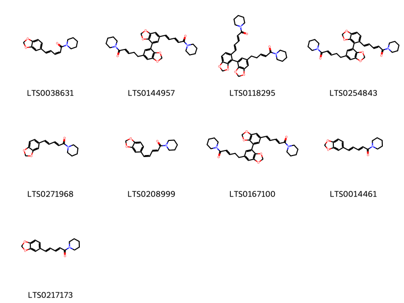{ width=100% }
    <figcaption>Hình ảnh cấu trúc hóa học của 9 hoạt chất thuộc nhóm  gồm ['bioperine (LTS0038631)', '5-(7-{6-[5-oxo-5-(piperidin-1-yl)pent-3-en-1-yl]-2h-1,3-benzodioxol-4-yl}-2h-1,3-benzodioxol-5-yl)-1-(piperidin-1-yl)penta-2,4-dien-1-one (LTS0144957)', '(2e,4e)-5-(4-{6-[(3e)-5-oxo-5-(piperidin-1-yl)pent-3-en-1-yl]-2h-1,3-benzodioxol-4-yl}-2h-1,3-benzodioxol-5-yl)-1-(piperidin-1-yl)penta-2,4-dien-1-one (LTS0118295)', '5-(4-{6-[5-oxo-5-(piperidin-1-yl)pent-3-en-1-yl]-2h-1,3-benzodioxol-4-yl}-2h-1,3-benzodioxol-5-yl)-1-(piperidin-1-yl)penta-2,4-dien-1-one (LTS0254843)', '5-(2h-1,3-benzodioxol-5-yl)-1-(piperidin-1-yl)penta-2,4-dien-1-one (LTS0271968)', 'isochavicine (LTS0208999)', '(2e,4e)-5-(7-{6-[(3e)-5-oxo-5-(piperidin-1-yl)pent-3-en-1-yl]-2h-1,3-benzodioxol-4-yl}-2h-1,3-benzodioxol-5-yl)-1-(piperidin-1-yl)penta-2,4-dien-1-one (LTS0167100)', 'piperine (LTS0014461)', '(4e)-5-(2h-1,3-benzodioxol-5-yl)-1-(piperidin-1-yl)penta-2,4-dien-1-one (LTS0217173)'].</figcaption>
</figure>
### Nhóm Aporphines
<figure markdown="span">
    { width=100% }
    <figcaption>Hình ảnh cấu trúc hóa học của 1 hoạt chất thuộc nhóm Aporphines gồm ['11-methyl-3,5-dioxa-11-azapentacyclo[10.7.1.0²,⁶.0⁸,²⁰.0¹⁴,¹⁹]icosa-1(20),2(6),7,12,14(19),15,17-heptaene-9,10-dione (LTS0083545)'].</figcaption>
</figure>
### Nhóm Aristolactams
<figure markdown="span">
    { width=100% }
    <figcaption>Hình ảnh cấu trúc hóa học của 1 hoạt chất thuộc nhóm Aristolactams gồm ['14,15-dimethoxy-10-azatetracyclo[7.6.1.0²,⁷.0¹²,¹⁶]hexadeca-1(16),2(7),3,5,8,10,12,14-octaene-11,13-diol (LTS0132862)'].</figcaption>
</figure>
### Nhóm Benzene and substituted derivatives
<figure markdown="span">
    { width=100% }
    <figcaption>Hình ảnh cấu trúc hóa học của 5 hoạt chất thuộc nhóm Benzene and substituted derivatives gồm ['galop (LTS0222857)', 'methyl eugenol (LTS0098881)', '3,4-dihydroxybenzoic acid (LTS0018765)', 'ω-phenylacetic acid (LTS0091846)', 'p-cymen-8-ol (LTS0223641)'].</figcaption>
</figure>
### Nhóm Benzodioxoles
<figure markdown="span">
    { width=100% }
    <figcaption>Hình ảnh cấu trúc hóa học của 132 hoạt chất thuộc nhóm Benzodioxoles gồm ['(2e)-3-(2h-1,3-benzodioxol-5-yl)-1-(pyrrolidin-1-yl)prop-2-en-1-one (LTS0128279)', '(2e)-5-(2h-1,3-benzodioxol-5-yl)-1-(pyrrolidin-1-yl)pent-2-en-1-one (LTS0127481)', '1-[(1s,2r,3r,4s)-3-[(1e,3e)-4-(2h-1,3-benzodioxol-5-yl)buta-1,3-dien-1-yl]-2-[(1e)-2-(2h-1,3-benzodioxol-5-yl)ethenyl]-4-(piperidine-1-carbonyl)cyclobutanecarbonyl]piperidine (LTS0111778)', '(2e,4e,8e)-9-(2h-1,3-benzodioxol-5-yl)-n-(2-methylpropyl)nona-2,4,8-trienimidic acid (LTS0202310)', '(2e)-3-(2h-1,3-benzodioxol-5-yl)-n-cyclohexylprop-2-enimidic acid (LTS0126096)', '8-(2h-1,3-benzodioxol-5-yl)-1-(piperidin-1-yl)oct-7-en-1-one (LTS0181477)', '1-[(1r,4s,5r,6r)-6-[(1e)-2-(2h-1,3-benzodioxol-5-yl)ethenyl]-4-pentyl-5-(piperidine-1-carbonyl)cyclohex-2-ene-1-carbonyl]piperidine (LTS0079763)', '5-(2h-1,3-benzodioxol-5-yl)-n-(2-methylpropyl)penta-2,4-dienamide (LTS0124593)', '1-{6-[2-(2h-1,3-benzodioxol-5-yl)ethenyl]-4-pentyl-5-(piperidine-1-carbonyl)cyclohex-2-ene-1-carbonyl}piperidine (LTS0108020)', '(2e,4e,6e)-7-(2h-1,3-benzodioxol-5-yl)-1-(pyrrolidin-1-yl)hepta-2,4,6-trien-1-one (LTS0042528)', '1-[(1r,4s,5s,6r)-4-(2h-1,3-benzodioxol-5-yl)-6-[(1e)-2-(2h-1,3-benzodioxol-5-yl)ethenyl]-5-(piperidine-1-carbonyl)cyclohex-2-ene-1-carbonyl]piperidine (LTS0135564)', '1-{3-[4-(2h-1,3-benzodioxol-5-yl)buta-1,3-dien-1-yl]-2-[2-(2h-1,3-benzodioxol-5-yl)ethenyl]-4-(piperidine-1-carbonyl)cyclobutanecarbonyl}piperidine (LTS0072318)', '3-{2,3-bis[2-(2h-1,3-benzodioxol-5-yl)ethenyl]-4-(piperidine-1-carbonyl)cyclobutyl}-1-(piperidin-1-yl)prop-2-en-1-one (LTS0195413)', '(6e)-7-(2h-1,3-benzodioxol-5-yl)-1-(pyrrolidin-1-yl)hept-6-en-1-one (LTS0095588)', '3-[2-(2h-1,3-benzodioxol-5-yl)-4-[4-(2h-1,3-benzodioxol-5-yl)buta-1,3-dien-1-yl]-3-(piperidine-1-carbonyl)cyclobutyl]-1-(piperidin-1-yl)prop-2-en-1-one (LTS0126959)', '13-(2h-1,3-benzodioxol-5-yl)-n-(2-methylpropyl)trideca-2,4,12-trienimidic acid (LTS0085000)', '1-[(1s,2s,5r,6r)-5-(2h-1,3-benzodioxol-5-yl)-6-[(1e)-2-(2h-1,3-benzodioxol-5-yl)ethenyl]-2-(piperidine-1-carbonyl)cyclohex-3-ene-1-carbonyl]piperidine (LTS0079277)', '1-{2,3-bis[2-(2h-1,3-benzodioxol-5-yl)ethenyl]-4-(pyrrolidine-1-carbonyl)cyclobutanecarbonyl}piperidine (LTS0192834)', '1-(2h-1,3-benzodioxol-5-yl)-3-(piperidin-1-yl)propan-1-one (LTS0085817)', '3-(2h-1,3-benzodioxol-5-yl)-1-(piperidin-1-yl)propan-1-one (LTS0026754)', '1-[(1s,2r,3r,4s)-2-(2h-1,3-benzodioxol-5-yl)-3-[(1e)-2-(2h-1,3-benzodioxol-5-yl)ethenyl]-4-(piperidine-1-carbonyl)cyclobutanecarbonyl]piperidine (LTS0101586)', '(2e)-3-(2h-1,3-benzodioxol-5-yl)-n-cyclopentylprop-2-enimidic acid (LTS0164208)', 'piperettine (LTS0183242)', '1-{5,6-bis[2-(2h-1,3-benzodioxol-5-yl)ethenyl]-2-(piperidine-1-carbonyl)cyclohex-3-ene-1-carbonyl}piperidine (LTS0021826)', '1-[(1s,2r,3r,4s)-2,3-bis[(1e,3e)-4-(2h-1,3-benzodioxol-5-yl)buta-1,3-dien-1-yl]-4-(piperidine-1-carbonyl)cyclobutanecarbonyl]piperidine (LTS0090102)', '1-[(1r,2s,5r,6r)-2,6-bis(2h-1,3-benzodioxol-5-yl)-5-(piperidine-1-carbonyl)cyclohex-3-ene-1-carbonyl]piperidine (LTS0033803)', '10-(2h-1,3-benzodioxol-5-yl)-1-(pyrrolidin-1-yl)dec-9-en-1-one (LTS0073734)', '(2e,4e,12e)-13-(2h-1,3-benzodioxol-5-yl)-n-(2-methylpropyl)trideca-2,4,12-trienimidic acid (LTS0071256)', '(9e)-10-(2h-1,3-benzodioxol-5-yl)-1-(pyrrolidin-1-yl)dec-9-en-1-one (LTS0180097)', '3-[2-(2h-1,3-benzodioxol-5-yl)-4-[2-(2h-1,3-benzodioxol-5-yl)ethenyl]-3-(piperidine-1-carbonyl)cyclobutyl]-1-(piperidin-1-yl)prop-2-en-1-one (LTS0113145)', '(2e)-3-[(1s,2s,5r,6s)-2-(2h-1,3-benzodioxol-5-yl)-6-pentyl-5-(piperidine-1-carbonyl)cyclohex-3-en-1-yl]-1-(piperidin-1-yl)prop-2-en-1-one (LTS0022454)', '(2e)-3-{2,3-bis[(1e)-2-(2h-1,3-benzodioxol-5-yl)ethenyl]-4-(piperidine-1-carbonyl)cyclobutyl}-1-(piperidin-1-yl)prop-2-en-1-one (LTS0176814)', '(2z)-3-[(1r,2s,3s,4r)-2-(2h-1,3-benzodioxol-5-yl)-4-[(1e,3e)-4-(2h-1,3-benzodioxol-5-yl)buta-1,3-dien-1-yl]-3-(piperidine-1-carbonyl)cyclobutyl]-1-(piperidin-1-yl)prop-2-en-1-one (LTS0180220)', '1-[(1s,2r,3r,4s)-2,3-bis[(1e)-2-(2h-1,3-benzodioxol-5-yl)ethenyl]-4-(piperidine-1-carbonyl)cyclobutanecarbonyl]piperidine (LTS0047770)', '(2e,8e)-9-(2h-1,3-benzodioxol-5-yl)-1-(piperidin-1-yl)nona-2,8-dien-1-one (LTS0103693)', '(2e)-3-(2h-1,3-benzodioxol-5-yl)-1-(4-methylpiperidin-1-yl)prop-2-en-1-one (LTS0151733)', '1-[(1s,4r,5r,6s)-5-(2h-1,3-benzodioxol-5-yl)-4-pentyl-6-(piperidine-1-carbonyl)cyclohex-2-ene-1-carbonyl]piperidine (LTS0127674)', '(7e)-8-(2h-1,3-benzodioxol-5-yl)-1-(piperidin-1-yl)oct-7-en-1-one (LTS0260205)', '(2z)-3-[2-(2h-1,3-benzodioxol-5-yl)-4-[(1e)-2-(2h-1,3-benzodioxol-5-yl)ethenyl]-3-(piperidine-1-carbonyl)cyclobutyl]-1-(piperidin-1-yl)prop-2-en-1-one (LTS0204931)', '1-[(1r,4s,5s,6r)-4-(2h-1,3-benzodioxol-5-yl)-6-[2-(2h-1,3-benzodioxol-5-yl)ethyl]-5-(pyrrolidine-1-carbonyl)cyclohex-2-ene-1-carbonyl]piperidine (LTS0271603)', '(2e,4e)-5-(2h-1,3-benzodioxol-5-yl)-n-(2-methylpropyl)penta-2,4-dienimidic acid (LTS0185980)', '12-(2h-1,3-benzodioxol-5-yl)-n-(3-methylbutyl)dodeca-2,4,11-trienimidic acid (LTS0267262)', '9-(2h-1,3-benzodioxol-5-yl)-n-(2-methylpropyl)nona-2,4,8-trienimidic acid (LTS0122707)', '3-[2-(2h-1,3-benzodioxol-5-yl)-6-pentyl-5-(piperidine-1-carbonyl)cyclohex-3-en-1-yl]-1-(piperidin-1-yl)prop-2-en-1-one (LTS0136211)', '5-(2h-1,3-benzodioxol-5-yl)-1-(piperidin-1-yl)pent-2-en-1-one (LTS0172073)', '1-{2,3-bis[(1e)-2-(2h-1,3-benzodioxol-5-yl)ethenyl]-4-(pyrrolidine-1-carbonyl)cyclobutanecarbonyl}piperidine (LTS0266265)', '11-(2h-1,3-benzodioxol-5-yl)-n-(2-methylpropyl)undeca-2,4,10-trienimidic acid (LTS0109359)', '1-[6-(2h-1,3-benzodioxol-5-yl)-4-pentyl-5-(piperidine-1-carbonyl)cyclohex-2-ene-1-carbonyl]piperidine (LTS0148059)', '(2e,4z)-5-(2h-1,3-benzodioxol-5-yl)-1-(pyrrolidin-1-yl)penta-2,4-dien-1-one (LTS0148846)', '(8e)-9-(2h-1,3-benzodioxol-5-yl)-1-(piperidin-1-yl)non-8-en-1-one (LTS0167303)', '(2e,4e,11e)-12-(2h-1,3-benzodioxol-5-yl)-n-(3-methylbutyl)dodeca-2,4,11-trienimidic acid (LTS0140616)', '3-(2h-1,3-benzodioxol-5-yl)-1-(piperidin-1-yl)prop-2-en-1-one (LTS0150506)', '1-[2-(2h-1,3-benzodioxol-5-yl)-6-[2-(2h-1,3-benzodioxol-5-yl)ethenyl]-5-(piperidine-1-carbonyl)cyclohex-3-ene-1-carbonyl]piperidine (LTS0167560)', '1-[2-(2h-1,3-benzodioxol-5-yl)-3-[2-(2h-1,3-benzodioxol-5-yl)ethenyl]-4-(piperidine-1-carbonyl)cyclobutanecarbonyl]piperidine (LTS0142411)', '7-(2h-1,3-benzodioxol-5-yl)-1-(piperidin-1-yl)hept-6-en-1-one (LTS0149354)', '5-[(1e)-tetradec-1-en-1-yl]-2h-1,3-benzodioxole (LTS0147425)', '1-[(1r,4s,5r,6r)-6-(2h-1,3-benzodioxol-5-yl)-4-pentyl-5-(piperidine-1-carbonyl)cyclohex-2-ene-1-carbonyl]piperidine (LTS0239348)', '(2e)-3-[2,4-bis(2h-1,3-benzodioxol-5-yl)-3-[(1e)-3-oxo-3-(piperidin-1-yl)prop-1-en-1-yl]cyclobutyl]-1-(piperidin-1-yl)prop-2-en-1-one (LTS0086636)', 'sassafras (LTS0136093)', '(2e,4e,12e)-13-(2h-1,3-benzodioxol-5-yl)-1-(pyrrolidin-1-yl)trideca-2,4,12-trien-1-one (LTS0228827)', '(2e,11e)-12-(2h-1,3-benzodioxol-5-yl)-n-(2-methylpropyl)dodeca-2,11-dienimidic acid (LTS0092445)', '1-[(1s,2s,5r,6r)-5-(2h-1,3-benzodioxol-5-yl)-6-[(1e,3e)-4-(2h-1,3-benzodioxol-5-yl)buta-1,3-dien-1-yl]-2-(piperidine-1-carbonyl)cyclohex-3-ene-1-carbonyl]piperidine (LTS0235666)', '3-[2,4-bis(2h-1,3-benzodioxol-5-yl)-3-(piperidine-1-carbonyl)cyclobutyl]-1-(piperidin-1-yl)prop-2-en-1-one (LTS0237437)', '7-(2h-1,3-benzodioxol-5-yl)-1-(piperidin-1-yl)hepta-2,6-dien-1-one (LTS0183088)', '(1s,2s,5r,6s)-2-(2h-1,3-benzodioxol-5-yl)-6-[(1e)-hept-1-en-1-yl]-n-(2-methylpropyl)-5-(piperidine-1-carbonyl)cyclohex-3-ene-1-carboximidic acid (LTS0156706)', '(2e,4e,8e)-9-(2h-1,3-benzodioxol-5-yl)-1-(pyrrolidin-1-yl)nona-2,4,8-trien-1-one (LTS0175728)', '5-(2h-1,3-benzodioxol-5-yl)-1-(pyrrolidin-1-yl)penta-2,4-dien-1-one (LTS0118001)', '9-(2h-1,3-benzodioxol-5-yl)-1-(piperidin-1-yl)nona-2,8-dien-1-one (LTS0254356)', '(2e)-3-(2h-1,3-benzodioxol-5-yl)-n-(2-methylpropyl)prop-2-enimidic acid (LTS0066857)', 'piperyline (LTS0275265)', '1-[2-(2h-1,3-benzodioxol-5-yl)-6-[2-(2h-1,3-benzodioxol-5-yl)ethyl]-5-(piperidine-1-carbonyl)cyclohex-3-ene-1-carbonyl]piperidine (LTS0064571)', '(2e)-3-[(1s,2r,5s,6s)-2-(2h-1,3-benzodioxol-5-yl)-6-pentyl-5-(piperidine-1-carbonyl)cyclohex-3-en-1-yl]-1-(pyrrolidin-1-yl)prop-2-en-1-one (LTS0199588)', 'pipercyclobutanamide a(rel) (LTS0202321)', '(2e)-3-[(1r,2r,3s,4r)-2,4-bis(2h-1,3-benzodioxol-5-yl)-3-(piperidine-1-carbonyl)cyclobutyl]-1-(piperidin-1-yl)prop-2-en-1-one (LTS0265786)', '5-(2h-1,3-benzodioxol-5-yl)-n-(2-methylpropyl)-4-pentyl-6-(piperidine-1-carbonyl)cyclohex-2-ene-1-carboximidic acid (LTS0053846)', 'trichostachine (LTS0259692)', '12-(2h-1,3-benzodioxol-5-yl)-n-(2-methylpropyl)dodeca-2,11-dienimidic acid (LTS0267849)', '1-(2h-1,3-benzodioxole-5-carbonyl)azepane (LTS0268707)', '(2e,8e)-9-(2h-1,3-benzodioxol-5-yl)-1-(pyrrolidin-1-yl)nona-2,8-dien-1-one (LTS0200151)', '(2e,4e)-8-(2h-1,3-benzodioxol-5-yl)-n-(3-methylbutyl)octa-2,4-dienimidic acid (LTS0196301)', '1-(2h-1,3-benzodioxole-5-carbothioyl)piperidine (LTS0210283)', '8-(2h-1,3-benzodioxol-5-yl)-n-(3-methylbutyl)octa-2,4-dienimidic acid (LTS0269066)', '(8e)-9-(2h-1,3-benzodioxol-5-yl)-1-(pyrrolidin-1-yl)non-8-en-1-one (LTS0231835)', '(4e)-5-(2h-1,3-benzodioxol-5-yl)-1-(pyrrolidin-1-yl)penta-2,4-dien-1-one (LTS0216899)', '7-(2h-1,3-benzodioxol-5-yl)-1-(pyrrolidin-1-yl)hept-6-en-1-one (LTS0219104)', 'piperonal (LTS0194867)', '(2e)-3-[(1s,2r,3s,4s)-2,3-bis[(1e)-2-(2h-1,3-benzodioxol-5-yl)ethenyl]-4-(piperidine-1-carbonyl)cyclobutyl]-1-(piperidin-1-yl)prop-2-en-1-one (LTS0273625)', '1-[5-(2h-1,3-benzodioxol-5-yl)-6-[4-(2h-1,3-benzodioxol-5-yl)buta-1,3-dien-1-yl]-2-(piperidine-1-carbonyl)cyclohex-3-ene-1-carbonyl]piperidine (LTS0081571)', '(2e)-3-[(1s,2r,3r,4s)-2-(2h-1,3-benzodioxol-5-yl)-4-[(1e)-2-(2h-1,3-benzodioxol-5-yl)ethenyl]-3-(piperidine-1-carbonyl)cyclobutyl]-1-(piperidin-1-yl)prop-2-en-1-one (LTS0224005)', '(2e)-3-[2-(2h-1,3-benzodioxol-5-yl)-4-[(1e)-2-(2h-1,3-benzodioxol-5-yl)ethenyl]-3-(piperidine-1-carbonyl)cyclobutyl]-1-(piperidin-1-yl)prop-2-en-1-one (LTS0052755)', '(2e,4e,10e)-11-(2h-1,3-benzodioxol-5-yl)-n-(2-methylpropyl)undeca-2,4,10-trienimidic acid (LTS0070252)', '9-(2h-1,3-benzodioxol-5-yl)-1-(piperidin-1-yl)non-8-en-1-one (LTS0071589)', '1-{2,3-bis[4-(2h-1,3-benzodioxol-5-yl)buta-1,3-dien-1-yl]-4-(piperidine-1-carbonyl)cyclobutanecarbonyl}piperidine (LTS0082323)', '3-[2,4-bis(2h-1,3-benzodioxol-5-yl)-3-[3-oxo-3-(piperidin-1-yl)prop-1-en-1-yl]cyclobutyl]-1-(piperidin-1-yl)prop-2-en-1-one (LTS0088515)', '13-(2h-1,3-benzodioxol-5-yl)-1-(pyrrolidin-1-yl)trideca-2,4,12-trien-1-one (LTS0041655)', '3-(2h-1,3-benzodioxol-5-yl)-n-(2-methylpropyl)prop-2-enimidic acid (LTS0042226)', '11-(2h-1,3-benzodioxol-5-yl)-n-(2-methylpropyl)undeca-2,10-dienimidic acid (LTS0230349)', '(2e)-3-[(1s,2r,3s,4r)-2-(2h-1,3-benzodioxol-5-yl)-4-[(1e)-2-(2h-1,3-benzodioxol-5-yl)ethenyl]-3-(piperidine-1-carbonyl)cyclobutyl]-1-(piperidin-1-yl)prop-2-en-1-one (LTS0018678)', '(2e)-5-(2h-1,3-benzodioxol-5-yl)-1-(piperidin-1-yl)pent-2-en-1-one (LTS0045312)', 'ilepcimide (LTS0026844)', '7-(2h-1,3-benzodioxol-5-yl)-1-(pyrrolidin-1-yl)hepta-2,4,6-trien-1-one (LTS0237875)', '1-[4-(2h-1,3-benzodioxol-5-yl)-6-[2-(2h-1,3-benzodioxol-5-yl)ethyl]-5-(pyrrolidine-1-carbonyl)cyclohex-2-ene-1-carbonyl]piperidine (LTS0172168)', '(2e)-1-(piperidin-1-yl)-3-[(1r,2r,3r,4r)-2,4-bis(2h-1,3-benzodioxol-5-yl)-3-[(1e)-3-oxo-3-(piperidin-1-yl)prop-1-en-1-yl]cyclobutyl]prop-2-en-1-one (LTS0231840)', '(2e,4e,8e)-9-(2h-1,3-benzodioxol-5-yl)-1-(piperidin-1-yl)nona-2,4,8-trien-1-one (LTS0157770)', '9-(2h-1,3-benzodioxol-5-yl)-n-(2-methylpropyl)non-8-enimidic acid (LTS0020388)', '3-[2-(2h-1,3-benzodioxol-5-yl)-6-pentyl-5-(piperidine-1-carbonyl)cyclohex-3-en-1-yl]-1-(pyrrolidin-1-yl)prop-2-en-1-one (LTS0146640)', '(2e,10e)-11-(2h-1,3-benzodioxol-5-yl)-n-(2-methylpropyl)undeca-2,10-dienimidic acid (LTS0050406)', '1-[(1s,2s,5r,6r)-2-(2h-1,3-benzodioxol-5-yl)-6-[2-(2h-1,3-benzodioxol-5-yl)ethyl]-5-(piperidine-1-carbonyl)cyclohex-3-ene-1-carbonyl]piperidine (LTS0257375)', '2-(2h-1,3-benzodioxol-5-yl)-6-(hept-1-en-1-yl)-n-(2-methylpropyl)-5-(piperidine-1-carbonyl)cyclohex-3-ene-1-carboximidic acid (LTS0042643)', '(2e)-5-(2h-1,3-benzodioxol-5-yl)-1-(piperidin-1-yl)pent-2-ene-1,5-dione (LTS0167519)', '1-{2,3-bis[2-(2h-1,3-benzodioxol-5-yl)ethenyl]-4-(piperidine-1-carbonyl)cyclobutanecarbonyl}piperidine (LTS0252659)', 'myristicin (LTS0180101)', '(8e)-9-(2h-1,3-benzodioxol-5-yl)-n-(2-methylpropyl)non-8-enimidic acid (LTS0256845)', '7-(2h-1,3-benzodioxol-5-yl)-1-(piperidin-1-yl)hepta-2,4,6-trien-1-one (LTS0227890)', '9-(2h-1,3-benzodioxol-5-yl)-1-(pyrrolidin-1-yl)non-8-en-1-one (LTS0172884)', '(2e)-3-(2h-1,3-benzodioxol-5-yl)-1-(morpholin-4-yl)prop-2-en-1-one (LTS0067355)', '5-(tetradec-1-en-1-yl)-2h-1,3-benzodioxole (LTS0258257)', '1-[(1s,2r,3r,4s)-2,3-bis[(1e)-2-(2h-1,3-benzodioxol-5-yl)ethenyl]-4-(pyrrolidine-1-carbonyl)cyclobutanecarbonyl]piperidine (LTS0068892)', '(2z)-3-[2-(2h-1,3-benzodioxol-5-yl)-4-[(1e,3e)-4-(2h-1,3-benzodioxol-5-yl)buta-1,3-dien-1-yl]-3-(piperidine-1-carbonyl)cyclobutyl]-1-(piperidin-1-yl)prop-2-en-1-one (LTS0001060)', '1-[5-(2h-1,3-benzodioxol-5-yl)-6-[2-(2h-1,3-benzodioxol-5-yl)ethenyl]-2-(piperidine-1-carbonyl)cyclohex-3-ene-1-carbonyl]piperidine (LTS0037283)', '9-(2h-1,3-benzodioxol-5-yl)-1-(pyrrolidin-1-yl)nona-2,8-dien-1-one (LTS0271250)', '(2e,6e)-7-(2h-1,3-benzodioxol-5-yl)-1-(piperidin-1-yl)hepta-2,6-dien-1-one (LTS0263734)', '(2e,4e,10e)-11-(2h-1,3-benzodioxol-4-yl)-n-(2-methylpropyl)undeca-2,4,10-trienimidic acid (LTS0006185)', '(2e,4e,6e)-7-(2h-1,3-benzodioxol-5-yl)-1-(piperidin-1-yl)hepta-2,4,6-trien-1-one (LTS0101098)', '9-(2h-1,3-benzodioxol-5-yl)-1-(pyrrolidin-1-yl)nona-2,4,8-trien-1-one (LTS0027027)', '9-(2h-1,3-benzodioxol-5-yl)-1-(piperidin-1-yl)nona-2,4,8-trien-1-one (LTS0113504)', '1-(2h-1,3-benzodioxol-5-yl)-2-(piperidin-1-yl)ethanone (LTS0032014)', '(1s,4r,5r,6s)-5-(2h-1,3-benzodioxol-5-yl)-n-(2-methylpropyl)-4-pentyl-6-(piperidine-1-carbonyl)cyclohex-2-ene-1-carboximidic acid (LTS0240119)', '1-[(1s,2s,5s,6r)-5,6-bis[(1e)-2-(2h-1,3-benzodioxol-5-yl)ethenyl]-2-(piperidine-1-carbonyl)cyclohex-3-ene-1-carbonyl]piperidine (LTS0110934)', '1-[5-(2h-1,3-benzodioxol-5-yl)-4-pentyl-6-(piperidine-1-carbonyl)cyclohex-2-ene-1-carbonyl]piperidine (LTS0127655)', '1-[2,6-bis(2h-1,3-benzodioxol-5-yl)-5-(piperidine-1-carbonyl)cyclohex-3-ene-1-carbonyl]piperidine (LTS0111985)', '5-(2h-1,3-benzodioxol-5-yl)-1-(pyrrolidin-1-yl)pent-2-en-1-one (LTS0114512)'].</figcaption>
</figure>
### Nhóm Benzofurans
<figure markdown="span">
    { width=100% }
    <figcaption>Hình ảnh cấu trúc hóa học của 1 hoạt chất thuộc nhóm Benzofurans gồm ["7-hydroxy-6-isopropyl-3',3'-dimethyl-2-oxospiro[1-benzofuran-3,1'-cyclohexane]-2',4-dicarbaldehyde (LTS0255026)"].</figcaption>
</figure>
### Nhóm Carboximidic acids and derivatives
<figure markdown="span">
    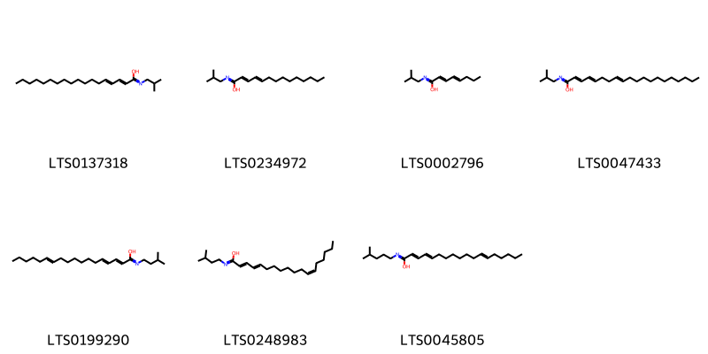{ width=100% }
    <figcaption>Hình ảnh cấu trúc hóa học của 7 hoạt chất thuộc nhóm Carboximidic acids and derivatives gồm ['(2e)-n-(2-methylpropyl)octadeca-2,4-dienimidic acid (LTS0137318)', 'n-(2-methylpropyl)tetradeca-2,4-dienimidic acid (LTS0234972)', 'n-(2-methylpropyl)octa-2,4-dienimidic acid (LTS0002796)', 'n-(2-methylpropyl)icosa-2,4,8-trienimidic acid (LTS0047433)', 'n-(3-methylbutyl)octadeca-2,4,12-trienimidic acid (LTS0199290)', '(2e,4e,12z)-n-(3-methylbutyl)octadeca-2,4,12-trienimidic acid (LTS0248983)', 'n-(4-methylpentyl)octadeca-2,4,12-trienimidic acid (LTS0045805)'].</figcaption>
</figure>
### Nhóm Carboxylic acids and derivatives
<figure markdown="span">
    { width=100% }
    <figcaption>Hình ảnh cấu trúc hóa học của 4 hoạt chất thuộc nhóm Carboxylic acids and derivatives gồm ['(2e)-n-(2-methylpropyl)-3-[(2r,3r)-3-pentyloxiran-2-yl]prop-2-enimidic acid (LTS0176642)', '(1s,4r,5r,6s)-n-(2-methylpropyl)-5-[(1e)-2-[(2-methylpropyl)-c-hydroxycarbonimidoyl]eth-1-en-1-yl]-4,6-dipentylcyclohex-2-ene-1-carboximidic acid (LTS0071495)', 'n-(2-methylpropyl)-5-{2-[(2-methylpropyl)-c-hydroxycarbonimidoyl]eth-1-en-1-yl}-4,6-dipentylcyclohex-2-ene-1-carboximidic acid (LTS0022193)', 'n-(2-methylpropyl)-3-(3-pentyloxiran-2-yl)prop-2-enimidic acid (LTS0023540)'].</figcaption>
</figure>
### Nhóm Cinnamaldehydes
<figure markdown="span">
    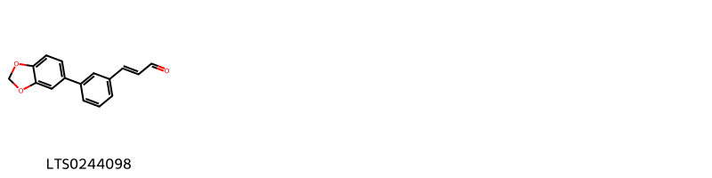{ width=100% }
    <figcaption>Hình ảnh cấu trúc hóa học của 1 hoạt chất thuộc nhóm Cinnamaldehydes gồm ['3-[3-(2h-1,3-benzodioxol-5-yl)phenyl]prop-2-enal (LTS0244098)'].</figcaption>
</figure>
### Nhóm Cinnamic acids and derivatives
<figure markdown="span">
    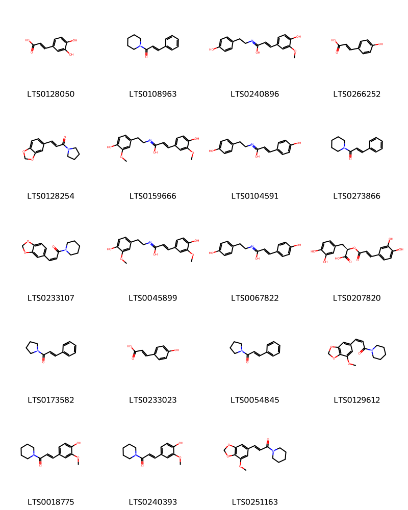{ width=100% }
    <figcaption>Hình ảnh cấu trúc hóa học của 19 hoạt chất thuộc nhóm Cinnamic acids and derivatives gồm ['3,4-dihydroxycinnamic acid (LTS0128050)', '3-phenyl-1-(piperidin-1-yl)prop-2-en-1-one (LTS0108963)', '3-(4-hydroxy-3-methoxyphenyl)-n-[2-(4-hydroxyphenyl)ethyl]prop-2-enimidic acid (LTS0240896)', 'para-coumaric acid (LTS0266252)', '3-(2h-1,3-benzodioxol-5-yl)-1-(pyrrolidin-1-yl)prop-2-en-1-one (LTS0128254)', '3-(4-hydroxy-3-methoxyphenyl)-n-[2-(4-hydroxy-3-methoxyphenyl)ethyl]prop-2-enimidic acid (LTS0159666)', '3-(4-hydroxyphenyl)-n-[2-(4-hydroxyphenyl)ethyl]prop-2-enimidic acid (LTS0104591)', '(2e)-3-phenyl-1-(piperidin-1-yl)prop-2-en-1-one (LTS0273866)', '(2z)-3-(2h-1,3-benzodioxol-5-yl)-1-(piperidin-1-yl)prop-2-en-1-one (LTS0233107)', '(2e)-3-(4-hydroxy-3-methoxyphenyl)-n-[2-(4-hydroxy-3-methoxyphenyl)ethyl]prop-2-enimidic acid (LTS0045899)', '(2e)-3-(4-hydroxyphenyl)-n-[2-(4-hydroxyphenyl)ethyl]prop-2-enimidic acid (LTS0067822)', 'rosemary acid (LTS0207820)', '3-phenyl-1-(pyrrolidin-1-yl)prop-2-en-1-one (LTS0173582)', 'hydroxycinnamic acid (LTS0233023)', '(2e)-3-phenyl-1-(pyrrolidin-1-yl)prop-2-en-1-one (LTS0054845)', '(2z)-3-(7-methoxy-2h-1,3-benzodioxol-5-yl)-1-(piperidin-1-yl)prop-2-en-1-one (LTS0129612)', '(2e)-3-(4-hydroxy-3-methoxyphenyl)-1-(piperidin-1-yl)prop-2-en-1-one (LTS0018775)', '3-(4-hydroxy-3-methoxyphenyl)-1-(piperidin-1-yl)prop-2-en-1-one (LTS0240393)', '3-(7-methoxy-2h-1,3-benzodioxol-5-yl)-1-(piperidin-1-yl)prop-2-en-1-one (LTS0251163)'].</figcaption>
</figure>
### Nhóm Fatty Acyls
<figure markdown="span">
    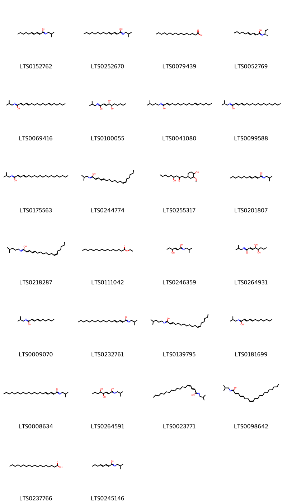{ width=100% }
    <figcaption>Hình ảnh cấu trúc hóa học của 26 hoạt chất thuộc nhóm Fatty Acyls gồm ['(2e,4e)-n-(2-methylpropyl)deca-2,4-dienimidic acid (LTS0152762)', '(2e,4e)-n-(2-methylpropyl)tetradeca-2,4-dienimidic acid (LTS0252670)', 'palmitic acid (LTS0079439)', '(2e,4e)-n-[(2r)-butan-2-yl]deca-2,4-dienimidic acid (LTS0052769)', 'n-(2-methylpropyl)octadeca-2,4,12-trienimidic acid (LTS0069416)', '4,5-dihydroxy-n-(2-methylpropyl)dec-2-enimidic acid (LTS0100055)', 'n-(4-methylpentyl)octadeca-2,12-dienimidic acid (LTS0041080)', 'n-(2-methylpropyl)octadeca-2,4-dienimidic acid (LTS0099588)', 'n-(2-methylpropyl)icosa-2,4-dienimidic acid (LTS0175563)', '(2e,4e,12z)-n-(2-methylpropyl)octadeca-2,4,12-trienimidic acid (LTS0244774)', '5-hydroxy-1-(4-hydroxy-3-methoxycyclohexyl)decan-3-one (LTS0255317)', '(2e,4e)-n-(2-methylpropyl)dodeca-2,4-dienimidic acid (LTS0201807)', '(2e,4e,12z)-n-(4-methylpentyl)octadeca-2,4,12-trienimidic acid (LTS0218287)', 'ethyl palmitate (LTS0111042)', '4-hydroxy-n-(2-methylpropyl)hex-2-enimidic acid (LTS0246359)', '4,5-dihydroxy-n-(2-methylpropyl)oct-2-enimidic acid (LTS0264931)', 'n-(2-methylpropyl)deca-2,4-dienimidic acid (LTS0009070)', '(2e,4e)-n-(2-methylpropyl)octadeca-2,4-dienimidic acid (LTS0232761)', '(2e,12z)-n-(4-methylpentyl)octadeca-2,12-dienimidic acid (LTS0139795)', 'n-(2-methylpropyl)dodeca-2,4-dienimidic acid (LTS0181699)', '(2e,4e)-n-(2-methylpropyl)icosa-2,4-dienimidic acid (LTS0008634)', '(2e,4r,5r)-4,5-dihydroxy-n-(2-methylpropyl)oct-2-enimidic acid (LTS0264591)', '(2e,4z)-n-(2-methylpropyl)octadeca-2,4-dienimidic acid (LTS0023771)', '(2e,4e,8z)-n-(2-methylpropyl)icosa-2,4,8-trienimidic acid (LTS0098642)', 'stearic acid (LTS0237766)', '(2e,4e)-n-(2-methylpropyl)octa-2,4-dienimidic acid (LTS0245146)'].</figcaption>
</figure>
### Nhóm Flavonoids
<figure markdown="span">
    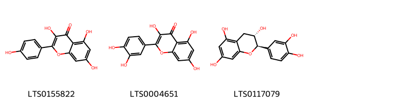{ width=100% }
    <figcaption>Hình ảnh cấu trúc hóa học của 3 hoạt chất thuộc nhóm Flavonoids gồm ['kaempherol (LTS0155822)', 'quercetin (LTS0004651)', '(+)-catechol (LTS0117079)'].</figcaption>
</figure>
### Nhóm Furanoid lignans
<figure markdown="span">
    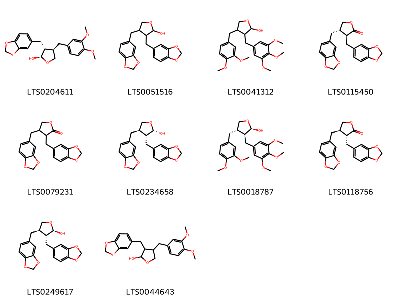{ width=100% }
    <figcaption>Hình ảnh cấu trúc hóa học của 10 hoạt chất thuộc nhóm Furanoid lignans gồm ['(2r,3r,4r)-3-(2h-1,3-benzodioxol-5-ylmethyl)-4-[(3,4-dimethoxyphenyl)methyl]oxolan-2-ol (LTS0204611)', '3,4-bis(2h-1,3-benzodioxol-5-ylmethyl)oxolan-2-ol (LTS0051516)', '4-[(3,4-dimethoxyphenyl)methyl]-3-[(3,4,5-trimethoxyphenyl)methyl]oxolan-2-ol (LTS0041312)', '(3s,4s)-3,4-bis(2h-1,3-benzodioxol-5-ylmethyl)oxolan-2-one (LTS0115450)', '3,4-bis(2h-1,3-benzodioxol-5-ylmethyl)oxolan-2-one (LTS0079231)', 'cubebin (LTS0234658)', '(2r,3s,4s)-4-[(3,4-dimethoxyphenyl)methyl]-3-[(3,4,5-trimethoxyphenyl)methyl]oxolan-2-ol (LTS0018787)', 'hinokinin (LTS0118756)', 'α-cubebin (LTS0249617)', '3-(2h-1,3-benzodioxol-5-ylmethyl)-4-[(3,4-dimethoxyphenyl)methyl]oxolan-2-ol (LTS0044643)'].</figcaption>
</figure>
### Nhóm Organonitrogen compounds
<figure markdown="span">
    { width=100% }
    <figcaption>Hình ảnh cấu trúc hóa học của 2 hoạt chất thuộc nhóm Organonitrogen compounds gồm ['choline (LTS0170307)', 'acetylcholine (LTS0185507)'].</figcaption>
</figure>
### Nhóm Organooxygen compounds
<figure markdown="span">
    { width=100% }
    <figcaption>Hình ảnh cấu trúc hóa học của 5 hoạt chất thuộc nhóm Organooxygen compounds gồm ['(2e,4s)-4-hydroxy-n-(2-methylpropyl)hex-2-enimidic acid (LTS0104554)', '1-[2-hydroxy-3-methoxy-5-(prop-2-en-1-yl)phenyl]ethanone (LTS0217393)', '(2e,4r)-4-hydroxy-n-(2-methylpropyl)hex-2-enimidic acid (LTS0251553)', '(2e,4s,5s)-4,5-dihydroxy-n-(2-methylpropyl)dec-2-enimidic acid (LTS0188471)', '4-isopropyl-2-cyclohexenone (LTS0257032)'].</figcaption>
</figure>
### Nhóm Phenol esters
<figure markdown="span">
    { width=100% }
    <figcaption>Hình ảnh cấu trúc hóa học của 1 hoạt chất thuộc nhóm Phenol esters gồm ['eugenyl acetate (LTS0165886)'].</figcaption>
</figure>
### Nhóm Phenol ethers
<figure markdown="span">
    { width=100% }
    <figcaption>Hình ảnh cấu trúc hóa học của 3 hoạt chất thuộc nhóm Phenol ethers gồm ['p-propenylanisole (LTS0177188)', 'tarragon (LTS0245226)', 'anethole (LTS0033696)'].</figcaption>
</figure>
### Nhóm Phenols
<figure markdown="span">
    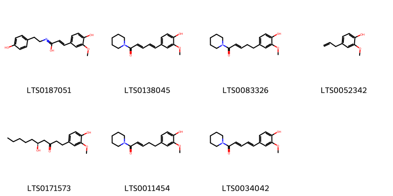{ width=100% }
    <figcaption>Hình ảnh cấu trúc hóa học của 7 hoạt chất thuộc nhóm Phenols gồm ['(2e)-3-(4-hydroxy-3-methoxyphenyl)-n-[2-(4-hydroxyphenyl)ethyl]prop-2-enimidic acid (LTS0187051)', '(2e,4e)-5-(4-hydroxy-3-methoxyphenyl)-1-(piperidin-1-yl)penta-2,4-dien-1-one (LTS0138045)', '(2e)-5-(4-hydroxy-3-methoxyphenyl)-1-(piperidin-1-yl)pent-2-en-1-one (LTS0083326)', 'eugenol (LTS0052342)', 'gingerol (LTS0171573)', '5-(4-hydroxy-3-methoxyphenyl)-1-(piperidin-1-yl)pent-2-en-1-one (LTS0011454)', '5-(4-hydroxy-3-methoxyphenyl)-1-(piperidin-1-yl)penta-2,4-dien-1-one (LTS0034042)'].</figcaption>
</figure>
### Nhóm Piperidines
<figure markdown="span">
    { width=100% }
    <figcaption>Hình ảnh cấu trúc hóa học của 14 hoạt chất thuộc nhóm Piperidines gồm ['coumaperine (LTS0137079)', '1-(piperidin-1-yl)deca-2,4-diene-1,6-dione (LTS0071906)', '(2e,4s,5s)-4,5-dihydroxy-1-(piperidin-1-yl)dec-2-en-1-one (LTS0133301)', '1-(piperidin-1-yl)octadec-2-en-1-one (LTS0090884)', '4,5-dihydroxy-1-(piperidin-1-yl)dec-2-en-1-one (LTS0031490)', '(2e)-1-(piperidin-1-yl)octadec-2-en-1-one (LTS0120739)', '1-(piperidin-1-yl)deca-2,4-dien-1-one (LTS0110933)', 'piperidine (LTS0191209)', '5-(4-hydroxyphenyl)-1-(piperidin-1-yl)penta-2,4-dien-1-one (LTS0211320)', '(2e,4e)-1-(piperidin-1-yl)deca-2,4-dien-1-one (LTS0273026)', '(2e,4s,5r)-4,5-dihydroxy-1-(piperidin-1-yl)dec-2-en-1-one (LTS0024179)', '(2e,4r,5r)-4,5-dihydroxy-1-(piperidin-1-yl)dec-2-en-1-one (LTS0003195)', '(2e,4e)-1-(piperidin-1-yl)deca-2,4-diene-1,6-dione (LTS0239766)', '(2e)-1-(piperidin-1-yl)dec-2-en-1-one (LTS0123112)'].</figcaption>
</figure>
### Nhóm Prenol lipids
<figure markdown="span">
    { width=100% }
    <figcaption>Hình ảnh cấu trúc hóa học của 36 hoạt chất thuộc nhóm Prenol lipids gồm ['(e)-calamene (LTS0228241)', '(1r,4s,6r,7s,10r)-7-isopropyl-4,10-dimethyltricyclo[4.4.0.0¹,⁵]decan-4-ol (LTS0223062)', 'terpineol (LTS0136148)', 'carvone (LTS0196605)', 'linalool, (+-)- (LTS0128839)', '2,6,6-trimethylbicyclo[3.1.1]hept-1-ene (LTS0080542)', 'terpinolene (LTS0104525)', 'β-pinene (LTS0117550)', 'cymene (LTS0181568)', 'nerolidol (LTS0197738)', 'monoterpenes (LTS0106881)', 'α pinene (LTS0132416)', 'humulene (LTS0263171)', 'carveol (LTS0263183)', '4-isopropyl-1,6-dimethyl-2,3,4,4a,7,8-hexahydronaphthalene (LTS0270743)', '(3r,6e)-nerolidol (LTS0145065)', '(6e)-2,6-dimethyl-10-methylidenedodeca-2,6-diene (LTS0154516)', 'limonene,  (LTS0155981)', 'β-caryophyllen (LTS0141501)', '4-terpineol (LTS0253733)', 'caryophyllene (LTS0085212)', '3,4-dihydroxy-5-isopropyl-11,11-dimethyl-16-oxatetracyclo[6.6.2.0¹,¹⁰.0²,⁷]hexadeca-2(7),3,5-trien-15-one (LTS0266849)', 'carnosic acid (LTS0097375)', 'thymol (LTS0168527)', '(-)-trans-carveol (LTS0156471)', 'caryophyllene (LTS0048037)', '3,4,8-trihydroxy-5-isopropyl-11,11-dimethyl-16-oxatetracyclo[7.5.2.0¹,¹⁰.0²,⁷]hexadeca-2(7),3,5-trien-15-one (LTS0269672)', 'gamma-muurolene (LTS0052920)', 'caryophyllene (LTS0131870)', 'carvacrol (LTS0012882)', 'delta-cadinene (LTS0019321)', 'citronellol, (+-)- (LTS0090925)', 'carvone, (+)- (LTS0027671)', 'dihydrocarveol (LTS0111467)', '(-)-β-cubebene (LTS0123697)', '(-)-cis-carveol (LTS0048903)'].</figcaption>
</figure>
### Nhóm Pyridines and derivatives
<figure markdown="span">
    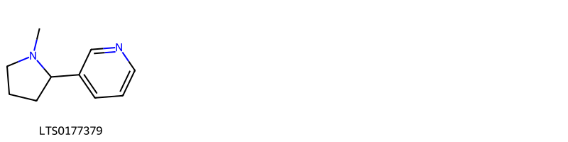{ width=100% }
    <figcaption>Hình ảnh cấu trúc hóa học của 1 hoạt chất thuộc nhóm Pyridines and derivatives gồm ['nicotine (LTS0177379)'].</figcaption>
</figure>
### Nhóm Pyrrolidines
<figure markdown="span">
    { width=100% }
    <figcaption>Hình ảnh cấu trúc hóa học của 9 hoạt chất thuộc nhóm Pyrrolidines gồm ['1-(pyrrolidin-1-yl)dodeca-2,4-dien-1-one (LTS0079736)', '(2e,4e)-1-(pyrrolidin-1-yl)dodeca-2,4-dien-1-one (LTS0091682)', '1-(pyrrolidin-1-yl)hexadecan-1-one (LTS0089026)', '(2e)-1-(pyrrolidin-1-yl)octadec-2-en-1-one (LTS0076720)', 'iyeremide a (LTS0276326)', '5-hexanoyl-5-hydroxy-1-(2-methylpropyl)pyrrolidin-2-one (LTS0016700)', '1-(pyrrolidin-1-yl)octadec-2-en-1-one (LTS0086752)', '1-(pyrrolidin-1-yl)deca-2,4-dien-1-one (LTS0131584)', '(5s)-5-hexanoyl-5-hydroxy-1-(2-methylpropyl)pyrrolidin-2-one (LTS0116120)'].</figcaption>
</figure>
### Nhóm Steroids and steroid derivatives
<figure markdown="span">
    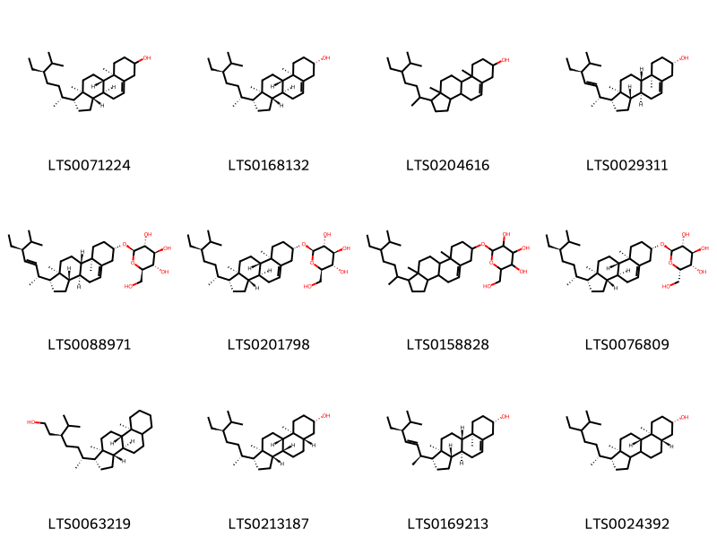{ width=100% }
    <figcaption>Hình ảnh cấu trúc hóa học của 12 hoạt chất thuộc nhóm Steroids and steroid derivatives gồm ['stigmast-5-en-3-ol (LTS0071224)', 'sitosterol (LTS0168132)', 'stigmast-5-en-3-ol, (3β)- (LTS0204616)', 'phytosterol (LTS0029311)', '(2r,3r,4s,5s,6r)-2-{[(1r,3as,3bs,7s,9ar,9bs,11ar)-1-[(2r,3e,5s)-5-ethyl-6-methylhept-3-en-2-yl]-9a,11a-dimethyl-1h,2h,3h,3ah,3bh,4h,6h,7h,8h,9h,9bh,10h,11h-cyclopenta[a]phenanthren-7-yl]oxy}-6-(hydroxymethyl)oxane-3,4,5-triol (LTS0088971)', 'sitogluside (LTS0201798)', '2-{[1-(5-ethyl-6-methylheptan-2-yl)-9a,11a-dimethyl-1h,2h,3h,3ah,3bh,4h,6h,7h,8h,9h,9bh,10h,11h-cyclopenta[a]phenanthren-7-yl]oxy}-6-(hydroxymethyl)oxane-3,4,5-triol (LTS0158828)', '(2r,3r,4s,5s,6s)-2-{[(1r,3as,3bs,7s,9ar,9bs,11ar)-1-[(2r,5r)-5-ethyl-6-methylheptan-2-yl]-9a,11a-dimethyl-1h,2h,3h,3ah,3bh,4h,6h,7h,8h,9h,9bh,10h,11h-cyclopenta[a]phenanthren-7-yl]oxy}-6-(hydroxymethyl)oxane-3,4,5-triol (LTS0076809)', '(3s,6r)-6-[(1r,3as,3br,9as,9bs,11ar)-9a,11a-dimethyl-tetradecahydro-1h-cyclopenta[a]phenanthren-1-yl]-3-isopropylheptan-1-ol (LTS0063219)', '(1r,3as,3bs,5as,7s,9as,9bs,11ar)-1-[(2r,5r)-5-ethyl-6-methylheptan-2-yl]-9a,11a-dimethyl-tetradecahydro-1h-cyclopenta[a]phenanthren-7-ol (LTS0213187)', '(1r,3as,3bs,7s,9ar,9bs,11ar)-1-[(2s,3e,5s)-5-ethyl-6-methylhept-3-en-2-yl]-9a,11a-dimethyl-1h,2h,3h,3ah,3bh,4h,6h,7h,8h,9h,9bh,10h,11h-cyclopenta[a]phenanthren-7-ol (LTS0169213)', '(1r,5as,7s,9as,9bs,11ar)-1-[(2r)-5-ethyl-6-methylheptan-2-yl]-9a,11a-dimethyl-tetradecahydro-1h-cyclopenta[a]phenanthren-7-ol (LTS0024392)'].</figcaption>
</figure>
### Nhóm Stilbenes
<figure markdown="span">
    { width=100% }
    <figcaption>Hình ảnh cấu trúc hóa học của 2 hoạt chất thuộc nhóm Stilbenes gồm ['1-[5,6-bis(2h-1,3-benzodioxol-5-yl)-2-(piperidine-1-carbonyl)cyclohex-3-ene-1-carbonyl]piperidine (LTS0265804)', '1-[(1s,2s,5r,6r)-5,6-bis(2h-1,3-benzodioxol-5-yl)-2-(piperidine-1-carbonyl)cyclohex-3-ene-1-carbonyl]piperidine (LTS0191462)'].</figcaption>
</figure>
### Nhóm Unsaturated hydrocarbons
<figure markdown="span">
    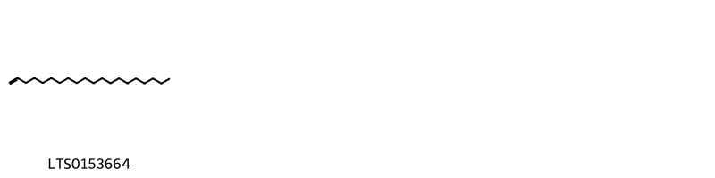{ width=100% }
    <figcaption>Hình ảnh cấu trúc hóa học của 1 hoạt chất thuộc nhóm Unsaturated hydrocarbons gồm ['1-eicosene (LTS0153664)'].</figcaption>
</figure>

---

## Tác dụng dược lý

Theo tài liệu "Những cây thuốc và vị thuốc Việt Nam" - Đỗ Tất Lợi:- Dùng liều nhỏ tăng dịch vị, dịch tụy, hồ tiêu kích thích tiêu hóa, làm ăn ngon cơm, nhưng liều lớn, kích thích niêm mạc dạ dày, gây sung huyết và viêm cục bộ, gây sốt, viêm đường tiểu tiện, đi đái ra máu.
- Piperin và piperidin độc ở liều cao, piperidin tăng huyết áp, làm tê liệt hô hấp và một số đầu dây thần kinh (50mg/kg thể trọng)
- Hồ tiêu còn có tác dụng sát trùng, diệt ký sinh trùng, gây hắt hơi. Mùi hồ tiêu đuổi các sâu bọ, do đó hồ tiêu được dùng bảo vệ quần áo len khỏi bị nhạy cắn.

Theo tài liệu quốc tế: 

---

## Dược điển Việt Nam V

### Soi bột:
Hồ tiêu đen: Bột màu tro thẫm, tế bào đá ở vỏ ngoài hình gần vuông. chữ nhật hoặc không đều, đường kính 19 pm đến 66 gm, thành tương đối dày. Tế bào đá vỏ quả trong hình đa giác, đường kính 20 pm đến 30 pm, nhìn mặt bên có hình vuông, thành tế bào có một mặt mỏng. Tế bào vỏ hạt hình đa giác, màu nâu, thành dày mỏng không đều và có hình chuỗi hạt. Giọt dầu tương đối ít, hình tròn, đường kính 51 pm đến 75 pm. Hạt tinh bột rất nhỏ, thường tụ tập lại thành khối.
<!-- Hình ảnh soi bột sẽ được tự động chèn vào đây sau -->
### Vi phẫu:
Vỏ quả ngoài cấu tạo bởi một lớp tế bào xếp không đều và hơi uốn lượn. Vòng mô cứng xếp sát vỏ quả ngoài. Tế bào mô cứng hình nhiều cạnh, thành dày, khoang hẹp, có ống trao đổi rõ, xếp thành đám sát nhau thành nhiều vòng liên tục. Vỏ quả giữa: Vùng ngoài cấu tạo bởi tế bào nhỏ, thành mỏng, nhăn nheo, bị bẹp, kéo dài theo hướng tiếp tuyến, có nhiều tế bào chứa tinh dầu. Vỏ quả trong gồm tế bào mô cứng thành dày phía trong và hai bên thành hình chữ U. Một lớp tế bào vỏ hạt xếp đều đặn, thành mỏng. Vùng ngoại nhũ rất rộng, phía ngoài gồm 2 đến 3 lớp tế bào nhỏ thành mỏng, ở sát vỏ hạt; phía trong gồm tế bào lớn hơn, thành mỏng chứa nhiều tinh bột và tế bào tiết tinh dầu. Đối diện với cuống quả có một vùng nội nhũ rất nhỏ, cây mầm nằm trong nội nhũ.
<!-- Hình ảnh vi phẫu sẽ được tự động chèn vào đây sau -->
### Định tính

Lấy 5 g bột dược liệu, thêm 3 ml amoniac đậm đặc (TT), trộn cho thấm đều, thêm 15 ml cloroform (TT), lắc, đun hồi lưu trên cách thủy trong 15 min, lọc. Cho dịch lọc vào bình gạn, thêm 10 ml dung dịch acid sulfuric 2 % (TT), lắc mạnh trong 1 min, để yên cho dung dịch tách thành 2 lớp, gạn lấy phaàn acid, lọc, lấy dịch lọc làm các phản ứng sau: Lấy 1 ml dịch lọc, thêm 2 giọt thuốc thử Bouchardat (TT), để yên 5 min dung dịch sẽ đục. Lấy 1 ml dịch chiết acid, thêm 6 giọt thuốc thử Mayer (TT) để yên 5 min dung dịch sẽ đục. Phương pháp sắc ký lớp mỏng (Phụ lục 5.4). Bản mỏng-‘ Silicagel G. Dung môi khai triển: Cyclohexan – ethyl acetat – aceton (7:3:1). Dung dịch thử: Lấy khoảng 0,5 g bột dược liệu thô, them 20 ml ethanol (TT). đun trên cách thủy 15 min, lọc, lấy dịch lọc làm dung dịch thử. Dung dịch đối chiếu: Dung dịch piperin trong ethanol (TT) có nồng độ 4 mg/ml. Nếu không có piperin, lấy khoảng 0,5 g bột Hồ tiêu (mẫu chuẩn), chiết như mô tả ở phần Dung dịch thử. Cách tiến hành: Chấm riêng biệt lên bản mỏng 5 pl mỗi dung dịch trên. Sau khi triển khai xong, lấy bản mỏng ra để khô ở nhiệt độ phòng. Phun dung dịch acid sulfuric 10 % trong ethanol (TT). sấy bản mỏng ở 100 °c cho tới khi xuất hiện rõ các vết. Quan sát dưới ánh sáng thường, sắc ký đồ của dung dịch thử phải có các vết có cùng màu sắc và giá trị Rf với các vết trên sắc ký đồ của dung dịch đối chiếu. Hoặc Phương pháp sắc ký lớp mỏng (Phụ lục 5.4). Bản mỏng: Silicagel G. Dung môi khai triển: Toluen – ether dầu hỏa (30 °c đến 60 aC) (8 : 2). Dung dịch thử: Pha loãng 0,2 ml tinh dầu thu được ở phần Định lượng với 0,5 ml cloroform (TT) được dung dịch thử. Dung dịch đối chiếu: Lấy 0,2 ml tinh dầu cất được từ Hồ tiêu (mẫu chuẩn) pha trong 0,5 ml cloroform (TT). Cách tiến hành: Chấm riêng biệt lên bản mỏng 5 pl mỗi dung dịch trên. Sau khi triển khai sắc ký, lấy bản mỏng ra để khô bản mỏng trong không khí, phun dung dịch vanilin 1 % trong acid sulfuric (TT). sấy bản mỏng ở 100 C trong 10 min. Quan sát dưới ánh sáng thường. Trên sắc ký đồ của dung dịch thử phải có các vết có cùng giá trị Rf và cùng màu sắc với các vết trên sắc ký đồ của dung dịch đối chiếu.

### Định lượng

Chất chiết được trong dược liệu Không ít hơn 8,0 %, tính theo dược liệu khô kiệt. Tiến hành theo phương pháp chiết nóng (Phụ lục 12.10), dùng ethanol 96 % (TT) làm dung môi. Định lượng Tiên hành theo phương pháp “Định lượng tinh dầu trong dược liệu” (Phụ lục 12.7). Cân chính xác khoảng 50 g dược liệu, cho vào bình cầu của bộ dụng cụ cất tinh dầu, cất trong 5 h. Hàm lượng tinh dầu trong dược liệu không ít hơn 2,5% tính theo dược liệu khô kiệt.

### Thông tin khác 
- ** Độ ẩm: ** Không quá 11,0 % ( Phụ lục 12.13).

- ** Bảo quản:** Nơi khô, mát, trong bao bì kín.nn
## Dược điển Hồng kong

<!-- PDF sẽ được tự động chèn vào đây sau -->

---

## Y dược học cổ truyền

- **Tên vị thuốc:** 
- **Tính vị quy kinh:** Tán, nhiệt. Quy vào kinh vị, đại tràng.
- **Công năng chủ trị:** Ôn trung tán hàn, kiện vị chi đau.
Chủ trị: Vị hàn gây nôn mửa, tiêu chảy đau bụng và khó tiêu, chán ăn.
- **Chú ý:** 
- **Kiêng kỵ:** Âm hư, hỏa vượng, trĩ, táo bón không nên dùng.nn

