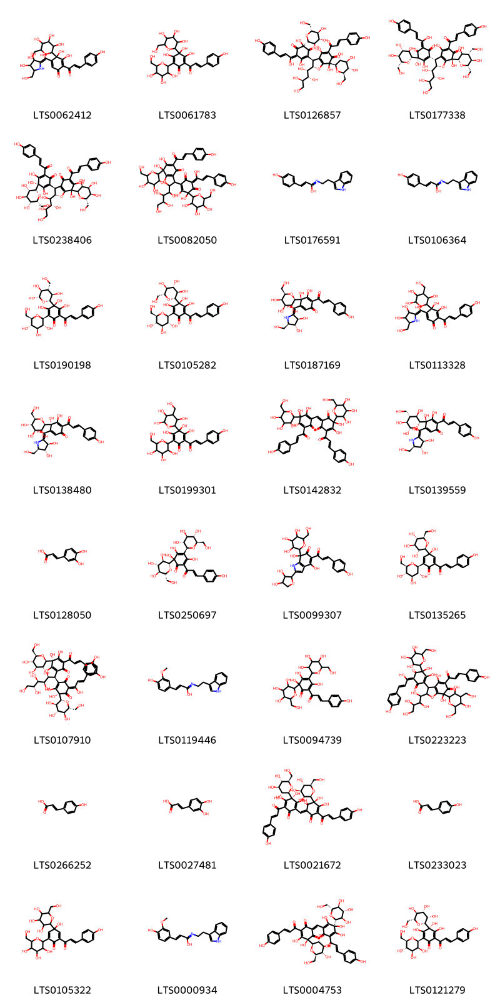
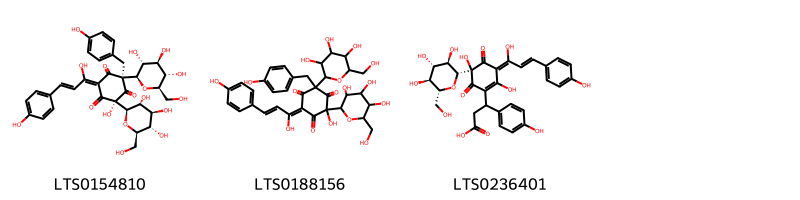
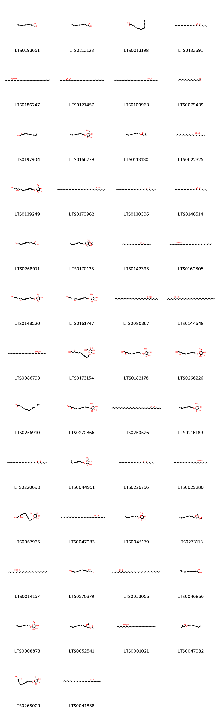
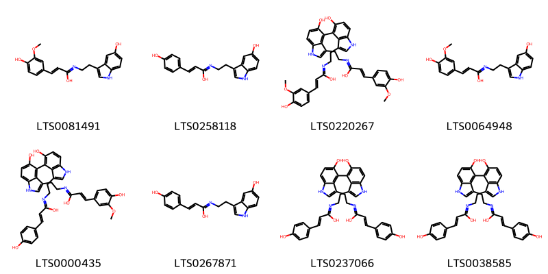
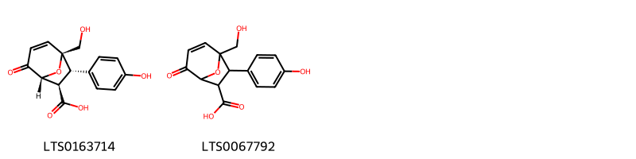
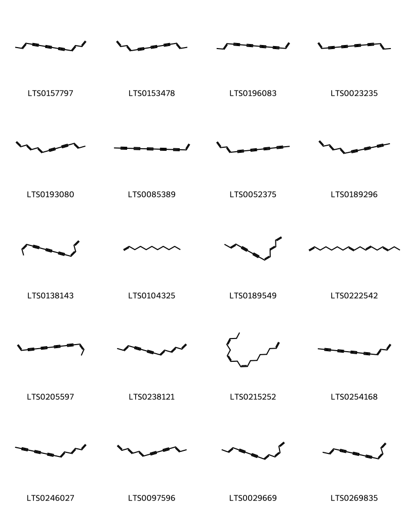

!!! abstract "Tóm tắt"
    Hồng hoa (hoa) có tên khoa học của Dược liệu là Flos Carthami tinctorii, là một loại cây thuộc họ Cúc (Asteraceae), được biết đến với hoa màu đỏ cam đặc trưng. Hoa của cây Hồng hoa có tên khoa học là Carthamus tinctorius L.. Từ lâu, Hồng Hoa đã được sử dụng rộng rãi trong y học cổ truyền và hiện đại nhờ vào những tác dụng dược lý quý giá. Cây Hồng Hoa có nguồn gốc từ các vùng ôn đới và cận nhiệt đới, phân bố rộng khắp thế giới, bao gồm cả Việt Nam. Ở nước ta, Hồng Hoa mọc nhiều ở các tỉnh miền núi phía Bắc như Hà Giang và một số vùng khác. Đặc điểm của hoa là cụm hoa gồm những đầu họp lại thành ngù, hoa có màu đỏ cam đẹp. Hoa của cây Hồng Hoa chứa một lượng lớn các hợp chất hoạt tính sinh học, trong đó đáng chú ý là các flavonoid, axit béo, steroid và nhiều các hợp chất khác. Các hợp chất này đóng vai trò quan trọng trong việc tạo nên các tác dụng dược lý của Hồng Hoa. Các nghiên cứu khoa học đã chỉ ra rằng hoa của Hồng hoa có nhiều tác dụng tốt cho sức khỏe, bao gồm: chống viêm và giảm đau, chống đông máu, chống oxy hóa, ảnh hưởng đến bệnh loãng xương, hoạt động bảo vệ gan, tác dụng trị đái tháo đường. Trong y học cổ truyền, Hồng Hoa thường được sử dụng để điều trị các chứng bệnh như: Bế kinh, kinh nguyệt không đều, đau bụng kinh, rong kinh, tụ huyết, sưng đau, bong gân, đau đầu, đau nhức xương khớp. 
Hồng Hoa là một vị thuốc quý giá, có nhiều tác dụng tốt cho sức khỏe.

## Thông tin về thực vật

### Đặc điểm thực vật

Dược liệu **Hồng Hoa (Hoa)** từ bộ phận **Hoa** từ loài *Carthamus tinctorius L.* thuộc họ Asteraceae. Cây thuộc thảo, cao 0,60-1m hay hơn, không có lông, thân trắng có vạch dọc. Lá mọc so le không có cuống, mép có răng cưa nhọn. Cụm hoa gồm những đầu họp lại thành ngù. Hoa màu đỏ cam đẹp, lá bắc có gai. Quả bế có bốn cạnh lỗi nhỏ dài 6-7mm, rộng 4-5mm. 

!!! info "Phân loại thực vật của *Carthamus tinctorius*"
    - **Kingdom:** Plantae
    - **Phylum:** Tracheophyta
    - **Order:** Asterales
    - **Family:** Asteraceae
    - **Genus:** Carthamus
    - **Species:** *Carthamus tinctorius*

*Tài liệu tham khảo:* "Những cây thuốc và vị thuốc Việt Nam" - Đỗ Tất Lợi

 

### Loài thay thế (Nếu có)

### Phân bố trên thế giới
**Từ vườn thực vật KEW: **: Afghanistan, Alberta, Algeria, Argentina Northeast, Argentina Northwest, Argentina South, Arizona, Assam, Austria, Baltic States, Bangladesh, Belgium, Borneo, British Columbia, Bulgaria, California, Cambodia, Canary Is., Central European Russia, Chile Central, Chile North, Chile South, China North-Central, China South-Central, China Southeast, Colombia, Colorado, Cuba, Czechoslovakia, East Aegean Is., East European Russia, East Himalaya, Egypt, El Salvador, Eritrea, Ethiopia, France, Germany, Great Britain, Greece, Gulf States, Hainan, Hungary, Idaho, Illinois, India, Inner Mongolia, Iowa, Iraq, Ireland, Italy, Japan, Jawa, Kansas, Kazakhstan, Korea, Krym, Kuwait, Laos, Lebanon-Syria, Lesser Sunda Is., Libya, Madeira, Malaya, Maluku, Manchuria, Massachusetts, Mauritius, Mexico Central, Mexico Gulf, Mexico Northeast, Mexico Northwest, Mexico Southeast, Mexico Southwest, Montana, Morocco, Mozambique, Myanmar, Nebraska, Nepal, Netherlands, New Mexico, New South Wales, New York, New Zealand North, New Zealand South, Nicaragua, North Caucasus, North Dakota, North European Russia, Northern Territory, Northwest European Russia, Ohio, Oman, Oregon, Pakistan, Palestine, Paraguay, Philippines, Poland, Portugal, Qinghai, Queensland, Romania, Saudi Arabia, Sicilia, South Australia, South European Russia, Spain, Sudan, Sulawesi, Sumatera, Switzerland, Tadzhikistan, Tasmania, Thailand, Tibet, Transcaucasus, Tunisia, Ukraine, Uruguay, Utah, Uzbekistan, Victoria, Vietnam, Washington, West Himalaya, West Siberia, Western Australia, Xinjiang, Yemen, Yugoslavia, Zimbabwe

**Từ CSDL GIBF** Poland, Uzbekistan, Australia, Belgium, Spain, Austria, Croatia, Norway, Oman, Germany, Pakistan, Netherlands, Algeria, Denmark, United Arab Emirates, Morocco, Guatemala, India, Argentina, Sweden, Ethiopia, Mexico, Italy, Iraq, United Kingdom of Great Britain and Northern Ireland, Türkiye, Russian Federation, Czechia, Israel, Tunisia, Switzerland, United States of America, Portugal, Chinese Taipei, France, Kazakhstan, Canada

### Phân bố tại Việt Nam
** "Những cây thuốc và vị thuốc Việt Nam" - Đỗ Tất Lợi**: Được trồng trước đây nhiều nhất ở Hà Giang. Hiện nay đang nghiên cứu phát triển nhiều nơi.

**Từ CSDL GIBF**: Không có ghi nhận ở Việt Nam

---

## Thông tin về dược liệu 

### Định danh

!!! info "Thông tin về tên gọi của hồng hoa"
    - Dược liệu tiếng Việt: hồng hoa
    - Dược liệu tiếng Trung: 红花 (Hong Hua)
    - Dược liệu tiếng Anh: Carthamus Tinctorius
    - Dược liệu latin thông dụng: Flos Carthami tinctoriinCarthami Flos
    - Dược liệu latin kiểu DĐVN: flos carthami tinctorii
    - Dược liệu latin kiểu DĐVN: Carthami Flos
    - Dược liệu latin kiểu thông tư: Flos Carthami tinctorii
    - Bộ phận dùng: Hoa (Flos)

### Mô tả dược liệu 
- **Theo dược điển Việt nam V:** 
Hoa dài 1 cm đến 2 cm, mặt ngoài màu vàng đỏ hay đỏ. Tràng hoa hình ống thon, phía trên xẻ làm 5 cánh hẹp, dài 0,5 cm đến 0,8 cm, hoa có 5 nhị. Bao phấn dính liền thành ống, màu vàng, núm nhụy dài hình trụ, hơi phân đôi, nhô ra khỏi cánh hoa. Chất mềm, mùi thơm nhẹ, vị hơi đắng.

- **Mô tả dược liệu theo thông tư chế biến dược liệu theo phương pháp cổ truyền:** 

### Chế biến 

- **Chế biến theo dược điển việt nam V**: 
Thu hoạch vào mùa hạ, hái lấy hoa đang nở và cánh hoa chuyển từ vàng sang đỏ, để nơi râm mát, thoáng gió hoặc phơi nắng nhẹ cho khô dần.nn

- **Chế biến theo thông tư:** 

--- 

## Thành phần hóa học

- Theo tài liệu của GS. Đỗ Tất Lợi:  (1) Nhóm hóa học: flavonoid, phenylethanoid glycoside, coumarin, axit béo, steroid và polysacarit.
(2) Tên hoạt chất: 
- Flavonoid:
    + Nhóm quinochalcon: Carthamin, carthamon, iso-carthamin
    + Các flavonoid khác: Luteolin, dẫn chất của quercetin, kaempferol, 6-hydroxykaempferol và glycoside của nó, chalcon (hydroxysafflor yellow A, safflor yellow A, safflamin C và safflamin A), safflomin-A, nicotiflorin, luteolin 7-O-beta-D-glucopyranoside và luteolin-7-O-(6''-O-acetyl)-beta-D-glucopyranoside.
- Axit béo: Axit lauric, axit myristic, axit palmitic, axit linoleic, axit arachidic và axit oleic.
- Steroid: Heliaol, α-amyrin, β-amyrin, lupeol, cycloartenol, 24-methylenecycloartanol, tirucalla-7,24-dienol và dammaradienol.
- Tinh dầu: Caryophyllen, p-allyltoluen, 1-acetoxytetralin và heneicosan.
    
- Theo cơ sở dữ liệu lotus: Từ loài *Carthamus tinctorius* đã phân lập và xác định được 248 hoạt chất thuộc về các nhóm Lignan glycosides, Coumarins and derivatives, Indoles and derivatives, Pyrans, Steroids and steroid derivatives, Phenols, Halohydrins, Cinnamic acids and derivatives, Purine nucleosides, Organooxygen compounds, Diarylheptanoids, Fatty Acyls, Prenol lipids, Furanoid lignans, Carboxylic acids and derivatives, Unsaturated hydrocarbons, Flavonoids, 2-arylbenzofuran flavonoids. 

|    | chemicalTaxonomyClassyfireClass   |   smiles_count |
|---:|:----------------------------------|---------------:|
|  0 | 2-arylbenzofuran flavonoids       |              2 |
|  1 | Carboxylic acids and derivatives  |              2 |
|  2 | Cinnamic acids and derivatives    |             32 |
|  3 | Coumarins and derivatives         |              2 |
|  4 | Diarylheptanoids                  |              3 |
|  5 | Fatty Acyls                       |             52 |
|  6 | Flavonoids                        |             47 |
|  7 | Furanoid lignans                  |              2 |
|  8 | Halohydrins                       |              6 |
|  9 | Indoles and derivatives           |              8 |
| 10 | Lignan glycosides                 |              5 |
| 11 | Organooxygen compounds            |             13 |
| 12 | Phenols                           |              2 |
| 13 | Prenol lipids                     |             17 |
| 14 | Purine nucleosides                |              1 |
| 15 | Pyrans                            |              2 |
| 16 | Steroids and steroid derivatives  |             29 |
| 17 | Unsaturated hydrocarbons          |             20 |

### Nhóm 2-arylbenzofuran flavonoids
<figure markdown="span">
    { width=100% }
    <figcaption>Hình ảnh cấu trúc hóa học của 2 hoạt chất thuộc nhóm 2-arylbenzofuran flavonoids gồm ['3-(4-hydroxy-3-methoxyphenyl)-2-oxa-6,11-diazatetracyclo[7.5.2.0⁴,¹⁵.0¹²,¹⁶]hexadeca-1(14),5,9,12,15-pentaen-5-ol (LTS0258232)', '(3s,4s)-3-(4-hydroxy-3-methoxyphenyl)-2-oxa-6,11-diazatetracyclo[7.5.2.0⁴,¹⁵.0¹²,¹⁶]hexadeca-1(14),5,9,12,15-pentaen-5-ol (LTS0245781)'].</figcaption>
</figure>
### Nhóm Carboxylic acids and derivatives
<figure markdown="span">
    { width=100% }
    <figcaption>Hình ảnh cấu trúc hóa học của 2 hoạt chất thuộc nhóm Carboxylic acids and derivatives gồm ['2-chlorotrideca-3,11-dien-5,7,9-triyn-1-yl acetate (LTS0164955)', '(2s,3e,11e)-2-chlorotrideca-3,11-dien-5,7,9-triyn-1-yl acetate (LTS0101345)'].</figcaption>
</figure>
### Nhóm Cinnamic acids and derivatives
<figure markdown="span">
    { width=100% }
    <figcaption>Hình ảnh cấu trúc hóa học của 32 hoạt chất thuộc nhóm Cinnamic acids and derivatives gồm ['5-{[3,4-dihydroxy-5-(hydroxymethyl)pyrrolidin-2-ylidene](hydroxy)methyl}-3,4-dihydroxy-2-[3-(4-hydroxyphenyl)prop-2-enoyl]-4-[3,4,5-trihydroxy-6-(hydroxymethyl)oxan-2-yl]cyclohexa-2,5-dien-1-one (LTS0062412)', '3,4,5-trihydroxy-2-[3-(4-hydroxyphenyl)prop-2-enoyl]-4,6-bis[3,4,5-trihydroxy-6-(hydroxymethyl)oxan-2-yl]cyclohexa-2,5-dien-1-one (LTS0061783)', '(6e)-4-[(2s,3r)-4,7-dihydroxy-5-[(2e)-3-(4-hydroxyphenyl)prop-2-enoyl]-6-oxo-2-[(1s,2r,3r)-1,2,3,4-tetrahydroxybutyl]-7-[(2r,3r,4s,5s,6r)-3,4,5-trihydroxy-6-(hydroxymethyl)oxan-2-yl]-2,3-dihydro-1-benzofuran-3-yl]-2,5-dihydroxy-6-[(2e)-1-hydroxy-3-(4-hydroxyphenyl)prop-2-en-1-ylidene]-2-[(2r,3r,4s,5s,6r)-3,4,5-trihydroxy-6-(hydroxymethyl)oxan-2-yl]cyclohex-4-ene-1,3-dione (LTS0126857)', '(2e,6s)-4-[(2s,3s,7s)-7-[(2s,3s,4r,5r,6s)-3,5-dihydroxy-4,6-bis(hydroxymethyl)oxan-2-yl]-4,7-dihydroxy-5-[(2e)-3-(4-hydroxyphenyl)prop-2-enoyl]-6-oxo-2-[(1s,2r,3r)-1,2,3,4-tetrahydroxybutyl]-2,3-dihydro-1-benzofuran-3-yl]-5,6-dihydroxy-2-[(2e)-1-hydroxy-3-(4-hydroxyphenyl)prop-2-en-1-ylidene]-6-[(2r,3r,4s,5s,6r)-3,4,5-trihydroxy-6-(hydroxymethyl)oxan-2-yl]cyclohex-4-ene-1,3-dione (LTS0177338)', '(2s,3s,7r)-6,7-dihydroxy-5-[(2e)-3-(4-hydroxyphenyl)prop-2-enoyl]-2-[(1r,2r,3r)-1,2,3,4-tetrahydroxybutyl]-3-[(3s)-2,3,4-trihydroxy-5-[(2e)-3-(4-hydroxyphenyl)prop-2-enoyl]-6-oxo-3-[(2r,3s,4r,5r,6r)-3,4,5-trihydroxy-6-(hydroxymethyl)oxan-2-yl]cyclohexa-1,4-dien-1-yl]-7-[(2r,3s,4s,5r,6s)-3,4,5-trihydroxy-6-(hydroxymethyl)oxan-2-yl]-2,3-dihydro-1-benzofuran-4-one (LTS0238406)', '4-{6,7-dihydroxy-5-[3-(4-hydroxyphenyl)prop-2-enoyl]-4-oxo-2-(1,2,3,4-tetrahydroxybutyl)-7-[3,4,5-trihydroxy-6-(hydroxymethyl)oxan-2-yl]-2,3-dihydro-1-benzofuran-3-yl}-5,6-dihydroxy-2-[1-hydroxy-3-(4-hydroxyphenyl)prop-2-en-1-ylidene]-6-[3,4,5-trihydroxy-6-(hydroxymethyl)oxan-2-yl]cyclohex-4-ene-1,3-dione (LTS0082050)', '(2e)-3-(4-hydroxyphenyl)-n-[2-(1h-indol-3-yl)ethyl]prop-2-enimidic acid (LTS0176591)', '3-(4-hydroxyphenyl)-n-[2-(1h-indol-3-yl)ethyl]prop-2-enimidic acid (LTS0106364)', '(4r)-3,4,5-trihydroxy-2-[(2e)-3-(4-hydroxyphenyl)prop-2-enoyl]-4-[(2r,3r,4r,5s,6s)-3,5,6-trihydroxy-4-(hydroxymethyl)oxan-2-yl]-6-[(2s,3r,4r,5s,6r)-3,4,5-trihydroxy-6-(hydroxymethyl)oxan-2-yl]cyclohexa-2,5-dien-1-one (LTS0190198)', '(4r)-3,4,5-trihydroxy-2-[(2e)-3-(4-hydroxyphenyl)prop-2-enoyl]-4-[(2r,3r,4s,5s,6r)-3,4,5-trihydroxy-6-(hydroxymethyl)oxan-2-yl]-6-[(2s,3r,4r,5s,6r)-3,4,5-trihydroxy-6-(hydroxymethyl)oxan-2-yl]cyclohexa-2,5-dien-1-one (LTS0105282)', '(4s)-5-{[(2z,3r,4r,5r)-3,4-dihydroxy-5-(hydroxymethyl)pyrrolidin-2-ylidene](hydroxy)methyl}-3,4-dihydroxy-2-[(2e)-3-(4-hydroxyphenyl)prop-2-enoyl]-4-[(2r,3r,4s,5r,6r)-3,4,5-trihydroxy-6-(hydroxymethyl)oxan-2-yl]cyclohexa-2,5-dien-1-one (LTS0187169)', '5-{[3,4-dihydroxy-5-(hydroxymethyl)pyrrolidin-2-ylidene](hydroxy)methyl}-3,4-dihydroxy-2-[3-(4-hydroxyphenyl)prop-2-enoyl]-4-[3,5,6-trihydroxy-4-(hydroxymethyl)oxan-2-yl]cyclohexa-2,5-dien-1-one (LTS0113328)', '(4r)-5-{[(2z,3r,4r,5r)-3,4-dihydroxy-5-(hydroxymethyl)pyrrolidin-2-ylidene](hydroxy)methyl}-3,4-dihydroxy-2-[(2e)-3-(4-hydroxyphenyl)prop-2-enoyl]-4-[(2r,3r,4s,5s,6r)-3,4,5-trihydroxy-6-(hydroxymethyl)oxan-2-yl]cyclohexa-2,5-dien-1-one (LTS0138480)', '3,4,5-trihydroxy-2-[3-(4-hydroxyphenyl)prop-2-enoyl]-4-[3,5,6-trihydroxy-4-(hydroxymethyl)oxan-2-yl]-6-[3,4,5-trihydroxy-6-(hydroxymethyl)oxan-2-yl]cyclohexa-2,5-dien-1-one (LTS0199301)', '5,6-dihydroxy-4-[3-(4-hydroxyphenyl)prop-2-enoyl]-2-({2,3,4-trihydroxy-5-[3-(4-hydroxyphenyl)prop-2-enoyl]-6-oxo-3-[3,4,5-trihydroxy-6-(hydroxymethyl)oxan-2-yl]cyclohexa-1,4-dien-1-yl}methylidene)-6-[3,4,5-trihydroxy-6-(hydroxymethyl)oxan-2-yl]cyclohex-4-ene-1,3-dione (LTS0142832)', '(4s)-5-{[(2z,3r,4r,5r)-3,4-dihydroxy-5-(hydroxymethyl)pyrrolidin-2-ylidene](hydroxy)methyl}-3,4-dihydroxy-2-[(2e)-3-(4-hydroxyphenyl)prop-2-enoyl]-4-[(2r,3r,4r,5s,6s)-3,5,6-trihydroxy-4-(hydroxymethyl)oxan-2-yl]cyclohexa-2,5-dien-1-one (LTS0139559)', '3,4-dihydroxycinnamic acid (LTS0128050)', '(6s)-3,5,6-trihydroxy-2-[(2e)-3-(4-hydroxyphenyl)prop-2-enoyl]-6-[(2r,3r,4s,5s,6r)-3,4,5-trihydroxy-6-(hydroxymethyl)oxan-2-yl]-4-[(2s,3r,4r,5s,6r)-3,4,5-trihydroxy-6-(hydroxymethyl)oxan-2-yl]cyclohexa-2,4-dien-1-one (LTS0250697)', '2-(3,4-dihydroxyoxolan-2-yl)-4,7-dihydroxy-5-[(2e)-3-(4-hydroxyphenyl)prop-2-enoyl]-7-[3,4,5-trihydroxy-6-(hydroxymethyl)oxan-2-yl]-1h-indol-6-one (LTS0099307)', '(4r)-4-hydroxy-2-[(2e)-3-(4-hydroxyphenyl)prop-2-enoyl]-4-[(2r,3r,4s,5s,6r)-3,4,5-trihydroxy-6-(hydroxymethyl)oxan-2-yl]-6-[(2s,3r,4r,5s,6r)-3,4,5-trihydroxy-6-(hydroxymethyl)oxan-2-yl]cyclohexa-2,5-dien-1-one (LTS0135265)', '(2z,6r)-4-[(2s,3r,7r)-6,7-dihydroxy-5-[(2e)-3-(4-hydroxyphenyl)prop-2-enoyl]-4-oxo-2-[(1s,2r,3r)-1,2,3,4-tetrahydroxybutyl]-7-[(2r,3r,4s,5s,6r)-3,4,5-trihydroxy-6-(hydroxymethyl)oxan-2-yl]-2,3-dihydro-1-benzofuran-3-yl]-5,6-dihydroxy-2-[(2e)-1-hydroxy-3-(4-hydroxyphenyl)prop-2-en-1-ylidene]-6-[(2r,3r,4s,5s,6r)-3,4,5-trihydroxy-6-(hydroxymethyl)oxan-2-yl]cyclohex-4-ene-1,3-dione (LTS0107910)', '(2e)-3-(4-hydroxy-3-methoxyphenyl)-n-[2-(1h-indol-3-yl)ethyl]prop-2-enimidic acid (LTS0119446)', '3,5,6-trihydroxy-2-[3-(4-hydroxyphenyl)prop-2-enoyl]-4,6-bis[3,4,5-trihydroxy-6-(hydroxymethyl)oxan-2-yl]cyclohexa-2,4-dien-1-one (LTS0094739)', '4-{7-[3,5-dihydroxy-4,6-bis(hydroxymethyl)oxan-2-yl]-4,7-dihydroxy-5-[3-(4-hydroxyphenyl)prop-2-enoyl]-6-oxo-2-(1,2,3,4-tetrahydroxybutyl)-2,3-dihydro-1-benzofuran-3-yl}-5,6-dihydroxy-2-[(2e)-1-hydroxy-3-(4-hydroxyphenyl)prop-2-en-1-ylidene]-6-[3,4,5-trihydroxy-6-(hydroxymethyl)oxan-2-yl]cyclohex-4-ene-1,3-dione (LTS0223223)', 'para-coumaric acid (LTS0266252)', 'caffeic acid (LTS0027481)', '(2z,6s)-5,6-dihydroxy-4-[(2e)-3-(4-hydroxyphenyl)prop-2-enoyl]-2-{[(3r)-2,3,4-trihydroxy-5-[(2e)-3-(4-hydroxyphenyl)prop-2-enoyl]-6-oxo-3-[(2r,3r,4s,5s,6r)-3,4,5-trihydroxy-6-(hydroxymethyl)oxan-2-yl]cyclohexa-1,4-dien-1-yl]methylidene}-6-[(2r,3r,4s,5s,6r)-3,4,5-trihydroxy-6-(hydroxymethyl)oxan-2-yl]cyclohex-4-ene-1,3-dione (LTS0021672)', 'hydroxycinnamic acid (LTS0233023)', '4-hydroxy-2-[3-(4-hydroxyphenyl)prop-2-enoyl]-4,6-bis[3,4,5-trihydroxy-6-(hydroxymethyl)oxan-2-yl]cyclohexa-2,5-dien-1-one (LTS0105322)', '3-(4-hydroxy-3-methoxyphenyl)-n-[2-(1h-indol-3-yl)ethyl]prop-2-enimidic acid (LTS0000934)', '(2z,6s)-5,6-dihydroxy-4-[(2e)-3-(4-hydroxyphenyl)prop-2-enoyl]-2-({2,3,4-trihydroxy-5-[(2e)-3-(4-hydroxyphenyl)prop-2-enoyl]-6-oxo-3-[(2r,3r,4s,5s,6r)-3,4,5-trihydroxy-6-(hydroxymethyl)oxan-2-yl]cyclohexa-1,4-dien-1-yl}methylidene)-6-[(2r,3r,4s,5s,6r)-3,4,5-trihydroxy-6-(hydroxymethyl)oxan-2-yl]cyclohex-4-ene-1,3-dione (LTS0004753)', '(4s)-3,4,5-trihydroxy-2-[(2e)-3-(4-hydroxyphenyl)prop-2-enoyl]-4-[(2r,3s,4s,5s,6r)-3,4,5-trihydroxy-6-(hydroxymethyl)oxan-2-yl]-6-[(2s,3s,4r,5s,6r)-3,4,5-trihydroxy-6-(hydroxymethyl)oxan-2-yl]cyclohexa-2,5-dien-1-one (LTS0121279)'].</figcaption>
</figure>
### Nhóm Coumarins and derivatives
<figure markdown="span">
    { width=100% }
    <figcaption>Hình ảnh cấu trúc hóa học của 2 hoạt chất thuộc nhóm Coumarins and derivatives gồm ['daphnoretin (LTS0157584)', 'umbelliferone (LTS0162728)'].</figcaption>
</figure>
### Nhóm Diarylheptanoids
<figure markdown="span">
    { width=100% }
    <figcaption>Hình ảnh cấu trúc hóa học của 3 hoạt chất thuộc nhóm Diarylheptanoids gồm ['(2s,4r,6e)-2-hydroxy-6-[(2e)-1-hydroxy-3-(4-hydroxyphenyl)prop-2-en-1-ylidene]-4-[(4-hydroxyphenyl)methyl]-2-[(2r,3r,4s,5s,6r)-3,4,5-trihydroxy-6-(hydroxymethyl)oxan-2-yl]-4-[(2s,3r,4r,5s,6r)-3,4,5-trihydroxy-6-(hydroxymethyl)oxan-2-yl]cyclohexane-1,3,5-trione (LTS0154810)', '2-hydroxy-6-[(2e)-1-hydroxy-3-(4-hydroxyphenyl)prop-2-en-1-ylidene]-4-[(4-hydroxyphenyl)methyl]-2,4-bis[3,4,5-trihydroxy-6-(hydroxymethyl)oxan-2-yl]cyclohexane-1,3,5-trione (LTS0188156)', '3-{2,5-dihydroxy-3-[(2e)-1-hydroxy-3-(4-hydroxyphenyl)prop-2-en-1-ylidene]-4,6-dioxo-5-[(2r,3r,4s,5s,6r)-3,4,5-trihydroxy-6-(hydroxymethyl)oxan-2-yl]cyclohex-1-en-1-yl}-3-(4-hydroxyphenyl)propanoic acid (LTS0236401)'].</figcaption>
</figure>
### Nhóm Fatty Acyls
<figure markdown="span">
    { width=100% }
    <figcaption>Hình ảnh cấu trúc hóa học của 52 hoạt chất thuộc nhóm Fatty Acyls gồm ['trideca-3,11-dien-5,7,9-triyne-1,2-diol (LTS0193651)', 'safynol (LTS0212123)', 'linoleic (LTS0013198)', '(6r,8s)-tricosane-6,8-diol (LTS0132691)', 'dotriacontane-6,8-diol (LTS0186247)', '(6r,8s)-dotriacontane-6,8-diol (LTS0121457)', '(6r,8s)-hentriacontane-6,8-diol (LTS0109963)', 'palmitic acid (LTS0079439)', '(3e,11z)-trideca-3,11-dien-5,7,9-triyne-1,2-diol (LTS0197904)', '2-(dec-8-en-4,6-diyn-1-yloxy)-6-(hydroxymethyl)oxane-3,4,5-triol (LTS0166779)', 'dec-8-en-4,6-diyn-1-yl 3-methylbutanoate (LTS0113130)', 'henicosane-6,8-diol (LTS0022325)', '(2r,3r,4s,5s,6r)-2-{[(12r)-12,14-dihydroxytetradeca-2,8-dien-4,6-diyn-1-yl]oxy}-6-(hydroxymethyl)oxane-3,4,5-triol (LTS0139249)', 'pentatriacontane-6,8-diol (LTS0170962)', '(6r,8s)-nonacosane-6,8-diol (LTS0130306)', 'tricosane-6,8-diol (LTS0146514)', 'tetradeca-6,12-dien-8,10-diyne-1,3,14-triol (LTS0268971)', '(4ar,6r,7r,8s,8as)-6-[(8z)-dec-8-en-4,6-diyn-1-yloxy]-2,2-dimethyl-hexahydropyrano[3,2-d][1,3]dioxine-7,8-diol (LTS0170133)', '(6r,8s)-henicosane-6,8-diol (LTS0142393)', '(6r,8s)-triacontane-6,8-diol (LTS0160805)', '(2r,3r,4s,5s,6r)-2-{[(10r)-10,14-dihydroxytetradec-2-en-4,6-diyn-1-yl]oxy}-6-(hydroxymethyl)oxane-3,4,5-triol (LTS0148220)', '(2r,3r,4s,5s,6r)-2-{[(2e,10r)-10,14-dihydroxytetradec-2-en-4,6-diyn-1-yl]oxy}-6-(hydroxymethyl)oxane-3,4,5-triol (LTS0161747)', 'hentriacontane-6,8-diol (LTS0080367)', '(6r,8s)-tetratriacontane-6,8-diol (LTS0144648)', 'heptacosane-6,8-diol (LTS0086799)', '(2r,3r,4s,5s,6r)-2-{[(2z,8e,12r)-12,14-dihydroxytetradeca-2,8-dien-4,6-diyn-1-yl]oxy}-6-(hydroxymethyl)oxane-3,4,5-triol (LTS0173154)', '(2r,3r,4s,5s,6r)-2-{[(2e,8e,10e,12r)-12,13-dihydroxytrideca-2,8,10-trien-4,6-diyn-1-yl]oxy}-6-(hydroxymethyl)oxane-3,4,5-triol (LTS0182178)', '(2r,3r,4s,5s,6r)-2-{[(12r)-12,13-dihydroxytrideca-2,8,10-trien-4,6-diyn-1-yl]oxy}-6-(hydroxymethyl)oxane-3,4,5-triol (LTS0266226)', 'oleic acid (LTS0256910)', '(2r,3r,4s,5s,6r)-2-{[(2e,8e,12r)-12,14-dihydroxytetradeca-2,8-dien-4,6-diyn-1-yl]oxy}-6-(hydroxymethyl)oxane-3,4,5-triol (LTS0270866)', '(6r,8s)-pentatriacontane-6,8-diol (LTS0250526)', '(2r,3r,4s,5s,6r)-2-(deca-2,8-dien-4,6-diyn-1-yloxy)-6-(hydroxymethyl)oxane-3,4,5-triol (LTS0216189)', 'nonacosane-6,8-diol (LTS0220690)', '(2r,3r,4s,5s,6r)-2-[(2e,8z)-deca-2,8-dien-4,6-diyn-1-yloxy]-6-(hydroxymethyl)oxane-3,4,5-triol (LTS0044951)', '(6r,8s)-pentacosane-6,8-diol (LTS0226756)', 'pentacosane-6,8-diol (LTS0029280)', '(2r,3r,4s,5s,6r)-2-{[(2z,8z,12r)-12,14-dihydroxytetradeca-2,8-dien-4,6-diyn-1-yl]oxy}-6-(hydroxymethyl)oxane-3,4,5-triol (LTS0067935)', '(6r,8s)-tritriacontane-6,8-diol (LTS0047083)', '(2r,3r,4s,5s,6r)-2-[(8z)-dec-8-en-4,6-diyn-1-yloxy]-6-(hydroxymethyl)oxane-3,4,5-triol (LTS0045179)', '1-(acetyloxy)tetradeca-4,6,12-trien-8,10-diyn-3-yl acetate (LTS0273113)', '(6r,8s)-octacosane-6,8-diol (LTS0014157)', '(3r,6e,12e)-tetradeca-6,12-dien-8,10-diyne-1,3,14-triol (LTS0270379)', 'tetratriacontane-6,8-diol (LTS0053056)', 'dehydrosafynol (LTS0046866)', '(2r,3r,4s,5s,6r)-2-[(8e)-dec-8-en-4,6-diyn-1-yloxy]-6-(hydroxymethyl)oxane-3,4,5-triol (LTS0008873)', '(3s,4e,6e,12e)-1-(acetyloxy)tetradeca-4,6,12-trien-8,10-diyn-3-yl acetate (LTS0052541)', 'octacosane-6,8-diol (LTS0001021)', '(8z)-dec-8-en-4,6-diyn-1-yl 3-methylbutanoate (LTS0047082)', '(2r,3r,4s,5s,6r)-2-{[(2e,8z,12r)-12,14-dihydroxytetradeca-2,8-dien-4,6-diyn-1-yl]oxy}-6-(hydroxymethyl)oxane-3,4,5-triol (LTS0268029)', '(6r,8s)-heptacosane-6,8-diol (LTS0041838)', 'triacontane-6,8-diol (LTS0034465)', 'tritriacontane-6,8-diol (LTS0022494)'].</figcaption>
</figure>
### Nhóm Flavonoids
<figure markdown="span">
    { width=100% }
    <figcaption>Hình ảnh cấu trúc hóa học của 47 hoạt chất thuộc nhóm Flavonoids gồm ['2-(3,4-dihydroxyphenyl)-5,7-dihydroxy-3-{[(2s,3r,4r,5r,6s)-3,4,5-trihydroxy-6-(hydroxymethyl)oxan-2-yl]oxy}chromen-4-one (LTS0241372)', 'luteolin 7-o-glucoside (LTS0227450)', 'astragalin (LTS0249588)', 'quercimeritrin (LTS0188893)', 'trifolin (LTS0267055)', '3-{[4,5-dihydroxy-6-(hydroxymethyl)-3-{[3,4,5-trihydroxy-6-(hydroxymethyl)oxan-2-yl]oxy}oxan-2-yl]oxy}-5,7-dihydroxy-2-(4-hydroxyphenyl)chromen-4-one (LTS0225418)', 'quercetin (LTS0004651)', 'luteolin (LTS0017052)', '3-rutinosyl quercetin (LTS0032845)', 'quercimeritrin (LTS0208490)', '5,7-dihydroxy-2-(4-hydroxyphenyl)-3-{[(2r,3s,4r,5r,6s)-3,4,5-trihydroxy-6-({[(2s,3s,4s,5s,6r)-3,4,5-trihydroxy-6-methyloxan-2-yl]oxy}methyl)oxan-2-yl]oxy}chromen-4-one (LTS0195108)', '5,7-dihydroxy-2-(4-hydroxyphenyl)-6-{[3,4,5-trihydroxy-6-(hydroxymethyl)oxan-2-yl]oxy}-3-[(3,4,5-trihydroxy-6-{[(3,4,5-trihydroxy-6-methyloxan-2-yl)oxy]methyl}oxan-2-yl)oxy]chromen-4-one (LTS0112998)', '5,7-dihydroxy-2-(4-hydroxyphenyl)-3-{[(2s,3r,4s,5s,6r)-3,4,5-trihydroxy-6-({[(2s,3r,4r,5r,6s)-3,4,5-trihydroxy-6-methyloxan-2-yl]oxy}methyl)oxan-2-yl]oxy}chromen-4-one (LTS0055744)', '5,7-dihydroxy-2-(4-hydroxyphenyl)-3-[(3,4,5-trihydroxy-6-{[(3,4,5-trihydroxy-6-methyloxan-2-yl)oxy]methyl}oxan-2-yl)oxy]chromen-4-one (LTS0122456)', '5,6,7-trihydroxy-2-(4-hydroxyphenyl)-3-{[(2s,3r,4s,5s,6r)-3,4,5-trihydroxy-6-(hydroxymethyl)oxan-2-yl]oxy}chromen-4-one (LTS0083203)', 'kaempferol 3-o-sophoroside (LTS0084606)', '2-(3,4-dihydroxyphenyl)-5-hydroxy-4-oxo-3-[(3,4,5-trihydroxy-6-methyloxan-2-yl)oxy]chromen-7-yl 3,4,5,6-tetrahydroxyoxane-2-carboxylate (LTS0219658)', '5-hydroxy-2-(4-hydroxyphenyl)-4-oxo-3-{[3,4,5-trihydroxy-6-(hydroxymethyl)oxan-2-yl]oxy}chromen-7-yl 3,4,5,6-tetrahydroxyoxane-2-carboxylate (LTS0102200)', 'rutin (LTS0042292)', '5-hydroxy-2-(4-methoxyphenyl)-7-[(3,4,5-trihydroxy-6-methyloxan-2-yl)oxy]chromen-4-one (LTS0110177)', 'chamomile (LTS0104946)', '7-{[6-({[3,4-dihydroxy-4-(hydroxymethyl)oxolan-2-yl]oxy}methyl)-3,4,5-trihydroxyoxan-2-yl]oxy}-5-hydroxy-2-(4-methoxyphenyl)chromen-4-one (LTS0107622)', '5-hydroxy-2-(4-methoxyphenyl)-7-{[(2s,3r,4r,5r,6s)-3,4,5-trihydroxy-6-methyloxan-2-yl]oxy}chromen-4-one (LTS0114999)', '5,7-dihydroxy-2-(4-hydroxyphenyl)-6-{[(2s,3r,4s,5s,6r)-3,4,5-trihydroxy-6-(hydroxymethyl)oxan-2-yl]oxy}-3-{[(2s,3r,4s,5s,6r)-3,4,5-trihydroxy-6-({[(2r,3r,4r,5r,6s)-3,4,5-trihydroxy-6-methyloxan-2-yl]oxy}methyl)oxan-2-yl]oxy}chromen-4-one (LTS0200315)', '6-hydroxykaempferol (LTS0180835)', '5,7-dihydroxy-2-(4-hydroxyphenyl)-3,6-bis({[3,4,5-trihydroxy-6-(hydroxymethyl)oxan-2-yl]oxy})chromen-4-one (LTS0155086)', 'isorhamnetin (LTS0107505)', 'kaempherol (LTS0155822)', '5,6,7-trihydroxy-2-(4-hydroxyphenyl)-3-{[3,4,5-trihydroxy-6-(hydroxymethyl)oxan-2-yl]oxy}chromen-4-one (LTS0114671)', '5-hydroxy-2-(4-hydroxyphenyl)-4-oxo-3,6-bis({[3,4,5-trihydroxy-6-(hydroxymethyl)oxan-2-yl]oxy})chromen-7-yl 3,4,5,6-tetrahydroxyoxane-2-carboxylate (LTS0254820)', '3,5-dihydroxy-2-(4-hydroxyphenyl)-7-{[3,4,5-trihydroxy-6-(hydroxymethyl)oxan-2-yl]oxy}chromen-4-one (LTS0262914)', '6-methoxykaempferol (LTS0267543)', '2-(3,4-dihydroxyphenyl)-5,7-dihydroxy-3-{[(2s,3r,4s,5s,6r)-3,4,5-trihydroxy-6-({[(2s,3r,4r,5r,6s)-3,4,5-trihydroxy-6-methyloxan-2-yl]oxy}methyl)oxan-2-yl]oxy}chromen-4-one (LTS0070279)', 'eriodictyol (LTS0220769)', '5-hydroxy-2-(4-hydroxyphenyl)-4-oxo-3,6-bis({[(2s,3r,4s,5s,6r)-3,4,5-trihydroxy-6-(hydroxymethyl)oxan-2-yl]oxy})chromen-7-yl (2s,3s,4s,5r,6r)-3,4,5,6-tetrahydroxyoxane-2-carboxylate (LTS0189297)', 'acacetin (LTS0020151)', 'nictoflorin (LTS0182501)', '2-(3,4-dihydroxyphenyl)-5-hydroxy-4-oxo-3-{[(2r,3r,4r,5r,6s)-3,4,5-trihydroxy-6-methyloxan-2-yl]oxy}chromen-7-yl (2s,3s,4s,5r,6r)-3,4,5,6-tetrahydroxyoxane-2-carboxylate (LTS0274299)', '5-hydroxy-2-(4-hydroxyphenyl)-3,6,7-tris({[3,4,5-trihydroxy-6-(hydroxymethyl)oxan-2-yl]oxy})chromen-4-one (LTS0275300)', '5-hydroxy-2-(4-hydroxyphenyl)-4-oxo-3-{[(2s,3r,4s,5s,6r)-3,4,5-trihydroxy-6-(hydroxymethyl)oxan-2-yl]oxy}chromen-7-yl (2s,3s,4s,5r,6r)-3,4,5,6-tetrahydroxyoxane-2-carboxylate (LTS0243091)', '5-hydroxy-2-(4-hydroxyphenyl)-3,6,7-tris({[(2s,3r,4s,5s,6r)-3,4,5-trihydroxy-6-(hydroxymethyl)oxan-2-yl]oxy})chromen-4-one (LTS0054977)', '5,7-dihydroxy-2-(4-hydroxyphenyl)-3,6-bis({[(2s,3r,4s,5s,6r)-3,4,5-trihydroxy-6-(hydroxymethyl)oxan-2-yl]oxy})chromen-4-one (LTS0270597)', '[(2r,3s,4s,5r,6s)-6-{[2-(3,4-dihydroxyphenyl)-3,5-dihydroxy-4-oxochromen-7-yl]oxy}-3,4,5-trihydroxyoxan-2-yl]methyl acetate (LTS0000724)', 'kaempferol 7-o-glucoside (LTS0025882)', '3,4,5-trihydroxy-6-{[5-hydroxy-2-(4-methoxyphenyl)-4-oxochromen-7-yl]oxy}oxane-2-carboxylic acid (LTS0094290)', 'scutellarein (LTS0136843)', '7-{[(2s,3r,4s,5s,6r)-6-({[(2r,3r,4r)-3,4-dihydroxy-4-(hydroxymethyl)oxolan-2-yl]oxy}methyl)-3,4,5-trihydroxyoxan-2-yl]oxy}-5-hydroxy-2-(4-methoxyphenyl)chromen-4-one (LTS0253462)'].</figcaption>
</figure>
### Nhóm Furanoid lignans
<figure markdown="span">
    { width=100% }
    <figcaption>Hình ảnh cấu trúc hóa học của 2 hoạt chất thuộc nhóm Furanoid lignans gồm ['matairesinol (LTS0193475)', '(-)-arctigenin (LTS0194121)'].</figcaption>
</figure>
### Nhóm Halohydrins
<figure markdown="span">
    { width=100% }
    <figcaption>Hình ảnh cấu trúc hóa học của 6 hoạt chất thuộc nhóm Halohydrins gồm ['(2s,3e,11e)-1-chlorotrideca-3,11-dien-5,7,9-triyn-2-ol (LTS0078301)', '(2s,3e)-2-chlorotridec-3-en-5,7,9,11-tetrayn-1-ol (LTS0132415)', '(2s,3e,11e)-2-chlorotrideca-3,11-dien-5,7,9-triyn-1-ol (LTS0099955)', '1-chlorotrideca-3,11-dien-5,7,9-triyn-2-ol (LTS0259520)', '2-chlorotridec-3-en-5,7,9,11-tetrayn-1-ol (LTS0049909)', '2-chlorotrideca-3,11-dien-5,7,9-triyn-1-ol (LTS0031637)'].</figcaption>
</figure>
### Nhóm Indoles and derivatives
<figure markdown="span">
    { width=100% }
    <figcaption>Hình ảnh cấu trúc hóa học của 8 hoạt chất thuộc nhóm Indoles and derivatives gồm ['n-[2-(5-hydroxy-1h-indol-3-yl)ethyl]-3-(4-hydroxy-3-methoxyphenyl)prop-2-enimidic acid (LTS0081491)', 'n-[2-(5-hydroxy-1h-indol-3-yl)ethyl]-3-(4-hydroxyphenyl)prop-2-enimidic acid (LTS0258118)', "(2e)-n-{2-[5,5'-dihydroxy-3'-(2-{[(2e)-1-hydroxy-3-(4-hydroxy-3-methoxyphenyl)prop-2-en-1-ylidene]amino}ethyl)-1h,1'h-[4,4'-biindol]-3-yl]ethyl}-3-(4-hydroxy-3-methoxyphenyl)prop-2-enimidic acid (LTS0220267)", '(2e)-n-[2-(5-hydroxy-1h-indol-3-yl)ethyl]-3-(4-hydroxy-3-methoxyphenyl)prop-2-enimidic acid (LTS0064948)', "(2e)-n-{2-[5,5'-dihydroxy-3'-(2-{[(2e)-1-hydroxy-3-(4-hydroxyphenyl)prop-2-en-1-ylidene]amino}ethyl)-1h,1'h-[4,4'-biindol]-3-yl]ethyl}-3-(4-hydroxy-3-methoxyphenyl)prop-2-enimidic acid (LTS0000435)", '(2e)-n-[2-(5-hydroxy-1h-indol-3-yl)ethyl]-3-(4-hydroxyphenyl)prop-2-enimidic acid (LTS0267871)', "(2e)-n-{2-[5,5'-dihydroxy-3'-(2-{[(2e)-1-hydroxy-3-(4-hydroxyphenyl)prop-2-en-1-ylidene]amino}ethyl)-1h,1'h-[4,4'-biindol]-3-yl]ethyl}-3-(4-hydroxyphenyl)prop-2-enimidic acid (LTS0237066)", "n-{2-[5,5'-dihydroxy-3'-(2-{[1-hydroxy-3-(4-hydroxyphenyl)prop-2-en-1-ylidene]amino}ethyl)-1h,1'h-[4,4'-biindol]-3-yl]ethyl}-3-(4-hydroxyphenyl)prop-2-enimidic acid (LTS0038585)"].</figcaption>
</figure>
### Nhóm Lignan glycosides
<figure markdown="span">
    { width=100% }
    <figcaption>Hình ảnh cấu trúc hóa học của 5 hoạt chất thuộc nhóm Lignan glycosides gồm ['4-[(3,4-dimethoxyphenyl)methyl]-3-hydroxy-3-[(3-methoxy-4-{[3,4,5-trihydroxy-6-(hydroxymethyl)oxan-2-yl]oxy}phenyl)methyl]oxolan-2-one (LTS0218225)', '(3s,4r)-4-[(3,4-dimethoxyphenyl)methyl]-3-hydroxy-3-[(3-methoxy-4-{[(2s,3r,4s,5s,6r)-3,4,5-trihydroxy-6-(hydroxymethyl)oxan-2-yl]oxy}phenyl)methyl]oxolan-2-one (LTS0046624)', '(3s,4s)-3-[(4-hydroxy-3-methoxyphenyl)methyl]-4-[(3-methoxy-4-{[(2s,3r,4s,5s,6r)-3,4,5-trihydroxy-6-(hydroxymethyl)oxan-2-yl]oxy}phenyl)methyl]oxolan-2-one (LTS0094243)', '(3s,4s)-4-[(3,4-dimethoxyphenyl)methyl]-3-hydroxy-3-[(3-methoxy-4-{[(2r,3r,4s,5s,6r)-3,4,5-trihydroxy-6-(hydroxymethyl)oxan-2-yl]oxy}phenyl)methyl]oxolan-2-one (LTS0075080)', '3-[(4-hydroxy-3-methoxyphenyl)methyl]-4-[(3-methoxy-4-{[3,4,5-trihydroxy-6-(hydroxymethyl)oxan-2-yl]oxy}phenyl)methyl]oxolan-2-one (LTS0179522)'].</figcaption>
</figure>
### Nhóm Organooxygen compounds
<figure markdown="span">
    { width=100% }
    <figcaption>Hình ảnh cấu trúc hóa học của 13 hoạt chất thuộc nhóm Organooxygen compounds gồm ['syringin (LTS0046227)', '(6e)-2,5-dihydroxy-6-[(2e)-1-hydroxy-3-(4-hydroxyphenyl)prop-2-en-1-ylidene]-2-[(2r,3r,4s,5s,6r)-3,4,5-trihydroxy-6-(hydroxymethyl)oxan-2-yl]-4-[(2s,3r,4r,5s,6r)-3,4,5-trihydroxy-6-(hydroxymethyl)oxan-2-yl]cyclohex-4-ene-1,3-dione (LTS0029511)', '(6r,7s)-5,7-dihydroxy-2-(4-hydroxyphenyl)-6-{[(2s,3r,4s,5s,6r)-3,4,5-trihydroxy-6-(hydroxymethyl)oxan-2-yl]oxy}-3-{[(2s,3r,4s,5s,6r)-3,4,5-trihydroxy-6-({[(2s,3r,4r,5r,6s)-3,4,5-trihydroxy-6-methyloxan-2-yl]oxy}methyl)oxan-2-yl]oxy}-6,7-dihydrochromen-4-one (LTS0048351)', '(2e)-3-(4-hydroxy-3-methoxyphenyl)-n-[2-(5-{[(2s,3r,4s,5s,6r)-3,4,5-trihydroxy-6-(hydroxymethyl)oxan-2-yl]oxy}-1h-indol-3-yl)ethyl]prop-2-enimidic acid (LTS0142504)', '(2e)-3-(4-hydroxyphenyl)-n-[2-(5-{[(2s,3r,4s,5s,6r)-3,4,5-trihydroxy-6-(hydroxymethyl)oxan-2-yl]oxy}-1h-indol-3-yl)ethyl]prop-2-enimidic acid (LTS0196449)', '(2e)-5-{[(2z)-3,4-dihydroxy-5-(hydroxymethyl)pyrrolidin-2-ylidene](hydroxy)methyl}-6-hydroxy-2-[(2e)-1-hydroxy-3-(4-hydroxyphenyl)prop-2-en-1-ylidene]-6-[(2r,4s,5s)-3,4,5-trihydroxy-6-(hydroxymethyl)oxan-2-yl]cyclohex-4-ene-1,3-dione (LTS0241213)', "3',4',5',7-tetrahydroxy-5-[(2e)-1-hydroxy-3-(4-hydroxyphenyl)prop-2-en-1-ylidene]-7-[3,4,5-trihydroxy-6-(hydroxymethyl)oxan-2-yl]-3h-spiro[1-benzofuran-2,2'-oxane]-4,6-dione (LTS0244361)", "(2s,3's,4'r,5e,5'r,7s)-3',4',5',7-tetrahydroxy-5-[(2e)-1-hydroxy-3-(4-hydroxyphenyl)prop-2-en-1-ylidene]-7-[(2r,3r,4s,5s,6r)-3,4,5-trihydroxy-6-(hydroxymethyl)oxan-2-yl]-3h-spiro[1-benzofuran-2,2'-oxane]-4,6-dione (LTS0052867)", '3-(4-hydroxy-3-methoxyphenyl)-n-[2-(5-{[3,4,5-trihydroxy-6-(hydroxymethyl)oxan-2-yl]oxy}-1h-indol-3-yl)ethyl]prop-2-enimidic acid (LTS0267299)', '4-[(2e)-4-(3,5-dimethoxy-4-oxocyclohexa-2,5-dien-1-ylidene)but-2-en-1-ylidene]-2,6-dimethoxycyclohexa-2,5-dien-1-one (LTS0229274)', '3-(4-hydroxyphenyl)-n-[2-(5-{[3,4,5-trihydroxy-6-(hydroxymethyl)oxan-2-yl]oxy}-1h-indol-3-yl)ethyl]prop-2-enimidic acid (LTS0068114)', '5,7-dihydroxy-2-(4-hydroxyphenyl)-6-{[3,4,5-trihydroxy-6-(hydroxymethyl)oxan-2-yl]oxy}-3-[(3,4,5-trihydroxy-6-{[(3,4,5-trihydroxy-6-methyloxan-2-yl)oxy]methyl}oxan-2-yl)oxy]-6,7-dihydrochromen-4-one (LTS0052304)', '2,5-dihydroxy-6-[1-hydroxy-3-(4-hydroxyphenyl)prop-2-en-1-ylidene]-2-[(2s)-3,4,5-trihydroxy-6-(hydroxymethyl)oxan-2-yl]-4-[3,4,5-trihydroxy-6-(hydroxymethyl)oxan-2-yl]cyclohex-4-ene-1,3-dione (LTS0246943)'].</figcaption>
</figure>
### Nhóm Phenols
<figure markdown="span">
    { width=100% }
    <figcaption>Hình ảnh cấu trúc hóa học của 2 hoạt chất thuộc nhóm Phenols gồm ["n-{2-[5,5'-dihydroxy-3'-(2-{[1-hydroxy-3-(4-hydroxy-3-methoxyphenyl)prop-2-en-1-ylidene]amino}ethyl)-1h,1'h-[4,4'-biindol]-3-yl]ethyl}-3-(4-hydroxy-3-methoxyphenyl)prop-2-enimidic acid (LTS0124425)", "n-{2-[5,5'-dihydroxy-3'-(2-{[1-hydroxy-3-(4-hydroxyphenyl)prop-2-en-1-ylidene]amino}ethyl)-1h,1'h-[4,4'-biindol]-3-yl]ethyl}-3-(4-hydroxy-3-methoxyphenyl)prop-2-enimidic acid (LTS0039430)"].</figcaption>
</figure>
### Nhóm Prenol lipids
<figure markdown="span">
    { width=100% }
    <figcaption>Hình ảnh cấu trúc hóa học của 17 hoạt chất thuộc nhóm Prenol lipids gồm ['{2,3,4-trihydroxy-5-[(2e)-3-(4-hydroxyphenyl)prop-2-enoyl]-6-oxo-3-[3,4,5-trihydroxy-6-(hydroxymethyl)oxan-2-yl]cyclohexa-1,4-dien-1-yl}({2,3,4-trihydroxy-5-[(2z)-3-(4-hydroxyphenyl)prop-2-enoyl]-6-oxo-3-[3,4,5-trihydroxy-6-(hydroxymethyl)oxan-2-yl]cyclohexa-1,4-dien-1-yl})acetic acid (LTS0127860)', '(4s)-3,4,5-trihydroxy-2-[(2e)-3-(4-hydroxyphenyl)prop-2-enoyl]-6-[(2s,3r,4r,5r)-2,3,4,5,6-pentahydroxy-1-[(3s)-2,3,4-trihydroxy-5-[(2e)-3-(4-hydroxyphenyl)prop-2-enoyl]-6-oxo-3-[(2r,3r,4s,5s,6r)-3,4,5-trihydroxy-6-(hydroxymethyl)oxan-2-yl]cyclohexa-1,4-dien-1-yl]hexyl]-4-[(2r,3r,4s,5s,6r)-3,4,5-trihydroxy-6-(hydroxymethyl)oxan-2-yl]cyclohexa-2,5-dien-1-one (LTS0121060)', 'dammaradienol (LTS0080913)', 'amyrin (LTS0222826)', 'alnulin (LTS0076238)', '(6z)-4-{1-[(3z)-2,5-dihydroxy-3-[(2e)-1-hydroxy-3-(4-hydroxyphenyl)prop-2-en-1-ylidene]-4,6-dioxo-5-[3,4,5-trihydroxy-6-(hydroxymethyl)oxan-2-yl]cyclohex-1-en-1-yl]-2,3,4,5,6-pentahydroxyhexyl}-2,5-dihydroxy-6-[(2z)-1-hydroxy-3-(4-hydroxyphenyl)prop-2-en-1-ylidene]-2-[3,4,5-trihydroxy-6-(hydroxymethyl)oxan-2-yl]cyclohex-4-ene-1,3-dione (LTS0053162)', '(2e,7s,11s)-3,7,11,15-tetramethylhexadec-2-en-1-ol (LTS0207261)', '(4ar,6ar,6br,8as,12ar,12br,14ar,14br)-4,4,6a,6b,8a,11,12,14b-octamethyl-2,3,4a,5,6,7,8,9,12,12a,12b,13,14,14a-tetradecahydro-1h-picen-3-ol (LTS0269929)', 'β-amyrin (LTS0251864)', 'bis({2,3,4-trihydroxy-5-[3-(4-hydroxyphenyl)prop-2-enoyl]-6-oxo-3-[3,4,5-trihydroxy-6-(hydroxymethyl)oxan-2-yl]cyclohexa-1,4-dien-1-yl})acetic acid (LTS0236161)', 'bis[(3r)-2,3,4-trihydroxy-5-[(2e)-3-(4-hydroxyphenyl)prop-2-enoyl]-6-oxo-3-[(2r,3r,4s,5s,6r)-3,4,5-trihydroxy-6-(hydroxymethyl)oxan-2-yl]cyclohexa-1,4-dien-1-yl]acetic acid (LTS0179867)', '3-[(3s,3as,5as,6s,9as,9br)-3a,5a,9b-trimethyl-3-[(2s)-6-methylhept-5-en-2-yl]-7-(propan-2-ylidene)-octahydro-1h-cyclopenta[a]naphthalen-6-yl]propan-1-ol (LTS0105130)', 'lupeol (LTS0256952)', '(6ar,6br,8ar,14br)-4,4,6a,6b,8a,12,14b-heptamethyl-11-methylidene-hexadecahydropicen-3-ol (LTS0274865)', '3,4,5-trihydroxy-2-[3-(4-hydroxyphenyl)prop-2-enoyl]-6-(2,3,4,5,6-pentahydroxy-1-{2,3,4-trihydroxy-5-[3-(4-hydroxyphenyl)prop-2-enoyl]-6-oxo-3-[3,4,5-trihydroxy-6-(hydroxymethyl)oxan-2-yl]cyclohexa-1,4-dien-1-yl}hexyl)-4-[3,4,5-trihydroxy-6-(hydroxymethyl)oxan-2-yl]cyclohexa-2,5-dien-1-one (LTS0190141)', 'taraxasterol (LTS0006950)', '3,7,11,15-tetramethylhexadec-2-en-1-ol (LTS0056933)'].</figcaption>
</figure>
### Nhóm Purine nucleosides
<figure markdown="span">
    { width=100% }
    <figcaption>Hình ảnh cấu trúc hóa học của 1 hoạt chất thuộc nhóm Purine nucleosides gồm ['adenosine (LTS0014061)'].</figcaption>
</figure>
### Nhóm Pyrans
<figure markdown="span">
    { width=100% }
    <figcaption>Hình ảnh cấu trúc hóa học của 2 hoạt chất thuộc nhóm Pyrans gồm ['(1r,5r,6r,7s)-1-(hydroxymethyl)-7-(4-hydroxyphenyl)-4-oxo-8-oxabicyclo[3.2.1]oct-2-ene-6-carboxylic acid (LTS0163714)', '1-(hydroxymethyl)-7-(4-hydroxyphenyl)-4-oxo-8-oxabicyclo[3.2.1]oct-2-ene-6-carboxylic acid (LTS0067792)'].</figcaption>
</figure>
### Nhóm Steroids and steroid derivatives
<figure markdown="span">
    { width=100% }
    <figcaption>Hình ảnh cấu trúc hóa học của 29 hoạt chất thuộc nhóm Steroids and steroid derivatives gồm ['sitogluside (LTS0201798)', '2-{[1-(5-ethyl-6-methylheptan-2-yl)-9a,11a-dimethyl-1h,2h,3h,3ah,3bh,4h,6h,7h,8h,9h,9bh,10h,11h-cyclopenta[a]phenanthren-7-yl]oxy}-6-(hydroxymethyl)oxane-3,4,5-triol (LTS0158828)', 'phytosterol (LTS0029311)', 'stigmast-5-en-3-ol (LTS0071224)', 'delta7-avenasterol (LTS0199292)', 'ergostanol (LTS0076321)', '24-methylene-cycloartanol (LTS0077845)', 'sitosterol (LTS0168132)', 'avenasterol (LTS0103350)', '1-(5-ethyl-6-methylhept-6-en-2-yl)-9a,11a-dimethyl-1h,2h,3h,3ah,3bh,4h,6h,7h,8h,9h,9bh,10h,11h-cyclopenta[a]phenanthren-7-ol (LTS0067478)', 'fungisterol (LTS0111120)', 'stigmast-5-en-3-ol, (3β)- (LTS0204616)', '22,23-dihydrobrassicasterol (LTS0204629)', 'chondrillasterol (LTS0142259)', 'fucosterol (LTS0178887)', '(1r,3as,3bs,7s,9ar,9bs,11ar)-1-[(2r,5s)-5-ethyl-6-methylhept-6-en-2-yl]-9a,11a-dimethyl-1h,2h,3h,3ah,3bh,4h,6h,7h,8h,9h,9bh,10h,11h-cyclopenta[a]phenanthren-7-ol (LTS0190573)', '(3s,6r)-6-[(1r,3as,3br,9as,9bs,11ar)-9a,11a-dimethyl-tetradecahydro-1h-cyclopenta[a]phenanthren-1-yl]-3-isopropylheptan-1-ol (LTS0063219)', '(3r,6s,8r,11s,12s,15r,16r)-7,7,12,16-tetramethyl-15-[(2r)-6-methylhept-5-en-2-yl]pentacyclo[9.7.0.0¹,³.0³,⁸.0¹²,¹⁶]octadecan-6-ol (LTS0062833)', '(3s,6r)-6-[(1r,3as,3br,9as,9bs,11ar)-9a,11a-dimethyl-tetradecahydro-1h-cyclopenta[a]phenanthren-1-yl]-2,3-dimethylheptan-1-ol (LTS0073305)', '(1s,3r,6s,8s,11s,12s,15r,16r)-12,16-dimethyl-15-(6-methyl-5-methylideneheptan-2-yl)pentacyclo[9.7.0.0¹,³.0³,⁸.0¹²,¹⁶]octadecan-6-ol (LTS0232772)', '(3β,5α)-stigmast-7-en-3-ol (LTS0245097)', '(1r,3as,3bs,7s,9bs)-1-[(2r,5r)-5,6-dimethylheptan-2-yl]-9a,11a-dimethyl-1h,2h,3h,3ah,3bh,4h,6h,7h,8h,9h,9bh,10h,11h-cyclopenta[a]phenanthren-7-ol (LTS0057877)', 'campesterol (LTS0046755)', '(1r,3as,3bs,7s,9ar,9bs,11as)-1-[(2r,5z)-5-isopropylhept-5-en-2-yl]-9a,11a-dimethyl-1h,2h,3h,3ah,3bh,4h,6h,7h,8h,9h,9bh,10h,11h-cyclopenta[a]phenanthren-7-ol (LTS0267036)', 'cycloartenol (LTS0269561)', '(1r,7s,9as,11ar)-1-(5,6-dimethylheptan-2-yl)-9a,11a-dimethyl-1h,2h,3h,3ah,5h,5ah,6h,7h,8h,9h,9bh,10h,11h-cyclopenta[a]phenanthren-7-ol (LTS0000532)', '(1r,5as,7s,9as,9bs,11ar)-1-[(2r)-5-ethyl-6-methylheptan-2-yl]-9a,11a-dimethyl-tetradecahydro-1h-cyclopenta[a]phenanthren-7-ol (LTS0024392)', '24-methylenecycloartanol (LTS0018584)', 'cholesterol (LTS0102304)'].</figcaption>
</figure>
### Nhóm Unsaturated hydrocarbons
<figure markdown="span">
    { width=100% }
    <figcaption>Hình ảnh cấu trúc hóa học của 20 hoạt chất thuộc nhóm Unsaturated hydrocarbons gồm ['trideca-1,3,11-trien-5,7,9-triyne (LTS0157797)', '(3e,11e)-trideca-1,3,11-trien-5,7,9-triyne (LTS0153478)', 'trideca-1,11-dien-3,5,7,9-tetrayne (LTS0196083)', '(11e)-trideca-1,11-dien-3,5,7,9-tetrayne (LTS0023235)', '(3e,5e,11e)-trideca-1,3,5,11-tetraen-7,9-diyne (LTS0193080)', 'tridec-1-en-3,5,7,9,11-pentayne (LTS0085389)', '(3e)-trideca-1,3-dien-5,7,9,11-tetrayne (LTS0052375)', '(3e,5e)-trideca-1,3,5-trien-7,9,11-triyne (LTS0189296)', '(3z,11z)-trideca-1,3,11-trien-5,7,9-triyne (LTS0138143)', '1-undecene (LTS0104325)', '(3e,5z,11e)-trideca-1,3,5,11-tetraen-7,9-diyne (LTS0189549)', 'heptadeca-1,8,11,14-tetraene (LTS0222542)', '(11z)-trideca-1,11-dien-3,5,7,9-tetrayne (LTS0205597)', 'trideca-1,3,5,11-tetraen-7,9-diyne (LTS0238121)', 'aplotaxene (LTS0215252)', 'trideca-1,3-dien-5,7,9,11-tetrayne (LTS0254168)', 'trideca-1,3,5-trien-7,9,11-triyne (LTS0246027)', '(3e)-trideca-1,3,5,11-tetraen-7,9-diyne (LTS0097596)', '(3z,5e,11e)-trideca-1,3,5,11-tetraen-7,9-diyne (LTS0029669)', '(3z,11e)-trideca-1,3,11-trien-5,7,9-triyne (LTS0269835)'].</figcaption>
</figure>

---

## Tác dụng dược lý

Theo tài liệu "Những cây thuốc và vị thuốc Việt Nam" - Đỗ Tất Lợi:+ Thuộc tính chống viêm và giảm đau
+ Tác dụng chống đông máu
+ Hoạt động chống oxy hóa
+ Ảnh hưởng đến bệnh loãng xương
+ Hoạt động bảo vệ gan
+ Tác dụng trị đái tháo đường

Theo tài liệu quốc tế: To activate blood circulation and stimulate menstrual discharge, and to remove blood stasis and relieve pain.

---

## Dược điển Việt Nam V

### Soi bột:

<!-- Hình ảnh soi bột sẽ được tự động chèn vào đây sau -->
### Vi phẫu:

Màu vàng cam, thường thấy mảnh cánh hoa, chỉ nhị, núm nhụy, những tế bào tiết hình ống dài, kèm theo các mạch, đường kính tới 66 pm, chứa chất tiết, màu từ vàng nâu đến đỏ nâu. Thành ngoài tế bào biểu bì của đầu cánh hoa nhô lên như những lông tơ. Tế bào biểu bì trên của núm nhụy và vòi nhụy biệt hóa thành những lông đơn bào hình nón nhỏ hay hơi tù ở đỉnh. Hạt phấn hình cầu, đường kính 60 pm đến 70 pm, có 3 lỗ nảy mầm, vỏ ngoài hạt phấn có gai. Tinh thể calci oxalat hình lăng trụ. Mảnh mô mềm gồm những tế bào hình chữ nhật, Mảnh đầu cánh hoa gồm nhiều tế bào kết hợp lên nhau như lợp ngói. Tế bào chỉ nhị thành mỏng, hình chữ nhật. Mảnh mạch vạch, mạch mạng.

<!-- Hình ảnh vi phẫu sẽ được tự động chèn vào đây sau -->
### Định tính

Ngâm 1 g dược liệu trong 10 ml ethanol 50 % (TT) khoảng 10 min. Gạn dịch ngâm (phần trên) vào một cốc có mỏ, treo một băng giấy lọc và ngâm một phần vào dịch này. Sau 5 min, lấy băng giấy lọc ra, ngâm vào nước rồi nhấc ra ngay. Phần trên băng giấy lọc có màu vàng nhạt, phần dưới băng giấy lọc có màu đỏ nhạt. Phương pháp sắc ký lớp mỏng (Phụ lục 5.4). Bản mỏng: Silicagel H. Dung môi khai triển: Ethyl acetat – acid formic – nước – methanol (7:2:3: 0,4). Dung dịch: Lấy 0,5 g bột dược liệu cho vào bình nón nút mài, thêm 5 ml dung dịch aceton 80 % (TT), đậy kín, lắc đều trong 15 min, lọc. Dịch lọc được dùng làm dung dịch thử. Dung dịch đối chiếu: Lấy 0,5 g bột Hồng hoa (mẫu chuẩn), tiến hành chiết như mô tả ở phần Dung dịch thử. Cách tiến hành: Chấm riêng biệt lên bản mỏng 5 pl mỗi dung dịch thử và dung dịch đối chiếu. Sau khi triển khai sắc ký, lấy bản mỏng ra, để khô ở nhiệt độ phòng. Quan sát dưới ánh sáng thường. Trên sắc ký đồ của dung dịch thử phải có các vết cùng màu sắc và cùng giá trị Rf với các vết trên sắc ký đồ của dung dịch đối chiếu, c. Độ hấp thụ Sắc tố màu vàng: Làm khô dược liệu trong 24 h với silica gel trong bình hút ẩm, sau đó nghiền thành bột mịn. Cân chính xác 0,1 g bột dược liệu, ngâm và lắc trong 150 ml nước khoảng 1 h, lọc dung dịch vào bình định mức dung tích 500 ml bằng phễu lọc xốp thủy tinh số 3. Rửa phễu lọc và cắn bằng nước tới khi nước rửa không còn màu, thêm nước tới vạch và lắc kỹ. Đo độ hấp thụ (Phụ lục 4.1) của dung dịch ở bước sóng 401 nm. Độ hấp thụ không được dưới 0,40. Sắc tố màu hồng: Cân chính xác khoảng 0,25 g bột mịn dược liệu (thu được ở mục Sắc tố màu vàng), thêm 50 ml dung dịch aceton 80 % (TT), ngâm ở 50 °c trên cách thủy trong 90 min, để nguội, lọc qua phễu lọc xốp thủy tinh số 3 vào bình định mức dung tích 100 ml. Rửa cặn với 25 ml dung dịch aceton 80 % (TT) bằng cách chia thành nhiều lần và gộp nước rửa vào bình. định mức, thêm dung dịch aceton 80 % (TT) tới vạch, lắc kỹ. Đo độ hấp thụ (Phụ lục 4.1) của dung dịch ở bước sóng 518 nm. Độ hấp thụ không dưới 0,20.

### Định lượng

Chất chiết được trong dược liệu Không được ít hơn 30,0 % tính theo dược liệu khô kiệt. Tiến hành theo phương pháp chiết lạnh (Phụ lục 12.10). Dùng nước làm dung môi. Định lượng Hydroxysafflor yellow A Phương pháp sắc ký lỏng (Phụ lục 5.3). Pha động: Methanol – acetonitril – dung dịch acid phosphoric 0,7 % (26 : 2 : 72). Dung dịch thử: Cân chính xác khoảng 0,4 g bột dược liệu (qua rây số 355) vào một bình nón nút mài, thêm chính xác 50 ml methanol 25 % (TT), cân và lắc siêu âm trong 40 min. để nguội, cân lại. Bổ sung khối lượng mất đi bằng methanol 25 % (TT), lắc đều, lọc. Dùng dịch lọc làm dung dịch thử. Dung dịch chuẩn: Cân chính xác hydroxysafflor yellow A chuẩn và hòa tan trong methanol 25 % (TT) để được dung dịch chuẩn có nồng độ khoảng 0,13 mg/ml. Điều kiện sắc ký: Cột kích thước (25 cm X 4,6 mm) được nhồi pha tĩnh c (5 pm). Detector quang phổ tử ngoại đặt ở bước sóng 403 nm. Tốc độ dòng: 1 rnl/min. Thể tích tiêm: 10 pl. Cách tiến hành: Tiêm dung dịch chuẩn. Tiến hành sắc ký và tính số đĩa lý thuyết của cột. số đĩa lý thuyết của cột tính trên pic hydroxysafflor yellow A phải không dưới 3000. Tiêm lần lượt dung dịch chuẩn và dung dịch thử. Tiến hành sắc ký. Tính hàm lượng của hydroxySafflor yellow A trong dược liệu dựa vào diện tích pic thu được trên Sắc ký đồ của dung dịch thử, dung dịch chuẩn, hàm lượng C27H32O16 trong hydroxysafflor yellow A chuẩn. Dược liệu phải chứa không ít hơn 1,0 % hydroxysafflor yellow A (C27H32016) tính theo dược liệu khô kiệt. Kaempferol Phương pháp sắc ký lỏng (Phụ lục 5.3). Pha động: Methanol – dung dịch acid phosphoric 0,4 % (52 :48). Dung dịch thử: Cân chính xác khoảng 0,5 g bột dược liệu (qua rây số 355) vào một bình nón nút mài, thêm chính xác 25 ml methanol (TT), cân. Đun hồi lưu trong 40 min, để nguội, cân lại. Bổ sung khối lượng mất đi bằng methanol (TT), lắc đều, lọc. Hút chính xác 15 ml dịch lọc vào một bình cầu đáy bằng, thêm 5 ml acid hydrocloric 17 % (TT), lắc đều rồi đun trên cách thủy trong 30 min đã thủy phân, làm nguội ngay. Chuyển dịch đã thủy phân vào bình định mức 25 ml, thêm methanol (TT) vừa đủ đến vạch, lắc đều. Dung dịch chuẩn: Cân chính xác kaempferol chuẩn và hòa tan trong methanol (TT) để được dung dịch chuẩn có nồng độ khoáng 9 pg/ml. Điều kiện sắc ký: Cột kích thước (25 cm X 4,6 mm) được nhồi pha tĩnh c (5 gm). Detector quang phổ tử ngoại đặt ở bước sóng 367 nm. Tốc độ dòng: 1 ml/min. Thể tích tiêm: 10 pl. Cách tiến hành: Tiêm dung dịch chuẩn. Tiến hành sắc ký và tính số đĩa lý thuyết của cột. số đĩa lý thuyết của cột tính trên pic kaempferol phải không dưới 3000. Tiêm lần lượt dung dịch chuẩn và dung dịch thử. Tiến hành sắc ký. Tính hàm lượng của kaempferol trong dược liệu dựa vào diện tích pic thu được trên sắc ký đồ của dung dịch thử, dung dịch chuẩn, hàm lượng CI5H10O6 trong kaempferol chuẩn. Dược liệu phải chứa không ít hơn 0,05 % kaempferol (C15H10O6). Tính theo dược liệu khô kiệt.

### Thông tin khác 
- ** Độ ẩm: ** 
Không quá 13,0 % (Phụ lục 12.13).

- ** Bảo quản:** 
## Dược điển Hồng kong

<!-- PDF sẽ được tự động chèn vào đây sau -->

---

## Y dược học cổ truyền

- **Tên vị thuốc:** Hồng hoa
- **Tính vị quy kinh:** Tân, ôn. Vào các kinh tâm, can
- **Công năng chủ trị:** Hoạt huyết thông kinh, tán ứ huyết, giảm đau.
Chủ trị: Phụ nữ vô kinh, bế kinh, đau bụng khi hành kinh, hành kinh ra huyết cục, chấn thương gây tụ huyết, sưng đau, mụn nhọt.
- **Chú ý:** 
- **Kiêng kỵ:** 
Phụ nữ có thai không nên dùng.nn

