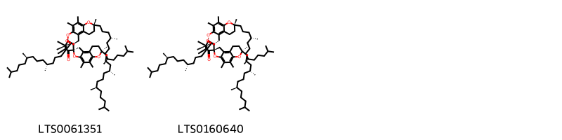

!!! abstract "Tóm tắt"
    Khiếm thực (hạt) có tên khoa học là Euryale ferox Salisb,  thuộc họ Súng (Nymphacaceae). Hiện chưa thấy trồng ở Việt Nam. Tại Trung Quốc được trồng ở ao đầm, nhiều tỉnh, đặc biệt các tỉnh giáp với Việt Nam như Quảng Đông, Quảng Tây và Văn Nam. Trong khiếm thực có 4,4% chất protit, 0,2 chất béo, 32% hydrat cacbon, 0,009% chất canxi, 0,11% photpho, 0,004% sắt, 0,006% vitamin C. Ngoài công dụng làm thức ăn, trong đông y khiếm thực được coi là một vị thuốc bổ, làm săn (thu liễm), có tác dụng trấn tĩnh dùng trong các bệnh đau nhức dây thần kinh, tê thấp, đau lưng, đau đầu gối. Còn có tác dụng chữa di tinh, đi đái nhiều, phụ nữ khí hư bạch đới.

## Thông tin về thực vật

### Đặc điểm thực vật

Dược liệu **Khiếm Thực (Hạt)** từ bộ phận **nan** từ loài *Euryale ferox* thuộc họ Nymphaeaceae. Khiếm thực chính thức là một loại cây mọc ở đầm ao, sống hàng năm, lá hình tròn rộng, nổi trên mặt nước, mặt trên màu xanh, mặt dưới màu tím. Mùa hạ, cành mang hoa trồi lên trên mặt nước, đầu cành có một hoa sáng nở chiều héo. Quả hình cầu chất xốp màu tím hồng bẩn, mặt ngoài có gai, đỉnh còn đài sót lại, hạt chắc, hình cầu, màu đen.

Hạt hình cầu, thường bị vỡ; hạt nguyên có đường kính 5 mm đến 10 mm, mặt ngoài có vỏ lụa, một đầu màu nâu đỏ hoặc đỏ nâu, đầu còn lại màu trắng vàng chiếm khoảng 1/3 hạt và có vết lõm là rốn hạt dạng điểm. Khi bỏ vỏ lụa hạt sẽ có màu trắng. Chất tương đối cứng. Mặt gãy màu trắng, chất bột. Không mùi, vị nhạt. 

!!! info "Phân loại thực vật của *Euryale ferox*"
    - **Kingdom:** Plantae
    - **Phylum:** Tracheophyta
    - **Order:** Nymphaeales
    - **Family:** Nymphaeaceae
    - **Genus:** Euryale
    - **Species:** *Euryale ferox*

*Tài liệu tham khảo:* "Những cây thuốc và vị thuốc Việt Nam" - Đỗ Tất Lợi

 

### Loài thay thế (Nếu có)

### Phân bố trên thế giới
**Từ vườn thực vật KEW: **: Assam Bangladesh Trung Quốc Bắc-Trung, Trung Quốc Nam-Trung, Đông Nam Trung Quốc, Hainan Ấn Độ Nội Mông, Nhật Bản Hàn Quốc, Mãn châu Myanmar, Primorye, Đài Loan Tây Himalaya

**Từ CSDL GIBF** nan, Australia, Korea, Republic of, China, Hong Kong, Norway, Japan, United States of America, Chinese Taipei, India, Russian Federation

### Phân bố tại Việt Nam
** "Những cây thuốc và vị thuốc Việt Nam" - Đỗ Tất Lợi**: Hiện chưa thấy trồng ở Việt Nam

**Từ CSDL GIBF**: Không có ghi nhận ở Việt Nam

---

## Thông tin về dược liệu 

### Định danh

!!! info "Thông tin về tên gọi của nan"
    - Dược liệu tiếng Việt: nan
    - Dược liệu tiếng Trung: nan (nan)
    - Dược liệu tiếng Anh: nan
    - Dược liệu latin thông dụng: nan
    - Dược liệu latin kiểu DĐVN: euryale ferox salisb
    - Dược liệu latin kiểu DĐVN: nan
    - Dược liệu latin kiểu thông tư: nan
    - Bộ phận dùng: nan (nan)

### Mô tả dược liệu 
- **Theo dược điển Việt nam V:** nan

- **Mô tả dược liệu theo thông tư chế biến dược liệu theo phương pháp cổ truyền:** nan

### Chế biến 

- **Chế biến theo dược điển việt nam V**: nan

- **Chế biến theo thông tư:** nan

--- 

## Thành phần hóa học

- Theo tài liệu của GS. Đỗ Tất Lợi:  1) Thành phần hóa học: Saponin steroid, Alcaloid, Flavonoid, Tanin, Chất béo (Lipids), Tinh dầu (Essential oils), Vitamin và khoáng chất, Acid amin (Amino acids)
2) Tên hoạt chất là biomaker : Isoflavonoids
    
- Theo cơ sở dữ liệu lotus: Từ loài *Euryale ferox* đã phân lập và xác định được 6 hoạt chất thuộc về các nhóm Prenol lipids, Fatty Acyls. 

|    | chemicalTaxonomyClassyfireClass   |   smiles_count |
|---:|:----------------------------------|---------------:|
|  0 | Fatty Acyls                       |              4 |
|  1 | Prenol lipids                     |              2 |

### Nhóm Fatty Acyls
<figure markdown="span">
    { width=100% }
    <figcaption>Hình ảnh cấu trúc hóa học của 4 hoạt chất thuộc nhóm Fatty Acyls gồm ['(2r)-2-hydroxy-n-[(2s,3r,4e,8e)-3-hydroxy-1-{[(2r,3r,4s,5s,6r)-3,4,5-trihydroxy-6-(hydroxymethyl)oxan-2-yl]oxy}hexadeca-4,8-dien-2-yl]tetracosanimidic acid (LTS0187897)', '2-hydroxy-n-(3-hydroxy-1-{[3,4,5-trihydroxy-6-(hydroxymethyl)oxan-2-yl]oxy}hexadeca-4,8-dien-2-yl)docosanimidic acid (LTS0275180)', '2-hydroxy-n-(3-hydroxy-1-{[3,4,5-trihydroxy-6-(hydroxymethyl)oxan-2-yl]oxy}hexadeca-4,8-dien-2-yl)tetracosanimidic acid (LTS0276036)', '(2r)-2-hydroxy-n-[(2s,3r,4e,8e)-3-hydroxy-1-{[(2r,3r,4s,5s,6r)-3,4,5-trihydroxy-6-(hydroxymethyl)oxan-2-yl]oxy}hexadeca-4,8-dien-2-yl]docosanimidic acid (LTS0088820)'].</figcaption>
</figure>
### Nhóm Prenol lipids
<figure markdown="span">
    { width=100% }
    <figcaption>Hình ảnh cấu trúc hóa học của 2 hoạt chất thuộc nhóm Prenol lipids gồm ["(1s,7r,11'r,14r,18r,21r)-7,7',8',10,11,11',15,16,21-nonamethyl-7,11',21-tris[(4r,8r)-4,8,12-trimethyltridecyl]-5',8,10',13,22-pentaoxaspiro[pentacyclo[12.4.4.0¹,¹⁴.0³,¹².0⁴,⁹]docosane-18,4'-tricyclo[7.4.0.0²,⁶]tridecane]-1',3,6',8',9,11,15-heptaen-17-one (LTS0061351)", "(1r,7r,11'r,14s,18s,21r)-7,7',8',10,11,11',15,16,21-nonamethyl-7,11',21-tris[(4r,8r)-4,8,12-trimethyltridecyl]-5',8,10',13,22-pentaoxaspiro[pentacyclo[12.4.4.0¹,¹⁴.0³,¹².0⁴,⁹]docosane-18,4'-tricyclo[7.4.0.0²,⁶]tridecane]-1',3,6',8',9,11,15-heptaen-17-one (LTS0160640)"].</figcaption>
</figure>

---

## Tác dụng dược lý

Theo tài liệu "Những cây thuốc và vị thuốc Việt Nam" - Đỗ Tất Lợi:- Tác dụng chống oxi hóa
- Tác dụng tăng cường sinh lý
- Hỗ trợ sức khỏe tim mạch
- Giảm căng thẳng lo âu

Theo tài liệu quốc tế: nan

---

## Dược điển Việt Nam V

### Soi bột:
nan
<!-- Hình ảnh soi bột sẽ được tự động chèn vào đây sau -->
### Vi phẫu:
nan
<!-- Hình ảnh vi phẫu sẽ được tự động chèn vào đây sau -->
### Định tính

nan

### Định lượng

nan

### Thông tin khác 
- ** Độ ẩm: ** nan

- ** Bảo quản:** nan
## Dược điển Hồng kong

<!-- PDF sẽ được tự động chèn vào đây sau -->

---

## Y dược học cổ truyền

- **Tên vị thuốc:** nan
- **Tính vị quy kinh:** Vị ngọt, hơi chát, tính bình. Vào các kinh tỳ, thận
- **Công năng chủ trị:** Ích thận cố tinh, kiện tỳ chi tả, khứ thấp chỉ đới. Chủ trị: Mộng tinh, di tinh, hoạt tinh, đái són, đái rắt. Tiêu chảy lâu ngày, bạch trọc, đới hạ
- **Chú ý:** nan
- **Kiêng kỵ:** nan

