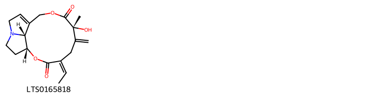
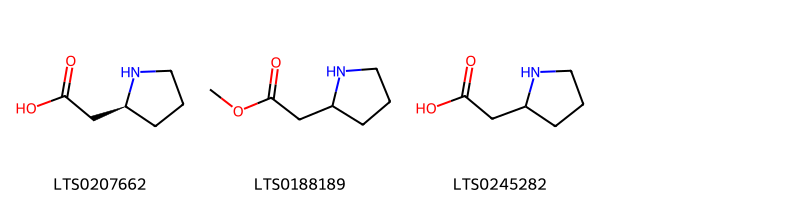
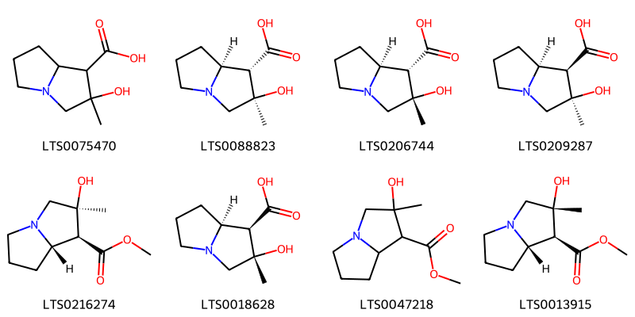
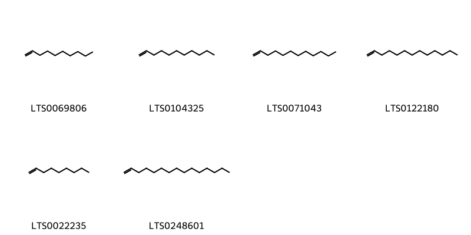

!!! abstract "Tóm tắt"
    Khoản đông hay khoản đông hoa có tên khoa học là Flos Tussilaginis farfarae thuộc họ Cúc (Asteraceae). Cây mọc hoang và được trồng ở Trung Quốc (Hà Bắc, Hà Nam, Hồ Bắc, Tứ Xuyên, Cam Túc, Nội Mồng, Thanh Hải…), tại nhiều nước châu Âu (Pháp, Sec, Hungari…). Tại Việt Nam chỉ mới thấy có một số người trồng từ giống nhập của nước ngoài. Hoa khoản đông chứa 6-8% nước, 10% muối khoáng, một ít tinh dầu, một ít tanin. Hoa chứa rất nhiều chất nhầy uronic (6,9% đối với trọng lượng hoa khô). Người ta còn xác định được ancol texnenic (arnidiol, và fanadiol), các carotenoit, flavonoit, rutosit và hyperosit (galactosit của quercetol).Lá khoản đông chứa 2,63% glucozit đáng. 8% chất nhầy, một ít tanin. Trong tro có hàm lượng Zn rất cao (trên 3,26% tính theo ZnCO3).
Hoa và lá khoản đồng là một vị thuốc được dùng lâu đời cả trong đông y và tây y.
Theo tài liệu cổ khoản đồng có vị cay, ngọt, tính ôn, không độc, có tác dụng ôn phế, hạ khí, hoá đờm, chỉ họ, dùng trong những trường hợp họ khí đưa ngược lên, hầu tề, kinh giản, tiêu khát, khó thở.
Đơn thuốc có khoản đông hoa
1. Trị ho, khó thở dùng khoản đồng hoa, đốt lên, hớp lấy khói.
2. Khoản dòng hoa, bối mẫu, tang bạch bì, từ uyển, tỳ bà diệp bách bộ, quát lâu can, thiên môn đồng, hạnh nhân. Các vị bằng nhau, thái nhỏ, trộn đều. Dùng từ 6-12g hỗn hợp này thêm nước 500ml, đun sôi. Giữ sôi trong 3 phút. Chia nhiều, lần uống trong ngày.

## Thông tin về thực vật

### Đặc điểm thực vật

Dược liệu **Khoản Đông Hoa (Cụm Hoa Chưa Nở Đã Phơi Sấy Khô)** từ bộ phận **nan** từ loài *Tussilago farfara L.* thuộc họ Asteraceae. Cụm hoa là một đầu hình chùy dài, thường là 2 đến 3 cụm hoa cùng mọc trên 1 cành hoặc mọc đơn độc, dài 2 cm đến 2,5 cm, phần trên rộng hơn và phần dưới thon dần. Đỉnh cuống cụm hoa có nhiều lá bắc dạng vẩy. Mặt ngoài của lá bắc đỏ tía hoặc đỏ nhạt, mặt trong được phủ kín bởi những đám lông trắng như bông. Mùi thơm, vị hơi đắng và cay. 

!!! info "Phân loại thực vật của *Tussilago farfara*"
    - **Kingdom:** Plantae
    - **Phylum:** Tracheophyta
    - **Order:** Asterales
    - **Family:** Asteraceae
    - **Genus:** Tussilago
    - **Species:** *Tussilago farfara*

*Tài liệu tham khảo:* "Những cây thuốc và vị thuốc Việt Nam" - Đỗ Tất Lợi

 

### Loài thay thế (Nếu có)

### Phân bố trên thế giới
**Từ vườn thực vật KEW: **: Afghanistan Albania Algérie Altay Áo Các nước vùng Baltic, Belarus Bỉ Bulgaria Buryatiya, Trung Âu Nga, Trung Quốc Bắc-Trung, Trung Quốc Nam-Trung, Đông Nam Trung Quốc, Corse, Síp Tiệp Khắc Đan Mạch Đông Aegean là., Đông Âu Nga, Đông Hy Mã Lạp Sơn, Ai Cập Phần Lan Pháp Føroyar, Đức Anh Hy Lạp Hainan Hungary Iceland Nội Mông, Iran Ireland Irkutsk Ý Kazakhstan Kirgizstan, Krasnoyarsk Kriti, Krym, Liban-Syria, Libya Mãn châu Maroc Nepal Hà Lan Bắc Kavkaz, Bắc Âu Nga, Tây Bắc Âu Nga, Na Uy Pakistan Ba Lan Thanh Hải, Romania Sardegna Sicilia Nam Âu Nga, Tây Ban Nha Thụy Điển Thụy Sĩ Tadzhikistan, Tây Tạng Ngoại Kavkaz, Tunisia Gà tây Thổ Nhĩ Kỳ ở châu Âu, Turkmenistan Ukraina Uzbekistan Tây Hy Mã Lạp Sơn, Tây Siberia, Tây Sahara Tân Cương, Yakutskiya, Yugoslavia

**Từ CSDL GIBF** Poland, Spain, Austria, Croatia, Norway, Germany, Ireland, Netherlands, Montenegro, Denmark, Armenia, Slovakia, Hungary, Italy, United Kingdom of Great Britain and Northern Ireland, Türkiye, Serbia, Moldova, Republic of, Russian Federation, Czechia, Slovenia, Switzerland, United States of America, France, Canada

### Phân bố tại Việt Nam
** "Những cây thuốc và vị thuốc Việt Nam" - Đỗ Tất Lợi**: Tại Việt Nam chỉ mới thấy có một số người trồng từ giống nhập của nước ngoài.

**Từ CSDL GIBF**: Không có ghi nhận ở Việt Nam

---

## Thông tin về dược liệu 

### Định danh

!!! info "Thông tin về tên gọi của nan"
    - Dược liệu tiếng Việt: nan
    - Dược liệu tiếng Trung: nan (nan)
    - Dược liệu tiếng Anh: nan
    - Dược liệu latin thông dụng: nan
    - Dược liệu latin kiểu DĐVN: flos tussilaginis l.
    - Dược liệu latin kiểu DĐVN: nan
    - Dược liệu latin kiểu thông tư: nan
    - Bộ phận dùng: nan (nan)

### Mô tả dược liệu 
- **Theo dược điển Việt nam V:** nan

- **Mô tả dược liệu theo thông tư chế biến dược liệu theo phương pháp cổ truyền:** nan

### Chế biến 

- **Chế biến theo dược điển việt nam V**: nan

- **Chế biến theo thông tư:** nan

--- 

## Thành phần hóa học

- Theo tài liệu của GS. Đỗ Tất Lợi:  1) Nhóm hóa học: (+)-homoproline, (r)-β-bisabolene, Amyrin, Decene, Methyl linoleate, 2-phenyl-ethanol, Senkirkine, 1-nonen-3-ol, (-)-spathulenol, Isobauerenol, Β-amyrin, Seneciphylline, Senecionine, Methyl palmitate, Benzyl alcohol, 1-pentadecene, Carvacrol, Isotussilagine, Nonene,...
2) Tên hoạt chất là biomaker trong dược điển Việt Nam: Tussilagine
    
- Theo cơ sở dữ liệu lotus: Từ loài *Tussilago farfara* đã phân lập và xác định được 102 hoạt chất thuộc về các nhóm Pyrrolidines, Organooxygen compounds, Pyrrolizidines, Prenol lipids, Steroids and steroid derivatives, Fatty Acyls, Benzene and substituted derivatives, Macrolides and analogues, Unsaturated hydrocarbons. 

|    | chemicalTaxonomyClassyfireClass     |   smiles_count |
|---:|:------------------------------------|---------------:|
|  0 |                                     |              1 |
|  1 | Benzene and substituted derivatives |              4 |
|  2 | Fatty Acyls                         |             13 |
|  3 | Macrolides and analogues            |              5 |
|  4 | Organooxygen compounds              |              5 |
|  5 | Prenol lipids                       |             51 |
|  6 | Pyrrolidines                        |              3 |
|  7 | Pyrrolizidines                      |              8 |
|  8 | Steroids and steroid derivatives    |              5 |
|  9 | Unsaturated hydrocarbons            |              6 |

### Nhóm 
<figure markdown="span">
    { width=100% }
    <figcaption>Hình ảnh cấu trúc hóa học của 1 hoạt chất thuộc nhóm  gồm ['seneciphylline (LTS0165818)'].</figcaption>
</figure>
### Nhóm Benzene and substituted derivatives
<figure markdown="span">
    { width=100% }
    <figcaption>Hình ảnh cấu trúc hóa học của 4 hoạt chất thuộc nhóm Benzene and substituted derivatives gồm ['2-phenyl-ethanol (LTS0206341)', '6-hydroxytremetone (LTS0141183)', '1-[6-hydroxy-2-(prop-1-en-2-yl)-2,3-dihydro-1-benzofuran-5-yl]ethanone (LTS0006835)', 'benzyl alcohol (LTS0125638)'].</figcaption>
</figure>
### Nhóm Fatty Acyls
<figure markdown="span">
    { width=100% }
    <figcaption>Hình ảnh cấu trúc hóa học của 13 hoạt chất thuộc nhóm Fatty Acyls gồm ['3,4,5-trihydroxy-6-[(1,2,3,5,6-pentahydroxy-7-oxoheptan-4-yl)oxy]oxane-2-carboxylic acid (LTS0113695)', 'methyl linoleate (LTS0116588)', '(2s,3r,4s,5r,6s)-3,4,5-trihydroxy-6-{[(2s,3r,4s,5r,6s)-1,2,3,5,6-pentahydroxy-7-oxoheptan-4-yl]oxy}oxane-2-carboxylic acid (LTS0121748)', '1-nonen-3-ol (LTS0206065)', '3,4,5-trihydroxy-6-[(2,4,5,6,7-pentahydroxy-1-oxooctan-3-yl)oxy]oxane-2-carboxylic acid (LTS0112792)', 'methyl palmitate (LTS0139222)', 'undec-1-en-3-ol (LTS0088606)', '6-[(1,3,4,5,6,7-hexahydroxy-8-oxooctan-2-yl)oxy]-3,4,5-trihydroxyoxane-2-carboxylic acid (LTS0182617)', 'angelic acid (LTS0220842)', '2-methylbutanoic acid (LTS0213858)', '(2s,3r,4s,5r,6s)-3,4,5-trihydroxy-6-{[(2s,3s,4s,5s,6r,7r)-2,4,5,6,7-pentahydroxy-1-oxooctan-3-yl]oxy}oxane-2-carboxylic acid (LTS0032350)', 'hexanoic acid (LTS0031054)', '(2s,3r,4s,5r,6s)-6-{[(2s,3s,4s,5s,6s,7r)-1,3,4,5,6,7-hexahydroxy-8-oxooctan-2-yl]oxy}-3,4,5-trihydroxyoxane-2-carboxylic acid (LTS0235394)'].</figcaption>
</figure>
### Nhóm Macrolides and analogues
<figure markdown="span">
    { width=100% }
    <figcaption>Hình ảnh cấu trúc hóa học của 5 hoạt chất thuộc nhóm Macrolides and analogues gồm ['senkirkine (LTS0193348)', 'senecionine (LTS0172395)', '(1s,4z,7s,17s)-4-ethylidene-7-hydroxy-6,7-dimethyl-2,9-dioxa-14-azatricyclo[9.5.1.0¹⁴,¹⁷]heptadec-11-ene-3,8-dione (LTS0050415)', '(1r,4z,6s,7r,11z)-4-ethylidene-7-hydroxy-6,7,14-trimethyl-2,9-dioxa-14-azabicyclo[9.5.1]heptadec-11-ene-3,8,17-trione (LTS0065486)', '(1r,4e,6s,7r,11z)-4-ethylidene-7-hydroxy-6,7,14-trimethyl-2,9-dioxa-14-azabicyclo[9.5.1]heptadec-11-ene-3,8,17-trione (LTS0013301)'].</figcaption>
</figure>
### Nhóm Organooxygen compounds
<figure markdown="span">
    { width=100% }
    <figcaption>Hình ảnh cấu trúc hóa học của 5 hoạt chất thuộc nhóm Organooxygen compounds gồm ['(2s,3r,4s,5r,6s)-6-{[(2s,3r,4r,5r,6s)-2-carboxy-4,5,6-trihydroxyoxan-3-yl]oxy}-3,4,5-trihydroxyoxane-2-carboxylic acid (LTS0061720)', '(2s,3r,4s,5r,6s)-3,4,5-trihydroxy-6-{[(2r,3r,4r,5r,6s)-4,5,6-trihydroxy-2-methyloxan-3-yl]oxy}oxane-2-carboxylic acid (LTS0088910)', '3,4,5-trihydroxy-6-[(4,5,6-trihydroxy-2-methyloxan-3-yl)oxy]oxane-2-carboxylic acid (LTS0111492)', 'isobauerenol (LTS0172541)', '6-[(2-carboxy-4,5,6-trihydroxyoxan-3-yl)oxy]-3,4,5-trihydroxyoxane-2-carboxylic acid (LTS0242238)'].</figcaption>
</figure>
### Nhóm Prenol lipids
<figure markdown="span">
    { width=100% }
    <figcaption>Hình ảnh cấu trúc hóa học của 51 hoạt chất thuộc nhóm Prenol lipids gồm ['(5r)-2-methyl-5-(6-methylhepta-1,5-dien-2-yl)cyclohex-2-en-1-one (LTS0133022)', '(1r,3ar,5r,7s,7as)-1-[1-(acetyloxy)ethyl]-7-isopropyl-4-methylidene-2-oxo-hexahydro-1h-inden-5-yl (2e)-3-methylpent-2-enoate (LTS0135176)', '(r)-β-bisabolene (LTS0077209)', 'amyrin (LTS0222826)', '(1s,3ar,5r,7s,7as)-1-[(1r)-1-(acetyloxy)ethyl]-7-isopropyl-4-methylidene-2-oxo-hexahydro-1h-inden-5-yl 3-methylbut-2-enoate (LTS0083506)', '(1s,3ar,5r,7s,7as)-1-[(1r)-1-hydroxyethyl]-7-isopropyl-4-methylidene-2-oxo-hexahydro-1h-inden-5-yl (2e)-3-methylpent-2-enoate (LTS0088064)', '(4z)-4-ethylidene-5-isopropyl-8-methylidene-3-oxo-1,4a,7,8a-tetrahydro-2-benzopyran-7-yl (2e)-3-methylpent-2-enoate (LTS0100040)', '2-[(1s,2r,4s,6s)-2,4-bis(acetyloxy)-6-methyl-5-oxo-7-oxabicyclo[4.1.0]heptan-3-yl]-6-methylhepta-1,5-dien-3-yl (2z)-2-methylbut-2-enoate (LTS0017182)', '2-[4-(acetyloxy)-2-hydroxy-6-methyl-5-oxo-7-oxabicyclo[4.1.0]heptan-3-yl]-6-methylhepta-1,5-dien-3-yl 2-methylbut-2-enoate (LTS0093205)', '(1z,3ar,5r,7s,7as)-1-ethylidene-7-isopropyl-4-methylidene-2-oxo-hexahydroinden-5-yl 3-methylbut-2-enoate (LTS0176604)', '1-ethylidene-7-isopropyl-4-methylidene-2-oxo-hexahydroinden-5-yl 2-methylbut-2-enoate (LTS0190153)', '(4ar,6ar,6br,8as,12ar,12br,14ar,14br)-4,4,6a,6b,8a,11,12,14b-octamethyl-2,3,4a,5,6,7,8,9,12,12a,12b,13,14,14a-tetradecahydro-1h-picen-3-ol (LTS0269929)', '(-)-spathulenol (LTS0273095)', '1-ethylidene-7-isopropyl-4-methylidene-2-oxo-hexahydroinden-5-yl 3-methylbut-2-enoate (LTS0125073)', '(1e,3ar,5r,7s,7as)-1-ethylidene-7-isopropyl-4-methylidene-2-oxo-hexahydroinden-5-yl (2e)-3-methylpent-2-enoate (LTS0198708)', '2-methyl-5-(6-methylhepta-1,5-dien-2-yl)cyclohex-2-en-1-one (LTS0152527)', '1-[1-(acetyloxy)ethyl]-7-isopropyl-4-methylidene-2-oxo-hexahydro-1h-inden-5-yl 3-methylbut-2-enoate (LTS0122017)', 'β-amyrin (LTS0251864)', '1-[1-(acetyloxy)ethyl]-7-isopropyl-4-methylidene-2-oxo-hexahydro-1h-inden-5-yl 2-methylbut-2-enoate (LTS0247643)', '(1s,3s,3ar,5r,7s,7as)-1-[(1r)-1-hydroxyethyl]-7-isopropyl-3-{[(2r)-2-methylbutanoyl]oxy}-4-methylidene-2-oxo-hexahydro-1h-inden-5-yl (2e)-3-methylpent-2-enoate (LTS0161989)', '(1z,3s,3ar,5r,7s,7as)-1-ethylidene-7-isopropyl-3-{[(2r)-2-methylbutanoyl]oxy}-4-methylidene-2-oxo-hexahydroinden-5-yl (2e)-3-methylpent-2-enoate (LTS0248496)', '1-[1-(acetyloxy)ethyl]-7-isopropyl-4-methylidene-2-oxo-hexahydro-1h-inden-5-yl (2e)-3-methylpent-2-enoate (LTS0265469)', '(1r,4s,4as,5s,7r,8ar)-4-[(1r)-1-(acetyloxy)ethyl]-5-isopropyl-1-{[(2r)-2-methylbutanoyl]oxy}-8-methylidene-3-oxo-hexahydro-1h-2-benzopyran-7-yl (2e)-3-methylpent-2-enoate (LTS0178943)', 'lupeol (LTS0256952)', '1-ethylidene-7-isopropyl-3-[(2-methylbutanoyl)oxy]-4-methylidene-2-oxo-hexahydroinden-5-yl 3-methylpent-2-enoate (LTS0184327)', '(3s,4ar,6bs,8ar,11r,12s,12ar,12bs,14ar,14br)-4,4,6b,8a,11,12,12b,14b-octamethyl-2,3,4a,5,7,8,9,10,11,12,12a,13,14,14a-tetradecahydro-1h-picen-3-ol (LTS0066104)', '(1e)-1-ethylidene-7-isopropyl-4-methylidene-2-oxo-hexahydroinden-5-yl 3-methylpent-2-enoate (LTS0076677)', '(6ar,6br,8ar,14br)-4,4,6a,6b,8a,12,14b-heptamethyl-11-methylidene-hexadecahydropicen-3-ol (LTS0274865)', '(1s,3ar,5r,7s,7as)-1-[(1r)-1-(acetyloxy)ethyl]-7-isopropyl-4-methylidene-2-oxo-hexahydro-1h-inden-5-yl (2z)-2-methylbut-2-enoate (LTS0213326)', '1-(1-hydroxyethyl)-7-isopropyl-4-methylidene-2-oxo-hexahydro-1h-inden-5-yl 3-methylbutanoate (LTS0263832)', '(1s,3ar,5r,7s,7as)-1-[(1r)-1-hydroxyethyl]-7-isopropyl-4-methylidene-2-oxo-hexahydro-1h-inden-5-yl 3-methylbutanoate (LTS0204821)', '1-methyl-4-(6-methylhepta-1,5-dien-2-yl)-7-oxabicyclo[4.1.0]heptan-2-one (LTS0220663)', '4-[1-(acetyloxy)ethyl]-5-isopropyl-1-[(2-methylbutanoyl)oxy]-8-methylidene-3-oxo-hexahydro-1h-2-benzopyran-7-yl 3-methylpent-2-enoate (LTS0234638)', '1-(1-hydroxyethyl)-7-isopropyl-3-[(2-methylbutanoyl)oxy]-4-methylidene-2-oxo-hexahydro-1h-inden-5-yl 3-methylpent-2-enoate (LTS0168911)', '(1z,3ar,5r,7s,7as)-1-ethylidene-7-isopropyl-4-methylidene-2-oxo-hexahydroinden-5-yl (2z)-2-methylbut-2-enoate (LTS0020028)', 'spathulenol (LTS0235578)', 'taraxasterol (LTS0006950)', '(1r,4s,4as,5s,7r,8ar)-4-[(1r)-1-(acetyloxy)ethyl]-5-isopropyl-1-[(2-methylbutanoyl)oxy]-8-methylidene-3-oxo-hexahydro-1h-2-benzopyran-7-yl (2e)-3-methylpent-2-enoate (LTS0209107)', '(1z,3s,3ar,5r,7s,7as)-1-ethylidene-7-isopropyl-3-{[(2z)-2-methylbut-2-enoyl]oxy}-4-methylidene-2-oxo-hexahydroinden-5-yl (2e)-3-methylpent-2-enoate (LTS0142720)', '(1r,4s,6r)-1-methyl-4-(6-methylhepta-1,5-dien-2-yl)-7-oxabicyclo[4.1.0]heptan-2-one (LTS0213370)', '(3s)-2-[(1s,2r,3r,4s,6s)-2,4-bis(acetyloxy)-6-methyl-5-oxo-7-oxabicyclo[4.1.0]heptan-3-yl]-6-methylhepta-1,5-dien-3-yl (2z)-2-methylbut-2-enoate (LTS0203603)', '(1r,3ar,5r,7s,7as)-1-[(1r)-1-(acetyloxy)ethyl]-7-isopropyl-4-methylidene-2-oxo-hexahydro-1h-inden-5-yl (2e)-3-methylpent-2-enoate (LTS0048755)', '2-[2,4-bis(acetyloxy)-6-methyl-5-oxo-7-oxabicyclo[4.1.0]heptan-3-yl]-6-methylhepta-1,5-dien-3-yl 2-methylbut-2-enoate (LTS0126079)', '3-ethylidene-4-isopropyl-7-methylidene-6-[(3-methylpent-2-enoyl)oxy]-2-oxo-hexahydroinden-1-yl 3-methylpent-2-enoate (LTS0260080)', '(-)-β-bisabolene (LTS0009940)', '(1z,3ar,5r,7s,7as)-1-ethylidene-7-isopropyl-4-methylidene-2-oxo-hexahydroinden-5-yl (2e)-3-methylpent-2-enoate (LTS0015649)', '(1s,3z,3as,4s,6r,7ar)-3-ethylidene-4-isopropyl-7-methylidene-6-{[(2e)-3-methylpent-2-enoyl]oxy}-2-oxo-hexahydroinden-1-yl (2e)-3-methylpent-2-enoate (LTS0259816)', 'carvacrol (LTS0012882)', '(3s)-2-[(1r,2s,3s,4r,6r)-4-(acetyloxy)-2-hydroxy-6-methyl-5-oxo-7-oxabicyclo[4.1.0]heptan-3-yl]-6-methylhepta-1,5-dien-3-yl (2z)-2-methylbut-2-enoate (LTS0248752)', '1-ethylidene-7-isopropyl-3-[(2-methylbut-2-enoyl)oxy]-4-methylidene-2-oxo-hexahydroinden-5-yl 3-methylpent-2-enoate (LTS0046252)', '1-(1-hydroxyethyl)-7-isopropyl-4-methylidene-2-oxo-hexahydro-1h-inden-5-yl 3-methylpent-2-enoate (LTS0108686)'].</figcaption>
</figure>
### Nhóm Pyrrolidines
<figure markdown="span">
    { width=100% }
    <figcaption>Hình ảnh cấu trúc hóa học của 3 hoạt chất thuộc nhóm Pyrrolidines gồm ['(+)-homoproline (LTS0207662)', 'methyl 2-(pyrrolidin-2-yl)acetate (LTS0188189)', '(+/-)-homoproline (LTS0245282)'].</figcaption>
</figure>
### Nhóm Pyrrolizidines
<figure markdown="span">
    { width=100% }
    <figcaption>Hình ảnh cấu trúc hóa học của 8 hoạt chất thuộc nhóm Pyrrolizidines gồm ['2-hydroxy-2-methyl-hexahydropyrrolizine-1-carboxylic acid (LTS0075470)', '(1s,2r,7as)-2-hydroxy-2-methyl-hexahydropyrrolizine-1-carboxylic acid (LTS0088823)', '(1s,2s,7as)-2-hydroxy-2-methyl-hexahydropyrrolizine-1-carboxylic acid (LTS0206744)', '(1r,2r,7as)-2-hydroxy-2-methyl-hexahydropyrrolizine-1-carboxylic acid (LTS0209287)', 'tussilagine (LTS0216274)', '(1r,2s,7as)-2-hydroxy-2-methyl-hexahydropyrrolizine-1-carboxylic acid (LTS0018628)', 'methyl 2-hydroxy-2-methyl-hexahydropyrrolizine-1-carboxylate (LTS0047218)', 'isotussilagine (LTS0013915)'].</figcaption>
</figure>
### Nhóm Steroids and steroid derivatives
<figure markdown="span">
    { width=100% }
    <figcaption>Hình ảnh cấu trúc hóa học của 5 hoạt chất thuộc nhóm Steroids and steroid derivatives gồm ['stigmast-5-en-3-ol (LTS0071224)', 'stigmast-5-en-3-ol, (3β)- (LTS0204616)', 'phytosterol (LTS0029311)', '(1r,3as,3bs,7s,9bs)-1-[(2r,5r)-5,6-dimethylheptan-2-yl]-9a,11a-dimethyl-1h,2h,3h,3ah,3bh,4h,6h,7h,8h,9h,9bh,10h,11h-cyclopenta[a]phenanthren-7-ol (LTS0057877)', 'campesterol (LTS0046755)'].</figcaption>
</figure>
### Nhóm Unsaturated hydrocarbons
<figure markdown="span">
    { width=100% }
    <figcaption>Hình ảnh cấu trúc hóa học của 6 hoạt chất thuộc nhóm Unsaturated hydrocarbons gồm ['decene (LTS0069806)', '1-undecene (LTS0104325)', '1-dodecene (LTS0071043)', '1-tridecene (LTS0122180)', 'nonene (LTS0022235)', '1-pentadecene (LTS0248601)'].</figcaption>
</figure>

---

## Tác dụng dược lý

Theo tài liệu "Những cây thuốc và vị thuốc Việt Nam" - Đỗ Tất Lợi:Tác dụng kháng viêm, chống oxi hóa, trị ho

Theo tài liệu quốc tế: nan

---

## Dược điển Việt Nam V

### Soi bột:
nan
<!-- Hình ảnh soi bột sẽ được tự động chèn vào đây sau -->
### Vi phẫu:
nan
<!-- Hình ảnh vi phẫu sẽ được tự động chèn vào đây sau -->
### Định tính

nan

### Định lượng

nan

### Thông tin khác 
- ** Độ ẩm: ** nan

- ** Bảo quản:** nan
## Dược điển Hồng kong

<!-- PDF sẽ được tự động chèn vào đây sau -->

---

## Y dược học cổ truyền

- **Tên vị thuốc:** nan
- **Tính vị quy kinh:** Tân, cam, ôn. Quy vào kinh phế.
- **Công năng chủ trị:** Nhuận phế hóa đờm, chỉ khái, giáng nghịch.

Chủ trị: Ho và suyễn mới và lâu ngày, hư lao.
- **Chú ý:** nan
- **Kiêng kỵ:** nan

