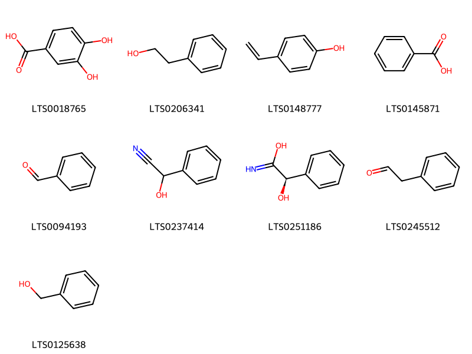
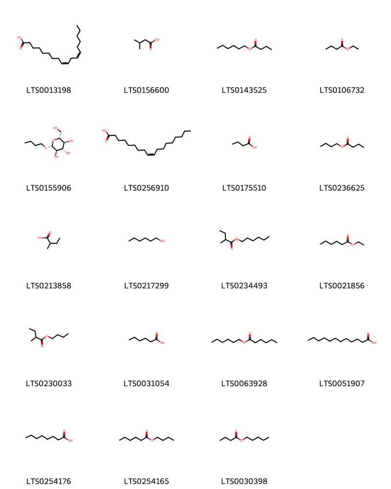
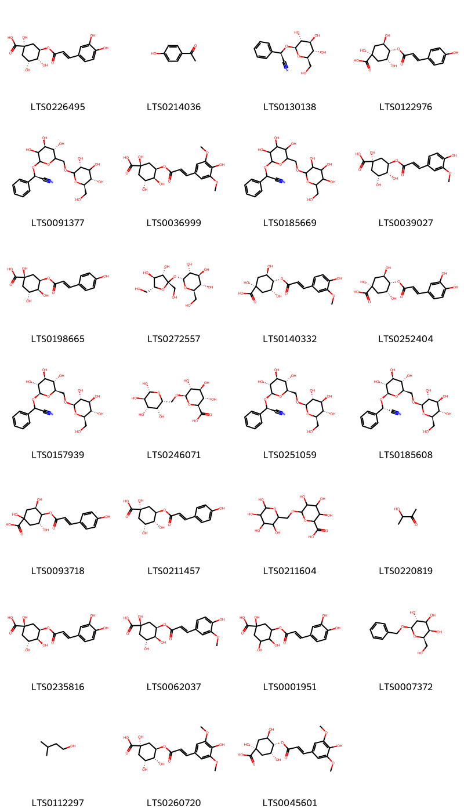
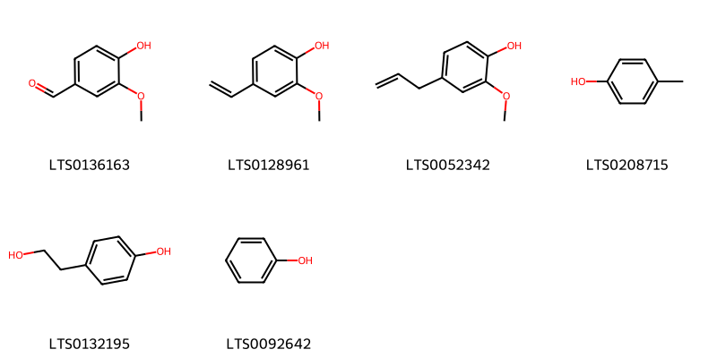

!!! abstract "Tóm tắt"
    Khổ Hạnh Nhân (Prunus armeniaca L., họ Hoa hồng - Rosaceae) mọc hoang và được trồng nhiều nhất ở Hà Tây, Acmênia, Trung Quốc, Nhật Bản. Trong dân gian và y học cổ truyền, Khổ Hạnh Nhân được sử dụng để bổ phế, nhuận tràng, giảm ho, và làm mềm da. Khổ Hạnh Nhân  chứa amygdalin, có thể phân giải tạo cyanide, được sử dụng với liều thấp để giảm đau, nhưng cần thận trọng vì độc tính.

## Thông tin về thực vật

### Đặc điểm thực vật

Dược liệu **Khổ Hạnh Nhân** từ bộ phận **nan** từ loài *Prunus armeniaca L.* thuộc họ Rosaceae. Cây mơ là một loại cây nhỏ, cao chùng 4-5m. Lá mọc so le, có cuống phiến lá hình bầu dục, nhọn ở đầu, mép lá có răng cưa nhỏ. Cuối mùa đông ra hoa có 5 sắc trắng hoặc màu hồng, mùi thơm. Quả chín vào tháng 34. Đây là một quả hạch, hình cầu, màu vàng xanh: Có nhiều thịt trong có một hạt. Ngoài cây mơ nói ở đây, tại một số tỉnh miền Bắc có loài song mai, mỗi đốt mọc 2 quả được coi là quí hơn. 

!!! info "Phân loại thực vật của *Prunus armeniaca*"
    - **Kingdom:** Plantae
    - **Phylum:** Tracheophyta
    - **Order:** Rosales
    - **Family:** Rosaceae
    - **Genus:** Prunus
    - **Species:** *Prunus armeniaca*

*Tài liệu tham khảo:* "Những cây thuốc và vị thuốc Việt Nam" - Đỗ Tất Lợi

 

### Loài thay thế (Nếu có)

### Phân bố trên thế giới
**Từ vườn thực vật KEW: **: Native to:
China North-Central, China South-Central, Inner Mongolia, Kazakhstan, Kirgizstan, Kriti, Manchuria, Qinghai, Uzbekistan, Xinjiang

Introduced into:
Afghanistan, Albania, Algeria, Bulgaria, California, Central European Russia, Colorado, Corse, Cyprus, East European Russia, East Himalaya, France, Germany, Greece, Hungary, Idaho, Illinois, Iowa, Iran, Italy, Kansas, Korea, Krym, Lebanon-Syria, Libya, Michigan, Missouri, Montana, Morocco, New Mexico, New South Wales, North Caucasus, North European Russia, Oregon, Pakistan, Pennsylvania, Portugal, Queensland, Romania, Sardegna, South Australia, South European Russia, Spain, Tadzhikistan, Transcaucasus, Tunisia, Turkey, Turkey-in-Europe, Turkmenistan, Ukraine, Utah, Virginia, Washington, West Himalaya, Yugoslavia

**Từ CSDL GIBF** nan, Iran (Islamic Republic of), Australia, Spain, Austria, Belgium, Germany, New Zealand, Morocco, Romania, Ukraine, India, Argentina, Mexico, Mongolia, Hungary, Greece, Kyrgyzstan, China, Türkiye, South Africa, Russian Federation, Switzerland, United States of America, France, Kazakhstan, Canada

### Phân bố tại Việt Nam
** "Những cây thuốc và vị thuốc Việt Nam" - Đỗ Tất Lợi**: Mọc hoang và được trồng nhiều nhất ở Hà Tây (vùng chùa Hương, thuộc huyện Mỹ Đức), Nam Định, Hà Nam (huyện Kim Bảng), Thanh Hóa, Nghệ An, Hà Tĩnh cũng có. Còn mọc Acmênia, Trung Quốc, Nhật Bản.

**Từ CSDL GIBF**: Không có ghi nhận ở Việt Nam

---

## Thông tin về dược liệu 

### Định danh

!!! info "Thông tin về tên gọi của nan"
    - Dược liệu tiếng Việt: nan
    - Dược liệu tiếng Trung: nan (nan)
    - Dược liệu tiếng Anh: nan
    - Dược liệu latin thông dụng: nan
    - Dược liệu latin kiểu DĐVN: semen armeniacae amarum
    - Dược liệu latin kiểu DĐVN: nan
    - Dược liệu latin kiểu thông tư: nan
    - Bộ phận dùng: nan (nan)

### Mô tả dược liệu 
- **Theo dược điển Việt nam V:** nan

- **Mô tả dược liệu theo thông tư chế biến dược liệu theo phương pháp cổ truyền:** nan

### Chế biến 

- **Chế biến theo dược điển việt nam V**: nan

- **Chế biến theo thông tư:** nan

--- 

## Thành phần hóa học

- Theo tài liệu của GS. Đỗ Tất Lợi:  (1) Nhóm hóa học:  cyanogenic glycosides 
(2)  Tên hoạt chất biomarker trong dược điển Việt Nam là: Amygdalin
    
- Theo cơ sở dữ liệu lotus: Từ loài *Prunus armeniaca* đã phân lập và xác định được 153 hoạt chất thuộc về các nhóm Lactones, Dibenzylbutane lignans, Organooxygen compounds, Fatty Acyls, Prenol lipids, Benzene and substituted derivatives, Steroids and steroid derivatives, Carboxylic acids and derivatives, Phenols, Furanoid lignans, Cinnamic acids and derivatives, Flavonoids. 

|    | chemicalTaxonomyClassyfireClass     |   smiles_count |
|---:|:------------------------------------|---------------:|
|  0 | Benzene and substituted derivatives |              9 |
|  1 | Carboxylic acids and derivatives    |              1 |
|  2 | Cinnamic acids and derivatives      |              7 |
|  3 | Dibenzylbutane lignans              |              2 |
|  4 | Fatty Acyls                         |             19 |
|  5 | Flavonoids                          |             39 |
|  6 | Furanoid lignans                    |              3 |
|  7 | Lactones                            |              1 |
|  8 | Organooxygen compounds              |             27 |
|  9 | Phenols                             |              6 |
| 10 | Prenol lipids                       |             30 |
| 11 | Steroids and steroid derivatives    |              8 |

### Nhóm Benzene and substituted derivatives
<figure markdown="span">
    { width=100% }
    <figcaption>Hình ảnh cấu trúc hóa học của 9 hoạt chất thuộc nhóm Benzene and substituted derivatives gồm ['3,4-dihydroxybenzoic acid (LTS0018765)', '2-phenyl-ethanol (LTS0206341)', '4-vinylphenol (LTS0148777)', 'benzoic acid (LTS0145871)', 'benzaldehyde (LTS0094193)', 'mandelonitrile (LTS0237414)', '(r)-mandelamide (LTS0251186)', 'phenylacetaldehyde (LTS0245512)', 'benzyl alcohol (LTS0125638)'].</figcaption>
</figure>
### Nhóm Carboxylic acids and derivatives
<figure markdown="span">
    { width=100% }
    <figcaption>Hình ảnh cấu trúc hóa học của 1 hoạt chất thuộc nhóm Carboxylic acids and derivatives gồm ['butyl propionate (LTS0210550)'].</figcaption>
</figure>
### Nhóm Cinnamic acids and derivatives
<figure markdown="span">
    { width=100% }
    <figcaption>Hình ảnh cấu trúc hóa học của 7 hoạt chất thuộc nhóm Cinnamic acids and derivatives gồm ['ferulic acid (LTS0077328)', 'sinapinate (LTS0173482)', '3,4-dihydroxycinnamic acid (LTS0128050)', 'para-coumaric acid (LTS0266252)', 'sinapoyl alcohol (LTS0275766)', 'hydroxycinnamic acid (LTS0233023)', 'ferulic acid (LTS0273002)'].</figcaption>
</figure>
### Nhóm Dibenzylbutane lignans
<figure markdown="span">
    { width=100% }
    <figcaption>Hình ảnh cấu trúc hóa học của 2 hoạt chất thuộc nhóm Dibenzylbutane lignans gồm ['(2s,3r)-2,3-bis[(4-hydroxy-3-methoxyphenyl)(¹³c)methyl](1-¹³c)butane-1,4-diol (LTS0268699)', 'secoisolariciresinol (LTS0086727)'].</figcaption>
</figure>
### Nhóm Fatty Acyls
<figure markdown="span">
    { width=100% }
    <figcaption>Hình ảnh cấu trúc hóa học của 19 hoạt chất thuộc nhóm Fatty Acyls gồm ['linoleic (LTS0013198)', 'isovaleric acid (LTS0156600)', 'hexyl butyrate (LTS0143525)', 'ethyl butyrate (LTS0106732)', 'butyl β-d-glucopyranoside (LTS0155906)', 'oleic acid (LTS0256910)', 'butanoic acid (LTS0175510)', 'butyl butyrate (LTS0236625)', '2-methylbutanoic acid (LTS0213858)', 'hexanol (LTS0217299)', 'hexyl 2-methylbutyrate (LTS0234493)', 'ethyl hexanoate (LTS0021856)', 'butyl 2-methylbutyrate (LTS0230033)', 'hexanoic acid (LTS0031054)', 'hexyl hexanoate (LTS0063928)', 'lauric acid (LTS0051907)', 'caprylic acid (LTS0254176)', 'butyl hexanoate (LTS0254165)', 'amyl butyrate (LTS0030398)'].</figcaption>
</figure>
### Nhóm Flavonoids
<figure markdown="span">
    { width=100% }
    <figcaption>Hình ảnh cấu trúc hóa học của 39 hoạt chất thuộc nhóm Flavonoids gồm ['rutin (LTS0042292)', '2-(3,4-dihydroxyphenyl)-5,7-dihydroxy-3-{[3,4,5-trihydroxy-6-(hydroxymethyl)oxan-2-yl]oxy}chromen-4-one (LTS0195312)', 'isoquercetin (LTS0254337)', '3-rutinosyl quercetin (LTS0032845)', '(+)-catechol (LTS0117079)', '(-)-epigallocatechin gallate (LTS0173211)', '(+)-dihydrokaempferol (LTS0134832)', '(1s,5s,6r,13r,21s)-5,13-bis(4-hydroxyphenyl)-4,12,14-trioxapentacyclo[11.7.1.0²,¹¹.0³,⁸.0¹⁵,²⁰]henicosa-2(11),3(8),9,15,17,19-hexaene-6,9,17,19,21-pentol (LTS0081798)', '(1s,13r,21s)-6,9,17,19,21-pentahydroxy-5,13-bis(4-hydroxyphenyl)-4,12,14-trioxapentacyclo[11.7.1.0²,¹¹.0³,⁸.0¹⁵,²⁰]henicosa-2,5,8,10,15,17,19-heptaen-7-one (LTS0116416)', 'chamomile (LTS0104946)', '(2r,3s,4s)-2-(3,4-dihydroxyphenyl)-4-[(2r,3r)-2-(3,4-dihydroxyphenyl)-3,5,7-trihydroxy-3,4-dihydro-2h-1-benzopyran-8-yl]-3,4-dihydro-2h-1-benzopyran-3,5,7-triol (LTS0116257)', '(2r,3s,4s)-2-(3,4-dihydroxyphenyl)-4-[(2r,3r)-2-(3,4-dihydroxyphenyl)-3,5,7-trihydroxy-3,4-dihydro-2h-1-benzopyran-6-yl]-3,4-dihydro-2h-1-benzopyran-3,5,7-triol (LTS0196496)', '(2r,3r,4r)-2-(3,4-dihydroxyphenyl)-4-[(2r,3r)-2-(3,4-dihydroxyphenyl)-3,5,7-trihydroxy-3,4-dihydro-2h-1-benzopyran-8-yl]-3,4-dihydro-2h-1-benzopyran-3,5,7-triol (LTS0135510)', 'gallocatechol (LTS0267305)', '4-[3,5,7-trihydroxy-2-(3,4,5-trihydroxyphenyl)-3,4-dihydro-2h-1-benzopyran-8-yl]-2-(3,4,5-trihydroxyphenyl)-3,4-dihydro-2h-1-benzopyran-3,5,7-triol (LTS0144797)', 'aromadendrin (LTS0153299)', '(2r,3s,4s)-2-(3,4-dihydroxyphenyl)-4-[(2r,3s)-2-(3,4-dihydroxyphenyl)-3,5,7-trihydroxy-3,4-dihydro-2h-1-benzopyran-8-yl]-3,4-dihydro-2h-1-benzopyran-3,5,7-triol (LTS0151498)', 'geranin a (LTS0153482)', 'kaempherol (LTS0155822)', '(3r)-2-(3,4-dihydroxyphenyl)-3,4-dihydro-2h-1-benzopyran-3,5,7-triol (LTS0267103)', '(1s,5r,6s,13r,21s)-5,13-bis(4-hydroxyphenyl)-4,12,14-trioxapentacyclo[11.7.1.0²,¹¹.0³,⁸.0¹⁵,²⁰]henicosa-2(11),3(8),9,15,17,19-hexaene-6,9,17,19,21-pentol (LTS0275410)', 'epicatechin gallate (LTS0071606)', '(2r,3r)-2-(3,4-dihydroxyphenyl)-8-[(2r,3r)-2-(3,4-dihydroxyphenyl)-3,5,7-trihydroxy-3,4-dihydro-2h-1-benzopyran-4-yl]-4-[(2r,3s)-2-(3,4-dihydroxyphenyl)-3,5,7-trihydroxy-3,4-dihydro-2h-1-benzopyran-8-yl]-3,4-dihydro-2h-1-benzopyran-3,5,7-triol (LTS0059648)', 'procyanidin c1 (LTS0260445)', 'myricetin (LTS0139858)', 'nictoflorin (LTS0182501)', '(1s,5r,6r,13r,21s)-5,13-bis(4-hydroxyphenyl)-4,12,14-trioxapentacyclo[11.7.1.0²,¹¹.0³,⁸.0¹⁵,²⁰]henicosa-2(11),3(8),9,15,17,19-hexaene-6,9,17,19,21-pentol (LTS0198052)', '2-(3,4-dihydroxyphenyl)-5,7-dihydroxy-3-{[(2r,3s,4r,5r,6s)-3,4,5-trihydroxy-6-({[(2s,3s,4s,5s,6r)-3,4,5-trihydroxy-6-methyloxan-2-yl]oxy}methyl)oxan-2-yl]oxy}chromen-4-one (LTS0052429)', 'epigallocatechin (LTS0052496)', 'asahina (LTS0068303)', '(2r,3r,4r)-2-(3,4-dihydroxyphenyl)-4-[(2r,3s)-2-(3,4-dihydroxyphenyl)-3,5,7-trihydroxy-3,4-dihydro-2h-1-benzopyran-8-yl]-3,4-dihydro-2h-1-benzopyran-3,5,7-triol (LTS0066122)', 'quercetin (LTS0004651)', 'naringenin (LTS0031098)', 'luteolin (LTS0017052)', '(1s,5s,6s,13r,21s)-5,13-bis(4-hydroxyphenyl)-4,12,14-trioxapentacyclo[11.7.1.0²,¹¹.0³,⁸.0¹⁵,²⁰]henicosa-2(11),3(8),9,15,17,19-hexaene-6,9,17,19,21-pentol (LTS0020877)', 'hesperetin (LTS0087195)', '(2r,3s,4r)-2-(3,4-dihydroxyphenyl)-4-[(2r,3r)-2-(3,4-dihydroxyphenyl)-3,5,7-trihydroxy-3,4-dihydro-2h-1-benzopyran-6-yl]-3,4-dihydro-2h-1-benzopyran-3,5,7-triol (LTS0076760)', 'kaempferol 3-o-rutinoside (LTS0097007)', 'ent-epicatechin (LTS0265245)'].</figcaption>
</figure>
### Nhóm Furanoid lignans
<figure markdown="span">
    { width=100% }
    <figcaption>Hình ảnh cấu trúc hóa học của 3 hoạt chất thuộc nhóm Furanoid lignans gồm ['pinoresinol (LTS0057431)', 'matairesinol (LTS0193475)', 'lariciresinol (LTS0010950)'].</figcaption>
</figure>
### Nhóm Lactones
<figure markdown="span">
    { width=100% }
    <figcaption>Hình ảnh cấu trúc hóa học của 1 hoạt chất thuộc nhóm Lactones gồm ['γ-decalactone (LTS0263005)'].</figcaption>
</figure>
### Nhóm Organooxygen compounds
<figure markdown="span">
    { width=100% }
    <figcaption>Hình ảnh cấu trúc hóa học của 27 hoạt chất thuộc nhóm Organooxygen compounds gồm ['chlorogenic acid (LTS0226495)', 'hydroxyacetophenone (LTS0214036)', 'prunasin (LTS0130138)', '(1s,3r,4s,5r)-1,3,5-trihydroxy-4-{[(2e)-3-(4-hydroxyphenyl)prop-2-enoyl]oxy}cyclohexane-1-carboxylic acid (LTS0122976)', '(2r)-2-phenyl-2-{[(4s,5s)-3,4,5-trihydroxy-6-({[(3r,5s,6r)-3,4,5-trihydroxy-6-(hydroxymethyl)oxan-2-yl]oxy}methyl)oxan-2-yl]oxy}acetonitrile (LTS0091377)', '3-o-sinapoylquinic acid (LTS0036999)', 'amygdalin (LTS0185669)', '3-o-feruloyl-d-quinic acid (LTS0039027)', '(1r,3r,4s,5r)-1,3,4-trihydroxy-5-{[(2e)-3-(4-hydroxyphenyl)prop-2-enoyl]oxy}cyclohexane-1-carboxylic acid (LTS0198665)', 'sucrose (LTS0272557)', '4-o-feruloyl-d-quinic acid (LTS0140332)', 'cryptochlorogenic acid (LTS0252404)', 'amygdalin (LTS0157939)', '(2s,3s,4s,5r,6r)-3,4,5-trihydroxy-6-{[(2r,3r,4s,5r,6r)-3,4,5,6-tetrahydroxyoxan-2-yl]methoxy}oxane-2-carboxylic acid (LTS0246071)', 'laetrile (LTS0251059)', '(2s)-2-phenyl-2-{[(2r,3r,4s,5s,6r)-3,4,5-trihydroxy-6-({[(2r,3r,4s,5s,6r)-3,4,5-trihydroxy-6-(hydroxymethyl)oxan-2-yl]oxy}methyl)oxan-2-yl]oxy}acetonitrile (LTS0185608)', '(3r,5r)-1,3,5-trihydroxy-4-{[(2e)-3-(4-hydroxyphenyl)prop-2-enoyl]oxy}cyclohexane-1-carboxylic acid (LTS0093718)', '(1s,3r,4r,5r)-1,3,4-trihydroxy-5-{[(2e)-3-(4-hydroxyphenyl)prop-2-enoyl]oxy}cyclohexane-1-carboxylic acid (LTS0211457)', '3,4,5-trihydroxy-6-[(3,4,5,6-tetrahydroxyoxan-2-yl)methoxy]oxane-2-carboxylic acid (LTS0211604)', 'acetoin (LTS0220819)', 'neochlorogenic acid (LTS0235816)', '3-feruloylquinic acid (LTS0062037)', 'chlorogenic acid (LTS0001951)', '(2r,3r,5r,6r)-2-(benzyloxy)-6-(hydroxymethyl)oxane-3,4,5-triol (LTS0007372)', 'isoamyl alcohol (LTS0112297)', '5-o-sinapoylquinic acid (LTS0260720)', '4-o-sinapoylquinic acid (LTS0045601)'].</figcaption>
</figure>
### Nhóm Phenols
<figure markdown="span">
    { width=100% }
    <figcaption>Hình ảnh cấu trúc hóa học của 6 hoạt chất thuộc nhóm Phenols gồm ['vanillin (LTS0136163)', '2-methoxy-4-vinyl-phenol (LTS0128961)', 'eugenol (LTS0052342)', 'p-cresol (LTS0208715)', 'tyrosol (LTS0132195)', 'phenol (LTS0092642)'].</figcaption>
</figure>
### Nhóm Prenol lipids
<figure markdown="span">
    { width=100% }
    <figcaption>Hình ảnh cấu trúc hóa học của 30 hoạt chất thuộc nhóm Prenol lipids gồm ['terpineol (LTS0136148)', 'carotenoid (LTS0205297)', '(+)-α-carotene (LTS0200789)', 'linalool, (+-)- (LTS0128839)', '1,3,3-trimethyl-2-[(1e,3z,5z,7e,9e,11e,13z,15z,17e)-3,7,12,16-tetramethyl-18-(2,6,6-trimethylcyclohex-1-en-1-yl)octadeca-1,3,5,7,9,11,13,15,17-nonaen-1-yl]cyclohex-1-ene (LTS0078967)', 'lycopene (LTS0116567)', 'zeaxanthin (LTS0192928)', 'β-ionone (LTS0155301)', 'gibberellin a29 (LTS0250023)', '4-[(1e)-3-hydroxybut-1-en-1-yl]-3,5,5-trimethylcyclohex-3-en-1-ol (LTS0247025)', 'β,β-carotene (LTS0168447)', 'phytofluene (LTS0181914)', 'cryptoxanthin (LTS0132646)', '4-[(1e)-3-hydroxybut-1-en-1-yl]-3,5,5-trimethylcyclohex-2-en-1-one (LTS0120878)', 'gibberellin a5 (LTS0176017)', '(3e)-4-(4-hydroxy-2,6,6-trimethylcyclohex-1-en-1-yl)but-3-en-2-one (LTS0059292)', 'β-carotene (LTS0275716)', '(1r,2r,5s,8s,9s,10r,12s)-5,12-dihydroxy-11-methyl-6-methylidene-16-oxo-15-oxapentacyclo[9.3.2.1⁵,⁸.0¹,¹⁰.0²,⁸]heptadecane-9-carboxylic acid (LTS0091006)', '(4s)-4-hydroxy-4-(3-hydroxybut-1-en-1-yl)-3,5,5-trimethylcyclohex-2-en-1-one (LTS0225700)', 'cis-phytoene (LTS0239283)', '(9z)-β-carotene (LTS0252839)', 'geraniol (LTS0258838)', 'phytoene (LTS0186029)', 'all-trans-phytofluene (LTS0269894)', 'gibberellin a1 (LTS0013777)', 'α-carotene (LTS0224243)', 'nerol (LTS0244289)', 'dehydrovomifoliol (LTS0209706)', 'zeta-carotene (LTS0007334)', 'gamma-carotene (LTS0108535)'].</figcaption>
</figure>
### Nhóm Steroids and steroid derivatives
<figure markdown="span">
    { width=100% }
    <figcaption>Hình ảnh cấu trúc hóa học của 8 hoạt chất thuộc nhóm Steroids and steroid derivatives gồm ['stigmast-5-en-3-ol (LTS0071224)', 'unden (LTS0051393)', 'estradiol (LTS0134723)', 'stigmast-5-en-3-ol, (3β)- (LTS0204616)', 'sitogluside (LTS0201798)', '2-{[1-(5-ethyl-6-methylheptan-2-yl)-9a,11a-dimethyl-1h,2h,3h,3ah,3bh,4h,6h,7h,8h,9h,9bh,10h,11h-cyclopenta[a]phenanthren-7-yl]oxy}-6-(hydroxymethyl)oxane-3,4,5-triol (LTS0158828)', '(1s,3ar,3br,9br,11as)-11a-methyl-1h,2h,3h,3ah,3bh,4h,5h,9bh,10h,11h-cyclopenta[a]phenanthrene-1,7-diol (LTS0069192)', '(3ar,3bs,9bs,11as)-7-hydroxy-11a-methyl-2h,3h,3ah,3bh,4h,5h,9bh,10h,11h-cyclopenta[a]phenanthren-1-one (LTS0031044)'].</figcaption>
</figure>

---

## Tác dụng dược lý

Theo tài liệu "Những cây thuốc và vị thuốc Việt Nam" - Đỗ Tất Lợi:- Nhân hạt mơ tác dụng do chất amygdalin. Chất này vào cơ thể sẽ cho HCN và andehyt ben- zoic hay benzandehyt. Chất HCN tác dụng đối với trung khu thần kinh, lúc đầu có tác dụng hưng phấn, sau ức chế có thể dẫn tới co quắp và sau đó hôn mê. Đối với khu trung hô hấp lúc đầu cũng có tác dụng kích thích, về sau ức chế.
- Nhưng HCN là một chất độc, dùng quá liều có thể gây tử vong, nhưng khi dùng liều nhỏ hoặc uống amygdalin vào cơ thể, chất HCN chỉ giải phóng từ từ sẽ có tác dụng trấn tĩnh trung khu hô hấp do đó dùng để chữa họ.

Theo tài liệu quốc tế: nan

---

## Dược điển Việt Nam V

### Soi bột:
nan
<!-- Hình ảnh soi bột sẽ được tự động chèn vào đây sau -->
### Vi phẫu:
nan
<!-- Hình ảnh vi phẫu sẽ được tự động chèn vào đây sau -->
### Định tính

nan

### Định lượng

nan

### Thông tin khác 
- ** Độ ẩm: ** nan

- ** Bảo quản:** nan
## Dược điển Hồng kong

<!-- PDF sẽ được tự động chèn vào đây sau -->

---

## Y dược học cổ truyền

- **Tên vị thuốc:** nan
- **Tính vị quy kinh:** Khổ, tân, ôn, ít độc. Qui vào các kinh phế, đại tràng.
- **Công năng chủ trị:** Chỉ khái bình suyễn, nhuận tràng thông tiện.
Chủ trị: Ho suyễn do ngoại tà hoặc đờm ẩm, táo bón do huyết hư và thiếu tân dịch.
- **Chú ý:** nan
- **Kiêng kỵ:** nan

