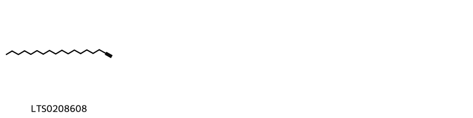
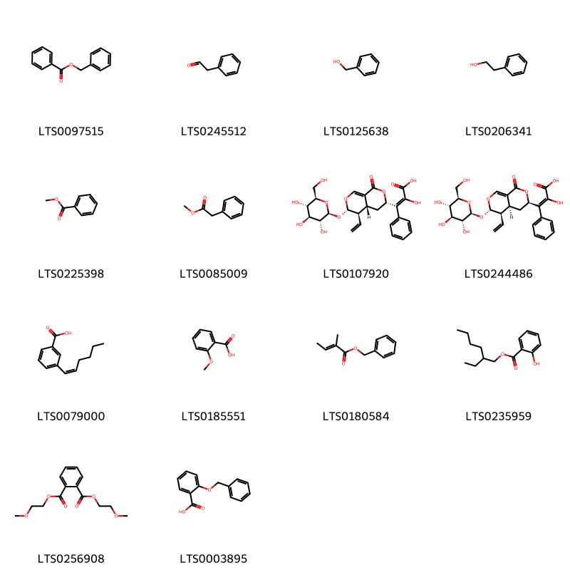
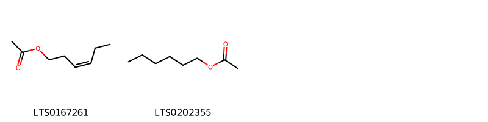
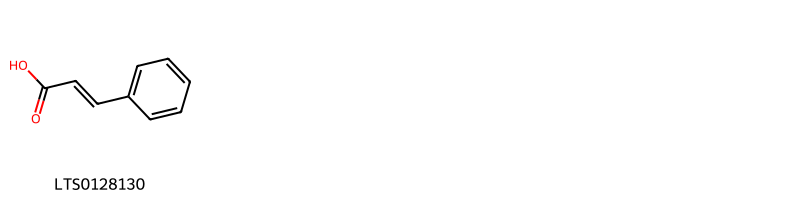
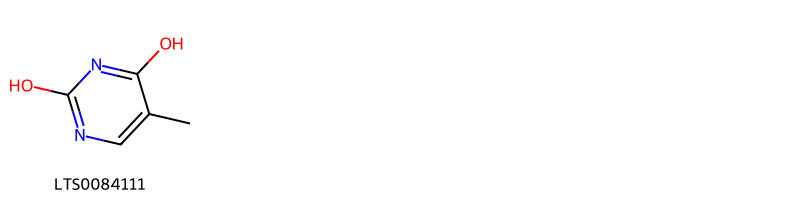
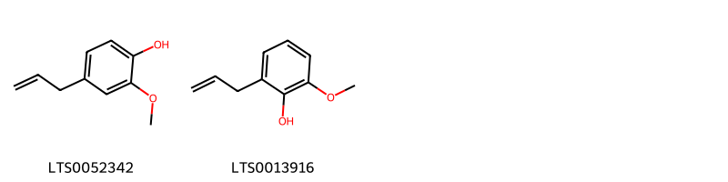
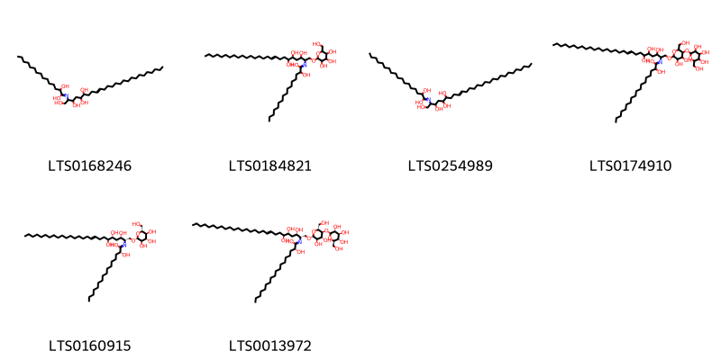
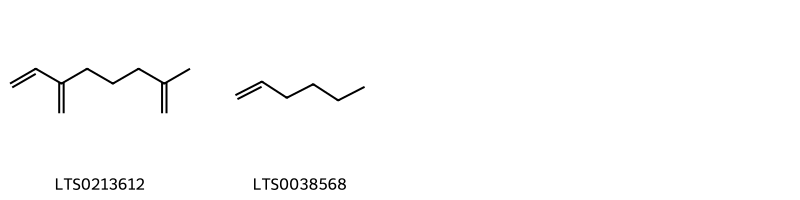

!!! abstract "Tóm tắt"
    Kim Ngân Cuống (Lonicera japonica Thunb., họ Cơm Cháy - Caprifoliaceae) là một loại dây leo mọc hoang ở nhiều tỉnh miền núi phía Bắc Việt Nam như Cao Bằng, Lạng Sơn, Bắc Giang, Nghệ An, và Hà Tĩnh, đồng thời cũng phân bố rộng rãi ở Trung Quốc, Nhật Bản, Hàn Quốc và Đài Loan. Theo y học cổ truyền, Kim Ngân Cuống có tác dụng thanh nhiệt, giải độc, chữa mụn nhọt, sốt, tả lỵ, giang mai, và các bệnh ngoài da. Dược liệu này có tính hàn, vị ngọt, thường được dùng dưới dạng thuốc sắc, cao hoặc rượu thuốc. Về tác dụng dược lý, Kim Ngân Cuống có khả năng kháng sinh mạnh, ức chế các vi khuẩn như tụ cầu, thương hàn, lỵ, coli, và liên cầu khuẩn, đồng thời tăng đường huyết tạm thời và ngăn ngừa choáng phản vệ. Thành phần hóa học của Kim Ngân Cuống gồm các hợp chất flavonoid như quercetin và luteolin, acid phenolic (chlorogenic acid), và tinh dầu (caryophyllene), giúp chống oxy hóa, kháng viêm, giảm đau và bảo vệ tế bào.

## Thông tin về thực vật

### Đặc điểm thực vật

Dược liệu **Kim Ngân (Cuộng)** từ bộ phận **cuộng** từ loài *Lonicera japonica Thunb* thuộc họ Caprifoliaceae. Kim ngân là một loại dây mọc leo, thân có thể vươn dài tới 10m hay hơn. Cành lúc còn non màu lục nhạt, có phủ lông mịn, khi cành già chuyển màu nâu đỏ nhạt, nhẵn. Lá mọc đối, đôi khi mọc vòng 3 lá một, hình trứng dài, đầu hơi tù, phía cuống tròn, cuống ngắn 2-3mm, cả hai mặt đều phủ lông mịn. Vào các tháng 5-8, hoa mọc từng đôi ở kẽ lá, mỗi kẽ lá có 1 cuống mang 2 hoa, hai bên lá mọc đối mang 4 hoa, lá bắc giống lá nhưng nhỏ hơn. Hoa hình ống xẻ hai môi, môi lớn lại xẻ thành 3 hay 4 thùy nhỏ, phiến của tràng dài gần bằng ống tràng, lúc đầu màu trắng, sau khi nở một thời gian chuyển màu vàng, cùng một lúc trên cây có hoa mới nở màu trắng như bạc, lại có hoa nở đã lâu màu vàng như vàng cho nên có tên là kim ngân (kim là vàng, ngân là bạc); cây kim ngân xanh tốt vào mùa đông cho nên còn có tên là nhẫn đông,nghĩa là chịu đựng mùa đông, 4 nhị thòi dài cao hơn tràng; vòi nhụy lại thòi dài cao hơn nhị, mùi thơm dễ chịu. Quả hình trứng dài chừng 5 mm 

!!! info "Phân loại thực vật của *Lonicera japonica*"
    - **Kingdom:** Plantae
    - **Phylum:** Tracheophyta
    - **Order:** Dipsacales
    - **Family:** Caprifoliaceae
    - **Genus:** Lonicera
    - **Species:** *Lonicera japonica*

*Tài liệu tham khảo:* "Những cây thuốc và vị thuốc Việt Nam" - Đỗ Tất Lợi

 

### Loài thay thế (Nếu có)

Dược liệu này cũng có thể từ loài *Lonicera confusa DC.*, thông tin về phân loại thực vật loài này như sau:
!!! info "Thông tin về phân loại thực vật của *Lonicera confusa*"
    - **kingdom:** Plantae
    - **phylum:** Tracheophyta
    - **order:** Dipsacales
    - **family:** Caprifoliaceae
    - **genus:** Lonicera
    - **species:** *Lonicera confusa*

Hình ảnh của loài *Lonicera confusa DC.*:

Dược liệu này cũng có thể từ loài *Lonicera cambodiana Pierre ex Danguy*, thông tin về phân loại thực vật loài này như sau:
!!! info "Thông tin về phân loại thực vật của *Lonicera cambodiana*"
    - **kingdom:** Plantae
    - **phylum:** Tracheophyta
    - **order:** Dipsacales
    - **family:** Caprifoliaceae
    - **genus:** Lonicera
    - **species:** *Lonicera cambodiana*

Hình ảnh của loài *Lonicera cambodiana Pierre ex Danguy*:

Dược liệu này cũng có thể từ loài *Lonicera dasystyla Rehd.*, thông tin về phân loại thực vật loài này như sau:
!!! info "Thông tin về phân loại thực vật của *Lonicera confusa*"
    - **kingdom:** Plantae
    - **phylum:** Tracheophyta
    - **order:** Dipsacales
    - **family:** Caprifoliaceae
    - **genus:** Lonicera
    - **species:** *Lonicera confusa*

Hình ảnh của loài *Lonicera dasystyla Rehd.*:

### Phân bố trên thế giới
**Từ vườn thực vật KEW: **: Native to:
China North-Central, China South-Central, China Southeast, Japan, Korea, Manchuria, Taiwan
Introduced into:
Alabama, Algeria, Argentina Northeast, Argentina Northwest, Arizona, Arkansas, Ascension, Assam, Azores, Bangladesh, Belgium, Bermuda, Bolivia, Brazil South, California, Cayman Is., Colombia, Connecticut, Costa Rica, Cuba, Cyprus, Delaware, District of Columbia, Dominican Republic, East Himalaya, Ecuador, El Salvador, Fiji, Florida, France, Georgia, Germany, Great Britain, Guatemala, Haiti, Hawaii, Honduras, Illinois, Indiana, Iraq, Ireland, Italy, Jamaica, Kansas, Kentucky, KwaZulu-Natal, Leeward Is., Louisiana, Madeira, Maine, Maryland, Massachusetts, Mauritius, Mexico Central, Mexico Gulf, Mexico Northeast, Mexico Southeast, Mexico Southwest, Michigan, Mississippi, Missouri, Nansei-shoto, Nebraska, Nepal, Nevada, New Hampshire, New Jersey, New Mexico, New York, New Zealand North, Norfolk Is., North Carolina, Northern Provinces, Ogasawara-shoto, Ohio, Oklahoma, Ontario, Pennsylvania, Peru, Pitcairn Is., Puerto Rico, Rhode I., Romania, Rwanda, Réunion, Solomon Is., South Carolina, Spain, St.Helena, Switzerland, Tasmania, Tennessee, Texas, Trinidad-Tobago, Tunisia, Uruguay, Utah, Uzbekistan, Venezuela, Vietnam, Virginia, Washington, West Himalaya, West Virginia, Windward Is., Wisconsin, Zaïre

**Từ CSDL GIBF** nan, Réunion, Hungary, Brazil, Italy, New Zealand, Australia, Spain, Belgium, Argentina, United Kingdom of Great Britain and Northern Ireland, United States of America, Chinese Taipei, Portugal, Niue, South Africa, Netherlands

### Phân bố tại Việt Nam
** "Những cây thuốc và vị thuốc Việt Nam" - Đỗ Tất Lợi**: Kim ngân là một cây loại mọc hoang tại nhiều tỉnh vùng núi nước ta, nhiều nhất ở Cao Bằng, Lạng sơn, Ninh Bình, Thanh Hóa, Nghệ An, Hà Tĩnh, Bắc Giang, Thái Nguyên, Quảng Ninh, Vĩnh Phúc, Phú Thọ

**Từ CSDL GIBF**: Không có ghi nhận ở Việt Nam

---

## Thông tin về dược liệu 

### Định danh

!!! info "Thông tin về tên gọi của kim ngân"
    - Dược liệu tiếng Việt: kim ngân
    - Dược liệu tiếng Trung: None (None)
    - Dược liệu tiếng Anh: None
    - Dược liệu latin thông dụng: Caulis cum folium Lonicerae
    - Dược liệu latin kiểu DĐVN: caulis cum folium lonicerae
    - Dược liệu latin kiểu DĐVN: Lonicerae Japonicae Caulis
    - Dược liệu latin kiểu thông tư: None
    - Bộ phận dùng: cuộng (Caulis cum folium)

### Mô tả dược liệu 
- **Theo dược điển Việt nam V:** 
Đoạn thân hình trụ dài 2 cm đến 5 cm, đường kính 2 cm đến 0,5 cm, vỏ ngoài màu nâu nhạt đến nâu sẫm, bên trong màu vàng nhạt, lõi xốp hoặc rỗng. Lá khô nguyên dạng hình trứng, mọc đối, dài 3 cm đến 5 cm, cuống ngắn, cả hai mặt có lông mịn. Mùi thơm nhẹ, vị hơi đắng.

- **Mô tả dược liệu theo thông tư chế biến dược liệu theo phương pháp cổ truyền:** 

### Chế biến 

- **Chế biến theo dược điển việt nam V**: 
Hái cành mang lá, loại bỏ tạp chất, cắt khúc dài 2 cm đến 5 cm, phơi trong bóng râm hay sấy nhẹ đến khô.

- **Chế biến theo thông tư:** 

--- 

## Thành phần hóa học

- Theo tài liệu của GS. Đỗ Tất Lợi:  Nhóm hóa học: Flavonoid (quercetin, luteolin), saponin, tinh dầu ( caryophyllene), acid phenolic.
Biomarker: Quercetin , luteolin, chlorogenic acid.
    
- Theo cơ sở dữ liệu lotus: Từ loài *Lonicera japonica* đã phân lập và xác định được 213 hoạt chất thuộc về các nhóm Benzene and substituted derivatives, Tetrahydrofurans, Indoles and derivatives, Saccharolipids, Steroids and steroid derivatives, Phenols, Cinnamic acids and derivatives, Flavonolignans, Organooxygen compounds, Fatty Acyls, Prenol lipids, Sphingolipids, Macrolides and analogues, Isoquinolines and derivatives, Saturated hydrocarbons, Tannins, Carboxylic acids and derivatives, Diazines, Unsaturated hydrocarbons, Flavonoids. 

|    | chemicalTaxonomyClassyfireClass     |   smiles_count |
|---:|:------------------------------------|---------------:|
|  0 |                                     |              1 |
|  1 | Benzene and substituted derivatives |             14 |
|  2 | Carboxylic acids and derivatives    |              2 |
|  3 | Cinnamic acids and derivatives      |              1 |
|  4 | Diazines                            |              1 |
|  5 | Fatty Acyls                         |             14 |
|  6 | Flavonoids                          |             15 |
|  7 | Flavonolignans                      |              1 |
|  8 | Indoles and derivatives             |              2 |
|  9 | Isoquinolines and derivatives       |              1 |
| 10 | Macrolides and analogues            |              1 |
| 11 | Organooxygen compounds              |             36 |
| 12 | Phenols                             |              2 |
| 13 | Prenol lipids                       |            107 |
| 14 | Saccharolipids                      |              1 |
| 15 | Saturated hydrocarbons              |              1 |
| 16 | Sphingolipids                       |              6 |
| 17 | Steroids and steroid derivatives    |              1 |
| 18 | Tannins                             |              2 |
| 19 | Tetrahydrofurans                    |              1 |
| 20 | Unsaturated hydrocarbons            |              2 |

### Nhóm 
<figure markdown="span">
    { width=100% }
    <figcaption>Hình ảnh cấu trúc hóa học của 1 hoạt chất thuộc nhóm  gồm ['octadec-1-yne (LTS0208608)'].</figcaption>
</figure>
### Nhóm Benzene and substituted derivatives
<figure markdown="span">
    { width=100% }
    <figcaption>Hình ảnh cấu trúc hóa học của 14 hoạt chất thuộc nhóm Benzene and substituted derivatives gồm ['benzyl benzoate (LTS0097515)', 'phenylacetaldehyde (LTS0245512)', 'benzyl alcohol (LTS0125638)', '2-phenyl-ethanol (LTS0206341)', 'methyl benzoate (LTS0225398)', 'methyl phenylacetate (LTS0085009)', 'loniphenyruviridoside c (LTS0107920)', '(2e)-3-[(3r,4as,5r,6s)-5-ethenyl-1-oxo-6-{[(2s,3r,4s,5s,6r)-3,4,5-trihydroxy-6-(hydroxymethyl)oxan-2-yl]oxy}-3h,4h,4ah,5h,6h-pyrano[3,4-c]pyran-3-yl]-2-hydroxy-3-phenylprop-2-enoic acid (LTS0244486)', '3-[(1z)-hex-1-en-1-yl]benzoic acid (LTS0079000)', 'o-anisic acid (LTS0185551)', 'benzyl tiglate (LTS0180584)', 'octisalate (LTS0235959)', 'bis(methoxyethyl)phthalate (LTS0256908)', '2-(benzyloxy)benzoic acid (LTS0003895)'].</figcaption>
</figure>
### Nhóm Carboxylic acids and derivatives
<figure markdown="span">
    { width=100% }
    <figcaption>Hình ảnh cấu trúc hóa học của 2 hoạt chất thuộc nhóm Carboxylic acids and derivatives gồm ['(z)-3-hexenyl acetate (LTS0167261)', 'hexyl acetate (LTS0202355)'].</figcaption>
</figure>
### Nhóm Cinnamic acids and derivatives
<figure markdown="span">
    { width=100% }
    <figcaption>Hình ảnh cấu trúc hóa học của 1 hoạt chất thuộc nhóm Cinnamic acids and derivatives gồm ['cinnamic acid (LTS0128130)'].</figcaption>
</figure>
### Nhóm Diazines
<figure markdown="span">
    { width=100% }
    <figcaption>Hình ảnh cấu trúc hóa học của 1 hoạt chất thuộc nhóm Diazines gồm ['5-methylpyrimidine-2,4-dione (LTS0084111)'].</figcaption>
</figure>
### Nhóm Fatty Acyls
<figure markdown="span">
    { width=100% }
    <figcaption>Hình ảnh cấu trúc hóa học của 14 hoạt chất thuộc nhóm Fatty Acyls gồm ['methyl palmitate (LTS0139222)', 'ethyl palmitate (LTS0111042)', 'isopropyl laurate (LTS0129928)', '11-hexadecenoic acid (LTS0130305)', 'octyl acetate (LTS0217143)', '(3z)-hexenyl tiglate (LTS0127710)', 'hexyl (2e)-2-methylbut-2-enoate (LTS0082952)', '(1z)-hex-1-en-1-yl (2e)-2-methylbut-2-enoate (LTS0191373)', 'cis-3-hexenol (LTS0132156)', '(13e)-octadec-13-enoic acid (LTS0139394)', 'allyl stearate (LTS0092475)', '2-ethylhexanol (LTS0180984)', 'arachidyl alcohol (LTS0230409)', 'capric acid (LTS0039856)'].</figcaption>
</figure>
### Nhóm Flavonoids
<figure markdown="span">
    { width=100% }
    <figcaption>Hình ảnh cấu trúc hóa học của 15 hoạt chất thuộc nhóm Flavonoids gồm ['quercetin (LTS0004651)', 'astragalin (LTS0249588)', '2-(3,4-dihydroxyphenyl)-5,7-dihydroxy-3-{[(2s,3r,4r,5r,6s)-3,4,5-trihydroxy-6-(hydroxymethyl)oxan-2-yl]oxy}chromen-4-one (LTS0241372)', 'hyperoside (LTS0089156)', 'luteolin (LTS0017052)', 'luteolin 7-o-glucoside (LTS0227450)', 'quercetin-3-glucoside (LTS0154393)', 'rhoifolin (LTS0029806)', '2-(3,4-dihydroxyphenyl)-7-hydroxy-5-{[(2s,3r,4s,5s,6r)-3,4,5-trihydroxy-6-(hydroxymethyl)oxan-2-yl]oxy}chromen-4-one (LTS0155853)', 'chrysin (LTS0200644)', '2-{4-[4-(5,7-dihydroxy-4-oxochromen-2-yl)phenoxy]-3-methoxyphenyl}-5,7-dihydroxychromen-4-one (LTS0197953)', 'lonicerin (LTS0219204)', '2-{4-[4-(5,7-dihydroxy-4-oxochromen-2-yl)phenoxy]-3-hydroxyphenyl}-5-hydroxy-7-methylchromen-4-one (LTS0233611)', '2-{4-[4-(5,7-dihydroxy-4-oxochromen-2-yl)-2-hydroxyphenoxy]phenyl}-5,7-dihydroxychromen-4-one (LTS0019098)', 'ochnaflavone (LTS0243620)'].</figcaption>
</figure>
### Nhóm Flavonolignans
<figure markdown="span">
    { width=100% }
    <figcaption>Hình ảnh cấu trúc hóa học của 1 hoạt chất thuộc nhóm Flavonolignans gồm ['5,7-dihydroxy-2-[2-(4-hydroxy-3-methoxyphenyl)-3-(hydroxymethyl)-2,3-dihydro-1,4-benzodioxin-6-yl]chromen-4-one (LTS0064314)'].</figcaption>
</figure>
### Nhóm Indoles and derivatives
<figure markdown="span">
    { width=100% }
    <figcaption>Hình ảnh cấu trúc hóa học của 2 hoạt chất thuộc nhóm Indoles and derivatives gồm ['indole (LTS0185357)', 'n-[2-(5-methoxy-1h-indol-3-yl)ethyl]ethanimidic acid (LTS0219322)'].</figcaption>
</figure>
### Nhóm Isoquinolines and derivatives
<figure markdown="span">
    { width=100% }
    <figcaption>Hình ảnh cấu trúc hóa học của 1 hoạt chất thuộc nhóm Isoquinolines and derivatives gồm ['isoquinoline (LTS0089583)'].</figcaption>
</figure>
### Nhóm Macrolides and analogues
<figure markdown="span">
    { width=100% }
    <figcaption>Hình ảnh cấu trúc hóa học của 1 hoạt chất thuộc nhóm Macrolides and analogues gồm ['exaltolide (LTS0107598)'].</figcaption>
</figure>
### Nhóm Organooxygen compounds
<figure markdown="span">
    { width=100% }
    <figcaption>Hình ảnh cấu trúc hóa học của 36 hoạt chất thuộc nhóm Organooxygen compounds gồm ['benzyl β-d-glucoside (LTS0184698)', '(4as,5r,6s)-5-ethenyl-6-{[3,4,5-trihydroxy-6-(hydroxymethyl)oxan-2-yl]oxy}-3h,4h,4ah,5h,6h-pyrano[3,4-c]pyran-1-one (LTS0114959)', 'sweroside (LTS0014051)', '5-ethenyl-6-{[3,4,5-trihydroxy-6-(hydroxymethyl)oxan-2-yl]oxy}-3h,4h,4ah,5h,6h-pyrano[3,4-c]pyran-1-one (LTS0049445)', 'swertiamarin (LTS0210938)', '(4as,5s,6s)-5-ethenyl-6-{[(2s,3s,4s,5s,6r)-3,4,5-trihydroxy-6-(hydroxymethyl)oxan-2-yl]oxy}-3h,4h,4ah,5h,6h-pyrano[3,4-c]pyran-1-one (LTS0048954)', 'neochlorogenic acid (LTS0235816)', '(2s,3r,4s,5s,6r)-2-{[(3s,4r,4as)-4-ethenyl-3h,4h,4ah,5h,6h,8h-pyrano[3,4-c]pyran-3-yl]oxy}-6-(hydroxymethyl)oxane-3,4,5-triol (LTS0060943)', 'methyl (1s,4as,8s,8as)-8-methyl-6-oxo-1-{[(2s,3r,4s,5s,6r)-3,4,5-trihydroxy-6-(hydroxymethyl)oxan-2-yl]oxy}-1h,4ah,5h,8h,8ah-pyrano[3,4-c]pyran-4-carboxylate (LTS0082680)', 'methyl 6-hydroxy-8-methyl-1-{[3,4,5-trihydroxy-6-(hydroxymethyl)oxan-2-yl]oxy}-1h,4ah,5h,6h,8h,8ah-pyrano[3,4-c]pyran-4-carboxylate (LTS0084953)', 'morroniside (LTS0059263)', '(1s,4as,8as)-8-methyl-6-oxo-1-{[(2s,3r,4s,5s,6r)-3,4,5-trihydroxy-6-(hydroxymethyl)oxan-2-yl]oxy}-1h,4ah,5h,8h,8ah-pyrano[3,4-c]pyran-4-yl acetate (LTS0033110)', '2-nonadecanone (LTS0035904)', '(1r,2s,3s,7s,9r)-10-phenyl-3-{[(2s,3r,4s,5s,6r)-3,4,5-trihydroxy-6-(hydroxymethyl)oxan-2-yl]oxy}-4,12-dioxatricyclo[7.3.1.0²,⁷]trideca-5,10-diene-6-carboxylic acid (LTS0117035)', '(2r)-2-hydroxy-n-[(2s,3s,5r,6s,9e)-1,3,5,6-tetrahydroxyhexacos-9-en-2-yl]pentadecanimidic acid (LTS0196888)', '(3r,4as,5s,6s)-5-ethenyl-3-methoxy-6-{[(2s,3s,4r,5s,6s)-3,4,5-trihydroxy-6-(hydroxymethyl)oxan-2-yl]oxy}-3h,4h,4ah,5h,6h-pyrano[3,4-c]pyran-1-one (LTS0192970)', '(3r,4as,5r,6s)-5-ethenyl-3-methoxy-6-{[(2s,3r,4s,5s,6r)-3,4,5-trihydroxy-6-(hydroxymethyl)oxan-2-yl]oxy}-3h,4h,4ah,5h,6h-pyrano[3,4-c]pyran-1-one (LTS0157469)', '5-ethenyl-3-methoxy-6-{[(2s,3r,4s,5s,6r)-3,4,5-trihydroxy-6-(hydroxymethyl)oxan-2-yl]oxy}-3h,4h,4ah,5h,6h-pyrano[3,4-c]pyran-1-one (LTS0075789)', 'isochlorogenic acid (LTS0210263)', 'methyl (1s,4as,8s,8as)-8-methyl-6-oxo-1-{[(2r,3s,4r,5s,6s)-3,4,5-trihydroxy-6-(hydroxymethyl)oxan-2-yl]oxy}-1h,4ah,5h,8h,8ah-pyrano[3,4-c]pyran-4-carboxylate (LTS0102052)', '(3s,4as,5r,6s)-5-ethenyl-3-methoxy-6-{[(2s,3r,4s,5s,6r)-3,4,5-trihydroxy-6-(hydroxymethyl)oxan-2-yl]oxy}-3h,4h,4ah,5h,6h-pyrano[3,4-c]pyran-1-one (LTS0187995)', '(2r)-2-hydroxy-n-[(2s,3s,5r,6s,9e)-1,3,5,6-tetrahydroxyoctacos-9-en-2-yl]octadecanimidic acid (LTS0173298)', '(2s,3r,4s,5s,6r)-2-{[(3s,4r,4as,6r)-4-ethenyl-6-methoxy-3h,4h,4ah,5h,6h,8h-pyrano[3,4-c]pyran-3-yl]oxy}-6-(hydroxymethyl)oxane-3,4,5-triol (LTS0156001)', '2-pentadecanone (LTS0265307)', 'jasmone (LTS0205512)', '(3s,4as,5s,6s)-5-ethenyl-3-methoxy-6-{[(2s,3r,4s,5s,6r)-3,4,5-trihydroxy-6-(hydroxymethyl)oxan-2-yl]oxy}-3h,4h,4ah,5h,6h-pyrano[3,4-c]pyran-1-one (LTS0269826)', '(e)-2-hexenal (LTS0207868)', 'methyl (1s,4as,6s,8s,8as)-6-hydroxy-8-methyl-1-{[(2s,3r,4s,5s,6r)-3,4,5-trihydroxy-6-(hydroxymethyl)oxan-2-yl]oxy}-1h,4ah,5h,6h,8h,8ah-pyrano[3,4-c]pyran-4-carboxylate (LTS0226231)', 'methyl 8-methyl-6-oxo-1-{[3,4,5-trihydroxy-6-(hydroxymethyl)oxan-2-yl]oxy}-1h,4ah,5h,8h,8ah-pyrano[3,4-c]pyran-4-carboxylate (LTS0251161)', '(2s,3r,4s,5s,6r)-2-{[(3s,4r,4as,6s)-4-ethenyl-6-methoxy-3h,4h,4ah,5h,6h,8h-pyrano[3,4-c]pyran-3-yl]oxy}-6-(hydroxymethyl)oxane-3,4,5-triol (LTS0233432)', '5-ethenyl-3-methoxy-6-{[3,4,5-trihydroxy-6-(hydroxymethyl)oxan-2-yl]oxy}-3h,4h,4ah,5h,6h-pyrano[3,4-c]pyran-1-one (LTS0253286)', '2-({4-ethenyl-3h,4h,4ah,5h,6h,8h-pyrano[3,4-c]pyran-3-yl}oxy)-6-(hydroxymethyl)oxane-3,4,5-triol (LTS0008879)', 'lonijaposide h (LTS0000491)', '2-({4-ethenyl-6-methoxy-3h,4h,4ah,5h,6h,8h-pyrano[3,4-c]pyran-3-yl}oxy)-6-(hydroxymethyl)oxane-3,4,5-triol (LTS0094812)', 'methyl (4as,8as)-6-hydroxy-8-methyl-1-{[3,4,5-trihydroxy-6-(hydroxymethyl)oxan-2-yl]oxy}-1h,4ah,5h,6h,8h,8ah-pyrano[3,4-c]pyran-4-carboxylate (LTS0262967)', 'didecyl ether (LTS0250090)'].</figcaption>
</figure>
### Nhóm Phenols
<figure markdown="span">
    { width=100% }
    <figcaption>Hình ảnh cấu trúc hóa học của 2 hoạt chất thuộc nhóm Phenols gồm ['eugenol (LTS0052342)', '2-methoxy-6-(prop-2-en-1-yl)phenol (LTS0013916)'].</figcaption>
</figure>
### Nhóm Prenol lipids
<figure markdown="span">
    { width=100% }
    <figcaption>Hình ảnh cấu trúc hóa học của 107 hoạt chất thuộc nhóm Prenol lipids gồm ['caryophyllene (LTS0085212)', 'β-carotene (LTS0275716)', 'terpineol (LTS0136148)', 'nerolidol (LTS0197738)', 'geraniol (LTS0258838)', 'farnesene (LTS0057150)', '10-[(4,5-dihydroxy-3-{[3,4,5-trihydroxy-6-(hydroxymethyl)oxan-2-yl]oxy}oxan-2-yl)oxy]-2,2,6a,6b,9,9,12a-heptamethyl-1,3,4,5,6,7,8,8a,10,11,12,12b,13,14b-tetradecahydropicene-4a-carboxylic acid (LTS0220377)', 'hederagenin 3-o-arabinoside (LTS0090209)', 'β-bourbonene (LTS0074484)', '9-(hydroxymethyl)-2,2,6a,6b,9,12a-hexamethyl-10-[(3,4,5-trihydroxyoxan-2-yl)oxy]-1,3,4,5,6,7,8,8a,10,11,12,12b,13,14b-tetradecahydropicene-4a-carboxylic acid (LTS0062858)', '(2s,3r,4s,5s,6r)-3,4,5-trihydroxy-6-({[(2r,3r,4s,5s,6r)-3,4,5-trihydroxy-6-(hydroxymethyl)oxan-2-yl]oxy}methyl)oxan-2-yl (4as,6as,6br,8ar,9r,10s,12ar,12br,14bs)-9-(hydroxymethyl)-2,2,6a,6b,9,12a-hexamethyl-10-{[(2s,3r,4s,5s)-3,4,5-trihydroxyoxan-2-yl]oxy}-1,3,4,5,6,7,8,8a,10,11,12,12b,13,14b-tetradecahydropicene-4a-carboxylate (LTS0170288)', '(-)-secologanin (LTS0199033)', '3,4,5-trihydroxy-6-({[3,4,5-trihydroxy-6-(hydroxymethyl)oxan-2-yl]oxy}methyl)oxan-2-yl 9-(hydroxymethyl)-2,2,6a,6b,9,12a-hexamethyl-10-[(3,4,5-trihydroxyoxan-2-yl)oxy]-1,3,4,5,6,7,8,8a,10,11,12,12b,13,14b-tetradecahydropicene-4a-carboxylate (LTS0238626)', '(4as,6as,6br,8ar,10s,12ar,12br,14bs)-10-{[(2s,3r,4s,5s)-4,5-dihydroxy-3-{[(2s,3r,4s,5s,6r)-3,4,5-trihydroxy-6-(hydroxymethyl)oxan-2-yl]oxy}oxan-2-yl]oxy}-2,2,6a,6b,9,9,12a-heptamethyl-1,3,4,5,6,7,8,8a,10,11,12,12b,13,14b-tetradecahydropicene-4a-carboxylic acid (LTS0240910)', '10-[(4,5-dihydroxy-3-{[3,4,5-trihydroxy-6-(hydroxymethyl)oxan-2-yl]oxy}oxan-2-yl)oxy]-9-(hydroxymethyl)-2,2,6a,6b,9,12a-hexamethyl-1,3,4,5,6,7,8,8a,10,11,12,12b,13,14b-tetradecahydropicene-4a-carboxylic acid (LTS0101116)', 'cauloside c (LTS0086751)', 'loganin (LTS0084120)', 'citronellol, (+-)- (LTS0090925)', '1,3,3-trimethyl-2-[(9e,11e,13e,15e,17e)-3,7,12,16-tetramethyl-18-(2,6,6-trimethylcyclohex-1-en-1-yl)octadeca-1,3,5,7,9,11,13,15,17-nonaen-1-yl]cyclohex-1-ene (LTS0110068)', '2,6,6-trimethyl-8-methylidenetricyclo[5.3.1.0¹,⁵]undecane (LTS0066298)', '7-deoxyloganetin (LTS0122992)', '(2s,3r,4s,5s,6r)-3,4,5-trihydroxy-6-({[(2r,3r,4s,5s,6r)-3,4,5-trihydroxy-6-(hydroxymethyl)oxan-2-yl]oxy}methyl)oxan-2-yl (4as,6as,6br,8ar,10s,12ar,12br,14bs)-10-{[(2s,3r,4s,5s)-4,5-dihydroxy-3-{[(2s,3r,4s,5s,6r)-3,4,5-trihydroxy-6-(hydroxymethyl)oxan-2-yl]oxy}oxan-2-yl]oxy}-2,2,6a,6b,9,9,12a-heptamethyl-1,3,4,5,6,7,8,8a,10,11,12,12b,13,14b-tetradecahydropicene-4a-carboxylate (LTS0072041)', 'piperitenone (LTS0074451)', '2,6,6-trimethylbicyclo[3.1.1]hept-1-ene (LTS0080542)', 'methyl 6-hydroxy-7-methyl-1-{[3,4,5-trihydroxy-6-(hydroxymethyl)oxan-2-yl]oxy}-1h,4ah,5h,6h,7h,7ah-cyclopenta[c]pyran-4-carboxylate (LTS0032881)', '3-carboxy-1-(3-carboxypropyl)-5-[(1e)-2-[(2s,3r,4s)-3-ethenyl-5-(methoxycarbonyl)-2-{[(2s,3r,4s,5s,6r)-3,4,5-trihydroxy-6-(hydroxymethyl)oxan-2-yl]oxy}-3,4-dihydro-2h-pyran-4-yl]ethenyl]pyridin-1-ium (LTS0078530)', '3-carboxy-5-[(1e)-2-[(2s,3r,4s)-5-carboxylato-3-ethenyl-2-{[(2s,3r,4s,5s,6r)-3,4,5-trihydroxy-6-(hydroxymethyl)oxan-2-yl]oxy}-3,4-dihydro-2h-pyran-4-yl]ethenyl]-1-ethylpyridin-1-ium (LTS0023161)', '4-(carboxymethyl)-5-ethenyl-6-{[3,4,5-trihydroxy-6-(hydroxymethyl)oxan-2-yl]oxy}-5,6-dihydro-4h-pyran-3-carboxylic acid (LTS0144922)', '2-({2-[3-ethenyl-5-(methoxycarbonyl)-2-{[3,4,5-trihydroxy-6-(hydroxymethyl)oxan-2-yl]oxy}-3,4-dihydro-2h-pyran-4-yl]ethyl}amino)-3-phenylpropanoic acid (LTS0008479)', '3,4,5-trihydroxy-6-({[3,4,5-trihydroxy-6-(hydroxymethyl)oxan-2-yl]oxy}methyl)oxan-2-yl 10-[(4,5-dihydroxy-3-{[3,4,5-trihydroxy-6-(hydroxymethyl)oxan-2-yl]oxy}oxan-2-yl)oxy]-9-(hydroxymethyl)-2,2,6a,6b,9,12a-hexamethyl-1,3,4,5,6,7,8,8a,10,11,12,12b,13,14b-tetradecahydropicene-4a-carboxylate (LTS0102646)', '(4s,5r,6s)-5-ethenyl-4-(2-methoxy-2-oxoethyl)-6-{[(2s,3r,4s,5s,6r)-3,4,5-trihydroxy-6-(hydroxymethyl)oxan-2-yl]oxy}-5,6-dihydro-4h-pyran-3-carboxylic acid (LTS0167485)', '4,5-dihydroxy-3-[(3,4,5-trihydroxy-6-methyloxan-2-yl)oxy]-6-{[(3,4,5-trihydroxyoxan-2-yl)oxy]methyl}oxan-2-yl 9-(hydroxymethyl)-2,2,6a,6b,9,12a-hexamethyl-10-{[3,4,5-trihydroxy-6-(hydroxymethyl)oxan-2-yl]oxy}-1,3,4,5,6,7,8,8a,10,11,12,12b,13,14b-tetradecahydropicene-4a-carboxylate (LTS0118857)', 'methyl 5-ethenyl-4-{3-[3-ethenyl-5-(methoxycarbonyl)-2-{[3,4,5-trihydroxy-6-(hydroxymethyl)oxan-2-yl]oxy}-3,4-dihydro-2h-pyran-4-yl]-4-oxobut-2-en-1-yl}-6-{[3,4,5-trihydroxy-6-(hydroxymethyl)oxan-2-yl]oxy}-5,6-dihydro-4h-pyran-3-carboxylate (LTS0119142)', '3-carboxy-5-[(1e)-2-[(2s,3r,4s)-3-ethenyl-5-(methoxycarbonyl)-2-{[(2s,3r,4s,5s,6r)-3,4,5-trihydroxy-6-(hydroxymethyl)oxan-2-yl]oxy}-3,4-dihydro-2h-pyran-4-yl]ethenyl]-1-(2-hydroxyethyl)pyridin-1-ium (LTS0199763)', '3,4,5-trihydroxy-6-(hydroxymethyl)oxan-2-yl 10-({4,5-dihydroxy-3-[(3,4,5-trihydroxy-6-methyloxan-2-yl)oxy]oxan-2-yl}oxy)-9-(hydroxymethyl)-2,2,6a,6b,9,12a-hexamethyl-1,3,4,5,6,7,8,8a,10,11,12,12b,13,14b-tetradecahydropicene-4a-carboxylate (LTS0068099)', '5-ethenyl-4-(2-methoxy-2-oxoethyl)-6-{[3,4,5-trihydroxy-6-(hydroxymethyl)oxan-2-yl]oxy}-5,6-dihydro-4h-pyran-3-carboxylic acid (LTS0110457)', '3-[(1e)-2-[(2s,3r,4s)-3-ethenyl-5-(methoxycarbonyl)-2-{[(2s,3r,4s,5s,6r)-3,4,5-trihydroxy-6-(hydroxymethyl)oxan-2-yl]oxy}-3,4-dihydro-2h-pyran-4-yl]ethenyl]-1-(2-hydroxyethyl)pyridin-1-ium (LTS0196820)', 'lonijaposide g (LTS0017922)', '10-({4,5-dihydroxy-3-[(3,4,5-trihydroxy-6-methyloxan-2-yl)oxy]oxan-2-yl}oxy)-9-(hydroxymethyl)-2,2,6a,6b,9,12a-hexamethyl-1,3,4,5,6,7,8,8a,10,11,12,12b,13,14b-tetradecahydropicene-4a-carboxylic acid (LTS0107537)', '3,7,11-trimethyldodeca-1,6,10-trien-3-yl acetate (LTS0104577)', 'methyl (1s,4as,6s,7s,7ar)-6-hydroxy-7-methyl-1-{[(2s,3r,4s,5s,6r)-3,4,5-trihydroxy-6-(hydroxymethyl)oxan-2-yl]oxy}-1h,4ah,5h,6h,7h,7ah-cyclopenta[c]pyran-4-carboxylate (LTS0184542)', 'methyl (1s,4as,6s,7r,7as)-1-{[(2s,3r,4s,5s,6r)-6-({[(3r,4as,5r,6s)-5-ethenyl-1-oxo-6-{[(2s,3r,4s,5s,6r)-3,4,5-trihydroxy-6-(hydroxymethyl)oxan-2-yl]oxy}-3h,4h,4ah,5h,6h-pyrano[3,4-c]pyran-3-yl]oxy}methyl)-3,4,5-trihydroxyoxan-2-yl]oxy}-6-hydroxy-7-methyl-1h,4ah,5h,6h,7h,7ah-cyclopenta[c]pyran-4-carboxylate (LTS0187232)', '(1s,4as,6s,7s,7as)-6-hydroxy-7-methyl-1-{[(2s,3r,4s,5s,6r)-3,4,5-trihydroxy-6-(hydroxymethyl)oxan-2-yl]oxy}-1h,4ah,5h,6h,7h,7ah-cyclopenta[c]pyran-4-carboxylic acid (LTS0260312)', '6-[({6-[(acetyloxy)methyl]-3,4,5-trihydroxyoxan-2-yl}oxy)methyl]-3,4,5-trihydroxyoxan-2-yl 10-({4,5-dihydroxy-3-[(3,4,5-trihydroxy-6-methyloxan-2-yl)oxy]oxan-2-yl}oxy)-9-(hydroxymethyl)-2,2,6a,6b,9,12a-hexamethyl-1,3,4,5,6,7,8,8a,10,11,12,12b,13,14b-tetradecahydropicene-4a-carboxylate (LTS0241854)', '3,4,5-trihydroxy-6-({[3,4,5-trihydroxy-6-(hydroxymethyl)oxan-2-yl]oxy}methyl)oxan-2-yl 10-({4,5-dihydroxy-3-[(3,4,5-trihydroxy-6-methyloxan-2-yl)oxy]oxan-2-yl}oxy)-2,2,6a,6b,9,9,12a-heptamethyl-1,3,4,5,6,7,8,8a,10,11,12,12b,13,14b-tetradecahydropicene-4a-carboxylate (LTS0193057)', 'methyl (4s,5r,6s)-5-ethenyl-4-[(2e)-3-[(2s,3r,4r)-3-ethenyl-5-(methoxycarbonyl)-2-{[(2s,3r,4s,5s,6r)-3,4,5-trihydroxy-6-(hydroxymethyl)oxan-2-yl]oxy}-3,4-dihydro-2h-pyran-4-yl]-4-oxobut-2-en-1-yl]-6-{[(2s,3r,4s,5s,6r)-3,4,5-trihydroxy-6-(hydroxymethyl)oxan-2-yl]oxy}-5,6-dihydro-4h-pyran-3-carboxylate (LTS0250189)', '(2s,3r,4s,5s,6r)-3,4,5-trihydroxy-6-({[(2r,3r,4s,5s,6r)-3,4,5-trihydroxy-6-(hydroxymethyl)oxan-2-yl]oxy}methyl)oxan-2-yl (4as,6as,6br,9r,10s,12ar)-10-{[(2s,3r,4s,5s)-4,5-dihydroxy-3-{[(2s,3r,4r,5r,6s)-3,4,5-trihydroxy-6-methyloxan-2-yl]oxy}oxan-2-yl]oxy}-9-(hydroxymethyl)-2,2,6a,6b,9,12a-hexamethyl-1,3,4,5,6,7,8,8a,10,11,12,12b,13,14b-tetradecahydropicene-4a-carboxylate (LTS0162110)', '5-carboxy-3-[(1e)-2-[(2r,3s,4s)-5-carboxy-3-ethenyl-2-{[(2s,3r,4s,5r,6r)-3,4,5-trihydroxy-6-(hydroxymethyl)oxan-2-yl]oxy}-3,4-dihydro-2h-pyran-4-yl]ethenyl]-1-(2-hydroxyethyl)-2h-pyridin-2-yl (LTS0150042)', '(2s,3r,4s,5s,6r)-6-({[(2r,3r,4s,5s,6r)-6-[(acetyloxy)methyl]-3,4,5-trihydroxyoxan-2-yl]oxy}methyl)-3,4,5-trihydroxyoxan-2-yl (4as,6as,6br,8ar,9r,10s,12ar,12br,14bs)-10-{[(2s,3r,4s,5s)-4,5-dihydroxy-3-{[(2s,3r,4r,5r,6s)-3,4,5-trihydroxy-6-methyloxan-2-yl]oxy}oxan-2-yl]oxy}-9-(hydroxymethyl)-2,2,6a,6b,9,12a-hexamethyl-1,3,4,5,6,7,8,8a,10,11,12,12b,13,14b-tetradecahydropicene-4a-carboxylate (LTS0192120)', '(2s,3r,4s,5s,6r)-3,4,5-trihydroxy-6-(hydroxymethyl)oxan-2-yl (4as,6as,6br,8ar,9r,10s,12ar,12br,14bs)-10-{[(2s,3r,4s,5s)-4,5-dihydroxy-3-{[(2s,3r,4r,5r,6s)-3,4,5-trihydroxy-6-methyloxan-2-yl]oxy}oxan-2-yl]oxy}-9-(hydroxymethyl)-2,2,6a,6b,9,12a-hexamethyl-1,3,4,5,6,7,8,8a,10,11,12,12b,13,14b-tetradecahydropicene-4a-carboxylate (LTS0191742)', 'lonijaposide n (LTS0090217)', '4,5-dihydroxy-3-[(3,4,5-trihydroxy-6-methyloxan-2-yl)oxy]-6-{[(3,4,5-trihydroxyoxan-2-yl)oxy]methyl}oxan-2-yl 10-({4,5-dihydroxy-3-[(3,4,5-trihydroxy-6-methyloxan-2-yl)oxy]oxan-2-yl}oxy)-9-(hydroxymethyl)-2,2,6a,6b,9,12a-hexamethyl-1,3,4,5,6,7,8,8a,10,11,12,12b,13,14b-tetradecahydropicene-4a-carboxylate (LTS0164634)', 'methyl (1s,4as,6s,7s,7as)-6-hydroxy-7-methyl-1-{[(2s,3r,4s,5s,6r)-3,4,5-trihydroxy-6-(hydroxymethyl)oxan-2-yl]oxy}-1h,4ah,5h,6h,7h,7ah-cyclopenta[c]pyran-4-carboxylate (LTS0213092)', 'phytofluene (LTS0181914)', 'methyl (4s,5r,6r)-5-ethenyl-4-(2-oxoethyl)-6-{[(2s,3r,4s,5s,6r)-3,4,5-trihydroxy-6-(hydroxymethyl)oxan-2-yl]oxy}-5,6-dihydro-4h-pyran-3-carboxylate (LTS0246845)', '(2s,3r,4s,5s,6r)-4,5-dihydroxy-3-{[(2s,3r,4r,5r,6s)-3,4,5-trihydroxy-6-methyloxan-2-yl]oxy}-6-({[(2s,3r,4s,5r)-3,4,5-trihydroxyoxan-2-yl]oxy}methyl)oxan-2-yl (4as,6as,6br,8ar,9r,10s,12ar,12br,14br)-10-{[(2s,3r,4s,5s)-4,5-dihydroxy-3-{[(2s,3r,4r,5r,6s)-3,4,5-trihydroxy-6-methyloxan-2-yl]oxy}oxan-2-yl]oxy}-9-(hydroxymethyl)-2,2,6a,6b,9,12a-hexamethyl-1,3,4,5,6,7,8,8a,10,11,12,12b,13,14b-tetradecahydropicene-4a-carboxylate (LTS0245060)', '(4s,5r,6s)-4-(carboxymethyl)-5-ethenyl-6-{[(2s,3r,4s,5s,6r)-3,4,5-trihydroxy-6-(hydroxymethyl)oxan-2-yl]oxy}-5,6-dihydro-4h-pyran-3-carboxylic acid (LTS0242890)', 'dipsacoside b (LTS0161777)', '4,5-dihydroxy-3-[(3,4,5-trihydroxy-6-methyloxan-2-yl)oxy]-6-{[(3,4,5-trihydroxyoxan-2-yl)oxy]methyl}oxan-2-yl 9-(hydroxymethyl)-2,2,6a,6b,9,12a-hexamethyl-10-[(3,4,5-trihydroxyoxan-2-yl)oxy]-1,3,4,5,6,7,8,8a,10,11,12,12b,13,14b-tetradecahydropicene-4a-carboxylate (LTS0107255)', '(4s,5r,6s)-4-(carboxymethyl)-5-ethenyl-6-{[(2r,3s,4r,5r,6s)-3,4,5-trihydroxy-6-(hydroxymethyl)oxan-2-yl]oxy}-5,6-dihydro-4h-pyran-3-carboxylic acid (LTS0267795)', '(2s,3r,4s,5s,6r)-4,5-dihydroxy-3-{[(2s,3r,4r,5r,6s)-3,4,5-trihydroxy-6-methyloxan-2-yl]oxy}-6-({[(2r,3r,4r,5s)-3,4,5-trihydroxyoxan-2-yl]oxy}methyl)oxan-2-yl (4as,6as,6br,8ar,9r,10s,12ar,12br,14bs)-9-(hydroxymethyl)-2,2,6a,6b,9,12a-hexamethyl-10-{[(2r,3r,4s,5s,6r)-3,4,5-trihydroxy-6-(hydroxymethyl)oxan-2-yl]oxy}-1,3,4,5,6,7,8,8a,10,11,12,12b,13,14b-tetradecahydropicene-4a-carboxylate (LTS0195682)', 'lonijaposide l (LTS0203192)', '3-carboxy-5-[(1e)-2-[(2s,3r,4s)-5-carboxylato-3-ethenyl-2-{[(2s,3r,4s,5s,6r)-3,4,5-trihydroxy-6-(hydroxymethyl)oxan-2-yl]oxy}-3,4-dihydro-2h-pyran-4-yl]ethenyl]-1-(3-carboxypropyl)pyridin-1-ium (LTS0073819)', '[(2s,3r,4s)-3-ethenyl-5-(methoxycarbonyl)-2-{[(2s,3r,4s,5s,6r)-3,4,5-trihydroxy-6-(hydroxymethyl)oxan-2-yl]oxy}-3,4-dihydro-2h-pyran-4-yl]acetic acid (LTS0101012)', 'zeta-carotene (LTS0218266)', '(2s)-2-({2-[(2s,3r,4s)-3-ethenyl-5-(methoxycarbonyl)-2-{[(2s,3r,4s,5s,6r)-3,4,5-trihydroxy-6-(hydroxymethyl)oxan-2-yl]oxy}-3,4-dihydro-2h-pyran-4-yl]ethyl}amino)-3-phenylpropanoic acid (LTS0100816)', 'lonijaposide c (LTS0100755)', 'methyl 4-(2,2-dimethoxyethyl)-5-ethenyl-6-{[3,4,5-trihydroxy-6-(hydroxymethyl)oxan-2-yl]oxy}-5,6-dihydro-4h-pyran-3-carboxylate (LTS0218607)', 'loganic acid (LTS0231203)', '3,4,5-trihydroxy-6-({[3,4,5-trihydroxy-6-(hydroxymethyl)oxan-2-yl]oxy}methyl)oxan-2-yl 10-[(4,5-dihydroxy-3-{[3,4,5-trihydroxy-6-(hydroxymethyl)oxan-2-yl]oxy}oxan-2-yl)oxy]-2,2,6a,6b,9,9,12a-heptamethyl-1,3,4,5,6,7,8,8a,10,11,12,12b,13,14b-tetradecahydropicene-4a-carboxylate (LTS0080846)', '(2s,3r,4s,5s,6r)-4,5-dihydroxy-3-{[(2s,3r,4r,5r,6s)-3,4,5-trihydroxy-6-methyloxan-2-yl]oxy}-6-({[(2s,3r,4s,5r)-3,4,5-trihydroxyoxan-2-yl]oxy}methyl)oxan-2-yl (4as,6as,6br,8ar,9r,10s,12ar,12br,14bs)-9-(hydroxymethyl)-2,2,6a,6b,9,12a-hexamethyl-10-{[(2r,3r,4s,5s,6r)-3,4,5-trihydroxy-6-(hydroxymethyl)oxan-2-yl]oxy}-1,3,4,5,6,7,8,8a,10,11,12,12b,13,14b-tetradecahydropicene-4a-carboxylate (LTS0226310)', 'methyl (4s,5r,6s)-5-ethenyl-4-[(2z)-3-[(2s,3r,4r)-3-ethenyl-5-(methoxycarbonyl)-2-{[(2s,3r,4s,5s,6r)-3,4,5-trihydroxy-6-(hydroxymethyl)oxan-2-yl]oxy}-3,4-dihydro-2h-pyran-4-yl]-4-oxobut-2-en-1-yl]-6-{[(2s,3r,4s,5s,6r)-3,4,5-trihydroxy-6-(hydroxymethyl)oxan-2-yl]oxy}-5,6-dihydro-4h-pyran-3-carboxylate (LTS0218395)', '(2s,3r,4s,5s,6r)-4,5-dihydroxy-3-{[(2s,3r,4r,5r,6s)-3,4,5-trihydroxy-6-methyloxan-2-yl]oxy}-6-({[(2s,3r,4s,5r)-3,4,5-trihydroxyoxan-2-yl]oxy}methyl)oxan-2-yl (4as,6as,6br,8ar,9r,10s,12ar,12br,14bs)-10-{[(2s,3r,4s,5s)-4,5-dihydroxy-3-{[(2s,3r,4r,5r,6s)-3,4,5-trihydroxy-6-methyloxan-2-yl]oxy}oxan-2-yl]oxy}-9-(hydroxymethyl)-2,2,6a,6b,9,12a-hexamethyl-1,3,4,5,6,7,8,8a,10,11,12,12b,13,14b-tetradecahydropicene-4a-carboxylate (LTS0212920)', 'methyl 4-[(4,5-dimethyl-1,3-dioxolan-2-yl)methyl]-5-ethenyl-6-{[3,4,5-trihydroxy-6-(hydroxymethyl)oxan-2-yl]oxy}-5,6-dihydro-4h-pyran-3-carboxylate (LTS0188388)', '7-deoxyloganetic acid (LTS0040000)', 'polyprenol (LTS0209244)', '(10e,12e,14e)-2,6,10,14,19,23,27,31-octamethyldotriaconta-2,6,10,12,14,16,18,22,26,30-decaene (LTS0022128)', 'lonijaposide m (LTS0047239)', 'lonijaposide e (LTS0248338)', '[3-ethenyl-5-(methoxycarbonyl)-2-{[3,4,5-trihydroxy-6-(hydroxymethyl)oxan-2-yl]oxy}-3,4-dihydro-2h-pyran-4-yl]acetic acid (LTS0036880)', 'methyl (4s,5r,6s)-4-{[(4r,5s)-4,5-dimethyl-1,3-dioxolan-2-yl]methyl}-5-ethenyl-6-{[(2s,3r,4s,5s,6r)-3,4,5-trihydroxy-6-(hydroxymethyl)oxan-2-yl]oxy}-5,6-dihydro-4h-pyran-3-carboxylate (LTS0256042)', 'farnesol (LTS0059667)', '(2s,3r,4s,5s,6r)-3,4,5-trihydroxy-6-({[(2r,3r,4s,5s,6r)-3,4,5-trihydroxy-6-(hydroxymethyl)oxan-2-yl]oxy}methyl)oxan-2-yl (4as,6as,6br,8ar,9r,10s,12ar,12br,14bs)-10-{[(2s,3r,4s,5s)-4,5-dihydroxy-3-{[(2s,3r,4s,5s,6r)-3,4,5-trihydroxy-6-(hydroxymethyl)oxan-2-yl]oxy}oxan-2-yl]oxy}-9-(hydroxymethyl)-2,2,6a,6b,9,12a-hexamethyl-1,3,4,5,6,7,8,8a,10,11,12,12b,13,14b-tetradecahydropicene-4a-carboxylate (LTS0016604)', '(2s,3r,4s,5s,6r)-4,5-dihydroxy-3-{[(2s,3r,4r,5r,6s)-3,4,5-trihydroxy-6-methyloxan-2-yl]oxy}-6-({[(2s,3r,4s,5r)-3,4,5-trihydroxyoxan-2-yl]oxy}methyl)oxan-2-yl (4as,6as,6br,8ar,9r,10s,12ar,12br,14br)-9-(hydroxymethyl)-2,2,6a,6b,9,12a-hexamethyl-10-{[(2s,3r,4s,5s)-3,4,5-trihydroxyoxan-2-yl]oxy}-1,3,4,5,6,7,8,8a,10,11,12,12b,13,14b-tetradecahydropicene-4a-carboxylate (LTS0129400)', 'methyl (4s,5s,6s)-4-{[(2s,4r,5s)-4,5-dimethyl-1,3-dioxolan-2-yl]methyl}-5-ethenyl-6-{[(2s,3r,4s,5s,6r)-3,4,5-trihydroxy-6-(hydroxymethyl)oxan-2-yl]oxy}-5,6-dihydro-4h-pyran-3-carboxylate (LTS0270646)', 'methyl (4s,5s,6s)-4-{[(2r,4r,5s)-4,5-dimethyl-1,3-dioxolan-2-yl]methyl}-5-ethenyl-6-{[(2s,3r,4s,5s,6r)-3,4,5-trihydroxy-6-(hydroxymethyl)oxan-2-yl]oxy}-5,6-dihydro-4h-pyran-3-carboxylate (LTS0014246)', '3,4,5-trihydroxy-6-({[3,4,5-trihydroxy-6-(hydroxymethyl)oxan-2-yl]oxy}methyl)oxan-2-yl 10-({4,5-dihydroxy-3-[(3,4,5-trihydroxy-6-methyloxan-2-yl)oxy]oxan-2-yl}oxy)-9-(hydroxymethyl)-2,2,6a,6b,9,12a-hexamethyl-1,3,4,5,6,7,8,8a,10,11,12,12b,13,14b-tetradecahydropicene-4a-carboxylate (LTS0125941)', 'methyl (4s,5r,6s)-4-(2,2-dimethoxyethyl)-5-ethenyl-6-{[(2s,3r,4s,5s,6r)-3,4,5-trihydroxy-6-(hydroxymethyl)oxan-2-yl]oxy}-5,6-dihydro-4h-pyran-3-carboxylate (LTS0266081)', 'lonijaposide k (LTS0037684)', 'loniphenyruviridoside d (LTS0014480)', 'methyl (4s,5r,6s)-4-{[(2r,4r,5s)-4,5-dimethyl-1,3-dioxolan-2-yl]methyl}-5-ethenyl-6-{[(2s,3r,4s,5s,6r)-3,4,5-trihydroxy-6-(hydroxymethyl)oxan-2-yl]oxy}-5,6-dihydro-4h-pyran-3-carboxylate (LTS0027684)', 'isophytol (LTS0015331)', 'α-hederin (LTS0024551)', 'carvacrol (LTS0012882)', '(2s,3r,4s,5s,6r)-3,4,5-trihydroxy-6-({[(2r,3r,4s,5s,6r)-3,4,5-trihydroxy-6-(hydroxymethyl)oxan-2-yl]oxy}methyl)oxan-2-yl (4as,6as,6br,8ar,10s,12ar,12br,14bs)-10-{[(2s,3r,4s,5s)-4,5-dihydroxy-3-{[(2s,3r,4r,5r,6s)-3,4,5-trihydroxy-6-methyloxan-2-yl]oxy}oxan-2-yl]oxy}-2,2,6a,6b,9,9,12a-heptamethyl-1,3,4,5,6,7,8,8a,10,11,12,12b,13,14b-tetradecahydropicene-4a-carboxylate (LTS0051871)', '(2s,3r,4s,5s,6r)-3,4,5-trihydroxy-6-({[(2r,3r,4s,5s,6r)-3,4,5-trihydroxy-6-(hydroxymethyl)oxan-2-yl]oxy}methyl)oxan-2-yl (4as,6as,6br,8ar,10s,12ar,12br,14bs)-2,2,6a,6b,9,9,12a-heptamethyl-10-{[(2s,3r,4s,5s)-3,4,5-trihydroxyoxan-2-yl]oxy}-1,3,4,5,6,7,8,8a,10,11,12,12b,13,14b-tetradecahydropicene-4a-carboxylate (LTS0006048)', '2-(3,7,12,16,20,24-hexamethylpentacosa-1,3,5,7,9,11,13,15,17,19,23-undecaen-1-yl)-1,3,3-trimethylcyclohex-1-ene (LTS0086978)', 'methyl (4s,5r,6s)-4-{[(2s,4r,5s)-4,5-dimethyl-1,3-dioxolan-2-yl]methyl}-5-ethenyl-6-{[(2s,3r,4s,5s,6r)-3,4,5-trihydroxy-6-(hydroxymethyl)oxan-2-yl]oxy}-5,6-dihydro-4h-pyran-3-carboxylate (LTS0017687)', 'methyl 1-[(6-{[(5-ethenyl-1-oxo-6-{[3,4,5-trihydroxy-6-(hydroxymethyl)oxan-2-yl]oxy}-3h,4h,4ah,5h,6h-pyrano[3,4-c]pyran-3-yl)oxy]methyl}-3,4,5-trihydroxyoxan-2-yl)oxy]-6-hydroxy-7-methyl-1h,4ah,5h,6h,7h,7ah-cyclopenta[c]pyran-4-carboxylate (LTS0100913)', '3,4,5-trihydroxy-6-({[3,4,5-trihydroxy-6-(hydroxymethyl)oxan-2-yl]oxy}methyl)oxan-2-yl 2,2,6a,6b,9,9,12a-heptamethyl-10-[(3,4,5-trihydroxyoxan-2-yl)oxy]-1,3,4,5,6,7,8,8a,10,11,12,12b,13,14b-tetradecahydropicene-4a-carboxylate (LTS0234984)', '(1r,4r,6s,10s)-4,12,12-trimethyl-9-methylidene-5-oxatricyclo[8.2.0.0⁴,⁶]dodecane (LTS0029123)', 'zeta-carotene (LTS0007334)', 'secologanin (LTS0235060)', 'lonijaposide i (LTS0027760)', 'gamma-carotene (LTS0108535)', '5-carboxy-3-[(1e)-2-[(2s,3r,4r)-3-ethenyl-5-(methoxycarbonyl)-2-{[(2s,3r,4s,5s,6r)-3,4,5-trihydroxy-6-(hydroxymethyl)oxan-2-yl]oxy}-3,4-dihydro-2h-pyran-4-yl]ethenyl]-1-(2-hydroxyethyl)-2h-pyridin-2-yl (LTS0042207)', 'geranylacetone (LTS0231623)'].</figcaption>
</figure>
### Nhóm Saccharolipids
<figure markdown="span">
    { width=100% }
    <figcaption>Hình ảnh cấu trúc hóa học của 1 hoạt chất thuộc nhóm Saccharolipids gồm ['5-carboxy-1-(3-carboxypropyl)-3-[(1e)-2-[(2r,3s,4s)-3-ethenyl-5-(methoxycarbonyl)-2-{[(2s,3r,4s,5s,6r)-3,4,5-trihydroxy-6-(hydroxymethyl)oxan-2-yl]oxy}-3,4-dihydro-2h-pyran-4-yl]ethenyl]-2h-pyridin-2-yl (LTS0210169)'].</figcaption>
</figure>
### Nhóm Saturated hydrocarbons
<figure markdown="span">
    { width=100% }
    <figcaption>Hình ảnh cấu trúc hóa học của 1 hoạt chất thuộc nhóm Saturated hydrocarbons gồm ['docosane (LTS0210348)'].</figcaption>
</figure>
### Nhóm Sphingolipids
<figure markdown="span">
    { width=100% }
    <figcaption>Hình ảnh cấu trúc hóa học của 6 hoạt chất thuộc nhóm Sphingolipids gồm ['2-hydroxy-n-(1,3,5,6-tetrahydroxyhexacos-9-en-2-yl)pentadecanimidic acid (LTS0168246)', '2-hydroxy-n-(3,5,6-trihydroxy-1-{[3,4,5-trihydroxy-6-(hydroxymethyl)oxan-2-yl]oxy}hexacos-9-en-2-yl)hexadecanimidic acid (LTS0184821)', '2-hydroxy-n-(1,3,5,6-tetrahydroxyoctacos-9-en-2-yl)octadecanimidic acid (LTS0254989)', 'n-(1-{[3,4-dihydroxy-6-(hydroxymethyl)-5-{[3,4,5-trihydroxy-6-(hydroxymethyl)oxan-2-yl]oxy}oxan-2-yl]oxy}-3,5,6-trihydroxyoctacos-9-en-2-yl)-2-hydroxyoctadecanimidic acid (LTS0174910)', '(2r)-2-hydroxy-n-[(2s,3s,5r,6s,9e)-3,5,6-trihydroxy-1-{[(2r,3r,4s,5s,6r)-3,4,5-trihydroxy-6-(hydroxymethyl)oxan-2-yl]oxy}hexacos-9-en-2-yl]hexadecanimidic acid (LTS0160915)', '(2r)-n-[(2s,3s,5r,6s,9e)-1-{[(2r,3r,4r,5s,6r)-3,4-dihydroxy-6-(hydroxymethyl)-5-{[(2s,3r,4s,5s,6r)-3,4,5-trihydroxy-6-(hydroxymethyl)oxan-2-yl]oxy}oxan-2-yl]oxy}-3,5,6-trihydroxyoctacos-9-en-2-yl]-2-hydroxyoctadecanimidic acid (LTS0013972)'].</figcaption>
</figure>
### Nhóm Steroids and steroid derivatives
<figure markdown="span">
    { width=100% }
    <figcaption>Hình ảnh cấu trúc hóa học của 1 hoạt chất thuộc nhóm Steroids and steroid derivatives gồm ['progesterone (LTS0238391)'].</figcaption>
</figure>
### Nhóm Tannins
<figure markdown="span">
    { width=100% }
    <figcaption>Hình ảnh cấu trúc hóa học của 2 hoạt chất thuộc nhóm Tannins gồm ['(4s,5r,6s)-5-ethenyl-4-[2-(3-methoxy-4-{[(2s,3r,4s,5s,6r)-3,4,5-trihydroxy-6-(hydroxymethyl)oxan-2-yl]oxy}benzoyloxy)ethyl]-6-{[(2s,3r,4s,5s,6r)-3,4,5-trihydroxy-6-(hydroxymethyl)oxan-2-yl]oxy}-5,6-dihydro-4h-pyran-3-carboxylic acid (LTS0158788)', '5-ethenyl-4-[2-(3-methoxy-4-{[3,4,5-trihydroxy-6-(hydroxymethyl)oxan-2-yl]oxy}benzoyloxy)ethyl]-6-{[3,4,5-trihydroxy-6-(hydroxymethyl)oxan-2-yl]oxy}-5,6-dihydro-4h-pyran-3-carboxylic acid (LTS0000922)'].</figcaption>
</figure>
### Nhóm Tetrahydrofurans
<figure markdown="span">
    { width=100% }
    <figcaption>Hình ảnh cấu trúc hóa học của 1 hoạt chất thuộc nhóm Tetrahydrofurans gồm ['lilac aldehyde (LTS0245235)'].</figcaption>
</figure>
### Nhóm Unsaturated hydrocarbons
<figure markdown="span">
    { width=100% }
    <figcaption>Hình ảnh cấu trúc hóa học của 2 hoạt chất thuộc nhóm Unsaturated hydrocarbons gồm ['2-methyl-6-methylideneocta-1,7-diene (LTS0213612)', '1-hexene (LTS0038568)'].</figcaption>
</figure>

---

## Tác dụng dược lý

Theo tài liệu "Những cây thuốc và vị thuốc Việt Nam" - Đỗ Tất Lợi:- Kháng sinh
- tác dụng trên đường huyết: tăng đường huyết 
- Độ độc: thấp an toàn 
- Tác dụng ngăn chặn choáng phản vệ

Theo tài liệu quốc tế: 

---

## Dược điển Việt Nam V

### Soi bột:

Bột màu nâu nhạt, mùi thơm nhẹ, vị hơi đắng. Lông che chở đơn bào, thành dày, nhẵn, chân lông hơi phình. Mảnh biểu bì mang lông che chở. Mạch dẫn có các loại mạch vạch, mạch điểm, mạch mạng, mạch xoắn. Hạt tinh bột đơn, kép đôi hay kép ba. Tinh thể calci oxalat hình cầu gai. Mảnh mô mềm phiến lá. Mảnh biểu bì mang lỗ khí.

<!-- Hình ảnh soi bột sẽ được tự động chèn vào đây sau -->
### Vi phẫu:

<i>Thân:</i> Mặt cắt ngang có thiết diện tròn. Biểu bì gồm một lớp tế bào nhỏ, đều đặn, mang nhiều lông che chở. Mô dày gồm 2 đến 3 hàng tế bào thành dày xếp sát dưới lớp biểu bì. Mô mềm vỏ gồm những tế bào hình tròn, thành mỏng. Tế bào không đều có thành dày hóa gỗ tạo thành một vòng phía trong mô mềm vỏ. Libe tạo thành vòng liên tục. Các mạch gỗ xếp thành hàng, các hàng tập hợp lại thành bó. Mô mềm ruột gồm các tế bào hình đa giác tròn, có thành hóa gỗ nhiều, tế bào càng ở trong kích thước càng lớn dần. Cành già thường có khuyết ở trung tâm. <i>Gân giữa lá:</i> Biểu bì trên và biểu bì dưới gồm một lớp tế bào xếp đều đặn thành ngoài hóa cutin mang nhiều lông che chở. Mô dày xếp sát biểu bì trên và biểu bì dưới gồm 3 đến 4 lớp tế bào hình đa giác tròn có thành dày ở góc. Mô mềm cấu tạo bởi các tế bào hình đa giác, có kích thước lớn, thành mỏng, rải rác mang tinh thể calci oxalat hình cầu gai. Bó libe-gỗ ở giữa gân lá. Libe tạo thành vòng bao quanh gỗ. <i>Phiến lá:</i> Biểu bì trên và biểu bì dưới gồm một hàng tế bào phía ngoài hóa cutin, rải rác mang lông che chở. Mô dậu gồm các tế bào hình chữ nhật xếp vuông góc với biểu bì trên.

<!-- Hình ảnh vi phẫu sẽ được tự động chèn vào đây sau -->
### Định tính

A. Lấy 10 g bột dược liệu cho vào bình nón có dung tích 100 ml, thêm 20 ml <i>ethanol 90 % (TT).</i> Lắc kỹ, đun cách thủy trong 15 min, lọc. Cô dịch lọc trên cách thủy đến khi còn khoảng 5 ml. Lấy 1 ml dịch chiết vào ống nghiệm, thêm 2 giọt đến 3 giọt <i>acid hydrocloric (TT)</i> và một ít bột <i>magnesi (TT)</i> hoặc bột <i>kẽm (TT),</i> dung dịch chuyển từ màu vàng sang da cam đến đỏ. B. Lấy 1 g bột dược liệu cho vào ống nghiệm, thêm 10 ml nước cất, lắc nhẹ trong 5 min, lọc. Cho vào 2 ống nghiệm, mỗi ống 2 ml dịch lọc. Thêm 2 giọt đến 3 giọt <i>dung dịch natri hydroxyd 10 % (TT)</i> vào ống nghiệm thứ nhất, dung dịch có màu vàng đậm hơn so với ống nghiệm thứ hai không thêm dung dịch natri hydroxyd 10 %. C. Phương pháp sắc ký lớp mỏng (Phụ lục 5.4). <i>Bản mỏng: Silica gel 60F254.</i> <i>Dung môi khai triển: Butyl acetat – acid formic – nước</i> (7 : 2,5 : 2,5) <i>Dung dịch thử:</i> Lấy 1 g bột dược liệu thêm 20 ml <i>methanol (TT),</i> lắc siêu âm trong 20 min, để nguội, lọc. Bốc hơi dịch lọc trên cách thủy đến cắn. Hòa tan cắn trong 1 ml <i>ethanol (TT).</i> <i>Dung dịch đối chiếu:</i> Hòa tan acid clorogenic chuẩn trong <i>ethanol (TT)</i> để được dung dịch có nồng độ 1 mg/ml. Nếu không có acid clorogenic chuẩn thì dùng 1 g bột Kim ngân cuộng (mẫu chuẩn), chiết như mô tả ở phần Dung dịch thử. <i>Cách tiến hành:</i> Chấm riêng biệt lên bản mỏng 10 µl mỗi dung dịch trên. Sau khi triển khai sắc ký, lấy bản mỏng ra, để khô ở nhiệt độ phòng. Quan sát dưới ánh sáng tử ngoại ở bước sóng 366 nm, trên sắc ký đồ của dung dịch thử phải có các vết có cùng màu sắc và giá trị Rf với các vết trên sắc ký đồ của dung dịch đối chiếu. D. Phương pháp sắc ký lớp mỏng (Phụ lục 5.4). <i>Bản mỏng: Silica gel 60F234.</i> <i>Dung môi khai triển: Cloroform – methanol – nước</i> (65 : 35 : 10). Lắc kỹ, lấy lớp dưới. <i>Dung dịch thử:</i> Lấy 1 g bột dược liệu thêm 10 ml <i>methanol 50 % (TT),</i> lắc siêu âm trong 30 min, để nguội, lọc. <i>Dung dịch đối chiếu:</i> Lấy 1 g bột Kim ngân cuộng (mẫu chuẩn), chiết như mô tả ở phần Dung dịch thử. <i>Cách tiến hành:</i> Chấm riêng biệt lên bản mỏng 5 µl mỗi dung dịch trên. Sau khi khai triển, lấy bản mỏng ra khỏi bình sắc ký, để khô ở nhiệt độ phòng. Phun <i>dung dịch acid sulfuric 10 % trong ethanol (TT).</i> Quan sát dưới ánh sáng thường. Trên sắc ký đồ của dung dịch thử phải có các vết có cùng màu sắc và giá trị Rf với các vết trên sắc ký đồ của dung dịch đối chiếu.

### Định lượng

### Thông tin khác 
- ** Độ ẩm: ** 
Không quá 13,0 % (Phụ lục 9.6, 1 g, 85 °C, 4 h).

- ** Bảo quản:** 
Để nơi khô mát, tránh sâu mọt.

## Dược điển Hồng kong

<!-- PDF sẽ được tự động chèn vào đây sau -->

---

## Y dược học cổ truyền

- **Tên vị thuốc:** Kim ngân cuộng
- **Tính vị quy kinh:** Vị ngọt, hơi đắng, tính hàn. Vào kinh phế, vị.
- **Công năng chủ trị:** Thanh nhiệt, giải độc. Chủ trị: Ho do phế nhiệt, ban sởi, mụn nhọt, mày đay, lở ngứa, nhiệt độc, lỵ.
- **Chú ý:** 
- **Kiêng kỵ:** 

