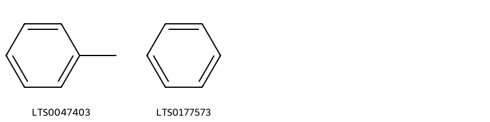
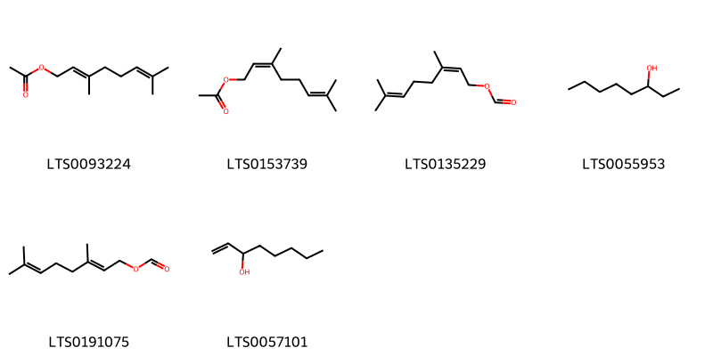
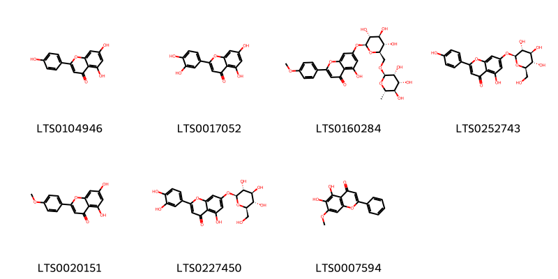
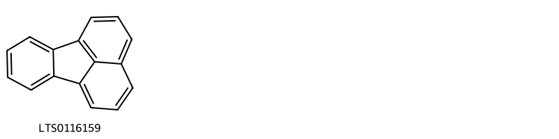
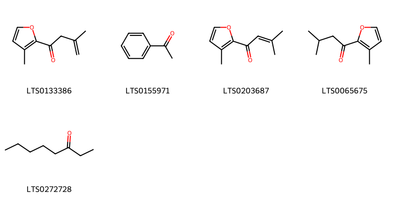
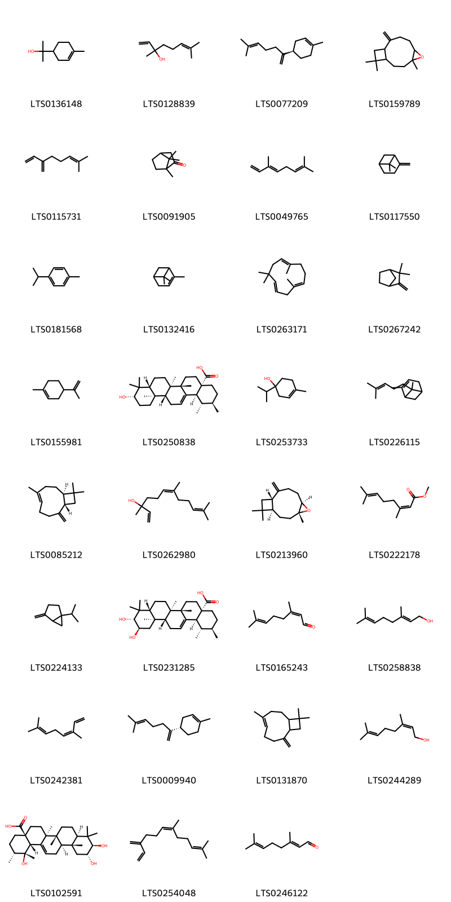
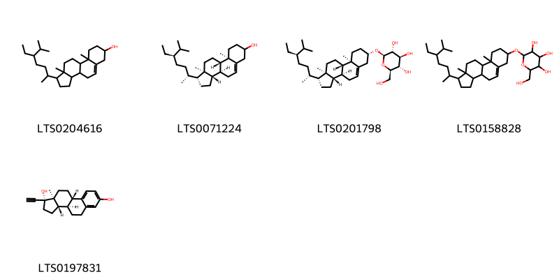

!!! abstract "Tóm tắt"
    Kinh giới
Tên khoa học: Elsholtzia ciliata (Thunb) Hyland
Họ thực vật: Lamiaceae (họ Hoa môi)
Phân bố: Phân bố ở khu vực Châu Á- Bán đảo Malaysia.Thường được trồng khắp nơi để lấy cành lá làm rau ăn, làm thuốc, ở vùng ôn đới châu Á. Tại Việt Nam, cây phân bố khắp các tỉnh và thành phố từ Lào Cai, Cao Bằng, Lạng Sơn, Phú Thọ, Vĩnh Phúc, Hoà Bình, Hà Nội, Ninh Bình và các tỉnh phía Nam.
Kinh nghiệm sử dụng dân gian: Kinh giới được dùng trong nhân dân làm thuốc chữa cảm mạo, phát sốt, nhức đầu, cổ họng sưng đau, nôn mửa, đỏ máu cam, đi lỵ ra máu, băng huyết.
Liều dùng hàng ngày là 6-12g dưới dạng thuốc sắc hay thuốc bột. Trong đông y còn nói thêm những trường hợp biểu hư tự hãn (tự ra mồ hôi) thì không nên dùng.
Một số đơn thuốc dùng trong nhân dân:
Có thể dùng kinh giới phơi khô (20g) sao hơi vàng, thêm 200ml nước sắc còn 100ml uống lúc còn nóng. Đắp chăn cho ra mồ hôi.
Phụ nữ băng huyết, trẻ con người lớn bị máu cam: Kinh giới sao đen 15g, nước 200ml sắc cho uống làm 2-3 lần.
Chữa cảm nóng, ngã ngất: Một nắm kinh giới tươi chừng 50g giã nhỏ, thêm vài miếng gừng tươi, vắt lấy nước cho uống, bã còn lại dùng để đánh dọc sống lưng.
Thuốc cảm: Hoa kinh giới, tía tôi, hương nhu, ngải cứu, hoặc hương, các vị bằng nhau, dùng nước sắc nhiều lần, hợp các nước sắc lại, có đặc thành cao viên bằng hạt ngô. Khi bị cảm uống chứng 7-8 viên thuốc này. Trẻ con chỉ dùng 2 đến 4 viên.
Viên thuốc trên có thể dùng chữa lỵ (dùng nước sắc cây mơ lỏng mà chiêu thuốc)
Chữa cảm cúm:Kinh giới sao vàng tán nhỏ. Khi bị cảm dùng 6-8g bột này
Tác dụng dược lý: Kháng khuẩn, chống viêm,chống oxy hóa, giảm căng thẳng và an thần,
hỗ trợ tiêu hóa
Thành phần hóa học: Trong tinh dầu chứa
Phytosterol: Stigmast-5-en-3-ol, (3β), Stigmast-5-en-3-ol, nerolidol
Flavonoid: Luteolin
Terpenoids: Terpineol, Limonene,Ursolic acid, Alpha-pinene, Humulene, Camphor, Sabinene, Carveol

## Thông tin về thực vật

### Đặc điểm thực vật

Dược liệu **Kinh Giới (Thân Cây Trên Mặt Đất)** từ bộ phận **** từ loài *Elsholtzia ciliata (Thunb) Hyland* thuộc họ Lamiaceae. Cây kinh giới nhân dân ta vẫn trống để ăn làm gia vị và làm thuốc đã được xác định là Elsholtzia cristata. Cây thuộc thảo, cao 0,30-0,45m, thân nhẵn, mọc thẳng đứng. Lá mọc đối, phiến lá thuôn nhọn, dài 5-8cm, rộng 3cm, mép có răng cưa, cuống gây dài 2-3cm. Hoa nhỏ, không cuống, màu tím nhạt, mọc thành vòng ở đầu cành, rất mau. Quả gồm 4 hạch nhỏ, nhẵn, dài 0,5cm. 

!!! info "Phân loại thực vật của *Elsholtzia ciliata*"
    - **Kingdom:** Plantae
    - **Phylum:** Tracheophyta
    - **Order:** Lamiales
    - **Family:** Lamiaceae
    - **Genus:** Elsholtzia
    - **Species:** *Elsholtzia ciliata*

*Tài liệu tham khảo:* "Những cây thuốc và vị thuốc Việt Nam" - Đỗ Tất Lợi

 

### Loài thay thế (Nếu có)

### Phân bố trên thế giới
**Từ vườn thực vật KEW: **: The native range of this species is Temp. Asia to Peninsula Malaysia. It is an annual and grows primarily in the temperate biome.
Native to:
Afghanistan, Altay, Amur, Buryatiya, Cambodia, China North-Central, China South-Central, China Southeast, Chita, East Himalaya, Inner Mongolia, Irkutsk, Japan, Kamchatka, Khabarovsk, Korea, Krasnoyarsk, Kuril Is., Laos, Malaya, Manchuria, Mongolia, Myanmar, Nansei-shoto, Nepal, Primorye, Sakhalin, Taiwan, Thailand, Tibet, Tuva, Vietnam, West Himalaya, West Siberia
Introduced into:
Baltic States, Belarus, Central European Russia, Connecticut, Czechoslovakia, Denmark, East European Russia, Germany, India, Maine, Manitoba, Massachusetts, Minnesota, New Brunswick, New Jersey, New York, North Carolina, North Caucasus, North Dakota, North European Russia, Northwest European Russia, Ontario, Pennsylvania, Poland, Québec, Romania, Sweden, Turkey-in-Europe, Ukraine, Vermont, West Virginia, Wisconsin, Yugoslavia

**Từ CSDL GIBF** Italy, Georgia, Finland, Korea, Republic of, Belarus, China, United States of America, Japan, Lithuania, Chinese Taipei, Ukraine, Estonia, Russian Federation, Czechia

### Phân bố tại Việt Nam
** "Những cây thuốc và vị thuốc Việt Nam" - Đỗ Tất Lợi**: Cây Kinh giới thường được trồng khắp nơi để lấy cành lá làm rau ăn, làm thuốc, ở vùng ôn đới châu Á. Cây phân bố khắp các tỉnh và thành phố từ Lào Cai, Cao Bằng, Lạng Sơn, Phú Thọ, Vĩnh Phúc, Hoà Bình, Hà Nội, Ninh Bình và các tỉnh phía Nam.

**Từ CSDL GIBF**: Không có ghi nhận ở Việt Nam

---

## Thông tin về dược liệu 

### Định danh

!!! info "Thông tin về tên gọi của kinh giới"
    - Dược liệu tiếng Việt: kinh giới
    - Dược liệu tiếng Trung:  ()
    - Dược liệu tiếng Anh: 
    - Dược liệu latin thông dụng: Herba Elsholtziae ciliatae
    - Dược liệu latin kiểu DĐVN: herba elsholtziae ciliatae
    - Dược liệu latin kiểu DĐVN: 
    - Dược liệu latin kiểu thông tư: 
    - Bộ phận dùng:  (Herba)

### Mô tả dược liệu 
- **Theo dược điển Việt nam V:** Đoạn thân hoặc cành dài 30 cm đến 40 cm, thân vuông, có lông mịn. Lá mọc đối hình trứng, dài 3 cm đến 9 cm, rộng 2 cm đến 5 cm, mép có răng cưa, gốc lá dạng nêm, men xuống cuống lá thành cánh hẹp, cuống dài 2 cm đển 3 cm. Cụm hoa là một xim có ở đầu cành, dài 2 cm đến 7 cm, rộng 1,3 cm. Hoa nhỏ, không cuống, màu tím nhạt (khi còn tươi). Quả bế nhỏ, thuôn, nhằn bóng, dài 0,5 cm. Mùi thơm đặc biệt, vị cay.

- **Mô tả dược liệu theo thông tư chế biến dược liệu theo phương pháp cổ truyền:** 

### Chế biến 

- **Chế biến theo dược điển việt nam V**: Lúc trời khô ráo, cắt lấy đoạn cành cỏ nhiều lá và hoa, đem phơi hoặc sấy ở 40 ˚C đến 50 °C đến khô. Bào chế Kinh giới rửa sạch, thái ngắn 2 cm đến 3 cm để dùng sống, có thể sao qua hoặc sao cháy cho bớt thơm cay.

- **Chế biến theo thông tư:** 

--- 

## Thành phần hóa học

- Theo tài liệu của GS. Đỗ Tất Lợi:  (1) Nhóm hóa học:
Nhóm phytosterol: Stigmast-5-en-3-ol, (3β), Stigmast-5-en-3-ol, nerolidol
Flavonoid: Luteolin
Terpenoids: Terpineol, Limonene,Ursolic acid, Alpha-pinene, Humulene, Camphor, Sabinene, Carveol
(2) Trong dược điển Việt Nam không có thông tin định tính và định lượng
Theo Dược điển Đài Loan (Jing jie): pulegone
Thử nghiệm nhận dạng sắc ký lớp mỏng :
1. Dung dịch mẫu: Thêm 1,0 g mẫu dạng bột vào 10 mL methanol, siêu âm trong 15 phút, ly tâm trong 10 phút, lọc, bốc hơi phần dịch trong đến khô và hòa tan phần cặn trong 1 mL methanol.
2. Dung dịch thuốc đối chiếu: Dùng 1,0 g thuốc đối chiếu theo phương pháp tương tự như trên
3. Dung dịch chuẩn tham chiếu: Cân chính xác một lượng pulegone và hòa tan trong ete dầu hỏa (30-60°C) để tạo ra dung dịch chứa 1 µL mg trên ml.
4. Quy trình: Sử dụng silica gel Fas4 làm chất phủ và dung dịch n-hexan và etyl axetat (17:3) làm dung môi hiện ảnh. Thoa 2 ul dung dịch mẫu và dung dịch thuốc đối chiếu và 1 µL dung dịch chuẩn đối chiếu lên bản mỏng. Khi phần trên của dung môi dâng lên khoảng 5-10 cm so với gốc, để khô trong không khí. Phun dung dịch p-Anisaldehyd-H:SO, TS và đun nóng ở 105 C cho đến khi các vết hiện rõ, quan sát dưới ánh sáng khả kiến. Các vết trong sắc ký đồ thu được từ dung dịch mẫu tương ứng về giá trị R và màu với các vết trong sắc ký đồ thu được từ dung dịch thuốc đối chiếu và dung dịch chuẩn đối chiếu
    
- Theo cơ sở dữ liệu lotus: Từ loài *Elsholtzia ciliata* đã phân lập và xác định được 58 hoạt chất thuộc về các nhóm Naphthalenes, Organooxygen compounds, Fatty Acyls, Steroids and steroid derivatives, Prenol lipids, Benzene and substituted derivatives, Phenol ethers, Flavonoids. 

|    | chemicalTaxonomyClassyfireClass     |   smiles_count |
|---:|:------------------------------------|---------------:|
|  0 | Benzene and substituted derivatives |              2 |
|  1 | Fatty Acyls                         |              6 |
|  2 | Flavonoids                          |              7 |
|  3 | Naphthalenes                        |              1 |
|  4 | Organooxygen compounds              |              5 |
|  5 | Phenol ethers                       |              1 |
|  6 | Prenol lipids                       |             31 |
|  7 | Steroids and steroid derivatives    |              5 |

### Nhóm Benzene and substituted derivatives
<figure markdown="span">
    { width=100% }
    <figcaption>Hình ảnh cấu trúc hóa học của 2 hoạt chất thuộc nhóm Benzene and substituted derivatives gồm ['toluene (LTS0047403)', 'benzene (LTS0177573)'].</figcaption>
</figure>
### Nhóm Fatty Acyls
<figure markdown="span">
    { width=100% }
    <figcaption>Hình ảnh cấu trúc hóa học của 6 hoạt chất thuộc nhóm Fatty Acyls gồm ['geranyl acetate (LTS0093224)', 'neryl acetate (LTS0153739)', 'neryl formate (LTS0135229)', '3-octanol (LTS0055953)', 'geranyl formate (LTS0191075)', '1-octen-3-ol (LTS0057101)'].</figcaption>
</figure>
### Nhóm Flavonoids
<figure markdown="span">
    { width=100% }
    <figcaption>Hình ảnh cấu trúc hóa học của 7 hoạt chất thuộc nhóm Flavonoids gồm ['chamomile (LTS0104946)', 'luteolin (LTS0017052)', 'linarin (LTS0160284)', 'apigenin 7-o-β-glucoside (LTS0252743)', 'acacetin (LTS0020151)', 'luteolin 7-o-glucoside (LTS0227450)', 'negletein (LTS0007594)'].</figcaption>
</figure>
### Nhóm Naphthalenes
<figure markdown="span">
    { width=100% }
    <figcaption>Hình ảnh cấu trúc hóa học của 1 hoạt chất thuộc nhóm Naphthalenes gồm ['fluoranthene (LTS0116159)'].</figcaption>
</figure>
### Nhóm Organooxygen compounds
<figure markdown="span">
    { width=100% }
    <figcaption>Hình ảnh cấu trúc hóa học của 5 hoạt chất thuộc nhóm Organooxygen compounds gồm ['3-methyl-1-(3-methylfuran-2-yl)but-3-en-1-one (LTS0133386)', 'acetophenone (LTS0155971)', '3-methyl-1-(3-methylfuran-2-yl)but-2-en-1-one (LTS0203687)', '3-methyl-1-(3-methylfuran-2-yl)butan-1-one (LTS0065675)', '3-octanone (LTS0272728)'].</figcaption>
</figure>
### Nhóm Phenol ethers
<figure markdown="span">
    { width=100% }
    <figcaption>Hình ảnh cấu trúc hóa học của 1 hoạt chất thuộc nhóm Phenol ethers gồm ['tarragon (LTS0245226)'].</figcaption>
</figure>
### Nhóm Prenol lipids
<figure markdown="span">
    { width=100% }
    <figcaption>Hình ảnh cấu trúc hóa học của 31 hoạt chất thuộc nhóm Prenol lipids gồm ['terpineol (LTS0136148)', 'linalool, (+-)- (LTS0128839)', '(r)-β-bisabolene (LTS0077209)', 'caryophyllene oxide (LTS0159789)', 'α-myrcene (LTS0115731)', 'camphor (LTS0091905)', 'trans-β-ocimene (LTS0049765)', 'β-pinene (LTS0117550)', 'cymene (LTS0181568)', 'α pinene (LTS0132416)', 'humulene (LTS0263171)', 'camphene (LTS0267242)', 'limonene,  (LTS0155981)', 'ursolic acid (LTS0250838)', '4-terpineol (LTS0253733)', 'α-bergamotene (LTS0226115)', 'caryophyllene (LTS0085212)', 'nerolidol (LTS0262980)', 'β-caryophyllene oxide (LTS0213960)', 'methyl nerate (LTS0222178)', 'sabinene (LTS0224133)', 'corosolic acid (LTS0231285)', 'neral (LTS0165243)', 'geraniol (LTS0258838)', 'β-ocimene (LTS0242381)', '(-)-β-bisabolene (LTS0009940)', 'caryophyllene (LTS0131870)', 'nerol (LTS0244289)', 'tormentic acid (LTS0102591)', '(z)-β-farnesene (LTS0254048)', 'α-citral (LTS0246122)'].</figcaption>
</figure>
### Nhóm Steroids and steroid derivatives
<figure markdown="span">
    { width=100% }
    <figcaption>Hình ảnh cấu trúc hóa học của 5 hoạt chất thuộc nhóm Steroids and steroid derivatives gồm ['stigmast-5-en-3-ol, (3β)- (LTS0204616)', 'stigmast-5-en-3-ol (LTS0071224)', 'sitogluside (LTS0201798)', '2-{[1-(5-ethyl-6-methylheptan-2-yl)-9a,11a-dimethyl-1h,2h,3h,3ah,3bh,4h,6h,7h,8h,9h,9bh,10h,11h-cyclopenta[a]phenanthren-7-yl]oxy}-6-(hydroxymethyl)oxane-3,4,5-triol (LTS0158828)', 'ethinyl estradiol (LTS0197831)'].</figcaption>
</figure>

---

## Tác dụng dược lý

Theo tài liệu "Những cây thuốc và vị thuốc Việt Nam" - Đỗ Tất Lợi:Kháng khuẩn
Chống viêm
Chống oxy hóa
Giảm căng thẳng và an thần
Hỗ trợ tiêu hóa

Theo tài liệu quốc tế: 

---

## Dược điển Việt Nam V

### Soi bột:
Bột màu nâu đen, mùi thơm, vị cay. Soi kính hiển vi thấy: Mảnh biểu bì lá có nhiều lỗ khí và lông tiết, tế bào bạn của lỗ khí giống tế bào biểu bì, thành tế bào ngoằn ngoèo. Mảnh thân tế bào hình đa giác. Hạt phấn hoa màu vàng. Mành mạch mạng, mạch vạch.nn
<!-- Hình ảnh soi bột sẽ được tự động chèn vào đây sau -->
### Vi phẫu:
Thân: Biểu bì gồm một hàng tế bào hình chữ nhật, có lông che chở đa bào gồm 5 tế bào đến 7 tế bào và lông tiết chân đơn bào đầu đa bào. Mô dày sát biểu bì, ở những chỗ lồi của thân lớp mô dày thường dày hơn. Mô mềm vỏ. Libe cấp 2. Tầng sinh libe-gỗ. Gỗ cấp 2 tạo thành một vòng liên tục. Mô mềm ruột.
<!-- Hình ảnh vi phẫu sẽ được tự động chèn vào đây sau -->
### Định tính

### Định lượng

### Thông tin khác 
- ** Độ ẩm: ** Không quá 12,0 % đối với dược liệu khô (Phụ lục 12.13).

- ** Bảo quản:** Để nơi khô mát, trong bao bì kín.nn
## Dược điển Hồng kong

<!-- PDF sẽ được tự động chèn vào đây sau -->

---

## Y dược học cổ truyền

- **Tên vị thuốc:** 
- **Tính vị quy kinh:** Tân, vi khổ, ôn. Vào các kinh can, phế
- **Công năng chủ trị:** Giải biểu, khu phong, chỉ ngứa, tuyên độc thấu chẩn.
Chủ trị: Cảm mạo, phong hàn, phong nhiệt, phong cấm khẩu, mụn nhọt, dị ứng, sởi mọc không tốt.
Sao đen: Chỉ huyết. Chủ trị: Rong huyết, băng huyết, thổ huyết, đại tiện ra máu.
- **Chú ý:** 
- **Kiêng kỵ:** Biểu hư, tự ra mồ hôi nhiều, không có ngoại cảm, phong hàn không nên dùng.nn

