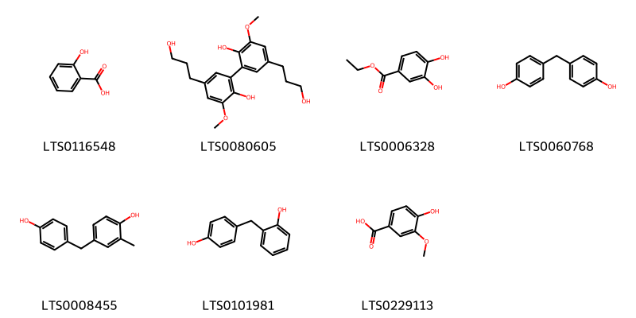
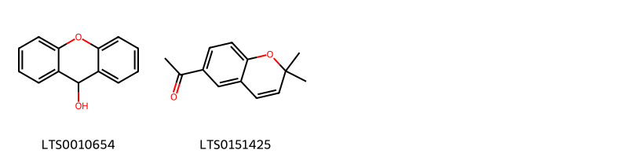
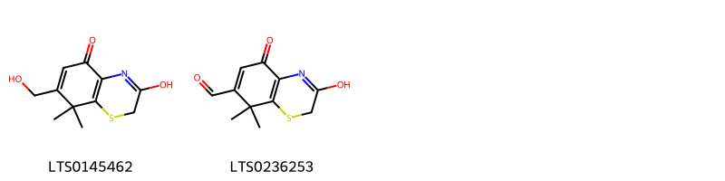
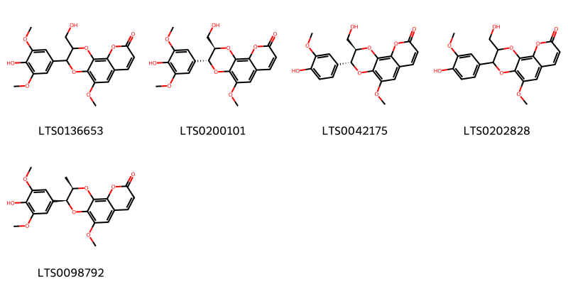
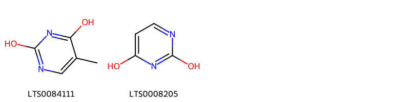
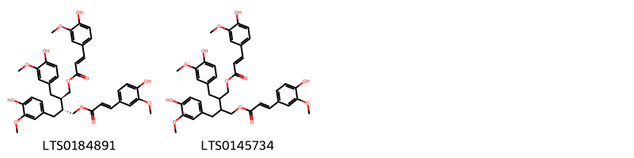
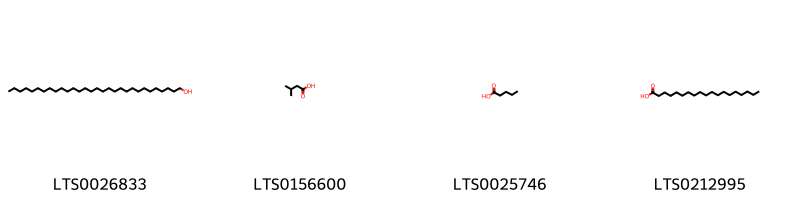
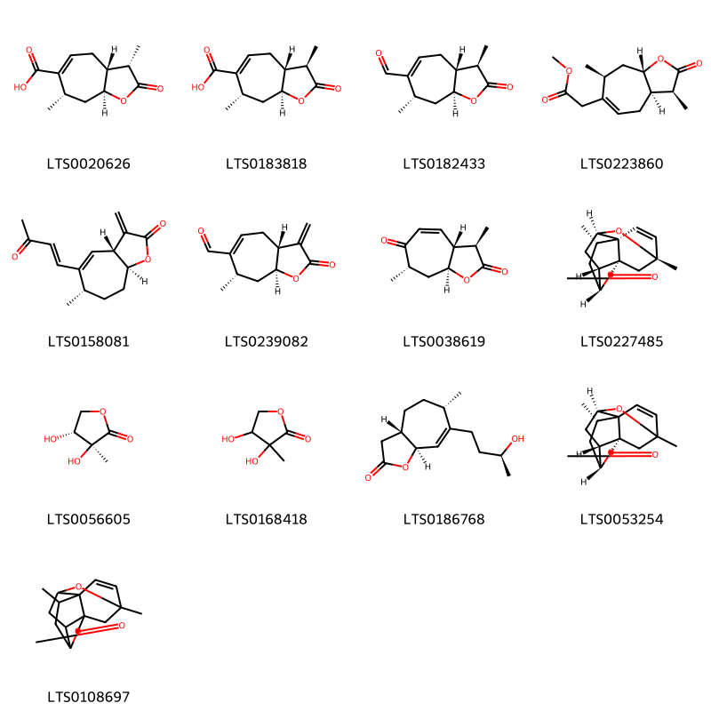
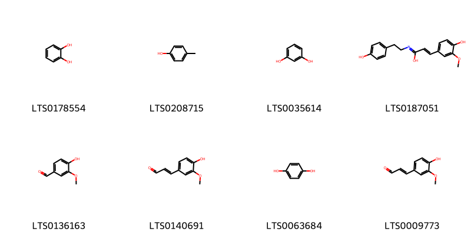
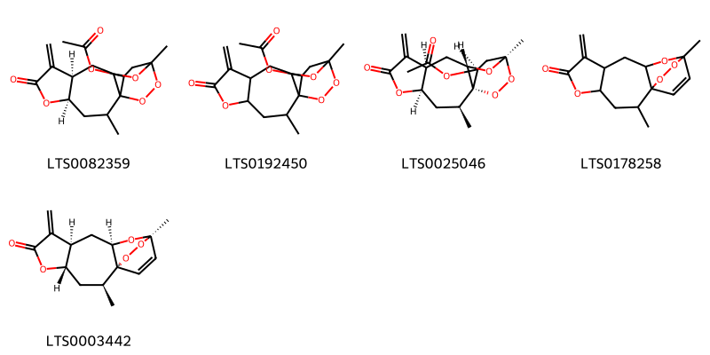

!!! abstract "Tóm tắt"
    Ké đầu ngựa (Quả) có tên khoa học là Xanthium strumarium L. Họ thực vật: Asteraceae (Họ Cúc). Cây nhỏ cao đến 2m, thân có khía rãnh. Lá mọc so le, mép răng cưa, cụm hoa lưỡng tính, quả giả hình thoi có móc. Phân bố trên thế giới: Bản địa nhiều nơi từ châu Á, Âu đến Bắc Phi; di thực đến các khu vực như Nhật Bản, châu Âu, và Đông Nam Á. Còn tại Việt Nam thường mọc hoang khắp nơi, thường gặp ở đất hoang, bờ ruộng, bờ đường. Đây là một vị thuốc thường dùng trong nhân dân Việt Nam, Trung Quốc chữa mụn nhọt, lở loét, bướu cổ, ung thư phát bối (đằng sau lưng), mụn nhọt không đầu, đau răng, đau cổ họng, viêm mũi. Nhân dân ta và Trung Quốc thường chế thành cao thương nhĩ còn gọi là vạn ứng cao. Nhân dân Liên Xô cũ dùng ké đầu ngựa để chữa bướu cổ, các bệnh mụn nhọt, nấm tóc, hắc lào, lỵ và đau răng.Tác dụng dược lý: giải độc, kháng viêm, diệt khuẩn, lợi tiểu, cầm máu, chống ung thư. Thành phần hóa học gồm chất béo (~30%), glucozit (xanthostrumarin), nhựa (3,3%), vitamin C, nhóm sesquiterpen lacton (xanthinin, xanthanola). Carboxy atractylozit (hạ đường huyết, độc), xanthetin, xanthamin (kháng khuẩn).

## Thông tin về thực vật

### Đặc điểm thực vật

Dược liệu **Ké Đầu Ngựa (Qủa)** từ bộ phận **** từ loài *Xanthium strumarium L* thuộc họ Asteraceae. Cây ké đầu ngựa là một cây nhỏ, cao độ 2m thân có khía rãnh. Lá mọc so le, phiến lá hơi 3 cạnh, mép có răng cưa có chỗ khía hơi sâu thành 3-5 thùy, có lông ngắn cứng. Cụm hoa hình đầu có thứ lưỡng tính ở phía trên, có thứ chỉ gồm có hai hoa cái nằm trong hai lá bắc dày và có gai. Quả giả hình thoi, có móc, có thể móc vào lông động vật. Trẻ con vẫn nghịch bỏ vào tóc nhau rất khó gỡ ra (cắt đôi thấy ở trong có hai quả thực). 

!!! info "Phân loại thực vật của *Xanthium strumarium*"
    - **Kingdom:** Plantae
    - **Phylum:** Tracheophyta
    - **Order:** Asterales
    - **Family:** Asteraceae
    - **Genus:** Xanthium
    - **Species:** *Xanthium strumarium*

*Tài liệu tham khảo:* "Những cây thuốc và vị thuốc Việt Nam" - Đỗ Tất Lợi

 

### Loài thay thế (Nếu có)

### Phân bố trên thế giới
**Từ vườn thực vật KEW: **: Bản địa: Afghanistan, Albania, Algeria, Baleares, Bulgaria, Cambodia, China North-Central, China South-Central, China Southeast, Corse, Czechoslovakia, East Aegean Is., East European Russia, East Himalaya, France, Greece, Hainan, Hungary, India, Inner Mongolia, Iran, Italy, Kriti, Krym, Laos, Lebanon-Syria, Manchuria, Mongolia, Morocco, Myanmar, North Caucasus, Pakistan, Palestine, Portugal, Qinghai, Romania, Sardegna, Sicilia, Sinai, South European Russia, Spain, Sri Lanka, Switzerland, Tadzhikistan, Taiwan, Thailand, Tibet, Transcaucasus, Turkey, Turkey-in-Europe, Turkmenistan, Ukraine, Uzbekistan, West Himalaya, Xinjiang, Yugoslavia

Di thực:
Amur, Assam, Austria, Azores, Baltic States, Belarus, Belgium, Central European Russia, Cyprus, Egypt, Germany, Great Britain, Ireland, Japan, Kazakhstan, Khabarovsk, Kirgizstan, Korea, Lesser Sunda Is., Madeira, Magadan, Marquesas, Netherlands, New Guinea, North European Russia, Poland, Primorye, Tunisia.

**Từ CSDL GIBF** nan, Mexico, Uruguay, Brazil, Anguilla, Greece, Australia, Spain, China, United States of America, Botswana, Israel, Germany, India, Canada, South Africa, Argentina, Namibia

### Phân bố tại Việt Nam
** "Những cây thuốc và vị thuốc Việt Nam" - Đỗ Tất Lợi**: Cây ké này mọc hoang ở khắp nơi trong nước ta (đất hoang, bờ ruộng, bờ đường). Hải cả cây trừ bỏ rễ phơi hay sấy khô. Hoặc chỉ hái quả chín rồi phơi hay sấy khô.

**Từ CSDL GIBF**: Không có ghi nhận ở Việt Nam

---

## Thông tin về dược liệu 

### Định danh

!!! info "Thông tin về tên gọi của ké đầu ngựa"
    - Dược liệu tiếng Việt: ké đầu ngựa
    - Dược liệu tiếng Trung:  ()
    - Dược liệu tiếng Anh: 
    - Dược liệu latin thông dụng: Fructus Xanthii strumariinXanthii Fructus
    - Dược liệu latin kiểu DĐVN: fructus xanthii strumarii
    - Dược liệu latin kiểu DĐVN: Xanthii Fructus
    - Dược liệu latin kiểu thông tư: 
    - Bộ phận dùng:  (Fructus)

### Mô tả dược liệu 
- **Theo dược điển Việt nam V:** Quả hình trứng hay hình thoi, dài 1,2 cm đến 1,7 cm, đường kính 0,5 cm đên 0,8 cm. Mặt ngoài màu xám vàng hay xám nâu, có nhiều gai hình móc câu dài 0,2 cm đến 0,3 cm, đầu dưới có sẹo của cuống quả. Vỏ quả giả rất cứng và dai. Cắt ngang thấy có hai ngăn, mỗi ngăn chứa một quả thật (quen gọi là hạt). Quả thật hình thoi có lớp vỏ rất mỏng, màu xám xanh rất dễ bong khi bóc phần vỏ quả giả. Hạt hình thoi, nhọn hai đầu, vỏ hạt màu xám nhạt có nhiều nếp nhăn dọc. Hai lá mầm dày, bao bọc cây mầm, rễ và chồi mầm nhỏ nằm ở phía đầu nhọn của hạt.

- **Mô tả dược liệu theo thông tư chế biến dược liệu theo phương pháp cổ truyền:** 

### Chế biến 

- **Chế biến theo dược điển việt nam V**: Thu hoach vào mùa thu, khi quả già chín, lúc trời khô ráo, hái lấy quả, loại bỏ tạp chất và cuống lá, phơi hoặc sấy nhẹ ở 40 °C đến 45 °C cho đến khô.

- **Chế biến theo thông tư:** 

--- 

## Thành phần hóa học

- Theo tài liệu của GS. Đỗ Tất Lợi:  (1) Nhóm hoá học: Trong quả ké có chừng 30% chất béo, 1,27% một chất glucozit gọi là xanthostrumarin tương ứng với chất datixin, chưa rõ tính chất, 3,3% nhựa và vitamin C. Theo Xocolov (1952) trong quả và cây ké ở Liên Xô đều chứa ancaloit nhưng theo sự phân tích của hệ được viện y học Bắc Kinh (1958) thì trong quả ké có một chất saponin (glucozit), không có ancaloit.
Năm 1974, Khfagy (1974, Planta medica 8,75) đã tách từ trong ké một nhóm sesquitecpen chưa no, lacton có khung xanthonolit: xanthinin (độ chảy 123-124°), xanthanola và izoxanthanola.
- Carboxy atractylozit ở dạng muối có tác dụng hạ đường huyết rất mạnh, có độc tính.
- Xanthetin và xanthamin là những chất có tác dụng kháng khuẩn.
(2) Biomaker của ké đầu ngựa: Acid chlorogenic
    
- Theo cơ sở dữ liệu lotus: Từ loài *Xanthium strumarium* đã phân lập và xác định được 276 hoạt chất thuộc về các nhóm Thiazines, Pyrrolidines, Lactones, Benzopyrans, Coumarins and derivatives, Benzene and substituted derivatives, Indoles and derivatives, Dihydrofurans, Pyrans, Organonitrogen compounds, Benzothiazines, Steroids and steroid derivatives, Phenols, Coumarinolignans, Cinnamic acids and derivatives, Naphthofurans, Organooxygen compounds, Isoflavonoids, Diarylheptanoids, Fatty Acyls, Prenol lipids, Trioxanes, Furanoid lignans, Dibenzylbutane lignans, Benzofurans, Diazines, Unsaturated hydrocarbons, Flavonoids, 2-arylbenzofuran flavonoids. 

|    | chemicalTaxonomyClassyfireClass     |   smiles_count |
|---:|:------------------------------------|---------------:|
|  0 |                                     |              1 |
|  1 | 2-arylbenzofuran flavonoids         |              2 |
|  2 | Benzene and substituted derivatives |              7 |
|  3 | Benzofurans                         |              1 |
|  4 | Benzopyrans                         |              2 |
|  5 | Benzothiazines                      |              2 |
|  6 | Cinnamic acids and derivatives      |             10 |
|  7 | Coumarinolignans                    |              5 |
|  8 | Coumarins and derivatives           |              1 |
|  9 | Diarylheptanoids                    |              1 |
| 10 | Diazines                            |              2 |
| 11 | Dibenzylbutane lignans              |              2 |
| 12 | Dihydrofurans                       |              1 |
| 13 | Fatty Acyls                         |              4 |
| 14 | Flavonoids                          |              2 |
| 15 | Furanoid lignans                    |              4 |
| 16 | Indoles and derivatives             |              2 |
| 17 | Isoflavonoids                       |              3 |
| 18 | Lactones                            |             13 |
| 19 | Naphthofurans                       |              2 |
| 20 | Organonitrogen compounds            |              1 |
| 21 | Organooxygen compounds              |             23 |
| 22 | Phenols                             |              8 |
| 23 | Prenol lipids                       |            138 |
| 24 | Pyrans                              |              4 |
| 25 | Pyrrolidines                        |              1 |
| 26 | Steroids and steroid derivatives    |             15 |
| 27 | Thiazines                           |              1 |
| 28 | Trioxanes                           |              5 |
| 29 | Unsaturated hydrocarbons            |              1 |

### Nhóm 
<figure markdown="span">
    { width=100% }
    <figcaption>Hình ảnh cấu trúc hóa học của 1 hoạt chất thuộc nhóm  gồm ['4-{[1,3-dihydroxy-1-(4-hydroxy-3-methoxyphenyl)propan-2-yl]oxy}-3-methoxybenzoic acid (LTS0168625)'].</figcaption>
</figure>
### Nhóm 2-arylbenzofuran flavonoids
<figure markdown="span">
    { width=100% }
    <figcaption>Hình ảnh cấu trúc hóa học của 2 hoạt chất thuộc nhóm 2-arylbenzofuran flavonoids gồm ['(2r)-2,3-dihydroxy-1-[(2r,3s)-2-(4-hydroxy-3-methoxyphenyl)-3-(hydroxymethyl)-7-methoxy-2,3-dihydro-1-benzofuran-5-yl]propan-1-one (LTS0114905)', '(2s)-2,3-dihydroxy-1-[(2s,3r)-2-(4-hydroxy-3-methoxyphenyl)-3-(hydroxymethyl)-7-methoxy-2,3-dihydro-1-benzofuran-5-yl]propan-1-one (LTS0064774)'].</figcaption>
</figure>
### Nhóm Benzene and substituted derivatives
<figure markdown="span">
    { width=100% }
    <figcaption>Hình ảnh cấu trúc hóa học của 7 hoạt chất thuộc nhóm Benzene and substituted derivatives gồm ['salicyclic acid (LTS0116548)', "5,5'-bis(3-hydroxypropyl)-3,3'-dimethoxy-[1,1'-biphenyl]-2,2'-diol (LTS0080605)", 'ethyl protocatechuate (LTS0006328)', 'bisphenol f (LTS0060768)', '4-[(4-hydroxyphenyl)methyl]-2-methylphenol (LTS0008455)', "2,4'-bisphenol f (LTS0101981)", 'vanillic acid (LTS0229113)'].</figcaption>
</figure>
### Nhóm Benzofurans
<figure markdown="span">
    { width=100% }
    <figcaption>Hình ảnh cấu trúc hóa học của 1 hoạt chất thuộc nhóm Benzofurans gồm ['loliolide (LTS0254454)'].</figcaption>
</figure>
### Nhóm Benzopyrans
<figure markdown="span">
    { width=100% }
    <figcaption>Hình ảnh cấu trúc hóa học của 2 hoạt chất thuộc nhóm Benzopyrans gồm ['xanthydrol (LTS0010654)', '1-(2,2-dimethylchromen-6-yl)ethanone (LTS0151425)'].</figcaption>
</figure>
### Nhóm Benzothiazines
<figure markdown="span">
    { width=100% }
    <figcaption>Hình ảnh cấu trúc hóa học của 2 hoạt chất thuộc nhóm Benzothiazines gồm ['3-hydroxy-7-(hydroxymethyl)-8,8-dimethyl-2h-1,4-benzothiazin-5-one (LTS0145462)', '3-hydroxy-8,8-dimethyl-5-oxo-2h-1,4-benzothiazine-7-carbaldehyde (LTS0236253)'].</figcaption>
</figure>
### Nhóm Cinnamic acids and derivatives
<figure markdown="span">
    { width=100% }
    <figcaption>Hình ảnh cấu trúc hóa học của 10 hoạt chất thuộc nhóm Cinnamic acids and derivatives gồm ['3-(4-hydroxy-3-methoxyphenyl)-n-[2-(4-hydroxyphenyl)ethyl]prop-2-enimidic acid (LTS0240896)', 'ethyl caffeate (LTS0147324)', 'methyl 3-(3,4-dihydroxyphenyl)prop-2-enoate (LTS0080306)', 'ferulic acid (LTS0077328)', '(2r,3r,4s,5s,6r)-4,5-dihydroxy-2-[(3-hydroxy-8,8-dimethyl-5-oxo-2h-1,4-benzothiazin-7-yl)methoxy]-6-(hydroxymethyl)oxan-3-yl (2e)-3-(3,4-dihydroxyphenyl)prop-2-enoate (LTS0155898)', '4,5-dihydroxy-2-[(3-hydroxy-8,8-dimethyl-5-oxo-2h-1,4-benzothiazin-7-yl)methoxy]-6-(hydroxymethyl)oxan-3-yl 3-(3,4-dihydroxyphenyl)prop-2-enoate (LTS0166555)', '3,4-dihydroxycinnamic acid (LTS0128050)', 'methyl caffeate (LTS0163009)', 'caffeic acid (LTS0027481)', 'ferulic acid (LTS0273002)'].</figcaption>
</figure>
### Nhóm Coumarinolignans
<figure markdown="span">
    { width=100% }
    <figcaption>Hình ảnh cấu trúc hóa học của 5 hoạt chất thuộc nhóm Coumarinolignans gồm ['3-(4-hydroxy-3,5-dimethoxyphenyl)-2-(hydroxymethyl)-5-methoxy-2h,3h-[1,4]dioxino[2,3-h]chromen-9-one (LTS0136653)', '(2r,3r)-3-(4-hydroxy-3,5-dimethoxyphenyl)-2-(hydroxymethyl)-5-methoxy-2h,3h-[1,4]dioxino[2,3-h]chromen-9-one (LTS0200101)', 'cleomiscosin a (LTS0042175)', '3-(4-hydroxy-3-methoxyphenyl)-2-(hydroxymethyl)-5-methoxy-2h,3h-[1,4]dioxino[2,3-h]chromen-9-one (LTS0202828)', '(2r,3s)-3-(4-hydroxy-3,5-dimethoxyphenyl)-5-methoxy-2-methyl-2h,3h-[1,4]dioxino[2,3-h]chromen-9-one (LTS0098792)'].</figcaption>
</figure>
### Nhóm Coumarins and derivatives
<figure markdown="span">
    { width=100% }
    <figcaption>Hình ảnh cấu trúc hóa học của 1 hoạt chất thuộc nhóm Coumarins and derivatives gồm ['scopoletin (LTS0193112)'].</figcaption>
</figure>
### Nhóm Diarylheptanoids
<figure markdown="span">
    { width=100% }
    <figcaption>Hình ảnh cấu trúc hóa học của 1 hoạt chất thuộc nhóm Diarylheptanoids gồm ['2,4-bis(4-hydroxybenzyl)phenol (LTS0041151)'].</figcaption>
</figure>
### Nhóm Diazines
<figure markdown="span">
    { width=100% }
    <figcaption>Hình ảnh cấu trúc hóa học của 2 hoạt chất thuộc nhóm Diazines gồm ['5-methylpyrimidine-2,4-dione (LTS0084111)', 'pirod (LTS0008205)'].</figcaption>
</figure>
### Nhóm Dibenzylbutane lignans
<figure markdown="span">
    { width=100% }
    <figcaption>Hình ảnh cấu trúc hóa học của 2 hoạt chất thuộc nhóm Dibenzylbutane lignans gồm ['(2r,3r)-2,3-bis[(4-hydroxy-3-methoxyphenyl)methyl]-4-{[(2e)-3-(4-hydroxy-3-methoxyphenyl)prop-2-enoyl]oxy}butyl (2e)-3-(4-hydroxy-3-methoxyphenyl)prop-2-enoate (LTS0184891)', '2,3-bis[(4-hydroxy-3-methoxyphenyl)methyl]-4-{[3-(4-hydroxy-3-methoxyphenyl)prop-2-enoyl]oxy}butyl 3-(4-hydroxy-3-methoxyphenyl)prop-2-enoate (LTS0145734)'].</figcaption>
</figure>
### Nhóm Dihydrofurans
<figure markdown="span">
    { width=100% }
    <figcaption>Hình ảnh cấu trúc hóa học của 1 hoạt chất thuộc nhóm Dihydrofurans gồm ['(1s,2r,9s,10r,12s)-5,9-dimethyl-13-methylidene-3-oxatetracyclo[7.4.0.0²,⁶.0¹⁰,¹²]tridec-5-ene-4,7-dione (LTS0038485)'].</figcaption>
</figure>
### Nhóm Fatty Acyls
<figure markdown="span">
    { width=100% }
    <figcaption>Hình ảnh cấu trúc hóa học của 4 hoạt chất thuộc nhóm Fatty Acyls gồm ['triacontanol (LTS0026833)', 'isovaleric acid (LTS0156600)', 'n-valeric acid (LTS0025746)', 'nonadecanoic acid (LTS0212995)'].</figcaption>
</figure>
### Nhóm Flavonoids
<figure markdown="span">
    { width=100% }
    <figcaption>Hình ảnh cấu trúc hóa học của 2 hoạt chất thuộc nhóm Flavonoids gồm ['jaceidin (LTS0240034)', 'axillarin (LTS0067813)'].</figcaption>
</figure>
### Nhóm Furanoid lignans
<figure markdown="span">
    { width=100% }
    <figcaption>Hình ảnh cấu trúc hóa học của 4 hoạt chất thuộc nhóm Furanoid lignans gồm ['syringaresinol (LTS0116280)', '(-)-syringaresinol (LTS0076227)', '(-)-pinoresinol (LTS0231245)', 'pinoresinol (LTS0011247)'].</figcaption>
</figure>
### Nhóm Indoles and derivatives
<figure markdown="span">
    { width=100% }
    <figcaption>Hình ảnh cấu trúc hóa học của 2 hoạt chất thuộc nhóm Indoles and derivatives gồm ['indole-3-carboxaldehyde (LTS0137179)', 'indole - 3 carboxylic acid (LTS0271539)'].</figcaption>
</figure>
### Nhóm Isoflavonoids
<figure markdown="span">
    { width=100% }
    <figcaption>Hình ảnh cấu trúc hóa học của 3 hoạt chất thuộc nhóm Isoflavonoids gồm ['formononetin (LTS0082756)', 'ononin (LTS0235553)', 'ononin (LTS0065177)'].</figcaption>
</figure>
### Nhóm Lactones
<figure markdown="span">
    { width=100% }
    <figcaption>Hình ảnh cấu trúc hóa học của 13 hoạt chất thuộc nhóm Lactones gồm ['(3s,3ar,7s,8as)-3,7-dimethyl-2-oxo-3h,3ah,4h,7h,8h,8ah-cyclohepta[b]furan-6-carboxylic acid (LTS0020626)', '(3r,3ar,7s,8as)-3,7-dimethyl-2-oxo-3h,3ah,4h,7h,8h,8ah-cyclohepta[b]furan-6-carboxylic acid (LTS0183818)', '(3r,3ar,7s,8as)-3,7-dimethyl-2-oxo-3h,3ah,4h,7h,8h,8ah-cyclohepta[b]furan-6-carbaldehyde (LTS0182433)', 'methyl 2-[(3s,3ar,7s,8as)-3,7-dimethyl-2-oxo-3h,3ah,4h,7h,8h,8ah-cyclohepta[b]furan-6-yl]acetate (LTS0223860)', '(3ar,6s,8as)-6-methyl-3-methylidene-5-[(1e)-3-oxobut-1-en-1-yl]-3ah,6h,7h,8h,8ah-cyclohepta[b]furan-2-one (LTS0158081)', '(3ar,7s,8as)-7-methyl-3-methylidene-2-oxo-3ah,4h,7h,8h,8ah-cyclohepta[b]furan-6-carbaldehyde (LTS0239082)', '(3r,3ar,7s,8as)-3,7-dimethyl-3h,3ah,7h,8h,8ah-cyclohepta[b]furan-2,6-dione (LTS0038619)', '(1r,4r,6s,7s,10s,12r,14r)-6,10-dimethyl-3,11-dioxapentacyclo[8.4.1.0¹,⁷.0⁴,¹⁴.0⁷,¹²]pentadec-8-en-2-one (LTS0227485)', '(3s,4r)-3,4-dihydroxy-3-methyloxolan-2-one (LTS0056605)', '3,4-dihydroxy-3-methyloxolan-2-one (LTS0168418)', '(3as,6s,8as)-7-[(3s)-3-hydroxybutyl]-6-methyl-3h,3ah,4h,5h,6h,8ah-cyclohepta[b]furan-2-one (LTS0186768)', '(1r,4r,6s,12r,14r)-6,10-dimethyl-3,11-dioxapentacyclo[8.4.1.0¹,⁷.0⁴,¹⁴.0⁷,¹²]pentadec-8-en-2-one (LTS0053254)', '6,10-dimethyl-3,11-dioxapentacyclo[8.4.1.0¹,⁷.0⁴,¹⁴.0⁷,¹²]pentadec-8-en-2-one (LTS0108697)'].</figcaption>
</figure>
### Nhóm Naphthofurans
<figure markdown="span">
    { width=100% }
    <figcaption>Hình ảnh cấu trúc hóa học của 2 hoạt chất thuộc nhóm Naphthofurans gồm ['(1r,2s,9r,10s,12r)-2-hydroxy-4,9-dimethyl-13-methylidene-6-oxatetracyclo[7.4.0.0³,⁷.0¹⁰,¹²]trideca-3,7-dien-5-one (LTS0175664)', '(4as,8as,9as)-9a-hydroxy-3,8a-dimethyl-5-methylidene-3h,4ah,6h,9h-naphtho[2,3-b]furan-2-one (LTS0241588)'].</figcaption>
</figure>
### Nhóm Organonitrogen compounds
<figure markdown="span">
    { width=100% }
    <figcaption>Hình ảnh cấu trúc hóa học của 1 hoạt chất thuộc nhóm Organonitrogen compounds gồm ['choline (LTS0170307)'].</figcaption>
</figure>
### Nhóm Organooxygen compounds
<figure markdown="span">
    { width=100% }
    <figcaption>Hình ảnh cấu trúc hóa học của 23 hoạt chất thuộc nhóm Organooxygen compounds gồm ['chlorogenic acid (LTS0226495)', '(1r,3r,4r,5r)-3,4,5-tris({[(2e)-3-(3,4-dihydroxyphenyl)prop-2-enoyl]oxy})-1-hydroxycyclohexane-1-carboxylic acid (LTS0206459)', '3-hydroxy-8,8-dimethyl-7-({[(2r,3r,4s,5s,6r)-3,4,5-trihydroxy-6-(hydroxymethyl)oxan-2-yl]oxy}methyl)-2h-1,4-benzothiazin-5-one (LTS0192270)', 'cynarine (LTS0039940)', '3,5-bis({[3-(3,4-dihydroxyphenyl)prop-2-enoyl]oxy})-1,4-dihydroxycyclohexane-1-carboxylic acid (LTS0076864)', '(6s)-6-acetyl-2h,3h,4h,6h-cyclopenta[b][1,4]thiazine-5,7-dione (LTS0201757)', '1,3,5-tris({[3-(3,4-dihydroxyphenyl)prop-2-enoyl]oxy})-4-hydroxycyclohexane-1-carboxylic acid (LTS0127488)', '2-{2,9-dimethyl-8,12-dioxatricyclo[7.2.1.0¹,⁷]dodec-10-en-5-yl}prop-2-enoic acid (LTS0206840)', '3-{[3-(3,4-dihydroxyphenyl)prop-2-enoyl]oxy}-1,4,5-trihydroxycyclohexane-1-carboxylic acid (LTS0143901)', '(1s,3r,4r,5r)-1,3-bis({[(2e)-3-(3,4-dihydroxyphenyl)prop-2-enoyl]oxy})-4,5-dihydroxycyclohexane-1-carboxylic acid (LTS0146186)', '1,3-bis({[3-(3,4-dihydroxyphenyl)prop-2-enoyl]oxy})-4,5-dihydroxycyclohexane-1-carboxylic acid (LTS0171981)', '(1s,3r,4s,5r)-1,3,5-tris({[(2e)-3-(3,4-dihydroxyphenyl)prop-2-enoyl]oxy})-4-hydroxycyclohexane-1-carboxylic acid (LTS0171554)', '2,3-dihydroxy-8,8-dimethyl-7-({[3,4,5-trihydroxy-6-(hydroxymethyl)oxan-2-yl]oxy}methyl)-2h-1,4-benzothiazin-5-one (LTS0234733)', 'hydroxymethylfurfural (LTS0233269)', '3,5-dicaffeoylquinic acid (LTS0177751)', 'p-hydroxybenzaldehyde (LTS0259836)', '3-hydroxy-8,8-dimethyl-7-({[3,4,5-trihydroxy-6-(hydroxymethyl)oxan-2-yl]oxy}methyl)-2h-1,4-benzothiazin-5-one (LTS0050164)', '1-{[(2z)-3-(3,4-dihydroxyphenyl)prop-2-enoyl]oxy}-3,4,5-trihydroxycyclohexane-1-carboxylic acid (LTS0057001)', 'neochlorogenic acid (LTS0235816)', '(3r,5r)-4-{[(2e)-3-(3,4-dihydroxyphenyl)prop-2-enoyl]oxy}-1,3,5-trihydroxycyclohexane-1-carboxylic acid (LTS0165819)', '(1r)-1,3-bis({[3-(3,4-dihydroxyphenyl)prop-2-enoyl]oxy})-4,5-dihydroxycyclohexane-1-carboxylic acid (LTS0042414)', '2-[(1s,2s,5r,7s,9r)-2,9-dimethyl-8,12-dioxatricyclo[7.2.1.0¹,⁷]dodec-10-en-5-yl]prop-2-enoic acid (LTS0009310)', '(2r)-2,3-dihydroxy-8,8-dimethyl-7-({[(2r,3r,4s,5s,6r)-3,4,5-trihydroxy-6-(hydroxymethyl)oxan-2-yl]oxy}methyl)-2h-1,4-benzothiazin-5-one (LTS0103628)'].</figcaption>
</figure>
### Nhóm Phenols
<figure markdown="span">
    { width=100% }
    <figcaption>Hình ảnh cấu trúc hóa học của 8 hoạt chất thuộc nhóm Phenols gồm ['catechol (LTS0178554)', 'p-cresol (LTS0208715)', 'resorcinol (LTS0035614)', '(2e)-3-(4-hydroxy-3-methoxyphenyl)-n-[2-(4-hydroxyphenyl)ethyl]prop-2-enimidic acid (LTS0187051)', 'vanillin (LTS0136163)', 'coniferyl aldehyde (LTS0140691)', 'α-hydroquinone (LTS0063684)', 'coniferaldehyde (LTS0009773)'].</figcaption>
</figure>
### Nhóm Prenol lipids
<figure markdown="span">
    { width=100% }
    <figcaption>Hình ảnh cấu trúc hóa học của 138 hoạt chất thuộc nhóm Prenol lipids gồm ['(3ar,7s,8as)-7-methyl-3-methylidene-6-(3-oxobutyl)-3ah,4h,7h,8h,8ah-cyclohepta[b]furan-2-one (LTS0141312)', 'terpineol (LTS0136148)', '(-)-germacrene d (LTS0059194)', 'carvone (LTS0196605)', 'xanthinin (LTS0238718)', '4-ethenyl-1-isopropyl-4-methyl-3-(prop-1-en-2-yl)cyclohex-1-ene (LTS0080134)', 'linalool, (+-)- (LTS0128839)', '2-[5-methyl-4-(3-oxobutyl)cyclohept-3-en-1-yl]prop-2-enoic acid (LTS0175624)', '5-(1-hydroxy-3-oxobutyl)-6-methyl-11-methylidene-4,9-dioxatricyclo[6.3.0.0³,⁵]undecan-10-one (LTS0017496)', '1,1,7-trimethyl-4-methylidene-octahydro-1ah-cyclopropa[e]azulene (LTS0063570)', 'α-myrcene (LTS0115731)', '(1s)-1-[(3ar,7s,8ar)-7-methyl-3-methylidene-2-oxo-3ah,4h,7h,8h,8ah-cyclohepta[b]furan-6-yl]-3-oxobutyl acetate (LTS0114255)', 'β-selinene (LTS0096341)', '(1s,5r,7s,10r)-7-isopropyl-4,10-dimethyltricyclo[4.4.0.0¹,⁵]dec-3-ene (LTS0064715)', '4-hydroxy-4-{7-methyl-3-methylidene-2-oxo-3ah,4h,7h,8h,8ah-cyclohepta[b]furan-6-yl}butan-2-yl acetate (LTS0191486)', 'β-pinene (LTS0117550)', '5-methyl-3,8-dimethylidene-3ah,4h,4ah,7h,7ah,9h,9ah-azuleno[6,5-b]furan-2-one (LTS0184665)', 'cymene (LTS0181568)', '7-methyl-3-methylidene-6-(3-oxobutyl)-3ah,4h,7h,8h,8ah-cyclohepta[b]furan-2-one (LTS0197698)', 'nerolidol (LTS0197738)', 'α pinene (LTS0132416)', 'humulene (LTS0263171)', '4-isopropyl-1,6-dimethyl-2,3,4,4a,7,8-hexahydronaphthalene (LTS0270743)', '(3r,6e)-nerolidol (LTS0145065)', '3-hydroxy-1-{7-methyl-3-methylidene-2-oxo-3ah,4h,7h,8h,8ah-cyclohepta[b]furan-6-yl}butyl acetate (LTS0146483)', 'citronella (LTS0151257)', 'camphene (LTS0267242)', 'limonene,  (LTS0155981)', 'xanthumin (LTS0138457)', 'elemene (LTS0090837)', '2-[(1r,5s)-5-methyl-4-(3-oxobutyl)cyclohept-3-en-1-yl]prop-2-enoic acid (LTS0097460)', '6-(3-hydroxybutyl)-7-methyl-3-methylidene-3ah,4h,7h,8h,8ah-cyclohepta[b]furan-2-one (LTS0109217)', '(3ar,7s,8ar)-6-[(1s)-1-hydroxy-3-oxobutyl]-7-methyl-3-methylidene-3ah,4h,7h,8h,8ah-cyclohepta[b]furan-2-one (LTS0142284)', 'borneol (LTS0264960)', '7-(3-hydroxybutyl)-6-methyl-3-methylidene-3ah,4h,5h,6h,8ah-cyclohepta[b]furan-2-one (LTS0116853)', 'xanthatin (LTS0163722)', '(3r,3ar,4ar,7ar,9ar)-3,5-dimethyl-8-methylidene-3h,3ah,4h,4ah,7h,7ah,9h,9ah-azuleno[6,5-b]furan-2-one (LTS0183640)', 'caryophyllene (LTS0085212)', 'thujone (LTS0197087)', 'bornyl acetate (LTS0060565)', '(1z,6z,8s)-8-isopropyl-1-methyl-5-methylidenecyclodeca-1,6-diene (LTS0065195)', '(1s)-1-[(3ar,7s,8as)-7-methyl-3-methylidene-2-oxo-3ah,4h,7h,8h,8ah-cyclohepta[b]furan-6-yl]-3-oxobutyl acetate (LTS0230675)', '6-(1-hydroxy-3-oxobutyl)-7-methyl-3-methylidene-3ah,4h,7h,8h,8ah-cyclohepta[b]furan-2-one (LTS0233134)', '(3ar,7s,8as)-6-[(3s)-3-hydroxybutyl]-7-methyl-3-methylidene-3ah,4h,7h,8h,8ah-cyclohepta[b]furan-2-one (LTS0159918)', 'thymol (LTS0168527)', '(1as,4as,7as,7br)-1,1,7-trimethyl-4-methylidene-octahydro-1ah-cyclopropa[e]azulene (LTS0160636)', '(3ar,4ar,7ar,9ar)-5-methyl-3,8-dimethylidene-3ah,4h,4ah,7h,7ah,9h,9ah-azuleno[6,5-b]furan-2-one (LTS0023629)', '(3as,6s,8ar)-7-[(3s)-3-hydroxybutyl]-6-methyl-3-methylidene-3ah,4h,5h,6h,8ah-cyclohepta[b]furan-2-one (LTS0040860)', '(2r,4r)-4-[(3ar,7s,8as)-7-methyl-3-methylidene-2-oxo-3ah,4h,7h,8h,8ah-cyclohepta[b]furan-6-yl]-4-hydroxybutan-2-yl acetate (LTS0156024)', '(1r,3r)-1-[(3ar,7s,8as)-7-methyl-3-methylidene-2-oxo-3ah,4h,7h,8h,8ah-cyclohepta[b]furan-6-yl]-3-hydroxybutyl acetate (LTS0259201)', '(1s,3r)-1-[(3ar,7s,8as)-7-methyl-3-methylidene-2-oxo-3ah,4h,7h,8h,8ah-cyclohepta[b]furan-6-yl]-3-hydroxybutyl acetate (LTS0183004)', '(2r,4s)-4-[(3ar,7s,8as)-7-methyl-3-methylidene-2-oxo-3ah,4h,7h,8h,8ah-cyclohepta[b]furan-6-yl]-4-hydroxybutan-2-yl acetate (LTS0009452)', '(2s,4r)-1,7,7-trimethylbicyclo[2.2.1]heptan-2-ol (LTS0010050)', 'β-cadinene (LTS0049088)', '(1r,3r,5r,6s,8r)-5-[(1s)-1-hydroxy-3-oxobutyl]-6-methyl-11-methylidene-4,9-dioxatricyclo[6.3.0.0³,⁵]undecan-10-one (LTS0250162)', 'caryophyllene (LTS0131870)', 'carvacrol (LTS0012882)', '(1r)-1-[(3as,7r,8ar)-7-methyl-3-methylidene-2-oxo-3ah,4h,7h,8h,8ah-cyclohepta[b]furan-6-yl]-3-oxobutyl acetate (LTS0012167)', 'delta-cadinene (LTS0019321)', 'citronellol, (+-)- (LTS0090925)', 'carvone, (+)- (LTS0027671)', '(-)-α-cubebene (LTS0042045)', '7-methyl-3-methylidene-6-(3-oxobut-1-en-1-yl)-3ah,4h,7h,8h,8ah-cyclohepta[b]furan-2-one (LTS0040201)', "(4ar,5r,6r,8as,9as)-6-hydroxy-3,8a-dimethyl-4a,6,9,9a-tetrahydro-4h-spiro[naphtho[2,3-b]furan-5,2'-oxiran]-2-one (LTS0123671)", '(3r,3ar,7s,8as)-3,7-dimethyl-6-[(1e)-3-oxobut-1-en-1-yl]-3h,3ah,4h,7h,8h,8ah-cyclohepta[b]furan-2-one (LTS0097137)', 'phaseic acid (LTS0185710)', '(3s,3ar,7s,8as)-3,7-dimethyl-6-[(1e)-3-oxobut-1-en-1-yl]-3h,3ah,4h,7h,8h,8ah-cyclohepta[b]furan-2-one (LTS0123850)', '(3r,3ar,7s,8as)-3,7-dimethyl-6-(3-oxobutyl)-3h,3ah,4h,7h,8h,8ah-cyclohepta[b]furan-2-one (LTS0221707)', '(2z)-5-[(1r,3s,5r,8s)-3,8-dihydroxy-1,5-dimethyl-6-oxabicyclo[3.2.1]octan-8-yl]-3-methylpenta-2,4-dienoic acid (LTS0024605)', 'dihydrophaseic acid (LTS0019935)', '(3r,3ar,7s,8ar)-6-(3-hydroxybutyl)-3,7-dimethyl-3h,3ah,4h,7h,8h,8ah-cyclohepta[b]furan-2-one (LTS0265901)', 'phaseic acid (LTS0028609)', '(3as,6s,8ar)-6-methyl-3-methylidene-7-(3-oxobutyl)-3ah,4h,5h,6h,8ah-cyclohepta[b]furan-2-one (LTS0089030)', 'vulgarin (LTS0062007)', "12'-acetyl-10'-hydroxy-7,9'-dimethyl-4'-methylidene-6-(3-oxobut-1-en-1-yl)-4,7,8,8a-tetrahydro-3ah-6'-oxaspiro[cyclohepta[b]furan-3,13'-tricyclo[8.4.0.0³,⁷]tetradecan]-11'-ene-2,5'-dione (LTS0076700)", '(3ar,7s,8ar)-6-(1-hydroxy-3-oxobutyl)-7-methyl-3-methylidene-3ah,4h,7h,8h,8ah-cyclohepta[b]furan-2-one (LTS0215787)', '3,7-dimethyl-6-(3-oxobut-1-en-1-yl)-3h,3ah,4h,7h,8h,8ah-cyclohepta[b]furan-2-one (LTS0207893)', '(1r,3r,5r,6s,8r,11s)-6,11-dimethyl-5-[(1e)-3-oxobut-1-en-1-yl]-4,9-dioxatricyclo[6.3.0.0³,⁵]undecan-10-one (LTS0066365)', 'judaicin (LTS0070208)', '4,8-dihydroxy-7-methyl-3-methylidene-6-(3-oxobut-1-en-1-yl)-3ah,4h,7h,8h,8ah-cyclohepta[b]furan-2-one (LTS0070493)', "(1's,3r,3'r,3as,7r,7'r,8as,9's,10's)-12'-acetyl-10'-hydroxy-7,9'-dimethyl-4'-methylidene-6-(3-oxobutyl)-4,7,8,8a-tetrahydro-3ah-6'-oxaspiro[cyclohepta[b]furan-3,13'-tricyclo[8.4.0.0³,⁷]tetradecan]-11'-ene-2,5'-dione (LTS0222272)", '2-(4a,8-dimethyl-7-oxo-1,2,3,4,5,6-hexahydronaphthalen-2-yl)prop-2-enoic acid (LTS0077588)', "12'-acetyl-10'-hydroxy-7,9'-dimethyl-4'-methylidene-6-(3-oxobutyl)-4,7,8,8a-tetrahydro-3ah-6'-oxaspiro[cyclohepta[b]furan-3,13'-tricyclo[8.4.0.0³,⁷]tetradecan]-11'-ene-2,5'-dione (LTS0082663)", '(1r,3s)-1-[(3ar,7s,8as)-7-methyl-3-methylidene-2-oxo-3ah,4h,7h,8h,8ah-cyclohepta[b]furan-6-yl]-3-hydroxybutyl acetate (LTS0070246)', '(3as,4s,7r,8r,8as)-4,8-dihydroxy-7-methyl-3-methylidene-6-[(1e)-3-oxobut-1-en-1-yl]-3ah,4h,7h,8h,8ah-cyclohepta[b]furan-2-one (LTS0079148)', '7-methyl-3-methylidene-6-[(1z)-3-oxobut-1-en-1-yl]-3ah,4h,7h,8h,8ah-cyclohepta[b]furan-2-one (LTS0072745)', '8a-methyl-3,5-dimethylidene-octahydronaphtho[2,3-b]furan-2-one (LTS0057674)', '(3ar,8as)-7-methyl-3-methylidene-6-(3-oxobutyl)-3ah,4h,7h,8h,8ah-cyclohepta[b]furan-2-one (LTS0187939)', '3-hydroxy-3-(hydroxymethyl)-7-methyl-6-(3-oxobut-1-en-1-yl)-3ah,4h,7h,8h,8ah-cyclohepta[b]furan-2-one (LTS0144738)', '1-[(3ar,7s,8ar)-7-methyl-3-methylidene-2-oxo-3ah,4h,7h,8h,8ah-cyclohepta[b]furan-6-yl]-3-oxobutyl acetate (LTS0029291)', '8-isopropyl-1-methyl-5-methylidenecyclodeca-1,6-diene (LTS0018398)', '6-methyl-11-methylidene-5-(3-oxobut-1-en-1-yl)-4,9-dioxatricyclo[6.3.0.0³,⁵]undecan-10-one (LTS0072732)', 'abscisic acid,  (LTS0140631)', '(2e,7s,11s)-3,7,11,15-tetramethylhexadec-2-en-1-ol (LTS0207261)', '2-[(2r,4ar,5r,8as)-5-hydroxy-4a-methyl-8-methylidene-octahydronaphthalen-2-yl]prop-2-enoic acid (LTS0051024)', '(1r,3r,5r,6s,8s)-6-methyl-11-methylidene-5-[(1e)-3-oxobut-1-en-1-yl]-4,9-dioxatricyclo[6.3.0.0³,⁵]undecan-10-one (LTS0205404)', '4a-methyl-1-methylidene-7-(prop-1-en-2-yl)-octahydronaphthalene (LTS0165615)', '(3s,3as,7s,8as)-3-hydroxy-3-(hydroxymethyl)-7-methyl-6-[(1e)-3-oxobut-1-en-1-yl]-3ah,4h,7h,8h,8ah-cyclohepta[b]furan-2-one (LTS0150658)', '(3s,3as,5ar,9r,9as)-9-hydroxy-3,5a,9-trimethyl-3h,3ah,4h,5h,9ah,9bh-naphtho[1,2-b]furan-2,6-dione (LTS0139835)', "(1'r,3r,3'r,3ar,7r,7'r,8as,9's,10'r)-12'-acetyl-10'-hydroxy-7,9'-dimethyl-4'-methylidene-6-[(1e)-3-oxobut-1-en-1-yl]-4,7,8,8a-tetrahydro-3ah-6',14'-dioxaspiro[cyclohepta[b]furan-3,13'-tricyclo[8.4.0.0³,⁷]tetradecan]-11'-ene-2,5'-dione (LTS0246739)", "(1's,3r,3'r,3as,7r,7'r,8as,9's,10's)-12'-acetyl-10'-hydroxy-7,9'-dimethyl-4'-methylidene-6-[(1e)-3-oxobut-1-en-1-yl]-4,7,8,8a-tetrahydro-3ah-6'-oxaspiro[cyclohepta[b]furan-3,13'-tricyclo[8.4.0.0³,⁷]tetradecan]-11'-ene-2,5'-dione (LTS0099699)", '2-[(2r,4ar,5r,8ar)-5-hydroxy-4a-methyl-8-methylidene-octahydronaphthalen-2-yl]prop-2-enoic acid (LTS0240768)', '2-[(2r,4as)-4a,8-dimethyl-7-oxo-1,2,3,4,5,6-hexahydronaphthalen-2-yl]prop-2-enoic acid (LTS0240551)', '(3as,4s)-7-isopropyl-1,4-dimethyl-2,3,3a,4,5,6-hexahydroazulene (LTS0118636)', '8-epi-xanthatin (LTS0254261)', '(3ar,7s,8ar)-6-[(1r)-1-hydroxy-3-oxobutyl]-7-methyl-3-methylidene-3ah,4h,7h,8h,8ah-cyclohepta[b]furan-2-one (LTS0264730)', '2-[(3s,3as,8s,8as)-3-hydroxy-3a,8-dimethyl-octahydro-1h-azulen-5-yl]prop-2-enoic acid (LTS0258155)', '(1s,4r,9r,10s,13r)-15-hydroxy-7-{[6-(hydroxymethyl)-3-[(3-methylbutanoyl)oxy]-4,5-bis(sulfooxy)oxan-2-yl]oxy}-9-methyl-14-methylidenetetracyclo[11.2.1.0¹,¹⁰.0⁴,⁹]hexadecane-5,5-dicarboxylic acid (LTS0119688)', "12'-acetyl-10'-hydroxy-7,9'-dimethyl-4'-methylidene-6-[(1e)-3-oxobut-1-en-1-yl]-4,7,8,8a-tetrahydro-3ah-6',14'-dioxaspiro[cyclohepta[b]furan-3,13'-tricyclo[8.4.0.0³,⁷]tetradecan]-11'-ene-2,5'-dione (LTS0107160)", '7-isopropyl-1,4-dimethyl-2,3,3a,4,5,6-hexahydroazulene (LTS0250551)', '2-[(2r,4ar,5r)-5-hydroxy-4a,8-dimethyl-2,3,4,5,6,8a-hexahydro-1h-naphthalen-2-yl]prop-2-enoic acid (LTS0173794)', '2-(5-hydroxy-4a-methyl-8-methylidene-octahydronaphthalen-2-yl)prop-2-enoic acid (LTS0106792)', '2-[(1r,5s)-5-methyl-4-[(1e)-3-oxobut-1-en-1-yl]cyclohept-3-en-1-yl]prop-2-enoic acid (LTS0207507)', '2-[5-methyl-4-(3-oxobut-1-en-1-yl)cyclohept-3-en-1-yl]prop-2-enoic acid (LTS0269779)', "(1r,1'r,3r,3'r,5r,6r,7'r,8s,9's,10'r,11r)-12'-acetyl-10'-hydroxy-6,9'-dimethyl-4'-methylidene-5-[(1e)-3-oxobut-1-en-1-yl]-4,6',9,14'-tetraoxaspiro[tricyclo[6.3.0.0³,⁵]undecane-11,13'-tricyclo[8.4.0.0³,⁷]tetradecan]-11'-ene-5',10-dione (LTS0232766)", '(4s)-4-hydroxy-4-(3-hydroxybut-1-en-1-yl)-3,5,5-trimethylcyclohex-2-en-1-one (LTS0225700)', '(3ar,5s,6s,7as)-6-ethenyl-6-methyl-3-methylidene-5-(prop-1-en-2-yl)-tetrahydro-3ah-1-benzofuran-2-one (LTS0232182)', "(1s,1's,3r,3'r,5r,6r,7'r,8s,9's,10's,11r)-12'-acetyl-10'-hydroxy-6,9'-dimethyl-4'-methylidene-5-[(1e)-3-oxobut-1-en-1-yl]-4,6',9-trioxaspiro[tricyclo[6.3.0.0³,⁵]undecane-11,13'-tricyclo[8.4.0.0³,⁷]tetradecan]-11'-ene-5',10-dione (LTS0032120)", 'isoalantolactone (LTS0028543)', '2-(3-hydroxy-3a,8-dimethyl-octahydro-1h-azulen-5-yl)prop-2-enoic acid (LTS0062626)', '3,7,11,15-tetramethylhexadec-2-en-1-ol (LTS0056933)', '(1r,3r,5r,6s,8r)-6-methyl-11-methylidene-5-[(1e)-3-oxobut-1-en-1-yl]-4,9-dioxatricyclo[6.3.0.0³,⁵]undecan-10-one (LTS0040992)', '6,11-dimethyl-5-(3-oxobut-1-en-1-yl)-4,9-dioxatricyclo[6.3.0.0³,⁵]undecan-10-one (LTS0159548)', '(3ar,5s,6s,7ar)-6-ethenyl-6-methyl-3-methylidene-5-(prop-1-en-2-yl)-tetrahydro-3ah-1-benzofuran-2-one (LTS0267758)', "12'-acetyl-10'-hydroxy-6,9'-dimethyl-4'-methylidene-5-[(1e)-3-oxobut-1-en-1-yl]-4,6',9,14'-tetraoxaspiro[tricyclo[6.3.0.0³,⁵]undecane-11,13'-tricyclo[8.4.0.0³,⁷]tetradecan]-11'-ene-5',10-dione (LTS0006616)", '(6s,9r)-vomifoliol (LTS0052786)', '(1r,3s,5s,6s,8s)-6-methyl-11-methylidene-5-[(1e)-3-oxobut-1-en-1-yl]-4,9-dioxatricyclo[6.3.0.0³,⁵]undecan-10-one (LTS0029703)', 'tomentosin (LTS0274135)', '(+)-germacrene d (LTS0068732)', '2-(5-hydroxy-4a,8-dimethyl-2,3,4,5,6,8a-hexahydro-1h-naphthalen-2-yl)prop-2-enoic acid (LTS0004425)', "12'-acetyl-10'-hydroxy-6,9'-dimethyl-4'-methylidene-5-(3-oxobut-1-en-1-yl)-4,6',9-trioxaspiro[tricyclo[6.3.0.0³,⁵]undecane-11,13'-tricyclo[8.4.0.0³,⁷]tetradecan]-11'-ene-5',10-dione (LTS0013089)", '2-[(3s,3as,5r,8s,8as)-3-hydroxy-3a,8-dimethyl-octahydro-1h-azulen-5-yl]prop-2-enoic acid (LTS0026298)', '(1s)-1-[(3as,7r,8as)-7-methyl-3-methylidene-2-oxo-3ah,4h,7h,8h,8ah-cyclohepta[b]furan-6-yl]-3-oxobutyl acetate (LTS0215849)', '2-[(2r,4ar,5r,8as)-5-hydroxy-4a,8-dimethyl-2,3,4,5,6,8a-hexahydro-1h-naphthalen-2-yl]prop-2-enoic acid (LTS0020654)', '(4e)-5-[(1s)-1-hydroxy-2,6,6-trimethyl-4-oxocyclohex-2-en-1-yl]-3-methylpenta-2,4-dienoic acid (LTS0268716)', "(1'r,3r,3'r,3ar,7r,7'r,8as,9's,10'r)-12'-acetyl-10'-hydroxy-7,9'-dimethyl-4'-methylidene-6-(3-oxobutyl)-4,7,8,8a-tetrahydro-3ah-6',14'-dioxaspiro[cyclohepta[b]furan-3,13'-tricyclo[8.4.0.0³,⁷]tetradecan]-11'-ene-2,5'-dione (LTS0028402)", '(3ar,7s,8as)-6-[(1r)-1-hydroxy-3-oxobutyl]-7-methyl-3-methylidene-3ah,4h,7h,8h,8ah-cyclohepta[b]furan-2-one (LTS0114057)', '6-ethenyl-6-methyl-3-methylidene-5-(prop-1-en-2-yl)-tetrahydro-3ah-1-benzofuran-2-one (LTS0273446)'].</figcaption>
</figure>
### Nhóm Pyrans
<figure markdown="span">
    { width=100% }
    <figcaption>Hình ảnh cấu trúc hóa học của 4 hoạt chất thuộc nhóm Pyrans gồm ['(12s)-9-hydroxy-12-[(1e,3e)-6-hydroxyhexa-1,3-dien-1-yl]-4-methyl-11-oxa-3-thiatricyclo[6.4.0.0²,⁶]dodeca-1,4,6,8-tetraen-10-one (LTS0223335)', '9-hydroxy-12-[(1z,3z)-6-hydroxyhexa-1,3-dien-1-yl]-4-methyl-11-oxa-3-thiatricyclo[6.4.0.0²,⁶]dodeca-1,4,6,8-tetraen-10-one (LTS0154240)', '9-hydroxy-12-[(1z,3e)-6-hydroxyhexa-1,3-dien-1-yl]-4-methyl-11-oxa-3-thiatricyclo[6.4.0.0²,⁶]dodeca-1,4,6,8-tetraen-10-one (LTS0245740)', '9-hydroxy-12-(6-hydroxyhexa-1,3-dien-1-yl)-4-methyl-11-oxa-3-thiatricyclo[6.4.0.0²,⁶]dodeca-1,4,6,8-tetraen-10-one (LTS0194981)'].</figcaption>
</figure>
### Nhóm Pyrrolidines
<figure markdown="span">
    { width=100% }
    <figcaption>Hình ảnh cấu trúc hóa học của 1 hoạt chất thuộc nhóm Pyrrolidines gồm ['succinimide (LTS0005145)'].</figcaption>
</figure>
### Nhóm Steroids and steroid derivatives
<figure markdown="span">
    { width=100% }
    <figcaption>Hình ảnh cấu trúc hóa học của 15 hoạt chất thuộc nhóm Steroids and steroid derivatives gồm ['stigmast-5-en-3-ol, (3β)- (LTS0204616)', '(1r,3ar,3br,7s,9ar,9br,11ar)-1-[(2r,5r)-5-ethyl-6-methylheptan-2-yl]-9a,11a-dimethyl-1h,2h,3h,3ah,3bh,4h,6h,7h,8h,9h,9bh,10h,11h-cyclopenta[a]phenanthren-7-ol (LTS0129695)', '5-(5,6-dimethylhept-3-en-2-yl)-6,10-dimethyl-16,17-dioxapentacyclo[13.2.2.0¹,⁹.0²,⁶.0¹⁰,¹⁵]nonadec-18-en-13-ol (LTS0211330)', 'sitosterol (LTS0168132)', 'sitogluside (LTS0201798)', '2-{[1-(5-ethyl-6-methylheptan-2-yl)-9a,11a-dimethyl-1h,2h,3h,3ah,3bh,4h,6h,7h,8h,9h,9bh,10h,11h-cyclopenta[a]phenanthren-7-yl]oxy}-6-(hydroxymethyl)oxane-3,4,5-triol (LTS0158828)', 'ergosterol peroxide (LTS0264710)', '1-(5-ethyl-6-methylheptan-2-yl)-9a,11a-dimethyl-1h,2h,3h,3ah,3bh,4h,5h,8h,9h,9bh,10h,11h-cyclopenta[a]phenanthren-7-one (LTS0212002)', '1-(5-ethyl-6-methylheptan-2-yl)-5-hydroxy-9a,11a-dimethyl-1h,2h,3h,3ah,3bh,4h,5h,8h,9h,9bh,10h,11h-cyclopenta[a]phenanthren-7-one (LTS0210386)', 'β-sitostenone (LTS0049492)', '(1r,3as,3bs,5r,9ar,9bs,11ar)-1-[(2r,5r)-5-ethyl-6-methylheptan-2-yl]-5-hydroxy-9a,11a-dimethyl-1h,2h,3h,3ah,3bh,4h,5h,8h,9h,9bh,10h,11h-cyclopenta[a]phenanthren-7-one (LTS0044529)', '(1r,3as,3bs,7s,9ar,9bs,11ar)-1-[(2s,3e,5s)-5-ethyl-6-methylhept-3-en-2-yl]-9a,11a-dimethyl-1h,2h,3h,3ah,3bh,4h,6h,7h,8h,9h,9bh,10h,11h-cyclopenta[a]phenanthren-7-ol (LTS0169213)', 'campesterol (LTS0029429)', 'phytosterol (LTS0029311)', 'stigmasterol (LTS0024262)'].</figcaption>
</figure>
### Nhóm Thiazines
<figure markdown="span">
    { width=100% }
    <figcaption>Hình ảnh cấu trúc hóa học của 1 hoạt chất thuộc nhóm Thiazines gồm ['2h-1λ⁶,2-thiazine-1,1-dione (LTS0026668)'].</figcaption>
</figure>
### Nhóm Trioxanes
<figure markdown="span">
    { width=100% }
    <figcaption>Hình ảnh cấu trúc hóa học của 5 hoạt chất thuộc nhóm Trioxanes gồm ['(4r,8r)-2,12-dimethyl-7-methylidene-6-oxo-5,11,13,14-tetraoxatetracyclo[10.2.2.0¹,¹⁰.0⁴,⁸]hexadecan-15-yl acetate (LTS0082359)', '2,12-dimethyl-7-methylidene-6-oxo-5,11,13,14-tetraoxatetracyclo[10.2.2.0¹,¹⁰.0⁴,⁸]hexadecan-15-yl acetate (LTS0192450)', '(1r,2s,4r,8r,10s,12r,15s)-2,12-dimethyl-7-methylidene-6-oxo-5,11,13,14-tetraoxatetracyclo[10.2.2.0¹,¹⁰.0⁴,⁸]hexadecan-15-yl acetate (LTS0025046)', '2,12-dimethyl-7-methylidene-5,11,13,14-tetraoxatetracyclo[10.2.2.0¹,¹⁰.0⁴,⁸]hexadec-15-en-6-one (LTS0178258)', '(1s,2s,4s,8r,10r,12r)-2,12-dimethyl-7-methylidene-5,11,13,14-tetraoxatetracyclo[10.2.2.0¹,¹⁰.0⁴,⁸]hexadec-15-en-6-one (LTS0003442)'].</figcaption>
</figure>
### Nhóm Unsaturated hydrocarbons
<figure markdown="span">
    { width=100% }
    <figcaption>Hình ảnh cấu trúc hóa học của 1 hoạt chất thuộc nhóm Unsaturated hydrocarbons gồm ['tridec-1-en-3,5,7,9,11-pentayne (LTS0085389)'].</figcaption>
</figure>

---

## Tác dụng dược lý

Theo tài liệu "Những cây thuốc và vị thuốc Việt Nam" - Đỗ Tất Lợi:Theo tài liệu "Những cây thuốc và vị thuốc Việt Nam" - Đỗ Tất Lợi chưa ghi nhận có tài liệu về tác dụng dược lý.
Theo Dr. Duke's: 
- Gỉai độc, tiêu viêm, diệt khuẩn, diệt nấm.
- Chống ung thư.
- Lợi tiểu.
- Cầm máu

Theo tài liệu quốc tế: 

---

## Dược điển Việt Nam V

### Soi bột:
Màu nâu nhạt hay xám lục, có mùi thơm, vị hơi béo. Soi kính hiển vi thấy: Mảnh biểu bì có lông che chở đa bào, lông tiết, mảnh mạch, tế bào mô cứng, mảnh sợi của gai móc và hạt tinh bột tròn nhỏ. nn
<!-- Hình ảnh soi bột sẽ được tự động chèn vào đây sau -->
### Vi phẫu:
Vỏ quả giả (thực chất là lá bắc biến đổi): Biểu bì gồm một lớp tế bào hình chữ nhật đều đặn, phía ngoài phủ lớp cutin, có nhiêu lông che chờ đa bào, gai móc và lông tiết kiểu chân đa bào, đầu đa bào. Mô mềm gồm vài lớp tế bào hình nhiều cạnh thành mỏng. Mô cứng gồm 8 đến 10 hàng tế bào hình nhiều cạnh. Trong phần mô mềm có các bó libe-gỗ nhỏ. Quả thật: Vò quả gồm 4 đển 5 lớp tế bào hình chữ nhật nhỏ xếp sít nhau. Vỏ hạt gồm hai hàng tế bào nhò tương đổi đều nhau. Bên trong chứa hai lả mầm hình thuôn nhọn.
<!-- Hình ảnh vi phẫu sẽ được tự động chèn vào đây sau -->
### Định tính

Phương pháp sẳc ký lớp mỏng (Phụ lục 5.4). Bản mỏng: Silica gel G. Dung môi khai triển: n-Butyl acetat – acid formic – nước (7 : 2,5 : 2,5). Dung dịch thử: Lấy 2 g bột dược liệu, thêm 25 ml methanol (TT), đun hồi lưu trên cách thủy 20 min, lọc. Bay hơi dịch lọc đến còn khoảng 2 ml. Dung dịch chất đối chiếu: Hoà tan acid clorogenic chuẩn trong methanol (TT) để được dung dịch có nồng độ 0,5 mg/ml. Dung dịch dược liệu đối chiếu: Nếu không có acid clorogenic chuẩn, lấy 2 g bột quả Ké đầu ngựa (mẫu chuẩn), chiết như mô tả ở phần Dung dịch thử. Cách tiến hành: Chấm riêng biệt lên bản mỏng 10 μl mỗi dung dịch trên. Sau khi triển khai sẳc ký, lẩy bản mỏng ra, để khô trong không khí. Quan sát dưới ánh sáng tử ngoại ở bước sóng 366 nm hoặc để tiểp xúc với hơi amoniac cho đến khi các vết hiện rõ. Trên sắc ký đồ của dung dịch thử phải có vết có cùng màu sắc và giá trị Rf với vết của acid clorocenic trên sắc ký đồ của dung dịch chất đối chiếu, hoặc trên sắc ký đồ của dung dịch thử phải có các vết có cùng màu sắc và giá trị Rf với các vết trên sắc ký đồ của dung dịch được liệu đối chiếu.

### Định lượng

Không được ít hơn 7,0 % tính theo dược liệu khô kiệt. Tiến hành theo phương pháp ngâm lạnh (Phụ lục 12.10), dùng ethanol 70 % (TT) làm dung môi.

### Thông tin khác 
- ** Độ ẩm: ** Không được quá 12,0 % (Phụ lục 9.6, 1 g, 100 °C, 5 h)

- ** Bảo quản:** Để nơi khô, mát.nn
## Dược điển Hồng kong

<!-- PDF sẽ được tự động chèn vào đây sau -->

---

## Y dược học cổ truyền

- **Tên vị thuốc:** 
- **Tính vị quy kinh:** Tân, khổ, ôn. Vào kinh phế.
- **Công năng chủ trị:** Ké đầu ngựa: Trừ phong thấp, tiêu độc, tán phong thông khiếu. Chủ trị: Đau khớp, chân tay tê dại co rút; viêm mũi, viêm xoang; mụn nhọt, mẩn ngứa.
- **Chú ý:** 
- **Kiêng kỵ:** Đau đầu do huyết hư không nên dùng.nn

