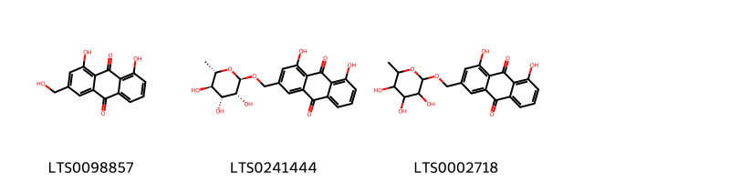
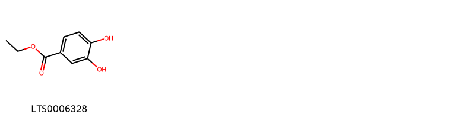
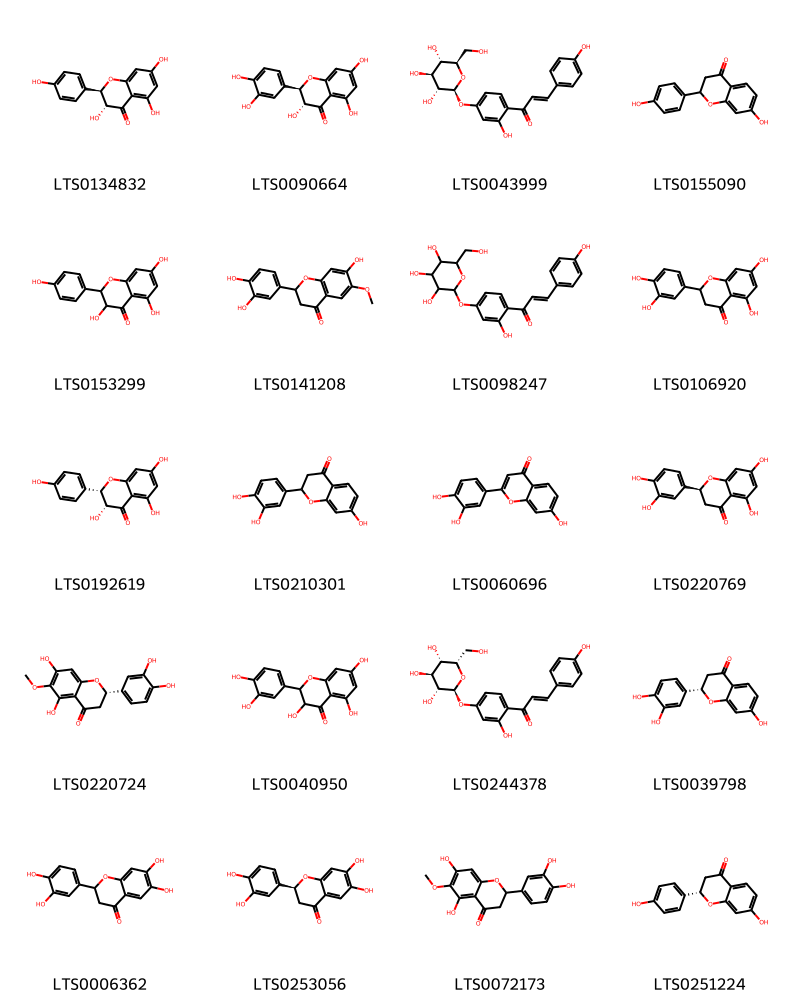
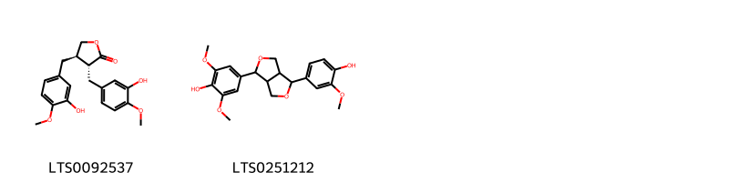
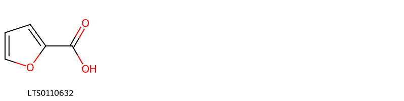
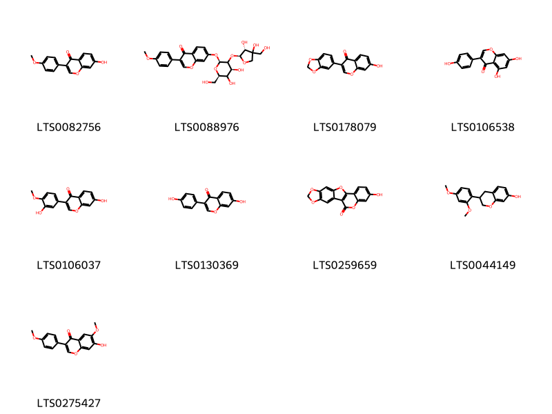
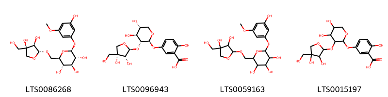

!!! abstract "Tóm tắt"
    Tên khoa học của kê huyết đằng hay huyết rồng là Spatholobus suberectus Dunn, phân bố ở bản địa của Assam, China South-Central, China Southeast, East Himalaya, Laos, Thailand, Vietnam. Ở Việt Nam có ở Đông Nam Bộ: Đồng Nai, Lâm Đồng, Sông Bể, Bà Rịa - Vũng Tàu. Kê huyết đằng được dùng trong phạm vi kinh nghiệm nhân dân, làm thuốc chữa thiếu máu, lưng gối mỏi đau, chân tay tê liệt, kinh nguyệt không đều. Liều dùng ngày 10 - 15g, sắc nước hoặc ngâm rượu uống. Hồng đẳng còn chữa kinh bế, đau bụng, phong thấp, giun kim, giun đũa. Huyết rồng còn ít nghiên cứu về tác dụng dược lý. oài huyết rồng chứa các flavonoid ononin, prunetin, afrormosin, 2, 4, 3, 4 tetrahydroxychalcon, licochalcon A medicagol, 9-O-methoxycoumestrol, các chất tanin epicatechin, acid protocatechic; ngoài ra, còn có friedelan 3ẞol, daucosterol, cajinin, isoliquiritigenin và daidzein.

## Thông tin về thực vật

### Đặc điểm thực vật

Dược liệu **Kê Huyết Đằng (Thân)** từ bộ phận **** từ loài *Spatholobus suberectus Dunn* thuộc họ Fabaceae. Theo sách "Cây thuốc và động vật làm thuốc Việt Nam'' tập 1: 
Kê huyết đằng có nhiều loài có những đặc điểm chung về hình thái như dây leo thân gỗ, to khoẻ, hình trụ tròn hoặc dẹt, mặt cắt có 2 - 3 vòng gỗ đồng tâm hoặc không đồng tâm và có nhiều nhựa màu đỏ nâu. Thân lá non có lông 10.
Lá kép đa số 3 lá chét, lá giữa to hơn, cuống lá dài. Cụm hoa mọc ở kẽ lá thành chùm - chuỳ. Quả đậu dẹt.
Theo dược điển việt Nam 5: loài Spatholobus suberectus Dunn:
Dược liệu hình trụ to, dài, hoặc phiến thái vát hình bầu dục không đều, dày 0,3 cm đến 0,8 cm. Bần màu nâu hơi xám, có khi thấy vết đốm màu trắng hơi xám; chỗ mất lớp bần sẽ hiện ra màu nâu hơi đỏ. Mặt cắt ngang: Gỗ màu nâu hơi đỏ hoặc màu nâu, lộ ra nhiều lỗ mạch. Libe có chất nhựa cây tiết ra, màu nâu hơi đỏ đến màu nâu hơi đen, xếp xen kẽ với gỗ thành 3 đển 8 vòng, hình bán nguyệt, lệch tâm. Phần tủy lệch về một bên. Chất khô cứng. Vị chát.
Theo tài liệu "Những cây thuốc và vị thuốc Việt Nam" - Đỗ Tất Lợi, bổ sung loài:
Cây huyết đằng (Sargentodoxa cuneata) là một loại dây leo, thân có thể dài tới 10 mét, vỏ ngoài mài hơi nàu. Lá mọc so le, kép, gồm 3 lá chét, cuống lá dài 4,5-10cm, lá chét giữa có cuống ngắn, lá chét hai bên gần như không cuống. Phiến lá chét giữa hình trứng, lá chét 2 bên hơi hình thận, dài 7-11cm, rộng 3,5-6,5cm. Mặt trên màu xanh, mặt dưới màu xanh nhạt. Hoa đơn tính, khác gốc, mọc thành chùm ở kẽ lá, cụm hoa dài tới 14cm, mọc thông xuống. Hoa đực màu vàng xanh, 6 lá đài, 6 cánh tràng thoái hóa thành hình sợi, 6 nhị. Hoa cái gần như hoa đực, nhiều lá noãn, bầu thượng. Quả mọng hình trứng dài 8-10mm. Khi chín có màu lam đen. Mùa hoa vào các tháng 3-4, mùa quả vào các tháng 7-8.
Cây kê huyết đắng (Milletia nitida Benth.) cũng là một loại dây leo, lá mọc so le, kép, thường gồm 5 lá chét, cuống lá dài chừng 3- 5mm, phiến lá chét dài 4-9cm, rộng 2-4cm, lá chét giữa dài và to hơn các lá chét bên. Gân chính và gân phụ đều nổi rõ ở cả 2 mặt. Cụm hoa thành chùm mọc ở đầu cành hay ở kẽ các lá đầu cành, cụm hoa dài chừng 14cm. Trục cụm hoa có lông mịn, hoa màu tím, đài hình chuông, tràng hoa hình cánh bướm. Quả giáp dài 7-15cm, rộng 1,5-2cm, đầu quả hẹp lại và thường thành hình mỏ chim, trên mặt có phủ lồng mịn màu vàng nhạt. Hạt 3-5, đường kính ước 12mm, màu đen nâu. Mùa hoa vào các tháng 9 đến tháng 1 năm sau. 

!!! info "Phân loại thực vật của *Spatholobus suberectus*"
    - **Kingdom:** Plantae
    - **Phylum:** Tracheophyta
    - **Order:** Fabales
    - **Family:** Fabaceae
    - **Genus:** Spatholobus
    - **Species:** *Spatholobus suberectus*

*Tài liệu tham khảo:* Tài liệu khác

 

### Loài thay thế (Nếu có)

### Phân bố trên thế giới
**Từ vườn thực vật KEW: **: Bản địa: Assam, China South-Central, China Southeast, East Himalaya, Laos, Thailand, Vietnam

**Từ CSDL GIBF** nan, Lao People’s Democratic Republic, Indonesia, China, Viet Nam, United States of America, India, Thailand

### Phân bố tại Việt Nam
** Tài liệu khác**: Huyết rồng (Spatholobus suberectus Dunn) ở Đông Nam Bộ: Đồng Nai, Lâm Đồng, Sông Bể, Bà Rịa - Vũng Tàu.

**Từ CSDL GIBF**: Lao Cai, Tonkin

---

## Thông tin về dược liệu 

### Định danh

!!! info "Thông tin về tên gọi của kê huyết đằng"
    - Dược liệu tiếng Việt: kê huyết đằng
    - Dược liệu tiếng Trung: 鸡血藤 (Ji Xue Teng)
    - Dược liệu tiếng Anh: Suberect Spatholobus Stem
    - Dược liệu latin thông dụng: Caulis Spatholobi suberecti
    - Dược liệu latin kiểu DĐVN: caulis spatholobi suberecti
    - Dược liệu latin kiểu DĐVN: 
    - Dược liệu latin kiểu thông tư: 
    - Bộ phận dùng:  (Caulis)

### Mô tả dược liệu 
- **Theo dược điển Việt nam V:** Dược liệu hình trụ to, dài, hoặc phiến thái vát hình bầu dục không đều, dày 0,3 cm đến 0,8 cm. Bần màu nâu hơi xám, có khi thấy vết đốm màu trắng hơi xám; chỗ mất lớp bần sẽ hiện ra màu nâu hơi đỏ. Mặt cắt ngang: Gỗ màu nâu hơi đỏ hoặc màu nâu, lộ ra nhiều lỗ mạch. Libe có chất nhựa cây tiết ra, màu nâu hơi đỏ đến màu nâu hơi đen, xếp xen kẽ với gỗ thành 3 đển 8 vòng, hình bán nguyệt, lệch tâm. Phần tủy lệch về một bên. Chất khô cứng. Vị chát.

- **Mô tả dược liệu theo thông tư chế biến dược liệu theo phương pháp cổ truyền:** 

### Chế biến 

- **Chế biến theo dược điển việt nam V**: Vào mùa thu, đông, chặt lấy thân leo, loại bỏ cành và lá, thái phiến, phơi khô. Bào chế Dược liệu dạng trụ dài, loại bó tạp chất, rửa sạch, ngâm ủ đến khi mềm, thái phiến, phơi khô.nn

- **Chế biến theo thông tư:** 

--- 

## Thành phần hóa học

- Theo tài liệu của GS. Đỗ Tất Lợi:  Loài huyết rồng chứa các flavonoid ononin, prunetin, afrormosin, 2, 4, 3, 4 tetrahydroxychalcon, licochalcon A medicagol, 9-O-methoxycoumestrol, các chất tanin epicatechin, acid protocatechic; ngoài ra, còn có friedelan 3ẞol, daucosterol, cajinin, isoliquiritigenin và daidzein.
    
- Theo cơ sở dữ liệu lotus: Từ loài *Spatholobus suberectus* đã phân lập và xác định được 41 hoạt chất thuộc về các nhóm Anthracenes, Furans, Linear 1,3-diarylpropanoids, Organooxygen compounds, Isoflavonoids, Benzene and substituted derivatives, Furanoid lignans, Flavonoids. 

|    | chemicalTaxonomyClassyfireClass     |   smiles_count |
|---:|:------------------------------------|---------------:|
|  0 | Anthracenes                         |              3 |
|  1 | Benzene and substituted derivatives |              1 |
|  2 | Flavonoids                          |             20 |
|  3 | Furanoid lignans                    |              2 |
|  4 | Furans                              |              1 |
|  5 | Isoflavonoids                       |              9 |
|  6 | Linear 1,3-diarylpropanoids         |              1 |
|  7 | Organooxygen compounds              |              4 |

### Nhóm Anthracenes
<figure markdown="span">
    { width=100% }
    <figcaption>Hình ảnh cấu trúc hóa học của 3 hoạt chất thuộc nhóm Anthracenes gồm ['aloe emodin (LTS0098857)', '1,8-dihydroxy-3-({[(2r,3r,4r,5r,6s)-3,4,5-trihydroxy-6-methyloxan-2-yl]oxy}methyl)anthracene-9,10-dione (LTS0241444)', '1,8-dihydroxy-3-{[(3,4,5-trihydroxy-6-methyloxan-2-yl)oxy]methyl}anthracene-9,10-dione (LTS0002718)'].</figcaption>
</figure>
### Nhóm Benzene and substituted derivatives
<figure markdown="span">
    { width=100% }
    <figcaption>Hình ảnh cấu trúc hóa học của 1 hoạt chất thuộc nhóm Benzene and substituted derivatives gồm ['ethyl protocatechuate (LTS0006328)'].</figcaption>
</figure>
### Nhóm Flavonoids
<figure markdown="span">
    { width=100% }
    <figcaption>Hình ảnh cấu trúc hóa học của 20 hoạt chất thuộc nhóm Flavonoids gồm ['(+)-dihydrokaempferol (LTS0134832)', '(+)-taxifolin (LTS0090664)', 'neoisoliquiritine (LTS0043999)', "7,4'-dihydroxyflavanone (LTS0155090)", 'aromadendrin (LTS0153299)', '2-(3,4-dihydroxyphenyl)-7-hydroxy-6-methoxy-2,3-dihydro-1-benzopyran-4-one (LTS0141208)', '1-(2-hydroxy-4-{[3,4,5-trihydroxy-6-(hydroxymethyl)oxan-2-yl]oxy}phenyl)-3-(4-hydroxyphenyl)prop-2-en-1-one (LTS0098247)', '(+/-)-eriodictyol (LTS0106920)', '(2s,3r)-3,5,7-trihydroxy-2-(4-hydroxyphenyl)-2,3-dihydro-1-benzopyran-4-one (LTS0192619)', "7,3',4'-trihydroxyflavanone (LTS0210301)", "7,3',4'-trihydroxyflavone (LTS0060696)", 'eriodictyol (LTS0220769)', '(2s)-2-(3,4-dihydroxyphenyl)-5,7-dihydroxy-6-methoxy-2,3-dihydro-1-benzopyran-4-one (LTS0220724)', '2,3-dihydroquercetin (LTS0040950)', '(2e)-1-(2-hydroxy-4-{[(2s,3r,4s,5s,6s)-3,4,5-trihydroxy-6-(hydroxymethyl)oxan-2-yl]oxy}phenyl)-3-(4-hydroxyphenyl)prop-2-en-1-one (LTS0244378)', 'butin (LTS0039798)', 'plathymenin (LTS0006362)', '(2s)-2-(3,4-dihydroxyphenyl)-6,7-dihydroxy-2,3-dihydro-1-benzopyran-4-one (LTS0253056)', '6-methoxyeriodictyol (LTS0072173)', '5-deoxyflavanone (LTS0251224)'].</figcaption>
</figure>
### Nhóm Furanoid lignans
<figure markdown="span">
    { width=100% }
    <figcaption>Hình ảnh cấu trúc hóa học của 2 hoạt chất thuộc nhóm Furanoid lignans gồm ['(3r,4r)-3,4-bis[(3-hydroxy-4-methoxyphenyl)methyl]oxolan-2-one (LTS0092537)', '4-[4-(4-hydroxy-3-methoxyphenyl)-hexahydrofuro[3,4-c]furan-1-yl]-2,6-dimethoxyphenol (LTS0251212)'].</figcaption>
</figure>
### Nhóm Furans
<figure markdown="span">
    { width=100% }
    <figcaption>Hình ảnh cấu trúc hóa học của 1 hoạt chất thuộc nhóm Furans gồm ['furoic acid (LTS0110632)'].</figcaption>
</figure>
### Nhóm Isoflavonoids
<figure markdown="span">
    { width=100% }
    <figcaption>Hình ảnh cấu trúc hóa học của 9 hoạt chất thuộc nhóm Isoflavonoids gồm ['formononetin (LTS0082756)', '7-{[(2s,4s,6r)-3-{[(2s,3r)-3,4-dihydroxy-4-(hydroxymethyl)oxolan-2-yl]oxy}-4,5-dihydroxy-6-(hydroxymethyl)oxan-2-yl]oxy}-3-(4-methoxyphenyl)chromen-4-one (LTS0088976)', 'pseudobaptigenin (LTS0178079)', 'genistein (LTS0106538)', 'calycosin (LTS0106037)', 'daidzein (LTS0130369)', 'medicagol (LTS0259659)', '3-(2,4-dimethoxyphenyl)-3,4-dihydro-2h-1-benzopyran-7-ol (LTS0044149)', 'afrormosin (LTS0275427)'].</figcaption>
</figure>
### Nhóm Linear 1_3-diarylpropanoids
<figure markdown="span">
    { width=100% }
    <figcaption>Hình ảnh cấu trúc hóa học của Không tìm thấy chú thích hoạt chất thuộc nhóm Linear 1_3-diarylpropanoids gồm Không tìm thấy chú thích.</figcaption>
</figure>
### Nhóm Organooxygen compounds
<figure markdown="span">
    { width=100% }
    <figcaption>Hình ảnh cấu trúc hóa học của 4 hoạt chất thuộc nhóm Organooxygen compounds gồm ['(2r,3s,4s,5r,6s)-2-({[(2r,3r,4r)-3,4-dihydroxy-4-(hydroxymethyl)oxolan-2-yl]oxy}methyl)-6-(3-hydroxy-5-methoxyphenoxy)oxane-3,4,5-triol (LTS0086268)', '5-{[(2s,3r,4s,5r)-3-{[(2s,3r,4r)-3,4-dihydroxy-4-(hydroxymethyl)oxolan-2-yl]oxy}-4,5-dihydroxyoxan-2-yl]oxy}-2-hydroxybenzoic acid (LTS0096943)', '2-({[3,4-dihydroxy-4-(hydroxymethyl)oxolan-2-yl]oxy}methyl)-6-(3-hydroxy-5-methoxyphenoxy)oxane-3,4,5-triol (LTS0059163)', '5-[(3-{[3,4-dihydroxy-4-(hydroxymethyl)oxolan-2-yl]oxy}-4,5-dihydroxyoxan-2-yl)oxy]-2-hydroxybenzoic acid (LTS0015197)'].</figcaption>
</figure>

---

## Tác dụng dược lý

Theo tài liệu Tài liệu khác:- Ít nghiên cứu về tác dụng dược lý.
- Theo Dr Duke: 
+ Gỉam đau: bụng, đầu gối, ..
+ Trị vô kinh, thắt lưng.

Theo tài liệu quốc tế: To enrich the blood, to activate blood circulation, and to remove obstruction of the channels and collaterals.

---

## Dược điển Việt Nam V

### Soi bột:

<!-- Hình ảnh soi bột sẽ được tự động chèn vào đây sau -->
### Vi phẫu:
Mặt cắt ngang: Bần gồm một số lớp tế bào chứa chất đỏ hơi nâu. Vỏ tương đối hẹp, có những nhóm tế bào đá trong khoang chứạ đầy các chất đỏ hơi nâu. Tể bào mô mềm chứa tinh thể calci oxalat hình lăng trụ. Các bó mạch khác thường do libe xen kẽ với gỗ, xếp thành một số vòng. Phía ngoài cùng libe là một lớp tế bào mô cứng gồm những tế bào đá và những bó sợi; đa số tia bị nén lại; nhiều tế bào tiết chứa đầy chất đỏ hơi nâu, thường có từ vài tế bào đến 10 tế bào hoặc nhiều hơn, xếp lớp theo chiều tiếp tuyến. Bó sợi tương đối nhiều, không hóa gỗ hoặc hơi hóa gỗ, vây tròn xung quanh có các tế bào chứa các tinh thể calci oxalat hình lăng trụ tạo thành những sợi tinh thể; thành của tế bào chứa tinh thể hóa gỗ và dày lên; có các nhóm tế bào đá rải rác. Đôi khi tia gỗ chứa chất đỏ hơi nâu, các mạch gỗ đa số là mạch đơn, gần tròn, đường kinh tới 400 μm, xếp rải rác, các bó sợi gỗ cũng thành hình các sợi tinh thể. Một số tế bào mô mềm gỗ có chứa chất màu nâu đỏ.
<!-- Hình ảnh vi phẫu sẽ được tự động chèn vào đây sau -->
### Định tính

Phương pháp sẳc ký lớp mỏng (Phụ lục 5.4). Bản mỏng: Silica gel G. Dung môi khai triển: Cloroform – methanol (30 : 1). Dung dịch thử: Lấy 1 g bột thô dược liệu, thêm 100 ml ethanol 96 % (TT), đun hồi lưu 1 h, lọc. có dịch lọc tới cắn khô, hòa tan cắn trong 2 ml methanol (TT), thêm 1 g Silica gel (TT), khuấy kỹ, đuổi hết dung môi, chuyển lên trên một cột có đường kính trong là 1,0 cm (chứa 2g silica gel, kích thước hạt từ 75 μm đển 150 μm). Rửa giài bằng 30 ml ether dầu hỏa (60 °C đến 90 °C) (TT), sau đó rửa giải tiếp bằng 40 ml cloroform (TT), lẩy dịch rửa giải cloroform bav hơi đến cắn khô, hòa tan cắn trong 0,5 ml cloroform (TT) dùng làm dung dịch thử. Dung dịch đối chiếu: Lấy 1 g bột Kê huyết đằng (mẫu chuẩn), tiến hành chiết như mô tả ờ phần Dung dịch thử. Cách tiến hành: Chấm riêng biệt lên cùng bản mỏng 5 μl đên 10 μl mỗi dung dịch thử và dung dịch đối chiếu. Sau khi triển khai sắc ký, lấy bản mỏng ra để khô ngoài không khí ở nhiệt độ phòng. Quan sát dưới ánh sáng tử ngoại ở bước sóng 254 nm. Trên sắc ký đồ của dung dịch thử phải có các vết có huỳnh quang cùng màu và giá trị Rf với các vết trên sắc ký đồ của dung dịch đối chiếu.

### Định lượng

Chất chiết được trong dược liệu Không ít hơn 8,0 % tính theo dược liệu khô kiệt. Tiến hành theo phương pháp chiết nóng (Phụ lục 12.10), dùng ethanol 96 % (TT) làm dung môi.

### Thông tin khác 
- ** Độ ẩm: ** Không quá 13,0 % (Phụ lục 9.6, 1 g, 105 °C, 5 h).

- ** Bảo quản:** Để nơi khô, mát, tránh mốc mọt.nn
## Dược điển Hồng kong

<!-- PDF sẽ được tự động chèn vào đây sau -->

---

## Y dược học cổ truyền

- **Tên vị thuốc:** 
- **Tính vị quy kinh:** Khổ, cam, ôn. Vào các kinh can, thận.
- **Công năng chủ trị:** Hoạt huyết thông lạc, bổ huyết.

Chủ trị: Chứng huyết hư gây huyết ứ trệ, bế thống kinh, chấn thương tụ huyết, phong thấp đau lưng, đau xương khớp.
- **Chú ý:** 
- **Kiêng kỵ:** 

