!!! abstract "Tóm tắt"
    Linh chi có tên khoa học: Ganoderma lucidum, họ Ganodermataceae. Chủ yếu phân bố ở các khu rừng nhiệt đới và ôn đới của Châu Á, bao gồm Trung Quốc, Nhật Bản, Hàn Quốc và Việt Nam. Nó thường mọc trên thân cây gỗ mục hoặc gỗ chết. Trong y học cổ truyền, Linh chi được sử dụng như một vị thuốc bổ dưỡng, giúp tăng cường sức khỏe, kéo dài tuổi thọ và điều trị các bệnh về tim mạch, gan, thận. Linh chi còn được dùng để thanh nhiệt, giải độc, và hỗ trợ điều trị bệnh tật liên quan đến hệ miễn dịch. Linh chi có tác dụng nâng cao sức đề kháng, hỗ trợ điều trị ung thư, giảm mệt mỏi, ổn định huyết áp, cải thiện chức năng gan và thận, đồng thời có tác dụng an thần, giảm căng thẳng và lo âu. Ngoài ra, các nghiên cứu cũng chỉ ra Linh chi có đặc tính chống viêm, chống oxy hóa và tăng cường miễn dịch. Linh chi chứa các hợp chất bioactive như polysaccharides (trong đó có beta-glucans), triterpenoids (ganoderic acids), peptid, và các hợp chất phenolic. Những thành phần này đóng vai trò quan trọng trong tác dụng chống ung thư, bảo vệ tim mạch và tăng cường sức khỏe tổng thể. Linh chi là một trong những dược liệu quý giá trong y học cổ truyền, với nhiều ứng dụng chữa bệnh và bồi bổ sức khỏe.

## Thông tin về thực vật

### Đặc điểm thực vật

Dược liệu **Linh Chi** từ bộ phận **nan** từ loài *Ganoderma lucidum (Leyss. ex Fr.) Karst.* thuộc họ Polyporaceae. Về thực vật, người ta xác định nấm linh chỉ không phải một loại cỏ, mà là một loại nấm hoá gỗ có cuống dài hoặc ngắn, mũ nant dạng hình thận, có dạng hình tròn hay hình quạt. Cuống thường cắm không ở giữa mũ nấm mà cắm lệch sang một phía mũ. Hình trụ tròn hay dẹt có thể phân nhánh cuống và cuống có mấu khác nhau tuỳ theo loài, loài đỏ thay đổi từ nâu đến đỏ vàng, đỏ cam, mặt trên bóng loáng như đánh vécni, trên mặt mũ có những vân đồng tâm.
Thụ tầng mầu trắng ngà, khi già ngả mầu nâu vàng, mang nhiều lỗ nhỏ li ti là các ống thụ tầng mang bào tử. Bào từ loài xích chỉ hình trứng, được bao bọc bởi 2 lớp màng, màng ngoài nhẫn, không mấu, màng trong mấu gỉ sắt, lỗ nầy mâm có hình gai nhọn.
Toàn nấm gồm những sợi nấm không mầu, trong sáng, đường kính 1-3mm, có phân nhánh. 

!!! info "Phân loại thực vật của *Ganoderma lucidum*"
    - **Kingdom:** Fungi
    - **Phylum:** Basidiomycota
    - **Order:** Polyporales
    - **Family:** Polyporaceae
    - **Genus:** Ganoderma
    - **Species:** *Ganoderma lucidum*

*Tài liệu tham khảo:* "Những cây thuốc và vị thuốc Việt Nam" - Đỗ Tất Lợi

 

### Loài thay thế (Nếu có)

### Phân bố trên thế giới
**Từ vườn thực vật KEW: **: Phân bố toàn cầu, cận nhiệt đới, du nhập. Độ cao: 50 – 2100 m so với các tỉnh của Colombia: Amazonas, Caquetá, Cesar, Chocó, Cundinamarca, Magdalena, Valle del Cauca.

**Từ CSDL GIBF** nan, Australia, Spain, Croatia, Austria, Norway, Germany, Netherlands, Denmark, Slovakia, Romania, Ukraine, Sweden, Hungary, Italy, Greece, Bulgaria, Belarus, Türkiye, Japan, Serbia, Estonia, Russian Federation, South Africa, Czechia, Finland, Switzerland, United States of America, France, Portugal, Israel, Chinese Taipei, Sri Lanka

### Phân bố tại Việt Nam
** "Những cây thuốc và vị thuốc Việt Nam" - Đỗ Tất Lợi**: Ở nước ta một số cơ sở đã bắt đầu trồng nấm linh chi để dùng trong nước và xuất khẩu

**Từ CSDL GIBF**: Không có ghi nhận ở Việt Nam

---

## Thông tin về dược liệu 

### Định danh

!!! info "Thông tin về tên gọi của nan"
    - Dược liệu tiếng Việt: nan
    - Dược liệu tiếng Trung: nan (nan)
    - Dược liệu tiếng Anh: nan
    - Dược liệu latin thông dụng: nan
    - Dược liệu latin kiểu DĐVN: ganoderma lucidum
    - Dược liệu latin kiểu DĐVN: nan
    - Dược liệu latin kiểu thông tư: nan
    - Bộ phận dùng: nan (nan)

### Mô tả dược liệu 
- **Theo dược điển Việt nam V:** nan

- **Mô tả dược liệu theo thông tư chế biến dược liệu theo phương pháp cổ truyền:** nan

### Chế biến 

- **Chế biến theo dược điển việt nam V**: nan

- **Chế biến theo thông tư:** nan

--- 

## Thành phần hóa học

- Theo tài liệu của GS. Đỗ Tất Lợi:  Polysaccharides, Triterpenoids, Peptid và Protein, Polyphenols, Sterols, Axit amin
    
- Theo cơ sở dữ liệu lotus: Từ loài *Ganoderma lucidum* đã phân lập và xác định được 914 hoạt chất thuộc về các nhóm Fluorenes, Stilbenes, Imidazopyrimidines, Benzopyrans, Benzene and substituted derivatives, Tetrahydrofurans, Oxazinanes, Heteroaromatic compounds, Pyrans, Pyrimidine nucleosides, Oxanes, Steroids and steroid derivatives, Phenols, Phenol ethers, Purine nucleosides, Pyridines and derivatives, Naphthofurans, Organooxygen compounds, Prenol lipids, Fatty Acyls, Saturated hydrocarbons, 5'-deoxyribonucleosides, Carboxylic acids and derivatives, Diazines, Unsaturated hydrocarbons, Flavonoids, Other non-metal organides. 

|    | chemicalTaxonomyClassyfireClass     |   smiles_count |
|---:|:------------------------------------|---------------:|
|  0 | 5'-deoxyribonucleosides             |              3 |
|  1 | Benzene and substituted derivatives |              7 |
|  2 | Benzopyrans                         |              8 |
|  3 | Carboxylic acids and derivatives    |              6 |
|  4 | Diazines                            |              1 |
|  5 | Fatty Acyls                         |             22 |
|  6 | Flavonoids                          |              1 |
|  7 | Fluorenes                           |              2 |
|  8 | Heteroaromatic compounds            |              1 |
|  9 | Imidazopyrimidines                  |              1 |
| 10 | Naphthofurans                       |              3 |
| 11 | Organooxygen compounds              |             27 |
| 12 | Other non-metal organides           |              1 |
| 13 | Oxanes                              |              1 |
| 14 | Oxazinanes                          |              1 |
| 15 | Phenol ethers                       |              1 |
| 16 | Phenols                             |              8 |
| 17 | Prenol lipids                       |            726 |
| 18 | Purine nucleosides                  |              1 |
| 19 | Pyrans                              |              1 |
| 20 | Pyridines and derivatives           |              1 |
| 21 | Pyrimidine nucleosides              |              1 |
| 22 | Saturated hydrocarbons              |              1 |
| 23 | Steroids and steroid derivatives    |             75 |
| 24 | Stilbenes                           |              2 |
| 25 | Tetrahydrofurans                    |              2 |
| 26 | Unsaturated hydrocarbons            |              4 |

### Nhóm 5_-deoxyribonucleosides
<figure markdown="span">
    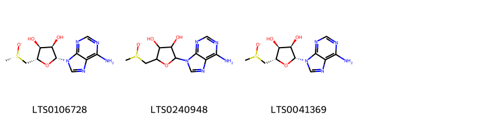{ width=100% }
    <figcaption>Hình ảnh cấu trúc hóa học của Không tìm thấy chú thích hoạt chất thuộc nhóm 5_-deoxyribonucleosides gồm Không tìm thấy chú thích.</figcaption>
</figure>
### Nhóm Benzene and substituted derivatives
<figure markdown="span">
    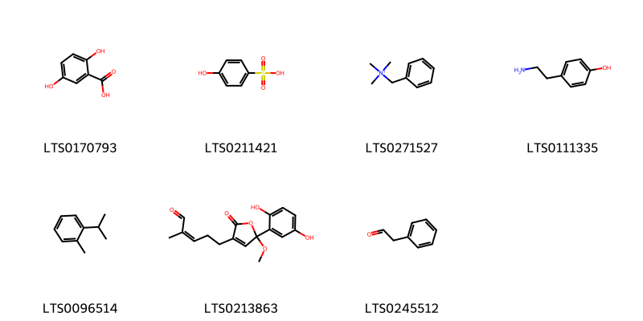{ width=100% }
    <figcaption>Hình ảnh cấu trúc hóa học của 7 hoạt chất thuộc nhóm Benzene and substituted derivatives gồm ['2,5-dihydroxybenzoic acid (LTS0170793)', 'phenolsulfonic acid (LTS0211421)', 'benzyltrimethylazanium (LTS0271527)', 'tyramine (LTS0111335)', 'o-cymene (LTS0096514)', '5-[5-(2,5-dihydroxyphenyl)-5-methoxy-2-oxofuran-3-yl]-2-methylpent-2-enal (LTS0213863)', 'phenylacetaldehyde (LTS0245512)'].</figcaption>
</figure>
### Nhóm Benzopyrans
<figure markdown="span">
    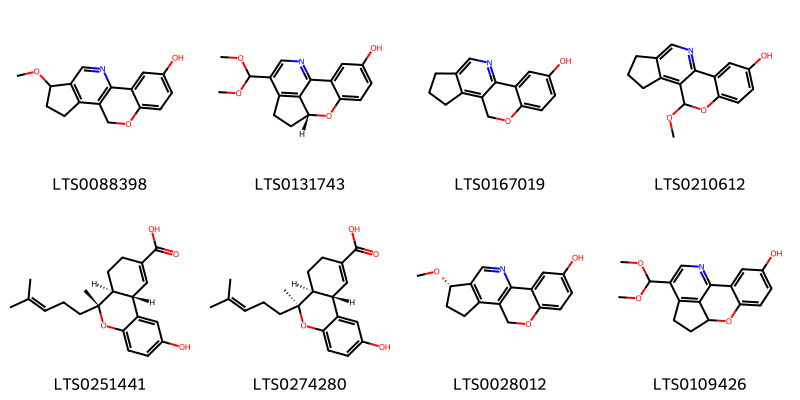{ width=100% }
    <figcaption>Hình ảnh cấu trúc hóa học của 8 hoạt chất thuộc nhóm Benzopyrans gồm ['14-methoxy-8-oxa-17-azatetracyclo[8.7.0.0²,⁷.0¹¹,¹⁵]heptadeca-1(10),2,4,6,11(15),16-hexaen-4-ol (LTS0088398)', '(9r)-13-(dimethoxymethyl)-8-oxa-15-azatetracyclo[7.6.1.0²,⁷.0¹²,¹⁶]hexadeca-1(15),2,4,6,12(16),13-hexaen-4-ol (LTS0131743)', '8-oxa-17-azatetracyclo[8.7.0.0²,⁷.0¹¹,¹⁵]heptadeca-1(17),2,4,6,10,15-hexaen-4-ol (LTS0167019)', '9-methoxy-8-oxa-17-azatetracyclo[8.7.0.0²,⁷.0¹¹,¹⁵]heptadeca-1(17),2,4,6,10,15-hexaen-4-ol (LTS0210612)', '(6r,6as,10as)-2-hydroxy-6-methyl-6-(4-methylpent-3-en-1-yl)-6ah,7h,8h,10ah-benzo[c]isochromene-9-carboxylic acid (LTS0251441)', '(6s,6as,10as)-2-hydroxy-6-methyl-6-(4-methylpent-3-en-1-yl)-6ah,7h,8h,10ah-benzo[c]isochromene-9-carboxylic acid (LTS0274280)', '(14s)-14-methoxy-8-oxa-17-azatetracyclo[8.7.0.0²,⁷.0¹¹,¹⁵]heptadeca-1(10),2,4,6,11(15),16-hexaen-4-ol (LTS0028012)', '13-(dimethoxymethyl)-8-oxa-15-azatetracyclo[7.6.1.0²,⁷.0¹²,¹⁶]hexadeca-1(15),2,4,6,12(16),13-hexaen-4-ol (LTS0109426)'].</figcaption>
</figure>
### Nhóm Carboxylic acids and derivatives
<figure markdown="span">
    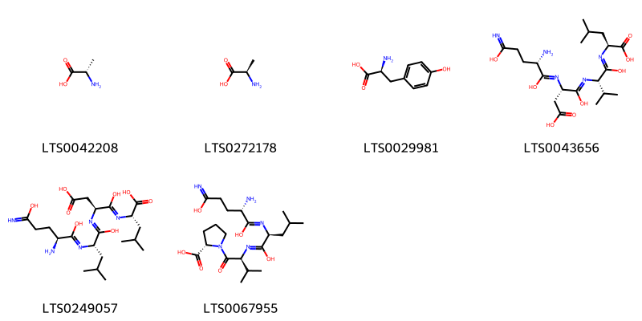{ width=100% }
    <figcaption>Hình ảnh cấu trúc hóa học của 6 hoạt chất thuộc nhóm Carboxylic acids and derivatives gồm ['l-alanine (LTS0042208)', 'd-alanine (LTS0272178)', 'l-tyrosine (LTS0029981)', '(2s)-2-{[(2s)-2-{[(2s)-2-{[(2s)-2-amino-1-hydroxy-4-(c-hydroxycarbonimidoyl)butylidene]amino}-3-carboxy-1-hydroxypropylidene]amino}-1-hydroxy-3-methylbutylidene]amino}-4-methylpentanoic acid (LTS0043656)', '(2s)-2-{[(2s)-2-{[(2s)-2-{[(2s)-2-amino-1-hydroxy-4-(c-hydroxycarbonimidoyl)butylidene]amino}-1-hydroxy-4-methylpentylidene]amino}-3-carboxy-1-hydroxypropylidene]amino}-4-methylpentanoic acid (LTS0249057)', '(2s)-1-[(2s)-2-{[(2s)-2-{[(2s)-2-amino-1-hydroxy-4-(c-hydroxycarbonimidoyl)butylidene]amino}-1-hydroxy-4-methylpentylidene]amino}-3-methylbutanoyl]pyrrolidine-2-carboxylic acid (LTS0067955)'].</figcaption>
</figure>
### Nhóm Diazines
<figure markdown="span">
    { width=100% }
    <figcaption>Hình ảnh cấu trúc hóa học của 1 hoạt chất thuộc nhóm Diazines gồm ['pirod (LTS0008205)'].</figcaption>
</figure>
### Nhóm Fatty Acyls
<figure markdown="span">
    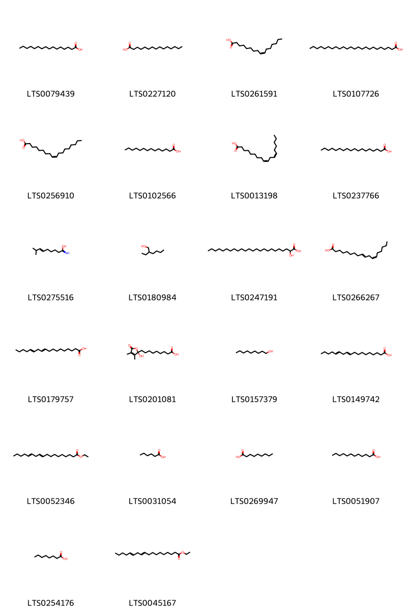{ width=100% }
    <figcaption>Hình ảnh cấu trúc hóa học của 22 hoạt chất thuộc nhóm Fatty Acyls gồm ['palmitic acid (LTS0079439)', 'pentadecanoic acid (LTS0227120)', 'palmitoleic acid (LTS0261591)', 'lignoceric acid (LTS0107726)', 'oleic acid (LTS0256910)', 'myristic acid (LTS0102566)', 'linoleic (LTS0013198)', 'stearic acid (LTS0237766)', '8-methylnon-6-enimidic acid (LTS0275516)', '2-ethylhexanol (LTS0180984)', 'cerebronic acid (LTS0247191)', '10-trans,12-cis-linoleic acid (LTS0266267)', '(10e,13e)-octadeca-10,13-dienoic acid (LTS0179757)', '9-[(2r)-2-hydroxy-3,4-dimethyl-5-oxofuran-2-yl]nonanoic acid (LTS0201081)', 'nonan-1-ol (LTS0157379)', 'octadeca-10,13-dienoic acid (LTS0149742)', 'ethyl octadeca-10,13-dienoate (LTS0052346)', 'hexanoic acid (LTS0031054)', 'nonanoic acid (LTS0269947)', 'lauric acid (LTS0051907)', 'caprylic acid (LTS0254176)', 'ethyl (10e,13e)-octadeca-10,13-dienoate (LTS0045167)'].</figcaption>
</figure>
### Nhóm Flavonoids
<figure markdown="span">
    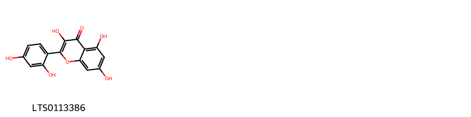{ width=100% }
    <figcaption>Hình ảnh cấu trúc hóa học của 1 hoạt chất thuộc nhóm Flavonoids gồm ['bois d,arc (LTS0113386)'].</figcaption>
</figure>
### Nhóm Fluorenes
<figure markdown="span">
    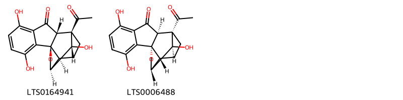{ width=100% }
    <figcaption>Hình ảnh cấu trúc hóa học của 2 hoạt chất thuộc nhóm Fluorenes gồm ['(1r,2r,10r,13r,14s,17r)-1-acetyl-5,8,17-trihydroxy-11-oxapentacyclo[11.3.1.0²,¹⁰.0⁴,⁹.0¹⁰,¹⁴]heptadeca-4,6,8-trien-3-one (LTS0164941)', '(1s,2s,10s,13s,14r,17s)-1-acetyl-5,8,17-trihydroxy-11-oxapentacyclo[11.3.1.0²,¹⁰.0⁴,⁹.0¹⁰,¹⁴]heptadeca-4,6,8-trien-3-one (LTS0006488)'].</figcaption>
</figure>
### Nhóm Heteroaromatic compounds
<figure markdown="span">
    { width=100% }
    <figcaption>Hình ảnh cấu trúc hóa học của 1 hoạt chất thuộc nhóm Heteroaromatic compounds gồm ['amylfuran (LTS0044471)'].</figcaption>
</figure>
### Nhóm Imidazopyrimidines
<figure markdown="span">
    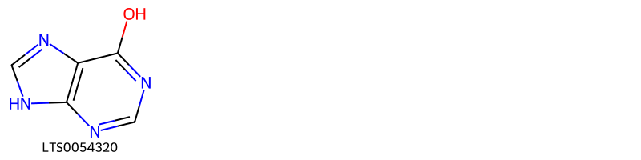{ width=100% }
    <figcaption>Hình ảnh cấu trúc hóa học của 1 hoạt chất thuộc nhóm Imidazopyrimidines gồm ['9h-purin-6-ol (LTS0054320)'].</figcaption>
</figure>
### Nhóm Naphthofurans
<figure markdown="span">
    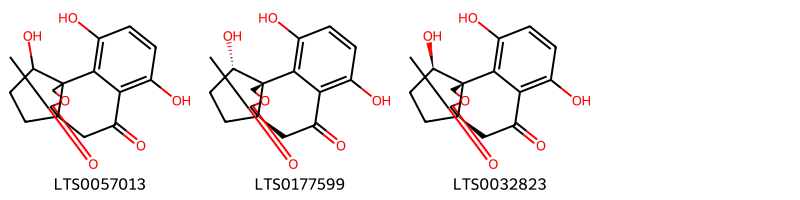{ width=100% }
    <figcaption>Hình ảnh cấu trúc hóa học của 3 hoạt chất thuộc nhóm Naphthofurans gồm ['3,6,14-trihydroxy-12-oxatetracyclo[8.3.3.0¹,¹⁰.0²,⁷]hexadeca-2,4,6-triene-8,11-dione (LTS0057013)', '(1r,10r,14s)-3,6,14-trihydroxy-12-oxatetracyclo[8.3.3.0¹,¹⁰.0²,⁷]hexadeca-2,4,6-triene-8,11-dione (LTS0177599)', '(1r,10r,14r)-3,6,14-trihydroxy-12-oxatetracyclo[8.3.3.0¹,¹⁰.0²,⁷]hexadeca-2,4,6-triene-8,11-dione (LTS0032823)'].</figcaption>
</figure>
### Nhóm Organooxygen compounds
<figure markdown="span">
    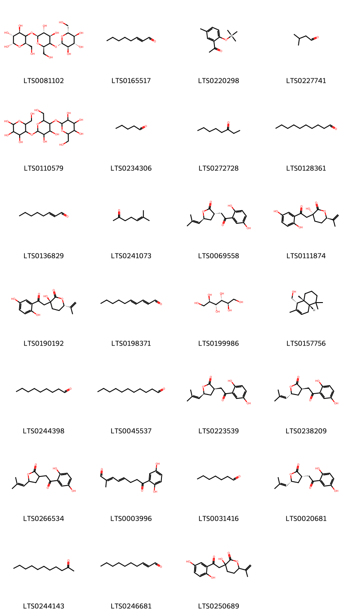{ width=100% }
    <figcaption>Hình ảnh cấu trúc hóa học của 27 hoạt chất thuộc nhóm Organooxygen compounds gồm ['(2s,3r,4r,6r)-5-{[(2s,3r,4r,6r)-3,4-dihydroxy-6-(hydroxymethyl)-5-{[(2s,3r,4s,5s,6r)-3,4,5-trihydroxy-6-(hydroxymethyl)oxan-2-yl]oxy}oxan-2-yl]oxy}-6-(hydroxymethyl)oxane-2,3,4-triol (LTS0081102)', '2-octenal (LTS0165517)', '1-{5-methyl-2-[(trimethylsilyl)oxy]phenyl}ethanone (LTS0220298)', 'isovaleraldehyde (LTS0227741)', 'amylose (LTS0110579)', 'pentanal (LTS0234306)', '3-octanone (LTS0272728)', 'decanal (LTS0128361)', '(e)-2-octenal (LTS0136829)', '6-methyl-5-hepten-2-one (LTS0241073)', '(3s,5s)-3-[2-(2,5-dihydroxyphenyl)-2-oxoethyl]-5-(2-methylprop-1-en-1-yl)oxolan-2-one (LTS0069558)', '(3r,6r)-3-[2-(2,5-dihydroxyphenyl)-2-oxoethyl]-3-hydroxy-6-(prop-1-en-2-yl)oxan-2-one (LTS0111874)', '(3s,6s)-3-[2-(2,5-dihydroxyphenyl)-2-oxoethyl]-3-hydroxy-6-(prop-1-en-2-yl)oxan-2-one (LTS0190192)', 'decadienal (LTS0198371)', 'mannitol (LTS0199986)', '[(1s,4as,8ar)-2,5,5,8a-tetramethyl-1,4,4a,6,7,8-hexahydronaphthalen-1-yl]methanol (LTS0157756)', 'nonanal (LTS0244398)', 'aldehyde c11 (LTS0045537)', '(3r,5s)-3-[2-(2,5-dihydroxyphenyl)-2-oxoethyl]-5-(2-methylprop-1-en-1-yl)oxolan-2-one (LTS0223539)', '(3r,5r)-3-[2-(2,5-dihydroxyphenyl)-2-oxoethyl]-5-(2-methylprop-1-en-1-yl)oxolan-2-one (LTS0238209)', '3-[2-(2,5-dihydroxyphenyl)-2-oxoethyl]-5-(2-methylprop-1-en-1-yl)oxolan-2-one (LTS0266534)', '(2e,4e)-8-(2,5-dihydroxyphenyl)-2-methyl-8-oxoocta-2,4-dienal (LTS0003996)', 'heptanal (LTS0031416)', '(3s,5r)-3-[2-(2,5-dihydroxyphenyl)-2-oxoethyl]-5-(2-methylprop-1-en-1-yl)oxolan-2-one (LTS0020681)', 'undecan-2-one (LTS0244143)', '(2e)-2-decenal (LTS0246681)', '3-[2-(2,5-dihydroxyphenyl)-2-oxoethyl]-3-hydroxy-6-(prop-1-en-2-yl)oxan-2-one (LTS0250689)'].</figcaption>
</figure>
### Nhóm Other non-metal organides
<figure markdown="span">
    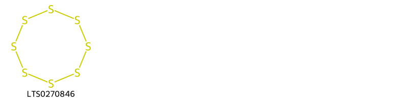{ width=100% }
    <figcaption>Hình ảnh cấu trúc hóa học của 1 hoạt chất thuộc nhóm Other non-metal organides gồm ['sulfur (LTS0270846)'].</figcaption>
</figure>
### Nhóm Oxanes
<figure markdown="span">
    { width=100% }
    <figcaption>Hình ảnh cấu trúc hóa học của 1 hoạt chất thuộc nhóm Oxanes gồm ['1,8-cineole (LTS0166505)'].</figcaption>
</figure>
### Nhóm Oxazinanes
<figure markdown="span">
    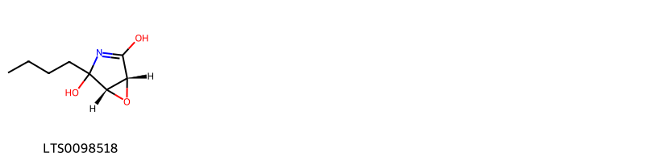{ width=100% }
    <figcaption>Hình ảnh cấu trúc hóa học của 1 hoạt chất thuộc nhóm Oxazinanes gồm ['(1r,5s)-4-butyl-6-oxa-3-azabicyclo[3.1.0]hex-2-ene-2,4-diol (LTS0098518)'].</figcaption>
</figure>
### Nhóm Phenol ethers
<figure markdown="span">
    { width=100% }
    <figcaption>Hình ảnh cấu trúc hóa học của 1 hoạt chất thuộc nhóm Phenol ethers gồm ['anethole (LTS0033696)'].</figcaption>
</figure>
### Nhóm Phenols
<figure markdown="span">
    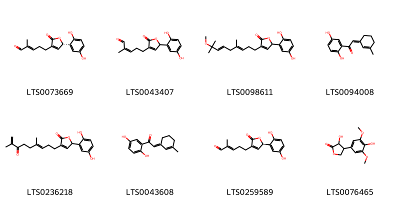{ width=100% }
    <figcaption>Hình ảnh cấu trúc hóa học của 8 hoạt chất thuộc nhóm Phenols gồm ['(2e)-5-[(5s)-5-(2,5-dihydroxyphenyl)-2-oxo-5h-furan-3-yl]-2-methylpent-2-enal (LTS0073669)', '5-[5-(2,5-dihydroxyphenyl)-2-oxo-5h-furan-3-yl]-2-methylpent-2-enal (LTS0043407)', '5-(2,5-dihydroxyphenyl)-3-[(3e,6e)-8-methoxy-4,8-dimethylnona-3,6-dien-1-yl]-5h-furan-2-one (LTS0098611)', '1-(2,5-dihydroxyphenyl)-2-[(1z)-3-methylcyclohex-2-en-1-ylidene]ethanone (LTS0094008)', '5-(2,5-dihydroxyphenyl)-3-[(3e)-4,8-dimethyl-7-oxonona-3,8-dien-1-yl]-5h-furan-2-one (LTS0236218)', '1-(2,5-dihydroxyphenyl)-2-[(1e)-3-methylcyclohex-2-en-1-ylidene]ethanone (LTS0043608)', '(2e)-5-[(5r)-5-(2,5-dihydroxyphenyl)-2-oxo-5h-furan-3-yl]-2-methylpent-2-enal (LTS0259589)', '3-hydroxy-4-(4-hydroxy-3,5-dimethoxyphenyl)oxolan-2-one (LTS0076465)'].</figcaption>
</figure>
### Nhóm Prenol lipids
<figure markdown="span">
    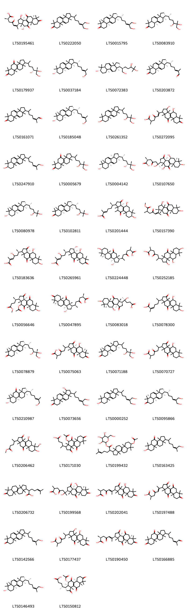{ width=100% }
    <figcaption>Hình ảnh cấu trúc hóa học của 726 hoạt chất thuộc nhóm Prenol lipids gồm ['(2r,5z)-6-[(1r,3r,3ar,5ar,9as,11r,11ar)-3,11-dihydroxy-3a,6,6,9a,11a-pentamethyl-4,7,10-trioxo-1h,2h,3h,5h,5ah,8h,9h,11h-cyclopenta[a]phenanthren-1-yl]-2-methyl-4-oxohept-5-enoic acid (LTS0195461)', '1-[7-hydroxy-6-(hydroxymethyl)hept-5-en-2-yl]-3a,6,6,9a,11a-pentamethyl-1h,2h,3h,5h,5ah,8h,9h,11h-cyclopenta[a]phenanthren-7-one (LTS0222050)', '(1r,3ar,5ar,9as,11ar)-1-[(2r)-7-hydroxy-6-(hydroxymethyl)hept-5-en-2-yl]-3a,6,6,9a,11a-pentamethyl-1h,2h,3h,5h,5ah,8h,9h,11h-cyclopenta[a]phenanthren-7-one (LTS0015795)', '(1r,3ar,9as,11ar)-3a,6,6,9a,11a-pentamethyl-1-[(2r)-5,6,7-trihydroxy-6-methylheptan-2-yl]-1h,2h,3h,5h,5ah,8h,9h,11h-cyclopenta[a]phenanthren-7-one (LTS0083910)', '3a,6,6,9a,11a-pentamethyl-1-[(5r,6r)-5,6,7-trihydroxy-6-methylheptan-2-yl]-1h,2h,3h,5h,5ah,8h,9h,10h,11h-cyclopenta[a]phenanthrene-4,7-dione (LTS0179937)', 'ganodermadiol (LTS0037184)', '(2r)-2-[(1r,3ar,7s,9as,11ar)-7-hydroxy-3a,6,6,9a,11a-pentamethyl-1h,2h,3h,5h,5ah,7h,8h,9h,11h-cyclopenta[a]phenanthren-1-yl]-6-methylheptane-1,5,6-triol (LTS0072383)', '(2e,6r)-6-[(1r,3ar,5ar,9as,11ar)-3a,6,6,9a,11a-pentamethyl-7-oxo-1h,2h,3h,5h,5ah,8h,9h,11h-cyclopenta[a]phenanthren-1-yl]-2-methylhept-2-enal (LTS0203872)', '6-{3a,6,6,9a,11a-pentamethyl-7-oxo-1h,2h,3h,5h,5ah,8h,9h,11h-cyclopenta[a]phenanthren-1-yl}-2-methylhept-2-enal (LTS0161071)', '(1r,3ar,5ar,7s,9as,11ar)-1-[(2r,5e)-7-hydroxy-6-methylhept-5-en-2-yl]-3a,6,6,9a,11a-pentamethyl-1h,2h,3h,5h,5ah,7h,8h,9h,11h-cyclopenta[a]phenanthren-7-ol (LTS0185048)', '6-{7-hydroxy-3a,6,6,9a,11a-pentamethyl-1h,2h,3h,5h,5ah,7h,8h,9h,11h-cyclopenta[a]phenanthren-1-yl}-2-methylheptane-1,2,3-triol (LTS0261352)', '6-{3,4-dihydroxy-3a,6,6,9a,11a-pentamethyl-7,10-dioxo-1h,2h,3h,4h,5h,5ah,8h,9h,11h-cyclopenta[a]phenanthren-1-yl}-2-methyl-4-oxohept-5-enoic acid (LTS0272095)', '1-(7-hydroxy-6-methylhept-5-en-2-yl)-3a,6,6,9a,11a-pentamethyl-1h,2h,3h,5h,5ah,7h,8h,9h,11h-cyclopenta[a]phenanthren-7-ol (LTS0247910)', '3a,6,6,9a,11a-pentamethyl-1-(5,6,7-trihydroxy-6-methylheptan-2-yl)-1h,2h,3h,5h,5ah,8h,9h,10h,11h-cyclopenta[a]phenanthrene-4,7-dione (LTS0005679)', '(2r,3r,6r)-6-[(1s,3as,5ar,7s,9as,11ar)-7-hydroxy-3a,6,6,9a,11a-pentamethyl-1h,2h,3h,5h,5ah,7h,8h,9h,11h-cyclopenta[a]phenanthren-1-yl]-2-methylheptane-1,2,3-triol (LTS0004142)', '(2s,6s)-6-[(1s,3ar,4s,5ar,7s,9as,11s,11ar)-4,7,11-trihydroxy-3a,6,6,9a,11a-pentamethyl-3,10-dioxo-1h,2h,4h,5h,5ah,7h,8h,9h,11h-cyclopenta[a]phenanthren-1-yl]-6-hydroxy-2-methyl-4-oxoheptanoic acid (LTS0107650)', '(3s,6r)-6-[(1r,3ar,5ar,7s,9as,11ar)-7-hydroxy-3a,6,6,9a,11a-pentamethyl-1h,2h,3h,5h,5ah,7h,8h,9h,11h-cyclopenta[a]phenanthren-1-yl]-2-methylheptane-2,3-diol (LTS0080978)', '(1r,3ar,5ar,9as,11ar)-1-[(2r,5s)-5,6-dihydroxy-6-methylheptan-2-yl]-3a,6,6,9a,11a-pentamethyl-1h,2h,3h,5h,5ah,8h,9h,11h-cyclopenta[a]phenanthren-7-one (LTS0102811)', '(2e,6r)-6-[(3ar,4s,7s)-4,7-dihydroxy-3a,6,6,9a,11,11a-hexamethyl-3,10-dioxo-1h,2h,4h,5h,5ah,7h,8h,9h,11h-cyclopenta[a]phenanthren-1-yl]-2-methylhept-2-enoic acid (LTS0201444)', 'methyl (5z)-6-[(1s,9as,11ar)-3,7-dihydroxy-1,3a,6,6,9a,11a-hexamethyl-4,10-dioxo-2h,3h,5h,5ah,7h,8h,9h,11h-cyclopenta[a]phenanthren-1-yl]-2-methyl-4-oxohept-5-enoate (LTS0157390)', '(2e,6r)-6-[(3ar,4s,7s)-4,7-dihydroxy-3a,6,6,9a,11a-pentamethyl-3,10-dioxo-1h,2h,4h,5h,5ah,7h,8h,9h,11h-cyclopenta[a]phenanthren-1-yl]-4-hydroxy-2-methylhept-2-enoic acid (LTS0183636)', '(2e,6r)-6-[(3s,3ar,4s)-3,4-dihydroxy-3a,6,6,9a,11a-pentamethyl-7,10-dioxo-1h,2h,3h,4h,5h,5ah,8h,9h,11h-cyclopenta[a]phenanthren-1-yl]-4-hydroxy-2-methylhept-2-enoic acid (LTS0265961)', '6-[(1r,3s,3ar,5ar,7s,9as,11ar)-3,7-dihydroxy-3a,6,6,9a,11a-pentamethyl-10-oxo-1h,2h,3h,4h,5h,5ah,7h,8h,9h,11h-cyclopenta[a]phenanthren-1-yl]-2-methyl-4-oxoheptanoic acid (LTS0224448)', '2-methyl-4-oxo-6-{3,4,7-trihydroxy-3a,6,6,9a,11a-pentamethyl-10-oxo-dodecahydrocyclopenta[a]phenanthren-1-yl}heptanoic acid (LTS0252185)', 'methyl (4r)-4-[(1r,3ar,7s,9as,11ar)-11-(acetyloxy)-7-hydroxy-3a,6,6,9a,11a-pentamethyl-3,4,10-trioxo-1h,2h,5h,5ah,7h,8h,9h,11h-cyclopenta[a]phenanthren-1-yl]pentanoate (LTS0056646)', '(2r,6r)-6-[(1r,3s,3ar,5ar,9as,11ar)-3-hydroxy-3a,6,6,9a,11a-pentamethyl-7,10-dioxo-1h,2h,3h,4h,5h,5ah,8h,9h,11h-cyclopenta[a]phenanthren-1-yl]-2-methyl-4-oxoheptanoic acid (LTS0047895)', '(4s)-4-[(1s,3ar,4s,5ar,7s,9as,11ar)-4,7-dihydroxy-3a,6,6,9a,11a-pentamethyl-3,10-dioxo-1h,2h,4h,5h,5ah,7h,8h,9h,11h-cyclopenta[a]phenanthren-1-yl]-4-hydroxypentanoic acid (LTS0083018)', '6-{4,7-dihydroxy-3a,6,6,9a,11a-pentamethyl-3,10-dioxo-1h,2h,4h,5h,5ah,7h,8h,9h,11h-cyclopenta[a]phenanthren-1-yl}-2-methylhept-2-enoic acid (LTS0078300)', 'ganodermanontriol (LTS0078879)', '6-[(3ar,5ar,9as,11ar)-4-hydroxy-3a,6,6,9a,11a-pentamethyl-3,7,10-trioxo-1h,2h,4h,5h,5ah,8h,9h,11h-cyclopenta[a]phenanthren-1-yl]-2-methyl-4-oxoheptanoic acid (LTS0075063)', '(3ar,5ar,9as,11ar)-3a,6,6,9a,11a-pentamethyl-1-[(6r)-5,6,7-trihydroxy-6-methylheptan-2-yl]-1h,2h,3h,5h,5ah,8h,9h,11h-cyclopenta[a]phenanthren-7-one (LTS0071188)', '6-{4,7-dihydroxy-3a,6,6,9a,11a-pentamethyl-3,10-dioxo-1h,2h,4h,5h,5ah,7h,8h,9h,11h-cyclopenta[a]phenanthren-1-yl}-2-methyl-4-oxoheptanoic acid (LTS0070727)', 'lucidadiol (LTS0210987)', '3-hydroxy-1-[7-hydroxy-6-(hydroxymethyl)hept-5-en-2-yl]-3a,6,6,9a,11a-pentamethyl-1h,2h,3h,5h,5ah,8h,9h,11h-cyclopenta[a]phenanthren-7-one (LTS0073656)', '2-(4-{7-hydroxy-3a,6,6,9a,11a-pentamethyl-1h,2h,3h,5h,5ah,7h,8h,9h,11h-cyclopenta[a]phenanthren-1-yl}pentylidene)propane-1,3-diol (LTS0000252)', '(1r,3ar,5as,9as,11ar)-1-[(2r)-7-hydroxy-6-(hydroxymethyl)hept-5-en-2-yl]-3a,6,6,9a,11a-pentamethyl-1h,2h,3h,5h,5ah,8h,9h,11h-cyclopenta[a]phenanthren-7-one (LTS0095866)', 'methyl 4-[4,7-dihydroxy-6-(hydroxymethyl)-3a,6,9a,11a-tetramethyl-3,10-dioxo-1h,2h,4h,5h,5ah,7h,8h,9h,11h-cyclopenta[a]phenanthren-1-yl]pentanoate (LTS0206462)', '4-[11-(acetyloxy)-3a,6,6,9a,11a-pentamethyl-3,4,7,10-tetraoxo-1h,2h,5h,5ah,8h,9h,11h-cyclopenta[a]phenanthren-1-yl]pentanoic acid (LTS0171030)', '3,4,5-trihydroxy-6-(hydroxymethyl)oxan-2-yl 2-[7-(acetyloxy)-3a,6,6,9a,11a-pentamethyl-1h,2h,3h,4h,5h,5ah,7h,8h,9h,10h,11h-cyclopenta[a]phenanthren-1-yl]-6-methylhept-5-enoate (LTS0199432)', '7-hydroxy-1-(7-hydroxy-6-methylhept-5-en-2-yl)-3a,6,6,9a,11a-pentamethyl-1h,2h,3h,5h,5ah,7h,8h,9h,10h,11h-cyclopenta[a]phenanthren-4-one (LTS0163425)', '2-{3a,6,6,9a,11a-pentamethyl-7-oxo-1h,2h,3h,4h,5h,5ah,8h,9h,10h,11h-cyclopenta[a]phenanthren-1-yl}-6-methylhept-5-enoic acid (LTS0206732)', '6-[(1s,3ar,4s,5ar,9as,11ar)-4-hydroxy-3a,6,6,9a,11a-pentamethyl-3,7,10-trioxo-1h,2h,4h,5h,5ah,8h,9h,11h-cyclopenta[a]phenanthren-1-yl]-6-hydroxy-2-methyl-4-oxoheptanoic acid (LTS0199568)', '(5e)-6-{4-hydroxy-3a,6,6,9a,11a-pentamethyl-3,7,10-trioxo-1h,2h,4h,5h,5ah,8h,9h,11h-cyclopenta[a]phenanthren-1-yl}-2-methyl-4-oxohept-5-enoic acid (LTS0202041)', '6-{3a,6,6,9a,11a-pentamethyl-3,4,7,10-tetraoxo-1h,2h,5h,5ah,8h,9h,11h-cyclopenta[a]phenanthren-1-yl}-2-methyl-4-oxohept-5-enoic acid (LTS0197488)', '1-(7-hydroxy-6-methylhept-5-en-2-yl)-3a,6,6,9a,11a-pentamethyl-1h,2h,3h,5h,5ah,8h,9h,11h-cyclopenta[a]phenanthren-7-one (LTS0142566)', '6-{3,4-dihydroxy-3a,6,6,9a,11a-pentamethyl-7,10-dioxo-1h,2h,3h,4h,5h,5ah,8h,9h,11h-cyclopenta[a]phenanthren-1-yl}-2-methyl-4-oxoheptanoic acid (LTS0177437)', '(2s,5e)-6-[(1r,3ar,5ar,9as,11ar)-3a,6,6,9a,11a-pentamethyl-3,4,7,10-tetraoxo-1h,2h,5h,5ah,8h,9h,11h-cyclopenta[a]phenanthren-1-yl]-2-methyl-4-oxohept-5-enoic acid (LTS0190450)', '6-{3a,6,6,9a,11a-pentamethyl-4,7-dioxo-1h,2h,3h,5h,5ah,8h,9h,10h,11h-cyclopenta[a]phenanthren-1-yl}-2-methylhept-2-enal (LTS0166885)', '(1r,3ar,5ar,7s,9as,11ar)-1-[(2r)-7-hydroxy-6-methylhept-5-en-2-yl]-3a,6,6,9a,11a-pentamethyl-1h,2h,3h,5h,5ah,7h,8h,9h,11h-cyclopenta[a]phenanthren-7-ol (LTS0146493)', 'lucidenic acid d (LTS0150812)', '(1r,3ar,5ar,9as,11ar)-1-[(2r,5e)-7-hydroxy-6-methylhept-5-en-2-yl]-3a,6,6,9a,11a-pentamethyl-1h,2h,3h,5h,5ah,8h,9h,11h-cyclopenta[a]phenanthren-7-one (LTS0190741)', '(2r,5s)-2-[(1r,2r,3ar,5ar,7s,9as,11ar)-7-(acetyloxy)-2-hydroxy-3a,6,6,9a,11a-pentamethyl-1h,2h,3h,4h,5h,5ah,7h,8h,9h,10h,11h-cyclopenta[a]phenanthren-1-yl]-5,6-dimethylhept-6-enoic acid (LTS0143370)', '6-[(3ar,5ar,9as,11ar)-4,7-dihydroxy-3a,6,6,9a,11a-pentamethyl-3,10-dioxo-1h,2h,4h,5h,5ah,7h,8h,9h,11h-cyclopenta[a]phenanthren-1-yl]-2-methyl-4-oxoheptanoic acid (LTS0160242)', '(2s,5e)-6-[(1r,3s,3ar,4s,5ar,9as,11ar)-3,4-dihydroxy-3a,6,6,9a,11a-pentamethyl-7,10-dioxo-1h,2h,3h,4h,5h,5ah,8h,9h,11h-cyclopenta[a]phenanthren-1-yl]-2-methyl-4-oxohept-5-enoic acid (LTS0171392)', '(1r,3s,3ar,9as,11ar)-3-hydroxy-1-[(2r)-7-hydroxy-6-(hydroxymethyl)hept-5-en-2-yl]-3a,6,6,9a,11a-pentamethyl-1h,2h,3h,5h,5ah,8h,9h,11h-cyclopenta[a]phenanthren-7-one (LTS0130283)', '(2s,3r,4s,5s,6r)-3,4,5-trihydroxy-6-(hydroxymethyl)oxan-2-yl (2r)-2-[(1r,3ar,5ar,7s,9as,11ar)-7-(acetyloxy)-3a,6,6,9a,11a-pentamethyl-1h,2h,3h,4h,5h,5ah,7h,8h,9h,10h,11h-cyclopenta[a]phenanthren-1-yl]-6-methylhept-5-enoate (LTS0225326)', '6-{4-hydroxy-3a,6,6,9a,11a-pentamethyl-3,7,10-trioxo-1h,2h,4h,5h,5ah,8h,9h,11h-cyclopenta[a]phenanthren-1-yl}-2-methyl-4-oxohept-5-enoic acid (LTS0176295)', 'ganoderic acid (LTS0045951)', '3a,6,6,9a,11a-pentamethyl-1-(5,6,7-trihydroxy-6-methylheptan-2-yl)-1h,2h,3h,5h,5ah,8h,9h,11h-cyclopenta[a]phenanthren-7-one (LTS0058877)', '(2r,6r)-6-[(1r,3ar,4s,5ar,9as,11s,11ar)-4,11-dihydroxy-3a,6,6,9a,11a-pentamethyl-3,7,10-trioxo-1h,2h,4h,5h,5ah,8h,9h,11h-cyclopenta[a]phenanthren-1-yl]-2-methyl-4-oxoheptanoic acid (LTS0221564)', '6-{3-hydroxy-3a,6,6,9a,11a-pentamethyl-7-oxo-1h,2h,3h,5h,5ah,8h,9h,11h-cyclopenta[a]phenanthren-1-yl}-2-methylhept-2-enal (LTS0053594)', '(1r,3ar,5ar,9as,11ar)-3a,6,6,9a,11a-pentamethyl-1-[(2r,5s,6s)-5,6,7-trihydroxy-6-methylheptan-2-yl]-1h,2h,3h,5h,5ah,8h,9h,11h-cyclopenta[a]phenanthren-7-one (LTS0216453)', '(2r,6r)-6-[(1r,3ar,5ar,7s,9as,11ar)-7-hydroxy-3a,6,6,9a,11a-pentamethyl-3,4,10-trioxo-1h,2h,5h,5ah,7h,8h,9h,11h-cyclopenta[a]phenanthren-1-yl]-2-methyl-4-oxoheptanoic acid (LTS0076354)', '2-[7-(acetyloxy)-2-hydroxy-3a,6,6,9a,11a-pentamethyl-1h,2h,3h,4h,5h,5ah,7h,8h,9h,10h,11h-cyclopenta[a]phenanthren-1-yl]-5,6-dimethylhept-6-enoic acid (LTS0212033)', 'methyl 6-{3,4-dihydroxy-3a,6,6,9a,11a-pentamethyl-7,10-dioxo-1h,2h,3h,4h,5h,5ah,8h,9h,11h-cyclopenta[a]phenanthren-1-yl}-2-methyl-4-oxoheptanoate (LTS0186078)', '6-{3a,6,6,9a,11a-pentamethyl-7,10-dioxo-1h,2h,3h,4h,5h,5ah,8h,9h,11h-cyclopenta[a]phenanthren-1-yl}-2-methylhept-2-enal (LTS0208336)', '6-{7-hydroxy-3a,6,6,9a,11a-pentamethyl-3,4,10-trioxo-1h,2h,5h,5ah,7h,8h,9h,11h-cyclopenta[a]phenanthren-1-yl}-2-methyl-4-oxoheptanoic acid (LTS0164632)', 'ganodermatriol (LTS0201956)', '(2r,5z)-6-[(3s,3ar,4s,9as,11ar)-3,4-dihydroxy-3a,6,6,9a,11a-pentamethyl-7,10-dioxo-1h,2h,3h,4h,5h,5ah,8h,9h,11h-cyclopenta[a]phenanthren-1-yl]-2-methyl-4-oxohept-5-enoic acid (LTS0195680)', '(2s,5e)-6-[(1r,3ar,4s,5ar,9as,11ar)-4-hydroxy-3a,6,6,9a,11a-pentamethyl-3,7,10-trioxo-1h,2h,4h,5h,5ah,8h,9h,11h-cyclopenta[a]phenanthren-1-yl]-2-methyl-4-oxohept-5-enoic acid (LTS0225272)', '(2e,6r)-6-[(1r,3s,3ar,5ar,9as,11ar)-3-hydroxy-3a,6,6,9a,11a-pentamethyl-7-oxo-1h,2h,3h,5h,5ah,8h,9h,11h-cyclopenta[a]phenanthren-1-yl]-2-methylhept-2-enal (LTS0017544)', '4-[(1s,3ar,4s,5ar,7s,9as,11ar)-4,7-dihydroxy-3a,6,6,9a,11a-pentamethyl-3,10-dioxo-1h,2h,4h,5h,5ah,7h,8h,9h,11h-cyclopenta[a]phenanthren-1-yl]-4-hydroxypentanoic acid (LTS0159828)', '(1r,3s,3ar,5as,9as,11ar)-3-hydroxy-1-[(2r)-7-hydroxy-6-(hydroxymethyl)hept-5-en-2-yl]-3a,6,6,9a,11a-pentamethyl-1h,2h,3h,5h,5ah,8h,9h,11h-cyclopenta[a]phenanthren-7-one (LTS0055284)', '(2e,6r)-6-[(1r,3ar,4s,5ar,7s,9as,11ar)-4,7-dihydroxy-3a,6,6,9a,11a-pentamethyl-3,10-dioxo-1h,2h,4h,5h,5ah,7h,8h,9h,11h-cyclopenta[a]phenanthren-1-yl]-2-methylhept-2-enoic acid (LTS0255565)', '(2r)-2-[(1r,3ar,5ar,7s,9as,11ar)-7-(acetyloxy)-3a,6,6,9a,11a-pentamethyl-1h,2h,3h,4h,5h,5ah,7h,8h,9h,10h,11h-cyclopenta[a]phenanthren-1-yl]-6-methylhept-5-enoic acid (LTS0249784)', '(5z)-6-[(1r,3ar,5ar,9as,11ar)-3a,6,6,9a,11a-pentamethyl-3,4,7,10-tetraoxo-1h,2h,5h,5ah,8h,9h,11h-cyclopenta[a]phenanthren-1-yl]-2-methyl-4-oxohept-5-enoic acid (LTS0261951)', 'ganoderic acid b (LTS0063853)', '2-[7-(acetyloxy)-3a,6,6,9a,11a-pentamethyl-1h,2h,3h,4h,5h,5ah,7h,8h,9h,10h,11h-cyclopenta[a]phenanthren-1-yl]-6-methylhept-5-enoic acid (LTS0133937)', 'methyl (2r,6r)-6-[(1r,3s,3ar,4r,5ar,9as,11ar)-3,4-dihydroxy-3a,6,6,9a,11a-pentamethyl-7,10-dioxo-1h,2h,3h,4h,5h,5ah,8h,9h,11h-cyclopenta[a]phenanthren-1-yl]-2-methyl-4-oxoheptanoate (LTS0054379)', '(2r)-2-[(3ar)-7-(acetyloxy)-3a,6,6,9a,11,11a-hexamethyl-2-oxo-1h,3h,4h,5h,5ah,7h,8h,9h,10h,11h-cyclopenta[a]phenanthren-1-yl]-6-methylhept-5-enoic acid (LTS0000998)', '(2r)-2-[(1r,3ar,5ar,7r,9as,11ar)-7-(acetyloxy)-3a,6,6,9a,11a-pentamethyl-1h,2h,3h,4h,5h,5ah,7h,8h,9h,10h,11h-cyclopenta[a]phenanthren-1-yl]-6-methylhept-5-enoic acid (LTS0260391)', '(3ar,5ar,9as,11ar)-1-[7-hydroxy-6-(hydroxymethyl)hept-5-en-2-yl]-3a,6,6,9a,11a-pentamethyl-1h,2h,3h,5h,5ah,8h,9h,11h-cyclopenta[a]phenanthren-7-one (LTS0016028)', '4-{4,7-dihydroxy-3a,6,6,9a,11a-pentamethyl-3,10-dioxo-1h,2h,4h,5h,5ah,7h,8h,9h,11h-cyclopenta[a]phenanthren-1-yl}-4-hydroxypentanoic acid (LTS0022911)', '6-{4,11-dihydroxy-3a,6,6,9a,11a-pentamethyl-3,7,10-trioxo-1h,2h,4h,5h,5ah,8h,9h,11h-cyclopenta[a]phenanthren-1-yl}-2-methyl-4-oxoheptanoic acid (LTS0246769)', '(2r)-2-[(1r,3ar,5ar,9as,11ar)-3a,6,6,9a,11a-pentamethyl-7-oxo-1h,2h,3h,4h,5h,5ah,8h,9h,10h,11h-cyclopenta[a]phenanthren-1-yl]-6-methylhept-5-enoic acid (LTS0023196)', '6-{4,7-dihydroxy-3a,6,6,9a,11a-pentamethyl-3,10-dioxo-1h,2h,4h,5h,5ah,7h,8h,9h,11h-cyclopenta[a]phenanthren-1-yl}-2-methyl-4-oxohept-5-enoic acid (LTS0050310)', 'lucialdehyde b (LTS0236968)', '(2s,3s,6r)-6-[(1r,3ar,5ar,7s,9as,11ar)-7-hydroxy-3a,6,6,9a,11a-pentamethyl-1h,2h,3h,5h,5ah,7h,8h,9h,11h-cyclopenta[a]phenanthren-1-yl]-2-methylheptane-1,2,3-triol (LTS0039372)', '(1s,3as,5ar,9ar,11as)-3a,6,6,9a,11a-pentamethyl-1-[(2s,5s,6r)-5,6,7-trihydroxy-6-methylheptan-2-yl]-1h,2h,3h,5h,5ah,8h,9h,10h,11h-cyclopenta[a]phenanthrene-4,7-dione (LTS0022305)', '(2s,5e)-6-[(1r,3ar,4s,5ar,7s,9as,11ar)-4,7-dihydroxy-3a,6,6,9a,11a-pentamethyl-3,10-dioxo-1h,2h,4h,5h,5ah,7h,8h,9h,11h-cyclopenta[a]phenanthren-1-yl]-2-methyl-4-oxohept-5-enoic acid (LTS0134091)', '(2e,6r)-6-[(1r,3ar,5ar,9as,11ar)-3a,6,6,9a,11a-pentamethyl-7,10-dioxo-1h,2h,3h,4h,5h,5ah,8h,9h,11h-cyclopenta[a]phenanthren-1-yl]-2-methylhept-2-enal (LTS0051191)', '(2e,5s,6r)-6-[(1r,3s,3ar,5ar,7r,9as,11ar)-7-(acetyloxy)-3-hydroxy-3a,6,6,9a,11a-pentamethyl-1h,2h,3h,5h,5ah,7h,8h,9h,11h-cyclopenta[a]phenanthren-1-yl]-5-(acetyloxy)-2-methylhept-2-enoic acid (LTS0061995)', '(-)-linalool (LTS0200382)', '1-[7-hydroxy-6-(hydroxymethyl)hept-5-en-2-yl]-3a,6,6,9a,11a-pentamethyl-1h,2h,3h,5h,5ah,8h,9h,10h,11h-cyclopenta[a]phenanthrene-4,7-dione (LTS0126303)', 'methyl (2r,6r)-6-[(1r,3ar,4s,5ar,7s,9as,11ar)-4,7-dihydroxy-3a,6,6,9a,11a-pentamethyl-3,10-dioxo-1h,2h,4h,5h,5ah,7h,8h,9h,11h-cyclopenta[a]phenanthren-1-yl]-2-methyl-4-oxoheptanoate (LTS0058864)', 'terpineol (LTS0136148)', '5-(acetyloxy)-6-[7-(acetyloxy)-3,4-dihydroxy-3a,6,6,9a,11a-pentamethyl-1h,2h,3h,4h,5h,5ah,7h,8h,9h,10h,11h-cyclopenta[a]phenanthren-1-yl]-2-methylhept-2-enoic acid (LTS0136808)', 'butyl 6-[11-(acetyloxy)-3a,6,6,9a,11a-pentamethyl-3,4,7,10-tetraoxo-1h,2h,5h,5ah,8h,9h,11h-cyclopenta[a]phenanthren-1-yl]-2-methyl-4-oxoheptanoate (LTS0189922)', '(2z)-6-[3,7-bis(acetyloxy)-4-hydroxy-3a,6,6,9a,11a-pentamethyl-1h,2h,3h,4h,5h,5ah,7h,8h,9h,10h,11h-cyclopenta[a]phenanthren-1-yl]-2-methylhept-2-enoic acid (LTS0127913)', '4-methoxy-3a,6,6,9a,11a-pentamethyl-1-(5,6,7-trihydroxy-6-methylheptan-2-yl)-1h,2h,3h,4h,5h,5ah,8h,9h,10h,11h-cyclopenta[a]phenanthren-7-one (LTS0136254)', '5-(acetyloxy)-6-[7-(acetyloxy)-3a,6,6,9a,11a-pentamethyl-1h,2h,3h,5h,5ah,7h,8h,9h,11h-cyclopenta[a]phenanthren-1-yl]-2-methylhept-2-enoic acid (LTS0132966)', '(2e,6r)-6-[(1r,3ar,5ar,7s,9as,11ar)-7-hydroxy-3a,6,6,9a,11a-pentamethyl-10-oxo-1h,2h,3h,4h,5h,5ah,7h,8h,9h,11h-cyclopenta[a]phenanthren-1-yl]-2-methylhept-2-enal (LTS0202035)', 'methyl (5e)-6-[(1r,3s,3ar,4s,5ar,9as,11ar)-3,4-dihydroxy-3a,6,6,9a,11a-pentamethyl-7,10-dioxo-1h,2h,3h,4h,5h,5ah,8h,9h,11h-cyclopenta[a]phenanthren-1-yl]-2-methyl-4-oxohept-5-enoate (LTS0043605)', '(2r,6r)-6-[(1s,3s,3as,5as,9as,11ar)-3-hydroxy-3a,6,6,9a,11a-pentamethyl-7,10-dioxo-1h,2h,3h,4h,5h,5ah,8h,9h,11h-cyclopenta[a]phenanthren-1-yl]-2-methyl-4-oxoheptanoic acid (LTS0198868)', '(2e,6r)-6-[(3ar,7s,11s)-7,11-dihydroxy-3a,6,6,9a,11a-pentamethyl-3,4,10-trioxo-1h,2h,5h,5ah,7h,8h,9h,11h-cyclopenta[a]phenanthren-1-yl]-4-hydroxy-2-methylhept-2-enoic acid (LTS0217095)', '4-[11-(acetyloxy)-3a,6,6,9a,11a-pentamethyl-3,4,7,10-tetraoxo-1h,2h,5h,5ah,8h,9h,11h-cyclopenta[a]phenanthren-1-yl]-4-hydroxypentanoic acid (LTS0129996)', '6-[(1r,3ar,4s,5ar,7s,9as,11s,11ar)-4,7,11-trihydroxy-3a,6,6,9a,11a-pentamethyl-3,10-dioxo-1h,2h,4h,5h,5ah,7h,8h,9h,11h-cyclopenta[a]phenanthren-1-yl]-2-methyl-4-oxoheptanoic acid (LTS0107012)', '(1r,3ar,5ar,9as,11ar)-3a,6,6,9a,11a-pentamethyl-1-[(2s,5s,6s)-5,6,7-trihydroxy-6-methylheptan-2-yl]-1h,2h,3h,5h,5ah,8h,9h,10h,11h-cyclopenta[a]phenanthrene-4,7-dione (LTS0204916)', 'methyl (4r)-4-[(1r,3s,3ar,4r,5ar,7s,9as,11ar)-3,4,7-trihydroxy-3a,6,6,9a,11a-pentamethyl-10-oxo-1h,2h,3h,4h,5h,5ah,7h,8h,9h,11h-cyclopenta[a]phenanthren-1-yl]pentanoate (LTS0192078)', 'butyl 4-[11-(acetyloxy)-7-hydroxy-3a,6,6,9a,11a-pentamethyl-3,4,10-trioxo-1h,2h,5h,5ah,7h,8h,9h,11h-cyclopenta[a]phenanthren-1-yl]pentanoate (LTS0122385)', '(2s)-2-[(1r,3ar,4s,5ar,9as,11ar)-4-hydroxy-3a,6,6,9a,11a-pentamethyl-3,7,10-trioxo-1h,2h,4h,5h,5ah,8h,9h,11h-cyclopenta[a]phenanthren-1-yl]propanoic acid (LTS0078769)', '6-{3-hydroxy-3a,6,6,9a,11a-pentamethyl-7,10-dioxo-1h,2h,3h,4h,5h,5ah,8h,9h,11h-cyclopenta[a]phenanthren-1-yl}-2-methylhept-2-enoic acid (LTS0131462)', '(2r,6r)-6-[(1r,3as,5as,7s,9as,11s,11ar)-11-(acetyloxy)-7-hydroxy-3a,6,6,9a,11a-pentamethyl-3,4,10-trioxo-1h,2h,5h,5ah,7h,8h,9h,11h-cyclopenta[a]phenanthren-1-yl]-2-methyl-4-oxoheptanoic acid (LTS0193378)', 'methyl (4r)-4-[(1r,3ar,5ar,9as,11s,11ar)-11-(acetyloxy)-3a,6,6,9a,11a-pentamethyl-3,4,7,10-tetraoxo-1h,2h,5h,5ah,8h,9h,11h-cyclopenta[a]phenanthren-1-yl]pentanoate (LTS0080286)', '(2s,6s)-6-[(1r,3ar,5as,7s,9ar,11as)-7-hydroxy-3a,6,6,9a,11a-pentamethyl-3,4,10-trioxo-1h,2h,5h,5ah,7h,8h,9h,11h-cyclopenta[a]phenanthren-1-yl]-2-methyl-4-oxoheptanoic acid (LTS0107165)', '(1r,3ar,5ar,9as,11ar)-1-[(2s,5s)-5,6-dihydroxy-6-methylheptan-2-yl]-3a,6,6,9a,11a-pentamethyl-1h,2h,3h,5h,5ah,8h,9h,10h,11h-cyclopenta[a]phenanthrene-4,7-dione (LTS0076651)', '(2e,4r,6r)-6-[(1r,3ar,5ar,7s,9as,11ar)-7-hydroxy-3a,6,6,9a,11a-pentamethyl-1h,2h,3h,5h,5ah,7h,8h,9h,11h-cyclopenta[a]phenanthren-1-yl]-4-hydroxy-2-methylhept-2-enoic acid (LTS0207661)', '(1r,3ar,5ar,9as,11ar)-3a,6,6,9a,11a-pentamethyl-1-[(2r,5s)-5,6,7-trihydroxy-6-methylheptan-2-yl]-1h,2h,3h,5h,5ah,8h,9h,11h-cyclopenta[a]phenanthren-7-one (LTS0112155)', '(2e,6r)-6-[(3ar,7s)-7-hydroxy-3a,6,6,9a,11a-pentamethyl-3,4,10-trioxo-1h,2h,5h,5ah,7h,8h,9h,11h-cyclopenta[a]phenanthren-1-yl]-4-hydroxy-2-methylhept-2-enoic acid (LTS0038348)', '(2e,5r,6r)-6-[(1r,3s,3ar,4r,5ar,7r,9ar,11as)-4,7-bis(acetyloxy)-3-hydroxy-3a,6,6,9a,11a-pentamethyl-1h,2h,3h,4h,5h,5ah,7h,8h,9h,10h,11h-cyclopenta[a]phenanthren-1-yl]-5-(acetyloxy)-2-methylhept-2-enoic acid (LTS0124055)', '(1s,3ar,4s,5ar,9as,11ar)-4-hydroxy-3a,6,6,9a,11a-pentamethyl-1-[(2s)-2-methyl-5-oxooxolan-2-yl]-1h,2h,4h,5h,5ah,8h,9h,11h-cyclopenta[a]phenanthrene-3,7,10-trione (LTS0124517)', '4-{3a,6,6,9a,11a-pentamethyl-3,4,7,10-tetraoxo-1h,2h,5h,5ah,8h,9h,11h-cyclopenta[a]phenanthren-1-yl}-4-hydroxypentanoic acid (LTS0060750)', '6-{3a,6,6,9a,11a-pentamethyl-4,7-dioxo-1h,2h,3h,5h,5ah,8h,9h,10h,11h-cyclopenta[a]phenanthren-1-yl}-2-methylhept-2-enoic acid (LTS0123494)', 'methyl (2r,6r)-6-[(1r,3s,3ar,4s,5ar,7s,9as,11ar)-3,4,7-trihydroxy-3a,6,6,9a,11a-pentamethyl-10-oxo-1h,2h,3h,4h,5h,5ah,7h,8h,9h,11h-cyclopenta[a]phenanthren-1-yl]-2-methyl-4-oxoheptanoate (LTS0122907)', '7-hydroxy-1-[7-hydroxy-6-(hydroxymethyl)hept-5-en-2-yl]-3a,6,6,9a,11a-pentamethyl-1h,2h,3h,5h,5ah,7h,8h,9h,10h,11h-cyclopenta[a]phenanthren-4-one (LTS0137188)', '(2e,6s)-6-[(1r,3ar,5ar,9as,11ar)-3a,6,6,9a,11a-pentamethyl-7-oxo-1h,2h,3h,5h,5ah,8h,9h,11h-cyclopenta[a]phenanthren-1-yl]-2-methylhept-2-enoic acid (LTS0124213)', '(2r,6s)-6-[(1r,3s,3ar,4s,5ar,7s,9as,11ar)-3,4,7-trihydroxy-3a,6,6,9a,11a-pentamethyl-10-oxo-1h,2h,3h,4h,5h,5ah,7h,8h,9h,11h-cyclopenta[a]phenanthren-1-yl]-2-methyl-4-oxoheptanoic acid (LTS0068026)', '(2e,6s)-6-[(1r,3ar,5ar,9as,11ar)-3a,6,6,9a,11a-pentamethyl-7-oxo-1h,2h,3h,5h,5ah,8h,9h,11h-cyclopenta[a]phenanthren-1-yl]-2-methylhept-2-enal (LTS0107269)', '(2e,5s,6s)-6-[(1r,3ar,4r,5ar,7r,9as,11ar)-7-hydroxy-4-methoxy-3a,6,6,9a,11a-pentamethyl-1h,2h,3h,4h,5h,5ah,7h,8h,9h,10h,11h-cyclopenta[a]phenanthren-1-yl]-5-(acetyloxy)-2-methylhept-2-enoic acid (LTS0074299)', '(3ar)-1-isopropyl-3a,6-dimethyl-3,4,7,8-tetrahydro-2h-azulene (LTS0125209)', '6-[(3ar,5ar,7s,9as,11s,11ar)-11-(acetyloxy)-7-hydroxy-3a,6,6,9a,11a-pentamethyl-3,4,10-trioxo-2h,5h,5ah,7h,8h,9h,11h-cyclopenta[a]phenanthren-1-ylidene]-2-methyl-4-oxoheptanoic acid (LTS0109832)', 'ethyl (6r)-6-[(1r,3s,3ar,5ar,9as,11ar)-3-hydroxy-3a,6,6,9a,11a-pentamethyl-4,7,10-trioxo-1h,2h,3h,5h,5ah,8h,9h,11h-cyclopenta[a]phenanthren-1-yl]-2-methyl-4-oxoheptanoate (LTS0137288)', 'butyl lucidenate n (LTS0079747)', '(1s,3ar,4s,5ar,9as,11ar)-4-hydroxy-3a,6,6,9a,11a-pentamethyl-1-[(2r)-2-methyl-5-oxooxolan-2-yl]-1h,2h,4h,5h,5ah,8h,9h,11h-cyclopenta[a]phenanthrene-3,7,10-trione (LTS0082373)', '(2r,6r)-6-[(1r,3s,3ar,4s,5as,7s,9as,11ar)-3,4,7-trihydroxy-3a,6,6,9a,11a-pentamethyl-10-oxo-1h,2h,3h,4h,5h,5ah,7h,8h,9h,11h-cyclopenta[a]phenanthren-1-yl]-2-methyl-4-oxoheptanoic acid (LTS0084595)', '6-{3a,6,6,9a,11a-pentamethyl-3,4,7,10,11-pentaoxo-1h,2h,5h,5ah,8h,9h-cyclopenta[a]phenanthren-1-yl}-2-methyl-4-oxoheptanoic acid (LTS0084158)', '(6s)-6-[(1s,3as,4r,9ar,11r,11as)-4,11-dihydroxy-3a,6,6,9a,11a-pentamethyl-3,7,10-trioxo-1h,2h,4h,5h,5ah,8h,9h,11h-cyclopenta[a]phenanthren-1-yl]-2-methyl-4-oxoheptanoic acid (LTS0074859)', '(2e,6r)-6-[(1r,3ar,5ar,7s,9as,11ar)-7-hydroxy-3a,6,6,9a,11a-pentamethyl-4-oxo-1h,2h,3h,5h,5ah,7h,8h,9h,10h,11h-cyclopenta[a]phenanthren-1-yl]-2-methylhept-2-enoic acid (LTS0074841)', '2-methyl-4-oxo-6-{3,4,7-trihydroxy-3a,6,6,9a,11a-pentamethyl-10-oxo-1h,2h,3h,4h,5h,5ah,7h,8h,9h,11h-cyclopenta[a]phenanthren-1-yl}hept-5-enoic acid (LTS0060207)', '(2r,4s,6r)-6-[(1r,3ar,4s,5ar,7s,9as,11ar)-4,7-dihydroxy-3a,6,6,9a,11a-pentamethyl-3,10-dioxo-1h,2h,4h,5h,5ah,7h,8h,9h,11h-cyclopenta[a]phenanthren-1-yl]-4-hydroxy-2-methylheptanoic acid (LTS0081312)', '4-[11-(acetyloxy)-7-hydroxy-3a,6,6,9a,11a-pentamethyl-3,4,10-trioxo-1h,2h,5h,5ah,7h,8h,9h,11h-cyclopenta[a]phenanthren-1-yl]-4-hydroxypentanoic acid (LTS0079643)', 'methyl (2r,6r)-6-[(1r,3s,3ar,4r,5ar,7s,9as,11ar)-3,4,7-trihydroxy-3a,6,6,9a,11a-pentamethyl-10-oxo-1h,2h,3h,4h,5h,5ah,7h,8h,9h,11h-cyclopenta[a]phenanthren-1-yl]-2-methyl-4-oxoheptanoate (LTS0070515)', '(2e,6r)-6-[(1r,3ar,4r,5ar,7r,9as,11ar)-4,7-dihydroxy-3a,6,6,9a,11a-pentamethyl-1h,2h,3h,4h,5h,5ah,7h,8h,9h,10h,11h-cyclopenta[a]phenanthren-1-yl]-2-methylhept-2-enoic acid (LTS0080987)', '(2r,6r)-6-[(1r,3ar,4s,5ar,7s,9as,11s,11ar)-11-(acetyloxy)-4,7-dihydroxy-3a,6,6,9a,11a-pentamethyl-3,10-dioxo-1h,2h,4h,5h,5ah,7h,8h,9h,11h-cyclopenta[a]phenanthren-1-yl]-2-methyl-4-oxoheptanoic acid (LTS0081173)', '(6r)-6-[(1r,3s,3as,5ar,7r,9as,11r,11ar)-3,7,11-tris(acetyloxy)-3a,6,6,9a,11a-pentamethyl-1h,2h,3h,5h,5ah,7h,8h,9h,11h-cyclopenta[a]phenanthren-1-yl]-2-methylhept-2-enoic acid (LTS0123316)', '(2e,4s,6r)-6-[(1r,3ar,5ar,7s,9as,11ar)-7-hydroxy-3a,6,6,9a,11a-pentamethyl-3,4,10-trioxo-1h,2h,5h,5ah,7h,8h,9h,11h-cyclopenta[a]phenanthren-1-yl]-4-hydroxy-2-methylhept-2-enoic acid (LTS0080092)', '6-{7-hydroxy-3a,6,6,9a,11a-pentamethyl-3,4,10-trioxo-2h,5h,5ah,7h,8h,9h,11h-cyclopenta[a]phenanthren-1-ylidene}-2-methyl-4-oxoheptanoic acid (LTS0070488)', '(2e)-6-{4-hydroxy-3a,6,6,9a,11a-pentamethyl-7-oxo-1h,2h,3h,4h,5h,5ah,8h,9h,10h,11h-cyclopenta[a]phenanthren-1-yl}-2-methylhept-2-enal (LTS0072591)', '(2z)-6-[7-(acetyloxy)-3-hydroxy-4-methoxy-3a,6,6,9a,11a-pentamethyl-1h,2h,3h,4h,5h,5ah,7h,8h,9h,10h,11h-cyclopenta[a]phenanthren-1-yl]-2-methylhept-2-enoic acid (LTS0071993)', 'methyl 4-[7,11-dihydroxy-6-(hydroxymethyl)-3a,6,9a,11a-tetramethyl-3,4,10-trioxo-1h,2h,5h,5ah,7h,8h,9h,11h-cyclopenta[a]phenanthren-1-yl]pentanoate (LTS0081726)', '(2r,6r)-6-[(1r,3s,3ar,4s,5ar,7s,9as,11ar)-3,4,7-trihydroxy-3a,6,6,9a,11a-pentamethyl-10-oxo-1h,2h,3h,4h,5h,5ah,7h,8h,9h,11h-cyclopenta[a]phenanthren-1-yl]-2-methyl-4-oxoheptanoic acid (LTS0103176)', '(4s)-4-[(1r,3ar,5ar,9as,11s,11ar)-11-(acetyloxy)-3a,6,6,9a,11a-pentamethyl-3,4,7,10-tetraoxo-1h,2h,5h,5ah,8h,9h,11h-cyclopenta[a]phenanthren-1-yl]pentanoic acid (LTS0075103)', 'methyl (2r,6r)-6-[(1r,3s,3as,3br,5ar,9as,9bs,11ar)-3-hydroxy-3a,6,6,9a,11a-pentamethyl-4,7,10-trioxo-decahydrocyclopenta[a]phenanthren-1-yl]-2-methyl-4-oxoheptanoate (LTS0232621)', '6-[(1r,3ar,5ar,9as,11ar)-3a,6,6,9a,11a-pentamethyl-7-oxo-1h,2h,3h,5h,5ah,8h,9h,11h-cyclopenta[a]phenanthren-1-yl]-2-methylhept-2-enoic acid (LTS0075781)', 'methyl (2r,6r)-6-[(1r,3ar,5ar,9as,11s,11ar)-11-(acetyloxy)-3a,6,6,9a,11a-pentamethyl-3,4,7,10-tetraoxo-1h,2h,5h,5ah,8h,9h,11h-cyclopenta[a]phenanthren-1-yl]-2-methyl-4-oxoheptanoate (LTS0208665)', '(-)-carvone (LTS0223461)', '2-[(4r)-4-[(1r,3ar,5as,7s,9as,11ar)-7-hydroxy-3a,6,6,9a,11a-pentamethyl-1h,2h,3h,5h,5ah,7h,8h,9h,11h-cyclopenta[a]phenanthren-1-yl]pentylidene]propane-1,3-diol (LTS0127303)', '(1r,3ar,4r,5ar,9as,11ar)-4-ethoxy-3a,6,6,9a,11a-pentamethyl-1-[(2r,5s,6s)-5,6,7-trihydroxy-6-methylheptan-2-yl]-1h,2h,3h,4h,5h,5ah,8h,9h,10h,11h-cyclopenta[a]phenanthren-7-one (LTS0191722)', 'methyl 6-{3a,6,6,9a,11a-pentamethyl-3,4,7,10-tetraoxo-1h,2h,5h,5ah,8h,9h,11h-cyclopenta[a]phenanthren-1-yl}-2-methyl-4-oxoheptanoate (LTS0072107)', '6-{7-hydroxy-3a,6,6,9a,11a-pentamethyl-10-oxo-1h,2h,3h,4h,5h,5ah,7h,8h,9h,11h-cyclopenta[a]phenanthren-1-yl}-2-methylhept-2-enal (LTS0198526)', '(2r,6s)-6-[(1s,3ar,4s,5ar,7s,9as,11s,11ar)-11-(acetyloxy)-4,7-dihydroxy-3a,6,6,9a,11a-pentamethyl-3,10-dioxo-1h,2h,4h,5h,5ah,7h,8h,9h,11h-cyclopenta[a]phenanthren-1-yl]-2-methyl-4-oxoheptanoic acid (LTS0072554)', 'methyl (2r,6r)-6-[(1s,3s,3ar,5ar,9as,11ar)-3-hydroxy-3a,6,6,9a,11a-pentamethyl-7,10-dioxo-1h,2h,3h,4h,5h,5ah,8h,9h,11h-cyclopenta[a]phenanthren-1-yl]-2-methyl-4-oxoheptanoate (LTS0070751)', '(2s,6r)-6-[(1r,3s,3as,3br,5ar,9as,9bs,11ar)-3-hydroxy-3a,6,6,9a,11a-pentamethyl-4,7,10-trioxo-decahydrocyclopenta[a]phenanthren-1-yl]-2-methyl-4-oxoheptanoic acid (LTS0221966)', 'ethyl 6-[11-(acetyloxy)-3a,6,6,9a,11a-pentamethyl-3,4,7,10-tetraoxo-1h,2h,5h,5ah,8h,9h,11h-cyclopenta[a]phenanthren-1-yl]-2-methyl-4-oxoheptanoate (LTS0057811)', 'methyl (2r,6r)-6-[(1s,3s,3ar,4s,5ar,7s,9as,11ar)-3,4,7-trihydroxy-3a,6,6,9a,11a-pentamethyl-10-oxo-1h,2h,3h,4h,5h,5ah,7h,8h,9h,11h-cyclopenta[a]phenanthren-1-yl]-2-methyl-4-oxoheptanoate (LTS0083135)', 'butyl (4r)-4-[(1r,3s,3ar,4s,9as,11ar)-3,4-dihydroxy-3a,6,6,9a,11a-pentamethyl-7,10-dioxo-1h,2h,3h,4h,5h,5ah,8h,9h,11h-cyclopenta[a]phenanthren-1-yl]pentanoate (LTS0211553)', '(1r,3ar,5ar,7s,9as,11ar)-7-hydroxy-1-[(2s)-7-hydroxy-6-methylhept-5-en-2-yl]-3a,6,6,9a,11a-pentamethyl-1h,2h,3h,5h,5ah,7h,8h,9h,10h,11h-cyclopenta[a]phenanthren-4-one (LTS0229480)', '(2e,4s,6r)-6-[(1r,3ar,4s,5ar,7s,9as,11ar)-4,7-dihydroxy-3a,6,6,9a,11a-pentamethyl-3,10-dioxo-1h,2h,4h,5h,5ah,7h,8h,9h,11h-cyclopenta[a]phenanthren-1-yl]-4-hydroxy-2-methylhept-2-enoic acid (LTS0194844)', '(2r,6r)-6-[(1r,3s,3ar,4s,9as,11ar)-3,4-dihydroxy-3a,6,6,9a,11a-pentamethyl-7,10-dioxo-1h,2h,3h,4h,5h,5ah,8h,9h,11h-cyclopenta[a]phenanthren-1-yl]-2-methyl-4-oxoheptanoic acid (LTS0229004)', 'methyl (6r)-6-[(1r,3ar,5ar,9as,11s,11ar)-11-(acetyloxy)-3a,6,6,9a,11a-pentamethyl-3,4,7,10-tetraoxo-1h,2h,5h,5ah,8h,9h,11h-cyclopenta[a]phenanthren-1-yl]-2-methyl-4-oxoheptanoate (LTS0051887)', '4-{3a,6,6,9a,11a-pentamethyl-3,4,7,10-tetraoxo-1h,2h,5h,5ah,8h,9h,11h-cyclopenta[a]phenanthren-1-yl}pentanoic acid (LTS0085391)', '(6r)-6-[(1r,3s,3ar,4r,5ar,9as,11ar)-3,4-dihydroxy-3a,6,6,9a,11a-pentamethyl-7,10-dioxo-1h,2h,3h,4h,5h,5ah,8h,9h,11h-cyclopenta[a]phenanthren-1-yl]-2-methyl-4-oxoheptanoic acid (LTS0026204)', 'methyl (2r,6r)-6-[(1r,3s,3ar,5ar,9as,11ar)-3-hydroxy-3a,6,6,9a,11a-pentamethyl-4,7,10-trioxo-1h,2h,3h,5h,5ah,8h,9h,11h-cyclopenta[a]phenanthren-1-yl]-2-methyl-4-oxoheptanoate (LTS0091635)', 'methyl 6-hydroxy-6-{4-hydroxy-3a,6,6,9a,11a-pentamethyl-3,7,10-trioxo-1h,2h,4h,5h,5ah,8h,9h,11h-cyclopenta[a]phenanthren-1-yl}-2-methyl-4-oxoheptanoate (LTS0078369)', 'methyl (6r)-6-[(1r,3ar,4s,5ar,7s,9as,11ar)-4,7-dihydroxy-3a,6,6,9a,11a-pentamethyl-3,10-dioxo-1h,2h,4h,5h,5ah,7h,8h,9h,11h-cyclopenta[a]phenanthren-1-yl]-2-methyl-4-oxoheptanoate (LTS0029923)', '4-[(1s,3ar,5ar,7s,9as,11s,11ar)-11-(acetyloxy)-7-hydroxy-3a,6,6,9a,11a-pentamethyl-3,4,10-trioxo-1h,2h,5h,5ah,7h,8h,9h,11h-cyclopenta[a]phenanthren-1-yl]-4-hydroxypentanoic acid (LTS0030491)', '6-[3-(acetyloxy)-7-hydroxy-3a,6,6,9a,11a-pentamethyl-1h,2h,3h,5h,5ah,7h,8h,9h,11h-cyclopenta[a]phenanthren-1-yl]-2-methyl-4-oxohept-2-enoic acid (LTS0091948)', '(2e,5s,6r)-6-[(1r,3s,3ar,5ar,7s,9as,11ar)-3-(acetyloxy)-7-hydroxy-3a,6,6,9a,11a-pentamethyl-1h,2h,3h,5h,5ah,7h,8h,9h,11h-cyclopenta[a]phenanthren-1-yl]-5-(acetyloxy)-2-methylhept-2-enoic acid (LTS0044059)', 'methyl (2r,6r)-6-[(1r,3s,3ar,5ar,7s,9as,11ar)-3,7-dihydroxy-3a,6,6,9a,11a-pentamethyl-10-oxo-1h,2h,3h,4h,5h,5ah,7h,8h,9h,11h-cyclopenta[a]phenanthren-1-yl]-2-methyl-4-oxoheptanoate (LTS0079927)', '(4r)-4-[(1r,3ar,5ar,6r,7s,9as,11ar)-7-hydroxy-6-(hydroxymethyl)-3a,6,9a,11a-tetramethyl-3,4,10-trioxo-1h,2h,5h,5ah,7h,8h,9h,11h-cyclopenta[a]phenanthren-1-yl]pentanoic acid (LTS0166628)', '1-(7-hydroxy-6-methyl-3-oxohept-5-en-2-yl)-3a,6,6,9a,11a-pentamethyl-1h,2h,3h,5h,5ah,8h,9h,11h-cyclopenta[a]phenanthren-7-one (LTS0034128)', '(6r)-6-[(1r,3ar,4s,5ar,7s,9as,11ar)-4,7-dihydroxy-3a,6,6,9a,11a-pentamethyl-3,10-dioxo-1h,2h,4h,5h,5ah,7h,8h,9h,11h-cyclopenta[a]phenanthren-1-yl]-2-methyl-4-oxoheptanoic acid (LTS0074695)', 'methyl (5z)-6-[(1s,9as,11ar)-7-hydroxy-3a,6,6,9a,11a-pentamethyl-4,10-dioxo-1h,2h,3h,5h,5ah,7h,8h,9h,11h-cyclopenta[a]phenanthren-1-yl]-2-methyl-4-oxohept-5-enoate (LTS0085974)', '(2e,6s)-6-[(1s,3ar,5ar,7s,9as,11ar)-7-hydroxy-3a,6,6,9a,11a-pentamethyl-3,4,10-trioxo-1h,2h,5h,5ah,7h,8h,9h,11h-cyclopenta[a]phenanthren-1-yl]-6-hydroxy-2-methylhept-2-enoic acid (LTS0001693)', '(2e,6r)-6-[(1r,3s,3ar,4r,9as,11ar)-3-(acetyloxy)-4-hydroxy-3a,6,6,9a,11a-pentamethyl-7-oxo-1h,2h,3h,4h,5h,5ah,8h,9h,10h,11h-cyclopenta[a]phenanthren-1-yl]-2-methylhept-2-enoic acid (LTS0169837)', '5-(2,5-dihydroxyphenyl)-3-[(3e)-4,8-dimethylnona-3,7-dien-1-yl]-5-ethoxyfuran-2-one (LTS0022340)', '6-{10-hydroxy-3a,6,6,9a,11a-pentamethyl-4,7-dioxo-1h,2h,3h,5h,5ah,8h,9h,10h,11h-cyclopenta[a]phenanthren-1-yl}-2-methylhept-2-enoic acid (LTS0171507)', 'methyl (2s,6r)-6-[(1r,3s,3ar,5ar,9as,11ar)-3-hydroxy-3a,6,6,9a,11a-pentamethyl-4,7,10-trioxo-1h,2h,3h,5h,5ah,8h,9h,11h-cyclopenta[a]phenanthren-1-yl]-2-methyl-4-oxoheptanoate (LTS0180103)', '(2e,5s,6r)-6-[(1r,3s,3ar,4r,5ar,7s,9as,11ar)-3,7-bis(acetyloxy)-4-hydroxy-3a,6,6,9a,11a-pentamethyl-1h,2h,3h,4h,5h,5ah,7h,8h,9h,10h,11h-cyclopenta[a]phenanthren-1-yl]-5-(acetyloxy)-2-methylhept-2-enoic acid (LTS0176323)', 'methyl (2s,6r)-6-[(1r,3ar,5ar,7s,9as,11s,11ar)-11-(acetyloxy)-7-hydroxy-3a,6,6,9a,11a-pentamethyl-3,4,10-trioxo-1h,2h,5h,5ah,7h,8h,9h,11h-cyclopenta[a]phenanthren-1-yl]-2-methyl-4-oxoheptanoate (LTS0088182)', '(4r)-4-[(1r,3ar,4s,5ar,6r,7s,9as,11ar)-4,7-dihydroxy-6-(hydroxymethyl)-3a,6,9a,11a-tetramethyl-3,10-dioxo-1h,2h,4h,5h,5ah,7h,8h,9h,11h-cyclopenta[a]phenanthren-1-yl]pentanoic acid (LTS0030436)', 'methyl 6-[11-(acetyloxy)-4,7-dihydroxy-3a,6,6,9a,11a-pentamethyl-3,10-dioxo-1h,2h,4h,5h,5ah,7h,8h,9h,11h-cyclopenta[a]phenanthren-1-yl]-2-methyl-4-oxoheptanoate (LTS0096198)', 'cuparene (LTS0028747)', '1-(5,6-dihydroxy-6-methylheptan-2-yl)-3a,6,6,9a,11a-pentamethyl-1h,2h,3h,5h,5ah,8h,9h,10h,11h-cyclopenta[a]phenanthrene-4,7-dione (LTS0066798)', '6-[(3s,3ar,6s,7r,9br)-6-(2-carboxyethyl)-3a,6,9b-trimethyl-7-(prop-1-en-2-yl)-1h,2h,3h,4h,7h,8h-cyclopenta[a]naphthalen-3-yl]-6-hydroxy-2-methyl-3-methylidene-4-oxoheptanoic acid (LTS0165049)', '(1r,3ar,4s,5ar,7s,9as,11r,11ar)-4,7,11-trihydroxy-3a,6,6,9a,11a-pentamethyl-1-(3-methyl-5-oxooxolan-3-yl)-1h,2h,4h,5h,5ah,7h,8h,9h,11h-cyclopenta[a]phenanthrene-3,10-dione (LTS0092495)', 'ethyl (6r)-6-[(1r,3ar,4s,5ar,7s,9as,11ar)-7-(acetyloxy)-4-hydroxy-3a,6,6,9a,11a-pentamethyl-3,10-dioxo-1h,2h,4h,5h,5ah,7h,8h,9h,11h-cyclopenta[a]phenanthren-1-yl]-2-methyl-4-oxoheptanoate (LTS0166644)', '6-[4,7-bis(acetyloxy)-3-hydroxy-3a,6,6,9a,11a-pentamethyl-1h,2h,3h,4h,5h,5ah,7h,8h,9h,10h,11h-cyclopenta[a]phenanthren-1-yl]-2-methylhept-2-enoic acid (LTS0159231)', 'ethyl 6-[7-(acetyloxy)-4-hydroxy-3a,6,6,9a,11a-pentamethyl-3,10-dioxo-1h,2h,4h,5h,5ah,7h,8h,9h,11h-cyclopenta[a]phenanthren-1-yl]-2-methyl-4-oxoheptanoate (LTS0102016)', '(1s,3as,4s,5ar,7s,9as,11ar)-4,7-dihydroxy-3a,6,6,9a,11a-pentamethyl-1-[(2s)-2-methyl-5-oxooxolan-2-yl]-1h,2h,4h,5h,5ah,7h,8h,9h-cyclopenta[a]phenanthrene-3,10,11-trione (LTS0095147)', 'methyl 6-{4,7-dihydroxy-3a,6,6,9a,11a-pentamethyl-3,10-dioxo-1h,2h,4h,5h,5ah,7h,8h,9h,11h-cyclopenta[a]phenanthren-1-yl}-6-hydroxy-2-methyl-4-oxoheptanoate (LTS0101259)', '4-[(1s,3ar,4s,7s,9as,10s,11ar)-4,7,10-trihydroxy-3a,6,6,9a,11a-pentamethyl-3-oxo-1h,2h,4h,5h,5ah,7h,8h,9h,10h,11h-cyclopenta[a]phenanthren-1-yl]pentanoic acid (LTS0100352)', 'butyl 6-{3,4-dihydroxy-3a,6,6,9a,11a-pentamethyl-7,10-dioxo-1h,2h,3h,4h,5h,5ah,8h,9h,11h-cyclopenta[a]phenanthren-1-yl}-2-methyl-4-oxoheptanoate (LTS0027428)', '(2e,5s,6r)-6-[(1r,3s,3ar,5ar,7s,9as,11ar)-3,7-bis(acetyloxy)-3a,6,6,9a,11a-pentamethyl-1h,2h,3h,5h,5ah,7h,8h,9h,11h-cyclopenta[a]phenanthren-1-yl]-5-(acetyloxy)-2-methylhept-2-enoic acid (LTS0059764)', '(2e,6r)-6-[(1r,3ar,4r,5as,7r,9as,11ar)-4,7-dihydroxy-3a,6,6,9a,11a-pentamethyl-1h,2h,3h,4h,5h,5ah,7h,8h,9h,10h,11h-cyclopenta[a]phenanthren-1-yl]-2-methylhept-2-enoic acid (LTS0040595)', '(2e,4s,6r)-6-[(1r,3s,3ar,5as,9as,11ar)-3-hydroxy-3a,6,6,9a,11a-pentamethyl-7,10-dioxo-1h,2h,3h,4h,5h,5ah,8h,9h,11h-cyclopenta[a]phenanthren-1-yl]-4-hydroxy-2-methylhept-2-enoic acid (LTS0181746)', 'butyl (6r)-6-[(1r,3ar,5ar,9as,11s,11ar)-11-(acetyloxy)-3a,6,6,9a,11a-pentamethyl-3,4,7,10-tetraoxo-1h,2h,5h,5ah,8h,9h,11h-cyclopenta[a]phenanthren-1-yl]-2-methyl-4-oxoheptanoate (LTS0197526)', 'methyl 4-{3,4-dihydroxy-3a,6,6,9a,11a-pentamethyl-7,10-dioxo-1h,2h,3h,4h,5h,5ah,8h,9h,11h-cyclopenta[a]phenanthren-1-yl}pentanoate (LTS0200692)', '(4s)-4-[(1s,3ar,5ar,7s,9as,11s,11ar)-11-(acetyloxy)-7-hydroxy-3a,6,6,9a,11a-pentamethyl-3,4,10-trioxo-1h,2h,5h,5ah,7h,8h,9h,11h-cyclopenta[a]phenanthren-1-yl]-4-hydroxypentanoic acid (LTS0171657)', '6-{7-hydroxy-3a,6,6,9a,11a-pentamethyl-1h,2h,3h,4h,5h,5ah,7h,8h,9h,10h,11h-cyclopenta[a]phenanthren-1-yl}-2-methylhept-2-enoic acid (LTS0041960)', 'butyl (4r)-4-[(1r,3ar,7s,9as,11s,11ar)-11-(acetyloxy)-7-hydroxy-3a,6,6,9a,11a-pentamethyl-3,4,10-trioxo-1h,2h,5h,5ah,7h,8h,9h,11h-cyclopenta[a]phenanthren-1-yl]pentanoate (LTS0179829)', '(3ar,5ar,9as,11ar)-1-(7-hydroxy-6-methylhept-5-en-2-yl)-3a,6,6,9a,11a-pentamethyl-1h,2h,3h,5h,5ah,7h,8h,9h,11h-cyclopenta[a]phenanthren-7-ol (LTS0043828)', '(2e,6r)-6-[(1r,3s,3ar,5ar,7r,9as,11ar)-7-(acetyloxy)-3-hydroxy-3a,6,6,9a,11a-pentamethyl-1h,2h,3h,5h,5ah,7h,8h,9h,11h-cyclopenta[a]phenanthren-1-yl]-2-methylhept-2-enoic acid (LTS0183574)', '(2r,6s)-6-[(1r,3s,3ar,4s,5ar,9as,11ar)-3,4-dihydroxy-3a,6,6,9a,11a-pentamethyl-7,10-dioxo-1h,2h,3h,4h,5h,5ah,8h,9h,11h-cyclopenta[a]phenanthren-1-yl]-2-methyl-4-oxoheptanoic acid (LTS0030340)', '(-)-4-terpineol (LTS0111954)', '(2e,5s,6s)-6-[(1r,3s,3ar,4r,5ar,7r,9as,11ar)-3,7-bis(acetyloxy)-4-ethoxy-3a,6,6,9a,11a-pentamethyl-1h,2h,3h,4h,5h,5ah,7h,8h,9h,10h,11h-cyclopenta[a]phenanthren-1-yl]-5-(acetyloxy)-2-methylhept-2-enoic acid (LTS0186295)', '(6s)-6-[(1s,3as,9ar,11as)-3-hydroxy-3a,6,6,9a,11a-pentamethyl-7,10-dioxo-1h,2h,3h,4h,5h,5ah,8h,9h,11h-cyclopenta[a]phenanthren-1-yl]-2-methyl-4-oxoheptanoic acid (LTS0193359)', '(1s,3ar,5ar,9as,11s,11ar)-3a,6,6,9a,11a-pentamethyl-1-[(2s)-2-methyl-5-oxooxolan-2-yl]-3,4,7,10-tetraoxo-1h,2h,5h,5ah,8h,9h,11h-cyclopenta[a]phenanthren-11-yl acetate (LTS0096925)', 'methyl (6r)-6-[(1r,3ar,4s,5ar,7s,9as,11s,11ar)-11-(acetyloxy)-4,7-dihydroxy-3a,6,6,9a,11a-pentamethyl-3,10-dioxo-1h,2h,4h,5h,5ah,7h,8h,9h,11h-cyclopenta[a]phenanthren-1-yl]-2-methyl-4-oxoheptanoate (LTS0185051)', 'lucidenic acid e (LTS0113988)', 'butyl 4-[11-(acetyloxy)-3a,6,6,9a,11a-pentamethyl-3,4,7,10-tetraoxo-1h,2h,5h,5ah,8h,9h,11h-cyclopenta[a]phenanthren-1-yl]pentanoate (LTS0185143)', '(2e,5s,6r)-6-[(1r,3ar,5ar,7s,9as,11ar)-7-(acetyloxy)-3a,6,6,9a,11a-pentamethyl-1h,2h,3h,5h,5ah,7h,8h,9h,11h-cyclopenta[a]phenanthren-1-yl]-5-(acetyloxy)-2-methylhept-2-enoic acid (LTS0201754)', '(-)-α-pinene (LTS0032699)', 'methyl lucidenate g (LTS0108756)', '6-[3,7-bis(acetyloxy)-3a,6,6,9a,11a-pentamethyl-1h,2h,3h,4h,5h,5ah,7h,8h,9h,10h,11h-cyclopenta[a]phenanthren-1-yl]-2-methylhept-2-enoic acid (LTS0022404)', 'methyl (2r,6r)-6-[(1r,3s,3ar,4s,5ar,9as,11ar)-3,4-dihydroxy-3a,6,6,9a,11a-pentamethyl-7,10-dioxo-1h,2h,3h,4h,5h,5ah,8h,9h,11h-cyclopenta[a]phenanthren-1-yl]-2-methyl-4-oxoheptanoate (LTS0057413)', '(2r,6r)-6-[(1r,3ar,5ar,7s,9as,11s,11ar)-7,11-dihydroxy-3a,6,6,9a,11a-pentamethyl-3,4,10-trioxo-1h,2h,5h,5ah,7h,8h,9h,11h-cyclopenta[a]phenanthren-1-yl]-2-methyl-4-oxoheptanoic acid (LTS0040650)', '(2e,6r)-6-[(1r,3ar,5ar,9as,10s,11ar)-10-hydroxy-3a,6,6,9a,11a-pentamethyl-4,7-dioxo-1h,2h,3h,5h,5ah,8h,9h,10h,11h-cyclopenta[a]phenanthren-1-yl]-2-methylhept-2-enoic acid (LTS0119883)', '6-[(1r,3ar,5ar,6r,7s,9as,11s,11ar)-11-(acetyloxy)-7-hydroxy-6-(hydroxymethyl)-3a,6,9a,11a-tetramethyl-3,4,10-trioxo-1h,2h,5h,5ah,7h,8h,9h,11h-cyclopenta[a]phenanthren-1-yl]-2-methyl-4-oxoheptanoic acid (LTS0021924)', '4-{3a,6,6,9a,11a-pentamethyl-4,7-dioxo-1h,2h,3h,5h,5ah,8h,9h,10h,11h-cyclopenta[a]phenanthren-1-yl}pentanoic acid (LTS0048457)', 'methyl 4-[11-(acetyloxy)-7-hydroxy-3a,6,6,9a,11a-pentamethyl-3,4,10-trioxo-1h,2h,5h,5ah,7h,8h,9h,11h-cyclopenta[a]phenanthren-1-yl]pentanoate (LTS0188901)', '(4r)-4-[(1r,3ar,4s,5ar,7s,9as,11s,11ar)-4,7,11-trihydroxy-3a,6,6,9a,11a-pentamethyl-3,10-dioxo-1h,2h,4h,5h,5ah,7h,8h,9h,11h-cyclopenta[a]phenanthren-1-yl]pentanoic acid (LTS0110200)', '(1r,3s,3ar,4r,5ar,9as,11ar)-3-hydroxy-1-[(2r)-7-hydroxy-6-(hydroxymethyl)hept-5-en-2-yl]-4-methoxy-3a,6,6,9a,11a-pentamethyl-1h,2h,3h,4h,5h,5ah,8h,9h,10h,11h-cyclopenta[a]phenanthren-7-one (LTS0191317)', '(2e)-6-{3,7-dihydroxy-3a,6,6,9a,11a-pentamethyl-1h,2h,3h,5h,5ah,7h,8h,9h,11h-cyclopenta[a]phenanthren-1-yl}-2-methylhept-2-enoic acid (LTS0191924)', '(2r,6r)-6-[(1s,3ar,4s,5ar,7s,9ar,11s,11as)-4,7,11-trihydroxy-3a,6,6,9a,11a-pentamethyl-3,10-dioxo-1h,2h,4h,5h,5ah,7h,8h,9h,11h-cyclopenta[a]phenanthren-1-yl]-2-methyl-4-oxoheptanoic acid (LTS0117708)', '(1r,3ar,5ar,9as,11ar)-1-[(2s,5e)-7-hydroxy-6-methyl-3-oxohept-5-en-2-yl]-3a,6,6,9a,11a-pentamethyl-1h,2h,3h,5h,5ah,8h,9h,11h-cyclopenta[a]phenanthren-7-one (LTS0034648)', '6-{3,7-dihydroxy-3a,6,6,9a,11a-pentamethyl-1h,2h,3h,5h,5ah,7h,8h,9h,11h-cyclopenta[a]phenanthren-1-yl}-2-methylhept-2-enoic acid (LTS0035619)', '(2s,6r)-6-[(1s,3ar,4s,5ar,7s,9ar,11as)-4,7-dihydroxy-3a,6,6,9a,11a-pentamethyl-3,10-dioxo-1h,2h,4h,5h,5ah,7h,8h,9h,11h-cyclopenta[a]phenanthren-1-yl]-6-hydroxy-2-methyl-4-oxoheptanoic acid (LTS0105432)', 'methyl (2r,6s)-6-[(1r,3s,3ar,5ar,9as,11ar)-3-hydroxy-3a,6,6,9a,11a-pentamethyl-7,10-dioxo-1h,2h,3h,4h,5h,5ah,8h,9h,11h-cyclopenta[a]phenanthren-1-yl]-2-methyl-4-oxoheptanoate (LTS0196451)', '6-[7-(acetyloxy)-3-hydroxy-3a,6,6,9a,11a-pentamethyl-1h,2h,3h,5h,5ah,7h,8h,9h,11h-cyclopenta[a]phenanthren-1-yl]-5-hydroxy-2-methylhept-2-enoic acid (LTS0046805)', '(2r,4s,6r)-6-[(1r,3s,3ar,4r,5ar,9as,11ar)-3,4-dihydroxy-3a,6,6,9a,11a-pentamethyl-7,10-dioxo-1h,2h,3h,4h,5h,5ah,8h,9h,11h-cyclopenta[a]phenanthren-1-yl]-4-hydroxy-2-methylheptanoic acid (LTS0157836)', 'methyl 4-[7-hydroxy-6-(hydroxymethyl)-3a,6,9a,11a-tetramethyl-3,4,10-trioxo-1h,2h,5h,5ah,7h,8h,9h,11h-cyclopenta[a]phenanthren-1-yl]pentanoate (LTS0114928)', '(2r,6s)-6-[(1r,3ar,4s,5ar,7s,9as,11s,11ar)-4,7,11-trihydroxy-3a,6,6,9a,11a-pentamethyl-3,10-dioxo-1h,2h,4h,5h,5ah,7h,8h,9h,11h-cyclopenta[a]phenanthren-1-yl]-2-methyl-4-oxoheptanoic acid (LTS0105501)', 'ethyl (6r)-6-[(1r,3ar,5ar,9as,11s,11ar)-11-(acetyloxy)-3a,6,6,9a,11a-pentamethyl-3,4,7,10-tetraoxo-1h,2h,5h,5ah,8h,9h,11h-cyclopenta[a]phenanthren-1-yl]-2-methyl-4-oxoheptanoate (LTS0111444)', '(2r,6r)-6-[(1r,2s,3ar,5ar,7s,9as,11s,11ar)-11-(acetyloxy)-2,7-dihydroxy-3a,6,6,9a,11a-pentamethyl-4,10-dioxo-1h,2h,3h,5h,5ah,7h,8h,9h,11h-cyclopenta[a]phenanthren-1-yl]-2-methyl-4-oxoheptanoic acid (LTS0048234)', '1-isopropyl-3a,6-dimethyl-3,4,7,8-tetrahydro-2h-azulene (LTS0092043)', '(2e,5s,6s)-6-[(1r,3ar,7r,9as,11ar)-7-(acetyloxy)-3a,6,6,9a,11a-pentamethyl-1h,2h,3h,5h,5ah,7h,8h,9h,11h-cyclopenta[a]phenanthren-1-yl]-5-(acetyloxy)-2-methylhept-2-enoic acid (LTS0041448)', '(5e)-6-[(1r,3s,3ar,4s,5ar,9as,11ar)-3,4-dihydroxy-3a,6,6,9a,11a-pentamethyl-7,10-dioxo-1h,2h,3h,4h,5h,5ah,8h,9h,11h-cyclopenta[a]phenanthren-1-yl]-2-methyl-4-oxohept-5-enoic acid (LTS0177220)', 'butyl lucidenate a (LTS0108835)', '6-[11-(acetyloxy)-7-hydroxy-3a,6,6,9a,11a-pentamethyl-3,4,10-trioxo-2h,5h,5ah,7h,8h,9h,11h-cyclopenta[a]phenanthren-1-ylidene]-2-methyl-4-oxoheptanoic acid (LTS0092441)', '(1s,2r,6r,7r,8s)-8-isopropyl-1,3-dimethyltricyclo[4.4.0.0²,⁷]dec-3-ene (LTS0186113)', '(+)-linalool (LTS0196043)', '(2e)-5-(acetyloxy)-6-[7-(acetyloxy)-3-hydroxy-4-methoxy-3a,6,6,9a,11a-pentamethyl-1h,2h,3h,4h,5h,5ah,7h,8h,9h,10h,11h-cyclopenta[a]phenanthren-1-yl]-2-methylhept-2-enoic acid (LTS0126200)', '(2r,6r)-6-[(1s,3ar,4s,5ar,7s,9as,11s,11as)-11-(acetyloxy)-4,7-dihydroxy-3a,6,6,9a,11a-pentamethyl-3,10-dioxo-1h,2h,4h,5h,5ah,7h,8h,9h,11h-cyclopenta[a]phenanthren-1-yl]-2-methyl-4-oxoheptanoic acid (LTS0267875)', '6-[7-(acetyloxy)-4-hydroxy-3a,6,6,9a,11a-pentamethyl-3,10-dioxo-1h,2h,4h,5h,5ah,7h,8h,9h,11h-cyclopenta[a]phenanthren-1-yl]-2-methyl-4-oxoheptanoic acid (LTS0135484)', '(2e,6r)-6-[(1r,3s,3ar,5ar,7s,9as,11ar)-7-(acetyloxy)-3-hydroxy-3a,6,6,9a,11a-pentamethyl-1h,2h,3h,5h,5ah,7h,8h,9h,11h-cyclopenta[a]phenanthren-1-yl]-2-methylhept-2-enoic acid (LTS0182782)', 'butyl (4r)-4-[(1r,3ar,4s,5ar,9as,11ar)-4-hydroxy-3a,6,6,9a,11a-pentamethyl-7,10-dioxo-1h,2h,3h,4h,5h,5ah,8h,9h,11h-cyclopenta[a]phenanthren-1-yl]pentanoate (LTS0199127)', 'methyl 6-[11-(acetyloxy)-7-hydroxy-3a,6,6,9a,11a-pentamethyl-3,4,10-trioxo-1h,2h,5h,5ah,7h,8h,9h,11h-cyclopenta[a]phenanthren-1-yl]-2-methyl-4-oxoheptanoate (LTS0181766)', '(4s)-4-[(1r,3ar,4s,5ar,9as,11s,11ar)-4,11-dihydroxy-3a,6,6,9a,11a-pentamethyl-3,7,10-trioxo-1h,2h,4h,5h,5ah,8h,9h,11h-cyclopenta[a]phenanthren-1-yl]pentanoic acid (LTS0148502)', '(4r)-4-[(1r,3ar,4s,5as,9as,11ar)-4-hydroxy-3a,6,6,9a,11a-pentamethyl-3,7,10-trioxo-1h,2h,4h,5h,5ah,8h,9h,11h-cyclopenta[a]phenanthren-1-yl]pentanoic acid (LTS0192248)', 'α pinene (LTS0132416)', '4,7,11-trihydroxy-3a,6,6,9a,11a-pentamethyl-1-(3-methyl-5-oxooxolan-3-yl)-1h,2h,4h,5h,5ah,7h,8h,9h,11h-cyclopenta[a]phenanthrene-3,10-dione (LTS0271142)', '(1s,3ar,4s,5ar,7s,9as,11s,11ar)-4,7,11-trihydroxy-3a,6,6,9a,11a-pentamethyl-1-[(2s)-2-methyl-5-oxooxolan-2-yl]-1h,2h,4h,5h,5ah,7h,8h,9h,11h-cyclopenta[a]phenanthrene-3,10-dione (LTS0123015)', 'methyl (6r)-6-[(1r,3ar,4s,5ar,9as,11ar)-4-hydroxy-3a,6,6,9a,11a-pentamethyl-3,7,10-trioxo-1h,2h,4h,5h,5ah,8h,9h,11h-cyclopenta[a]phenanthren-1-yl]-2-methyl-4-oxoheptanoate (LTS0106092)', '(2e,5r,6s)-6-[(1r,3s,3ar,5ar,7r,9as,11ar)-7-(acetyloxy)-3-hydroxy-3a,6,6,9a,11a-pentamethyl-1h,2h,3h,5h,5ah,7h,8h,9h,11h-cyclopenta[a]phenanthren-1-yl]-5-hydroxy-2-methylhept-2-enoic acid (LTS0124712)', '(1r,3s,3ar,5ar,9as,11ar)-3-hydroxy-1-[(2r,5e)-7-hydroxy-6-methylhept-5-en-2-yl]-3a,6,6,9a,11a-pentamethyl-1h,2h,3h,5h,5ah,8h,9h,11h-cyclopenta[a]phenanthren-7-one (LTS0205390)', 'methyl 6-[(1r,3ar,4s,5ar,7s,9as,11r,11ar)-4,7,11-trihydroxy-3a,6,6,9a,11a-pentamethyl-3,10-dioxo-1h,2h,4h,5h,5ah,7h,8h,9h,11h-cyclopenta[a]phenanthren-1-yl]-2-methyl-4-oxohept-5-enoate (LTS0201600)', '6-[(3ar,4s,5ar,7s,9as,11ar)-4,7-dihydroxy-3a,6,6,9a,11a-pentamethyl-3,10-dioxo-4h,5h,5ah,7h,8h,9h,11h-cyclopenta[a]phenanthren-1-yl]-2-methyl-4-oxoheptanoic acid (LTS0134097)', '6-{3a,6,6,9a,11a-pentamethyl-3,4,7,10-tetraoxo-1h,2h,5h,5ah,8h,9h,11h-cyclopenta[a]phenanthren-1-yl}-6-hydroxy-2-methyl-4-oxoheptanoic acid (LTS0177912)', '(6r)-6-[(1r,3ar,4s,5ar,7s,9as,11ar)-7-(acetyloxy)-4-hydroxy-3a,6,6,9a,11a-pentamethyl-3,10-dioxo-1h,2h,4h,5h,5ah,7h,8h,9h,11h-cyclopenta[a]phenanthren-1-yl]-2-methyl-4-oxoheptanoic acid (LTS0196227)', 'α-pinene oxide (LTS0267200)', 'methyl 6-{4,7-dihydroxy-3a,6,6,9a,11a-pentamethyl-3,10-dioxo-1h,2h,4h,5h,5ah,7h,8h,9h,11h-cyclopenta[a]phenanthren-1-yl}-2-methyl-4-oxoheptanoate (LTS0198545)', 'methyl (4r)-4-[(1r,3ar,9as,11ar)-3a,6,6,9a,11a-pentamethyl-3,4,7,10-tetraoxo-1h,2h,5h,5ah,8h,9h,11h-cyclopenta[a]phenanthren-1-yl]pentanoate (LTS0191957)', '4-hydroxy-2-methyl-6-{4,7,11-trihydroxy-3a,6,6,9a,11a-pentamethyl-3,10-dioxo-1h,2h,4h,5h,5ah,7h,8h,9h,11h-cyclopenta[a]phenanthren-1-yl}hept-2-enoic acid (LTS0110011)', '4-[(1s,3ar,4s,5ar,7s,9as,11s,11ar)-11-(acetyloxy)-4,7-dihydroxy-3a,6,6,9a,11a-pentamethyl-3,10-dioxo-1h,2h,4h,5h,5ah,7h,8h,9h,11h-cyclopenta[a]phenanthren-1-yl]-4-hydroxypentanoic acid (LTS0145868)', 'methyl (2r,6s)-6-[(1s,3ar,4s,5ar,9as,11r,11ar)-4,11-dihydroxy-3a,6,6,9a,11a-pentamethyl-3,7,10-trioxo-1h,2h,4h,5h,5ah,8h,9h,11h-cyclopenta[a]phenanthren-1-yl]-6-hydroxy-2-methyl-4-oxoheptanoate (LTS0174032)', '(2e,4s,6r)-6-[(1r,3ar,4s,5ar,7s,9as,11s,11ar)-4,7,11-trihydroxy-3a,6,6,9a,11a-pentamethyl-3,10-dioxo-1h,2h,4h,5h,5ah,7h,8h,9h,11h-cyclopenta[a]phenanthren-1-yl]-4-hydroxy-2-methylhept-2-enoic acid (LTS0173127)', '(6r)-6-[(3r,3ar,6s,7r,9br)-6-(2-carboxyethyl)-3a,6,9b-trimethyl-7-(prop-1-en-2-yl)-1h,2h,3h,4h,7h,8h-cyclopenta[a]naphthalen-3-yl]-2-methyl-3-methylidene-4-oxoheptanoic acid (LTS0171374)', '(4r)-4-[(1r,3ar,9as,11ar)-3a,6,6,9a,11a-pentamethyl-3,4,7,10-tetraoxo-1h,2h,5h,5ah,8h,9h,11h-cyclopenta[a]phenanthren-1-yl]pentanoic acid (LTS0196958)', '(1r,3ar,5ar,7s,9as,11ar)-7-hydroxy-1-[(2s,5e)-7-hydroxy-6-methylhept-5-en-2-yl]-3a,6,6,9a,11a-pentamethyl-1h,2h,3h,5h,5ah,7h,8h,9h,10h,11h-cyclopenta[a]phenanthren-4-one (LTS0145086)', '(2r,6r)-6-[(1r,3ar,4s,5ar,7s,9as,11s,11ar)-4,7,11-trihydroxy-3a,6,6,9a,11a-pentamethyl-3,10-dioxo-1h,2h,4h,5h,5ah,7h,8h,9h,11h-cyclopenta[a]phenanthren-1-yl]-2-methyl-4-oxoheptanoic acid (LTS0139780)', '(2e)-4-hydroxy-2-methyl-6-{4,7,11-trihydroxy-3a,6,6,9a,11a-pentamethyl-3,10-dioxo-1h,2h,4h,5h,5ah,7h,8h,9h,11h-cyclopenta[a]phenanthren-1-yl}hept-2-enoic acid (LTS0146051)', '6-[3-(acetyloxy)-3a,6,6,9a,11a-pentamethyl-7-oxo-1h,2h,3h,5h,5ah,8h,9h,11h-cyclopenta[a]phenanthren-1-yl]-2-methylhept-2-enoic acid (LTS0194625)', '(2s,5e)-6-[(1r,3s,3ar,4s,5ar,7s,9as,11ar)-3,4,7-trihydroxy-3a,6,6,9a,11a-pentamethyl-10-oxo-1h,2h,3h,4h,5h,5ah,7h,8h,9h,11h-cyclopenta[a]phenanthren-1-yl]-2-methyl-4-oxohept-5-enoic acid (LTS0139799)', 'methyl (2r,6s)-6-[(1r,3s,3ar,5as,7s,9as,11ar)-3,7-dihydroxy-3a,6,6,9a,11a-pentamethyl-10-oxo-1h,2h,3h,4h,5h,5ah,7h,8h,9h,11h-cyclopenta[a]phenanthren-1-yl]-2-methyl-4-oxoheptanoate (LTS0190173)', '(2r,6r)-6-[(1r,3ar,5ar,9as,11ar)-3a,6,6,9a,11a-pentamethyl-3,4,7,10-tetraoxo-1h,2h,5h,5ah,8h,9h,11h-cyclopenta[a]phenanthren-1-yl]-2-methyl-4-oxoheptanoic acid (LTS0121483)', '4-[(1r,3ar,4s,5ar,9as,11ar)-4,11-dihydroxy-3a,6,6,9a,11a-pentamethyl-3,7,10-trioxo-1h,2h,4h,5h,5ah,8h,9h,11h-cyclopenta[a]phenanthren-1-yl]pentanoic acid (LTS0199999)', '6-[(3as,4s,5ar,7s,9as,11s,11ar)-11-(acetyloxy)-4,7-dihydroxy-3a,6,6,9a,11a-pentamethyl-3,10-dioxo-4h,5h,5ah,7h,8h,9h,11h-cyclopenta[a]phenanthren-1-yl]-2-methyl-4-oxoheptanoic acid (LTS0204145)', '6-{7-hydroxy-3a,6,6,9a,11a-pentamethyl-1h,2h,3h,5h,5ah,7h,8h,9h,11h-cyclopenta[a]phenanthren-1-yl}-2-methylheptane-2,3-diol (LTS0244730)', '1-{4-[3-(hydroxymethyl)-3-methyloxiran-2-yl]butan-2-yl}-3a,6,6,9a,11a-pentamethyl-1h,2h,3h,5h,5ah,8h,9h,11h-cyclopenta[a]phenanthren-7-one (LTS0129319)', 'methyl (4r)-4-[(1r,3ar,5ar,6r,7s,9as,11s,11ar)-7,11-dihydroxy-6-(hydroxymethyl)-3a,6,9a,11a-tetramethyl-3,4,10-trioxo-1h,2h,5h,5ah,7h,8h,9h,11h-cyclopenta[a]phenanthren-1-yl]pentanoate (LTS0176899)', '4-isopropyl-1,6-dimethyl-2,3,4,4a,7,8-hexahydronaphthalene (LTS0270743)', 'methyl 6-{6,6,9a,11a-tetramethyl-3,4,7,10-tetraoxo-1h,2h,3ah,5h,5ah,8h,9h,11h-cyclopenta[a]phenanthren-1-yl}-2-methyl-4-oxoheptanoate (LTS0169502)', '(2e,6r)-6-[(3ar,4s,7s,11s)-4,7,11-trihydroxy-3a,6,6,9a,11a-pentamethyl-3,10-dioxo-1h,2h,4h,5h,5ah,7h,8h,9h,11h-cyclopenta[a]phenanthren-1-yl]-4-hydroxy-2-methylhept-2-enoic acid (LTS0148626)', '(1r,3s,5r)-6,6-dimethyl-2-methylidenebicyclo[3.1.1]heptan-3-ol (LTS0165758)', 'lucialdehyde c (LTS0147527)', '(3r,6e)-nerolidol (LTS0145065)', '4-{4,7,11-trihydroxy-3a,6,6,9a,11a-pentamethyl-3,10-dioxo-1h,2h,4h,5h,5ah,7h,8h,9h,11h-cyclopenta[a]phenanthren-1-yl}pentanoic acid (LTS0146670)', '(2e,6r)-6-[(1r,3ar,4r,7r,9as,11ar)-4,7-dihydroxy-3a,6,6,9a,11a-pentamethyl-1h,2h,3h,4h,5h,5ah,7h,8h,9h,10h,11h-cyclopenta[a]phenanthren-1-yl]-2-methylhept-2-enoic acid (LTS0150324)', 'methyl 4-{4,7,11-trihydroxy-3a,6,6,9a,11a-pentamethyl-3,10-dioxo-1h,2h,4h,5h,5ah,7h,8h,9h,11h-cyclopenta[a]phenanthren-1-yl}pentanoate (LTS0167640)', '(2e,6s)-6-[(1r,3s,3ar,4r,5ar,7r,9as,11ar)-3,7-bis(acetyloxy)-4-ethoxy-3a,6,6,9a,11a-pentamethyl-1h,2h,3h,4h,5h,5ah,7h,8h,9h,10h,11h-cyclopenta[a]phenanthren-1-yl]-5-(acetyloxy)-2-methylhept-2-enoic acid (LTS0166747)', '(2e,4s,6r)-6-[(1r,3s,3ar,4r,5ar,9as,11ar)-3,4-dihydroxy-3a,6,6,9a,11a-pentamethyl-7,10-dioxo-1h,2h,3h,4h,5h,5ah,8h,9h,11h-cyclopenta[a]phenanthren-1-yl]-4-hydroxy-2-methylhept-2-enoic acid (LTS0152344)', '(2r,6r)-6-[(1r,3s,3ar,4s,5as,9as,11ar)-3,4-dihydroxy-3a,6,6,9a,11a-pentamethyl-7,10-dioxo-1h,2h,3h,4h,5h,5ah,8h,9h,11h-cyclopenta[a]phenanthren-1-yl]-2-methyl-4-oxoheptanoic acid (LTS0168943)', '(2r,6s)-6-[(1s,3s,3as,5ar,9ar,11as)-3-hydroxy-3a,6,6,9a,11a-pentamethyl-4,7,10-trioxo-1h,2h,3h,5h,5ah,8h,9h,11h-cyclopenta[a]phenanthren-1-yl]-2-methyl-4-oxoheptanoic acid (LTS0141308)', 'butyl 6-[11-(acetyloxy)-4,7-dihydroxy-3a,6,6,9a,11a-pentamethyl-3,10-dioxo-1h,2h,4h,5h,5ah,7h,8h,9h,11h-cyclopenta[a]phenanthren-1-yl]-2-methyl-4-oxoheptanoate (LTS0149235)', '(2e,6r)-6-[(1r,3ar,5as,7s,9as,11ar)-7-hydroxy-3a,6,6,9a,11a-pentamethyl-1h,2h,3h,5h,5ah,7h,8h,9h,11h-cyclopenta[a]phenanthren-1-yl]-2-methylhept-2-enoic acid (LTS0154591)', '(4r)-4-[(1r,3ar,4s,5ar,9as,11ar)-4-hydroxy-3a,6,6,9a,11a-pentamethyl-3,7,10-trioxo-1h,2h,4h,5h,5ah,8h,9h,11h-cyclopenta[a]phenanthren-1-yl]pentanoic acid (LTS0168239)', 'methyl (6r)-6-[(1r,3ar,5ar,7s,9as,11s,11ar)-11-(acetyloxy)-7-hydroxy-3a,6,6,9a,11a-pentamethyl-3,4,10-trioxo-1h,2h,5h,5ah,7h,8h,9h,11h-cyclopenta[a]phenanthren-1-yl]-2-methyl-4-oxoheptanoate (LTS0272629)', '4-[11-(acetyloxy)-7-hydroxy-3a,6,6,9a,11a-pentamethyl-3,4,10-trioxo-1h,2h,5h,5ah,7h,8h,9h,11h-cyclopenta[a]phenanthren-1-yl]pentanoic acid (LTS0154210)', 'methyl 4-{4-hydroxy-3a,6,6,9a,11a-pentamethyl-3,7,10-trioxo-1h,2h,4h,5h,5ah,8h,9h,11h-cyclopenta[a]phenanthren-1-yl}pentanoate (LTS0156701)', 'methyl 6-hydroxy-2-methyl-4-oxo-6-{3,4,7-trihydroxy-3a,6,6,9a,11a-pentamethyl-10-oxo-1h,2h,3h,4h,5h,5ah,7h,8h,9h,11h-cyclopenta[a]phenanthren-1-yl}heptanoate (LTS0154060)', '(1r,3ar,5ar,9as,11ar)-1-[(2r)-7-hydroxy-6-(hydroxymethyl)hept-5-en-2-yl]-3a,6,6,9a,11a-pentamethyl-1h,2h,3h,5h,5ah,8h,9h,10h,11h-cyclopenta[a]phenanthrene-4,7-dione (LTS0144812)', '(2z,6r)-6-[(1r,3s,3ar,5ar,7s,9as,11ar)-3,7-bis(acetyloxy)-3a,6,6,9a,11a-pentamethyl-1h,2h,3h,5h,5ah,7h,8h,9h,11h-cyclopenta[a]phenanthren-1-yl]-2-methylhept-2-enoic acid (LTS0196993)', '(2r,6s)-6-[(1r,3ar,5ar,9as,11s,11ar)-11-(acetyloxy)-3a,6,6,9a,11a-pentamethyl-3,4,7,10-tetraoxo-1h,2h,5h,5ah,8h,9h,11h-cyclopenta[a]phenanthren-1-yl]-2-methyl-4-oxoheptanoic acid (LTS0163903)', '(2e,5s,6s)-6-[(1r,3s,3ar,5ar,7r,9as,11ar)-3,7-bis(acetyloxy)-3a,6,6,9a,11a-pentamethyl-1h,2h,3h,5h,5ah,7h,8h,9h,11h-cyclopenta[a]phenanthren-1-yl]-5-(acetyloxy)-2-methylhept-2-enoic acid (LTS0260527)', '(2e,6s)-6-[(1r,3s,3ar,4r,5ar,7s,9as,11ar)-4,7-bis(acetyloxy)-3-hydroxy-3a,6,6,9a,11a-pentamethyl-1h,2h,3h,4h,5h,5ah,7h,8h,9h,10h,11h-cyclopenta[a]phenanthren-1-yl]-2-methylhept-2-enoic acid (LTS0154489)', '(2e,5s,6r)-6-[(1s,3s,3as,4r,5as,7r,9as,11ar)-3,7-bis(acetyloxy)-4-hydroxy-3a,6,6,9a,11a-pentamethyl-1h,2h,3h,4h,5h,5ah,7h,8h,9h,10h,11h-cyclopenta[a]phenanthren-1-yl]-5-(acetyloxy)-2-methylhept-2-enoic acid (LTS0260311)', '(4s)-4-[(1r,3ar,4s,5ar,7s,9as,11s,11ar)-4,7,11-trihydroxy-3a,6,6,9a,11a-pentamethyl-3,10-dioxo-1h,2h,4h,5h,5ah,7h,8h,9h,11h-cyclopenta[a]phenanthren-1-yl]pentanoic acid (LTS0190746)', '(1r,3ar,5ar,9as,11ar)-1-[(2r,5s)-5,6-dihydroxy-6-methylheptan-2-yl]-3a,6,6,9a,11a-pentamethyl-1h,2h,3h,5h,5ah,8h,9h,10h,11h-cyclopenta[a]phenanthrene-4,7-dione (LTS0164048)', '(2r,6r)-6-[(1r,3ar,5ar,7s,9as,11s,11ar)-11-(acetyloxy)-7-hydroxy-3a,6,6,9a,11a-pentamethyl-3,4,10-trioxo-1h,2h,5h,5ah,7h,8h,9h,11h-cyclopenta[a]phenanthren-1-yl]-2-methyl-4-oxoheptanoic acid (LTS0142467)', '(2e,6r)-6-[(1r,3ar,5ar,9as,11ar)-3a,6,6,9a,11a-pentamethyl-7-oxo-1h,2h,3h,5h,5ah,8h,9h,11h-cyclopenta[a]phenanthren-1-yl]-2-methylhept-2-enoic acid (LTS0151476)', '(2e,5s,6s)-6-[(1r,3s,3ar,4r,5as,7r,9ar,11as)-7-(acetyloxy)-3,4-dihydroxy-3a,6,6,9a,11a-pentamethyl-1h,2h,3h,4h,5h,5ah,7h,8h,9h,10h,11h-cyclopenta[a]phenanthren-1-yl]-5-(acetyloxy)-2-methylhept-2-enoic acid (LTS0151827)', '(2e,6r)-6-[(1r,3s,3ar,5as,9as,11ar)-3-hydroxy-3a,6,6,9a,11a-pentamethyl-7,10-dioxo-1h,2h,3h,4h,5h,5ah,8h,9h,11h-cyclopenta[a]phenanthren-1-yl]-2-methylhept-2-enoic acid (LTS0159154)', '(2r,6r)-6-[(1r,3s,3ar,5ar,7s,9as,11ar)-7-(acetyloxy)-3-hydroxy-3a,6,6,9a,11a-pentamethyl-4,10-dioxo-1h,2h,3h,5h,5ah,7h,8h,9h,11h-cyclopenta[a]phenanthren-1-yl]-2-methyl-4-oxoheptanoic acid (LTS0149976)', '6-[11-(acetyloxy)-4,7-dihydroxy-3a,6,6,9a,11a-pentamethyl-3,10-dioxo-4h,5h,5ah,7h,8h,9h,11h-cyclopenta[a]phenanthren-1-yl]-2-methyl-4-oxoheptanoic acid (LTS0138615)', 'butyl 4-{4,7-dihydroxy-3a,6,6,9a,11a-pentamethyl-3,10-dioxo-1h,2h,4h,5h,5ah,7h,8h,9h,11h-cyclopenta[a]phenanthren-1-yl}pentanoate (LTS0151168)', '(5e)-6-[(1r,3ar,5ar,7s,9as,11s,11ar)-11-(acetyloxy)-7-hydroxy-3a,6,6,9a,11a-pentamethyl-3,4,10-trioxo-1h,2h,5h,5ah,7h,8h,9h,11h-cyclopenta[a]phenanthren-1-yl]-2-methyl-4-oxohept-5-enoic acid (LTS0147486)', '(2z,6r)-6-[(1r,3ar,5ar,9as,11ar)-3-(acetyloxy)-3a,6,6,9a,11a-pentamethyl-7-oxo-1h,2h,3h,5h,5ah,8h,9h,11h-cyclopenta[a]phenanthren-1-yl]-2-methylhept-2-enoic acid (LTS0156956)', '(1r,3ar,4r,5ar,9as,11ar)-4-methoxy-3a,6,6,9a,11a-pentamethyl-1-[(2r,5s,6s)-5,6,7-trihydroxy-6-methylheptan-2-yl]-1h,2h,3h,4h,5h,5ah,8h,9h,10h,11h-cyclopenta[a]phenanthren-7-one (LTS0149649)', '6-{4,7-dihydroxy-3a,6,6,9a,11a-pentamethyl-3,10-dioxo-1h,2h,4h,5h,5ah,7h,8h,9h,11h-cyclopenta[a]phenanthren-1-yl}-6-hydroxy-2-methyl-4-oxoheptanoic acid (LTS0140491)', '(2e,6r)-6-[(1r,3s,3ar,5ar,7s,9as,11ar)-3-(acetyloxy)-7-hydroxy-3a,6,6,9a,11a-pentamethyl-1h,2h,3h,5h,5ah,7h,8h,9h,11h-cyclopenta[a]phenanthren-1-yl]-2-methylhept-2-enoic acid (LTS0123523)', '(2e,6r)-6-[(1r,3s,3ar,5ar,7r,9as,11ar)-3,7-bis(acetyloxy)-3a,6,6,9a,11a-pentamethyl-1h,2h,3h,5h,5ah,7h,8h,9h,11h-cyclopenta[a]phenanthren-1-yl]-2-methyl-4-oxohept-2-enoic acid (LTS0150785)', '(2s)-2-[(1r,3ar,5ar,9as,11ar)-3a,6,6,9a,11a-pentamethyl-3,4,7,10-tetraoxo-1h,2h,5h,5ah,8h,9h,11h-cyclopenta[a]phenanthren-1-yl]propanoic acid (LTS0264743)', '4-[(1s,3ar,5ar,9as,11ar)-3a,6,6,9a,11a-pentamethyl-3,4,7,10-tetraoxo-1h,2h,5h,5ah,8h,9h,11h-cyclopenta[a]phenanthren-1-yl]-4-hydroxypentanoic acid (LTS0151470)', '4-hydroxy-1-{4-[3-(hydroxymethyl)-3-methyloxiran-2-yl]butan-2-yl}-3a,6,6,9a,11a-pentamethyl-1h,2h,3h,4h,5h,5ah,8h,9h,10h,11h-cyclopenta[a]phenanthren-7-one (LTS0257227)', '(4r)-4-[(1r,3ar,4s,5as,7s,9as,11s,11ar)-4,7,11-trihydroxy-3a,6,6,9a,11a-pentamethyl-3,10-dioxo-1h,2h,4h,5h,5ah,7h,8h,9h,11h-cyclopenta[a]phenanthren-1-yl]pentanoic acid (LTS0078915)', '(2e,5s,6r)-6-[(1r,3s,3ar,4r,5ar,7s,9as,11ar)-4,7-bis(acetyloxy)-3-hydroxy-3a,6,6,9a,11a-pentamethyl-1h,2h,3h,4h,5h,5ah,7h,8h,9h,10h,11h-cyclopenta[a]phenanthren-1-yl]-5-(acetyloxy)-2-methylhept-2-enoic acid (LTS0217243)', '2-methyl-4-oxo-6-{3,4,7-trihydroxy-3a,6,6,9a,11a-pentamethyl-10-oxo-1h,2h,3h,4h,5h,5ah,7h,8h,9h,11h-cyclopenta[a]phenanthren-1-yl}heptanoic acid (LTS0258746)', '(2e,5s,6s)-6-[(1r,3s,3ar,4r,5as,7r,9as,11ar)-3,7-bis(acetyloxy)-4-methoxy-3a,6,6,9a,11a-pentamethyl-1h,2h,3h,4h,5h,5ah,7h,8h,9h,10h,11h-cyclopenta[a]phenanthren-1-yl]-5-(acetyloxy)-2-methylhept-2-enoic acid (LTS0172521)', '3-hydroxy-1-[7-hydroxy-6-(hydroxymethyl)hept-5-en-2-yl]-4-methoxy-3a,6,6,9a,11a-pentamethyl-1h,2h,3h,4h,5h,5ah,8h,9h,10h,11h-cyclopenta[a]phenanthren-7-one (LTS0164209)', '1-[7-hydroxy-6-(hydroxymethyl)-3-oxohept-5-en-2-yl]-3a,6,6,9a,11a-pentamethyl-1h,2h,3h,5h,5ah,8h,9h,11h-cyclopenta[a]phenanthren-7-one (LTS0091181)', '(2r,6r)-6-[(1r,3ar,5ar,9as,11s,11ar)-11-(acetyloxy)-3a,6,6,9a,11a-pentamethyl-3,4,7,10-tetraoxo-1h,2h,5h,5ah,8h,9h,11h-cyclopenta[a]phenanthren-1-yl]-2-methyl-4-oxoheptanoic acid (LTS0252447)', '(4r)-4-[(1r,3ar,5ar,9as,11s,11ar)-11-hydroxy-3a,6,6,9a,11a-pentamethyl-3,4,7,10-tetraoxo-1h,2h,5h,5ah,8h,9h,11h-cyclopenta[a]phenanthren-1-yl]pentanoic acid (LTS0115559)', '(1r,3ar,5ar,9as,11ar)-1-[(2s)-7-hydroxy-6-(hydroxymethyl)-3-oxohept-5-en-2-yl]-3a,6,6,9a,11a-pentamethyl-1h,2h,3h,5h,5ah,8h,9h,11h-cyclopenta[a]phenanthren-7-one (LTS0105954)', '5-(acetyloxy)-6-{3,7-dihydroxy-3a,6,6,9a,11a-pentamethyl-1h,2h,3h,5h,5ah,7h,8h,9h,11h-cyclopenta[a]phenanthren-1-yl}-2-methylhept-2-enoic acid (LTS0161498)', '6-[(1r,3ar,5ar,9as,11ar)-3a,6,6,9a,11a-pentamethyl-3,4,7,10-tetraoxo-1h,2h,5h,5ah,8h,9h,11h-cyclopenta[a]phenanthren-1-yl]-2-methyl-4-oxoheptanoic acid (LTS0157479)', 'ganolucidic acid d (LTS0097458)', '2-{4-hydroxy-3a,6,6,9a,11a-pentamethyl-3,7,10-trioxo-1h,2h,4h,5h,5ah,8h,9h,11h-cyclopenta[a]phenanthren-1-yl}propanoic acid (LTS0167692)', '4-[11-(acetyloxy)-4,7-dihydroxy-3a,6,6,9a,11a-pentamethyl-3,10-dioxo-1h,2h,4h,5h,5ah,7h,8h,9h,11h-cyclopenta[a]phenanthren-1-yl]pentanoic acid (LTS0161410)', '(2e,5s,6s)-6-[(1r,3s,3ar,5ar,7r,9as,11ar)-3-(acetyloxy)-7-hydroxy-3a,6,6,9a,11a-pentamethyl-1h,2h,3h,5h,5ah,7h,8h,9h,11h-cyclopenta[a]phenanthren-1-yl]-5-(acetyloxy)-2-methylhept-2-enoic acid (LTS0159731)', 'butyl (4r)-4-[(1r,3ar,4s,7s,9as,11s,11ar)-11-(acetyloxy)-4,7-dihydroxy-3a,6,6,9a,11a-pentamethyl-3,10-dioxo-1h,2h,4h,5h,5ah,7h,8h,9h,11h-cyclopenta[a]phenanthren-1-yl]pentanoate (LTS0143302)', '(5z)-6-[(3s,3ar,4s,7s,9as,11ar)-3,4,7-trihydroxy-3a,6,6,9a,11a-pentamethyl-10-oxo-1h,2h,3h,4h,5h,5ah,7h,8h,9h,11h-cyclopenta[a]phenanthren-1-yl]-2-methyl-4-oxohept-5-enoic acid (LTS0170754)', 'methyl (6r)-6-[(1r,3ar,4s,5ar,7s,9as,11r,11ar)-4,7,11-trihydroxy-3a,6,6,9a,11a-pentamethyl-3,10-dioxo-1h,2h,4h,5h,5ah,7h,8h,9h,11h-cyclopenta[a]phenanthren-1-yl]-2-methyl-4-oxoheptanoate (LTS0086699)', 'methyl 6-{4,11-dihydroxy-3a,6,6,9a,11a-pentamethyl-3,7,10-trioxo-1h,2h,4h,5h,5ah,8h,9h,11h-cyclopenta[a]phenanthren-1-yl}-2-methyl-4-oxoheptanoate (LTS0092854)', '(2e,6r)-6-[(1r,3s,3ar,7s,9as,11ar)-3,7-bis(acetyloxy)-3a,6,6,9a,11a-pentamethyl-1h,2h,3h,5h,5ah,7h,8h,9h,11h-cyclopenta[a]phenanthren-1-yl]-2-methylhept-2-enoic acid (LTS0240227)', '5-(acetyloxy)-6-[4,7-bis(acetyloxy)-3-hydroxy-3a,6,6,9a,11a-pentamethyl-1h,2h,3h,4h,5h,5ah,7h,8h,9h,10h,11h-cyclopenta[a]phenanthren-1-yl]-2-methylhept-2-enoic acid (LTS0101627)', '(2e,6r)-6-[(1r,3s,3ar,4r,5ar,7r,9as,11ar)-3,7-bis(acetyloxy)-4-hydroxy-3a,6,6,9a,11a-pentamethyl-1h,2h,3h,4h,5h,5ah,7h,8h,9h,10h,11h-cyclopenta[a]phenanthren-1-yl]-2-methylhept-2-enoic acid (LTS0250249)', 'methyl 4-{11-hydroxy-3a,6,6,9a,11a-pentamethyl-3,4,7,10-tetraoxo-1h,2h,5h,5ah,8h,9h,11h-cyclopenta[a]phenanthren-1-yl}pentanoate (LTS0164290)', '(1r,3ar,5ar,7s,9as,11ar)-7-hydroxy-1-[(2s)-7-hydroxy-6-(hydroxymethyl)hept-5-en-2-yl]-3a,6,6,9a,11a-pentamethyl-1h,2h,3h,5h,5ah,7h,8h,9h,10h,11h-cyclopenta[a]phenanthren-4-one (LTS0238514)', '6-hydroxy-6-[3-hydroxy-6-(hydroxymethyl)-3a,6,9a,11a-tetramethyl-7,10-dioxo-1h,2h,3h,4h,5h,5ah,8h,9h,11h-cyclopenta[a]phenanthren-1-yl]-2-methylhept-2-enoic acid (LTS0157635)', '4-[7,11-dihydroxy-6-(hydroxymethyl)-3a,6,9a,11a-tetramethyl-3,4,10-trioxo-1h,2h,5h,5ah,7h,8h,9h,11h-cyclopenta[a]phenanthren-1-yl]pentanoic acid (LTS0237997)', '6-[11-(acetyloxy)-7-hydroxy-3a,6,6,9a,11a-pentamethyl-3,4,10-trioxo-1h,2h,5h,5ah,7h,8h,9h,11h-cyclopenta[a]phenanthren-1-yl]-2-methyl-4-oxohept-5-enoic acid (LTS0087739)', '2-methyl-6-[3,7,11-tris(acetyloxy)-3a,6,6,9a,11a-pentamethyl-1h,2h,3h,5h,5ah,7h,8h,9h,11h-cyclopenta[a]phenanthren-1-yl]hept-2-enoic acid (LTS0245198)', '6-[3,7-bis(acetyloxy)-3a,6,6,9a,11a-pentamethyl-1h,2h,3h,5h,5ah,7h,8h,9h,11h-cyclopenta[a]phenanthren-1-yl]-2-methyl-4-oxohept-2-enoic acid (LTS0109804)', 'methyl (2r,6r)-6-[(1r,3ar,5ar,7s,9as,11s,11ar)-7,11-dihydroxy-3a,6,6,9a,11a-pentamethyl-3,4,10-trioxo-1h,2h,5h,5ah,7h,8h,9h,11h-cyclopenta[a]phenanthren-1-yl]-2-methyl-4-oxoheptanoate (LTS0098425)', 'methyl 4-[(1r,3s,3as,9as,11ar)-3-hydroxy-3a,6,6,9a,11a-pentamethyl-4,7,10-trioxo-decahydrocyclopenta[a]phenanthren-1-yl]pentanoate (LTS0133596)', 'methyl 6-{3a,6,6,9a,11a-pentamethyl-3,4,7,10-tetraoxo-1h,2h,5h,5ah,8h,9h,11h-cyclopenta[a]phenanthren-1-yl}-6-hydroxy-2-methyl-4-oxoheptanoate (LTS0089507)', '6-[(3ar,9as,11ar)-11-(acetyloxy)-7-hydroxy-3a,6,6,9a,11a-pentamethyl-3,4,10-trioxo-1h,2h,5h,5ah,7h,8h,9h,11h-cyclopenta[a]phenanthren-1-yl]-2-methyl-4-oxoheptanoic acid (LTS0135688)', '4-{7,11-dihydroxy-3a,6,6,9a,11a-pentamethyl-3,4,10-trioxo-1h,2h,5h,5ah,7h,8h,9h,11h-cyclopenta[a]phenanthren-1-yl}pentanoic acid (LTS0155833)', '3a,6,6,9a,11a-pentamethyl-1-(2-methyl-5-oxooxolan-2-yl)-1h,2h,5h,5ah,8h,9h,11h-cyclopenta[a]phenanthrene-3,4,7,10-tetrone (LTS0266181)', '4-{3a,6,6,9a,11a-pentamethyl-2,4,7,10,11-pentaoxo-1h,3h,5h,5ah,8h,9h-cyclopenta[a]phenanthren-1-yl}pentanoic acid (LTS0252054)', 'linalool; linalool, (+-)- (LTS0127932)', '(3ar,5ar,9as,11ar)-3a,6,6,9a,11a-pentamethyl-1-[(2r)-5,6,7-trihydroxy-6-methylheptan-2-yl]-1h,2h,3h,5h,5ah,8h,9h,10h,11h-cyclopenta[a]phenanthrene-4,7-dione (LTS0171640)', '(2z,6r)-6-[(1r,3ar,5as,7s,9as,11ar)-7-hydroxy-3a,6,6,9a,11a-pentamethyl-10-oxo-1h,2h,3h,4h,5h,5ah,7h,8h,9h,11h-cyclopenta[a]phenanthren-1-yl]-2-methylhept-2-enal (LTS0166343)', '(2e,6r)-6-[(1r,3ar,4r,5as,9as,11ar)-4-hydroxy-3a,6,6,9a,11a-pentamethyl-7-oxo-1h,2h,3h,4h,5h,5ah,8h,9h,10h,11h-cyclopenta[a]phenanthren-1-yl]-2-methylhept-2-enal (LTS0267827)', 'methyl (2r,6s)-6-[(1r,3ar,5as,7s,9as,11s,11ar)-7,11-dihydroxy-3a,6,6,9a,11a-pentamethyl-3,4,10-trioxo-1h,2h,5h,5ah,7h,8h,9h,11h-cyclopenta[a]phenanthren-1-yl]-2-methyl-4-oxoheptanoate (LTS0131662)', '(2e,5r)-6-[(1r,3s,3ar,7r,9as,11ar)-3,7-bis(acetyloxy)-3a,6,6,9a,11a-pentamethyl-1h,2h,3h,5h,5ah,7h,8h,9h,11h-cyclopenta[a]phenanthren-1-yl]-5-hydroxy-2-methylhept-2-enoic acid (LTS0111720)', '6-{7-hydroxy-3a,6,6,9a,11a-pentamethyl-1h,2h,3h,5h,5ah,7h,8h,9h,11h-cyclopenta[a]phenanthren-1-yl}-2-methylhept-2-enoic acid (LTS0133222)', '6-{11-hydroxy-3a,6,6,9a,11a-pentamethyl-3,4,7,10-tetraoxo-1h,2h,5h,5ah,8h,9h,11h-cyclopenta[a]phenanthren-1-yl}-2-methyl-4-oxohept-5-enoic acid (LTS0115070)', '(1s,3ar,4s,5ar,9as,11r,11ar)-4,11-dihydroxy-3a,6,6,9a,11a-pentamethyl-1-[(2s)-2-methyl-5-oxooxolan-2-yl]-1h,2h,4h,5h,5ah,8h,9h,11h-cyclopenta[a]phenanthrene-3,7,10-trione (LTS0235295)', '(2e,4s,6r)-6-[(1r,3ar,5ar,9as,11ar)-3a,6,6,9a,11a-pentamethyl-3,4,7,10-tetraoxo-1h,2h,5h,5ah,8h,9h,11h-cyclopenta[a]phenanthren-1-yl]-4-hydroxy-2-methylhept-2-enoic acid (LTS0185376)', '6-[(3ar,5as,9as,11ar)-3a,6,6,9a,11a-pentamethyl-4,7-dioxo-1h,2h,3h,5h,5ah,8h,9h,10h,11h-cyclopenta[a]phenanthren-1-yl]-2-methylhept-2-enoic acid (LTS0173777)', 'butyl (2r,6r)-6-[(1r,3ar,4s,5ar,7s,9as,11ar)-4,7-dihydroxy-3a,6,6,9a,11a-pentamethyl-3,10-dioxo-1h,2h,4h,5h,5ah,7h,8h,9h,11h-cyclopenta[a]phenanthren-1-yl]-2-methyl-4-oxoheptanoate (LTS0157892)', '4-{4,7-dihydroxy-3a,6,6,9a,11a-pentamethyl-3,10-dioxo-1h,2h,4h,5h,5ah,7h,8h,9h,11h-cyclopenta[a]phenanthren-1-yl}pentanoic acid (LTS0184519)', 'methyl 6-{4-hydroxy-3a,6,6,9a,11a-pentamethyl-3,7,10-trioxo-1h,2h,4h,5h,5ah,8h,9h,11h-cyclopenta[a]phenanthren-1-yl}-2-methyl-4-oxoheptanoate (LTS0186846)', '(1r,3ar,5as,7s,9as,11ar)-7-hydroxy-1-[(2r)-7-hydroxy-6-(hydroxymethyl)hept-5-en-2-yl]-3a,6,6,9a,11a-pentamethyl-1h,2h,3h,5h,5ah,7h,8h,9h,10h,11h-cyclopenta[a]phenanthren-4-one (LTS0189831)', '(2e,6r)-6-[(1r,3s,3ar,4r,5as,7s,9as,11ar)-3,7-bis(acetyloxy)-4-hydroxy-3a,6,6,9a,11a-pentamethyl-1h,2h,3h,4h,5h,5ah,7h,8h,9h,10h,11h-cyclopenta[a]phenanthren-1-yl]-2-methylhept-2-enoic acid (LTS0091017)', '4-hydroxy-6-{7-hydroxy-3a,6,6,9a,11a-pentamethyl-3,4,10-trioxo-1h,2h,5h,5ah,7h,8h,9h,11h-cyclopenta[a]phenanthren-1-yl}-2-methylhept-2-enoic acid (LTS0185812)', 'methyl (4r)-4-[(1r,3ar,5ar,9as,11r,11ar)-11-hydroxy-3a,6,6,9a,11a-pentamethyl-3,4,7,10-tetraoxo-1h,2h,5h,5ah,8h,9h,11h-cyclopenta[a]phenanthren-1-yl]pentanoate (LTS0273797)', 'methyl (2r,6r)-6-[(1s,3r,8s,12r,13r,15s,20r)-4,4,8,12,17,17,20-heptamethyl-5,10-dioxo-16,18-dioxapentacyclo[10.6.2.0³,⁸.0⁹,¹⁹.0¹⁵,²⁰]icos-9(19)-en-13-yl]-2-methyl-4-oxoheptanoate (LTS0180669)', '6-[7-(acetyloxy)-3-hydroxy-3a,6,6,9a,11a-pentamethyl-1h,2h,3h,5h,5ah,7h,8h,9h,11h-cyclopenta[a]phenanthren-1-yl]-2-methyl-4-oxohept-2-enoic acid (LTS0257950)', '(2s,5e)-2-(5-hydroxy-1-benzofuran-2-yl)-6,10-dimethylundeca-5,9-dienoic acid (LTS0118308)', 'butyl 4-[11-(acetyloxy)-4,7-dihydroxy-3a,6,6,9a,11a-pentamethyl-3,10-dioxo-1h,2h,4h,5h,5ah,7h,8h,9h,11h-cyclopenta[a]phenanthren-1-yl]pentanoate (LTS0256643)', '(2e)-5-(acetyloxy)-6-[7-(acetyloxy)-3-hydroxy-3a,6,6,9a,11a-pentamethyl-1h,2h,3h,5h,5ah,7h,8h,9h,11h-cyclopenta[a]phenanthren-1-yl]-2-methylhept-2-enoic acid (LTS0104515)', '(2e,6r)-6-[(1r,3r,3ar,5ar,7r,9as,11ar)-3,7-bis(acetyloxy)-3a,6,6,9a,11a-pentamethyl-1h,2h,3h,5h,5ah,7h,8h,9h,11h-cyclopenta[a]phenanthren-1-yl]-2-methylhept-2-enoic acid (LTS0266854)', '5-(acetyloxy)-6-[3,7-bis(acetyloxy)-4-ethoxy-3a,6,6,9a,11a-pentamethyl-1h,2h,3h,4h,5h,5ah,7h,8h,9h,10h,11h-cyclopenta[a]phenanthren-1-yl]-2-methylhept-2-enoic acid (LTS0262735)', 'butyl (2r,6r)-6-[(1r,3s,3ar,4s,5ar,9as,11ar)-3,4-dihydroxy-3a,6,6,9a,11a-pentamethyl-7,10-dioxo-1h,2h,3h,4h,5h,5ah,8h,9h,11h-cyclopenta[a]phenanthren-1-yl]-2-methyl-4-oxoheptanoate (LTS0104359)', '4-hydroxy-3a,6,6,9a,11a-pentamethyl-1-(2-methyl-5-oxooxolan-2-yl)-1h,2h,4h,5h,5ah,8h,9h,11h-cyclopenta[a]phenanthrene-3,7,10-trione (LTS0090236)', '(2e,4r,6s)-6-[(1r,3s,3ar,5ar,9as,11ar)-3-hydroxy-3a,6,6,9a,11a-pentamethyl-7,10-dioxo-1h,2h,3h,4h,5h,5ah,8h,9h,11h-cyclopenta[a]phenanthren-1-yl]-4-hydroxy-2-methylhept-2-enoic acid (LTS0104898)', '(1r,3ar,9as,11ar)-1-[(2r,5s)-5,6-dihydroxy-6-methylheptan-2-yl]-3a,6,6,9a,11a-pentamethyl-1h,2h,3h,5h,5ah,8h,9h,11h-cyclopenta[a]phenanthren-7-one (LTS0106869)', '(4s)-4-[(1s,3ar,5ar,9as,11ar)-3a,6,6,9a,11a-pentamethyl-3,4,7,10-tetraoxo-1h,2h,5h,5ah,8h,9h,11h-cyclopenta[a]phenanthren-1-yl]-4-hydroxypentanoic acid (LTS0174788)', '(4r)-4-[(1r,3ar,5ar,7s,9as,11s,11ar)-7,11-dihydroxy-3a,6,6,9a,11a-pentamethyl-3,4,10-trioxo-1h,2h,5h,5ah,7h,8h,9h,11h-cyclopenta[a]phenanthren-1-yl]pentanoic acid (LTS0088317)', '6-{7,11-dihydroxy-3a,6,6,9a,11a-pentamethyl-3,4,10-trioxo-1h,2h,5h,5ah,7h,8h,9h,11h-cyclopenta[a]phenanthren-1-yl}-4-hydroxy-2-methylhept-2-enoic acid (LTS0259926)', '6-{4,7-dihydroxy-3a,6,6,9a,11a-pentamethyl-3,10-dioxo-4h,5h,5ah,7h,8h,9h,11h-cyclopenta[a]phenanthren-1-yl}-2-methyl-4-oxoheptanoic acid (LTS0115875)', '(2e,6r)-6-[(1r,3s,3ar,5ar,7r,9as,11ar)-3-(acetyloxy)-7-hydroxy-3a,6,6,9a,11a-pentamethyl-1h,2h,3h,5h,5ah,7h,8h,9h,11h-cyclopenta[a]phenanthren-1-yl]-2-methyl-4-oxohept-2-enoic acid (LTS0118302)', '(2e,6r)-6-[(1r,3s,3ar,5ar,7s,9as,11ar)-3,7-dihydroxy-3a,6,6,9a,11a-pentamethyl-1h,2h,3h,5h,5ah,7h,8h,9h,11h-cyclopenta[a]phenanthren-1-yl]-2-methylhept-2-enoic acid (LTS0183829)', '(6r)-6-[(1r,3s,3ar,5ar,9as,11ar)-3-hydroxy-3a,6,6,9a,11a-pentamethyl-7,10-dioxo-1h,2h,3h,4h,5h,5ah,8h,9h,11h-cyclopenta[a]phenanthren-1-yl]-2-methyl-4-oxoheptanoic acid (LTS0124981)', '(6r)-6-[(1r,3ar,4s,5ar,9as,10s,11ar)-4,10-dihydroxy-3a,6,6,9a,11a-pentamethyl-3,7-dioxo-1h,2h,4h,5h,5ah,8h,9h,10h,11h-cyclopenta[a]phenanthren-1-yl]-2-methyl-4-oxoheptanoic acid (LTS0254679)', '(2e,5s,6s)-6-[(1r,3s,3ar,5ar,7r,9as,11ar)-7-(acetyloxy)-3-hydroxy-3a,6,6,9a,11a-pentamethyl-1h,2h,3h,5h,5ah,7h,8h,9h,11h-cyclopenta[a]phenanthren-1-yl]-5-(acetyloxy)-2-methylhept-2-enoic acid (LTS0115031)', '(6r)-6-[(1r,3ar,4s,5ar,9as,11ar)-4-hydroxy-3a,6,6,9a,11a-pentamethyl-3,7,10-trioxo-1h,2h,4h,5h,5ah,8h,9h,11h-cyclopenta[a]phenanthren-1-yl]-2-methyl-4-oxoheptanoic acid (LTS0183382)', '4-[(1r,3as,5ar,9as,11as)-11a-(acetyloxy)-3a,6,6,9a-tetramethyl-3,4,7,10-tetraoxo-1h,2h,5h,5ah,8h,9h,11h-cyclopenta[a]phenanthren-1-yl]-4-hydroxypentanoic acid (LTS0175702)', '(2e,6r)-6-[(1r,3s,3ar,5ar,9as,11ar)-3-hydroxy-3a,6,6,9a,11a-pentamethyl-7,10-dioxo-1h,2h,3h,4h,5h,5ah,8h,9h,11h-cyclopenta[a]phenanthren-1-yl]-2-methylhept-2-enoic acid (LTS0249584)', 'methyl 6-{3-hydroxy-3a,6,6,9a,11a-pentamethyl-4,7,10-trioxo-decahydrocyclopenta[a]phenanthren-1-yl}-2-methyl-4-oxoheptanoate (LTS0118148)', '(1r,3ar,5ar,7s,9as,11ar)-1-[(2r,5s)-5,6-dihydroxy-6-methylheptan-2-yl]-7-hydroxy-3a,6,6,9a,11a-pentamethyl-1h,2h,3h,5h,5ah,7h,8h,9h,10h,11h-cyclopenta[a]phenanthren-4-one (LTS0186062)', '(2e,5s,6s)-6-[(1r,3ar,4r,5ar,7s,9as,11ar)-7-(acetyloxy)-4-methoxy-3a,6,6,9a,11a-pentamethyl-1h,2h,3h,4h,5h,5ah,7h,8h,9h,10h,11h-cyclopenta[a]phenanthren-1-yl]-5-(acetyloxy)-2-methylhept-2-enoic acid (LTS0264669)', '(4r)-4-[(3ar,5ar,9as,11ar)-3a,6,6,9a,11a-pentamethyl-3,4,7,10-tetraoxo-1h,2h,5h,5ah,8h,9h,11h-cyclopenta[a]phenanthren-1-yl]pentanoic acid (LTS0225145)', 'methyl 6-{3,7-dihydroxy-3a,6,6,9a,11a-pentamethyl-4,10-dioxo-1h,2h,3h,5h,5ah,7h,8h,9h,11h-cyclopenta[a]phenanthren-1-yl}-2-methyl-4-oxoheptanoate (LTS0118332)', 'methyl (2r,6r)-6-[(1r,3s,3ar,4s,5ar,7s,9as,11ar)-3,4,7-trihydroxy-6,6,9a,11a-tetramethyl-10-oxo-1h,2h,3h,3ah,4h,5h,5ah,7h,8h,9h,11h-cyclopenta[a]phenanthren-1-yl]-2-methyl-4-oxoheptanoate (LTS0249798)', '(5e)-6-[(1r,3ar,5ar,9as,11s,11ar)-11-hydroxy-3a,6,6,9a,11a-pentamethyl-3,4,7,10-tetraoxo-1h,2h,5h,5ah,8h,9h,11h-cyclopenta[a]phenanthren-1-yl]-2-methyl-4-oxohept-5-enoic acid (LTS0083559)', 'ethyl (2r,6r)-6-[(1r,3ar,4s,5ar,7s,9as,11ar)-7-(acetyloxy)-4-hydroxy-3a,6,6,9a,11a-pentamethyl-3,10-dioxo-1h,2h,4h,5h,5ah,7h,8h,9h,11h-cyclopenta[a]phenanthren-1-yl]-2-methyl-4-oxoheptanoate (LTS0264408)', '6-[11-(acetyloxy)-3,7-dihydroxy-3a,6,6,9a,11a-pentamethyl-4,10-dioxo-1h,2h,3h,5h,5ah,7h,8h,9h,11h-cyclopenta[a]phenanthren-1-yl]-2-methyl-4-oxoheptanoic acid (LTS0079721)', '(-)-α-curcumene (LTS0216936)', '(2e,6r)-6-[(1r,3ar,5ar,9as,11ar)-3a,6,6,9a,11a-pentamethyl-4,7-dioxo-1h,2h,3h,5h,5ah,8h,9h,10h,11h-cyclopenta[a]phenanthren-1-yl]-2-methylhept-2-enoic acid (LTS0064151)', '(6r)-6-[(1r,3s,3ar,5ar,9as,11ar)-3-hydroxy-3a,6,6,9a,11a-pentamethyl-7-oxo-1h,2h,3h,5h,5ah,8h,9h,11h-cyclopenta[a]phenanthren-1-yl]-2-methylhept-2-enoic acid (LTS0269308)', 'methyl (2r,5e)-6-[(1r,3ar,4s,5ar,9as,11s,11ar)-4,11-dihydroxy-3a,6,6,9a,11a-pentamethyl-3,7,10-trioxo-1h,2h,4h,5h,5ah,8h,9h,11h-cyclopenta[a]phenanthren-1-yl]-2-methyl-4-oxohept-5-enoate (LTS0046824)', '6-{4,7-dihydroxy-3a,6,6,9a,11a-pentamethyl-1h,2h,3h,4h,5h,5ah,7h,8h,9h,10h,11h-cyclopenta[a]phenanthren-1-yl}-2-methylhept-2-enoic acid (LTS0061632)', 'methyl (2r,6r)-6-[(1r,3ar,4s,5ar,9as,11s,11ar)-4,11-dihydroxy-3a,6,6,9a,11a-pentamethyl-3,7,10-trioxo-1h,2h,4h,5h,5ah,8h,9h,11h-cyclopenta[a]phenanthren-1-yl]-2-methyl-4-oxoheptanoate (LTS0244278)', '6-[7-(acetyloxy)-3-hydroxy-3a,6,6,9a,11a-pentamethyl-1h,2h,3h,5h,5ah,7h,8h,9h,11h-cyclopenta[a]phenanthren-1-yl]-2-methylhept-2-enoic acid (LTS0261597)', '7-hydroxy-3a,6,6,9a,11a-pentamethyl-1-(5,6,7-trihydroxy-6-methylheptan-2-yl)-1h,2h,3h,5h,5ah,7h,8h,9h,10h,11h-cyclopenta[a]phenanthren-4-one (LTS0270270)', '6-[11-(acetyloxy)-4,7-dihydroxy-3a,6,6,9a,11a-pentamethyl-3,10-dioxo-1h,2h,4h,5h,5ah,7h,8h,9h,11h-cyclopenta[a]phenanthren-1-yl]-2-methyl-4-oxoheptanoic acid (LTS0247005)', 'butyl 4-{3,4-dihydroxy-3a,6,6,9a,11a-pentamethyl-7,10-dioxo-1h,2h,3h,4h,5h,5ah,8h,9h,11h-cyclopenta[a]phenanthren-1-yl}pentanoate (LTS0273201)', '(6r)-6-[(1r,3ar,5ar,7s,9as,11s,11ar)-7-(acetyloxy)-11-hydroxy-3a,6,6,9a,11a-pentamethyl-3,4,10-trioxo-1h,2h,5h,5ah,7h,8h,9h,11h-cyclopenta[a]phenanthren-1-yl]-2-methyl-4-oxoheptanoic acid (LTS0205707)', '(2r,6r)-6-[(1s,3as,4s,5as,9as,11r,11ar)-4,11-dihydroxy-3a,6,6,9a,11a-pentamethyl-3,7,10-trioxo-1h,2h,4h,5h,5ah,8h,9h,11h-cyclopenta[a]phenanthren-1-yl]-2-methyl-4-oxoheptanoic acid (LTS0273887)', '(2e)-6-[(1s,3ar,7s,9as,11ar)-7-hydroxy-3a,6,6,9a,11a-pentamethyl-3,4,10-trioxo-1h,2h,5h,5ah,7h,8h,9h,11h-cyclopenta[a]phenanthren-1-yl]-6-hydroxy-2-methylhept-2-enoic acid (LTS0196213)', '(2r,4s,6r)-6-[(1r,3s,3ar,4s,5ar,9as,11ar)-3,4-dihydroxy-3a,6,6,9a,11a-pentamethyl-7,10-dioxo-1h,2h,3h,4h,5h,5ah,8h,9h,11h-cyclopenta[a]phenanthren-1-yl]-4-hydroxy-2-methylheptanoic acid (LTS0191233)', '(2e,5s,6r)-6-[(1r,3s,3ar,4r,5ar,7r,9as,11ar)-7-(acetyloxy)-3,4-dihydroxy-3a,6,6,9a,11a-pentamethyl-1h,2h,3h,4h,5h,5ah,7h,8h,9h,10h,11h-cyclopenta[a]phenanthren-1-yl]-5-(acetyloxy)-2-methylhept-2-enoic acid (LTS0058985)', 'methyl 4-{3a,6,6,9a,11a-pentamethyl-3,4,7,10-tetraoxo-1h,2h,5h,5ah,8h,9h,11h-cyclopenta[a]phenanthren-1-yl}pentanoate (LTS0208095)', '6-[6-(2-carboxyethyl)-3a,6,9b-trimethyl-7-(prop-1-en-2-yl)-1h,2h,3h,4h,7h,8h-cyclopenta[a]naphthalen-3-yl]-2-methyl-3-methylidene-4-oxoheptanoic acid (LTS0194038)', '(2e,6r)-6-[(1r,3s,3ar,4r,5ar,7r,9as,11ar)-4,7-bis(acetyloxy)-3-hydroxy-3a,6,6,9a,11a-pentamethyl-1h,2h,3h,4h,5h,5ah,7h,8h,9h,10h,11h-cyclopenta[a]phenanthren-1-yl]-2-methylhept-2-enoic acid (LTS0268661)', '6-{3-hydroxy-3a,6,6,9a,11a-pentamethyl-7,10-dioxo-1h,2h,3h,4h,5h,5ah,8h,9h,11h-cyclopenta[a]phenanthren-1-yl}-2-methyl-4-oxoheptanoic acid (LTS0262341)', '(2e,6s)-6-[(1r,3s,3ar,5ar,7s,9as,11ar)-7-(acetyloxy)-3-hydroxy-3a,6,6,9a,11a-pentamethyl-1h,2h,3h,5h,5ah,7h,8h,9h,11h-cyclopenta[a]phenanthren-1-yl]-2-methylhept-2-enoic acid (LTS0261853)', '4-[7-hydroxy-6-(hydroxymethyl)-3a,6,9a,11a-tetramethyl-3,4,10-trioxo-1h,2h,5h,5ah,7h,8h,9h,11h-cyclopenta[a]phenanthren-1-yl]pentanoic acid (LTS0062699)', '6-[(1r,5ar)-3a,6,6,9a,11a-pentamethyl-3,4,7,10,11-pentaoxo-1h,2h,5h,5ah,8h,9h-cyclopenta[a]phenanthren-1-yl]-2-methyl-4-oxoheptanoic acid (LTS0194004)', 'ganolucidic acid b (LTS0272147)', 'methyl (2r,6r)-6-[(1r,3s,3ar,5ar,7s,9as,11ar)-3,7-dihydroxy-3a,6,6,9a,11a-pentamethyl-4,10-dioxo-1h,2h,3h,5h,5ah,7h,8h,9h,11h-cyclopenta[a]phenanthren-1-yl]-2-methyl-4-oxoheptanoate (LTS0275529)', '(2e)-6-{4,7-dihydroxy-3a,6,6,9a,11a-pentamethyl-3,10-dioxo-1h,2h,4h,5h,5ah,7h,8h,9h,11h-cyclopenta[a]phenanthren-1-yl}-4-hydroxy-2-methylhept-2-enoic acid (LTS0102929)', '(1s)-8-isopropyl-1,3-dimethyltricyclo[4.4.0.0²,⁷]dec-3-ene (LTS0199723)', '(4r)-4-[(1r,3ar,4s,5as,9as,11s,11ar)-4,11-dihydroxy-3a,6,6,9a,11a-pentamethyl-3,7,10-trioxo-1h,2h,4h,5h,5ah,8h,9h,11h-cyclopenta[a]phenanthren-1-yl]pentanoic acid (LTS0065122)', '(2e,6s)-6-[(1r,3s,3ar,4s,5ar,7r,9as,11ar)-3,7-bis(acetyloxy)-4-methoxy-3a,6,6,9a,11a-pentamethyl-1h,2h,3h,4h,5h,5ah,7h,8h,9h,10h,11h-cyclopenta[a]phenanthren-1-yl]-5-(acetyloxy)-2-methylhept-2-enoic acid (LTS0268236)', 'β-farnesene (LTS0067925)', 'ganofuran b (LTS0234771)', '(4r)-4-[(1r,3ar,5ar,6r,7s,9as,11s,11ar)-7,11-dihydroxy-6-(hydroxymethyl)-3a,6,9a,11a-tetramethyl-3,4,10-trioxo-1h,2h,5h,5ah,7h,8h,9h,11h-cyclopenta[a]phenanthren-1-yl]pentanoic acid (LTS0212138)', 'methyl 2-methyl-4-oxo-6-{4,7,11-trihydroxy-3a,6,6,9a,11a-pentamethyl-3,10-dioxo-1h,2h,4h,5h,5ah,7h,8h,9h,11h-cyclopenta[a]phenanthren-1-yl}heptanoate (LTS0102313)', '6-{3,7-dihydroxy-3a,6,6,9a,11a-pentamethyl-1h,2h,3h,5h,5ah,7h,8h,9h,11h-cyclopenta[a]phenanthren-1-yl}-5-hydroxy-2-methylhept-2-enoic acid (LTS0222399)', 'thujone (LTS0197087)', 'lucidenic acid g (LTS0215781)', 'methyl 6-[3,7-dihydroxy-6-(hydroxymethyl)-3a,6,9a,11a-tetramethyl-10-oxo-1h,2h,3h,4h,5h,5ah,7h,8h,9h,11h-cyclopenta[a]phenanthren-1-yl]-2-methyl-4-oxoheptanoate (LTS0216597)', '(6r)-6-[(1r,3ar,5ar,9as,11ar)-6,6,9a-trimethyl-4,7-dioxo-1h,2h,3h,3ah,5h,5ah,8h,9h,10h,11h,11ah-cyclopenta[a]phenanthren-1-yl]-2-methylhept-2-enoic acid (LTS0077878)', 'methyl 2-methyl-4-oxo-6-{4,7,11-trihydroxy-3a,6,6,9a,11a-pentamethyl-3,10-dioxo-1h,2h,4h,5h,5ah,7h,8h,9h,11h-cyclopenta[a]phenanthren-1-yl}hept-5-enoate (LTS0079291)', '5-(2,5-dihydroxyphenyl)-3-(4,8-dimethyl-6-oxonona-3,7-dien-1-yl)-5h-furan-2-one (LTS0082563)', 'methyl (2r,6s)-6-[(1r,3ar,5as,7s,9as,11s,11ar)-11-(acetyloxy)-7-hydroxy-3a,6,6,9a,11a-pentamethyl-3,4,10-trioxo-1h,2h,5h,5ah,7h,8h,9h,11h-cyclopenta[a]phenanthren-1-yl]-2-methyl-4-oxoheptanoate (LTS0269423)', '(1r,3ar,5ar,9as,11ar)-1-[(2s,5e)-7-hydroxy-6-methylhept-5-en-2-yl]-3a,6,6,9a,11a-pentamethyl-1h,2h,3h,5h,5ah,8h,9h,11h-cyclopenta[a]phenanthren-7-one (LTS0195542)', '6-{7-hydroxy-3a,6,6,9a,11a-pentamethyl-4-oxo-1h,2h,3h,5h,5ah,7h,8h,9h,10h,11h-cyclopenta[a]phenanthren-1-yl}-2-methylhept-2-enal (LTS0203613)', '(2e,6r)-6-[(1r,3s,3ar,5ar,9as,11ar)-3-(acetyloxy)-3a,6,6,9a,11a-pentamethyl-7-oxo-1h,2h,3h,5h,5ah,8h,9h,11h-cyclopenta[a]phenanthren-1-yl]-2-methylhept-2-enoic acid (LTS0102775)', '4-[(1r,3ar,6r,7s,9as,11s,11ar)-11-(acetyloxy)-7-hydroxy-6-(hydroxymethyl)-3a,6,9a,11a-tetramethyl-3,4,10-trioxo-1h,2h,5h,5ah,7h,8h,9h,11h-cyclopenta[a]phenanthren-1-yl]pentanoic acid (LTS0273496)', 'methyl (4r)-4-[(1r,3ar,4s,5ar,7s,9as,11s,11ar)-4,7,11-trihydroxy-3a,6,6,9a,11a-pentamethyl-3,10-dioxo-1h,2h,4h,5h,5ah,7h,8h,9h,11h-cyclopenta[a]phenanthren-1-yl]pentanoate (LTS0236389)', '6-[(3ar,5ar,9as,11s,11ar)-11-(acetyloxy)-3a,6,6,9a,11a-pentamethyl-3,4,7,10-tetraoxo-2h,5h,5ah,8h,9h,11h-cyclopenta[a]phenanthren-1-ylidene]-2-methyl-4-oxoheptanoic acid (LTS0273205)', '(6r)-6-[(1r,3ar,4s,5ar,7s,9as,11s,11ar)-4,7,11-trihydroxy-3a,6,6,9a,11a-pentamethyl-3,10-dioxo-1h,2h,4h,5h,5ah,7h,8h,9h,11h-cyclopenta[a]phenanthren-1-yl]-2-methyl-4-oxoheptanoic acid (LTS0073858)', '1-{4-[3-(hydroxymethyl)-3-methyloxiran-2-yl]butan-2-yl}-3a,6,6,9a,11a-pentamethyl-1h,2h,3h,5h,5ah,7h,8h,9h,11h-cyclopenta[a]phenanthren-7-ol (LTS0196362)', 'methyl (4r)-4-[(1r,3ar,4s,5ar,6r,7s,9as,11ar)-4,7-dihydroxy-6-(hydroxymethyl)-3a,6,9a,11a-tetramethyl-3,10-dioxo-1h,2h,4h,5h,5ah,7h,8h,9h,11h-cyclopenta[a]phenanthren-1-yl]pentanoate (LTS0225251)', '6-[11-(acetyloxy)-3a,6,6,9a,11a-pentamethyl-3,4,7,10-tetraoxo-2h,5h,5ah,8h,9h,11h-cyclopenta[a]phenanthren-1-ylidene]-2-methyl-4-oxoheptanoic acid (LTS0093652)', '6-{7,11-dihydroxy-3a,6,6,9a,11a-pentamethyl-3,4,10-trioxo-1h,2h,5h,5ah,7h,8h,9h,11h-cyclopenta[a]phenanthren-1-yl}-2-methyl-4-oxoheptanoic acid (LTS0091757)', '(6r)-6-[(1r,3as,3br,5ar,9as,9bs,11ar)-3a,6,6,9a,11a-pentamethyl-3,4,7,10-tetraoxo-octahydro-1h-cyclopenta[a]phenanthren-1-yl]-2-methyl-4-oxoheptanoic acid (LTS0052014)', 'butyl 4-{4,7-dihydroxy-3a,6,6,9a,11a-pentamethyl-10-oxo-1h,2h,3h,4h,5h,5ah,7h,8h,9h,11h-cyclopenta[a]phenanthren-1-yl}pentanoate (LTS0059201)', '6-{4-hydroxy-3a,6,6,9a,11a-pentamethyl-3,7,10-trioxo-1h,2h,4h,5h,5ah,8h,9h,11h-cyclopenta[a]phenanthren-1-yl}-2-methyl-4-oxoheptanoic acid (LTS0222559)', '2-(5-hydroxy-1-benzofuran-2-yl)-6,10-dimethylundeca-5,9-dienoic acid (LTS0267372)', '(5z)-6-[(3ar,4s,7s,9as,11ar)-4,7-dihydroxy-3a,6,6,9a,11a-pentamethyl-3,10-dioxo-1h,2h,4h,5h,5ah,7h,8h,9h,11h-cyclopenta[a]phenanthren-1-yl]-2-methyl-4-oxohept-5-enoic acid (LTS0190997)', '6-[6-(2-carboxyethyl)-3a,6,9b-trimethyl-7-(prop-1-en-2-yl)-1h,2h,3h,4h,7h,8h-cyclopenta[a]naphthalen-3-yl]-6-hydroxy-2-methyl-3-methylidene-4-oxoheptanoic acid (LTS0207837)', '(6r)-6-[(1r,3ar,4s,5ar,7s,9as,11s,11ar)-11-(acetyloxy)-4,7-dihydroxy-3a,6,6,9a,11a-pentamethyl-3,10-dioxo-1h,2h,4h,5h,5ah,7h,8h,9h,11h-cyclopenta[a]phenanthren-1-yl]-2-methyl-4-oxoheptanoic acid (LTS0093428)', '(2e,5s,6s)-6-[(1r,3s,3ar,4r,5ar,7r,9as,11ar)-3,7-bis(acetyloxy)-4-methoxy-3a,6,6,9a,11a-pentamethyl-1h,2h,3h,4h,5h,5ah,7h,8h,9h,10h,11h-cyclopenta[a]phenanthren-1-yl]-5-(acetyloxy)-2-methylhept-2-enoic acid (LTS0090757)', '5-(acetyloxy)-6-[3-(acetyloxy)-7-hydroxy-3a,6,6,9a,11a-pentamethyl-1h,2h,3h,5h,5ah,7h,8h,9h,11h-cyclopenta[a]phenanthren-1-yl]-2-methylhept-2-enoic acid (LTS0070223)', '(2e,6r)-6-[(1r,3s,3ar,5ar,9as,11ar)-3-hydroxy-3a,6,6,9a,11a-pentamethyl-7-oxo-1h,2h,3h,5h,5ah,8h,9h,11h-cyclopenta[a]phenanthren-1-yl]-2-methylhept-2-enoic acid (LTS0089689)', 'methyl 4-[11-(acetyloxy)-4,7-dihydroxy-3a,6,6,9a,11a-pentamethyl-3,10-dioxo-1h,2h,4h,5h,5ah,7h,8h,9h,11h-cyclopenta[a]phenanthren-1-yl]pentanoate (LTS0208912)', '(2e,5s,6s)-6-[(1r,3s,3ar,5ar,7s,9as,11ar)-3,7-bis(acetyloxy)-3a,6,6,9a,11a-pentamethyl-1h,2h,3h,5h,5ah,7h,8h,9h,11h-cyclopenta[a]phenanthren-1-yl]-5-(acetyloxy)-2-methylhept-2-enoic acid (LTS0261363)', '6-{7-hydroxy-3a,6,6,9a,11a-pentamethyl-4-oxo-1h,2h,3h,5h,5ah,7h,8h,9h,10h,11h-cyclopenta[a]phenanthren-1-yl}-2-methylhept-2-enoic acid (LTS0221088)', '6-{3-hydroxy-3a,6,6,9a,11a-pentamethyl-4,7,10-trioxo-decahydrocyclopenta[a]phenanthren-1-yl}-2-methyl-4-oxoheptanoic acid (LTS0088441)', '(2e,6s)-6-[(1r,3s,3ar,5ar,7s,9as,11ar)-3,7-bis(acetyloxy)-3a,6,6,9a,11a-pentamethyl-1h,2h,3h,5h,5ah,7h,8h,9h,11h-cyclopenta[a]phenanthren-1-yl]-2-methylhept-2-enoic acid (LTS0219391)', '(2e,5s,6s)-6-[(1r,3s,3ar,4r,5ar,7r,9as,11ar)-3,7-bis(acetyloxy)-4-hydroxy-3a,6,6,9a,11a-pentamethyl-1h,2h,3h,4h,5h,5ah,7h,8h,9h,10h,11h-cyclopenta[a]phenanthren-1-yl]-5-(acetyloxy)-2-methylhept-2-enoic acid (LTS0222017)', '(4s)-4-[(1r,3ar,4r,5ar,9as,11ar)-4-hydroxy-3a,6,6,9a,11a-pentamethyl-3,7,10-trioxo-1h,2h,4h,5h,5ah,8h,9h,11h-cyclopenta[a]phenanthren-1-yl]pentanoic acid (LTS0082242)', '(4r)-4-[(1r,3ar,5ar,9as,11ar)-3a,6,6,9a,11a-pentamethyl-3,4,7,10-tetraoxo-1h,2h,5h,5ah,8h,9h,11h-cyclopenta[a]phenanthren-1-yl]pentanoic acid (LTS0267839)', 'butyl (4r)-4-[(1r,3ar,9as,11s,11ar)-11-(acetyloxy)-3a,6,6,9a,11a-pentamethyl-3,4,7,10-tetraoxo-1h,2h,5h,5ah,8h,9h,11h-cyclopenta[a]phenanthren-1-yl]pentanoate (LTS0216398)', '(6r)-6-[(1r,3ar,5ar,7s,9as,11s,11ar)-11-(acetyloxy)-7-hydroxy-3a,6,6,9a,11a-pentamethyl-3,4,10-trioxo-1h,2h,5h,5ah,7h,8h,9h,11h-cyclopenta[a]phenanthren-1-yl]-2-methyl-4-oxoheptanoic acid (LTS0230422)', '(6s)-6-[(1s,3ar,4s,7s,9as,11ar)-4,7-dihydroxy-3a,6,6,9a,11a-pentamethyl-3,10-dioxo-1h,2h,4h,5h,5ah,7h,8h,9h,11h-cyclopenta[a]phenanthren-1-yl]-6-hydroxy-2-methyl-4-oxoheptanoic acid (LTS0234588)', '6-[3,7-bis(acetyloxy)-3a,6,6,9a,11a-pentamethyl-1h,2h,3h,5h,5ah,7h,8h,9h,11h-cyclopenta[a]phenanthren-1-yl]-2-methylhept-2-enoic acid (LTS0048547)', '4-{4-hydroxy-3a,6,6,9a,11a-pentamethyl-3,7,10-trioxo-1h,2h,4h,5h,5ah,8h,9h,11h-cyclopenta[a]phenanthren-1-yl}pentanoic acid (LTS0230091)', 'methyl 6-{4,11-dihydroxy-3a,6,6,9a,11a-pentamethyl-3,7,10-trioxo-1h,2h,4h,5h,5ah,8h,9h,11h-cyclopenta[a]phenanthren-1-yl}-6-hydroxy-2-methyl-4-oxoheptanoate (LTS0050610)', '(1r,3ar,5ar,9as,11ar)-1-[(2s)-7-hydroxy-6-(hydroxymethyl)hept-5-en-2-yl]-3a,6,6,9a,11a-pentamethyl-1h,2h,3h,5h,5ah,8h,9h,11h-cyclopenta[a]phenanthren-7-one (LTS0239784)', '4-hydroxy-6-{3-hydroxy-3a,6,6,9a,11a-pentamethyl-7,10-dioxo-1h,2h,3h,4h,5h,5ah,8h,9h,11h-cyclopenta[a]phenanthren-1-yl}-2-methylhept-2-enoic acid (LTS0189344)', '(2e,5s,6s)-6-[(1r,3ar,5ar,7r,9as,11ar)-7-(acetyloxy)-3a,6,6,9a,11a-pentamethyl-1h,2h,3h,5h,5ah,7h,8h,9h,11h-cyclopenta[a]phenanthren-1-yl]-5-(acetyloxy)-2-methylhept-2-enoic acid (LTS0222607)', '(2e,6s)-6-[(1r,3s,3ar,5ar,7s,9as,11ar)-3,7-dihydroxy-3a,6,6,9a,11a-pentamethyl-1h,2h,3h,5h,5ah,7h,8h,9h,11h-cyclopenta[a]phenanthren-1-yl]-2-methylhept-2-enoic acid (LTS0230393)', '(5s)-5-(2,5-dihydroxyphenyl)-3-(4,8-dimethyl-6-oxonona-3,7-dien-1-yl)-5h-furan-2-one (LTS0219208)', 'methyl (2r,6s)-6-[(1r,3ar,4s,5as,7s,9as,11s,11ar)-4,7,11-trihydroxy-3a,6,6,9a,11a-pentamethyl-3,10-dioxo-1h,2h,4h,5h,5ah,7h,8h,9h,11h-cyclopenta[a]phenanthren-1-yl]-2-methyl-4-oxoheptanoate (LTS0010575)', '4-{4,7,10-trihydroxy-3a,6,6,9a,11a-pentamethyl-3-oxo-1h,2h,4h,5h,5ah,7h,8h,9h,10h,11h-cyclopenta[a]phenanthren-1-yl}pentanoic acid (LTS0030123)', '(2e)-6-{3,4-dihydroxy-3a,6,6,9a,11a-pentamethyl-7,10-dioxo-1h,2h,3h,4h,5h,5ah,8h,9h,11h-cyclopenta[a]phenanthren-1-yl}-4-hydroxy-2-methylhept-2-enoic acid (LTS0216077)', '(2z,6r)-6-[(1r,3s,3ar,5ar,7r,9as,11ar)-3,7-bis(acetyloxy)-3a,6,6,9a,11a-pentamethyl-1h,2h,3h,5h,5ah,7h,8h,9h,11h-cyclopenta[a]phenanthren-1-yl]-2-methylhept-2-enoic acid (LTS0022538)', '(1r,3ar,5ar,9as,11ar)-1-[(2r,5r)-5,6-dihydroxy-6-methylheptan-2-yl]-3a,6,6,9a,11a-pentamethyl-1h,2h,3h,5h,5ah,8h,9h,11h-cyclopenta[a]phenanthren-7-one (LTS0152746)', '4,7,11-trihydroxy-3a,6,6,9a,11a-pentamethyl-1-(2-methyl-5-oxooxolan-2-yl)-1h,2h,4h,5h,5ah,7h,8h,9h,11h-cyclopenta[a]phenanthrene-3,10-dione (LTS0018374)', '6-{3-hydroxy-3a,6,6,9a,11a-pentamethyl-7-oxo-1h,2h,3h,5h,5ah,8h,9h,11h-cyclopenta[a]phenanthren-1-yl}-2-methylhept-2-enoic acid (LTS0028216)', '(5s)-5-[(1s,3s,3ar,4s,5ar,7s,9as,11ar)-3,4,7-trihydroxy-3a,6,6,9a,11a-pentamethyl-10-oxo-1h,2h,3h,4h,5h,5ah,7h,8h,9h,11h-cyclopenta[a]phenanthren-1-yl]-5-(hydroxymethyl)oxolan-2-one (LTS0186692)', 'β-irone (LTS0024809)', '5-(hydroxymethyl)-5-{3,4,7-trihydroxy-3a,6,6,9a,11a-pentamethyl-10-oxo-1h,2h,3h,4h,5h,5ah,7h,8h,9h,11h-cyclopenta[a]phenanthren-1-yl}oxolan-2-one (LTS0041570)', '(2r,4s,6r)-6-[(1r,3s,3ar,4s,5ar,7s,9as,11ar)-3,4,7-trihydroxy-3a,6,6,9a,11a-pentamethyl-10-oxo-1h,2h,3h,4h,5h,5ah,7h,8h,9h,11h-cyclopenta[a]phenanthren-1-yl]-4-hydroxy-2-methylheptanoic acid (LTS0227398)', '6-hydroxy-6-{7-hydroxy-3a,6,6,9a,11a-pentamethyl-3,4,10-trioxo-1h,2h,5h,5ah,7h,8h,9h,11h-cyclopenta[a]phenanthren-1-yl}-2-methylhept-2-enoic acid (LTS0238515)', '3a,6,6,9a,11a-pentamethyl-1-(2-methyl-5-oxooxolan-2-yl)-3,4,7,10-tetraoxo-1h,2h,5h,5ah,8h,9h,11h-cyclopenta[a]phenanthren-11-yl acetate (LTS0017387)', '6-[11-(acetyloxy)-3a,6,6,9a,11a-pentamethyl-3,4,7,10-tetraoxo-1h,2h,5h,5ah,8h,9h,11h-cyclopenta[a]phenanthren-1-yl]-2-methyl-4-oxoheptanoic acid (LTS0240849)', '(2s,6s)-6-[(1r,3s,3ar,5ar,6s,7s,9ar,11ar)-3,7-dihydroxy-6-(hydroxymethyl)-3a,6,9a,11a-tetramethyl-10-oxo-1h,2h,3h,4h,5h,5ah,7h,8h,9h,11h-cyclopenta[a]phenanthren-1-yl]-2-methyl-4-oxoheptanoic acid (LTS0160004)', 'methyl (4r)-4-[(1r,3ar,4s,5ar,7s,9as,11s,11ar)-11-(acetyloxy)-4,7-dihydroxy-3a,6,6,9a,11a-pentamethyl-3,10-dioxo-1h,2h,4h,5h,5ah,7h,8h,9h,11h-cyclopenta[a]phenanthren-1-yl]pentanoate (LTS0162318)', '(2e,6s)-6-[(1r,3s,3ar,4r,5ar,7s,9as,11ar)-3,7-bis(acetyloxy)-4-hydroxy-3a,6,6,9a,11a-pentamethyl-1h,2h,3h,4h,5h,5ah,7h,8h,9h,10h,11h-cyclopenta[a]phenanthren-1-yl]-2-methylhept-2-enoic acid (LTS0157649)', '5-(acetyloxy)-6-[7-(acetyloxy)-3-hydroxy-3a,6,6,9a,11a-pentamethyl-1h,2h,3h,5h,5ah,7h,8h,9h,11h-cyclopenta[a]phenanthren-1-yl]-2-methylhept-2-enoic acid (LTS0172365)', '(2e,6r)-6-[(1r,3s,3ar,4r,5as,7r,9as,11ar)-7-(acetyloxy)-3-hydroxy-4-methoxy-3a,6,6,9a,11a-pentamethyl-1h,2h,3h,4h,5h,5ah,7h,8h,9h,10h,11h-cyclopenta[a]phenanthren-1-yl]-2-methylhept-2-enoic acid (LTS0208577)', 'methyl (2r,6r)-6-[(1r,3s,3ar,5ar,6s,7s,9as,11ar)-3,7-dihydroxy-6-(hydroxymethyl)-3a,6,9a,11a-tetramethyl-10-oxo-1h,2h,3h,4h,5h,5ah,7h,8h,9h,11h-cyclopenta[a]phenanthren-1-yl]-2-methyl-4-oxoheptanoate (LTS0240557)', '(2z,6r)-6-[(1r,3r,3ar,5ar,9as,11ar)-3-hydroxy-3a,6,6,9a,11a-pentamethyl-7-oxo-1h,2h,3h,5h,5ah,8h,9h,11h-cyclopenta[a]phenanthren-1-yl]-2-methylhept-2-enoic acid (LTS0227167)', 'methyl 2-methyl-4-oxo-6-{3,4,7-trihydroxy-3a,6,6,9a,11a-pentamethyl-10-oxo-1h,2h,3h,4h,5h,5ah,7h,8h,9h,11h-cyclopenta[a]phenanthren-1-yl}heptanoate (LTS0211501)', '(2r,6s)-6-[(1s,3ar,4s,5ar,7s,9as,11ar)-4,7-dihydroxy-3a,6,6,9a,11a-pentamethyl-3,10-dioxo-1h,2h,4h,5h,5ah,7h,8h,9h,11h-cyclopenta[a]phenanthren-1-yl]-6-hydroxy-2-methyl-4-oxoheptanoic acid (LTS0030092)', '(2e,6r)-6-[(1r,3ar,5ar,9as,11ar)-6,6,9a-trimethyl-4,7-dioxo-1h,2h,3h,3ah,5h,5ah,8h,9h,10h,11h,11ah-cyclopenta[a]phenanthren-1-yl]-2-methylhept-2-enoic acid (LTS0020454)', '(2r,5e,9z)-2-[2-(2,5-dihydroxyphenyl)-2-oxoethyl]-11-hydroxy-6,10-dimethylundeca-5,9-dienoic acid (LTS0036111)', '6-[7-(acetyloxy)-3-hydroxy-4-methoxy-3a,6,6,9a,11a-pentamethyl-1h,2h,3h,4h,5h,5ah,7h,8h,9h,10h,11h-cyclopenta[a]phenanthren-1-yl]-2-methylhept-2-enoic acid (LTS0002599)', '(6r)-6-[(1r,3ar,5ar,7s,9as,11s,11ar)-7,11-dihydroxy-3a,6,6,9a,11a-pentamethyl-3,4,10-trioxo-1h,2h,5h,5ah,7h,8h,9h,11h-cyclopenta[a]phenanthren-1-yl]-2-methyl-4-oxoheptanoic acid (LTS0167153)', '(2e)-6-{7-hydroxy-3a,6,6,9a,11a-pentamethyl-4-oxo-1h,2h,3h,5h,5ah,7h,8h,9h,10h,11h-cyclopenta[a]phenanthren-1-yl}-2-methylhept-2-enal (LTS0227031)', 'methyl (2r,6s)-6-[(1s,3ar,4s,5ar,7s,9as,11ar)-4,7-dihydroxy-3a,6,6,9a,11a-pentamethyl-3,10-dioxo-1h,2h,4h,5h,5ah,7h,8h,9h,11h-cyclopenta[a]phenanthren-1-yl]-6-hydroxy-2-methyl-4-oxoheptanoate (LTS0169777)', 'methyl (4r)-4-[(1r,3s,3ar,4s,5ar,9as,11ar)-3,4-dihydroxy-3a,6,6,9a,11a-pentamethyl-7,10-dioxo-1h,2h,3h,4h,5h,5ah,8h,9h,11h-cyclopenta[a]phenanthren-1-yl]pentanoate (LTS0172132)', '5-(acetyloxy)-6-[3,7-bis(acetyloxy)-3a,6,6,9a,11a-pentamethyl-1h,2h,3h,5h,5ah,7h,8h,9h,11h-cyclopenta[a]phenanthren-1-yl]-2-methylhept-2-enoic acid (LTS0239095)', '(2e,6r)-6-[(1s,2s,5s,11r,14r,15r,17r)-5-hydroxy-2,6,6,11,15-pentamethyl-18-oxapentacyclo[8.8.0.0¹,¹⁷.0²,⁷.0¹¹,¹⁵]octadec-9-en-14-yl]-2-methylhept-2-enal (LTS0239615)', 'methyl (2r,6r)-6-[(1r,3ar,5ar,9as,11ar)-6,6,9a,11a-tetramethyl-3,4,7,10-tetraoxo-1h,2h,3ah,5h,5ah,8h,9h,11h-cyclopenta[a]phenanthren-1-yl]-2-methyl-4-oxoheptanoate (LTS0238470)', '(2e,6r)-6-[(1r,4r,5as,9as,11ar)-4-hydroxy-3a,6,6,9a,11a-pentamethyl-7-oxo-1h,2h,3h,4h,5h,5ah,8h,9h,10h,11h-cyclopenta[a]phenanthren-1-yl]-2-methylhept-2-enal (LTS0161538)', 'methyl 4-{3,4,7-trihydroxy-3a,6,6,9a,11a-pentamethyl-10-oxo-1h,2h,3h,4h,5h,5ah,7h,8h,9h,11h-cyclopenta[a]phenanthren-1-yl}pentanoate (LTS0061432)', '(6r)-6-[(1r,3s,3ar,5ar,9as,11ar)-3-hydroxy-3a,6,6,9a,11a-pentamethyl-4,7,10-trioxo-1h,2h,3h,5h,5ah,8h,9h,11h-cyclopenta[a]phenanthren-1-yl]-2-methyl-4-oxoheptanoic acid (LTS0186418)', '4-ethoxy-3a,6,6,9a,11a-pentamethyl-1-(5,6,7-trihydroxy-6-methylheptan-2-yl)-1h,2h,3h,4h,5h,5ah,8h,9h,10h,11h-cyclopenta[a]phenanthren-7-one (LTS0248890)', '(-)-trans-α-bergamotene (LTS0239937)', '(2e,6r)-6-[(3s,3ar,4r)-3,4-dihydroxy-3a,6,6,9a,11a-pentamethyl-7,10-dioxo-1h,2h,3h,4h,5h,5ah,8h,9h,11h-cyclopenta[a]phenanthren-1-yl]-4-hydroxy-2-methylhept-2-enoic acid (LTS0251550)', 'cedrol (LTS0251071)', '(6r)-6-[(1r,3ar,5ar,9as,11s,11ar)-11-(acetyloxy)-3a,6,6,9a,11a-pentamethyl-3,4,7,10-tetraoxo-1h,2h,5h,5ah,8h,9h,11h-cyclopenta[a]phenanthren-1-yl]-2-methyl-4-oxoheptanoic acid (LTS0251509)', '(1r,3ar,5as,7s,9ar,11as)-7-hydroxy-3a,6,6,9a,11a-pentamethyl-1-[(2s,5s,6s)-5,6,7-trihydroxy-6-methylheptan-2-yl]-1h,2h,3h,5h,5ah,7h,8h,9h,10h,11h-cyclopenta[a]phenanthren-4-one (LTS0044819)', 'methyl (2r,6s)-6-[(1r,3ar,5ar,9as,11s,11ar)-11-(acetyloxy)-3a,6,6,9a,11a-pentamethyl-3,4,7,10-tetraoxo-1h,2h,5h,5ah,8h,9h,11h-cyclopenta[a]phenanthren-1-yl]-2-methyl-4-oxoheptanoate (LTS0170134)', '(2e,4s,6r)-6-[(1r,3ar,5ar,7s,9as,11s,11ar)-7,11-dihydroxy-3a,6,6,9a,11a-pentamethyl-3,4,10-trioxo-1h,2h,5h,5ah,7h,8h,9h,11h-cyclopenta[a]phenanthren-1-yl]-4-hydroxy-2-methylhept-2-enoic acid (LTS0045981)', 'ganoderiol b (LTS0200525)', '4-hydroxy-6-{7-hydroxy-3a,6,6,9a,11a-pentamethyl-1h,2h,3h,5h,5ah,7h,8h,9h,11h-cyclopenta[a]phenanthren-1-yl}-2-methylhept-2-enoic acid (LTS0244743)', 'methyl (2r,6r)-6-[(1r,3ar,4s,5ar,9as,11ar)-4-hydroxy-6,6,9a,11a-tetramethyl-3,7,10-trioxo-1h,2h,3ah,4h,5h,5ah,8h,9h,11h-cyclopenta[a]phenanthren-1-yl]-2-methyl-4-oxoheptanoate (LTS0200036)', 'methyl 6-{4-hydroxy-6,6,9a,11a-tetramethyl-3,7,10-trioxo-1h,2h,3ah,4h,5h,5ah,8h,9h,11h-cyclopenta[a]phenanthren-1-yl}-2-methyl-4-oxoheptanoate (LTS0193633)', '(4r)-4-[(1r,3ar,5ar,9as,11ar)-3a,6,6,9a,11a-pentamethyl-3,4,7,10,11-pentaoxo-1h,2h,5h,5ah,8h,9h-cyclopenta[a]phenanthren-1-yl]pentanoic acid (LTS0036920)', '(2z,6r)-6-[(1r,3ar,5ar,9as,11ar)-3a,6,6,9a,11a-pentamethyl-4,7-dioxo-1h,2h,3h,5h,5ah,8h,9h,10h,11h-cyclopenta[a]phenanthren-1-yl]-2-methylhept-2-enoic acid (LTS0230080)', '6-hydroxy-2-methyl-4-oxo-6-{4,7,11-trihydroxy-3a,6,6,9a,11a-pentamethyl-3,10-dioxo-1h,2h,4h,5h,5ah,7h,8h,9h,11h-cyclopenta[a]phenanthren-1-yl}heptanoic acid (LTS0050691)', 'methyl (2r,6s)-6-[(1s,3ar,5ar,9as,11ar)-3a,6,6,9a,11a-pentamethyl-3,4,7,10-tetraoxo-1h,2h,5h,5ah,8h,9h,11h-cyclopenta[a]phenanthren-1-yl]-6-hydroxy-2-methyl-4-oxoheptanoate (LTS0033398)', '(2e,6r)-6-[(1r,3ar,5ar,9as,10r,11ar)-10-hydroxy-3a,6,6,9a,11a-pentamethyl-4,7-dioxo-1h,2h,3h,5h,5ah,8h,9h,10h,11h-cyclopenta[a]phenanthren-1-yl]-2-methylhept-2-enoic acid (LTS0056759)', '(2e,5s,6r)-6-[(1s,3as,4r,5as,7r,9ar,11as)-4,7-bis(acetyloxy)-3a,6,6,9a,11a-pentamethyl-1h,2h,3h,4h,5h,5ah,7h,8h,9h,10h,11h-cyclopenta[a]phenanthren-1-yl]-5-(acetyloxy)-2-methylhept-2-enoic acid (LTS0160189)', '5-(acetyloxy)-6-[3,7-bis(acetyloxy)-4-hydroxy-3a,6,6,9a,11a-pentamethyl-1h,2h,3h,4h,5h,5ah,7h,8h,9h,10h,11h-cyclopenta[a]phenanthren-1-yl]-2-methylhept-2-enoic acid (LTS0195335)', 'methyl 6-{3-hydroxy-3a,6,6,9a,11a-pentamethyl-4,7,10-trioxo-1h,2h,3h,5h,5ah,8h,9h,11h-cyclopenta[a]phenanthren-1-yl}-2-methyl-4-oxoheptanoate (LTS0255178)', '6-[3,7-bis(acetyloxy)-4-hydroxy-3a,6,6,9a,11a-pentamethyl-1h,2h,3h,4h,5h,5ah,7h,8h,9h,10h,11h-cyclopenta[a]phenanthren-1-yl]-2-methylhept-2-enoic acid (LTS0181190)', '(2r,5z)-6-[(3s,3ar,4s,7s,9as,11ar)-3,4,7-trihydroxy-3a,6,6,9a,11a-pentamethyl-10-oxo-1h,2h,3h,4h,5h,5ah,7h,8h,9h,11h-cyclopenta[a]phenanthren-1-yl]-2-methyl-4-oxohept-5-enoic acid (LTS0186233)', 'ethyl (2r,6r)-6-[(1r,3s,3ar,5ar,9as,11ar)-3-hydroxy-3a,6,6,9a,11a-pentamethyl-4,7,10-trioxo-1h,2h,3h,5h,5ah,8h,9h,11h-cyclopenta[a]phenanthren-1-yl]-2-methyl-4-oxoheptanoate (LTS0065100)', '4-[11-(acetyloxy)-4,7-dihydroxy-3a,6,6,9a,11a-pentamethyl-3,10-dioxo-1h,2h,4h,5h,5ah,7h,8h,9h,11h-cyclopenta[a]phenanthren-1-yl]-4-hydroxypentanoic acid (LTS0169039)', '1-(5,6-dihydroxy-6-methylheptan-2-yl)-3a,6,6,9a,11a-pentamethyl-1h,2h,3h,5h,5ah,8h,9h,11h-cyclopenta[a]phenanthren-7-one (LTS0034319)', 'butyl (6r)-6-[(1r,3s,3ar,4s,5ar,9as,11ar)-3,4-dihydroxy-3a,6,6,9a,11a-pentamethyl-7,10-dioxo-1h,2h,3h,4h,5h,5ah,8h,9h,11h-cyclopenta[a]phenanthren-1-yl]-2-methyl-4-oxoheptanoate (LTS0248881)', '(5z)-6-[(1r,3ar,4s,5ar,9as,11s,11ar)-11-(acetyloxy)-4-hydroxy-3a,6,6,9a,11a-pentamethyl-3,7,10-trioxo-1h,2h,4h,5h,5ah,8h,9h,11h-cyclopenta[a]phenanthren-1-yl]-2-methyl-4-oxohept-5-enoic acid (LTS0188052)', '6-[11-(acetyloxy)-7-hydroxy-3a,6,6,9a,11a-pentamethyl-3,4,10-trioxo-1h,2h,5h,5ah,7h,8h,9h,11h-cyclopenta[a]phenanthren-1-yl]-2-methyl-4-oxoheptanoic acid (LTS0242405)', 'methyl 4-{7,11-dihydroxy-3a,6,6,9a,11a-pentamethyl-3,4,10-trioxo-1h,2h,5h,5ah,7h,8h,9h,11h-cyclopenta[a]phenanthren-1-yl}pentanoate (LTS0225218)', '(2z)-6-{7-hydroxy-3a,6,6,9a,11a-pentamethyl-10-oxo-1h,2h,3h,4h,5h,5ah,7h,8h,9h,11h-cyclopenta[a]phenanthren-1-yl}-2-methylhept-2-enal (LTS0245451)', '(6r)-6-[(1r,3r,3ar,5ar,7s,9as,11s,11ar)-11-(acetyloxy)-3,7-dihydroxy-3a,6,6,9a,11a-pentamethyl-4,10-dioxo-1h,2h,3h,5h,5ah,7h,8h,9h,11h-cyclopenta[a]phenanthren-1-yl]-2-methyl-4-oxoheptanoic acid (LTS0242880)', 'methyl (2s,6r)-6-[(1r,3ar,4s,5ar,7s,9as,11s,11ar)-4,7,11-trihydroxy-3a,6,6,9a,11a-pentamethyl-3,10-dioxo-1h,2h,4h,5h,5ah,7h,8h,9h,11h-cyclopenta[a]phenanthren-1-yl]-2-methyl-4-oxoheptanoate (LTS0039720)', '3-hydroxy-1-(7-hydroxy-6-methylhept-5-en-2-yl)-3a,6,6,9a,11a-pentamethyl-1h,2h,3h,5h,5ah,8h,9h,11h-cyclopenta[a]phenanthren-7-one (LTS0048280)', '5-(acetyloxy)-6-[3,7-bis(acetyloxy)-4-methoxy-3a,6,6,9a,11a-pentamethyl-1h,2h,3h,4h,5h,5ah,7h,8h,9h,10h,11h-cyclopenta[a]phenanthren-1-yl]-2-methylhept-2-enoic acid (LTS0159788)', 'methyl (6r)-6-[(1r,3ar,5ar,9as,11ar)-3a,6,6,9a,11a-pentamethyl-3,4,7,10-tetraoxo-1h,2h,5h,5ah,8h,9h,11h-cyclopenta[a]phenanthren-1-yl]-2-methyl-4-oxoheptanoate (LTS0057107)', '(6r)-6-[(1r,3ar,7s,9as,11ar)-7-hydroxy-3a,6,6,9a,11a-pentamethyl-1h,2h,3h,5h,5ah,7h,8h,9h,11h-cyclopenta[a]phenanthren-1-yl]-2-methylheptane-1,2,3-triol (LTS0037282)', '(4s)-4-[(1s,3ar,4s,5ar,7s,9as,11s,11ar)-11-(acetyloxy)-4,7-dihydroxy-3a,6,6,9a,11a-pentamethyl-3,10-dioxo-1h,2h,4h,5h,5ah,7h,8h,9h,11h-cyclopenta[a]phenanthren-1-yl]-4-hydroxypentanoic acid (LTS0019745)', '4-hydroxy-2-methyl-6-{3,4,7-trihydroxy-3a,6,6,9a,11a-pentamethyl-10-oxo-1h,2h,3h,4h,5h,5ah,7h,8h,9h,11h-cyclopenta[a]phenanthren-1-yl}heptanoic acid (LTS0022355)', '(+)-α-terpineol (LTS0258249)', '(4s)-4-[(1s,3ar,5ar,9as,11s,11ar)-11-(acetyloxy)-3a,6,6,9a,11a-pentamethyl-3,4,7,10-tetraoxo-1h,2h,5h,5ah,8h,9h,11h-cyclopenta[a]phenanthren-1-yl]-4-hydroxypentanoic acid (LTS0045103)', '(1r,3ar,5ar,7s,9as,11ar)-7-hydroxy-1-[(2r)-7-hydroxy-6-(hydroxymethyl)hept-5-en-2-yl]-3a,6,6,9a,11a-pentamethyl-1h,2h,3h,5h,5ah,7h,8h,9h,10h,11h-cyclopenta[a]phenanthren-4-one (LTS0119032)', '(2r,6s)-6-[(1r,3ar,5ar,9as,11ar)-3a,6,6,9a,11a-pentamethyl-3,4,7,10-tetraoxo-1h,2h,5h,5ah,8h,9h,11h-cyclopenta[a]phenanthren-1-yl]-2-methyl-4-oxoheptanoic acid (LTS0067568)', '5-(acetyloxy)-6-[7-(acetyloxy)-4-methoxy-3a,6,6,9a,11a-pentamethyl-1h,2h,3h,4h,5h,5ah,7h,8h,9h,10h,11h-cyclopenta[a]phenanthren-1-yl]-2-methylhept-2-enoic acid (LTS0069011)', '6-[(1s,3s,3ar,5ar,9as,11ar)-3-hydroxy-6-(hydroxymethyl)-3a,6,9a,11a-tetramethyl-7,10-dioxo-1h,2h,3h,4h,5h,5ah,8h,9h,11h-cyclopenta[a]phenanthren-1-yl]-6-hydroxy-2-methylhept-2-enoic acid (LTS0068188)', '4-{11-hydroxy-3a,6,6,9a,11a-pentamethyl-3,4,7,10-tetraoxo-1h,2h,5h,5ah,8h,9h,11h-cyclopenta[a]phenanthren-1-yl}pentanoic acid (LTS0062299)', '(2e,6r)-6-[(1r,3s,3ar,5ar,7r,9as,11ar)-3-(acetyloxy)-7-hydroxy-3a,6,6,9a,11a-pentamethyl-1h,2h,3h,5h,5ah,7h,8h,9h,11h-cyclopenta[a]phenanthren-1-yl]-2-methylhept-2-enoic acid (LTS0009606)', 'methyl 6-[11-(acetyloxy)-3a,6,6,9a,11a-pentamethyl-3,4,7,10-tetraoxo-1h,2h,5h,5ah,8h,9h,11h-cyclopenta[a]phenanthren-1-yl]-2-methyl-4-oxoheptanoate (LTS0009027)', '4-[4,7-dihydroxy-6-(hydroxymethyl)-3a,6,9a,11a-tetramethyl-3,10-dioxo-1h,2h,4h,5h,5ah,7h,8h,9h,11h-cyclopenta[a]phenanthren-1-yl]pentanoic acid (LTS0043088)', '(2s,6r)-6-[(1r,3s,3as,4s,5ar,7s,9ar,11as)-3,4,7-trihydroxy-3a,6,6,9a,11a-pentamethyl-10-oxo-1h,2h,3h,4h,5h,5ah,7h,8h,9h,11h-cyclopenta[a]phenanthren-1-yl]-6-hydroxy-2-methyl-4-oxoheptanoic acid (LTS0133526)', 'methyl (6r)-6-[(1r,3s,3ar,4s,5ar,7s,9as,11s,11ar)-3,4,7,11-tetrahydroxy-3a,6,6,9a,11a-pentamethyl-10-oxo-1h,2h,3h,4h,5h,5ah,7h,8h,9h,11h-cyclopenta[a]phenanthren-1-yl]-2-methyl-4-oxoheptanoate (LTS0060414)', '(2r,6r)-6-[(1r,3ar,4s,5ar,9as,11ar)-4-hydroxy-3a,6,6,9a,11a-pentamethyl-3,7,10-trioxo-1h,2h,4h,5h,5ah,8h,9h,11h-cyclopenta[a]phenanthren-1-yl]-2-methyl-4-oxoheptanoic acid (LTS0131580)', 'butyl (6r)-6-[(1r,3ar,4s,5ar,7s,9as,11s,11ar)-11-(acetyloxy)-4,7-dihydroxy-3a,6,6,9a,11a-pentamethyl-3,10-dioxo-1h,2h,4h,5h,5ah,7h,8h,9h,11h-cyclopenta[a]phenanthren-1-yl]-2-methyl-4-oxoheptanoate (LTS0056390)', 'butyl 6-{4,7-dihydroxy-3a,6,6,9a,11a-pentamethyl-3,10-dioxo-1h,2h,4h,5h,5ah,7h,8h,9h,11h-cyclopenta[a]phenanthren-1-yl}-2-methyl-4-oxoheptanoate (LTS0268838)', 'methyl 4-[11-(acetyloxy)-3a,6,6,9a,11a-pentamethyl-3,4,7,10-tetraoxo-1h,2h,5h,5ah,8h,9h,11h-cyclopenta[a]phenanthren-1-yl]pentanoate (LTS0002883)', 'methyl (4s)-4-[(1r,3ar,5as,9as,11s,11ar)-11-(acetyloxy)-3a,6,6,9a,11a-pentamethyl-3,4,7,10-tetraoxo-1h,2h,5h,5ah,8h,9h,11h-cyclopenta[a]phenanthren-1-yl]pentanoate (LTS0036814)', 'methyl (4r)-4-[(1r,3ar,5ar,9as,11ar)-3a,6,6,9a,11a-pentamethyl-3,4,7,10-tetraoxo-1h,2h,5h,5ah,8h,9h,11h-cyclopenta[a]phenanthren-1-yl]pentanoate (LTS0054088)', '6-[(1s,3s,3ar,4s,5ar,9as,11ar)-3,4-dihydroxy-3a,6,6,9a,11a-pentamethyl-7,10-dioxo-1h,2h,3h,4h,5h,5ah,8h,9h,11h-cyclopenta[a]phenanthren-1-yl]-6-hydroxy-2-methyl-4-oxoheptanoic acid (LTS0012448)', '(2e)-6-[(1r,3s,3ar,7s,9as,11ar)-3,7-bis(acetyloxy)-3a,6,6,9a,11a-pentamethyl-1h,2h,3h,4h,5h,5ah,7h,8h,9h,10h,11h-cyclopenta[a]phenanthren-1-yl]-2-methylhept-2-enoic acid (LTS0134338)', '(2e,6r)-6-[(1r,3ar,5ar,7s,9as,11ar)-7-hydroxy-3a,6,6,9a,11a-pentamethyl-1h,2h,3h,5h,5ah,7h,8h,9h,11h-cyclopenta[a]phenanthren-1-yl]-2-methylhept-2-enoic acid (LTS0064807)', '(2e,6r)-6-[(1r,3s,3ar,4r,5ar,9as,11ar)-3-(acetyloxy)-4-hydroxy-3a,6,6,9a,11a-pentamethyl-7-oxo-1h,2h,3h,4h,5h,5ah,8h,9h,10h,11h-cyclopenta[a]phenanthren-1-yl]-2-methylhept-2-enoic acid (LTS0255134)', '(2s,6r)-6-[(1r,3ar,5ar,9as,11s,11ar)-11-(acetyloxy)-3a,6,6,9a,11a-pentamethyl-3,4,7,10-tetraoxo-1h,2h,5h,5ah,8h,9h,11h-cyclopenta[a]phenanthren-1-yl]-2-methyl-4-oxoheptanoic acid (LTS0264565)', '6-[3-(acetyloxy)-4-hydroxy-3a,6,6,9a,11a-pentamethyl-7-oxo-1h,2h,3h,4h,5h,5ah,8h,9h,10h,11h-cyclopenta[a]phenanthren-1-yl]-2-methylhept-2-enoic acid (LTS0135522)', '(2r,6s)-6-[(1r,3ar,4s,5ar,7s,9as,11ar)-4,7-dihydroxy-3a,6,6,9a,11a-pentamethyl-3,10-dioxo-1h,2h,4h,5h,5ah,7h,8h,9h,11h-cyclopenta[a]phenanthren-1-yl]-2-methyl-4-oxoheptanoic acid (LTS0014600)', '(4s)-4-[(1r,3ar,4s,5ar,9as,11ar)-4-hydroxy-3a,6,6,9a,11a-pentamethyl-3,7,10-trioxo-1h,2h,4h,5h,5ah,8h,9h,11h-cyclopenta[a]phenanthren-1-yl]pentanoic acid (LTS0040564)', '(4r)-4-[(1r,3ar,4s,5as,7s,9as,11ar)-4,7-dihydroxy-3a,6,6,9a,11a-pentamethyl-3,10-dioxo-1h,2h,4h,5h,5ah,7h,8h,9h,11h-cyclopenta[a]phenanthren-1-yl]pentanoic acid (LTS0057522)', '(2r,6r)-6-[(1r,3ar,4s,5as,9as,11ar)-4-hydroxy-3a,6,6,9a,11a-pentamethyl-3,7,10-trioxo-1h,2h,4h,5h,5ah,8h,9h,11h-cyclopenta[a]phenanthren-1-yl]-2-methyl-4-oxoheptanoic acid (LTS0135889)', '(2e,6r)-6-[(1r,3s,3ar,5ar,7r,9as,11ar)-3,7-bis(acetyloxy)-3a,6,6,9a,11a-pentamethyl-1h,2h,3h,5h,5ah,7h,8h,9h,11h-cyclopenta[a]phenanthren-1-yl]-2-methylhept-2-enoic acid (LTS0066068)', '(5r)-5-(2,5-dihydroxyphenyl)-3-(4,8-dimethyl-6-oxonona-3,7-dien-1-yl)-5h-furan-2-one (LTS0051899)', '(1r,3ar,5as,9as,11ar)-1-[(2r,5s)-5,6-dihydroxy-6-methylheptan-2-yl]-3a,6,6,9a,11a-pentamethyl-1h,2h,3h,5h,5ah,8h,9h,11h-cyclopenta[a]phenanthren-7-one (LTS0053214)', 'methyl (4r)-4-[(1r,3ar,5ar,7s,9as,11s,11ar)-11-(acetyloxy)-7-hydroxy-3a,6,6,9a,11a-pentamethyl-3,4,10-trioxo-1h,2h,5h,5ah,7h,8h,9h,11h-cyclopenta[a]phenanthren-1-yl]pentanoate (LTS0001223)', '(2r,6r)-6-[(1r,3ar,9as,11ar)-3a,6,6,9a,11a-pentamethyl-3,4,7,10,11-pentaoxo-1h,2h,5h,5ah,8h,9h-cyclopenta[a]phenanthren-1-yl]-2-methyl-4-oxoheptanoic acid (LTS0059847)', '(2e,6r)-6-[(1r,3ar,7s,9as,11ar)-7-hydroxy-3a,6,6,9a,11a-pentamethyl-1h,2h,3h,5h,5ah,7h,8h,9h,11h-cyclopenta[a]phenanthren-1-yl]-2-methylhept-2-enoic acid (LTS0263450)', '(+)-β-irone (LTS0036168)', '(6r)-6-[(1r,3ar,7s,9as,11ar)-7-hydroxy-3a,6,6,9a,11a-pentamethyl-3,4,10-trioxo-1h,2h,5h,5ah,7h,8h,9h,11h-cyclopenta[a]phenanthren-1-yl]-2-methyl-4-oxoheptanoic acid (LTS0132630)', '(1r,2r,4s,6r)-2,7,7-trimethyl-3-oxatricyclo[4.1.1.0²,⁴]octane (LTS0031070)', '(6r)-6-[(1r,3s,3ar,5ar,7s,9as,11ar)-7-(acetyloxy)-3-hydroxy-3a,6,6,9a,11a-pentamethyl-4,10-dioxo-1h,2h,3h,5h,5ah,7h,8h,9h,11h-cyclopenta[a]phenanthren-1-yl]-2-methyl-4-oxoheptanoic acid (LTS0123670)', '(2s,6s)-6-[(1s,3s,3as,5ar,7s,9ar,11as)-3,7-dihydroxy-3a,6,6,9a,11a-pentamethyl-10-oxo-1h,2h,3h,4h,5h,5ah,7h,8h,9h,11h-cyclopenta[a]phenanthren-1-yl]-2-methyl-4-oxoheptanoic acid (LTS0055668)', '(2r,6s)-6-[(1s,3ar,4s,5ar,7s,9as,11s,11ar)-4,7,11-trihydroxy-3a,6,6,9a,11a-pentamethyl-3,10-dioxo-1h,2h,4h,5h,5ah,7h,8h,9h,11h-cyclopenta[a]phenanthren-1-yl]-6-hydroxy-2-methyl-4-oxoheptanoic acid (LTS0132323)', '(2r,6r)-6-[(1r,3ar,5as,7s,9as,11s,11ar)-7,11-dihydroxy-3a,6,6,9a,11a-pentamethyl-3,4,10-trioxo-1h,2h,5h,5ah,7h,8h,9h,11h-cyclopenta[a]phenanthren-1-yl]-2-methyl-4-oxoheptanoic acid (LTS0059931)', '(2e,4s)-6-[(1r,3ar,7s,9as,11s,11ar)-11-(acetyloxy)-7-hydroxy-3a,6,6,9a,11a-pentamethyl-3,4,10-trioxo-1h,2h,5h,5ah,7h,8h,9h,11h-cyclopenta[a]phenanthren-1-yl]-4-hydroxy-2-methylhept-2-enoic acid (LTS0126095)', 'methyl (4r)-4-[(1r,3ar,4s,5ar,9as,11ar)-4-hydroxy-3a,6,6,9a,11a-pentamethyl-3,7,10-trioxo-1h,2h,4h,5h,5ah,8h,9h,11h-cyclopenta[a]phenanthren-1-yl]pentanoate (LTS0059590)', 'methyl (2r,6s)-6-[(1s,3s,3ar,4s,5ar,7s,9as,11ar)-3,4,7-trihydroxy-3a,6,6,9a,11a-pentamethyl-10-oxo-1h,2h,3h,4h,5h,5ah,7h,8h,9h,11h-cyclopenta[a]phenanthren-1-yl]-6-hydroxy-2-methyl-4-oxoheptanoate (LTS0006036)', '(-)-β-bisabolene (LTS0009940)', '(2e,6r)-6-[(1r,3as,5as,7r,9ar,11ar)-7-hydroxy-3a,6,6,9a,11a-pentamethyl-3,4,10-trioxo-1h,2h,5h,5ah,7h,8h,9h,11h-cyclopenta[a]phenanthren-1-yl]-6-hydroxy-2-methylhept-2-enoic acid (LTS0016080)', 'methyl 6-{3-hydroxy-3a,6,6,9a,11a-pentamethyl-7,10-dioxo-1h,2h,3h,4h,5h,5ah,8h,9h,11h-cyclopenta[a]phenanthren-1-yl}-2-methyl-4-oxoheptanoate (LTS0009559)', '6-[(3ar,5ar,9as,11ar)-3,4-dihydroxy-3a,6,6,9a,11a-pentamethyl-7,10-dioxo-1h,2h,3h,4h,5h,5ah,8h,9h,11h-cyclopenta[a]phenanthren-1-yl]-2-methyl-4-oxoheptanoic acid (LTS0060447)', '(2e,6r)-6-[(1r,3s,3ar,4r,7s,9as,11ar)-3,7-bis(acetyloxy)-4-hydroxy-3a,6,6,9a,11a-pentamethyl-1h,2h,3h,4h,5h,5ah,7h,8h,9h,10h,11h-cyclopenta[a]phenanthren-1-yl]-2-methylhept-2-enoic acid (LTS0064222)', '(2e,6r)-6-[(1r,3s,3ar,4r,5ar,7r,9as,11ar)-7-(acetyloxy)-3-hydroxy-4-methoxy-3a,6,6,9a,11a-pentamethyl-1h,2h,3h,4h,5h,5ah,7h,8h,9h,10h,11h-cyclopenta[a]phenanthren-1-yl]-2-methylhept-2-enoic acid (LTS0013361)', '(2r,6s)-6-[(1r,3ar,5ar,7s,9as,11s,11ar)-11-(acetyloxy)-7-hydroxy-3a,6,6,9a,11a-pentamethyl-3,4,10-trioxo-1h,2h,5h,5ah,7h,8h,9h,11h-cyclopenta[a]phenanthren-1-yl]-2-methyl-4-oxoheptanoic acid (LTS0009673)', 'butyl 4-{4-hydroxy-3a,6,6,9a,11a-pentamethyl-3,7,10-trioxo-1h,2h,4h,5h,5ah,8h,9h,11h-cyclopenta[a]phenanthren-1-yl}pentanoate (LTS0002497)', '(2r,6r)-6-[(1r,3ar,4s,5as,7s,9as,11ar)-4,7-dihydroxy-3a,6,6,9a,11a-pentamethyl-3,10-dioxo-1h,2h,4h,5h,5ah,7h,8h,9h,11h-cyclopenta[a]phenanthren-1-yl]-2-methyl-4-oxoheptanoic acid (LTS0001327)', '(4r)-4-[(1r,3s,3ar,4r,5ar,7s,9as,11ar)-3,4,7-trihydroxy-3a,6,6,9a,11a-pentamethyl-10-oxo-1h,2h,3h,4h,5h,5ah,7h,8h,9h,11h-cyclopenta[a]phenanthren-1-yl]pentanoic acid (LTS0005879)', '6-{7-hydroxy-3a,6,6,9a,11a-pentamethyl-1h,2h,3h,5h,5ah,7h,8h,9h,11h-cyclopenta[a]phenanthren-1-yl}-2-methylhept-2-enal (LTS0027866)', 'methyl (4r)-4-[(1r,3ar,5ar,6r,7s,9as,11ar)-7-hydroxy-6-(hydroxymethyl)-3a,6,9a,11a-tetramethyl-3,4,10-trioxo-1h,2h,5h,5ah,7h,8h,9h,11h-cyclopenta[a]phenanthren-1-yl]pentanoate (LTS0010773)', '(2e,6r)-6-[(1r,3ar,5ar,7s,9as,11ar)-7-hydroxy-3a,6,6,9a,11a-pentamethyl-1h,2h,3h,4h,5h,5ah,7h,8h,9h,10h,11h-cyclopenta[a]phenanthren-1-yl]-2-methylhept-2-enoic acid (LTS0059046)', '(4r)-4-[(1r,3ar,4s,5ar,9as,11s,11ar)-4,11-dihydroxy-3a,6,6,9a,11a-pentamethyl-3,7,10-trioxo-1h,2h,4h,5h,5ah,8h,9h,11h-cyclopenta[a]phenanthren-1-yl]pentanoic acid (LTS0010846)', '5-(acetyloxy)-6-{7-hydroxy-4-methoxy-3a,6,6,9a,11a-pentamethyl-1h,2h,3h,4h,5h,5ah,7h,8h,9h,10h,11h-cyclopenta[a]phenanthren-1-yl}-2-methylhept-2-enoic acid (LTS0004790)', 'methyl (2r,6r)-6-[(1r,3ar,5ar,7s,9as,11s,11ar)-11-(acetyloxy)-7-hydroxy-3a,6,6,9a,11a-pentamethyl-3,4,10-trioxo-1h,2h,5h,5ah,7h,8h,9h,11h-cyclopenta[a]phenanthren-1-yl]-2-methyl-4-oxoheptanoate (LTS0064142)', '4-{3,4,7-trihydroxy-3a,6,6,9a,11a-pentamethyl-10-oxo-1h,2h,3h,4h,5h,5ah,7h,8h,9h,11h-cyclopenta[a]phenanthren-1-yl}pentanoic acid (LTS0030291)', 'methyl 2-methyl-4-oxo-6-{3,4,7-trihydroxy-6,6,9a,11a-tetramethyl-10-oxo-1h,2h,3h,3ah,4h,5h,5ah,7h,8h,9h,11h-cyclopenta[a]phenanthren-1-yl}heptanoate (LTS0066175)', '(1r,3ar,5ar,7s,9as,11ar)-7-hydroxy-3a,6,6,9a,11a-pentamethyl-1-[(2s,5s,6s)-5,6,7-trihydroxy-6-methylheptan-2-yl]-1h,2h,3h,5h,5ah,7h,8h,9h,10h,11h-cyclopenta[a]phenanthren-4-one (LTS0058964)', '5-(acetyloxy)-6-{7-hydroxy-3a,6,6,9a,11a-pentamethyl-1h,2h,3h,5h,5ah,7h,8h,9h,11h-cyclopenta[a]phenanthren-1-yl}-2-methylhept-2-enoic acid (LTS0015956)', '(1s,3ar,5ar,7s,9as,11ar)-1-[(2s,5e)-7-hydroxy-6-methylhept-5-en-2-yl]-3a,6,6,9a,11a-pentamethyl-1h,2h,3h,5h,5ah,7h,8h,9h,11h-cyclopenta[a]phenanthren-7-ol (LTS0018827)', 'methyl (4r)-4-[(1r,3ar,4s,5ar,9as,11ar)-4-hydroxy-3a,6,6,9a,11a-pentamethyl-7,10-dioxo-1h,2h,3h,4h,5h,5ah,8h,9h,11h-cyclopenta[a]phenanthren-1-yl]pentanoate (LTS0265412)', 'butyl (4r)-4-[(1r,3ar,4s,5ar,7s,9as,11ar)-4,7-dihydroxy-3a,6,6,9a,11a-pentamethyl-10-oxo-1h,2h,3h,4h,5h,5ah,7h,8h,9h,11h-cyclopenta[a]phenanthren-1-yl]pentanoate (LTS0001345)', '6-{3,4-dihydroxy-3a,6,6,9a,11a-pentamethyl-7,10-dioxo-1h,2h,3h,4h,5h,5ah,8h,9h,11h-cyclopenta[a]phenanthren-1-yl}-4-hydroxy-2-methylheptanoic acid (LTS0000443)', 'methyl 6-{4,11-dihydroxy-3a,6,6,9a,11a-pentamethyl-3,7,10-trioxo-1h,2h,4h,5h,5ah,8h,9h,11h-cyclopenta[a]phenanthren-1-yl}-2-methyl-4-oxohept-5-enoate (LTS0121589)', 'methyl (6r)-6-[(1r,3ar,4s,5ar,9as,10s,11ar)-4,10-dihydroxy-3a,6,6,9a,11a-pentamethyl-3,7-dioxo-1h,2h,4h,5h,5ah,8h,9h,10h,11h-cyclopenta[a]phenanthren-1-yl]-2-methyl-4-oxoheptanoate (LTS0052499)', '2-{3a,6,6,9a,11a-pentamethyl-3,4,7,10-tetraoxo-1h,2h,5h,5ah,8h,9h,11h-cyclopenta[a]phenanthren-1-yl}propanoic acid (LTS0010176)', '4,11-dihydroxy-3a,6,6,9a,11a-pentamethyl-1-(2-methyl-5-oxooxolan-2-yl)-1h,2h,4h,5h,5ah,8h,9h,11h-cyclopenta[a]phenanthrene-3,7,10-trione (LTS0012638)', 'methyl 6-{4,4,8,12,17,17,20-heptamethyl-5,10-dioxo-16,18-dioxapentacyclo[10.6.2.0³,⁸.0⁹,¹⁹.0¹⁵,²⁰]icos-9(19)-en-13-yl}-2-methyl-4-oxoheptanoate (LTS0123123)', '(2e,5s,6r)-6-[(1r,3s,3ar,4r,5ar,7r,9as,11ar)-7-(acetyloxy)-3-hydroxy-4-methoxy-3a,6,6,9a,11a-pentamethyl-1h,2h,3h,4h,5h,5ah,7h,8h,9h,10h,11h-cyclopenta[a]phenanthren-1-yl]-5-(acetyloxy)-2-methylhept-2-enoic acid (LTS0009897)', 'ganoderiol a (LTS0005358)', 'methyl (6r)-6-[(1r,3s,3ar,4s,5ar,9as,11ar)-3,4-dihydroxy-3a,6,6,9a,11a-pentamethyl-7,10-dioxo-1h,2h,3h,4h,5h,5ah,8h,9h,11h-cyclopenta[a]phenanthren-1-yl]-2-methyl-4-oxoheptanoate (LTS0014020)', '6-[(3ar,5ar,7s,9as,11ar)-7-hydroxy-3a,6,6,9a,11a-pentamethyl-3,4,10-trioxo-2h,5h,5ah,7h,8h,9h,11h-cyclopenta[a]phenanthren-1-ylidene]-2-methyl-4-oxoheptanoic acid (LTS0015557)', '5-(2-{10-hydroxy-4,4,6b,10,11b-pentamethyl-3-oxo-1h,2h,4ah,5h,6h,7h,8h,9h,10ah,11h-cyclohexa[a]fluoren-9-yl}propylidene)-3-methylfuran-2-one (LTS0264352)', 'methyl 4-[(1r,3s,3ar,9as,11ar)-3-hydroxy-3a,6,6,9a,11a-pentamethyl-4,7,10-trioxo-1h,2h,3h,5h,5ah,8h,9h,11h-cyclopenta[a]phenanthren-1-yl]pentanoate (LTS0012825)', '(2e,6r)-6-[(1r,3ar,7s,9as,11ar)-7-hydroxy-3a,6,6,9a,11a-pentamethyl-1h,2h,3h,4h,5h,5ah,7h,8h,9h,10h,11h-cyclopenta[a]phenanthren-1-yl]-2-methylhept-2-enoic acid (LTS0013313)', '6-[3,7-bis(acetyloxy)-3a,6,6,9a,11a-pentamethyl-1h,2h,3h,5h,5ah,7h,8h,9h,11h-cyclopenta[a]phenanthren-1-yl]-5-hydroxy-2-methylhept-2-enoic acid (LTS0217281)', '4-[11a-(acetyloxy)-3a,6,6,9a-tetramethyl-3,4,7,10-tetraoxo-1h,2h,5h,5ah,8h,9h,11h-cyclopenta[a]phenanthren-1-yl]-4-hydroxypentanoic acid (LTS0259127)', '(1r,3ar,5as,7s,9as,11ar)-1-[(2r,5e)-7-hydroxy-6-methylhept-5-en-2-yl]-3a,6,6,9a,11a-pentamethyl-1h,2h,3h,5h,5ah,7h,8h,9h,11h-cyclopenta[a]phenanthren-7-ol (LTS0223525)', '(1s,3ar,5ar,9as,11ar)-3a,6,6,9a,11a-pentamethyl-1-[(2s)-2-methyl-5-oxooxolan-2-yl]-1h,2h,5h,5ah,8h,9h,11h-cyclopenta[a]phenanthrene-3,4,7,10-tetrone (LTS0012092)', '6-{4,7-dihydroxy-3a,6,6,9a,11a-pentamethyl-3,10-dioxo-1h,2h,4h,5h,5ah,7h,8h,9h,11h-cyclopenta[a]phenanthren-1-yl}-4-hydroxy-2-methylhept-2-enoic acid (LTS0251436)', '6-{3,4-dihydroxy-3a,6,6,9a,11a-pentamethyl-7,10-dioxo-1h,2h,3h,4h,5h,5ah,8h,9h,11h-cyclopenta[a]phenanthren-1-yl}-4-hydroxy-2-methylhept-2-enoic acid (LTS0032739)', '6-{4,7-dihydroxy-3a,6,6,9a,11a-pentamethyl-3,10-dioxo-1h,2h,4h,5h,5ah,7h,8h,9h,11h-cyclopenta[a]phenanthren-1-yl}-4-hydroxy-2-methylheptanoic acid (LTS0252351)', '(2e,6r)-6-[(1r,3s,3ar,5ar,7r,9as,11ar)-7-(acetyloxy)-3-hydroxy-3a,6,6,9a,11a-pentamethyl-1h,2h,3h,5h,5ah,7h,8h,9h,11h-cyclopenta[a]phenanthren-1-yl]-2-methyl-4-oxohept-2-enoic acid (LTS0014481)', '4,7-dihydroxy-3a,6,6,9a,11a-pentamethyl-1-(2-methyl-5-oxooxolan-2-yl)-1h,2h,4h,5h,5ah,7h,8h,9h-cyclopenta[a]phenanthrene-3,10,11-trione (LTS0022477)', '6-{3a,6,6,9a,11a-pentamethyl-3,4,7,10-tetraoxo-octahydro-1h-cyclopenta[a]phenanthren-1-yl}-2-methyl-4-oxoheptanoic acid (LTS0028249)', 'delta-cadinene (LTS0019321)', '6-[3-(acetyloxy)-7-hydroxy-3a,6,6,9a,11a-pentamethyl-1h,2h,3h,5h,5ah,7h,8h,9h,11h-cyclopenta[a]phenanthren-1-yl]-2-methylhept-2-enoic acid (LTS0079864)', 'methyl (2r,6r)-6-[(1r,3s,3ar,5ar,9as,11ar)-3-hydroxy-3a,6,6,9a,11a-pentamethyl-7,10-dioxo-1h,2h,3h,4h,5h,5ah,8h,9h,11h-cyclopenta[a]phenanthren-1-yl]-2-methyl-4-oxoheptanoate (LTS0226152)', '6-[7-(acetyloxy)-3-hydroxy-3a,6,6,9a,11a-pentamethyl-4,10-dioxo-1h,2h,3h,5h,5ah,7h,8h,9h,11h-cyclopenta[a]phenanthren-1-yl]-2-methyl-4-oxoheptanoic acid (LTS0214864)', 'pinocarveol (LTS0090950)', '(2e)-6-[3,7-bis(acetyloxy)-3a,6,6,9a,11a-pentamethyl-1h,2h,3h,5h,5ah,7h,8h,9h,11h-cyclopenta[a]phenanthren-1-yl]-2-methylhept-2-enoic acid (LTS0025884)', 'methyl (2r,6r)-6-[(1r,3ar,4s,5ar,7s,9as,11s,11ar)-4,7,11-trihydroxy-3a,6,6,9a,11a-pentamethyl-3,10-dioxo-1h,2h,4h,5h,5ah,7h,8h,9h,11h-cyclopenta[a]phenanthren-1-yl]-2-methyl-4-oxoheptanoate (LTS0022744)', 'methyl (6r)-6-[(1r,3s,3ar,9as,11ar)-3-hydroxy-3a,6,6,9a,11a-pentamethyl-4,7,10-trioxo-1h,2h,3h,5h,5ah,8h,9h,11h-cyclopenta[a]phenanthren-1-yl]-2-methyl-4-oxoheptanoate (LTS0020608)', '2-methyl-4-oxo-6-{4,7,11-trihydroxy-3a,6,6,9a,11a-pentamethyl-3,10-dioxo-1h,2h,4h,5h,5ah,7h,8h,9h,11h-cyclopenta[a]phenanthren-1-yl}heptanoic acid (LTS0110739)', '(2e,5s)-6-[(1r,3s,3ar,7r,9as,11ar)-3,7-dihydroxy-3a,6,6,9a,11a-pentamethyl-1h,2h,3h,5h,5ah,7h,8h,9h,11h-cyclopenta[a]phenanthren-1-yl]-5-(acetyloxy)-2-methylhept-2-enoic acid (LTS0105488)', '(2s,6s)-6-[(1s,3as,5as,9as,11ar)-3a,6,6,9a,11a-pentamethyl-3,4,7,10-tetraoxo-1h,2h,5h,5ah,8h,9h,11h-cyclopenta[a]phenanthren-1-yl]-6-hydroxy-2-methyl-4-oxoheptanoic acid (LTS0024115)', '6-{3a,6,6,9a,11a-pentamethyl-3,4,7,10-tetraoxo-1h,2h,5h,5ah,8h,9h,11h-cyclopenta[a]phenanthren-1-yl}-4-hydroxy-2-methylhept-2-enoic acid (LTS0023835)', 'lucidenic acid n (LTS0076121)', '(4r)-4-[(1r,3ar,4s,5ar,7s,9as,11s,11ar)-11-(acetyloxy)-4,7-dihydroxy-3a,6,6,9a,11a-pentamethyl-3,10-dioxo-1h,2h,4h,5h,5ah,7h,8h,9h,11h-cyclopenta[a]phenanthren-1-yl]pentanoic acid (LTS0024095)', 'methyl 6-{3,7-dihydroxy-3a,6,6,9a,11a-pentamethyl-10-oxo-1h,2h,3h,4h,5h,5ah,7h,8h,9h,11h-cyclopenta[a]phenanthren-1-yl}-2-methyl-4-oxoheptanoate (LTS0226443)', '6-[(3as,4r,7r,9ar,11r,11as)-11-(acetyloxy)-4,7-dihydroxy-3a,6,6,9a,11a-pentamethyl-3,10-dioxo-1h,2h,4h,5h,5ah,7h,8h,9h,11h-cyclopenta[a]phenanthren-1-yl]-2-methyl-4-oxoheptanoic acid (LTS0248932)', '6-{3a,6,6,9a,11a-pentamethyl-3,4,7,10-tetraoxo-1h,2h,5h,5ah,8h,9h,11h-cyclopenta[a]phenanthren-1-yl}-2-methyl-4-oxoheptanoic acid (LTS0243161)', '(2r,6r)-6-[(1r,3ar,5ar,9as,11ar)-3a,6,6,9a,11a-pentamethyl-3,4,7,10,11-pentaoxo-1h,2h,5h,5ah,8h,9h-cyclopenta[a]phenanthren-1-yl]-2-methyl-4-oxoheptanoic acid (LTS0242747)', 'methyl 4-[3,4-dihydroxy-6-(hydroxymethyl)-3a,6,9a,11a-tetramethyl-7,10-dioxo-1h,2h,3h,4h,5h,5ah,8h,9h,11h-cyclopenta[a]phenanthren-1-yl]pentanoate (LTS0243594)', '(4r)-4-[(1r,3ar,5ar,9as,11ar)-3a,6,6,9a,11a-pentamethyl-4,7-dioxo-1h,2h,3h,5h,5ah,8h,9h,10h,11h-cyclopenta[a]phenanthren-1-yl]pentanoic acid (LTS0226162)', 'methyl 6-{7,11-dihydroxy-3a,6,6,9a,11a-pentamethyl-3,4,10-trioxo-1h,2h,5h,5ah,7h,8h,9h,11h-cyclopenta[a]phenanthren-1-yl}-2-methyl-4-oxoheptanoate (LTS0271458)', '(4r)-4-[(1r,3ar,5ar,9as,11ar)-3a,6,6,9a,11a-pentamethyl-2,4,7,10,11-pentaoxo-1h,3h,5h,5ah,8h,9h-cyclopenta[a]phenanthren-1-yl]pentanoic acid (LTS0107340)', '4-{3a,6,6,9a,11a-pentamethyl-3,4,7,10,11-pentaoxo-1h,2h,5h,5ah,8h,9h-cyclopenta[a]phenanthren-1-yl}pentanoic acid (LTS0005292)', '6-{5-hydroxy-2,6,6,11,15-pentamethyl-18-oxapentacyclo[8.8.0.0¹,¹⁷.0²,⁷.0¹¹,¹⁵]octadec-9-en-14-yl}-2-methylhept-2-enal (LTS0017999)', '6-[11-(acetyloxy)-4-hydroxy-3a,6,6,9a,11a-pentamethyl-3,7,10-trioxo-1h,2h,4h,5h,5ah,8h,9h,11h-cyclopenta[a]phenanthren-1-yl]-2-methyl-4-oxohept-5-enoic acid (LTS0230148)', 'methyl (4r)-4-[(1r,3ar,5ar,7s,9as,11s,11ar)-7,11-dihydroxy-3a,6,6,9a,11a-pentamethyl-3,4,10-trioxo-1h,2h,5h,5ah,7h,8h,9h,11h-cyclopenta[a]phenanthren-1-yl]pentanoate (LTS0275496)', '(2e)-4-hydroxy-6-{3-hydroxy-3a,6,6,9a,11a-pentamethyl-7,10-dioxo-1h,2h,3h,4h,5h,5ah,8h,9h,11h-cyclopenta[a]phenanthren-1-yl}-2-methylhept-2-enoic acid (LTS0033784)', '(2e,5s,6s)-6-[(1s,3s,3as,5as,7r,9ar,11as)-7-(acetyloxy)-3-hydroxy-3a,6,6,9a,11a-pentamethyl-1h,2h,3h,5h,5ah,7h,8h,9h,11h-cyclopenta[a]phenanthren-1-yl]-5-(acetyloxy)-2-methylhept-2-enoic acid (LTS0005897)', '(4r)-4-[(1r,3ar,4s,5ar,7s,9as,11ar)-4,7-dihydroxy-3a,6,6,9a,11a-pentamethyl-10-oxo-1h,2h,3h,4h,5h,5ah,7h,8h,9h,11h-cyclopenta[a]phenanthren-1-yl]pentanoic acid (LTS0239469)', '(5z)-6-{4,11-dihydroxy-3a,6,6,9a,11a-pentamethyl-3,7,10-trioxo-1h,2h,4h,5h,5ah,8h,9h,11h-cyclopenta[a]phenanthren-1-yl}-2-methyl-4-oxohept-5-enoic acid (LTS0128127)', '6-{4,10-dihydroxy-3a,6,6,9a,11a-pentamethyl-3,7-dioxo-1h,2h,4h,5h,5ah,8h,9h,10h,11h-cyclopenta[a]phenanthren-1-yl}-2-methyl-4-oxoheptanoic acid (LTS0127739)', '(1r,3ar,4r,5ar,9as,11as)-4-ethoxy-3a,6,6,9a,11a-pentamethyl-1-[(2r,5r,6s)-5,6,7-trihydroxy-6-methylheptan-2-yl]-1h,2h,3h,4h,5h,5ah,8h,9h,10h,11h-cyclopenta[a]phenanthren-7-one (LTS0133423)', '(2r,6r)-6-[(1r,3s,3as,3br,5ar,9as,9bs,11ar)-3-hydroxy-3a,6,6,9a,11a-pentamethyl-4,7,10-trioxo-decahydrocyclopenta[a]phenanthren-1-yl]-2-methyl-4-oxoheptanoic acid (LTS0273139)', '(2r,6r)-6-[(1r,3ar,4s,5ar,7s,9as,11ar)-7-(acetyloxy)-4-hydroxy-3a,6,6,9a,11a-pentamethyl-3,10-dioxo-1h,2h,4h,5h,5ah,7h,8h,9h,11h-cyclopenta[a]phenanthren-1-yl]-2-methyl-4-oxoheptanoic acid (LTS0252197)', '(+)-ganoderic acid s (LTS0043262)', 'carvone, (+)- (LTS0027671)', '(2r,6r)-6-[(1r,3as,3br,5ar,9as,9bs,11ar)-3a,6,6,9a,11a-pentamethyl-3,4,7,10-tetraoxo-octahydro-1h-cyclopenta[a]phenanthren-1-yl]-2-methyl-4-oxoheptanoic acid (LTS0044287)', 'methyl (2r,6s)-6-[(1s,3ar,4s,5ar,9as,11ar)-4-hydroxy-3a,6,6,9a,11a-pentamethyl-3,7,10-trioxo-1h,2h,4h,5h,5ah,8h,9h,11h-cyclopenta[a]phenanthren-1-yl]-6-hydroxy-2-methyl-4-oxoheptanoate (LTS0271359)', '(2e,6s)-6-[(1r,3s,3ar,5ar,7r,9as,11ar)-3,7-dihydroxy-3a,6,6,9a,11a-pentamethyl-1h,2h,3h,5h,5ah,7h,8h,9h,11h-cyclopenta[a]phenanthren-1-yl]-2-methylhept-2-enoic acid (LTS0035658)', '(6r)-6-[(1r,3s,3ar,5ar,6s,7s,9as,11ar)-3,7-dihydroxy-6-(hydroxymethyl)-3a,6,9a,11a-tetramethyl-10-oxo-1h,2h,3h,4h,5h,5ah,7h,8h,9h,11h-cyclopenta[a]phenanthren-1-yl]-2-methyl-4-oxoheptanoic acid (LTS0135714)', 'α-citral (LTS0246122)', '(1s,3as,4r,5ar,9as,11ar)-4-methoxy-3a,6,6,9a,11a-pentamethyl-1-[(2r,5r,6r)-5,6,7-trihydroxy-6-methylheptan-2-yl]-1h,2h,3h,4h,5h,5ah,8h,9h,10h,11h-cyclopenta[a]phenanthren-7-one (LTS0023249)', '6-[7-(acetyloxy)-11-hydroxy-3a,6,6,9a,11a-pentamethyl-3,4,10-trioxo-1h,2h,5h,5ah,7h,8h,9h,11h-cyclopenta[a]phenanthren-1-yl]-2-methyl-4-oxoheptanoic acid (LTS0037444)', '(2z)-5-(acetyloxy)-6-{7-hydroxy-4-methoxy-3a,6,6,9a,11a-pentamethyl-1h,2h,3h,4h,5h,5ah,7h,8h,9h,10h,11h-cyclopenta[a]phenanthren-1-yl}-2-methylhept-2-enoic acid (LTS0038429)', '(2r,6s)-6-[(1r,3ar,4s,5ar,9as,11ar)-4-hydroxy-3a,6,6,9a,11a-pentamethyl-3,7,10-trioxo-1h,2h,4h,5h,5ah,8h,9h,11h-cyclopenta[a]phenanthren-1-yl]-2-methyl-4-oxoheptanoic acid (LTS0253983)', 'methyl (2r,6s)-6-[(1r,3ar,4s,5ar,9as,11s,11ar)-4,11-dihydroxy-3a,6,6,9a,11a-pentamethyl-3,7,10-trioxo-1h,2h,4h,5h,5ah,8h,9h,11h-cyclopenta[a]phenanthren-1-yl]-2-methyl-4-oxoheptanoate (LTS0255751)', '(2e,6r)-6-[(1r,3s,3ar,7r,9as,11ar)-3-(acetyloxy)-7-hydroxy-3a,6,6,9a,11a-pentamethyl-1h,2h,3h,5h,5ah,7h,8h,9h,11h-cyclopenta[a]phenanthren-1-yl]-2-methylhept-2-enoic acid (LTS0243950)', '4-{4,11-dihydroxy-3a,6,6,9a,11a-pentamethyl-3,7,10-trioxo-1h,2h,4h,5h,5ah,8h,9h,11h-cyclopenta[a]phenanthren-1-yl}pentanoic acid (LTS0050385)', '(4r)-4-[(1r,3ar,4s,5ar,7s,9as,11r,11ar)-4,7,11-trihydroxy-3a,6,6,9a,11a-pentamethyl-3,10-dioxo-1h,2h,4h,5h,5ah,7h,8h,9h,11h-cyclopenta[a]phenanthren-1-yl]pentanoic acid (LTS0128369)', '5-(acetyloxy)-6-[7-(acetyloxy)-3-hydroxy-4-methoxy-3a,6,6,9a,11a-pentamethyl-1h,2h,3h,4h,5h,5ah,7h,8h,9h,10h,11h-cyclopenta[a]phenanthren-1-yl]-2-methylhept-2-enoic acid (LTS0049679)', '6-{3a,6,6,9a,11a-pentamethyl-7-oxo-1h,2h,3h,5h,5ah,8h,9h,11h-cyclopenta[a]phenanthren-1-yl}-2-methylhept-2-enoic acid (LTS0243994)', 'ethyl 6-{3-hydroxy-3a,6,6,9a,11a-pentamethyl-4,7,10-trioxo-1h,2h,3h,5h,5ah,8h,9h,11h-cyclopenta[a]phenanthren-1-yl}-2-methyl-4-oxoheptanoate (LTS0245785)', 'methyl (2r,6r)-6-[(1r,3ar,5ar,9as,11ar)-3a,6,6,9a,11a-pentamethyl-3,4,7,10-tetraoxo-1h,2h,5h,5ah,8h,9h,11h-cyclopenta[a]phenanthren-1-yl]-2-methyl-4-oxoheptanoate (LTS0090499)', '(2e,5r)-6-[(1r,3s,3ar,7r,9as,11ar)-3,7-dihydroxy-3a,6,6,9a,11a-pentamethyl-1h,2h,3h,5h,5ah,7h,8h,9h,11h-cyclopenta[a]phenanthren-1-yl]-5-hydroxy-2-methylhept-2-enoic acid (LTS0086465)', '6-[(3ar,9as,11ar)-4,7,11-trihydroxy-3a,6,6,9a,11a-pentamethyl-3,10-dioxo-1h,2h,4h,5h,5ah,7h,8h,9h,11h-cyclopenta[a]phenanthren-1-yl]-2-methyl-4-oxoheptanoic acid (LTS0086369)', '(6s)-6-[(1s,3ar,4s,7s,9as,11s,11ar)-4,7,11-trihydroxy-3a,6,6,9a,11a-pentamethyl-3,10-dioxo-1h,2h,4h,5h,5ah,7h,8h,9h,11h-cyclopenta[a]phenanthren-1-yl]-6-hydroxy-2-methyl-4-oxoheptanoic acid (LTS0252641)', 'methyl (2r,6r)-6-[(1s,3s,3ar,5ar,7s,9as,11ar)-3,7-dihydroxy-3a,6,6,9a,11a-pentamethyl-10-oxo-1h,2h,3h,4h,5h,5ah,7h,8h,9h,11h-cyclopenta[a]phenanthren-1-yl]-2-methyl-4-oxoheptanoate (LTS0253457)', '(2e,5s,6s)-6-[(1r,3s,3ar,4r,5ar,7r,9as,11ar)-7-(acetyloxy)-3-hydroxy-4-methoxy-3a,6,6,9a,11a-pentamethyl-1h,2h,3h,4h,5h,5ah,7h,8h,9h,10h,11h-cyclopenta[a]phenanthren-1-yl]-5-(acetyloxy)-2-methylhept-2-enoic acid (LTS0117378)', '(2e,4s,6r)-6-[(1r,3s,3ar,4s,5ar,9as,11ar)-3,4-dihydroxy-3a,6,6,9a,11a-pentamethyl-7,10-dioxo-1h,2h,3h,4h,5h,5ah,8h,9h,11h-cyclopenta[a]phenanthren-1-yl]-4-hydroxy-2-methylhept-2-enoic acid (LTS0263694)', 'methyl (2r,6r)-6-[(1r,3ar,4s,5ar,9as,11ar)-4-hydroxy-3a,6,6,9a,11a-pentamethyl-3,7,10-trioxo-1h,2h,4h,5h,5ah,8h,9h,11h-cyclopenta[a]phenanthren-1-yl]-2-methyl-4-oxoheptanoate (LTS0264903)', '(5z)-5-[(2r)-2-[(6br,9r,11bs)-10-hydroxy-4,4,6b,10,11b-pentamethyl-3-oxo-1h,2h,4ah,5h,6h,7h,8h,9h,10ah,11h-cyclohexa[a]fluoren-9-yl]propylidene]-3-methylfuran-2-one (LTS0224977)'].</figcaption>
</figure>
### Nhóm Purine nucleosides
<figure markdown="span">
    { width=100% }
    <figcaption>Hình ảnh cấu trúc hóa học của 1 hoạt chất thuộc nhóm Purine nucleosides gồm ['adenosine (LTS0014061)'].</figcaption>
</figure>
### Nhóm Pyrans
<figure markdown="span">
    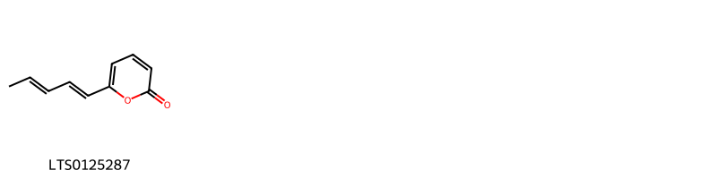{ width=100% }
    <figcaption>Hình ảnh cấu trúc hóa học của 1 hoạt chất thuộc nhóm Pyrans gồm ['6-[(1e,3e)-penta-1,3-dien-1-yl]pyran-2-one (LTS0125287)'].</figcaption>
</figure>
### Nhóm Pyridines and derivatives
<figure markdown="span">
    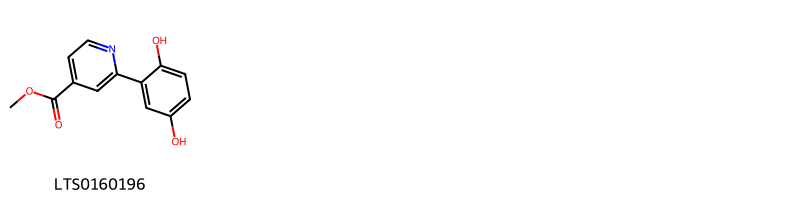{ width=100% }
    <figcaption>Hình ảnh cấu trúc hóa học của 1 hoạt chất thuộc nhóm Pyridines and derivatives gồm ['methyl 2-(2,5-dihydroxyphenyl)pyridine-4-carboxylate (LTS0160196)'].</figcaption>
</figure>
### Nhóm Pyrimidine nucleosides
<figure markdown="span">
    { width=100% }
    <figcaption>Hình ảnh cấu trúc hóa học của 1 hoạt chất thuộc nhóm Pyrimidine nucleosides gồm ['uridine (LTS0220125)'].</figcaption>
</figure>
### Nhóm Saturated hydrocarbons
<figure markdown="span">
    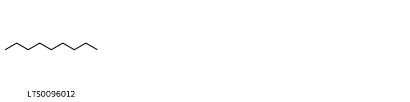{ width=100% }
    <figcaption>Hình ảnh cấu trúc hóa học của 1 hoạt chất thuộc nhóm Saturated hydrocarbons gồm ['nonane (LTS0096012)'].</figcaption>
</figure>
### Nhóm Steroids and steroid derivatives
<figure markdown="span">
    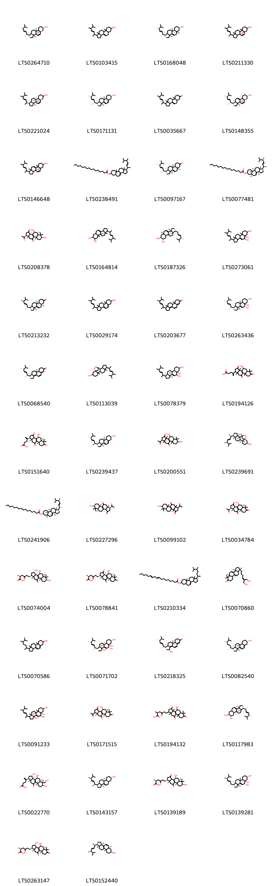{ width=100% }
    <figcaption>Hình ảnh cấu trúc hóa học của 75 hoạt chất thuộc nhóm Steroids and steroid derivatives gồm ['ergosterol peroxide (LTS0264710)', '1-(5,6-dimethylhept-3-en-2-yl)-9a,11a-dimethyl-1h,2h,3h,3ah,5h,5ah,6h,7h,8h,9h,9bh,10h,11h-cyclopenta[a]phenanthren-7-ol (LTS0103415)', '5α-ergosta-7,22-dien-3β-ol (LTS0168048)', '5-(5,6-dimethylhept-3-en-2-yl)-6,10-dimethyl-16,17-dioxapentacyclo[13.2.2.0¹,⁹.0²,⁶.0¹⁰,¹⁵]nonadec-18-en-13-ol (LTS0211330)', '(1s,2s,5s,6r,9s,10r,15s)-5-(5,6-dimethylhept-3-en-2-yl)-6,10-dimethyl-16,17-dioxapentacyclo[13.2.2.0¹,⁹.0²,⁶.0¹⁰,¹⁵]nonadec-18-en-13-ol (LTS0221024)', 'ergosterol (LTS0171131)', '1-(5,6-dimethylhept-3-en-2-yl)-9a,11a-dimethyl-1h,2h,3h,3ah,5h,5ah,6h,8h,9h,9bh,10h,11h-cyclopenta[a]phenanthren-7-one (LTS0035667)', '(1s,2r,5r,6r,10r,13s,15s)-5-[(2r,3e,5r)-5,6-dimethylhept-3-en-2-yl]-6,10-dimethyl-16,17-dioxapentacyclo[13.2.2.0¹,⁹.0²,⁶.0¹⁰,¹⁵]nonadeca-8,18-dien-13-ol (LTS0148355)', '5-(5,6-dimethylhept-3-en-2-yl)-6,10-dimethyl-16,17-dioxapentacyclo[13.2.2.0¹,⁹.0²,⁶.0¹⁰,¹⁵]nonadeca-8,18-dien-13-ol (LTS0146648)', '1-(5,6-dimethylhept-3-en-2-yl)-9a,11a-dimethyl-1h,2h,3h,3ah,5h,5ah,6h,7h,8h,9h,9bh,10h,11h-cyclopenta[a]phenanthren-7-yl hexadecanoate (LTS0238491)', '(1r,3ar,5as,9as,9br,11ar)-1-[(2r,3e,5r)-5,6-dimethylhept-3-en-2-yl]-9a,11a-dimethyl-1h,2h,3h,3ah,5h,5ah,6h,8h,9h,9bh,10h,11h-cyclopenta[a]phenanthren-7-one (LTS0097167)', '(1r,3ar,5as,7s,9as,9br,11ar)-1-[(2r,3e,5r)-5,6-dimethylhept-3-en-2-yl]-9a,11a-dimethyl-1h,2h,3h,3ah,5h,5ah,6h,7h,8h,9h,9bh,10h,11h-cyclopenta[a]phenanthren-7-yl hexadecanoate (LTS0077481)', '(1s,3ar,4s,5ar,7s,9as,11ar)-1-acetyl-4,7-dihydroxy-3a,6,6,9a,11a-pentamethyl-1h,2h,4h,5h,5ah,7h,8h,9h,11h-cyclopenta[a]phenanthrene-3,10-dione (LTS0208378)', '1-(5,6-dimethylhept-3-en-2-yl)-9a,11a-dimethyl-1h,2h,3h,3ah,5h,5ah,6h,7h,8h,9h,10h,11h-cyclopenta[a]phenanthrene-7,8,9b-triol (LTS0164814)', '(1r,3ar,5as,7s,8s,9as,9bs,11ar)-1-[(2r,3e,5r)-5,6-dimethylhept-3-en-2-yl]-9a,11a-dimethyl-1h,2h,3h,3ah,5h,5ah,6h,7h,8h,9h,10h,11h-cyclopenta[a]phenanthrene-7,8,9b-triol (LTS0187326)', '1-(5,6-dimethylhept-3-en-2-yl)-9a,11a-dimethyl-1h,2h,3h,3ah,5h,6h,7h,8h,9h,9bh,10h,11h-cyclopenta[a]phenanthrene-5,5a,7-triol (LTS0273061)', '(1r,3ar,5ar,9as,9br,11ar)-1-[(2r,3e,5s)-5,6-dimethylhept-3-en-2-yl]-9a,11a-dimethyl-1h,2h,3h,3ah,5h,5ah,6h,8h,9h,9bh,10h,11h-cyclopenta[a]phenanthren-7-one (LTS0213232)', '1-(5,6-dimethylhept-3-en-2-yl)-9a,11a-dimethyl-1h,2h,3h,3ah,6h,7h,8h,9h,9bh,10h,11h-cyclopenta[a]phenanthren-7-ol (LTS0029174)', '1-(5,6-dimethylhept-3-en-2-yl)-9a,11a-dimethyl-1h,2h,3h,8h,9h,9bh,10h,11h-cyclopenta[a]phenanthren-7-one (LTS0203677)', 'cerevisterol (LTS0263436)', '(1r,9ar,9br,11ar)-1-[(2r,3e,5r)-5,6-dimethylhept-3-en-2-yl]-9a,11a-dimethyl-1h,2h,3h,8h,9h,9bh,10h,11h-cyclopenta[a]phenanthren-7-one (LTS0068540)', '11-(5,6-dimethylhept-3-en-2-yl)-6,10-dimethyl-17,18-dioxapentacyclo[14.2.1.0¹,⁶.0⁷,¹⁵.0¹⁰,¹⁴]nonadecan-3-ol (LTS0113039)', '(3ar,5ar,9ar,9br,11ar)-1-(5,6-dimethylhept-3-en-2-yl)-9a,11a-dimethyl-1h,2h,3h,3ah,5h,6h,7h,8h,9h,9bh,10h,11h-cyclopenta[a]phenanthrene-5,5a,7-triol (LTS0078379)', '4-{4-hydroxy-3a,6,6,9a,11a-pentamethyl-3,7,10-trioxo-1h,2h,4h,5h,5ah,8h,9h,11h-cyclopenta[a]phenanthren-1-yl}pent-4-enoic acid (LTS0194126)', '4-[(1r,3ar,4s,5ar,9as,11ar)-4-hydroxy-3a,6,6,9a,11a-pentamethyl-3,7,10-trioxo-1h,2h,4h,5h,5ah,8h,9h,11h-cyclopenta[a]phenanthren-1-yl]pent-4-enoic acid (LTS0151640)', '(1r,3ar,7s,9ar,9bs,11ar)-1-[(2s,3e,5r)-5,6-dimethylhept-3-en-2-yl]-9a,11a-dimethyl-1h,2h,3h,3ah,6h,7h,8h,9h,9bh,10h,11h-cyclopenta[a]phenanthren-7-ol (LTS0239437)', '1-acetyl-4,7-dihydroxy-3a,6,6,9a,11a-pentamethyl-1h,2h,4h,5h,5ah,7h,8h,9h,11h-cyclopenta[a]phenanthrene-3,10-dione (LTS0200551)', '(1s,3s,6r,7s,10r,11r,14s,15s,16r)-11-[(2r,3e,5r)-5,6-dimethylhept-3-en-2-yl]-6,10-dimethyl-17,18-dioxapentacyclo[14.2.1.0¹,⁶.0⁷,¹⁵.0¹⁰,¹⁴]nonadecan-3-ol (LTS0239691)', '(1r,3ar,5ar,7s,9as,9br,11ar)-1-[(2s,3e,5r)-5,6-dimethylhept-3-en-2-yl]-9a,11a-dimethyl-1h,2h,3h,3ah,5h,5ah,6h,7h,8h,9h,9bh,10h,11h-cyclopenta[a]phenanthren-7-yl hexadecanoate (LTS0241906)', '(1s,3ar,5ar,7s,9as,11ar)-1-acetyl-7-hydroxy-3a,6,6,9a,11a-pentamethyl-1h,2h,4h,5h,5ah,7h,8h,9h,11h-cyclopenta[a]phenanthrene-3,10-dione (LTS0227296)', '1-acetyl-7-hydroxy-3a,6,6,9a,11a-pentamethyl-1h,2h,4h,5h,5ah,7h,8h,9h,11h-cyclopenta[a]phenanthrene-3,10-dione (LTS0099102)', '(1s,3ar,4s,5ar,9as,11ar)-1-acetyl-4-hydroxy-3a,6,6,9a,11a-pentamethyl-1h,2h,4h,5h,5ah,8h,9h,11h-cyclopenta[a]phenanthrene-3,7,10-trione (LTS0034784)', '(2s)-6-[(1s,3s,3ar,4s,5ar,7s,9as,11ar)-3,4,7-trihydroxy-3a,6,6,9a,11a-pentamethyl-10-oxo-1h,2h,3h,4h,5h,5ah,7h,8h,9h,11h-cyclopenta[a]phenanthren-1-yl]-2-methyl-4-oxohexanoic acid (LTS0074004)', '(2s)-6-[(1s,3ar,4s,5ar,9as,11ar)-4-hydroxy-3a,6,6,9a,11a-pentamethyl-3,7,10-trioxo-1h,2h,4h,5h,5ah,8h,9h,11h-cyclopenta[a]phenanthren-1-yl]-2-methyl-4-oxohexanoic acid (LTS0078841)', '1-(5,6-dimethylheptan-2-yl)-9a,11a-dimethyl-1h,2h,3h,3ah,5h,5ah,6h,7h,8h,9h,9bh,10h,11h-cyclopenta[a]phenanthren-7-yl octadeca-9,12-dienoate (LTS0210334)', '(1r,3ar,5ar,9as,11as)-1-[(2r)-7-hydroxy-6-(hydroxymethyl)hept-5-en-2-yl]-1,6,6,9a,11a-pentamethyl-2h,3h,3ah,5h,5ah,8h,9h,11h-cyclopenta[a]phenanthren-7-one (LTS0070860)', '1-(5,6-dimethylheptan-2-yl)-9a,11a-dimethyl-1h,2h,3h,3ah,6h,7h,8h,9h,9bh,10h,11h-cyclopenta[a]phenanthren-7-ol (LTS0070586)', '(1r,3as,5r,5ar,7s,9ar,9bs,11ar)-1-[(2r,3e,5r)-5,6-dimethylhept-3-en-2-yl]-9a,11a-dimethyl-1h,2h,3h,5h,6h,7h,8h,9h,10h,11h-cyclopenta[a]phenanthrene-3a,5,5a,7,9b-pentol (LTS0071702)', '(1r,3s,9ar,9br,11ar)-1-[(2r,3e,5r)-5,6-dimethylhept-3-en-2-yl]-3-hydroxy-9a,11a-dimethyl-1h,2h,3h,8h,9h,9bh,10h,11h-cyclopenta[a]phenanthren-7-one (LTS0218325)', 'ergosta-5,7-dien-3β-ol (LTS0082540)', '1-(5,6-dimethylhept-3-en-2-yl)-9a,11a-dimethyl-1h,2h,3h,5h,6h,7h,8h,9h,10h,11h-cyclopenta[a]phenanthrene-3a,5,5a,7,9b-pentol (LTS0091233)', '(3ar,4s,5ar,9as,11ar)-1-acetyl-4-hydroxy-3a,6,6,9a,11a-pentamethyl-1h,2h,4h,5h,5ah,8h,9h,11h-cyclopenta[a]phenanthrene-3,7,10-trione (LTS0171515)', '6-{4-hydroxy-3a,6,6,9a,11a-pentamethyl-3,7,10-trioxo-1h,2h,4h,5h,5ah,8h,9h,11h-cyclopenta[a]phenanthren-1-yl}-2-methyl-4-oxohexanoic acid (LTS0194132)', '(1r,3ar,7s,8s,9as,9bs,11ar)-1-[(2r,5r)-5,6-dimethylhept-3-en-2-yl]-9a,11a-dimethyl-1h,2h,3h,3ah,5h,5ah,6h,7h,8h,9h,10h,11h-cyclopenta[a]phenanthrene-7,8,9b-triol (LTS0117983)', '4-[(1r,3s,3ar,4s,5ar,6r,7s,9as,11ar)-3,4,7-trihydroxy-6-(hydroxymethyl)-3a,6,9a,11a-tetramethyl-10-oxo-1h,2h,3h,4h,5h,5ah,7h,8h,9h,11h-cyclopenta[a]phenanthren-1-yl]pent-4-enoic acid (LTS0022770)', '(1s,3as,7s,9as,9bs,11ar)-1-[(2s,3e,5s)-5,6-dimethylhept-3-en-2-yl]-9a,11a-dimethyl-1h,2h,3h,3ah,5h,5ah,6h,7h,8h,9h,9bh,10h,11h-cyclopenta[a]phenanthren-7-ol (LTS0143157)', '(2s)-6-[(1s,3ar,4s,5ar,7s,9as,11ar)-4,7-dihydroxy-3a,6,6,9a,11a-pentamethyl-3,10-dioxo-1h,2h,4h,5h,5ah,7h,8h,9h,11h-cyclopenta[a]phenanthren-1-yl]-2-methyl-4-oxohexanoic acid (LTS0139189)', '(1r,3ar,5r,5ar,7s,9ar,9bs,11ar)-1-[(2r,3e,5s)-5,6-dimethylhept-3-en-2-yl]-9a,11a-dimethyl-1h,2h,3h,3ah,5h,6h,7h,8h,9h,9bh,10h,11h-cyclopenta[a]phenanthrene-5,5a,7-triol (LTS0139281)', '(2s)-6-[(1s,3s,3ar,4s,5ar,9as,11ar)-3,4-dihydroxy-3a,6,6,9a,11a-pentamethyl-7,10-dioxo-1h,2h,3h,4h,5h,5ah,8h,9h,11h-cyclopenta[a]phenanthren-1-yl]-2-methyl-4-oxohexanoic acid (LTS0263147)', '(1r,3ar,5ar,7s,9as,11ar)-1-[(2r,3e,5r)-5,6-dimethylhept-3-en-2-yl]-9a,11a-dimethyl-1h,2h,3h,3ah,5ah,6h,7h,8h,9h,10h,11h-cyclopenta[a]phenanthren-7-ol (LTS0152440)', '6-{3,4-dihydroxy-3a,6,6,9a,11a-pentamethyl-7,10-dioxo-1h,2h,3h,4h,5h,5ah,8h,9h,11h-cyclopenta[a]phenanthren-1-yl}-2-methyl-4-oxohexanoic acid (LTS0165474)', '2-methyl-4-oxo-6-{3,4,7-trihydroxy-3a,6,6,9a,11a-pentamethyl-10-oxo-1h,2h,3h,4h,5h,5ah,7h,8h,9h,11h-cyclopenta[a]phenanthren-1-yl}hexanoic acid (LTS0163691)', '(1r,3s,9ar,11ar)-1-[(2r,3e,5r)-5,6-dimethylhept-3-en-2-yl]-3-hydroxy-9a,11a-dimethyl-1h,2h,3h,8h,9h,9bh,10h,11h-cyclopenta[a]phenanthren-7-one (LTS0264973)', '1-(5,6-dimethylhept-3-en-2-yl)-9a,11a-dimethyl-1h,2h,3h,3ah,5h,5ah,6h,7h,8h,9h,9bh,10h,11h-cyclopenta[a]phenanthren-7-yl pentadecanoate (LTS0259546)', '(1r,3ar,5as,7s,9as,9br,11ar)-1-[(2r,3e,5r)-5,6-dimethylhept-3-en-2-yl]-9a,11a-dimethyl-1h,2h,3h,3ah,5h,5ah,6h,7h,8h,9h,9bh,10h,11h-cyclopenta[a]phenanthren-7-yl (9z,12z)-octadeca-9,12-dienoate (LTS0178950)', '(1r,3ar,5as,7s,9as,9br,11ar)-1-[(2r,5s)-5,6-dimethylheptan-2-yl]-9a,11a-dimethyl-1h,2h,3h,3ah,5h,5ah,6h,7h,8h,9h,9bh,10h,11h-cyclopenta[a]phenanthren-7-yl (9z,12z)-octadeca-9,12-dienoate (LTS0066735)', 'methyl 4-{4-hydroxy-3a,6,6,9a,11a-pentamethyl-3,7,10-trioxo-1h,2h,4h,5h,5ah,8h,9h,11h-cyclopenta[a]phenanthren-1-yl}pent-4-enoate (LTS0216434)', '1-(5,6-dimethylhept-3-en-2-yl)-9a,11a-dimethyl-1h,2h,3h,3ah,5ah,6h,7h,8h,9h,10h,11h-cyclopenta[a]phenanthren-7-ol (LTS0080684)', '(1r,3ar,5ar,9as,11ar)-1-[(2r,5s)-6-hydroxy-5,6-dimethylheptan-2-yl]-3a,6,6,9a,11a-pentamethyl-1h,2h,3h,5h,5ah,8h,9h,11h-cyclopenta[a]phenanthren-7-one (LTS0069253)', '6-{4,7-dihydroxy-3a,6,6,9a,11a-pentamethyl-3,10-dioxo-1h,2h,4h,5h,5ah,7h,8h,9h,11h-cyclopenta[a]phenanthren-1-yl}-2-methyl-4-oxohexanoic acid (LTS0223298)', '4-[3,4,7-trihydroxy-6-(hydroxymethyl)-3a,6,9a,11a-tetramethyl-10-oxo-1h,2h,3h,4h,5h,5ah,7h,8h,9h,11h-cyclopenta[a]phenanthren-1-yl]pent-4-enoic acid (LTS0231511)', 'methyl 4-{3a,6,6,9a,11a-pentamethyl-3,4,7,10-tetraoxo-1h,2h,5h,5ah,8h,9h,11h-cyclopenta[a]phenanthren-1-yl}pent-4-enoate (LTS0080613)', '1-acetyl-3,4,7-trihydroxy-3a,6,6,9a,11a-pentamethyl-1h,2h,3h,4h,5h,5ah,7h,8h,9h,11h-cyclopenta[a]phenanthren-10-one (LTS0019959)', '(1r,3ar,5as,7s,9as,9br,11ar)-1-[(2r,3e,5r)-5,6-dimethylhept-3-en-2-yl]-9a,11a-dimethyl-1h,2h,3h,3ah,5h,5ah,6h,7h,8h,9h,9bh,10h,11h-cyclopenta[a]phenanthren-7-yl pentadecanoate (LTS0160649)', '1-(5,6-dimethylhept-3-en-2-yl)-3-hydroxy-9a,11a-dimethyl-1h,2h,3h,8h,9h,9bh,10h,11h-cyclopenta[a]phenanthren-7-one (LTS0204436)', '1-(5,6-dimethylhept-3-en-2-yl)-9a,11a-dimethyl-1h,2h,3h,3ah,5h,5ah,6h,7h,8h,9h,9bh,10h,11h-cyclopenta[a]phenanthren-7-yl octadeca-9,12-dienoate (LTS0254144)', 'methyl 4-[(1r,3ar,4s,5ar,9as,11ar)-4-hydroxy-3a,6,6,9a,11a-pentamethyl-3,7,10-trioxo-1h,2h,4h,5h,5ah,8h,9h,11h-cyclopenta[a]phenanthren-1-yl]pent-4-enoate (LTS0001488)', '(1r,3r,9ar,9br,11ar)-1-[(2r,3e,5r)-5,6-dimethylhept-3-en-2-yl]-3-hydroxy-9a,11a-dimethyl-1h,2h,3h,8h,9h,9bh,10h,11h-cyclopenta[a]phenanthren-7-one (LTS0030085)', '(2s,6r)-6-[(1s,3ar,4s,5ar,7s,9as,11ar)-4,7-dihydroxy-3a,6,6,9a,11a-pentamethyl-3,10-dioxo-1h,2h,4h,5h,5ah,7h,8h,9h,11h-cyclopenta[a]phenanthren-1-yl]-6-hydroxy-2-methyl-4-oxohexanoic acid (LTS0011678)', '6-{4,7-dihydroxy-3a,6,6,9a,11a-pentamethyl-3,10-dioxo-1h,2h,4h,5h,5ah,7h,8h,9h,11h-cyclopenta[a]phenanthren-1-yl}-6-hydroxy-2-methyl-4-oxohexanoic acid (LTS0078953)', 'methyl 4-[(1r,3ar,5ar,9as,11ar)-3a,6,6,9a,11a-pentamethyl-3,4,7,10-tetraoxo-1h,2h,5h,5ah,8h,9h,11h-cyclopenta[a]phenanthren-1-yl]pent-4-enoate (LTS0017733)', 'ganodesterone (LTS0030259)', '1-(5,6-dimethylhept-3-en-2-yl)-9a,11a-dimethyl-1h,2h,3h,3ah,8h,9h,9bh,10h,11h-cyclopenta[a]phenanthrene-5,7-dione (LTS0089924)', '(6r)-6-[(3r,3ar,7s)-3,7-dihydroxy-3a,6,6,9a,11,11a-hexamethyl-4,10-dioxo-1h,2h,3h,5h,5ah,7h,8h,9h,11h-cyclopenta[a]phenanthren-1-yl]-6-(acetyloxy)-2-methyl-4-oxohexanoic acid (LTS0119041)', '(1s,3s,3ar,4s,5ar,7s,9as,11ar)-1-acetyl-3,4,7-trihydroxy-3a,6,6,9a,11a-pentamethyl-1h,2h,3h,4h,5h,5ah,7h,8h,9h,11h-cyclopenta[a]phenanthren-10-one (LTS0263112)'].</figcaption>
</figure>
### Nhóm Stilbenes
<figure markdown="span">
    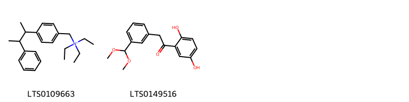{ width=100% }
    <figcaption>Hình ảnh cấu trúc hóa học của 2 hoạt chất thuộc nhóm Stilbenes gồm ['triethyl({[4-(3-phenylbutan-2-yl)phenyl]methyl})azanium (LTS0109663)', '1-(2,5-dihydroxyphenyl)-2-[3-(dimethoxymethyl)phenyl]ethanone (LTS0149516)'].</figcaption>
</figure>
### Nhóm Tetrahydrofurans
<figure markdown="span">
    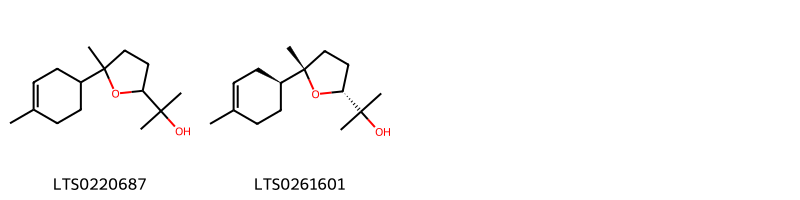{ width=100% }
    <figcaption>Hình ảnh cấu trúc hóa học của 2 hoạt chất thuộc nhóm Tetrahydrofurans gồm ['bisabolol oxide b (LTS0220687)', '2-[(2r,5s)-5-methyl-5-[(1s)-4-methylcyclohex-3-en-1-yl]oxolan-2-yl]propan-2-ol (LTS0261601)'].</figcaption>
</figure>
### Nhóm Unsaturated hydrocarbons
<figure markdown="span">
    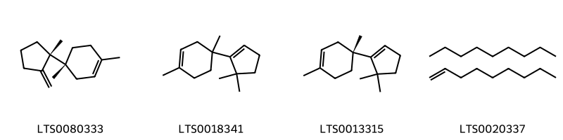{ width=100% }
    <figcaption>Hình ảnh cấu trúc hóa học của 4 hoạt chất thuộc nhóm Unsaturated hydrocarbons gồm ['bazzanene (LTS0080333)', '4-(5,5-dimethylcyclopent-1-en-1-yl)-1,4-dimethylcyclohex-1-ene (LTS0018341)', '(4r)-4-(5,5-dimethylcyclopent-1-en-1-yl)-1,4-dimethylcyclohex-1-ene (LTS0013315)', 'nonane; nonene (LTS0020337)'].</figcaption>
</figure>

---

## Tác dụng dược lý

Theo tài liệu "Những cây thuốc và vị thuốc Việt Nam" - Đỗ Tất Lợi:Thanh chỉ tính bình, không độc chủ trị sáng mắt, bổ can khí, an thần, tăng trí nhớ, cường khí, chữa viêm gan cấp và mãn tính.
Hồng chỉ (xích chi, đơn chi) vị đắng, tính bình, không độc, tăng trí nhớ, chữa các bệnh thuộc về huyết và thần kinh, tim.
Hoàng chỉ (kim chi) vị ngọt, tính bình, không độc, làm mạnh hệ thống miễn dịch.
Hắc chỉ (huyển chi) vị mặn, tính bình, không độc, chủ trị bí tiểu tiện, sỏi thận, bệnh ở cơ quan bài tiết.
Bạch chỉ (ngọc chi) vị cay, tính bình, không độc, chủ trị hen, ích phế khí.
Tử chỉ (linh chi tím) vị ngọt, tính ôn, không có độc, chủ trị đau nhức khớp xương, gân cốt.
Nói tóm lại dùng 6 loại linh chi lâu ngày sẽ giúp cho nhẹ người, tăng tuổi thọ.

Theo tài liệu quốc tế: nan

---

## Dược điển Việt Nam V

### Soi bột:
nan
<!-- Hình ảnh soi bột sẽ được tự động chèn vào đây sau -->
### Vi phẫu:
nan
<!-- Hình ảnh vi phẫu sẽ được tự động chèn vào đây sau -->
### Định tính

nan

### Định lượng

nan

### Thông tin khác 
- ** Độ ẩm: ** nan

- ** Bảo quản:** nan
## Dược điển Hồng kong

<!-- PDF sẽ được tự động chèn vào đây sau -->

---

## Y dược học cổ truyền

- **Tên vị thuốc:** nan
- **Tính vị quy kinh:** Vị hơi đăng, ngọt. Tính ôn, bình, không độc. Vào kinh can, thận.
- **Công năng chủ trị:** Hành khí, hoạt huyết, tư bổ chính khí. Chủ trị: Hư lao (sức đề kháng giảm, tiêu hỏa kém, mỡ máu cao, khí huyết hư), khí huyết ứ trệ (bệnh mạch vành, tăng huyết áp, thống phong thấp khớp).
- **Chú ý:** nan
- **Kiêng kỵ:** nan

