!!! abstract "Tóm tắt"
    Liên Kiều có tên khoa học Forsythia suspensa (Thunb.) Vahl., thuộc họ Oleaceae (Nhài) được phân bố chủ yếu ở Trung Quốc. Liên Kiều có tác dụng thanh nhiệt giải độc, tiêu sưng tán kết. Chủ trị: Đinh nhọt,  tràng nhạc, đờm hạch, nhũ ung, đan độc (viêm quầng đỏ); cảm mạo phong nhiệt, ôn bệnh vào tâm bào sốt cao gây háo khát, tinh thần hôn ám (mê sáng), phát ban; lâm lậu kèm bí tiểu tiện. Trong liên kiều có một glucosid gọi là phillyrin C31H48O16, Forsythin, Forsythiaside, Sắt, Canxi, Đồng, Magnesium, Kali, Natri, Kẽm... Nước sắc Liên Kiều có tác dụng kháng sinh.

## Thông tin về thực vật

### Đặc điểm thực vật

Dược liệu **Liên Kiều (Quả)** từ bộ phận **Quả** từ loài *Forsythia suspensa (Thunb.) Vahl.* thuộc họ Oleaceae. Liên kiều là một cây cao từ 2 đến 4m. Cành non gần như 4 cạnh có nhiều đốt; giữa các đốt thân rỗng, bì không rõ. Lá đơn mọc đối hoặc có khi mọc thành vòng 3 lá, cuống dài 0,80-2cm. Phiến lá hình trứng, dài 3-7cm, rộng 2-4cm, mép có răng cưa không đều, chất lá hơi dài. Hoa màu vàng tươi. Đài và tràng hình ống, trên xẻ thành 4 thuỳ. 2 nhị thấp hơn tràng. Nhuy có 2 nuốm. Quả khô, hình trứng dẹt, dài 1,5 - 2cm, rộng 0,5 - 1cm, hai bên có cạnh lồi, đầu nhọn, khi chín mở ra như mỏ chim, phía dưới có cuống hay chỉ còn sẹo. Vỏ ngoài màu nâu nhạt. Trong quả có nhiều hạt, nhưng phần lớn rơi vãi đi, chỉ còn sót lại một ít. Mùa hoa tại Trung Quốc: tháng 3-5; mùa quả: tháng 7-8. 

!!! info "Phân loại thực vật của *Forsythia suspensa*"
    - **Kingdom:** Plantae
    - **Phylum:** Tracheophyta
    - **Order:** Lamiales
    - **Family:** Oleaceae
    - **Genus:** Forsythia
    - **Species:** *Forsythia suspensa*

*Tài liệu tham khảo:* "Những cây thuốc và vị thuốc Việt Nam" - Đỗ Tất Lợi

 

### Loài thay thế (Nếu có)

### Phân bố trên thế giới
**Từ vườn thực vật KEW: **: Bản địa: China North-Central, China South-Central, China Southeast, Inner Mongolia
Di thực: Arkansas, Bulgaria, Czechoslovakia, Germany, Great Britain, Illinois, Ireland, Japan, Kansas, Kentucky, Korea, Maryland, Montana, New York, Romania, Spain, Utah, Washington

**Từ CSDL GIBF** Poland, Spain, Austria, Belgium, Norway, Germany, Latvia, Netherlands, Denmark, Slovakia, Sweden, Hungary, China, United Kingdom of Great Britain and Northern Ireland, Japan, Estonia, Czechia, Switzerland, United States of America, France, Chinese Taipei, Canada

### Phân bố tại Việt Nam
** "Những cây thuốc và vị thuốc Việt Nam" - Đỗ Tất Lợi**: Cây liên kiều chưa thấy ở Việt nam. Hiện nay vị liên kiều ta dùng vẫn phải nhập từ Trung Quốc.

**Từ CSDL GIBF**: Không có ghi nhận ở Việt Nam

---

## Thông tin về dược liệu 

### Định danh

!!! info "Thông tin về tên gọi của liên kiều"
    - Dược liệu tiếng Việt: liên kiều
    - Dược liệu tiếng Trung:  (Lian Qiao)
    - Dược liệu tiếng Anh: weeping forsythia and golden-bell
    - Dược liệu latin thông dụng: Fructus Forsythiae suspensaenFructus Forsythiae
    - Dược liệu latin kiểu DĐVN: fructus forsythiae suspensae
    - Dược liệu latin kiểu DĐVN: Fructus Forsythiae
    - Dược liệu latin kiểu thông tư: Fructus Forsythiae
    - Bộ phận dùng: Quả (Fructus)

### Mô tả dược liệu 
- **Theo dược điển Việt nam V:** Quả hình trứng đến hình trứng hẹp, hơi dẹt, dài 1,5 cm đến  2,5 cm, đường kính 0,5 cm đến 1,3 cm. Mặt ngoài có vết  nhăn dọc không đều và nhiều chấm nhỏ nhô lên. Mỗi mặt  có một rãnh dọc. Đỉnh nhỏ, nhọn, đáy có cuống quả nhỏ  hoặc vết cuống đã rụng. Có 2 loại quả Liên kiều là Thanh  kiều và Lão kiều. Thanh kiều thường không nứt ra, màu  nâu lục, chấm nhỏ màu trắng xám nhô lên ít, chất cứng,  hạt nhiều, màu vàng lục, nhỏ dài, một bên có cánh. Lão kiều nứt ra từ đỉnh hoặc nứt thành 2 mảnh, mặt ngoài màu  nâu vàng hoặc nâu đỏ, mặt trong màu vàng nâu nhạt, trơn phẳng, có một vách ngăn dọc. Chất giòn dễ vỡ. Hạt màu  nâu, dài 5 mm đến 7 mm, một bên có cánh, phần lớn đã  rụng. Mùi thơm nhẹ, vị đắng.

- **Mô tả dược liệu theo thông tư chế biến dược liệu theo phương pháp cổ truyền:** 

### Chế biến 

- **Chế biến theo dược điển việt nam V**: Thu hoạch vào mùa thu. Thu hái những quả gần chín và  hơi xanh lục, loại bỏ tạp chất, đồ chín và phơi hay sấy khô  gọi là Thanh kiều. Thu hái những quả đã chín nục, phơi  hay sấy khô và loại bỏ tạp chất gọi là Lão kiều. Bào chế Loại bỏ tạp chất, loại bỏ cuống, chà xát cho nứt quả, sàng  bỏ hạt, lõi, phơi hoặc sấy khô.nn

- **Chế biến theo thông tư:** 

--- 

## Thành phần hóa học

- Theo tài liệu của GS. Đỗ Tất Lợi:  (1) Forsythin (C27H34O11, M=534,55g/mol)
Forsythiaside (C29H36O15, M=624.59)
Phillyrin (C27H34O11, M=534.55)
Pinoresinol (C20H22O6, M=358.39) 
Arctiin (C27H34O11, M=534.55) 
Rutin (C27H30O16, M=610.52) 
Oleanolic acid (C30H48O3, M=456.7)
Ursolic acid 
Suspensaside
Sắt, Canxi, Đồng, Magnesium, Kali, Natri, Kẽm
...
(2) Dược điển Việt Nam: Forsythin & Forsythosid A
Dược điển Hồng Kông: maker Phillyrin
    
- Theo cơ sở dữ liệu lotus: Từ loài *Forsythia suspensa* đã phân lập và xác định được 94 hoạt chất thuộc về các nhóm Lignan glycosides, Organooxygen compounds, Benzofurans, Saccharolipids, Prenol lipids, Fatty Acyls, Steroids and steroid derivatives, Tetrahydrofurans, Carboxylic acids and derivatives, Furanoid lignans, Phenols, Indoles and derivatives, Benzene and substituted derivatives, Cinnamic acids and derivatives, Flavonoids. 

|    | chemicalTaxonomyClassyfireClass     |   smiles_count |
|---:|:------------------------------------|---------------:|
|  0 | Benzene and substituted derivatives |              1 |
|  1 | Benzofurans                         |              2 |
|  2 | Carboxylic acids and derivatives    |              2 |
|  3 | Cinnamic acids and derivatives      |             12 |
|  4 | Fatty Acyls                         |              2 |
|  5 | Flavonoids                          |              2 |
|  6 | Furanoid lignans                    |             15 |
|  7 | Indoles and derivatives             |              1 |
|  8 | Lignan glycosides                   |              6 |
|  9 | Organooxygen compounds              |             26 |
| 10 | Phenols                             |              1 |
| 11 | Prenol lipids                       |             12 |
| 12 | Saccharolipids                      |              3 |
| 13 | Steroids and steroid derivatives    |              5 |
| 14 | Tetrahydrofurans                    |              2 |

### Nhóm Benzene and substituted derivatives
<figure markdown="span">
    { width=100% }
    <figcaption>Hình ảnh cấu trúc hóa học của 1 hoạt chất thuộc nhóm Benzene and substituted derivatives gồm ['vanillic acid (LTS0229113)'].</figcaption>
</figure>
### Nhóm Benzofurans
<figure markdown="span">
    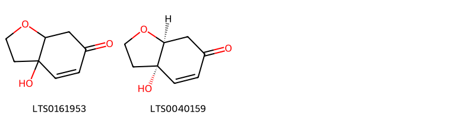{ width=100% }
    <figcaption>Hình ảnh cấu trúc hóa học của 2 hoạt chất thuộc nhóm Benzofurans gồm ['3a-hydroxy-2,3,7,7a-tetrahydro-1-benzofuran-6-one (LTS0161953)', '(3as,7as)-3a-hydroxy-2,3,7,7a-tetrahydro-1-benzofuran-6-one (LTS0040159)'].</figcaption>
</figure>
### Nhóm Carboxylic acids and derivatives
<figure markdown="span">
    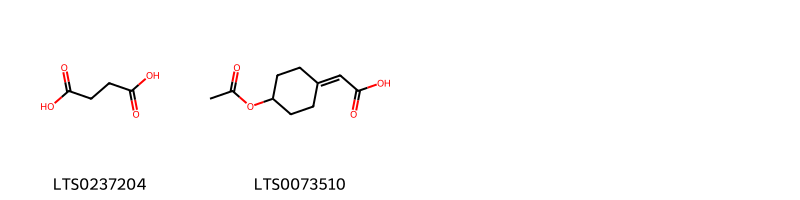{ width=100% }
    <figcaption>Hình ảnh cấu trúc hóa học của 2 hoạt chất thuộc nhóm Carboxylic acids and derivatives gồm ['succinic acid (LTS0237204)', '[4-(acetyloxy)cyclohexylidene]acetic acid (LTS0073510)'].</figcaption>
</figure>
### Nhóm Cinnamic acids and derivatives
<figure markdown="span">
    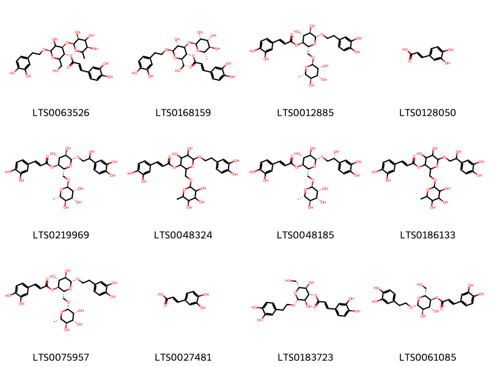{ width=100% }
    <figcaption>Hình ảnh cấu trúc hóa học của 12 hoạt chất thuộc nhóm Cinnamic acids and derivatives gồm ['(3r,4r,6r)-6-[2-(3,4-dihydroxyphenyl)ethoxy]-5-hydroxy-2-(hydroxymethyl)-4-{[(2s,3s,5r)-3,4,5-trihydroxy-6-methyloxan-2-yl]oxy}oxan-3-yl (2e)-3-(3,4-dihydroxyphenyl)prop-2-enoate (LTS0063526)', 'verbascoside (LTS0168159)', 'forsythiaside (LTS0012885)', '3,4-dihydroxycinnamic acid (LTS0128050)', 'suspensaside (LTS0219969)', '6-[2-(3,4-dihydroxyphenyl)ethoxy]-4,5-dihydroxy-2-{[(3,4,5-trihydroxy-6-methyloxan-2-yl)oxy]methyl}oxan-3-yl 3-(3,4-dihydroxyphenyl)prop-2-enoate (LTS0048324)', '(2r,3s,4r,5r,6r)-6-[(2r)-2-(3,4-dihydroxyphenyl)-2-hydroxyethoxy]-4,5-dihydroxy-2-({[(2r,3r,4r,5r,6s)-3,4,5-trihydroxy-6-methyloxan-2-yl]oxy}methyl)oxan-3-yl (2e)-3-(3,4-dihydroxyphenyl)prop-2-enoate (LTS0048185)', '6-[2-(3,4-dihydroxyphenyl)-2-hydroxyethoxy]-4,5-dihydroxy-2-{[(3,4,5-trihydroxy-6-methyloxan-2-yl)oxy]methyl}oxan-3-yl 3-(3,4-dihydroxyphenyl)prop-2-enoate (LTS0186133)', '(2r,3s,4r,5r,6r)-6-[2-(3,4-dihydroxyphenyl)ethoxy]-4,5-dihydroxy-2-({[(2s,3r,4r,5r,6s)-3,4,5-trihydroxy-6-methyloxan-2-yl]oxy}methyl)oxan-3-yl (2e)-3-(3,4-dihydroxyphenyl)prop-2-enoate (LTS0075957)', 'caffeic acid (LTS0027481)', '(2r,3r,4s,5r,6r)-2-[2-(3,4-dihydroxyphenyl)ethoxy]-3,5-dihydroxy-6-(hydroxymethyl)oxan-4-yl (2e)-3-(3,4-dihydroxyphenyl)prop-2-enoate (LTS0183723)', '(2r,3s,4r,5r,6r)-6-[2-(3,4-dihydroxyphenyl)ethoxy]-4,5-dihydroxy-2-(hydroxymethyl)oxan-3-yl (2e)-3-(3,4-dihydroxyphenyl)prop-2-enoate (LTS0061085)'].</figcaption>
</figure>
### Nhóm Fatty Acyls
<figure markdown="span">
    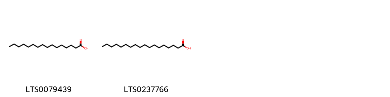{ width=100% }
    <figcaption>Hình ảnh cấu trúc hóa học của 2 hoạt chất thuộc nhóm Fatty Acyls gồm ['palmitic acid (LTS0079439)', 'stearic acid (LTS0237766)'].</figcaption>
</figure>
### Nhóm Flavonoids
<figure markdown="span">
    { width=100% }
    <figcaption>Hình ảnh cấu trúc hóa học của 2 hoạt chất thuộc nhóm Flavonoids gồm ['3-rutinosyl quercetin (LTS0032845)', 'rutin (LTS0042292)'].</figcaption>
</figure>
### Nhóm Furanoid lignans
<figure markdown="span">
    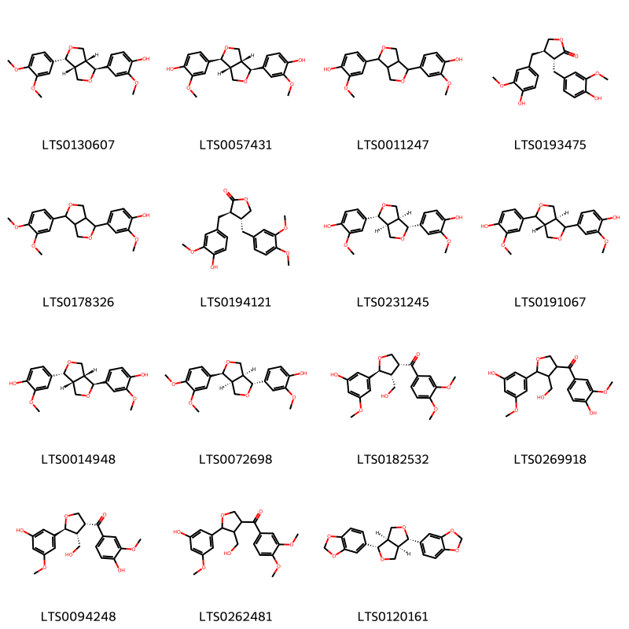{ width=100% }
    <figcaption>Hình ảnh cấu trúc hóa học của 15 hoạt chất thuộc nhóm Furanoid lignans gồm ['sylvatesmin (LTS0130607)', 'pinoresinol (LTS0057431)', 'pinoresinol (LTS0011247)', 'matairesinol (LTS0193475)', '4-[4-(3,4-dimethoxyphenyl)-hexahydrofuro[3,4-c]furan-1-yl]-2-methoxyphenol (LTS0178326)', '(-)-arctigenin (LTS0194121)', '(-)-pinoresinol (LTS0231245)', '4-[(3ar,6as)-4-(4-hydroxy-3-methoxyphenyl)-hexahydrofuro[3,4-c]furan-1-yl]-2-methoxyphenol (LTS0191067)', '4-[(1s,3ar,4r,6ar)-4-(4-hydroxy-3-methoxyphenyl)-hexahydrofuro[3,4-c]furan-1-yl]-2-methoxyphenol (LTS0014948)', '4-[(1r,3as,4s,6as)-4-(3,4-dimethoxyphenyl)-hexahydrofuro[3,4-c]furan-1-yl]-2-methoxyphenol (LTS0072698)', '3-[(2s,3r,4r)-4-(3,4-dimethoxybenzoyl)-3-(hydroxymethyl)oxolan-2-yl]-5-methoxyphenol (LTS0182532)', '3-[4-(4-hydroxy-3-methoxybenzoyl)-3-(hydroxymethyl)oxolan-2-yl]-5-methoxyphenol (LTS0269918)', '3-[(2s,3r,4r)-4-(4-hydroxy-3-methoxybenzoyl)-3-(hydroxymethyl)oxolan-2-yl]-5-methoxyphenol (LTS0094248)', '3-[4-(3,4-dimethoxybenzoyl)-3-(hydroxymethyl)oxolan-2-yl]-5-methoxyphenol (LTS0262481)', 'sesamin (LTS0120161)'].</figcaption>
</figure>
### Nhóm Indoles and derivatives
<figure markdown="span">
    { width=100% }
    <figcaption>Hình ảnh cấu trúc hóa học của 1 hoạt chất thuộc nhóm Indoles and derivatives gồm ['n-[2-(5-methoxy-1h-indol-3-yl)ethyl]ethanimidic acid (LTS0219322)'].</figcaption>
</figure>
### Nhóm Lignan glycosides
<figure markdown="span">
    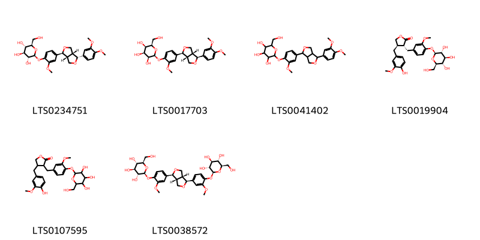{ width=100% }
    <figcaption>Hình ảnh cấu trúc hóa học của 6 hoạt chất thuộc nhóm Lignan glycosides gồm ['forsythin (LTS0234751)', '(2s,3s,4s,5r,6r)-2-{4-[(1s,3ar,4s,6ar)-4-(3,4-dimethoxyphenyl)-hexahydrofuro[3,4-c]furan-1-yl]-2-methoxyphenoxy}-6-(hydroxymethyl)oxane-3,4,5-triol (LTS0017703)', 'phillyrin (LTS0041402)', '(3r,4r)-4-[(4-hydroxy-3-methoxyphenyl)methyl]-3-[(3-methoxy-4-{[(2s,3r,4s,5s,6r)-3,4,5-trihydroxy-6-(hydroxymethyl)oxan-2-yl]oxy}phenyl)methyl]oxolan-2-one (LTS0019904)', '4-[(4-hydroxy-3-methoxyphenyl)methyl]-3-[(3-methoxy-4-{[3,4,5-trihydroxy-6-(hydroxymethyl)oxan-2-yl]oxy}phenyl)methyl]oxolan-2-one (LTS0107595)', '(2s,3r,4s,5s,6r)-2-{4-[(1s,3ar,4s,6ar)-4-(3-methoxy-4-{[(2s,3r,4s,5s,6r)-3,4,5-trihydroxy-6-(hydroxymethyl)oxan-2-yl]oxy}phenyl)-hexahydrofuro[3,4-c]furan-1-yl]-2-methoxyphenoxy}-6-(hydroxymethyl)oxane-3,4,5-triol (LTS0038572)'].</figcaption>
</figure>
### Nhóm Organooxygen compounds
<figure markdown="span">
    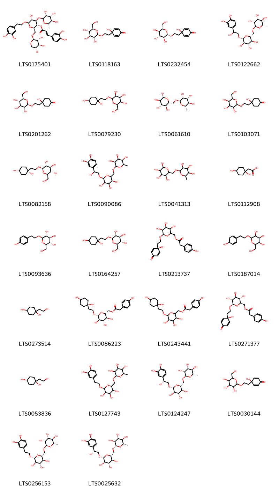{ width=100% }
    <figcaption>Hình ảnh cấu trúc hóa học của 26 hoạt chất thuộc nhóm Organooxygen compounds gồm ['(2r,3r,4r,5r,6r)-6-[2-(3,4-dihydroxyphenyl)ethoxy]-5-hydroxy-4-{[(3r,4r,5r,6s)-3,4,5-trihydroxy-6-methyloxan-2-yl]oxy}-2-({[(2s,3r,4s,5r)-3,4,5-trihydroxyoxan-2-yl]oxy}methyl)oxan-3-yl (2e)-3-(3,4-dihydroxyphenyl)prop-2-enoate (LTS0175401)', '4-hydroxy-4-(2-{[(2r,3r,4s,5s,6r)-3,4,5-trihydroxy-6-(hydroxymethyl)oxan-2-yl]oxy}ethyl)cyclohexa-2,5-dien-1-one (LTS0118163)', '4-hydroxy-4-(2-{[(2s,3s,4r,5r,6s)-3,4,5-trihydroxy-6-(hydroxymethyl)oxan-2-yl]oxy}ethyl)cyclohexa-2,5-dien-1-one (LTS0232454)', '(2r,3r,4r,5r,6s)-2-{[(2r,3s,4s,5r,6r)-6-[2-(3,4-dihydroxyphenyl)-2-hydroxyethoxy]-3,4,5-trihydroxyoxan-2-yl]methoxy}-6-methyloxane-3,4,5-triol (LTS0122662)', '4-hydroxy-4-(2-{[(2r,3r,4s,5s,6r)-3,4,5-trihydroxy-6-(hydroxymethyl)oxan-2-yl]oxy}ethyl)cyclohexan-1-one (LTS0201262)', '2-[2-(1,4-dihydroxycyclohexyl)ethoxy]-6-(hydroxymethyl)oxane-3,4,5-triol (LTS0079230)', 'rutinose (LTS0061610)', '4-hydroxy-4-(2-{[3,4,5-trihydroxy-6-(hydroxymethyl)oxan-2-yl]oxy}ethyl)cyclohexan-1-one (LTS0103071)', '(2r,3s,4s,5r,6r)-2-(hydroxymethyl)-6-{2-[(1s,4s)-1,4-dihydroxycyclohexyl]ethoxy}oxane-3,4,5-triol (LTS0082158)', '2-({6-[2-(3,4-dihydroxyphenyl)-2-hydroxyethoxy]-3,4,5-trihydroxyoxan-2-yl}methoxy)-6-methyloxane-3,4,5-triol (LTS0090086)', 'rutinose (LTS0041313)', '(1,4-dihydroxycyclohexyl)acetic acid (LTS0112908)', 'salidroside (LTS0093636)', '(2r,3r,4s,5s,6r)-2-[2-(1,4-dihydroxycyclohexyl)ethoxy]-6-(hydroxymethyl)oxane-3,4,5-triol (LTS0164257)', '{3,4,5-trihydroxy-6-[2-(1-hydroxy-4-oxocyclohexa-2,5-dien-1-yl)ethoxy]oxan-2-yl}methyl 2-(4-hydroxyphenyl)acetate (LTS0213737)', '2-(hydroxymethyl)-6-[2-(4-hydroxyphenyl)ethoxy]oxane-3,4,5-triol (LTS0187014)', '1-(2-hydroxyethyl)cyclohexane-1,4-diol (LTS0273514)', '[(2r,3s,4s,5r,6r)-3,4,5-trihydroxy-6-{2-[(1s,4s)-1,4-dihydroxycyclohexyl]ethoxy}oxan-2-yl]methyl 2-(4-hydroxyphenyl)acetate (LTS0086223)', '{6-[2-(1,4-dihydroxycyclohexyl)ethoxy]-3,4,5-trihydroxyoxan-2-yl}methyl 2-(4-hydroxyphenyl)acetate (LTS0243441)', '[(2r,3s,4s,5r,6r)-3,4,5-trihydroxy-6-[2-(1-hydroxy-4-oxocyclohexa-2,5-dien-1-yl)ethoxy]oxan-2-yl]methyl 2-(4-hydroxyphenyl)acetate (LTS0271377)', 'rengyol (LTS0053836)', '2-({6-[2-(3,4-dihydroxyphenyl)ethoxy]-3,4,5-trihydroxyoxan-2-yl}methoxy)-6-methyloxane-3,4,5-triol (LTS0127743)', '(2r,3r,4r,5r,6s)-2-{[(2r,3s,4s,5r,6r)-6-[(2r)-2-(3,4-dihydroxyphenyl)-2-hydroxyethoxy]-3,4,5-trihydroxyoxan-2-yl]methoxy}-6-methyloxane-3,4,5-triol (LTS0124247)', '4-hydroxy-4-(2-{[3,4,5-trihydroxy-6-(hydroxymethyl)oxan-2-yl]oxy}ethyl)cyclohexa-2,5-dien-1-one (LTS0030144)', '(2r,3r,4r,5r,6s)-2-{[(2r,3s,4s,5r,6r)-6-[2-(3,4-dihydroxyphenyl)ethoxy]-3,4,5-trihydroxyoxan-2-yl]methoxy}-6-methyloxane-3,4,5-triol (LTS0256153)', '(2s,3s,4r,5r,6s)-2-{[(2r,3s,4s,5r,6r)-6-[(2r)-2-(3,4-dihydroxyphenyl)-2-hydroxyethoxy]-3,4,5-trihydroxyoxan-2-yl]methoxy}-6-methyloxane-3,4,5-triol (LTS0025632)'].</figcaption>
</figure>
### Nhóm Phenols
<figure markdown="span">
    { width=100% }
    <figcaption>Hình ảnh cấu trúc hóa học của 1 hoạt chất thuộc nhóm Phenols gồm ['4-hydroxyphenylacetic acid (LTS0272177)'].</figcaption>
</figure>
### Nhóm Prenol lipids
<figure markdown="span">
    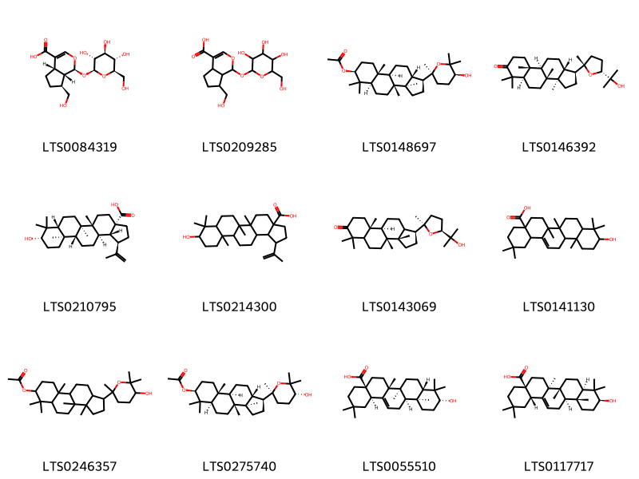{ width=100% }
    <figcaption>Hình ảnh cấu trúc hóa học của 12 hoạt chất thuộc nhóm Prenol lipids gồm ['(1s,4as,7s,7as)-7-(hydroxymethyl)-1-{[(2s,3r,4s,5s,6r)-3,4,5-trihydroxy-6-(hydroxymethyl)oxan-2-yl]oxy}-1h,4ah,5h,6h,7h,7ah-cyclopenta[c]pyran-4-carboxylic acid (LTS0084319)', '7-(hydroxymethyl)-1-{[3,4,5-trihydroxy-6-(hydroxymethyl)oxan-2-yl]oxy}-1h,4ah,5h,6h,7h,7ah-cyclopenta[c]pyran-4-carboxylic acid (LTS0209285)', '(1s,3ar,3br,5ar,7s,9ar,9br,11ar)-1-[(2s,5s)-5-hydroxy-2,6,6-trimethyloxan-2-yl]-3a,3b,6,6,9a-pentamethyl-dodecahydro-1h-cyclopenta[a]phenanthren-7-yl acetate (LTS0148697)', 'ocotillone (LTS0146392)', 'betulinic acid (LTS0210795)', '9-hydroxy-5a,5b,8,8,11a-pentamethyl-1-(prop-1-en-2-yl)-hexadecahydrocyclopenta[a]chrysene-3a-carboxylic acid (LTS0214300)', '(1s,3as,3br,9ar,9br)-1-[(2r,5s)-5-(2-hydroxypropan-2-yl)-2-methyloxolan-2-yl]-3a,3b,6,6,9a-pentamethyl-dodecahydrocyclopenta[a]phenanthren-7-one (LTS0143069)', 'oleanolic acid (LTS0141130)', '1-(5-hydroxy-2,6,6-trimethyloxan-2-yl)-3a,3b,6,6,9a-pentamethyl-dodecahydro-1h-cyclopenta[a]phenanthren-7-yl acetate (LTS0246357)', '(1s,3ar,3br,5ar,7s,9ar,9br,11ar)-1-[(2s,5r)-5-hydroxy-2,6,6-trimethyloxan-2-yl]-3a,3b,6,6,9a-pentamethyl-dodecahydro-1h-cyclopenta[a]phenanthren-7-yl acetate (LTS0275740)', '(4as,6ar,6bs,8as,10r,12as,12br,14br)-10-hydroxy-2,2,6a,6b,9,9,12a-heptamethyl-1,3,4,5,6,7,8,8a,10,11,12,12b,13,14b-tetradecahydropicene-4a-carboxylic acid (LTS0055510)', 'oleanolic acid (LTS0117717)'].</figcaption>
</figure>
### Nhóm Saccharolipids
<figure markdown="span">
    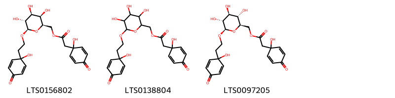{ width=100% }
    <figcaption>Hình ảnh cấu trúc hóa học của 3 hoạt chất thuộc nhóm Saccharolipids gồm ['[(2r,3r,4s,5r,6r)-3,4,5-trihydroxy-6-[2-(1-hydroxy-4-oxocyclohexa-2,5-dien-1-yl)ethoxy]oxan-2-yl]methyl 2-(1-hydroxy-4-oxocyclohexa-2,5-dien-1-yl)acetate (LTS0156802)', '{3,4,5-trihydroxy-6-[2-(1-hydroxy-4-oxocyclohexa-2,5-dien-1-yl)ethoxy]oxan-2-yl}methyl 2-(1-hydroxy-4-oxocyclohexa-2,5-dien-1-yl)acetate (LTS0138804)', '[(2r,3s,4s,5r,6r)-3,4,5-trihydroxy-6-[2-(1-hydroxy-4-oxocyclohexa-2,5-dien-1-yl)ethoxy]oxan-2-yl]methyl 2-(1-hydroxy-4-oxocyclohexa-2,5-dien-1-yl)acetate (LTS0097205)'].</figcaption>
</figure>
### Nhóm Steroids and steroid derivatives
<figure markdown="span">
    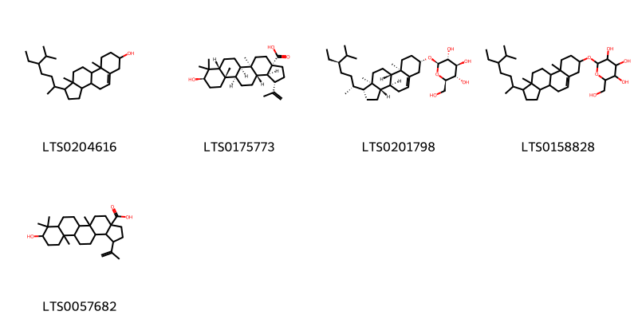{ width=100% }
    <figcaption>Hình ảnh cấu trúc hóa học của 5 hoạt chất thuộc nhóm Steroids and steroid derivatives gồm ['stigmast-5-en-3-ol, (3β)- (LTS0204616)', '(1s,3as,5ar,5br,7ar,9r,11as,11br,13as,13bs)-9-hydroxy-5a,8,8,11a-tetramethyl-1-(prop-1-en-2-yl)-hexadecahydro-1h-cyclopenta[a]chrysene-3a-carboxylic acid (LTS0175773)', 'sitogluside (LTS0201798)', '2-{[1-(5-ethyl-6-methylheptan-2-yl)-9a,11a-dimethyl-1h,2h,3h,3ah,3bh,4h,6h,7h,8h,9h,9bh,10h,11h-cyclopenta[a]phenanthren-7-yl]oxy}-6-(hydroxymethyl)oxane-3,4,5-triol (LTS0158828)', '9-hydroxy-5a,8,8,11a-tetramethyl-1-(prop-1-en-2-yl)-hexadecahydro-1h-cyclopenta[a]chrysene-3a-carboxylic acid (LTS0057682)'].</figcaption>
</figure>
### Nhóm Tetrahydrofurans
<figure markdown="span">
    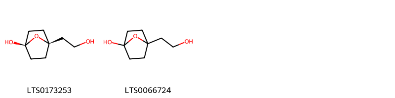{ width=100% }
    <figcaption>Hình ảnh cấu trúc hóa học của 2 hoạt chất thuộc nhóm Tetrahydrofurans gồm ['(1s,4r)-4-(2-hydroxyethyl)-7-oxabicyclo[2.2.1]heptan-1-ol (LTS0173253)', '4-(2-hydroxyethyl)-7-oxabicyclo[2.2.1]heptan-1-ol (LTS0066724)'].</figcaption>
</figure>

---

## Tác dụng dược lý

Theo tài liệu "Những cây thuốc và vị thuốc Việt Nam" - Đỗ Tất Lợi:- Kháng sinh

Theo tài liệu quốc tế: 

---

## Dược điển Việt Nam V

### Soi bột:
Bột có màu vàng nâu nhạt đến nâu, mùi rất thơm, vị hơi chát. Dưới kính hiển vi thấy: Mảnh tế bào mô cứng hoặc tế bào mô cứng riêng lẻ gồm các tế bào hình bầu dục, thuôn dài hoặc gần tròn, thành dày, ống trao đổi có thể nhìn thấy rõ  hoặc không rõ. Mảnh tế bào vỏ quả màu vàng nhạt (vỏ quả  giữa) hoặc vàng nâu (vỏ quả ngoài) gồm các tế bào hình đa  giác, thành mỏng. Mảnh mạch vạch có kích thước nhỏ và ít  thấy. Khối nhựa màu nâu đỏ. Mảnh nội nhũ gồm tế bào hình  đa giác thành mỏng, trong suốt không màu, chứa nhiều giọt dầu béo. Tế bào vỏ hạt màu nâu đen nằm rải rác trong các tế bào vỏ quả ngoài hay trong tế bào nội nhũ. nn
<!-- Hình ảnh soi bột sẽ được tự động chèn vào đây sau -->
### Vi phẫu:
Mặt cắt ngang vỏ quả: Vỏ ngoài là một hàng tế bào biểu bì có phủ một lớp cutin, thành phía ngoài và bên dày dần lên.  Vỏ quả giữa gồm tế bào mô mềm ở phía ngoài với các bó mạch rải rác và nhiều hàng tế bào đá  phía trong, tế bào hình thon dài, hình gần tròn hoặc hình bầu dục, thành dày mỏng không đều. thường xếp theo dạng tiếp tuyến xen kẽ.  kéo dài tới vách ngăn dọc. Vỏ quả trong gồm một lớp tế  bào mô mềm dẹt và rất nhỏ. nn
<!-- Hình ảnh vi phẫu sẽ được tự động chèn vào đây sau -->
### Định tính

A. Lấy I g bột dược liệu, thêm 15 ml methanol (TT), đun trên cách thủy 2 min, lọc, lấy dịch lọc để làm các phản ứng sau: Lấy 5 ml dịch lọc, cô đến cạn, hòa cắn trong 1 ml anhydrid acetic (TT) và 1 ml cloroform (TT), khuấy kỹ cho tan, lọc.  Cho dịch lọc vào ống nghiệm khô rồi cẩn thận thêm từ từ  dọc theo thành ống nghiệm 0,5 ml acid sulfuric (TT). Màu  tím đỏ xuất hiện giữa 2 lớp dung dịch. Lấy 5 ml dịch lọc cho vào ống nghiệm, cho thêm 0,1 g bột magnesi (TT) và 1 ml  acid hydrocloric (TT), để yên, sẽ  xuất hiện màu từ đỏ nhạt đến đỏ vàng. B. Phương pháp sắc ký lớp mỏng (Phụ lục 5.4). Bản mỏng: Silica gel G. Dung môi khai triển: Cloroform – methanol (8 : 1). Dung dịch thử: Lấy 1 g bột dược liệu, thêm 20 ml  ether  dầu hỏa (30 °C đền 60 °C)(TT), đậy nút, lắc siêu âm  20 min, lọc. Gạn bỏ dung dịch ether dầu. Làm khô cắn trên  cách thủy, thêm 20 ml methanol (TT), đậy nút, lắc siêu âm 20 min, lọc. Có dịch lọc trên cách thủy đến cạn. Hòa cắn trong 5 ml methanol (TT) làm dung dịch thử. Dung dịch dược liệu đối chiếu: Lấy 1 g bột Liên kiều (mẫu  chuẩn), tiến hành chiết như mô tả ở phần Dung dịch thử. Dung dịch chất đối chiếu: Hòa tan forsythin chuẩn trong  methanol (TT) để được dung dịch có nồng độ khoảng  0,25 mg/ml. Cách tiến hành: Chấm riêng biệt lên bản mỏng 3 µl mỗi dung dịch trên. Sau khi khai triển xong, lấy bản mỏng ra, để khô ở nhiệt độ phòng rồi phun dung dịch acid sulfuric 10 % trong ethanol (TT). sấy bản mỏng ở 105 °C tới khi  các vết hiện rõ. Quan sát dưới ánh sáng thường. Trên sắc  ký đồ của dung dịch thử phải có vết cùng màu sắc và giá  trị Rf với vết của forsythin trên sắc ký đồ của dung dịch  chất đối chiếu và phải có các vết có cùng màu sắc và giá trị Rf với các vết trên sắc ký đồ của dung dịch dược liệu  đối chiếu.

### Định lượng

Chất chiết được trong dược liệu Không được ít hơn 30 % (đối với Thanh kiều) và không  được Ít hơn 16,0 % (đối với Lão kiều) tính theo dược liệu  khô kiệt. Tiến hành theo phương pháp chiết lạnh (Phụ lục 12.10).  Dùng ethanol 65 % làm dung môi. nĐịnh lượng Forsythin Phương pháp sắc ký lỏng (Phụ lục 5.3). Pha động: Acetonitril – nước (25 : 75 ). Dung dịch chuẩn: Hòa tan forsythin chuẩn trong methanol  (TT) để được dung dịch có nồng độ chính xác khoảng  0,2 mg/ml. Dung dịch thử: Cân chính xác khoảng 1 g bột dược liệu  (qua rây số 180) vào một bình nón nút mài, thêm chính  xác 15 ml methanol (TT) và cân. Để yên qua đêm, lắc siêu  âm trong 25 min, để nguội và cân lại. Bổ sung khối lượng  mất đi bằng methanol (TT), lắc đều, lọc. Hút chính xác  5 ml dịch lọc, cô trên cách thủy đến gần cạn, trộn với 0,5 g  bột nhôm oxyd trung tính (TT) rồi chuyền hỗn hợp vào cột  thủy tinh (đường kính trong 1 cm đến 1,5 cm) đã nhồi sẵn  1 g bột nhôm oxyd trung tính (TT) (cỡ 100 mesh đến 120  mesh). Rửa giải bằng 80 ml ethanol 70 % (TT). Cô dịch  rửa giải trên cách thủy đến cạn. Dùng methanol 50 % (TT)  để hòa tan và chuyển toàn bộ cắn vào bình định mức 5 ml,  thêm methanol 50 % (TT) vừa đủ đến vạch, lắc đều, lọc  qua màng lọc 0,45 µm. Điều kiện sắc ký: Cột kích thước (25 cm X 4,6 mm), được nhồi pha tĩnh C  (5 µm). Detector quang phổ tử ngoại đặt ở bước sóng 277 nm. Tốc độ dòng: 0,8 ml/min. Thể tích tiêm: 10 µl. Cách tiến hành: Tiêm dung dịch chuẩn, tiến hành sắc ký và tính số đĩa  lý thuyết của cột. Số đĩa lý thuyết của cột tính trên pic forsythin phải không dưới 3000. Tiêm lần lượt dung dịch chuẩn và dung dịch thử. Tính hàm  lượng forsythin trong dược liệu dựa vào diện tích pic thu  được trên sắc ký đồ của dung dịch thử, dung dịch chuẩn, hàm lượng C27H34O11 của forsythin chuẩn. Dược liệu phải chứa không ít hơn 0,15 % forsythin  (C27H34O11), tính theo dược liệu khô kiệt Forsythosid A  Phương pháp sắc ký lỏng (Phụ lục 5.3). Pha động: Acetonitril – dung dịch acid acetic băng 0,4 % (15:85). Dung dịch chuẩn: Hòa tan forsythosid A chuẩn trong  methanol (TT) để được dung dịch có nồng độ chính xác  khoảng 0,1 mg/ml (pha trước khi dùng). Dung dịch thử: Cân chính xác khoảng 0,5 g bột dược liệu  (qua rây số 1 80) vào một bình nón nút mài, thêm chính  xác 15 ml methanol 70 % (TT), đậy nút và cân. Lắc siêu âm trong 30 min, để nguội, cân lại. Bồ sung khối lượng  mắt đi bằng methanol 70 % (TT), lắc đều, lọc qua màng  lọc 0.45 µm, Điều kiện sắc ký: Cột kích thước (25 cm X 4,6 mm) được nhồi pha tĩnh C  (5 µm). Detector quang phổ từ ngoại đặt ở bước sóng 330 nm. Tốc độ dòng: 0,8 ml/min. Thể tích tiêm: 10 µl. Cách tiến hành: Tiêm dung dịch chuẩn. Tiến hành sắc ký và tính số đĩa  lý thuyết của cột. số đĩa lý thuyết của cột tính trên pic  forsythosid A phải không dưới 5000. Tiêm lần lượt dung dịch chuẩn và dung dịch thử. Tính  hàm lượng forsythosid A trong dược liệu dựa vào diện tích  pic thu được trên sắc ký đồ của dung dịch thử, dung dịch chuẩn, hàm lượng C29H36O15 của forsythosid A chuẩn.  Dược liệu phải chứa không dưới 0,25 % forsythosid A  (C29H36O15), tính theo dược liệu khô kiệt.

### Thông tin khác 
- ** Độ ẩm: ** Không quá 10,0 % (Phụ lục 12.13).

- ** Bảo quản:** Nơi khô ráo.nn
## Dược điển Hồng kong

<!-- PDF sẽ được tự động chèn vào đây sau -->

---

## Y dược học cổ truyền

- **Tên vị thuốc:** 
- **Tính vị quy kinh:** Khổ, vi hàn. Quy vào kinh tâm, đởm, tam tiêu, đại tràng.
- **Công năng chủ trị:** Thanh nhiệt giải độc, tiêu sưng tán kết.

Chủ trị: Đinh nhọt,  tràng nhạc, đờm hạch, nhũ ung, đan độc (viêm quầng đỏ); cảm mạo phong nhiệt, ôn bệnh vào tâm bào sốt cao gây háo khát, tinh thần hôn ám (mê sáng), phát ban; lâm lậu kèm bí tiểu tiện.
- **Chú ý:** 
- **Kiêng kỵ:** Không dùng cho người tỳ vị hư hàn, âm hư nội nhiệt, nhọt  đã vỡ.nn

