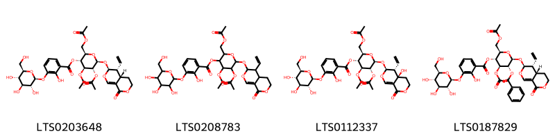
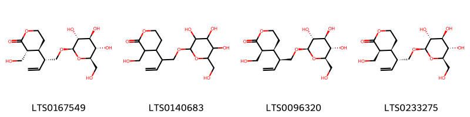
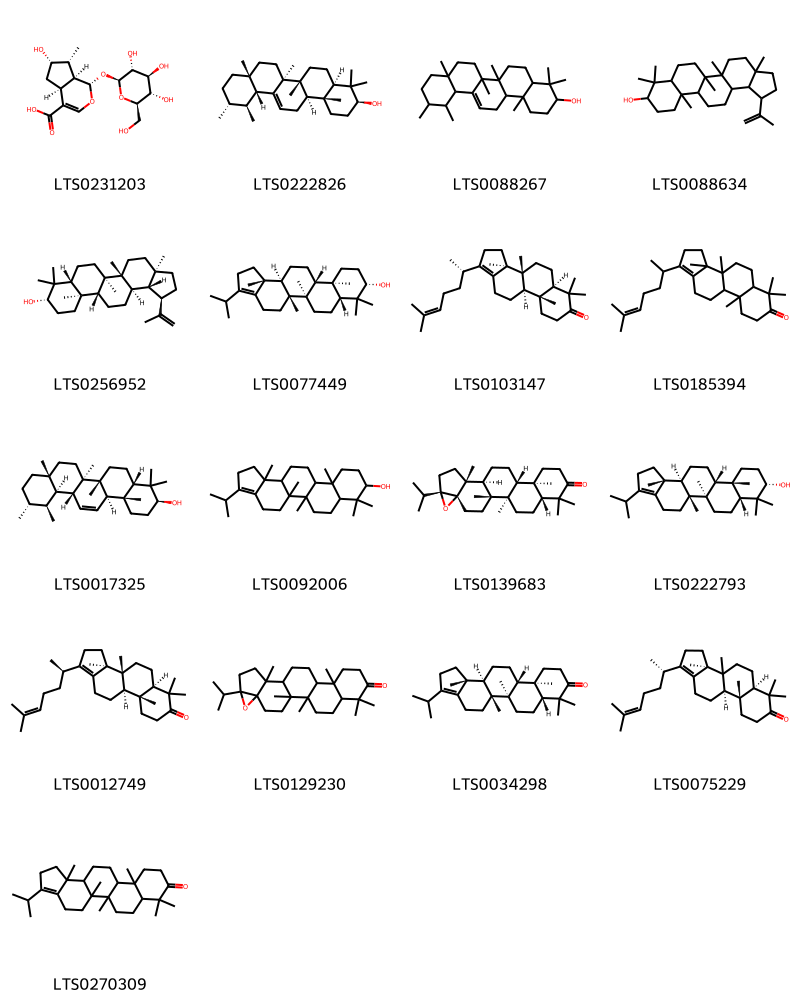

!!! abstract "Tóm tắt"
    Long đởm là cây thân thảo leo, thường mọc ở các khu vực nhiệt đới và cận nhiệt đới, phân bố tại Trung Quốc, Việt Nam, Thái Lan và một số nước Đông Nam Á. Ở Việt Nam, cây thường gặp ở các vùng rừng núi thấp. Trong y học cổ truyền, rễ và thân rễ của cây long đởm được sử dụng để chữa ho, long đờm, hen suyễn, và một số bệnh đường hô hấp khác. Ngoài ra, còn dùng để trị giun sán và giảm đau. Các nghiên cứu dược lý hiện đại cho thấy long đờm có tác dụng kháng khuẩn, chống viêm, giảm ho, giãn phế quản và an thần nhẹ. Thành phần hóa học chính gồm các alkaloid như stemonine, tuberostemonine và isostemonine, cùng với các hợp chất phenolic. Long đởm là một nguồn dược liệu quý, vừa được khai thác trong y học cổ truyền, vừa là đối tượng nghiên cứu để phát triển các thuốc hỗ trợ điều trị hô hấp.

## Thông tin về thực vật

### Đặc điểm thực vật

Dược liệu **Long Đởm (Rễ Và Thân Rễ)** từ bộ phận **nan** từ loài *Gentiana scabra Bunge.* thuộc họ Gentianaceae. Cây long đờm là một loại cỏ sống lâu năm, cao 35-60cm. Thân rễ ngắn, rễ nhiều, đường kính 2-3mm, vỏ ngoài màu vàng nhạt. Thân mọcđứng, đơn độc hay 2-3 cành, đốt thường ngắn so với chiều dài của lá. Lá mọc đối, không cuống, lá phía dưới thân nhỏ, phía trên to rộng hơn, dài từ 3-8cm, rộng từ 0,4-3cm. Hoa hình chuông màu lam nhạt hay sẫm, mọc thành chùm không cuống ở đầu cành hoặc ở kẽ những lá phía trên. 

!!! info "Phân loại thực vật của *Gentiana scabra*"
    - **Kingdom:** Plantae
    - **Phylum:** Tracheophyta
    - **Order:** Gentianales
    - **Family:** Gentianaceae
    - **Genus:** Gentiana
    - **Species:** *Gentiana scabra*

*Tài liệu tham khảo:* "Những cây thuốc và vị thuốc Việt Nam" - Đỗ Tất Lợi

 

### Loài thay thế (Nếu có)

Dược liệu này cũng có thể từ loài *Gentiana mans hu rica Kitag.*, thông tin về phân loại thực vật loài này như sau:
!!! info "Thông tin về phân loại thực vật của *N/A*"
    - **kingdom:** Plantae
    - **phylum:** Tracheophyta
    - **order:** Gentianales
    - **family:** Gentianaceae
    - **genus:** Gentiana
    - **species:** *N/A*

Hình ảnh của loài *Gentiana mans hu rica Kitag.*:

Dược liệu này cũng có thể từ loài *Gentiana triflora Pall.*, thông tin về phân loại thực vật loài này như sau:
!!! info "Thông tin về phân loại thực vật của *Gentiana triflora*"
    - **kingdom:** Plantae
    - **phylum:** Tracheophyta
    - **order:** Gentianales
    - **family:** Gentianaceae
    - **genus:** Gentiana
    - **species:** *Gentiana triflora*

Hình ảnh của loài *Gentiana triflora Pall.*:

Dược liệu này cũng có thể từ loài *Gentiana rigescens Franch.*, thông tin về phân loại thực vật loài này như sau:
!!! info "Thông tin về phân loại thực vật của *Gentiana rigescens*"
    - **kingdom:** Plantae
    - **phylum:** Tracheophyta
    - **order:** Gentianales
    - **family:** Gentianaceae
    - **genus:** Gentiana
    - **species:** *Gentiana rigescens*

Hình ảnh của loài *Gentiana rigescens Franch.*:

### Phân bố trên thế giới
**Từ vườn thực vật KEW: **: Châu Á nhiệt đới và cận nhiệt đới: Trung Quốc (miền Nam và Đông Nam, bao gồm cả đảo Hải Nam), Ấn Độ, Bangladesh, Lào, Myanmar, Campuchia, Việt Nam, Thái Lan, và Philippines.

**Từ CSDL GIBF** Japan, Korea, Republic of, Russian Federation, China

### Phân bố tại Việt Nam
** "Những cây thuốc và vị thuốc Việt Nam" - Đỗ Tất Lợi**: Qua sự phân bố ở Trung Quốc ta có thể chú ý tìm ở Lạng Sơn, Cao Bằng, Quảng Ninh.

**Từ CSDL GIBF**: Không có ghi nhận ở Việt Nam

---

## Thông tin về dược liệu 

### Định danh

!!! info "Thông tin về tên gọi của nan"
    - Dược liệu tiếng Việt: nan
    - Dược liệu tiếng Trung: nan (nan)
    - Dược liệu tiếng Anh: nan
    - Dược liệu latin thông dụng: nan
    - Dược liệu latin kiểu DĐVN: gentiana scabra bunge
    - Dược liệu latin kiểu DĐVN: nan
    - Dược liệu latin kiểu thông tư: nan
    - Bộ phận dùng: nan (nan)

### Mô tả dược liệu 
- **Theo dược điển Việt nam V:** nan

- **Mô tả dược liệu theo thông tư chế biến dược liệu theo phương pháp cổ truyền:** nan

### Chế biến 

- **Chế biến theo dược điển việt nam V**: nan

- **Chế biến theo thông tư:** nan

--- 

## Thành phần hóa học

- Theo tài liệu của GS. Đỗ Tất Lợi:  Trong long đờm có một glucozit đắng chừng 2% gọi là gentiopicrin C, H₂O, và một chất 20 đường gọi là gentianoza CH₁₂O16 chừng 4%.
Thủy phân gentiopicrin ta sẽ được gentiogenin CHO, và glucoza.
Gentianoza gồm hai phân tử glucoza và một phân tử fructoza.​12:25/-strong/-heart:>:o:-((:-hĐã gửi Xem trước khi gửiThả Files vào đây để xem lại trước khi gửi
    
- Theo cơ sở dữ liệu lotus: Từ loài *Gentiana scabra* đã phân lập và xác định được 49 hoạt chất thuộc về các nhóm Organooxygen compounds, Prenol lipids, Carboxylic acids and derivatives, Benzene and substituted derivatives, Steroids and steroid derivatives, Fatty Acyls, Indoles and derivatives. 

|    | chemicalTaxonomyClassyfireClass     |   smiles_count |
|---:|:------------------------------------|---------------:|
|  0 | Benzene and substituted derivatives |              1 |
|  1 | Carboxylic acids and derivatives    |              4 |
|  2 | Fatty Acyls                         |              4 |
|  3 | Indoles and derivatives             |              1 |
|  4 | Organooxygen compounds              |             20 |
|  5 | Prenol lipids                       |             17 |
|  6 | Steroids and steroid derivatives    |              2 |

### Nhóm Benzene and substituted derivatives
<figure markdown="span">
    { width=100% }
    <figcaption>Hình ảnh cấu trúc hóa học của 1 hoạt chất thuộc nhóm Benzene and substituted derivatives gồm ['3-methoxysalicyclic acid (LTS0056190)'].</figcaption>
</figure>
### Nhóm Carboxylic acids and derivatives
<figure markdown="span">
    { width=100% }
    <figcaption>Hình ảnh cấu trúc hóa học của 4 hoạt chất thuộc nhóm Carboxylic acids and derivatives gồm ['(2r,3r,4s,5r,6s)-6-{[(3s,4r,4as)-4-ethenyl-8-oxo-3h,4h,4ah,5h,6h-pyrano[3,4-c]pyran-3-yl]oxy}-4,5-bis(acetyloxy)-2-[(acetyloxy)methyl]oxan-3-yl 2-hydroxy-3-{[(2s,3r,4s,5s,6r)-3,4,5-trihydroxy-6-(hydroxymethyl)oxan-2-yl]oxy}benzoate (LTS0203648)', '4,5-bis(acetyloxy)-2-[(acetyloxy)methyl]-6-({4-ethenyl-8-oxo-3h,4h,4ah,5h,6h-pyrano[3,4-c]pyran-3-yl}oxy)oxan-3-yl 2-hydroxy-3-{[3,4,5-trihydroxy-6-(hydroxymethyl)oxan-2-yl]oxy}benzoate (LTS0208783)', 'rindoside (LTS0112337)', 'scabraside (LTS0187829)'].</figcaption>
</figure>
### Nhóm Fatty Acyls
<figure markdown="span">
    { width=100% }
    <figcaption>Hình ảnh cấu trúc hóa học của 4 hoạt chất thuộc nhóm Fatty Acyls gồm ['(3r,4s)-3-(hydroxymethyl)-4-[(2r)-1-{[(2r,3r,4s,5s,6r)-3,4,5-trihydroxy-6-(hydroxymethyl)oxan-2-yl]oxy}but-3-en-2-yl]oxan-2-one (LTS0167549)', '3-(hydroxymethyl)-4-(1-{[3,4,5-trihydroxy-6-(hydroxymethyl)oxan-2-yl]oxy}but-3-en-2-yl)oxan-2-one (LTS0140683)', '(3s,4s)-3-(hydroxymethyl)-4-[(2s)-1-{[(2r,3r,4s,5s,6r)-3,4,5-trihydroxy-6-(hydroxymethyl)oxan-2-yl]oxy}but-3-en-2-yl]oxan-2-one (LTS0096320)', '(3s,4s)-3-(hydroxymethyl)-4-[(2r)-1-{[(2r,3r,4s,5s,6r)-3,4,5-trihydroxy-6-(hydroxymethyl)oxan-2-yl]oxy}but-3-en-2-yl]oxan-2-one (LTS0233275)'].</figcaption>
</figure>
### Nhóm Indoles and derivatives
<figure markdown="span">
    { width=100% }
    <figcaption>Hình ảnh cấu trúc hóa học của 1 hoạt chất thuộc nhóm Indoles and derivatives gồm ['n-[2-(5-methoxy-1h-indol-3-yl)ethyl]ethanimidic acid (LTS0219322)'].</figcaption>
</figure>
### Nhóm Organooxygen compounds
<figure markdown="span">
    { width=100% }
    <figcaption>Hình ảnh cấu trúc hóa học của 20 hoạt chất thuộc nhóm Organooxygen compounds gồm ['gentiopicroside (LTS0241296)', 'sweroside (LTS0014051)', '(4as,5r,6s)-5-ethenyl-6-{[3,4,5-trihydroxy-6-(hydroxymethyl)oxan-2-yl]oxy}-3h,4h,4ah,5h,6h-pyrano[3,4-c]pyran-1-one (LTS0114959)', '5-ethenyl-8-methoxy-6-{[3,4,5-trihydroxy-6-(hydroxymethyl)oxan-2-yl]oxy}-3h,4h,5h,6h,8h-pyrano[3,4-c]pyran-1-one (LTS0115885)', '(4ar,6ar,6br,12ar,12br,14ar,14br)-4,4,6a,6b,10,10,12a,14b-octamethyl-2,4a,5,6,7,9,11,12,12b,13,14,14a-dodecahydro-1h-picen-3-one (LTS0125214)', '4,4,6a,6b,10,10,12a,14b-octamethyl-2,4a,5,6,7,8,11,12,12b,13,14,14a-dodecahydro-1h-picen-3-one (LTS0134340)', '4,4,6a,6b,10,10,12a,14b-octamethyl-2,4a,5,6,7,9,11,12,12b,13,14,14a-dodecahydro-1h-picen-3-one (LTS0198543)', '(5r,6s,8r)-5-ethenyl-8-methoxy-6-{[(2s,3r,4s,5s,6r)-3,4,5-trihydroxy-6-(hydroxymethyl)oxan-2-yl]oxy}-3h,4h,5h,6h,8h-pyrano[3,4-c]pyran-1-one (LTS0203580)', '(3s,4ar,6ar,6br,12ar,12br,14ar,14br)-4,4,6a,6b,10,10,12a,14b-octamethyl-1,2,3,4a,5,6,7,9,11,12,12b,13,14,14a-tetradecahydropicen-3-ol (LTS0084328)', '(5r,6r,8s,8as)-5-ethenyl-8a-hydroxy-8-methoxy-6-{[(2s,3r,4s,5s,6r)-3,4,5-trihydroxy-6-(hydroxymethyl)oxan-2-yl]oxy}-3h,5h,6h,8h-pyrano[3,4-c]pyran-1-one (LTS0221379)', '(5r,6s)-5-ethenyl-6-{[(2s,3r,4s,5s,6r)-3,4,5-trihydroxy-6-({[(2r,3r,4s,5s,6r)-3,4,5-trihydroxy-6-({[(2r,3r,4s,5s,6r)-3,4,5-trihydroxy-6-({[(2r,3r,4s,5s,6r)-3,4,5-trihydroxy-6-({[(2r,3r,4s,5s,6r)-3,4,5-trihydroxy-6-(hydroxymethyl)oxan-2-yl]oxy}methyl)oxan-2-yl]oxy}methyl)oxan-2-yl]oxy}methyl)oxan-2-yl]oxy}methyl)oxan-2-yl]oxy}-3h,5h,6h-pyrano[3,4-c]pyran-1-one (LTS0042213)', '(4r,5r,6s,8r)-5-ethenyl-4-hydroxy-8-methoxy-6-{[(2s,3r,4s,5s,6r)-3,4,5-trihydroxy-6-(hydroxymethyl)oxan-2-yl]oxy}-3h,4h,5h,6h,8h-pyrano[3,4-c]pyran-1-one (LTS0230113)', '(3s,4ar,6ar,6br,12ar,12br,14ar,14br)-4,4,6a,6b,11,11,12a,14b-octamethyl-1,2,3,4a,5,6,7,9,10,12,12b,13,14,14a-tetradecahydropicen-3-ol (LTS0169365)', '(4ar,6ar,6br,12ar,12br,14ar,14br)-4,4,6a,6b,10,10,12a,14b-octamethyl-2,4a,5,6,7,8,11,12,12b,13,14,14a-dodecahydro-1h-picen-3-one (LTS0240512)', '(5r,6s,8s,8as)-5-ethenyl-8a-hydroxy-8-methoxy-6-{[(2s,3r,4s,5s,6r)-3,4,5-trihydroxy-6-(hydroxymethyl)oxan-2-yl]oxy}-3h,5h,6h,8h-pyrano[3,4-c]pyran-1-one (LTS0106247)', '(5r,6s)-5-ethenyl-6-{[(2s,3r,4s,5s,6r)-3,4,5-trihydroxy-6-({[(2r,3r,4s,5s,6r)-3,4,5-trihydroxy-6-({[(2r,3r,4s,5s,6r)-3,4,5-trihydroxy-6-({[(2r,3r,4s,5s,6r)-3,4,5-trihydroxy-6-(hydroxymethyl)oxan-2-yl]oxy}methyl)oxan-2-yl]oxy}methyl)oxan-2-yl]oxy}methyl)oxan-2-yl]oxy}-3h,5h,6h-pyrano[3,4-c]pyran-1-one (LTS0116066)', '2-(benzyloxy)-6-{[(3,4,5-trihydroxyoxan-2-yl)oxy]methyl}oxane-3,4,5-triol (LTS0196477)', '4,4,6a,6b,10,10,12a,14b-octamethyl-1,2,3,4a,5,6,7,9,11,12,12b,13,14,14a-tetradecahydropicen-3-ol (LTS0034125)', '(2r,3r,4s,5s,6r)-2-(benzyloxy)-6-({[(2s,3r,4s,5s)-3,4,5-trihydroxyoxan-2-yl]oxy}methyl)oxane-3,4,5-triol (LTS0220474)', '(5r,6s)-6-{[(2s,3r,4r,5s,6r)-3,4-dihydroxy-6-(hydroxymethyl)-5-{[(2s,3r,4s,5s,6r)-3,4,5-trihydroxy-6-(hydroxymethyl)oxan-2-yl]oxy}oxan-2-yl]oxy}-5-ethenyl-3h,5h,6h-pyrano[3,4-c]pyran-1-one (LTS0258058)'].</figcaption>
</figure>
### Nhóm Prenol lipids
<figure markdown="span">
    { width=100% }
    <figcaption>Hình ảnh cấu trúc hóa học của 17 hoạt chất thuộc nhóm Prenol lipids gồm ['loganic acid (LTS0231203)', 'amyrin (LTS0222826)', 'α-amyrin (LTS0088267)', 'lupeol (LTS0088634)', 'lupeol (LTS0256952)', '(5ar,5br,7ar,9s,11ar,11br,13as,13br)-3-isopropyl-5a,5b,8,8,11a,13b-hexamethyl-1h,2h,4h,5h,6h,7h,7ah,9h,10h,11h,11bh,12h,13h,13ah-cyclopenta[a]chrysen-9-ol (LTS0077449)', '(3as,3br,5ar,9ar,9br)-3a,3b,6,6,9a-pentamethyl-1-[(2s)-6-methylhept-5-en-2-yl]-2h,3h,4h,5h,5ah,8h,9h,9bh,10h,11h-cyclopenta[a]phenanthren-7-one (LTS0103147)', '3a,3b,6,6,9a-pentamethyl-1-(6-methylhept-5-en-2-yl)-2h,3h,4h,5h,5ah,8h,9h,9bh,10h,11h-cyclopenta[a]phenanthren-7-one (LTS0185394)', '(3s,4as,6ar,6br,8ar,11r,12s,12ar,12br,14ar,14bs)-4,4,6a,6b,8a,11,12,14b-octamethyl-2,3,4a,5,6,7,8,9,10,11,12,12a,12b,14a-tetradecahydro-1h-picen-3-ol (LTS0017325)', '3-isopropyl-5a,5b,8,8,11a,13b-hexamethyl-1h,2h,4h,5h,6h,7h,7ah,9h,10h,11h,11bh,12h,13h,13ah-cyclopenta[a]chrysen-9-ol (LTS0092006)', '17?,21?-epoxyhopan-3-one (LTS0139683)', '(5ar,5br,7ar,9s,11as,11br,13as,13br)-3-isopropyl-5a,5b,8,8,11a,13b-hexamethyl-1h,2h,4h,5h,6h,7h,7ah,9h,10h,11h,11bh,12h,13h,13ah-cyclopenta[a]chrysen-9-ol (LTS0222793)', '(3as,3br,5ar,9ar,9br)-3a,3b,6,6,9a-pentamethyl-1-[(2r)-6-methylhept-5-en-2-yl]-2h,3h,4h,5h,5ah,8h,9h,9bh,10h,11h-cyclopenta[a]phenanthren-7-one (LTS0012749)', '7-isopropyl-1,2,10,15,19,19-hexamethyl-6-oxahexacyclo[12.8.0.0²,¹¹.0⁵,⁷.0⁵,¹⁰.0¹⁵,²⁰]docosan-18-one (LTS0129230)', '(5ar,5br,7ar,11ar,11br,13as,13br)-3-isopropyl-5a,5b,8,8,11a,13b-hexamethyl-1h,2h,4h,5h,6h,7h,7ah,10h,11h,11bh,12h,13h,13ah-cyclopenta[a]chrysen-9-one (LTS0034298)', '(3as,5ar,9ar,9br)-3a,3b,6,6,9a-pentamethyl-1-[(2s)-6-methylhept-5-en-2-yl]-2h,3h,4h,5h,5ah,8h,9h,9bh,10h,11h-cyclopenta[a]phenanthren-7-one (LTS0075229)', '3-isopropyl-5a,5b,8,8,11a,13b-hexamethyl-1h,2h,4h,5h,6h,7h,7ah,10h,11h,11bh,12h,13h,13ah-cyclopenta[a]chrysen-9-one (LTS0270309)'].</figcaption>
</figure>
### Nhóm Steroids and steroid derivatives
<figure markdown="span">
    { width=100% }
    <figcaption>Hình ảnh cấu trúc hóa học của 2 hoạt chất thuộc nhóm Steroids and steroid derivatives gồm ['sitogluside (LTS0201798)', '2-{[1-(5-ethyl-6-methylheptan-2-yl)-9a,11a-dimethyl-1h,2h,3h,3ah,3bh,4h,6h,7h,8h,9h,9bh,10h,11h-cyclopenta[a]phenanthren-7-yl]oxy}-6-(hydroxymethyl)oxane-3,4,5-triol (LTS0158828)'].</figcaption>
</figure>

---

## Tác dụng dược lý

Theo tài liệu "Những cây thuốc và vị thuốc Việt Nam" - Đỗ Tất Lợi:+ Kích thích sự bài tiết dịch tiêu hoá, làm khoẻ dạ dày
+ Sự bài tiết dịch vị tăng tiến và lượng axit tự do cũng tăng hơn.

Theo tài liệu quốc tế: nan

---

## Dược điển Việt Nam V

### Soi bột:
nan
<!-- Hình ảnh soi bột sẽ được tự động chèn vào đây sau -->
### Vi phẫu:
nan
<!-- Hình ảnh vi phẫu sẽ được tự động chèn vào đây sau -->
### Định tính

nan

### Định lượng

nan

### Thông tin khác 
- ** Độ ẩm: ** nan

- ** Bảo quản:** nan
## Dược điển Hồng kong

<!-- PDF sẽ được tự động chèn vào đây sau -->

---

## Y dược học cổ truyền

- **Tên vị thuốc:** nan
- **Tính vị quy kinh:** Khổ, hàn. Vào các kinh can. đởm, bàng quang
- **Công năng chủ trị:** Thanh thấp nhiệt, tã can đởm hòa. Chủ trị: Hoàng đàn thấp nhiệt, âm hộ sưng ngứa kèm đới hạ, thấp chẩn, mắt đò, tai nghễnh ngãng, sườn đau, miệng đắng, kinh phong co giật.
- **Chú ý:** nan
- **Kiêng kỵ:** nan

