!!! abstract "Tóm tắt"
    Lá Lốt tên khoa học là Herba Piperis lolot, họ Piperaceae - Hồ tiêu, mọc hoang và thường được trồng tại nhiều nơi ở miền Bắc nước ta. Trong nhân dân dùng lá lốt làm gia vị hay làm thuốc sắc uống chữa đau xương, thấp khớp, tê thấp, đổ mồ hôi tay, chân, bệnh đi ngoài lỏng. Ngoài ra Lá lốt có tác dụngdược lý kháng khuẩn đối với các vì khuẩn: Bacillus pyocyaneus, Staphylococcus aureus và Bacillus subtilis; đồng thời, có tác dụng chống viêm. Lá lốt có tác dụng gây giãn mạch ngoại biên và ức chế hoạt tính gây co thắt cơ trơn ruột của histamin và acetylcholin.Lá lốt cũng tác dụng ức chế men colagenase trong ống nghiệm. Lá, thân và rễ chứa alcaloid và tinh dầu, trong đó tinh dầu chủ yếu chứa β -caryophyllene.

## Thông tin về thực vật

### Đặc điểm thực vật

Dược liệu **Lá Lốt (Phần Trên Mặt Đất Tươi Hay Phơi, Sấy Khô)** từ bộ phận **** từ loài *Piper lolot C. DC* thuộc họ Piperaceae. Lá lốt là một loại cây thân mềm, mọc cao tới 1m, thân hơi có lông. Lá hình trứng rộng, phía gốc hình tim, đầu lá nhọn, soi lên có những điểm trong, phiến lá dài 13cm, rộng 8,5cm, trên mặt nhẵn, mặt dưới hơi có lông ở gân, cuống lá dài chừng 2,5cm. Cụm hoa mọc thành bông, bông hoa cái dài chừng 1cm, cuống dài 1cm. 

!!! info "Phân loại thực vật của *Piper sarmentosum*"
    - **Kingdom:** Plantae
    - **Phylum:** Tracheophyta
    - **Order:** Piperales
    - **Family:** Piperaceae
    - **Genus:** Piper
    - **Species:** *Piper sarmentosum*

*Tài liệu tham khảo:* "Những cây thuốc và vị thuốc Việt Nam" - Đỗ Tất Lợi

 

### Loài thay thế (Nếu có)

### Phân bố trên thế giới
**Từ vườn thực vật KEW: **: -Bản địa: Andaman Is., Borneo, Cambodia, China South-Central, China Southeast, Hainan, Jawa, Laos, Malaya, Maluku, Myanmar, New Guinea, Northern Territory, Philippines, Queensland, Sumatera, Thailand, Tibet, Vietnam
-Di thực: Caroline Is., Hawaii, Madagascar, Mauritius, Réunion, Trinidad-Tobago

**Từ CSDL GIBF** nan, Togo, Viet Nam, Norway, United States of America, Cambodia, unknown or invalid, Lao People’s Democratic Republic

### Phân bố tại Việt Nam
** "Những cây thuốc và vị thuốc Việt Nam" - Đỗ Tất Lợi**: Cây lá lốt mọc hoang và thường được trồng tại nhiều nơi ở miền Bắc nước ta.

**Từ CSDL GIBF**: Thai Nguyen, Vinh Phuc

---

## Thông tin về dược liệu 

### Định danh

!!! info "Thông tin về tên gọi của lá lốt"
    - Dược liệu tiếng Việt: lá lốt
    - Dược liệu tiếng Trung:  ()
    - Dược liệu tiếng Anh: 
    - Dược liệu latin thông dụng: Herba Piperis lolot
    - Dược liệu latin kiểu DĐVN: herba piperis lolot
    - Dược liệu latin kiểu DĐVN: 
    - Dược liệu latin kiểu thông tư: 
    - Bộ phận dùng:  (Herba)

### Mô tả dược liệu 
- **Theo dược điển Việt nam V:** Đoạn ngọn cành dài 20 cm đến 30 cm. Lá nhăn nheo, nhàu nát. Mặt trên lá màu lục xám, dưới lục nhạt. Lá hình tim dài 5 cm đến 12 cm, rộng 4 cm đến 11 cm. Đầu lá thuôn nhọn, gốc hình tim. phiến mỏng, mép nguyên, có 5 gân chính tỏa ra từ cuống lá, gân giữa thẳng, dài, rõ, các gân bên hình cung, gân cấp 1 hình lông chim, gân cấp 2 hình mạng. Cuống dài 2 cm đến 3,5 cm, gốc cuống lá ôm lấy thân. Thân hình trụ, phình ra ở các mấu, mặt ngoài có nhiều đường rãnh dọc.

- **Mô tả dược liệu theo thông tư chế biến dược liệu theo phương pháp cổ truyền:** 

### Chế biến 

- **Chế biến theo dược điển việt nam V**: Chế biến Thu hoạch quanh năm. lúc trời khô ráo, cắt lấy cây, loại bỏ gốc rễ, rửa sạch, đem phơi hay sấy từ 40 °C đến 50 °C đến khô. Bảo quản Để nơi khô, tránh làm rụng lá, mất màu và mùi thơm.

- **Chế biến theo thông tư:** 

--- 

## Thành phần hóa học

- Theo tài liệu của GS. Đỗ Tất Lợi:  -Lá, thân và rễ chứa alcaloid và tinh dầu 
-Tinh dầu có thành phần chủ yếu là β -caryophyllene , β -bisabolene , β -selinene , β -elemene , trans -muurola-4(14),5-diene và ( E )- β -ocimene
    
- Theo cơ sở dữ liệu lotus: Từ loài *Piper sarmentosum* đã phân lập và xác định được 61 hoạt chất thuộc về các nhóm Oxepanes, Pyrrolidines, Linear 1,3-diarylpropanoids, Benzofurans, Aristolactams, Steroids and steroid derivatives, Prenol lipids, Benzene and substituted derivatives, Fatty Acyls, Aporphines, Cinnamic acids and derivatives, Phenols, Phenol ethers, Kavalactones, Phenylpropanoic acids. 

|    | chemicalTaxonomyClassyfireClass     |   smiles_count |
|---:|:------------------------------------|---------------:|
|  0 | Aporphines                          |              3 |
|  1 | Aristolactams                       |              2 |
|  2 | Benzene and substituted derivatives |              5 |
|  3 | Benzofurans                         |              2 |
|  4 | Cinnamic acids and derivatives      |             20 |
|  5 | Fatty Acyls                         |              5 |
|  6 | Kavalactones                        |              2 |
|  7 | Linear 1,3-diarylpropanoids         |              4 |
|  8 | Oxepanes                            |              2 |
|  9 | Phenol ethers                       |              1 |
| 10 | Phenols                             |              2 |
| 11 | Phenylpropanoic acids               |              1 |
| 12 | Prenol lipids                       |              4 |
| 13 | Pyrrolidines                        |              2 |
| 14 | Steroids and steroid derivatives    |              6 |

### Nhóm Aporphines
<figure markdown="span">
    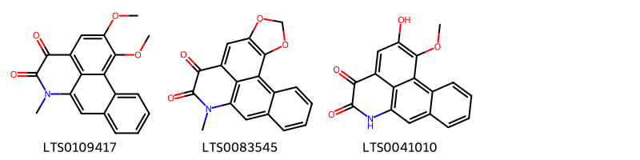{ width=100% }
    <figcaption>Hình ảnh cấu trúc hóa học của 3 hoạt chất thuộc nhóm Aporphines gồm ['15,16-dimethoxy-10-methyl-10-azatetracyclo[7.7.1.0²,⁷.0¹³,¹⁷]heptadeca-1(17),2(7),3,5,8,13,15-heptaene-11,12-dione (LTS0109417)', '11-methyl-3,5-dioxa-11-azapentacyclo[10.7.1.0²,⁶.0⁸,²⁰.0¹⁴,¹⁹]icosa-1(20),2(6),7,12,14(19),15,17-heptaene-9,10-dione (LTS0083545)', '15-hydroxy-16-methoxy-10-azatetracyclo[7.7.1.0²,⁷.0¹³,¹⁷]heptadeca-1(17),2(7),3,5,8,13,15-heptaene-11,12-dione (LTS0041010)'].</figcaption>
</figure>
### Nhóm Aristolactams
<figure markdown="span">
    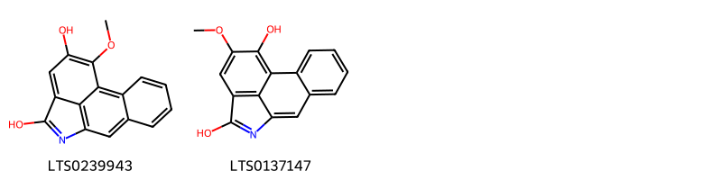{ width=100% }
    <figcaption>Hình ảnh cấu trúc hóa học của 2 hoạt chất thuộc nhóm Aristolactams gồm ['15-methoxy-10-azatetracyclo[7.6.1.0²,⁷.0¹²,¹⁶]hexadeca-1(16),2(7),3,5,8,10,12,14-octaene-11,14-diol (LTS0239943)', '14-methoxy-10-azatetracyclo[7.6.1.0²,⁷.0¹²,¹⁶]hexadeca-1(16),2(7),3,5,8,10,12,14-octaene-11,15-diol (LTS0137147)'].</figcaption>
</figure>
### Nhóm Benzene and substituted derivatives
<figure markdown="span">
    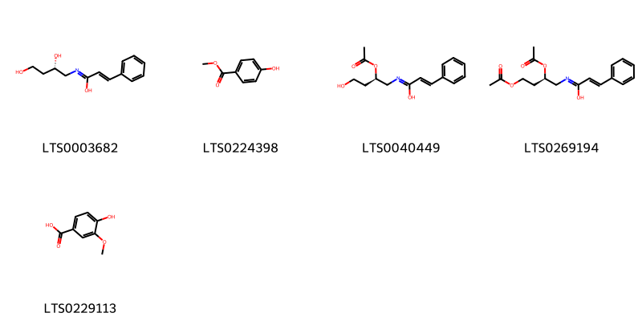{ width=100% }
    <figcaption>Hình ảnh cấu trúc hóa học của 5 hoạt chất thuộc nhóm Benzene and substituted derivatives gồm ['(2e)-n-[(2s)-2,4-dihydroxybutyl]-3-phenylprop-2-enimidic acid (LTS0003682)', 'paraben (LTS0224398)', '(2e)-n-[(2r)-2-(acetyloxy)-4-hydroxybutyl]-3-phenylprop-2-enimidic acid (LTS0040449)', '(2e)-n-[(2r)-2,4-bis(acetyloxy)butyl]-3-phenylprop-2-enimidic acid (LTS0269194)', 'vanillic acid (LTS0229113)'].</figcaption>
</figure>
### Nhóm Benzofurans
<figure markdown="span">
    { width=100% }
    <figcaption>Hình ảnh cấu trúc hóa học của 2 hoạt chất thuộc nhóm Benzofurans gồm ['loliolide (LTS0254454)', 'loliolide (LTS0119422)'].</figcaption>
</figure>
### Nhóm Cinnamic acids and derivatives
<figure markdown="span">
    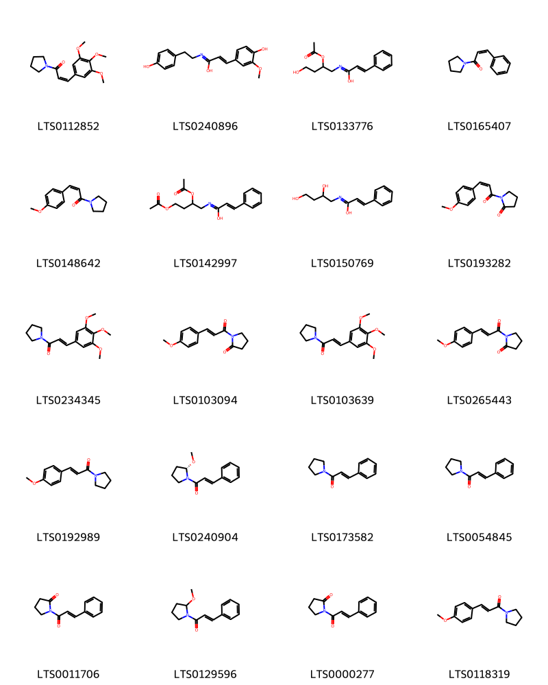{ width=100% }
    <figcaption>Hình ảnh cấu trúc hóa học của 20 hoạt chất thuộc nhóm Cinnamic acids and derivatives gồm ['(2z)-1-(pyrrolidin-1-yl)-3-(3,4,5-trimethoxyphenyl)prop-2-en-1-one (LTS0112852)', '3-(4-hydroxy-3-methoxyphenyl)-n-[2-(4-hydroxyphenyl)ethyl]prop-2-enimidic acid (LTS0240896)', 'n-[2-(acetyloxy)-4-hydroxybutyl]-3-phenylprop-2-enimidic acid (LTS0133776)', '(2z)-3-phenyl-1-(pyrrolidin-1-yl)prop-2-en-1-one (LTS0165407)', '(2z)-3-(4-methoxyphenyl)-1-(pyrrolidin-1-yl)prop-2-en-1-one (LTS0148642)', 'n-[2,4-bis(acetyloxy)butyl]-3-phenylprop-2-enimidic acid (LTS0142997)', 'n-(2,4-dihydroxybutyl)-3-phenylprop-2-enimidic acid (LTS0150769)', '1-[(2z)-3-(4-methoxyphenyl)prop-2-enoyl]pyrrolidin-2-one (LTS0193282)', '1-(pyrrolidin-1-yl)-3-(3,4,5-trimethoxyphenyl)prop-2-en-1-one (LTS0234345)', '1-[3-(4-methoxyphenyl)prop-2-enoyl]pyrrolidin-2-one (LTS0103094)', '(2e)-1-(pyrrolidin-1-yl)-3-(3,4,5-trimethoxyphenyl)prop-2-en-1-one (LTS0103639)', '1-[(2e)-3-(4-methoxyphenyl)prop-2-enoyl]pyrrolidin-2-one (LTS0265443)', '3-(4-methoxyphenyl)-1-(pyrrolidin-1-yl)prop-2-en-1-one (LTS0192989)', '(2e)-1-[(2s)-2-methoxypyrrolidin-1-yl]-3-phenylprop-2-en-1-one (LTS0240904)', '3-phenyl-1-(pyrrolidin-1-yl)prop-2-en-1-one (LTS0173582)', '(2e)-3-phenyl-1-(pyrrolidin-1-yl)prop-2-en-1-one (LTS0054845)', '1-(3-phenylprop-2-enoyl)pyrrolidin-2-one (LTS0011706)', '1-(2-methoxypyrrolidin-1-yl)-3-phenylprop-2-en-1-one (LTS0129596)', '1-[(2e)-3-phenylprop-2-enoyl]pyrrolidin-2-one (LTS0000277)', '(2e)-3-(4-methoxyphenyl)-1-(pyrrolidin-1-yl)prop-2-en-1-one (LTS0118319)'].</figcaption>
</figure>
### Nhóm Fatty Acyls
<figure markdown="span">
    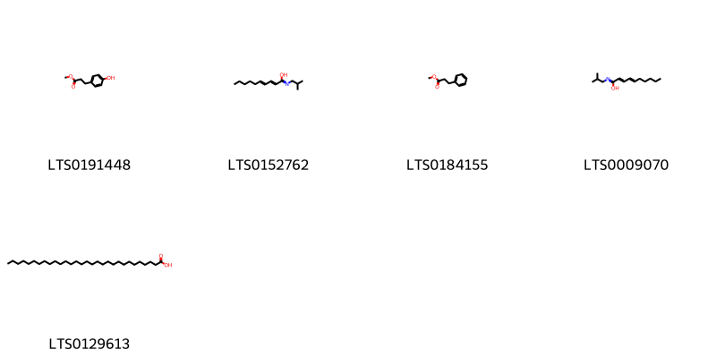{ width=100% }
    <figcaption>Hình ảnh cấu trúc hóa học của 5 hoạt chất thuộc nhóm Fatty Acyls gồm ['methyl 3-(4-hydroxyphenyl)propanoate (LTS0191448)', '(2e,4e)-n-(2-methylpropyl)deca-2,4-dienimidic acid (LTS0152762)', 'methyl phenylpropionate (LTS0184155)', 'n-(2-methylpropyl)deca-2,4-dienimidic acid (LTS0009070)', 'triacontanoic acid (LTS0129613)'].</figcaption>
</figure>
### Nhóm Kavalactones
<figure markdown="span">
    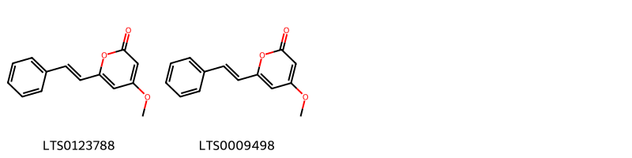{ width=100% }
    <figcaption>Hình ảnh cấu trúc hóa học của 2 hoạt chất thuộc nhóm Kavalactones gồm ['5,6-dehydrokawain (LTS0123788)', 'desmethoxyyangonin (LTS0009498)'].</figcaption>
</figure>
### Nhóm Linear 1_3-diarylpropanoids
<figure markdown="span">
    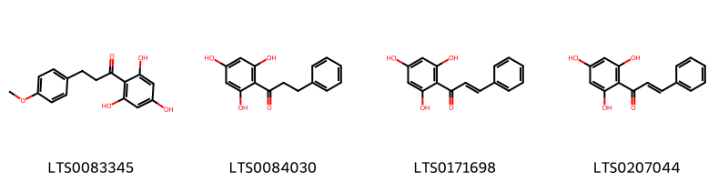{ width=100% }
    <figcaption>Hình ảnh cấu trúc hóa học của Không tìm thấy chú thích hoạt chất thuộc nhóm Linear 1_3-diarylpropanoids gồm Không tìm thấy chú thích.</figcaption>
</figure>
### Nhóm Oxepanes
<figure markdown="span">
    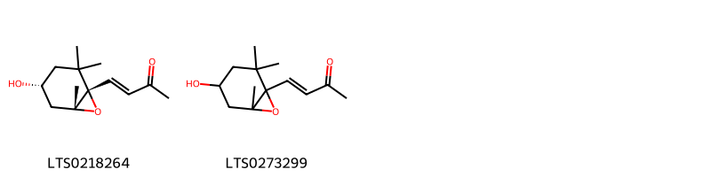{ width=100% }
    <figcaption>Hình ảnh cấu trúc hóa học của 2 hoạt chất thuộc nhóm Oxepanes gồm ['(3e)-4-[(1s,4r,6r)-4-hydroxy-2,2,6-trimethyl-7-oxabicyclo[4.1.0]heptan-1-yl]but-3-en-2-one (LTS0218264)', '4-{4-hydroxy-2,2,6-trimethyl-7-oxabicyclo[4.1.0]heptan-1-yl}but-3-en-2-one (LTS0273299)'].</figcaption>
</figure>
### Nhóm Phenol ethers
<figure markdown="span">
    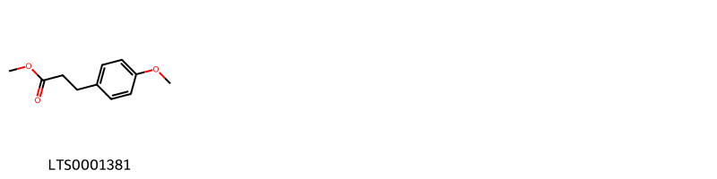{ width=100% }
    <figcaption>Hình ảnh cấu trúc hóa học của 1 hoạt chất thuộc nhóm Phenol ethers gồm ['methyl 3-(4-methoxyphenyl)propanoate (LTS0001381)'].</figcaption>
</figure>
### Nhóm Phenols
<figure markdown="span">
    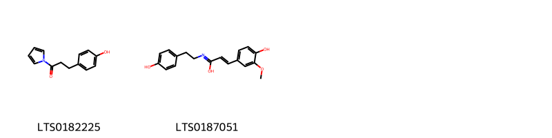{ width=100% }
    <figcaption>Hình ảnh cấu trúc hóa học của 2 hoạt chất thuộc nhóm Phenols gồm ['3-(4-hydroxyphenyl)-1-(pyrrol-1-yl)propan-1-one (LTS0182225)', '(2e)-3-(4-hydroxy-3-methoxyphenyl)-n-[2-(4-hydroxyphenyl)ethyl]prop-2-enimidic acid (LTS0187051)'].</figcaption>
</figure>
### Nhóm Phenylpropanoic acids
<figure markdown="span">
    { width=100% }
    <figcaption>Hình ảnh cấu trúc hóa học của 1 hoạt chất thuộc nhóm Phenylpropanoic acids gồm ['3-phenylpropionic acid (LTS0121890)'].</figcaption>
</figure>
### Nhóm Prenol lipids
<figure markdown="span">
    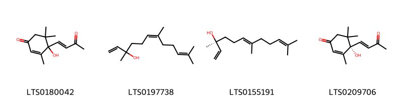{ width=100% }
    <figcaption>Hình ảnh cấu trúc hóa học của 4 hoạt chất thuộc nhóm Prenol lipids gồm ['4-hydroxy-3,5,5-trimethyl-4-(3-oxobut-1-en-1-yl)cyclohex-2-en-1-one (LTS0180042)', 'nerolidol (LTS0197738)', 'nerolidol (LTS0155191)', 'dehydrovomifoliol (LTS0209706)'].</figcaption>
</figure>
### Nhóm Pyrrolidines
<figure markdown="span">
    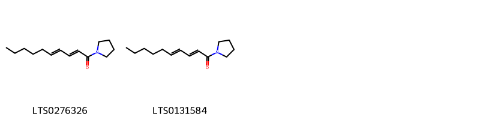{ width=100% }
    <figcaption>Hình ảnh cấu trúc hóa học của 2 hoạt chất thuộc nhóm Pyrrolidines gồm ['iyeremide a (LTS0276326)', '1-(pyrrolidin-1-yl)deca-2,4-dien-1-one (LTS0131584)'].</figcaption>
</figure>
### Nhóm Steroids and steroid derivatives
<figure markdown="span">
    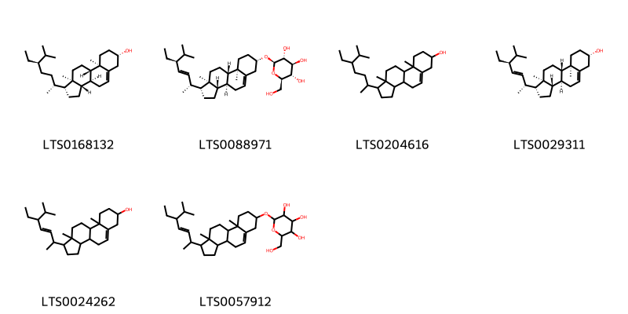{ width=100% }
    <figcaption>Hình ảnh cấu trúc hóa học của 6 hoạt chất thuộc nhóm Steroids and steroid derivatives gồm ['sitosterol (LTS0168132)', '(2r,3r,4s,5s,6r)-2-{[(1r,3as,3bs,7s,9ar,9bs,11ar)-1-[(2r,3e,5s)-5-ethyl-6-methylhept-3-en-2-yl]-9a,11a-dimethyl-1h,2h,3h,3ah,3bh,4h,6h,7h,8h,9h,9bh,10h,11h-cyclopenta[a]phenanthren-7-yl]oxy}-6-(hydroxymethyl)oxane-3,4,5-triol (LTS0088971)', 'stigmast-5-en-3-ol, (3β)- (LTS0204616)', 'phytosterol (LTS0029311)', 'stigmasterol (LTS0024262)', '2-{[1-(5-ethyl-6-methylhept-3-en-2-yl)-9a,11a-dimethyl-1h,2h,3h,3ah,3bh,4h,6h,7h,8h,9h,9bh,10h,11h-cyclopenta[a]phenanthren-7-yl]oxy}-6-(hydroxymethyl)oxane-3,4,5-triol (LTS0057912)'].</figcaption>
</figure>

---

## Tác dụng dược lý

Theo tài liệu "Những cây thuốc và vị thuốc Việt Nam" - Đỗ Tất Lợi:-Kháng khuẩn đối với các vì khuẩn: Bacillus pyocyaneus, Staphylococcus aureus và Bacillus subtilis;
-Chống viêm. 
-Gây giãn mạch ngoại biên và ức chế hoạt tính gây co thắt cơ trơn ruột của histamin và acetylcholin. 
-Ức chế men colagenase

Theo tài liệu quốc tế: 

---

## Dược điển Việt Nam V

### Soi bột:

<!-- Hình ảnh soi bột sẽ được tự động chèn vào đây sau -->
### Vi phẫu:
Biểu bì trên và dưới gồm một lớp tế bào xếp đều đặn, biểu bì dưới của gân lá mang lông che chở đơn bào và đa bào ngắn, đầu nhọn có từ 2 tế bào đến 3 tế bào xếp thành dày, lỗ khí ở mặt dưới phiến lá. Đám mô dày xếp sát biểu bì trên và biểu bì dưới. Mô mềm gồm tế bào tròn, thành mỏng. Một bó libe-gỗ to nằm giữa gân lá, gồm có vòng mô dày bao bọc xung quanh, bó gỗ có nhiều mạch to xếp phía trên, cung libe ở phía dưới. Phiến lá có mô mềm đồng hỏa xếp giữa hai lớp hạ bì, tế bào nhò, thành mỏng xếp lộn xộn, Rải rác có tế bào tiết tinh dầu trong mô mềm và trong libe.
<!-- Hình ảnh vi phẫu sẽ được tự động chèn vào đây sau -->
### Định tính

Màu lục xám, mùi thơm, vị hơi đắng. Soi kính hiển vi thấy: Mảnh biểu bì trên của lá gồm tế bào thành mỏng, hình nhiều cạnh, mang tế bào tiết. Mảnh biểu bì dưới là tế bào thành mỏng, nhăn, mang lỗ khí và tế bào tiết. Tế bào tiết màu vàng, xung quanh có khoảng 6 tế bào sắp xếp tỏa ra. Tế bào biểu bì dưới gân lá hình nhiều cạnh, thành mỏng, mang lông che chở đơn bào hay đa bào ngắn, đầu nhọn. Mảnh thân cây: Tế bào hình nhiều cạnh, mang lỗ vỏ, lông che chở và tế bào tiết, có khi lông đã rụng để lại những vết tròn nhỏ. Sợi mô cứng thành mỏng hay hơi dày, khoang rộng. Mảnh mạch xoắn, mạch mạng, mạch điểm. Định tính A. Cân 3 g bột dược liệu cho vào bình nón, làm ẩm bằng amoniac đậm đặc (TT), thêm 50 ml hỗn hợp đồng thể tích ether (TT) và cloroform (TT), lắc, lọc. Chuyển dịch lọc vào bình gạn, thêm 10 ml dung dịch acid sulfuric 10 % (TT). Lắc, gạn lấy phần dịch acid (dung dịch A) và làm các phản ứng sau: Lấy 1 ml dung dịch A, thêm 1 giọt thuốc thử Bouchardat (TT), xuất hiện tủa nâu. Lấy 1 ml dung dịch A, thêm 1 giọt dung dịch acid picric 1 % (TT), xuất hiện tủa vàng. B. Phương pháp sắc ký lớp mỏng (Phụ lục 5.4). Bản mỏng: Silica gel G. Dung môi khai triển: Ethyl acetat – methanol – nước (100 : 17 : 13). Dung dịch thử: Lấy 5 g bột dược liệu, cho vào bình nón dung dịch 100 ml, thêm 50 ml ethanol 90 % (TT), đun hồi lưu trong 1 h, để nguội, lọc, bốc hơi dịch lọc đến cắn. Hòa cắn trong nước bằng cách đun nóng trong cách thủy và khuấy 3 lần, mỗi lần 10 ml, gạn lấy phần dung dịch, gộp các dung dịch thu được để vào tủ lạnh ở 2 °C đến 8 °C qua đêm, lọc. Lấy dịch lọc lắc với 15 ml ethyl acetat (TT), gạn lấy dịch chiết ethyl aceat, bay hơi tới cắn, hòa cắn trong 1 ml ethanol 96 % (TT) được dịch chẩm sắc ký. Dung dịch đối chiếu: Lấy 5 g bột Lá lốt (mẫu chuẩn), chiết như mô tả ở phần Dung dịch thử. Cách tiến hành: Chấm riêng biệt lên bản mòng 2 µl mỗi dung dịch trên. Sau khi triển khai sắc ký, lấy bản mỏng ra để khô ở nhiệt độ phòng. Quan sát bản mỏng dưới sáng tử ngoại bước sóng 366 nm. Trên sắc ký đồ của dung dịch thử phải có các vết có cùng màu sắc và giá trị Rf với các vết trên sắc ký đồ của dung dịch đối chiếu.

### Định lượng

Định lượng Tiến hành theo phương pháp “Định lượng tinh dầu trong dược liệu” (Phụ lục 12.7). Lấy 30 g dược liệu, thêm 300 ml nước, cất trong 3 h. Hàm lượng tinh dần trong dược liệu không được ít hơn 0,5 % tính theo dược liệu khô kiệt.

### Thông tin khác 
- ** Độ ẩm: ** Không quá 13,0 % đối với dược liệu khô (Phụ lục 12.13).

- ** Bảo quản:** 
## Dược điển Hồng kong

<!-- PDF sẽ được tự động chèn vào đây sau -->

---

## Y dược học cổ truyền

- **Tên vị thuốc:** 
- **Tính vị quy kinh:** Tân, ôn, mùi thơm. Vào các kinh tỳ, phế.
- **Công năng chủ trị:** Ôn trung tán hàn, hạ khí chỉ thông, trừ phong thấp. Chủ trị: Phong hàn thấp, chân tay lạnh, tê bại. Rối loạn tiêu hóa, nôn mửa, đầy hơi, đau bụng ỉa chảy, thận và bàng quang lạnh, đau răng, đau đầu, chảy nước mũi hôi, ra mồ hôi tay chân.
- **Chú ý:** 
- **Kiêng kỵ:** Vị nhiệt, táo bón không nên dùng.nn

