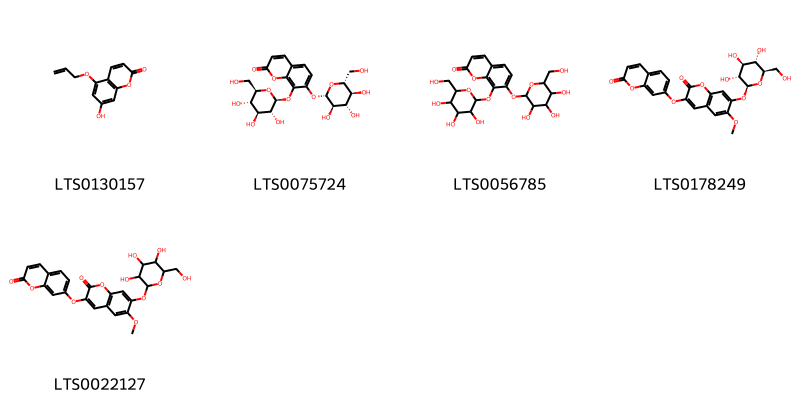
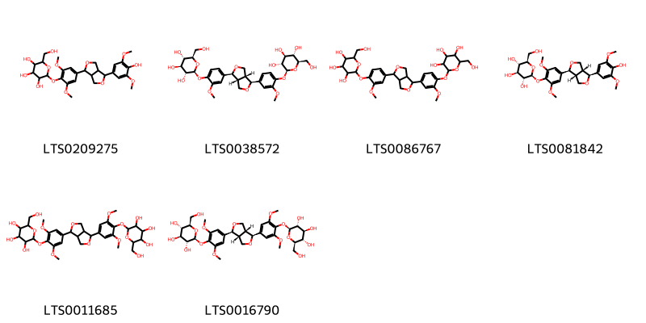
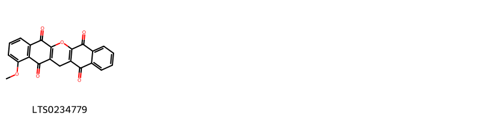
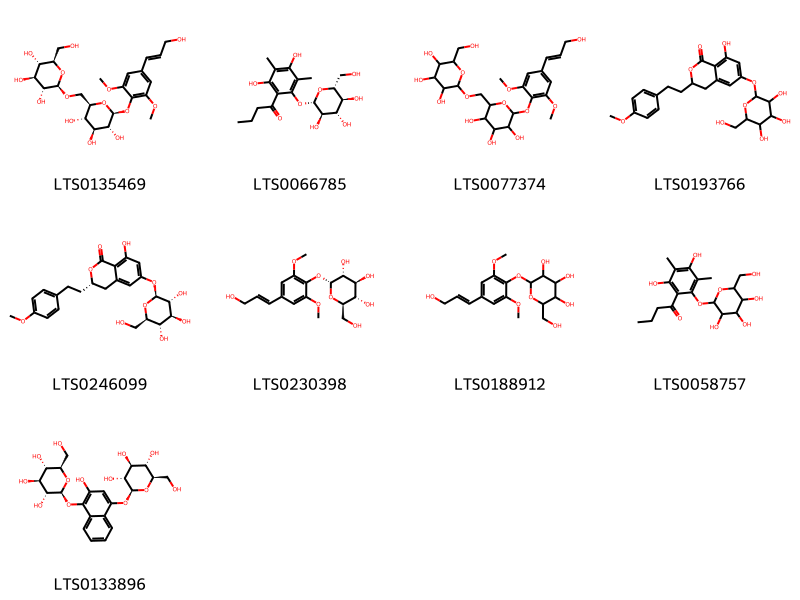

!!! abstract "Tóm tắt"
    Lá móng tên khoa học là Folium Lawsoniae, họ Lythraceae - Tử vi. Mọc hoang và được trồng ở Việt Nam. Hiện nay ít trồng hơn và ít dùng. Có mọc ở khắp các nước nhiệt đới và á nhiệt đới. Tại Ai Cập, người ta trồng để xuất cảng.. Trước đây ở Việt Nam, nhân dân thường dùng lá móng để nhuộm đỏ móng tay, móng chân trong dịp tết Đoan Ngọ (ngày mùng 5 tháng 5 âm lịch).Còn dùng chữa hắc lào, bệnh da vàng, bệnh hủi, lở loét. Người ta cho rằng lá móng có tác dụng làm cho tóc và móng tay chóng mọc. Lá tươi giã nát trộn với dấm thanh dùng để chữa bệnh ngoài da.Tại châu Âu, người ta dùng lá móng để chế mỹ phẩm và làm thuốc nhuộm tóc. Tại một số nước, người ta dùng vỏ thân cây làm thuốc chữa bệnh gan, bệnh tuỷ sống lưng, chữa tê bại nhức mỏi. Có khi còn dùng chữa kinh nguyệt không đều, có thể gây sẩy thai. Nhân dân Campuchia dùng để làm thuốc lợi niệu, chữa ho, viêm khí quản. Phòng đông y thực nghiệm Viện vi trùng Việt nam đã thí nghiệm tác dụng kháng sinh của lá móng tay thấy tác dụng kháng sinh của lá rất mạnh. Lá chứa một thuộc chất quinon gọi là Lawsone có tác dụng kháng sinh mạnh. Ngoài ra, trước đây, người ta còn thấy trong lá móng có 7- 8% tanin, 6% chất béo, 1,20% tinh dầu, 2-3% chất nhựa, 2% chất màu có tinh thể hình kim màu vàng da cam, chất màu này là một chất nhuộm có phản ứng axit, ra ánh sáng và không khí có màu đỏ, do đó bột có màu xanh nhạt ở giữa, màu đỏ xung quanh.

## Thông tin về thực vật

### Đặc điểm thực vật

Dược liệu **Lá Móng** từ bộ phận **** từ loài *Lawsonia inermis L* thuộc họ Lythraceae. Cây lá móng tay là một cây nhỏ, cao chừng 3-4mét, thân nhẵn hoặc có gai ở đầu cành. Lá mọc đối, cuống ngắn, phiến là đơn, nhỏ, hình trứng, hai đầu bẹp, nhất là phía cuống, dài 2-3 cm, rộng 1-1,5 cm. Hoa trắng đỏ, mùi thơm, nhỏ, mọc thành chuỳ ở đầu cành. Quả nang hình cầu to bằng quả hạt tiêu, không nứt, phía cuống có đài bao bọc, có 4 cạnh dọc, 4 ngăn, trong chứa nhiều hạt nhỏ, có cạnh góc, vỏ hạt dai, rất dày phía dưới xốp 

!!! info "Phân loại thực vật của *Lawsonia inermis*"
    - **Kingdom:** Plantae
    - **Phylum:** Tracheophyta
    - **Order:** Myrtales
    - **Family:** Lythraceae
    - **Genus:** Lawsonia
    - **Species:** *Lawsonia inermis*

*Tài liệu tham khảo:* "Những cây thuốc và vị thuốc Việt Nam" - Đỗ Tất Lợi

 

### Loài thay thế (Nếu có)

### Phân bố trên thế giới
**Từ vườn thực vật KEW: **: -Bản địa: Djibouti, Eritrea, Ethiopia, India, Kenya, Oman, Pakistan, Panamá, Saudi Arabia, Somalia, Tanzania, Yemen
-Di thực: Algeria, Andaman Is., Aruba, Assam, Bahamas, Bangladesh, Benin, Burkina, Cameroon, Cayman Is., Central African Republic, Chad, Comoros, Costa Rica, Cuba, Dominican Republic, East Himalaya, Ecuador, Ghana, Guinea, Guinea-Bissau, Gulf of Guinea Is., Guyana, Haiti, Iraq, Ivory Coast, Jamaica, Jawa, KwaZulu-Natal, Laos, Lebanon-Syria, Leeward Is., Lesser Sunda Is., Liberia, Libya, Madagascar, Maldives, Mali, Marianas, Mauritania, Mexico Southwest, Morocco, Mozambique, Myanmar, Netherlands Antilles, New Guinea, Nicobar Is., Niger, Nigeria, Palestine, Puerto Rico, Senegal, Sierra Leone, Sri Lanka, Sudan, Suriname, Tadzhikistan, Togo, Trinidad-Tobago, Tunisia, Turks-Caicos Is., Uganda, Venezuela, Venezuelan Antilles, Vietnam, West Himalaya, Windward Is., Zaïre

**Từ CSDL GIBF** Mexico, United Arab Emirates, Singapore, Maldives, Egypt, Tunisia, Benin, French Guiana, India, Malaysia

### Phân bố tại Việt Nam
** "Những cây thuốc và vị thuốc Việt Nam" - Đỗ Tất Lợi**: Mọc hoang và được trồng ở Việt Nam. Hiện nay ít trồng hơn và ít dùng. Có mọc ở khắp các nước nhiệt đới và á nhiệt đới. Tại Ai Cập, người ta trồng để xuất cảng.

**Từ CSDL GIBF**: Không có ghi nhận ở Việt Nam

---

## Thông tin về dược liệu 

### Định danh

!!! info "Thông tin về tên gọi của lá móng"
    - Dược liệu tiếng Việt: lá móng
    - Dược liệu tiếng Trung:  ()
    - Dược liệu tiếng Anh: 
    - Dược liệu latin thông dụng: Folium Lawsoniae
    - Dược liệu latin kiểu DĐVN: folium lawsoniae
    - Dược liệu latin kiểu DĐVN: 
    - Dược liệu latin kiểu thông tư: 
    - Bộ phận dùng:  (Folium)

### Mô tả dược liệu 
- **Theo dược điển Việt nam V:** Lá hình trứng, gốc lá thuôn, đầu nhọn, dài 2 cm đến 3 cm, rộng 1 cm đến 1,5 cm, cuống ngắn, mép lá nguyên hơi lượn sóng, mặt trên màu lục, mặt dưới màu nâu nhạt.

- **Mô tả dược liệu theo thông tư chế biến dược liệu theo phương pháp cổ truyền:** 

### Chế biến 

- **Chế biến theo dược điển việt nam V**: Thu hái lá, phơi khô hoặc sấy khô. Khi dùng tiến hành vi sao. nn

- **Chế biến theo thông tư:** 

--- 

## Thành phần hóa học

- Theo tài liệu của GS. Đỗ Tất Lợi:  Lá chứa một thuộc chất quinon gọi là Lawsone có tác dụng kháng sinh mạnh. Ngoài ra, trước đây, người ta còn thấy trong lá móng có 7- 8% tanin, 6% chất béo, 1,20% tinh dầu, 2-3% chất nhựa, 2% chất màu có tinh thể hình kim màu vàng da cam, chất màu này là một chất nhuộm có phản ứng axit, ra ánh sáng và không khí có màu đỏ, do đó bột có màu xanh nhạt ở giữa, màu đỏ xung quanh.
    
- Theo cơ sở dữ liệu lotus: Từ loài *Lawsonia inermis* đã phân lập và xác định được 94 hoạt chất thuộc về các nhóm Naphthalenes, Lignan glycosides, Organooxygen compounds, Benzopyrans, Steroids and steroid derivatives, Prenol lipids, Coumarins and derivatives, Fatty Acyls, Benzene and substituted derivatives, Naphthopyrans, Dioxanes, Flavonoids, 2-arylbenzofuran flavonoids. 

|    | chemicalTaxonomyClassyfireClass     |   smiles_count |
|---:|:------------------------------------|---------------:|
|  0 | 2-arylbenzofuran flavonoids         |              2 |
|  1 | Benzene and substituted derivatives |              1 |
|  2 | Benzopyrans                         |              3 |
|  3 | Coumarins and derivatives           |              5 |
|  4 | Dioxanes                            |              2 |
|  5 | Fatty Acyls                         |              6 |
|  6 | Flavonoids                          |             23 |
|  7 | Lignan glycosides                   |              6 |
|  8 | Naphthalenes                        |              3 |
|  9 | Naphthopyrans                       |              1 |
| 10 | Organooxygen compounds              |              9 |
| 11 | Prenol lipids                       |             25 |
| 12 | Steroids and steroid derivatives    |              8 |

### Nhóm 2-arylbenzofuran flavonoids
<figure markdown="span">
    { width=100% }
    <figcaption>Hình ảnh cấu trúc hóa học của 2 hoạt chất thuộc nhóm 2-arylbenzofuran flavonoids gồm ['lawsonicin (LTS0195993)', '3-(hydroxymethyl)-2-[4-(3-hydroxypropyl)-3-methoxyphenyl]-6-methoxy-2,3-dihydro-1-benzofuran-5-ol (LTS0170042)'].</figcaption>
</figure>
### Nhóm Benzene and substituted derivatives
<figure markdown="span">
    { width=100% }
    <figcaption>Hình ảnh cấu trúc hóa học của 1 hoạt chất thuộc nhóm Benzene and substituted derivatives gồm ['galop (LTS0222857)'].</figcaption>
</figure>
### Nhóm Benzopyrans
<figure markdown="span">
    { width=100% }
    <figcaption>Hình ảnh cấu trúc hóa học của 3 hoạt chất thuộc nhóm Benzopyrans gồm ['8-hydroxy-2,6-dimethoxy-9-oxoxanthen-3-yl acetate (LTS0154403)', '1,3-dihydroxy-6,7-dimethoxyxanthen-9-one (LTS0099334)', '6-(acetyloxy)-8-hydroxy-2-methoxy-9-oxoxanthen-3-yl acetate (LTS0107768)'].</figcaption>
</figure>
### Nhóm Coumarins and derivatives
<figure markdown="span">
    { width=100% }
    <figcaption>Hình ảnh cấu trúc hóa học của 5 hoạt chất thuộc nhóm Coumarins and derivatives gồm ['7-hydroxy-5-(prop-2-en-1-yloxy)chromen-2-one (LTS0130157)', '7,8-bis({[(2s,3r,4s,5s,6r)-3,4,5-trihydroxy-6-(hydroxymethyl)oxan-2-yl]oxy})chromen-2-one (LTS0075724)', '7,8-bis({[3,4,5-trihydroxy-6-(hydroxymethyl)oxan-2-yl]oxy})chromen-2-one (LTS0056785)', '6-methoxy-3-[(2-oxochromen-7-yl)oxy]-7-{[(2s,3r,4s,5s,6r)-3,4,5-trihydroxy-6-(hydroxymethyl)oxan-2-yl]oxy}chromen-2-one (LTS0178249)', '6-methoxy-3-[(2-oxochromen-7-yl)oxy]-7-{[3,4,5-trihydroxy-6-(hydroxymethyl)oxan-2-yl]oxy}chromen-2-one (LTS0022127)'].</figcaption>
</figure>
### Nhóm Dioxanes
<figure markdown="span">
    { width=100% }
    <figcaption>Hình ảnh cấu trúc hóa học của 2 hoạt chất thuộc nhóm Dioxanes gồm ['5-(docosa-2,5-dien-1-yl)-1,4-dioxane-2,3-dione (LTS0048290)', '(5s)-5-[(2e,5e)-docosa-2,5-dien-1-yl]-1,4-dioxane-2,3-dione (LTS0074616)'].</figcaption>
</figure>
### Nhóm Fatty Acyls
<figure markdown="span">
    { width=100% }
    <figcaption>Hình ảnh cấu trúc hóa học của 6 hoạt chất thuộc nhóm Fatty Acyls gồm ['(8e)-undec-8-en-1-yl 12-[(2s)-5,6-dioxo-1,4-dioxan-2-yl]dodecanoate (LTS0093073)', '3-methylnonacosan-1-ol (LTS0120241)', '(3s)-3-methylnonacosan-1-ol (LTS0004840)', 'α-linolenic acid (LTS0275508)', 'α linolenic acid (LTS0132789)', 'undec-8-en-1-yl 12-(5,6-dioxo-1,4-dioxan-2-yl)dodecanoate (LTS0273450)'].</figcaption>
</figure>
### Nhóm Flavonoids
<figure markdown="span">
    { width=100% }
    <figcaption>Hình ảnh cấu trúc hóa học của 23 hoạt chất thuộc nhóm Flavonoids gồm ['5-hydroxy-6-pentyl-7-(pentyloxy)-2-phenylchromen-4-one (LTS0069216)', '5-hydroxy-2-(4-methoxyphenyl)-7-{[(2s,3r,4s,5s,6r)-3,4,5-trihydroxy-6-(hydroxymethyl)oxan-2-yl]oxy}chromen-4-one (LTS0120993)', '2-(3,4-dihydroxyphenyl)-7-hydroxy-5-{[(2s,3r,4s,5s,6r)-3,4,5-trihydroxy-6-(hydroxymethyl)oxan-2-yl]oxy}chromen-4-one (LTS0155853)', '5-hydroxy-7-(pent-4-en-1-yloxy)-2-phenylchromen-4-one (LTS0144758)', 'rhoifolin (LTS0150745)', '5,7-dihydroxy-2-(3-hydroxy-4-methoxyphenyl)-3-{[(2s,3r,4s,5s,6r)-3,4,5-trihydroxy-6-(hydroxymethyl)oxan-2-yl]oxy}chromen-4-one (LTS0223934)', 'fustin (LTS0228197)', '2-(3,4-dimethoxyphenyl)chromen-4-one (LTS0182841)', '(+/-)-eriodictyol (LTS0106920)', 'isoquercetin (LTS0254337)', "luteolin 3'-glucoside (LTS0071552)", 'spiraeoside (LTS0068360)', '5,7-dihydroxy-2-(4-methoxy-3-{[(2s,3r,4s,5s,6r)-3,4,5-trihydroxy-6-(hydroxymethyl)oxan-2-yl]oxy}phenyl)chromen-4-one (LTS0213261)', 'luteolin 7-o-glucoside (LTS0227450)', '(2r)-5-hydroxy-2-(4-hydroxyphenyl)-7-(pent-4-en-1-yloxy)-2,3-dihydro-1-benzopyran-4-one (LTS0006964)', '7-hydroxyflavone (LTS0135437)', '6-{[5,7-dihydroxy-2-(4-hydroxyphenyl)-4-oxochromen-6-yl]oxy}-3,4,5-trihydroxyoxane-2-carboxylic acid (LTS0001130)', 'fustin (LTS0248078)', 'quercetin (LTS0004651)', '(2s,3s,4s,5r,6s)-6-{[5,7-dihydroxy-2-(4-hydroxyphenyl)-4-oxochromen-6-yl]oxy}-3,4,5-trihydroxyoxane-2-carboxylic acid (LTS0006527)', 'rhoifolin (LTS0029806)', '5,7-dihydroxy-2-(3-hydroxy-4-{[(2s,3r,4s,5s,6r)-3,4,5-trihydroxy-6-(hydroxymethyl)oxan-2-yl]oxy}phenyl)chromen-4-one (LTS0006167)', 'luteolin (LTS0017052)'].</figcaption>
</figure>
### Nhóm Lignan glycosides
<figure markdown="span">
    { width=100% }
    <figcaption>Hình ảnh cấu trúc hóa học của 6 hoạt chất thuộc nhóm Lignan glycosides gồm ['2-{4-[4-(4-hydroxy-3,5-dimethoxyphenyl)-hexahydrofuro[3,4-c]furan-1-yl]-2,6-dimethoxyphenoxy}-6-(hydroxymethyl)oxane-3,4,5-triol (LTS0209275)', '(2s,3r,4s,5s,6r)-2-{4-[(1s,3ar,4s,6ar)-4-(3-methoxy-4-{[(2s,3r,4s,5s,6r)-3,4,5-trihydroxy-6-(hydroxymethyl)oxan-2-yl]oxy}phenyl)-hexahydrofuro[3,4-c]furan-1-yl]-2-methoxyphenoxy}-6-(hydroxymethyl)oxane-3,4,5-triol (LTS0038572)', '2-(hydroxymethyl)-6-{2-methoxy-4-[4-(3-methoxy-4-{[3,4,5-trihydroxy-6-(hydroxymethyl)oxan-2-yl]oxy}phenyl)-hexahydrofuro[3,4-c]furan-1-yl]phenoxy}oxane-3,4,5-triol (LTS0086767)', 'acanthoside b (LTS0081842)', '2-{4-[4-(3,5-dimethoxy-4-{[3,4,5-trihydroxy-6-(hydroxymethyl)oxan-2-yl]oxy}phenyl)-hexahydrofuro[3,4-c]furan-1-yl]-2,6-dimethoxyphenoxy}-6-(hydroxymethyl)oxane-3,4,5-triol (LTS0011685)', 'liriodendrin (LTS0016790)'].</figcaption>
</figure>
### Nhóm Naphthalenes
<figure markdown="span">
    { width=100% }
    <figcaption>Hình ảnh cấu trúc hóa học của 3 hoạt chất thuộc nhóm Naphthalenes gồm ['8-hydroxy-2-methylnaphthalene-1,4-dione (LTS0163574)', '2-hydroxy-1,4-naphthoquinone (LTS0266331)', 'hana (LTS0247440)'].</figcaption>
</figure>
### Nhóm Naphthopyrans
<figure markdown="span">
    { width=100% }
    <figcaption>Hình ảnh cấu trúc hóa học của 1 hoạt chất thuộc nhóm Naphthopyrans gồm ['1-methoxy-13h-6-oxapentacene-5,7,12,14-tetrone (LTS0234779)'].</figcaption>
</figure>
### Nhóm Organooxygen compounds
<figure markdown="span">
    { width=100% }
    <figcaption>Hình ảnh cấu trúc hóa học của 9 hoạt chất thuộc nhóm Organooxygen compounds gồm ['(2s,3r,4s,5s,6r)-2-{4-[(1e)-3-hydroxyprop-1-en-1-yl]-2,6-dimethoxyphenoxy}-6-({[(2r,3r,4s,5s,6r)-3,4,5-trihydroxy-6-(hydroxymethyl)oxan-2-yl]oxy}methyl)oxane-3,4,5-triol (LTS0135469)', '1-(2,4-dihydroxy-3,5-dimethyl-6-{[(2s,3r,4s,5s,6r)-3,4,5-trihydroxy-6-(hydroxymethyl)oxan-2-yl]oxy}phenyl)butan-1-one (LTS0066785)', '2-[4-(3-hydroxyprop-1-en-1-yl)-2,6-dimethoxyphenoxy]-6-({[3,4,5-trihydroxy-6-(hydroxymethyl)oxan-2-yl]oxy}methyl)oxane-3,4,5-triol (LTS0077374)', '8-hydroxy-3-[2-(4-methoxyphenyl)ethyl]-6-{[3,4,5-trihydroxy-6-(hydroxymethyl)oxan-2-yl]oxy}-3,4-dihydro-2-benzopyran-1-one (LTS0193766)', '(3s)-8-hydroxy-3-[2-(4-methoxyphenyl)ethyl]-6-{[(2s,3r,4s,5s,6r)-3,4,5-trihydroxy-6-(hydroxymethyl)oxan-2-yl]oxy}-3,4-dihydro-2-benzopyran-1-one (LTS0246099)', '(2r,3s,4s,5r,6r)-2-(hydroxymethyl)-6-{4-[(1e)-3-hydroxyprop-1-en-1-yl]-2,6-dimethoxyphenoxy}oxane-3,4,5-triol (LTS0230398)', '2-(hydroxymethyl)-6-[4-(3-hydroxyprop-1-en-1-yl)-2,6-dimethoxyphenoxy]oxane-3,4,5-triol (LTS0188912)', '1-(2,4-dihydroxy-3,5-dimethyl-6-{[3,4,5-trihydroxy-6-(hydroxymethyl)oxan-2-yl]oxy}phenyl)butan-1-one (LTS0058757)', '(2s,3r,4s,5s,6r)-2-[(3-hydroxy-4-{[(2s,3r,4s,5s,6r)-3,4,5-trihydroxy-6-(hydroxymethyl)oxan-2-yl]oxy}naphthalen-1-yl)oxy]-6-(hydroxymethyl)oxane-3,4,5-triol (LTS0133896)'].</figcaption>
</figure>
### Nhóm Prenol lipids
<figure markdown="span">
    { width=100% }
    <figcaption>Hình ảnh cấu trúc hóa học của 25 hoạt chất thuộc nhóm Prenol lipids gồm ['(1r,3ar,5ar,5br,7ar,9s,11ar,11br,13ar,13bs)-1-(3-hydroxyprop-1-en-2-yl)-3a,5a,5b,8,8,11a-hexamethyl-hexadecahydrocyclopenta[a]chrysen-9-ol (LTS0182745)', '10-hydroxy-2,2,6a,6b,9,9,12a-heptamethyl-1,3,4,5,6,7,8,8a,10,11,12,12b,13,14b-tetradecahydropicene-4a-carbaldehyde (LTS0047695)', '(3s,4ar,6ar,6bs,8ar,11r,12s,12ar,12br,14ar,14bs)-12b-hydroxy-4,4,6a,6b,8a,11,12,14b-octamethyl-1,2,3,4a,5,6,7,8,9,10,11,12,12a,14a-tetradecahydropicen-3-yl (2e)-3-(4-hydroxy-3-methoxyphenyl)prop-2-enoate (LTS0171633)', '9-{[3-(4-hydroxy-3-methoxyphenyl)prop-2-enoyl]oxy}-5a,5b,8,8,11a-pentamethyl-1-(prop-1-en-2-yl)-hexadecahydrocyclopenta[a]chrysene-3a-carboxylic acid (LTS0084081)', '(4as,6as,6br,8ar,9s,10s,12ar,12br,14bs)-10-hydroxy-9-({[(2e)-3-(4-hydroxyphenyl)prop-2-enoyl]oxy}methyl)-2,2,6a,6b,9,12a-hexamethyl-1,3,4,5,6,7,8,8a,10,11,12,12b,13,14b-tetradecahydropicene-4a-carboxylic acid (LTS0174245)', '(1r,3as,5ar,5br,7ar,9s,11ar,11br,13ar,13br)-9-hydroxy-5a,5b,8,8,11a-pentamethyl-1-(prop-1-en-2-yl)-hexadecahydrocyclopenta[a]chrysene-3a-carbaldehyde (LTS0200830)', 'oleanolic aldehyde (LTS0170906)', '1-(3-hydroxyprop-1-en-2-yl)-3a,5a,5b,8,8,11a-hexamethyl-hexadecahydrocyclopenta[a]chrysen-9-ol (LTS0191991)', '(1r,3as,5ar,5br,7ar,9s,11as,11br,13ar,13bs)-9-{[(2e)-3-(4-hydroxy-3-methoxyphenyl)prop-2-enoyl]oxy}-5a,5b,8,8,11a-pentamethyl-1-(prop-1-en-2-yl)-hexadecahydrocyclopenta[a]chrysene-3a-carboxylic acid (LTS0261429)', '(1r,3as,5ar,5br,7ar,9s,11ar,11br,13ar,13br)-9-{[(2e)-3-(4-hydroxy-3-methoxyphenyl)prop-2-enoyl]oxy}-5a,5b,8,8,11a-pentamethyl-1-(prop-1-en-2-yl)-hexadecahydrocyclopenta[a]chrysene-3a-carboxylic acid (LTS0152962)', '11-(acetyloxy)-10-hydroxy-2,2,6a,6b,9,9,12a-heptamethyl-1,3,4,5,6,7,8,8a,10,11,12,12b,13,14b-tetradecahydropicene-4a-carboxylic acid (LTS0145894)', '(4as,6as,6br,8ar,10r,11r,12ar,12br,14bs)-11-(acetyloxy)-10-hydroxy-2,2,6a,6b,9,9,12a-heptamethyl-1,3,4,5,6,7,8,8a,10,11,12,12b,13,14b-tetradecahydropicene-4a-carboxylic acid (LTS0140976)', '(1r,3as,5ar,5br,9s,11ar)-9-{[(2e)-3-(4-hydroxy-3-methoxyphenyl)prop-2-enoyl]oxy}-5a,5b,8,8,11a-pentamethyl-1-(prop-1-en-2-yl)-hexadecahydrocyclopenta[a]chrysene-3a-carboxylic acid (LTS0253040)', '12b-hydroxy-4,4,6a,6b,8a,11,12,14b-octamethyl-1,2,3,4a,5,6,7,8,9,10,11,12,12a,14a-tetradecahydropicen-3-yl 3-(4-hydroxy-3-methoxyphenyl)prop-2-enoate (LTS0173952)', '4-hydroxy-4-(3-hydroxybut-1-en-1-yl)-3,5,5-trimethylcyclohex-2-en-1-one (LTS0183737)', '(3s,4as,6ar,6bs,8ar,11r,12s,12as,12bs,14ar,14bs)-12b-hydroxy-4,4,6a,6b,8a,11,12,14b-octamethyl-1,2,3,4a,5,6,7,8,9,10,11,12,12a,14a-tetradecahydropicen-3-yl (2e)-3-(4-hydroxy-3-methoxyphenyl)prop-2-enoate (LTS0064370)', 'betulinaldehyde (LTS0046970)', '(1r,3as,5ar,7ar,9s,11as,11br,13ar,13bs)-9-{[(2e)-3-(4-hydroxy-3-methoxyphenyl)prop-2-enoyl]oxy}-5a,5b,8,8,11a-pentamethyl-1-(prop-1-en-2-yl)-hexadecahydrocyclopenta[a]chrysene-3a-carboxylic acid (LTS0210045)', '(1r,3as,5ar,5br,7as,9s,11ar,11bs,13ar,13br)-9-{[(2e)-3-(4-hydroxy-3-methoxyphenyl)prop-2-enoyl]oxy}-5a,5b,8,8,11a-pentamethyl-1-(prop-1-en-2-yl)-hexadecahydrocyclopenta[a]chrysene-3a-carboxylic acid (LTS0239938)', '(4s)-4-hydroxy-4-(3-hydroxybut-1-en-1-yl)-3,5,5-trimethylcyclohex-2-en-1-one (LTS0225700)', '(3s,4ar,6ar,6bs,8ar,11r,12s,12ar,12bs,14ar,14bs)-12b-hydroxy-4,4,6a,6b,8a,11,12,14b-octamethyl-1,2,3,4a,5,6,7,8,9,10,11,12,12a,14a-tetradecahydropicen-3-yl (2e)-3-(4-hydroxy-3-methoxyphenyl)prop-2-enoate (LTS0177580)', '10-hydroxy-9-({[3-(4-hydroxyphenyl)prop-2-enoyl]oxy}methyl)-2,2,6a,6b,9,12a-hexamethyl-1,3,4,5,6,7,8,8a,10,11,12,12b,13,14b-tetradecahydropicene-4a-carboxylic acid (LTS0059617)', '(6s,9r)-vomifoliol (LTS0052786)', '(3ar,5ar,5br,7ar,11ar,11br,13as,13bs)-1-(3-hydroxyprop-1-en-2-yl)-3a,5a,5b,8,8,11a-hexamethyl-hexadecahydrocyclopenta[a]chrysen-9-ol (LTS0272446)', '(4as,6br,10s,12ar,14bs)-10-hydroxy-2,2,6a,6b,9,9,12a-heptamethyl-1,3,4,5,6,7,8,8a,10,11,12,12b,13,14b-tetradecahydropicene-4a-carbaldehyde (LTS0035167)'].</figcaption>
</figure>
### Nhóm Steroids and steroid derivatives
<figure markdown="span">
    { width=100% }
    <figcaption>Hình ảnh cấu trúc hóa học của 8 hoạt chất thuộc nhóm Steroids and steroid derivatives gồm ['stigmast-5-en-3-ol, (3β)- (LTS0204616)', 'phytosterol (LTS0029311)', 'stigmast-5-en-3-ol (LTS0071224)', 'sitogluside (LTS0201798)', 'sitosterol (LTS0168132)', '2-{[1-(5-ethyl-6-methylheptan-2-yl)-9a,11a-dimethyl-1h,2h,3h,3ah,3bh,4h,6h,7h,8h,9h,9bh,10h,11h-cyclopenta[a]phenanthren-7-yl]oxy}-6-(hydroxymethyl)oxane-3,4,5-triol (LTS0158828)', '(1r,3as,3bs,7s,9ar,9bs,11ar)-1-[(2r,5r)-5-ethyl-6-methylheptan-2-yl]-9a,11a-dimethyl-1h,2h,3h,3ah,3bh,4h,5h,7h,8h,9h,9bh,10h,11h-cyclopenta[a]phenanthren-7-ol (LTS0262816)', '1-(5-ethyl-6-methylheptan-2-yl)-9a,11a-dimethyl-1h,2h,3h,3ah,3bh,4h,5h,7h,8h,9h,9bh,10h,11h-cyclopenta[a]phenanthren-7-ol (LTS0064000)'].</figcaption>
</figure>

---

## Tác dụng dược lý

Theo tài liệu "Những cây thuốc và vị thuốc Việt Nam" - Đỗ Tất Lợi:-tác dụng kháng sinh của lá rất mạnh

Theo tài liệu quốc tế: 

---

## Dược điển Việt Nam V

### Soi bột:
Bột có màu xanh lục. Soi dưới kính hiển vi thấy: Mảnh mô mềm mang tinh bột, tinh thể calci oxalat hình cầu gai, mảnh mạch xoắn, mạch điểm, mạch thang. nn
<!-- Hình ảnh soi bột sẽ được tự động chèn vào đây sau -->
### Vi phẫu:
Gân chính: Gân lá hơi lồi ở phía dưới, hơi lõm và nhọn ở phía trên. Biểu bì trên và dưới là một lớp tế bào xếp đều đặn. Sau biểu bì trên và dưới là lớp mô dày có 2 đến 3 hàng tế bào có thành dày ở góc. Mô mềm gồm các tế bào hình đa giác thành mỏng. Rải rác trong mô mềm có tinh thể calci oxalat hình cầu gai. Giữa gân chính là những bó libe-gỗ xếp thành hình cung, libe ờ phía trên và dưới, các bó gỗ ở trong. Phiến lá: Dưới lớp biểu bì trên là 2 đến 3 hàng tế bào mô dậu, mô mềm rải rác có tinh thể calci oxalat hình cầu gai.
<!-- Hình ảnh vi phẫu sẽ được tự động chèn vào đây sau -->
### Định tính

A. Lấy khoảng 5 g bột dược liệu cho vào bình nón, thêm 30 ml ethanol 96 % (TT), đun cách thủy khoảng 10 min, lọc, dịch lọc làm các phản ứng sau: Cho 1 ml dịch lọc vào ống nghiệm, thêm ít bột magnesi (TT) và 5 giọt acid hydrocloric (TT), lắc đều rồi đặt vào bình cách thủy vài phút sẽ xuất hiện màu đỏ đậm. Nhỏ 1 giọt dịch lọc lên tờ giấy lọc, sấy nhẹ cho khô rồi đặt trên miệng lọ amoniac đậm đặc đã mở nút thấy màu vàng của vết đậm lên. Cho vào ống nghiệm 1 ml dịch lọc, thêm 2-3 giọt dung dịch sắt (III) clorid 5 % (TT) sẽ xuất hiện màu xanh đen. Lấy 1 ml dịch lọc cho vào ống nghiệm to, thêm 5 ml nước, lắc mạnh ống nghiệm theo chiều dọc sẽ có cột bọt bền 15 min. B. Lấy 5 g bột dược liệu, thêm 10 ml methanol (TT) và 10 ml dung dịch natri hydroxyd 1 N (TT), đun hồi lưu 15 min, lọc nóng. Đun cách thủy dịch lọc để loại hết methanol và thu được dịch chiết nước. Acid hóa dịch chiết nước bằng acid hydrocloric (TT) đến pH 6, sau đó lắc kỹ với 5 ml cloroform (TT), gạn lớp cloroform vào ống nghiệm, thêm 3 ml amoniac (TT), lắc đều, lớp amoniac sẽ xuất hiện màu đỏ.

### Định lượng

### Thông tin khác 
- ** Độ ẩm: ** Không quá 12,0 % đối với dược liệu khô (Phụ lục 9.6, 2 g, 100 °C, 5 h).

- ** Bảo quản:** Để nơi khô mát, tránh ẩm, trong bao bì kín. nn
## Dược điển Hồng kong

<!-- PDF sẽ được tự động chèn vào đây sau -->

---

## Y dược học cổ truyền

- **Tên vị thuốc:** 
- **Tính vị quy kinh:** Vị đắng hơi chát. Tính ấm. Vào kinh can, thận.
- **Công năng chủ trị:** Hoạt huyết, tán ứ. Chủ trị: Đau nhức xương khớp, tê bại chân tay, bế kinh, hoặc phụ nữ kinh nguyệt không đều.

Còn dùng khi bị chấn thương sưng tấy cơ nhục. Sang lở, mụn nhọt, hắc lào, nấm móng tay, móng chân. Rắn cắn.
- **Chú ý:** 
- **Kiêng kỵ:** Phụ nữ có thai, hoặc đa kinh không dùng.nn

