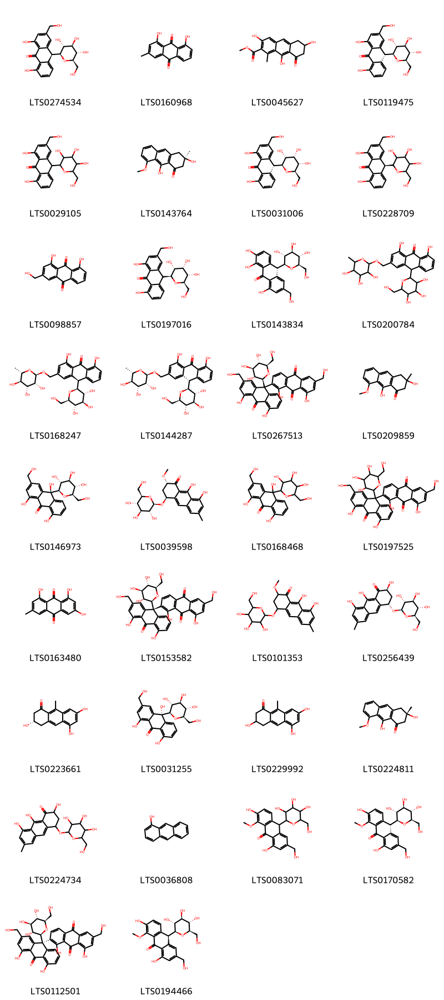
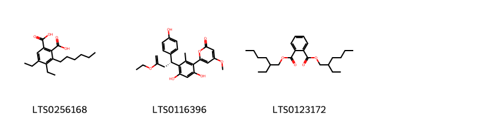
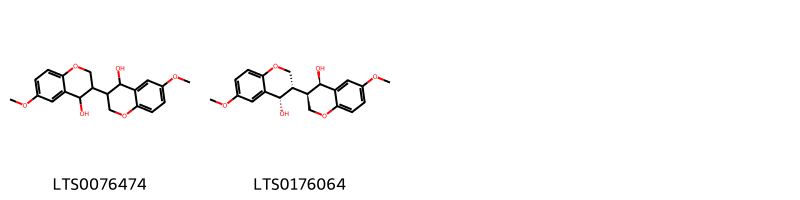
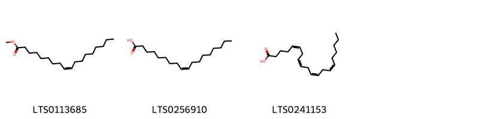
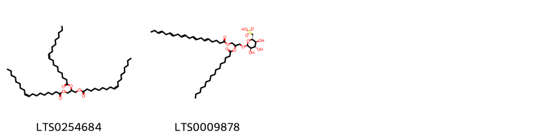
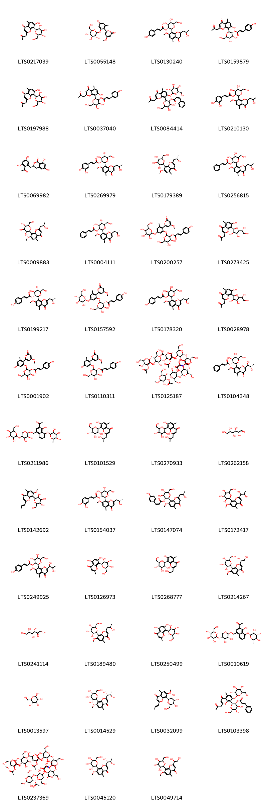
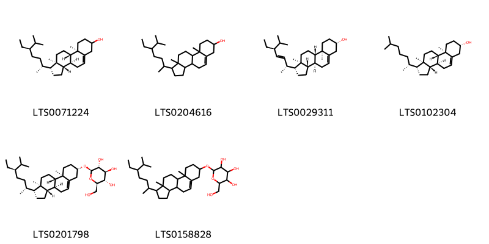

!!! abstract "Tóm tắt"
    Lô hội là cây có thân hóa, ngắn, to thô. Tên khoa học là Aloe sp., thuộc họ Hành Tỏi Liliaceae. Phân bố chủ yếu ở đông châu Phi, Ấn Độ, Châu Mỹ. Tại Việt Nam, lô hội mọc hoang ở bờ biển những tỉnh Ninh Thuận (Phan Rang, Phan Ri) và Bình Thuận. Ở miền Bắc được trồng làm cảnh nhưng ít hơn. Theo tài liệu cổ lô hội vị đắng tính hàn, vào 4 kinh can, tỳ, vị và đại tràng. Có tác dụng sát trùng, thông tiện, thanh nhiệt, lương can. Một số thành phần hóa học đã được phát hiện và xác định cấu trúc của nhóm Aloin.

## Thông tin về thực vật

### Đặc điểm thực vật

Dược liệu **Lô Hội (Nhựa)** từ bộ phận **nan** từ loài *Aloe vera L.* thuộc họ Asphodelaceae. - Lô hội có nhiều loài khác nhau. ở đây chúng tôi chỉ giới thiệu một loài có ở nước ta và một số loài thông dụng. Lô hội Aloe vera Livar. sinensis Berger [Aloe perfoliata Lour. (non L.). Alde barbadensis Mill.var.sinensis Haw.] là một cây có thân hoá gỗ, ngắn, to thô. Lá không cuống, mọc thành vành rất sít nhau, dày mẫm, hình 3 cạnh, mép dây, mép có răng cưa thô cứng và thưa dài 30-50cm, rộng 5- 10cm, dày 1-2cm, ở phía cuống. Cụm hoa dài chừng 1m, mọc thành chùm dài mang hoa màu vàng xanh lục nhạt lúc đầu mọc đứng, sau rū xuống, dài 3-4cm. Quả nang, hình trứng thuôn, lúc đầu xanh sau nâu và dai.
- Tại miền Bắc có trồng một loài lô hội trước đây được xác định là Aloe perfoliata L. chủ yếu để làm cảnh, có lá ngắn hơn chỉ đo được chừng 15- 20cm, chưa thấy ra hoa kết quả.
- Tại các nước khúc người ta dùng nhựa nhiều cây lô hội khác như Aloe vulgaris Lamk., Aloe ferox L., Aloe perryi Bak. v.v... cho nhiều thứ lô hội chất lượng khác nhau. 

!!! info "Phân loại thực vật của *Aloe vera*"
    - **Kingdom:** Plantae
    - **Phylum:** Tracheophyta
    - **Order:** Asparagales
    - **Family:** Asphodelaceae
    - **Genus:** Aloe
    - **Species:** *Aloe vera*

*Tài liệu tham khảo:* "Những cây thuốc và vị thuốc Việt Nam" - Đỗ Tất Lợi

 

### Loài thay thế (Nếu có)

Dược liệu này cũng có thể từ loài *Aloe ferox Mm.*, thông tin về phân loại thực vật loài này như sau:
!!! info "Thông tin về phân loại thực vật của *Aloe ferox*"
    - **kingdom:** Plantae
    - **phylum:** Tracheophyta
    - **order:** Asparagales
    - **family:** Asphodelaceae
    - **genus:** Aloe
    - **species:** *Aloe ferox*

Hình ảnh của loài *Aloe ferox Mm.*:

### Phân bố trên thế giới
**Từ vườn thực vật KEW: **: Native to:
Aldabra, Angola, Benin, Botswana, Burkina, Burundi, Cameroon, Cape Provinces, Caprivi Strip, Central African Republic, Chad, Comoros, Congo, Djibouti, Eritrea, Ethiopia, Free State, Gabon, Ghana, Guinea, Guinea-Bissau, India, Ivory Coast, Kenya, KwaZulu-Natal, Lesotho, Madagascar, Malawi, Mali, Mauritius, Mozambique, Namibia, Nigeria, Northern Provinces, Oman, Palestine, Rodrigues, Rwanda, Réunion, Saudi Arabia, Senegal, Socotra, Somalia, Sudan, Swaziland, Tanzania, Togo, Uganda, Yemen, Zambia, Zaïre, Zimbabwe

Introduced into:
Algeria, Argentina Northeast, Arizona, Aruba, Ascension, Assam, Azores, Bahamas, Baleares, Bangladesh, Bermuda, Bolivia, California, Cambodia, Canary Is., Cape Verde, Caroline Is., Cayman Is., China South-Central, Cook Is., Corse, Costa Rica, Cuba, Cyprus, Dominican Republic, East Aegean Is., Ecuador, El Salvador, Florida, France, Galápagos, Greece, Guatemala, Gulf of Guinea Is., Gulf States, Haiti, Hawaii, Honduras, Italy, Jamaica, Juan Fernández Is., Korea, Kriti, Lebanon-Syria, Leeward Is., Libya, Madeira, Marshall Is., Mexico Central, Mexico Gulf, Mexico Northeast, Mexico Northwest, Mexico Southeast, Mexico Southwest, Morocco, Nepal, Netherlands Antilles, New South Wales, New Zealand North, New Zealand South, Nicaragua, Norfolk Is., Pakistan, Peru, Portugal, Puerto Rico, Queensland, Sicilia, South Australia, Spain, Sri Lanka, St.Helena, Tasmania, Texas, Thailand, Trinidad-Tobago, Tunisia, Turkey, Turks-Caicos Is., Venezuela, Venezuelan Antilles, Windward Is.

**Từ CSDL GIBF** Cabo Verde, Spain, Australia, Puerto Rico, Oman, Cyprus, Gibraltar, Aruba, Haiti, Malaysia, United Arab Emirates, Brazil, Antigua and Barbuda, Sint Maarten (Dutch part), Saint Vincent and the Grenadines, Curaçao, India, Mexico, Jordan, Anguilla, Greece, Colombia, Ecuador, Chad, Peru, French Guiana, Malta, Philippines, Bonaire, Sint Eustatius and Saba, Dominican Republic, Virgin Islands (U.S.), Jamaica, United States of America, Bahamas, Portugal, France, Benin, Chinese Taipei, Sri Lanka, Barbados

### Phân bố tại Việt Nam
** "Những cây thuốc và vị thuốc Việt Nam" - Đỗ Tất Lợi**: Cây lô hội mọc hoang ở bờ biển những tỉnh Ninh Thuận (Phan Rang, Phan Ri) và Bình Thuận. Ở miền Bắc được trồng làm cảnh nhưng ít hơn.

**Từ CSDL GIBF**: Không có ghi nhận ở Việt Nam

---

## Thông tin về dược liệu 

### Định danh

!!! info "Thông tin về tên gọi của nan"
    - Dược liệu tiếng Việt: nan
    - Dược liệu tiếng Trung: nan (nan)
    - Dược liệu tiếng Anh: nan
    - Dược liệu latin thông dụng: nan
    - Dược liệu latin kiểu DĐVN: resina aloe
    - Dược liệu latin kiểu DĐVN: nan
    - Dược liệu latin kiểu thông tư: nan
    - Bộ phận dùng: nan (nan)

### Mô tả dược liệu 
- **Theo dược điển Việt nam V:** nan

- **Mô tả dược liệu theo thông tư chế biến dược liệu theo phương pháp cổ truyền:** nan

### Chế biến 

- **Chế biến theo dược điển việt nam V**: nan

- **Chế biến theo thông tư:** nan

--- 

## Thành phần hóa học

- Theo tài liệu của GS. Đỗ Tất Lợi:  Nhóm hóa học: Aloin, Barbaloin, Aloesin
Tên hoạt chất: Barbaloin
    
- Theo cơ sở dữ liệu lotus: Từ loài *Aloe vera* đã phân lập và xác định được 113 hoạt chất thuộc về các nhóm Hydroxy acids and derivatives, Glycerolipids, Anthracenes, Organooxygen compounds, Saccharolipids, Benzopyrans, Steroids and steroid derivatives, Prenol lipids, Carboxylic acids and derivatives, Neoflavonoids, Fatty Acyls, Glycerophospholipids, Indoles and derivatives, Benzene and substituted derivatives, Organic phosphoric acids and derivatives. 

|    | chemicalTaxonomyClassyfireClass          |   smiles_count |
|---:|:-----------------------------------------|---------------:|
|  0 | Anthracenes                              |             34 |
|  1 | Benzene and substituted derivatives      |              3 |
|  2 | Benzopyrans                              |              2 |
|  3 | Carboxylic acids and derivatives         |              1 |
|  4 | Fatty Acyls                              |              3 |
|  5 | Glycerolipids                            |              2 |
|  6 | Glycerophospholipids                     |              2 |
|  7 | Hydroxy acids and derivatives            |              1 |
|  8 | Indoles and derivatives                  |              1 |
|  9 | Neoflavonoids                            |              1 |
| 10 | Organic phosphoric acids and derivatives |              1 |
| 11 | Organooxygen compounds                   |             47 |
| 12 | Prenol lipids                            |              1 |
| 13 | Saccharolipids                           |              6 |
| 14 | Steroids and steroid derivatives         |              6 |

### Nhóm Anthracenes
<figure markdown="span">
    { width=100% }
    <figcaption>Hình ảnh cấu trúc hóa học của 34 hoạt chất thuộc nhóm Anthracenes gồm ['aloin (LTS0274534)', 'turkey rhubarb (LTS0160968)', 'methyl 3,6,9-trihydroxy-1-methyl-8-oxo-6,7-dihydro-5h-anthracene-2-carboxylate (LTS0045627)', 'barbaloin (LTS0119475)', 'aloin (LTS0029105)', '(3r)-3,9-dihydroxy-8-methoxy-3-methyl-2,4-dihydroanthracen-1-one (LTS0143764)', '(10r)-1,8-dihydroxy-3-(hydroxymethyl)-10-[(2s,3r,4s,5s,6r)-3,4,5-trihydroxy-6-(hydroxymethyl)oxan-2-yl]-10h-anthracen-9-one (LTS0031006)', '(10s)-1,8-dihydroxy-3-(hydroxymethyl)-10-[3,4,5-trihydroxy-6-(hydroxymethyl)oxan-2-yl]-10h-anthracen-9-one (LTS0228709)', 'aloe emodin (LTS0098857)', '1,8-dihydroxy-3-(hydroxymethyl)-10-[(2s,3r,4s,5s,6r)-3,4,5-trihydroxy-6-(hydroxymethyl)oxan-2-yl]-10h-anthracen-9-one (LTS0197016)', '(10s)-1,2,8-trihydroxy-6-(hydroxymethyl)-10-[(2s,3r,4r,5s,6r)-3,4,5-trihydroxy-6-(hydroxymethyl)oxan-2-yl]-10h-anthracen-9-one (LTS0143834)', '1,8-dihydroxy-10-[3,4,5-trihydroxy-6-(hydroxymethyl)oxan-2-yl]-3-{[(3,4,5-trihydroxy-6-methyloxan-2-yl)oxy]methyl}-10h-anthracen-9-one (LTS0200784)', 'aloinoside b (LTS0168247)', 'aloinoside a (LTS0144287)', "1,4',5',8-tetrahydroxy-2',6-bis(hydroxymethyl)-9'-[(2s,3r,4r,5s,6r)-3,4,5-trihydroxy-6-(hydroxymethyl)oxan-2-yl]-[2,9'-bianthracene]-9,10,10'-trione (LTS0267513)", '3,9-dihydroxy-8-methoxy-3-methyl-2,4-dihydroanthracen-1-one (LTS0209859)', '(10s)-1,8,10-trihydroxy-3-(hydroxymethyl)-10-[(2r,3r,4s,5s,6r)-3,4,5-trihydroxy-6-(hydroxymethyl)oxan-2-yl]anthracen-9-one (LTS0146973)', '(2s,4s)-8,9-dihydroxy-2-methoxy-6-methyl-4-{[(2r,3r,4s,5s,6r)-3,4,5-trihydroxy-6-(hydroxymethyl)oxan-2-yl]oxy}-3,4-dihydro-2h-anthracen-1-one (LTS0039598)', '1,8,10-trihydroxy-3-(hydroxymethyl)-10-[3,4,5-trihydroxy-6-(hydroxymethyl)oxan-2-yl]anthracen-9-one (LTS0168468)', "1,4',5',8-tetrahydroxy-2',6-bis(hydroxymethyl)-9'-[3,4,5-trihydroxy-6-(hydroxymethyl)oxan-2-yl]-[2,9'-bianthracene]-9,10,10'-trione (LTS0197525)", 'emodin (LTS0163480)', "(9'r)-1,4',5',8-tetrahydroxy-2',6-bis(hydroxymethyl)-9'-[(2s,3r,4r,5s,6r)-3,4,5-trihydroxy-6-(hydroxymethyl)oxan-2-yl]-[2,9'-bianthracene]-9,10,10'-trione (LTS0153582)", '8,9-dihydroxy-2-methoxy-6-methyl-4-{[3,4,5-trihydroxy-6-(hydroxymethyl)oxan-2-yl]oxy}-3,4-dihydro-2h-anthracen-1-one (LTS0101353)', '(2s,4s)-2,8,9-trihydroxy-6-methyl-4-{[(2r,3r,4s,5s,6r)-3,4,5-trihydroxy-6-(hydroxymethyl)oxan-2-yl]oxy}-3,4-dihydro-2h-anthracen-1-one (LTS0256439)', '(3s)-3,5,7-trihydroxy-9-methyl-3,4-dihydro-2h-anthracen-1-one (LTS0223661)', '(10r)-1,8,10-trihydroxy-3-(hydroxymethyl)-10-[(2r,3r,4s,5s,6r)-3,4,5-trihydroxy-6-(hydroxymethyl)oxan-2-yl]anthracen-9-one (LTS0031255)', '3,5,7-trihydroxy-9-methyl-3,4-dihydro-2h-anthracen-1-one (LTS0229992)', '(3s)-3,9-dihydroxy-8-methoxy-3-methyl-2,4-dihydroanthracen-1-one (LTS0224811)', '2,8,9-trihydroxy-6-methyl-4-{[3,4,5-trihydroxy-6-(hydroxymethyl)oxan-2-yl]oxy}-3,4-dihydro-2h-anthracen-1-one (LTS0224734)', '1-anthrol (LTS0036808)', '2,8-dihydroxy-6-(hydroxymethyl)-1-methoxy-10-[3,4,5-trihydroxy-6-(hydroxymethyl)oxan-2-yl]-10h-anthracen-9-one (LTS0083071)', '(10s)-2,8-dihydroxy-6-(hydroxymethyl)-1-methoxy-10-[(2s,3r,4r,5s,6r)-3,4,5-trihydroxy-6-(hydroxymethyl)oxan-2-yl]-10h-anthracen-9-one (LTS0170582)', "(9's)-1,4',5',8-tetrahydroxy-2',6-bis(hydroxymethyl)-9'-[(2s,3r,4r,5s,6r)-3,4,5-trihydroxy-6-(hydroxymethyl)oxan-2-yl]-[2,9'-bianthracene]-9,10,10'-trione (LTS0112501)", '(10r)-2,8-dihydroxy-6-(hydroxymethyl)-1-methoxy-10-[(2s,3r,4r,5s,6r)-3,4,5-trihydroxy-6-(hydroxymethyl)oxan-2-yl]-10h-anthracen-9-one (LTS0194466)'].</figcaption>
</figure>
### Nhóm Benzene and substituted derivatives
<figure markdown="span">
    { width=100% }
    <figcaption>Hình ảnh cấu trúc hóa học của 3 hoạt chất thuộc nhóm Benzene and substituted derivatives gồm ['4,5-diethyl-3-hexylbenzene-1,2-dicarboxylic acid (LTS0256168)', '6-{3-[(1r)-3-ethoxy-1-(4-hydroxyphenyl)but-3-en-1-yl]-4,6-dihydroxy-2-methylphenyl}-4-methoxypyran-2-one (LTS0116396)', 'etalon (LTS0123172)'].</figcaption>
</figure>
### Nhóm Benzopyrans
<figure markdown="span">
    { width=100% }
    <figcaption>Hình ảnh cấu trúc hóa học của 2 hoạt chất thuộc nhóm Benzopyrans gồm ['3-(4-hydroxy-6-methoxy-3,4-dihydro-2h-1-benzopyran-3-yl)-6-methoxy-3,4-dihydro-2h-1-benzopyran-4-ol (LTS0076474)', '(3s,4s)-3-[(3r,4r)-4-hydroxy-6-methoxy-3,4-dihydro-2h-1-benzopyran-3-yl]-6-methoxy-3,4-dihydro-2h-1-benzopyran-4-ol (LTS0176064)'].</figcaption>
</figure>
### Nhóm Carboxylic acids and derivatives
<figure markdown="span">
    { width=100% }
    <figcaption>Hình ảnh cấu trúc hóa học của 1 hoạt chất thuộc nhóm Carboxylic acids and derivatives gồm ['oxalic acid (LTS0217707)'].</figcaption>
</figure>
### Nhóm Fatty Acyls
<figure markdown="span">
    { width=100% }
    <figcaption>Hình ảnh cấu trúc hóa học của 3 hoạt chất thuộc nhóm Fatty Acyls gồm ['methyl oleate (LTS0113685)', 'oleic acid (LTS0256910)', 'arachidonic acid (LTS0241153)'].</figcaption>
</figure>
### Nhóm Glycerolipids
<figure markdown="span">
    { width=100% }
    <figcaption>Hình ảnh cấu trúc hóa học của 2 hoạt chất thuộc nhóm Glycerolipids gồm ['triolein (LTS0254684)', '[(2s,3s,4s,5r,6s)-6-[2-(hexadecanoyloxy)-3-[(5e,8e,11e,14e,17e)-icosa-5,8,11,14,17-pentaenoyloxy]propoxy]-3,4,5-trihydroxyoxan-2-yl]methanesulfonic acid (LTS0009878)'].</figcaption>
</figure>
### Nhóm Glycerophospholipids
<figure markdown="span">
    { width=100% }
    <figcaption>Hình ảnh cấu trúc hóa học của 2 hoạt chất thuộc nhóm Glycerophospholipids gồm ['(2s)-3-(acetyloxy)-2-hydroxypropoxy([(2r,3r,5s,6r)-2,3,4,5,6-pentahydroxycyclohexyl]oxy)phosphinic acid (LTS0108205)', '2-amino-3-{[2-(butanoyloxy)-3-(propanoyloxy)propoxy(hydroxy)phosphoryl]oxy}propanoic acid (LTS0082229)'].</figcaption>
</figure>
### Nhóm Hydroxy acids and derivatives
<figure markdown="span">
    { width=100% }
    <figcaption>Hình ảnh cấu trúc hóa học của 1 hoạt chất thuộc nhóm Hydroxy acids and derivatives gồm ['malic acid (LTS0216520)'].</figcaption>
</figure>
### Nhóm Indoles and derivatives
<figure markdown="span">
    { width=100% }
    <figcaption>Hình ảnh cấu trúc hóa học của 1 hoạt chất thuộc nhóm Indoles and derivatives gồm ['n-[2-(5-methoxy-1h-indol-3-yl)ethyl]ethanimidic acid (LTS0219322)'].</figcaption>
</figure>
### Nhóm Neoflavonoids
<figure markdown="span">
    { width=100% }
    <figcaption>Hình ảnh cấu trúc hóa học của 1 hoạt chất thuộc nhóm Neoflavonoids gồm ['(4r)-7-hydroxy-4-(4-hydroxyphenyl)-6-(4-methoxy-6-oxopyran-2-yl)-5-methyl-3,4-dihydro-1-benzopyran-2-one (LTS0070627)'].</figcaption>
</figure>
### Nhóm Organic phosphoric acids and derivatives
<figure markdown="span">
    { width=100% }
    <figcaption>Hình ảnh cấu trúc hóa học của 1 hoạt chất thuộc nhóm Organic phosphoric acids and derivatives gồm ['o-phosphoethanolamine; bis(nonane) (LTS0249963)'].</figcaption>
</figure>
### Nhóm Organooxygen compounds
<figure markdown="span">
    { width=100% }
    <figcaption>Hình ảnh cấu trúc hóa học của 47 hoạt chất thuộc nhóm Organooxygen compounds gồm ['aloesin (LTS0217039)', '6-(4-hydroxy-2-methyl-6-{[(2s,3r,4s,5s,6r)-3,4,5-trihydroxy-6-(hydroxymethyl)oxan-2-yl]oxy}phenyl)-4-methoxypyran-2-one (LTS0055148)', '(2s,3r,4s,5s,6r)-4,5-dihydroxy-6-(hydroxymethyl)-2-{2-[(2r)-2-hydroxypropyl]-7-methoxy-5-methyl-4-oxochromen-8-yl}oxan-3-yl (2e)-3-(4-hydroxyphenyl)prop-2-enoate (LTS0130240)', 'aloeresin a (LTS0159879)', '7-hydroxy-5-methyl-2-(2-oxopropyl)-8-[3,4,5-trihydroxy-6-(hydroxymethyl)oxan-2-yl]chromen-4-one (LTS0197988)', '4,5-dihydroxy-2-[7-hydroxy-5-methyl-4-oxo-2-(2-oxopropyl)chromen-8-yl]-6-(hydroxymethyl)oxan-3-yl 3-(4-hydroxyphenyl)prop-2-enoate (LTS0037040)', '4,5-dihydroxy-6-(hydroxymethyl)-2-[5-methyl-4-oxo-2-(2-oxopropyl)-7-{[3,4,5-trihydroxy-6-(hydroxymethyl)oxan-2-yl]oxy}chromen-8-yl]oxan-3-yl 3-phenylprop-2-enoate (LTS0084414)', '4,5-dihydroxy-6-(hydroxymethyl)-2-[2-(2-hydroxypropyl)-7-methoxy-5-methyl-4-oxochromen-8-yl]oxan-3-yl 3-(3,4-dihydroxyphenyl)prop-2-enoate (LTS0210130)', '(3r)-3-[(2-acetyl-3,5-dihydroxyphenyl)methyl]-6,8-dihydroxy-3,4-dihydro-2-benzopyran-1-one (LTS0069982)', '(2s,3r,4s,5s,6r)-4,5-dihydroxy-6-(hydroxymethyl)-2-{2-[(2r)-2-hydroxypropyl]-7-methoxy-5-methyl-4-oxochromen-8-yl}oxan-3-yl (2e)-3-(3,4-dihydroxyphenyl)prop-2-enoate (LTS0269979)', '2-[(2s)-2-hydroxypropyl]-7-methoxy-5-methyl-8-[(2s,3r,4r,5s,6r)-3,4,5-trihydroxy-6-(hydroxymethyl)oxan-2-yl]chromen-4-one (LTS0179389)', 'methyl aloesinyl cinnamate (LTS0256815)', '2-(2-hydroxypropyl)-7-methoxy-5-methyl-8-[3,4,5-trihydroxy-6-(hydroxymethyl)oxan-2-yl]chromen-4-one (LTS0009883)', '(2s,3r,4s,5s,6r)-4,5-dihydroxy-6-(hydroxymethyl)-2-{2-[(2s)-2-hydroxypropyl]-7-methoxy-5-methyl-4-oxochromen-8-yl}oxan-3-yl (2e)-3-phenylprop-2-enoate (LTS0004111)', '4,5-dihydroxy-6-(hydroxymethyl)-2-[2-(4-methoxy-6-oxopyran-2-yl)-3-methyl-5-{[3,4,5-trihydroxy-6-(hydroxymethyl)oxan-2-yl]oxy}phenoxy]oxan-3-yl 3-(4-hydroxyphenyl)prop-2-enoate (LTS0200257)', '8-[(2r,3r,4r,5r)-5-[(1r)-1,2-dihydroxyethyl]-3,4-dihydroxyoxolan-2-yl]-7-hydroxy-5-methyl-2-(2-oxopropyl)chromen-4-one (LTS0273425)', '(2s,3r,4s,5s,6r)-4,5-dihydroxy-6-(hydroxymethyl)-2-{2-[(2s)-2-hydroxypropyl]-7-methoxy-5-methyl-4-oxochromen-8-yl}oxan-3-yl (2e)-3-(4-hydroxyphenyl)prop-2-enoate (LTS0199217)', '(2s,3r,4s,5s,6r)-4,5-dihydroxy-6-(hydroxymethyl)-2-[2-(4-methoxy-6-oxopyran-2-yl)-3-methyl-5-{[(2s,3r,4s,5s,6r)-3,4,5-trihydroxy-6-(hydroxymethyl)oxan-2-yl]oxy}phenoxy]oxan-3-yl (2e)-3-(4-hydroxyphenyl)prop-2-enoate (LTS0157592)', '4,5-dihydroxy-6-(hydroxymethyl)-2-[2-(2-hydroxypropyl)-7-methoxy-5-methyl-4-oxochromen-8-yl]oxan-3-yl 3-(4-hydroxyphenyl)prop-2-enoate (LTS0178320)', '8-[5-(1,2-dihydroxyethyl)-3,4-dihydroxyoxolan-2-yl]-7-hydroxy-5-methyl-2-(2-oxopropyl)chromen-4-one (LTS0028978)', '4,5-dihydroxy-2-[5-hydroxy-2-(4-methoxy-6-oxopyran-2-yl)-3-methylphenoxy]-6-(hydroxymethyl)oxan-3-yl 3-(4-hydroxyphenyl)prop-2-enoate (LTS0001902)', '(2s,3r,4s,5s,6r)-4,5-dihydroxy-2-[5-hydroxy-2-(4-methoxy-6-oxopyran-2-yl)-3-methylphenoxy]-6-(hydroxymethyl)oxan-3-yl (2e)-3-(4-hydroxyphenyl)prop-2-enoate (LTS0110311)', '(2s,3s,4r,5s,6s)-4-(acetyloxy)-3-{[(2r,3s,4r,5r,6r)-4-(acetyloxy)-5-{[(2r,3s,4r,5r,6r)-4-(acetyloxy)-3-hydroxy-6-(hydroxymethyl)-5-methoxyoxan-2-yl]oxy}-3-hydroxy-6-(hydroxymethyl)oxan-2-yl]oxy}-6-{[(2r,3r,4r,5s,6r)-4-(acetyloxy)-6-{[(2r,3s,4r,5s,6r)-6-{[(2r,3r,4r,5s,6r)-4-(acetyloxy)-6-{[(2r,3r,4r,5s,6r)-4-(acetyloxy)-6-{[(2r,3r,4r,5s,6s)-4-(acetyloxy)-5-hydroxy-2-(hydroxymethyl)-6-methoxyoxan-3-yl]oxy}-5-hydroxy-2-(hydroxymethyl)oxan-3-yl]oxy}-5-hydroxy-2-(hydroxymethyl)oxan-3-yl]oxy}-4-hydroxy-5-[(1-hydroxyethylidene)amino]-2-(hydroxymethyl)oxan-3-yl]oxy}-5-hydroxy-2-(hydroxymethyl)oxan-3-yl]oxy}-5-hydroxyoxane-2-carboxylic acid (LTS0125187)', '(2s,3r,4s,5s,6r)-2-{2-[(1s,2s)-1,2-dihydroxypropyl]-7-methoxy-5-methyl-4-oxochromen-8-yl}-4,5-dihydroxy-6-(hydroxymethyl)oxan-3-yl (2e)-3-phenylprop-2-enoate (LTS0104348)', '1-(4-{[(3,4-dihydroxy-5-{[3,4,5-trihydroxy-6-(hydroxymethyl)oxan-2-yl]oxy}oxan-2-yl)oxy]methyl}-1-hydroxy-8-[(3,4,5-trihydroxy-6-methyloxan-2-yl)oxy]naphthalen-2-yl)ethanone (LTS0211986)', '7-hydroxy-2-[(2r)-2-hydroxypropyl]-5-methyl-8-[(2s,3r,4r,5s,6r)-3,4,5-trihydroxy-6-(hydroxymethyl)oxan-2-yl]chromen-4-one (LTS0101529)', '7-hydroxy-2-(2-hydroxypropyl)-5-methyl-8-[3,4,5-trihydroxy-6-(hydroxymethyl)oxan-2-yl]chromen-4-one (LTS0270933)', '(+)-glucose (LTS0262158)', '7-methoxy-5-methyl-2-(prop-1-en-1-yl)-8-[3,4,5-trihydroxy-6-(hydroxymethyl)oxan-2-yl]chromen-4-one (LTS0142692)', '(2s,3r,4s,5s,6r)-4,5-dihydroxy-6-(hydroxymethyl)-2-{2-[(2s)-2-hydroxypropyl]-7-methoxy-5-methyl-4-oxochromen-8-yl}oxan-3-yl (2e)-3-(3,4-dihydroxyphenyl)prop-2-enoate (LTS0154037)', '(2s,3r,4s,5s,6r)-4,5-dihydroxy-6-(hydroxymethyl)-2-{2-[(2r)-2-hydroxypropyl]-7-methoxy-5-methyl-4-oxochromen-8-yl}oxan-3-yl (2z)-3-(4-hydroxyphenyl)prop-2-enoate (LTS0147074)', '2-(1,2-dihydroxypropyl)-7-methoxy-5-methyl-8-[3,4,5-trihydroxy-6-(hydroxymethyl)oxan-2-yl]chromen-4-one (LTS0172417)', '(2s,3s,4s,5r,6r)-2-[2-(1,2-dihydroxypropyl)-7-methoxy-5-methyl-4-oxochromen-8-yl]-4,5-dihydroxy-6-(hydroxymethyl)oxan-3-yl (2e)-3-(4-hydroxyphenyl)prop-2-enoate (LTS0249925)', '5,7-dihydroxy-2-methyl-8-[(2s,3r,4r,5s,6r)-3,4,5-trihydroxy-6-(hydroxymethyl)oxan-2-yl]chromen-4-one (LTS0126973)', '7-hydroxy-2-[(2s)-2-hydroxypropyl]-5-methyl-8-[(2s,3r,4r,5s,6r)-3,4,5-trihydroxy-6-(hydroxymethyl)oxan-2-yl]chromen-4-one (LTS0268777)', '2-[(1r)-1,2-dihydroxyethyl]-7-methoxy-5-methyl-8-[(2s,3r,4r,5s,6r)-3,4,5-trihydroxy-6-(hydroxymethyl)oxan-2-yl]chromen-4-one (LTS0214267)', 'keto-d-fructose (LTS0241114)', '2-[(2r)-2-hydroxypropyl]-7-methoxy-5-methyl-8-[(2s,3r,4r,5s,6r)-3,4,5-trihydroxy-6-(hydroxymethyl)oxan-2-yl]chromen-4-one (LTS0189480)', '5,7-dihydroxy-2-methyl-8-[3,4,5-trihydroxy-6-(hydroxymethyl)oxan-2-yl]chromen-4-one (LTS0250499)', '1-[4-({[(2r,3r,4r,5r)-3,4-dihydroxy-5-{[(2s,3r,4s,5s,6r)-3,4,5-trihydroxy-6-(hydroxymethyl)oxan-2-yl]oxy}oxan-2-yl]oxy}methyl)-1-hydroxy-8-{[(2s,3r,4r,5r,6s)-3,4,5-trihydroxy-6-methyloxan-2-yl]oxy}naphthalen-2-yl]ethanone (LTS0010619)', 'glucose (LTS0013597)', '2-[(1r,2s)-1,2-dihydroxypropyl]-7-methoxy-5-methyl-8-[(2s,3r,4r,5s,6r)-3,4,5-trihydroxy-6-(hydroxymethyl)oxan-2-yl]chromen-4-one (LTS0014529)', "c-2'-decoumaroyl-aloeresin g (LTS0032099)", '(2s,3r,4s,5r,6r)-4,5-dihydroxy-6-(hydroxymethyl)-2-[5-methyl-4-oxo-2-(2-oxopropyl)-7-{[(2s,3r,4s,5r,6r)-3,4,5-trihydroxy-6-(hydroxymethyl)oxan-2-yl]oxy}chromen-8-yl]oxan-3-yl (2e)-3-phenylprop-2-enoate (LTS0103398)', '(2s,3s,4r,5s,6r)-4-(acetyloxy)-3-{[(2s,3s,4r,5r,6r)-4-(acetyloxy)-5-{[(2s,3s,4r,5r,6r)-4-(acetyloxy)-3-hydroxy-6-(hydroxymethyl)-5-methoxyoxan-2-yl]oxy}-3-hydroxy-6-(hydroxymethyl)oxan-2-yl]oxy}-6-{[(2r,3r,4r,5s,6s)-4-(acetyloxy)-6-{[(2r,3s,4s,5s,6s)-6-{[(2r,3r,4r,5s,6s)-4-(acetyloxy)-6-{[(2r,3r,4r,5s,6s)-4-(acetyloxy)-6-{[(2r,3r,4r,5s,6r)-4-(acetyloxy)-5-hydroxy-2-(hydroxymethyl)-6-methoxyoxan-3-yl]oxy}-5-hydroxy-2-(hydroxymethyl)oxan-3-yl]oxy}-5-hydroxy-2-(hydroxymethyl)oxan-3-yl]oxy}-4-hydroxy-5-[(1-hydroxyethylidene)amino]-2-(hydroxymethyl)oxan-3-yl]oxy}-5-hydroxy-2-(hydroxymethyl)oxan-3-yl]oxy}-5-hydroxyoxane-2-carboxylic acid (LTS0237369)', '2-[(1r,2r)-1,2-dihydroxypropyl]-7-methoxy-5-methyl-8-[(2s,3r,4r,5r,6r)-3,4,5-trihydroxy-6-(hydroxymethyl)oxan-2-yl]chromen-4-one (LTS0045120)', '2-(1,2-dihydroxyethyl)-7-methoxy-5-methyl-8-[3,4,5-trihydroxy-6-(hydroxymethyl)oxan-2-yl]chromen-4-one (LTS0049714)'].</figcaption>
</figure>
### Nhóm Prenol lipids
<figure markdown="span">
    { width=100% }
    <figcaption>Hình ảnh cấu trúc hóa học của 1 hoạt chất thuộc nhóm Prenol lipids gồm ['β-carotene (LTS0275716)'].</figcaption>
</figure>
### Nhóm Saccharolipids
<figure markdown="span">
    { width=100% }
    <figcaption>Hình ảnh cấu trúc hóa học của 6 hoạt chất thuộc nhóm Saccharolipids gồm ['4-({3-[(6-{[(3-carboxy-2-hydroxypropanoyl)oxy]methyl}-5-[(6-{[(3-carboxy-2-hydroxypropanoyl)oxy]methyl}-5-[(6-{[(3-carboxy-2-hydroxypropanoyl)oxy]methyl}-5-[(6-{[(3-carboxy-2-hydroxypropanoyl)oxy]methyl}-3,4-dihydroxy-5-{[3,4,5-trihydroxy-6-(hydroxymethyl)oxan-2-yl]oxy}oxan-2-yl)oxy]-3,4-dihydroxyoxan-2-yl)oxy]-3,4-dihydroxyoxan-2-yl)oxy]-3,4-dihydroxyoxan-2-yl)oxy]-4,5,6-trihydroxyoxan-2-yl}methoxy)-3-hydroxy-4-oxobutanoic acid (LTS0069518)', '(3s)-3-hydroxy-4-oxo-4-{[(2r,3s,4r,5r,6s)-4,5,6-trihydroxy-3-{[(2r,3r,4s,5s,6r)-3,4,5-trihydroxy-6-(hydroxymethyl)oxan-2-yl]oxy}oxan-2-yl]methoxy}butanoic acid (LTS0024203)', '(3s)-3-hydroxy-4-oxo-4-{[(2r,3s,4s,5r,6r)-3,4,5,6-tetrahydroxyoxan-2-yl]methoxy}butanoic acid (LTS0105121)', '(3s)-4-{[(2r,3s,4r,5r,6r)-3-{[(2r,3r,4r,5s,6r)-6-({[(2s)-3-carboxy-2-hydroxypropanoyl]oxy}methyl)-5-{[(2r,3r,4r,5s,6r)-6-({[(2s)-3-carboxy-2-hydroxypropanoyl]oxy}methyl)-5-{[(2r,3r,4r,5s,6r)-6-({[(2s)-3-carboxy-2-hydroxypropanoyl]oxy}methyl)-5-{[(2r,3r,4r,5s,6r)-6-({[(2s)-3-carboxy-2-hydroxypropanoyl]oxy}methyl)-3,4-dihydroxy-5-{[(2r,3r,4s,5s,6r)-3,4,5-trihydroxy-6-(hydroxymethyl)oxan-2-yl]oxy}oxan-2-yl]oxy}-3,4-dihydroxyoxan-2-yl]oxy}-3,4-dihydroxyoxan-2-yl]oxy}-3,4-dihydroxyoxan-2-yl]oxy}-4,5,6-trihydroxyoxan-2-yl]methoxy}-3-hydroxy-4-oxobutanoic acid (LTS0128796)', '3-hydroxy-4-oxo-4-[(4,5,6-trihydroxy-3-{[3,4,5-trihydroxy-6-(hydroxymethyl)oxan-2-yl]oxy}oxan-2-yl)methoxy]butanoic acid (LTS0002248)', '3-hydroxy-4-oxo-4-[(3,4,5,6-tetrahydroxyoxan-2-yl)methoxy]butanoic acid (LTS0030533)'].</figcaption>
</figure>
### Nhóm Steroids and steroid derivatives
<figure markdown="span">
    { width=100% }
    <figcaption>Hình ảnh cấu trúc hóa học của 6 hoạt chất thuộc nhóm Steroids and steroid derivatives gồm ['stigmast-5-en-3-ol (LTS0071224)', 'stigmast-5-en-3-ol, (3β)- (LTS0204616)', 'phytosterol (LTS0029311)', 'cholesterol (LTS0102304)', 'sitogluside (LTS0201798)', '2-{[1-(5-ethyl-6-methylheptan-2-yl)-9a,11a-dimethyl-1h,2h,3h,3ah,3bh,4h,6h,7h,8h,9h,9bh,10h,11h-cyclopenta[a]phenanthren-7-yl]oxy}-6-(hydroxymethyl)oxane-3,4,5-triol (LTS0158828)'].</figcaption>
</figure>

---

## Tác dụng dược lý

Theo tài liệu "Những cây thuốc và vị thuốc Việt Nam" - Đỗ Tất Lợi:- thuốc bổ, giúp tiêu hoá tốt (liều 0,05-0,10g)
- thuốc tẩy mạnh (liều cao)
- thông mật (cholagogue)

Theo tài liệu quốc tế: nan

---

## Dược điển Việt Nam V

### Soi bột:
nan
<!-- Hình ảnh soi bột sẽ được tự động chèn vào đây sau -->
### Vi phẫu:
nan
<!-- Hình ảnh vi phẫu sẽ được tự động chèn vào đây sau -->
### Định tính

nan

### Định lượng

nan

### Thông tin khác 
- ** Độ ẩm: ** nan

- ** Bảo quản:** nan
## Dược điển Hồng kong

<!-- PDF sẽ được tự động chèn vào đây sau -->

---

## Y dược học cổ truyền

- **Tên vị thuốc:** nan
- **Tính vị quy kinh:** Khổ, hàn. Vào các kinh can, vị, đại trường.
- **Công năng chủ trị:** Thanh can nhiệt, thông tiện. Chủ trị: Can có thực nhiệt, đại tiện bí, tiểu nhi cam tích kinh phong, can nhiệt, bế kinh, làm giảm độc ba đậu.
- **Chú ý:** nan
- **Kiêng kỵ:** nan

