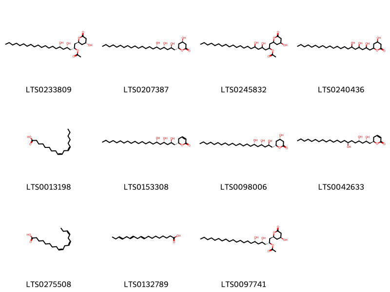
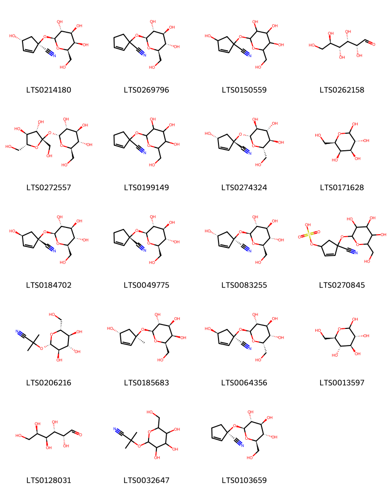

!!! abstract "Tóm tắt"
    Lạc tiên tên khoa học Passiflora foetida L., thuộc Họ Passifloraceae (Lạc tiên). Cây mọc hoang ở khắp nơi của nước ta, được dùng để an thần, giải nhiệt, mát gan. Chủ trị suy nhược thần kinh, tim hồi hộp, mát ngủ, ngủ mơ. Tác dụng dược lý trị ho, hen suyễn, gây nôn, hỗ trợ giảm các triệu chứng của rối loạn thần kinh (cuồng loạn)

## Thông tin về thực vật

### Đặc điểm thực vật

Dược liệu **Lạc Tiên** từ bộ phận **Phần trên mặt đất** từ loài *Passiflora foetida L.* thuộc họ Passifloraceae. Lạc tiên là một loại dây mọc leo, thân mềm, trên có rất nhiều lông mềm. Lá mềm, mọc so le, hình tim, dài 6-10cm, rộng 5-8cm, mép lượn sóng và xẻ hơi sâu thành 3 thuỳ, đáy lá hình tim, mép lá có lòng mịn, cuống lá dài 7-8cm. Đầu tua cuống thành lò xo. Hoa đơn độc, 5 cánh màu trắng hay hơi tím nhạt, đường kính 5,5cm lá đài màu trắng phía dưới có gan xanh, dưới lá đài có 3 gân chính với những gần phụ trông như lá mà không có phiến chỉ có gần lá không thôi. Một đĩa có 2 tầng tua, mặt tua trên có màu tím trong vàng, trong cùng có lông mịn. Trụ cao có đầu tim đỏ, 5 nhị có bao phấn màu vàng gục xuống dưới. Quả hình trứng dài 2-3cm. Mùa hoa 4. 5, mùa quả 5-7. 

!!! info "Phân loại thực vật của *Passiflora foetida*"
    - **Kingdom:** Plantae
    - **Phylum:** Tracheophyta
    - **Order:** Malpighiales
    - **Family:** Passifloraceae
    - **Genus:** Passiflora
    - **Species:** *Passiflora foetida*

*Tài liệu tham khảo:* "Những cây thuốc và vị thuốc Việt Nam" - Đỗ Tất Lợi

 

### Loài thay thế (Nếu có)

### Phân bố trên thế giới
**Từ vườn thực vật KEW: **: Bản địa: Argentina Northeast, Argentina Northwest, Aruba, Bahamas, Belize, Bolivia, Brazil North, Brazil Northeast, Brazil South, Brazil Southeast, Brazil West-Central, Chile North, Colombia, Costa Rica, Cuba, Dominican Republic, Ecuador, El Salvador, French Guiana, Guatemala, Guyana, Haiti, Honduras, Jamaica, Leeward Is., Mexico Central, Mexico Gulf, Mexico Northeast, Mexico Southeast, Mexico Southwest, Netherlands Antilles, Nicaragua, Panamá, Paraguay, Peru, Puerto Rico, Suriname, Texas, Trinidad-Tobago, Uruguay, Venezuela, Venezuelan Antilles, Windward Is.

Di thực: Andaman Is., Angola, Assam, Bangladesh, Benin, Borneo, Burkina, Burundi, Cambodia, Cameroon, Central African Republic, Chad, Chile South, China South-Central, China Southeast, Christmas I., Cocos (Keeling) Is., Comoros, Congo, East Himalaya, Gabon, Gambia, Ghana, Gilbert Is., Guinea, Guinea-Bissau, Gulf of Guinea Is., Hainan, Hawaii, India, Ivory Coast, Jawa, Kazan-retto, Kenya, KwaZulu-Natal, Laos, Lesser Sunda Is., Liberia, Line Is., Malaya, Maluku, Marianas, Marquesas, Maryland, Mauritania, Mauritius, Mexican Pacific Is., Mexico Northwest, Mozambique, Myanmar, New Caledonia, New Guinea, New South Wales, Nicobar Is., Nigeria, Northern Territory, Pakistan, Philippines, Queensland, Rodrigues, Réunion, Samoa, Senegal, Seychelles, Sierra Leone, Society Is., Solomon Is., Somalia, South China Sea, Sri Lanka, Sulawesi, Sumatera, Taiwan, Tanzania, Thailand, Togo, Tonga, Tuamotu, Tubuai Is., Vanuatu, Vietnam, Wallis-Futuna Is., West Himalaya, Western Australia, Zaïre

**Từ CSDL GIBF** Australia, Virgin Islands (British), Puerto Rico, Aruba, Malaysia, Thailand, Bolivia (Plurinational State of), Brazil, Honduras, Saint Kitts and Nevis, Guatemala, Hong Kong, Curaçao, India, Argentina, Mexico, Panama, Costa Rica, Nicaragua, Colombia, Peru, French Guiana, Sierra Leone, South Africa, Bonaire, Sint Eustatius and Saba, Martinique, Dominican Republic, Virgin Islands (U.S.), Jamaica, United States of America, Chinese Taipei, Benin, Sri Lanka

### Phân bố tại Việt Nam
** "Những cây thuốc và vị thuốc Việt Nam" - Đỗ Tất Lợi**: Mọc hoang ở khắp nơi tại nước ta.

**Từ CSDL GIBF**: Không có ghi nhận ở Việt Nam

---

## Thông tin về dược liệu 

### Định danh

!!! info "Thông tin về tên gọi của lạc tiên"
    - Dược liệu tiếng Việt: lạc tiên
    - Dược liệu tiếng Trung:  ()
    - Dược liệu tiếng Anh: 
    - Dược liệu latin thông dụng: Herba Passiflorae foetidae
    - Dược liệu latin kiểu DĐVN: herba passiflorae foetidae
    - Dược liệu latin kiểu DĐVN: 
    - Dược liệu latin kiểu thông tư: 
    - Bộ phận dùng: Phần trên mặt đất (Herba)

### Mô tả dược liệu 
- **Theo dược điển Việt nam V:** Đoạn thân rỗng, dài khoảng 5 cm, mang tua cuốn và lá, có thể có lẫn hoa và quả. Thân và lá có nhiều lông. Cuống lá dài 3 cm đến 4 cm. Phiến lá mỏng màu lục hay hơi vàng nâu, dài và rộng khoảng 7 cm đến 10 cm, chia thành 3 thùy rộng, đầu nhọn. Mép lá có răng cưa nông, gốc lá hình tim. Lá kèm hình vẩy phát triển thành sợi mang lông tiết đa bào, tua cuốn ở nách lá.

- **Mô tả dược liệu theo thông tư chế biến dược liệu theo phương pháp cổ truyền:** 

### Chế biến 

- **Chế biến theo dược điển việt nam V**: Thu hoạch vào mùa xuân, hạ. Cắt lấy dây, lá, hoa Lạc tiên, thái ngắn, phơi hoặc sấy khô.nn

- **Chế biến theo thông tư:** 

--- 

## Thành phần hóa học

- Theo tài liệu của GS. Đỗ Tất Lợi:  (1) Vitexin (C21H20O10)
Isovitexin (C21H20O10)
Harmane (C12H10N2)
Harmaline (C13H14N2O)
Α linolenic acid (C18H30O2)
Glucose
Galactose
...
(2) Dược điển Việt Nam: flavonoid
    
- Theo cơ sở dữ liệu lotus: Từ loài *Passiflora foetida* đã phân lập và xác định được 47 hoạt chất thuộc về các nhóm Fatty Acyls, Organooxygen compounds, Harmala alkaloids, Flavonoids. 

|    | chemicalTaxonomyClassyfireClass   |   smiles_count |
|---:|:----------------------------------|---------------:|
|  0 | Fatty Acyls                       |             11 |
|  1 | Flavonoids                        |             12 |
|  2 | Harmala alkaloids                 |              5 |
|  3 | Organooxygen compounds            |             19 |

### Nhóm Fatty Acyls
<figure markdown="span">
    { width=100% }
    <figcaption>Hình ảnh cấu trúc hóa học của 11 hoạt chất thuộc nhóm Fatty Acyls gồm ['(2r,4s,6s)-4,6-dihydroxy-1-[(2s,4r)-4-hydroxy-6-oxooxan-2-yl]henicosan-2-yl acetate (LTS0233809)', '(4r,6r)-4-hydroxy-6-[(2r,4s,6s)-2,4,6-trihydroxyhenicosyl]oxan-2-one (LTS0207387)', '4,6-dihydroxy-1-(4-hydroxy-6-oxooxan-2-yl)henicosan-2-yl acetate (LTS0245832)', '4-hydroxy-6-(2,4,6-trihydroxyhenicosyl)oxan-2-one (LTS0240436)', 'linoleic (LTS0013198)', '(6s)-6-[(2r,4s,6s)-2,4,6-trihydroxyhenicosyl]-5,6-dihydropyran-2-one (LTS0153308)', '(4s,6r)-4-hydroxy-6-[(2r,4s,6s)-2,4,6-trihydroxyhenicosyl]oxan-2-one (LTS0098006)', '(6r)-6-[(2s,4s,7s)-2,4,7-trihydroxyhenicosyl]-5,6-dihydropyran-2-one (LTS0042633)', 'α-linolenic acid (LTS0275508)', 'α linolenic acid (LTS0132789)', '(2r,4s,6s)-4,6-dihydroxy-1-[(2s,4s)-4-hydroxy-6-oxooxan-2-yl]henicosan-2-yl acetate (LTS0097741)'].</figcaption>
</figure>
### Nhóm Flavonoids
<figure markdown="span">
    { width=100% }
    <figcaption>Hình ảnh cấu trúc hóa học của 12 hoạt chất thuộc nhóm Flavonoids gồm ['luteolin 7-o-glucoside (LTS0227450)', 'luteolin (LTS0017052)', 'schaftoside (LTS0104338)', 'chrysoeriol (LTS0095766)', 'chamomile (LTS0104946)', 'isoschaftoside (LTS0157117)', 'apigenin 7-o-β-glucoside (LTS0252743)', 'isovitexin (LTS0209186)', 'kaempherol (LTS0155822)', 'vitexin (LTS0199581)', 'vicenin 2 (LTS0181160)', '5,7-dihydroxy-2-(4-hydroxyphenyl)-6-[(3r,4r,5s,6r)-3,4,5-trihydroxy-6-(hydroxymethyl)oxan-2-yl]-8-[(2s,3r,4s,5s)-3,4,5-trihydroxyoxan-2-yl]chromen-4-one (LTS0158548)'].</figcaption>
</figure>
### Nhóm Harmala alkaloids
<figure markdown="span">
    { width=100% }
    <figcaption>Hình ảnh cấu trúc hóa học của 5 hoạt chất thuộc nhóm Harmala alkaloids gồm ['harmine (LTS0131294)', 'harmol (LTS0023194)', 'harmaline (LTS0120934)', 'harmane (LTS0068205)', '1-methyl-3h,4h,9h-pyrido[3,4-b]indole (LTS0027115)'].</figcaption>
</figure>
### Nhóm Organooxygen compounds
<figure markdown="span">
    { width=100% }
    <figcaption>Hình ảnh cấu trúc hóa học của 19 hoạt chất thuộc nhóm Organooxygen compounds gồm ['(1r,4r)-4-hydroxy-1-{[(2s,3r,4s,5r,6r)-3,4,5-trihydroxy-6-(hydroxymethyl)oxan-2-yl]oxy}cyclopent-2-ene-1-carbonitrile (LTS0214180)', '1-{[(2s,3r,4s,5s,6r)-3,4,5-trihydroxy-6-(hydroxymethyl)oxan-2-yl]oxy}cyclopent-2-ene-1-carbonitrile (LTS0269796)', '4-hydroxy-1-{[3,4,5-trihydroxy-6-(hydroxymethyl)oxan-2-yl]oxy}cyclopent-2-ene-1-carbonitrile (LTS0150559)', '(+)-glucose (LTS0262158)', 'sucrose (LTS0272557)', '1-{[3,4,5-trihydroxy-6-(hydroxymethyl)oxan-2-yl]oxy}cyclopent-2-ene-1-carbonitrile (LTS0199149)', '(1s,4r)-4-hydroxy-1-{[(2r,3s,4r,5r,6s)-3,4,5-trihydroxy-6-(hydroxymethyl)oxan-2-yl]oxy}cyclopent-2-ene-1-carbonitrile (LTS0274324)', 'galactose (LTS0171628)', '(1s,4s)-4-hydroxy-1-{[(2s,3r,4s,5s,6r)-3,4,5-trihydroxy-6-(hydroxymethyl)oxan-2-yl]oxy}cyclopent-2-ene-1-carbonitrile (LTS0184702)', 'deidaclin (LTS0049775)', 'epitetraphyllin b (LTS0083255)', '(4-cyano-4-{[3,4,5-trihydroxy-6-(hydroxymethyl)oxan-2-yl]oxy}cyclopent-2-en-1-yl)oxidanesulfonic acid (LTS0270845)', 'linamarin (LTS0206216)', '(2s,3r,4s,5r,6r)-2-{[(1r,4r)-4-hydroxy-1-methylcyclopent-2-en-1-yl]oxy}-6-(hydroxymethyl)oxane-3,4,5-triol (LTS0185683)', '(1r,4s)-4-hydroxy-1-{[(2s,3r,4s,5s,6s)-3,4,5-trihydroxy-6-(hydroxymethyl)oxan-2-yl]oxy}cyclopent-2-ene-1-carbonitrile (LTS0064356)', 'glucose (LTS0013597)', 'aldehydo-d-galactose (LTS0128031)', 'linamarin (LTS0032647)', 'deidaclin (LTS0103659)'].</figcaption>
</figure>

---

## Tác dụng dược lý

Theo tài liệu "Những cây thuốc và vị thuốc Việt Nam" - Đỗ Tất Lợi:- Trị ho, hen suyễn
- Gây nôn
- Hỗ trợ giảm các triệu chứng của rối loạn thần kinh (cuồng loạn)

Theo tài liệu quốc tế: 

---

## Dược điển Việt Nam V

### Soi bột:
Có nhiều lông che chở đơn bào, lông tiết đa bào còn nguyên hay bị gãy. Mảnh biểu bì có lỗ khí kiểu hỗn bào. Mảnh mô mềm hay libe có chứa tinh thể calci oxalat hình cầu gai. Mảnh mạch xoắn, mạch vạch.nn
<!-- Hình ảnh soi bột sẽ được tự động chèn vào đây sau -->
### Vi phẫu:
Lá: Phiến lá gồm biểu bì trên, mô dậu, mô mềm và biểu bì dưới. Biểu bì trên và dưới có lông che chở và lông tiết. Lông che chở đơn bào, nhỏ. Lông tiết có chân đa bào gồm nhiều dãy tế bào xếp thành hàng dọc, thon dần về phía ngọn đầu đơn bào hình trứng, chứa chất tiết màu vàng. Gân chính gồm biểu bì trên và dưới, mô dày dưới biểu bì, mô mềm và ở giữa là bó libe-gỗ. Trong libe và rải rác trong mô mềm có tinh thể calci oxalat hình cầu gai có đường kính 7 µm đến 12 µm.
<!-- Hình ảnh vi phẫu sẽ được tự động chèn vào đây sau -->
### Định tính

A. Lấy 2 g bột dược liệu, thêm 10 ml ethanol 90% (TT). Đun sôi trong 5 min, lọc nóng dịch chiết qua 0,1 g than hoạt tính (TT) trên giấy lọc gấp nếp, thu được 5 ml dịch lọc. Lấy 2 ml dịch lọc cho vào ống nghiệm, thêm ít bột magnesi (TT) rồi thêm 0,2 ml acid hydrocloric (TT). Để yên vài phút, dung dịch sẽ có màu đỏ cam. B. Lấy 10 g bột dược liệu cho vào bình nón 250 ml, thấm ẩm bằng dung dịch amoni hydroxyd 10 % (TT) trong 15 min. Thêm 40 ml cloroform (TT), thỉnh thoảng lắc. Sau 30 min, lọc, cô dịch lọc đến còn 10 ml rồi chuyển vào bình gạn. Thêm vào bình gạn 5 ml dung dịch acid sulfuric 1% (TT). Lắc kỹ và gạn lớp acid, chia dịch chiết thu được vào 3 ống nghiệm: Ống nghiệm 1 : Thêm 1 giọt thuốc thử Mayer (TT), xuất hiện tủa trắng đục. Ống nghiệm 2: Thêm 1 giọt thuốc thử Bouchardat (TT), xuất hiện tủa đỏ nâu. Ống nghiệm 3: Thêm 1 giọt thuốc thử Dragendorff (TT), xuất hiện tủa vàng cam. C. Phương pháp sắc ký lớp mỏng (Phụ lục 5.4). Bản mỏng: Silica gel GF254 Dung môi khai triển: Ethyl acetat – acid formic – acid acetic băng – nước (100 : 11 : 11 : 35). Cho hỗn hợp dung môi vào bình gạn rồi lắc đều, thu lấy lớp trên. Dung dịch thử: Lấy 1 g bột dược liệu, thêm 10 ml methanol (TT). Chiết siêu âm trong 10 min, lọc. Bổ sung methanol (TT) hoặc cô đặc để thu được 5 ml dịch lọc. Dung dịch chất đối chiếu: Hòa tan vitexin chuẩn trong methanol (TT) để thu được dung dịch có nồng độ 0,1 mg/ml. Dung dịch dược liệu đối chiếu: Lấy 1 g bột Lạc tiên (mẫu chuẩn), tiến hành chiết như mô tả ở phần Dung dịch thử. Cách tiến hành: Châm riêng biệt lên cùng bản mỏng 6 µl dung dịch thử và 6 µl dung dịch dược liệu đối chiếu (hoặc 4µl dung dịch chất đối chiếu). Chấm dải dài 7 mm. Sau khi triển khai sắc ký, lấy bản mỏng và sấy khô ở 120 °C trong 2-3 min. Phun lên bản mỏng dung dịch 2-aminoethyl diphenyl borat 1 % trong methanol (TT), sau đó phun dung dịch polyethylen glycol 400 5 % trong methanol (TT). Để khô bản mỏng ngoài không khí khoảng 30 min. Quan sát dưới ánh sáng tử ngoại ở bước sóng 366 nm. Trên sắc ký đồ của dung dịch thử phải có các vết cùng màu sắc và giá trị Rf với các vết trên sắc ký đồ của dung dịch dược liệu đối chiếu hoặc có vết cùng màu sắc và giá trị Rf với các vết vitexin trên sắc ký đồ của dung dịch chất đối chiếu.

### Định lượng

Dung dịch thử: Cân chính xác khoảng 0,25 g bột dược liệu (qua rây số 250) cho vào bình nón 250 ml, thêm 40 ml ethanol 60 % (TT) và đun hồi lưu trong cách thủy 30 min. Đê nguội, lọc dịch chiết qua giấy lọc gấp nếp vào bình định mức dung tích 100 ml. Chuyển toàn bộ giấy lọc và bã dược liệu vào bình nón và tiếp tục chiết thêm 2 lần nữa, mỗi lần 30 ml ethanol 60 % (TT). Lọc, gộp các dịch lọc vào bình định mức trên, thêm ethanol 60 % (TT) tới vạch, lắc đều, thu được dung dịch A. Lấy chính xác 5 ml dung dịch A cho vào cốc có mỏ, cô trong cách thủy tới cắn khô. Dùng 10 ml hỗn hợp methanol – acid acetic băng (10:100) để hòa tan và chuyển toàn bộ cắn vào bình định mức 25 ml, thêm 10 ml hỗn hợp chứa acid boric (TT) 2,5 % và acid oxalic (TT) 2 % trong acid formic khan (TT). Bổ sung acid acetic khan (TT) tới vạch, lắc đều. Dung dịch mẫu trắng: Lấy chính xác 5 ml dung dịch A cho vào cốc có mỏ, cô cách thủy tới cắn khô. Dùng 10 ml hỗn hợp methanol – acid acetic băng (10 : 100) để hòa tan và chuyển toàn bộ cắn vào bình định mức 25 ml, thêm 10 ml acid formic khan (TT). Bổ sung acid acetic khan (TT) tới vạch, lắc đều. Sau 30 min, đo độ hấp thụ (Phụ lục 4.1) của các dung dịch trên ở bước sóng 401 nm trong cóng đo 1 cm. Tính hàm lượng phần trăm flavonoid toàn phần (tính theo vitexin) theo A (1 %, 1 cm). Lấy 628 là giá trị của A (1 %, 1 cm) của vitexin ở bước sóng 401 nm. Hàm lượng flavonoid toàn phần trong dược liệu tính theo vitexin (C21H20O10) không được ít hơn 0,6 % tính theo dược liệu khô kiệt.nKhông dưới 18,0 % tính theo dược liệu khô kiệt. Tiến hành theo phương pháp chiết lạnh (Phụ lục 12.10). Dùng nước làm dung môi.

### Thông tin khác 
- ** Độ ẩm: ** Không quá 13,0 % (Phụ lục 9.6, 1 g. 85 °C, 5 h).

- ** Bảo quản:** 
## Dược điển Hồng kong

<!-- PDF sẽ được tự động chèn vào đây sau -->

---

## Y dược học cổ truyền

- **Tên vị thuốc:** 
- **Tính vị quy kinh:** Cam, vi khổ, lương. Vào các kinh tâm, can.
- **Công năng chủ trị:** An thần, giải nhiệt, mát gan. Chủ trị: Suy nhược thần kinh, tim hồi hộp, mất ngủ, ngủ mơ.
- **Chú ý:** 
- **Kiêng kỵ:** 

