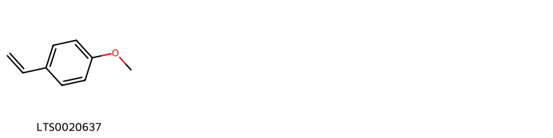
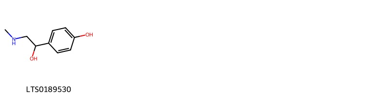

!!! abstract "Tóm tắt"
    Dược liệu ma hoàng (herba ephedrae) là sử dụng bộ phận trên mặt đất đã phơi hoặc sấy khô của cây Thảo ma hoàng (Ephedra sinica Staff.), Mộc tặc ma hoàng (Ephedra equisetina Bunge.), Trung gian ma hoàng (Ephedra intermedia Schrenk, et C. A. Meyer); họ Ma hoàng (Ephedraceae). Thảo ma hoàng là một cây mọc thẳng đứng cao chừng 30-70cm, thân có nhiều đốt, mỗi đốt dài chừng 3-6cm, trên có rãnh dọc. Lá mọc đối hay mọc vòng từng 3 lá một, thoái hoá thành vảy nhỏ, phía dưới lá màu hồng nau, phía trên màu tro trắng, đầu lá nhọn và cong, hoa đực hoa cái khác cành, cành hoa đực nhiều hoa hơn (4-5 đôi), quả thịt, màu đỏ giống như quả nho, hạt hơi thò ra. Mộc tặc ma hoàng cũng là một cây nhỏ mọc thẳng đứng, cao tới 2m, cành cứng hơn, màu xanh xám hay hơi có phần trắng, đốt ngắn hơn, thường chỉ dài 1-3cm, lá 2mm, màu tía. Hoa đực và hoa cái khác cành. hình cầu, hạt không thò ra như thảo ma hoàng. Loài trung ma hoàng cũng có đốt dài như thảo ma hoàng, nhưng đường kính cành trung ma hoàng thường hơn 2mm, còn đường kính thảo ma hoàng chỉ khoảng 1,5-2mm. Ma hoàng chưa thấy ở Việt Nam, số lượng ta dùng hiện nay chủ yếu nhập từ Trung Quốc. Thành phần hóa học trong ma hoàng có Ephedrin hay 1. ephedrin C10H15NO, d. pseudoephedrin C10H15NO, 1.N metyl ephedrin C11H17NO, 1.N.metyl ephedrin C11H17NO, 1. nor ephedrin C9H13NO, d. nor-ephedrin C9H13NO, trong đó ephedrin có tác dụng hơn cả. Công thức của ephedrin khá giống với adrenalin nên tác dụng của ephedrin giống với tác dụng của adrenalin, nhưng yếu hơn. Ephedrin có tác dụng giống thần kinh giao cảm, kích thích thần kinh trung ương, tác dụng miễn dịch nhanh. Theo y học cổ truyền ma hoàng có tính vị, quy kinh: tân, vi khổ, ôn, vào các kinh phế, bàng quang được sử dụng trong các bài thuốc chữa viêm khí quản, hen suyễn, cảm mạo: Ma hoàng thang (bài thuốc của Trương Trọng Cảnh), ma hoàng 8g, quế chi 6g, hạnh nhân 8g, cam thảo 4g, nước 600ml, sắc còn 200ml chia 3 lần uống trong ngày. Đơn thuốc khác chữa hen suyễn, viêm phế quản mãn tính, lao: Ma hoàng 5g, Tế tân 3g, Bán hạ 2g, Ngũ vị từ 1g, nước 600ml, sắc còn 200ml, chia 3 lần uống trong ngày.

## Thông tin về thực vật

### Đặc điểm thực vật

Dược liệu **Ma Hoàng (Bộ Phận Trên Mặt Đất)** từ bộ phận **nan** từ loài *Ephedra sinica Staff.* thuộc họ Ephedraceae. Thảo ma hoàng Ephedra sinica-là một cây mọc thẳng đứng cao chừng 30-70cm, thân có nhiều đốt, mỗi đốt dài chừng 3-6cm, trên có rãnh dọc. Lá mọc đối hay mọc vòng từng 3 lá một, thoái hoá thành vảy nhỏ, phía dưới lá màu hồng nau, phía trên màu tro trắng, đầu lá nhọn và cong, hoa đực hoa cái khác cành, cành hoa đực nhiều hoa hơn (4-5 đôi), quả thịt, màu đỏ giống như quả nho. Vì cây lại hay mọc ở bờ biển cho nên châu  Âu gọi ma hoàng là loại nho biển (Raisin de mer). Hạt hơi thò ra.
Mộc tặc ma hoàng-Ephedra equisetina-cũng là một cây nhỏ mọc thẳng đứng, cao tới 2m, cành cứng hơn, màu xanh xám hay hơi có phần trắng, đốt ngắn hơn, thường chỉ dài 1-3cm, lá 2mm, màu tía. Hoa đực và hoa cái khác cành. hình cầu, hạt không thò ra như thảo ma hoàng.
Như vậy chỉ căn cứ vào chiều dài của đốt ta cũng có thể phân biệt hai loài ma hoàng: Thảo ma hoàng có đốt dài hơn (3-6cm), hạt thò ra, còn mộc tặc ma hoàng đốt ngắn hơn (1-3cm), hạt không thò ra.
Tuy nhiên cũng cần nhớ rằng loài trong ma hoàng Ephedra intermedia cũng có đốt dài như thảo ma hoàng, nhưng đường kính cành trung ma hoàng thường hơn 2mm, còn đường kính thảo ma hoàng chỉ khoảng 1,5-2mm. 

!!! info "Phân loại thực vật của *Ephedra sinica*"
    - **Kingdom:** Plantae
    - **Phylum:** Tracheophyta
    - **Order:** Ephedrales
    - **Family:** Ephedraceae
    - **Genus:** Ephedra
    - **Species:** *Ephedra sinica*

*Tài liệu tham khảo:* "Những cây thuốc và vị thuốc Việt Nam" - Đỗ Tất Lợi

 

### Loài thay thế (Nếu có)

Dược liệu này cũng có thể từ loài *Ephedra equisetina Bunge.*, thông tin về phân loại thực vật loài này như sau:
!!! info "Thông tin về phân loại thực vật của *Ephedra equisetina*"
    - **kingdom:** Plantae
    - **phylum:** Tracheophyta
    - **order:** Ephedrales
    - **family:** Ephedraceae
    - **genus:** Ephedra
    - **species:** *Ephedra equisetina*

Hình ảnh của loài *Ephedra equisetina Bunge.*:

Dược liệu này cũng có thể từ loài *Ephedra intermedia Schrenk, et C.A.Meyer*, thông tin về phân loại thực vật loài này như sau:
!!! info "Thông tin về phân loại thực vật của *Ephedra intermedia*"
    - **kingdom:** Plantae
    - **phylum:** Tracheophyta
    - **order:** Ephedrales
    - **family:** Ephedraceae
    - **genus:** Ephedra
    - **species:** *Ephedra intermedia*

Hình ảnh của loài *Ephedra intermedia Schrenk, et C.A.Meyer*:

### Phân bố trên thế giới
**Từ vườn thực vật KEW: **: - Ephedra sinica Staff. native to: Buryatiya, China North-Central, Chita, Inner Mongolia, Manchuria, Mongolia, Primorye
- Ephedra equisetina Bunge. native to: Altay, China North-Central, Inner Mongolia, Kirgizstan, Krasnoyarsk, Mongolia, North Caucasus, Primorye, Qinghai, Tadzhikistan, Turkey, Turkmenistan, Tuva, Uzbekistan, West Siberia, Xinjiang
- Ephedra intermedia Schrenk, et C.A.Meyer native to: Afghanistan, Altay, Inner Mongolia, Iran, Kazakhstan, Kirgizstan, Mongolia, Pakistan, Tadzhikistan, Tibet, Transcaucasus, Turkmenistan, Uzbekistan, West Himalaya, West Siberia, Xinjiang

**Từ CSDL GIBF** nan, Mongolia, China, United States of America, Japan, Germany, Canada, Russian Federation

### Phân bố tại Việt Nam
** "Những cây thuốc và vị thuốc Việt Nam" - Đỗ Tất Lợi**: Ma hoàng chưa thấy ở Việt Nam, số lượng ta dùng hiện nay chủ yếu nhập từ Trung Quốc.

**Từ CSDL GIBF**: Không có ghi nhận ở Việt Nam

---

## Thông tin về dược liệu 

### Định danh

!!! info "Thông tin về tên gọi của nan"
    - Dược liệu tiếng Việt: nan
    - Dược liệu tiếng Trung: nan (nan)
    - Dược liệu tiếng Anh: nan
    - Dược liệu latin thông dụng: nan
    - Dược liệu latin kiểu DĐVN: herba ephedrae
    - Dược liệu latin kiểu DĐVN: nan
    - Dược liệu latin kiểu thông tư: nan
    - Bộ phận dùng: nan (nan)

### Mô tả dược liệu 
- **Theo dược điển Việt nam V:** nan

- **Mô tả dược liệu theo thông tư chế biến dược liệu theo phương pháp cổ truyền:** nan

### Chế biến 

- **Chế biến theo dược điển việt nam V**: nan

- **Chế biến theo thông tư:** nan

--- 

## Thành phần hóa học

- Theo tài liệu của GS. Đỗ Tất Lợi:  - nhóm hóa học: Ephedrin hay 1. ephedrin C10H15NO, d. pseudoephedrin C10H15NO, 1.N metyl ephedrin C11H17NO, 1.N.metyl ephedrin C11H17NO, 1. nor ephedrin C9H13NO, d. nor-ephedrin C9H13NO.
- biomarker: Ephedrin
    
- Theo cơ sở dữ liệu lotus: Từ loài *Ephedra sinica* đã phân lập và xác định được 34 hoạt chất thuộc về các nhóm Fatty Acyls, Prenol lipids, Benzene and substituted derivatives, Phenols, Phenol ethers, Diazines, Flavonoids. 

|    | chemicalTaxonomyClassyfireClass     |   smiles_count |
|---:|:------------------------------------|---------------:|
|  0 | Benzene and substituted derivatives |             11 |
|  1 | Diazines                            |              1 |
|  2 | Fatty Acyls                         |              4 |
|  3 | Flavonoids                          |              9 |
|  4 | Phenol ethers                       |              1 |
|  5 | Phenols                             |              1 |
|  6 | Prenol lipids                       |              7 |

### Nhóm Benzene and substituted derivatives
<figure markdown="span">
    { width=100% }
    <figcaption>Hình ảnh cấu trúc hóa học của 11 hoạt chất thuộc nhóm Benzene and substituted derivatives gồm ['pseudoephedrine (LTS0007631)', 'ephedrine (LTS0276367)', 'phenylpropanolamine (LTS0093784)', '(1r)-2-(dimethylamino)-1-phenylpropan-1-ol (LTS0214568)', 'pseudoephedrine,  (LTS0074566)', '(-)-norephedrine (LTS0188366)', 'cathine (LTS0119764)', '(1r,2r)-2-(dimethylamino)-1-phenylpropan-1-ol (LTS0262482)', 'methylephedrine (LTS0217476)', 'l-norpseudoephedrine (LTS0132961)', '2-amino-1-phenyl-propan-1-ol (LTS0258991)'].</figcaption>
</figure>
### Nhóm Diazines
<figure markdown="span">
    { width=100% }
    <figcaption>Hình ảnh cấu trúc hóa học của 1 hoạt chất thuộc nhóm Diazines gồm ['ligustrazine (LTS0230758)'].</figcaption>
</figure>
### Nhóm Fatty Acyls
<figure markdown="span">
    { width=100% }
    <figcaption>Hình ảnh cấu trúc hóa học của 4 hoạt chất thuộc nhóm Fatty Acyls gồm ['4-[3-(icosyloxy)-3-oxoprop-1-en-1-yl]benzoic acid (LTS0228695)', '4-[3-(docosyloxy)-3-oxoprop-1-en-1-yl]benzoic acid (LTS0129563)', '4-[(1e)-3-(icosyloxy)-3-oxoprop-1-en-1-yl]benzoic acid (LTS0160469)', '4-[(1e)-3-(docosyloxy)-3-oxoprop-1-en-1-yl]benzoic acid (LTS0110050)'].</figcaption>
</figure>
### Nhóm Flavonoids
<figure markdown="span">
    { width=100% }
    <figcaption>Hình ảnh cấu trúc hóa học của 9 hoạt chất thuộc nhóm Flavonoids gồm ['herbacetin (LTS0138520)', '3-methylherbacetin (LTS0077569)', 'chamomile (LTS0104946)', '7-hydroxy-2-(4-hydroxyphenyl)-5-{[(2r,3r,4r,5r,6s)-3,4,5-trihydroxy-6-methyloxan-2-yl]oxy}chromen-4-one (LTS0115274)', 'kaempherol (LTS0155822)', 'epigallocatechin (LTS0052496)', 'tricin (LTS0271018)', '7-hydroxy-2-(4-hydroxyphenyl)-5-[(3,4,5-trihydroxy-6-methyloxan-2-yl)oxy]chromen-4-one (LTS0226125)', 'ent-epicatechin (LTS0265245)'].</figcaption>
</figure>
### Nhóm Phenol ethers
<figure markdown="span">
    { width=100% }
    <figcaption>Hình ảnh cấu trúc hóa học của 1 hoạt chất thuộc nhóm Phenol ethers gồm ['4-vinylanisole (LTS0020637)'].</figcaption>
</figure>
### Nhóm Phenols
<figure markdown="span">
    { width=100% }
    <figcaption>Hình ảnh cấu trúc hóa học của 1 hoạt chất thuộc nhóm Phenols gồm ['synephrine (LTS0189530)'].</figcaption>
</figure>
### Nhóm Prenol lipids
<figure markdown="span">
    { width=100% }
    <figcaption>Hình ảnh cấu trúc hóa học của 7 hoạt chất thuộc nhóm Prenol lipids gồm ['terpineol (LTS0136148)', 'linalool, (+-)- (LTS0128839)', 'α-myrcene (LTS0115731)', 'terpineols (LTS0139391)', '4-terpineol (LTS0253733)', '(+)-α-terpineol (LTS0258249)', 'dihydrocarveol (LTS0111467)'].</figcaption>
</figure>

---

## Tác dụng dược lý

Theo tài liệu "Những cây thuốc và vị thuốc Việt Nam" - Đỗ Tất Lợi:- tác dụng của ephedrin gần giống tác dụng của adrenalin
+ Tác dụng giống thần kinh giao cảm
+ Kích thích thần kinh trung ương
+ Tác dụng miễn dịch nhanh (tachyphylaxie)
- Tác dụng gây ra mồ hôi
- Ngoài ra ma hoàng và ephedrin còn có tác dụng thông tiểu tiện, kích thích bài tiết nước giải, bài tiết dịch vị.
- Tác dụng của ephedin, lại ngược lại với tác dụng của ephedrin
- Tác dụng dược lý của rễ ma hoàng

Theo tài liệu quốc tế: nan

---

## Dược điển Việt Nam V

### Soi bột:
nan
<!-- Hình ảnh soi bột sẽ được tự động chèn vào đây sau -->
### Vi phẫu:
nan
<!-- Hình ảnh vi phẫu sẽ được tự động chèn vào đây sau -->
### Định tính

nan

### Định lượng

nan

### Thông tin khác 
- ** Độ ẩm: ** nan

- ** Bảo quản:** nan
## Dược điển Hồng kong

<!-- PDF sẽ được tự động chèn vào đây sau -->

---

## Y dược học cổ truyền

- **Tên vị thuốc:** nan
- **Tính vị quy kinh:** - Tân, vi khổ, ôn. Vào các kinh phế, bàng quang.
- **Công năng chủ trị:** Công năng: Phát hãn giải biểu hàn, chỉ ho. bình suyễn, lợi thủy.
Chủ  trị: Cảm mạo phong hàn, dương thủy; ngực tức, ho suyễn, hen phế quản, phù thũng.
Ma hoàng chích mật: Nhuận phế giảm ho; thường dùng trong trường hợp biểu chứng đã giải song vẫn còn ho suyễn.
Sinh ma hoàng: Phát hãn giải biểu.
- **Chú ý:** nan
- **Kiêng kỵ:** nan

