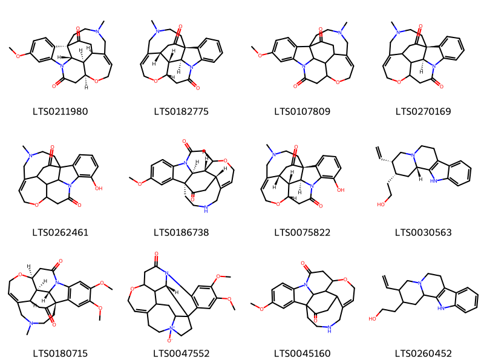
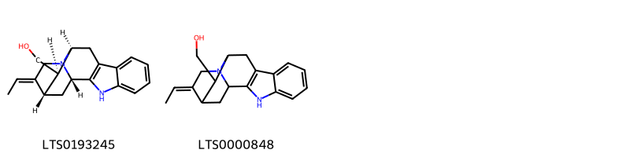
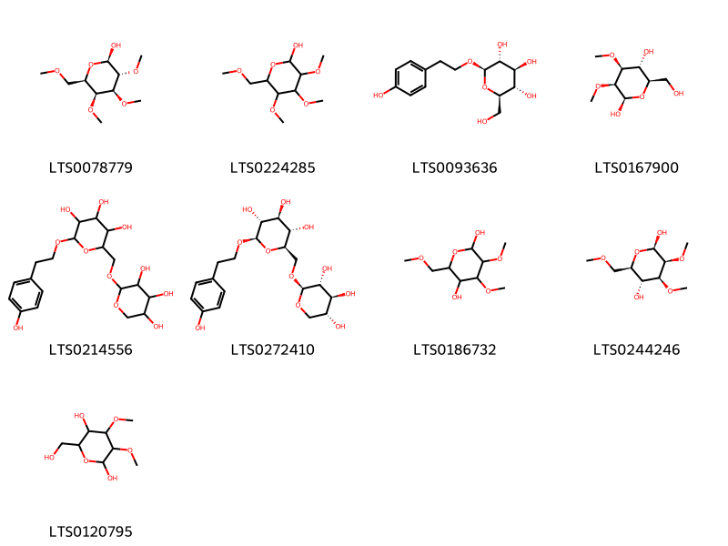
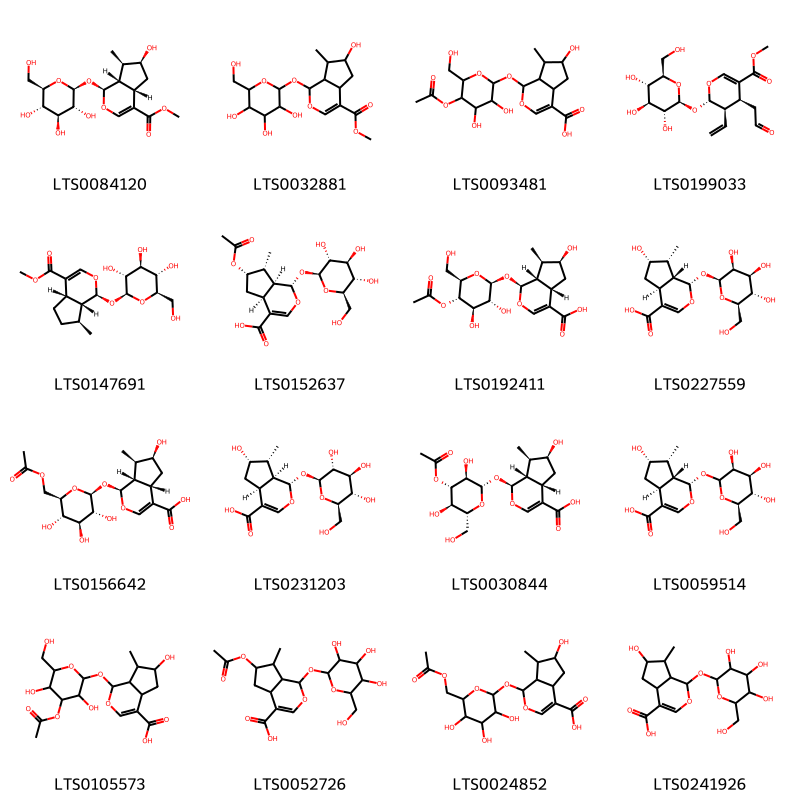
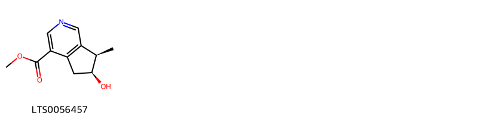
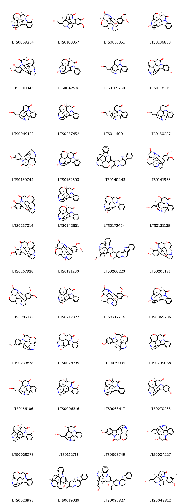

!!! abstract "Tóm tắt"
    Mã tiền (Hạt) thuộc họ Loganiaceae là một dược liệu quý với nhiều ứng dụng trong y học cổ truyền, nhưng đồng thời cũng chứa độc tính cao. Cây phân bố chủ yếu ở các vùng nhiệt đới và cận nhiệt đới, đặc biệt tại Ấn Độ, Sri Lanka, Thái Lan và các nước Đông Nam Á, trong đó có Việt Nam, nơi cây mọc nhiều tại các tỉnh miền Nam
Trong dân gian, hạt mã tiền (Semen Strychni) được chế biến và sử dụng để chữa tê thấp, đau nhức, sưng khớp.
Về thành phần hóa học, hạt mã tiền chứa rất nhiều alkaloid, trong đó chủ yếu là strycnin, bruxin, kết hợp với axit igasuric (axit clorogenic). Ngoài ra trong hạt mã tiền có 15% manan, 85% ga- lactan. 4-5% chất béo, một heterozit gọi là loganozit hay loganin (1,5%).
Các nghiên cứu ghi nhận tác dụng dược lý của mã tiền bao gồm: kích thích thần kinh, tăng huyết áp, tăng bài tiết dịch vị, tăng tốc độ chuyển của thức ăn sang ruột. Tuy nhiên, với độc tính cao, sử dụng mã tiền không đúng cách có thể gây co giật, tê liệt và thậm chí tử vong. Do đó, mã tiền chỉ được dùng khi đã qua chế biến kỹ lưỡng và cần được kiểm soát liều lượng dưới sự giám sát của thầy thuốc chuyên môn.
Mã tiền vừa là một dược liệu tiềm năng vừa là một loại thuốc độc, đòi hỏi sự hiểu biết sâu sắc trong quá trình sử dụng.

## Thông tin về thực vật

### Đặc điểm thực vật

Dược liệu **Mã Tiền (Hạt)** từ bộ phận **nan** từ loài *Strychnos nux-vomica L.* thuộc họ Loganiaceae. 1. Cây mã tiền-Strychnos nuxvomica L. là một cây nhỡ, mọc thẳng đứng có vỏ xám, cây non có gai. Lá mọc đối, có lá kèm, cuống ngắn, phiến lá hình bầu dục, hai đầu hơi nhọn, gân lá hình lông chim, nhưng mỗi bên gân chính có một đôi gân phụ chạy dọc theo lá và nổi ở mặt dưới. Hoa nhỏ, màu hồng, họp thành xim hình tán đều, lưỡng tính, tràng và đài có 5 cánh, đài hình phễu với 5 răng hình ba cạnh, tiền khai hoa hợp, trảng hình ống, hơi phình ở phía dưới, mặt trong có lông, trên đỉnh chia 5 thùy, so le với lá đài, trong nụ tiền khai hoa van. 5 nhị đính ở họng của ống tràng, chỉ nhị rất ngắn, mang bao phần có hai ngăn. Bầu có hai lá noãn, vòi đơn, quả mọng hình cầu, to bằng quả cam, có chứa cơm màu trắng, nhiều hạt hình khuy áo, phôi thẳng đứng, xung quanh có nội nhũ sừng. (Hình 410, Hm 41,4)

2. Các loại mã tiền hiện đang được khai thác ở miền Bắc nước ta hầu hết đều là dây leo, tên khoa học chưa được xác định chắc chắn, chỉ dựa vào hàm lượng ancaloit trong hạt mà khai thác và chỉ mới biết đây là một loài Strychnos sp. Vỏ một loài dây leo này được khai thác với tên hoàng nàn (xem vị này). Mã tiền dây leo có đường kính thân tới 10-15cm, chiều dài thân có thể tới 30-40m. 

!!! info "Phân loại thực vật của *Strychnos nux-vomica*"
    - **Kingdom:** Plantae
    - **Phylum:** Tracheophyta
    - **Order:** Gentianales
    - **Family:** Loganiaceae
    - **Genus:** Strychnos
    - **Species:** *Strychnos nux-vomica*

*Tài liệu tham khảo:* "Những cây thuốc và vị thuốc Việt Nam" - Đỗ Tất Lợi

 

### Loài thay thế (Nếu có)

### Phân bố trên thế giới
**Từ vườn thực vật KEW: **: - Native to:
Bangladesh, Cambodia, India, Laos, Malaya, Myanmar, Sri Lanka, Thailand, Vietnam
- Introduced into:
China South-Central, China Southeast, Cuba, Hainan, Philippines, Taiwan, Trinidad-Tobago

**Từ CSDL GIBF** nan, Belgium, Australia, Cambodia, unknown or invalid, Côte d’Ivoire, Thailand, Bolivia (Plurinational State of), Brazil, Honduras, Indonesia, India, Lao People’s Democratic Republic, China, Türkiye, Philippines, Cuba, Trinidad and Tobago, Viet Nam, Bangladesh, United States of America, Congo, Canada, Guyana, Sri Lanka

### Phân bố tại Việt Nam
** "Những cây thuốc và vị thuốc Việt Nam" - Đỗ Tất Lợi**: Cây mã tiền Strychnos nux-vomica cho tới  nay chỉ mới thấy ở miền Nam nước ta. Trước kháng chiến chống Pháp 1946, hầu hết mã tiền ở miền Bắc đều từ miền Nam đưa ra. Trong - kháng chiến, lần đầu tiên, chúng ta khai thác hạt những dây mã tiền ở miền Bắc để chiết lấy strycnin. Mã tiền dây leo mọc hoang ở hầu hết các tỉnh miền núi nước ta: Cao Bằng, Lạng Sơn, Hà Tây, Hoà Bình, Hà Giang, Tuyên Quang, Vĩnh Phúc, Phú Thọ, Bắc Giang, Bắc Ninh, Lào Cai, Yên Bái đều có. Tuy nhiên chưa ai đặt vấn đề nghiên cứu trồng cây mã tiền, cho nên chưa rõ điều kiện sống và chăm sóc như thế nào để cho nhiều hoạt chất nhất.

**Từ CSDL GIBF**: Ninh Thuan

---

## Thông tin về dược liệu 

### Định danh

!!! info "Thông tin về tên gọi của nan"
    - Dược liệu tiếng Việt: nan
    - Dược liệu tiếng Trung: nan (nan)
    - Dược liệu tiếng Anh: nan
    - Dược liệu latin thông dụng: nan
    - Dược liệu latin kiểu DĐVN: semen strychni
    - Dược liệu latin kiểu DĐVN: nan
    - Dược liệu latin kiểu thông tư: nan
    - Bộ phận dùng: nan (nan)

### Mô tả dược liệu 
- **Theo dược điển Việt nam V:** nan

- **Mô tả dược liệu theo thông tư chế biến dược liệu theo phương pháp cổ truyền:** nan

### Chế biến 

- **Chế biến theo dược điển việt nam V**: nan

- **Chế biến theo thông tư:** nan

--- 

## Thành phần hóa học

- Theo tài liệu của GS. Đỗ Tất Lợi:  - Thành phần hóa học: Trong hạt mã tiền có 15% manan, 85% ga- lactan. 4-5% chất béo, một heterozit gọi là loganozit hay loganin (1,5%), rất nhiều ancaloit trong đó chủ yếu là strycnin, bruxin, kết hợp với axit igasuric (axit clorogenic). Những ancaloit khác thường gặp là vomixin, struxin, colubrin a và β.
- Tên hoạt chất là biomaker trong dược điển Việt Nam: strychnin và brucin
    
- Theo cơ sở dữ liệu lotus: Từ loài *Strychnos nux-vomica* đã phân lập và xác định được 87 hoạt chất thuộc về các nhóm Pyridines and derivatives, Macroline alkaloids, Strychnos alkaloids, Organooxygen compounds, Prenol lipids, Indoles and derivatives. 

|    | chemicalTaxonomyClassyfireClass   |   smiles_count |
|---:|:----------------------------------|---------------:|
|  0 | Indoles and derivatives           |             12 |
|  1 | Macroline alkaloids               |              2 |
|  2 | Organooxygen compounds            |              9 |
|  3 | Prenol lipids                     |             16 |
|  4 | Pyridines and derivatives         |              1 |
|  5 | Strychnos alkaloids               |             44 |

### Nhóm Indoles and derivatives
<figure markdown="span">
    { width=100% }
    <figcaption>Hình ảnh cấu trúc hóa học của 12 hoạt chất thuộc nhóm Indoles and derivatives gồm ['(1s,10s,11r,12s,22r)-16-methoxy-4-methyl-9-oxa-4,13-diazahexacyclo[9.8.3.2¹⁰,¹³.0¹,¹².0⁶,²².0¹⁴,¹⁹]tetracosa-6,14,16,18-tetraene-20,23-dione (LTS0211980)', '(1s,10s,11r,12s,22r)-4-methyl-9-oxa-4,13-diazahexacyclo[9.8.3.2¹⁰,¹³.0¹,¹².0⁶,²².0¹⁴,¹⁹]tetracosa-6,14,16,18-tetraene-20,23-dione (LTS0182775)', '16-methoxy-4-methyl-9-oxa-4,13-diazahexacyclo[9.8.3.2¹⁰,¹³.0¹,¹².0⁶,²².0¹⁴,¹⁹]tetracosa-6,14,16,18-tetraene-20,23-dione (LTS0107809)', '(1s,12s)-4-methyl-9-oxa-4,13-diazahexacyclo[9.8.3.2¹⁰,¹³.0¹,¹².0⁶,²².0¹⁴,¹⁹]tetracosa-6,14,16,18-tetraene-20,23-dione (LTS0270169)', 'vomicine (LTS0262461)', '(1s,10s,11r,12s,22r)-17-methoxy-9-oxa-4,13-diazahexacyclo[9.8.3.2¹⁰,¹³.0¹,¹².0⁶,²².0¹⁴,¹⁹]tetracosa-6,14,16,18-tetraene-20,23-dione (LTS0186738)', '(1s,10s,11r,12s,22r)-15-hydroxy-4-methyl-9-oxa-4,13-diazahexacyclo[9.8.3.2¹⁰,¹³.0¹,¹².0⁶,²².0¹⁴,¹⁹]tetracosa-6,14,16,18-tetraene-20,23-dione (LTS0075822)', '2-[(2r,3s,12bs)-3-ethenyl-1h,2h,3h,4h,6h,7h,12h,12bh-indolo[2,3-a]quinolizin-2-yl]ethanol (LTS0030563)', '(1s,10s,11r,12s,22r)-16,17-dimethoxy-4-methyl-9-oxa-4,13-diazahexacyclo[9.8.3.2¹⁰,¹³.0¹,¹².0⁶,²².0¹⁴,¹⁹]tetracosa-6,14(19),15,17-tetraene-20,23-dione (LTS0180715)', '(23s)-4,5-dimethoxy-9-oxo-12-oxa-8,18-diazaheptacyclo[16.5.2.0¹,¹⁹.0²,⁷.0⁸,²³.0¹¹,²².0¹⁵,²¹]pentacosa-2(7),3,5,14-tetraen-18-ium-18-olate (LTS0047552)', '17-methoxy-9-oxa-4,13-diazahexacyclo[9.8.3.2¹⁰,¹³.0¹,¹².0⁶,²².0¹⁴,¹⁹]tetracosa-6,14,16,18-tetraene-20,23-dione (LTS0045160)', '2-{3-ethenyl-1h,2h,3h,4h,6h,7h,12h,12bh-indolo[2,3-a]quinolizin-2-yl}ethanol (LTS0260452)'].</figcaption>
</figure>
### Nhóm Macroline alkaloids
<figure markdown="span">
    { width=100% }
    <figcaption>Hình ảnh cấu trúc hóa học của 2 hoạt chất thuộc nhóm Macroline alkaloids gồm ['[(1s,12s,13r,14s,15e)-15-ethylidene-3,17-diazapentacyclo[12.3.1.0²,¹⁰.0⁴,⁹.0¹²,¹⁷]octadeca-2(10),4,6,8-tetraen-13-yl]methanol (LTS0193245)', '{15-ethylidene-3,17-diazapentacyclo[12.3.1.0²,¹⁰.0⁴,⁹.0¹²,¹⁷]octadeca-2(10),4,6,8-tetraen-13-yl}methanol (LTS0000848)'].</figcaption>
</figure>
### Nhóm Organooxygen compounds
<figure markdown="span">
    { width=100% }
    <figcaption>Hình ảnh cấu trúc hóa học của 9 hoạt chất thuộc nhóm Organooxygen compounds gồm ['(2r,3r,4s,5s,6r)-3,4,5-trimethoxy-6-(methoxymethyl)oxan-2-ol (LTS0078779)', '3,4,5-trimethoxy-6-(methoxymethyl)oxan-2-ol (LTS0224285)', 'salidroside (LTS0093636)', '(2r,3s,4s,5r,6r)-6-(hydroxymethyl)-3,4-dimethoxyoxane-2,5-diol (LTS0167900)', '2-[2-(4-hydroxyphenyl)ethoxy]-6-{[(3,4,5-trihydroxyoxan-2-yl)oxy]methyl}oxane-3,4,5-triol (LTS0214556)', '(2r,3r,4s,5s,6r)-2-[2-(4-hydroxyphenyl)ethoxy]-6-({[(2s,3r,4s,5r)-3,4,5-trihydroxyoxan-2-yl]oxy}methyl)oxane-3,4,5-triol (LTS0272410)', '3,4-dimethoxy-6-(methoxymethyl)oxane-2,5-diol (LTS0186732)', '(2r,3s,4s,5r,6r)-3,4-dimethoxy-6-(methoxymethyl)oxane-2,5-diol (LTS0244246)', '6-(hydroxymethyl)-3,4-dimethoxyoxane-2,5-diol (LTS0120795)'].</figcaption>
</figure>
### Nhóm Prenol lipids
<figure markdown="span">
    { width=100% }
    <figcaption>Hình ảnh cấu trúc hóa học của 16 hoạt chất thuộc nhóm Prenol lipids gồm ['loganin (LTS0084120)', 'methyl 6-hydroxy-7-methyl-1-{[3,4,5-trihydroxy-6-(hydroxymethyl)oxan-2-yl]oxy}-1h,4ah,5h,6h,7h,7ah-cyclopenta[c]pyran-4-carboxylate (LTS0032881)', '1-{[5-(acetyloxy)-3,4-dihydroxy-6-(hydroxymethyl)oxan-2-yl]oxy}-6-hydroxy-7-methyl-1h,4ah,5h,6h,7h,7ah-cyclopenta[c]pyran-4-carboxylic acid (LTS0093481)', '(-)-secologanin (LTS0199033)', 'deoxyloganin (LTS0147691)', '(1s,4as,6s,7r,7as)-6-(acetyloxy)-7-methyl-1-{[(2s,3r,4s,5s,6r)-3,4,5-trihydroxy-6-(hydroxymethyl)oxan-2-yl]oxy}-1h,4ah,5h,6h,7h,7ah-cyclopenta[c]pyran-4-carboxylic acid (LTS0152637)', '(1s,4as,6s,7r,7as)-1-{[(2s,3r,4r,5s,6r)-5-(acetyloxy)-3,4-dihydroxy-6-(hydroxymethyl)oxan-2-yl]oxy}-6-hydroxy-7-methyl-1h,4ah,5h,6h,7h,7ah-cyclopenta[c]pyran-4-carboxylic acid (LTS0192411)', '(1s,4as,6s,7r,7ar)-6-hydroxy-7-methyl-1-{[(2s,3s,4s,5s,6r)-3,4,5-trihydroxy-6-(hydroxymethyl)oxan-2-yl]oxy}-1h,4ah,5h,6h,7h,7ah-cyclopenta[c]pyran-4-carboxylic acid (LTS0227559)', '(1s,4as,6s,7r,7as)-1-{[(2s,3r,4s,5s,6r)-6-[(acetyloxy)methyl]-3,4,5-trihydroxyoxan-2-yl]oxy}-6-hydroxy-7-methyl-1h,4ah,5h,6h,7h,7ah-cyclopenta[c]pyran-4-carboxylic acid (LTS0156642)', 'loganic acid (LTS0231203)', '(1s,4as,6s,7r,7as)-1-{[(2s,3r,4s,5r,6r)-4-(acetyloxy)-3,5-dihydroxy-6-(hydroxymethyl)oxan-2-yl]oxy}-6-hydroxy-7-methyl-1h,4ah,5h,6h,7h,7ah-cyclopenta[c]pyran-4-carboxylic acid (LTS0030844)', '(1s,4as,6s,7r,7ar)-6-hydroxy-7-methyl-1-{[(3s,4s,5s,6r)-3,4,5-trihydroxy-6-(hydroxymethyl)oxan-2-yl]oxy}-1h,4ah,5h,6h,7h,7ah-cyclopenta[c]pyran-4-carboxylic acid (LTS0059514)', '1-{[4-(acetyloxy)-3,5-dihydroxy-6-(hydroxymethyl)oxan-2-yl]oxy}-6-hydroxy-7-methyl-1h,4ah,5h,6h,7h,7ah-cyclopenta[c]pyran-4-carboxylic acid (LTS0105573)', '6-(acetyloxy)-7-methyl-1-{[3,4,5-trihydroxy-6-(hydroxymethyl)oxan-2-yl]oxy}-1h,4ah,5h,6h,7h,7ah-cyclopenta[c]pyran-4-carboxylic acid (LTS0052726)', '1-({6-[(acetyloxy)methyl]-3,4,5-trihydroxyoxan-2-yl}oxy)-6-hydroxy-7-methyl-1h,4ah,5h,6h,7h,7ah-cyclopenta[c]pyran-4-carboxylic acid (LTS0024852)', '6-hydroxy-7-methyl-1-{[3,4,5-trihydroxy-6-(hydroxymethyl)oxan-2-yl]oxy}-1h,4ah,5h,6h,7h,7ah-cyclopenta[c]pyran-4-carboxylic acid (LTS0241926)'].</figcaption>
</figure>
### Nhóm Pyridines and derivatives
<figure markdown="span">
    { width=100% }
    <figcaption>Hình ảnh cấu trúc hóa học của 1 hoạt chất thuộc nhóm Pyridines and derivatives gồm ['cantleyine (LTS0056457)'].</figcaption>
</figure>
### Nhóm Strychnos alkaloids
<figure markdown="span">
    { width=100% }
    <figcaption>Hình ảnh cấu trúc hóa học của 44 hoạt chất thuộc nhóm Strychnos alkaloids gồm ['(1s,11s,18r,20r,21r,22s)-6,18-dihydroxy-12-oxa-8,17-diazaheptacyclo[15.5.2.0¹,¹⁸.0²,⁷.0⁸,²².0¹¹,²¹.0¹⁵,²⁰]tetracosa-2,4,6,14-tetraen-9-one (LTS0069254)', '(1r,13s,14e,19s,21s)-14-(2-hydroxyethylidene)-4,5-dimethoxy-8,16-diazahexacyclo[11.5.2.1¹,⁸.0²,⁷.0¹⁶,¹⁹.0¹²,²¹]henicosa-2(7),3,5,11-tetraen-9-one (LTS0168367)', '(1s,11s,18r,20r,21r,22s)-18-hydroxy-4,5-dimethoxy-12-oxa-8,17-diazaheptacyclo[15.5.2.0¹,¹⁸.0²,⁷.0⁸,²².0¹¹,²¹.0¹⁵,²⁰]tetracosa-2(7),3,5,14-tetraen-9-one (LTS0081351)', 'strychnine n-oxide (LTS0186850)', '(1r,11s,18s,20r,21r,22s)-6-hydroxy-5-methoxy-12-oxa-8,17-diazaheptacyclo[15.5.2.0¹,¹⁸.0²,⁷.0⁸,²².0¹¹,²¹.0¹⁵,²⁰]tetracosa-2,4,6,14-tetraen-9-one (LTS0110343)', '(1s,11s,17r,18r,20r,21r,22s)-9-oxo-12-oxa-8,17-diazaheptacyclo[15.5.2.0¹,¹⁸.0²,⁷.0⁸,²².0¹¹,²¹.0¹⁵,²⁰]tetracosa-2,4,6,14-tetraen-17-ium-17-olate (LTS0042538)', '14-(2-hydroxyethyl)-8,16-diazahexacyclo[11.5.2.1¹,⁸.0²,⁷.0¹⁶,¹⁹.0¹²,²¹]henicosa-2,4,6,11-tetraen-9-one (LTS0109780)', '4-hydroxy-12-oxa-8,17-diazaheptacyclo[15.5.2.0¹,¹⁸.0²,⁷.0⁸,²².0¹¹,²¹.0¹⁵,²⁰]tetracosa-2,4,6,14-tetraen-9-one (LTS0118315)', '(1r,13s,14e,19s,21s)-14-(2-hydroxyethylidene)-8,16-diazahexacyclo[11.5.2.1¹,⁸.0²,⁷.0¹⁶,¹⁹.0¹²,²¹]henicosa-2,4,6,11-tetraen-9-one (LTS0049122)', 'strychnine (LTS0267452)', '(1r,13s,14s,19s,21s)-14-(2-hydroxyethyl)-8,16-diazahexacyclo[11.5.2.1¹,⁸.0²,⁷.0¹⁶,¹⁹.0¹²,²¹]henicosa-2,4,6,11-tetraen-9-one (LTS0114001)', '14-(2-hydroxyethylidene)-8,16-diazahexacyclo[11.5.2.1¹,⁸.0²,⁷.0¹⁶,¹⁹.0¹²,²¹]henicosa-2,4,6,11-tetraen-9-one (LTS0150287)', 'α-colubrine (LTS0130744)', '9-oxo-12-oxa-8,17-diazaheptacyclo[15.5.2.0¹,¹⁸.0²,⁷.0⁸,²².0¹¹,²¹.0¹⁵,²⁰]tetracosa-2,4,6,14-tetraen-17-ium-17-olate (LTS0152603)', '10-[(3z)-3-ethylidene-1h,2h,4h,6h,7h,12h,12bh-indolo[2,3-a]quinolizin-2-yl]-12-oxa-8,17-diazaheptacyclo[15.5.2.0¹,¹⁸.0²,⁷.0⁸,²².0¹¹,²¹.0¹⁵,²⁰]tetracosa-2,4,6,9,14-pentaene (LTS0140443)', 'brucine (LTS0141958)', '6,18-dihydroxy-5-methoxy-12-oxa-8,17-diazaheptacyclo[15.5.2.0¹,¹⁸.0²,⁷.0⁸,²².0¹¹,²¹.0¹⁵,²⁰]tetracosa-2,4,6,14-tetraen-9-one (LTS0237014)', 'bis(strychnine) (LTS0142851)', '18-hydroxy-12-oxa-8,17-diazaheptacyclo[15.5.2.0¹,¹⁸.0²,⁷.0⁸,²².0¹¹,²¹.0¹⁵,²⁰]tetracosa-2,4,6,14-tetraen-9-one (LTS0172454)', '(1s,11r,12s,13r,14z,19s,21r)-11-hydroxy-14-(2-hydroxyethylidene)-8,16-diazahexacyclo[11.5.2.1¹,⁸.0²,⁷.0¹⁶,¹⁹.0¹²,²¹]henicosa-2,4,6-trien-9-one (LTS0131138)', '6-hydroxy-5-methoxy-12-oxa-8,17-diazaheptacyclo[15.5.2.0¹,¹⁸.0²,⁷.0⁸,²².0¹¹,²¹.0¹⁵,²⁰]tetracosa-2,4,6,14-tetraen-9-one (LTS0267928)', '(1s,11s,18s,20r,21r,22s)-4,5-dimethoxy-9-oxo-12-oxa-8,17-diazaheptacyclo[15.5.2.0¹,¹⁸.0²,⁷.0⁸,²².0¹¹,²¹.0¹⁵,²⁰]tetracosa-2(7),3,5,14-tetraen-17-ium-17-olate (LTS0191230)', '(1r,11s,12r,13r,14z,19s,21s)-10-{3-ethyl-6h,7h-indolo[2,3-a]quinolizin-2-yl}-14-(2-hydroxyethylidene)-8,16-diazahexacyclo[11.5.2.1¹,⁸.0²,⁷.0¹⁶,¹⁹.0¹²,²¹]henicosa-2,4,6,9-tetraen-11-ol (LTS0260223)', '(1s,11s,18r,20r,21r,22s)-6,18-dihydroxy-5-methoxy-12-oxa-8,17-diazaheptacyclo[15.5.2.0¹,¹⁸.0²,⁷.0⁸,²².0¹¹,²¹.0¹⁵,²⁰]tetracosa-2,4,6,14-tetraen-9-one (LTS0205191)', 'brucine (LTS0202123)', '(1s,18r,20r,21r,22s)-18-hydroxy-12-oxa-8,17-diazaheptacyclo[15.5.2.0¹,¹⁸.0²,⁷.0⁸,²².0¹¹,²¹.0¹⁵,²⁰]tetracosa-2,4,6,14-tetraen-9-one (LTS0212827)', '18-hydroxy-4,5-dimethoxy-12-oxa-8,17-diazaheptacyclo[15.5.2.0¹,¹⁸.0²,⁷.0⁸,²².0¹¹,²¹.0¹⁵,²⁰]tetracosa-2(7),3,5,14-tetraen-9-one (LTS0212754)', '(1s,11s,18r,20r,21r,22s)-9-oxo-12-oxa-8,17-diazaheptacyclo[15.5.2.0¹,¹⁸.0²,⁷.0⁸,²².0¹¹,²¹.0¹⁵,²⁰]tetracosa-2,4,6,14-tetraen-17-ium-17-olate (LTS0069206)', '2-methoxystrychnine (LTS0233878)', '6,18-dihydroxy-12-oxa-8,17-diazaheptacyclo[15.5.2.0¹,¹⁸.0²,⁷.0⁸,²².0¹¹,²¹.0¹⁵,²⁰]tetracosa-2,4,6,14-tetraen-9-one (LTS0028739)', 'β-colubrine (LTS0039005)', 'strychnos (LTS0209068)', '(21s)-11-hydroxy-14-(2-hydroxyethyl)-8,16-diazahexacyclo[11.5.2.1¹,⁸.0²,⁷.0¹⁶,¹⁹.0¹²,²¹]henicosa-2,4,6-trien-9-one (LTS0166106)', '(1r,11s,18s,20r,21r,22s)-6-hydroxy-12-oxa-8,17-diazaheptacyclo[15.5.2.0¹,¹⁸.0²,⁷.0⁸,²².0¹¹,²¹.0¹⁵,²⁰]tetracosa-2,4,6,14-tetraen-9-one (LTS0006316)', '(1s,11s,18r,20r,21r,22s)-18-hydroxy-12-oxa-8,17-diazaheptacyclo[15.5.2.0¹,¹⁸.0²,⁷.0⁸,²².0¹¹,²¹.0¹⁵,²⁰]tetracosa-2,4,6,14-tetraen-9-one (LTS0063417)', '(1r,11s,18s,20r,21r,22s)-4-hydroxy-12-oxa-8,17-diazaheptacyclo[15.5.2.0¹,¹⁸.0²,⁷.0⁸,²².0¹¹,²¹.0¹⁵,²⁰]tetracosa-2,4,6,14-tetraen-9-one (LTS0270265)', '(11s,18s,20r,21r,22s)-6-hydroxy-12-oxa-8,17-diazaheptacyclo[15.5.2.0¹,¹⁸.0²,⁷.0⁸,²².0¹¹,²¹.0¹⁵,²⁰]tetracosa-2,4,6,14-tetraen-9-one (LTS0029278)', '11-hydroxy-14-(2-hydroxyethylidene)-8,16-diazahexacyclo[11.5.2.1¹,⁸.0²,⁷.0¹⁶,¹⁹.0¹²,²¹]henicosa-2,4,6-trien-9-one (LTS0112716)', '5-methoxy-12-oxa-8,17-diazaheptacyclo[15.5.2.0¹,¹⁸.0²,⁷.0⁸,²².0¹¹,²¹.0¹⁵,²⁰]tetracosa-2,4,6,14-tetraen-9-one (LTS0095749)', '(1r,11r,12r,13r,14e,19s,21s)-11-hydroxy-14-(2-hydroxyethylidene)-8,16-diazahexacyclo[11.5.2.1¹,⁸.0²,⁷.0¹⁶,¹⁹.0¹²,²¹]henicosa-2,4,6-trien-9-one (LTS0034227)', '6-hydroxy-12-oxa-8,17-diazaheptacyclo[15.5.2.0¹,¹⁸.0²,⁷.0⁸,²².0¹¹,²¹.0¹⁵,²⁰]tetracosa-2,4,6,14-tetraen-9-one (LTS0023992)', '(1r,11r,18s,20r,21r,22s)-10-[(2s,3z,12bs)-3-ethylidene-1h,2h,4h,6h,7h,12h,12bh-indolo[2,3-a]quinolizin-2-yl]-12-oxa-8,17-diazaheptacyclo[15.5.2.0¹,¹⁸.0²,⁷.0⁸,²².0¹¹,²¹.0¹⁵,²⁰]tetracosa-2,4,6,9,14-pentaene (LTS0019029)', '3-ethyl-2-[(1r,11s,12r,13r,14e,19s,21s)-11-hydroxy-14-(2-hydroxyethylidene)-8,16-diazahexacyclo[11.5.2.1¹,⁸.0²,⁷.0¹⁶,¹⁹.0¹²,²¹]henicosa-2,4,6,9-tetraen-10-yl]-6h,7h,12h,12bh-indolo[2,3-a]quinolizin-12b-yl (LTS0092327)', '(1r,13s,14z,19s,21s)-14-(2-hydroxyethylidene)-4,5-dimethoxy-8,16-diazahexacyclo[11.5.2.1¹,⁸.0²,⁷.0¹⁶,¹⁹.0¹²,²¹]henicosa-2(7),3,5,11-tetraen-9-one (LTS0048812)'].</figcaption>
</figure>

---

## Tác dụng dược lý

Theo tài liệu "Những cây thuốc và vị thuốc Việt Nam" - Đỗ Tất Lợi:Người ta cho tác dụng của mã tiền là do tác dụng của strycnin.

- Đối với thần kinh trung ương và ngoại vi: có tác dụng kích thích với liều nhỏ, và tác dụng co giật với liều cao.

- Đối với tim và tuần hoàn: có tác dụng do các mạch máu ngoại vi bị co nhỏ.

- Đối với dạ dày và bộ máy tiêu hóa: tăng bài tiết dịch vị, tăng tốc độ chuyển của thức ăn sang ruột. Tuy nhiên nếu dùng luôn thì sẽ gây biến loạn tiêu hoá, biến loạn co bóp dạ dày.

Độc tính. Mã tiền rất độc. Khi bị ngộ độc, ngáp, nước dãi chảy nhiều, nôn mửa, sợ ánh sáng, mạch nhanh và yếu: Tứ chỉ cứng đờ, co giật nhẹ rồi đột nhiên cso triệu chứng như uốn ván nặng, với hiện tượng rút gân hàm, lồi mắt, đồng tử mở rộng, bắp thịt tứ chi và thận bị co. Sự co bắp thịt ngực gây khó thở và ngạt. Sau 5 phút đến 5 giờ chết vì ngạt

Theo tài liệu quốc tế: nan

---

## Dược điển Việt Nam V

### Soi bột:
nan
<!-- Hình ảnh soi bột sẽ được tự động chèn vào đây sau -->
### Vi phẫu:
nan
<!-- Hình ảnh vi phẫu sẽ được tự động chèn vào đây sau -->
### Định tính

nan

### Định lượng

nan

### Thông tin khác 
- ** Độ ẩm: ** nan

- ** Bảo quản:** nan
## Dược điển Hồng kong

<!-- PDF sẽ được tự động chèn vào đây sau -->

---

## Y dược học cổ truyền

- **Tên vị thuốc:** nan
- **Tính vị quy kinh:** Khổ, hàn, có đại độc. Vào các kinh can, tỳ
- **Công năng chủ trị:** Thông kinh hoạt lạc giảm đau, mạnh gân cốt, tán kết tiêu sưng.

Chủ trị: Phong thấp, tê, bại liệt; đau khớp dạng phong thấp, nhức mỏi chân tay, đau dây thần kinh, sưng  đau do sang chấn, nhọt độc sưng đau.
- **Chú ý:** nan
- **Kiêng kỵ:** nan

