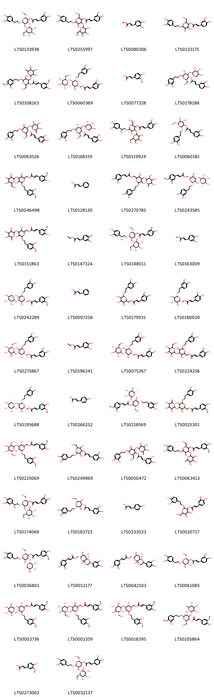
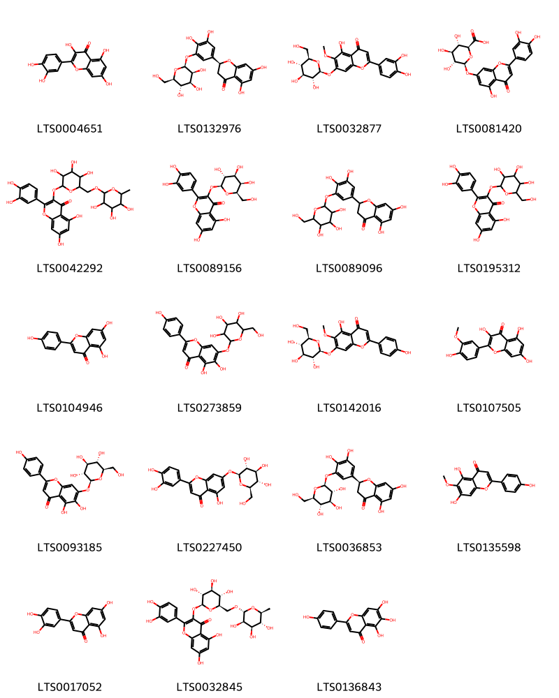
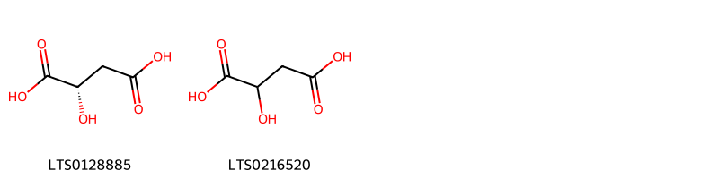
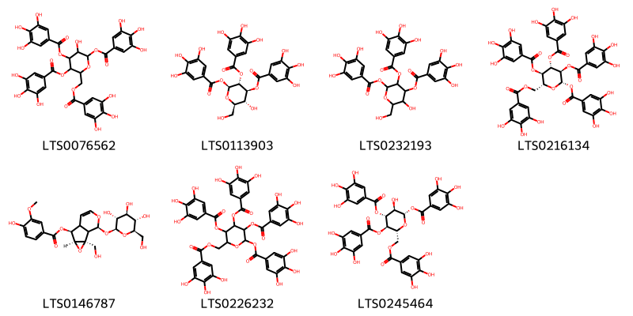

!!! abstract "Tóm tắt"
    Lá mã đề (Folium Plantaginis), thuộc họ Plantaginaceae, là một dược liệu phổ biến trong y học cổ truyền và dân gian, được sử dụng rộng rãi ở Việt Nam. Cây mọc hoang và cũng được trồng nhiều ở các khu vực ở nước ta. Theo kinh nghiệm dân gian, lá mã đề có tác dụng thanh nhiệt, trừ đờm, lợi tiểu và làm sáng mắt; ngoài ra, canh lá mã đề còn có tác dụng chữa tiểu ra máu và làm dịu niệu đạo đau buốt. Dược liệu này có thành phần hóa học chính aucubin và plantaginin và cũng được biết đến với tác dụng kháng khuẩn, giúp điều trị ho, cao huyết áp và lỵ cấp hoặc mạn tính. Nhờ vào những tác dụng dược lý này, lá mã đề trở thành một vị thuốc quan trọng trong đời sống ngày nay

## Thông tin về thực vật

### Đặc điểm thực vật

Dược liệu **Mã Đề (Lá)** từ bộ phận **Trên mặt đất** từ loài *Plantago major L.* thuộc họ Plantaginaceae. Là loại cây cỏ sống lâu năm, thân ngắn, lá mọc thành cụm ở gốc, cuống dài, phiến lá hình thìa hay hình trứng, có gân dọc theo sống lá và đồng quy ở ngọn và gốc lá. Hoa mọc thành bông, có cán dài, xuất phát từ kẽ lá. Hoa đều, lưỡng tính, đài 4, xếp chéo, hơi đính nhau ở gốc, tràng màu nâu tồn tại, gồm 4 thuỳ nằm xen kẽ ở giữa các lá đài. Nhị 4 chỉ nhị mảnh, dài, 2 lá noãn, chứa nhiều tiểu noãn.Quả hộp trong chứa nhiều hạt màu nâu đen bóng. 

!!! info "Phân loại thực vật của *Plantago major*"
    - **Kingdom:** Plantae
    - **Phylum:** Tracheophyta
    - **Order:** Lamiales
    - **Family:** Plantaginaceae
    - **Genus:** Plantago
    - **Species:** *Plantago major*

*Tài liệu tham khảo:* "Những cây thuốc và vị thuốc Việt Nam" - Đỗ Tất Lợi

 

### Loài thay thế (Nếu có)

### Phân bố trên thế giới
**Từ vườn thực vật KEW: **: Afghanistan, Albania, Algeria, Altay, Amur, Austria, Baleares, Baltic States, Belarus, Belgium, Bulgaria, Buryatiya, Canary Is., Cape Provinces, Cape Verde, Central European Russia, China North-Central, China South-Central, China Southeast, Chita, Corse, Cyprus, Czechoslovakia, Denmark, East Aegean Is., East European Russia, Egypt, Finland, France, Free State, Føroyar, Germany, Great Britain, Greece, Hainan, Hungary, Inner Mongolia, Iran, Iraq, Ireland, Irkutsk, Italy, Japan, Kamchatka, Kazakhstan, Khabarovsk, Kirgizstan, Korea, Krasnoyarsk, Kriti, Krym, Kuril Is., KwaZulu-Natal, Lebanon-Syria, Lesotho, Madeira, Magadan, Manchuria, Mongolia, Morocco, Namibia, Nepal, Netherlands, North Caucasus, North European Russia, Northern Provinces, Northwest European Russia, Norway, Oman, Pakistan, Palestine, Poland, Portugal, Primorye, Qinghai, Romania, Sakhalin, Sardegna, Saudi Arabia, Sicilia, Sinai, South European Russia, Spain, Sweden, Switzerland, Tadzhikistan, Taiwan, Tibet, Transcaucasus, Tunisia, Turkey, Turkey-in-Europe, Turkmenistan, Tuva, Ukraine, Uzbekistan, West Himalaya, West Siberia, Xinjiang, Yakutskiya, Yemen, Yugoslavia

**Từ CSDL GIBF** Australia, Spain, Austria, Norway, Puerto Rico, Chile, Germany, Haiti, Thailand, Netherlands, Denmark, Brazil, Honduras, New Zealand, Hong Kong, Ukraine, Argentina, Sweden, Mexico, Greece, Colombia, Ecuador, United Kingdom of Great Britain and Northern Ireland, China, South Africa, Russian Federation, Switzerland, United States of America, Portugal, Chinese Taipei, Canada

### Phân bố tại Việt Nam
** "Những cây thuốc và vị thuốc Việt Nam" - Đỗ Tất Lợi**: Mã đề được mọc hoang và được trồng nhiều tại nhiều nơi ở khắp nước ta.

**Từ CSDL GIBF**: Không có ghi nhận ở Việt Nam

---

## Thông tin về dược liệu 

### Định danh

!!! info "Thông tin về tên gọi của mã đề"
    - Dược liệu tiếng Việt: mã đề
    - Dược liệu tiếng Trung: None (None)
    - Dược liệu tiếng Anh: None
    - Dược liệu latin thông dụng: Folium PlantaginisnPlantaginis Herba
    - Dược liệu latin kiểu DĐVN: folium plantaginis
    - Dược liệu latin kiểu DĐVN: Plantaginis Herba
    - Dược liệu latin kiểu thông tư: None
    - Bộ phận dùng: Trên mặt đất (Folium)

### Mô tả dược liệu 
- **Theo dược điển Việt nam V:** 
Lá nhăn nheo, nhàu nát, giống như cái thìa, đỉnh tù, đáy  thuôn hẹp, dài 7 cm đến 10 cm, rộng 5 cm đến 7 cm. Mặt  trên lá màu lục sẫm, mặt dưới màu lục nhạt. Phiến lá dày,  nhẵn. Mép nguyên có 3 đến 5 gân hình cung, lồi nhiều về  phía mặt dưới lá. Cuống dài 5 cm đến 10 cm, rộng ra về  phía gốc.

- **Mô tả dược liệu theo thông tư chế biến dược liệu theo phương pháp cổ truyền:** 

### Chế biến 

- **Chế biến theo dược điển việt nam V**: 
Hái lá lúc cây sắp ra hoa hay đang ra hoa, rửa sạch, phơi  hay sấy khô ở 40 °C đến 50 °C.

- **Chế biến theo thông tư:** 

--- 

## Thành phần hóa học

- Theo tài liệu của GS. Đỗ Tất Lợi:  Toàn cây chứa 1 glucozit là aucubin, plantaginin
Ngoài ra, trong lá còn có thêm: chất nhầy, chất đắng, carotin, vitamin C, vitamin K, vitamin T, axit citric
    
- Theo cơ sở dữ liệu lotus: Từ loài *Plantago major* đã phân lập và xác định được 159 hoạt chất thuộc về các nhóm Hydroxy acids and derivatives, Tannins, Organooxygen compounds, Benzofurans, Prenol lipids, Steroids and steroid derivatives, Carboxylic acids and derivatives, Benzene and substituted derivatives, Saturated hydrocarbons, Fatty Acyls, Phenols, Cinnamic acids and derivatives, Flavonoids. 

|    | chemicalTaxonomyClassyfireClass     |   smiles_count |
|---:|:------------------------------------|---------------:|
|  0 | Benzene and substituted derivatives |              7 |
|  1 | Benzofurans                         |              2 |
|  2 | Carboxylic acids and derivatives    |              5 |
|  3 | Cinnamic acids and derivatives      |             52 |
|  4 | Fatty Acyls                         |              2 |
|  5 | Flavonoids                          |             19 |
|  6 | Hydroxy acids and derivatives       |              2 |
|  7 | Organooxygen compounds              |             20 |
|  8 | Phenols                             |              1 |
|  9 | Prenol lipids                       |             25 |
| 10 | Saturated hydrocarbons              |             10 |
| 11 | Steroids and steroid derivatives    |              5 |
| 12 | Tannins                             |              7 |

### Nhóm Benzene and substituted derivatives
<figure markdown="span">
    { width=100% }
    <figcaption>Hình ảnh cấu trúc hóa học của 7 hoạt chất thuộc nhóm Benzene and substituted derivatives gồm ['syringic acid (LTS0210036)', '2,5-dihydroxybenzoic acid (LTS0170793)', 'benzoic acid (LTS0145871)', 'galop (LTS0222857)', 'p-hydroxybenzoic acid (LTS0263634)', 'vanillic acid (LTS0229113)', 'salicyclic acid (LTS0116548)'].</figcaption>
</figure>
### Nhóm Benzofurans
<figure markdown="span">
    { width=100% }
    <figcaption>Hình ảnh cấu trúc hóa học của 2 hoạt chất thuộc nhóm Benzofurans gồm ['loliolide (LTS0254454)', 'loliolide (LTS0119422)'].</figcaption>
</figure>
### Nhóm Carboxylic acids and derivatives
<figure markdown="span">
    { width=100% }
    <figcaption>Hình ảnh cấu trúc hóa học của 5 hoạt chất thuộc nhóm Carboxylic acids and derivatives gồm ['citric acid (LTS0213921)', 'fumaric acid (LTS0114831)', 'malonic acid (LTS0195913)', 'succinic acid (LTS0237204)', 'butenedioic acid (LTS0069098)'].</figcaption>
</figure>
### Nhóm Cinnamic acids and derivatives
<figure markdown="span">
    { width=100% }
    <figcaption>Hình ảnh cấu trúc hóa học của 52 hoạt chất thuộc nhóm Cinnamic acids and derivatives gồm ['(2r,3r,4r,5r,6r)-6-[2-(3,4-dihydroxyphenyl)ethoxy]-5-hydroxy-2-(hydroxymethyl)-4-{[(2r,3r,4s,5s,6r)-3,4,5-trihydroxy-6-(hydroxymethyl)oxan-2-yl]oxy}oxan-3-yl (2e)-3-(3,4-dihydroxyphenyl)prop-2-enoate (LTS0133938)', '6-[2-(3,4-dihydroxyphenyl)ethoxy]-5-hydroxy-2-(hydroxymethyl)-4-{[3,4,5-trihydroxy-6-(hydroxymethyl)oxan-2-yl]oxy}oxan-3-yl 3-(3,4-dihydroxyphenyl)prop-2-enoate (LTS0255997)', 'methyl 3-(3,4-dihydroxyphenyl)prop-2-enoate (LTS0080306)', '6-[2-(3,4-dihydroxyphenyl)ethoxy]-4,5-dihydroxy-2-(hydroxymethyl)oxan-3-yl 3-(3,4-dihydroxyphenyl)prop-2-enoate (LTS0133175)', '5-hydroxy-6-[2-(3-hydroxy-4-methoxyphenyl)ethoxy]-2-(hydroxymethyl)-4-[(3,4,5-trihydroxy-6-methyloxan-2-yl)oxy]oxan-3-yl 3-(4-hydroxy-3-methoxyphenyl)prop-2-enoate (LTS0108163)', '[(2r,3r,4s,5r,6r)-6-[2-(3,4-dihydroxyphenyl)ethoxy]-3,5-dihydroxy-4-{[(2r,3r,4s,5s,6r)-3,4,5-trihydroxy-6-(hydroxymethyl)oxan-2-yl]oxy}oxan-2-yl]methyl (2e)-3-(3,4-dihydroxyphenyl)prop-2-enoate (LTS0060369)', 'ferulic acid (LTS0077328)', '(2r,3r,4r,5r,6r)-6-[2-(3,4-dihydroxyphenyl)ethoxy]-5-hydroxy-2-(hydroxymethyl)-4-{[(2s,3r,4s,5r,6s)-3,4,5-trihydroxy-6-methyloxan-2-yl]oxy}oxan-3-yl (2e)-3-(3,4-dihydroxyphenyl)prop-2-enoate (LTS0178188)', '(3r,4r,6r)-6-[2-(3,4-dihydroxyphenyl)ethoxy]-5-hydroxy-2-(hydroxymethyl)-4-{[(2s,3s,5r)-3,4,5-trihydroxy-6-methyloxan-2-yl]oxy}oxan-3-yl (2e)-3-(3,4-dihydroxyphenyl)prop-2-enoate (LTS0063526)', 'verbascoside (LTS0168159)', '6-[2-(3,4-dihydroxyphenyl)-2-hydroxyethoxy]-5-hydroxy-2-(hydroxymethyl)-4-{[3,4,5-trihydroxy-6-(hydroxymethyl)oxan-2-yl]oxy}oxan-3-yl 3-(3,4-dihydroxyphenyl)prop-2-enoate (LTS0119924)', '(2r,3r,4s,5s,6r)-2-[2-(3,4-dihydroxyphenyl)ethoxy]-4,5-dihydroxy-6-(hydroxymethyl)oxan-3-yl (2e)-3-(3,4-dihydroxyphenyl)prop-2-enoate (LTS0060181)', '{3,5-dihydroxy-6-[2-(3-hydroxy-4-methoxyphenyl)ethoxy]-4-{[3,4,5-trihydroxy-6-(hydroxymethyl)oxan-2-yl]oxy}oxan-2-yl}methyl 3-(4-hydroxy-3-methoxyphenyl)prop-2-enoate (LTS0046498)', 'cinnamic acid (LTS0128130)', '{6-[2-(3,4-dihydroxyphenyl)ethoxy]-3,5-dihydroxy-4-[(3,4,5-trihydroxy-6-methyloxan-2-yl)oxy]oxan-2-yl}methyl 3-(3,4-dihydroxyphenyl)prop-2-enoate (LTS0270785)', '[(2r,3r,4s,5r,6r)-6-[2-(3,4-dihydroxyphenyl)ethoxy]-3,5-dihydroxy-4-{[(2s,3r,4r,5r,6s)-3,4,5-trihydroxy-6-methyloxan-2-yl]oxy}oxan-2-yl]methyl (2e)-3-(3-hydroxy-4-methoxyphenyl)prop-2-enoate (LTS0243585)', '{3,5-dihydroxy-6-[2-(3-hydroxy-4-methoxyphenyl)ethoxy]-4-[(3,4,5-trihydroxy-6-methyloxan-2-yl)oxy]oxan-2-yl}methyl 3-(4-hydroxy-3-methoxyphenyl)prop-2-enoate (LTS0151863)', 'ethyl caffeate (LTS0147324)', '(2r,3r,4r,5r,6r)-6-[(2r)-2-(3,4-dihydroxyphenyl)-2-hydroxyethoxy]-5-hydroxy-2-(hydroxymethyl)-4-{[(2s,3r,4s,5s,6r)-3,4,5-trihydroxy-6-(hydroxymethyl)oxan-2-yl]oxy}oxan-3-yl (2e)-3-(3,4-dihydroxyphenyl)prop-2-enoate (LTS0148011)', 'methyl caffeate (LTS0163009)', '[(2r,3r,4s,5r,6r)-6-[2-(3,4-dihydroxyphenyl)ethoxy]-3,5-dihydroxy-4-{[(2s,3r,4r,5r,6s)-3,4,5-trihydroxy-6-methyloxan-2-yl]oxy}oxan-2-yl]methyl (2e)-3-(4-hydroxy-3-methoxyphenyl)prop-2-enoate (LTS0242289)', 'phenylacrylic acid (LTS0097258)', '{6-[2-(3,4-dihydroxyphenyl)ethoxy]-3,4,5-trihydroxyoxan-2-yl}methyl 3-(3,4-dihydroxyphenyl)prop-2-enoate (LTS0179931)', 'calceolarioside b (LTS0180020)', '[(2r,3s,4s,5r,6s)-6-[2-(3,4-dihydroxyphenyl)ethoxy]-3,5-dihydroxy-4-{[(2s,3s,4r,5r,6s)-3,4,5-trihydroxy-6-(hydroxymethyl)oxan-2-yl]oxy}oxan-2-yl]methyl (2e)-3-(3,4-dihydroxyphenyl)prop-2-enoate (LTS0275867)', 'ethyl 3-(3,4-dihydroxyphenyl)prop-2-enoate (LTS0196241)', '[(2r,3r,4s,5r,6r)-6-[2-(3,4-dihydroxyphenyl)ethoxy]-3,5-dihydroxy-4-{[(2s,3r,4s,5s,6r)-3,4,5-trihydroxy-6-(hydroxymethyl)oxan-2-yl]oxy}oxan-2-yl]methyl (2e)-3-(3,4-dihydroxyphenyl)prop-2-enoate (LTS0075267)', '{6-[2-(3,4-dihydroxyphenyl)ethoxy]-3,5-dihydroxy-4-{[3,4,5-trihydroxy-6-(hydroxymethyl)oxan-2-yl]oxy}oxan-2-yl}methyl 3-(3,4-dihydroxyphenyl)prop-2-enoate (LTS0224256)', '[(2r,3r,4s,5r,6r)-6-[2-(3,4-dihydroxyphenyl)ethoxy]-3,5-dihydroxy-4-{[(2r,3r,4r,5r,6s)-3,4,5-trihydroxy-6-methyloxan-2-yl]oxy}oxan-2-yl]methyl (2e)-3-(4-hydroxy-3-methoxyphenyl)prop-2-enoate (LTS0195688)', 'para-coumaric acid (LTS0266252)', '(2r,3r,4r,5r,6r)-6-[2-(3,4-dihydroxyphenyl)ethoxy]-5-hydroxy-2-(hydroxymethyl)-4-{[(2s,3r,4r,5r,6s)-3,4,5-trihydroxy-6-methyloxan-2-yl]oxy}oxan-3-yl (2e)-3-(3-hydroxy-4-methoxyphenyl)prop-2-enoate (LTS0218569)', '{6-[2-(3,4-dihydroxyphenyl)ethoxy]-3,5-dihydroxy-4-[(3,4,5-trihydroxy-6-methyloxan-2-yl)oxy]oxan-2-yl}methyl 3-(4-hydroxy-3-methoxyphenyl)prop-2-enoate (LTS0025301)', '[(2r,3r,4s,5r,6r)-3,5-dihydroxy-6-[2-(3-hydroxy-4-methoxyphenyl)ethoxy]-4-{[(2r,3r,4r,5s,6r)-3,4,5-trihydroxy-6-(hydroxymethyl)oxan-2-yl]oxy}oxan-2-yl]methyl (2e)-3-(4-hydroxy-3-methoxyphenyl)prop-2-enoate (LTS0225069)', '2-[2-(3,4-dihydroxyphenyl)ethoxy]-3,5-dihydroxy-6-(hydroxymethyl)oxan-4-yl 3-(3,4-dihydroxyphenyl)prop-2-enoate (LTS0249969)', '6-[2-(3,4-dihydroxyphenyl)ethoxy]-5-hydroxy-2-(hydroxymethyl)-4-[(3,4,5-trihydroxy-6-methyloxan-2-yl)oxy]oxan-3-yl 3-(3,4-dihydroxyphenyl)prop-2-enoate (LTS0050472)', '6-[2-(3,4-dihydroxyphenyl)ethoxy]-5-hydroxy-2-(hydroxymethyl)-4-[(3,4,5-trihydroxy-6-methyloxan-2-yl)oxy]oxan-3-yl 3-(4-hydroxy-3-methoxyphenyl)prop-2-enoate (LTS0063413)', 'hellicoside (LTS0174069)', '(2r,3r,4s,5r,6r)-2-[2-(3,4-dihydroxyphenyl)ethoxy]-3,5-dihydroxy-6-(hydroxymethyl)oxan-4-yl (2e)-3-(3,4-dihydroxyphenyl)prop-2-enoate (LTS0183723)', 'hydroxycinnamic acid (LTS0233023)', '2-[2-(3,4-dihydroxyphenyl)ethoxy]-4,5-dihydroxy-6-(hydroxymethyl)oxan-3-yl 3-(3,4-dihydroxyphenyl)prop-2-enoate (LTS0020717)', '(2r,3r,4r,5r,6r)-6-[2-(3,4-dihydroxyphenyl)ethoxy]-5-hydroxy-2-(hydroxymethyl)-4-{[(2r,3r,4r,5r,6s)-3,4,5-trihydroxy-6-methyloxan-2-yl]oxy}oxan-3-yl (2e)-3-(4-hydroxy-3-methoxyphenyl)prop-2-enoate (LTS0036801)', '[(2s,4ar,6r,7s,8s,8ar)-2-(3,4-dihydroxyphenyl)-7,8-dihydroxy-hexahydro-2h-pyrano[2,3-b][1,4]dioxin-6-yl]methyl (2e)-3-(3,4-dihydroxyphenyl)prop-2-enoate (LTS0012177)', '[(4ar,6r,7s,8s,8ar)-2-(3,4-dihydroxyphenyl)-7,8-dihydroxy-hexahydro-2h-pyrano[2,3-b][1,4]dioxin-6-yl]methyl (2e)-3-(3,4-dihydroxyphenyl)prop-2-enoate (LTS0042103)', '(2r,3s,4r,5r,6r)-6-[2-(3,4-dihydroxyphenyl)ethoxy]-4,5-dihydroxy-2-(hydroxymethyl)oxan-3-yl (2e)-3-(3,4-dihydroxyphenyl)prop-2-enoate (LTS0061085)', '[(2r,3r,4s,5r,6r)-3,5-dihydroxy-6-[2-(3-hydroxy-4-methoxyphenyl)ethoxy]-4-{[(2s,3r,4r,5r,6s)-3,4,5-trihydroxy-6-methyloxan-2-yl]oxy}oxan-2-yl]methyl (2e)-3-(4-hydroxy-3-methoxyphenyl)prop-2-enoate (LTS0003736)', '[(2r,3s,4s,5s,6s)-3,5-dihydroxy-6-[2-(3-hydroxy-4-methoxyphenyl)ethoxy]-4-{[(2r,3s,4s,5s,6s)-3,4,5-trihydroxy-6-(hydroxymethyl)oxan-2-yl]oxy}oxan-2-yl]methyl (2e)-3-(4-hydroxy-3-methoxyphenyl)prop-2-enoate (LTS0001359)', '[(2r,3r,4s,5r,6r)-3,5-dihydroxy-6-[2-(3-hydroxy-4-methoxyphenyl)ethoxy]-4-{[(2r,3r,4s,5s,6r)-3,4,5-trihydroxy-6-(hydroxymethyl)oxan-2-yl]oxy}oxan-2-yl]methyl (2e)-3-(4-hydroxy-3-methoxyphenyl)prop-2-enoate (LTS0018395)', '(2r,3r,4r,5r,6r)-5-hydroxy-6-[2-(3-hydroxy-4-methoxyphenyl)ethoxy]-2-(hydroxymethyl)-4-{[(2s,3r,4r,5r,6s)-3,4,5-trihydroxy-6-methyloxan-2-yl]oxy}oxan-3-yl (2e)-3-(4-hydroxy-3-methoxyphenyl)prop-2-enoate (LTS0105864)', 'ferulic acid (LTS0273002)', 'plantamajoside (LTS0032137)', '[(2r,3r,4s,5r,6r)-6-[2-(3,4-dihydroxyphenyl)ethoxy]-3,5-dihydroxy-4-{[(2r,3r,4r,5r,6s)-3,4,5-trihydroxy-6-methyloxan-2-yl]oxy}oxan-2-yl]methyl (2e)-3-(3,4-dihydroxyphenyl)prop-2-enoate (LTS0126301)', '[2-(3,4-dihydroxyphenyl)-7,8-dihydroxy-hexahydro-2h-pyrano[2,3-b][1,4]dioxin-6-yl]methyl 3-(3,4-dihydroxyphenyl)prop-2-enoate (LTS0043685)'].</figcaption>
</figure>
### Nhóm Fatty Acyls
<figure markdown="span">
    { width=100% }
    <figcaption>Hình ảnh cấu trúc hóa học của 2 hoạt chất thuộc nhóm Fatty Acyls gồm ['methyl (9r,11z)-9-hydroxyoctadec-11-enoate (LTS0172883)', 'methyl 9-hydroxyoctadec-11-enoate (LTS0241479)'].</figcaption>
</figure>
### Nhóm Flavonoids
<figure markdown="span">
    { width=100% }
    <figcaption>Hình ảnh cấu trúc hóa học của 19 hoạt chất thuộc nhóm Flavonoids gồm ['quercetin (LTS0004651)', '(2s)-2-(3,4-dihydroxy-5-{[(2s,3s,4s,5s,6r)-3,4,5-trihydroxy-6-(hydroxymethyl)oxan-2-yl]oxy}phenyl)-5,7-dihydroxy-2,3-dihydro-1-benzopyran-4-one (LTS0132976)', 'nepitrin (LTS0032877)', 'luteolin 7-o-glucuronide (LTS0081420)', 'rutin (LTS0042292)', 'hyperoside (LTS0089156)', 'plantagoside (LTS0089096)', '2-(3,4-dihydroxyphenyl)-5,7-dihydroxy-3-{[3,4,5-trihydroxy-6-(hydroxymethyl)oxan-2-yl]oxy}chromen-4-one (LTS0195312)', 'chamomile (LTS0104946)', '5,6-dihydroxy-2-(4-hydroxyphenyl)-7-{[3,4,5-trihydroxy-6-(hydroxymethyl)oxan-2-yl]oxy}chromen-4-one (LTS0273859)', 'homoplantaginin (LTS0142016)', 'isorhamnetin (LTS0107505)', 'plantaginin (LTS0093185)', 'luteolin 7-o-glucoside (LTS0227450)', 'plantagoside (LTS0036853)', 'hispidulin (LTS0135598)', 'luteolin (LTS0017052)', '3-rutinosyl quercetin (LTS0032845)', 'scutellarein (LTS0136843)'].</figcaption>
</figure>
### Nhóm Hydroxy acids and derivatives
<figure markdown="span">
    { width=100% }
    <figcaption>Hình ảnh cấu trúc hóa học của 2 hoạt chất thuộc nhóm Hydroxy acids and derivatives gồm ['(-)-malic acid (LTS0128885)', 'malic acid (LTS0216520)'].</figcaption>
</figure>
### Nhóm Organooxygen compounds
<figure markdown="span">
    { width=100% }
    <figcaption>Hình ảnh cấu trúc hóa học của 20 hoạt chất thuộc nhóm Organooxygen compounds gồm ['asperuloside (LTS0072898)', '3-{[3-(3,4-dihydroxyphenyl)prop-2-enoyl]oxy}-1,4,5-trihydroxycyclohexane-1-carboxylic acid (LTS0143901)', 'asperuloside (LTS0186128)', 'chlorogenic acid (LTS0226495)', '(2r)-2-{[(1r,2s,6s)-5-hydroxy-2-(hydroxymethyl)-3,9-dioxatricyclo[4.4.0.0²,⁴]dec-7-en-10-yl]oxy}-6-(hydroxymethyl)oxane-3,4,5-triol (LTS0137228)', '2-({5,6-dihydroxy-2-methyl-3,9-dioxatricyclo[4.4.0.0²,⁴]dec-7-en-10-yl}oxy)-6-(hydroxymethyl)oxane-3,4,5-triol (LTS0193871)', 'methyl (1s,4as,6s)-7-[(acetyloxy)methyl]-6-hydroxy-1-{[(2s,3r,4s,5s,6r)-3,4,5-trihydroxy-6-(hydroxymethyl)oxan-2-yl]oxy}-1h,4ah,5h,6h-cyclopenta[c]pyran-4-carboxylate (LTS0211713)', 'methyl (1s,4as,6s)-6-hydroxy-7-methyl-1-{[(2s,3r,4s,5s,6r)-3,4,5-trihydroxy-6-(hydroxymethyl)oxan-2-yl]oxy}-1h,4ah,5h,6h-cyclopenta[c]pyran-4-carboxylate (LTS0179065)', '(2s,3r,4s,5s,6r)-2-{[(1s,2s,4s,5s,6s,10s)-5-hydroxy-2-(hydroxymethyl)-3,9-dioxatricyclo[4.4.0.0²,⁴]dec-7-en-10-yl]oxy}-6-(hydroxymethyl)oxane-3,4,5-triol (LTS0161967)', 'catalpol (LTS0114481)', '(1s,4as,6s,7as)-6-hydroxy-7-methylidene-1-{[(2s,3s,4r,5s,6r)-3,4,5-trihydroxy-6-(hydroxymethyl)oxan-2-yl]oxy}-1h,4ah,5h,6h,7ah-cyclopenta[c]pyran-4-carboxylic acid (LTS0161312)', '(-)-tartaric acid (LTS0214562)', 'neochlorogenic acid (LTS0235816)', 'methyl (1s,4as,6s)-6-hydroxy-7-(hydroxymethyl)-1-{[(2s,3r,4s,5s,6r)-3,4,5-trihydroxy-6-(hydroxymethyl)oxan-2-yl]oxy}-1h,4ah,5h,6h-cyclopenta[c]pyran-4-carboxylate (LTS0036023)', '(.+-.)-tartaric acid (LTS0061981)', 'methyl 6-hydroxy-7-methyl-1-{[3,4,5-trihydroxy-6-(hydroxymethyl)oxan-2-yl]oxy}-1h,4ah,5h,6h-cyclopenta[c]pyran-4-carboxylate (LTS0004188)', 'antirrhinoside (LTS0029316)', 'methyl 7-[(acetyloxy)methyl]-6-hydroxy-1-{[3,4,5-trihydroxy-6-(hydroxymethyl)oxan-2-yl]oxy}-1h,4ah,5h,6h-cyclopenta[c]pyran-4-carboxylate (LTS0231762)', 'methyl (1s,6s)-6-hydroxy-7-methyl-1-{[(2s,3r,4s,5s,6r)-3,4,5-trihydroxy-6-(hydroxymethyl)oxan-2-yl]oxy}-1h,4ah,5h,6h-cyclopenta[c]pyran-4-carboxylate (LTS0231638)', '[(4r,7s,8s,11s)-2-oxo-8-{[(2s,3s,4s,5s,6r)-3,4,5-trihydroxy-6-(hydroxymethyl)oxan-2-yl]oxy}-3,9-dioxatricyclo[5.3.1.0⁴,¹¹]undeca-1(10),5-dien-6-yl]methyl acetate (LTS0027889)'].</figcaption>
</figure>
### Nhóm Phenols
<figure markdown="span">
    { width=100% }
    <figcaption>Hình ảnh cấu trúc hóa học của 1 hoạt chất thuộc nhóm Phenols gồm ['tyrosol (LTS0132195)'].</figcaption>
</figure>
### Nhóm Prenol lipids
<figure markdown="span">
    { width=100% }
    <figcaption>Hình ảnh cấu trúc hóa học của 25 hoạt chất thuộc nhóm Prenol lipids gồm ['ursolic acid (LTS0250838)', '10-hydroxy-1,2,6a,6b,9,9,12a-heptamethyl-2,3,4,5,6,7,8,8a,10,11,12,12b,13,14b-tetradecahydro-1h-picene-4a-carboxylic acid (LTS0166564)', '(2s,3r,4s,5r,6r)-2-{[(1s,4as,5r)-5-hydroxy-7-(hydroxymethyl)-1h,4ah,5h,7ah-cyclopenta[c]pyran-1-yl]oxy}-6-(hydroxymethyl)oxane-3,4,5-triol (LTS0057185)', 'amyrin (LTS0222826)', '(2s,3r,4s,5s,6r)-2-{[(2r,3r,4s,5s,6r)-2-{[(1s,4as,5r,7ar)-5-hydroxy-7-(hydroxymethyl)-1-{[(2s,3r,4s,5s,6r)-3,4,5-trihydroxy-6-(hydroxymethyl)oxan-2-yl]oxy}-1h,5h,7ah-cyclopenta[c]pyran-4a-yl]oxy}-4,5-dihydroxy-6-(hydroxymethyl)oxan-3-yl]oxy}-6-(hydroxymethyl)oxane-3,4,5-triol (LTS0076965)', 'aucubin (LTS0183892)', '7-(hydroxymethyl)-1-{[3,4,5-trihydroxy-6-(hydroxymethyl)oxan-2-yl]oxy}-1h,4ah,5h,7ah-cyclopenta[c]pyran-4-carboxylic acid (LTS0040826)', '(1r,4ar,7ar)-7-(hydroxymethyl)-1-{[(2s,3r,4s,5s,6r)-3,4,5-trihydroxy-6-(hydroxymethyl)oxan-2-yl]oxy}-1h,4ah,5h,7ah-cyclopenta[c]pyran-4-carboxylic acid (LTS0131568)', '(1s,4as,7s,7as)-7-hydroxy-7-methyl-1-{[(2s,3s,4s,5s,6r)-3,4,5-trihydroxy-6-(hydroxymethyl)oxan-2-yl]oxy}-1h,4ah,5h,6h,7ah-cyclopenta[c]pyran-4-carbaldehyde (LTS0076589)', 'β-amyrin (LTS0251864)', '[(1s,4as,5r,7as)-5-hydroxy-1-{[(2s,3r,4s,5r,6r)-3,4,5-trihydroxy-6-(hydroxymethyl)oxan-2-yl]oxy}-1h,4ah,5h,7ah-cyclopenta[c]pyran-7-yl]methyl benzoate (LTS0104899)', 'lupeol (LTS0256952)', '(1s,4ar,7r,7ar)-4a-hydroxy-7-methyl-1-{[(2r,3s,4r,5s,6s)-3,4,5-trihydroxy-6-(hydroxymethyl)oxan-2-yl]oxy}-1h,5h,6h,7h,7ah-cyclopenta[c]pyran-4-carbaldehyde (LTS0116327)', 'geniposidic acid (LTS0051067)', '(6ar,6br,8ar,14br)-4,4,6a,6b,8a,12,14b-heptamethyl-11-methylidene-hexadecahydropicen-3-ol (LTS0274865)', '(1s,2r,4as,6as,6br,8ar,10s,12ar,12br,14bs)-10-(acetyloxy)-1,2,6a,6b,9,9,12a-heptamethyl-2,3,4,5,6,7,8,8a,10,11,12,12b,13,14b-tetradecahydro-1h-picene-4a-carboxylic acid (LTS0176916)', 'taraxasterol (LTS0006950)', '(1s,4as,7as)-7-(hydroxymethyl)-1-{[(2r,3s,4s,5s,6r)-3,4,5-trihydroxy-6-(hydroxymethyl)oxan-2-yl]oxy}-1h,4ah,5h,7ah-cyclopenta[c]pyran-4-carboxylic acid (LTS0033871)', 'oleanolic acid (LTS0141130)', '(1s,2r,4as,6as,6br,8ar,10s,12ar,12br,14br)-10-hydroxy-1,2,6a,6b,9,9,12a-heptamethyl-2,3,4,5,6,7,8,8a,10,11,12,12b,13,14b-tetradecahydro-1h-picene-4a-carboxylic acid (LTS0009094)', 'aucubin (LTS0010822)', '(2s,3s,4s,5s,6s)-2-{[(2s,3s,4s,5s,6r)-2-{[(1s,4ar,5r,7ar)-5-hydroxy-7-(hydroxymethyl)-1-{[(2r,3s,4s,5s,6r)-3,4,5-trihydroxy-6-(hydroxymethyl)oxan-2-yl]oxy}-1h,5h,7ah-cyclopenta[c]pyran-4a-yl]oxy}-4,5-dihydroxy-6-(hydroxymethyl)oxan-3-yl]oxy}-6-(hydroxymethyl)oxane-3,4,5-triol (LTS0232202)', '(2s,3r,4s,5r,6r)-2-{[(1s,4as,5r,7as)-5-hydroxy-7-(hydroxymethyl)-1h,4ah,5h,7ah-cyclopenta[c]pyran-1-yl]oxy}-6-(hydroxymethyl)oxane-3,4,5-triol (LTS0263696)', '(2r,3s,4s,5s,6r)-2-{[(1s,4ar,5r,7as)-5-hydroxy-7-(hydroxymethyl)-1h,4ah,5h,7ah-cyclopenta[c]pyran-1-yl]oxy}-6-({[(2r,3r,4s,5s,6r)-3,4,5-trihydroxy-6-(hydroxymethyl)oxan-2-yl]oxy}methyl)oxane-3,4,5-triol (LTS0017108)', 'oleanolic acid (LTS0117717)'].</figcaption>
</figure>
### Nhóm Saturated hydrocarbons
<figure markdown="span">
    { width=100% }
    <figcaption>Hình ảnh cấu trúc hóa học của 10 hoạt chất thuộc nhóm Saturated hydrocarbons gồm ['hexacosane (LTS0079361)', 'nonacosane (LTS0062747)', 'tritriacontane (LTS0203319)', 'tetratriacontane (LTS0215630)', 'pentacosane (LTS0080764)', 'dotriacontane (LTS0101459)', 'heptacosane (LTS0150428)', 'triacontane (LTS0250709)', 'hentriacontane (LTS0046415)', 'octacosane (LTS0242387)'].</figcaption>
</figure>
### Nhóm Steroids and steroid derivatives
<figure markdown="span">
    { width=100% }
    <figcaption>Hình ảnh cấu trúc hóa học của 5 hoạt chất thuộc nhóm Steroids and steroid derivatives gồm ['stigmast-5-en-3-ol, (3β)- (LTS0204616)', 'stigmast-5-en-3-ol (LTS0071224)', 'phytosterol (LTS0029311)', '(1r,3as,3bs,7s,9bs)-1-[(2r,5r)-5,6-dimethylheptan-2-yl]-9a,11a-dimethyl-1h,2h,3h,3ah,3bh,4h,6h,7h,8h,9h,9bh,10h,11h-cyclopenta[a]phenanthren-7-ol (LTS0057877)', 'campesterol (LTS0046755)'].</figcaption>
</figure>
### Nhóm Tannins
<figure markdown="span">
    { width=100% }
    <figcaption>Hình ảnh cấu trúc hóa học của 7 hoạt chất thuộc nhóm Tannins gồm ['3-hydroxy-4,5-bis(3,4,5-trihydroxybenzoyloxy)-6-[(3,4,5-trihydroxybenzoyloxy)methyl]oxan-2-yl 3,4,5-trihydroxybenzoate (LTS0076562)', '(2r,3r,4s,5r,6s)-3-hydroxy-2-(hydroxymethyl)-5,6-bis(3,4,5-trihydroxybenzoyloxy)oxan-4-yl 3,4,5-trihydroxybenzoate (LTS0113903)', '3-hydroxy-2-(hydroxymethyl)-5,6-bis(3,4,5-trihydroxybenzoyloxy)oxan-4-yl 3,4,5-trihydroxybenzoate (LTS0232193)', '(2s,3r,4s,5r,6r)-3,4,5-tris(3,4,5-trihydroxybenzoyloxy)-6-[(3,4,5-trihydroxybenzoyloxy)methyl]oxan-2-yl 3,4,5-trihydroxybenzoate (LTS0216134)', '(2s,4s,5s,10s)-2-(hydroxymethyl)-10-{[(2s,3r,4s,5s,6r)-3,4,5-trihydroxy-6-(hydroxymethyl)oxan-2-yl]oxy}-3,9-dioxatricyclo[4.4.0.0²,⁴]dec-7-en-5-yl 4-hydroxy-3-methoxybenzoate (LTS0146787)', '3,4,5-tris(3,4,5-trihydroxybenzoyloxy)-6-[(3,4,5-trihydroxybenzoyloxy)methyl]oxan-2-yl 3,4,5-trihydroxybenzoate (LTS0226232)', '(2s,3r,4r,5r,6r)-3-hydroxy-4,5-bis(3,4,5-trihydroxybenzoyloxy)-6-[(3,4,5-trihydroxybenzoyloxy)methyl]oxan-2-yl 3,4,5-trihydroxybenzoate (LTS0245464)'].</figcaption>
</figure>

---

## Tác dụng dược lý

Theo tài liệu "Những cây thuốc và vị thuốc Việt Nam" - Đỗ Tất Lợi:Tác dụng lợi tiểu.
chữa ho
kháng sinh
chữa cao huyết áp
chữa lỵ cấp và mạn tính.

Theo tài liệu quốc tế: 

---

## Dược điển Việt Nam V

### Soi bột:

Màu xám nâu nhạt, vị hơi chát, hơi đắng, hơi mặn. Soi  kính hiển vi thấy mảnh biểu bì trên và dưới gồm tế bào  thành mỏng ngoằn ngoèo mang lỗ khí và lông tiết. Lỗ khí  có tế bào bạn hình dạng thay đổi, biểu bì trên có nhiều hơn  biểu bì dưới. Lông tiết có đầu 2 tế bào, chân đa bào đính  trên tế bào tròn, thành mỏng, xung quanh có nhiều đường  vân tỏa ra, có khi lông đã rụng để lại vết tích của chân  lông. Mảnh cuống lá gồm tế bào hình nhiều cạnh mang  lông tiết đầu 2 tế bào. Mảnh mạch.

<!-- Hình ảnh soi bột sẽ được tự động chèn vào đây sau -->
### Vi phẫu:

Biểu bì trên và dưới gồm một lớp tế bào hình gần vuông,  xếp đều đặn có chứa lỗ khí và lỏng tiết. Lớp mỏ dày góc  dưới gán lá xếp sảt biểu bì, gồm những tế bào hình nhiều  cạnh. Mô mềm gồm những tế bào hình tròn hoặc nhiều  cạnh, thành mỏng và hơi uốn lượn, có khoảng gian bào  hình nhiều cạnh. Bó libe-gỗ hình tròn xếp giữa gân lá gồm:  vòng nội bì bao bọc xung quanh, cung libe xếp sát cung  mô dày dưới, gỗ ở trên libe, mạch gỗ xếp nơi nhau thành  dãy thẳng hàng. nn

<!-- Hình ảnh vi phẫu sẽ được tự động chèn vào đây sau -->
### Định tính

A.Lấy 1 g bột dược liệu, tiến hành vi thăng hoa (Phụ lục 12.2), soi kính hiển vi thấy có tinh thể hình kim. B. Lấy 0,5 g bột dược liệu, thêm 5 ml nước, đun sôi 1 min rồi để nguội, lọc. Lấy 1 giọt dịch lọc nhỏ lên phiến kính,  hơ nhẹ trên đèn cồn cho khô, đem soi kính hiển vi thấy có  tinh thể hình vuông và hình chữ nhật. C. Dưới ánh sáng từ ngoại bước sóng 366 nm, bột dược  liệu phát quang màu nâu.

### Định lượng

### Thông tin khác 
- ** Độ ẩm: ** 
Không quá 13,0 % (Phụ lục 9.6, 1 g, 105 °C, 4 h).

- ** Bảo quản:** 
Để nơi khô mát.nn

## Dược điển Hồng kong

<!-- PDF sẽ được tự động chèn vào đây sau -->

---

## Y dược học cổ truyền

- **Tên vị thuốc:** None
- **Tính vị quy kinh:** Cam, lượng, Vào các kinh can, phế, thận, tiểu trường, bàng quang.
- **Công năng chủ trị:** Công năng: Thanh thấp nhiệt, trừ đờm, chỉ ho, lợi tiểu, thông lâm, chỉ huyết.
Chủ trị: Ho nhiều đờm, viêm phế quản, viêm thận, bàng quang, sỏi tiết niệu, tiểu tiện ra máu, chảy máu cam.
- **Chú ý:** 
- **Kiêng kỵ:** 
Phụ nữ có thai dùng phải thận trọng. Người già thận kém,  đái đêm nhiêu không nên dùng.nn

