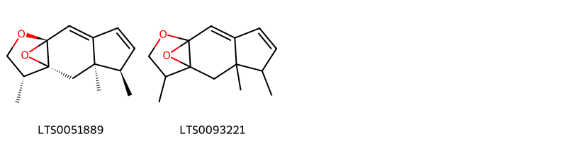
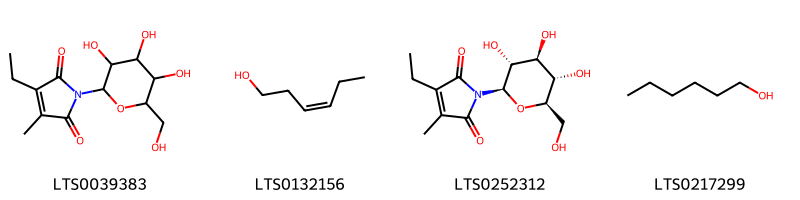
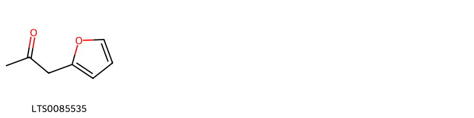
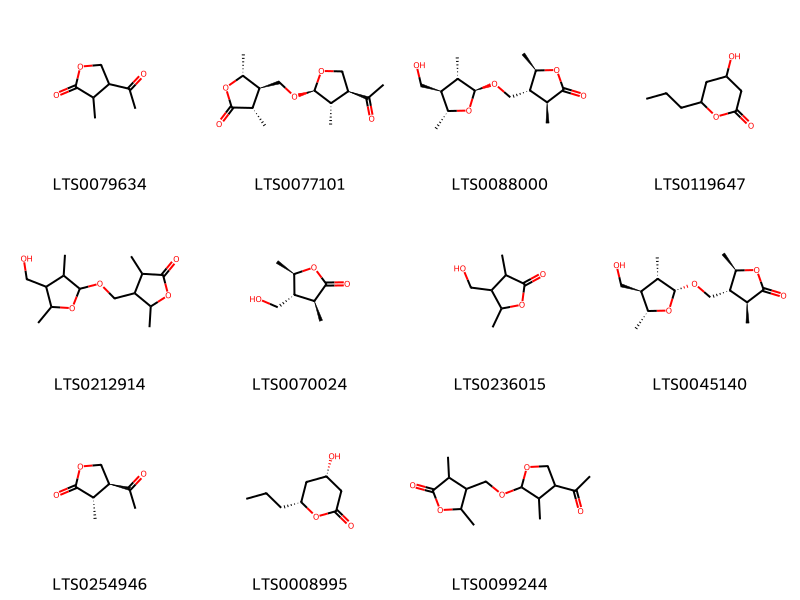
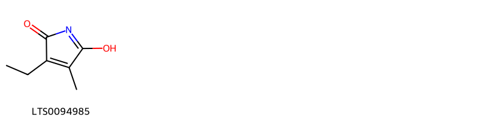

!!! abstract "Tóm tắt"
    Dược liệu từ cây Măng cụt hay còn gọi là cây Sơn Trúc Tử (Garcinia mangostana L.) là vỏ quả chín được phơi hoặc sấy khô (Pericarpium Garciniae mangostanae). Cây thuộc họ Bứa (Clusiaceae), là cây thân gỗ lớn, cao tới 20m, lá màu lục sẫm dày và dai. Quả hình cầu, vỏ đỏ sẫm dày và cứng, phía dưới có lá đài, phía đỉnh có đầu nhụy. Trong quả có từ 6 đến 18 hạt, quanh hạt có áo ăn được. Măng cụt có nguồn gốc từ Borneo, Malaya, sau đó di thực sang Bangladesh, Cambodia, China, India, Laos, Myanmar, Philippines, Việt Nam. Hiện nay ở nước ta, cây được trồng nhiều ở vùng Nam Bộ. Vỏ quả chứa 7-13% tanin, nhựa, và chất mangostin (C20H22O5). Trong y học cổ truyền, vỏ quả măng cụt được sử dụng để chữa đau bụng ỉa lỏng, lỵ và bệnh hoàng đản (vàng da) bằng cách sắc nước chừng 10 vỏ quả trong nồi đất hoặc đồng, uống 3-4 lần mỗi ngày. Một số trường hợp kết hợp với hạt mùi và hạt thìa là để tăng hiệu quả.

## Thông tin về thực vật

### Đặc điểm thực vật

Dược liệu **Măng Cụt (Vỏ Quả)** từ bộ phận **nan** từ loài *Garcinia mangostana L.* thuộc họ Clusiaceae. Măng cụt là một loại cây to, có thể cao tới 20m. Lá dày, dai, màu lục sẫm, hình thuôn dài 15-20cm, rộng 7-10cm.Đặc điểm của cây này là người ta mới chỉ thấy cây cái. Người ta cho rằng trong số những nhị lép (staminode) bao quanh bầu có thể có bao phấn chứa phấn hoa.
Quả hình cầu, to bằng quả cam trung bình, vỏ ngoài màu đỏ sẫm, dãy cứng, phía dưới có lá đài, phía đỉnh có đầu nhụy. Trong quả có từ 6 đến 18 hạt, quanh hạt có áo hạt ăn được. 

!!! info "Phân loại thực vật của *Garcinia mangostana*"
    - **Kingdom:** Plantae
    - **Phylum:** Tracheophyta
    - **Order:** Malpighiales
    - **Family:** Clusiaceae
    - **Genus:** Garcinia
    - **Species:** *Garcinia mangostana*

*Tài liệu tham khảo:* "Những cây thuốc và vị thuốc Việt Nam" - Đỗ Tất Lợi

 

### Loài thay thế (Nếu có)

### Phân bố trên thế giới
**Từ vườn thực vật KEW: **: - Native to: Borneo, Malaya
- Introduced into: Assam, Bangladesh, Cambodia, China South-Central, China Southeast, Hainan, India, Laos, Lesser Sunda Is., Maluku, Myanmar, Philippines, Queensland, Solomon Is., Sumatera, Trinidad-Tobago, Vietnam

**Từ CSDL GIBF** Réunion, Panama, Costa Rica, Brazil, Seychelles, Honduras, Singapore, Colombia, Indonesia, Viet Nam, China, Ecuador, United States of America, India, Malaysia, Philippines, Thailand

### Phân bố tại Việt Nam
** "Những cây thuốc và vị thuốc Việt Nam" - Đỗ Tất Lợi**: Nguồn gốc ở các đảo La Sôngđơ và Moluyc (Malaixia, Inđônêxia) sau được các nhà truyền giáo đạo gia tổ di thực vào miền Nam Việt Nam. Hiện nay được trồng rộng rãi ở Nam Bộ. Còn thấy ở Philippin, Indonesia, Malaysia.

**Từ CSDL GIBF**: Tiền Giang

---

## Thông tin về dược liệu 

### Định danh

!!! info "Thông tin về tên gọi của nan"
    - Dược liệu tiếng Việt: nan
    - Dược liệu tiếng Trung: nan (nan)
    - Dược liệu tiếng Anh: nan
    - Dược liệu latin thông dụng: nan
    - Dược liệu latin kiểu DĐVN: pericarpium garciniae mangostanae
    - Dược liệu latin kiểu DĐVN: nan
    - Dược liệu latin kiểu thông tư: nan
    - Bộ phận dùng: nan (nan)

### Mô tả dược liệu 
- **Theo dược điển Việt nam V:** nan

- **Mô tả dược liệu theo thông tư chế biến dược liệu theo phương pháp cổ truyền:** nan

### Chế biến 

- **Chế biến theo dược điển việt nam V**: nan

- **Chế biến theo thông tư:** nan

--- 

## Thành phần hóa học

- Theo tài liệu của GS. Đỗ Tất Lợi:  Trong vỏ quả có chứa từ 7-13% tanin, chất nhựa và chất mangostin (C20H22O5), có tinh thể hình phiến nhỏ, màu vàng tươi, không vị, tan trong rượu, ête và chất kiềm, không tan trong nước, độ chảy 175°C.
    
- Theo cơ sở dữ liệu lotus: Từ loài *Garcinia mangostana* đã phân lập và xác định được 211 hoạt chất thuộc về các nhóm Pyrrolidines, Pyrans, Pyridines and derivatives, Lactones, Organooxygen compounds, Benzopyrans, Prenol lipids, Steroids and steroid derivatives, Benzene and substituted derivatives, Macrolides and analogues, Fatty Acyls, Saturated hydrocarbons, Heteroaromatic compounds, Carboxylic acids and derivatives, Dioxanes, Flavonoids, 2-arylbenzofuran flavonoids. 

|    | chemicalTaxonomyClassyfireClass     |   smiles_count |
|---:|:------------------------------------|---------------:|
|  0 | 2-arylbenzofuran flavonoids         |              1 |
|  1 | Benzene and substituted derivatives |             13 |
|  2 | Benzopyrans                         |            114 |
|  3 | Carboxylic acids and derivatives    |              1 |
|  4 | Dioxanes                            |              2 |
|  5 | Fatty Acyls                         |              4 |
|  6 | Flavonoids                          |             14 |
|  7 | Heteroaromatic compounds            |              1 |
|  8 | Lactones                            |             11 |
|  9 | Macrolides and analogues            |              7 |
| 10 | Organooxygen compounds              |             12 |
| 11 | Prenol lipids                       |             15 |
| 12 | Pyrans                              |              2 |
| 13 | Pyridines and derivatives           |              1 |
| 14 | Pyrrolidines                        |              1 |
| 15 | Saturated hydrocarbons              |              3 |
| 16 | Steroids and steroid derivatives    |              9 |

### Nhóm 2-arylbenzofuran flavonoids
<figure markdown="span">
    { width=100% }
    <figcaption>Hình ảnh cấu trúc hóa học của 1 hoạt chất thuộc nhóm 2-arylbenzofuran flavonoids gồm ['egonol (LTS0157858)'].</figcaption>
</figure>
### Nhóm Benzene and substituted derivatives
<figure markdown="span">
    { width=100% }
    <figcaption>Hình ảnh cấu trúc hóa học của 13 hoạt chất thuộc nhóm Benzene and substituted derivatives gồm ['maclurin (LTS0130675)', '2-(3,5-dihydroxybenzoyl)benzene-1,3,5-triol (LTS0002649)', '5-(3-hydroxybenzoyl)benzene-1,2,3-triol (LTS0128581)', 'toluene (LTS0047403)', 'm-xylene (LTS0151729)', 'benzaldehyde (LTS0094193)', 'ortho-xylene (LTS0161849)', '(3r)-5,8-dihydroxy-3-methyl-3,4-dihydro-2-benzopyran-1-one (LTS0230454)', 'phenylacetaldehyde (LTS0245512)', '5,8-dihydroxy-3-methyl-3,4-dihydro-2-benzopyran-1-one (LTS0251250)', 'para-xylene (LTS0005367)', 'methylsalicylic acid (LTS0079350)', '2-(3-hydroxy-4-methoxybenzoyl)-3,5-dimethoxyphenol (LTS0030986)'].</figcaption>
</figure>
### Nhóm Benzopyrans
<figure markdown="span">
    { width=100% }
    <figcaption>Hình ảnh cấu trúc hóa học của 114 hoạt chất thuộc nhóm Benzopyrans gồm ['mangostin (LTS0004668)', '8-deoxygartanin (LTS0274495)', '1,3,7-trihydroxy-2-(3-methylbut-2-en-1-yl)xanthen-9-one (LTS0078884)', '1,6-dihydroxy-3,7-dimethoxy-2,8-bis(3-methylbut-2-en-1-yl)xanthen-9-one (LTS0231909)', 'tovophylline a (LTS0030746)', 'garcinone e (LTS0075006)', 'gartanin (LTS0169459)', 'mangostinone (LTS0064756)', '10,22-dihydroxy-7,7,18,18-tetramethyl-11-(3-methylbut-2-en-1-yl)-8,13,17-trioxapentacyclo[12.8.0.0³,¹².0⁴,⁹.0¹⁶,²¹]docosa-1(22),3,5,9,11,14,16(21),19-octaen-2-one (LTS0240097)', 'gamma-mangostin (LTS0090390)', '2-(3,7-dimethylocta-2,6-dien-1-yl)-1,3,5-trihydroxyxanthen-9-one (LTS0239053)', '1,7-dihydroxy-3-methoxy-2-(3-methylbut-2-en-1-yl)xanthen-9-one (LTS0013412)', '6,8,12-trihydroxy-2,2-dimethyl-7-(3-methylbut-2-en-1-yl)-1,10-dioxatetraphen-5-one (LTS0017147)', '1,6-dihydroxy-3,7-dimethoxy-2-(3-methylbut-2-en-1-yl)xanthen-9-one (LTS0269570)', '7,9,12-trihydroxy-2,2-dimethyl-1,11-dioxatetracen-6-one (LTS0118866)', 'gentisein (LTS0124197)', '3-isomangostin (LTS0214254)', '10,22-dihydroxy-7,7,18,18-tetramethyl-8,13,17-trioxapentacyclo[12.8.0.0³,¹².0⁴,⁹.0¹⁶,²¹]docosa-1(22),3,9,11,14,16(21)-hexaen-2-one (LTS0017725)', '1,3,6-trihydroxy-2-[(2s)-2-hydroxy-3-methylbut-3-en-1-yl]-7-methoxy-8-(3-methylbut-2-en-1-yl)xanthen-9-one (LTS0049799)', 'smeathxanthone a (LTS0158279)', '9-hydroxycalabaxanthone (LTS0147085)', '1,5,8-trihydroxy-3-methoxy-2-(3-methylbut-2-en-1-yl)xanthen-9-one (LTS0110195)', '(2s)-4,9-dihydroxy-2-(2-hydroxypropan-2-yl)-11-(3-methylbut-2-en-1-yl)-2h,3h-furo[3,2-b]xanthen-5-one (LTS0219342)', '3,6,8-trihydroxy-2-methoxy-1-(3-methylbut-2-en-1-yl)xanthen-9-one (LTS0267274)', '1,5-dihydroxy-3-methoxy-2-(3-methylbut-2-en-1-yl)xanthen-9-one (LTS0274706)', 'mellein (LTS0236743)', '2-(3,7-dimethylocta-2,6-dien-1-yl)-1,3,5,8-tetrahydroxyxanthen-9-one (LTS0215724)', '1,3,6-trihydroxy-2-(2-hydroxy-3-methylbut-3-en-1-yl)-7-methoxy-8-(3-methylbut-2-en-1-yl)xanthen-9-one (LTS0033786)', '(2r)-4-hydroxy-2-(2-hydroxypropan-2-yl)-7,8-dimethoxy-6-(3-methylbut-2-en-1-yl)-2h,3h-furo[3,2-b]xanthen-5-one (LTS0229635)', '4,9-dihydroxy-2-(2-hydroxypropan-2-yl)-11-(3-methylbut-2-en-1-yl)-2h,3h-furo[3,2-b]xanthen-5-one (LTS0231241)', 'mellein (LTS0027076)', 'garcinone d (LTS0006332)', '1,3,6,7-tetrahydroxy-8-(3-hydroxy-3-methylbutyl)-2-(3-methylbut-2-en-1-yl)xanthen-9-one (LTS0066957)', '2,3,5,7-tetrahydroxyxanthen-9-one (LTS0064122)', '1-(3,3-dimethylbutyl)-3,6,8-trihydroxy-2-methoxy-7-(3-methylbut-2-en-1-yl)xanthen-9-one (LTS0136689)', '11α-mangostanin (LTS0069820)', '5,8-dihydroxy-2,2-dimethyl-7-(3-methylbut-2-en-1-yl)-1,11-dioxatetracen-6-one (LTS0028206)', '(1s,2s)-1,8,10-trihydroxy-2-(2-hydroxypropan-2-yl)-9-(3-methylbut-2-en-1-yl)-1h,2h-furo[3,2-a]xanthen-11-one (LTS0083781)', '1-hydroxy-2-(2-hydroxy-3-methylbut-3-en-1-yl)-3,6,7-trimethoxy-8-(3-methylbut-2-en-1-yl)xanthen-9-one (LTS0127853)', '1,3,7-trihydroxy-2,8-bis(3-methylbut-2-en-1-yl)xanthen-9-one (LTS0123333)', '6,8,12-trihydroxy-2,2-dimethyl-7-(3-methylbut-2-en-1-yl)-3,4-dihydro-1,10-dioxatetraphen-5-one (LTS0173983)', '(3s)-3,6,8,11-tetrahydroxy-2,2-dimethyl-7-(3-methylbut-2-en-1-yl)-3,4-dihydro-1,10-dioxatetraphen-5-one (LTS0203422)', '1-hydroxy-8-[(2r)-2-hydroxy-3-methylbut-3-en-1-yl]-3,6,7-trimethoxy-2-(3-methylbut-2-en-1-yl)xanthen-9-one (LTS0211920)', '(6s,7s)-1,6,7-trihydroxy-3-methoxy-2-(3-methylbut-2-en-1-yl)-5,6,7,8-tetrahydroxanthen-9-one (LTS0086145)', '5-hydroxy-8,9-dimethoxy-2,2-dimethyl-7-(3-methylbut-2-en-1-yl)-1,11-dioxatetracen-6-one (LTS0124869)', '1,3,6-trihydroxy-7-methoxy-8-(3-methyl-2-oxobut-3-en-1-yl)-2-(3-methylbut-2-en-1-yl)xanthen-9-one (LTS0141432)', '2,4,5-trihydroxy-1-methoxyxanthen-9-one (LTS0101946)', '5,12-dihydroxy-2,2,9,9-tetramethyl-14-(3-methylbut-2-en-1-yl)-1,6,8-trioxapentacen-13-one (LTS0117541)', '3,4,8-trihydroxy-2-(2-hydroxypropan-2-yl)-7-methoxy-6-(3-methylbut-2-en-1-yl)-2h,3h-furo[3,2-b]xanthen-5-one (LTS0170559)', '1,6-dihydroxy-2-[(2r)-2-hydroxy-3-methylbut-3-en-1-yl]-3,7-dimethoxy-8-(3-methylbut-2-en-1-yl)xanthen-9-one (LTS0178485)', '(3s)-3,5,9-trihydroxy-10-methoxy-2,2-dimethyl-11-(3-methylbut-2-en-1-yl)-3,4-dihydro-1,7-dioxatetraphen-12-one (LTS0179749)', '10,22-dihydroxy-7,7,18,18-tetramethyl-8,13,17-trioxapentacyclo[12.8.0.0³,¹².0⁴,⁹.0¹⁶,²¹]docosa-1(22),3,9,11,14,16(21),19-heptaen-2-one (LTS0116124)', '22-hydroxy-10-methoxy-7,7,18,18-tetramethyl-8,13,17-trioxapentacyclo[12.8.0.0³,¹².0⁴,⁹.0¹⁶,²¹]docosa-1(22),3,9,11,14,16(21),19-heptaen-2-one (LTS0116316)', '1-hydroxy-8-(3-hydroxy-3-methylbut-1-en-1-yl)-3,6,7-trimethoxy-2-(3-methylbut-2-en-1-yl)xanthen-9-one (LTS0151187)', '4,8,10-trihydroxy-9-(3-methylbut-2-en-1-yl)-2-(prop-1-en-2-yl)-1h,2h-furo[3,2-a]xanthen-11-one (LTS0134990)', '5,9-dihydroxy-7-(3-hydroxy-3-methylbutyl)-8-methoxy-2,2-dimethyl-1,11-dioxatetracen-6-one (LTS0193960)', '3,6,8,11-tetrahydroxy-2,2-dimethyl-7-(3-methylbut-2-en-1-yl)-3,4-dihydro-1,10-dioxatetraphen-5-one (LTS0201029)', '1,3,6-trihydroxy-2-[(2r)-2-hydroxy-3-methylbut-3-en-1-yl]-7-methoxy-8-(3-methylbut-2-en-1-yl)xanthen-9-one (LTS0246824)', '1,6-dihydroxy-2-[(2s)-2-hydroxy-3-methylbut-3-en-1-yl]-3,7-dimethoxy-8-(3-methylbut-2-en-1-yl)xanthen-9-one (LTS0148678)', '10,16-dihydroxy-6,6,19,19-tetramethyl-15-(3-methylbut-2-en-1-yl)-5,13,18-trioxapentacyclo[12.8.0.0³,¹².0⁴,⁹.0¹⁷,²²]docosa-1(22),3,7,9,11,14,16,20-octaen-2-one (LTS0151632)', '1-isomangostin (LTS0121436)', '5,10-dihydroxy-2,2-dimethyl-12-(3-methylbut-2-en-1-yl)-1,11-dioxatetracen-6-one (LTS0161438)', '3,5,9-trihydroxy-8-methoxy-2,2-dimethyl-7-(3-methylbut-2-en-1-yl)-3,4-dihydro-1,11-dioxatetracen-6-one (LTS0160807)', 'trans-4-hydroxymellein (LTS0166041)', '2,3,6,8-tetrahydroxy-1-(3-methylbut-2-en-1-yl)xanthen-9-one (LTS0170763)', '1-(2,3-dihydroxy-3-methylbutyl)-3,6,8-trihydroxy-2-methoxy-7-(3-methylbut-2-en-1-yl)xanthen-9-one (LTS0136054)', '3,5,9-trihydroxy-10-methoxy-2,2-dimethyl-11-(3-methylbut-2-en-1-yl)-3,4-dihydro-1,7-dioxatetraphen-12-one (LTS0095757)', '1,6-dihydroxy-3,7-dimethoxy-8-(3-methyl-2-oxobut-3-en-1-yl)-2-(3-methylbut-2-en-1-yl)xanthen-9-one (LTS0241561)', '(2s)-4,8,10-trihydroxy-9-(3-methylbut-2-en-1-yl)-2-(prop-1-en-2-yl)-1h,2h-furo[3,2-a]xanthen-11-one (LTS0096790)', '(1r,2r)-1,8,10-trihydroxy-2-(2-hydroxypropan-2-yl)-9-(3-methylbut-2-en-1-yl)-1h,2h-furo[3,2-a]xanthen-11-one (LTS0120943)', '4-hydroxy-7,8-dimethoxy-6-(3-methylbut-2-en-1-yl)furo[3,2-b]xanthen-5-one (LTS0117978)', '1,3,6-trihydroxy-2,4-bis(3-methylbut-2-en-1-yl)xanthen-9-one (LTS0183316)', '3,9-dihydroxy-5,10-dimethoxy-2,2-dimethyl-11-(3-methylbut-2-en-1-yl)-3,4-dihydro-1,7-dioxatetraphen-12-one (LTS0117102)', '4,8-dihydroxy-2-(2-hydroxypropan-2-yl)-7-methoxy-6-(3-methylbut-2-en-1-yl)-2h,3h-furo[3,2-b]xanthen-5-one (LTS0067475)', '(2s)-4,8-dihydroxy-7-methoxy-6-(3-methylbut-2-en-1-yl)-2-(prop-1-en-2-yl)-2h,3h-furo[3,2-b]xanthen-5-one (LTS0261717)', '4,8-dihydroxy-7-methoxy-6-(3-methylbut-2-en-1-yl)-2-(prop-1-en-2-yl)-2h,3h-furo[3,2-b]xanthen-5-one (LTS0209628)', '(2s,3r)-3,4,8-trihydroxy-2-(2-hydroxypropan-2-yl)-7-methoxy-6-(3-methylbut-2-en-1-yl)-2h,3h-furo[3,2-b]xanthen-5-one (LTS0052033)', '1,6-dihydroxy-3-methoxy-2-(3-methylbut-2-en-1-yl)xanthen-9-one (LTS0215756)', '1,5,8-trihydroxy-3-methoxy-2,4-bis(3-methylbut-2-en-1-yl)xanthen-9-one (LTS0222461)', '1,6-dihydroxy-8-[(1e)-3-hydroxy-3-methylbut-1-en-1-yl]-3,7-dimethoxy-2-(3-methylbut-2-en-1-yl)xanthen-9-one (LTS0208929)', '1-[(2s)-2,3-dihydroxy-3-methylbutyl]-3,6,8-trihydroxy-2-methoxy-7-(3-methylbut-2-en-1-yl)xanthen-9-one (LTS0081448)', '4,7-dihydroxy-2-(2-hydroxypropan-2-yl)-6-(3-methylbut-2-en-1-yl)-2h,3h-furo[3,2-b]xanthen-5-one (LTS0222283)', '1,6-dihydroxy-2-(2-hydroxy-3-methylbut-3-en-1-yl)-3,7-dimethoxy-8-(3-methylbut-2-en-1-yl)xanthen-9-one (LTS0188719)', '(2s)-4,8,10-trihydroxy-2-(2-hydroxypropan-2-yl)-9-(3-methylbut-2-en-1-yl)-1h,2h-furo[3,2-a]xanthen-11-one (LTS0164037)', '4,8-dihydroxy-3-methyl-3,4-dihydro-2-benzopyran-1-one (LTS0170094)', '(2s)-4,8-dihydroxy-2-(2-hydroxypropan-2-yl)-7-methoxy-6-(3-methylbut-2-en-1-yl)-2h,3h-furo[3,2-b]xanthen-5-one (LTS0169307)', '1,3,7-trihydroxy-2-methoxyxanthen-9-one (LTS0207686)', '1,6-dihydroxy-8-(3-hydroxy-3-methylbut-1-en-1-yl)-3,7-dimethoxy-2-(3-methylbut-2-en-1-yl)xanthen-9-one (LTS0250097)', '10,22-dihydroxy-7,7,18,18-tetramethyl-11-(3-methylbut-2-en-1-yl)-8,13,17-trioxapentacyclo[12.8.0.0³,¹².0⁴,⁹.0¹⁶,²¹]docosa-1(22),3,9,11,14,16(21),19-heptaen-2-one (LTS0243340)', '4,7-dihydroxy-2-(2-hydroxypropan-2-yl)-11-(3-methylbut-2-en-1-yl)-2h,3h-furo[3,2-b]xanthen-5-one (LTS0250985)', '1-hydroxy-2-[(2r)-2-hydroxy-3-methylbut-3-en-1-yl]-3,6,7-trimethoxy-8-(3-methylbut-2-en-1-yl)xanthen-9-one (LTS0063592)', '22-hydroxy-7,7,18,18-tetramethyl-8,13,17-trioxapentacyclo[12.8.0.0³,¹².0⁴,⁹.0¹⁶,²¹]docosa-1(22),3,5,9,11,14,16(21),19-octaen-2-one (LTS0125235)', 'cratoxyxanthone (LTS0130968)', '5-hydroxy-8-methoxy-2,2-dimethyl-7-(3-methylbut-2-en-1-yl)-1,11-dioxatetracen-6-one (LTS0005339)', '1,3-dihydroxy-2-(2-hydroxy-3-methylbut-3-en-1-yl)-6,7-dimethoxy-8-(3-methylbut-2-en-1-yl)xanthen-9-one (LTS0015155)', '4-hydroxy-2-(2-hydroxypropan-2-yl)-7,8-dimethoxy-6-(3-methylbut-2-en-1-yl)-2h,3h-furo[3,2-b]xanthen-5-one (LTS0129425)', '(3r)-3,6,8,11-tetrahydroxy-2,2-dimethyl-7-(3-methylbut-2-en-1-yl)-3,4-dihydro-1,10-dioxatetraphen-5-one (LTS0007290)', '1-hydroxy-8-(2-hydroxy-3-methylbut-3-en-1-yl)-3,6,7-trimethoxy-2-(3-methylbut-2-en-1-yl)xanthen-9-one (LTS0015615)', '1,6-dihydroxy-8-(2-hydroxy-3-methylbut-3-en-1-yl)-3,7-dimethoxy-2-(3-methylbut-2-en-1-yl)xanthen-9-one (LTS0001144)', '10,15-dihydroxy-7,7,19,19-tetramethyl-11-(3-methylbut-2-en-1-yl)-2,8,20-trioxapentacyclo[12.8.0.0³,¹².0⁴,⁹.0¹⁶,²¹]docosa-1(22),3,5,9,11,14,16(21),17-octaen-13-one (LTS0262247)', '(3r)-3,9-dihydroxy-5,10-dimethoxy-2,2-dimethyl-11-(3-methylbut-2-en-1-yl)-3,4-dihydro-1,7-dioxatetraphen-12-one (LTS0016522)', '(3s)-3,5,9-trihydroxy-8-methoxy-2,2-dimethyl-7-(3-methylbut-2-en-1-yl)-3,4-dihydro-1,11-dioxatetracen-6-one (LTS0056527)', '1,6-dihydroxy-8-[(2r)-2-hydroxy-3-methylbut-3-en-1-yl]-3,7-dimethoxy-2-(3-methylbut-2-en-1-yl)xanthen-9-one (LTS0034259)', '6,8,12-trihydroxy-2,2-dimethyl-7,11-bis(3-methylbut-2-en-1-yl)-3,4-dihydro-1,10-dioxatetraphen-5-one (LTS0242758)', '(2s)-4,7-dihydroxy-2-(2-hydroxypropan-2-yl)-11-(3-methylbut-2-en-1-yl)-2h,3h-furo[3,2-b]xanthen-5-one (LTS0005088)', '4-[(2s,3r)-4,8-dihydroxy-2-(2-hydroxypropan-2-yl)-7-methoxy-6-(3-methylbut-2-en-1-yl)-5-oxo-2h,3h-furo[3,2-b]xanthen-3-yl]-1,3,6-trihydroxy-7-methoxy-2,8-bis(3-methylbut-2-en-1-yl)xanthen-9-one (LTS0208522)', '(2s)-4,7-dihydroxy-2-(2-hydroxypropan-2-yl)-6-(3-methylbut-2-en-1-yl)-2h,3h-furo[3,2-b]xanthen-5-one (LTS0023328)', '1,8,10-trihydroxy-2-(2-hydroxypropan-2-yl)-9-(3-methylbut-2-en-1-yl)-1h,2h-furo[3,2-a]xanthen-11-one (LTS0127995)', '4-[4,8-dihydroxy-2-(2-hydroxypropan-2-yl)-7-methoxy-6-(3-methylbut-2-en-1-yl)-5-oxo-2h,3h-furo[3,2-b]xanthen-3-yl]-1,3,6-trihydroxy-7-methoxy-2,8-bis(3-methylbut-2-en-1-yl)xanthen-9-one (LTS0262429)', '4,8-dihydroxy-7-methoxy-6-(3-methylbut-2-en-1-yl)furo[3,2-b]xanthen-5-one (LTS0037501)', '1-hydroxy-8-[(1e)-3-hydroxy-3-methylbut-1-en-1-yl]-3,6,7-trimethoxy-2-(3-methylbut-2-en-1-yl)xanthen-9-one (LTS0039363)', 'cis-4-hydroxymellein (LTS0036641)', 'cudraxanthone g (LTS0045459)', '1,3-dihydroxy-2-[(2r)-2-hydroxy-3-methylbut-3-en-1-yl]-6,7-dimethoxy-8-(3-methylbut-2-en-1-yl)xanthen-9-one (LTS0043408)'].</figcaption>
</figure>
### Nhóm Carboxylic acids and derivatives
<figure markdown="span">
    { width=100% }
    <figcaption>Hình ảnh cấu trúc hóa học của 1 hoạt chất thuộc nhóm Carboxylic acids and derivatives gồm ['hexyl acetate (LTS0202355)'].</figcaption>
</figure>
### Nhóm Dioxanes
<figure markdown="span">
    { width=100% }
    <figcaption>Hình ảnh cấu trúc hóa học của 2 hoạt chất thuộc nhóm Dioxanes gồm ['(1r,3r,4r,9r,12r)-3,4,12-trimethyl-10,13-dioxatetracyclo[7.3.1.0¹,⁹.0³,⁷]trideca-5,7-diene (LTS0051889)', '3,4,12-trimethyl-10,13-dioxatetracyclo[7.3.1.0¹,⁹.0³,⁷]trideca-5,7-diene (LTS0093221)'].</figcaption>
</figure>
### Nhóm Fatty Acyls
<figure markdown="span">
    { width=100% }
    <figcaption>Hình ảnh cấu trúc hóa học của 4 hoạt chất thuộc nhóm Fatty Acyls gồm ['3-ethyl-4-methyl-1-[3,4,5-trihydroxy-6-(hydroxymethyl)oxan-2-yl]pyrrole-2,5-dione (LTS0039383)', 'cis-3-hexenol (LTS0132156)', '3-ethyl-4-methyl-1-[(2r,3r,4s,5s,6r)-3,4,5-trihydroxy-6-(hydroxymethyl)oxan-2-yl]pyrrole-2,5-dione (LTS0252312)', 'hexanol (LTS0217299)'].</figcaption>
</figure>
### Nhóm Flavonoids
<figure markdown="span">
    { width=100% }
    <figcaption>Hình ảnh cấu trúc hóa học của 14 hoạt chất thuộc nhóm Flavonoids gồm ['catechol (LTS0090912)', 'ent-epicatechin (LTS0265245)', 'astilbin (LTS0079309)', '(2r,3s)-2-(3,5-dihydroxyphenyl)-5,7-dihydroxy-3-{[(2s,3r,4r,5r,6s)-3,4,5-trihydroxy-6-methyloxan-2-yl]oxy}-2,3-dihydro-1-benzopyran-4-one (LTS0210381)', '(2r,3r,4s)-2-(3,4-dihydroxyphenyl)-4-[(2r,3r)-2-(3,4-dihydroxyphenyl)-3,5,7-trihydroxy-3,4-dihydro-2h-1-benzopyran-6-yl]-3,4-dihydro-2h-1-benzopyran-3,5,7-triol (LTS0103163)', '2-(3,4-dihydroxyphenyl)-4-[2-(3,4-dihydroxyphenyl)-3,5,7-trihydroxy-3,4-dihydro-2h-1-benzopyran-6-yl]-3,4-dihydro-2h-1-benzopyran-3,5,7-triol (LTS0072400)', '(2r,3r,4r)-2-(3,4-dihydroxyphenyl)-4-[(2r,3r)-2-(3,4-dihydroxyphenyl)-3,5,7-trihydroxy-3,4-dihydro-2h-1-benzopyran-8-yl]-3,4-dihydro-2h-1-benzopyran-3,5,7-triol (LTS0135510)', '(2r,3r)-2-(3,4-dihydroxyphenyl)-4-[(2r,3r)-2-(3,4-dihydroxyphenyl)-3,5,7-trihydroxy-3,4-dihydro-2h-1-benzopyran-8-yl]-3,4-dihydro-2h-1-benzopyran-3,5,7-triol (LTS0097406)', 'procyanidin a1 (LTS0167676)', 'procyanidin a1 (LTS0171311)', 'proanthocyanidin a2 (LTS0117726)', '2-(3,5-dihydroxyphenyl)-5,7-dihydroxy-3-[(3,4,5-trihydroxy-6-methyloxan-2-yl)oxy]-2,3-dihydro-1-benzopyran-4-one (LTS0067301)', 'astilbin (LTS0079365)', '2-(3,4-dihydroxyphenyl)-4-[2-(3,4-dihydroxyphenyl)-3,5,7-trihydroxy-3,4-dihydro-2h-1-benzopyran-8-yl]-3,4-dihydro-2h-1-benzopyran-3,5,7-triol (LTS0040252)'].</figcaption>
</figure>
### Nhóm Heteroaromatic compounds
<figure markdown="span">
    { width=100% }
    <figcaption>Hình ảnh cấu trúc hóa học của 1 hoạt chất thuộc nhóm Heteroaromatic compounds gồm ['furfuryl methyl ketone (LTS0085535)'].</figcaption>
</figure>
### Nhóm Lactones
<figure markdown="span">
    { width=100% }
    <figcaption>Hình ảnh cấu trúc hóa học của 11 hoạt chất thuộc nhóm Lactones gồm ['4-acetyl-3-methyloxolan-2-one (LTS0079634)', '(3s,4r,5r)-4-({[(2s,3s,4s)-4-acetyl-3-methyloxolan-2-yl]oxy}methyl)-3,5-dimethyloxolan-2-one (LTS0077101)', '(3s,4r,5r)-4-({[(2s,3s,4r,5r)-4-(hydroxymethyl)-3,5-dimethyloxolan-2-yl]oxy}methyl)-3,5-dimethyloxolan-2-one (LTS0088000)', '4-hydroxy-6-propyloxan-2-one (LTS0119647)', '4-({[4-(hydroxymethyl)-3,5-dimethyloxolan-2-yl]oxy}methyl)-3,5-dimethyloxolan-2-one (LTS0212914)', '(3s,4r,5r)-4-(hydroxymethyl)-3,5-dimethyloxolan-2-one (LTS0070024)', '4-(hydroxymethyl)-3,5-dimethyloxolan-2-one (LTS0236015)', '(3s,4r,5r)-4-({[(2r,3s,4r,5r)-4-(hydroxymethyl)-3,5-dimethyloxolan-2-yl]oxy}methyl)-3,5-dimethyloxolan-2-one (LTS0045140)', '(3s,4s)-4-acetyl-3-methyloxolan-2-one (LTS0254946)', '(4s,6r)-4-hydroxy-6-propyloxan-2-one (LTS0008995)', '4-{[(4-acetyl-3-methyloxolan-2-yl)oxy]methyl}-3,5-dimethyloxolan-2-one (LTS0099244)'].</figcaption>
</figure>
### Nhóm Macrolides and analogues
<figure markdown="span">
    { width=100% }
    <figcaption>Hình ảnh cấu trúc hóa học của 7 hoạt chất thuộc nhóm Macrolides and analogues gồm ['lasiodiplodin (LTS0064600)', '5,12-dihydroxy-14-methoxy-3-methyl-3,4,5,6,7,8,9,10-octahydro-2-benzoxacyclododecin-1-one (LTS0138773)', '(3s,7r)-7,12-dihydroxy-14-methoxy-3-methyl-3,4,5,6,7,8,9,10-octahydro-2-benzoxacyclododecin-1-one (LTS0057052)', '12-hydroxy-14-methoxy-3-methyl-3,4,5,6,7,8,9,10-octahydro-2-benzoxacyclododecin-1-one (LTS0178955)', '(3s,5r)-5,12-dihydroxy-14-methoxy-3-methyl-3,4,5,6,7,8,9,10-octahydro-2-benzoxacyclododecin-1-one (LTS0068967)', '7,12-dihydroxy-14-methoxy-3-methyl-3,4,5,6,7,8,9,10-octahydro-2-benzoxacyclododecin-1-one (LTS0031900)', '(3s,5s)-5,12-dihydroxy-14-methoxy-3-methyl-3,4,5,6,7,8,9,10-octahydro-2-benzoxacyclododecin-1-one (LTS0224745)'].</figcaption>
</figure>
### Nhóm Organooxygen compounds
<figure markdown="span">
    { width=100% }
    <figcaption>Hình ảnh cấu trúc hóa học của 12 hoạt chất thuộc nhóm Organooxygen compounds gồm ['[4-oxo-2-(pent-2-en-1-yl)cyclopentyl]acetic acid (LTS0181983)', 'glucotropeolin (LTS0036398)', 'bran oil (LTS0143969)', 'nonanal (LTS0244398)', '(2s,3r,4s,5s,6r)-2-(2-benzoyl-3,5-dihydroxyphenoxy)-6-(hydroxymethyl)oxane-3,4,5-triol (LTS0270105)', '(1r,8as)-7-hydroxy-1,8a-dimethyl-1h-naphthalene-2,6-dione (LTS0023692)', '2-(2-benzoyl-3,5-dihydroxyphenoxy)-6-(hydroxymethyl)oxane-3,4,5-triol (LTS0062524)', '[(1s,2s)-4-oxo-2-[(2z)-pent-2-en-1-yl]cyclopentyl]acetic acid (LTS0064680)', 'glucotropaeolin (LTS0189449)', '5-methylfurfural (LTS0186625)', '7-hydroxy-1,8a-dimethyl-1h-naphthalene-2,6-dione (LTS0061513)', '(2r,3s,4r,5r,6s)-2-(2-benzoyl-3,5-dihydroxyphenoxy)-6-(hydroxymethyl)oxane-3,4,5-triol (LTS0054113)'].</figcaption>
</figure>
### Nhóm Prenol lipids
<figure markdown="span">
    { width=100% }
    <figcaption>Hình ảnh cấu trúc hóa học của 15 hoạt chất thuộc nhóm Prenol lipids gồm ['(-)-friedelin (LTS0041645)', 'betulin (LTS0101863)', 'terpineol (LTS0136148)', '(z)-α-bisabolene (LTS0053911)', '(e)-α-bisabolene (LTS0046940)', '4-isopropyl-1,6-dimethyl-2,3,4,4a,7,8-hexahydronaphthalene (LTS0270743)', '(+)-gamma-cadinene (LTS0103949)', 'α-copaene (LTS0207598)', 'n-[(1s,2r)-3-{[(1s,2s,3r,4s,7r,9s,10s,12r,15s)-4,12-bis(acetyloxy)-2-(benzoyloxy)-1,9-dihydroxy-10,14,17,17-tetramethyl-11-oxo-6-oxatetracyclo[11.3.1.0³,¹⁰.0⁴,⁷]heptadec-13-en-15-yl]oxy}-2-hydroxy-3-oxo-1-phenylpropyl]benzenecarboximidic acid (LTS0163460)', '(1r,2s,7s,8s)-8-isopropyl-1,3-dimethyltricyclo[4.4.0.0²,⁷]dec-3-ene (LTS0190031)', 'delta-cadinene (LTS0019321)', 'guaiene (LTS0274548)', 'valencene (LTS0031707)', 'valencene (LTS0110395)', '4-isopropyl-6-methyl-1-methylidene-3,4,4a,7,8,8a-hexahydro-2h-naphthalene (LTS0111070)'].</figcaption>
</figure>
### Nhóm Pyrans
<figure markdown="span">
    { width=100% }
    <figcaption>Hình ảnh cấu trúc hóa học của 2 hoạt chất thuộc nhóm Pyrans gồm ['6-propyl-5,6-dihydropyran-2-one (LTS0051247)', '(6r)-6-propyl-5,6-dihydropyran-2-one (LTS0037125)'].</figcaption>
</figure>
### Nhóm Pyridines and derivatives
<figure markdown="span">
    { width=100% }
    <figcaption>Hình ảnh cấu trúc hóa học của 1 hoạt chất thuộc nhóm Pyridines and derivatives gồm ['pyridine (LTS0108275)'].</figcaption>
</figure>
### Nhóm Pyrrolidines
<figure markdown="span">
    { width=100% }
    <figcaption>Hình ảnh cấu trúc hóa học của 1 hoạt chất thuộc nhóm Pyrrolidines gồm ['3-ethyl-5-hydroxy-4-methylpyrrol-2-one (LTS0094985)'].</figcaption>
</figure>
### Nhóm Saturated hydrocarbons
<figure markdown="span">
    { width=100% }
    <figcaption>Hình ảnh cấu trúc hóa học của 3 hoạt chất thuộc nhóm Saturated hydrocarbons gồm ['octane (LTS0186469)', 'heptane (LTS0062507)', 'ethylcyclohexane (LTS0033805)'].</figcaption>
</figure>
### Nhóm Steroids and steroid derivatives
<figure markdown="span">
    { width=100% }
    <figcaption>Hình ảnh cấu trúc hóa học của 9 hoạt chất thuộc nhóm Steroids and steroid derivatives gồm ['stigmast-5-en-3-ol, (3β)- (LTS0204616)', 'stigmast-5-en-3-ol (LTS0071224)', '(3r,6s,8r,11s,12s,15r,16r)-7,7,12,16-tetramethyl-15-[(2r)-6-methylhept-5-en-2-yl]pentacyclo[9.7.0.0¹,³.0³,⁸.0¹²,¹⁶]octadecan-6-ol (LTS0062833)', 'cycloartenol (LTS0269561)', '15-[(5e)-7-hydroxy-6-methylhept-5-en-2-yl]-7,7,12,16-tetramethylpentacyclo[9.7.0.0¹,³.0³,⁸.0¹²,¹⁶]octadecan-6-ol (LTS0080043)', '(2z)-6-[(3r,6s,15r,16r)-6-hydroxy-7,7,12,16-tetramethylpentacyclo[9.7.0.0¹,³.0³,⁸.0¹²,¹⁶]octadecan-15-yl]-2-methylhept-2-enoic acid (LTS0144235)', '(2e,6r)-6-[(1s,3r,6s,12s,15r,16r)-6-hydroxy-7,7,12,16-tetramethylpentacyclo[9.7.0.0¹,³.0³,⁸.0¹²,¹⁶]octadecan-15-yl]-2-methylhept-2-enoic acid (LTS0086923)', '6-{7-hydroxy-7,12,16-trimethylpentacyclo[9.7.0.0¹,³.0³,⁸.0¹²,¹⁶]octadecan-15-yl}hept-3-en-2-one (LTS0248667)', '(3e,6s)-6-[(1s,3r,7s,8r,11s,12s,15r,16r)-7-hydroxy-7,12,16-trimethylpentacyclo[9.7.0.0¹,³.0³,⁸.0¹²,¹⁶]octadecan-15-yl]hept-3-en-2-one (LTS0019233)'].</figcaption>
</figure>

---

## Tác dụng dược lý

Theo tài liệu "Những cây thuốc và vị thuốc Việt Nam" - Đỗ Tất Lợi:- chữa đau bụng đi ỉa lỏng, chữa lỵ, có khi còn dùng chữa bệnh hoàng đản (vàng da)
- Theo dr Duke: có tác dụng chống viêm, điều trị sốt

Theo tài liệu quốc tế: nan

---

## Dược điển Việt Nam V

### Soi bột:
nan
<!-- Hình ảnh soi bột sẽ được tự động chèn vào đây sau -->
### Vi phẫu:
nan
<!-- Hình ảnh vi phẫu sẽ được tự động chèn vào đây sau -->
### Định tính

nan

### Định lượng

nan

### Thông tin khác 
- ** Độ ẩm: ** nan

- ** Bảo quản:** nan
## Dược điển Hồng kong

<!-- PDF sẽ được tự động chèn vào đây sau -->

---

## Y dược học cổ truyền

- **Tên vị thuốc:** nan
- **Tính vị quy kinh:** Vị chát, tính ấm. Vào kinh đại tràng.
- **Công năng chủ trị:** Sát trùng chỉ lỵ, thu liễm săn da.
Chủ trị: Đau bụng ỉa chảy, lỵ, khí hư bạch đới.
- **Chú ý:** nan
- **Kiêng kỵ:** nan

