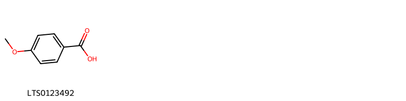
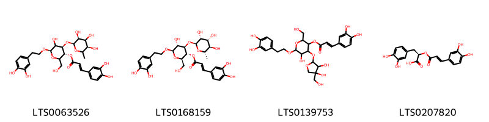
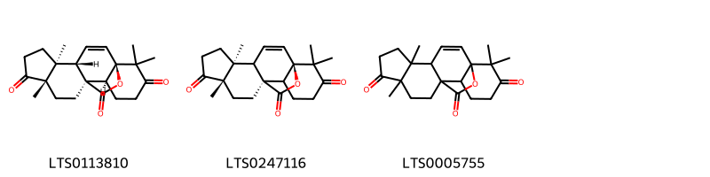
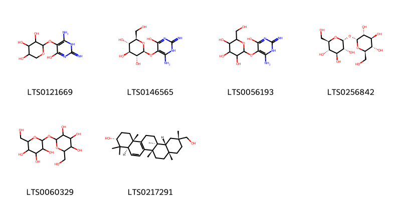
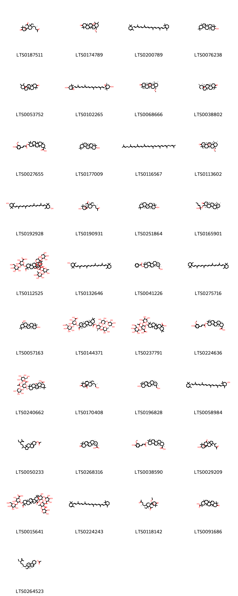

!!! abstract "Tóm tắt"
    Mướp đắng (quả) có tên dược liệu trong Dược điển Việt Nam là Pructus Momordicae charantiae. Thuộc họ Cucurbitaceae - Bí. Loài dược liệu này phân bố rộng khắp thế giới từ châu Phi, châu Á đến châu Úc và các đảo Thái Bình Dương. Tại Việt Nam, mướp đắng được trồng phổ biến ở cả miền Bắc và miền Nam.

Theo y học cổ truyền, quả mướp đắng có vị đắng, tính hàn, quy vào các kinh tỳ, phế và thận. Công năng chính bao gồm thanh nhiệt, giải độc, lợi tiểu, nhuận tràng và giải háo khát. Mướp đắng thường được dùng để chữa ho, sốt, táo bón, tiểu buốt, tiểu dắt, tiểu đường và các bệnh ngoài da như mụn nhọt, rôm sảy.

Về thành phần hóa học, mướp đắng chứa glucozit đắng (momocdixin), vitamin B1, C, adenin, betain và protein. Các nghiên cứu cũng ghi nhận tác dụng dược lý như chống viêm, hạ đường huyết và hỗ trợ tiêu hóa.

## Thông tin về thực vật

### Đặc điểm thực vật

Dược liệu **Mướp Đắng (Quả)** từ bộ phận **nan** từ loài *Momordica charantia L.* thuộc họ Cucurbitaceae. Mướp đắng là một loại cây leo, thân có góc cạnh, ở ngọn hơi có lông tơ. Lá mọc so le, dài 5-10 cm, rộng 4-8 cm, phiến lá chia 5-7 thùy hình trứng, mép có răng cưa đều, mặt dưới lá màu nhạt hơn mặt trên, trên gân lá có lông ngắn. Hoa mọc đơn độc ở kẽ lá, đực cái cùng gốc, có cuống dài, cánh hoa màu vàng nhạt, đường kính của hoa chừng 2cm. Quả hình thoi dài 8-15 cm, trên mặt có nhiều u nổi lên, quả chưa chín có màu vàng xanh, khi chín có màu vàng hồng, trong quả có hạt dẹt 13-15 mm, rộng 7-8 mm, trông gần giống hạt bí ngô, quanh hạt có màng màu đỏ máu như màng gấc. 

!!! info "Phân loại thực vật của *Momordica charantia*"
    - **Kingdom:** Plantae
    - **Phylum:** Tracheophyta
    - **Order:** Cucurbitales
    - **Family:** Cucurbitaceae
    - **Genus:** Momordica
    - **Species:** *Momordica charantia*

*Tài liệu tham khảo:* "Những cây thuốc và vị thuốc Việt Nam" - Đỗ Tất Lợi

 

### Loài thay thế (Nếu có)

### Phân bố trên thế giới
**Từ vườn thực vật KEW: **: Angola, Assam, Bangladesh, Benin, Borneo, Burkina, Burundi, Cameroon, Cape Verde, Central African Republic, Chad, Christmas I., Congo, East Himalaya, Ethiopia, Fiji, Gabon, Gambia, Ghana, Guinea, Guinea-Bissau, Gulf of Guinea Is., India, Ivory Coast, Jawa, Kenya, KwaZulu-Natal, Laos, Lesser Sunda Is., Liberia, Malawi, Malaya, Mali, Maluku, Mozambique, Namibia, Nepal, New Guinea, Niger, Nigeria, Northern Provinces, Northern Territory, Pakistan, Philippines, Queensland, Rwanda, Senegal, Sierra Leone, Society Is., Solomon Is., Sri Lanka, Sudan, Sulawesi, Sumatera, Tanzania, Thailand, Togo, Tonga, Uganda, Vanuatu, Vietnam, West Himalaya, Western Australia, Zambia, Zaïre, Zimbabwe

**Từ CSDL GIBF** nan, Sri Lanka, Réunion, Cabo Verde, Australia, Spain, Belize, Puerto Rico, Nigeria, American Samoa, Thailand, Montserrat, Guadeloupe, Brazil, Honduras, Antigua and Barbuda, New Zealand, Saint Kitts and Nevis, Guatemala, Indonesia, Hong Kong, Vanuatu, Ghana, India, Lao People’s Democratic Republic, Argentina, Mexico, Panama, Costa Rica, Northern Mariana Islands, Saint Lucia, Nicaragua, Colombia, French Polynesia, Ecuador, China, Peru, French Guiana, Cayman Islands, South Africa, Philippines, Dominican Republic, Kenya, Virgin Islands (U.S.), Viet Nam, Jamaica, United States of America, Bahamas, Chinese Taipei, Malawi, Barbados

### Phân bố tại Việt Nam
** "Những cây thuốc và vị thuốc Việt Nam" - Đỗ Tất Lợi**: Mướp đắng được trồng ở khắp các tỉnh trong nước ta, ở miền Bắc cũng như ở miền Nam.

**Từ CSDL GIBF**: Đồng Tháp

---

## Thông tin về dược liệu 

### Định danh

!!! info "Thông tin về tên gọi của nan"
    - Dược liệu tiếng Việt: nan
    - Dược liệu tiếng Trung: nan (nan)
    - Dược liệu tiếng Anh: nan
    - Dược liệu latin thông dụng: nan
    - Dược liệu latin kiểu DĐVN: pructus momordicae charantiae
    - Dược liệu latin kiểu DĐVN: nan
    - Dược liệu latin kiểu thông tư: nan
    - Bộ phận dùng: nan (nan)

### Mô tả dược liệu 
- **Theo dược điển Việt nam V:** nan

- **Mô tả dược liệu theo thông tư chế biến dược liệu theo phương pháp cổ truyền:** nan

### Chế biến 

- **Chế biến theo dược điển việt nam V**: nan

- **Chế biến theo thông tư:** nan

--- 

## Thành phần hóa học

- Theo tài liệu của GS. Đỗ Tất Lợi:  (1) Glucozit đắng còn gọi là momocdixin, Vitamin B1, C, adenin, betain, protein.
(2) Không tìm thấy
    
- Theo cơ sở dữ liệu lotus: Từ loài *Momordica charantia* đã phân lập và xác định được 359 hoạt chất thuộc về các nhóm Oxepanes, Lactones, Organooxygen compounds, Steroids and steroid derivatives, Prenol lipids, Benzene and substituted derivatives, Fatty Acyls, Oxolanes, Tetrahydrofurans, Carboxylic acids and derivatives, Diazines, Cinnamic acids and derivatives. 

|    | chemicalTaxonomyClassyfireClass     |   smiles_count |
|---:|:------------------------------------|---------------:|
|  0 | Benzene and substituted derivatives |              1 |
|  1 | Carboxylic acids and derivatives    |              1 |
|  2 | Cinnamic acids and derivatives      |              4 |
|  3 | Diazines                            |              1 |
|  4 | Fatty Acyls                         |             15 |
|  5 | Lactones                            |              3 |
|  6 | Organooxygen compounds              |              6 |
|  7 | Oxepanes                            |              2 |
|  8 | Oxolanes                            |              1 |
|  9 | Prenol lipids                       |             37 |
| 10 | Steroids and steroid derivatives    |            287 |
| 11 | Tetrahydrofurans                    |              1 |

### Nhóm Benzene and substituted derivatives
<figure markdown="span">
    { width=100% }
    <figcaption>Hình ảnh cấu trúc hóa học của 1 hoạt chất thuộc nhóm Benzene and substituted derivatives gồm ['p-anisic acid (LTS0123492)'].</figcaption>
</figure>
### Nhóm Carboxylic acids and derivatives
<figure markdown="span">
    { width=100% }
    <figcaption>Hình ảnh cấu trúc hóa học của 1 hoạt chất thuộc nhóm Carboxylic acids and derivatives gồm ['(1r,2r,6s,8s,11r,12s,13r,16r,17r,19s,20r)-17-(acetyloxy)-19-hydroxy-1,9,11,16-tetramethyl-8-(2-oxo-5h-furan-3-yl)-5,14-dioxapentacyclo[11.6.1.0²,¹¹.0⁶,¹⁰.0¹⁶,²⁰]icos-9-en-12-yl (2e)-2-methylbut-2-enoate (LTS0230082)'].</figcaption>
</figure>
### Nhóm Cinnamic acids and derivatives
<figure markdown="span">
    { width=100% }
    <figcaption>Hình ảnh cấu trúc hóa học của 4 hoạt chất thuộc nhóm Cinnamic acids and derivatives gồm ['(3r,4r,6r)-6-[2-(3,4-dihydroxyphenyl)ethoxy]-5-hydroxy-2-(hydroxymethyl)-4-{[(2s,3s,5r)-3,4,5-trihydroxy-6-methyloxan-2-yl]oxy}oxan-3-yl (2e)-3-(3,4-dihydroxyphenyl)prop-2-enoate (LTS0063526)', 'verbascoside (LTS0168159)', '4-{[3,4-dihydroxy-4-(hydroxymethyl)oxolan-2-yl]oxy}-6-[2-(3,4-dihydroxyphenyl)ethoxy]-5-hydroxy-2-(hydroxymethyl)oxan-3-yl 3-(3,4-dihydroxyphenyl)prop-2-enoate (LTS0139753)', 'rosemary acid (LTS0207820)'].</figcaption>
</figure>
### Nhóm Diazines
<figure markdown="span">
    { width=100% }
    <figcaption>Hình ảnh cấu trúc hóa học của 1 hoạt chất thuộc nhóm Diazines gồm ['pirod (LTS0008205)'].</figcaption>
</figure>
### Nhóm Fatty Acyls
<figure markdown="span">
    { width=100% }
    <figcaption>Hình ảnh cấu trúc hóa học của 15 hoạt chất thuộc nhóm Fatty Acyls gồm ['palmitic acid (LTS0079439)', 'palmitoleic acid (LTS0261591)', 'oleic acid (LTS0256910)', 'myristic acid (LTS0102566)', '(4r,5r,6r)-6-ethyl-5-[(4r,7r,8s,10r,11r)-11-ethyl-8,10,12-trihydroxy-4,7-dimethyldodecyl]-4-hydroxy-4,5-dimethylcyclohex-2-en-1-one (LTS0238630)', 'momordol (LTS0187083)', 'α-linolenic acid (LTS0275508)', 'α linolenic acid (LTS0132789)', 'petroselinic acid (LTS0057266)', 'elaeostearic acid (LTS0007390)', 'lauric acid (LTS0051907)', 'linoleic (LTS0013198)', 'stearic acid (LTS0237766)', 'capric acid (LTS0039856)', 'eleostearic acid (LTS0116169)'].</figcaption>
</figure>
### Nhóm Lactones
<figure markdown="span">
    { width=100% }
    <figcaption>Hình ảnh cấu trúc hóa học của 3 hoạt chất thuộc nhóm Lactones gồm ['(1r,4s,5s,9s,12s,13s)-5,9,17,17-tetramethyl-18-oxapentacyclo[10.5.2.0¹,¹³.0⁴,¹².0⁵,⁹]nonadec-2-ene-8,16,19-trione (LTS0113810)', '(1r,5s,9s,12s)-5,9,17,17-tetramethyl-18-oxapentacyclo[10.5.2.0¹,¹³.0⁴,¹².0⁵,⁹]nonadec-2-ene-8,16,19-trione (LTS0247116)', '5,9,17,17-tetramethyl-18-oxapentacyclo[10.5.2.0¹,¹³.0⁴,¹².0⁵,⁹]nonadec-2-ene-8,16,19-trione (LTS0005755)'].</figcaption>
</figure>
### Nhóm Organooxygen compounds
<figure markdown="span">
    { width=100% }
    <figcaption>Hình ảnh cấu trúc hóa học của 6 hoạt chất thuộc nhóm Organooxygen compounds gồm ['2-[(4-amino-6-hydroxy-2-imino-3h-pyrimidin-5-yl)oxy]oxane-3,4,5-triol (LTS0121669)', 'vicine (van) (8ci) (LTS0146565)', '2-[(4-amino-6-hydroxy-2-imino-3h-pyrimidin-5-yl)oxy]-6-(hydroxymethyl)oxane-3,4,5-triol (LTS0056193)', "α,α'-trehalose (LTS0256842)", 'trehalose (LTS0060329)', '(3r,4ar,6bs,8as,11r,12ar,12bs,14bs)-11-(hydroxymethyl)-4,4,6b,8a,11,12b,14b-heptamethyl-1,2,3,4a,7,8,9,10,12,12a,13,14-dodecahydropicen-3-ol (LTS0217291)'].</figcaption>
</figure>
### Nhóm Oxepanes
<figure markdown="span">
    { width=100% }
    <figcaption>Hình ảnh cấu trúc hóa học của 2 hoạt chất thuộc nhóm Oxepanes gồm ['(1r,4s,5s,9s,12r,13s,19r)-19-methoxy-5,9,17,17-tetramethyl-18-oxapentacyclo[10.5.2.0¹,¹³.0⁴,¹².0⁵,⁹]nonadecane-3,8,16-trione (LTS0088036)', '19-methoxy-5,9,17,17-tetramethyl-18-oxapentacyclo[10.5.2.0¹,¹³.0⁴,¹².0⁵,⁹]nonadecane-3,8,16-trione (LTS0040989)'].</figcaption>
</figure>
### Nhóm Oxolanes
<figure markdown="span">
    { width=100% }
    <figcaption>Hình ảnh cấu trúc hóa học của 1 hoạt chất thuộc nhóm Oxolanes gồm ['(1r,4s,5s,9s,12s,13s)-5,9,17,17-tetramethyl-18-oxapentacyclo[10.5.2.0¹,¹³.0⁴,¹².0⁵,⁹]nonadec-2-ene-8,16-dione (LTS0251902)'].</figcaption>
</figure>
### Nhóm Prenol lipids
<figure markdown="span">
    { width=100% }
    <figcaption>Hình ảnh cấu trúc hóa học của 37 hoạt chất thuộc nhóm Prenol lipids gồm ['(1r,5s,8r,9r,12r)-5,9,17,17-tetramethyl-8-[(2r)-4-oxopentan-2-yl]-18-oxapentacyclo[10.5.2.0¹,¹³.0⁴,¹².0⁵,⁹]nonadecane-3,16-dione (LTS0187511)', 'momordicin-28 (LTS0174789)', '(+)-α-carotene (LTS0200789)', 'alnulin (LTS0076238)', '4,5,9,9,13,19,20-heptamethyl-24-oxahexacyclo[15.5.2.0¹,¹⁸.0⁴,¹⁷.0⁵,¹⁴.0⁸,¹³]tetracos-15-en-10-one (LTS0053752)', 'violaxanthin (LTS0102265)', 'momordicin-28 (LTS0068666)', '(1s,4s,5r,8r,13s,14r,17s,18r,19s,20r)-4,5,9,9,13,19,20-heptamethyl-24-oxahexacyclo[15.5.2.0¹,¹⁸.0⁴,¹⁷.0⁵,¹⁴.0⁸,¹³]tetracos-15-en-10-one (LTS0038802)', '10-{[3-(4-hydroxy-3-methoxyphenyl)prop-2-enoyl]oxy}-2,4a,6a,9,9,12a,14a-heptamethyl-1,3,4,5,6,8,8a,10,11,12,14,14b-dodecahydropicene-2-carboxylic acid (LTS0027655)', 'multiflorenol (LTS0177009)', 'lycopene (LTS0116567)', '(4ar,6ar,6bs,8as,11r,12s,12ar,12br,14ar,14bs)-12b-hydroxy-8a-(methoxymethyl)-4,4,6a,6b,11,12,14b-heptamethyl-2,4a,5,6,7,8,9,10,11,12,12a,14a-dodecahydro-1h-picen-3-one (LTS0113602)', 'zeaxanthin (LTS0192928)', '(1r,4s,5s,8r,9r,12r,13s,16s)-16-hydroxy-5,9,17,17-tetramethyl-8-[(2r)-4-oxopentan-2-yl]-18-oxapentacyclo[10.5.2.0¹,¹³.0⁴,¹².0⁵,⁹]nonadecan-3-one (LTS0190931)', 'β-amyrin (LTS0251864)', 'momordicilin (LTS0165901)', '6-[(8a-{[(3-{[5-({3,5-dihydroxy-4-[(3,4,5-trihydroxyoxan-2-yl)oxy]oxan-2-yl}oxy)-3,4-dihydroxy-6-methyloxan-2-yl]oxy}-5-hydroxy-6-methyl-4-[(3,4,5-trihydroxy-6-methyloxan-2-yl)oxy]oxan-2-yl)oxy]carbonyl}-4-formyl-4,6a,6b,11,11,14b-hexamethyl-1,2,3,4a,5,6,7,8,9,10,12,12a,14,14a-tetradecahydropicen-3-yl)oxy]-3,4-dihydroxy-5-{[3,4,5-trihydroxy-6-(hydroxymethyl)oxan-2-yl]oxy}oxane-2-carboxylic acid (LTS0112525)', 'cryptoxanthin (LTS0132646)', '(3r,4ar,6bs,8as,11r,12ar,12bs,14bs)-11-(hydroxymethyl)-4,4,6b,8a,11,12b,14b-heptamethyl-1,2,3,4a,5,7,8,9,10,12,12a,13-dodecahydropicen-3-yl benzoate (LTS0041226)', 'β-carotene (LTS0275716)', 'erythrodiol (LTS0057163)', '(2s,3s,4s,5r,6r)-6-{[(3s,4s,4ar,6ar,6bs,8as,12as,14ar,14br)-8a-({[(2s,3r,4s,5s,6r)-3-{[(2s,3r,4s,5r,6s)-3,4-dihydroxy-6-methyl-5-{[(2s,3r,4s,5r)-3,4,5-trihydroxyoxan-2-yl]oxy}oxan-2-yl]oxy}-5-hydroxy-6-methyl-4-{[(2s,3r,4r,5r,6s)-3,4,5-trihydroxy-6-methyloxan-2-yl]oxy}oxan-2-yl]oxy}carbonyl)-4-formyl-4,6a,6b,11,11,14b-hexamethyl-1,2,3,4a,5,6,7,8,9,10,12,12a,14,14a-tetradecahydropicen-3-yl]oxy}-3,4-dihydroxy-5-{[(2s,3r,4s,5r,6r)-3,4,5-trihydroxy-6-(hydroxymethyl)oxan-2-yl]oxy}oxane-2-carboxylic acid (LTS0144371)', '6-[(8a-carboxy-4,4,6a,6b,11,11,14b-heptamethyl-1,2,3,4a,5,6,7,8,9,10,12,12a,14,14a-tetradecahydropicen-3-yl)oxy]-4-(acetyloxy)-3-{[3,4,5-trihydroxy-6-(hydroxymethyl)oxan-2-yl]oxy}-5-[(3,4,5-trihydroxyoxan-2-yl)oxy]oxane-2-carboxylic acid (LTS0237791)', '(2r,4as,6as,8ar,10r,12as,14as,14br)-10-{[(2e)-3-(4-hydroxy-3-methoxyphenyl)prop-2-enoyl]oxy}-2,4a,6a,9,9,12a,14a-heptamethyl-1,3,4,5,6,8,8a,10,11,12,14,14b-dodecahydropicene-2-carboxylic acid (LTS0224636)', '(2s,3s,4s,5r,6r)-6-{[(3s,4ar,6ar,6bs,8as,12as,14ar,14br)-8a-carboxy-4,4,6a,6b,11,11,14b-heptamethyl-1,2,3,4a,5,6,7,8,9,10,12,12a,14,14a-tetradecahydropicen-3-yl]oxy}-4-(acetyloxy)-3-{[(2s,3r,4s,5s,6r)-3,4,5-trihydroxy-6-(hydroxymethyl)oxan-2-yl]oxy}-5-{[(2s,3r,4s,5r)-3,4,5-trihydroxyoxan-2-yl]oxy}oxane-2-carboxylic acid (LTS0240662)', '(1r,5s,8r,9r,12s)-8-[(2s)-1-hydroxypropan-2-yl]-5,9,17,17-tetramethyl-18-oxapentacyclo[10.5.2.0¹,¹³.0⁴,¹².0⁵,⁹]nonadec-2-ene-16,19-dione (LTS0170408)', 'karounidiol (LTS0196828)', 'zeinoxanthin (LTS0058984)', '1-(5-ethyl-6-methylhept-6-en-2-yl)-9a,11a-dimethyl-1h,2h,3h,3ah,3bh,4h,6h,7h,8h,9h,9bh,10h,11h-cyclopenta[a]phenanthren-7-yl acetate (LTS0050233)', '(2r,4as,6as,8ar,12as,14as,14br)-2,4a,6a,9,9,12a,14a-heptamethyl-10-oxo-3,4,5,6,8,8a,11,12,14,14b-decahydro-1h-picene-2-carboxylic acid (LTS0268316)', '(2r,4as,6as,8ar,10s,12as,14as,14br)-10-{[(2e)-3-(4-hydroxy-3-methoxyphenyl)prop-2-enoyl]oxy}-2,4a,6a,9,9,12a,14a-heptamethyl-1,3,4,5,6,8,8a,10,11,12,14,14b-dodecahydropicene-2-carboxylic acid (LTS0038590)', '16-hydroxy-5,9,17,17-tetramethyl-8-(4-oxopentan-2-yl)-18-oxapentacyclo[10.5.2.0¹,¹³.0⁴,¹².0⁵,⁹]nonadecan-3-one (LTS0029209)', '6-{[8a-({[3-({3,4-dihydroxy-6-methyl-5-[(3,4,5-trihydroxyoxan-2-yl)oxy]oxan-2-yl}oxy)-5-hydroxy-6-methyl-4-[(3,4,5-trihydroxy-6-methyloxan-2-yl)oxy]oxan-2-yl]oxy}carbonyl)-4-formyl-4,6a,6b,11,11,14b-hexamethyl-1,2,3,4a,5,6,7,8,9,10,12,12a,14,14a-tetradecahydropicen-3-yl]oxy}-3,4-dihydroxy-5-{[3,4,5-trihydroxy-6-(hydroxymethyl)oxan-2-yl]oxy}oxane-2-carboxylic acid (LTS0015641)', 'α-carotene (LTS0224243)', '(1r,5s,8r,9r,12r,19r)-19-ethoxy-5,9,17,17-tetramethyl-8-[(2r)-4-oxopentan-2-yl]-18-oxapentacyclo[10.5.2.0¹,¹³.0⁴,¹².0⁵,⁹]nonadecane-3,16-dione (LTS0118142)', '2,4a,6a,9,9,12a,14a-heptamethyl-10-oxo-3,4,5,6,8,8a,11,12,14,14b-decahydro-1h-picene-2-carboxylic acid (LTS0091686)', '(1r,3as,3bs,7s,9ar,9bs,11ar)-1-[(2r,5r)-5-ethyl-6-methylhept-6-en-2-yl]-9a,11a-dimethyl-1h,2h,3h,3ah,3bh,4h,6h,7h,8h,9h,9bh,10h,11h-cyclopenta[a]phenanthren-7-yl acetate (LTS0264523)'].</figcaption>
</figure>
### Nhóm Steroids and steroid derivatives
<figure markdown="span">
    { width=100% }
    <figcaption>Hình ảnh cấu trúc hóa học của 287 hoạt chất thuộc nhóm Steroids and steroid derivatives gồm ['2-{[8-(6-hydroxy-6-methylhept-4-en-2-yl)-19-methoxy-5,9,17,17-tetramethyl-18-oxapentacyclo[10.5.2.0¹,¹³.0⁴,¹².0⁵,⁹]nonadec-2-en-16-yl]oxy}-6-(hydroxymethyl)oxane-3,4,5-triol (LTS0131149)', '2-{[1-(4-{[4,5-dihydroxy-6-(hydroxymethyl)-3-{[3,4,5-trihydroxy-6-(hydroxymethyl)oxan-2-yl]oxy}oxan-2-yl]oxy}-6-methylhept-5-en-2-yl)-7-hydroxy-3a,6,6,9b,11a-pentamethyl-1h,2h,3h,3bh,4h,7h,8h,9h,9ah,10h,11h-cyclopenta[a]phenanthren-4-yl]oxy}-6-(hydroxymethyl)oxane-3,4,5-triol (LTS0215710)', '8-(6-methoxy-6-methylhept-4-en-2-yl)-5,9,17,17-tetramethyl-18-oxapentacyclo[10.5.2.0¹,¹³.0⁴,¹².0⁵,⁹]nonadec-2-en-16-ol (LTS0202941)', 'balsaminol b (LTS0216394)', '(3as,3br,9ar,9br,11ar)-4,7-dihydroxy-3a,6,6,11a-tetramethyl-1-(6-methylhepta-4,6-dien-2-yl)-1h,2h,3h,3bh,4h,7h,8h,9h,9ah,10h,11h-cyclopenta[a]phenanthrene-9b-carbaldehyde (LTS0131832)', '2-[(5-hydroxy-6-{16-hydroxy-5,9,17,17-tetramethyl-18-oxapentacyclo[10.5.2.0¹,¹³.0⁴,¹².0⁵,⁹]nonadec-2-en-8-yl}-2-methylhept-2-en-4-yl)oxy]-6-(hydroxymethyl)oxane-3,4,5-triol (LTS0117142)', '1-(5-ethyl-6-methylheptan-2-yl)-7-hydroxy-9a,11a-dimethyl-1h,3bh,4h,6h,7h,8h,9h,9bh,10h,11h-cyclopenta[a]phenanthren-2-one (LTS0073541)', '(1r,3as,3bs,4s,7s,9ar,9br,11ar)-7-hydroxy-3a,6,6,11a-tetramethyl-1-[(2r,4e)-6-methylhepta-4,6-dien-2-yl]-4-{[(2r,3r,4s,5s,6r)-3,4,5-trihydroxy-6-(hydroxymethyl)oxan-2-yl]oxy}-1h,2h,3h,3bh,4h,7h,8h,9h,9ah,10h,11h-cyclopenta[a]phenanthrene-9b-carbaldehyde (LTS0067936)', '(2r,3r,4r,5s,6r)-2-{[(1r,3as,3br,4s,7s,9as,9bs,11ar)-4-methoxy-1-[(2r,4e)-6-methoxy-6-methylhept-4-en-2-yl]-3a,6,6,9b,11a-pentamethyl-1h,2h,3h,3bh,4h,7h,8h,9h,9ah,10h,11h-cyclopenta[a]phenanthren-7-yl]oxy}-6-(hydroxymethyl)oxane-3,4,5-triol (LTS0197354)', '(1r,3as,3br,7s,9as,9bs,11ar)-7-hydroxy-3a,6,6,9b,11a-pentamethyl-1-[(2r)-4-oxopentan-2-yl]-1h,2h,3h,3bh,7h,8h,9h,9ah,10h,11h-cyclopenta[a]phenanthren-4-one (LTS0122598)', '2-(hydroxymethyl)-6-{[4-methoxy-3a,6,6,9b,11a-pentamethyl-1-(6-methyl-4-{[3,4,5-trihydroxy-6-(hydroxymethyl)oxan-2-yl]oxy}hept-5-en-2-yl)-1h,2h,3h,3bh,4h,7h,8h,9h,9ah,10h,11h-cyclopenta[a]phenanthren-7-yl]oxy}oxane-3,4,5-triol (LTS0125880)', 'stigmast-5-en-3-ol (LTS0071224)', '(2r,3r,4s,5s,6r)-2-{[(1r,3as,3br,7s,9as,9br,11ar)-3a,6,6,9b,11a-pentamethyl-1-[(2r,4s,5s)-4,5,6-trihydroxy-6-methylheptan-2-yl]-1h,2h,3h,3bh,4h,7h,8h,9h,9ah,10h,11h-cyclopenta[a]phenanthren-7-yl]oxy}-6-({[(2r,3r,4s,5s,6r)-3,4,5-trihydroxy-6-(hydroxymethyl)oxan-2-yl]oxy}methyl)oxane-3,4,5-triol (LTS0204333)', '[(2r,3s,4s,5r,6r)-6-{[(1r,3as,3bs,7r,9ar,9bs,11ar)-1-[(2r,5r)-5-ethyl-6-methylhept-6-en-2-yl]-9a,11a-dimethyl-1h,2h,3h,3ah,3bh,4h,6h,7h,8h,9h,9bh,10h,11h-cyclopenta[a]phenanthren-7-yl]oxy}-3,4,5-trihydroxyoxan-2-yl]methyl octadecanoate (LTS0201748)', '7-hydroxy-4-methoxy-3a,6,6,11a-tetramethyl-1-(6-methylhepta-4,6-dien-2-yl)-1h,2h,3h,3bh,4h,7h,8h,9h,9ah,10h,11h-cyclopenta[a]phenanthrene-9b-carbaldehyde (LTS0193383)', '6-(3a,6,6,9b,11a-pentamethyl-7-{[3,4,5-trihydroxy-6-({[3,4,5-trihydroxy-6-(hydroxymethyl)oxan-2-yl]oxy}methyl)oxan-2-yl]oxy}-1h,2h,3h,3bh,4h,7h,8h,9h,9ah,10h,11h-cyclopenta[a]phenanthren-1-yl)-2-methylheptane-2,3,4,5-tetrol (LTS0075030)', '3a,6,6,9b,11a-pentamethyl-1h,3h,3bh,8h,9h,9ah,10h,11h-cyclopenta[a]phenanthrene-2,4,7-trione (LTS0223501)', '[3,4,5-tris(acetyloxy)-6-({6-[4,7-bis(acetyloxy)-9b-formyl-3a,6,6,11a-tetramethyl-1h,2h,3h,3bh,4h,7h,8h,9h,9ah,10h,11h-cyclopenta[a]phenanthren-1-yl]-2-methyl-3-oxohept-1-en-4-yl}oxy)oxan-2-yl]methyl acetate (LTS0086166)', '4-hydroxy-1-(6-hydroxy-6-methylhept-4-en-2-yl)-3a,6,6,11a-tetramethyl-7-{[3,4,5-trihydroxy-6-(hydroxymethyl)oxan-2-yl]oxy}-1h,2h,3h,3bh,4h,7h,8h,9h,9ah,10h,11h-cyclopenta[a]phenanthrene-9b-carbaldehyde (LTS0214261)', '(1r,3as,3bs,4s,7s,9ar,9br,11ar)-4,7-dihydroxy-1-[(2r,4e)-6-hydroxy-6-methylhept-4-en-2-yl]-3a,6,6,11a-tetramethyl-1h,2h,3h,3bh,4h,7h,8h,9h,9ah,10h,11h-cyclopenta[a]phenanthrene-9b-carbaldehyde (LTS0209494)', '2-[(6-{7-hydroxy-4-methoxy-3a,6,6,9b,11a-pentamethyl-1h,2h,3h,3bh,4h,7h,8h,9h,9ah,10h,11h-cyclopenta[a]phenanthren-1-yl}-2-methylhept-2-en-4-yl)oxy]-6-(hydroxymethyl)oxane-3,4,5-triol (LTS0081250)', '(2r,5s,7r,9s,10s,12r,15r,16r)-15-[(2r,3e,5r)-5,6-dimethylhept-3-en-2-yl]-2,16-dimethyl-8-oxapentacyclo[9.7.0.0²,⁷.0⁷,⁹.0¹²,¹⁶]octadec-1(11)-ene-5,10-diol (LTS0132648)', '[(2r,3r,4s,5r,6s)-6-{[(4r,6r)-6-[(1r,3as,3bs,4s,7s,9as,9br,11ar)-4,7-bis(acetyloxy)-9b-formyl-3a,6,6,11a-tetramethyl-1h,2h,3h,3bh,4h,7h,8h,9h,9ah,10h,11h-cyclopenta[a]phenanthren-1-yl]-2-methyl-3-oxohept-1-en-4-yl]oxy}-3,4,5-tris(acetyloxy)oxan-2-yl]methyl acetate (LTS0102866)', '4-methoxy-1-(6-methoxy-6-methylhept-4-en-2-yl)-3a,6,6,11a-tetramethyl-7-{[3,4,5-trihydroxy-6-(hydroxymethyl)oxan-2-yl]oxy}-1h,2h,3h,3bh,4h,7h,8h,9h,9ah,10h,11h-cyclopenta[a]phenanthrene-9b-carbaldehyde (LTS0129705)', '(1r,3as,3bs,4s,7s,9ar,9br,11ar)-7-hydroxy-4-methoxy-1-[(2r,4e)-6-methoxy-6-methylhept-4-en-2-yl]-3a,6,6,11a-tetramethyl-1h,2h,3h,3bh,4h,7h,8h,9h,9ah,10h,11h-cyclopenta[a]phenanthrene-9b-carbaldehyde (LTS0076167)', '1-(6-hydroxy-6-methylhept-4-en-2-yl)-4-methoxy-3a,6,6,9b,11a-pentamethyl-1h,2h,3h,3bh,4h,7h,8h,9h,9ah,10h,11h-cyclopenta[a]phenanthren-7-ol (LTS0084150)', '7-hydroxy-1-(6-hydroxy-6-methylhept-4-en-2-yl)-3a,6,6,11a-tetramethyl-4-oxo-1h,2h,3h,3bh,7h,8h,9h,9ah,10h,11h-cyclopenta[a]phenanthrene-9b-carbaldehyde (LTS0069208)', '2-(hydroxymethyl)-6-{[8-(4-methoxy-6-methylhept-5-en-2-yl)-5,9,17,17-tetramethyl-18-oxapentacyclo[10.5.2.0¹,¹³.0⁴,¹².0⁵,⁹]nonadec-2-en-16-yl]oxy}oxane-3,4,5-triol (LTS0122936)', '6-[7-({6-[({5-[(3,4-dihydroxyoxan-2-yl)oxy]-3,4-dihydroxy-6-(hydroxymethyl)oxan-2-yl}oxy)methyl]-3,4,5-trihydroxyoxan-2-yl}oxy)-3a,6,6,9b,11a-pentamethyl-1h,2h,3h,3bh,4h,7h,8h,9h,9ah,10h,11h-cyclopenta[a]phenanthren-1-yl]-2-methylheptane-2,3,4,5-tetrol (LTS0088039)', '7-hydroxy-3a,6,6,9b,11a-pentamethyl-1-(4-oxopentan-2-yl)-1h,2h,3h,3bh,7h,8h,9h,9ah,10h,11h-cyclopenta[a]phenanthren-4-one (LTS0071414)', '(2r,3s,4s,5r,6r)-2-(hydroxymethyl)-6-{[(1s,4s,5s,8r,9r,12s,13s,16s,19r)-19-methoxy-8-[(2r,4e)-6-methoxy-6-methylhept-4-en-2-yl]-5,9,17,17-tetramethyl-18-oxapentacyclo[10.5.2.0¹,¹³.0⁴,¹².0⁵,⁹]nonadec-2-en-16-yl]oxy}oxane-3,4,5-triol (LTS0215485)', '(2r,3s,4s,5r,6r)-2-(hydroxymethyl)-6-{[(1r,4s,5s,8r,9r,12s,13s,16s,19r)-19-methoxy-8-[(2r,4e)-6-methoxy-6-methylhept-4-en-2-yl]-5,9,17,17-tetramethyl-18-oxapentacyclo[10.5.2.0¹,¹³.0⁴,¹².0⁵,⁹]nonadec-2-en-16-yl]oxy}oxane-3,4,5-triol (LTS0050220)', '(2r,3s,4r,5r,6r)-2-(hydroxymethyl)-6-{[(1r,4s,5s,8r,9r,12s,13s,16s)-19-methoxy-8-[(2r,4e)-6-methoxy-6-methylhept-4-en-2-yl]-5,9,17,17-tetramethyl-18-oxapentacyclo[10.5.2.0¹,¹³.0⁴,¹².0⁵,⁹]nonadec-2-en-16-yl]oxy}oxane-3,4,5-triol (LTS0093495)', '(1r,7s,9r,12s,15r,16r)-6,6,12,16-tetramethyl-15-[(2r)-6-methyl-4-oxohept-5-en-2-yl]-5,10-dioxo-8-oxapentacyclo[9.7.0.0²,⁷.0⁷,⁹.0¹²,¹⁶]octadecane-1-carbaldehyde (LTS0092893)', '7-hydroxy-4-methoxy-1-(6-methoxy-6-methylhept-4-en-2-yl)-3a,6,6,11a-tetramethyl-1h,2h,3h,3bh,4h,7h,8h,9h,9ah,10h,11h-cyclopenta[a]phenanthrene-9b-carbaldehyde (LTS0099029)', '1-(5,6-dimethylhept-3-en-2-yl)-7-hydroxy-9a,11a-dimethyl-1h,2h,3h,3ah,6h,7h,8h,9h,10h,11h-cyclopenta[a]phenanthren-4-one (LTS0021444)', '(1r,3as,3bs,4r,7s,9ar,9br,11ar)-7-hydroxy-1-[(2r,4e)-6-methoxy-6-methylhept-4-en-2-yl]-3a,6,6,11a-tetramethyl-4-{[(2r,3r,4s,5s,6r)-3,4,5-trihydroxy-6-(hydroxymethyl)oxan-2-yl]oxy}-1h,2h,3h,3bh,4h,7h,8h,9h,9ah,10h,11h-cyclopenta[a]phenanthrene-9b-carbaldehyde (LTS0079940)', '(2r,3r,4r,5s,6r)-2-{[(1r,3as,3br,4s,7s,9as,9bs,11ar)-1-[(2r,4e)-6-hydroxy-6-methylhept-4-en-2-yl]-4-methoxy-3a,6,6,9b,11a-pentamethyl-1h,2h,3h,3bh,4h,7h,8h,9h,9ah,10h,11h-cyclopenta[a]phenanthren-7-yl]oxy}-6-(hydroxymethyl)oxane-3,4,5-triol (LTS0145719)', '(3r,4s,5s,6r)-2-{[(1r,3as,3bs,7s,9ar,9bs,11ar)-1-[(2r,5r)-5-ethyl-6-methylhept-6-en-2-yl]-9a,11a-dimethyl-1h,2h,3h,3ah,3bh,4h,6h,7h,8h,9h,9bh,10h,11h-cyclopenta[a]phenanthren-7-yl]oxy}-6-(hydroxymethyl)oxane-3,4,5-triol; bis((3r,4s,5s,6r)-2-{[(1r,3as,3bs,7s,9ar,9bs,11ar)-1-[(2r,5r)-5-ethyl-6-methylheptan-2-yl]-9a,11a-dimethyl-1h,2h,3h,3ah,3bh,4h,6h,7h,8h,9h,9bh,10h,11h-cyclopenta[a]phenanthren-7-yl]oxy}-6-(hydroxymethyl)oxane-3,4,5-triol) (LTS0172008)', '(1s,4s,5s,8r,9r,12s,13s,16s,19r)-8-[(2r,4e)-6-hydroxy-6-methylhept-4-en-2-yl]-19-methoxy-5,9,17,17-tetramethyl-18-oxapentacyclo[10.5.2.0¹,¹³.0⁴,¹².0⁵,⁹]nonadec-2-en-16-ol (LTS0160645)', 'sitosterol (LTS0168132)', '(1s,4s,5s,8r,9r,13s,16r)-8-[(2r,4e)-6-hydroxy-6-methylhept-4-en-2-yl]-5,9,17,17-tetramethyl-18-oxapentacyclo[10.5.2.0¹,¹³.0⁴,¹².0⁵,⁹]nonadec-2-en-16-ol (LTS0102049)', '(2r,3s,4s,5r,6r)-2-(hydroxymethyl)-6-{[(4s,5s,8r,9r,12s,13s,16s)-8-[(2r,4r)-4-methoxy-6-methylhept-5-en-2-yl]-5,9,17,17-tetramethyl-18-oxapentacyclo[10.5.2.0¹,¹³.0⁴,¹².0⁵,⁹]nonadec-2-en-16-yl]oxy}oxane-3,4,5-triol (LTS0086913)', '(1r,3as,3br,7s,9bs,11ar)-7-hydroxy-1-[(2r,4e)-6-hydroxy-6-methylhept-4-en-2-yl]-3a,6,6,9b,11a-pentamethyl-1h,2h,3h,3bh,7h,8h,9h,9ah,10h,11h-cyclopenta[a]phenanthren-4-one (LTS0064031)', '2-(hydroxymethyl)-6-{[6-(19-methoxy-5,9,17,17-tetramethyl-16-{[3,4,5-trihydroxy-6-(hydroxymethyl)oxan-2-yl]oxy}-18-oxapentacyclo[10.5.2.0¹,¹³.0⁴,¹².0⁵,⁹]nonadec-2-en-8-yl)-2-methylhept-3-en-2-yl]oxy}oxane-3,4,5-triol (LTS0027257)', '1-(5-ethyl-6-methylhept-6-en-2-yl)-9a,11a-dimethyl-1h,2h,3h,3ah,3bh,4h,6h,7h,8h,9h,9bh,10h,11h-cyclopenta[a]phenanthren-7-ol (LTS0067478)', '[(2r,3r,4s,5r,6r)-3,4,5-tris(acetyloxy)-6-{[(1r,4s,5s,8r,9r,12s,13s,16s)-8-[(2r,4e)-6-hydroxy-6-methylhept-4-en-2-yl]-5,9,17,17-tetramethyl-18-oxapentacyclo[10.5.2.0¹,¹³.0⁴,¹².0⁵,⁹]nonadec-2-en-16-yl]oxy}oxan-2-yl]methyl acetate (LTS0096779)', '(2r,5s,7r,9r,12r,15r,16r)-15-[(2r,3e,5r)-5,6-dimethylhept-3-en-2-yl]-5-hydroxy-2,16-dimethyl-8-oxapentacyclo[9.7.0.0²,⁷.0⁷,⁹.0¹²,¹⁶]octadec-1(11)-en-10-one (LTS0119244)', '(1r,3as,3bs,4s,7s,9ar,9bs,11ar)-1-[(2r,5r)-5-ethyl-6-methylhept-6-en-2-yl]-9a,11a-dimethyl-1h,2h,3h,3ah,3bh,4h,6h,7h,8h,9h,9bh,10h,11h-cyclopenta[a]phenanthrene-4,7-diol (LTS0105269)', '4-hydroxy-1-(4-hydroxy-6-methylhept-5-en-2-yl)-3a,6,6,11a-tetramethyl-7-{[3,4,5-trihydroxy-6-(hydroxymethyl)oxan-2-yl]oxy}-1h,2h,3h,3bh,4h,7h,8h,9h,9ah,10h,11h-cyclopenta[a]phenanthrene-9b-carbaldehyde (LTS0099759)', '(2r,3s,4s,5r,6r)-2-(hydroxymethyl)-6-{[(1s,4s,5s,8r,9r,13s,16s,19r)-19-methoxy-8-[(2r,4e)-6-methoxy-6-methylhept-4-en-2-yl]-5,9,17,17-tetramethyl-18-oxapentacyclo[10.5.2.0¹,¹³.0⁴,¹².0⁵,⁹]nonadec-2-en-16-yl]oxy}oxane-3,4,5-triol (LTS0117261)', '[(2r,3r,4s,5r,6r)-6-{[(4r,6r)-6-[(1r,3as,3bs,4s,7s,9as,9br,11ar)-4,7-bis(acetyloxy)-9b-formyl-3a,6,6,11a-tetramethyl-1h,2h,3h,3bh,4h,7h,8h,9h,9ah,10h,11h-cyclopenta[a]phenanthren-1-yl]-2-methylhept-2-en-4-yl]oxy}-3,4,5-tris(acetyloxy)oxan-2-yl]methyl acetate (LTS0115833)', '(1r,4s,5s,8r,9r,12s,13s,16s,19r)-8-[(2r,4e)-6-hydroxy-6-methylhept-4-en-2-yl]-5,9,17,17-tetramethyl-18-oxapentacyclo[10.5.2.0¹,¹³.0⁴,¹².0⁵,⁹]nonadec-2-ene-16,19-diol (LTS0039425)', '(1r,3as,3br,4s,7s,9ar,9br,11ar)-7-hydroxy-1-[(2r,4e)-6-hydroxy-6-methylhept-4-en-2-yl]-4-methoxy-3a,6,6,11a-tetramethyl-1h,2h,3h,3bh,4h,7h,8h,9h,9ah,10h,11h-cyclopenta[a]phenanthrene-9b-carbaldehyde (LTS0019145)', '(2r,3s,4s,5r,6r)-2-(hydroxymethyl)-6-{[(1s,4s,5s,8r,9r,12s,13s,16s)-8-[(2r,4r)-4-methoxy-6-methylhept-5-en-2-yl]-5,9,17,17-tetramethyl-18-oxapentacyclo[10.5.2.0¹,¹³.0⁴,¹².0⁵,⁹]nonadec-2-en-16-yl]oxy}oxane-3,4,5-triol (LTS0173059)', '(2r,3r,4s,5s,6r)-2-{[(4s,5r,6s)-6-[(1r,3as,3br,4r,7s,9as,9bs,11ar)-7-hydroxy-4-methoxy-3a,6,6,9b,11a-pentamethyl-1h,2h,3h,3bh,4h,7h,8h,9h,9ah,10h,11h-cyclopenta[a]phenanthren-1-yl]-5-hydroxy-2-methylhept-2-en-4-yl]oxy}-6-(hydroxymethyl)oxane-3,4,5-triol (LTS0034523)', '(2r,3r,4r,5s,6r)-2-{[(4s,5s,6s)-6-[(1r,3as,3br,4r,7s,9as,9bs,11ar)-4-hydroxy-3a,6,6,9b,11a-pentamethyl-7-{[(2r,3r,4r,5s,6r)-3,4,5-trihydroxy-6-(hydroxymethyl)oxan-2-yl]oxy}-1h,2h,3h,3bh,4h,7h,8h,9h,9ah,10h,11h-cyclopenta[a]phenanthren-1-yl]-5-hydroxy-2-methylhept-2-en-4-yl]oxy}-6-(hydroxymethyl)oxane-3,4,5-triol (LTS0190492)', '1-(5-ethyl-6-methylhept-6-en-2-yl)-9a,11a-dimethyl-1h,2h,3h,3ah,3bh,4h,6h,7h,8h,9h,9bh,10h,11h-cyclopenta[a]phenanthrene-4,7-diol (LTS0045802)', '(2r,3s,4s,5r,6r)-2-(hydroxymethyl)-6-{[(1r,4s,5s,8r,9r,12s,13s,16s)-5,9,17,17-tetramethyl-8-[(2r,4r)-6-methyl-4-{[(2r,3r,4r,5s,6r)-3,4,5-trihydroxy-6-(hydroxymethyl)oxan-2-yl]oxy}hept-5-en-2-yl]-18-oxapentacyclo[10.5.2.0¹,¹³.0⁴,¹².0⁵,⁹]nonadec-2-en-16-yl]oxy}oxane-3,4,5-triol (LTS0046160)', '(2r,3r,4s,5s,6r)-2-{[(1r,3as,3br,4r,7s,9as,9bs,11ar)-4-methoxy-1-[(2r,4e)-6-methoxy-6-methylhept-4-en-2-yl]-3a,6,6,9b,11a-pentamethyl-1h,2h,3h,3bh,4h,7h,8h,9h,9ah,10h,11h-cyclopenta[a]phenanthren-7-yl]oxy}-6-(hydroxymethyl)oxane-3,4,5-triol (LTS0116404)', '(4s,5s,8r,9r,12s,13s,16s,19r)-8-[(2r,4e)-6-hydroxy-6-methylhept-4-en-2-yl]-19-methoxy-5,9,17,17-tetramethyl-18-oxapentacyclo[10.5.2.0¹,¹³.0⁴,¹².0⁵,⁹]nonadec-2-en-16-ol (LTS0191965)', '7-hydroxy-1-(6-hydroxy-6-methylhept-4-en-2-yl)-4-methoxy-3a,6,6,11a-tetramethyl-1h,2h,3h,3bh,4h,7h,8h,9h,9ah,10h,11h-cyclopenta[a]phenanthrene-9b-carbaldehyde (LTS0107535)', '7-hydroxy-1-(6-hydroxy-6-methylhept-4-en-2-yl)-3a,6,6,11a-tetramethyl-4-{[3,4,5-trihydroxy-6-(hydroxymethyl)oxan-2-yl]oxy}-1h,2h,3h,3bh,4h,7h,8h,9h,9ah,10h,11h-cyclopenta[a]phenanthrene-9b-carbaldehyde (LTS0048241)', '(2r,3r,4r,5s,6r)-2-{[(4s,5s,8r,9r,12s,13s,16s)-8-[(2r,4e)-6-hydroxy-6-methylhept-4-en-2-yl]-5,9,17,17-tetramethyl-18-oxapentacyclo[10.5.2.0¹,¹³.0⁴,¹².0⁵,⁹]nonadec-2-en-16-yl]oxy}-6-(hydroxymethyl)oxane-3,4,5-triol (LTS0108812)', '(2r,3s,4s,5r,6r)-2-(hydroxymethyl)-6-{[(1r,4s,5s,8r,9r,12s,13s,16s,19r)-19-methoxy-5,9,17,17-tetramethyl-8-[(2r,4e)-6-methylhepta-4,6-dien-2-yl]-18-oxapentacyclo[10.5.2.0¹,¹³.0⁴,¹².0⁵,⁹]nonadec-2-en-16-yl]oxy}oxane-3,4,5-triol (LTS0186419)', '(2r,3s,4s,5r,6r)-2-(hydroxymethyl)-6-{[(1r,4s,5s,8r,9r,12s,13s,16s)-8-[(2r,4e)-6-methoxy-6-methylhept-4-en-2-yl]-5,9,17,17-tetramethyl-18-oxapentacyclo[10.5.2.0¹,¹³.0⁴,¹².0⁵,⁹]nonadec-2-en-16-yl]oxy}oxane-3,4,5-triol (LTS0181077)', 'stigmasterol (LTS0150357)', '(2r,3r,4r,5s,6r)-2-{[(1r,3as,3br,4r,7s,9as,9bs,11ar)-4-methoxy-1-[(2r,4e)-6-methoxy-6-methylhept-4-en-2-yl]-3a,6,6,9b,11a-pentamethyl-1h,2h,3h,3bh,4h,7h,8h,9h,9ah,10h,11h-cyclopenta[a]phenanthren-7-yl]oxy}-6-(hydroxymethyl)oxane-3,4,5-triol (LTS0271764)', 'stigmast-5-en-3-ol, (3β)- (LTS0204616)', '8-(6-hydroxy-6-methylhept-4-en-2-yl)-5,9,17,17-tetramethyl-18-oxapentacyclo[10.5.2.0¹,¹³.0⁴,¹².0⁵,⁹]nonadec-2-en-16-ol (LTS0255887)', '(2r,3s,4s,5r,6s)-2-(hydroxymethyl)-6-{[(3e,6r)-6-[(1r,4s,5s,8r,9r,12s,13s,16s,19r)-19-methoxy-5,9,17,17-tetramethyl-16-{[(2r,3r,4r,5s,6r)-3,4,5-trihydroxy-6-(hydroxymethyl)oxan-2-yl]oxy}-18-oxapentacyclo[10.5.2.0¹,¹³.0⁴,¹².0⁵,⁹]nonadec-2-en-8-yl]-2-methylhept-3-en-2-yl]oxy}oxane-3,4,5-triol (LTS0172579)', '(1r,3as,3bs,4s,7s,9ar,9br,11ar)-7-hydroxy-1-[(2r,4e)-6-hydroxy-6-methylhept-4-en-2-yl]-3a,6,6,11a-tetramethyl-4-{[(2r,3r,4s,5s,6r)-3,4,5-trihydroxy-6-(hydroxymethyl)oxan-2-yl]oxy}-1h,2h,3h,3bh,4h,7h,8h,9h,9ah,10h,11h-cyclopenta[a]phenanthrene-9b-carbaldehyde (LTS0206587)', '(1r,4s,5s,8r,9r,12s,13s,16s,19r)-8-[(2r,4e)-6-hydroxy-6-methylhept-4-en-2-yl]-19-methoxy-5,9,17,17-tetramethyl-18-oxapentacyclo[10.5.2.0¹,¹³.0⁴,¹².0⁵,⁹]nonadec-2-en-16-ol (LTS0105599)', '7-hydroxy-3a,6,6,11a-tetramethyl-1-(6-methylhepta-4,6-dien-2-yl)-4-{[3,4,5-trihydroxy-6-(hydroxymethyl)oxan-2-yl]oxy}-1h,2h,3h,3bh,4h,7h,8h,9h,9ah,10h,11h-cyclopenta[a]phenanthrene-9b-carbaldehyde (LTS0139990)', '(1r,4s,5s,8r,9r,12s,13s,16s)-8-[(2r,4r)-4-hydroxy-6-methylhept-5-en-2-yl]-5,9,17,17-tetramethyl-18-oxapentacyclo[10.5.2.0¹,¹³.0⁴,¹².0⁵,⁹]nonadec-2-en-16-ol (LTS0191630)', '(1r,3as,3bs,4s,7s,9ar,9br,11ar)-4,7-dihydroxy-1-[(2r,4r)-4-hydroxy-6-methylhept-5-en-2-yl]-3a,6,6,11a-tetramethyl-1h,2h,3h,3bh,4h,7h,8h,9h,9ah,10h,11h-cyclopenta[a]phenanthrene-9b-carbaldehyde (LTS0201837)', '2-{[7-hydroxy-3a,6,6,9b,11a-pentamethyl-1-(6-methyl-4-{[3,4,5-trihydroxy-6-(hydroxymethyl)oxan-2-yl]oxy}hept-5-en-2-yl)-1h,2h,3h,3bh,4h,7h,8h,9h,9ah,10h,11h-cyclopenta[a]phenanthren-4-yl]oxy}-6-(hydroxymethyl)oxane-3,4,5-triol (LTS0204337)', '3a,6,6,9b,11a-pentamethyl-2h,3h,3bh,8h,9h,9ah,10h,11h-cyclopenta[a]phenanthrene-1,4,7-trione (LTS0131968)', '(1r,3as,3bs,4s,7s,9ar,9br,11ar)-4,7-dihydroxy-1-[(2r)-4-hydroxy-6-methylhept-5-en-2-yl]-3a,6,6,11a-tetramethyl-1h,2h,3h,3bh,4h,7h,8h,9h,9ah,10h,11h-cyclopenta[a]phenanthrene-9b-carbaldehyde (LTS0245312)', '(1r,4s,5s,8r,9r,12s,13s,16s)-8-[(2r,4e)-6-methoxy-6-methylhept-4-en-2-yl]-5,9,17,17-tetramethyl-16-{[(2r,3r,4s,5s,6r)-3,4,5-trihydroxy-6-(hydroxymethyl)oxan-2-yl]oxy}-18-oxapentacyclo[10.5.2.0¹,¹³.0⁴,¹².0⁵,⁹]nonadec-2-en-19-one (LTS0103708)', '(1r,3as,3bs,4s,7s,9as,9bs,11ar)-3a,6,6,9b,11a-pentamethyl-1-[(2r,4e)-6-methylhepta-4,6-dien-2-yl]-1h,2h,3h,3bh,4h,7h,8h,9h,9ah,10h,11h-cyclopenta[a]phenanthrene-4,7-diol (LTS0165382)', '(2r,3r,4r,5s,6r)-2-{[(1r,3as,3bs,7s,9ar,9bs,11ar)-9b-(hydroxymethyl)-1-[(2r,4e)-6-methoxy-6-methylhept-4-en-2-yl]-3a,6,6,11a-tetramethyl-1h,2h,3h,3bh,4h,7h,8h,9h,9ah,10h,11h-cyclopenta[a]phenanthren-7-yl]oxy}-6-(hydroxymethyl)oxane-3,4,5-triol (LTS0199886)', '(1s,4s,5s,8r,9r,12s,13s,16r)-8-[(2r,4e)-6-hydroxy-6-methylhept-4-en-2-yl]-5,9,17,17-tetramethyl-18-oxapentacyclo[10.5.2.0¹,¹³.0⁴,¹².0⁵,⁹]nonadec-2-en-16-ol (LTS0267584)', '2-[(5-hydroxy-6-{7-hydroxy-4-methoxy-3a,6,6,9b,11a-pentamethyl-1h,2h,3h,3bh,4h,7h,8h,9h,9ah,10h,11h-cyclopenta[a]phenanthren-1-yl}-2-methylhept-2-en-4-yl)oxy]-6-(hydroxymethyl)oxane-3,4,5-triol (LTS0200297)', '(1r,3as,3bs,7s,9ar,9br,11ar)-7-hydroxy-3a,6,6,11a-tetramethyl-4-oxo-1-[(2s)-4-oxopentan-2-yl]-1h,2h,3h,3bh,7h,8h,9h,9ah,10h,11h-cyclopenta[a]phenanthrene-9b-carbaldehyde (LTS0140523)', '(1r,3as,3bs,4s,7s,9ar,9br,11ar)-7-hydroxy-1-[(2r,4e)-6-methoxy-6-methylhept-4-en-2-yl]-3a,6,6,11a-tetramethyl-4-{[(2r,3r,4s,5s,6r)-3,4,5-trihydroxy-6-(hydroxymethyl)oxan-2-yl]oxy}-1h,2h,3h,3bh,4h,7h,8h,9h,9ah,10h,11h-cyclopenta[a]phenanthrene-9b-carbaldehyde (LTS0149519)', '(3r,4r,5s,6s)-6-[(1r,3as,3br,7s,9as,9br,11ar)-3a,6,6,9b,11a-pentamethyl-7-{[(2r,3r,4s,5s,6r)-3,4,5-trihydroxy-6-({[(2r,3r,4s,5s,6r)-3,4,5-trihydroxy-6-(hydroxymethyl)oxan-2-yl]oxy}methyl)oxan-2-yl]oxy}-1h,2h,3h,3bh,4h,7h,8h,9h,9ah,10h,11h-cyclopenta[a]phenanthren-1-yl]-2-methylheptane-2,3,4,5-tetrol (LTS0154042)', '(1s,4s,5s,8r,9r,13s,16s)-5,9,17,17-tetramethyl-8-[(2r,4e)-6-methylhepta-4,6-dien-2-yl]-16-{[(2r,3r,4s,5s,6r)-3,4,5-trihydroxy-6-(hydroxymethyl)oxan-2-yl]oxy}-18-oxapentacyclo[10.5.2.0¹,¹³.0⁴,¹².0⁵,⁹]nonadec-2-en-19-one (LTS0153737)', '2-{[1-(6-hydroxy-6-methylhept-4-en-2-yl)-4-methoxy-3a,6,6,9b,11a-pentamethyl-1h,2h,3h,3bh,4h,7h,8h,9h,9ah,10h,11h-cyclopenta[a]phenanthren-7-yl]oxy}-6-(hydroxymethyl)oxane-3,4,5-triol (LTS0153434)', '(2s,3r,4s,5s,6r)-2-{[(3s,4r,6r)-6-[(1r,3as,3br,7s,9as,9br,11ar)-3a,6,6,9b,11a-pentamethyl-7-{[(2r,3r,4s,5s,6r)-3,4,5-trihydroxy-6-({[(2r,3r,4s,5s,6r)-3,4,5-trihydroxy-6-(hydroxymethyl)oxan-2-yl]oxy}methyl)oxan-2-yl]oxy}-1h,2h,3h,3bh,4h,7h,8h,9h,9ah,10h,11h-cyclopenta[a]phenanthren-1-yl]-3,4-dihydroxy-2-methylheptan-2-yl]oxy}-6-(hydroxymethyl)oxane-3,4,5-triol (LTS0128005)', '2-{[7-hydroxy-1-(4-hydroxy-6-methylhept-5-en-2-yl)-3a,6,6,9b,11a-pentamethyl-1h,2h,3h,3bh,4h,7h,8h,9h,9ah,10h,11h-cyclopenta[a]phenanthren-4-yl]oxy}-6-(hydroxymethyl)oxane-3,4,5-triol (LTS0153977)', '(1r,3as,3br,4r,7s,9as,9bs,11ar)-1-[(2r,4r)-4-hydroxy-6-methylhept-5-en-2-yl]-4-methoxy-3a,6,6,9b,11a-pentamethyl-1h,2h,3h,3bh,4h,7h,8h,9h,9ah,10h,11h-cyclopenta[a]phenanthren-7-ol (LTS0138393)', '(1r,4s,5s,8r,9r,12s,13s,16s)-16-hydroxy-8-[(2r,4e)-6-hydroxy-6-methylhept-4-en-2-yl]-5,9,17,17-tetramethyl-18-oxapentacyclo[10.5.2.0¹,¹³.0⁴,¹².0⁵,⁹]nonadec-2-en-19-one (LTS0139757)', '(1r,4s,5s,8r,9r,12s,13s,16s,19r)-5,9,17,17-tetramethyl-8-[(2r,4e)-6-methylhepta-4,6-dien-2-yl]-18-oxapentacyclo[10.5.2.0¹,¹³.0⁴,¹².0⁵,⁹]nonadec-2-ene-16,19-diol (LTS0191984)', '(1r,3as,3bs,4s,7s,9ar,9br,11ar)-1-[(2r,4e)-6-hydroxy-6-methylhept-4-en-2-yl]-4-methoxy-3a,6,6,11a-tetramethyl-7-{[(2r,3r,4r,5s,6r)-3,4,5-trihydroxy-6-(hydroxymethyl)oxan-2-yl]oxy}-1h,2h,3h,3bh,4h,7h,8h,9h,9ah,10h,11h-cyclopenta[a]phenanthrene-9b-carbaldehyde (LTS0153238)', '(1r,3as,9br,11ar)-3a,6,6,11a-tetramethyl-1-[(2r)-6-methyl-4-oxohept-5-en-2-yl]-4,7-dioxo-1h,2h,3h,3bh,8h,9h,9ah,10h,11h-cyclopenta[a]phenanthrene-9b-carbaldehyde (LTS0140600)', '(1s,4s,5r,8r,9s,12r,13s,16s,19s)-19-methoxy-8-[(2s,4r)-4-methoxy-6-methylhept-5-en-2-yl]-5,9,17,17-tetramethyl-18-oxapentacyclo[10.5.2.0¹,¹³.0⁴,¹².0⁵,⁹]nonadec-2-en-16-ol (LTS0150699)', '7-hydroxy-1-(6-hydroxy-6-methylhept-4-en-2-yl)-3a,6,6,9b,11a-pentamethyl-1h,2h,3h,3bh,7h,8h,9h,9ah,10h,11h-cyclopenta[a]phenanthren-4-one (LTS0142838)', 'spinasterol (LTS0263612)', '2-(hydroxymethyl)-6-{[2-methyl-6-(5,9,17,17-tetramethyl-16-{[3,4,5-trihydroxy-6-(hydroxymethyl)oxan-2-yl]oxy}-18-oxapentacyclo[10.5.2.0¹,¹³.0⁴,¹².0⁵,⁹]nonadec-2-en-8-yl)hept-3-en-2-yl]oxy}oxane-3,4,5-triol (LTS0160842)', '(2r,3s,4r,5r,6r)-2-(hydroxymethyl)-6-{[(1r,4s,5s,8r,9r,12s,13s,16s)-5,9,17,17-tetramethyl-8-[(2r,4e)-6-methylhepta-4,6-dien-2-yl]-18-oxapentacyclo[10.5.2.0¹,¹³.0⁴,¹².0⁵,⁹]nonadec-2-en-16-yl]oxy}oxane-3,4,5-triol (LTS0145012)', '(1s,4s,5s,8r,9r,13s,16s,19r)-19-methoxy-5,9,17,17-tetramethyl-8-[(2r,4e)-6-methylhepta-4,6-dien-2-yl]-18-oxapentacyclo[10.5.2.0¹,¹³.0⁴,¹².0⁵,⁹]nonadec-2-en-16-ol (LTS0148835)', '(1r,3as,3bs,7s,9ar,9br,11ar)-7-hydroxy-3a,6,6,11a-tetramethyl-4-oxo-1-[(2r)-4-oxopentan-2-yl]-1h,2h,3h,3bh,7h,8h,9h,9ah,10h,11h-cyclopenta[a]phenanthrene-9b-carbaldehyde (LTS0233089)', '(2r,3r,4s,5s,6r)-2-{[(1r,3as,3br,4s,7s,9as,9bs,11ar)-7-hydroxy-1-[(2r,4r)-4-hydroxy-6-methylhept-5-en-2-yl]-3a,6,6,9b,11a-pentamethyl-1h,2h,3h,3bh,4h,7h,8h,9h,9ah,10h,11h-cyclopenta[a]phenanthren-4-yl]oxy}-6-(hydroxymethyl)oxane-3,4,5-triol (LTS0151514)', '8-(6-hydroxy-6-methylhept-4-en-2-yl)-5,9,17,17-tetramethyl-18-oxapentacyclo[10.5.2.0¹,¹³.0⁴,¹².0⁵,⁹]nonadec-2-ene-16,19-diol (LTS0075200)', '(1r,3as,3bs,4r,7s,9ar,9br,11ar)-4,7-dihydroxy-1-[(2r,4r)-4-hydroxy-6-methylhept-5-en-2-yl]-3a,6,6,11a-tetramethyl-1h,2h,3h,3bh,4h,7h,8h,9h,9ah,10h,11h-cyclopenta[a]phenanthrene-9b-carbaldehyde (LTS0101223)', '(1r,3as,3bs,4s,7s,9as,9br,11ar)-4,7-dihydroxy-3a,6,6,11a-tetramethyl-1-[(2r,4r)-6-methyl-4-{[(2r,3r,4s,5s,6r)-3,4,5-trihydroxy-6-(hydroxymethyl)oxan-2-yl]oxy}hept-5-en-2-yl]-1h,2h,3h,3bh,4h,7h,8h,9h,9ah,10h,11h-cyclopenta[a]phenanthrene-9b-carbaldehyde (LTS0116189)', '2-{[1-(3,4-dihydroxy-6-methylhept-5-en-2-yl)-3a,6,6,9b,11a-pentamethyl-1h,2h,3h,3bh,4h,7h,8h,9h,9ah,10h,11h-cyclopenta[a]phenanthren-7-yl]oxy}-6-({[3,4,5-trihydroxy-6-(hydroxymethyl)oxan-2-yl]oxy}methyl)oxane-3,4,5-triol (LTS0100265)', '(2r,3r,4s,5s,6r)-2-{[(1r,3as,3br,7s,9as,9br,11ar)-1-[(2s,3s,4s)-3,4-dihydroxy-6-methylhept-5-en-2-yl]-3a,6,6,9b,11a-pentamethyl-1h,2h,3h,3bh,4h,7h,8h,9h,9ah,10h,11h-cyclopenta[a]phenanthren-7-yl]oxy}-6-({[(2r,3r,4s,5s,6r)-3,4,5-trihydroxy-6-(hydroxymethyl)oxan-2-yl]oxy}methyl)oxane-3,4,5-triol (LTS0232995)', '(1s,4r,5r,8s,9s,13r,16r,19r)-8-[(2s,4e)-6-hydroxy-6-methylhept-4-en-2-yl]-5,9,17,17-tetramethyl-18-oxapentacyclo[10.5.2.0¹,¹³.0⁴,¹².0⁵,⁹]nonadec-2-ene-16,19-diol (LTS0169834)', '[(2r,3s,4s,5r,6r)-6-{[(1r,3as,3bs,7r,9ar,9bs,11ar)-1-[(2r,5r)-5-ethyl-6-methylhept-6-en-2-yl]-9a,11a-dimethyl-1h,2h,3h,3ah,3bh,4h,6h,7h,8h,9h,9bh,10h,11h-cyclopenta[a]phenanthren-7-yl]oxy}-3,4,5-trihydroxyoxan-2-yl]methyl hexadecanoate (LTS0171302)', '(2r,5s,7r,9s,10r,12r,15r,16r)-15-[(2r,3e,5r)-5,6-dimethylhept-3-en-2-yl]-2,16-dimethyl-8-oxapentacyclo[9.7.0.0²,⁷.0⁷,⁹.0¹²,¹⁶]octadec-1(11)-ene-5,10-diol (LTS0144928)', 'karavilagenin e (LTS0103100)', '(1r,3as,3br,4s,7s,9as,9bs,11ar)-4-methoxy-1-[(2r,4e)-6-methoxy-6-methylhept-4-en-2-yl]-3a,6,6,9b,11a-pentamethyl-1h,2h,3h,3bh,4h,7h,8h,9h,9ah,10h,11h-cyclopenta[a]phenanthren-7-ol (LTS0225710)', '4-hydroxy-1-(3-hydroxy-6-methyl-4-{[3,4,5-trihydroxy-6-(hydroxymethyl)oxan-2-yl]oxy}hept-5-en-2-yl)-3a,6,6,11a-tetramethyl-7-{[3,4,5-trihydroxy-6-(hydroxymethyl)oxan-2-yl]oxy}-1h,2h,3h,3bh,4h,7h,8h,9h,9ah,10h,11h-cyclopenta[a]phenanthrene-9b-carbaldehyde (LTS0170737)', '(1r,3as,9br,11ar)-1-[(2r)-6-hydroxy-6-methyl-4-oxoheptan-2-yl]-3a,6,6,11a-tetramethyl-4,7-dioxo-1h,2h,3h,3bh,8h,9h,9ah,10h,11h-cyclopenta[a]phenanthrene-9b-carbaldehyde (LTS0244449)', '6-(3a,6,6,9b,11a-pentamethyl-7-{[3,4,5-trihydroxy-6-({[3,4,5-trihydroxy-6-(hydroxymethyl)oxan-2-yl]oxy}methyl)oxan-2-yl]oxy}-1h,2h,3h,3bh,4h,7h,8h,9h,9ah,10h,11h-cyclopenta[a]phenanthren-1-yl)-2,4,5-trihydroxy-2-methylheptan-3-one (LTS0156536)', '(2r,3s,4r,5r,6r)-2-(hydroxymethyl)-6-{[(1r,4s,5s,8r,9r,12s,13s,16s,19r)-19-methoxy-8-[(2r,4r)-4-methoxy-6-methylhept-5-en-2-yl]-5,9,17,17-tetramethyl-18-oxapentacyclo[10.5.2.0¹,¹³.0⁴,¹².0⁵,⁹]nonadec-2-en-16-yl]oxy}oxane-3,4,5-triol (LTS0250252)', '(2s)-2-[(1r,7s,9s,12s,15r,16r)-1-formyl-6,6,12,16-tetramethyl-5,10-dioxo-8-oxapentacyclo[9.7.0.0²,⁷.0⁷,⁹.0¹²,¹⁶]octadecan-15-yl]propanoic acid (LTS0249415)', '(1r,4s,5s,8r,9r,12s,13s,16s,19r)-19-methoxy-5,9,17,17-tetramethyl-8-[(2r,4e)-6-methylhepta-4,6-dien-2-yl]-18-oxapentacyclo[10.5.2.0¹,¹³.0⁴,¹².0⁵,⁹]nonadec-2-en-16-ol (LTS0233969)', '(2r,3s,4s,5r,6r)-2-(hydroxymethyl)-6-{[(4s,5s,8r,9r,12s,13s,16s)-5,9,17,17-tetramethyl-8-[(2r,4e)-6-methylhepta-4,6-dien-2-yl]-18-oxapentacyclo[10.5.2.0¹,¹³.0⁴,¹².0⁵,⁹]nonadec-2-en-16-yl]oxy}oxane-3,4,5-triol (LTS0138121)', '(2r,3s,4r,5r,6r)-2-(hydroxymethyl)-6-{[(1s,4s,5s,8r,9r,12s,13s,16s,19r)-19-methoxy-8-[(2r,4e)-6-methoxy-6-methylhept-4-en-2-yl]-5,9,17,17-tetramethyl-18-oxapentacyclo[10.5.2.0¹,¹³.0⁴,¹².0⁵,⁹]nonadec-2-en-16-yl]oxy}oxane-3,4,5-triol (LTS0178156)', '3-{[(1r,3as,3bs,4s,7s,9ar,9br,11ar)-9b-formyl-4-hydroxy-1-[(2r,4r)-4-hydroxy-6-methylhept-5-en-2-yl]-3a,6,6,11a-tetramethyl-1h,2h,3h,3bh,4h,7h,8h,9h,9ah,10h,11h-cyclopenta[a]phenanthren-7-yl]oxy}-3-oxopropanoic acid (LTS0137869)', '(2r,3s,4r,5r,6r)-2-(hydroxymethyl)-6-{[(1s,4s,5s,8r,9r,13s,16s)-5,9,17,17-tetramethyl-8-[(2r,4e)-6-methylhepta-4,6-dien-2-yl]-18-oxapentacyclo[10.5.2.0¹,¹³.0⁴,¹².0⁵,⁹]nonadec-2-en-16-yl]oxy}oxane-3,4,5-triol (LTS0269474)', '2-(hydroxymethyl)-6-{[19-methoxy-8-(6-methoxy-6-methylhept-4-en-2-yl)-5,9,17,17-tetramethyl-18-oxapentacyclo[10.5.2.0¹,¹³.0⁴,¹².0⁵,⁹]nonadec-2-en-16-yl]oxy}oxane-3,4,5-triol (LTS0243300)', '(3r,4r,5s,6s)-6-[(1r,3as,3br,7s,9as,9br,11ar)-7-{[(2r,3r,4r,5s,6r)-3,4-dihydroxy-6-({[(2r,3r,4s,5s,6r)-3,4,5-trihydroxy-6-(hydroxymethyl)oxan-2-yl]oxy}methyl)-5-{[(2s,3r,4s,5r)-3,4,5-trihydroxyoxan-2-yl]oxy}oxan-2-yl]oxy}-3a,6,6,9b,11a-pentamethyl-1h,2h,3h,3bh,4h,7h,8h,9h,9ah,10h,11h-cyclopenta[a]phenanthren-1-yl]-2-methylheptane-2,3,4,5-tetrol (LTS0262233)', '(2r,3r,4s,5s,6r)-2-{[(1r,3as,3br,7s,9as,9br,11ar)-1-[(2r,4r,5s)-4,5-dihydroxy-6-methylheptan-2-yl]-3a,6,6,9b,11a-pentamethyl-1h,2h,3h,3bh,4h,7h,8h,9h,9ah,10h,11h-cyclopenta[a]phenanthren-7-yl]oxy}-6-({[(2r,3r,4s,5s,6r)-3,4,5-trihydroxy-6-(hydroxymethyl)oxan-2-yl]oxy}methyl)oxane-3,4,5-triol (LTS0131788)', '3-{[9b-formyl-4-hydroxy-1-(4-hydroxy-6-methylhept-5-en-2-yl)-3a,6,6,11a-tetramethyl-1h,2h,3h,3bh,4h,7h,8h,9h,9ah,10h,11h-cyclopenta[a]phenanthren-7-yl]oxy}-3-oxopropanoic acid (LTS0247353)', '(2r,3s,4s,5r,6r)-2-(hydroxymethyl)-6-{[(1s,4s,5s,8r,9r,12s,13s,16s)-5,9,17,17-tetramethyl-8-[(2r,4e)-6-methylhepta-4,6-dien-2-yl]-18-oxapentacyclo[10.5.2.0¹,¹³.0⁴,¹².0⁵,⁹]nonadec-2-en-16-yl]oxy}oxane-3,4,5-triol (LTS0181016)', '(1r,3as,3br,7s,9as,9bs,11ar)-7-hydroxy-1-[(2r,4e)-6-hydroxy-6-methylhept-4-en-2-yl]-3a,6,6,9b,11a-pentamethyl-1h,2h,3h,3bh,7h,8h,9h,9ah,10h,11h-cyclopenta[a]phenanthren-4-one (LTS0111532)', '1-(5-ethyl-6-methylhept-3-en-2-yl)-9a,11a-dimethyl-1h,2h,3h,3ah,5h,5ah,6h,7h,8h,9h,9bh,10h,11h-cyclopenta[a]phenanthren-7-ol (LTS0173223)', '2-(hydroxymethyl)-6-({19-methoxy-8-[(4e)-6-methoxy-6-methylhept-4-en-2-yl]-5,9,17,17-tetramethyl-18-oxapentacyclo[10.5.2.0¹,¹³.0⁴,¹².0⁵,⁹]nonadec-2-en-16-yl}oxy)oxane-3,4,5-triol (LTS0123217)', '1-(6-methoxy-6-methylhept-4-en-2-yl)-3a,6,6,9b,11a-pentamethyl-1h,2h,3h,3bh,4h,7h,8h,9h,9ah,10h,11h-cyclopenta[a]phenanthrene-4,7-diol (LTS0114549)', '7,7,12,16-tetramethyl-15-(6-methyl-5-methylideneheptan-2-yl)pentacyclo[9.7.0.0¹,³.0³,⁸.0¹²,¹⁶]octadec-8-en-6-ol (LTS0259188)', '(3r,4r,5s,6s)-6-[(1r,3as,3br,7s,9as,9br,11ar)-7-{[(2r,3r,4s,5s,6r)-6-({[(2r,3r,4r,5s,6r)-5-{[(2s,3r,4s)-3,4-dihydroxyoxan-2-yl]oxy}-3,4-dihydroxy-6-(hydroxymethyl)oxan-2-yl]oxy}methyl)-3,4,5-trihydroxyoxan-2-yl]oxy}-3a,6,6,9b,11a-pentamethyl-1h,2h,3h,3bh,4h,7h,8h,9h,9ah,10h,11h-cyclopenta[a]phenanthren-1-yl]-2-methylheptane-2,3,4,5-tetrol (LTS0255388)', '6-(7-{[3,4-dihydroxy-6-({[3,4,5-trihydroxy-6-(hydroxymethyl)oxan-2-yl]oxy}methyl)-5-[(3,4,5-trihydroxyoxan-2-yl)oxy]oxan-2-yl]oxy}-3a,6,6,9b,11a-pentamethyl-1h,2h,3h,3bh,4h,7h,8h,9h,9ah,10h,11h-cyclopenta[a]phenanthren-1-yl)-2-methylheptane-2,3,4,5-tetrol (LTS0265659)', '[3,4,5-tris(acetyloxy)-6-{[8-(6-methoxy-6-methylhept-4-en-2-yl)-5,9,17,17-tetramethyl-18-oxapentacyclo[10.5.2.0¹,¹³.0⁴,¹².0⁵,⁹]nonadec-2-en-16-yl]oxy}oxan-2-yl]methyl acetate (LTS0062327)', '(3as,3br,9as,9bs,11ar)-3a,6,6,9b,11a-pentamethyl-1h,3h,3bh,8h,9h,9ah,10h,11h-cyclopenta[a]phenanthrene-2,4,7-trione (LTS0061509)', '(2r,3r,4s,5s,6r)-2-{[(1r,3as,3bs,4s,7s,9ar,9br,11ar)-7-hydroxy-1-[(2r,4r)-4-hydroxy-6-methylhept-5-en-2-yl]-9b-(hydroxymethyl)-3a,6,6,11a-tetramethyl-1h,2h,3h,3bh,4h,7h,8h,9h,9ah,10h,11h-cyclopenta[a]phenanthren-4-yl]oxy}-6-(hydroxymethyl)oxane-3,4,5-triol (LTS0065600)', '2-{[5-hydroxy-2-methyl-6-(5,9,17,17-tetramethyl-16-{[3,4,5-trihydroxy-6-(hydroxymethyl)oxan-2-yl]oxy}-18-oxapentacyclo[10.5.2.0¹,¹³.0⁴,¹².0⁵,⁹]nonadec-2-en-8-yl)hept-2-en-4-yl]oxy}-6-(hydroxymethyl)oxane-3,4,5-triol (LTS0081081)', '(2r,3r,4s,5s,6r)-2-{[(4r,6r)-6-[(1r,3as,3br,4s,7s,9as,9bs,11ar)-7-hydroxy-4-methoxy-3a,6,6,9b,11a-pentamethyl-1h,2h,3h,3bh,4h,7h,8h,9h,9ah,10h,11h-cyclopenta[a]phenanthren-1-yl]-2-methylhept-2-en-4-yl]oxy}-6-(hydroxymethyl)oxane-3,4,5-triol (LTS0079443)', '(2r,3s,4r,5r,6r)-2-(hydroxymethyl)-6-{[(1r,4s,5s,8r,9r,12s,13s,16s)-5,9,17,17-tetramethyl-8-[(2r,4s,5s)-4,5,6-trihydroxy-6-methylheptan-2-yl]-18-oxapentacyclo[10.5.2.0¹,¹³.0⁴,¹².0⁵,⁹]nonadec-2-en-16-yl]oxy}oxane-3,4,5-triol (LTS0196309)', '16-hydroxy-8-(6-hydroxy-6-methylhept-4-en-2-yl)-5,9,17,17-tetramethyl-18-oxapentacyclo[10.5.2.0¹,¹³.0⁴,¹².0⁵,⁹]nonadec-2-en-19-one (LTS0271133)', '[(2r,3r,4r,5r,6r)-3,4,5-tris(acetyloxy)-6-{[(1r,4s,5s,8r,9r,12s,13s,16s)-8-[(2r,4e)-6-hydroxy-6-methylhept-4-en-2-yl]-5,9,17,17-tetramethyl-18-oxapentacyclo[10.5.2.0¹,¹³.0⁴,¹².0⁵,⁹]nonadec-2-en-16-yl]oxy}oxan-2-yl]methyl acetate (LTS0261900)', '2-{[6-(3a,6,6,9b,11a-pentamethyl-7-{[3,4,5-trihydroxy-6-({[3,4,5-trihydroxy-6-(hydroxymethyl)oxan-2-yl]oxy}methyl)oxan-2-yl]oxy}-1h,2h,3h,3bh,4h,7h,8h,9h,9ah,10h,11h-cyclopenta[a]phenanthren-1-yl)-3,4-dihydroxy-2-methylheptan-2-yl]oxy}-6-(hydroxymethyl)oxane-3,4,5-triol (LTS0271194)', '(2r,3s,4s,5r,6r)-2-(hydroxymethyl)-6-{[(1r,4s,5s,8r,9r,12s,13s,16s)-19-methoxy-8-[(2r,4e)-6-methoxy-6-methylhept-4-en-2-yl]-5,9,17,17-tetramethyl-18-oxapentacyclo[10.5.2.0¹,¹³.0⁴,¹².0⁵,⁹]nonadec-2-en-16-yl]oxy}oxane-3,4,5-triol (LTS0272718)', '2-(hydroxymethyl)-6-{[8-(6-methoxy-6-methylhept-4-en-2-yl)-5,9,17,17-tetramethyl-18-oxapentacyclo[10.5.2.0¹,¹³.0⁴,¹².0⁵,⁹]nonadec-2-en-16-yl]oxy}oxane-3,4,5-triol (LTS0190489)', '(1r,3as,3bs,7s,9ar,9bs,11ar)-1-[(2r,5s)-5-ethyl-6-methylhept-6-en-2-yl]-9a,11a-dimethyl-1h,2h,3h,3ah,3bh,4h,6h,7h,8h,9h,9bh,10h,11h-cyclopenta[a]phenanthren-7-ol (LTS0190573)', '2-(hydroxymethyl)-6-{[5,9,17,17-tetramethyl-8-(4,5,6-trihydroxy-6-methylheptan-2-yl)-18-oxapentacyclo[10.5.2.0¹,¹³.0⁴,¹².0⁵,⁹]nonadec-2-en-16-yl]oxy}oxane-3,4,5-triol (LTS0260841)', '2-{[3a,6,6,9b,11a-pentamethyl-1-(4,5,6-trihydroxy-6-methylheptan-2-yl)-1h,2h,3h,3bh,4h,7h,8h,9h,9ah,10h,11h-cyclopenta[a]phenanthren-7-yl]oxy}-6-({[3,4,5-trihydroxy-6-(hydroxymethyl)oxan-2-yl]oxy}methyl)oxane-3,4,5-triol (LTS0071861)', '1-(6-hydroxy-6-methylhept-4-en-2-yl)-3a,6,6,9b,11a-pentamethyl-1h,2h,3h,3bh,8h,9h,9ah,10h,11h-cyclopenta[a]phenanthrene-4,7-dione (LTS0053493)', '(3r,6s,8r,11s,12s,15r,16r)-7,7,12,16-tetramethyl-15-[(2r)-6-methylhept-5-en-2-yl]pentacyclo[9.7.0.0¹,³.0³,⁸.0¹²,¹⁶]octadecan-6-ol (LTS0062833)', '(1r,3as,3bs,4s,7s,9ar,9br,11ar)-7-hydroxy-4-methoxy-3a,6,6,11a-tetramethyl-1-[(2r,4e)-6-methylhepta-4,6-dien-2-yl]-1h,2h,3h,3bh,4h,7h,8h,9h,9ah,10h,11h-cyclopenta[a]phenanthrene-9b-carbaldehyde (LTS0263536)', '(2r,3r,4s,5s,6r)-2-{[(1r,3as,3br,4s,7s,9as,9bs,11ar)-1-[(2r,4r)-4-{[(2r,3r,4s,5s,6r)-4,5-dihydroxy-6-(hydroxymethyl)-3-{[(2s,3r,4s,5s,6r)-3,4,5-trihydroxy-6-(hydroxymethyl)oxan-2-yl]oxy}oxan-2-yl]oxy}-6-methylhept-5-en-2-yl]-7-hydroxy-3a,6,6,9b,11a-pentamethyl-1h,2h,3h,3bh,4h,7h,8h,9h,9ah,10h,11h-cyclopenta[a]phenanthren-4-yl]oxy}-6-(hydroxymethyl)oxane-3,4,5-triol (LTS0210620)', '(2r,3r,4s,5s,6r)-2-{[(1r,3as,3bs,4s,7s,9ar,9br,11ar)-7-hydroxy-9b-(hydroxymethyl)-3a,6,6,11a-tetramethyl-1-[(2r,4r)-6-methyl-4-{[(2r,3r,4s,5s,6r)-3,4,5-trihydroxy-6-(hydroxymethyl)oxan-2-yl]oxy}hept-5-en-2-yl]-1h,2h,3h,3bh,4h,7h,8h,9h,9ah,10h,11h-cyclopenta[a]phenanthren-4-yl]oxy}-6-(hydroxymethyl)oxane-3,4,5-triol (LTS0266765)', '6-(3a,6,6,9b,11a-pentamethyl-7-{[3,4,5-trihydroxy-6-(hydroxymethyl)oxan-2-yl]oxy}-1h,2h,3h,3bh,4h,7h,8h,9h,9ah,10h,11h-cyclopenta[a]phenanthren-1-yl)-2-methylheptane-2,3,4,5-tetrol (LTS0193093)', '(2r,3r,4s,5s,6r)-2-{[(1s,4s,5s,8r,9r,13s,16s)-8-[(2r,4e)-6-hydroxy-6-methylhept-4-en-2-yl]-5,9,17,17-tetramethyl-18-oxapentacyclo[10.5.2.0¹,¹³.0⁴,¹².0⁵,⁹]nonadec-2-en-16-yl]oxy}-6-(hydroxymethyl)oxane-3,4,5-triol (LTS0177873)', '(2r,3s,4s,5r,6r)-2-(hydroxymethyl)-6-{[(1r,4s,5s,8r,9r,12s,13s,16s)-8-[(2r,4s)-4-methoxy-6-methylhept-5-en-2-yl]-5,9,17,17-tetramethyl-18-oxapentacyclo[10.5.2.0¹,¹³.0⁴,¹².0⁵,⁹]nonadec-2-en-16-yl]oxy}oxane-3,4,5-triol (LTS0205034)', '(1r,7s,9r,12s,15r,16r)-15-[(2r)-6-hydroxy-6-methyl-4-oxoheptan-2-yl]-6,6,12,16-tetramethyl-5,10-dioxo-8-oxapentacyclo[9.7.0.0²,⁷.0⁷,⁹.0¹²,¹⁶]octadecane-1-carbaldehyde (LTS0267676)', '(2r,3r,4s,5s,6r)-2-{[(1r,3as,3br,4s,7s,9as,9bs,11ar)-7-hydroxy-3a,6,6,9b,11a-pentamethyl-1-[(2r,4r)-6-methyl-4-{[(2r,3r,4s,5s,6r)-3,4,5-trihydroxy-6-(hydroxymethyl)oxan-2-yl]oxy}hept-5-en-2-yl]-1h,2h,3h,3bh,4h,7h,8h,9h,9ah,10h,11h-cyclopenta[a]phenanthren-4-yl]oxy}-6-(hydroxymethyl)oxane-3,4,5-triol (LTS0085399)', '7-hydroxy-1-(6-methoxy-6-methylhept-4-en-2-yl)-3a,6,6,11a-tetramethyl-4-{[3,4,5-trihydroxy-6-(hydroxymethyl)oxan-2-yl]oxy}-1h,2h,3h,3bh,4h,7h,8h,9h,9ah,10h,11h-cyclopenta[a]phenanthrene-9b-carbaldehyde (LTS0237032)', '2-{[5-hydroxy-6-(4-hydroxy-3a,6,6,9b,11a-pentamethyl-7-{[3,4,5-trihydroxy-6-(hydroxymethyl)oxan-2-yl]oxy}-1h,2h,3h,3bh,4h,7h,8h,9h,9ah,10h,11h-cyclopenta[a]phenanthren-1-yl)-2-methylhept-2-en-4-yl]oxy}-6-(hydroxymethyl)oxane-3,4,5-triol (LTS0217668)', '2-(hydroxymethyl)-6-{[(3e)-2-methyl-6-(5,9,17,17-tetramethyl-16-{[3,4,5-trihydroxy-6-(hydroxymethyl)oxan-2-yl]oxy}-18-oxapentacyclo[10.5.2.0¹,¹³.0⁴,¹².0⁵,⁹]nonadec-2-en-8-yl)hept-3-en-2-yl]oxy}oxane-3,4,5-triol (LTS0219262)', '(1r,4s,5s,8r,9r,12s,13s,16s)-8-[(2r,4e)-6-hydroxy-6-methylhept-4-en-2-yl]-5,9,17,17-tetramethyl-18-oxapentacyclo[10.5.2.0¹,¹³.0⁴,¹².0⁵,⁹]nonadec-2-en-16-ol (LTS0273478)', '(2r,3r,4s,5s,6r)-2-{[(1r,4s,5s,8r,9r,12s,13s,16s,19r)-19-butoxy-8-[(2r,4e)-6-hydroxy-6-methylhept-4-en-2-yl]-5,9,17,17-tetramethyl-18-oxapentacyclo[10.5.2.0¹,¹³.0⁴,¹².0⁵,⁹]nonadec-2-en-16-yl]oxy}-6-(hydroxymethyl)oxane-3,4,5-triol (LTS0053685)', '(2r,3r,4s,5s,6r)-2-{[(1r,3as,3br,7s,9as,9br,11ar)-3a,6,6,9b,11a-pentamethyl-1-[(2r)-4,5,6-trihydroxy-6-methylheptan-2-yl]-1h,2h,3h,3bh,4h,7h,8h,9h,9ah,10h,11h-cyclopenta[a]phenanthren-7-yl]oxy}-6-({[(2r,3r,4s,5s,6r)-3,4,5-trihydroxy-6-(hydroxymethyl)oxan-2-yl]oxy}methyl)oxane-3,4,5-triol (LTS0069337)', '(2r,3r,4r,5s,6r)-2-{[(1r,3as,3br,4s,7s,9as,9bs,11ar)-1-[(2s,3s,4s)-3-hydroxy-6-methyl-4-{[(2r,3r,4r,5s,6r)-3,4,5-trihydroxy-6-(hydroxymethyl)oxan-2-yl]oxy}hept-5-en-2-yl]-4-methoxy-3a,6,6,9b,11a-pentamethyl-1h,2h,3h,3bh,4h,7h,8h,9h,9ah,10h,11h-cyclopenta[a]phenanthren-7-yl]oxy}-6-(hydroxymethyl)oxane-3,4,5-triol (LTS0085769)', '2-(hydroxymethyl)-6-{[4-methoxy-1-(6-methoxy-6-methylhept-4-en-2-yl)-3a,6,6,9b,11a-pentamethyl-1h,2h,3h,3bh,4h,7h,8h,9h,9ah,10h,11h-cyclopenta[a]phenanthren-7-yl]oxy}oxane-3,4,5-triol (LTS0267071)', '1-(5-ethyl-6-methylhept-6-en-2-yl)-7-hydroxy-9a,11a-dimethyl-1h,2h,3h,3ah,3bh,6h,7h,8h,9h,9bh,10h,11h-cyclopenta[a]phenanthren-4-one (LTS0092322)', '(1r,3as,3br,4s,7s,9as,9bs,11ar)-1-[(2r,4e)-6-methoxy-6-methylhept-4-en-2-yl]-3a,6,6,9b,11a-pentamethyl-1h,2h,3h,3bh,4h,7h,8h,9h,9ah,10h,11h-cyclopenta[a]phenanthrene-4,7-diol (LTS0221058)', '(2r,3s,4r,5r,6r)-2-(hydroxymethyl)-6-{[(1s,4s,5s,8r,9r,13s,16s)-8-[(2r,4s)-4-methoxy-6-methylhept-5-en-2-yl]-5,9,17,17-tetramethyl-18-oxapentacyclo[10.5.2.0¹,¹³.0⁴,¹².0⁵,⁹]nonadec-2-en-16-yl]oxy}oxane-3,4,5-triol (LTS0214728)', '(1s,3ar,3br,4r,7r,9bs,11as)-7-hydroxy-1-[(2s,4e)-6-hydroxy-6-methylhept-4-en-2-yl]-3a,6,6,11a-tetramethyl-4-{[(2s,3s,4r,5r,6s)-3,4,5-trihydroxy-6-(hydroxymethyl)oxan-2-yl]oxy}-1h,2h,3h,3bh,4h,7h,8h,9h,9ah,10h,11h-cyclopenta[a]phenanthrene-9b-carbaldehyde (LTS0042114)', '8-(6-methoxy-6-methylhept-4-en-2-yl)-5,9,17,17-tetramethyl-16-{[3,4,5-trihydroxy-6-(hydroxymethyl)oxan-2-yl]oxy}-18-oxapentacyclo[10.5.2.0¹,¹³.0⁴,¹².0⁵,⁹]nonadec-2-en-19-one (LTS0182004)', '(2r,3s,4r,5r,6r)-2-(hydroxymethyl)-6-{[(4s,5s,8r,9r,12s,13s,16s,19r)-19-methoxy-8-[(2r,4e)-6-methoxy-6-methylhept-4-en-2-yl]-5,9,17,17-tetramethyl-18-oxapentacyclo[10.5.2.0¹,¹³.0⁴,¹².0⁵,⁹]nonadec-2-en-16-yl]oxy}oxane-3,4,5-triol (LTS0211380)', '[(2r,3r,4r,5r,6r)-3,4,5-tris(acetyloxy)-6-{[(1r,4s,5s,8r,9r,12s,13s,16s)-8-[(2r,4e)-6-methoxy-6-methylhept-4-en-2-yl]-5,9,17,17-tetramethyl-18-oxapentacyclo[10.5.2.0¹,¹³.0⁴,¹².0⁵,⁹]nonadec-2-en-16-yl]oxy}oxan-2-yl]methyl acetate (LTS0234310)', '(1r,3as,3bs,7s,9ar,9br,11ar)-7-hydroxy-1-[(2r,4e)-6-hydroxy-6-methylhept-4-en-2-yl]-3a,6,6,11a-tetramethyl-4-oxo-1h,2h,3h,3bh,7h,8h,9h,9ah,10h,11h-cyclopenta[a]phenanthrene-9b-carbaldehyde (LTS0240147)', '(1s,3ar,3br,4r,7r,9as,9bs,11as)-7-hydroxy-1-[(2s,4e)-6-methoxy-6-methylhept-4-en-2-yl]-3a,6,6,11a-tetramethyl-4-{[(2s,3s,4r,5r,6s)-3,4,5-trihydroxy-6-(hydroxymethyl)oxan-2-yl]oxy}-1h,2h,3h,3bh,4h,7h,8h,9h,9ah,10h,11h-cyclopenta[a]phenanthrene-9b-carbaldehyde (LTS0240291)', 'cucurbalsaminol a (LTS0224718)', '(2r,3s,4r,5r,6r)-2-(hydroxymethyl)-6-{[(4s,5s,8r,9r,13s,16s)-8-[(2r,4e)-6-methoxy-6-methylhept-4-en-2-yl]-5,9,17,17-tetramethyl-18-oxapentacyclo[10.5.2.0¹,¹³.0⁴,¹².0⁵,⁹]nonadec-2-en-16-yl]oxy}oxane-3,4,5-triol (LTS0224793)', '1-(4-hydroxy-6-methylhept-5-en-2-yl)-4-methoxy-3a,6,6,9b,11a-pentamethyl-1h,2h,3h,3bh,4h,7h,8h,9h,9ah,10h,11h-cyclopenta[a]phenanthren-7-ol (LTS0168637)', '(2r,5s,7r,9r,12r,15r,16r)-15-[(2r,5r)-5,6-dimethylhept-3-en-2-yl]-5-hydroxy-2,16-dimethyl-8-oxapentacyclo[9.7.0.0²,⁷.0⁷,⁹.0¹²,¹⁶]octadec-1(11)-en-10-one (LTS0234055)', '15-(5,6-dimethylhept-3-en-2-yl)-2,16-dimethyl-8-oxapentacyclo[9.7.0.0²,⁷.0⁷,⁹.0¹²,¹⁶]octadec-1(11)-ene-5,10-diol (LTS0068076)', '(1r,3as,3bs,7s,9ar,9bs,11ar)-1-[(2r,5r)-5-ethyl-6-methylhept-6-en-2-yl]-7-hydroxy-9a,11a-dimethyl-1h,2h,3h,3ah,3bh,6h,7h,8h,9h,9bh,10h,11h-cyclopenta[a]phenanthren-4-one (LTS0169006)', '[3,4,5-tris(acetyloxy)-6-{[8-(6-hydroxy-6-methylhept-4-en-2-yl)-5,9,17,17-tetramethyl-18-oxapentacyclo[10.5.2.0¹,¹³.0⁴,¹².0⁵,⁹]nonadec-2-en-16-yl]oxy}oxan-2-yl]methyl acetate (LTS0040625)', '(2r,3s,4r,5r,6r)-2-(hydroxymethyl)-6-{[(1s,4s,5s,8r,9r,12s,13s,16s)-8-[(2r,4s)-4-methoxy-6-methylhept-5-en-2-yl]-5,9,17,17-tetramethyl-18-oxapentacyclo[10.5.2.0¹,¹³.0⁴,¹².0⁵,⁹]nonadec-2-en-16-yl]oxy}oxane-3,4,5-triol (LTS0017542)', '(2r,3r,4r,5s,6r)-2-{[(1s,4s,5s,8r,9r,12s,13s,16s)-8-[(2r,4e)-6-hydroxy-6-methylhept-4-en-2-yl]-5,9,17,17-tetramethyl-18-oxapentacyclo[10.5.2.0¹,¹³.0⁴,¹².0⁵,⁹]nonadec-2-en-16-yl]oxy}-6-(hydroxymethyl)oxane-3,4,5-triol (LTS0239403)', '7-hydroxy-3a,6,6,11a-tetramethyl-4-oxo-1-(4-oxopentan-2-yl)-1h,2h,3h,3bh,7h,8h,9h,9ah,10h,11h-cyclopenta[a]phenanthrene-9b-carbaldehyde (LTS0177771)', '(1r,4s,5s,8r,9r,12s,13s,16s)-8-[(2r,4e)-6-hydroxy-6-methylhept-4-en-2-yl]-19-methoxy-5,9,17,17-tetramethyl-18-oxapentacyclo[10.5.2.0¹,¹³.0⁴,¹².0⁵,⁹]nonadec-2-en-16-ol (LTS0164855)', 'karavilagenin e (LTS0182529)', 'balsaminol a (LTS0247515)', '2-({8-[(4e)-6-hydroxy-6-methylhept-4-en-2-yl]-19-methoxy-5,9,17,17-tetramethyl-18-oxapentacyclo[10.5.2.0¹,¹³.0⁴,¹².0⁵,⁹]nonadec-2-en-16-yl}oxy)-6-(hydroxymethyl)oxane-3,4,5-triol (LTS0180049)', '(1r,3ar,7s,9as,11ar)-1-[(2r,3e,5r)-5,6-dimethylhept-3-en-2-yl]-7-hydroxy-9a,11a-dimethyl-1h,2h,3h,3ah,6h,7h,8h,9h,10h,11h-cyclopenta[a]phenanthren-4-one (LTS0047257)', '(1r,3as,3bs,4s,7s,9ar,9br,11ar)-4-hydroxy-1-[(2r,4r)-4-hydroxy-6-methylhept-5-en-2-yl]-3a,6,6,11a-tetramethyl-7-{[(2r,3r,4r,5s,6r)-3,4,5-trihydroxy-6-(hydroxymethyl)oxan-2-yl]oxy}-1h,2h,3h,3bh,4h,7h,8h,9h,9ah,10h,11h-cyclopenta[a]phenanthrene-9b-carbaldehyde (LTS0233702)', '1-(6-hydroxy-6-methylhept-4-en-2-yl)-4-methoxy-3a,6,6,11a-tetramethyl-7-{[3,4,5-trihydroxy-6-(hydroxymethyl)oxan-2-yl]oxy}-1h,2h,3h,3bh,4h,7h,8h,9h,9ah,10h,11h-cyclopenta[a]phenanthrene-9b-carbaldehyde (LTS0037779)', 'phytosterol (LTS0029311)', '4,7-dihydroxy-3a,6,6,11a-tetramethyl-1-(6-methyl-4-{[3,4,5-trihydroxy-6-(hydroxymethyl)oxan-2-yl]oxy}hept-5-en-2-yl)-1h,2h,3h,3bh,4h,7h,8h,9h,9ah,10h,11h-cyclopenta[a]phenanthrene-9b-carbaldehyde (LTS0188895)', '(2r,3r,4s,5s,6r)-2-{[(1r,4s,5s,8r,9r,12s,13s,16s)-8-[(2r,4e)-6-hydroxy-6-methylhept-4-en-2-yl]-5,9,17,17-tetramethyl-18-oxapentacyclo[10.5.2.0¹,¹³.0⁴,¹².0⁵,⁹]nonadec-2-en-16-yl]oxy}-6-(hydroxymethyl)oxane-3,4,5-triol (LTS0062823)', '2-{[7-hydroxy-1-(4-hydroxy-6-methylhept-5-en-2-yl)-9b-(hydroxymethyl)-3a,6,6,11a-tetramethyl-1h,2h,3h,3bh,4h,7h,8h,9h,9ah,10h,11h-cyclopenta[a]phenanthren-4-yl]oxy}-6-(hydroxymethyl)oxane-3,4,5-triol (LTS0186386)', '8-(6-hydroxy-6-methylhept-4-en-2-yl)-19-methoxy-5,9,17,17-tetramethyl-18-oxapentacyclo[10.5.2.0¹,¹³.0⁴,¹².0⁵,⁹]nonadec-2-en-16-ol (LTS0250982)', '(2r,3r,4r,5r,6r)-2-{[(1r,3as,3br,4r,7s,9as,9bs,11ar)-1-[(2s,3s,4r)-3-hydroxy-6-methyl-4-{[(2r,3r,4s,5r,6r)-3,4,5-trihydroxy-6-(hydroxymethyl)oxan-2-yl]oxy}hept-5-en-2-yl]-4-methoxy-3a,6,6,9b,11a-pentamethyl-1h,2h,3h,3bh,4h,7h,8h,9h,9ah,10h,11h-cyclopenta[a]phenanthren-7-yl]oxy}-6-(hydroxymethyl)oxane-3,4,5-triol (LTS0259333)', '(2r,3r,4r,5s,6r)-2-{[(1r,4s,5s,8r,9r,12s,13s,16s)-8-[(2r,4e)-6-hydroxy-6-methylhept-4-en-2-yl]-5,9,17,17-tetramethyl-18-oxapentacyclo[10.5.2.0¹,¹³.0⁴,¹².0⁵,⁹]nonadec-2-en-16-yl]oxy}-6-(hydroxymethyl)oxane-3,4,5-triol (LTS0226611)', '(1r,3as,9br,11ar)-1-[(2r,4e)-6-hydroxy-6-methylhept-4-en-2-yl]-3a,6,6,11a-tetramethyl-4,7-dioxo-1h,2h,3h,3bh,8h,9h,9ah,10h,11h-cyclopenta[a]phenanthrene-9b-carbaldehyde (LTS0186216)', '(2r,3r,4s,5s,6r)-2-{[(1r,3as,3br,4s,7s,9as,9bs,11ar)-7-hydroxy-1-[(2r,4e)-6-methoxy-6-methylhept-4-en-2-yl]-3a,6,6,9b,11a-pentamethyl-1h,2h,3h,3bh,4h,7h,8h,9h,9ah,10h,11h-cyclopenta[a]phenanthren-4-yl]oxy}-6-(hydroxymethyl)oxane-3,4,5-triol (LTS0174476)', '2-{[7-hydroxy-1-(6-methoxy-6-methylhept-4-en-2-yl)-3a,6,6,9b,11a-pentamethyl-1h,2h,3h,3bh,4h,7h,8h,9h,9ah,10h,11h-cyclopenta[a]phenanthren-4-yl]oxy}-6-(hydroxymethyl)oxane-3,4,5-triol (LTS0247366)', 'balsaminapentaol (LTS0019500)', '(2r,3r,4r,5s,6r)-2-{[(4s,5s,6s)-5-hydroxy-2-methyl-6-[(1r,4s,5s,8r,9r,12s,13s,16s)-5,9,17,17-tetramethyl-16-{[(2r,3r,4s,5s,6r)-3,4,5-trihydroxy-6-(hydroxymethyl)oxan-2-yl]oxy}-18-oxapentacyclo[10.5.2.0¹,¹³.0⁴,¹².0⁵,⁹]nonadec-2-en-8-yl]hept-2-en-4-yl]oxy}-6-(hydroxymethyl)oxane-3,4,5-triol (LTS0185546)', '3a,6,6,9b,11a-pentamethyl-1-(6-methylhepta-4,6-dien-2-yl)-1h,2h,3h,3bh,4h,7h,8h,9h,9ah,10h,11h-cyclopenta[a]phenanthrene-4,7-diol (LTS0247823)', '2-{[9b-(hydroxymethyl)-1-(6-methoxy-6-methylhept-4-en-2-yl)-3a,6,6,11a-tetramethyl-1h,2h,3h,3bh,4h,7h,8h,9h,9ah,10h,11h-cyclopenta[a]phenanthren-7-yl]oxy}-6-(hydroxymethyl)oxane-3,4,5-triol (LTS0048360)', '(1r,3as,3bs,4s,7s,9ar,9br,11ar)-4-hydroxy-1-[(2r,4e)-6-hydroxy-6-methylhept-4-en-2-yl]-3a,6,6,11a-tetramethyl-7-{[(2r,3r,4r,5s,6r)-3,4,5-trihydroxy-6-(hydroxymethyl)oxan-2-yl]oxy}-1h,2h,3h,3bh,4h,7h,8h,9h,9ah,10h,11h-cyclopenta[a]phenanthrene-9b-carbaldehyde (LTS0194831)', '(2r,3s,4s,5r,6s)-2-(hydroxymethyl)-6-{[(3e,6r)-2-methyl-6-[(1r,4s,5s,8r,9r,12s,13s,16s)-5,9,17,17-tetramethyl-16-{[(2r,3r,4r,5s,6r)-3,4,5-trihydroxy-6-(hydroxymethyl)oxan-2-yl]oxy}-18-oxapentacyclo[10.5.2.0¹,¹³.0⁴,¹².0⁵,⁹]nonadec-2-en-8-yl]hept-3-en-2-yl]oxy}oxane-3,4,5-triol (LTS0014134)', '2-{[3a,6,6,9b,11a-pentamethyl-1-(3,4,5-trihydroxy-6-methylheptan-2-yl)-1h,2h,3h,3bh,4h,7h,8h,9h,9ah,10h,11h-cyclopenta[a]phenanthren-7-yl]oxy}-6-({[3,4,5-trihydroxy-6-(hydroxymethyl)oxan-2-yl]oxy}methyl)oxane-3,4,5-triol (LTS0061198)', '(1r,3ar,3br,7s,9ar,9br,11ar)-1-[(2r,5r)-5-ethyl-6-methylheptan-2-yl]-9a,11a-dimethyl-1h,2h,3h,3ah,3bh,4h,6h,7h,8h,9h,9bh,10h,11h-cyclopenta[a]phenanthren-7-ol (LTS0129695)', '2-{[1-(3-hydroxy-6-methyl-4-{[3,4,5-trihydroxy-6-(hydroxymethyl)oxan-2-yl]oxy}hept-5-en-2-yl)-4-methoxy-3a,6,6,9b,11a-pentamethyl-1h,2h,3h,3bh,4h,7h,8h,9h,9ah,10h,11h-cyclopenta[a]phenanthren-7-yl]oxy}-6-(hydroxymethyl)oxane-3,4,5-triol (LTS0268345)', '2-{[1-(5-ethyl-6-methylhept-6-en-2-yl)-5,5a-dihydroxy-9a,11a-dimethyl-tetradecahydrocyclopenta[a]phenanthren-7-yl]oxy}-6-(hydroxymethyl)oxane-3,4,5-triol (LTS0013993)', '(1r,3as,3br,4r,7s,9as,9bs,11ar)-1-[(2r,4e)-6-hydroxy-6-methylhept-4-en-2-yl]-4-methoxy-3a,6,6,9b,11a-pentamethyl-1h,2h,3h,3bh,4h,7h,8h,9h,9ah,10h,11h-cyclopenta[a]phenanthren-7-ol (LTS0271661)', '(1r,3as,3br,4r,7s,9as,9bs,11ar)-4-methoxy-1-[(2r,4e)-6-methoxy-6-methylhept-4-en-2-yl]-3a,6,6,9b,11a-pentamethyl-1h,2h,3h,3bh,4h,7h,8h,9h,9ah,10h,11h-cyclopenta[a]phenanthren-7-ol (LTS0124335)', '(2r,3r,4s,5s,6r)-2-{[(1r,3as,3bs,5r,5ar,7s,9ar,9bs,11ar)-1-[(2r,5r)-5-ethyl-6-methylhept-6-en-2-yl]-5,5a-dihydroxy-9a,11a-dimethyl-tetradecahydrocyclopenta[a]phenanthren-7-yl]oxy}-6-(hydroxymethyl)oxane-3,4,5-triol (LTS0128240)', '(1s,4s,5r,8r,9s,12r,13s,16s,19r)-19-methoxy-8-[(2s,4r)-4-methoxy-6-methylhept-5-en-2-yl]-5,9,17,17-tetramethyl-18-oxapentacyclo[10.5.2.0¹,¹³.0⁴,¹².0⁵,⁹]nonadec-2-en-16-ol (LTS0057255)', '(1r,3as,3bs,4r,7s,9ar,9br,11ar)-4-methoxy-1-[(2r,4e)-6-methoxy-6-methylhept-4-en-2-yl]-3a,6,6,11a-tetramethyl-7-{[(2r,3r,4s,5s,6r)-3,4,5-trihydroxy-6-(hydroxymethyl)oxan-2-yl]oxy}-1h,2h,3h,3bh,4h,7h,8h,9h,9ah,10h,11h-cyclopenta[a]phenanthrene-9b-carbaldehyde (LTS0042409)', '(1r,4s,5s,8r,9r,12s,13s,16s,19r)-19-methoxy-8-[(2r,4r)-4-methoxy-6-methylhept-5-en-2-yl]-5,9,17,17-tetramethyl-18-oxapentacyclo[10.5.2.0¹,¹³.0⁴,¹².0⁵,⁹]nonadec-2-en-16-ol (LTS0037224)', 'cycloartenol (LTS0269561)', '(1s,4s,5s,8r,9r,12s,13s,16s,19r)-19-methoxy-8-[(2r,4e)-6-methoxy-6-methylhept-4-en-2-yl]-5,9,17,17-tetramethyl-18-oxapentacyclo[10.5.2.0¹,¹³.0⁴,¹².0⁵,⁹]nonadec-2-en-16-ol (LTS0270759)', '(1r,3as,3br,9as,9bs,11ar)-1-[(2r,4e)-6-hydroxy-6-methylhept-4-en-2-yl]-3a,6,6,9b,11a-pentamethyl-1h,2h,3h,3bh,8h,9h,9ah,10h,11h-cyclopenta[a]phenanthrene-4,7-dione (LTS0066682)', '(1r,5s,8r,9r,12r,19r)-19-methoxy-5,9,17,17-tetramethyl-8-[(2r)-6-methyl-4-oxohept-5-en-2-yl]-18-oxapentacyclo[10.5.2.0¹,¹³.0⁴,¹².0⁵,⁹]nonadecane-3,16-dione (LTS0029675)', '(2r,3r,4s,5s,6r)-2-{[(1s,4s,5s,8r,9r,13s,16s,19r)-8-[(2r,4e)-6-hydroxy-6-methylhept-4-en-2-yl]-19-methoxy-5,9,17,17-tetramethyl-18-oxapentacyclo[10.5.2.0¹,¹³.0⁴,¹².0⁵,⁹]nonadec-2-en-16-yl]oxy}-6-(hydroxymethyl)oxane-3,4,5-triol (LTS0008511)', '(2r,3s,4s,5r,6r)-2-(hydroxymethyl)-6-{[(1s,4s,5s,8r,9r,12r,13s,16s)-8-[(2r,4e)-6-methoxy-6-methylhept-4-en-2-yl]-5,9,17,17-tetramethyl-18-oxapentacyclo[10.5.2.0¹,¹³.0⁴,¹².0⁵,⁹]nonadec-2-en-16-yl]oxy}oxane-3,4,5-triol (LTS0009518)', '(2r,3s,4r,5r,6r)-2-(hydroxymethyl)-6-{[(1s,4s,5s,8r,9r,12s,13s,16s)-5,9,17,17-tetramethyl-8-[(2r,4e)-6-methylhepta-4,6-dien-2-yl]-18-oxapentacyclo[10.5.2.0¹,¹³.0⁴,¹².0⁵,⁹]nonadec-2-en-16-yl]oxy}oxane-3,4,5-triol (LTS0001826)', '2-(hydroxymethyl)-6-{[5,9,17,17-tetramethyl-8-(6-methyl-4-{[3,4,5-trihydroxy-6-(hydroxymethyl)oxan-2-yl]oxy}hept-5-en-2-yl)-18-oxapentacyclo[10.5.2.0¹,¹³.0⁴,¹².0⁵,⁹]nonadec-2-en-16-yl]oxy}oxane-3,4,5-triol (LTS0004047)', '2-{[19-butoxy-8-(6-hydroxy-6-methylhept-4-en-2-yl)-5,9,17,17-tetramethyl-18-oxapentacyclo[10.5.2.0¹,¹³.0⁴,¹².0⁵,⁹]nonadec-2-en-16-yl]oxy}-6-(hydroxymethyl)oxane-3,4,5-triol (LTS0063263)', '(1r,3as,3bs,4r,7s,9ar,9br,11ar)-7-hydroxy-1-[(2r,4e)-6-hydroxy-6-methylhept-4-en-2-yl]-3a,6,6,11a-tetramethyl-4-{[(2r,3r,4s,5s,6r)-3,4,5-trihydroxy-6-(hydroxymethyl)oxan-2-yl]oxy}-1h,2h,3h,3bh,4h,7h,8h,9h,9ah,10h,11h-cyclopenta[a]phenanthrene-9b-carbaldehyde (LTS0056031)', '(4r,5s,6s)-6-[(1r,3as,3br,7s,9as,9br,11ar)-3a,6,6,9b,11a-pentamethyl-7-{[(2r,3r,4s,5s,6r)-3,4,5-trihydroxy-6-({[(2r,3r,4s,5s,6r)-3,4,5-trihydroxy-6-(hydroxymethyl)oxan-2-yl]oxy}methyl)oxan-2-yl]oxy}-1h,2h,3h,3bh,4h,7h,8h,9h,9ah,10h,11h-cyclopenta[a]phenanthren-1-yl]-2,4,5-trihydroxy-2-methylheptan-3-one (LTS0125307)', '(2r,3r,4s,5s,6r)-2-{[(1r,4s,5s,8r,9r,12s,13s,16s,19r)-8-[(2r,4e)-6-hydroxy-6-methylhept-4-en-2-yl]-19-methoxy-5,9,17,17-tetramethyl-18-oxapentacyclo[10.5.2.0¹,¹³.0⁴,¹².0⁵,⁹]nonadec-2-en-16-yl]oxy}-6-(hydroxymethyl)oxane-3,4,5-triol (LTS0025856)', '(2r,3s,4s,5r,6r)-2-(hydroxymethyl)-6-{[(1r,4s,5s,8r,9r,12s,13s,16s)-8-[(2r,4r)-4-methoxy-6-methylhept-5-en-2-yl]-5,9,17,17-tetramethyl-18-oxapentacyclo[10.5.2.0¹,¹³.0⁴,¹².0⁵,⁹]nonadec-2-en-16-yl]oxy}oxane-3,4,5-triol (LTS0034264)', '(1r,3as,3br,4s,7s,9as,9bs,11ar)-1-[(2r,4r)-4-hydroxy-6-methylhept-5-en-2-yl]-4-methoxy-3a,6,6,9b,11a-pentamethyl-1h,2h,3h,3bh,4h,7h,8h,9h,9ah,10h,11h-cyclopenta[a]phenanthren-7-ol (LTS0057952)', '(1r,3as,3bs,4s,7s,9ar,9br,11ar)-4,7-dihydroxy-3a,6,6,11a-tetramethyl-1-[(2r)-6-methyl-4-oxohept-5-en-2-yl]-1h,2h,3h,3bh,4h,7h,8h,9h,9ah,10h,11h-cyclopenta[a]phenanthrene-9b-carbaldehyde (LTS0003886)', '(2r,3r,4r,5s,6r)-2-{[(1r,4s,5s,8r,9r,12s,13s,16s,19r)-8-[(2r,4e)-6-hydroxy-6-methylhept-4-en-2-yl]-19-methoxy-5,9,17,17-tetramethyl-18-oxapentacyclo[10.5.2.0¹,¹³.0⁴,¹².0⁵,⁹]nonadec-2-en-16-yl]oxy}-6-(hydroxymethyl)oxane-3,4,5-triol (LTS0020472)', '(6-{[1-(5-ethyl-6-methylhept-6-en-2-yl)-9a,11a-dimethyl-1h,2h,3h,3ah,3bh,4h,6h,7h,8h,9h,9bh,10h,11h-cyclopenta[a]phenanthren-7-yl]oxy}-3,4,5-trihydroxyoxan-2-yl)methyl hexadecanoate (LTS0011333)', '(2r,3r,4s,5s,6r)-2-{[(1r,3as,3br,4s,7s,9as,9bs,11ar)-4-methoxy-1-[(2r,4s)-4-methoxy-6-methylhept-5-en-2-yl]-3a,6,6,9b,11a-pentamethyl-1h,2h,3h,3bh,4h,7h,8h,9h,9ah,10h,11h-cyclopenta[a]phenanthren-7-yl]oxy}-6-(hydroxymethyl)oxane-3,4,5-triol (LTS0011342)', '(2r,3r,4s,5s,6r)-2-{[(1r,3as,3br,7s,9as,9br,11ar)-3a,6,6,9b,11a-pentamethyl-1-[(2s,3s,4s,5s)-3,4,5-trihydroxy-6-methylheptan-2-yl]-1h,2h,3h,3bh,4h,7h,8h,9h,9ah,10h,11h-cyclopenta[a]phenanthren-7-yl]oxy}-6-({[(2r,3r,4s,5s,6r)-3,4,5-trihydroxy-6-(hydroxymethyl)oxan-2-yl]oxy}methyl)oxane-3,4,5-triol (LTS0005656)', '4,7-dihydroxy-1-(4-hydroxy-6-methylhept-5-en-2-yl)-3a,6,6,11a-tetramethyl-1h,2h,3h,3bh,4h,7h,8h,9h,9ah,10h,11h-cyclopenta[a]phenanthrene-9b-carbaldehyde (LTS0114245)', '8-(4,6-dihydroxy-6-methyl-5-oxoheptan-2-yl)-5,9,17,17-tetramethyl-18-oxapentacyclo[10.5.2.0¹,¹³.0⁴,¹².0⁵,⁹]nonadec-2-en-16-one (LTS0009011)', '(1r,4s,5s,8r,9r,12s,13s,16s)-8-[(2r,4e)-6-methoxy-6-methylhept-4-en-2-yl]-5,9,17,17-tetramethyl-18-oxapentacyclo[10.5.2.0¹,¹³.0⁴,¹².0⁵,⁹]nonadec-2-en-16-ol (LTS0079790)', '(1r,4s,5s,8r,9r,12s,13s,16s)-5,9,17,17-tetramethyl-8-[(2r,4e)-6-methylhepta-4,6-dien-2-yl]-16-{[(2r,3r,4s,5s,6r)-3,4,5-trihydroxy-6-(hydroxymethyl)oxan-2-yl]oxy}-18-oxapentacyclo[10.5.2.0¹,¹³.0⁴,¹².0⁵,⁹]nonadec-2-en-19-one (LTS0110420)', '(1r,3as,3bs,4s,7s,9ar,9br,11ar)-4-hydroxy-1-[(2s,3s,4s)-3-hydroxy-6-methyl-4-{[(2r,3r,4r,5s,6r)-3,4,5-trihydroxy-6-(hydroxymethyl)oxan-2-yl]oxy}hept-5-en-2-yl]-3a,6,6,11a-tetramethyl-7-{[(2r,3r,4s,5s,6r)-3,4,5-trihydroxy-6-(hydroxymethyl)oxan-2-yl]oxy}-1h,2h,3h,3bh,4h,7h,8h,9h,9ah,10h,11h-cyclopenta[a]phenanthrene-9b-carbaldehyde (LTS0254000)', '2-(hydroxymethyl)-6-{[(3e)-6-(19-methoxy-5,9,17,17-tetramethyl-16-{[3,4,5-trihydroxy-6-(hydroxymethyl)oxan-2-yl]oxy}-18-oxapentacyclo[10.5.2.0¹,¹³.0⁴,¹².0⁵,⁹]nonadec-2-en-8-yl)-2-methylhept-3-en-2-yl]oxy}oxane-3,4,5-triol (LTS0029162)', '(1s,4s,5s,8r,9r,12r,13s,16s)-5,9,17,17-tetramethyl-8-[(2r,4e)-6-methylhepta-4,6-dien-2-yl]-16-{[(2r,3r,4s,5s,6r)-3,4,5-trihydroxy-6-(hydroxymethyl)oxan-2-yl]oxy}-18-oxapentacyclo[10.5.2.0¹,¹³.0⁴,¹².0⁵,⁹]nonadec-2-en-19-one (LTS0219349)', '(2r,3r,4s,5s,6r)-2-{[(4s,5s,6s)-6-[(1r,3as,3br,4s,7s,9as,9bs,11ar)-7-hydroxy-4-methoxy-3a,6,6,9b,11a-pentamethyl-1h,2h,3h,3bh,4h,7h,8h,9h,9ah,10h,11h-cyclopenta[a]phenanthren-1-yl]-5-hydroxy-2-methylhept-2-en-4-yl]oxy}-6-(hydroxymethyl)oxane-3,4,5-triol (LTS0095267)', '(1r,3as,3bs,4s,7s,9as,9bs,11ar)-1-[(2r,4e)-6-hydroxy-6-methylhept-4-en-2-yl]-4-methoxy-3a,6,6,9b,11a-pentamethyl-1h,2h,3h,3bh,4h,7h,8h,9h,9ah,10h,11h-cyclopenta[a]phenanthren-7-ol (LTS0096914)', '(1r,4s,5s,8r,9r,12s,13s,16s)-8-[(2r,4e)-6-methoxy-6-methylhept-4-en-2-yl]-5,9,17,17-tetramethyl-16-{[(2r,3r,4r,5s,6r)-3,4,5-trihydroxy-6-(hydroxymethyl)oxan-2-yl]oxy}-18-oxapentacyclo[10.5.2.0¹,¹³.0⁴,¹².0⁵,⁹]nonadec-2-en-19-one (LTS0097367)', '(1r,4s,5s,8r,9r,12s,13s)-8-[(2r,4r)-4,6-dihydroxy-6-methyl-5-oxoheptan-2-yl]-5,9,17,17-tetramethyl-18-oxapentacyclo[10.5.2.0¹,¹³.0⁴,¹².0⁵,⁹]nonadec-2-en-16-one (LTS0028314)', '15-(5,6-dimethylhept-3-en-2-yl)-2,16-dimethyl-8-oxapentacyclo[9.7.0.0²,⁷.0⁷,⁹.0¹²,¹⁶]octadec-11-ene-5,10-diol (LTS0031313)', '(2r,3s,4r,5r,6r)-2-(hydroxymethyl)-6-{[(1s,4s,5s,8r,9r,12r,13s,16s)-8-[(2r,4e)-6-methoxy-6-methylhept-4-en-2-yl]-5,9,17,17-tetramethyl-18-oxapentacyclo[10.5.2.0¹,¹³.0⁴,¹².0⁵,⁹]nonadec-2-en-16-yl]oxy}oxane-3,4,5-triol (LTS0250460)', '(2r,3s,4s,5r,6r)-2-(hydroxymethyl)-6-{[(1r,4s,5s,8r,9r,12s,13s,16s)-5,9,17,17-tetramethyl-8-[(2r,4e)-6-methylhepta-4,6-dien-2-yl]-18-oxapentacyclo[10.5.2.0¹,¹³.0⁴,¹².0⁵,⁹]nonadec-2-en-16-yl]oxy}oxane-3,4,5-triol (LTS0024950)', '(1r,3as,3bs,4s,7s,9ar,9br,11ar)-4-methoxy-1-[(2r,4e)-6-methoxy-6-methylhept-4-en-2-yl]-3a,6,6,11a-tetramethyl-7-{[(2r,3r,4r,5s,6r)-3,4,5-trihydroxy-6-(hydroxymethyl)oxan-2-yl]oxy}-1h,2h,3h,3bh,4h,7h,8h,9h,9ah,10h,11h-cyclopenta[a]phenanthrene-9b-carbaldehyde (LTS0003723)', '(1s,4s,5s,8r,9r,13s,16s,19r)-19-methoxy-8-[(2r,4e)-6-methoxy-6-methylhept-4-en-2-yl]-5,9,17,17-tetramethyl-18-oxapentacyclo[10.5.2.0¹,¹³.0⁴,¹².0⁵,⁹]nonadec-2-en-16-ol (LTS0100307)', '4-methoxy-3a,6,6,9b,11a-pentamethyl-1-(6-methylhepta-4,6-dien-2-yl)-1h,2h,3h,3bh,4h,7h,8h,9h,9ah,10h,11h-cyclopenta[a]phenanthren-7-ol (LTS0018750)', '4-methoxy-1-(6-methoxy-6-methylhept-4-en-2-yl)-3a,6,6,9b,11a-pentamethyl-1h,2h,3h,3bh,4h,7h,8h,9h,9ah,10h,11h-cyclopenta[a]phenanthren-7-ol (LTS0089910)', '(1r,4s,5s,8r,9r,12s,13s,16s,19r)-19-methoxy-8-[(2r,4e)-6-methoxy-6-methylhept-4-en-2-yl]-5,9,17,17-tetramethyl-18-oxapentacyclo[10.5.2.0¹,¹³.0⁴,¹².0⁵,⁹]nonadec-2-en-16-ol (LTS0029409)', '(2r,3r,4s,5s,6r)-2-{[(1r,3as,3br,4s,7s,9as,9bs,11ar)-4-methoxy-1-[(2r,4e)-6-methoxy-6-methylhept-4-en-2-yl]-3a,6,6,9b,11a-pentamethyl-1h,2h,3h,3bh,4h,7h,8h,9h,9ah,10h,11h-cyclopenta[a]phenanthren-7-yl]oxy}-6-(hydroxymethyl)oxane-3,4,5-triol (LTS0109636)', '(2r,3r,4r,5s,6r)-2-{[(1r,3as,3br,4r,7s,9as,9bs,11ar)-1-[(2r,4e)-6-hydroxy-6-methylhept-4-en-2-yl]-4-methoxy-3a,6,6,9b,11a-pentamethyl-1h,2h,3h,3bh,4h,7h,8h,9h,9ah,10h,11h-cyclopenta[a]phenanthren-7-yl]oxy}-6-(hydroxymethyl)oxane-3,4,5-triol (LTS0033499)', '(6-{[1-(5-ethyl-6-methylhept-6-en-2-yl)-9a,11a-dimethyl-1h,2h,3h,3ah,3bh,4h,6h,7h,8h,9h,9bh,10h,11h-cyclopenta[a]phenanthren-7-yl]oxy}-3,4,5-trihydroxyoxan-2-yl)methyl octadecanoate (LTS0239601)', '(2r,3s,4r,5r,6r)-2-(hydroxymethyl)-6-{[(1r,4s,5s,8r,9r,12s,13s,16s)-8-[(2r,4e)-6-methoxy-6-methylhept-4-en-2-yl]-5,9,17,17-tetramethyl-18-oxapentacyclo[10.5.2.0¹,¹³.0⁴,¹².0⁵,⁹]nonadec-2-en-16-yl]oxy}oxane-3,4,5-triol (LTS0023106)', '(2r,3r,4r,5s,6r)-2-{[(4s,5s,6s)-5-hydroxy-6-[(1r,4s,5s,8r,9r,12s,13s,16s)-16-hydroxy-5,9,17,17-tetramethyl-18-oxapentacyclo[10.5.2.0¹,¹³.0⁴,¹².0⁵,⁹]nonadec-2-en-8-yl]-2-methylhept-2-en-4-yl]oxy}-6-(hydroxymethyl)oxane-3,4,5-triol (LTS0041181)', '(1r,3as,3br,4s,7s,9as,9bs,11ar)-4-methoxy-3a,6,6,9b,11a-pentamethyl-1-[(2r,4e)-6-methylhepta-4,6-dien-2-yl]-1h,2h,3h,3bh,4h,7h,8h,9h,9ah,10h,11h-cyclopenta[a]phenanthren-7-ol (LTS0029380)', '(1r,3br,7s,9ar,9bs,11ar)-1-[(2r,5r)-5-ethyl-6-methylheptan-2-yl]-7-hydroxy-9a,11a-dimethyl-1h,3bh,4h,6h,7h,8h,9h,9bh,10h,11h-cyclopenta[a]phenanthren-2-one (LTS0022758)', '(1s,4s,5s,8r,9r,12s,13s,16s,19r)-19-methoxy-5,9,17,17-tetramethyl-8-[(2r,4e)-6-methylhepta-4,6-dien-2-yl]-18-oxapentacyclo[10.5.2.0¹,¹³.0⁴,¹².0⁵,⁹]nonadec-2-en-16-ol (LTS0244273)', '(1r,3as,3bs,4s,7s,9as,9br,11ar)-4,7-dihydroxy-1-[(2r,4r)-4-hydroxy-6-methylhept-5-en-2-yl]-3a,6,6,11a-tetramethyl-1h,2h,3h,3bh,4h,7h,8h,9h,9ah,10h,11h-cyclopenta[a]phenanthrene-9b-carbaldehyde (LTS0027897)', '2-{[1-(4,5-dihydroxy-6-methylheptan-2-yl)-3a,6,6,9b,11a-pentamethyl-1h,2h,3h,3bh,4h,7h,8h,9h,9ah,10h,11h-cyclopenta[a]phenanthren-7-yl]oxy}-6-({[3,4,5-trihydroxy-6-(hydroxymethyl)oxan-2-yl]oxy}methyl)oxane-3,4,5-triol (LTS0108689)', '(2r,3r,4s,5s,6r)-2-{[(1s,4s,5s,8r,9r,12s,13s,16s)-8-[(2r,4e)-6-hydroxy-6-methylhept-4-en-2-yl]-5,9,17,17-tetramethyl-18-oxapentacyclo[10.5.2.0¹,¹³.0⁴,¹².0⁵,⁹]nonadec-2-en-16-yl]oxy}-6-(hydroxymethyl)oxane-3,4,5-triol (LTS0126274)', '[3,4,5-tris(acetyloxy)-6-({6-[4,7-bis(acetyloxy)-9b-formyl-3a,6,6,11a-tetramethyl-1h,2h,3h,3bh,4h,7h,8h,9h,9ah,10h,11h-cyclopenta[a]phenanthren-1-yl]-2-methylhept-2-en-4-yl}oxy)oxan-2-yl]methyl acetate (LTS0129816)', '2-{[8-(6-hydroxy-6-methylhept-4-en-2-yl)-5,9,17,17-tetramethyl-18-oxapentacyclo[10.5.2.0¹,¹³.0⁴,¹².0⁵,⁹]nonadec-2-en-16-yl]oxy}-6-(hydroxymethyl)oxane-3,4,5-triol (LTS0265446)', '(1r,3as,3br,9as,9bs,11ar)-3a,6,6,9b,11a-pentamethyl-1-[(2r,4e)-6-methylhepta-4,6-dien-2-yl]-1h,2h,3h,3bh,8h,9h,9ah,10h,11h-cyclopenta[a]phenanthrene-4,7-dione (LTS0046819)', '3a,6,6,9b,11a-pentamethyl-1-(6-methylhepta-4,6-dien-2-yl)-1h,2h,3h,3bh,8h,9h,9ah,10h,11h-cyclopenta[a]phenanthrene-4,7-dione (LTS0101295)', '(1r,3as,3bs,4s,7s,9ar,9br,11ar)-4-methoxy-1-[(2r,4e)-6-methoxy-6-methylhept-4-en-2-yl]-3a,6,6,11a-tetramethyl-7-{[(2r,3r,4s,5s,6r)-3,4,5-trihydroxy-6-(hydroxymethyl)oxan-2-yl]oxy}-1h,2h,3h,3bh,4h,7h,8h,9h,9ah,10h,11h-cyclopenta[a]phenanthrene-9b-carbaldehyde (LTS0265131)', '4,7-dihydroxy-1-(6-hydroxy-6-methylhept-4-en-2-yl)-3a,6,6,11a-tetramethyl-1h,2h,3h,3bh,4h,7h,8h,9h,9ah,10h,11h-cyclopenta[a]phenanthrene-9b-carbaldehyde (LTS0018551)', '(2r,3s,4r,5r,6r)-2-(hydroxymethyl)-6-{[(1r,4s,5s,8r,9r,12s,13s,16s,19r)-19-methoxy-8-[(2r,4e)-6-methoxy-6-methylhept-4-en-2-yl]-5,9,17,17-tetramethyl-18-oxapentacyclo[10.5.2.0¹,¹³.0⁴,¹².0⁵,⁹]nonadec-2-en-16-yl]oxy}oxane-3,4,5-triol (LTS0036137)', '(3as,3br,9as,9bs,11as)-3a,6,6,9b,11a-pentamethyl-2h,3h,3bh,8h,9h,9ah,10h,11h-cyclopenta[a]phenanthrene-1,4,7-trione (LTS0260673)', '(1r,4s,5s,8r,9r,12s,13s,16s,19s)-19-methoxy-8-[(2r,4r)-4-methoxy-6-methylhept-5-en-2-yl]-5,9,17,17-tetramethyl-18-oxapentacyclo[10.5.2.0¹,¹³.0⁴,¹².0⁵,⁹]nonadec-2-en-16-ol (LTS0041170)', '(1r,3as,3br,4s,7s,9as,9bs,11ar)-1-[(2r,4e)-6-hydroxy-6-methylhept-4-en-2-yl]-4-methoxy-3a,6,6,9b,11a-pentamethyl-1h,2h,3h,3bh,4h,7h,8h,9h,9ah,10h,11h-cyclopenta[a]phenanthren-7-ol (LTS0242916)', '(2r,3r,4r,5s,6r)-2-{[(4s,5s,6s)-5-hydroxy-2-methyl-6-[(1r,4s,5s,8r,9r,12s,13s,16s)-5,9,17,17-tetramethyl-16-{[(2r,3r,4r,5s,6r)-3,4,5-trihydroxy-6-(hydroxymethyl)oxan-2-yl]oxy}-18-oxapentacyclo[10.5.2.0¹,¹³.0⁴,¹².0⁵,⁹]nonadec-2-en-8-yl]hept-2-en-4-yl]oxy}-6-(hydroxymethyl)oxane-3,4,5-triol (LTS0260172)', '(2r,3r,4s,5s,6r)-2-{[(1s,4s,5s,8r,9r,12s,13s,16s,19r)-8-[(2r,4e)-6-hydroxy-6-methylhept-4-en-2-yl]-19-methoxy-5,9,17,17-tetramethyl-18-oxapentacyclo[10.5.2.0¹,¹³.0⁴,¹².0⁵,⁹]nonadec-2-en-16-yl]oxy}-6-(hydroxymethyl)oxane-3,4,5-triol (LTS0045939)', '(1r,3as,3br,4s,7s,9as,9bs,11ar)-3a,6,6,9b,11a-pentamethyl-1-[(2r,4e)-6-methylhepta-4,6-dien-2-yl]-1h,2h,3h,3bh,4h,7h,8h,9h,9ah,10h,11h-cyclopenta[a]phenanthrene-4,7-diol (LTS0244149)', '(1s,2r,5s,7r,9s,10s,15r,16r)-15-[(2r,3e,5r)-5,6-dimethylhept-3-en-2-yl]-2,16-dimethyl-8-oxapentacyclo[9.7.0.0²,⁷.0⁷,⁹.0¹²,¹⁶]octadec-11-ene-5,10-diol (LTS0049464)', '2-{[7-hydroxy-9b-(hydroxymethyl)-3a,6,6,11a-tetramethyl-1-(6-methyl-4-{[3,4,5-trihydroxy-6-(hydroxymethyl)oxan-2-yl]oxy}hept-5-en-2-yl)-1h,2h,3h,3bh,4h,7h,8h,9h,9ah,10h,11h-cyclopenta[a]phenanthren-4-yl]oxy}-6-(hydroxymethyl)oxane-3,4,5-triol (LTS0245125)', 'cucurbalsaminol b (LTS0123124)', '(2r,3r,4r,5s,6r)-2-{[(1r,3as,3br,4s,7s,9as,9bs,11ar)-4-methoxy-3a,6,6,9b,11a-pentamethyl-1-[(2r,4r)-6-methyl-4-{[(2r,3r,4s,5s,6r)-3,4,5-trihydroxy-6-(hydroxymethyl)oxan-2-yl]oxy}hept-5-en-2-yl]-1h,2h,3h,3bh,4h,7h,8h,9h,9ah,10h,11h-cyclopenta[a]phenanthren-7-yl]oxy}-6-(hydroxymethyl)oxane-3,4,5-triol (LTS0120349)', '(2r,3s,4r,5r,6r)-2-(hydroxymethyl)-6-{[(1r,4s,5s,8r,9r,12s,13s,16s)-8-[(2r,4s)-4-methoxy-6-methylhept-5-en-2-yl]-5,9,17,17-tetramethyl-18-oxapentacyclo[10.5.2.0¹,¹³.0⁴,¹².0⁵,⁹]nonadec-2-en-16-yl]oxy}oxane-3,4,5-triol (LTS0257199)'].</figcaption>
</figure>
### Nhóm Tetrahydrofurans
<figure markdown="span">
    { width=100% }
    <figcaption>Hình ảnh cấu trúc hóa học của 1 hoạt chất thuộc nhóm Tetrahydrofurans gồm ['5,9,17,17-tetramethyl-18-oxapentacyclo[10.5.2.0¹,¹³.0⁴,¹².0⁵,⁹]nonadec-2-ene-8,16-dione (LTS0196554)'].</figcaption>
</figure>

---

## Tác dụng dược lý

Theo tài liệu "Những cây thuốc và vị thuốc Việt Nam" - Đỗ Tất Lợi:- Chữa ho, tắm cho trẻ trừ rôm sảy, chữa sốt.

Theo tài liệu quốc tế: nan

---

## Dược điển Việt Nam V

### Soi bột:
nan
<!-- Hình ảnh soi bột sẽ được tự động chèn vào đây sau -->
### Vi phẫu:
nan
<!-- Hình ảnh vi phẫu sẽ được tự động chèn vào đây sau -->
### Định tính

nan

### Định lượng

nan

### Thông tin khác 
- ** Độ ẩm: ** nan

- ** Bảo quản:** nan
## Dược điển Hồng kong

<!-- PDF sẽ được tự động chèn vào đây sau -->

---

## Y dược học cổ truyền

- **Tên vị thuốc:** nan
- **Tính vị quy kinh:** Đắng, tính hàn. Vào các kinh tỳ, phế, thận.
- **Công năng chủ trị:** Thanh nhiệt, nhuận tràng, giải háo khát, lợi tiểu.

Chủ trị;  Ho do tính nhiệt, sốt, táo bón, tiểu buốt, dắt, tiểu đường. Dùng ngoài tắm, rửa khi bị mụn nhọt, lở ngứa.
- **Chú ý:** nan
- **Kiêng kỵ:** nan

