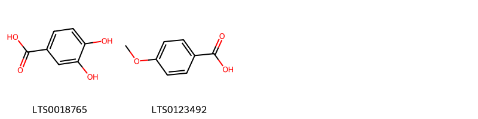
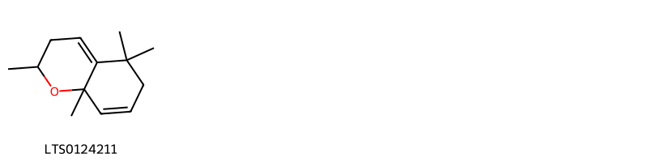
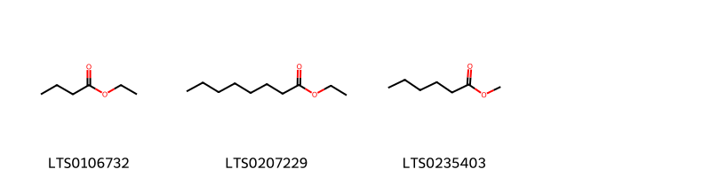
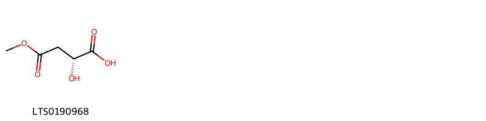
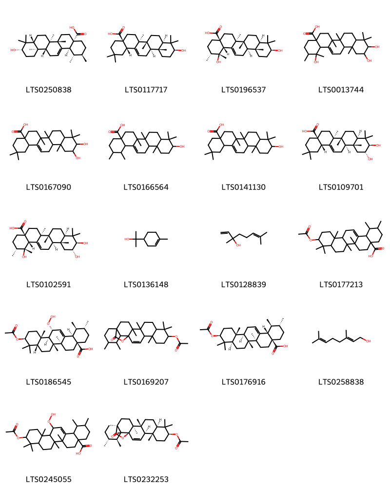
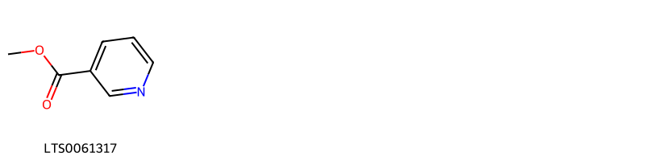
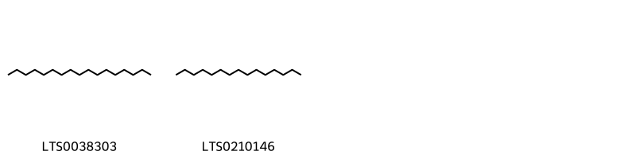

!!! abstract "Tóm tắt"
    Mộc qua có tên khoa học là Chaenomeles speciosa (Sweet) Nakai, bộ phận sử dụng làm thuốc là quả. Đây là loài cây bản địa của Trung Quốc và được di thực đến nhiều nơi trên thế giới. Theo y học cổ truyền, mộc qua được dùng làm thuốc chữa đau nhức thắt lưng, đầu gối, thấp khớp, ho lâu ngày, gân mạch co rút, chuột rút. Mộc qua có tác dụng giảm đau, chống viêm, ngoài ra còn giúp bổ sung vitamin C, B1. Thành phần hóa học chủ yếu của quả mộc qua gồm có Flavonoid, Monosaccharide (glucose, fructose) và các acid hữu cơ (acid citric, acid malic, acid tartaric).

## Thông tin về thực vật

### Đặc điểm thực vật

Dược liệu **Mộc Qua (Quả)** từ bộ phận **nan** từ loài *Chaenomeles speciosa (Sweet) Nakai* thuộc họ Rosaceae. Mộc qua là một cây nhỡ cao 2-3m, cành có gai, dài 5-20mm, đường kính phía gốc của gai tới 1-3mm, mặt cành có những bì không rõ. Lá có cuống dài 3-15mm, phiến lá hình mác dài 2.5cm-11cm, rộng 1,5cm-4cm mép có răng cưa. mặt trên màu xanh, mặt dưới màu tím nhạt, cả hai mặt đều nhẫn. Lá kèm có hình dạng và kích thước thay đổi, dài từ 2-2,5cm, rộng từ 1-1,5cm. mép cũng có răng cưa. Hoa mọc thành chùm ở kẽ lá. Cánh hoa màu đỏ của hoa đào, có loại hoa trắng hay hồng. Cuống hoa rất ngắn. Quả thịt hình cầu hay hình trứng, dài khoảng 8 cm, mặt ngoài nhẵn bóng, màu vàng hay vàng xanh, mùi thơm. Mùa hoa: tháng 3-4, mùa quả: tháng 9-10. 

!!! info "Phân loại thực vật của *Chaenomeles speciosa*"
    - **Kingdom:** Plantae
    - **Phylum:** Tracheophyta
    - **Order:** Rosales
    - **Family:** Rosaceae
    - **Genus:** Chaenomeles
    - **Species:** *Chaenomeles speciosa*

*Tài liệu tham khảo:* "Những cây thuốc và vị thuốc Việt Nam" - Đỗ Tất Lợi

 

### Loài thay thế (Nếu có)

### Phân bố trên thế giới
**Từ vườn thực vật KEW: **: - Bản địa: China North-Central, China South-Central, China Southeast, Tibet, Xinjiang
- Di thực: Alabama, Baltic States, Belarus, Connecticut, District of Columbia, East Himalaya, France, Germany, Great Britain, Illinois, Italy, Japan, Kentucky, Korea, Louisiana, Maryland, Massachusetts, Mexico Southeast, Missouri, New Jersey, New York, New Zealand North, New Zealand South, North Carolina, Ohio, Pennsylvania, Poland, Portugal, Romania, Spain, Switzerland, Tennessee, Ukraine, West Virginia, Wisconsin

**Từ CSDL GIBF** nan, Poland, Belgium, Austria, Australia, Spain, Norway, Chile, Germany, Ireland, Netherlands, Bosnia and Herzegovina, New Zealand, Korea, Republic of, Ukraine, Sweden, Hungary, Greece, Türkiye, United Kingdom of Great Britain and Northern Ireland, Japan, Serbia, Estonia, South Africa, Czechia, Switzerland, United States of America, France, Canada

### Phân bố tại Việt Nam
** "Những cây thuốc và vị thuốc Việt Nam" - Đỗ Tất Lợi**: Mộc qua hiện nay còn phải nhập của Trung Quốc, ở đây cây được trồng ở Hà Nam, Giang Tô, An Huy, Sơn Đông, Triết Giang, Phúc Kiến, Quảng Đông, Tứ Xuyên. Xem vậy ta thấy những vùng nước ta giáp giới với tỉnh Quảng Đông có thể có khả năng trồng được.

**Từ CSDL GIBF**: Không có ghi nhận ở Việt Nam

---

## Thông tin về dược liệu 

### Định danh

!!! info "Thông tin về tên gọi của nan"
    - Dược liệu tiếng Việt: nan
    - Dược liệu tiếng Trung: nan (nan)
    - Dược liệu tiếng Anh: nan
    - Dược liệu latin thông dụng: nan
    - Dược liệu latin kiểu DĐVN: fructus chaenomelis
    - Dược liệu latin kiểu DĐVN: nan
    - Dược liệu latin kiểu thông tư: nan
    - Bộ phận dùng: nan (nan)

### Mô tả dược liệu 
- **Theo dược điển Việt nam V:** nan

- **Mô tả dược liệu theo thông tư chế biến dược liệu theo phương pháp cổ truyền:** nan

### Chế biến 

- **Chế biến theo dược điển việt nam V**: nan

- **Chế biến theo thông tư:** nan

--- 

## Thành phần hóa học

- Theo tài liệu của GS. Đỗ Tất Lợi:  (1) Nhóm hóa học: Trong mộc qua có Flavonoid, Monosaccharide (glucose, fructose), acid hữu cơ (acid citric, acid malic, acid tartaric)
    
- Theo cơ sở dữ liệu lotus: Từ loài *Chaenomeles speciosa* đã phân lập và xác định được 30 hoạt chất thuộc về các nhóm Hydroxy acids and derivatives, Pyridines and derivatives, Organooxygen compounds, Benzopyrans, Prenol lipids, Fatty Acyls, Benzene and substituted derivatives, Saturated hydrocarbons, Flavonoids. 

|    | chemicalTaxonomyClassyfireClass     |   smiles_count |
|---:|:------------------------------------|---------------:|
|  0 | Benzene and substituted derivatives |              2 |
|  1 | Benzopyrans                         |              1 |
|  2 | Fatty Acyls                         |              3 |
|  3 | Flavonoids                          |              1 |
|  4 | Hydroxy acids and derivatives       |              1 |
|  5 | Organooxygen compounds              |              1 |
|  6 | Prenol lipids                       |             18 |
|  7 | Pyridines and derivatives           |              1 |
|  8 | Saturated hydrocarbons              |              2 |

### Nhóm Benzene and substituted derivatives
<figure markdown="span">
    { width=100% }
    <figcaption>Hình ảnh cấu trúc hóa học của 2 hoạt chất thuộc nhóm Benzene and substituted derivatives gồm ['3,4-dihydroxybenzoic acid (LTS0018765)', 'p-anisic acid (LTS0123492)'].</figcaption>
</figure>
### Nhóm Benzopyrans
<figure markdown="span">
    { width=100% }
    <figcaption>Hình ảnh cấu trúc hóa học của 1 hoạt chất thuộc nhóm Benzopyrans gồm ['2,5,5,8a-tetramethyl-3,6-dihydro-2h-1-benzopyran (LTS0124211)'].</figcaption>
</figure>
### Nhóm Fatty Acyls
<figure markdown="span">
    { width=100% }
    <figcaption>Hình ảnh cấu trúc hóa học của 3 hoạt chất thuộc nhóm Fatty Acyls gồm ['ethyl butyrate (LTS0106732)', 'ethyl octanoate (LTS0207229)', 'methyl caproate (LTS0235403)'].</figcaption>
</figure>
### Nhóm Flavonoids
<figure markdown="span">
    { width=100% }
    <figcaption>Hình ảnh cấu trúc hóa học của 1 hoạt chất thuộc nhóm Flavonoids gồm ['quercetin (LTS0004651)'].</figcaption>
</figure>
### Nhóm Hydroxy acids and derivatives
<figure markdown="span">
    { width=100% }
    <figcaption>Hình ảnh cấu trúc hóa học của 1 hoạt chất thuộc nhóm Hydroxy acids and derivatives gồm ['(2r)-2-hydroxy-4-methoxy-4-oxobutanoic acid (LTS0190968)'].</figcaption>
</figure>
### Nhóm Organooxygen compounds
<figure markdown="span">
    { width=100% }
    <figcaption>Hình ảnh cấu trúc hóa học của 1 hoạt chất thuộc nhóm Organooxygen compounds gồm ['hexanal (LTS0238624)'].</figcaption>
</figure>
### Nhóm Prenol lipids
<figure markdown="span">
    { width=100% }
    <figcaption>Hình ảnh cấu trúc hóa học của 18 hoạt chất thuộc nhóm Prenol lipids gồm ['ursolic acid (LTS0250838)', 'oleanolic acid (LTS0117717)', 'pomolic acid (LTS0196537)', '1,10,11-trihydroxy-1,2,6a,6b,9,9,12a-heptamethyl-2,3,4,5,6,7,8,8a,10,11,12,12b,13,14b-tetradecahydropicene-4a-carboxylic acid (LTS0013744)', '10,11-dihydroxy-2,2,6a,6b,9,9,12a-heptamethyl-1,3,4,5,6,7,8,8a,10,11,12,12b,13,14b-tetradecahydropicene-4a-carboxylic acid (LTS0167090)', '10-hydroxy-1,2,6a,6b,9,9,12a-heptamethyl-2,3,4,5,6,7,8,8a,10,11,12,12b,13,14b-tetradecahydro-1h-picene-4a-carboxylic acid (LTS0166564)', 'oleanolic acid (LTS0141130)', 'maslinic acid (LTS0109701)', 'tormentic acid (LTS0102591)', 'terpineol (LTS0136148)', 'linalool, (+-)- (LTS0128839)', '10-(acetyloxy)-1,2,6a,6b,9,9,12a-heptamethyl-2,3,4,5,6,7,8,8a,10,11,12,12b,13,14b-tetradecahydro-1h-picene-4a-carboxylic acid (LTS0177213)', '(1s,2r,4as,6as,6br,8as,10s,12as,12br,13r,14br)-10-(acetyloxy)-13-hydroperoxy-1,2,6a,6b,9,9,12a-heptamethyl-2,3,4,5,6,7,8,8a,10,11,12,12b,13,14b-tetradecahydro-1h-picene-4a-carboxylic acid (LTS0186545)', '4,5,9,9,13,19,20-heptamethyl-23-oxo-24-oxahexacyclo[15.5.2.0¹,¹⁸.0⁴,¹⁷.0⁵,¹⁴.0⁸,¹³]tetracos-15-en-10-yl acetate (LTS0169207)', '(1s,2r,4as,6as,6br,8ar,10s,12ar,12br,14bs)-10-(acetyloxy)-1,2,6a,6b,9,9,12a-heptamethyl-2,3,4,5,6,7,8,8a,10,11,12,12b,13,14b-tetradecahydro-1h-picene-4a-carboxylic acid (LTS0176916)', 'geraniol (LTS0258838)', '10-(acetyloxy)-13-hydroperoxy-1,2,6a,6b,9,9,12a-heptamethyl-2,3,4,5,6,7,8,8a,10,11,12,12b,13,14b-tetradecahydro-1h-picene-4a-carboxylic acid (LTS0245055)', '(1s,4s,5r,8r,10s,13s,14r,17s,18r,19s,20r)-4,5,9,9,13,19,20-heptamethyl-23-oxo-24-oxahexacyclo[15.5.2.0¹,¹⁸.0⁴,¹⁷.0⁵,¹⁴.0⁸,¹³]tetracos-15-en-10-yl acetate (LTS0232253)'].</figcaption>
</figure>
### Nhóm Pyridines and derivatives
<figure markdown="span">
    { width=100% }
    <figcaption>Hình ảnh cấu trúc hóa học của 1 hoạt chất thuộc nhóm Pyridines and derivatives gồm ['heat spray (LTS0061317)'].</figcaption>
</figure>
### Nhóm Saturated hydrocarbons
<figure markdown="span">
    { width=100% }
    <figcaption>Hình ảnh cấu trúc hóa học của 2 hoạt chất thuộc nhóm Saturated hydrocarbons gồm ['heptadecane (LTS0038303)', 'pentadecane (LTS0210146)'].</figcaption>
</figure>

---

## Tác dụng dược lý

Theo tài liệu "Những cây thuốc và vị thuốc Việt Nam" - Đỗ Tất Lợi:- Chữa đau nhức thắt lưng, đầu gối, trị bệnh thấp khớp
- Chữa ho lâu ngày
- Chữa gân mạch co rút, chuột rút
- Chữa bệnh Beri beri do thiếu vitamin B1

Theo tài liệu quốc tế: nan

---

## Dược điển Việt Nam V

### Soi bột:
nan
<!-- Hình ảnh soi bột sẽ được tự động chèn vào đây sau -->
### Vi phẫu:
nan
<!-- Hình ảnh vi phẫu sẽ được tự động chèn vào đây sau -->
### Định tính

nan

### Định lượng

nan

### Thông tin khác 
- ** Độ ẩm: ** nan

- ** Bảo quản:** nan
## Dược điển Hồng kong

<!-- PDF sẽ được tự động chèn vào đây sau -->

---

## Y dược học cổ truyền

- **Tên vị thuốc:** nan
- **Tính vị quy kinh:** Toan, ôn. Vào các kinh tỳ, vị, can, phế
- **Công năng chủ trị:** Bình can dương, thư cân, hòa vị, hóa thấp
Chủ trị: Phong hàn thấp tý, thắt lưng gối nặng nề đau nhức, cân mạch co rút, hoắc loạn, chuột rút, cước khí
- **Chú ý:** nan
- **Kiêng kỵ:** nan

