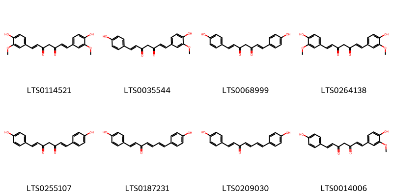
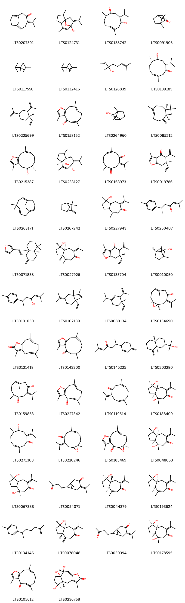

!!! abstract "Tóm tắt"
    **Nga truật (Curcuma zedoaria (Christm.) Roscoe, họ Zingiberaceae)** là cây thân thảo cao 1-1,5m, có thân rễ hình nón, màu vàng nhạt, lá bẹ dài 30-40cm với các đốm đỏ. Cây phân bố rộng rãi ở Ấn Độ, Đông Nam Á (Việt Nam, Thái Lan, Campuchia), và một số khu vực nhiệt đới khác. Trong y học cổ truyền, nga truật được dùng để hành khí, phá huyết, giảm đau, hỗ trợ tiêu hóa, điều trị kinh nguyệt không đều, đầy bụng, đau bụng kinh. Thành phần hóa học chính gồm 1-1,5% tinh dầu (chứa secquitecpen, zingiberen, cineol) cùng 3,5% chất nhựa và chất nhầy, mang lại tác dụng kích thích tiêu hóa và giảm đau hiệu quả.

## Thông tin về thực vật

### Đặc điểm thực vật

Dược liệu **Nga Truật (Thân Rễ)** từ bộ phận **Thân rễ** từ loài *Curcuma zedoaria (Berg.) Roscoe* thuộc họ Zingiberaceae. Nga truật là một loại cỏ cao chừng 1-1,5m, có thân rễ hình nón, có khía chạy dọc, củ toả ra theo hình chân vịt, cây mẫm và chắc. Vỏ cũ màu vàng nhạt, ngoài những củ chính ra, còn có những củ phụ, có cuống hình trứng hay hình quả lê, màu trắng. Lá có bẹ ôm vào thân cây ở phía dưới, dài 30-m, rộng 7-8cm dọc theo gần chính giữa có những đốm màu đỏ, cuống lá ngắn hay hầu như không có. Cụm hoa mọc ngang, dài 15-20cm, thường xuất hiện trước khi ra lá, bao gồm một cuống dài 15-20cm. Lá bắc phía dưới hình trứng hay hình mắc tù, màu xanh lục nhạt, mép đỏ, lá bắc phía trên màu vàng nhạt, đầu lá màu đỏ, không mang hoa. Hoa màu vàng. Đài có thùy hình mác tù, dài 15mm, thuỳ giữa nhọn, cánh môi hẹp ở phía dưới, hơi mở rộng ở phía trên. 

!!! info "Phân loại thực vật của *Curcuma zedoaria*"
    - **Kingdom:** Plantae
    - **Phylum:** Tracheophyta
    - **Order:** Zingiberales
    - **Family:** Zingiberaceae
    - **Genus:** Curcuma
    - **Species:** *Curcuma zedoaria*

*Tài liệu tham khảo:* "Những cây thuốc và vị thuốc Việt Nam" - Đỗ Tất Lợi

 

### Loài thay thế (Nếu có)

### Phân bố trên thế giới
**Từ vườn thực vật KEW: **: Andaman Is., Cambodia, India, Jawa, Lesser Sunda Is., Malaya, Myanmar, Nicobar Is., Thailand, Trinidad-Tobago, Vietnam

**Từ CSDL GIBF** nan, Australia, Myanmar, Norway, Cambodia, unknown or invalid, Germany, Malaysia, Thailand, Brazil, Honduras, Indonesia, India, Panama, Costa Rica, Micronesia (Federated States of), Nicaragua, Colombia, Ecuador, China, Zambia, Philippines, Martinique, Dominican Republic, Trinidad and Tobago, Viet Nam, United States of America, Bangladesh, Chinese Taipei, Venezuela (Bolivarian Republic of), Sri Lanka

### Phân bố tại Việt Nam
** "Những cây thuốc và vị thuốc Việt Nam" - Đỗ Tất Lợi**: Không có thông tin

**Từ CSDL GIBF**: Đà Nẵng, Hồ Chí Minh, Lâm Đồng

---

## Thông tin về dược liệu 

### Định danh

!!! info "Thông tin về tên gọi của nga truật"
    - Dược liệu tiếng Việt: nga truật
    - Dược liệu tiếng Trung: None (None)
    - Dược liệu tiếng Anh: None
    - Dược liệu latin thông dụng: Rhizoma Curcumae zedoariae
    - Dược liệu latin kiểu DĐVN: rhizoma curcumae zedoariae
    - Dược liệu latin kiểu DĐVN: None
    - Dược liệu latin kiểu thông tư: None
    - Bộ phận dùng: Thân rễ (Rhizoma)

### Mô tả dược liệu 
- **Theo dược điển Việt nam V:** 
Thân rễ hình trứng, dài 4 cm đến 6 cm, đường kính 2,5  cm đến 4 cm, mặt ngoài màu nâu, vàng xám đen màu nâu  xám, có những mấu nhô lên, hình vòng, các đốt dài khoảng  3 mm đến 8 mm có nhưng vân nhăn dọc nhỏ, những vết  sẹo của rễ đã loại đi và vết nhô ra của nhánh ngang. Nhìn  qua kính lúp, thấy mặt ngoài thân rễ phủ những lông thô.  Chất rắn như sừng, khó cắt. Mặt cắt ngang màu nâu xám,  có một vòng nâu xám nhạt ở giữa, phân cách trụ dày với  phần vỏ dày 2 mm đến 5 mm. Mùi thơm nhẹ, đặc biệt, vị  mát lạnh, hăng, cay, đắng.

- **Mô tả dược liệu theo thông tư chế biến dược liệu theo phương pháp cổ truyền:** 

### Chế biến 

- **Chế biến theo dược điển việt nam V**: 
Thu hoạch vào mùa đông, khi phần trên mặt đất khô héo.  Đào lấy thân rễ, rửa sạch, đồ chín đến thấu lõi, rồi phơi khô  hoặc sấy khô ờ nhiệt độ thấp, sau đó loại bỏ rễ con và tạp chất. Bào chế Nga truật: Lấy Nga truật khô, ngâm qua, rửa sạch, đồ  mềm, thái lát mỏng, phơi hay sấy khô. Thố Nga truật (chế dấm): Lấy lát Nga truật sạch, tẩm dấm  một đêm, 600 g Nga truật ngâm trong 160 ml dấm, 160 ml  nước, đun đến thấu lõi (cạn chất lỏng), sao đến khô.

- **Chế biến theo thông tư:** 

--- 

## Thành phần hóa học

- Theo tài liệu của GS. Đỗ Tất Lợi:  (1) Trong nga truật có chừng 1-1,5%tinh dầu; 3,5% chất nhựa và chất nhầy. Trong tinh dầu
thành phần chủ yếu gồm có 48% secquitecpen; 35% zingiberen; 9,65 cineol và một chất có tinh thể.
    
- Theo cơ sở dữ liệu lotus: Từ loài *Curcuma zedoaria* đã phân lập và xác định được 127 hoạt chất thuộc về các nhóm Prenol lipids, Diarylheptanoids. 

|    | chemicalTaxonomyClassyfireClass   |   smiles_count |
|---:|:----------------------------------|---------------:|
|  0 | Diarylheptanoids                  |              8 |
|  1 | Prenol lipids                     |            118 |

### Nhóm Diarylheptanoids
<figure markdown="span">
    { width=100% }
    <figcaption>Hình ảnh cấu trúc hóa học của 8 hoạt chất thuộc nhóm Diarylheptanoids gồm ['curcumin (LTS0114521)', 'demethoxycurcumin (LTS0035544)', 'bisdemethoxycurcumin (LTS0068999)', 'turmeric (LTS0264138)', 'bisdemethoxycurcumin (LTS0255107)', '1,7-bis(4-hydroxyphenyl)hepta-1,4,6-trien-3-one (LTS0187231)', '(1e,4e,6e)-1,7-bis(4-hydroxyphenyl)hepta-1,4,6-trien-3-one (LTS0209030)', 'desmethoxycurcumin (LTS0014006)'].</figcaption>
</figure>
### Nhóm Prenol lipids
<figure markdown="span">
    { width=100% }
    <figcaption>Hình ảnh cấu trúc hóa học của 118 hoạt chất thuộc nhóm Prenol lipids gồm ['germacrone (LTS0207391)', 'curcumenol (LTS0124731)', '(6e)-3-isopropyl-6,10-dimethylcyclodec-6-ene-1,4-dione (LTS0138742)', 'camphor (LTS0091905)', 'β-pinene (LTS0117550)', 'α pinene (LTS0132416)', 'linalool, (+-)- (LTS0128839)', '(3r,10s)-3-isopropyl-6,10-dimethylcyclodec-6-ene-1,4-dione (LTS0139185)', 'β-elemene (LTS0225699)', 'furanodienone (LTS0158152)', 'borneol (LTS0264960)', 'caryophyllene (LTS0085212)', 'furanogermenone (LTS0215387)', '(1s,5r,8r)-2,6-dimethyl-9-(propan-2-ylidene)-11-oxatricyclo[6.2.1.0¹,⁵]undec-6-en-8-ol (LTS0233127)', '(6z)-6,10-dimethyl-3-(propan-2-ylidene)cyclodec-6-ene-1,4-dione (LTS0163973)', '(6r)-6-ethenyl-3,6-dimethyl-5-(prop-1-en-2-yl)-5,7-dihydro-1-benzofuran-4-one (LTS0019786)', 'humulene (LTS0263171)', 'camphene (LTS0267242)', '1-hydroxy-1,4-dimethyl-7-(propan-2-ylidene)-3,3a,8,8a-tetrahydro-2h-azulen-6-one (LTS0227943)', 'ar-turmerone (LTS0260407)', '3-{2-[(4ar,8as)-5,5,8a-trimethyl-2-methylidene-hexahydro-1h-naphthalen-1-yl]ethenyl}furan (LTS0071838)', '(1s,3ar,8as)-1-hydroxy-1,4-dimethyl-7-(propan-2-ylidene)-3,3a,8,8a-tetrahydro-2h-azulen-6-one (LTS0027926)', '(6s)-6-ethenyl-3,6-dimethyl-5-(prop-1-en-2-yl)-5,7-dihydro-1-benzofuran-4-one (LTS0135704)', '(2s,4r)-1,7,7-trimethylbicyclo[2.2.1]heptan-2-ol (LTS0010050)', '2-methyl-6-(4-methylphenyl)hept-2-en-4-ol (LTS0101030)', '1-ethenyl-1,2-dimethyl-2-(prop-1-en-2-yl)-4-(propan-2-ylidene)cyclohexane (LTS0102139)', '4-ethenyl-1-isopropyl-4-methyl-3-(prop-1-en-2-yl)cyclohex-1-ene (LTS0080134)', '(1s,6e,10s)-6,10-dimethyl-3-(propan-2-ylidene)-11-oxabicyclo[8.1.0]undec-6-en-4-one (LTS0134690)', 'glechomanolide (LTS0121418)', 'furanodienone (LTS0143300)', '2-methyl-6-(4-methylidenecyclohex-2-en-1-yl)hept-2-en-4-one (LTS0145225)', 'β-eudesmol (LTS0203280)', '(6e,10s)-6,10-dimethyl-3-(propan-2-ylidene)cyclodec-6-ene-1,4-dione (LTS0159853)', 'furanodienone (LTS0227342)', '3,7-dimethyl-10-(propan-2-ylidene)cyclodeca-3,7-dien-1-one (LTS0119514)', '(1r,3as,4s,8ar)-1,4-dihydroxy-1,4-dimethyl-7-(propan-2-ylidene)-hexahydroazulen-6-one (LTS0188409)', '6,10-dimethyl-3-(propan-2-ylidene)cyclodec-6-ene-1,4-dione (LTS0271303)', '6,10-dimethyl-3-(propan-2-ylidene)-11-oxabicyclo[8.1.0]undec-6-en-4-one (LTS0220246)', '(5r,8e)-5,9,14-trimethyl-4,12-dioxatricyclo[9.3.0.0³,⁵]tetradeca-1(11),8,13-trien-2-one (LTS0183469)', '(1s,3as,4s,8as)-1,4-dihydroxy-1,4-dimethyl-7-(propan-2-ylidene)-hexahydroazulen-6-one (LTS0048058)', '1,4-dihydroxy-1,4-dimethyl-7-(propan-2-ylidene)-hexahydroazulen-6-one (LTS0067388)', 'curcumenone (LTS0054071)', '(1r,3as,8ar)-1-hydroxy-1,4-dimethyl-7-(propan-2-ylidene)-3,3a,8,8a-tetrahydro-2h-azulen-6-one (LTS0044379)', '(1s,3as,8as)-1-hydroxy-1,4-dimethyl-7-(propan-2-ylidene)-3,3a,8,8a-tetrahydro-2h-azulen-6-one (LTS0193624)', '1-methyl-4-(6-methylhept-6-en-2-yl)cyclohexa-1,4-diene (LTS0134146)', '(1s,3ar,8as)-1-hydroxy-1-methyl-4-methylidene-7-(propan-2-ylidene)-hexahydroazulen-6-one (LTS0078048)', '1-methyl-7-(3-oxobutyl)-4-(propan-2-ylidene)bicyclo[4.1.0]heptan-3-one (LTS0030394)', '(1r,3ar,4s,8as)-1,4-dihydroxy-1,4-dimethyl-7-(propan-2-ylidene)-hexahydroazulen-6-one (LTS0178595)', 'furanodienone (LTS0105612)', '(4ar,5s,7ar,8r)-5,7a,8-trihydroxy-3,5,8-trimethyl-4h,4ah,6h,7h-azuleno[6,5-b]furan-2-one (LTS0236768)', '(3s,5r,8e)-5,9,14-trimethyl-4,12-dioxatricyclo[9.3.0.0³,⁵]tetradeca-1(11),8,13-trien-2-one (LTS0178198)', '(1s,2s,5s,8r)-2-methyl-6-methylidene-9-(propan-2-ylidene)-11-oxatricyclo[6.2.1.0¹,⁵]undecan-8-ol (LTS0063268)', 'furanogermenone (LTS0218761)', 'bornyl acetate (LTS0060565)', '(1s,3ar,8ar)-1,3a-dihydroxy-1,4-dimethyl-7-(propan-2-ylidene)-2,3,8,8a-tetrahydroazulen-6-one (LTS0209061)', 'curcumenone (LTS0218006)', '13-hydroxygermacrone (LTS0200772)', '1-hydroxy-1-methyl-4-methylidene-7-(propan-2-ylidene)-hexahydroazulen-6-one (LTS0057468)', '(3r,6z,10s)-3-isopropyl-6,10-dimethylcyclodec-6-ene-1,4-dione (LTS0258144)', 'curcumene (LTS0190074)', '(4as,5s,7as,8s,9ar)-5,8-dihydroxy-3,5,8-trimethyl-4h,4ah,6h,7h,7ah,9h,9ah-azuleno[6,5-b]furan-2-one (LTS0060539)', '2-methyl-6-methylidene-9-(propan-2-ylidene)-11-oxatricyclo[6.2.1.0¹,⁵]undecan-8-ol (LTS0270223)', 'bisacurone (LTS0007825)', 'ar-(+/-)-turmerone (LTS0094106)', 'furanodiene (LTS0034115)', 'zederone (LTS0039658)', '(1s,2s)-1-ethenyl-1-methyl-2-(prop-1-en-2-yl)-4-(propan-2-ylidene)cyclohexane (LTS0135613)', '(1s,3ar,4r,8as)-7-isopropyl-1,4-dimethyl-2,3,3a,5,6,8a-hexahydroazulene-1,4-diol (LTS0093037)', '5,7a,8-trihydroxy-3,5,8-trimethyl-4h,4ah,6h,7h-azuleno[6,5-b]furan-2-one (LTS0087391)', '(4as,5s,7as,8s,9as)-5,8-dihydroxy-3,5,8-trimethyl-4h,4ah,6h,7h,7ah,9h,9ah-azuleno[6,5-b]furan-2-one (LTS0098353)', '(1s,3r,4s,5r,11r,12s)-4,5,12-trihydroxy-3,8,12-trimethyl-2,6-dioxatetracyclo[9.3.0.0¹,³.0⁵,⁹]tetradec-8-en-7-one (LTS0260560)', '10-(1-hydroxypropan-2-ylidene)-3,7-dimethylcyclodeca-3,7-dien-1-one (LTS0196745)', 'furanodiene (LTS0176695)', '(5r,6s,9r)-6-methyl-9-(prop-1-en-2-yl)-3-(propan-2-ylidene)-1-oxaspiro[4.4]nonan-2-one (LTS0154162)', 'elemene (LTS0090837)', '(1s,2r,5s,8r)-2,6-dimethyl-9-(propan-2-ylidene)-11-oxatricyclo[6.2.1.0¹,⁵]undec-6-en-8-ol (LTS0086735)', 'zedoarol (LTS0124150)', '6-methyl-5-(3-oxobutyl)-2-(propan-2-ylidene)cyclohept-4-en-1-one (LTS0274596)', '6-methyl-9-(prop-1-en-2-yl)-3-(propan-2-ylidene)-1-oxaspiro[4.4]nonan-2-one (LTS0219848)', '8-hydroxy-3,5,8a-trimethyl-6h,7h,8h,9h-naphtho[2,3-b]furan-4-one (LTS0183582)', '(1s,3as,4s,7r,8as)-1,4-dimethyl-7-(prop-1-en-2-yl)-octahydroazulene-1,4-diol (LTS0203316)', '(1s,2s,5s,8r)-2,6-dimethyl-9-(propan-2-ylidene)-11-oxatricyclo[6.2.1.0¹,⁵]undec-6-en-8-ol (LTS0246687)', '(4as,5r,7as)-7a-methyl-5-(prop-1-en-2-yl)-3-(propan-2-ylidene)-tetrahydro-4h-cyclopenta[b]pyran-2-one (LTS0057341)', '5,8-dihydroxy-3,5,8-trimethyl-4h,4ah,6h,7h,7ah,9h,9ah-azuleno[6,5-b]furan-2-one (LTS0005275)', 'terpinene (LTS0136858)', '(5r,6s,9s)-6-methyl-9-(prop-1-en-2-yl)-3-(propan-2-ylidene)-1-oxaspiro[4.4]nonan-2-one (LTS0018246)', '(4as,5s,7as,8s,9as)-5,8,9a-trihydroxy-3,5,8-trimethyl-4h,4ah,6h,7h,7ah,9h-azuleno[6,5-b]furan-2-one (LTS0019991)', '(-)-β-curcumene (LTS0027873)', '(3e,7e,10e)-10-(1-hydroxypropan-2-ylidene)-3,7-dimethylcyclodeca-3,7-dien-1-one (LTS0124852)', 'furanodienone (LTS0205264)', '(1r,4as,6r,8ar)-8a-methyl-4-methylidene-6-(prop-1-en-2-yl)-octahydronaphthalen-1-ol (LTS0114619)', '(8r)-1,5,8-trimethyl-6h,7h,8h-naphtho[2,1-b]furan-9-one (LTS0194349)', '(4as,5s,7as)-7a-methyl-5-(prop-1-en-2-yl)-3-(propan-2-ylidene)-tetrahydro-4h-cyclopenta[b]pyran-2-one (LTS0214028)', '(4as,5s,8s,8as)-5,8-dihydroxy-3,5,8a-trimethyl-4ah,6h,7h,8h,9h-naphtho[2,3-b]furan-4-one (LTS0079744)', '(3r,4r,5s,7r)-7-hydroxy-5,10-dimethyl-4-(3-oxobutyl)-8-oxatricyclo[5.3.0.0³,⁵]dec-1-en-9-one (LTS0210021)', '(4ar,5r,8r,8ar)-5,8-dihydroxy-3,5,8a-trimethyl-4ah,6h,7h,8h,9h-naphtho[2,3-b]furan-4-one (LTS0149375)', '5,8-dihydroxy-3,5,8a-trimethyl-4ah,6h,7h,8h,9h-naphtho[2,3-b]furan-4-one (LTS0181156)', '(8s)-1,5,8-trimethyl-6h,7h,8h-naphtho[2,1-b]furan-9-one (LTS0061468)', '(4as,5r,8s,8as)-5,8-dihydroxy-3,5,8a-trimethyl-4ah,6h,7h,8h,9h-naphtho[2,3-b]furan-4-one (LTS0103822)', '(3r,4r,5s,7r)-5,10-dimethyl-4-(3-oxobutyl)-8-oxatricyclo[5.3.0.0³,⁵]dec-1(10)-en-9-one (LTS0121928)', '(5s,6s)-6-ethenyl-3,6-dimethyl-5-(prop-1-en-2-yl)-5,7-dihydro-1-benzofuran-4-one (LTS0146427)', '(3r,4r,5s,7s)-5,10-dimethyl-4-(3-oxobutyl)-8-oxatricyclo[5.3.0.0³,⁵]dec-1(10)-en-9-one (LTS0154174)', '6-ethyl-5-isopropyl-3,6-dimethyl-5,7-dihydro-1-benzofuran-4-one (LTS0121242)', '(1s,4s,6r,7r)-4-(2-hydroxypropan-2-yl)-1-methyl-7-(3-oxobutyl)bicyclo[4.1.0]heptan-3-one (LTS0167630)', '(3r,5r,8e)-5,9,14-trimethyl-4,12-dioxatricyclo[9.3.0.0³,⁵]tetradeca-1(11),8,13-trien-2-one (LTS0267586)', '8,9-dihydroxy-5,9,14-trimethyl-4,12-dioxatricyclo[9.3.0.0³,⁵]tetradeca-1(11),13-dien-2-one (LTS0185036)', '(3s,5r,8r,9r)-8,9-dihydroxy-5,9,14-trimethyl-4,12-dioxatricyclo[9.3.0.0³,⁵]tetradeca-1(11),13-dien-2-one (LTS0259258)', '(8s,8as)-8-hydroxy-3,5,8a-trimethyl-6h,7h,8h,9h-naphtho[2,3-b]furan-4-one (LTS0204636)', '6-ethenyl-3,6-dimethyl-5-(prop-1-en-2-yl)-5,7-dihydro-1-benzofuran-4-one (LTS0211566)', 'β-farnesene (LTS0067925)', '1,4-dimethyl-7-(prop-1-en-2-yl)-octahydroazulene-1,4-diol (LTS0032265)', '(1s,4r,6r,7r)-4-(2-hydroxypropan-2-yl)-1-methyl-7-(3-oxobutyl)bicyclo[4.1.0]heptan-3-one (LTS0044665)', 'pyrocurzerenone (LTS0134811)', '4a-hydroxy-3,5-dimethyl-8-methylidene-5h,6h,7h,7ah,9h-azuleno[6,5-b]furan-4-one (LTS0246619)', '(5s,6r)-6-ethyl-5-isopropyl-3,6-dimethyl-5,7-dihydro-1-benzofuran-4-one (LTS0013505)', '(1s,2s,8r)-2,6-dimethyl-9-(propan-2-ylidene)-11-oxatricyclo[6.2.1.0¹,⁵]undec-5-en-8-ol (LTS0237364)', 'dehydrocurdione (LTS0020226)', '1,5,8-trimethyl-6h,7h,8h-naphtho[2,1-b]furan-9-one (LTS0087691)'].</figcaption>
</figure>

---

## Tác dụng dược lý

Theo tài liệu "Những cây thuốc và vị thuốc Việt Nam" - Đỗ Tất Lợi:- Chữa ngực bụng đau, ăn uống không tiêu. Giúp sự tiêu hoá, chữa đau bụng, kích thích, bổ.
- Chữa ho, kinh nguyệt bế không đều.

Theo tài liệu quốc tế: 

---

## Dược điển Việt Nam V

### Soi bột:

Màu vàng nâu, mùi thơm nhẹ, vị hăng cay, đắng. Soi kính  hiển vi thấy: Mảnh mô mềm gồm những tế bào có thành  mỏng chứa các hạt tinh bột đã bị hồ hỏa. Nhiều hạt tinh bột  đơn bị hồ hóa không còn nhìn rõ vân và rốn. Mảnh mạch  xoăn, mạch vạch. Bó sợi nhỏ. nn

<!-- Hình ảnh soi bột sẽ được tự động chèn vào đây sau -->
### Vi phẫu:

Mặt cát ngang thân rễ: Một số lớp vỏ bao (chu bì), lớp vỏ rộng. hóa gỗ, có những bó mạch nhỏ và to nằm rải rác. Lớp  tương tự nội bì gồm các tế bào thành mỏng. Kế tiếp là một đám những bó mạch không đều, tập trung sát trung trụ gần  như tạo thành vòng tròn. Trong mô mềm rải rác có những  tế bào chứa tanin và những ống dầu to, dễ thấy. Tế bào mô  mềm chứa đây những hạt tinh bột đơn, hạt tinh bột có rốn  dạng điểm lệch tâm.nn

<!-- Hình ảnh vi phẫu sẽ được tự động chèn vào đây sau -->
### Định tính

### Định lượng

Định lượng Tiến hành theo phương pháp định lượng tinh dầu trong  dược liệu (Phụ lục 12.7). Hàm lượng tinh dầu không được  ít hơn 1,0 % tính theo dược liệu khô kiệt.

### Thông tin khác 
- ** Độ ẩm: ** 
Không quá 13,0 % (Phụ lục 12.13). Dùng 10 g bột dược liệu.

- ** Bảo quản:** 
Để nơi khô, tránh mọt.nn

## Dược điển Hồng kong

<!-- PDF sẽ được tự động chèn vào đây sau -->

---

## Y dược học cổ truyền

- **Tên vị thuốc:** Nga truật
- **Tính vị quy kinh:** Khổ, tân, ôn. Vào các kinh can, tỳ.
- **Công năng chủ trị:** Hành khí, phá huyết, chỉ thống, tiêu tích.
Chủ trị: Kinh nguyệt huyết khối, bế kinh, đau bụng kinh, bụng đầy trướng đau do thực tích khí trệ.
- **Chú ý:** 
- **Kiêng kỵ:** 
Phụ nữ có thai không nên dùng. Cơ thể hư yếu sau khi sinh có tích trệ không nên dùng,  muốn dùng phải phối hợp với Nhân sâm, Bạch truật.nn

