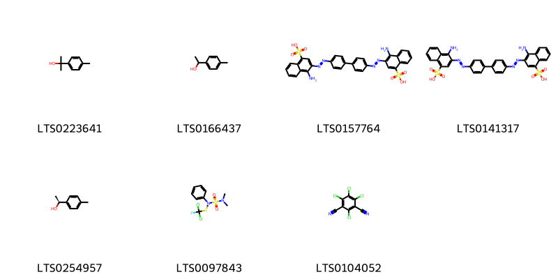
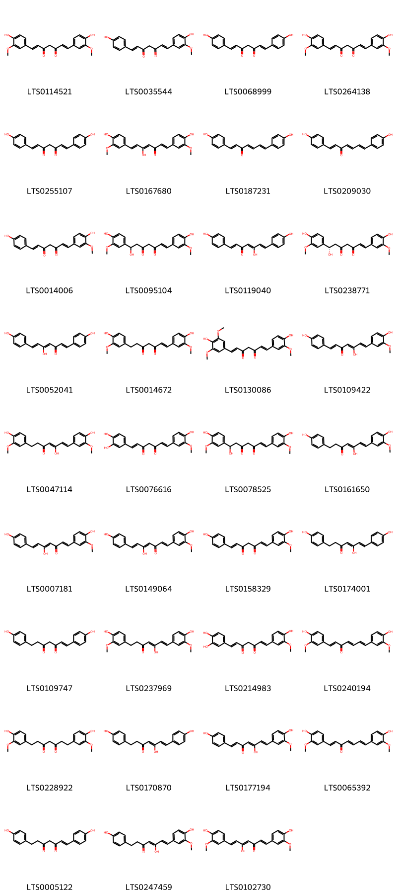
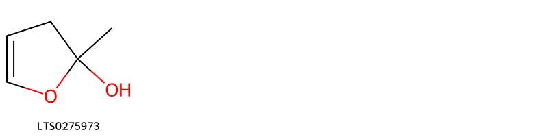
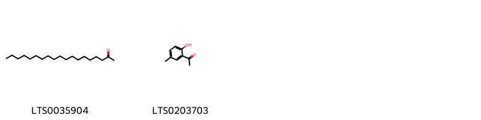
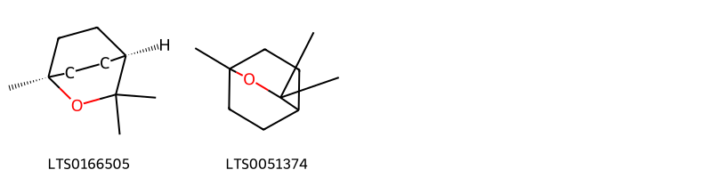
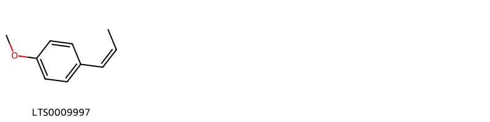
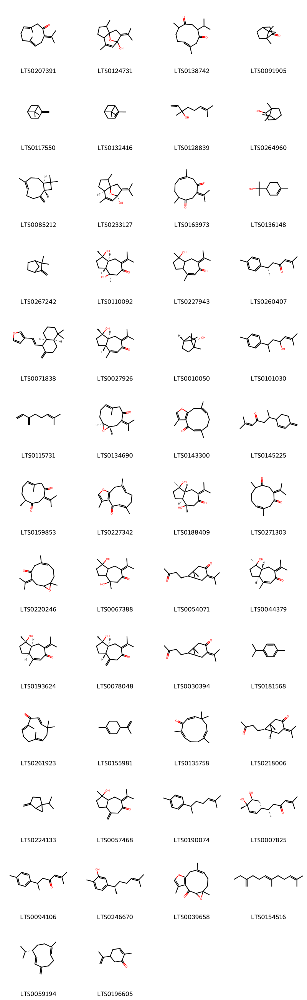

!!! abstract "Tóm tắt"
    Nghệ (Curcuma longa L.) là một loài cây thân thảo thuộc họ Gừng (Zingiberaceae), có nguồn gốc từ Ấn Độ và sau đó di thực sang nhiều nước trên khắp thế giới. Tại Việt Nam, nghệ được trồng ở khắp nơi trong nước ta để làm gia vị và làm thuốc.
         Theo tài liệu cổ, nghệ thường được dùng trong bệnh đau dạ dày, vàng da, phụ nữ sinh nở xong đau bụng. Theo kinh nghiệm sử dụng dân gian, nhân dân còn dùng nghệ bôi lên các mụn mới khỏi để đỡ sẹo, nhuộm vàng bột cary, nhuộm len, nhuộm tơ, nhuộm da; nghệ cũng được sử dụng trong nhiều đơn thuốc như chữa thổ huyết máu cam, chữa điên cuồng hay cao dán nhọt,…. Trong kháng chiến chống Mỹ, chúng ta dùng nghệ trong điều trị ngoại khoa: bột nghệ bó xương, gãy hở, trị vết trầy, rách âm đạo sau sinh. Rượu nghệ rửa vết thương trị sưng đau, viêm khớp; nước nghệ trị bỏng; dầu nghệ trị vết thương nhiễm trùng, viêm tử cung, lở cổ tử cung. 
         Các nghiên cứu hiện đại cũng đã chỉ ra rằng nghệ có tác dụng thông mật, làm tăng sự bài tiết mật của các tế bào gan và phá cholesterol trong máu. Tinh dầu nghệ có tác dụng diệt nấm và sát trùng đối với bệnh nấm, với Staphylcoc và vi trùng khác. Bên cạnh đó, nghệ còn làm tăng cơ năng giải độc gan, giảm lượng galactoza đối với bệnh nhân bị galactoza niệu, giảm lượng urobilin tăng trong nước tiểu và làm tăng lượng nước mật trong tá tràng. Dùng nghệ trong những bệnh về gan và đường mật thì thấy chóng hết đau. Các nhà nghiên cứu cũng đã chứng minh được tác dụng kháng sinh của nghệ. Ngoài ra, cũng đã phát hiện tiêm tinh nghệ có khả năng thấm qua các màng tế bào đặc biệt là vỏ sáp khuẩn lao và hủi, nó giúp cho chất màu xâm nhập vào trong các tế bảo này. Tuy nhiên, cần đặc biệt chú ý đến độc tính của tinh dầu nghệ.
         Thành phần hoá học chính trong nghệ là curcumin, một hợp chất có tác dụng kháng viêm, chống oxy hóa và hỗ trợ các chức năng gan. Ngoài curcumin, nghệ còn chứa tinh dầu màu vàng nhạt, trong tinh dầu có curcumen, paratolylmetyl cacbinol và long não hữu tuyến. Ngoài ra còn tinh bột, canxi oxalat, chất béo.
         Thân rễ nghệ có vị cay đắng, mùi thơm hắc, tính ấm, có tác dụng hành khí, phá huyết, thông kinh, chỉ thống, sinh cơ. Kiêng kỵ đối với người cơ thể suy nhược, không có ứ trệ, phụ nữ có thai không nên dùng.

## Thông tin về thực vật

### Đặc điểm thực vật

Dược liệu **Nghệ (Thân Rễ)** từ bộ phận **Thân rễ** từ loài *Curcuma longa L.* thuộc họ Zingiberaceae. Nghệ là một loại cỏ cao 0,60m đến 1m. Thân rễ thành củ hình trụ hoặc hơi dẹt, khi bẻ hoặc cắt ngang có màu vàng cam sẫm. Lá hình trái xoan thon nhọn ở hai đầu, hai mặt đều nhẫn dài tới 45cm, rộng tới 18cm. Cuống lá có bẹ. Cụm hoa mọc từ giữa các lá lên, thành hình nón thưa, lá bắc hữu thụ khum hình mảng rộng, đầu tròn màu xanh lục nhạt, lá bắc bất thụ hẹp hơn, màu hơi tím nhạt. Tràng có phiến, cánh hoa ngoài màu xanh lục vàng nhạt, chia thành ba thùy, thùy trên to hơn, phiến cánh hoa trong cũng chia ba thùy, 2 thùy hai bên đứng và phẳng, thùy dưới hõm thành mảng sâu. Quả nang 3 ngăn, mở bằng 3 vạn. 
      Hạt có áo hạt. 

!!! info "Phân loại thực vật của *Curcuma longa*"
    - **Kingdom:** Plantae
    - **Phylum:** Tracheophyta
    - **Order:** Zingiberales
    - **Family:** Zingiberaceae
    - **Genus:** Curcuma
    - **Species:** *Curcuma longa*

*Tài liệu tham khảo:* "Những cây thuốc và vị thuốc Việt Nam" - Đỗ Tất Lợi

 

### Loài thay thế (Nếu có)

### Phân bố trên thế giới
**Từ vườn thực vật KEW: **: Native to (Bản địa): 
India

Introduced into (Di thực):
Andaman Is., Assam, Bangladesh, Belize, Borneo, Cambodia, Caroline Is., China South-Central, China Southeast, Comoros, Congo, Cook Is., Costa Rica, Cuba, Dominican Republic, East Himalaya, Easter Is., Fiji, Gilbert Is., Guinea-Bissau, Gulf of Guinea Is., Haiti, Hawaii, Ivory Coast, Jawa, Leeward Is., Lesser Sunda Is., Malaya, Marquesas, Mauritius, Myanmar, New Caledonia, New Guinea, Nicobar Is., Philippines, Pitcairn Is., Puerto Rico, Queensland, Réunion, Samoa, Society Is., Solomon Is., Sri Lanka, Sumatera, Taiwan, Thailand, Tibet, Tonga, Trinidad-Tobago, Tuamotu, Tubuai Is., Vanuatu, Vietnam, Windward Is.

**Từ CSDL GIBF** Réunion, Mauritius, Australia, Myanmar, Puerto Rico, New Caledonia, Cambodia, Côte d’Ivoire, Malaysia, Pakistan, Thailand, Bhutan, Guadeloupe, Brazil, Singapore, Indonesia, Hong Kong, India, Lao People’s Democratic Republic, Panama, Costa Rica, Micronesia (Federated States of), French Polynesia, Mayotte, French Guiana, El Salvador, Philippines, Martinique, Guam, Nepal, Viet Nam, Switzerland, United States of America, Bangladesh, Chinese Taipei, Sri Lanka, Barbados

### Phân bố tại Việt Nam
** "Những cây thuốc và vị thuốc Việt Nam" - Đỗ Tất Lợi**: Được trồng ở khắp nơi trong nước ta để làm gia vị và làm thuốc.

**Từ CSDL GIBF**: Không có ghi nhận ở Việt Nam

---

## Thông tin về dược liệu 

### Định danh

!!! info "Thông tin về tên gọi của nghệ"
    - Dược liệu tiếng Việt: nghệ
    - Dược liệu tiếng Trung: 姜黄 (Jiang Huang)
    - Dược liệu tiếng Anh: Curcuma Longa
    - Dược liệu latin thông dụng: Rhizoma Curcumae longaenCurcumae Longae Rhizoma
    - Dược liệu latin kiểu DĐVN: rhizoma curcumae longae
    - Dược liệu latin kiểu DĐVN: Curcumae Longae Rhizoma
    - Dược liệu latin kiểu thông tư: None
    - Bộ phận dùng: Thân rễ (Rhizoma)

### Mô tả dược liệu 
- **Theo dược điển Việt nam V:** 
Thân rễ hình trụ, thẳng hoặc hơi cong, đôi khi phân nhánh  ngắn dạng chữ Y, dài 2 cm đến 5 cm, đường kính 1 cm  đen 3 cm. Mặt ngoài màu xám nâu, nhăn nheo, có những  đường vòng ngang sít nhau, đôi khi còn vết tích của các  nhánh và rễ. Mặt cắt ngang thấy rõ 2 vùng vỏ và trụ giữa;  trụ giữa chiếm gần 2/3 đường kính. Chất chắc và nặng.  Mặt  bẻ bóng, có màu vàng  cam. Mùi thơm hắc,  vị  hơi  đắng, hơi cay.

- **Mô tả dược liệu theo thông tư chế biến dược liệu theo phương pháp cổ truyền:** 

### Chế biến 

- **Chế biến theo dược điển việt nam V**: 
Đào lấy thân rễ, phơi khô, cũng có thể đồ hoặc hấp trong  6 h đến 12 h rồi đem phơi hoặc sấy khô. Bào chế Rửa sạch, ngâm 2 h đến 3 h, ủ mềm, thái lát mỏng, phơi khô.  Ngâm trong đồng tiện 3 ngày 3 đêm (ngày thay đồng tiện  một lần), thái lát, phơi khô, sao vàng (hành huyết).

- **Chế biến theo thông tư:** 

--- 

## Thành phần hóa học

- Theo tài liệu của GS. Đỗ Tất Lợi:  (1) Nhóm hoá học: 
- Chất màu curcumin 0,3%
- Tinh dầu 1-5%
- Ngoài ra: tinh bột, canxi oxalat, chất béo
(2) Biomaker: 
- Curcuminoid
- Tinh dầu
    
- Theo cơ sở dữ liệu lotus: Từ loài *Curcuma longa* đã phân lập và xác định được 198 hoạt chất thuộc về các nhóm Dihydrofurans, Oxanes, Organooxygen compounds, Diarylheptanoids, Steroids and steroid derivatives, Prenol lipids, Fatty Acyls, Benzene and substituted derivatives, Coumarins and derivatives, Phenols, Phenol ethers, Unsaturated hydrocarbons, Cinnamic acids and derivatives. 

|    | chemicalTaxonomyClassyfireClass     |   smiles_count |
|---:|:------------------------------------|---------------:|
|  0 | Benzene and substituted derivatives |              7 |
|  1 | Cinnamic acids and derivatives      |             13 |
|  2 | Coumarins and derivatives           |              1 |
|  3 | Diarylheptanoids                    |             35 |
|  4 | Dihydrofurans                       |              1 |
|  5 | Fatty Acyls                         |              7 |
|  6 | Organooxygen compounds              |              2 |
|  7 | Oxanes                              |              2 |
|  8 | Phenol ethers                       |              1 |
|  9 | Phenols                             |              5 |
| 10 | Prenol lipids                       |            112 |
| 11 | Steroids and steroid derivatives    |              2 |
| 12 | Unsaturated hydrocarbons            |              1 |

### Nhóm Benzene and substituted derivatives
<figure markdown="span">
    { width=100% }
    <figcaption>Hình ảnh cấu trúc hóa học của 7 hoạt chất thuộc nhóm Benzene and substituted derivatives gồm ['p-cymen-8-ol (LTS0223641)', '1-p-tolylethanol (LTS0166437)', "4-amino-3-[(1e)-2-{4'-[(1e)-2-(1-amino-4-sulfonaphthalen-2-yl)diazen-1-yl]-[1,1'-biphenyl]-4-yl}diazen-1-yl]naphthalene-1-sulfonic acid (LTS0157764)", "4-amino-3-(2-{4'-[2-(1-amino-4-sulfonaphthalen-2-yl)diazen-1-yl]-[1,1'-biphenyl]-4-yl}diazen-1-yl)naphthalene-1-sulfonic acid (LTS0141317)", '(-)-1-p-tolylethanol (LTS0254957)', 'dichlofluanid (LTS0097843)', 'chlorothalonil (LTS0104052)'].</figcaption>
</figure>
### Nhóm Cinnamic acids and derivatives
<figure markdown="span">
    { width=100% }
    <figcaption>Hình ảnh cấu trúc hóa học của 13 hoạt chất thuộc nhóm Cinnamic acids and derivatives gồm ['para-coumaric acid (LTS0266252)', '(1e,6e)-1-(4-hydroxy-3-methoxyphenyl)-7-(4-hydroxy-5-methoxycyclohexa-1,3-dien-1-yl)hepta-1,6-diene-3,5-dione (LTS0066166)', 'ferulic acid (LTS0077328)', '(3e)-4-(4-hydroxy-3-methoxyphenyl)-2-oxobut-3-en-1-yl (2e)-3-(4-hydroxyphenyl)prop-2-enoate (LTS0225118)', '(3e)-4-(4-hydroxy-3-methoxyphenyl)-2-oxobut-3-en-1-yl (2e)-3-(4-hydroxy-3-methoxyphenyl)prop-2-enoate (LTS0224419)', '4-(4-hydroxy-3-methoxyphenyl)-2-oxobut-3-en-1-yl 3-(4-hydroxy-3-methoxyphenyl)prop-2-enoate (LTS0092351)', 'dehydrozingerone (LTS0197654)', '4-(4-hydroxyphenyl)-2-oxobut-3-en-1-yl 3-(4-hydroxy-3-methoxyphenyl)prop-2-enoate (LTS0258065)', '(3e)-4-(4-hydroxyphenyl)-2-oxobut-3-en-1-yl (2e)-3-(4-hydroxy-3-methoxyphenyl)prop-2-enoate (LTS0183357)', '1,5-bis(4-hydroxy-3-methoxyphenyl)penta-1,4-dien-3-one (LTS0234564)', '4-(4-hydroxy-3-methoxyphenyl)-2-oxobut-3-en-1-yl 3-(4-hydroxyphenyl)prop-2-enoate (LTS0236468)', '(1e)-1-(4-hydroxy-3-methoxyphenyl)dec-1-ene-3,5-dione (LTS0020912)', '(1e,4e)-1,5-bis(4-hydroxy-3-methoxyphenyl)penta-1,4-dien-3-one (LTS0117555)'].</figcaption>
</figure>
### Nhóm Coumarins and derivatives
<figure markdown="span">
    { width=100% }
    <figcaption>Hình ảnh cấu trúc hóa học của 1 hoạt chất thuộc nhóm Coumarins and derivatives gồm ['2h-1-benzopyran-2-one (LTS0069773)'].</figcaption>
</figure>
### Nhóm Diarylheptanoids
<figure markdown="span">
    { width=100% }
    <figcaption>Hình ảnh cấu trúc hóa học của 35 hoạt chất thuộc nhóm Diarylheptanoids gồm ['curcumin (LTS0114521)', 'demethoxycurcumin (LTS0035544)', 'bisdemethoxycurcumin (LTS0068999)', 'turmeric (LTS0264138)', 'bisdemethoxycurcumin (LTS0255107)', 'tumeric (LTS0167680)', '1,7-bis(4-hydroxyphenyl)hepta-1,4,6-trien-3-one (LTS0187231)', '(1e,4e,6e)-1,7-bis(4-hydroxyphenyl)hepta-1,4,6-trien-3-one (LTS0209030)', 'desmethoxycurcumin (LTS0014006)', '7-hydroxy-1,7-bis(4-hydroxy-3-methoxyphenyl)hept-1-ene-3,5-dione (LTS0095104)', '(1e,4z,6e)-5-hydroxy-1,7-bis(4-hydroxyphenyl)hepta-1,4,6-trien-3-one (LTS0119040)', '(1e,7s)-7-hydroxy-1,7-bis(4-hydroxy-3-methoxyphenyl)hept-1-ene-3,5-dione (LTS0238771)', '5-hydroxy-1,7-bis(4-hydroxyphenyl)hepta-1,4,6-trien-3-one (LTS0052041)', 'dihydrocurcumin (LTS0014672)', '(1e,6e)-1-(4-hydroxy-3,5-dimethoxyphenyl)-7-(4-hydroxy-3-methoxyphenyl)hepta-1,6-diene-3,5-dione (LTS0130086)', '(1e,4z,6e)-5-hydroxy-7-(4-hydroxy-3-methoxyphenyl)-1-(4-hydroxyphenyl)hepta-1,4,6-trien-3-one (LTS0109422)', '(4z,6e)-5-hydroxy-1,7-bis(4-hydroxy-3-methoxyphenyl)hepta-4,6-dien-3-one (LTS0047114)', 'monodemethylcurcumin (LTS0076616)', '(1e)-7-hydroxy-1,7-bis(4-hydroxy-3-methoxyphenyl)hept-1-ene-3,5-dione (LTS0078525)', '5-hydroxy-7-(4-hydroxy-3-methoxyphenyl)-1-(4-hydroxyphenyl)hepta-4,6-dien-3-one (LTS0161650)', '(1e,4z,6e)-5-hydroxy-1-(4-hydroxy-3-methoxyphenyl)-7-(4-hydroxyphenyl)hepta-1,4,6-trien-3-one (LTS0007181)', '5-hydroxy-1-(4-hydroxy-3-methoxyphenyl)-7-(4-hydroxyphenyl)hepta-1,4,6-trien-3-one (LTS0149064)', '(6e)-7-(4-hydroxy-3-methoxyphenyl)-1-(4-hydroxyphenyl)hepta-1,6-diene-3,5-dione (LTS0158329)', '5-hydroxy-1,7-bis(4-hydroxyphenyl)hepta-4,6-dien-3-one (LTS0174001)', '(1e)-1,7-bis(4-hydroxyphenyl)hept-1-ene-3,5-dione (LTS0109747)', '5-hydroxy-1,7-bis(4-hydroxy-3-methoxyphenyl)hepta-4,6-dien-3-one (LTS0237969)', '1-(3,4-dihydroxyphenyl)-7-(4-hydroxy-3-methoxyphenyl)hepta-1,6-diene-3,5-dione (LTS0214983)', '1,7-bis(4-hydroxy-3-methoxyphenyl)hepta-1,4,6-trien-3-one (LTS0240194)', 'tetrahydrocurcumin (LTS0228922)', '(4z,6e)-5-hydroxy-1,7-bis(4-hydroxyphenyl)hepta-4,6-dien-3-one (LTS0170870)', '5-hydroxy-7-(4-hydroxy-3-methoxyphenyl)-1-(4-hydroxyphenyl)hepta-1,4,6-trien-3-one (LTS0177194)', '(1e,4e,6e)-1,7-bis(4-hydroxy-3-methoxyphenyl)hepta-1,4,6-trien-3-one (LTS0065392)', '1,7-bis(4-hydroxyphenyl)hept-1-ene-3,5-dione (LTS0005122)', '(4z,6e)-5-hydroxy-7-(4-hydroxy-3-methoxyphenyl)-1-(4-hydroxyphenyl)hepta-4,6-dien-3-one (LTS0247459)', '5-hydroxy-1,7-bis(4-hydroxy-3-methoxyphenyl)hepta-1,4,6-trien-3-one (LTS0102730)'].</figcaption>
</figure>
### Nhóm Dihydrofurans
<figure markdown="span">
    { width=100% }
    <figcaption>Hình ảnh cấu trúc hóa học của 1 hoạt chất thuộc nhóm Dihydrofurans gồm ['2-methyl-3h-furan-2-ol (LTS0275973)'].</figcaption>
</figure>
### Nhóm Fatty Acyls
<figure markdown="span">
    { width=100% }
    <figcaption>Hình ảnh cấu trúc hóa học của 7 hoạt chất thuộc nhóm Fatty Acyls gồm ['palmitic acid (LTS0079439)', 'tricosanoic acid (LTS0260192)', 'stearic acid (LTS0237766)', 'citronellyl valerate (LTS0064039)', 'hexadecenoate (LTS0191907)', 'myristic acid (LTS0102566)', '9-hexadecenoic acid (LTS0166766)'].</figcaption>
</figure>
### Nhóm Organooxygen compounds
<figure markdown="span">
    { width=100% }
    <figcaption>Hình ảnh cấu trúc hóa học của 2 hoạt chất thuộc nhóm Organooxygen compounds gồm ['2-nonadecanone (LTS0035904)', '2-acetyl-4-methylphenol (LTS0203703)'].</figcaption>
</figure>
### Nhóm Oxanes
<figure markdown="span">
    { width=100% }
    <figcaption>Hình ảnh cấu trúc hóa học của 2 hoạt chất thuộc nhóm Oxanes gồm ['1,8-cineole (LTS0166505)', 'eucalyptol (LTS0051374)'].</figcaption>
</figure>
### Nhóm Phenol ethers
<figure markdown="span">
    { width=100% }
    <figcaption>Hình ảnh cấu trúc hóa học của 1 hoạt chất thuộc nhóm Phenol ethers gồm ['(e)-anethole (LTS0009997)'].</figcaption>
</figure>
### Nhóm Phenols
<figure markdown="span">
    { width=100% }
    <figcaption>Hình ảnh cấu trúc hóa học của 5 hoạt chất thuộc nhóm Phenols gồm ['vanillin (LTS0136163)', '(6s)-6-(4-hydroxy-3-methylphenyl)-2-methylhept-2-en-4-one (LTS0137194)', '6-(4-hydroxy-3-methylphenyl)-2-methylhept-2-en-4-one (LTS0156145)', '(6s)-6-(4-hydroxyphenyl)-2-methylhept-2-en-4-one (LTS0225461)', '6-(4-hydroxyphenyl)-2-methylhept-2-en-4-one (LTS0258939)'].</figcaption>
</figure>
### Nhóm Prenol lipids
<figure markdown="span">
    { width=100% }
    <figcaption>Hình ảnh cấu trúc hóa học của 112 hoạt chất thuộc nhóm Prenol lipids gồm ['germacrone (LTS0207391)', 'curcumenol (LTS0124731)', '(6e)-3-isopropyl-6,10-dimethylcyclodec-6-ene-1,4-dione (LTS0138742)', 'camphor (LTS0091905)', 'β-pinene (LTS0117550)', 'α pinene (LTS0132416)', 'linalool, (+-)- (LTS0128839)', 'borneol (LTS0264960)', 'caryophyllene (LTS0085212)', '(1s,5r,8r)-2,6-dimethyl-9-(propan-2-ylidene)-11-oxatricyclo[6.2.1.0¹,⁵]undec-6-en-8-ol (LTS0233127)', '(6z)-6,10-dimethyl-3-(propan-2-ylidene)cyclodec-6-ene-1,4-dione (LTS0163973)', 'terpineol (LTS0136148)', 'camphene (LTS0267242)', '(1s,3ar,4r,8as)-1,4-dihydroxy-1,4-dimethyl-7-(propan-2-ylidene)-hexahydroazulen-6-one (LTS0110092)', '1-hydroxy-1,4-dimethyl-7-(propan-2-ylidene)-3,3a,8,8a-tetrahydro-2h-azulen-6-one (LTS0227943)', 'ar-turmerone (LTS0260407)', '3-{2-[(4ar,8as)-5,5,8a-trimethyl-2-methylidene-hexahydro-1h-naphthalen-1-yl]ethenyl}furan (LTS0071838)', '(1s,3ar,8as)-1-hydroxy-1,4-dimethyl-7-(propan-2-ylidene)-3,3a,8,8a-tetrahydro-2h-azulen-6-one (LTS0027926)', '(2s,4r)-1,7,7-trimethylbicyclo[2.2.1]heptan-2-ol (LTS0010050)', '2-methyl-6-(4-methylphenyl)hept-2-en-4-ol (LTS0101030)', 'α-myrcene (LTS0115731)', '(1s,6e,10s)-6,10-dimethyl-3-(propan-2-ylidene)-11-oxabicyclo[8.1.0]undec-6-en-4-one (LTS0134690)', 'furanodienone (LTS0143300)', '2-methyl-6-(4-methylidenecyclohex-2-en-1-yl)hept-2-en-4-one (LTS0145225)', '(6e,10s)-6,10-dimethyl-3-(propan-2-ylidene)cyclodec-6-ene-1,4-dione (LTS0159853)', 'furanodienone (LTS0227342)', '(1r,3as,4s,8ar)-1,4-dihydroxy-1,4-dimethyl-7-(propan-2-ylidene)-hexahydroazulen-6-one (LTS0188409)', '6,10-dimethyl-3-(propan-2-ylidene)cyclodec-6-ene-1,4-dione (LTS0271303)', '6,10-dimethyl-3-(propan-2-ylidene)-11-oxabicyclo[8.1.0]undec-6-en-4-one (LTS0220246)', '1,4-dihydroxy-1,4-dimethyl-7-(propan-2-ylidene)-hexahydroazulen-6-one (LTS0067388)', 'curcumenone (LTS0054071)', '(1r,3as,8ar)-1-hydroxy-1,4-dimethyl-7-(propan-2-ylidene)-3,3a,8,8a-tetrahydro-2h-azulen-6-one (LTS0044379)', '(1s,3as,8as)-1-hydroxy-1,4-dimethyl-7-(propan-2-ylidene)-3,3a,8,8a-tetrahydro-2h-azulen-6-one (LTS0193624)', '(1s,3ar,8as)-1-hydroxy-1-methyl-4-methylidene-7-(propan-2-ylidene)-hexahydroazulen-6-one (LTS0078048)', '1-methyl-7-(3-oxobutyl)-4-(propan-2-ylidene)bicyclo[4.1.0]heptan-3-one (LTS0030394)', 'cymene (LTS0181568)', 'zerumbone (LTS0261923)', 'limonene,  (LTS0155981)', '2,6,9,9-tetramethylcycloundeca-2,6,10-trien-1-one (LTS0135758)', 'curcumenone (LTS0218006)', 'sabinene (LTS0224133)', '1-hydroxy-1-methyl-4-methylidene-7-(propan-2-ylidene)-hexahydroazulen-6-one (LTS0057468)', 'curcumene (LTS0190074)', 'bisacurone (LTS0007825)', 'ar-(+/-)-turmerone (LTS0094106)', '2-methyl-5-[(2r)-6-methylhept-5-en-2-yl]phenol (LTS0246670)', 'zederone (LTS0039658)', '(6e)-2,6-dimethyl-10-methylidenedodeca-2,6-diene (LTS0154516)', '(-)-germacrene d (LTS0059194)', 'carvone (LTS0196605)', 'bisacurone (LTS0109576)', '(r)-β-bisabolene (LTS0077209)', 'β-sesquiphellandrene (LTS0106193)', 'terpinolene (LTS0104525)', '3-[(2s)-6-methylhept-5-en-2-yl]-6-methylidenecyclohex-1-ene (LTS0195839)', 'monoterpenes (LTS0106881)', '(-)-α-curcumene (LTS0216936)', '(1z,6z,8s)-8-isopropyl-1-methyl-5-methylidenecyclodeca-1,6-diene (LTS0065195)', '2-methyl-6-(4-methylcyclohexa-2,4-dien-1-yl)hept-2-en-4-one (LTS0010618)', '(3r,5s,8e)-5,9,14-trimethyl-4,12-dioxatricyclo[9.3.0.0³,⁵]tetradeca-1(11),8,13-trien-2-one (LTS0147972)', '2-methyl-6-(4-methylcyclohexa-1,4-dien-1-yl)hept-2-en-4-one (LTS0013558)', '(6s)-2-methyl-6-[(1r)-4-methylidenecyclohex-2-en-1-yl]hept-2-en-4-one (LTS0014383)', '(1s,3as,8ar)-1,8a-dihydroxy-1,4-dimethyl-7-(propan-2-ylidene)-2,3,3a,8-tetrahydroazulen-6-one (LTS0016771)', '(6r)-2-methyl-6-(4-methylphenyl)hept-2-en-4-one (LTS0128619)', '(-)-β-bisabolene (LTS0009940)', '(4r,6s)-2-methyl-6-(4-methylphenyl)hept-2-en-4-ol (LTS0131383)', 'carvone, (+)- (LTS0027671)', 'caryophyllane (LTS0175300)', 'menthofuran (LTS0026526)', 'zingiberene (LTS0085287)', '6-(3-hydroxy-4-methylphenyl)-2-methylhept-2-en-4-one (LTS0094180)', '6-(2-hydroxy-4-methylphenyl)-2-methylhept-2-en-4-one (LTS0083415)', '(1s,2s,5r)-2-methyl-5-[(2s)-6-methylhept-5-en-2-yl]cyclohex-3-ene-1,2-diol (LTS0080300)', '3,9-epoxy-p-mentha-3,8-diene (LTS0035633)', '(+)-sabinene (LTS0110694)', '2-[(1e,3z,7z)-4,8-dimethyl-10-oxocyclodeca-3,7-dien-1-ylidene]propanal (LTS0095743)', 'turmerone (LTS0181864)', '2-methyl-5-[(2s)-6-methylhept-5-en-2-yl]cyclohexa-1,3-diene (LTS0030348)', '2-[(1e,3e,7e)-4,8-dimethyl-10-oxocyclodeca-3,7-dien-1-ylidene]propanal (LTS0118092)', '(6s)-6-(2-hydroxy-4-methylphenyl)-2-methylhept-2-en-4-one (LTS0275269)', '(6s)-6-(3-hydroxy-4-methylphenyl)-2-methylhept-2-en-4-one (LTS0259482)', '(5r,6r)-5-hydroxy-2-methyl-6-(4-methylphenyl)hept-2-en-4-one (LTS0167394)', '6-(4-hydroxy-4-methylcyclohex-2-en-1-yl)-2-methylhept-2-en-4-one (LTS0164215)', 'citronella (LTS0151257)', '(6s)-3-methyl-6-[(2s)-6-methyl-4-oxohept-5-en-2-yl]cyclohex-2-en-1-one (LTS0163392)', '(z)-γ-bisabolene (LTS0143321)', 'phellandrene (LTS0157173)', '2-(4,8-dimethyl-10-oxocyclodeca-3,7-dien-1-ylidene)propanal (LTS0145134)', '(6s,7r,10s)-7-isopropyl-4,10-dimethyltricyclo[4.4.0.0¹,⁵]dec-3-ene (LTS0137587)', '2-methyl-5-(6-methylhept-5-en-2-yl)cyclohex-3-ene-1,2-diol (LTS0168784)', '(-)-cis-sabinol (LTS0271116)', '2-methyl-5-(6-methylhept-5-en-2-yl)cyclohex-2-ene-1,4-diol (LTS0255120)', '(2z)-2-{2-[(1s,4as,8as)-5,5,8a-trimethyl-2-methylidene-hexahydro-1h-naphthalen-1-yl]ethylidene}butanedial (LTS0126231)', 'α-bergamotene (LTS0226115)', '1,8a-dihydroxy-1,4-dimethyl-7-(propan-2-ylidene)-2,3,3a,8-tetrahydroazulen-6-one (LTS0094315)', '(6s)-6-[(1r,4r)-4-hydroxy-4-methylcyclohex-2-en-1-yl]-2-methylhept-2-en-4-one (LTS0220112)', '3-methyl-6-(6-methyl-4-oxohept-5-en-2-yl)cyclohex-2-en-1-one (LTS0055851)', '(+)-α-phellandrene (LTS0234318)', '(5z)-2-methyl-6-[(1r)-4-methylcyclohex-3-en-1-yl]hepta-2,5-dien-4-one (LTS0199672)', '(+)-borneol (LTS0059936)', '4-(6-methyl-4-oxohept-5-en-2-yl)benzaldehyde (LTS0235015)', '(1r,4s,5s)-2-methyl-5-[(2s)-6-methylhept-5-en-2-yl]cyclohex-2-ene-1,4-diol (LTS0174004)', '3-methyl-6-(6-methylhept-5-en-2-yl)cyclohex-2-en-1-one (LTS0012155)', 'caryophyllene (LTS0131870)', 'd-camphor (LTS0002057)', '4-[(2s)-6-methyl-4-oxohept-5-en-2-yl]benzaldehyde (LTS0019562)', 'nerol (LTS0244289)', '(6s)-2-methyl-6-[(1r)-4-methylcyclohexa-2,4-dien-1-yl]hept-2-en-4-one (LTS0031450)', '(1r,2s,5r,8s)-2,6-dimethyl-9-(propan-2-ylidene)-11-oxatricyclo[6.2.1.0¹,⁵]undec-6-en-8-ol (LTS0071564)', '(6s)-3-methyl-6-[(2s)-6-methylhept-5-en-2-yl]cyclohex-2-en-1-one (LTS0039821)', '(6r)-3-methyl-6-[(2s)-6-methylhept-5-en-2-yl]cyclohex-2-en-1-one (LTS0111849)', '5-hydroxy-2-methyl-6-(4-methylphenyl)hept-2-en-4-one (LTS0107081)'].</figcaption>
</figure>
### Nhóm Steroids and steroid derivatives
<figure markdown="span">
    { width=100% }
    <figcaption>Hình ảnh cấu trúc hóa học của 2 hoạt chất thuộc nhóm Steroids and steroid derivatives gồm ['phytosterol (LTS0029311)', 'stigmasterol (LTS0024262)'].</figcaption>
</figure>
### Nhóm Unsaturated hydrocarbons
<figure markdown="span">
    { width=100% }
    <figcaption>Hình ảnh cấu trúc hóa học của 1 hoạt chất thuộc nhóm Unsaturated hydrocarbons gồm ['α terpinene (LTS0232891)'].</figcaption>
</figure>

---

## Tác dụng dược lý

Theo tài liệu "Những cây thuốc và vị thuốc Việt Nam" - Đỗ Tất Lợi:- Tăng sự bài tiết mật của các tế bào gan, có tác dụng thông mật (co bóp túi mật); Phá cholesterol trong máu. 
- Diệt nấm và sát trùng đối với bệnh nấm, với Staphylcoc và vi trùng khác.
- Tăng cơ năng giải độc gan.
- Giảm lượng galactoza đối với bệnh nhân bị galactoza niệu.
- Giảm lượng urobilin tăng trong nước tiểu. 
- Đối với sự tiết nước mật: Cho nước nghệ vào tá tràng làm lượng nước mật trong tá tràng tăng lên. 
- Dùng nghệ trong những bệnh về gan và đường mật thì thấy chóng hết đau.
- Tác dụng kháng sinh. 
- Độc tính của tinh dầu nghệ. 
- Tác dụng khác: Tiêm tinh nghệ có khả năng thấm qua các màng tế bào đặc biệt là vỏ sáp khuẩn lao và hủi, nó giúp cho chất màu xâm nhập vào trong các tế bảo này.

Theo tài liệu quốc tế: To eliminate blood stasis, promote the flow of qi, stimulate menstrual discharge and relieve pain.

---

## Dược điển Việt Nam V

### Soi bột:

Mảnh mô mềm gồm những tế bào thành mỏng chứa các  hạt tinh bột. Nhiều hạt tinh bột hình trứng dài 12 µm đến  50 µm, rộng 8 µm đến 21 µm, có vân đồng tâm và rốn lệch  tâm. Tế bào chứa tinh dầu và nhựa tạo thành những đám  lổn nhổn màu vàng. Mảnh mạch mạng và mạch vạch.

<!-- Hình ảnh soi bột sẽ được tự động chèn vào đây sau -->
### Vi phẫu:

Tiêu bản mới cắt, chưa nhuộm tẩy thấy rõ lớp bần dày,  gồm nhiều hàng tế bào dẹt, trong đó rãi rác có những tế  bào màu vàng hoặc xanh xám, phía ngoài rãi rác còn có lông đơn bào dài. Mô mềm vỏ gồm những tế bào tròn to,  thành mỏng, chứa hạt tinh bột (dược liệu đã đồ chín thì  tinh bột ở trạng thái hồ) và rải rác trong mô mềm còn có  tế bào tiết tinh dầu màu vàng và các bó libe-gỗ nhỏ. Nội  bì và trụ bì rõ. Mô mềm ruột có cấu tạo giống mô mềm  vỏ. Trong mô mềm ruột có những bó libe-gỗ rải rác nhiều  hơn, một số bó tập trung sát trụ bì, gần như tạo thành một  vòng tròn. nn

<!-- Hình ảnh vi phẫu sẽ được tự động chèn vào đây sau -->
### Định tính

A. Lắc 0,5 g bột dược liệu với 3 ml ethanol 90 % (TT), để lắng. Nhỏ 3 đen 4 giọt dịch chiết ethanol lên giấy lọc.  Để khô, trên giấy lọc còn lại vết màu vàng. Tiếp tục nhỏ  từng giọt  dung dịch acid boric 5 % (TT) rồi  dung dịch  acid hydrocloric loãng (TT), làm như vậy vài lần và hơ  nóng nhẹ cho khô, vết vàng sẽ chuyển thành màu đỏ. Sau  đó thêm 3 giọt dung dịch amoniac 10 % (TT), sẽ tiếp tục  chuyển sang màu xanh đen. B. Quan sát dưới ánh sáng tử ngoại 366 nm, bột dược liệu có huỳnh quang màu vàng tươi. C. Phương pháp sắc ký lớp mỏng (Phụ lục 5,4). Bản mỏng: Silica gel G. Dung môi triển khai: Cloroform – acid acetic (9 : 1). Dung dịch thử: Lấy 0,1 g bột dược liệu cho vào cốc thủy  tinh, thêm 5 ml methanol (TT), đun tới sôi rồi để nguội,  lọc, lấy dịch lọc làm dung dịch thử. Dung dịch đối chiếu: Hòa tan curcumin chuẩn trong methanol  (TT) để được dung dịch nồng độ khoảng 0,3 mg/ml. Nếu  không có curcumin chuẩn, dùng 0,1 g bột Nghệ (mẫu chuẩn)  chiết như mô tả ở phần Dung dịch thử. Cách tiến hành: Chấm riêng biệt lên bản mỏng 25 µl mỗi  dung dịch trên. Triển khai sẩc ký đến khi dung môi đi được  khoảng 10 cm, lấy bản mỏng ra, để khô ở nhiệt độ phòng,  phun hỗn hợp gồm 15 ml dung dịch acid boric 3 % (TT)  và 5 ml dung dịch acid oxalic 10 % (TT), đã trộn kỹ. Quan  sát dưới ánh sáng thường. Trên sắc ký đồ, dung dịch thử phải có các vết (3 vết) cùng  màu sắc và giá trị Rf với 3 vết của curcumin chuẩn hoặc  có các vết cùng màu sắc và giá trị Rf với các vết trên sắc  ký đồ của dung dịch đối chiếu.

### Định lượng

Chất chiết được trong dược liệu Không ít hơn 12,0 % tính theo dược liệu khô kiệt. Tiến hành theo phương pháp chiết lạnh (Phụ lục 12.10).  Dùng ethanol 50 % (TT) làm dung môi. Định lượng A.Định lượng tinh dầu (Phụ lục 12.7). Lấy chính xác khoảng 30 g dược liệu đã tán thành bột thô vào bình cầu có dung tích 300 ml của bộ dụng cụ dùng định lượng tinh dầu trong dược liệu. Thêm 150 ml nước,  tiến hành cất trong 3 h. Hàm lượng tinh dầu không ít hơn 4.0 % tính theo dược liệu khô kiệt. B. Đinh lượng curcuminoid: Phương pháp đo quang phổ hấp thụ tử ngoại và khả kiến  (Phụ lục 4.1). Dung dịch chuẩn gốc: Hòa tan curcumin chuẩn trong  meihanol (TT) đổ được dung dịch có nồng độ chính xác  khoáng 400 µg/ml. Lập đường chuẩn: Từ dung dịch chuẩn gốc tiến hành pha  dãy dung dịch curcumin chuẩn trong  methanol (TT) có  nồng độ lần lượt là 0,8; 1,6; 2,0; 2,4 và 3,2 µg/ml. Đo  độ hấp thụ của các dung dịch trên tại bước sóng 420 nm,  dùng mẫu trắng là methanol (TT). Từ kết quả thu được lập  đường chuẩn biểu thị sự liên quan giữa nồng độ curcumin  và độ hấp thụ. Dung dịch thử: Cân chính xác khoảng 300 mg bột thô dược  liệu, cho vào bình định mức 10 ml, thêm  tetrahydrofuran  (TT), trộn đều và pha loãng tới vạch bằng cùng dung môi.  Để ở nhiệt độ phòng trong 24 h, thỉnh thoảng lắc. Để lắng,  lấy chính xác 1 ml dịch trong ở phía trên vào bình định mức 25.0 ml, thêm methanol (TT) đến vạch, lắc đều. Pha loãng 1.0 ml dung dịch thu được thành 50,0 ml bằng methanol  (TT) và đo độ hấp thụ của dung dịch tại bước sóng 420 nm,  mẫu trắng là methanol (TT). Dựa vào đường chuẩn đã lập ở trên và kết quả thu được, tính hàm lượng curcumin trong  dung dịch thử và trong dược liệu. Dược liệu phải chứa không ít hơn 5,0 % curcuminoid tính  theo curcumin, tính theo dược liệu khô kiệt.

### Thông tin khác 
- ** Độ ẩm: ** 
Không quá 12,0 % (Phụ lục 12.13).

- ** Bảo quản:** 
Nơi khô, trong bao bì kín, tránh bay mất tinh dầu. cần  phơi sấy luôn để tránh mốc, mọt.nn

## Dược điển Hồng kong

<!-- PDF sẽ được tự động chèn vào đây sau -->

---

## Y dược học cổ truyền

- **Tên vị thuốc:** Nghệ
- **Tính vị quy kinh:** Tân, khô ôn. Vào các kinh can tỳ.
- **Công năng chủ trị:** Hành khí, phá huyết, chỉ thống, sinh cơ. 
Chủ trị: Kinh nguyệt không đều, bế kinh, đau tức sườn ngực, khó thở. Phụ nữ đau bụng sau đẻ do máu xấu không sạch, kết hòn cục, hoặc ứ huyết do sang chấn; viêm loét dạ dày; vết thương lâu liền miệng.
- **Chú ý:** 
- **Kiêng kỵ:** 
Cơ thể suy nhược, không có ứ trệ, không nên dùngnn

