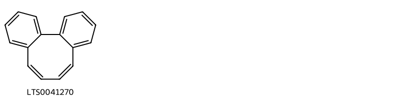
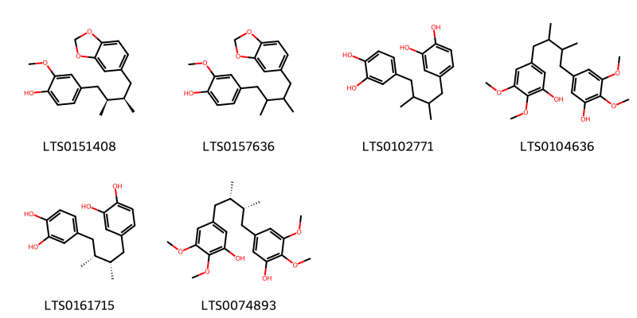
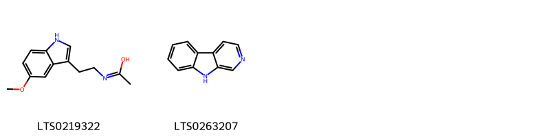
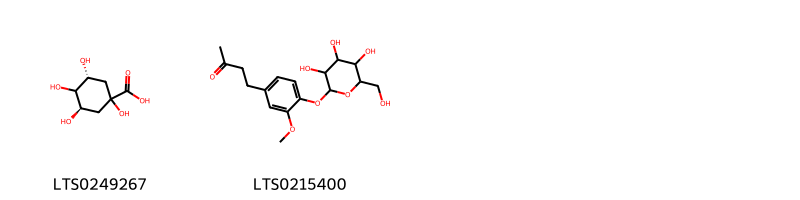

!!! abstract "Tóm tắt"
    Ngũ vị tử (Schisandra chinensis), thuộc họ Ngũ vị (Schisandraceae), là một loài cây dây leo có nguồn gốc từ các vùng ôn đới ở Đông Á, bao gồm Trung Quốc, Nga và Nhật Bản. Loài này cũng mọc ở một số tỉnh miền núi phía Bắc Việt Nam như Lào Cai, Nghệ An, và Hà Tĩnh. Quả của cây ngũ vị tử, còn gọi là "ngũ vị tử", có màu đỏ sẫm khi chín và chứa 1-2 hạt. Thành phần hóa học của ngũ vị tử bao gồm lignans (schisandrin, schisandrol), triterpenoids, vitamin A, C, E, và polysaccharides như arabinogalactans. Trong y học cổ truyền, ngũ vị tử có tác dụng bổ thận, kích thích hệ thần kinh cơ, tăng cường sức đề kháng và chống mệt mỏi. Nó được sử dụng trong điều trị các bệnh lý như ho lâu ngày, mệt mỏi, di tinh, mộng tinh, và các rối loạn liên quan đến thận và phế. Các tác dụng dược lý khác bao gồm chống viêm, giảm đau và an thần.

## Thông tin về thực vật

### Đặc điểm thực vật

Dược liệu **Ngũ Vị Tử ( Quả)** từ bộ phận **nan** từ loài *Schisandra chinensis (Turcz.) Baill* thuộc họ Schisandraceae. Cây bắc ngũ vị tử Schizandra sinensis Baill. là một loại dây leo to, có thể mọc dài tới 8m, vỏ cành màu xám nâu với kẻ sần nổi rõ, cành nhỏ hơi có cạnh. Lá mọc so le, cuống lá nhỏ, dài 1,5-3cm, phiến lá hình trứng rộng, dài 5-11cm,rộng 3-7cm, mép  có răng cưa nhỏ, mặt trên sẫm hơn, gân lá non thường có lông ngắn. Hoa đơn khác gốc, cánh hoa màu vàng trắng nhạt, có mùi thơm, cánh hoa 6-9, nhị 5, quả mọng hình cầu, đường kính 5-7mm, khi chín có màu đỏ sẫm, trong chứa 1 đến 2 hạt. Tại Trung Quốc mùa hoa 5-7, mùa quả 8-9.
Cây nam ngũ vị tử theo tài liệu (Trung được chí, tập 2-1959) thì cũng là một loài Schizandra sphenanthera Rehd, et Wils. cùng họ, hình thái gần giống cây bắc ngũ vị tử nhưng khác nhau ở chỗ hoa bắc ngũ vị tử chỉ có 5 nhị còn cây nam ngũ vị tử có tới 10-15 nhị.
Tuy nhiên theo nhiều tài liệu trước thì nam ngũ vị tử được khai thác ở những loài Kadsura japonica L. (Trung Quốc được dụng thực vật đồ giám-1960), Kadsura longepedunculata Fin. et Gagnep. (Quảng Châu thực vật chỉ 1956) hoặc Kadsura japonica Dun. (Thực vật học đại từ điển-Trung Quốc) (Hình 666, Hm 29,2).
Ở đây chúng tôi chỉ mô tả một loài Kadsura có ở nước ta là Kadsura coccinea A. C. Sum. (còn có tên khác là Kadsura sinensis Hance hay Schizandra hanceana Baill.): Đây là một loài dây leo với cành phân nhiều nhánh, gáy, trên mặt phủ lớp phấn bài tiết, về sau trở thành kế sản dài. Lá mọc so le, hình mác với phía cuống hơi tròn, dài 6-19cm, rộng 3-4cm, mặt dưới màu nhạt, nhẵn. Hoa đơn tính, mọc ở kẽ lá dài 15mm, rộng 10mm, màu tía. Quả giống như một nắm cơm (do đó có tên cây nắm cơm) hay như một quả na to. Tên lào là repa-ropo hay xung-xe.
Mặc dầu có ở nước ta nhưng chưa thấy khai thác. 

!!! info "Phân loại thực vật của *Schisandra chinensis*"
    - **Kingdom:** Plantae
    - **Phylum:** Tracheophyta
    - **Order:** Austrobaileyales
    - **Family:** Schisandraceae
    - **Genus:** Schisandra
    - **Species:** *Schisandra chinensis*

*Tài liệu tham khảo:* "Những cây thuốc và vị thuốc Việt Nam" - Đỗ Tất Lợi

 

### Loài thay thế (Nếu có)

### Phân bố trên thế giới
**Từ vườn thực vật KEW: **: Phạm vi bản địa của loài này là từ Viễn Đông Nga đến Bắc Trung Quốc và miền Trung Nhật Bản. phát triển chủ yếu ở quần xã sinh vật ôn đới

**Từ CSDL GIBF** Belgium, Korea, Republic of, Viet Nam, China, Belarus, Japan, Chinese Taipei, Latvia, Russian Federation

### Phân bố tại Việt Nam
** "Những cây thuốc và vị thuốc Việt Nam" - Đỗ Tất Lợi**: có mọc ở Lào Cai (Sa Pa), Nghệ An, Hà Tĩnh, Quảng Bình, Quảng Trị, Thừa Thiên, Lào, nhưng chưa ai thấy lại
Tóm lại vị ngũ vị tử hiện nay hoàn toàn còn phải nhập

**Từ CSDL GIBF**: Không có ghi nhận ở Việt Nam

---

## Thông tin về dược liệu 

### Định danh

!!! info "Thông tin về tên gọi của nan"
    - Dược liệu tiếng Việt: nan
    - Dược liệu tiếng Trung: nan (nan)
    - Dược liệu tiếng Anh: nan
    - Dược liệu latin thông dụng: nan
    - Dược liệu latin kiểu DĐVN: fructus schisandrae chinemis
    - Dược liệu latin kiểu DĐVN: nan
    - Dược liệu latin kiểu thông tư: nan
    - Bộ phận dùng: nan (nan)

### Mô tả dược liệu 
- **Theo dược điển Việt nam V:** nan

- **Mô tả dược liệu theo thông tư chế biến dược liệu theo phương pháp cổ truyền:** nan

### Chế biến 

- **Chế biến theo dược điển việt nam V**: nan

- **Chế biến theo thông tư:** nan

--- 

## Thành phần hóa học

- Theo tài liệu của GS. Đỗ Tất Lợi:  (1)
Lignans: schisandrin, schisandrol, và schisandrin B
Acid hữu cơ: axit citric và axit malic
Triterpenoids
Vitamin A, C, E
Polysaccharides: Arabinogalactans, Glycoprotein polysaccharides

(2)
Dược điển Việt Nam: deoxyschisandrin
    
- Theo cơ sở dữ liệu lotus: Từ loài *Schisandra chinensis* đã phân lập và xác định được 134 hoạt chất thuộc về các nhóm Harmala alkaloids, Dibenzylbutane lignans, Tannins, Organooxygen compounds, Alkylhalophosphines, Steroids and steroid derivatives, Prenol lipids, Benzene and substituted derivatives, Indoles and derivatives, Amaryllidaceae alkaloids, Carboxylic acids and derivatives, Fatty Acyls, Furofurans, Unsaturated hydrocarbons, Cinnamic acids and derivatives, Flavonoids. 

|    | chemicalTaxonomyClassyfireClass     |   smiles_count |
|---:|:------------------------------------|---------------:|
|  0 |                                     |              1 |
|  1 | Alkylhalophosphines                 |              1 |
|  2 | Amaryllidaceae alkaloids            |              1 |
|  3 | Benzene and substituted derivatives |              3 |
|  4 | Carboxylic acids and derivatives    |              4 |
|  5 | Cinnamic acids and derivatives      |              2 |
|  6 | Dibenzylbutane lignans              |              6 |
|  7 | Fatty Acyls                         |              2 |
|  8 | Flavonoids                          |              2 |
|  9 | Furofurans                          |              2 |
| 10 | Harmala alkaloids                   |              1 |
| 11 | Indoles and derivatives             |              2 |
| 12 | Organooxygen compounds              |              2 |
| 13 | Prenol lipids                       |             14 |
| 14 | Steroids and steroid derivatives    |              3 |
| 15 | Tannins                             |             83 |
| 16 | Unsaturated hydrocarbons            |              3 |

### Nhóm 
<figure markdown="span">
    { width=100% }
    <figcaption>Hình ảnh cấu trúc hóa học của 1 hoạt chất thuộc nhóm  gồm ['tricyclo[10.4.0.0²,⁷]hexadeca-1(16),2,4,6,8,10,12,14-octaene (LTS0041270)'].</figcaption>
</figure>
### Nhóm Alkylhalophosphines
<figure markdown="span">
    { width=100% }
    <figcaption>Hình ảnh cấu trúc hóa học của 1 hoạt chất thuộc nhóm Alkylhalophosphines gồm ['dichloro(cyclohexyl)phosphane (LTS0069821)'].</figcaption>
</figure>
### Nhóm Amaryllidaceae alkaloids
<figure markdown="span">
    { width=100% }
    <figcaption>Hình ảnh cấu trúc hóa học của 1 hoạt chất thuộc nhóm Amaryllidaceae alkaloids gồm ['9-hydroxy-4-methyl-11,16,18-trioxa-4-azapentacyclo[11.7.0.0²,¹⁰.0³,⁷.0¹⁵,¹⁹]icosa-1(20),13,15(19)-trien-12-one (LTS0112481)'].</figcaption>
</figure>
### Nhóm Benzene and substituted derivatives
<figure markdown="span">
    { width=100% }
    <figcaption>Hình ảnh cấu trúc hóa học của 3 hoạt chất thuộc nhóm Benzene and substituted derivatives gồm ['3,4-dihydroxybenzoic acid (LTS0018765)', 'methyl 4-fluoro-3-phenoxybenzoate (LTS0251721)', '2-methyl-1-phenylprop-2-en-1-ol (LTS0234819)'].</figcaption>
</figure>
### Nhóm Carboxylic acids and derivatives
<figure markdown="span">
    { width=100% }
    <figcaption>Hình ảnh cấu trúc hóa học của 4 hoạt chất thuộc nhóm Carboxylic acids and derivatives gồm ['1-hydroxy-9,9,18-trimethyl-18-[2-methyl-3-(4-methyl-5-oxofuran-2-ylidene)propanoyl]-4,8,15-trioxapentacyclo[11.7.0.0³,⁷.0³,¹⁰.0¹⁴,¹⁹]icosane-5,16-dione (LTS0145187)', 'methylcitric acid (LTS0161307)', '(1s,3r,7r,10s,13r,14s,18r,19r)-1-hydroxy-9,9,18-trimethyl-18-[(2r)-2-methyl-3-[(2z)-4-methyl-5-oxofuran-2-ylidene]propanoyl]-4,8,15-trioxapentacyclo[11.7.0.0³,⁷.0³,¹⁰.0¹⁴,¹⁹]icosane-5,16-dione (LTS0263749)', '(1s,3r,7r,10s,13r,14s,18r,19r)-1-hydroxy-9,9,18-trimethyl-18-[(2s)-2-methyl-3-[(2z)-4-methyl-5-oxofuran-2-ylidene]propanoyl]-4,8,15-trioxapentacyclo[11.7.0.0³,⁷.0³,¹⁰.0¹⁴,¹⁹]icosane-5,16-dione (LTS0033263)'].</figcaption>
</figure>
### Nhóm Cinnamic acids and derivatives
<figure markdown="span">
    { width=100% }
    <figcaption>Hình ảnh cấu trúc hóa học của 2 hoạt chất thuộc nhóm Cinnamic acids and derivatives gồm ['cinnamic acid (LTS0128130)', 'phenylacrylic acid (LTS0097258)'].</figcaption>
</figure>
### Nhóm Dibenzylbutane lignans
<figure markdown="span">
    { width=100% }
    <figcaption>Hình ảnh cấu trúc hóa học của 6 hoạt chất thuộc nhóm Dibenzylbutane lignans gồm ['macelignan (LTS0151408)', 'macelignan (LTS0157636)', 'nordihydroguaiaretic acid (LTS0102771)', '5-[4-(3-hydroxy-4,5-dimethoxyphenyl)-2,3-dimethylbutyl]-2,3-dimethoxyphenol (LTS0104636)', 'masoprocol (LTS0161715)', 'pregomisin (LTS0074893)'].</figcaption>
</figure>
### Nhóm Fatty Acyls
<figure markdown="span">
    { width=100% }
    <figcaption>Hình ảnh cấu trúc hóa học của 2 hoạt chất thuộc nhóm Fatty Acyls gồm ['2,3-dihydroxypropyl 12-hydroxyoctadecanoate (LTS0052924)', 'sorbic acid (LTS0175104)'].</figcaption>
</figure>
### Nhóm Flavonoids
<figure markdown="span">
    { width=100% }
    <figcaption>Hình ảnh cấu trúc hóa học của 2 hoạt chất thuộc nhóm Flavonoids gồm ['quercetin (LTS0004651)', 'kaempherol (LTS0155822)'].</figcaption>
</figure>
### Nhóm Furofurans
<figure markdown="span">
    { width=100% }
    <figcaption>Hình ảnh cấu trúc hóa học của 2 hoạt chất thuộc nhóm Furofurans gồm ['1-hydroxy-18-[1-hydroxy-1-(4-methyl-5-oxo-2h-furan-2-yl)propan-2-yl]-9,9,19-trimethyl-4,8,15-trioxahexacyclo[11.8.0.0³,⁷.0³,¹⁰.0¹⁴,¹⁶.0¹⁴,¹⁹]henicosan-5-one (LTS0142301)', '(1s,3r,7r,10s,13r,14r,16s,18r,19r)-1-hydroxy-18-[(1s,2s)-1-hydroxy-1-[(2s)-4-methyl-5-oxo-2h-furan-2-yl]propan-2-yl]-9,9,19-trimethyl-4,8,15-trioxahexacyclo[11.8.0.0³,⁷.0³,¹⁰.0¹⁴,¹⁶.0¹⁴,¹⁹]henicosan-5-one (LTS0212900)'].</figcaption>
</figure>
### Nhóm Harmala alkaloids
<figure markdown="span">
    { width=100% }
    <figcaption>Hình ảnh cấu trúc hóa học của 1 hoạt chất thuộc nhóm Harmala alkaloids gồm ['harmane (LTS0068205)'].</figcaption>
</figure>
### Nhóm Indoles and derivatives
<figure markdown="span">
    { width=100% }
    <figcaption>Hình ảnh cấu trúc hóa học của 2 hoạt chất thuộc nhóm Indoles and derivatives gồm ['n-[2-(5-methoxy-1h-indol-3-yl)ethyl]ethanimidic acid (LTS0219322)', 'β-carboline (LTS0263207)'].</figcaption>
</figure>
### Nhóm Organooxygen compounds
<figure markdown="span">
    { width=100% }
    <figcaption>Hình ảnh cấu trúc hóa học của 2 hoạt chất thuộc nhóm Organooxygen compounds gồm ['(3r,5r)-1,3,4,5-tetrahydroxycyclohexane-1-carboxylic acid (LTS0249267)', '4-(3-methoxy-4-{[3,4,5-trihydroxy-6-(hydroxymethyl)oxan-2-yl]oxy}phenyl)butan-2-one (LTS0215400)'].</figcaption>
</figure>
### Nhóm Prenol lipids
<figure markdown="span">
    { width=100% }
    <figcaption>Hình ảnh cấu trúc hóa học của 14 hoạt chất thuộc nhóm Prenol lipids gồm ['α pinene (LTS0132416)', '2-isopropyl-5-methylanisole (LTS0054789)', '(2e,6r)-6-[(1r,3ar,4r,5ar,7r,9as,11ar)-4,7-dihydroxy-3a,6,6,9a,11a-pentamethyl-1h,2h,3h,4h,5h,5ah,7h,8h,9h,10h,11h-cyclopenta[a]phenanthren-1-yl]-2-methylhept-2-enoic acid (LTS0080987)', '6-{7-hydroxy-3a,6,6,9a,11a-pentamethyl-1h,2h,3h,4h,5h,5ah,7h,8h,9h,10h,11h-cyclopenta[a]phenanthren-1-yl}-2-methylhept-2-enoic acid (LTS0041960)', '1,7-dimethyl-7-(4-methylpent-3-en-1-yl)tricyclo[2.2.1.0²,⁶]heptane (LTS0197179)', '(2e,6r)-6-[(1r,3ar,5ar,7r,9as,11ar)-7-hydroxy-3a,6,6,9a,11a-pentamethyl-1h,2h,3h,4h,5h,5ah,7h,8h,9h,10h,11h-cyclopenta[a]phenanthren-1-yl]-2-methylhept-2-enoic acid (LTS0114116)', '7,7-dimethyl-11-methylidenespiro[5.5]undec-2-ene-3-carbaldehyde (LTS0149915)', '(2e,6e,10e)-3,7,11,15-tetramethylhexadeca-2,6,10,14-tetraenoic acid (LTS0142328)', '{7-isopropyl-10-methyltricyclo[4.4.0.0¹,⁵]dec-3-en-3-yl}methanol (LTS0164135)', '3,7,11,15-tetramethylhexadeca-2,6,10,14-tetraenoic acid (LTS0142582)', '[(1r,5r,6r,7r,10r)-7-isopropyl-10-methyltricyclo[4.4.0.0¹,⁵]dec-3-en-3-yl]methanol (LTS0101976)', '6-{4,7-dihydroxy-3a,6,6,9a,11a-pentamethyl-1h,2h,3h,4h,5h,5ah,7h,8h,9h,10h,11h-cyclopenta[a]phenanthren-1-yl}-2-methylhept-2-enoic acid (LTS0061632)', 'cuminaldehyde (LTS0037806)', 'β-chamigrene (LTS0185874)'].</figcaption>
</figure>
### Nhóm Steroids and steroid derivatives
<figure markdown="span">
    { width=100% }
    <figcaption>Hình ảnh cấu trúc hóa học của 3 hoạt chất thuộc nhóm Steroids and steroid derivatives gồm ['sitogluside (LTS0201798)', 'methostenol (LTS0043508)', '(z)-24-ethylidenelophenol (LTS0155418)'].</figcaption>
</figure>
### Nhóm Tannins
<figure markdown="span">
    { width=100% }
    <figcaption>Hình ảnh cấu trúc hóa học của 83 hoạt chất thuộc nhóm Tannins gồm ['3,4,5,19-tetramethoxy-9,10-dimethyl-15,17-dioxatetracyclo[10.7.0.0²,⁷.0¹⁴,¹⁸]nonadeca-1(12),2(7),3,5,13,18-hexaen-8-ol (LTS0133881)', '(8r,9s,10s)-9-hydroxy-3,4,5,19-tetramethoxy-9,10-dimethyl-15,17-dioxatetracyclo[10.7.0.0²,⁷.0¹⁴,¹⁸]nonadeca-1(12),2(7),3,5,13,18-hexaen-8-yl benzoate (LTS0054936)', '(8s,9s,10s)-9,19-dihydroxy-3,4,5-trimethoxy-9,10-dimethyl-15,17-dioxatetracyclo[10.7.0.0²,⁷.0¹⁴,¹⁸]nonadeca-1(12),2,4,6,13,18-hexaen-8-yl 2-methylbut-2-enoate (LTS0116154)', '(8s,9s,10s)-9-hydroxy-3,4,5,19-tetramethoxy-9,10-dimethyl-15,17-dioxatetracyclo[10.7.0.0²,⁷.0¹⁴,¹⁸]nonadeca-1(12),2,4,6,13,18-hexaen-8-yl (2e)-2-methylbut-2-enoate (LTS0064163)', '(8s,9s,10s)-9,19-dihydroxy-3,4,5-trimethoxy-9,10-dimethyl-15,17-dioxatetracyclo[10.7.0.0²,⁷.0¹⁴,¹⁸]nonadeca-1(12),2,4,6,13,18-hexaen-8-yl (2e)-2-methylbut-2-enoate (LTS0109511)', '(11r,13r)-3,22-dimethoxy-13-methyl-12-methylidene-5,7,18,20-tetraoxapentacyclo[13.7.0.0²,¹⁰.0⁴,⁸.0¹⁷,²¹]docosa-1(22),2(10),3,8,15,17(21)-hexaen-11-yl benzoate (LTS0202743)', '(9s,10s)-4,5,14,15,16-pentamethoxy-9,10-dimethyltricyclo[10.4.0.0²,⁷]hexadeca-1(12),2(7),3,5,13,15-hexaene-3,10-diol (LTS0226516)', '(9s,10r)-3,4,15,16-tetramethoxy-9,10-dimethyltricyclo[10.4.0.0²,⁷]hexadeca-1(12),2,4,6,13,15-hexaene-5,14-diol (LTS0078798)', '(12s,13s)-3,22-dimethoxy-12,13-dimethyl-5,7,18,20-tetraoxapentacyclo[13.7.0.0²,¹⁰.0⁴,⁸.0¹⁷,²¹]docosa-1(15),2(10),3,8,16,21-hexaene (LTS0015961)', '4,5,14,15,16-pentamethoxy-9,10-dimethyltricyclo[10.4.0.0²,⁷]hexadeca-1(12),2(7),3,5,13,15-hexaen-3-ol (LTS0044439)', '(9r,10r)-3,4,5,14,15,16-hexamethoxy-9,10-dimethyltricyclo[10.4.0.0²,⁷]hexadeca-1(12),2(7),3,5,13,15-hexaen-9-ol (LTS0024140)', '(9s,10r)-3,4,5,19-tetramethoxy-9,10-dimethyl-15,17-dioxatetracyclo[10.7.0.0²,⁷.0¹⁴,¹⁸]nonadeca-1(12),2(7),3,5,13,18-hexaene (LTS0017535)', '3,4,5,14,15,16-hexamethoxy-9,10-dimethyltricyclo[10.4.0.0²,⁷]hexadeca-1(12),2(7),3,5,13,15-hexaen-9-ol (LTS0077106)', '3,4,5,14,15,16-hexamethoxy-9,10-dimethyltricyclo[10.4.0.0²,⁷]hexadeca-1(12),2(7),3,5,13,15-hexaene (LTS0019047)', '(9r,10s)-3,4,5,19-tetramethoxy-9,10-dimethyl-15,17-dioxatetracyclo[10.7.0.0²,⁷.0¹⁴,¹⁸]nonadeca-1(12),2(7),3,5,13,18-hexaen-9-ol (LTS0108845)', 'arisanschinin k (LTS0046411)', '(8s,9s,10s)-3,4,5,19-tetramethoxy-9,10-dimethyl-15,17-dioxatetracyclo[10.7.0.0²,⁷.0¹⁴,¹⁸]nonadeca-1(12),2(7),3,5,13,18-hexaen-8-ol (LTS0191081)', '(9s,10s)-3,4,5,14,15,16-hexamethoxy-9,10-dimethyltricyclo[10.4.0.0²,⁷]hexadeca-1(12),2(7),3,5,13,15-hexaene (LTS0124319)', '(9s,10s)-3,4,5,14,15,16-hexamethoxy-9,10-dimethyltricyclo[10.4.0.0²,⁷]hexadeca-1(12),2(7),3,5,13,15-hexaen-9-ol (LTS0203593)', '(9s,10s)-10-hydroxy-4,5,14,15,16-pentamethoxy-9,10-dimethyltricyclo[10.4.0.0²,⁷]hexadeca-1(12),2(7),3,5,13,15-hexaen-3-yl (2z)-2-methylbut-2-enoate (LTS0136218)', '(9s,10s)-10-hydroxy-4,5,14,15,16-pentamethoxy-9,10-dimethyltricyclo[10.4.0.0²,⁷]hexadeca-1(12),2(7),3,5,13,15-hexaen-3-yl (2e)-2-methylbut-2-enoate (LTS0193664)', '(9s,10s)-3,4,5,14,15-pentamethoxy-9,10-dimethyl-16-phenoxytricyclo[10.4.0.0²,⁷]hexadeca-1(12),2(7),3,5,13,15-hexaen-9-ol (LTS0141951)', '(11s,12r,15s,24s,25s)-12,25-dihydroxy-18,19,20-trimethoxy-11,12,24,25-tetramethyl-4,6,9,14-tetraoxapentacyclo[13.7.3.0³,⁷.0⁸,²².0¹⁶,²¹]pentacosa-1(22),2,7,16(21),17,19-hexaen-13-one (LTS0169626)', '(9s,10r)-4,5,19-trimethoxy-9,10-dimethyl-15,17-dioxatetracyclo[10.7.0.0²,⁷.0¹⁴,¹⁸]nonadeca-1(12),2(7),3,5,13,18-hexaen-3-ol (LTS0205229)', '(8s,9s,10s)-9-hydroxy-3,4,5,19-tetramethoxy-9,10-dimethyl-15,17-dioxatetracyclo[10.7.0.0²,⁷.0¹⁴,¹⁸]nonadeca-1(12),2,4,6,13,18-hexaen-8-yl (2z)-2-methylbut-2-enoate (LTS0152082)', '(9s,10s,11s)-10-hydroxy-3,4,5,19-tetramethoxy-9,10-dimethyl-15,17-dioxatetracyclo[10.7.0.0²,⁷.0¹⁴,¹⁸]nonadeca-1(12),2(7),3,5,13,18-hexaen-11-yl benzoate (LTS0138763)', '9-hydroxy-3,4,5,19-tetramethoxy-9,10-dimethyl-15,17-dioxatetracyclo[10.7.0.0²,⁷.0¹⁴,¹⁸]nonadeca-1(12),2,4,6,13,18-hexaen-8-yl 2-methylbut-2-enoate (LTS0148872)', '(9r,10s)-3,4,5,14,15,16-hexamethoxy-9,10-dimethyltricyclo[10.4.0.0²,⁷]hexadeca-1(12),2(7),3,5,13,15-hexaene (LTS0151644)', '(9s,10s,11s)-3,4,5,19-tetramethoxy-9,10-dimethyl-11-phenoxy-15,17-dioxatetracyclo[10.7.0.0²,⁷.0¹⁴,¹⁸]nonadeca-1(12),2(7),3,5,13,18-hexaen-10-ol (LTS0157309)', '3,4,14,15,16-pentamethoxy-9,10-dimethyltricyclo[10.4.0.0²,⁷]hexadeca-1(12),2(7),3,5,13,15-hexaen-5-ol (LTS0156934)', '3,4,5,19-tetramethoxy-9,10-dimethyl-15,17-dioxatetracyclo[10.7.0.0²,⁷.0¹⁴,¹⁸]nonadeca-1(12),2(7),3,5,13,18-hexaene (LTS0171074)', '(8r,9r,10s)-9-hydroxy-3,4,5,19-tetramethoxy-9,10-dimethyl-15,17-dioxatetracyclo[10.7.0.0²,⁷.0¹⁴,¹⁸]nonadeca-1(12),2,4,6,13,18-hexaen-8-yl (2z)-2-methylbut-2-enoate (LTS0158608)', '(11r,13s)-3,22-dimethoxy-13-methyl-12-methylidene-5,7,18,20-tetraoxapentacyclo[13.7.0.0²,¹⁰.0⁴,⁸.0¹⁷,²¹]docosa-1(22),2(10),3,8,15,17(21)-hexaen-11-yl benzoate (LTS0072284)', '(9r,10s)-4,5,15,16-tetramethoxy-9,10-dimethyltricyclo[10.4.0.0²,⁷]hexadeca-1(12),2(7),3,5,13,15-hexaene-3,14-diol (LTS0155577)', '10-hydroxy-4,5,14,15,16-pentamethoxy-9,10-dimethyltricyclo[10.4.0.0²,⁷]hexadeca-1(12),2(7),3,5,13,15-hexaen-3-yl benzoate (LTS0158779)', '3,4,15,16-tetramethoxy-9,10-dimethyltricyclo[10.4.0.0²,⁷]hexadeca-1(16),2(7),3,5,12,14-hexaene-5,9,14-triol (LTS0143798)', '(9r,10s)-3,4,5,19-tetramethoxy-9,10-dimethyl-15,17-dioxatetracyclo[10.7.0.0²,⁷.0¹⁴,¹⁸]nonadeca-1(12),2(7),3,5,13,18-hexaene (LTS0167102)', '(9s,10s,11s)-3,4,14,15,16-pentamethoxy-9,10-dimethyltricyclo[10.4.0.0²,⁷]hexadeca-1(12),2(7),3,5,13,15-hexaene-5,11-diol (LTS0171932)', '(8r,9s,10s)-3,4,5,14,15,16-hexamethoxy-9,10-dimethyltricyclo[10.4.0.0²,⁷]hexadeca-1(12),2(7),3,5,13,15-hexaen-8-ol (LTS0113461)', '(9r,10s,11s)-10-hydroxy-3,4,5,19-tetramethoxy-9,10-dimethyl-15,17-dioxatetracyclo[10.7.0.0²,⁷.0¹⁴,¹⁸]nonadeca-1(12),2(7),3,5,13,18-hexaen-11-yl benzoate (LTS0091323)', '(9r,10s)-4,5,19-trimethoxy-9,10-dimethyl-15,17-dioxatetracyclo[10.7.0.0²,⁷.0¹⁴,¹⁸]nonadeca-1(12),2(7),3,5,13,18-hexaen-3-ol (LTS0257581)', '(9s,10s,11s)-10-hydroxy-3,4,5,19-tetramethoxy-9,10-dimethyl-15,17-dioxatetracyclo[10.7.0.0²,⁷.0¹⁴,¹⁸]nonadeca-1(12),2(7),3,5,13,18-hexaen-11-yl 3-methylbut-2-enoate (LTS0123905)', '(9r,10s)-4,5,14,15,16-pentamethoxy-9,10-dimethyltricyclo[10.4.0.0²,⁷]hexadeca-1(12),2(7),3,5,13,15-hexaen-3-ol (LTS0186084)', '(9s,10r)-4,5,15,16-tetramethoxy-9,10-dimethyltricyclo[10.4.0.0²,⁷]hexadeca-1(12),2(7),3,5,13,15-hexaene-3,14-diol (LTS0050066)', '(8r,9s,10s)-3,4,5,19-tetramethoxy-9,10-dimethyl-15,17-dioxatetracyclo[10.7.0.0²,⁷.0¹⁴,¹⁸]nonadeca-1(12),2(7),3,5,13,18-hexaen-8-ol (LTS0269965)', '(9r,10s)-3,4,5,14,15,16-hexamethoxy-9,10-dimethyltricyclo[10.4.0.0²,⁷]hexadeca-1(12),2(7),3,5,13,15-hexaen-9-ol (LTS0219215)', '(8r,9r,10s)-9-hydroxy-3,4,5,19-tetramethoxy-9,10-dimethyl-15,17-dioxatetracyclo[10.7.0.0²,⁷.0¹⁴,¹⁸]nonadeca-1(12),2,4,6,13,18-hexaen-8-yl (2e)-2-methylbut-2-enoate (LTS0262000)', '(12r,13s)-3,22-dimethoxy-12,13-dimethyl-5,7,18,20-tetraoxapentacyclo[13.7.0.0²,¹⁰.0⁴,⁸.0¹⁷,²¹]docosa-1(15),2(10),3,8,16,21-hexaene (LTS0274152)', '(9s,10r)-3,4,5-trimethoxy-9,10-dimethyl-15,17-dioxatetracyclo[10.7.0.0²,⁷.0¹⁴,¹⁸]nonadeca-1(12),2(7),3,5,13,18-hexaen-19-ol (LTS0176344)', '10-hydroxy-4,5,14,15,16-pentamethoxy-9,10-dimethyltricyclo[10.4.0.0²,⁷]hexadeca-1(12),2(7),3,5,13,15-hexaen-3-yl 2-methylbut-2-enoate (LTS0234533)', '(11r,12r,15s,24s,25s)-12,25-dihydroxy-18,19,20-trimethoxy-11,12,24,25-tetramethyl-4,6,9,14-tetraoxapentacyclo[13.7.3.0³,⁷.0⁸,²².0¹⁶,²¹]pentacosa-1(22),2,7,16(21),17,19-hexaen-13-one (LTS0098250)', '(9s,10s,11r)-10-hydroxy-3,4,5,19-tetramethoxy-9,10-dimethyl-15,17-dioxatetracyclo[10.7.0.0²,⁷.0¹⁴,¹⁸]nonadeca-1(12),2(7),3,5,13,18-hexaen-11-yl benzoate (LTS0211946)', '(9s,10s)-10-hydroxy-4,5,14,15,16-pentamethoxy-9,10-dimethyltricyclo[10.4.0.0²,⁷]hexadeca-1(12),2(7),3,5,13,15-hexaen-3-yl benzoate (LTS0212603)', '(9r,10r)-3,4,5,14,15,16-hexamethoxy-9,10-dimethyltricyclo[10.4.0.0²,⁷]hexadeca-1(12),2(7),3,5,13,15-hexaene (LTS0276407)', '(9r,10r)-10-hydroxy-4,5,14,15,16-pentamethoxy-9,10-dimethyltricyclo[10.4.0.0²,⁷]hexadeca-1(12),2(7),3,5,13,15-hexaen-3-yl (2z)-2-methylbut-2-enoate (LTS0208030)', '(9r,10r,11r)-10-hydroxy-3,4,5,19-tetramethoxy-9,10-dimethyl-15,17-dioxatetracyclo[10.7.0.0²,⁷.0¹⁴,¹⁸]nonadeca-1(19),2(7),3,5,12,14(18)-hexaen-11-yl (2z)-2-methylbut-2-enoate (LTS0230782)', '(9s,10s)-3,4,5,19-tetramethoxy-9,10-dimethyl-15,17-dioxatetracyclo[10.7.0.0²,⁷.0¹⁴,¹⁸]nonadeca-1(12),2(7),3,5,13,18-hexaen-10-ol (LTS0028970)', '(8s,9s,10s)-9-hydroxy-3,4,5,19-tetramethoxy-9,10-dimethyl-15,17-dioxatetracyclo[10.7.0.0²,⁷.0¹⁴,¹⁸]nonadeca-1(12),2(7),3,5,13,18-hexaen-8-yl benzoate (LTS0237905)', '(9s,10s,11r)-3,4,5,19-tetramethoxy-9,10-dimethyl-15,17-dioxatetracyclo[10.7.0.0²,⁷.0¹⁴,¹⁸]nonadeca-1(12),2(7),3,5,13,18-hexaen-11-yl benzoate (LTS0023478)', '10-hydroxy-3,4,5,19-tetramethoxy-9,10-dimethyl-15,17-dioxatetracyclo[10.7.0.0²,⁷.0¹⁴,¹⁸]nonadeca-1(12),2(7),3,5,13,18-hexaen-11-yl benzoate (LTS0224562)', '(9s,10s,11s)-10-hydroxy-3,4,5,19-tetramethoxy-9,10-dimethyl-15,17-dioxatetracyclo[10.7.0.0²,⁷.0¹⁴,¹⁸]nonadeca-1(19),2(7),3,5,12,14(18)-hexaen-11-yl (2e)-2-methylbut-2-enoate (LTS0248361)', '12-hydroxy-18,19,20-trimethoxy-11,12,24,25-tetramethyl-4,6,9,14-tetraoxapentacyclo[13.7.3.0³,⁷.0⁸,²².0¹⁶,²¹]pentacosa-1(22),2,7,16(21),17,19-hexaen-13-one (LTS0044784)', '(9s,10s)-3,4,5,19-tetramethoxy-9,10-dimethyl-15,17-dioxatetracyclo[10.7.0.0²,⁷.0¹⁴,¹⁸]nonadeca-1(12),2,4,6,13,18-hexaen-8-yl (2e)-2-methylbut-2-enoate (LTS0247588)', '(8r,9s,10s)-9-hydroxy-3,4,5,19-tetramethoxy-9,10-dimethyl-15,17-dioxatetracyclo[10.7.0.0²,⁷.0¹⁴,¹⁸]nonadeca-1(12),2,4,6,13,18-hexaen-8-yl (2z)-2-methylbut-2-enoate (LTS0184539)', '4,5,15,16-tetramethoxy-9,10-dimethyltricyclo[10.4.0.0²,⁷]hexadeca-1(12),2(7),3,5,13,15-hexaene-3,14-diol (LTS0010542)', '4,5,19-trimethoxy-9,10-dimethyl-15,17-dioxatetracyclo[10.7.0.0²,⁷.0¹⁴,¹⁸]nonadeca-1(12),2(7),3,5,13,18-hexaen-3-ol (LTS0059781)', '12,25-dihydroxy-18,19,20-trimethoxy-11,12,24,25-tetramethyl-4,6,9,14-tetraoxapentacyclo[13.7.3.0³,⁷.0⁸,²².0¹⁶,²¹]pentacosa-1(22),2,7,16(21),17,19-hexaen-13-one (LTS0125997)', '10-hydroxy-3,4,5,19-tetramethoxy-9,10-dimethyl-15,17-dioxatetracyclo[10.7.0.0²,⁷.0¹⁴,¹⁸]nonadeca-1(19),2(7),3,5,12,14(18)-hexaen-11-yl 2-methylbut-2-enoate (LTS0261203)', '3,4,5-trimethoxy-9,10-dimethyl-15,17-dioxatetracyclo[10.7.0.0²,⁷.0¹⁴,¹⁸]nonadeca-1(12),2(7),3,5,13,18-hexaen-19-ol (LTS0007549)', '(11r,12r,15r,24s,25s)-12-hydroxy-18,19,20-trimethoxy-11,12,24,25-tetramethyl-4,6,9,14-tetraoxapentacyclo[13.7.3.0³,⁷.0⁸,²².0¹⁶,²¹]pentacosa-1(22),2,7,16(21),17,19-hexaen-13-one (LTS0013684)', '3,4,5,19-tetramethoxy-9,10-dimethyl-15,17-dioxatetracyclo[10.7.0.0²,⁷.0¹⁴,¹⁸]nonadeca-1(12),2(7),3,5,13,18-hexaen-11-yl benzoate (LTS0002284)', '(9s,10s)-3,4,5,19-tetramethoxy-9,10-dimethyl-15,17-dioxatetracyclo[10.7.0.0²,⁷.0¹⁴,¹⁸]nonadeca-1(12),2(7),3,5,13,18-hexaen-9-ol (LTS0012186)', '3,4,5,19-tetramethoxy-9,10-dimethyl-15,17-dioxatetracyclo[10.7.0.0²,⁷.0¹⁴,¹⁸]nonadeca-1(12),2(7),3,5,13,18-hexaen-9-ol (LTS0014805)', '(9r,10s)-10-hydroxy-4,5,14,15,16-pentamethoxy-9,10-dimethyltricyclo[10.4.0.0²,⁷]hexadeca-1(12),2(7),3,5,13,15-hexaen-3-yl benzoate (LTS0118433)', '(9s,10r)-4,5,14,15,16-pentamethoxy-9,10-dimethyltricyclo[10.4.0.0²,⁷]hexadeca-1(12),2(7),3,5,13,15-hexaen-3-ol (LTS0252762)', '(8s,9s,10r)-9-hydroxy-3,4,5,19-tetramethoxy-9,10-dimethyl-15,17-dioxatetracyclo[10.7.0.0²,⁷.0¹⁴,¹⁸]nonadeca-1(12),2,4,6,13,18-hexaen-8-yl (2z)-2-methylbut-2-enoate (LTS0027059)', '3,4,15,16-tetramethoxy-9,10-dimethyltricyclo[10.4.0.0²,⁷]hexadeca-1(12),2,4,6,13,15-hexaene-5,14-diol (LTS0244836)', '(9r,10r)-3,4,5,19-tetramethoxy-9,10-dimethyl-15,17-dioxatetracyclo[10.7.0.0²,⁷.0¹⁴,¹⁸]nonadeca-1(12),2(7),3,5,13,18-hexaen-9-ol (LTS0134549)', '(9s,10r)-3,4,14,15,16-pentamethoxy-9,10-dimethyltricyclo[10.4.0.0²,⁷]hexadeca-1(12),2(7),3,5,13,15-hexaen-5-ol (LTS0264164)', '3,22-dimethoxy-12,13-dimethyl-5,7,18,20-tetraoxapentacyclo[13.7.0.0²,¹⁰.0⁴,⁸.0¹⁷,²¹]docosa-1(15),2(10),3,8,16,21-hexaene (LTS0036125)', '3,22-dimethoxy-13-methyl-12-methylidene-5,7,18,20-tetraoxapentacyclo[13.7.0.0²,¹⁰.0⁴,⁸.0¹⁷,²¹]docosa-1(22),2(10),3,8,15,17(21)-hexaen-11-yl benzoate (LTS0039570)', '(9r,10r)-3,4,5,19-tetramethoxy-9,10-dimethyl-15,17-dioxatetracyclo[10.7.0.0²,⁷.0¹⁴,¹⁸]nonadeca-1(12),2(7),3,5,13,18-hexaene (LTS0048630)', '3,4,5,19-tetramethoxy-9,10-dimethyl-15,17-dioxatetracyclo[10.7.0.0²,⁷.0¹⁴,¹⁸]nonadeca-1(12),2(7),3,5,13,18-hexaen-10-ol (LTS0047827)'].</figcaption>
</figure>
### Nhóm Unsaturated hydrocarbons
<figure markdown="span">
    { width=100% }
    <figcaption>Hình ảnh cấu trúc hóa học của 3 hoạt chất thuộc nhóm Unsaturated hydrocarbons gồm ['6-methylidenebicyclo[3.1.0]hexane (LTS0174739)', 'tridec-3-en-1-yne (LTS0232755)', '1,2,7,7-tetramethylbicyclo[2.2.1]hept-2-ene (LTS0089755)'].</figcaption>
</figure>

---

## Tác dụng dược lý

Theo tài liệu "Những cây thuốc và vị thuốc Việt Nam" - Đỗ Tất Lợi:- Chống mệt mỏi, tăng cường sức đề kháng
- Thuốc bổ thận
- Kích thích của hệ thống thần kinh cơ
- Chống viêm, giảm đau

Theo tài liệu quốc tế: nan

---

## Dược điển Việt Nam V

### Soi bột:
nan
<!-- Hình ảnh soi bột sẽ được tự động chèn vào đây sau -->
### Vi phẫu:
nan
<!-- Hình ảnh vi phẫu sẽ được tự động chèn vào đây sau -->
### Định tính

nan

### Định lượng

nan

### Thông tin khác 
- ** Độ ẩm: ** nan

- ** Bảo quản:** nan
## Dược điển Hồng kong

<!-- PDF sẽ được tự động chèn vào đây sau -->

---

## Y dược học cổ truyền

- **Tên vị thuốc:** nan
- **Tính vị quy kinh:** Toan, hàm, ôn. Quy vào kinh phế, thận.
- **Công năng chủ trị:** Liễm phế chỉ ho, sinh tân chỉ hàn, bổ thận cố tinh, chỉ tả, an thần.
Chủ trị: Ho lâu ngày và hư suyễn, mộng tinh, di tinh, hoạt tinh, đái dầm, niệu tan, tiêu chảy kéo dài, tự hãn, đạo hãn, tân dịch hao tổn, háo khát, mạch hư, nội nhiệt,  tiêu khát, đánh trống ngực và mất ngủ.
- **Chú ý:** nan
- **Kiêng kỵ:** nan

