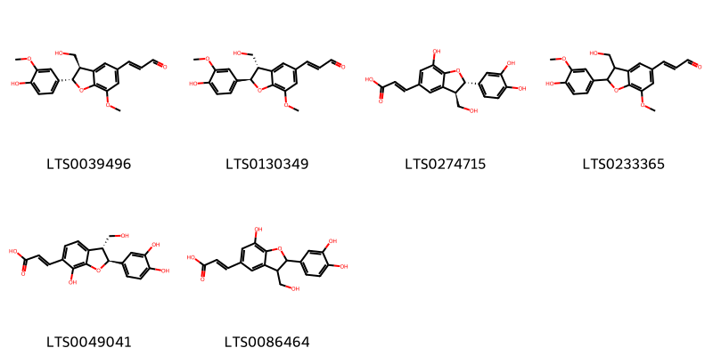
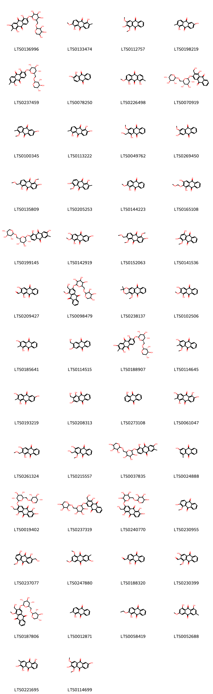
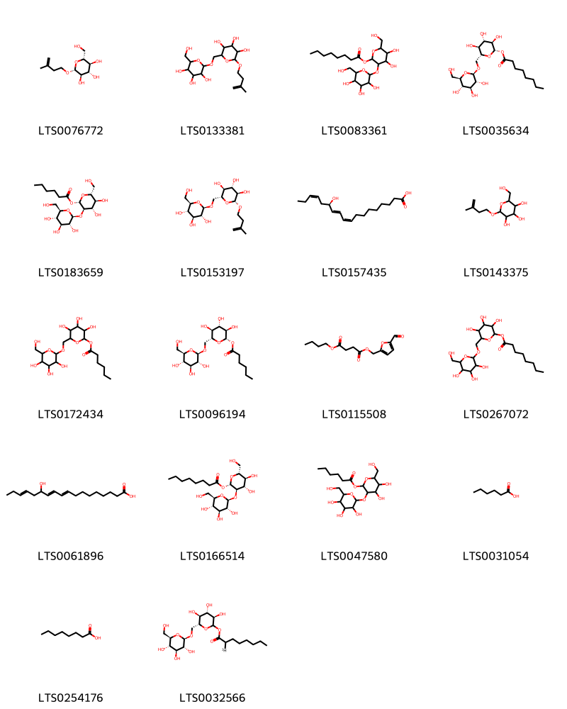
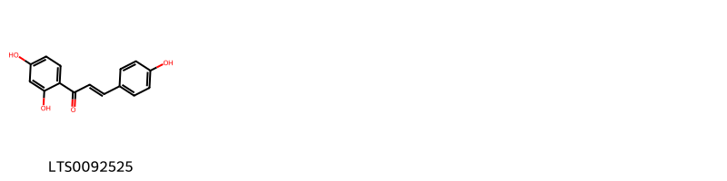
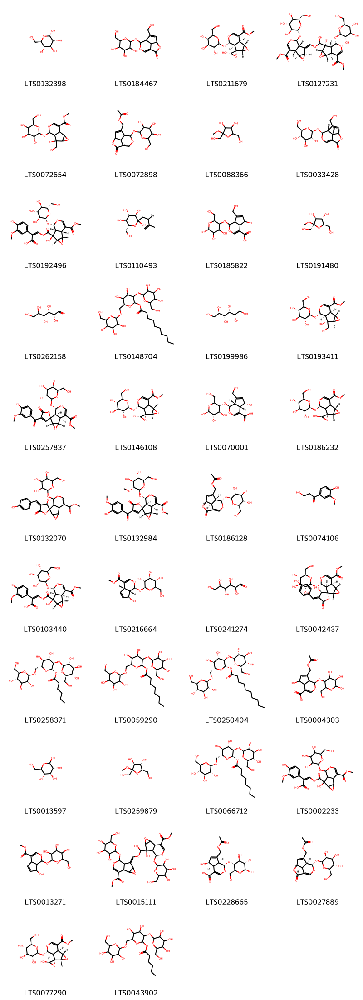
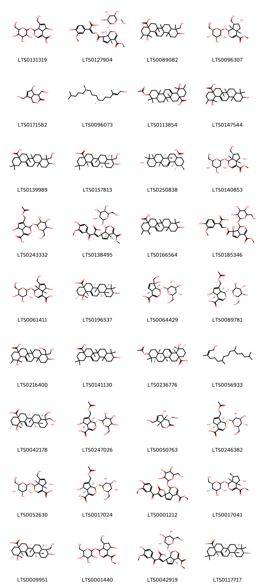
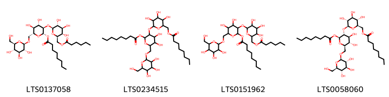

!!! abstract "Tóm tắt"
    Cây Nhàu, tên khoa học Morinda citrifolia L., thuộc họ Cà phê (Rubiaceae) thường được người dân sử dụng lá, quả, vỏ rễ làm thuốc. Vỏ rễ chứa glucozit anthraquinon và nhiều hợp chất hóa học khác. Có tác dụng nhuận tràng, lợi tiểu nhẹ, làm êm dịu thần kinh trên thần kinh giao cảm, hạ huyết áp và không độc.

## Thông tin về thực vật

### Đặc điểm thực vật

Dược liệu **Nhàu (Rễ)** từ bộ phận **nan** từ loài *Morinda citrifolia L.* thuộc họ Rubiaceae. Cây nhàu là một cây cao chừng 6-8 m thân nhẵn, thường mọc hoang ở những nơi ẩm thấp dọc bờ sông, bờ suối. Cây có nhiều cành to, lá mọc đối xứng hình bầu dục, nhọn ở đầu, dài 12-15cm. Hoa nở vào tháng 1-2. Quả chín vào tháng 7-8. Quả hình trứng, xù xì, dài chừng 5-6cm, khi non có màu xanh nhạt, khi chín có màu trắng hoặc hồng, mùi nồng và cay. Ruột quả có một lớp cơm mềm ăn được, chính giưuax có một nhân cứng. Nhân dài chừng 6-7mm, ngang chừng 4-5mm, có 2 ngăn chứa một hạt nhỏ mềm 

!!! info "Phân loại thực vật của *Morinda citrifolia*"
    - **Kingdom:** Plantae
    - **Phylum:** Tracheophyta
    - **Order:** Gentianales
    - **Family:** Rubiaceae
    - **Genus:** Morinda
    - **Species:** *Morinda citrifolia*

*Tài liệu tham khảo:* "Những cây thuốc và vị thuốc Việt Nam" - Đỗ Tất Lợi

 

### Loài thay thế (Nếu có)

### Phân bố trên thế giới
**Từ vườn thực vật KEW: **: Native to:
Andaman Is., Assam, Bangladesh, Bismarck Archipelago, Borneo, Cambodia, China Southeast, Christmas I., Cocos (Keeling) Is., Hainan, India, Jawa, Kazan-retto, Laccadive Is., Lesser Sunda Is., Malaya, Maldives, Maluku, Myanmar, Nansei-shoto, New Guinea, Nicobar Is., Northern Territory, Ogasawara-shoto, Philippines, Queensland, Santa Cruz Is., Solomon Is., South China Sea, Sri Lanka, Sulawesi, Sumatera, Taiwan, Thailand, Vietnam, Western Australia

Introduced into:
Bahamas, Belize, Caroline Is., Cayman Is., Chagos Archipelago, Colombia, Comoros, Cook Is., Costa Rica, Cuba, Dominican Republic, El Salvador, Fiji, French Guiana, Gilbert Is., Guatemala, Haiti, Hawaii, Honduras, Jamaica, Leeward Is., Line Is., Marcus I., Marianas, Marquesas, Marshall Is., Mexico Gulf, Mexico Southeast, Nauru, Netherlands Antilles, New Caledonia, Nicaragua, Niue, Panamá, Phoenix Is., Pitcairn Is., Puerto Rico, Samoa, Seychelles, Society Is., Southwest Caribbean, Tokelau-Manihiki, Tonga, Trinidad-Tobago, Tuamotu, Tubuai Is., Turks-Caicos Is., Tuvalu, Vanuatu, Venezuelan Antilles, Wallis-Futuna Is., Windward Is.

**Từ CSDL GIBF** Grenada, Australia, Belize, Virgin Islands (British), Puerto Rico, New Caledonia, Malaysia, Thailand, Montserrat, Guadeloupe, Brazil, Honduras, Antigua and Barbuda, Singapore, Indonesia, Maldives, India, Mexico, Panama, Costa Rica, Seychelles, Micronesia (Federated States of), Northern Mariana Islands, Nicaragua, Colombia, French Polynesia, Peru, French Guiana, Niue, Fiji, Cuba, Martinique, Philippines, Dominican Republic, Guam, Virgin Islands (U.S.), Viet Nam, Jamaica, United States of America, Chinese Taipei, Guyana, Sri Lanka, Tonga

### Phân bố tại Việt Nam
** "Những cây thuốc và vị thuốc Việt Nam" - Đỗ Tất Lợi**: Thấy nhiều ở miền Nam Việt Nam, chưa thấy ở miền Bắc. Theo Pételot thấy cả ở miền Bắc. Mới đây tìm thấy ở vùng Quảng Bình, Quảng Trị, Thừa Thiên Huế.

**Từ CSDL GIBF**: Hồ Chí Minh city

---

## Thông tin về dược liệu 

### Định danh

!!! info "Thông tin về tên gọi của nan"
    - Dược liệu tiếng Việt: nan
    - Dược liệu tiếng Trung: nan (nan)
    - Dược liệu tiếng Anh: nan
    - Dược liệu latin thông dụng: nan
    - Dược liệu latin kiểu DĐVN: radix morindae citrifoliae
    - Dược liệu latin kiểu DĐVN: nan
    - Dược liệu latin kiểu thông tư: nan
    - Bộ phận dùng: nan (nan)

### Mô tả dược liệu 
- **Theo dược điển Việt nam V:** nan

- **Mô tả dược liệu theo thông tư chế biến dược liệu theo phương pháp cổ truyền:** nan

### Chế biến 

- **Chế biến theo dược điển việt nam V**: nan

- **Chế biến theo thông tư:** nan

--- 

## Thành phần hóa học

- Theo tài liệu của GS. Đỗ Tất Lợi:  (1) Có khoảng 253 hợp chất hóa học thuộc nhiều nhóm khác nhau nhưng nhóm chính là anthraglucozit: damnacantal hay 1-metoxy-2-focmy-3-oxyanthraquinon, chất 1-metoxyrubuazin hay metoxy-2-metyl-3-oxyanthraquinon, chất alizarin, chất moridon hay 1-5-6-trioxy-2-metylanthraquinon và chất 1-oxy-2-3-dimetoxyanthraquinon 
(2) Biomarker: glucozit anthraquinon gọi là morindin C28H30O15
    
- Theo cơ sở dữ liệu lotus: Từ loài *Morinda citrifolia* đã phân lập và xác định được 253 hoạt chất thuộc về các nhóm Benzodioxanes, Linear 1,3-diarylpropanoids, Lactones, Coumarins and derivatives, Benzene and substituted derivatives, Pyrimidine nucleosides, Saccharolipids, Steroids and steroid derivatives, Phenols, Glycerolipids, Organooxygen compounds, Prenol lipids, Fatty Acyls, Furanoid lignans, Anthracenes, Carboxylic acids and derivatives, Lignan lactones, Flavonoids, 2-arylbenzofuran flavonoids. 

|    | chemicalTaxonomyClassyfireClass     |   smiles_count |
|---:|:------------------------------------|---------------:|
|  0 | 2-arylbenzofuran flavonoids         |              6 |
|  1 | Anthracenes                         |             56 |
|  2 | Benzene and substituted derivatives |              3 |
|  3 | Benzodioxanes                       |             15 |
|  4 | Carboxylic acids and derivatives    |              1 |
|  5 | Coumarins and derivatives           |              4 |
|  6 | Fatty Acyls                         |             18 |
|  7 | Flavonoids                          |             21 |
|  8 | Furanoid lignans                    |             15 |
|  9 | Glycerolipids                       |              3 |
| 10 | Lactones                            |              4 |
| 11 | Lignan lactones                     |              2 |
| 12 | Linear 1,3-diarylpropanoids         |              1 |
| 13 | Organooxygen compounds              |             42 |
| 14 | Phenols                             |              5 |
| 15 | Prenol lipids                       |             36 |
| 16 | Pyrimidine nucleosides              |              3 |
| 17 | Saccharolipids                      |              4 |
| 18 | Steroids and steroid derivatives    |             14 |

### Nhóm 2-arylbenzofuran flavonoids
<figure markdown="span">
    { width=100% }
    <figcaption>Hình ảnh cấu trúc hóa học của 6 hoạt chất thuộc nhóm 2-arylbenzofuran flavonoids gồm ['balanophonin (LTS0039496)', '(2e)-3-[(2r,3s)-2-(4-hydroxy-3-methoxyphenyl)-3-(hydroxymethyl)-7-methoxy-2,3-dihydro-1-benzofuran-5-yl]prop-2-enal (LTS0130349)', '(2e)-3-[(2s,3r)-2-(3,4-dihydroxyphenyl)-7-hydroxy-3-(hydroxymethyl)-2,3-dihydro-1-benzofuran-5-yl]prop-2-enoic acid (LTS0274715)', '3-[2-(4-hydroxy-3-methoxyphenyl)-3-(hydroxymethyl)-7-methoxy-2,3-dihydro-1-benzofuran-5-yl]prop-2-enal (LTS0233365)', '(2e)-3-[(2s,3r)-2-(3,4-dihydroxyphenyl)-7-hydroxy-3-(hydroxymethyl)-2,3-dihydro-1-benzofuran-6-yl]prop-2-enoic acid (LTS0049041)', '3-[2-(3,4-dihydroxyphenyl)-7-hydroxy-3-(hydroxymethyl)-2,3-dihydro-1-benzofuran-5-yl]prop-2-enoic acid (LTS0086464)'].</figcaption>
</figure>
### Nhóm Anthracenes
<figure markdown="span">
    { width=100% }
    <figcaption>Hình ảnh cấu trúc hóa học của 56 hoạt chất thuộc nhóm Anthracenes gồm ['1,3,5-trihydroxy-2-methyl-6-[(3,4,5-trihydroxy-6-{[(3,4,5-trihydroxyoxan-2-yl)oxy]methyl}oxan-2-yl)oxy]anthracene-9,10-dione (LTS0136996)', '1,5-dihydroxy-2-methoxy-6-methylanthracene-9,10-dione (LTS0133474)', '2-hydroxy-1,3-dimethoxyanthracene-9,10-dione (LTS0112757)', '1,6-dihydroxy-2-methylanthracene-9,10-dione (LTS0198219)', 'morindin (LTS0237459)', 'alizarin (LTS0078250)', '1,8-dihydroxy-2-methoxy-7-methylanthracene-9,10-dione (LTS0226498)', '1-hydroxy-2-(hydroxymethyl)-3-{[(2s,3r,4s,5s,6r)-3,4,5-trihydroxy-6-({[(2s,3r,4s,5r)-3,4,5-trihydroxyoxan-2-yl]oxy}methyl)oxan-2-yl]oxy}anthracene-9,10-dione (LTS0070919)', '6-hydroxy-1-methoxy-2-methylanthracene-9,10-dione (LTS0100345)', 'morindone (LTS0113222)', '1-hydroxy-2-(hydroxymethyl)-3-methoxyanthracene-9,10-dione (LTS0049762)', '2-hydroxy-3-methoxyanthracene-9,10-dione (LTS0269450)', '1,6-dihydroxy-5-methoxy-2-(methoxymethyl)anthracene-9,10-dione (LTS0135809)', '1,6-dihydroxy-5-methoxy-2-methylanthracene-9,10-dione (LTS0205253)', 'alizarin 2-methyl ether (LTS0144223)', '1,3-dihydroxy-2-(methoxymethoxy)anthracene-9,10-dione (LTS0165108)', '1,7-dihydroxy-6-methyl-2-{[(2s,3r,4s,5s,6r)-3,4,5-trihydroxy-6-({[(2s,3r,4s,5r)-3,4,5-trihydroxyoxan-2-yl]oxy}methyl)oxan-2-yl]oxy}anthracene-9,10-dione (LTS0199145)', '1,3,6-trihydroxy-2-methoxyanthracene-9,10-dione (LTS0142919)', '2-hydroxy-1,5-dimethoxy-6-(methoxymethyl)anthracene-9,10-dione (LTS0152063)', 'purpurin 1-methyl ether (LTS0141536)', '1,3-dihydroxy-9,10-dioxoanthracene-2-carbaldehyde (LTS0209427)', '2-(hydroxymethyl)-1-methoxy-3-[(3,4,5-trihydroxy-6-{[(3,4,5-trihydroxyoxan-2-yl)oxy]methyl}oxan-2-yl)oxy]anthracene-9,10-dione (LTS0098479)', '5-methoxy-2,2-dimethyl-4h-1,3-dioxatetracene-6,11-dione (LTS0238137)', '1,3-dihydroxy-2-methoxyanthracene-9,10-dione (LTS0102506)', 'rubiadin (LTS0185641)', '2-hydroxy-3-(hydroxymethyl)anthracene-9,10-dione (LTS0114515)', '1,3,5-trihydroxy-2-methyl-6-{[(2s,3r,4s,5s,6r)-3,4,5-trihydroxy-6-({[(2s,3r,4s,5r)-3,4,5-trihydroxyoxan-2-yl]oxy}methyl)oxan-2-yl]oxy}anthracene-9,10-dione (LTS0188907)', '3-hydroxy-1-methoxy-2-methylanthracene-9,10-dione (LTS0114645)', '1,3,6-trihydroxy-2-methylanthracene-9,10-dione (LTS0193219)', 'henine (LTS0208313)', 'hydroxyanthraquinone (LTS0273108)', '1,3,5,6-tetrahydroxy-2-methylanthracene-9,10-dione (LTS0061047)', 'lucidin ω-methyl ether (LTS0261324)', 'damnacanthol (LTS0215557)', '1,7-dihydroxy-6-methyl-2-[(3,4,5-trihydroxy-6-{[(3,4,5-trihydroxyoxan-2-yl)oxy]methyl}oxan-2-yl)oxy]anthracene-9,10-dione (LTS0037835)', '3-hydroxy-1-methylanthracene-9,10-dione (LTS0024888)', '1,5,6-trihydroxy-2-(hydroxymethyl)-3-{[(2s,3r,4s,5s,6r)-3,4,5-trihydroxy-6-({[(2s,3r,4s,5r)-3,4,5-trihydroxyoxan-2-yl]oxy}methyl)oxan-2-yl]oxy}anthracene-9,10-dione (LTS0019402)', '1-hydroxy-2-(hydroxymethyl)-3-[(3,4,5-trihydroxy-6-{[(3,4,5-trihydroxyoxan-2-yl)oxy]methyl}oxan-2-yl)oxy]anthracene-9,10-dione (LTS0237319)', '1,5,6-trihydroxy-2-(hydroxymethyl)-3-[(3,4,5-trihydroxy-6-{[(3,4,5-trihydroxyoxan-2-yl)oxy]methyl}oxan-2-yl)oxy]anthracene-9,10-dione (LTS0240770)', '2-hydroxy-1-methoxyanthracene-9,10-dione (LTS0230955)', '1,8-dihydroxy-2-(hydroxymethyl)-5-methoxyanthracene-9,10-dione (LTS0237077)', '6-hydroxy-1,3-dimethoxy-7-methylanthracene-9,10-dione (LTS0247880)', '1-hydroxy-9,10-dioxoanthracene-2-carbaldehyde (LTS0188320)', 'damnacanthal (LTS0230399)', '2-(hydroxymethyl)-1-methoxy-3-{[(2s,3r,4s,5s,6r)-3,4,5-trihydroxy-6-({[(2s,3r,4s,5r)-3,4,5-trihydroxyoxan-2-yl]oxy}methyl)oxan-2-yl]oxy}anthracene-9,10-dione (LTS0187806)', '1-hydroxy-2-methylanthracene-9,10-dione (LTS0012871)', '2-ethoxy-1-hydroxyanthracene-9,10-dione (LTS0058419)', 'physcion (LTS0052688)', '1,2,5-trihydroxy-3-methylanthracene-9,10-dione (LTS0221695)', '2,6-dihydroxy-1,3-dimethoxyanthracene-9,10-dione (LTS0114699)', '3-hydroxy-1-methoxyanthracene-9,10-dione (LTS0135127)', '2-(ethoxymethyl)-1,3-dihydroxyanthracene-9,10-dione (LTS0034783)', '2-hydroxy-1-methoxy-7-methylanthracene-9,10-dione (LTS0242388)', '1,2,7-trihydroxy-6-methylanthracene-9,10-dione (LTS0088202)', '1,5-dihydroxy-2-methyl-6-[(3,4,5-trihydroxy-6-{[(3,4,5-trihydroxyoxan-2-yl)oxy]methyl}oxan-2-yl)oxy]anthracene-9,10-dione (LTS0120522)', '1,3,5,6-tetrahydroxy-2-(hydroxymethyl)anthracene-9,10-dione (LTS0090415)'].</figcaption>
</figure>
### Nhóm Benzene and substituted derivatives
<figure markdown="span">
    { width=100% }
    <figcaption>Hình ảnh cấu trúc hóa học của 3 hoạt chất thuộc nhóm Benzene and substituted derivatives gồm ['2-hydroxyethyl 2-(2,4-dihydroxy-3-methoxybenzoyl)-3-hydroxy-4-methylbenzoate (LTS0228702)', 'galop (LTS0222857)', '2-hydroxyethyl 5-hydroxy-2-(2-hydroxybenzoyl)-4-(hydroxymethyl)benzoate (LTS0000025)'].</figcaption>
</figure>
### Nhóm Benzodioxanes
<figure markdown="span">
    { width=100% }
    <figcaption>Hình ảnh cấu trúc hóa học của 15 hoạt chất thuộc nhóm Benzodioxanes gồm ['(2e)-3-[(2s,3s)-2-(3,4-dihydroxyphenyl)-3-(hydroxymethyl)-2,3-dihydro-1,4-benzodioxin-6-yl]prop-2-enoic acid (LTS0092687)', '(2e)-3-[(2s,3s)-2-(3,4-dihydroxyphenyl)-3-(hydroxymethyl)-2,3-dihydro-1,4-benzodioxin-6-yl]prop-2-enal (LTS0177669)', '(2e)-3-[(2r,3r)-2-(3,4-dihydroxyphenyl)-3-(hydroxymethyl)-2,3-dihydro-1,4-benzodioxin-6-yl]prop-2-enoic acid (LTS0090661)', '4-[3-(hydroxymethyl)-6-(3-hydroxyprop-1-en-1-yl)-2,3-dihydro-1,4-benzodioxin-2-yl]benzene-1,2-diol (LTS0110762)', '3-[2-(3,4-dihydroxyphenyl)-3-(hydroxymethyl)-2,3-dihydro-1,4-benzodioxin-6-yl]prop-2-enal (LTS0191758)', '(2e)-3-[2-(3,4-dihydroxyphenyl)-3-(hydroxymethyl)-2,3-dihydro-1,4-benzodioxin-6-yl]prop-2-enal (LTS0151228)', '(2r,3r)-2-(4-hydroxy-3-methoxyphenyl)-3-(hydroxymethyl)-2,3-dihydro-1,4-benzodioxine-6-carboxylic acid (LTS0158749)', '(2e)-3-[(2r,3s)-2-(3,4-dihydroxyphenyl)-3-(hydroxymethyl)-2,3-dihydro-1,4-benzodioxin-6-yl]prop-2-enoic acid (LTS0242343)', '4-[(2r,3r)-3-(hydroxymethyl)-6-(3-hydroxypropyl)-2,3-dihydro-1,4-benzodioxin-2-yl]-2-methoxyphenol (LTS0079011)', '(2e)-3-[(2r,3r)-2-(4-hydroxy-3-methoxyphenyl)-3-(hydroxymethyl)-2,3-dihydro-1,4-benzodioxin-6-yl]prop-2-enoic acid (LTS0059315)', '3-[2-(3,4-dihydroxyphenyl)-3-(hydroxymethyl)-2,3-dihydro-1,4-benzodioxin-6-yl]prop-2-enoic acid (LTS0244671)', '4-[(2s)-3-(hydroxymethyl)-6-[(1e)-3-hydroxyprop-1-en-1-yl]-2,3-dihydro-1,4-benzodioxin-2-yl]benzene-1,2-diol (LTS0050712)', '(2z)-3-[2-(3,4-dihydroxyphenyl)-3-(hydroxymethyl)-2,3-dihydro-1,4-benzodioxin-6-yl]prop-2-enal (LTS0185852)', '4-[(2r,3r)-3-(hydroxymethyl)-6-[(1e)-3-hydroxyprop-1-en-1-yl]-2,3-dihydro-1,4-benzodioxin-2-yl]benzene-1,2-diol (LTS0022098)', '(2e)-3-[(2r,3r)-2-(3,4-dihydroxyphenyl)-3-(hydroxymethyl)-2,3-dihydro-1,4-benzodioxin-6-yl]prop-2-enal (LTS0215812)'].</figcaption>
</figure>
### Nhóm Carboxylic acids and derivatives
<figure markdown="span">
    { width=100% }
    <figcaption>Hình ảnh cấu trúc hóa học của 1 hoạt chất thuộc nhóm Carboxylic acids and derivatives gồm ['(5s)-5-hydroxyhexyl (2s)-2-hydroxypropanoate (LTS0098268)'].</figcaption>
</figure>
### Nhóm Coumarins and derivatives
<figure markdown="span">
    { width=100% }
    <figcaption>Hình ảnh cấu trúc hóa học của 4 hoạt chất thuộc nhóm Coumarins and derivatives gồm ['pteryxin (LTS0135324)', 'isoscopoletin (LTS0157758)', '9-(acetyloxy)-8,8-dimethyl-2-oxo-9h,10h-pyrano[2,3-h]chromen-10-yl 2-methylbut-2-enoate (LTS0220568)', 'scopoletin (LTS0193112)'].</figcaption>
</figure>
### Nhóm Fatty Acyls
<figure markdown="span">
    { width=100% }
    <figcaption>Hình ảnh cấu trúc hóa học của 18 hoạt chất thuộc nhóm Fatty Acyls gồm ['(2r,3s,4s,5r,6r)-2-(hydroxymethyl)-6-[(3-methylbut-3-en-1-yl)oxy]oxane-3,4,5-triol (LTS0076772)', '2-[(3-methylbut-3-en-1-yl)oxy]-6-({[3,4,5-trihydroxy-6-(hydroxymethyl)oxan-2-yl]oxy}methyl)oxane-3,4,5-triol (LTS0133381)', '4,5-dihydroxy-6-(hydroxymethyl)-3-{[3,4,5-trihydroxy-6-(hydroxymethyl)oxan-2-yl]oxy}oxan-2-yl octanoate (LTS0083361)', 'nonioside c (LTS0035634)', '(2s,3r,4s,5s,6r)-4,5-dihydroxy-6-(hydroxymethyl)-3-{[(2s,3r,4s,5s,6r)-3,4,5-trihydroxy-6-(hydroxymethyl)oxan-2-yl]oxy}oxan-2-yl hexanoate (LTS0183659)', 'nonioside a (LTS0153197)', '(9z,11e,13r,15z)-13-hydroxyoctadeca-9,11,15-trienoic acid (LTS0157435)', '2-(hydroxymethyl)-6-[(3-methylbut-3-en-1-yl)oxy]oxane-3,4,5-triol (LTS0143375)', '3,4,5-trihydroxy-6-({[3,4,5-trihydroxy-6-(hydroxymethyl)oxan-2-yl]oxy}methyl)oxan-2-yl hexanoate (LTS0172434)', 'nonioside d (LTS0096194)', '1-butyl 4-(5-formylfuran-2-yl)methyl butanedioate (LTS0115508)', '3,4,5-trihydroxy-6-({[3,4,5-trihydroxy-6-(hydroxymethyl)oxan-2-yl]oxy}methyl)oxan-2-yl octanoate (LTS0267072)', '13-hydroxyoctadeca-9,11,15-trienoic acid (LTS0061896)', '(2s,3r,4s,5s,6r)-4,5-dihydroxy-6-(hydroxymethyl)-3-{[(2s,3r,4s,5s,6r)-3,4,5-trihydroxy-6-(hydroxymethyl)oxan-2-yl]oxy}oxan-2-yl octanoate (LTS0166514)', '4,5-dihydroxy-6-(hydroxymethyl)-3-{[3,4,5-trihydroxy-6-(hydroxymethyl)oxan-2-yl]oxy}oxan-2-yl hexanoate (LTS0047580)', 'hexanoic acid (LTS0031054)', 'caprylic acid (LTS0254176)', '(3r,4s,5s,6r)-3,4,5-trihydroxy-6-({[(2r,3r,4s,5s,6r)-3,4,5-trihydroxy-6-(hydroxymethyl)oxan-2-yl]oxy}methyl)oxan-2-yl (2-²h₁)octanoate (LTS0032566)'].</figcaption>
</figure>
### Nhóm Flavonoids
<figure markdown="span">
    { width=100% }
    <figcaption>Hình ảnh cấu trúc hóa học của 21 hoạt chất thuộc nhóm Flavonoids gồm ['5,7-dihydroxy-2-(4-hydroxyphenyl)-3-[(3,4,5-trihydroxy-6-{[(3,4,5-trihydroxy-6-methyloxan-2-yl)oxy]methyl}oxan-2-yl)oxy]chromen-4-one (LTS0122456)', '5,7-dihydroxy-2-(3-hydroxy-4-methoxyphenyl)-3-{[(2s,3r,4s,5s,6r)-3,4,5-trihydroxy-6-({[(2r,3r,4r,5r,6s)-3,4,5-trihydroxy-6-methyloxan-2-yl]oxy}methyl)oxan-2-yl]oxy}chromen-4-one (LTS0073565)', '2-(3,4-dihydroxyphenyl)-5,7-dihydroxy-3-{[(2s,3r,4s,5s,6r)-3,4,5-trihydroxy-6-({[(2r,3s,4s,5r,6s)-3,4,5-trihydroxy-6-methyloxan-2-yl]oxy}methyl)oxan-2-yl]oxy}chromen-4-one (LTS0218865)', '5,6-dihydroxy-2-(4-hydroxy-3-methoxyphenyl)-3-[(3,4,5-trihydroxy-6-{[(3,4,5-trihydroxy-6-methyloxan-2-yl)oxy]methyl}oxan-2-yl)oxy]chromen-4-one (LTS0083172)', '2-(3,4-dihydroxyphenyl)-5,7-dihydroxy-3-{[(2s,3s,4r,5r,6s)-3,4,5-trihydroxy-6-methyloxan-2-yl]oxy}chromen-4-one (LTS0083664)', 'rutin (LTS0042292)', '2-(3,4-dihydroxyphenyl)-5,7-dihydroxy-3-{[3,4,5-trihydroxy-6-(hydroxymethyl)oxan-2-yl]oxy}chromen-4-one (LTS0195312)', '5,6-dihydroxy-2-(4-hydroxy-3-methoxyphenyl)-3-{[(2s,3r,4s,5s,6r)-3,4,5-trihydroxy-6-({[(2r,3r,4r,5r,6s)-3,4,5-trihydroxy-6-methyloxan-2-yl]oxy}methyl)oxan-2-yl]oxy}chromen-4-one (LTS0149810)', '5,7-dihydroxy-2-(4-hydroxyphenyl)-3-{[(2s,3r,4s,5s,6s)-3,4,5-trihydroxy-6-({[(2r,3r,4s,5r,6s)-3,4,5-trihydroxy-6-methyloxan-2-yl]oxy}methyl)oxan-2-yl]oxy}chromen-4-one (LTS0113249)', 'kaempherol (LTS0155822)', 'quercitrin (LTS0186298)', 'isoquercetin (LTS0254337)', 'narcissin (LTS0177843)', '3-{[(2s,3r,4s,5r,6r)-4,5-dihydroxy-3-{[(2s,3r,4s,5s,6r)-3,4,5-trihydroxy-6-(hydroxymethyl)oxan-2-yl]oxy}-6-({[(2r,3r,4r,5r,6s)-3,4,5-trihydroxy-6-methyloxan-2-yl]oxy}methyl)oxan-2-yl]oxy}-2-(3,4-dihydroxyphenyl)-5,7-dihydroxychromen-4-one (LTS0099831)', '2-(3,4-dihydroxyphenyl)-5,7-dihydroxy-3-{[(2s,3r,4r,5r,6s)-3,4,5-trihydroxy-6-(hydroxymethyl)oxan-2-yl]oxy}chromen-4-one (LTS0241372)', '3-{[(2s,3r,4s,5r,6r)-4,5-dihydroxy-3-{[(2s,3r,4s,5s,6r)-3,4,5-trihydroxy-6-(hydroxymethyl)oxan-2-yl]oxy}-6-({[(2r,3r,4r,5r,6s)-3,4,5-trihydroxy-6-methyloxan-2-yl]oxy}methyl)oxan-2-yl]oxy}-5,7-dihydroxy-2-(4-hydroxyphenyl)chromen-4-one (LTS0234919)', 'nictoflorin (LTS0182501)', '3-[(4,5-dihydroxy-3-{[3,4,5-trihydroxy-6-(hydroxymethyl)oxan-2-yl]oxy}-6-{[(3,4,5-trihydroxy-6-methyloxan-2-yl)oxy]methyl}oxan-2-yl)oxy]-2-(3,4-dihydroxyphenyl)-5,7-dihydroxychromen-4-one (LTS0053037)', 'quercetin (LTS0004651)', '3-[(4,5-dihydroxy-3-{[3,4,5-trihydroxy-6-(hydroxymethyl)oxan-2-yl]oxy}-6-{[(3,4,5-trihydroxy-6-methyloxan-2-yl)oxy]methyl}oxan-2-yl)oxy]-5,7-dihydroxy-2-(4-hydroxyphenyl)chromen-4-one (LTS0060677)', '3-rutinosyl quercetin (LTS0032845)'].</figcaption>
</figure>
### Nhóm Furanoid lignans
<figure markdown="span">
    { width=100% }
    <figcaption>Hình ảnh cấu trúc hóa học của 15 hoạt chất thuộc nhóm Furanoid lignans gồm ['syringaresinol (LTS0116280)', '4-[(2s,3r,4r)-4-(4-hydroxy-3,5-dimethoxybenzoyl)-3-(hydroxymethyl)oxolan-2-yl]-2,6-dimethoxyphenol (LTS0038508)', '(-)-pinoresinol (LTS0231245)', '( )-yangabin (LTS0082412)', '4-[(1r,3as,4r,6as)-4-(3,4-dihydroxyphenyl)-hexahydrofuro[3,4-c]furan-1-yl]benzene-1,2-diol (LTS0156809)', '4-[(1s,3ar,4r,6ar)-4-(3,4-dihydroxyphenyl)-hexahydrofuro[3,4-c]furan-1-yl]benzene-1,2-diol (LTS0141124)', '(+)-syringaresinol (LTS0158868)', '4-[(2s,3r,4r)-4-[(s)-(3,4-dihydroxyphenyl)(hydroxy)methyl]-3-(hydroxymethyl)oxolan-2-yl]benzene-1,2-diol (LTS0178460)', '4-[4-(3,4-dihydroxyphenyl)-hexahydrofuro[3,4-c]furan-1-yl]benzene-1,2-diol (LTS0231564)', '4-[(1r,3ar,4r,6ar)-4-(4-hydroxy-3-methoxyphenyl)-hexahydrofuro[3,4-c]furan-1-yl]-2-methoxyphenol (LTS0231779)', '4-[(1s,3ar,4s,6ar)-4-(3,4-dihydroxyphenyl)-hexahydrofuro[3,4-c]furan-1-yl]benzene-1,2-diol (LTS0178331)', '4-{4-[(3,4-dihydroxyphenyl)(hydroxy)methyl]-3-(hydroxymethyl)oxolan-2-yl}benzene-1,2-diol (LTS0007700)', '4-{4-[3-(3,4-dihydroxyphenyl)-2-(hydroxymethyl)-2,3-dihydro-1,4-benzodioxin-6-yl]-hexahydrofuro[3,4-c]furan-1-yl}benzene-1,2-diol (LTS0119701)', 'pinoresinol (LTS0011247)', '4-[(2s,3s,4r)-4-[(s)-(3,4-dihydroxyphenyl)(hydroxy)methyl]-3-(hydroxymethyl)oxolan-2-yl]benzene-1,2-diol (LTS0036845)'].</figcaption>
</figure>
### Nhóm Glycerolipids
<figure markdown="span">
    { width=100% }
    <figcaption>Hình ảnh cấu trúc hóa học của 3 hoạt chất thuộc nhóm Glycerolipids gồm ['glyceryl palmitate (LTS0073260)', '1-hexadecanoyl-sn-glycerol (LTS0062636)', '3-palmitoyl-sn-glycerol (LTS0045875)'].</figcaption>
</figure>
### Nhóm Lactones
<figure markdown="span">
    { width=100% }
    <figcaption>Hình ảnh cấu trúc hóa học của 4 hoạt chất thuộc nhóm Lactones gồm ['(3r,3as,4s,6ar)-3,4,5-tris(hydroxymethyl)-3h,3ah,4h,6ah-cyclopenta[b]furan-2-one (LTS0226921)', '(3s,3as,4s,6ar)-3,4,5-tris(hydroxymethyl)-3h,3ah,4h,6ah-cyclopenta[b]furan-2-one (LTS0065148)', '(3r,3as,4s,6as)-3,4,5-tris(hydroxymethyl)-3h,3ah,4h,6ah-cyclopenta[b]furan-2-one (LTS0184287)', '3,4,5-tris(hydroxymethyl)-3h,3ah,4h,6ah-cyclopenta[b]furan-2-one (LTS0216018)'].</figcaption>
</figure>
### Nhóm Lignan lactones
<figure markdown="span">
    { width=100% }
    <figcaption>Hình ảnh cấu trúc hóa học của 2 hoạt chất thuộc nhóm Lignan lactones gồm ['3,6-bis(3,4-dihydroxyphenyl)-tetrahydro-3h-furo[3,4-c]furan-1-one (LTS0035681)', '(3s,3ar,6s,6as)-3,6-bis(3,4-dihydroxyphenyl)-tetrahydro-3h-furo[3,4-c]furan-1-one (LTS0085819)'].</figcaption>
</figure>
### Nhóm Linear 1_3-diarylpropanoids
<figure markdown="span">
    { width=100% }
    <figcaption>Hình ảnh cấu trúc hóa học của Không tìm thấy chú thích hoạt chất thuộc nhóm Linear 1_3-diarylpropanoids gồm Không tìm thấy chú thích.</figcaption>
</figure>
### Nhóm Organooxygen compounds
<figure markdown="span">
    { width=100% }
    <figcaption>Hình ảnh cấu trúc hóa học của 42 hoạt chất thuộc nhóm Organooxygen compounds gồm ['α-glucose (LTS0132398)', '6-(hydroxymethyl)-8-{[3,4,5-trihydroxy-6-(hydroxymethyl)oxan-2-yl]oxy}-3,9-dioxatricyclo[5.3.1.0⁴,¹¹]undeca-1(10),5-dien-2-one (LTS0184467)', "methyl (1's,2r,2's,3s,4's,6's,7's)-3-hydroxy-7'-{[(2s,3r,4s,5s,6r)-3,4,5-trihydroxy-6-(hydroxymethyl)oxan-2-yl]oxy}-3',8'-dioxaspiro[oxirane-2,5'-tricyclo[4.4.0.0²,⁴]decan]-9'-ene-10'-carboxylate (LTS0211679)", 'methyl (1s,2s,4s,5r,6r,7s)-5-hydroxy-5-[(r)-hydroxy({[(1s,2s,4r,5z,6s,7s)-10-(methoxycarbonyl)-7-{[(2r,3s,4r,5r,6s)-3,4,5-trihydroxy-6-(hydroxymethyl)oxan-2-yl]oxy}-3,8-dioxatricyclo[4.4.0.0²,⁴]dec-9-en-5-ylidene]methoxy})methyl]-7-{[(2r,3s,4r,5r,6s)-3,4,5-trihydroxy-6-(hydroxymethyl)oxan-2-yl]oxy}-3,8-dioxatricyclo[4.4.0.0²,⁴]dec-9-ene-10-carboxylate (LTS0127231)', 'methyl 5-hydroxy-5-(hydroxymethyl)-7-{[3,4,5-trihydroxy-6-(hydroxymethyl)oxan-2-yl]oxy}-3,8-dioxatricyclo[4.4.0.0²,⁴]dec-9-ene-10-carboxylate (LTS0072654)', 'asperuloside (LTS0072898)', '2,5-bis(hydroxymethyl)-2-methoxyoxolane-3,4-diol (LTS0088366)', '(4s,7s,8s,11s)-6-(hydroxymethyl)-8-{[(2s,3r,4s,5s,6r)-3,4,5-trihydroxy-6-(hydroxymethyl)oxan-2-yl]oxy}-3,9-dioxatricyclo[5.3.1.0⁴,¹¹]undeca-1(10),5-dien-2-one (LTS0033428)', '(2z)-3-[(z)-(1r,2s,4s,5s,6r,7s)-5-hydroxy-10-(methoxycarbonyl)-7-{[(2r,3s,4r,5r,6s)-3,4,5-trihydroxy-6-(hydroxymethyl)oxan-2-yl]oxy}-3,8-dioxatricyclo[4.4.0.0²,⁴]dec-9-ene-5-carbonyloxy]-2-(4-hydroxy-3-methoxyphenyl)prop-2-enoic acid (LTS0192496)', '(3r,4s,5s,6r)-6-(hydroxymethyl)-2-[3-methyl(2-²h₁)but-3-en-1-yl]oxane-2,3,4,5-tetrol (LTS0110493)', '5-hydroxy-7-(hydroxymethyl)-1-{[4,5,6-trihydroxy-2-(hydroxymethyl)oxan-3-yl]oxy}-1h,4ah,5h,7ah-cyclopenta[c]pyran-4-carboxylic acid (LTS0185822)', '(2r,3s,4s,5r)-2,5-bis(hydroxymethyl)-2-methoxyoxolane-3,4-diol (LTS0191480)', '(+)-glucose (LTS0262158)', '4,5-dihydroxy-3-{[3,4,5-trihydroxy-6-(hydroxymethyl)oxan-2-yl]oxy}-6-({[3,4,5-trihydroxy-6-(hydroxymethyl)oxan-2-yl]oxy}methyl)oxan-2-yl decanoate (LTS0148704)', 'mannitol (LTS0199986)', 'methyl (1s,2s,4s,5s,6s,7s)-5-hydroxy-5-(hydroxymethyl)-7-{[(2s,3r,4s,5s,6r)-3,4,5-trihydroxy-6-(hydroxymethyl)oxan-2-yl]oxy}-3,8-dioxatricyclo[4.4.0.0²,⁴]dec-9-ene-10-carboxylate (LTS0193411)', "methyl (1's,2s,2's,4's,6's,7's)-4-(4-hydroxy-3-methoxybenzoyl)-5-oxo-7'-{[(2s,3r,4s,5r,6r)-3,4,5-trihydroxy-6-(hydroxymethyl)oxan-2-yl]oxy}-3',8'-dioxaspiro[furan-2,5'-tricyclo[4.4.0.0²,⁴]decan]-9'-ene-10'-carboxylate (LTS0257837)", "methyl (2r,2's,3s,4's,7's)-3-hydroxy-7'-{[(2s,3r,4s,5s,6r)-3,4,5-trihydroxy-6-(hydroxymethyl)oxan-2-yl]oxy}-3',8'-dioxaspiro[oxirane-2,5'-tricyclo[4.4.0.0²,⁴]decan]-9'-ene-10'-carboxylate (LTS0146108)", '(1s,4as,5s,7as)-5-hydroxy-7-(hydroxymethyl)-1-{[(2s,3r,4s,5s,6s)-4,5,6-trihydroxy-2-(hydroxymethyl)oxan-3-yl]oxy}-1h,4ah,5h,7ah-cyclopenta[c]pyran-4-carboxylic acid (LTS0070001)', "methyl (2r,2's,3r,4's,7's)-3-hydroxy-7'-{[(2s,3r,4s,5s,6r)-3,4,5-trihydroxy-6-(hydroxymethyl)oxan-2-yl]oxy}-3',8'-dioxaspiro[oxirane-2,5'-tricyclo[4.4.0.0²,⁴]decan]-9'-ene-10'-carboxylate (LTS0186232)", "methyl 3-hydroxy-4-[(4-hydroxyphenyl)methylidene]-5-oxo-7'-{[3,4,5-trihydroxy-6-(hydroxymethyl)oxan-2-yl]oxy}-3',8'-dioxaspiro[oxolane-2,5'-tricyclo[4.4.0.0²,⁴]decan]-9'-ene-10'-carboxylate (LTS0132070)", 'citrifolinoside (LTS0132984)', 'asperuloside (LTS0186128)', '3-hydroxy-1-(4-hydroxy-3-methoxyphenyl)propan-1-one (LTS0074106)', '(2z)-3-[(z)-(1s,2s,4s,5s,6s,7s)-5-hydroxy-10-(methoxycarbonyl)-7-{[(2s,3r,4s,5s,6r)-3,4,5-trihydroxy-6-(hydroxymethyl)oxan-2-yl]oxy}-3,8-dioxatricyclo[4.4.0.0²,⁴]dec-9-ene-5-carbonyloxy]-2-(4-hydroxy-3-methoxyphenyl)prop-2-enoic acid (LTS0103440)', 'methyl (1s,4as,7s,7as)-7-hydroxy-1-{[(2s,3r,4s,5s,6r)-3,4,5-trihydroxy-6-(hydroxymethyl)oxan-2-yl]oxy}-1h,4ah,7h,7ah-cyclopenta[c]pyran-4-carboxylate (LTS0216664)', 'dextrose (LTS0241274)', "methyl (1's,2s,2's,3r,4e,4's,6's,7's)-3-hydroxy-4-[(4-hydroxyphenyl)methylidene]-5-oxo-7'-{[(2s,3r,4s,5s,6r)-3,4,5-trihydroxy-6-(hydroxymethyl)oxan-2-yl]oxy}-3',8'-dioxaspiro[oxolane-2,5'-tricyclo[4.4.0.0²,⁴]decan]-9'-ene-10'-carboxylate (LTS0042437)", 'nonioside e (LTS0258371)', '4,5-dihydroxy-3-{[3,4,5-trihydroxy-6-(hydroxymethyl)oxan-2-yl]oxy}-6-({[3,4,5-trihydroxy-6-(hydroxymethyl)oxan-2-yl]oxy}methyl)oxan-2-yl octanoate (LTS0059290)', 'nonioside f (LTS0250404)', '7-[(acetyloxy)methyl]-5-hydroxy-1-{[4,5,6-trihydroxy-2-(hydroxymethyl)oxan-3-yl]oxy}-1h,4ah,5h,7ah-cyclopenta[c]pyran-4-carboxylic acid (LTS0004303)', 'glucose (LTS0013597)', '(2s,3s,4s,5r)-2,5-bis(hydroxymethyl)-2-methoxyoxolane-3,4-diol (LTS0259879)', 'nonioside b (LTS0066712)', '3-[5-hydroxy-10-(methoxycarbonyl)-7-{[3,4,5-trihydroxy-6-(hydroxymethyl)oxan-2-yl]oxy}-3,8-dioxatricyclo[4.4.0.0²,⁴]dec-9-ene-5-carbonyloxy]-2-(4-hydroxy-3-methoxyphenyl)prop-2-enoic acid (LTS0002233)', 'methyl 7-hydroxy-1-{[3,4,5-trihydroxy-6-(hydroxymethyl)oxan-2-yl]oxy}-1h,4ah,7h,7ah-cyclopenta[c]pyran-4-carboxylate (LTS0013271)', 'methyl 5-hydroxy-5-[hydroxy({[10-(methoxycarbonyl)-7-{[3,4,5-trihydroxy-6-(hydroxymethyl)oxan-2-yl]oxy}-3,8-dioxatricyclo[4.4.0.0²,⁴]dec-9-en-5-ylidene]methoxy})methyl]-7-{[3,4,5-trihydroxy-6-(hydroxymethyl)oxan-2-yl]oxy}-3,8-dioxatricyclo[4.4.0.0²,⁴]dec-9-ene-10-carboxylate (LTS0015111)', '(1s,4as,5s,7as)-7-[(acetyloxy)methyl]-5-hydroxy-1-{[(2s,3r,4s,5s,6s)-4,5,6-trihydroxy-2-(hydroxymethyl)oxan-3-yl]oxy}-1h,4ah,5h,7ah-cyclopenta[c]pyran-4-carboxylic acid (LTS0228665)', '[(4r,7s,8s,11s)-2-oxo-8-{[(2s,3s,4s,5s,6r)-3,4,5-trihydroxy-6-(hydroxymethyl)oxan-2-yl]oxy}-3,9-dioxatricyclo[5.3.1.0⁴,¹¹]undeca-1(10),5-dien-6-yl]methyl acetate (LTS0027889)', "methyl (1's,2r,2's,3r,4's,6's,7's)-3-hydroxy-7'-{[(2s,3r,4s,5s,6r)-3,4,5-trihydroxy-6-(hydroxymethyl)oxan-2-yl]oxy}-3',8'-dioxaspiro[oxirane-2,5'-tricyclo[4.4.0.0²,⁴]decan]-9'-ene-10'-carboxylate (LTS0077290)", '4,5-dihydroxy-3-{[3,4,5-trihydroxy-6-(hydroxymethyl)oxan-2-yl]oxy}-6-({[3,4,5-trihydroxy-6-(hydroxymethyl)oxan-2-yl]oxy}methyl)oxan-2-yl hexanoate (LTS0043902)'].</figcaption>
</figure>
### Nhóm Phenols
<figure markdown="span">
    { width=100% }
    <figcaption>Hình ảnh cấu trúc hóa học của 5 hoạt chất thuộc nhóm Phenols gồm ['vanillin (LTS0136163)', 'methyl 3-(2,4-dihydroxy-5-methoxyphenyl)propanoate (LTS0074190)', 'coniferyl aldehyde (LTS0140691)', 'butyl 3-(2,4-dihydroxy-5-methoxyphenyl)propanoate (LTS0000967)', 'coniferaldehyde (LTS0009773)'].</figcaption>
</figure>
### Nhóm Prenol lipids
<figure markdown="span">
    { width=100% }
    <figcaption>Hình ảnh cấu trúc hóa học của 36 hoạt chất thuộc nhóm Prenol lipids gồm ['5-hydroxy-7-(hydroxymethyl)-1-{[3,4,5-trihydroxy-6-(hydroxymethyl)oxan-2-yl]oxy}-1h,4ah,5h,7ah-cyclopenta[c]pyran-4-carboxylic acid (LTS0131319)', '(2z)-3-[(z)-(1s,4ar,7s,7as)-7-hydroxy-4-(methoxycarbonyl)-1-{[(2r,3s,4r,5r,6s)-3,4,5-trihydroxy-6-(hydroxymethyl)oxan-2-yl]oxy}-1h,4ah,7ah-cyclopenta[c]pyran-7-carbonyloxy]-2-(4-hydroxy-3-methoxyphenyl)prop-2-enoic acid (LTS0127904)', '1,10-dihydroxy-9-(hydroxymethyl)-1,2,6a,6b,9,12a-hexamethyl-2,3,4,5,6,7,8,8a,10,11,12,12b,13,14b-tetradecahydropicene-4a-carboxylic acid (LTS0089082)', 'methyl (1s,4as,6r,7s,7as)-6-hydroxy-7-(hydroxymethyl)-1-{[(2s,3r,4s,5s,6r)-3,4,5-trihydroxy-6-(hydroxymethyl)oxan-2-yl]oxy}-1h,4ah,5h,6h,7h,7ah-cyclopenta[c]pyran-4-carboxylate (LTS0096307)', '5-hydroxy-4,7-bis(hydroxymethyl)-1h,4h,4ah,5h,7ah-cyclopenta[c]pyran-3-one (LTS0171582)', 'phytol (LTS0096073)', '10-(acetyloxy)-1-hydroxy-1,2,6a,6b,9,9,12a-heptamethyl-2,3,4,5,6,7,8,8a,10,11,12,12b,13,14b-tetradecahydropicene-4a-carboxylic acid (LTS0113854)', '1,10-dihydroxy-1,2,6a,6b,9,9,12a-heptamethyl-2,3,4,5,6,7,8,8a,10,11,12,12b,13,14b-tetradecahydropicene-4a-carboxylic acid (LTS0147544)', '10-hydroxy-9-(hydroxymethyl)-2,2,6a,6b,9,12a-hexamethyl-1,3,4,5,6,7,8,8a,10,11,12,12b,13,14b-tetradecahydropicene-4a-carboxylic acid (LTS0139989)', 'hederagenin (LTS0157813)', 'ursolic acid (LTS0250838)', 'methyl (1s,4as,5s,7s,7ar)-5-hydroxy-7-(hydroxymethyl)-1-{[(2s,3r,4s,5s,6r)-3,4,5-trihydroxy-6-(hydroxymethyl)oxan-2-yl]oxy}-1h,4ah,5h,6h,7h,7ah-cyclopenta[c]pyran-4-carboxylate (LTS0140853)', '7-[(acetyloxy)methyl]-5-hydroxy-1-{[3,4,5-trihydroxy-6-(hydroxymethyl)oxan-2-yl]oxy}-1h,4ah,5h,7ah-cyclopenta[c]pyran-4-carboxylic acid (LTS0243332)', "methyl (1s,4ar,7r,7as)-4'-(4-hydroxy-3-methoxybenzoyl)-5'-oxo-1-{[(2s,3r,4s,5r,6r)-3,4,5-trihydroxy-6-(hydroxymethyl)oxan-2-yl]oxy}-4a,7a-dihydro-1h-spiro[cyclopenta[c]pyran-7,2'-furan]-4-carboxylate (LTS0138495)", '10-hydroxy-1,2,6a,6b,9,9,12a-heptamethyl-2,3,4,5,6,7,8,8a,10,11,12,12b,13,14b-tetradecahydro-1h-picene-4a-carboxylic acid (LTS0166564)', '2-(4-hydroxy-3-methoxyphenyl)-3-[7-hydroxy-4-(methoxycarbonyl)-1-{[3,4,5-trihydroxy-6-(hydroxymethyl)oxan-2-yl]oxy}-1h,4ah,7ah-cyclopenta[c]pyran-7-carbonyloxy]prop-2-enoic acid (LTS0185346)', '(1s,4as,5r,7as)-5-hydroxy-7-(hydroxymethyl)-1-{[(2s,3r,4s,5r,6r)-3,4,5-trihydroxy-6-(hydroxymethyl)oxan-2-yl]oxy}-1h,4ah,5h,7ah-cyclopenta[c]pyran-4-carboxylic acid (LTS0061411)', 'pomolic acid (LTS0196537)', 'monotropein (LTS0064429)', '(1s,4as,5s,7as)-7-[(acetyloxy)methyl]-5-hydroxy-1-{[(2r,3s,4r,5r,6s)-3,4,5-trihydroxy-6-(hydroxymethyl)oxan-2-yl]oxy}-1h,4ah,5h,7ah-cyclopenta[c]pyran-4-carboxylic acid (LTS0089781)', '1,10-dihydroxy-9,9-bis(hydroxymethyl)-1,2,6a,6b,12a-pentamethyl-2,3,4,5,6,7,8,8a,10,11,12,12b,13,14b-tetradecahydropicene-4a-carboxylic acid (LTS0216400)', 'oleanolic acid (LTS0141130)', '(1r,2r,4as,6as,6br,8ar,10s,12ar,12br,14bs)-10-(acetyloxy)-1-hydroxy-1,2,6a,6b,9,9,12a-heptamethyl-2,3,4,5,6,7,8,8a,10,11,12,12b,13,14b-tetradecahydropicene-4a-carboxylic acid (LTS0236776)', '3,7,11,15-tetramethylhexadec-2-en-1-ol (LTS0056933)', 'clethric acid (LTS0042178)', '(1s,4as,5s,7as)-7-[(acetyloxy)methyl]-5-hydroxy-1-{[3,4,5-trihydroxy-6-(hydroxymethyl)oxan-2-yl]oxy}-1h,4ah,5h,7ah-cyclopenta[c]pyran-4-carboxylic acid (LTS0247026)', '(4r,4as,5r,7as)-5-hydroxy-4,7-bis(hydroxymethyl)-1h,4h,4ah,5h,7ah-cyclopenta[c]pyran-3-one (LTS0050763)', '(1s,4as,5r,7as)-7-[(acetyloxy)methyl]-5-hydroxy-1-{[(2s,3r,4s,5s,6r)-3,4,5-trihydroxy-6-(hydroxymethyl)oxan-2-yl]oxy}-1h,4ah,5h,7ah-cyclopenta[c]pyran-4-carboxylic acid (LTS0246382)', 'deacetylasperulosidic acid (LTS0052630)', '(1s,4as,5s,7as)-7-[(acetyloxy)methyl]-5-hydroxy-1-{[(2s,3r,4s,5s,6r)-3,4,5-trihydroxy-6-(hydroxymethyl)oxan-2-yl]oxy}-1h,4ah,5h,7ah-cyclopenta[c]pyran-4-carboxylic acid (LTS0017024)', "methyl 4'-(4-hydroxy-3-methoxybenzoyl)-5'-oxo-1-{[3,4,5-trihydroxy-6-(hydroxymethyl)oxan-2-yl]oxy}-4a,7a-dihydro-1h-spiro[cyclopenta[c]pyran-7,2'-furan]-4-carboxylate (LTS0001212)", 'methyl (1s,4as,5s,7s,7ar)-5-hydroxy-7-methyl-1-{[(2s,3r,4s,5s,6r)-3,4,5-trihydroxy-6-(hydroxymethyl)oxan-2-yl]oxy}-1h,4ah,5h,6h,7h,7ah-cyclopenta[c]pyran-4-carboxylate (LTS0017041)', 'rotungenic acid (LTS0009951)', 'methyl 5-hydroxy-7-(hydroxymethyl)-1-{[3,4,5-trihydroxy-6-(hydroxymethyl)oxan-2-yl]oxy}-1h,4ah,5h,6h,7h,7ah-cyclopenta[c]pyran-4-carboxylate (LTS0001440)', "methyl (1s,4as,7r,7as)-4'-(4-hydroxy-3-methoxybenzoyl)-5'-oxo-1-{[(2s,3r,4s,5s,6r)-3,4,5-trihydroxy-6-(hydroxymethyl)oxan-2-yl]oxy}-4a,7a-dihydro-1h-spiro[cyclopenta[c]pyran-7,2'-furan]-4-carboxylate (LTS0042919)", 'oleanolic acid (LTS0117717)'].</figcaption>
</figure>
### Nhóm Pyrimidine nucleosides
<figure markdown="span">
    { width=100% }
    <figcaption>Hình ảnh cấu trúc hóa học của 3 hoạt chất thuộc nhóm Pyrimidine nucleosides gồm ['2-(2-hydroxy-4-iminopyrimidin-1-yl)-5-(hydroxymethyl)oxolane-3,4-diol (LTS0050374)', '(2s,3s,4r,5s)-2-(2-hydroxy-4-iminopyrimidin-1-yl)-5-(hydroxymethyl)oxolane-3,4-diol (LTS0156899)', 'cytidine (LTS0075123)'].</figcaption>
</figure>
### Nhóm Saccharolipids
<figure markdown="span">
    { width=100% }
    <figcaption>Hình ảnh cấu trúc hóa học của 4 hoạt chất thuộc nhóm Saccharolipids gồm ['(2s,3r,4s,5s,6r)-3-{[(2s,3r,4s,5s,6r)-6-[(hexanoyloxy)methyl]-3,4,5-trihydroxyoxan-2-yl]oxy}-4,5-dihydroxy-6-({[(2r,3r,4s,5s,6r)-3,4,5-trihydroxy-6-(hydroxymethyl)oxan-2-yl]oxy}methyl)oxan-2-yl octanoate (LTS0137058)', '(6-{[4,5-dihydroxy-2-(octanoyloxy)-6-({[3,4,5-trihydroxy-6-(hydroxymethyl)oxan-2-yl]oxy}methyl)oxan-3-yl]oxy}-3,4,5-trihydroxyoxan-2-yl)methyl octanoate (LTS0234515)', '3-({6-[(hexanoyloxy)methyl]-3,4,5-trihydroxyoxan-2-yl}oxy)-4,5-dihydroxy-6-({[3,4,5-trihydroxy-6-(hydroxymethyl)oxan-2-yl]oxy}methyl)oxan-2-yl octanoate (LTS0151962)', 'nonioside g (LTS0058060)'].</figcaption>
</figure>
### Nhóm Steroids and steroid derivatives
<figure markdown="span">
    { width=100% }
    <figcaption>Hình ảnh cấu trúc hóa học của 14 hoạt chất thuộc nhóm Steroids and steroid derivatives gồm ['stigmast-5-en-3-ol, (3β)- (LTS0204616)', 'stigmast-5-en-3-ol (LTS0071224)', 'sitosterol (LTS0168132)', '(1r,3as,9ar,11ar)-1-[(3e,5s)-5-ethyl-6-methylhept-3-en-2-yl]-3a,9a,11a-trimethyl-1h,2h,3h,3bh,4h,5h,8h,9h,9bh,10h,11h-cyclopenta[a]phenanthren-7-one (LTS0055797)', 'sitogluside (LTS0201798)', '2-{[1-(5-ethyl-6-methylheptan-2-yl)-9a,11a-dimethyl-1h,2h,3h,3ah,3bh,4h,6h,7h,8h,9h,9bh,10h,11h-cyclopenta[a]phenanthren-7-yl]oxy}-6-(hydroxymethyl)oxane-3,4,5-triol (LTS0158828)', '(2r,3r,4s,5s,6s)-2-{[(1r,3as,3bs,7s,9ar,9bs,11ar)-1-[(2r,5r)-5-ethyl-6-methylheptan-2-yl]-9a,11a-dimethyl-1h,2h,3h,3ah,3bh,4h,6h,7h,8h,9h,9bh,10h,11h-cyclopenta[a]phenanthren-7-yl]oxy}-6-(hydroxymethyl)oxane-3,4,5-triol (LTS0076809)', '(3r,6s,8r,11s,12s,15r,16r)-7,7,12,16-tetramethyl-15-[(2r)-6-methylhept-5-en-2-yl]pentacyclo[9.7.0.0¹,³.0³,⁸.0¹²,¹⁶]octadecan-6-ol (LTS0062833)', '1-(5-ethyl-6-methylheptan-2-yl)-9a,11a-dimethyl-1h,2h,3h,3ah,3bh,4h,5h,8h,9h,9bh,10h,11h-cyclopenta[a]phenanthren-7-one (LTS0212002)', '(1r,3r,6s,8r,11s,12s,15r,16r)-7,7,12,16-tetramethyl-15-[(2r)-6-methylhept-5-en-2-yl]pentacyclo[9.7.0.0¹,³.0³,⁸.0¹²,¹⁶]octadecan-6-ol (LTS0260410)', '(1r,3as,3br,9as,9bs,11ar)-9a,11a-dimethyl-1-[(2r)-6-methylhept-3-en-2-yl]-tetradecahydro-1h-cyclopenta[a]phenanthren-7-ol (LTS0217736)', 'β-sitostenone (LTS0049492)', 'phytosterol (LTS0029311)', 'cycloartenol (LTS0269561)'].</figcaption>
</figure>

---

## Tác dụng dược lý

Theo tài liệu "Những cây thuốc và vị thuốc Việt Nam" - Đỗ Tất Lợi:- Nhuận tràng nhẹ và lâu dài
- Lợi tiểu nhẹ 
- Làm êm dịu thần kinh trên thần kinh giao cảm 
- Hạ huyết áp
- Độ độc không đáng kể và không gây nghiện

Theo tài liệu quốc tế: nan

---

## Dược điển Việt Nam V

### Soi bột:
nan
<!-- Hình ảnh soi bột sẽ được tự động chèn vào đây sau -->
### Vi phẫu:
nan
<!-- Hình ảnh vi phẫu sẽ được tự động chèn vào đây sau -->
### Định tính

nan

### Định lượng

nan

### Thông tin khác 
- ** Độ ẩm: ** nan

- ** Bảo quản:** nan
## Dược điển Hồng kong

<!-- PDF sẽ được tự động chèn vào đây sau -->

---

## Y dược học cổ truyền

- **Tên vị thuốc:** nan
- **Tính vị quy kinh:** Vị chát, tính bình. Vào kinh thận, đại tràng
- **Công năng chủ trị:** Trừ phong thẩp, nhuận tràng, bình can giáng nghịch. Chủ 
trị đau nhức xương khớp, huyết áp cao, phụ nữ sau khi 
sinh yếu mệt; còn dùng với tính chất tăng cường miễn 
dịch, tăng sức đề kháng cho cơ thể.
- **Chú ý:** nan
- **Kiêng kỵ:** nan

