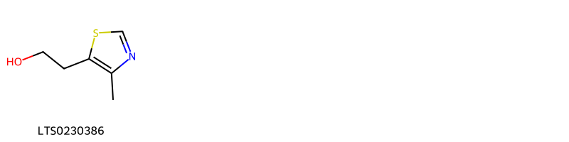
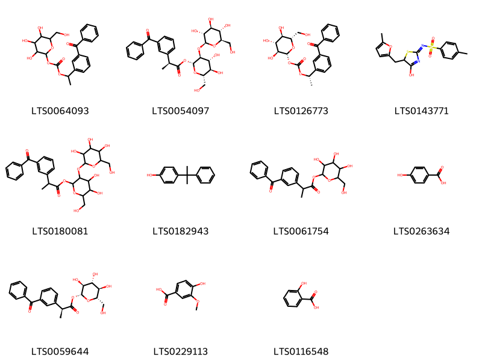
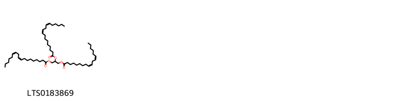
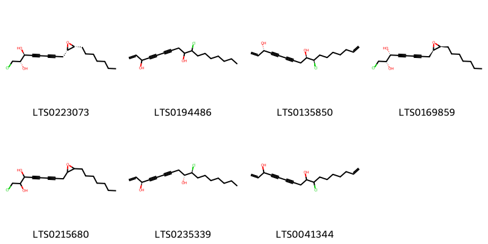
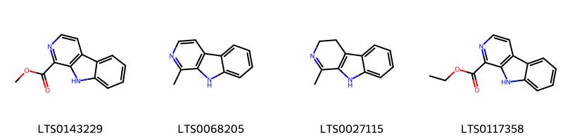
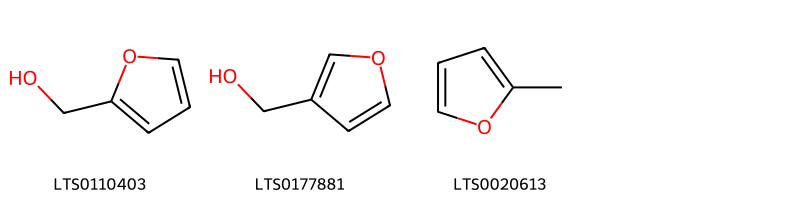
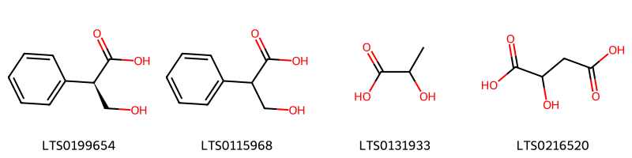
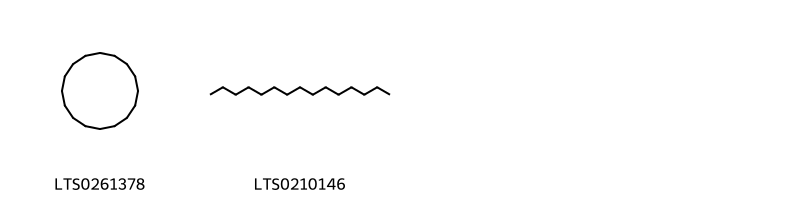
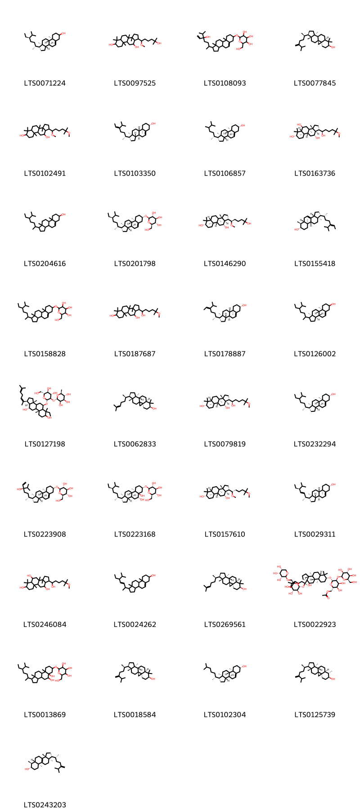
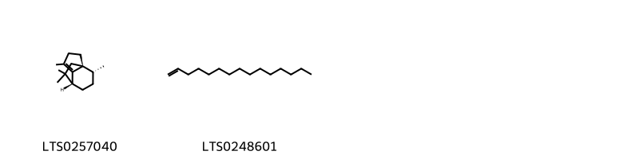

!!! abstract "Tóm tắt"
    Nhân sâm (Thân rễ và rễ), tên khoa học Rhizoma et Radix Ginseng từ cây nhân sâm (Panax ginseng C.A.Mey) thuộc họ Nhân sâm (Araliaceae). Phân bố chủ yếu ở Triều Tiên, Đông Bắc Trung Quốc và Liên Xô cũ, còn Việt Nam thì vẫn phải nhập Trung Quốc và Hàn Quốc. Theo kinh nghiệm sử dụng dân gian, sâm có thể thái mỏng bỏ vào miệng ngậm, nhấm từng tí một, nuốt nước và cả bã hoặc thái mỏng cho vào ấm đun lấy nước uống. Nhân sâm sẽ có vị ngọt, hơi đắng, tính ôn, vào 2 kinh tỳ và phế. Có tác dụng đại bổ nguyên khí, ích huyết sinh tân, định thần, ích trí. DÙng chữa phế hư ho suyễn, tỳ hư tiết tả, vị hư sinh nôn mửa, bệnh lâu ngày khí hư, sợ hãi, tiêu khát. Thành phần chính là các Saponin triterpenoid nhóm dammaran gọi chung là ginsenoid. Các saponin quan trọng nhất gồm Rb1, Rb2, Rc, Rd, Rf, Rg1 và Rg2. Saponin hàm lượng cao nhất gồm: Rb1, Rb2 và Rg1

## Thông tin về thực vật

### Đặc điểm thực vật

Dược liệu **Nhân Sâm (Thân Rễ Và Rễ)** từ bộ phận **Rễ** từ loài *Panax ginseng C.A.Mey* thuộc họ Araliaceae. Cây nhân sâm là một cây sống lâu năm, cao chừng 0,6m. Rễ mẫm thành củ to. Lá mọc vòng có cuống dài, lá kép gồm nhiều lá chét mọc thành hình chân vịt. Nếu cây mới đửa một năm (nghĩa là sau khi gieo được 2 năm) thì cây chỉ có 1 lá với 3 lá chét, nếu cây nhân sâm được 2 năm cũng chỉ có 1 lá với 5 lá chét. Cây nhân sâm 3 năm có 2 lá kép, cây nhân sâm 4 năm có 3 lá kép, cây nhân sâm 5 năm trở lên có 4 đến 5 lá kép, tất cả đều có 5 lá chét (đặc biệt có thể có 6 lá chét) hình trứng, mép lá chét có răng cưa sâu 
Bắt đầu từ năm thứ 3 trở đi, cây nhân sâm mới cho hoa, kết quả. Hoa xuất hiện vào mùa hạ. Cụm hoa hình tán mọc ở đầu cành, hoa màu xanh nhạt, 5 cánh hoa, 5 nhị, bầu hạ 2 núm. Quả mọng hơi dẹt to bằng hạt đậu xanh, khi chín có màu đỏ trong chưa 2 hạt. Hạt cây sâm năm thứ 3 chưa tốt. Thường người ta bấm bỏ đi đợi cây được 4-5 năm mới để ra quả và lấy làm hạt giống 

!!! info "Phân loại thực vật của *Panax ginseng*"
    - **Kingdom:** Plantae
    - **Phylum:** Tracheophyta
    - **Order:** Apiales
    - **Family:** Araliaceae
    - **Genus:** Panax
    - **Species:** *Panax ginseng*

*Tài liệu tham khảo:* "Những cây thuốc và vị thuốc Việt Nam" - Đỗ Tất Lợi

 

### Loài thay thế (Nếu có)

### Phân bố trên thế giới
**Từ vườn thực vật KEW: **: Native to:
Khabarovsk, Korea, Manchuria, Primorye

Introduced into:
China North-Central

**Từ CSDL GIBF** nan, Korea (Democratic People’s Republic of), New Zealand, Croatia, Colombia, Korea, Republic of, China, Norway, Hong Kong, United States of America, Japan, United Kingdom of Great Britain and Northern Ireland, Philippines, Benin, Nigeria, India, Russian Federation

### Phân bố tại Việt Nam
** "Những cây thuốc và vị thuốc Việt Nam" - Đỗ Tất Lợi**: Việt Nam tuy đã có kinh nghiệm trồng bằng hạt và mầm do các nước bạn Triều Tiên, Liên Xô cũ và Trung Quốc giúp nhưng chưa thành công

**Từ CSDL GIBF**: Không có ghi nhận ở Việt Nam

---

## Thông tin về dược liệu 

### Định danh

!!! info "Thông tin về tên gọi của nhân sâm"
    - Dược liệu tiếng Việt: nhân sâm
    - Dược liệu tiếng Trung: 人参叶 (Ren Shen Ye)
    - Dược liệu tiếng Anh: Panax Ginseng [Syn. Panax Schinseng]
    - Dược liệu latin thông dụng: Rhizoma et Radix GinsengnRadix Ginseng
    - Dược liệu latin kiểu DĐVN: rhizoma et radix ginseng
    - Dược liệu latin kiểu DĐVN: Radix Ginseng
    - Dược liệu latin kiểu thông tư: 
    - Bộ phận dùng: Rễ (Rhizoma)

### Mô tả dược liệu 
- **Theo dược điển Việt nam V:** Viên sâm: Sâm trồng, phơi hoặc sấy khô; rễ cái có hình thoi hoặc hình trụ tròn, dài khoảng 3 cm đến 15 cm, đường kính 1 cm đến 2 cm, mặt ngoài màu vàng hơi xám, phần trên hoặc toàn bộ rễ có nếp nhăn dọc rõ, có khía vân ngang, thô, không liên tục, rải rác và nông, phần dưới có 2 đến 3 rễ nhánh và nhiều rễ con nhỏ, dài, thường có mẩu dạng củ nhỏ không rõ. Thân rễ (Lô đầu) sát ở đầu rễ, dài 1 cm đến 4 cm, đường kính 0,3 cm đến 1,5 cm, thường cong và co lại, có rễ phụ (gọi là Đinh) và có vết sẹo thân, tròn, lõm, thưa (gọi là Lô uyển). Chất tương đối cứng, mặt bẻ màu trắng hơi vàng, có tinh bột rõ; tầng phát sinh vòng tròn, màu vàng hơi nâu; vỏ có ống tiết nhựa, dạng điểm, màu vàng nâu và những kẽ nút dạng xuyên tâm. Mùi thơm đặc trưng, vị hơi đắng và ngọt. Hồng sâm: Hấp, sấy và phơi khô rễ viên sâm thu được Hồng sâm. Sơn sâm: Nhân sâm mọc hoang, phơi hay sấy khô. Dược liệu là rễ cái, dài bằng hoặc ngắn hơn thân rễ; có hình chữ V, hình thoi hoặc hình trụ, dài 2 cm đến 10 cm; mặt ngoài màu vàng hơi xám, có vân nhăn dọc, đầu trên có các vòng vân ngang, trũng sâu, dày đặc; thường có 2 rễ nhánh; các rễ con trông rõ ràng, mảnh dẻ, nhỏ sắp xếp có thứ tự; có mấu nổi lên rõ gọi là “mấu hạt trân châu”. Thân rễ mảnh dẻ, nhỏ, dài; bộ phận trên có các vết sẹo thân, dày đặc, các rễ phụ tương đối dày đặc, trông tựa như hình hạt táo.

- **Mô tả dược liệu theo thông tư chế biến dược liệu theo phương pháp cổ truyền:** 

### Chế biến 

- **Chế biến theo dược điển việt nam V**: Thường thu hoạch Nhân sâm vào mùa thu (tháng 9 đến tháng 10), ở những cây trồng từ 4 năm trở lên, rửa sạch, phơi nắng nhẹ, hoặc sấy nhẹ đến khô. Cũng có khi chế bằng cách đồ rồi ép để được hồng sâm. Bào chế Viên sâm: Ủ mềm, thái phiến mỏng, phơi khô. Sơn sâm: Khi dùng tán thành bột hoặc giã nát, hay phân ra thành miếng nhỏ.

- **Chế biến theo thông tư:** 

--- 

## Thành phần hóa học

- Theo tài liệu của GS. Đỗ Tất Lợi:  (1) Theo trang https://lotus.naturalproducts.net/ đã tìm thấy 574 hợp chất hóa học. 
Nhóm hoạt chất chính là Saponin triterpenoid nhóm dammaran gọi chung là ginsenoid. 
- Trong nhân sâm có loại saponin sterolic. Hồn hợp saponin có tên là panaxozit trước đây gọi là panaquilon hay panakilon.
- Chất glucozit hoặc hỗn hợp glucozit mang tên là panaxin cũng chưa được nghiên cứu sâu. Trước đây gọi là gensenin cũng là một loại saponin chưa tinh khiết lắm.
- Ngoài ra còn có một tí tinh dầu 0,055-0,250% làm cho nhân sâm có mùi đặc biệt, trong đó chủ yếu là chất panaxen CH
- Các vitamin B, và B, các mendiataza
- Tro chừng 3-7% trong đó có chừng 53% axit photphoric.
- Các tạp chất khác gồm nhựa và chất béo tổng số chừng 1,5%. Các axit béo gồm hỗn hợp axít panmitic, stearic và linoleic. Hỗn hợp này mang tên axit panaxic.
- Các chất khác gồm có phytosterin 0,029%- tỉnh bột chủng 20%, chất pectin 16-23% và đường 4%..
-  Mới đây người ta lại thấy trong nhân sâm có hàm lượng germanium cao.
(2) Tên hoạt chất là biomarker: ginsenosid Rg1, Re, Rf và Rb1
    
- Theo cơ sở dữ liệu lotus: Từ loài *Panax ginseng* đã phân lập và xác định được 574 hoạt chất thuộc về các nhóm Harmala alkaloids, Imidazopyrimidines, Benzene and substituted derivatives, Indoles and derivatives, Heteroaromatic compounds, Azoles, Pyrans, Pyrimidine nucleosides, Organonitrogen compounds, Steroids and steroid derivatives, Epoxides, Phenols, Glycerolipids, Halohydrins, Cinnamic acids and derivatives, Purine nucleosides, Keto acids and derivatives, Pyridines and derivatives, Organooxygen compounds, Prenol lipids, Fatty Acyls, Saturated hydrocarbons, Hydroxy acids and derivatives, Carboxylic acids and derivatives, Diazines, Unsaturated hydrocarbons, Flavonoids. 

|    | chemicalTaxonomyClassyfireClass     |   smiles_count |
|---:|:------------------------------------|---------------:|
|  0 |                                     |              1 |
|  1 | Azoles                              |              1 |
|  2 | Benzene and substituted derivatives |             11 |
|  3 | Carboxylic acids and derivatives    |             54 |
|  4 | Cinnamic acids and derivatives      |              4 |
|  5 | Diazines                            |             11 |
|  6 | Epoxides                            |              5 |
|  7 | Fatty Acyls                         |             55 |
|  8 | Flavonoids                          |              4 |
|  9 | Glycerolipids                       |              1 |
| 10 | Halohydrins                         |              7 |
| 11 | Harmala alkaloids                   |              4 |
| 12 | Heteroaromatic compounds            |              3 |
| 13 | Hydroxy acids and derivatives       |              4 |
| 14 | Imidazopyrimidines                  |              3 |
| 15 | Indoles and derivatives             |              4 |
| 16 | Keto acids and derivatives          |              1 |
| 17 | Organonitrogen compounds            |              1 |
| 18 | Organooxygen compounds              |             60 |
| 19 | Phenols                             |              3 |
| 20 | Prenol lipids                       |            290 |
| 21 | Purine nucleosides                  |              1 |
| 22 | Pyrans                              |              1 |
| 23 | Pyridines and derivatives           |              3 |
| 24 | Pyrimidine nucleosides              |              1 |
| 25 | Saturated hydrocarbons              |              2 |
| 26 | Steroids and steroid derivatives    |             33 |
| 27 | Unsaturated hydrocarbons            |              2 |

### Nhóm 
<figure markdown="span">
    { width=100% }
    <figcaption>Hình ảnh cấu trúc hóa học của 1 hoạt chất thuộc nhóm  gồm ['1-dodecyne (LTS0192067)'].</figcaption>
</figure>
### Nhóm Azoles
<figure markdown="span">
    { width=100% }
    <figcaption>Hình ảnh cấu trúc hóa học của 1 hoạt chất thuộc nhóm Azoles gồm ['4-methyl-5-thiazoleethanol (LTS0230386)'].</figcaption>
</figure>
### Nhóm Benzene and substituted derivatives
<figure markdown="span">
    { width=100% }
    <figcaption>Hình ảnh cấu trúc hóa học của 11 hoạt chất thuộc nhóm Benzene and substituted derivatives gồm ['1-(3-benzoylphenyl)ethyl 3,4,5-trihydroxy-6-(hydroxymethyl)oxan-2-yl carbonate (LTS0064093)', '(2r,3s,4r,5r,6s)-4,5-dihydroxy-6-(hydroxymethyl)-3-{[(2s,3r,4s,5s,6r)-3,4,5-trihydroxy-6-(hydroxymethyl)oxan-2-yl]oxy}oxan-2-yl (2s)-2-(3-benzoylphenyl)propanoate (LTS0054097)', '(1s)-1-(3-benzoylphenyl)ethyl (2r,3s,4r,5r,6s)-3,4,5-trihydroxy-6-(hydroxymethyl)oxan-2-yl carbonate (LTS0126773)', 'n-{4-hydroxy-5-[(5-methylfuran-2-yl)methyl]-5h-1,3-thiazol-2-ylidene}-4-methylbenzenesulfonamide (LTS0143771)', '4,5-dihydroxy-6-(hydroxymethyl)-3-{[3,4,5-trihydroxy-6-(hydroxymethyl)oxan-2-yl]oxy}oxan-2-yl 2-(3-benzoylphenyl)propanoate (LTS0180081)', 'p-cumylphenol (LTS0182943)', '3,4,5-trihydroxy-6-(hydroxymethyl)oxan-2-yl 2-(3-benzoylphenyl)propanoate (LTS0061754)', 'p-hydroxybenzoic acid (LTS0263634)', '(2r,3s,4r,5r,6s)-3,4,5-trihydroxy-6-(hydroxymethyl)oxan-2-yl (2s)-2-(3-benzoylphenyl)propanoate (LTS0059644)', 'vanillic acid (LTS0229113)', 'salicyclic acid (LTS0116548)'].</figcaption>
</figure>
### Nhóm Carboxylic acids and derivatives
<figure markdown="span">
    { width=100% }
    <figcaption>Hình ảnh cấu trúc hóa học của 54 hoạt chất thuộc nhóm Carboxylic acids and derivatives gồm ['citric acid (LTS0213921)', 'gamma(amino)-butyric acid (LTS0118818)', 'proline (LTS0112491)', 'l-threonine (LTS0184056)', 'l-serine (LTS0106692)', 'l-alanine (LTS0042208)', 'l-lysine (LTS0068734)', 'd-methionine (LTS0108782)', 'l-aspartic acid (LTS0205466)', '(3s)-8-[(2r,3s)-3-heptyloxiran-2-yl]oct-1-en-4,6-diyn-3-yl acetate (LTS0089072)', 'methionin (LTS0055972)', 'β alanine (LTS0209241)', '(2r)-2-{[(2s)-2-amino-1-hydroxy-3-methylbutylidene]amino}-4-{[(1r)-4-carbamimidamido-1-(carboxymethyl-c-hydroxycarbonimidoyl)butyl]-c-hydroxycarbonimidoyl}butanoic acid (LTS0074561)', 'asparagine (LTS0098376)', '8-(3-heptyloxiran-2-yl)octa-4,6-diyn-3-yl acetate (LTS0094989)', 'l-proline (LTS0090383)', 'd-phenylalanine (LTS0048920)', 'l-methionine (LTS0196746)', 'fumaric acid (LTS0114831)', 'l-isoleucine (LTS0249538)', 'pyroglutamic acid (LTS0198996)', 'pyroglutamic acid (LTS0142947)', '(3s)-8-[(2r,3s)-3-(hept-6-en-1-yl)oxiran-2-yl]octa-4,6-diyn-3-yl acetate (LTS0271348)', '(3s)-8-[(2r,3s)-3-(hept-6-en-1-yl)oxiran-2-yl]oct-1-en-4,6-diyn-3-yl acetate (LTS0150885)', '(2s)-2-(phenylamino)propanoic acid (LTS0199539)', 'l-cystine (LTS0192149)', 'l-valine (LTS0231703)', '8-[(2r,3s)-3-heptyloxiran-2-yl]octa-4,6-diyn-3-yl acetate (LTS0104838)', 'spinacine (LTS0092406)', 'd-aspartic acid (LTS0144001)', 'aspartic acid (LTS0182847)', 'd-alanine (LTS0272178)', 'serin (LTS0138133)', 'glutamine (LTS0123954)', 'd-cystine (LTS0177923)', 'l-glutamic acid (LTS0037133)', 'succinic acid (LTS0237204)', '8-[3-(hept-6-en-1-yl)oxiran-2-yl]oct-1-en-4,6-diyn-3-yl acetate (LTS0210786)', 'phenylalanin (LTS0062777)', 'l-arginine (LTS0064737)', '2-[(2-amino-1-hydroxy-3-methylbutylidene)amino]-4-{[4-carbamimidamido-1-(carboxymethyl-c-hydroxycarbonimidoyl)butyl]-c-hydroxycarbonimidoyl}butanoic acid (LTS0176677)', '8-(3-heptyloxiran-2-yl)oct-1-en-4,6-diyn-3-yl acetate (LTS0240094)', 'valin (LTS0254747)', '8-[3-(hept-6-en-1-yl)oxiran-2-yl]octa-4,6-diyn-3-yl acetate (LTS0181916)', 'glutaminsaeure (LTS0065967)', '(3r)-8-[(2r,3s)-3-heptyloxiran-2-yl]octa-4,6-diyn-3-yl acetate (LTS0003483)', 'l-tyrosine (LTS0029981)', '8-[(2r,3s)-3-(hept-6-en-1-yl)oxiran-2-yl]octa-4,6-diyn-3-yl acetate (LTS0005170)', 'leucine (LTS0102123)', 'arginine (LTS0017879)', '8-[(2r,3s)-3-(hept-6-en-1-yl)oxiran-2-yl]oct-1-en-4,6-diyn-3-yl acetate (LTS0043990)', 'l-leucine (LTS0113423)', 'l-histidine (LTS0094081)', 'alanine (LTS0117512)'].</figcaption>
</figure>
### Nhóm Cinnamic acids and derivatives
<figure markdown="span">
    { width=100% }
    <figcaption>Hình ảnh cấu trúc hóa học của 4 hoạt chất thuộc nhóm Cinnamic acids and derivatives gồm ['ferulic acid (LTS0077328)', 'sinapinate (LTS0173482)', 'para-coumaric acid (LTS0266252)', 'hydroxycinnamic acid (LTS0233023)'].</figcaption>
</figure>
### Nhóm Diazines
<figure markdown="span">
    { width=100% }
    <figcaption>Hình ảnh cấu trúc hóa học của 11 hoạt chất thuộc nhóm Diazines gồm ['2-methoxy-5-methyl-3-(sec-butyl)pyrazine (LTS0211498)', '2-methoxy-3-isopropylpyrazine (LTS0094866)', 'isobutyl-methoxypyrazine (LTS0001704)', '2-methylpyrazine (LTS0117714)', '3-isopropyl-2-methoxy-5-methylpyrazine (LTS0192266)', '2-ethyl-6-methylpyrazine (LTS0271588)', '2-ethyl-5-methylpyrazine (LTS0155111)', 'ligustrazine (LTS0230758)', '3-tert-butyl-2-methoxypyrazine (LTS0115201)', 'trimethylpyrazine (LTS0218795)', 'pirod (LTS0008205)'].</figcaption>
</figure>
### Nhóm Epoxides
<figure markdown="span">
    { width=100% }
    <figcaption>Hình ảnh cấu trúc hóa học của 5 hoạt chất thuộc nhóm Epoxides gồm ['(2r,3r)-2-(hept-6-en-1-yl)-3-(penta-2,4-diyn-1-yl)oxirane (LTS0238522)', '(7z)-14-[5-(3-heptyloxiran-2-yl)penta-1,3-diyn-1-yl]-1,5,5,8-tetramethyl-15-oxatricyclo[9.4.0.0⁴,⁶]pentadeca-7,13-diene (LTS0146557)', '(7z)-14-[5-(3-heptyloxiran-2-yl)penta-1,3-diyn-1-yl]-1,5,5,8-tetramethyl-15-oxatricyclo[9.4.0.0⁴,⁷]pentadeca-7,13-diene (LTS0186670)', '(2r,3s)-2-ethyl-3-heptyloxirane (LTS0237608)', '2-(hept-6-en-1-yl)-3-(penta-2,4-diyn-1-yl)oxirane (LTS0032299)'].</figcaption>
</figure>
### Nhóm Fatty Acyls
<figure markdown="span">
    { width=100% }
    <figcaption>Hình ảnh cấu trúc hóa học của 55 hoạt chất thuộc nhóm Fatty Acyls gồm ['palmitic acid (LTS0079439)', 'panaxydol (LTS0219099)', '(3s)-8-[(2r,3s)-3-(hept-6-en-1-yl)oxiran-2-yl]oct-1-en-4,6-diyn-3-ol (LTS0211589)', '(3s,10s)-panaxydiol (LTS0223297)', '8-(3-heptyloxiran-2-yl)octa-1,4-dien-6-yn-3-ol (LTS0097389)', '2-[(2-{[2-(hept-5-en-1,3-diyn-1-yl)oxolan-2-yl]oxy}-4,5-dihydroxy-6-(hydroxymethyl)oxan-3-yl)oxy]-6-(hydroxymethyl)oxane-3,4,5-triol (LTS0002960)', '(3r)-heptadeca-1,9-dien-4,6-diyn-3-ol (LTS0171953)', '(3s,9r,10s)-heptadec-1-en-4,6-diyne-3,9,10-triol (LTS0159943)', 'behenic acid (LTS0058784)', 'heptadeca-1,9-dien-4,6-diyn-3-ol (LTS0160158)', '10-hydroperoxyheptadeca-1,8-dien-4,6-diyn-3-ol (LTS0046187)', 'heptadeca-1,4,9-trien-6-yn-3-ol (LTS0106312)', '(3r,4e)-8-[(2s,3r)-3-heptyloxiran-2-yl]octa-1,4-dien-6-yn-3-ol (LTS0134572)', '(3s,9s)-heptadec-1-en-4,6-diyne-3,9-diol (LTS0151810)', '(9r,10r)-9,10-dihydroxyheptadeca-4,6-diyn-3-one (LTS0202960)', '8-(3-heptyloxiran-2-yl)octa-4,6-diyn-3-ol (LTS0140675)', '8-(3-heptyloxiran-2-yl)oct-1-en-4,6-diyn-3-yl (9e,12e)-octadeca-9,12-dienoate (LTS0148526)', 'heptadec-1-en-4,6-diyne-3,9-diol (LTS0147808)', 'beha (LTS0142337)', '(3s)-8-[(2r,3s)-3-heptyloxiran-2-yl]octa-4,6-diyn-3-ol (LTS0226323)', 'heptadeca-1,16-dien-4,6-diyne-3,9,10-triol (LTS0163983)', '(3r)-8-[(2s,3r)-3-heptyloxiran-2-yl]oct-1-en-4,6-diyn-3-ol (LTS0276344)', '(3s,9r,10r)-gensenoyne c (LTS0240648)', '(9e)-heptadeca-1,9-dien-4,6-diyn-3-yl (9e,12z)-octadeca-9,12-dienoate (LTS0182590)', 'falcarinol (LTS0184823)', 'seselidiol (LTS0089820)', 'tetradec-13-en-1,3-diyne-6,7-diol (LTS0262320)', '(3r,4e,9z)-heptadeca-1,4,9-trien-6-yn-3-ol (LTS0208300)', 'heptadeca-4,6-diyne-3,9,10-triol (LTS0268069)', '(2s,3r,4s,5s,6r)-2-{[(2s,3r,4s,5s,6r)-2-{[(2r)-2-[(5e)-hept-5-en-1,3-diyn-1-yl]oxolan-2-yl]oxy}-4,5-dihydroxy-6-(hydroxymethyl)oxan-3-yl]oxy}-6-(hydroxymethyl)oxane-3,4,5-triol (LTS0213822)', '(3r,8e,10s)-heptadeca-1,8-dien-4,6-diyne-3,10-diol (LTS0225242)', '(9z)-9-hexadecenal (LTS0210294)', '8-[(2r,3s)-3-heptyloxiran-2-yl]oct-1-en-4,6-diyn-3-ol (LTS0221341)', '(3s)-8-[(2r,3r)-3-heptyloxiran-2-yl]oct-1-en-4,6-diyn-3-ol (LTS0171745)', '(2s,3r,4s,5s,6r)-2-{[(2s,3r,4s,5s,6r)-2-{[(2r)-2-[(5z)-hept-5-en-1,3-diyn-1-yl]oxolan-2-yl]oxy}-4,5-dihydroxy-6-(hydroxymethyl)oxan-3-yl]oxy}-6-(hydroxymethyl)oxane-3,4,5-triol (LTS0172432)', '(z)-falcarinol (LTS0237637)', '(3s,8e,10r)-10-hydroperoxyheptadeca-1,8-dien-4,6-diyn-3-ol (LTS0232927)', 'stearolic acid (LTS0248047)', '(3s)-8-[(2r,3s)-3-heptyloxiran-2-yl]oct-1-en-4,6-diyn-3-ol (LTS0250578)', 'panaxydol (LTS0186202)', '(3r,8e,10s)-10-hydroperoxyheptadeca-1,8-dien-4,6-diyn-3-ol (LTS0007024)', 'heptadeca-1,8-dien-4,6-diyne-3,10-diol (LTS0045883)', '(4e,9e)-heptadeca-1,4,9-trien-6-yn-3-ol (LTS0123916)', 'falcarinol (LTS0008327)', '(4z)-8-(3-heptyloxiran-2-yl)octa-1,4-dien-6-yn-3-ol (LTS0006420)', '(3s,8e,10r)-heptadeca-1,8-dien-4,6-diyne-3,10-diol (LTS0211695)', '8-[3-(hept-6-en-1-yl)oxiran-2-yl]oct-1-en-4,6-diyn-3-yl (9e,12e)-octadeca-9,12-dienoate (LTS0013294)', 'stearic acid (LTS0237766)', 'panaxytriol (LTS0097366)', 'octadec-17-en-1-yl acetate (LTS0073302)', '9,10-dihydroxyheptadeca-4,6-diyn-3-one (LTS0040764)', '(3r)-8-[(2r,3r)-3-heptyloxiran-2-yl]oct-1-en-4,6-diyn-3-ol (LTS0032413)', '8-[3-(hept-6-en-1-yl)oxiran-2-yl]oct-1-en-4,6-diyn-3-ol (LTS0026553)', '(3s,9r,10r)-panaxytriol (LTS0051469)', '(9r,10s)-9,10-dihydroxyheptadeca-4,6-diyn-3-one (LTS0121506)'].</figcaption>
</figure>
### Nhóm Flavonoids
<figure markdown="span">
    { width=100% }
    <figcaption>Hình ảnh cấu trúc hóa học của 4 hoạt chất thuộc nhóm Flavonoids gồm ['2-(3,4-dihydroxyphenyl)-5,7-dihydroxy-3-{[3,4,5-trihydroxy-6-(hydroxymethyl)oxan-2-yl]oxy}chromen-4-one (LTS0195312)', 'kaempherol (LTS0155822)', 'isoquercetin (LTS0254337)', 'trifolin (LTS0237581)'].</figcaption>
</figure>
### Nhóm Glycerolipids
<figure markdown="span">
    { width=100% }
    <figcaption>Hình ảnh cấu trúc hóa học của 1 hoạt chất thuộc nhóm Glycerolipids gồm ['linolein (LTS0183869)'].</figcaption>
</figure>
### Nhóm Halohydrins
<figure markdown="span">
    { width=100% }
    <figcaption>Hình ảnh cấu trúc hóa học của 7 hoạt chất thuộc nhóm Halohydrins gồm ['(2s,3s)-1-chloro-8-[(2s,3r)-3-heptyloxiran-2-yl]octa-4,6-diyne-2,3-diol (LTS0223073)', 'panaxydol chlorohydrine (LTS0194486)', '(3s,9r,10r)-10-chloroheptadeca-1,16-dien-4,6-diyne-3,9-diol (LTS0135850)', '(2s,3r)-1-chloro-8-[(2r,3s)-3-heptyloxiran-2-yl]octa-4,6-diyne-2,3-diol (LTS0169859)', '1-chloro-8-(3-heptyloxiran-2-yl)octa-4,6-diyne-2,3-diol (LTS0215680)', '(3s,9r,10s)-10-chloroheptadec-1-en-4,6-diyne-3,9-diol (LTS0235339)', '10-chloroheptadeca-1,16-dien-4,6-diyne-3,9-diol (LTS0041344)'].</figcaption>
</figure>
### Nhóm Harmala alkaloids
<figure markdown="span">
    { width=100% }
    <figcaption>Hình ảnh cấu trúc hóa học của 4 hoạt chất thuộc nhóm Harmala alkaloids gồm ['methyl 9h-pyrido[3,4-b]indole-1-carboxylate (LTS0143229)', 'harmane (LTS0068205)', '1-methyl-3h,4h,9h-pyrido[3,4-b]indole (LTS0027115)', 'ethyl 9h-pyrido[3,4-b]indole-1-carboxylate (LTS0117358)'].</figcaption>
</figure>
### Nhóm Heteroaromatic compounds
<figure markdown="span">
    { width=100% }
    <figcaption>Hình ảnh cấu trúc hóa học của 3 hoạt chất thuộc nhóm Heteroaromatic compounds gồm ['furfuryl alcohol (LTS0110403)', '3-hydroxymethylfuran (LTS0177881)', 'silvan (LTS0020613)'].</figcaption>
</figure>
### Nhóm Hydroxy acids and derivatives
<figure markdown="span">
    { width=100% }
    <figcaption>Hình ảnh cấu trúc hóa học của 4 hoạt chất thuộc nhóm Hydroxy acids and derivatives gồm ['(+)-tropic acid (LTS0199654)', '(+-)-tropic acid (LTS0115968)', 'lactic acid (LTS0131933)', 'malic acid (LTS0216520)'].</figcaption>
</figure>
### Nhóm Imidazopyrimidines
<figure markdown="span">
    { width=100% }
    <figcaption>Hình ảnh cấu trúc hóa học của 3 hoạt chất thuộc nhóm Imidazopyrimidines gồm ['leucon (LTS0114351)', 'stella polaris (LTS0179440)', '6 furfuryladenine (LTS0052697)'].</figcaption>
</figure>
### Nhóm Indoles and derivatives
<figure markdown="span">
    { width=100% }
    <figcaption>Hình ảnh cấu trúc hóa học của 4 hoạt chất thuộc nhóm Indoles and derivatives gồm ['β-indole-3-acetic acid (LTS0250222)', 'β-carboline (LTS0263207)', 'methyl indole-3-acetate (LTS0042788)', 'optimax (LTS0014343)'].</figcaption>
</figure>
### Nhóm Keto acids and derivatives
<figure markdown="span">
    { width=100% }
    <figcaption>Hình ảnh cấu trúc hóa học của 1 hoạt chất thuộc nhóm Keto acids and derivatives gồm ['pyruvic acid (LTS0207290)'].</figcaption>
</figure>
### Nhóm Organonitrogen compounds
<figure markdown="span">
    { width=100% }
    <figcaption>Hình ảnh cấu trúc hóa học của 1 hoạt chất thuộc nhóm Organonitrogen compounds gồm ['(13z)-docos-13-en-1-amine (LTS0117415)'].</figcaption>
</figure>
### Nhóm Organooxygen compounds
<figure markdown="span">
    { width=100% }
    <figcaption>Hình ảnh cấu trúc hóa học của 60 hoạt chất thuộc nhóm Organooxygen compounds gồm ['(7s)-1,1,4a,7-tetramethyl-2,3,4,5,6,8-hexahydrobenzo[7]annulen-7-ol (LTS0216676)', '3,4,5-trihydroxy-6-(hydroxymethyl)oxan-2-yl 3-hydroxy-2-phenylpropanoate (LTS0066774)', '(2r,3r,4s,5s,6r)-2-(2-phenylethoxy)-6-({[(2s,3r,4s,5s)-3,4,5-trihydroxyoxan-2-yl]oxy}methyl)oxane-3,4,5-triol (LTS0134262)', '2,4,5-trihydroxy-6-(hydroxymethyl)oxan-3-yl 2-phenylpropanoate (LTS0129216)', '2-cyclopenten-1-one, 2-methyl- (LTS0231144)', '(2r,3s,4r,5r,6s)-3,4,5-trihydroxy-6-(hydroxymethyl)oxan-2-yl (2s)-3-hydroxy-2-phenylpropanoate (LTS0078895)', '(2r,3s,4r,5r,6s)-3,4,5-trihydroxy-6-(hydroxymethyl)oxan-2-yl (2s)-2-(4-hydroxyphenyl)propanoate (LTS0043009)', '(-)-shikimate (LTS0003899)', '(2s,3r,4s,5s,6r)-3,4,5-trihydroxy-6-(hydroxymethyl)oxan-2-yl (2s)-2-phenylpropanoate (LTS0185709)', 'glyceric acid (LTS0103735)', '3,4,5-trihydroxy-6-(hydroxymethyl)oxan-2-yl 2-(4-hydroxyphenyl)propanoate (LTS0185301)', '(2r,3r,4s,5s,6r)-2,4,5-trihydroxy-6-(hydroxymethyl)oxan-3-yl (2s)-2-phenylpropanoate (LTS0039935)', '(+)-glucose (LTS0262158)', '3-hydroxyacetophenone (LTS0193353)', 'sucrose (LTS0272557)', '(4-{[3,4,5-trihydroxy-6-(hydroxymethyl)oxan-2-yl]oxy}phenyl)acetic acid (LTS0139762)', '(4-{[(2r,3s,4r,5r,6s)-3,4,5-trihydroxy-6-(hydroxymethyl)oxan-2-yl]oxy}phenyl)acetic acid (LTS0168343)', '(2r,3s,4r,5r,6s)-3,4,5-trihydroxy-6-(hydroxymethyl)oxan-2-yl (2r)-2-(4-hydroxyphenyl)propanoate (LTS0169053)', '2-(4-{[3,4,5-trihydroxy-6-(hydroxymethyl)oxan-2-yl]oxy}phenyl)propanoic acid (LTS0204980)', '(1s,2r,3r,4s,5s,6r)-2,3,4,5,6-pentahydroxycyclohexyl (2r)-2-phenylpropanoate (LTS0109769)', '1,5,5,8-tetramethyltricyclo[5.4.0.0⁴,⁸]undecan-7-ol (LTS0154412)', '2-methyl-3-{[(2s,3r,4s,5s,6r)-3,4,5-trihydroxy-6-(hydroxymethyl)oxan-2-yl]oxy}pyran-4-one (LTS0165877)', 'glycerol (LTS0155285)', '(2s,3s,4r,5r,6s)-2,4,5-trihydroxy-6-(hydroxymethyl)oxan-3-yl (2s)-3-hydroxy-2-phenylpropanoate (LTS0141662)', '8-[(2r,3s)-3-heptyloxiran-2-yl]oct-1-en-4,6-diyn-3-one (LTS0231268)', '(2s)-2-phenyl-3-{[(2s,3s,4r,5r,6s)-3,4,5-trihydroxy-6-(hydroxymethyl)oxan-2-yl]oxy}propanoic acid (LTS0061700)', '4,4,8-trimethyltricyclo[6.3.1.0²,⁵]dodecane-1,9-diol (LTS0217165)', '(2r,3s,4r,5r,6s)-3,4,5-trihydroxy-6-(hydroxymethyl)oxan-2-yl (2r)-3-hydroxy-2-phenylpropanoate (LTS0199550)', '(2r)-2-phenyl-3-{[(2s,3s,4r,5r,6s)-3,4,5-trihydroxy-6-(hydroxymethyl)oxan-2-yl]oxy}propanoic acid (LTS0175205)', '3,4,5-trihydroxy-6-(hydroxymethyl)oxan-2-yl 2-phenylpropanoate (LTS0264817)', '1-acetylcyclohexene (LTS0195974)', 'starch (LTS0210079)', '(2r,3r,4r,5s,6s)-6-(hydroxymethyl)-5-{[(2r,3r,4s,5r,6r)-3,4,5-trihydroxy-6-(hydroxymethyl)oxan-2-yl]oxy}oxane-2,3,4-triol (LTS0220516)', 'keto-d-fructose (LTS0241114)', '8-(3-heptyloxiran-2-yl)oct-1-en-4,6-diyn-3-one (LTS0141868)', '3,4,5-trihydroxy-6-{[(3,4,5-trihydroxyoxan-2-yl)oxy]methyl}oxan-2-yl 2-phenylpropanoate (LTS0168841)', 'methylcyclopentenolone (LTS0237850)', '(1ar,4as,8as)-4a,8,8-trimethyl-1h,1ah,5h,6h,7h-cyclopropa[e]naphthalen-2-one (LTS0165274)', 'acetylfuran (LTS0186281)', '2-phenyl-3-{[3,4,5-trihydroxy-6-(hydroxymethyl)oxan-2-yl]oxy}propanoic acid (LTS0181140)', '(1r,2r,5r,8s,9r)-4,4,8-trimethyltricyclo[6.3.1.0²,⁵]dodecane-1,9-diol (LTS0247259)', "α,α'-trehalose (LTS0256842)", '(2r)-2-(4-{[(2r,3s,4r,5r,6s)-3,4,5-trihydroxy-6-(hydroxymethyl)oxan-2-yl]oxy}phenyl)propanoic acid (LTS0019227)', '5-methylfurfural (LTS0186625)', '(2s,3r,4s,5s,6r)-3,4,5-trihydroxy-6-({[(2s,3r,4s,5r)-3,4,5-trihydroxyoxan-2-yl]oxy}methyl)oxan-2-yl (2s)-2-phenylpropanoate (LTS0065741)', 'glucose (LTS0013597)', '2-acetylpyrrole (LTS0001423)', '4,5-dihydroxy-6-(hydroxymethyl)-3-{[3,4,5-trihydroxy-6-(hydroxymethyl)oxan-2-yl]oxy}oxan-2-yl 2-(6-methoxynaphthalen-2-yl)propanoate (LTS0134522)', '(-)-quinic acid (LTS0005517)', '3-ethyl-1,2-cyclopentanedione (LTS0005037)', '3,4,5-trihydroxy-6-(hydroxymethyl)oxan-2-yl 2-(4-{[3,4,5-trihydroxy-6-(hydroxymethyl)oxan-2-yl]oxy}phenyl)propanoate (LTS0263090)', '2,4,5-trihydroxy-6-(hydroxymethyl)oxan-3-yl 3-hydroxy-2-phenylpropanoate (LTS0014686)', '(1r,4s,7r,8s)-1,5,5,8-tetramethyltricyclo[5.4.0.0⁴,⁸]undecan-7-ol (LTS0024090)', '2-(2-phenylethoxy)-6-{[(3,4,5-trihydroxyoxan-2-yl)oxy]methyl}oxane-3,4,5-triol (LTS0027131)', 'raffinose (LTS0113066)', '(2r,3s,4r,5r,6s)-3,4,5-trihydroxy-6-(hydroxymethyl)oxan-2-yl (2s)-2-(4-{[(2r,3s,4r,5r,6s)-3,4,5-trihydroxy-6-(hydroxymethyl)oxan-2-yl]oxy}phenyl)propanoate (LTS0240467)', '(2r,3s,4r,5r,6s)-4,5-dihydroxy-6-(hydroxymethyl)-3-{[(2s,3r,4s,5s,6r)-3,4,5-trihydroxy-6-(hydroxymethyl)oxan-2-yl]oxy}oxan-2-yl (2s)-2-(6-methoxynaphthalen-2-yl)propanoate (LTS0233216)', '2,3,4,5,6-pentahydroxycyclohexyl 2-phenylpropanoate (LTS0105738)', '(1s,2r,5r,8r,9r)-4,4,8-trimethyltricyclo[6.3.1.0²,⁵]dodecane-1,9-diol (LTS0049072)', 'd-fructopyranose (LTS0259277)'].</figcaption>
</figure>
### Nhóm Phenols
<figure markdown="span">
    { width=100% }
    <figcaption>Hình ảnh cấu trúc hóa học của 3 hoạt chất thuộc nhóm Phenols gồm ['o-vanillin (LTS0101901)', 'eugenol (LTS0052342)', 'guaiacol (LTS0179228)'].</figcaption>
</figure>
### Nhóm Prenol lipids
<figure markdown="span">
    { width=100% }
    <figcaption>Hình ảnh cấu trúc hóa học của 290 hoạt chất thuộc nhóm Prenol lipids gồm ['(2s,3r,4r,5r,6s)-2-{[(2r,3r,4s,5s,6r)-2-{[(1s,3ar,3br,5s,5ar,7s,9ar,9br,11r,11ar)-7,11-dihydroxy-3a,3b,6,6,9a-pentamethyl-1-[(2e)-6-methylhepta-2,5-dien-2-yl]-dodecahydro-1h-cyclopenta[a]phenanthren-5-yl]oxy}-4,5-dihydroxy-6-(hydroxymethyl)oxan-3-yl]oxy}-6-methyloxane-3,4,5-triol (LTS0066390)', 'squalene (LTS0217821)', '2-{[2-(7,11-dihydroxy-3a,3b,6,6,9a-pentamethyl-5-{[3,4,5-trihydroxy-6-(hydroxymethyl)oxan-2-yl]oxy}-dodecahydro-1h-cyclopenta[a]phenanthren-1-yl)-6-methylhept-6-en-2-yl]oxy}-6-(hydroxymethyl)oxane-3,4,5-triol (LTS0079739)', '9,15-dihydroxyheptadec-16-en-11,13-diyn-8-yl 6-{[4,4,6a,6b,11,11,14b-heptamethyl-8a-({[3,4,5-trihydroxy-6-(hydroxymethyl)oxan-2-yl]oxy}carbonyl)-1,2,3,4a,5,6,7,8,9,10,12,12a,14,14a-tetradecahydropicen-3-yl]oxy}-3,4-dihydroxy-5-{[3,4,5-trihydroxy-6-(hydroxymethyl)oxan-2-yl]oxy}oxane-2-carboxylate (LTS0130608)', '(1s,6s,7r)-6,8,8-trimethyl-2-methylidenetricyclo[5.2.2.0¹,⁶]undecane (LTS0197993)', '15-ethyl-1,2,6,6,10,18-hexamethyl-14,23-dioxahexacyclo[11.8.1.1¹⁵,¹⁸.0²,¹¹.0⁵,¹⁰.0¹⁹,²²]tricosan-7-ol (LTS0085517)', '(2s,3r,4s,5r,6r)-2-{[(2r,4e)-2-[(1s,3ar,3br,5s,5ar,7s,9ar,9br,11r,11ar)-5,7,11-trihydroxy-3a,3b,6,6,9a-pentamethyl-dodecahydro-1h-cyclopenta[a]phenanthren-1-yl]-6-hydroperoxy-6-methylhept-4-en-2-yl]oxy}-6-(hydroxymethyl)oxane-3,4,5-triol (LTS0135798)', '(2r,3r,4s,5s,6r)-2-{[(1s,3ar,3br,5s,5ar,7s,9ar,9br,11r,11ar)-7,11-dihydroxy-3a,3b,6,6,9a-pentamethyl-1-[(2z)-6-methylhepta-2,5-dien-2-yl]-dodecahydro-1h-cyclopenta[a]phenanthren-5-yl]oxy}-6-(hydroxymethyl)oxane-3,4,5-triol (LTS0194686)', '(20s)-protopanaxadiol (LTS0134269)', '(2r,3r,4s,5s,6r)-2-{[(1s,3ar,3br,5s,5ar,7s,9ar,9br,11r,11ar)-7,11-dihydroxy-1-[(2s)-2-hydroxy-6-methylhept-5-en-2-yl]-3a,3b,6,6,9a-pentamethyl-dodecahydro-1h-cyclopenta[a]phenanthren-5-yl]oxy}-6-({[(2r,3r,4r,5s)-3,4-dihydroxy-5-(hydroxymethyl)oxolan-2-yl]oxy}methyl)oxane-3,4,5-triol (LTS0053439)', '2-{[2-(7-{[4,5-dihydroxy-6-(hydroxymethyl)-3-{[3,4,5-trihydroxy-6-(hydroxymethyl)oxan-2-yl]oxy}oxan-2-yl]oxy}-5,11-dihydroxy-3a,3b,6,6,9a-pentamethyl-dodecahydro-1h-cyclopenta[a]phenanthren-1-yl)-6-methylhept-5-en-2-yl]oxy}-6-(hydroxymethyl)oxane-3,4,5-triol (LTS0177048)', 'gypenoside xvii (LTS0177183)', '2-{[2-(5-{[4,5-dihydroxy-6-(hydroxymethyl)-3-[(3,4,5-trihydroxyoxan-2-yl)oxy]oxan-2-yl]oxy}-7,11-dihydroxy-3a,3b,6,6,9a-pentamethyl-dodecahydro-1h-cyclopenta[a]phenanthren-1-yl)-6-methylhept-5-en-2-yl]oxy}-6-(hydroxymethyl)oxane-3,4,5-triol (LTS0103700)', '(1s,6s,7r)-2,6,8,8-tetramethyltricyclo[5.2.2.0¹,⁶]undec-2-ene (LTS0125255)', '(1s,3ar,3br,5s,5ar,9ar,9br,11ar)-5-hydroxy-1-[(2s,5r)-5-(2-hydroxypropan-2-yl)-2-methyloxolan-2-yl]-3a,3b,6,6,9a-pentamethyl-decahydro-1h-cyclopenta[a]phenanthrene-7,11-dione (LTS0104869)', '(2s,3r,4r,5s,6r)-2-{[(2r)-2-[(1s,3ar,5r,9ar,11s,11ar)-5,7,11-trihydroxy-1,3a,6,6,9a-pentamethyl-dodecahydro-2h-cyclopenta[a]phenanthren-1-yl]-6-methylhept-5-en-2-yl]oxy}-6-(hydroxymethyl)oxane-3,4,5-triol (LTS0076914)', '(1s,4r,5r,7r)-4,11,11-trimethyl-10-methylidenetricyclo[5.3.1.0¹,⁵]undecane (LTS0237651)', 'ginsenoside rd (LTS0110684)', '(1s,2s)-1-ethenyl-1-methyl-2-(prop-1-en-2-yl)-4-(propan-2-ylidene)cyclohexane (LTS0135613)', '(2r,3r,4r,5r,6s)-2-{[(2r,3r,4s,5s,6r)-2-{[(1s,3ar,3br,5s,5ar,7s,9ar,9br,11r,11ar)-7,11-dihydroxy-1-[(2s)-2-hydroxy-6-methylhept-5-en-2-yl]-3a,3b,6,6,9a-pentamethyl-dodecahydro-1h-cyclopenta[a]phenanthren-5-yl]oxy}-4,5-dihydroxy-6-(hydroxymethyl)oxan-3-yl]oxy}-6-methyloxane-3,4,5-triol (LTS0133947)', '(3ar,3br,9ar)-1-[(2r)-2-hydroxy-6-methylhept-5-en-2-yl]-3a,3b,6,6,9a-pentamethyl-dodecahydro-1h-cyclopenta[a]phenanthrene-7,11-diol (LTS0121874)', '(2as,4ar,8as)-2,2,4a,8-tetramethyl-1h,2ah,3h,4h,5h,6h-cyclobuta[d]indene (LTS0085717)', '(2s,3r,4s,5s,6r)-2-{[(2r,3r,4s,5s,6r)-2-{[(1s,3ar,3br,5s,5ar,7s,9ar,9br,11r,11ar)-5,11-dihydroxy-1-[(2s)-2-hydroxy-6-methylhept-5-en-2-yl]-3a,3b,6,6,9a-pentamethyl-dodecahydro-1h-cyclopenta[a]phenanthren-7-yl]oxy}-4,5-dihydroxy-6-(hydroxymethyl)oxan-3-yl]oxy}-6-(hydroxymethyl)oxane-3,4,5-triol (LTS0058931)', '4,7,7,11-tetramethyltricyclo[6.3.0.0¹,⁵]undec-4-ene (LTS0231346)', '2-[(2-{[7,11-dihydroxy-3a,3b,6,6,9a-pentamethyl-1-(6-methylhepta-1,5-dien-2-yl)-dodecahydro-1h-cyclopenta[a]phenanthren-5-yl]oxy}-4,5-dihydroxy-6-(hydroxymethyl)oxan-3-yl)oxy]-6-methyloxane-3,4,5-triol (LTS0101088)', '2-[(2-{7,11-dihydroxy-3a,3b,6,6,9a-pentamethyl-dodecahydro-1h-cyclopenta[a]phenanthren-1-yl}-5,6-dihydroxy-6-methylheptan-2-yl)oxy]-6-(hydroxymethyl)oxane-3,4,5-triol (LTS0073886)', 'β-gurjunene (LTS0225922)', '2-({[3,4-dihydroxy-5-(hydroxymethyl)oxolan-2-yl]oxy}methyl)-6-{[2-(7-{[4,5-dihydroxy-6-(hydroxymethyl)-3-{[3,4,5-trihydroxy-6-(hydroxymethyl)oxan-2-yl]oxy}oxan-2-yl]oxy}-11-hydroxy-3a,3b,6,6,9a-pentamethyl-dodecahydro-1h-cyclopenta[a]phenanthren-1-yl)-6-methylhept-5-en-2-yl]oxy}oxane-3,4,5-triol (LTS0087970)', '3-{[(2r,3s,4s,5r,6s)-6-{[(2r,3r,4s,5s,6r)-2-{[(1r,3ar,3br,5ar,7s,9ar,9bs,11r,11ar)-1-[(2s)-2-{[(2s,3r,4s,5s,6r)-6-({[(2r,3r,4r,5s)-3,4-dihydroxy-5-(hydroxymethyl)oxolan-2-yl]oxy}methyl)-3,4,5-trihydroxyoxan-2-yl]oxy}-6-methylhept-5-en-2-yl]-11-hydroxy-3a,3b,6,6,9a-pentamethyl-dodecahydro-1h-cyclopenta[a]phenanthren-7-yl]oxy}-4,5-dihydroxy-6-(hydroxymethyl)oxan-3-yl]oxy}-3,4,5-trihydroxyoxan-2-yl]methoxy}-3-oxopropanoic acid (LTS0074694)', '(2r,3r,4s,5s,6r)-2-{[(1s,3ar,3br,5s,5ar,7s,9ar,9br,11r,11ar)-7,11-dihydroxy-1-[(2s)-2-hydroxy-6-methylhept-5-en-2-yl]-3a,3b,6,6,9a-pentamethyl-dodecahydro-1h-cyclopenta[a]phenanthren-5-yl]oxy}-6-(hydroxymethyl)oxane-3,4,5-triol (LTS0083761)', '2-{[2-(7-{[4,5-dihydroxy-6-(hydroxymethyl)-3-{[3,4,5-trihydroxy-6-(hydroxymethyl)oxan-2-yl]oxy}oxan-2-yl]oxy}-11-hydroxy-3a,3b,6,6,9a-pentamethyl-dodecahydro-1h-cyclopenta[a]phenanthren-1-yl)-5-hydroxy-6-methylhept-6-en-2-yl]oxy}-6-(hydroxymethyl)oxane-3,4,5-triol (LTS0221800)', '(2s,3s,4s,5r,6r)-6-{[(3s,4ar,6ar,6bs,8as,12ar,14ar,14br)-4,4,6a,6b,11,11,14b-heptamethyl-8a-({[(2s,3r,4s,5s,6r)-3,4,5-trihydroxy-6-(hydroxymethyl)oxan-2-yl]oxy}carbonyl)-1,2,3,4a,5,6,7,8,9,10,12,12a,14,14a-tetradecahydropicen-3-yl]oxy}-3,4-dihydroxy-5-{[(2s,3r,4s,5s,6r)-3,4,5-trihydroxy-6-(hydroxymethyl)oxan-2-yl]oxy}oxane-2-carboxylic acid (LTS0091741)', '(2s,3r,4s,5s,6r)-2-{[(2s)-2-[(1s,3ar,3br,5ar,7s,9ar,9br,11r,11as)-7-{[(2r,3r,4s,5s,6r)-4,5-dihydroxy-6-(hydroxymethyl)-3-{[(2s,3r,4s,5s,6r)-3,4,5-trihydroxy-6-(hydroxymethyl)oxan-2-yl]oxy}oxan-2-yl]oxy}-11-hydroxy-3a,3b,6,6,9a-pentamethyl-dodecahydro-1h-cyclopenta[a]phenanthren-1-yl]-6-methylhept-5-en-2-yl]oxy}-6-({[(2s,3r,4s,5r)-3,4,5-trihydroxyoxan-2-yl]oxy}methyl)oxane-3,4,5-triol (LTS0080216)', '(2s,3r,4s,5s,6r)-2-{[2-(11-hydroxy-3a,3b,6,6,9a-pentamethyl-7-{[(2r,3r,4s,5s,6r)-3,4,5-trihydroxy-6-(hydroxymethyl)oxan-2-yl]oxy}-dodecahydro-1h-cyclopenta[a]phenanthren-1-yl)-6-methylhept-5-en-2-yl]oxy}-6-({[(2r,3r,4s,5s,6r)-3,4,5-trihydroxy-6-(hydroxymethyl)oxan-2-yl]oxy}methyl)oxane-3,4,5-triol (LTS0219294)', '(2s,3r,4r,5r,6s)-2-{[(2r,3r,4s,5s,6r)-2-{[(1s,3ar,3br,5s,5ar,7s,9ar,9br,11r,11as)-7,11-dihydroxy-1-[(2s)-2-hydroxy-6-methylhept-5-en-2-yl]-3a,3b,6,6,9a-pentamethyl-dodecahydro-1h-cyclopenta[a]phenanthren-5-yl]oxy}-4,5-dihydroxy-6-(hydroxymethyl)oxan-3-yl]oxy}-6-methyloxane-3,4,5-triol (LTS0074075)', '(1as,4as,7s,7ar,7bs)-1,1,7-trimethyl-4-methylidene-octahydrocyclopropa[e]azulen-7-ol (LTS0073517)', '2-{[2-(5-{[4,5-dihydroxy-6-(hydroxymethyl)-3-[(3,4,5-trihydroxy-6-methyloxan-2-yl)oxy]oxan-2-yl]oxy}-7,11-dihydroxy-3a,3b,6,6,9a-pentamethyl-dodecahydro-1h-cyclopenta[a]phenanthren-1-yl)-6-methylhept-5-en-2-yl]oxy}-6-(hydroxymethyl)oxane-3,4,5-triol (LTS0221663)', '2-{[2-(7-{[4,5-dihydroxy-6-(hydroxymethyl)-3-{[3,4,5-trihydroxy-6-(hydroxymethyl)oxan-2-yl]oxy}oxan-2-yl]oxy}-11-hydroxy-3a,3b,6,6,9a-pentamethyl-dodecahydro-1h-cyclopenta[a]phenanthren-1-yl)-6-methylhept-5-en-2-yl]oxy}-6-{[(3,4,5-trihydroxyoxan-2-yl)oxy]methyl}oxane-3,4,5-triol (LTS0212386)', '(2s,3r,4s,5s,6r)-2-{[(2s)-2-[(1s,3ar,3br,4r,5ar,7s,9as,9br,11r,11as)-7,11-dihydroxy-3a,3b,6,6,9a-pentamethyl-4-{[(2r,3r,4s,5s,6r)-3,4,5-trihydroxy-6-(hydroxymethyl)oxan-2-yl]oxy}-dodecahydro-1h-cyclopenta[a]phenanthren-1-yl]-6-methylhept-5-en-2-yl]oxy}-6-(hydroxymethyl)oxane-3,4,5-triol (LTS0016983)', '2-(hydroxymethyl)-6-[(6-methyl-2-{5,7,11-trihydroxy-3a,3b,6,6,9a-pentamethyl-dodecahydro-1h-cyclopenta[a]phenanthren-1-yl}hept-5-en-2-yl)oxy]oxane-3,4,5-triol (LTS0097966)', 'protopanaxatriol (LTS0087865)', '2,6,8,8-tetramethyltricyclo[5.2.2.0¹,⁶]undec-2-ene (LTS0087652)', '2-{[2-(7,11-dihydroxy-3a,3b,6,6,9a-pentamethyl-5-{[3,4,5-trihydroxy-6-(hydroxymethyl)oxan-2-yl]oxy}-dodecahydro-1h-cyclopenta[a]phenanthren-1-yl)-6-hydroxy-6-methylhept-4-en-2-yl]oxy}-6-(hydroxymethyl)oxane-3,4,5-triol (LTS0028016)', '(2s,3r,4s,5s,6r)-2-{[(2s,4e)-2-[(1s,3ar,3br,5ar,7s,9ar,9br,11r,11ar)-11-hydroxy-3a,3b,6,6,9a-pentamethyl-7-{[(2r,3r,4s,5s,6r)-3,4,5-trihydroxy-6-(hydroxymethyl)oxan-2-yl]oxy}-dodecahydro-1h-cyclopenta[a]phenanthren-1-yl]-6-hydroperoxy-6-methylhept-4-en-2-yl]oxy}-6-(hydroxymethyl)oxane-3,4,5-triol (LTS0086278)', 'eremophilene (LTS0101219)', '2-({[3,4-dihydroxy-5-(hydroxymethyl)oxolan-2-yl]oxy}methyl)-6-[(6-methyl-2-{5,7,11-trihydroxy-3a,3b,6,6,9a-pentamethyl-dodecahydro-1h-cyclopenta[a]phenanthren-1-yl}hept-5-en-2-yl)oxy]oxane-3,4,5-triol (LTS0089416)', '(2s,3r,4s,5s,6r)-2-{[(2s)-2-[(1s,3ar,3br,5s,5ar,7s,9ar,9br,11r,11ar)-5,7,11-trihydroxy-3a,3b,6,6,9a-pentamethyl-dodecahydro-1h-cyclopenta[a]phenanthren-1-yl]-6-methylhept-5-en-2-yl]oxy}-6-({[(2s,3s,4r,5r)-3,4-dihydroxy-5-(hydroxymethyl)oxolan-2-yl]oxy}methyl)oxane-3,4,5-triol (LTS0119163)', '(2s,3r,4s,5s,6r)-2-{[(2s)-2-[(1s,3ar,3br,5s,5ar,7s,9ar,9br,11r,11ar)-5,7,11-trihydroxy-3a,3b,6,6,9a-pentamethyl-dodecahydro-1h-cyclopenta[a]phenanthren-1-yl]-6-methylhept-5-en-2-yl]oxy}-6-({[(2r,3s,4s,5s)-3,4,5-trihydroxyoxan-2-yl]oxy}methyl)oxane-3,4,5-triol (LTS0113174)', 'ginsenoside c (LTS0199787)', '(2s,3r,4s,5s,6r)-2-{[(2s)-2-[(1s,3ar,3br,5s,5ar,7s,9ar,9br,11r,11ar)-5,11-dihydroxy-3a,3b,6,6,9a-pentamethyl-7-{[(2r,3r,4s,5s,6r)-3,4,5-trihydroxy-6-(hydroxymethyl)oxan-2-yl]oxy}-dodecahydro-1h-cyclopenta[a]phenanthren-1-yl]-6-methylhept-5-en-2-yl]oxy}-6-(hydroxymethyl)oxane-3,4,5-triol (LTS0202971)', '(2s,3r,4s,5s,6r)-2-{[(2s,4e)-2-[(1s,3ar,3br,5ar,7s,9ar,9br,11r,11ar)-11-hydroxy-3a,3b,6,6,9a-pentamethyl-7-{[(2r,3r,4s,5s,6r)-3,4,5-trihydroxy-6-(hydroxymethyl)oxan-2-yl]oxy}-dodecahydro-1h-cyclopenta[a]phenanthren-1-yl]-6-methylhept-4-en-2-yl]oxy}-6-({[(2s,3s,4s,5r)-3,4-dihydroxy-5-(hydroxymethyl)oxolan-2-yl]oxy}methyl)oxane-3,4,5-triol (LTS0196713)', '2-{[2-(5,11-dihydroxy-3a,3b,6,6,9a-pentamethyl-7-{[3,4,5-trihydroxy-6-(hydroxymethyl)oxan-2-yl]oxy}-dodecahydro-1h-cyclopenta[a]phenanthren-1-yl)-6-methylhept-5-en-2-yl]oxy}-6-(hydroxymethyl)oxane-3,4,5-triol (LTS0181341)', '(1s,3ar,3br,5s,5ar,7s,9ar,9br,11ar)-5,7-dihydroxy-3a,3b,6,6,9a-pentamethyl-1-[(2s)-6-methyl-2-{[(2s,3r,4s,5s,6r)-3,4,5-trihydroxy-6-(hydroxymethyl)oxan-2-yl]oxy}hept-5-en-2-yl]-dodecahydrocyclopenta[a]phenanthren-11-one (LTS0186764)', '(2s,3r,4s,5s,6r)-2-{[(2s)-2-[(1s,3ar,3br,5ar,7s,9ar,9br,11r,11ar)-11-hydroxy-3a,3b,6,6,9a-pentamethyl-7-{[(2r,3r,4s,5s,6r)-3,4,5-trihydroxy-6-(hydroxymethyl)oxan-2-yl]oxy}-dodecahydro-1h-cyclopenta[a]phenanthren-1-yl]-6-methylhept-5-en-2-yl]oxy}-6-({[(2s,3r,4s,5r)-3,4,5-trihydroxyoxan-2-yl]oxy}methyl)oxane-3,4,5-triol (LTS0087374)', '(20r)-ginsenoside rg3 (LTS0115294)', '2-({[3,4-dihydroxy-5-(hydroxymethyl)oxolan-2-yl]oxy}methyl)-6-{[2-(11-hydroxy-3a,3b,6,6,9a-pentamethyl-7-{[3,4,5-trihydroxy-6-(hydroxymethyl)oxan-2-yl]oxy}-dodecahydro-1h-cyclopenta[a]phenanthren-1-yl)-6-methylhept-5-en-2-yl]oxy}oxane-3,4,5-triol (LTS0115092)', '2-{[2-(7-{[4,5-dihydroxy-6-(hydroxymethyl)-3-{[3,4,5-trihydroxy-6-(hydroxymethyl)oxan-2-yl]oxy}oxan-2-yl]oxy}-5,11-dihydroxy-3a,3b,6,6,9a-pentamethyl-dodecahydro-1h-cyclopenta[a]phenanthren-1-yl)-6-methylhept-5-en-2-yl]oxy}-6-({[4-hydroxy-5-(hydroxymethyl)-3-[(3,4,5-trihydroxyoxan-2-yl)oxy]oxolan-2-yl]oxy}methyl)oxane-3,4,5-triol (LTS0194199)', '(2r,3r,4s,5s,6s)-2-{[(2s)-2-[(1r,3as,3br,5ar,7s,9as,9br,11r,11ar)-7-{[(2r,3s,4r,5s,6s)-4,5-dihydroxy-6-(hydroxymethyl)-3-{[(2r,3s,4r,5s,6s)-3,4,5-trihydroxy-6-(hydroxymethyl)oxan-2-yl]oxy}oxan-2-yl]oxy}-11-hydroxy-3a,3b,6,6,9a-pentamethyl-dodecahydro-1h-cyclopenta[a]phenanthren-1-yl]-6-methylhept-5-en-2-yl]oxy}-6-(hydroxymethyl)oxane-3,4,5-triol (LTS0154137)', '(2s,3r,4s,5s,6r)-2-{[(2s,4e)-2-[(1s,3ar,3br,5ar,7s,9ar,9br,11r,11ar)-11-hydroxy-3a,3b,6,6,9a-pentamethyl-7-{[(2r,3r,4s,5s,6r)-3,4,5-trihydroxy-6-(hydroxymethyl)oxan-2-yl]oxy}-dodecahydro-1h-cyclopenta[a]phenanthren-1-yl]-6-hydroxy-6-methylhept-4-en-2-yl]oxy}-6-(hydroxymethyl)oxane-3,4,5-triol (LTS0128015)', '(1r,3ar,7s,9ar,11ar)-3a,6,6,9a,11a-pentamethyl-1-[(2r)-6-methylhept-5-en-2-yl]-1h,2h,3h,5h,5ah,7h,8h,9h,9bh,10h,11h-cyclopenta[a]phenanthren-7-ol (LTS0191529)', '(2r,4s)-4-[(1s,3ar,3br,5ar,7s,9ar,9br,11r,11ar)-7-{[(2r,3r,4s,5s,6r)-4,5-dihydroxy-6-(hydroxymethyl)-3-{[(2s,3r,4s,5s,6r)-3,4,5-trihydroxy-6-(hydroxymethyl)oxan-2-yl]oxy}oxan-2-yl]oxy}-11-hydroxy-3a,3b,6,6,9a-pentamethyl-dodecahydro-1h-cyclopenta[a]phenanthren-1-yl]-2-hydroxy-4-{[(2s,3r,4s,5s,6r)-3,4,5-trihydroxy-6-(hydroxymethyl)oxan-2-yl]oxy}pentanal (LTS0152168)', '2-{[2-(7-{[4,5-dihydroxy-6-(hydroxymethyl)-3-{[3,4,5-trihydroxy-6-(hydroxymethyl)oxan-2-yl]oxy}oxan-2-yl]oxy}-11-hydroxy-3a,3b,6,6,9a-pentamethyl-dodecahydro-1h-cyclopenta[a]phenanthren-1-yl)-6-hydroxy-6-methylhept-3-en-2-yl]oxy}-6-({[3,4,5-trihydroxy-6-(hydroxymethyl)oxan-2-yl]oxy}methyl)oxane-3,4,5-triol (LTS0144934)', '2,2,4a,8-tetramethyl-hexahydro-1h-cyclobuta[d]inden-8-ol (LTS0274941)', '(1r,3ar,3br,5as,9ar,9bs,11as)-1-[(2r)-2-hydroxy-6-methylhept-5-en-2-yl]-3a,3b,6,6,9a-pentamethyl-dodecahydro-1h-cyclopenta[a]phenanthrene-5,7,11-triol (LTS0203157)', '(2s,3r,4s,5s,6r)-2-{[2-(7-{[(2r,3r,4s,5s,6r)-4,5-dihydroxy-6-(hydroxymethyl)-3-{[(2s,3r,4s,5s,6r)-3,4,5-trihydroxy-6-(hydroxymethyl)oxan-2-yl]oxy}oxan-2-yl]oxy}-11-hydroxy-3a,3b,6,6,9a-pentamethyl-dodecahydro-1h-cyclopenta[a]phenanthren-1-yl)-6-methylhept-5-en-2-yl]oxy}-6-({[(2r,3r,4s,5s,6r)-3,4,5-trihydroxy-6-({[(2r,3r,4s,5s,6r)-3,4,5-trihydroxy-6-(hydroxymethyl)oxan-2-yl]oxy}methyl)oxan-2-yl]oxy}methyl)oxane-3,4,5-triol (LTS0128878)', '2,2,4a,8-tetramethyl-1h,2ah,3h,4h,5h,6h-cyclobuta[d]indene (LTS0271131)', 'eburicol (LTS0201421)', '2-{[2-(7,11-dihydroxy-3a,3b,6,6,9a-pentamethyl-5-{[3,4,5-trihydroxy-6-(hydroxymethyl)oxan-2-yl]oxy}-dodecahydro-1h-cyclopenta[a]phenanthren-1-yl)-6-methylhept-5-en-2-yl]oxy}-6-(hydroxymethyl)oxane-3,4,5-triol (LTS0133908)', '(2r,3s,4r,5r,6s)-2-{[(2s)-2-[(1s,3ar,3br,5ar,7s,9ar,9br,11r,11ar)-11-hydroxy-3a,3b,6,6,9a-pentamethyl-7-{[(2r,3r,4s,5s,6r)-3,4,5-trihydroxy-6-(hydroxymethyl)oxan-2-yl]oxy}-dodecahydro-1h-cyclopenta[a]phenanthren-1-yl]-6-methylhept-5-en-2-yl]oxy}-6-({[(2s,3s,4s,5r)-3,4-dihydroxy-5-(hydroxymethyl)oxolan-2-yl]oxy}methyl)oxane-3,4,5-triol (LTS0198981)', '(1as,4ar,7as,7br)-1,1,7-trimethyl-4-methylidene-octahydro-1ah-cyclopropa[e]azulene (LTS0145331)', '(2s,3r,4s,5s,6r)-2-{[(2s)-2-[(1s,3ar,3br,5ar,7s,9ar,9br,11r,11as)-7-{[(2r,3r,4s,5s,6r)-4,5-dihydroxy-6-(hydroxymethyl)-3-{[(2s,3r,4s,5s,6r)-3,4,5-trihydroxy-6-(hydroxymethyl)oxan-2-yl]oxy}oxan-2-yl]oxy}-11-hydroxy-3a,3b,6,6,9a-pentamethyl-dodecahydro-1h-cyclopenta[a]phenanthren-1-yl]-6-methylhept-5-en-2-yl]oxy}-6-(hydroxymethyl)oxane-3,4,5-triol (LTS0152300)', 'protopanaxadiol (LTS0206178)', '2-{[11-hydroxy-1-(2-hydroxy-6-methylhept-5-en-2-yl)-3a,3b,6,6,9a-pentamethyl-dodecahydro-1h-cyclopenta[a]phenanthren-7-yl]oxy}-6-(hydroxymethyl)oxane-3,4,5-triol (LTS0148595)', '(2s,3r,4s,5s,6r)-2-{[(2s)-2-[(1s,3ar,3br,5s,5ar,7s,9ar,9br,11r,11ar)-7-{[(2r,3r,4s,5s,6r)-4,5-dihydroxy-6-(hydroxymethyl)-3-{[(2s,3r,4s,5s,6r)-3,4,5-trihydroxy-6-(hydroxymethyl)oxan-2-yl]oxy}oxan-2-yl]oxy}-5,11-dihydroxy-3a,3b,6,6,9a-pentamethyl-dodecahydro-1h-cyclopenta[a]phenanthren-1-yl]-6-methylhept-5-en-2-yl]oxy}-6-(hydroxymethyl)oxane-3,4,5-triol (LTS0165035)', '4-(7-{[4,5-dihydroxy-6-(hydroxymethyl)-3-{[3,4,5-trihydroxy-6-(hydroxymethyl)oxan-2-yl]oxy}oxan-2-yl]oxy}-11-hydroxy-3a,3b,6,6,9a-pentamethyl-dodecahydro-1h-cyclopenta[a]phenanthren-1-yl)-2-hydroxy-4-{[3,4,5-trihydroxy-6-(hydroxymethyl)oxan-2-yl]oxy}pentanal (LTS0150487)', '(2as,4ar,8ar)-2,2,4a-trimethyl-8-methylidene-hexahydro-1h-cyclobuta[d]indene (LTS0148432)', '(2s,3r,4s,5s,6r)-2-({2-[(1s,3ar,3br,5ar,7s,9ar,9br,11r,11ar)-7-{[(2r,3r,4s,5s,6r)-4,5-dihydroxy-6-(hydroxymethyl)-3-{[(2s,3r,4s,5s,6r)-3,4,5-trihydroxy-6-(hydroxymethyl)oxan-2-yl]oxy}oxan-2-yl]oxy}-11-hydroxy-3a,3b,6,6,9a-pentamethyl-dodecahydro-1h-cyclopenta[a]phenanthren-1-yl]-6-methylhept-5-en-2-yl}oxy)-6-({[(3r,4s,5s,6r)-3,4,5-trihydroxy-6-(hydroxymethyl)oxan-2-yl]oxy}methyl)oxane-3,4,5-triol (LTS0134605)', 'β-eudesmol (LTS0203280)', '(2s,3r,4s,5s,6r)-2-{[(2r,5r)-2-[(1s,3ar,3br,5s,5ar,7s,9ar,9br,11r,11ar)-5,7,11-trihydroxy-3a,3b,6,6,9a-pentamethyl-dodecahydro-1h-cyclopenta[a]phenanthren-1-yl]-5-hydroxy-6-methylhept-6-en-2-yl]oxy}-6-(hydroxymethyl)oxane-3,4,5-triol (LTS0162571)', '[(2r,3s,4s,5r,6r)-6-{[(1s,3ar,3br,5s,5ar,7s,9ar,9br,11r,11ar)-7,11-dihydroxy-3a,3b,6,6,9a-pentamethyl-1-[(2s)-6-methyl-2-{[(2s,3r,4s,5s,6r)-3,4,5-trihydroxy-6-(hydroxymethyl)oxan-2-yl]oxy}hept-5-en-2-yl]-dodecahydro-1h-cyclopenta[a]phenanthren-5-yl]oxy}-3,4,5-trihydroxyoxan-2-yl]methyl (2e)-but-2-enoate (LTS0197288)', '(2s,3r,4s,5s,6r)-2-{[(2s,5e)-2-[(1s,3ar,3br,5s,5ar,7s,9ar,9br,11r,11ar)-5,7,11-trihydroxy-3a,3b,6,6,9a-pentamethyl-dodecahydro-1h-cyclopenta[a]phenanthren-1-yl]-7-hydroxy-6-methylhept-5-en-2-yl]oxy}-6-(hydroxymethyl)oxane-3,4,5-triol (LTS0154449)', '(2s,3r,4s,5s,6r)-2-{[(2s)-2-[(1s,3ar,3br,5s,5ar,7s,9ar,9br,11r,11ar)-7-{[(2r,3r,4s,5s,6r)-4,5-dihydroxy-6-(hydroxymethyl)-3-{[(2s,3r,4s,5s,6r)-3,4,5-trihydroxy-6-(hydroxymethyl)oxan-2-yl]oxy}oxan-2-yl]oxy}-5,11-dihydroxy-3a,3b,6,6,9a-pentamethyl-dodecahydro-1h-cyclopenta[a]phenanthren-1-yl]-6-methylhept-5-en-2-yl]oxy}-6-({[(2r,3r,4s,5s,6r)-3,4,5-trihydroxy-6-(hydroxymethyl)oxan-2-yl]oxy}methyl)oxane-3,4,5-triol (LTS0143527)', '(1s,3ar,3br,5s,5ar,9ar,9br,11r,11ar)-5,11-dihydroxy-1-[(2s)-2-hydroxy-6-methylhept-5-en-2-yl]-3a,3b,6,6,9a-pentamethyl-dodecahydrocyclopenta[a]phenanthren-7-one (LTS0139862)', '(2s,3r,4s,5s,6r)-2-{[(2s)-2-[(1s,3ar,3br,5s,5ar,7s,9ar,9br,11r,11as)-5-{[(2r,3r,4s,5s,6r)-4,5-dihydroxy-6-(hydroxymethyl)-3-{[(2s,3r,4s,5s,6r)-3,4,5-trihydroxy-6-(hydroxymethyl)oxan-2-yl]oxy}oxan-2-yl]oxy}-7,11-dihydroxy-3a,3b,6,6,9a-pentamethyl-dodecahydro-1h-cyclopenta[a]phenanthren-1-yl]-6-methylhept-5-en-2-yl]oxy}-6-(hydroxymethyl)oxane-3,4,5-triol (LTS0143884)', '[(2r,3s,4s,5r,6s)-6-{[(2s)-2-[(1s,3ar,3br,5s,5ar,7s,9ar,9br,11r,11ar)-5-{[(2r,3r,4s,5s,6r)-4,5-dihydroxy-6-(hydroxymethyl)-3-{[(2s,3r,4r,5r,6s)-3,4,5-trihydroxy-6-methyloxan-2-yl]oxy}oxan-2-yl]oxy}-7,11-dihydroxy-3a,3b,6,6,9a-pentamethyl-dodecahydro-1h-cyclopenta[a]phenanthren-1-yl]-6-methylhept-5-en-2-yl]oxy}-3,4,5-trihydroxyoxan-2-yl]methyl acetate (LTS0153262)', '(2s,3r,4s,5s,6r)-2-{[(2s)-2-[(1s,3ar,3br,5s,5ar,7s,9ar,9br,11r,11as)-5-{[(2r,3r,4s,5s,6r)-4,5-dihydroxy-6-(hydroxymethyl)-3-{[(2s,3r,4r,5r,6s)-3,4,5-trihydroxy-6-methyloxan-2-yl]oxy}oxan-2-yl]oxy}-7,11-dihydroxy-3a,3b,6,6,9a-pentamethyl-dodecahydro-1h-cyclopenta[a]phenanthren-1-yl]-6-methylhept-5-en-2-yl]oxy}-6-(hydroxymethyl)oxane-3,4,5-triol (LTS0194319)', '[(2r,3s,4s,5r,6s)-6-{[(2r,3r,4s,5s,6r)-2-{[(1s,3ar,3br,5ar,7s,9ar,9br,11r,11ar)-11-hydroxy-3a,3b,6,6,9a-pentamethyl-1-[(2z)-6-methylhepta-2,5-dien-2-yl]-dodecahydro-1h-cyclopenta[a]phenanthren-7-yl]oxy}-4,5-dihydroxy-6-(hydroxymethyl)oxan-3-yl]oxy}-3,4,5-trihydroxyoxan-2-yl]methyl acetate (LTS0155395)', 'ginsenoside c-k (LTS0147249)', '(2s,3r,4s,5r,6r)-2-{[(2r,3r,4s,5r,6r)-2-{[(1s,3ar,3br,5ar,7s,9ar,9br,11r,11ar)-1-[(2s,4e)-6-hydroperoxy-2-hydroxy-6-methylhept-4-en-2-yl]-11-hydroxy-3a,3b,6,6,9a-pentamethyl-dodecahydro-1h-cyclopenta[a]phenanthren-7-yl]oxy}-4,5-dihydroxy-6-(hydroxymethyl)oxan-3-yl]oxy}-6-(hydroxymethyl)oxane-3,4,5-triol (LTS0159594)', '(2s,3r,4s,5s,6r)-2-{[(2s,5s)-2-[(1s,3ar,3br,5s,5ar,7s,9ar,9br,11r,11ar)-5,7,11-trihydroxy-3a,3b,6,6,9a-pentamethyl-dodecahydro-1h-cyclopenta[a]phenanthren-1-yl]-5-hydroperoxy-6-methylhept-6-en-2-yl]oxy}-6-(hydroxymethyl)oxane-3,4,5-triol (LTS0148749)', '2-[(7-hydroxy-6-methyl-2-{5,7,11-trihydroxy-3a,3b,6,6,9a-pentamethyl-dodecahydro-1h-cyclopenta[a]phenanthren-1-yl}hept-5-en-2-yl)oxy]-6-(hydroxymethyl)oxane-3,4,5-triol (LTS0084758)', '2-[(2-{[5,11-dihydroxy-1-(2-hydroxy-6-methylhept-5-en-2-yl)-3a,3b,6,6,9a-pentamethyl-dodecahydro-1h-cyclopenta[a]phenanthren-7-yl]oxy}-4,5-dihydroxy-6-(hydroxymethyl)oxan-3-yl)oxy]-6-(hydroxymethyl)oxane-3,4,5-triol (LTS0145130)', '5-{[3,5-dihydroxy-4,6-bis(hydroxymethyl)oxan-2-yl]oxy}-6-{[11-hydroxy-1-(2-hydroxy-6-methylhept-5-en-2-yl)-3a,6,6,9a-tetramethyl-tetradecahydrocyclopenta[a]phenanthren-7-yl]oxy}-2-(hydroxymethyl)oxane-3,4-diol (LTS0233224)', 'β-amyrin (LTS0251864)', '{6-[(4,5-dihydroxy-2-{[11-hydroxy-3a,3b,6,6,9a-pentamethyl-1-(6-methylhepta-2,5-dien-2-yl)-dodecahydro-1h-cyclopenta[a]phenanthren-7-yl]oxy}-6-(hydroxymethyl)oxan-3-yl)oxy]-3,4,5-trihydroxyoxan-2-yl}methyl acetate (LTS0215949)', '(1s,3ar,3br,5s,5ar,7s,9ar,9br,11r,11ar)-3a,3b,6,6,9a-pentamethyl-1-[(2e)-6-methylhepta-2,5-dien-2-yl]-dodecahydro-1h-cyclopenta[a]phenanthrene-5,7,11-triol (LTS0112933)', '3-{[6-({4,5-dihydroxy-2-[(11-hydroxy-3a,3b,6,6,9a-pentamethyl-1-{6-methyl-2-[(3,4,5-trihydroxy-6-{[(3,4,5-trihydroxyoxan-2-yl)oxy]methyl}oxan-2-yl)oxy]hept-5-en-2-yl}-dodecahydro-1h-cyclopenta[a]phenanthren-7-yl)oxy]-6-(hydroxymethyl)oxan-3-yl}oxy)-3,4,5-trihydroxyoxan-2-yl]methoxy}-3-oxopropanoic acid (LTS0235377)', '{6-[(4,5-dihydroxy-2-{[11-hydroxy-3a,3b,6,6,9a-pentamethyl-1-(6-methyl-2-{[3,4,5-trihydroxy-6-(hydroxymethyl)oxan-2-yl]oxy}hept-5-en-2-yl)-dodecahydro-1h-cyclopenta[a]phenanthren-7-yl]oxy}-6-(hydroxymethyl)oxan-3-yl)oxy]-3,4,5-trihydroxyoxan-2-yl}methyl acetate (LTS0172829)', '(2s,3r,4s,5r,6r)-2-{[(2r,4z)-2-[(1s,3ar,3br,5s,5ar,7s,9ar,9br,11r,11ar)-5,7,11-trihydroxy-3a,3b,6,6,9a-pentamethyl-dodecahydro-1h-cyclopenta[a]phenanthren-1-yl]-6-hydroperoxy-6-methylhept-4-en-2-yl]oxy}-6-(hydroxymethyl)oxane-3,4,5-triol (LTS0167221)', '(2s,3r,4s,5s,6r)-2-{[(2s)-2-[(1s,3ar,3br,5s,5ar,7s,9ar,9br,11r,11ar)-7,11-dihydroxy-3a,3b,6,6,9a-pentamethyl-5-{[(2r,3r,4s,5s,6r)-3,4,5-trihydroxy-6-(hydroxymethyl)oxan-2-yl]oxy}-dodecahydro-1h-cyclopenta[a]phenanthren-1-yl]-6-methylhept-6-en-2-yl]oxy}-6-(hydroxymethyl)oxane-3,4,5-triol (LTS0114714)', '(2s,3r,4s,5s,6r)-2-{[(2s)-2-[(1s,3ar,3br,5ar,7s,9ar,9br,11r,11ar)-7-{[(2r,3r,4s,5s,6r)-4,5-dihydroxy-6-(hydroxymethyl)-3-{[(2s,3r,4s,5s,6r)-3,4,5-trihydroxy-6-(hydroxymethyl)oxan-2-yl]oxy}oxan-2-yl]oxy}-11-hydroxy-3a,3b,6,6,9a-pentamethyl-dodecahydro-1h-cyclopenta[a]phenanthren-1-yl]-6-methylhept-5-en-2-yl]oxy}-6-({[(2r,3r,4s,5s,6r)-3,4,5-trihydroxy-6-(hydroxymethyl)oxan-2-yl]oxy}methyl)oxane-3,4,5-triol (LTS0235469)', '(2s,3r,4s,5s,6r)-2-{[(2s)-2-[(1s,3ar,3br,5ar,7s,9ar,9br,11r,11as)-7-{[(2r,3r,4s,5s,6r)-4,5-dihydroxy-6-(hydroxymethyl)-3-{[(2s,3r,4s,5s,6r)-3,4,5-trihydroxy-6-(hydroxymethyl)oxan-2-yl]oxy}oxan-2-yl]oxy}-11-hydroxy-3a,3b,6,6,9a-pentamethyl-dodecahydro-1h-cyclopenta[a]phenanthren-1-yl]-6-methylhept-5-en-2-yl]oxy}-6-({[(2r,3r,4r,5s)-3,4-dihydroxy-5-(hydroxymethyl)oxolan-2-yl]oxy}methyl)oxane-3,4,5-triol (LTS0149201)', '2-{[2-(5-{[4,5-dihydroxy-6-(hydroxymethyl)-3-{[3,4,5-trihydroxy-6-(hydroxymethyl)oxan-2-yl]oxy}oxan-2-yl]oxy}-7,11-dihydroxy-3a,3b,6,6,9a-pentamethyl-dodecahydro-1h-cyclopenta[a]phenanthren-1-yl)-6-methylhept-5-en-2-yl]oxy}-6-(hydroxymethyl)oxane-3,4,5-triol (LTS0168161)', '4-(7-{[4,5-dihydroxy-6-(hydroxymethyl)-3-{[3,4,5-trihydroxy-6-(hydroxymethyl)oxan-2-yl]oxy}oxan-2-yl]oxy}-11-hydroxy-3a,3b,6,6,9a-pentamethyl-dodecahydro-1h-cyclopenta[a]phenanthren-1-yl)-4-{[3,4,5-trihydroxy-6-(hydroxymethyl)oxan-2-yl]oxy}pentanal (LTS0170390)', '(2s,3r,4s,5s,6r)-2-{[(2s,5s)-2-[(1s,3ar,3br,5ar,7r,9ar,9br,11s,11ar)-7-{[(2r,3r,4s,5s,6r)-4,5-dihydroxy-6-(hydroxymethyl)-3-{[(2s,3r,4s,5s,6r)-3,4,5-trihydroxy-6-(hydroxymethyl)oxan-2-yl]oxy}oxan-2-yl]oxy}-11-hydroxy-3a,3b,6,6,9a-pentamethyl-dodecahydro-1h-cyclopenta[a]phenanthren-1-yl]-5-hydroxy-6-methylhept-6-en-2-yl]oxy}-6-(hydroxymethyl)oxane-3,4,5-triol (LTS0168779)', '(2s,3r,4s,5s,6r)-2-{[(2s)-2-[(1s,3ar,3br,5s,5ar,7s,9ar,9br,11r,11ar)-5-{[(2r,3r,4s,5s,6r)-4,5-dihydroxy-6-(hydroxymethyl)-3-{[(2s,3r,4r,5r,6s)-3,4,5-trihydroxy-6-methyloxan-2-yl]oxy}oxan-2-yl]oxy}-7,11-dihydroxy-3a,3b,6,6,9a-pentamethyl-dodecahydro-1h-cyclopenta[a]phenanthren-1-yl]-6-methylhept-5-en-2-yl]oxy}-6-(hydroxymethyl)oxane-3,4,5-triol (LTS0083845)', '2-[(2-{[7,11-dihydroxy-3a,3b,6,6,9a-pentamethyl-1-(6-methylhepta-2,5-dien-2-yl)-dodecahydro-1h-cyclopenta[a]phenanthren-5-yl]oxy}-4,5-dihydroxy-6-(hydroxymethyl)oxan-3-yl)oxy]-6-methyloxane-3,4,5-triol (LTS0172020)', '(6-{[2-(5-{[4,5-dihydroxy-6-(hydroxymethyl)-3-[(3,4,5-trihydroxy-6-methyloxan-2-yl)oxy]oxan-2-yl]oxy}-7,11-dihydroxy-3a,3b,6,6,9a-pentamethyl-dodecahydro-1h-cyclopenta[a]phenanthren-1-yl)-6-methylhept-5-en-2-yl]oxy}-3,4,5-trihydroxyoxan-2-yl)methyl acetate (LTS0163122)', '3-{[(2r,3s,4s,5r,6s)-6-{[(2r,3r,4s,5s,6r)-2-{[(1s,3ar,3br,5ar,7s,9ar,9br,11r,11ar)-11-hydroxy-3a,3b,6,6,9a-pentamethyl-1-[(2s)-6-methyl-2-{[(2s,3r,4s,5s,6r)-3,4,5-trihydroxy-6-(hydroxymethyl)oxan-2-yl]oxy}hept-5-en-2-yl]-dodecahydro-1h-cyclopenta[a]phenanthren-7-yl]oxy}-4,5-dihydroxy-6-(hydroxymethyl)oxan-3-yl]oxy}-3,4,5-trihydroxyoxan-2-yl]methoxy}-3-oxopropanoic acid (LTS0166517)', '2-ethenyl-2,6,6-trimethyl-1-(prop-1-en-2-yl)bicyclo[3.2.0]heptane (LTS0241595)', '(2s,3s,4s,5r,6r)-6-{[(6ar,6bs,8as,12ar,14br)-4,4,6a,6b,11,11,14b-heptamethyl-8a-({[(2s,3r,4s,5s,6r)-3,4,5-trihydroxy-6-(hydroxymethyl)oxan-2-yl]oxy}carbonyl)-1,2,3,4a,5,6,7,8,9,10,12,12a,14,14a-tetradecahydropicen-3-yl]oxy}-3,4-dihydroxy-5-{[(2s,3r,4s,5s,6r)-3,4,5-trihydroxy-6-(hydroxymethyl)oxan-2-yl]oxy}oxane-2-carboxylic acid (LTS0177837)', '2-{[2-(5-{[4,5-dihydroxy-6-(hydroxymethyl)-3-[(3,4,5-trihydroxy-6-methyloxan-2-yl)oxy]oxan-2-yl]oxy}-7,11-dihydroxy-3a,3b,6,6,9a-pentamethyl-dodecahydro-1h-cyclopenta[a]phenanthren-1-yl)-6-methylhept-5-en-2-yl]oxy}-6-(hydroxymethyl)oxane-3,4,5-triol; 2-{[2-(7-{[4,5-dihydroxy-6-(hydroxymethyl)-3-{[3,4,5-trihydroxy-6-(hydroxymethyl)oxan-2-yl]oxy}oxan-2-yl]oxy}-11-hydroxy-3a,3b,6,6,9a-pentamethyl-dodecahydro-1h-cyclopenta[a]phenanthren-1-yl)-6-methylhept-5-en-2-yl]oxy}-6-(hydroxymethyl)oxane-3,4,5-triol (LTS0165554)', '2-{[2-(11-hydroxy-3a,3b,6,6,9a-pentamethyl-7-{[3,4,5-trihydroxy-6-(hydroxymethyl)oxan-2-yl]oxy}-dodecahydro-1h-cyclopenta[a]phenanthren-1-yl)-6-methylhept-5-en-2-yl]oxy}-6-({[3,4,5-trihydroxy-6-(hydroxymethyl)oxan-2-yl]oxy}methyl)oxane-3,4,5-triol (LTS0171790)', '(2s,3r,4s,5s,6r)-2-{[(2s)-2-[(1s,3ar,3br,5ar,7s,9ar,9br,11r,11ar)-11-hydroxy-3a,3b,6,6,9a-pentamethyl-7-{[(2r,3r,4s,5s,6r)-3,4,5-trihydroxy-6-(hydroxymethyl)oxan-2-yl]oxy}-dodecahydro-1h-cyclopenta[a]phenanthren-1-yl]-6-methylhept-5-en-2-yl]oxy}-6-({[(2s,3r,4s,5s)-3,4,5-trihydroxyoxan-2-yl]oxy}methyl)oxane-3,4,5-triol (LTS0181598)', '(2s,3r,4s,5s,6r)-2-{[(2s)-2-[(1s,3ar,3br,5s,5ar,7s,9ar,9br,11r,11ar)-5,7,11-trihydroxy-3a,3b,6,6,9a-pentamethyl-dodecahydro-1h-cyclopenta[a]phenanthren-1-yl]-6-methylhept-5-en-2-yl]oxy}-6-({[(2s,3r,4s,5s)-3,4,5-trihydroxyoxan-2-yl]oxy}methyl)oxane-3,4,5-triol (LTS0131250)', '(2s,3r,4s,5s,6r)-2-{[(2s)-2-[(1s,3ar,3br,5r,5ar,7r,9ar,9br,11s,11ar)-5-{[(2r,3r,4s,5s,6r)-4,5-dihydroxy-6-(hydroxymethyl)-3-{[(2s,3r,4r,5r,6s)-3,4,5-trihydroxy-6-methyloxan-2-yl]oxy}oxan-2-yl]oxy}-7,11-dihydroxy-3a,3b,6,6,9a-pentamethyl-dodecahydro-1h-cyclopenta[a]phenanthren-1-yl]-6-methylhept-5-en-2-yl]oxy}-6-(hydroxymethyl)oxane-3,4,5-triol (LTS0182490)', '(2s,3r,4r,5r,6s)-2-{[(2r,3r,4s,5s,6r)-2-{[(1s,3ar,3br,5s,5ar,7s,9ar,9br,11r,11ar)-7,11-dihydroxy-3a,3b,6,6,9a-pentamethyl-1-(6-methylhepta-1,5-dien-2-yl)-dodecahydro-1h-cyclopenta[a]phenanthren-5-yl]oxy}-4,5-dihydroxy-6-(hydroxymethyl)oxan-3-yl]oxy}-6-methyloxane-3,4,5-triol (LTS0234352)', 'notoginsenoside r1 (LTS0174761)', '(2r,3r,4s,5s,6r)-2-{[(2r,7s,10r)-1,2,6,6,7,10-hexamethyl-15-(2-methylprop-1-en-1-yl)-7-{[(2s,3r,4s,5s,6r)-3,4,5-trihydroxy-6-(hydroxymethyl)oxan-2-yl]oxy}-14-oxapentacyclo[11.7.1.0²,¹¹.0⁵,¹⁰.0¹⁸,²¹]henicosan-17-yl]oxy}-6-(hydroxymethyl)oxane-3,4,5-triol (LTS0177577)', '[(2r,3s,4s,5r,6s)-6-{[(2s)-2-[(1s,3ar,3br,5s,5ar,7s,9ar,9br,11r,11ar)-5,7,11-trihydroxy-3a,3b,6,6,9a-pentamethyl-dodecahydro-1h-cyclopenta[a]phenanthren-1-yl]-6-methylhept-5-en-2-yl]oxy}-3,4,5-trihydroxyoxan-2-yl]methyl acetate (LTS0132262)', '(20s)-ginsenoside rh2 (LTS0187875)', '(1s,8s,11r)-4,7,7,11-tetramethyltricyclo[6.3.0.0¹,⁵]undec-4-ene (LTS0104108)', 'panaxatriol (LTS0261273)', '2-{[2-(7-{[4,5-dihydroxy-6-(hydroxymethyl)-3-{[3,4,5-trihydroxy-6-(hydroxymethyl)oxan-2-yl]oxy}oxan-2-yl]oxy}-5,11-dihydroxy-3a,3b,6,6,9a-pentamethyl-dodecahydro-1h-cyclopenta[a]phenanthren-1-yl)-6-methylhept-5-en-2-yl]oxy}-6-{[(3,4,5-trihydroxyoxan-2-yl)oxy]methyl}oxane-3,4,5-triol (LTS0174912)', '{3,4,5-trihydroxy-6-[(6-methyl-2-{5,7,11-trihydroxy-3a,3b,6,6,9a-pentamethyl-dodecahydro-1h-cyclopenta[a]phenanthren-1-yl}hept-5-en-2-yl)oxy]oxan-2-yl}methyl acetate (LTS0248571)', '(1s,3ar,3br,5ar,7s,9ar,9br)-1-(2-hydroxy-6-methylhept-5-en-2-yl)-3a,3b,6,6,9a-pentamethyl-dodecahydro-1h-cyclopenta[a]phenanthren-7-ol (LTS0162594)', '(1s,4ar,7r,8ar)-1,4a-dimethyl-7-(prop-1-en-2-yl)-octahydronaphthalen-1-ol (LTS0086607)', '(1s,3ar,3br,5ar,7s,9ar,9br,11ar)-3a,3b,6,6,9a-pentamethyl-1-[(2s)-6-methyl-2-{[(2s,3r,4s,5s,6r)-3,4,5-trihydroxy-6-(hydroxymethyl)oxan-2-yl]oxy}hept-5-en-2-yl]-7-{[(2r,3r,4s,5s,6r)-3,4,5-trihydroxy-6-(hydroxymethyl)oxan-2-yl]oxy}-dodecahydrocyclopenta[a]phenanthren-11-one (LTS0181070)', 'lupeol (LTS0256952)', '2-{[7,11-dihydroxy-1-(2-hydroxy-6-methylhept-5-en-2-yl)-3a,3b,6,6,9a-pentamethyl-dodecahydro-1h-cyclopenta[a]phenanthren-5-yl]oxy}-6-{[(3,4,5-trihydroxyoxan-2-yl)oxy]methyl}oxane-3,4,5-triol (LTS0106629)', '2-{[1-(6-hydroperoxy-2-hydroxy-6-methylhept-4-en-2-yl)-7,11-dihydroxy-3a,3b,6,6,9a-pentamethyl-dodecahydro-1h-cyclopenta[a]phenanthren-5-yl]oxy}-6-(hydroxymethyl)oxane-3,4,5-triol (LTS0124376)', '2-{[2-(7-{[4,5-dihydroxy-6-(hydroxymethyl)-3-{[3,4,5-trihydroxy-6-(hydroxymethyl)oxan-2-yl]oxy}oxan-2-yl]oxy}-5,11-dihydroxy-3a,3b,6,6,9a-pentamethyl-dodecahydro-1h-cyclopenta[a]phenanthren-1-yl)-6-methylhept-5-en-2-yl]oxy}-6-({[3,4,5-trihydroxy-6-(hydroxymethyl)oxan-2-yl]oxy}methyl)oxane-3,4,5-triol (LTS0128458)', '3-({6-[(4,5-dihydroxy-2-{[11-hydroxy-3a,3b,6,6,9a-pentamethyl-1-(6-methyl-2-{[3,4,5-trihydroxy-6-(hydroxymethyl)oxan-2-yl]oxy}hept-5-en-2-yl)-dodecahydro-1h-cyclopenta[a]phenanthren-7-yl]oxy}-6-(hydroxymethyl)oxan-3-yl)oxy]-3,4,5-trihydroxyoxan-2-yl}methoxy)-3-oxopropanoic acid (LTS0204985)', '(1r,6s,7s)-2,6,8,8-tetramethyltricyclo[5.2.2.0¹,⁶]undec-2-ene (LTS0045066)', '(2s,3r,4s,5s,6r)-2-{[(2s,3r,4r,5r,6s)-2-{[(1s,3ar,3br,5s,5ar,7s,9ar,9br,11r,11ar)-7,11-dihydroxy-3a,3b,6,6,9a-pentamethyl-1-[(2e)-6-methylhepta-2,5-dien-2-yl]-dodecahydro-1h-cyclopenta[a]phenanthren-5-yl]oxy}-4,5-dihydroxy-6-methyloxan-3-yl]oxy}-6-(hydroxymethyl)oxane-3,4,5-triol (LTS0199782)', 'ginsenoside rf (LTS0076521)', '(2ar,4as,8as)-2,2,4a-trimethyl-8-methylidene-hexahydro-1h-cyclobuta[d]indene (LTS0049602)', '3-{[(2r,3s,4s,5r,6s)-6-{[(2r,3r,4s,5s,6r)-2-{[(1r,3ar,3br,5ar,7s,9ar,9bs,11r,11ar)-11-hydroxy-3a,3b,6,6,9a-pentamethyl-1-[(2s)-6-methyl-2-{[(2s,3r,4s,5s,6r)-3,4,5-trihydroxy-6-({[(2r,3r,4s,5s,6r)-3,4,5-trihydroxy-6-(hydroxymethyl)oxan-2-yl]oxy}methyl)oxan-2-yl]oxy}hept-5-en-2-yl]-dodecahydro-1h-cyclopenta[a]phenanthren-7-yl]oxy}-4,5-dihydroxy-6-(hydroxymethyl)oxan-3-yl]oxy}-3,4,5-trihydroxyoxan-2-yl]methoxy}-3-oxopropanoic acid (LTS0218717)', '2-{[2-(11-hydroxy-3a,3b,6,6,9a-pentamethyl-7-{[3,4,5-trihydroxy-6-(hydroxymethyl)oxan-2-yl]oxy}-dodecahydro-1h-cyclopenta[a]phenanthren-1-yl)-6-methylhept-5-en-2-yl]oxy}-6-{[(3,4,5-trihydroxyoxan-2-yl)oxy]methyl}oxane-3,4,5-triol (LTS0059330)', '5,11-dihydroxy-1-(2-hydroxy-6-methylhept-5-en-2-yl)-3a,3b,6,6,9a-pentamethyl-dodecahydrocyclopenta[a]phenanthren-7-one (LTS0202281)', '(2s,3r,4s,5s,6r)-2-{[(2s,4e)-2-[(1s,3ar,3br,5s,5ar,7s,9ar,9br,11r,11ar)-7,11-dihydroxy-3a,3b,6,6,9a-pentamethyl-5-{[(2r,3r,4s,5s,6r)-3,4,5-trihydroxy-6-(hydroxymethyl)oxan-2-yl]oxy}-dodecahydro-1h-cyclopenta[a]phenanthren-1-yl]-6-hydroxy-6-methylhept-4-en-2-yl]oxy}-6-(hydroxymethyl)oxane-3,4,5-triol (LTS0263097)', '(2s,3r,4s,5s,6r)-2-{[(2s)-2-[(1s,3ar,3br,5s,5ar,7s,9ar,9br,11r,11ar)-7-{[(2r,3r,4s,5s,6r)-4,5-dihydroxy-6-(hydroxymethyl)-3-{[(2s,3r,4s,5s,6r)-3,4,5-trihydroxy-6-(hydroxymethyl)oxan-2-yl]oxy}oxan-2-yl]oxy}-5,11-dihydroxy-3a,3b,6,6,9a-pentamethyl-dodecahydro-1h-cyclopenta[a]phenanthren-1-yl]-6-methylhept-5-en-2-yl]oxy}-6-({[(2s,3r,4s,5s)-3,4,5-trihydroxyoxan-2-yl]oxy}methyl)oxane-3,4,5-triol (LTS0264644)', '3-({6-[(4,5-dihydroxy-2-{[11-hydroxy-3a,3b,6,6,9a-pentamethyl-1-(6-methyl-2-{[3,4,5-trihydroxy-6-({[3,4,5-trihydroxy-6-(hydroxymethyl)oxan-2-yl]oxy}methyl)oxan-2-yl]oxy}hept-5-en-2-yl)-dodecahydro-1h-cyclopenta[a]phenanthren-7-yl]oxy}-6-(hydroxymethyl)oxan-3-yl)oxy]-3,4,5-trihydroxyoxan-2-yl}methoxy)-3-oxopropanoic acid (LTS0262064)', '2-({2-[(3bs,7r,9as,11s,11as)-7,11-dihydroxy-3a,3b,6,6,9a-pentamethyl-5-{[3,4,5-trihydroxy-6-(hydroxymethyl)oxan-2-yl]oxy}-dodecahydro-1h-cyclopenta[a]phenanthren-1-yl]-6-methylhept-5-en-2-yl}oxy)-6-(hydroxymethyl)oxane-3,4,5-triol; 2-[(2-{[(1r,3bs,7r,9as,11s,11as)-7,11-dihydroxy-1-[5-(2-hydroxypropan-2-yl)-2-methyloxolan-2-yl]-3a,3b,6,6,9a-pentamethyl-dodecahydro-1h-cyclopenta[a]phenanthren-5-yl]oxy}-4,5-dihydroxy-6-(hydroxymethyl)oxan-3-yl)oxy]-6-methyloxane-3,4,5-triol (LTS0261901)', '2-{[7,11-dihydroxy-3a,3b,6,6,9a-pentamethyl-1-(6-methylhepta-2,5-dien-2-yl)-dodecahydro-1h-cyclopenta[a]phenanthren-5-yl]oxy}-6-(hydroxymethyl)oxane-3,4,5-triol (LTS0069160)', '(1s,8s,11s)-4,7,7,11-tetramethyltricyclo[6.3.0.0¹,⁵]undec-4-ene (LTS0236617)', '(2r,3r,4s,5s,6r)-2-{[(1s,3ar,3br,5ar,7s,9ar,9br,11r,11ar)-11-hydroxy-1-[(2e,5s)-5-hydroxy-6-methylhepta-2,6-dien-2-yl]-3a,3b,6,6,9a-pentamethyl-dodecahydro-1h-cyclopenta[a]phenanthren-7-yl]oxy}-6-(hydroxymethyl)oxane-3,4,5-triol (LTS0070527)', '(2r,3r,4s,5s,6r)-2-({6-hydroxy-1,1,4a,10a,10b-pentamethyl-7-[(2z)-6-methylhepta-2,5-dien-2-yl]-tetradecahydrochrysen-2-yl}oxy)-6-(hydroxymethyl)oxane-3,4,5-triol (LTS0270292)', '(2as,4ar,8s)-2,2,4a,8-tetramethyl-hexahydro-1h-cyclobuta[d]inden-8-ol (LTS0244430)', '2-[(5-hydroperoxy-6-methyl-2-{5,7,11-trihydroxy-3a,3b,6,6,9a-pentamethyl-dodecahydro-1h-cyclopenta[a]phenanthren-1-yl}hept-6-en-2-yl)oxy]-6-{[(3,4,5-trihydroxyoxan-2-yl)oxy]methyl}oxane-3,4,5-triol (LTS0204099)', '(2r,3r,4s,5s,6r)-2-{[(1s,3ar,3br,5s,5ar,7s,9ar,9br,11r,11ar)-7,11-dihydroxy-1-[(2r)-2-hydroxy-6-methylhept-5-en-2-yl]-3a,3b,6,6,9a-pentamethyl-dodecahydro-1h-cyclopenta[a]phenanthren-5-yl]oxy}-6-(hydroxymethyl)oxane-3,4,5-triol (LTS0203474)', 'β-farnesene (LTS0067925)', '(2s,3r,4s,5s,6r)-2-{[(2s,5r)-2-[(1s,3ar,3br,5ar,7r,9ar,9br,11s,11ar)-7-{[(2r,3r,4s,5s,6r)-4,5-dihydroxy-6-(hydroxymethyl)-3-{[(2s,3r,4s,5s,6r)-3,4,5-trihydroxy-6-(hydroxymethyl)oxan-2-yl]oxy}oxan-2-yl]oxy}-11-hydroxy-3a,3b,6,6,9a-pentamethyl-dodecahydro-1h-cyclopenta[a]phenanthren-1-yl]-5-hydroxy-6-methylhept-6-en-2-yl]oxy}-6-(hydroxymethyl)oxane-3,4,5-triol (LTS0213779)', '(2s,3r,4r,5r,6s)-2-{[(2r,3s,4s,5s,6r)-2-{[(1s,3ar,3br,5s,5ar,7s,9ar,9br,11r,11ar)-7,11-dihydroxy-1-[(2r)-2-hydroxy-6-methylhept-5-en-2-yl]-3a,3b,6,6,9a-pentamethyl-dodecahydro-1h-cyclopenta[a]phenanthren-5-yl]oxy}-4,5-dihydroxy-6-(hydroxymethyl)oxan-3-yl]oxy}-6-methyloxane-3,4,5-triol (LTS0275665)', '(2s,3r,4s,5s,6r)-2-{[(2s)-2-[(1s,3ar,3br,5s,5ar,7s,9ar,9br,11r,11ar)-5,7,11-trihydroxy-3a,3b,6,6,9a-pentamethyl-dodecahydro-1h-cyclopenta[a]phenanthren-1-yl]-6-methylhept-5-en-2-yl]oxy}-6-({[(2r,3r,4r,5s)-3,4-dihydroxy-5-(hydroxymethyl)oxolan-2-yl]oxy}methyl)oxane-3,4,5-triol (LTS0215042)', '(2as,4ar,8r)-2,2,4a,8-tetramethyl-hexahydro-1h-cyclobuta[d]inden-8-ol (LTS0099035)', 'chikusetsusaponin-v (LTS0199071)', '(2r,3r,4s,5r,6r)-2-{[(1s,3ar,3br,5s,5ar,7s,9ar,9br,11r,11ar)-7,11-dihydroxy-1-[(2s)-2-methoxy-6-methylhept-5-en-2-yl]-3a,3b,6,6,9a-pentamethyl-dodecahydro-1h-cyclopenta[a]phenanthren-5-yl]oxy}-6-(hydroxymethyl)oxane-3,4,5-triol (LTS0097116)', '(6-{[7,11-dihydroxy-3a,3b,6,6,9a-pentamethyl-1-(6-methyl-2-{[3,4,5-trihydroxy-6-(hydroxymethyl)oxan-2-yl]oxy}hept-5-en-2-yl)-dodecahydro-1h-cyclopenta[a]phenanthren-5-yl]oxy}-3,4,5-trihydroxyoxan-2-yl)methyl but-2-enoate (LTS0062700)', '2-{[7,11-dihydroxy-3a,3b,6,6,9a-pentamethyl-1-(6-methylhepta-1,5-dien-2-yl)-dodecahydro-1h-cyclopenta[a]phenanthren-5-yl]oxy}-6-(hydroxymethyl)oxane-3,4,5-triol (LTS0270734)', '(2s,3r,4r,5r,6s)-2-{[(2r,3r,4s,5s,6r)-2-{[(1s,3ar,3br,5s,5ar,7s,9ar,9br,11r,11ar)-7,11-dihydroxy-3a,3b,6,6,9a-pentamethyl-1-[(2z)-6-methylhepta-2,5-dien-2-yl]-dodecahydro-1h-cyclopenta[a]phenanthren-5-yl]oxy}-4,5-dihydroxy-6-(hydroxymethyl)oxan-3-yl]oxy}-6-methyloxane-3,4,5-triol (LTS0216870)', 'ginsenoside rg1 (LTS0225133)', '(2s,3r,4s,5s,6r)-2-{[(2s)-2-[(1s,3ar,3br,5ar,7s,9ar,9br,11r,11as)-7-{[(2r,3r,4s,5s,6r)-4,5-dihydroxy-6-(hydroxymethyl)-3-{[(2s,3r,4s,5s,6r)-3,4,5-trihydroxy-6-(hydroxymethyl)oxan-2-yl]oxy}oxan-2-yl]oxy}-11-hydroxy-3a,3b,6,6,9a-pentamethyl-dodecahydro-1h-cyclopenta[a]phenanthren-1-yl]-6-methylhept-5-en-2-yl]oxy}-6-({[(2s,3r,4s,5s)-3,4,5-trihydroxyoxan-2-yl]oxy}methyl)oxane-3,4,5-triol (LTS0221382)', 'ginsenoside f2 (LTS0093069)', '2-{[2-(7,11-dihydroxy-3a,3b,6,6,9a-pentamethyl-4-{[3,4,5-trihydroxy-6-(hydroxymethyl)oxan-2-yl]oxy}-dodecahydro-1h-cyclopenta[a]phenanthren-1-yl)-6-methylhept-5-en-2-yl]oxy}-6-(hydroxymethyl)oxane-3,4,5-triol (LTS0087334)', '(2as,4ar,8s,8as)-2,2,4a,8-tetramethyl-hexahydro-1h-cyclobuta[d]inden-8-ol (LTS0223313)', '(2r,3r,4s,5s,6r)-2-{[(1s,3ar,3br,5s,5ar,7s,9ar,9br,11r,11ar)-5,11-dihydroxy-3a,3b,6,6,9a-pentamethyl-1-[(2e)-6-methylhepta-2,5-dien-2-yl]-dodecahydro-1h-cyclopenta[a]phenanthren-7-yl]oxy}-6-(hydroxymethyl)oxane-3,4,5-triol (LTS0215512)', '(1r,2r,5r,7s,10r,11r,13r,15r,18r,19s,22r)-15-ethyl-1,2,6,6,10,18-hexamethyl-14,23-dioxahexacyclo[11.8.1.1¹⁵,¹⁸.0²,¹¹.0⁵,¹⁰.0¹⁹,²²]tricosan-7-ol (LTS0217528)', '(2r,3r,4s,5s,6r)-2-{[(1s,3ar,3br,5s,5ar,7s,9ar,9br,11r,11ar)-7,11-dihydroxy-1-[(2s)-2-hydroxy-6-methylhept-5-en-2-yl]-3a,3b,6,6,9a-pentamethyl-dodecahydro-1h-cyclopenta[a]phenanthren-5-yl]oxy}-6-({[(2s,3r,4s,5s)-3,4,5-trihydroxyoxan-2-yl]oxy}methyl)oxane-3,4,5-triol (LTS0218441)', '(1r,6r,7s)-2,6,8,8-tetramethyltricyclo[5.2.2.0¹,⁶]undec-2-ene (LTS0082979)', '2-[({3,5-dihydroxy-4-[(3,4,5-trihydroxyoxan-2-yl)oxy]oxan-2-yl}oxy)methyl]-6-{[2-(7-{[4,5-dihydroxy-6-(hydroxymethyl)-3-{[3,4,5-trihydroxy-6-(hydroxymethyl)oxan-2-yl]oxy}oxan-2-yl]oxy}-5,11-dihydroxy-3a,3b,6,6,9a-pentamethyl-dodecahydro-1h-cyclopenta[a]phenanthren-1-yl)-6-methylhept-5-en-2-yl]oxy}oxane-3,4,5-triol (LTS0213547)', '(1r,2s,5s)-2-ethenyl-2,6,6-trimethyl-1-(prop-1-en-2-yl)bicyclo[3.2.0]heptane (LTS0023315)', '(8r,9r,15r)-9,15-dihydroxyheptadec-16-en-11,13-diyn-8-yl (2s,3s,4s,5r,6r)-6-{[(3s,4as,6ar,6bs,8as,12ar,14as,14br)-4,4,6a,6b,11,11,14b-heptamethyl-8a-({[(2s,3r,4s,5s,6r)-3,4,5-trihydroxy-6-(hydroxymethyl)oxan-2-yl]oxy}carbonyl)-1,2,3,4a,5,6,7,8,9,10,12,12a,14,14a-tetradecahydropicen-3-yl]oxy}-3,4-dihydroxy-5-{[(2s,3r,4s,5s,6r)-3,4,5-trihydroxy-6-(hydroxymethyl)oxan-2-yl]oxy}oxane-2-carboxylate (LTS0230780)', '(2s,3r,4s,5s,6r)-2-{[(2s)-2-[(1s,3ar,3br,5s,5ar,7s,9ar,9br,11r,11ar)-7-{[(2r,3r,4s,5s,6r)-4,5-dihydroxy-6-(hydroxymethyl)-3-{[(2s,3r,4s,5s,6r)-3,4,5-trihydroxy-6-(hydroxymethyl)oxan-2-yl]oxy}oxan-2-yl]oxy}-5,11-dihydroxy-3a,3b,6,6,9a-pentamethyl-dodecahydro-1h-cyclopenta[a]phenanthren-1-yl]-6-methylhept-5-en-2-yl]oxy}-6-({[(2r,3r,4r,5s)-3,4-dihydroxy-5-(hydroxymethyl)oxolan-2-yl]oxy}methyl)oxane-3,4,5-triol (LTS0241712)', '2-{[7,11-dihydroxy-1-(2-hydroxy-6-methylhept-5-en-2-yl)-3a,3b,6,6,9a-pentamethyl-dodecahydro-1h-cyclopenta[a]phenanthren-5-yl]oxy}-6-({[3,4-dihydroxy-5-(hydroxymethyl)oxolan-2-yl]oxy}methyl)oxane-3,4,5-triol (LTS0184567)', '2-[(5-hydroxy-6-methyl-2-{5,7,11-trihydroxy-3a,3b,6,6,9a-pentamethyl-dodecahydro-1h-cyclopenta[a]phenanthren-1-yl}hept-6-en-2-yl)oxy]-6-(hydroxymethyl)oxane-3,4,5-triol (LTS0232689)', '(2s,3r,4s,5s,6r)-2-{[(2s,4e)-2-[(1s,3ar,3br,5s,5ar,7s,9ar,9br,11r,11ar)-5,7,11-trihydroxy-3a,3b,6,6,9a-pentamethyl-dodecahydro-1h-cyclopenta[a]phenanthren-1-yl]-6-hydroperoxy-6-methylhept-4-en-2-yl]oxy}-6-({[(2r,3r,4r,5s)-3,4-dihydroxy-5-(hydroxymethyl)oxolan-2-yl]oxy}methyl)oxane-3,4,5-triol (LTS0233303)', '2-({[3,4-dihydroxy-5-(hydroxymethyl)oxolan-2-yl]oxy}methyl)-6-[(6-methyl-2-{5,7,11-trihydroxy-3a,3b,6,6,9a-pentamethyl-dodecahydro-1h-cyclopenta[a]phenanthren-1-yl}hept-6-en-2-yl)oxy]oxane-3,4,5-triol (LTS0164371)', '(6e,10e,14e,18e)-2,6,10,19,23-pentamethyltetracosa-2,6,10,14,18,22-hexaene (LTS0218019)', '(6s)-6-[(1s,3ar,3br,5s,5ar,7s,9ar,9br,11r,11ar)-5,7,11-trihydroxy-3a,3b,6,6,9a-pentamethyl-dodecahydro-1h-cyclopenta[a]phenanthren-1-yl]-2-methyl-6-{[(2s,3r,4s,5s,6r)-3,4,5-trihydroxy-6-(hydroxymethyl)oxan-2-yl]oxy}hept-1-en-3-one (LTS0158796)', 'spathulenol (LTS0235578)', '(1as,4as,7as,7br)-1,1,7-trimethyl-4-methylidene-octahydro-1ah-cyclopropa[e]azulene (LTS0160636)', '2-{[2-(7,11-dihydroxy-3a,3b,6,6,9a-pentamethyl-5-{[3,4,5-trihydroxy-6-(hydroxymethyl)oxan-2-yl]oxy}-dodecahydro-1h-cyclopenta[a]phenanthren-1-yl)-5-hydroperoxy-6-methylhept-6-en-2-yl]oxy}-6-(hydroxymethyl)oxane-3,4,5-triol (LTS0033120)', '(2s,3r,4s,5s,6r)-2-{[(2s)-2-[(1s,3ar,3br,5s,5ar,7s,9ar,9br,11r,11ar)-7-{[(2r,3r,4s,5s,6r)-4,5-dihydroxy-6-(hydroxymethyl)-3-{[(2s,3r,4s,5s,6r)-3,4,5-trihydroxy-6-(hydroxymethyl)oxan-2-yl]oxy}oxan-2-yl]oxy}-5,11-dihydroxy-3a,3b,6,6,9a-pentamethyl-dodecahydro-1h-cyclopenta[a]phenanthren-1-yl]-6-methylhept-5-en-2-yl]oxy}-6-({[(2r,3r,4s,5s)-3,4,5-trihydroxyoxan-2-yl]oxy}methyl)oxane-3,4,5-triol (LTS0161858)', 'oleanolic acid (LTS0141130)', '(1r,3as,4s,5ar,5br,7ar,9s,11ar,11br,13ar,13br)-4-hydroxy-3a,5a,5b,8,8,11a-hexamethyl-1-(prop-1-en-2-yl)-hexadecahydrocyclopenta[a]chrysen-9-yl (2e)-3-(4-hydroxy-3-methoxyphenyl)prop-2-enoate (LTS0224531)', '2-({[3,4-dihydroxy-5-(hydroxymethyl)oxolan-2-yl]oxy}methyl)-6-{[2-(7-{[4,5-dihydroxy-6-(hydroxymethyl)-3-{[3,4,5-trihydroxy-6-(hydroxymethyl)oxan-2-yl]oxy}oxan-2-yl]oxy}-5,11-dihydroxy-3a,3b,6,6,9a-pentamethyl-dodecahydro-1h-cyclopenta[a]phenanthren-1-yl)-6-methylhept-5-en-2-yl]oxy}oxane-3,4,5-triol (LTS0178519)', '2-[(6-methyl-2-{5,7,11-trihydroxy-3a,3b,6,6,9a-pentamethyl-dodecahydro-1h-cyclopenta[a]phenanthren-1-yl}hept-5-en-2-yl)oxy]-6-{[(3,4,5-trihydroxyoxan-2-yl)oxy]methyl}oxane-3,4,5-triol (LTS0158740)', '(2s,3r,4s,5s,6r)-2-{[(2s)-2-[(1s,3ar,3br,4s,7s,9ar,9br,11r,11ar)-4,7,11-trihydroxy-3a,3b,6,6,9a-pentamethyl-1h,2h,3h,4h,7h,8h,9h,9bh,10h,11h,11ah-cyclopenta[a]phenanthren-1-yl]-6-methylhept-5-en-2-yl]oxy}-6-(hydroxymethyl)oxane-3,4,5-triol (LTS0019850)', '(2s,3r,4s,5s,6r)-2-{[(2s,5r)-2-[(1s,3ar,3br,5s,5ar,7s,9ar,9br,11r,11ar)-5,7,11-trihydroxy-3a,3b,6,6,9a-pentamethyl-dodecahydro-1h-cyclopenta[a]phenanthren-1-yl]-5-hydroxy-6-methylhept-6-en-2-yl]oxy}-6-(hydroxymethyl)oxane-3,4,5-triol (LTS0175854)', '6-{[4,4,6a,6b,11,11,14b-heptamethyl-8a-({[3,4,5-trihydroxy-6-(hydroxymethyl)oxan-2-yl]oxy}carbonyl)-1,2,3,4a,5,6,7,8,9,10,12,12a,14,14a-tetradecahydropicen-3-yl]oxy}-3,4-dihydroxy-5-{[3,4,5-trihydroxy-6-(hydroxymethyl)oxan-2-yl]oxy}oxane-2-carboxylic acid (LTS0229852)', '(2s,3r,4s,5s,6r)-2-{[(1r,2r,5r,7s,10r,11r,13r,15r,17s,18s,21r)-1,2,6,6,10,17-hexamethyl-15-(2-methylprop-1-en-1-yl)-7-{[(2r,3r,4s,5s,6r)-3,4,5-trihydroxy-6-(hydroxymethyl)oxan-2-yl]oxy}-14-oxapentacyclo[11.7.1.0²,¹¹.0⁵,¹⁰.0¹⁸,²¹]henicosan-17-yl]oxy}-6-(hydroxymethyl)oxane-3,4,5-triol (LTS0205232)', '(3as,5ar,7s,9ar,11as)-3a,6,6,9a,11a-pentamethyl-1-[(2r)-6-methylhept-5-en-2-yl]-1h,2h,3h,5h,5ah,7h,8h,9h,9bh,10h,11h-cyclopenta[a]phenanthren-7-ol (LTS0041890)', '(2s,3r,4s,5s,6r)-2-{[(2s,5r)-2-[(1s,3ar,3br,5ar,7s,9ar,9br,11r,11ar)-7,11-dihydroxy-3a,3b,6,6,9a-pentamethyl-dodecahydro-1h-cyclopenta[a]phenanthren-1-yl]-5,6-dihydroxy-6-methylheptan-2-yl]oxy}-6-(hydroxymethyl)oxane-3,4,5-triol (LTS0250910)', '2-[(4,5-dihydroxy-2-{[11-hydroxy-3a,3b,6,6,9a-pentamethyl-1-(6-methylhepta-1,5-dien-2-yl)-dodecahydro-1h-cyclopenta[a]phenanthren-7-yl]oxy}-6-(hydroxymethyl)oxan-3-yl)oxy]-6-(hydroxymethyl)oxane-3,4,5-triol (LTS0252633)', '(2s,3r,4s,5s,6r)-2-{[(2s,5s)-2-[(1s,3ar,3br,5s,5ar,7s,9ar,9br,11r,11ar)-5-{[(2r,3r,4s,5s,6r)-4,5-dihydroxy-6-(hydroxymethyl)-3-{[(2s,3r,4r,5r,6s)-3,4,5-trihydroxy-6-methyloxan-2-yl]oxy}oxan-2-yl]oxy}-7,11-dihydroxy-3a,3b,6,6,9a-pentamethyl-dodecahydro-1h-cyclopenta[a]phenanthren-1-yl]-5-hydroxy-6-methylhept-6-en-2-yl]oxy}-6-(hydroxymethyl)oxane-3,4,5-triol (LTS0061554)', '(2s,3r,4s,5s,6r)-2-{[(1r,2r,4s,5r,7s,10r,11r,13r,15r,17s,18s,21r)-4,7-dihydroxy-1,2,6,6,10,17-hexamethyl-15-(2-methylprop-1-en-1-yl)-14-oxapentacyclo[11.7.1.0²,¹¹.0⁵,¹⁰.0¹⁸,²¹]henicosan-17-yl]oxy}-6-(hydroxymethyl)oxane-3,4,5-triol (LTS0174890)', 'ginsenoside rg3 (LTS0174795)', '3-epioleanolic acid (LTS0183671)', '(2r,3s,4r,5r,6s)-2-{[(2s)-2-[(1s,3ar,3br,5ar,7s,9ar,9br,11r,11ar)-7-{[(2r,3r,4s,5s,6r)-4,5-dihydroxy-6-(hydroxymethyl)-3-{[(2s,3r,4s,5s,6r)-3,4,5-trihydroxy-6-(hydroxymethyl)oxan-2-yl]oxy}oxan-2-yl]oxy}-11-hydroxy-3a,3b,6,6,9a-pentamethyl-dodecahydro-1h-cyclopenta[a]phenanthren-1-yl]-6-methylhept-5-en-2-yl]oxy}-6-({[(2r,3r,4s,5s)-3,4,5-trihydroxyoxan-2-yl]oxy}methyl)oxane-3,4,5-triol (LTS0201391)', '(1r,6r,7s)-6,8,8-trimethyl-2-methylidenetricyclo[5.2.2.0¹,⁶]undecane (LTS0231674)', '(1r,4r)-1,4-dimethyl-7-(propan-2-ylidene)-2,3,4,5,6,8-hexahydro-1h-azulene (LTS0051175)', '2-[(5-hydroperoxy-6-methyl-2-{5,7,11-trihydroxy-3a,3b,6,6,9a-pentamethyl-dodecahydro-1h-cyclopenta[a]phenanthren-1-yl}hept-6-en-2-yl)oxy]-6-(hydroxymethyl)oxane-3,4,5-triol (LTS0233206)', '(2s,3r,4s,5s,6r)-2-{[(2s)-2-[(1s,3ar,3br,5s,5ar,7s,9ar,9br,11r,11ar)-5-{[(2r,3r,4s,5s,6r)-4,5-dihydroxy-6-(hydroxymethyl)-3-{[(2s,3r,4r,5r,6s)-3,4,5-trihydroxy-6-methyloxan-2-yl]oxy}oxan-2-yl]oxy}-7,11-dihydroxy-3a,3b,6,6,9a-pentamethyl-dodecahydro-1h-cyclopenta[a]phenanthren-1-yl]-6-methylhept-5-en-2-yl]oxy}-6-({[(2r,3s,4s,5r)-3,4-dihydroxy-5-(hydroxymethyl)oxolan-2-yl]oxy}methyl)oxane-3,4,5-triol (LTS0196069)', '(2s,3r,4s,5s,6r)-2-{[(2s)-2-[(1s,3ar,3br,5ar,7s,9ar,9br,11r,11as)-7-{[(2r,3r,4s,5s,6r)-4,5-dihydroxy-6-(hydroxymethyl)-3-{[(2s,3r,4s,5s,6r)-3,4,5-trihydroxy-6-(hydroxymethyl)oxan-2-yl]oxy}oxan-2-yl]oxy}-11-hydroxy-3a,3b,6,6,9a-pentamethyl-dodecahydro-1h-cyclopenta[a]phenanthren-1-yl]-6-methylhept-5-en-2-yl]oxy}-6-({[(2r,3r,4s,5s,6r)-3,4,5-trihydroxy-6-(hydroxymethyl)oxan-2-yl]oxy}methyl)oxane-3,4,5-triol (LTS0041346)', '2-{[1,2,6,6,10,17-hexamethyl-15-(2-methylprop-1-en-1-yl)-7-{[3,4,5-trihydroxy-6-(hydroxymethyl)oxan-2-yl]oxy}-14-oxapentacyclo[11.7.1.0²,¹¹.0⁵,¹⁰.0¹⁸,²¹]henicosan-17-yl]oxy}-6-(hydroxymethyl)oxane-3,4,5-triol (LTS0257650)', '2-{[2-(7-{[4,5-dihydroxy-6-(hydroxymethyl)-3-{[3,4,5-trihydroxy-6-(hydroxymethyl)oxan-2-yl]oxy}oxan-2-yl]oxy}-11-hydroxy-3a,3b,6,6,9a-pentamethyl-dodecahydro-1h-cyclopenta[a]phenanthren-1-yl)-6-methylhept-5-en-2-yl]oxy}-6-({[3,4,5-trihydroxy-6-(hydroxymethyl)oxan-2-yl]oxy}methyl)oxane-3,4,5-triol (LTS0189259)', '(2s,3r,4s,5s,6r)-2-{[(2r,3r,4s,5s,6r)-2-{[(1s,3ar,3br,5s,5ar,7s,9ar,9br,11r,11as)-7,11-dihydroxy-1-[(2s)-2-hydroxy-6-methylhept-5-en-2-yl]-3a,3b,6,6,9a-pentamethyl-dodecahydro-1h-cyclopenta[a]phenanthren-5-yl]oxy}-4,5-dihydroxy-6-(hydroxymethyl)oxan-3-yl]oxy}-6-(hydroxymethyl)oxane-3,4,5-triol (LTS0246101)', '4-isopropyl-1,6-dimethylidene-octahydronaphthalene (LTS0155478)', '2-[(2-{[7,11-dihydroxy-1-(2-hydroxy-6-methylhept-5-en-2-yl)-3a,3b,6,6,9a-pentamethyl-dodecahydro-1h-cyclopenta[a]phenanthren-5-yl]oxy}-4,5-dihydroxy-6-(hydroxymethyl)oxan-3-yl)oxy]-6-(hydroxymethyl)oxane-3,4,5-triol (LTS0048709)', 'caryophyllene (LTS0048037)', 'retinaldehyde (LTS0275050)', '(2s,3r,4s,5s,6r)-2-{[(2s,5s)-2-[(1s,3ar,3br,5s,5ar,7s,9ar,9br,11r,11ar)-7,11-dihydroxy-3a,3b,6,6,9a-pentamethyl-5-{[(2r,3r,4s,5s,6r)-3,4,5-trihydroxy-6-(hydroxymethyl)oxan-2-yl]oxy}-dodecahydro-1h-cyclopenta[a]phenanthren-1-yl]-5-hydroperoxy-6-methylhept-6-en-2-yl]oxy}-6-(hydroxymethyl)oxane-3,4,5-triol (LTS0274484)', '2-[(4,5-dihydroxy-2-{[11-hydroxy-3a,3b,6,6,9a-pentamethyl-1-(6-methylhepta-2,5-dien-2-yl)-dodecahydro-1h-cyclopenta[a]phenanthren-7-yl]oxy}-6-(hydroxymethyl)oxan-3-yl)oxy]-6-(hydroxymethyl)oxane-3,4,5-triol (LTS0006660)', '(2s,3r,4s,5s,6r)-2-{[(2s,4e)-2-[(1s,3ar,3br,5ar,7s,9ar,9br,11r,11ar)-7-{[(2r,3r,4s,5s,6r)-4,5-dihydroxy-6-(hydroxymethyl)-3-{[(2s,3r,4s,5s,6r)-3,4,5-trihydroxy-6-(hydroxymethyl)oxan-2-yl]oxy}oxan-2-yl]oxy}-11-hydroxy-3a,3b,6,6,9a-pentamethyl-dodecahydro-1h-cyclopenta[a]phenanthren-1-yl]-6-hydroperoxy-6-methylhept-4-en-2-yl]oxy}-6-({[(2r,3r,4s,5r)-3,4-dihydroxy-5-(hydroxymethyl)oxolan-2-yl]oxy}methyl)oxane-3,4,5-triol (LTS0057932)', '(2r,3r,4s,5s,6r)-2-{[(1s,3ar,3br,5ar,7s,9ar,9br,11r,11ar)-11-hydroxy-3a,3b,6,6,9a-pentamethyl-1-[(2e)-6-methylhepta-2,5-dien-2-yl]-dodecahydro-1h-cyclopenta[a]phenanthren-7-yl]oxy}-6-(hydroxymethyl)oxane-3,4,5-triol (LTS0049935)', '2,2,4a-trimethyl-8-methylidene-hexahydro-1h-cyclobuta[d]indene (LTS0010928)', '(1s,3as,3br,5ar,7s,9ar,9br,11r,11ar)-1-[(2r)-2-hydroxy-6-methylhept-5-en-2-yl]-3a,3b,6,6,9a-pentamethyl-dodecahydro-1h-cyclopenta[a]phenanthrene-7,11-diol (LTS0058946)', '(2r,3s,4r,5r,6s)-2-{[(2s)-2-[(1s,3ar,3br,5ar,7s,9ar,9br,11r,11ar)-7-{[(2r,3r,4s,5s,6r)-4,5-dihydroxy-6-(hydroxymethyl)-3-{[(2s,3r,4s,5s,6r)-3,4,5-trihydroxy-6-(hydroxymethyl)oxan-2-yl]oxy}oxan-2-yl]oxy}-11-hydroxy-3a,3b,6,6,9a-pentamethyl-dodecahydro-1h-cyclopenta[a]phenanthren-1-yl]-6-methylhept-5-en-2-yl]oxy}-6-(hydroxymethyl)oxane-3,4,5-triol (LTS0268135)', '2-methyl-6-{5,7,11-trihydroxy-3a,3b,6,6,9a-pentamethyl-dodecahydro-1h-cyclopenta[a]phenanthren-1-yl}-6-{[3,4,5-trihydroxy-6-(hydroxymethyl)oxan-2-yl]oxy}hept-1-en-3-one (LTS0047778)', '(2s,3r,4s,5s,6r)-2-{[(2s)-2-[(1s,3ar,3br,5s,5ar,7s,9ar,9br,11r,11ar)-5-{[(2r,3r,4s,5s,6r)-4,5-dihydroxy-6-(hydroxymethyl)-3-{[(2s,3r,4r,5r,6s)-3,4,5-trihydroxy-6-methyloxan-2-yl]oxy}oxan-2-yl]oxy}-7,11-dihydroxy-3a,3b,6,6,9a-pentamethyl-dodecahydro-1h-cyclopenta[a]phenanthren-1-yl]-6-methylhept-5-en-2-yl]oxy}-6-({[(2s,3s,4s,5s)-3,4,5-trihydroxyoxan-2-yl]oxy}methyl)oxane-3,4,5-triol (LTS0011125)', '(2s,3r,4s,5s,6r)-2-{[(2s)-2-[(1s,3ar,5r,9ar,11s)-5-{[(2r,3r,4s,5s,6r)-4,5-dihydroxy-6-(hydroxymethyl)-3-{[(2s,3r,4s,5s,6r)-3,4,5-trihydroxy-6-(hydroxymethyl)oxan-2-yl]oxy}oxan-2-yl]oxy}-7,11-dihydroxy-3,3a,6,6,9a-pentamethyl-tetradecahydrocyclopenta[a]phenanthren-1-yl]-6-methylhept-5-en-2-yl]oxy}-6-(hydroxymethyl)oxane-3,4,5-triol (LTS0062073)', '(2s,3r,4s,5r,6r)-2-{[(2s,4e)-2-[(1s,3ar,3br,5s,5ar,7s,9ar,9br,11r,11ar)-5,7,11-trihydroxy-3a,3b,6,6,9a-pentamethyl-dodecahydro-1h-cyclopenta[a]phenanthren-1-yl]-6-hydroperoxy-6-methylhept-4-en-2-yl]oxy}-6-({[(2r,3r,4r)-3,4-dihydroxy-4-(hydroxymethyl)oxolan-2-yl]oxy}methyl)oxane-3,4,5-triol (LTS0054190)', '(2s,3r,4s,5s,6r)-2-{[(2s,4e)-2-[(1s,3ar,3br,5s,5ar,7s,9ar,9br,11r,11ar)-7,11-dihydroxy-3a,3b,6,6,9a-pentamethyl-5-{[(2r,3r,4s,5s,6r)-3,4,5-trihydroxy-6-(hydroxymethyl)oxan-2-yl]oxy}-dodecahydro-1h-cyclopenta[a]phenanthren-1-yl]-6-hydroperoxy-6-methylhept-4-en-2-yl]oxy}-6-(hydroxymethyl)oxane-3,4,5-triol (LTS0055890)', '2-[(6-hydroxy-6-methyl-2-{5,7,11-trihydroxy-3a,3b,6,6,9a-pentamethyl-dodecahydro-1h-cyclopenta[a]phenanthren-1-yl}hept-4-en-2-yl)oxy]-6-(hydroxymethyl)oxane-3,4,5-triol (LTS0273300)', 'ginsenoside rg2 (LTS0110949)', '20s-protopanaxatriol (LTS0067702)', '(2r,3r,4s,5s,6r)-2-{[(2s)-2-[(1s,3ar,3br,5ar,7s,9ar,9br,11r,11ar)-7-{[(2r,3r,4s,5s,6r)-4,5-dihydroxy-6-(hydroxymethyl)-3-{[(2s,3r,4s,5s,6r)-3,4,5-trihydroxy-6-(hydroxymethyl)oxan-2-yl]oxy}oxan-2-yl]oxy}-11-hydroxy-3a,3b,6,6,9a-pentamethyl-dodecahydro-1h-cyclopenta[a]phenanthren-1-yl]-6-methylhept-5-en-2-yl]oxy}-6-({[(2s,3r,4s,5r)-3,4,5-trihydroxyoxan-2-yl]oxy}methyl)oxane-3,4,5-triol (LTS0001453)', '(2s,3r,4s,5s,6r)-2-{[(2s)-2-[(1s,3ar,3br,5r,5ar,7r,9ar,9br,11s,11ar)-7-{[(2r,3r,4s,5s,6r)-4,5-dihydroxy-6-(hydroxymethyl)-3-{[(2s,3r,4s,5s,6r)-3,4,5-trihydroxy-6-(hydroxymethyl)oxan-2-yl]oxy}oxan-2-yl]oxy}-5,11-dihydroxy-3a,3b,6,6,9a-pentamethyl-dodecahydro-1h-cyclopenta[a]phenanthren-1-yl]-6-methylhept-5-en-2-yl]oxy}-6-(hydroxymethyl)oxane-3,4,5-triol (LTS0052469)', '(3r,3as,5ar,5br,7ar,9s,11ar,11br,13ar,13bs)-5a,5b,8,8,11a,13b-hexamethyl-3-(prop-1-en-2-yl)-hexadecahydrocyclopenta[a]chrysen-9-ol (LTS0060154)', '2-{[2-(7-{[4,5-dihydroxy-6-(hydroxymethyl)-3-{[3,4,5-trihydroxy-6-(hydroxymethyl)oxan-2-yl]oxy}oxan-2-yl]oxy}-11-hydroxy-3a,3b,6,6,9a-pentamethyl-dodecahydro-1h-cyclopenta[a]phenanthren-1-yl)-6-methylhept-5-en-2-yl]oxy}-6-(hydroxymethyl)oxane-3,4,5-triol (LTS0006033)', '(2s,3r,4s,5s,6r)-2-{[(2s,5z)-2-[(1s,3ar,3br,5s,5ar,7s,9ar,9br,11r,11ar)-5,7,11-trihydroxy-3a,3b,6,6,9a-pentamethyl-dodecahydro-1h-cyclopenta[a]phenanthren-1-yl]-7-hydroxy-6-methylhept-5-en-2-yl]oxy}-6-(hydroxymethyl)oxane-3,4,5-triol (LTS0269449)', '(-)-β-bisabolene (LTS0009940)', '(2s,3r,4s,5s,6r)-2-{[(2s,4e)-2-[(1s,3ar,3br,5s,5ar,7s,9ar,9br,11r,11ar)-5,7,11-trihydroxy-3a,3b,6,6,9a-pentamethyl-dodecahydro-1h-cyclopenta[a]phenanthren-1-yl]-6-hydroxy-6-methylhept-4-en-2-yl]oxy}-6-(hydroxymethyl)oxane-3,4,5-triol (LTS0015024)', '2-[(2-{[1-(6-hydroperoxy-2-hydroxy-6-methylhept-4-en-2-yl)-11-hydroxy-3a,3b,6,6,9a-pentamethyl-dodecahydro-1h-cyclopenta[a]phenanthren-7-yl]oxy}-4,5-dihydroxy-6-(hydroxymethyl)oxan-3-yl)oxy]-6-(hydroxymethyl)oxane-3,4,5-triol (LTS0062416)', '(2s,3r,4s,5s,6r)-2-{[(2s)-2-[(1s,3ar,3br,5ar,7r,9ar,9br,11s,11ar)-7-{[(2r,3r,4s,5s,6r)-4,5-dihydroxy-6-(hydroxymethyl)-3-{[(2s,3r,4s,5s,6r)-3,4,5-trihydroxy-6-(hydroxymethyl)oxan-2-yl]oxy}oxan-2-yl]oxy}-11-hydroxy-3a,3b,6,6,9a-pentamethyl-dodecahydro-1h-cyclopenta[a]phenanthren-1-yl]-6-methylhept-5-en-2-yl]oxy}-6-({[(2r,3r,4s,5s,6r)-3,4,5-trihydroxy-6-(hydroxymethyl)oxan-2-yl]oxy}methyl)oxane-3,4,5-triol (LTS0270755)', '6-(7-{[4,5-dihydroxy-6-(hydroxymethyl)-3-{[3,4,5-trihydroxy-6-(hydroxymethyl)oxan-2-yl]oxy}oxan-2-yl]oxy}-11-hydroxy-3a,3b,6,6,9a-pentamethyl-dodecahydro-1h-cyclopenta[a]phenanthren-1-yl)-2-methyl-6-{[3,4,5-trihydroxy-6-(hydroxymethyl)oxan-2-yl]oxy}hept-1-en-3-one (LTS0004392)', 'caryophyllene (LTS0131870)', '3-{[(2r,3s,4s,5r,6s)-6-{[(2r,3r,4s,5s,6r)-2-{[(1r,3ar,3br,5ar,7s,9ar,9bs,11r,11ar)-11-hydroxy-3a,3b,6,6,9a-pentamethyl-1-[(2s)-6-methyl-2-{[(2s,3r,4s,5s,6r)-3,4,5-trihydroxy-6-({[(2s,3r,4s,5s)-3,4,5-trihydroxyoxan-2-yl]oxy}methyl)oxan-2-yl]oxy}hept-5-en-2-yl]-dodecahydro-1h-cyclopenta[a]phenanthren-7-yl]oxy}-4,5-dihydroxy-6-(hydroxymethyl)oxan-3-yl]oxy}-3,4,5-trihydroxyoxan-2-yl]methoxy}-3-oxopropanoic acid (LTS0010748)', '(2s,3r,4s,5s,6r)-2-{[(2s)-2-[(1s,3ar,3br,5s,5ar,7s,9ar,9br,11r,11ar)-7-{[(2r,3r,4s,5s,6r)-4,5-dihydroxy-6-(hydroxymethyl)-3-{[(2s,3r,4s,5s,6r)-3,4,5-trihydroxy-6-(hydroxymethyl)oxan-2-yl]oxy}oxan-2-yl]oxy}-5,11-dihydroxy-3a,3b,6,6,9a-pentamethyl-dodecahydro-1h-cyclopenta[a]phenanthren-1-yl]-6-methylhept-5-en-2-yl]oxy}-6-({[(2r,3r,4s,5s)-4-hydroxy-5-(hydroxymethyl)-3-{[(2s,3r,4s,5r)-3,4,5-trihydroxyoxan-2-yl]oxy}oxolan-2-yl]oxy}methyl)oxane-3,4,5-triol (LTS0019327)', 'humulen-(v1) (LTS0003681)', '[(2r,3s,4s,5r,6s)-6-{[(2r,3r,4s,5s,6r)-2-{[(1s,3ar,3br,5ar,7s,9ar,9br,11r,11ar)-11-hydroxy-3a,3b,6,6,9a-pentamethyl-1-[(2s)-6-methyl-2-{[(2s,3r,4s,5s,6r)-3,4,5-trihydroxy-6-(hydroxymethyl)oxan-2-yl]oxy}hept-5-en-2-yl]-dodecahydro-1h-cyclopenta[a]phenanthren-7-yl]oxy}-4,5-dihydroxy-6-(hydroxymethyl)oxan-3-yl]oxy}-3,4,5-trihydroxyoxan-2-yl]methyl acetate (LTS0014815)', '(2s,3r,4s,5s,6r)-2-{[(2r,5r)-2-[(1s,3ar,3br,5ar,7s,9ar,9br,11r,11ar)-11-hydroxy-3a,3b,6,6,9a-pentamethyl-7-{[(2r,3r,4s,5s,6r)-3,4,5-trihydroxy-6-(hydroxymethyl)oxan-2-yl]oxy}-dodecahydro-1h-cyclopenta[a]phenanthren-1-yl]-5-hydroxy-6-methylhept-6-en-2-yl]oxy}-6-(hydroxymethyl)oxane-3,4,5-triol (LTS0014016)', '(1s,2s,5r)-2-ethenyl-2,6,6-trimethyl-1-(prop-1-en-2-yl)bicyclo[3.2.0]heptane (LTS0014879)', '3-({6-[(2-{[1-(2-{[6-({[3,4-dihydroxy-5-(hydroxymethyl)oxolan-2-yl]oxy}methyl)-3,4,5-trihydroxyoxan-2-yl]oxy}-6-methylhept-5-en-2-yl)-11-hydroxy-3a,3b,6,6,9a-pentamethyl-dodecahydro-1h-cyclopenta[a]phenanthren-7-yl]oxy}-4,5-dihydroxy-6-(hydroxymethyl)oxan-3-yl)oxy]-3,4,5-trihydroxyoxan-2-yl}methoxy)-3-oxopropanoic acid (LTS0008400)', '(2s,3r,4s,5s,6r)-2-{[(2r,3r,4s,5s,6r)-2-{[(1s,3ar,3br,5ar,7s,9ar,9br,11r,11ar)-11-hydroxy-3a,3b,6,6,9a-pentamethyl-1-(6-methylhepta-1,5-dien-2-yl)-dodecahydro-1h-cyclopenta[a]phenanthren-7-yl]oxy}-4,5-dihydroxy-6-(hydroxymethyl)oxan-3-yl]oxy}-6-(hydroxymethyl)oxane-3,4,5-triol (LTS0122208)', '(1r,6s,7s)-6,8,8-trimethyl-2-methylidenetricyclo[5.2.2.0¹,⁶]undecane (LTS0024285)', '2-[(4,5-dihydroxy-2-{[11-hydroxy-1-(2-hydroxy-6-methylhept-5-en-2-yl)-3a,3b,6,6,9a-pentamethyl-dodecahydro-1h-cyclopenta[a]phenanthren-7-yl]oxy}-6-(hydroxymethyl)oxan-3-yl)oxy]-6-(hydroxymethyl)oxane-3,4,5-triol (LTS0020316)', '(2r,3r,4s,5s,6r)-2-{[(1s,3ar,3br,5s,5ar,7s,9ar,9br,11r,11ar)-1-[(2r,4e)-6-hydroperoxy-2-hydroxy-6-methylhept-4-en-2-yl]-7,11-dihydroxy-3a,3b,6,6,9a-pentamethyl-dodecahydro-1h-cyclopenta[a]phenanthren-5-yl]oxy}-6-(hydroxymethyl)oxane-3,4,5-triol (LTS0002157)', '1,4a-dimethyl-7-(prop-1-en-2-yl)-octahydronaphthalen-1-ol (LTS0000681)', 'spathulenol (LTS0011974)', '(4s)-4-[(1s,3ar,3br,5ar,7s,9ar,9br,11r,11ar)-7-{[(2r,3r,4s,5s,6r)-4,5-dihydroxy-6-(hydroxymethyl)-3-{[(2s,3r,4s,5s,6r)-3,4,5-trihydroxy-6-(hydroxymethyl)oxan-2-yl]oxy}oxan-2-yl]oxy}-11-hydroxy-3a,3b,6,6,9a-pentamethyl-dodecahydro-1h-cyclopenta[a]phenanthren-1-yl]-4-{[(2s,3r,4s,5s,6r)-3,4,5-trihydroxy-6-(hydroxymethyl)oxan-2-yl]oxy}pentanal (LTS0011640)', '14-[5-(3-heptyloxiran-2-yl)penta-1,3-diyn-1-yl]-1,5,5-trimethyl-8-methylidene-15-oxatricyclo[9.4.0.0⁴,⁷]pentadec-13-ene (LTS0010848)', '(2as,4ar,8r,8as)-2,2,4a,8-tetramethyl-hexahydro-1h-cyclobuta[d]inden-8-ol (LTS0010821)', '(2s,3r,4s,5s,6r)-2-{[(2s)-2-[(1s,3ar,3br,5s,5ar,7s,9ar,9br,11r,11ar)-5,7,11-trihydroxy-3a,3b,6,6,9a-pentamethyl-dodecahydro-1h-cyclopenta[a]phenanthren-1-yl]-6-methylhept-6-en-2-yl]oxy}-6-(hydroxymethyl)oxane-3,4,5-triol (LTS0016410)', '2-(hydroxymethyl)-6-[(6-methyl-2-{5,7,11-trihydroxy-3a,3b,6,6,9a-pentamethyl-dodecahydro-1h-cyclopenta[a]phenanthren-1-yl}hept-6-en-2-yl)oxy]oxane-3,4,5-triol (LTS0004507)', '2-{[2-(7,11-dihydroxy-3a,3b,6,6,9a-pentamethyl-5-{[3,4,5-trihydroxy-6-(hydroxymethyl)oxan-2-yl]oxy}-dodecahydro-1h-cyclopenta[a]phenanthren-1-yl)-6-hydroperoxy-6-methylhept-4-en-2-yl]oxy}-6-(hydroxymethyl)oxane-3,4,5-triol (LTS0114180)', '2-{[(4e)-2-(7-{[4,5-dihydroxy-6-(hydroxymethyl)-3-{[3,4,5-trihydroxy-6-(hydroxymethyl)oxan-2-yl]oxy}oxan-2-yl]oxy}-11-hydroxy-3a,3b,6,6,9a-pentamethyl-dodecahydro-1h-cyclopenta[a]phenanthren-1-yl)-6-hydroperoxy-6-methylhept-4-en-2-yl]oxy}-6-(hydroxymethyl)oxane-3,4,5-triol (LTS0100730)', '(1ar,4r,4ar,7s,7as,7br)-1,1,4,7-tetramethyl-octahydrocyclopropa[e]azulene-4,7-diol (LTS0226225)', 'β-neoclovene (LTS0114034)', '(7ar)-1,1,7-trimethyl-4-methylidene-octahydrocyclopropa[e]azulen-7-ol (LTS0091612)', '(2s,3r,4s,5s,6r)-2-({2-[(3br,7s,9ar,11ar)-7-{[(2r,3r,4s,5s,6r)-4,5-dihydroxy-6-(hydroxymethyl)-3-{[(2s,3r,4s,5s,6r)-3,4,5-trihydroxy-6-(hydroxymethyl)oxan-2-yl]oxy}oxan-2-yl]oxy}-11-hydroxy-3a,3b,6,6,9a-pentamethyl-dodecahydro-1h-cyclopenta[a]phenanthren-1-yl]-6-methylhept-5-en-2-yl}oxy)-6-({[(2r,3r,4r,5s)-3,4-dihydroxy-5-(hydroxymethyl)oxolan-2-yl]oxy}methyl)oxane-3,4,5-triol (LTS0006299)', '(2r,3r,4s,5s,6r)-2-{[(1s,3ar,3br,5s,5ar,7s,9ar,9br,11r,11ar)-7,11-dihydroxy-3a,3b,6,6,9a-pentamethyl-1-(6-methylhepta-1,5-dien-2-yl)-dodecahydro-1h-cyclopenta[a]phenanthren-5-yl]oxy}-6-(hydroxymethyl)oxane-3,4,5-triol (LTS0025636)', '2-[(2-{[7,11-dihydroxy-1-(2-hydroxy-6-methylhept-5-en-2-yl)-3a,3b,6,6,9a-pentamethyl-dodecahydro-1h-cyclopenta[a]phenanthren-5-yl]oxy}-4,5-dihydroxy-6-(hydroxymethyl)oxan-3-yl)oxy]-6-methyloxane-3,4,5-triol (LTS0088192)', '[(2r,3s,4s,5r,6r)-6-{[(1s,3ar,3br,5s,5ar,7s,9ar,9br,11r,11ar)-7,11-dihydroxy-1-[(2s)-2-hydroxy-6-methylhept-5-en-2-yl]-3a,3b,6,6,9a-pentamethyl-dodecahydro-1h-cyclopenta[a]phenanthren-5-yl]oxy}-3,4,5-trihydroxyoxan-2-yl]methyl acetate (LTS0086605)', 'ginsenoside f1 (LTS0093105)', '(2s,3r,4s,5s,6r)-2-{[(2s)-2-[(1s,3ar,3br,5s,5ar,7s,9ar,9br,11r,11ar)-7-{[(2r,3r,4s,5s,6r)-4,5-dihydroxy-6-(hydroxymethyl)-3-{[(2s,3r,4s,5s,6r)-3,4,5-trihydroxy-6-(hydroxymethyl)oxan-2-yl]oxy}oxan-2-yl]oxy}-5,11-dihydroxy-3a,3b,6,6,9a-pentamethyl-dodecahydro-1h-cyclopenta[a]phenanthren-1-yl]-6-methylhept-5-en-2-yl]oxy}-6-({[(2s,3r,4s,5s)-3,5-dihydroxy-4-{[(2s,3r,4s,5r)-3,4,5-trihydroxyoxan-2-yl]oxy}oxan-2-yl]oxy}methyl)oxane-3,4,5-triol (LTS0032417)', '(2s,3r,4s,5s,6r)-2-{[(2r)-2-[(1s,3ar,3br,5s,5ar,7s,9ar,9br,11r,11ar)-5,7,11-trihydroxy-3a,3b,6,6,9a-pentamethyl-dodecahydro-1h-cyclopenta[a]phenanthren-1-yl]-6-methylhept-6-en-2-yl]oxy}-6-({[(2r,3r,4r,5s)-3,4-dihydroxy-5-(hydroxymethyl)oxolan-2-yl]oxy}methyl)oxane-3,4,5-triol (LTS0101759)', '(2s,3r,4s,5s,6r)-2-{[(2s,5s)-2-[(1s,3ar,3br,5ar,7s,9ar,9br,11r,11ar)-11-hydroxy-3a,3b,6,6,9a-pentamethyl-7-{[(2r,3r,4s,5s,6r)-3,4,5-trihydroxy-6-(hydroxymethyl)oxan-2-yl]oxy}-dodecahydro-1h-cyclopenta[a]phenanthren-1-yl]-5-hydroxy-6-methylhept-6-en-2-yl]oxy}-6-(hydroxymethyl)oxane-3,4,5-triol (LTS0020085)', '(2s,3r,4s,5s,6r)-2-{[(2s,3e)-2-[(1s,3ar,3br,5ar,7s,9ar,9br,11r,11ar)-7-{[(2r,3r,4s,5s,6r)-4,5-dihydroxy-6-(hydroxymethyl)-3-{[(2s,3r,4s,5s,6r)-3,4,5-trihydroxy-6-(hydroxymethyl)oxan-2-yl]oxy}oxan-2-yl]oxy}-11-hydroxy-3a,3b,6,6,9a-pentamethyl-dodecahydro-1h-cyclopenta[a]phenanthren-1-yl]-6-hydroxy-6-methylhept-3-en-2-yl]oxy}-6-({[(2r,3r,4s,5s,6r)-3,4,5-trihydroxy-6-(hydroxymethyl)oxan-2-yl]oxy}methyl)oxane-3,4,5-triol (LTS0001333)', '1,1,4,7-tetramethyl-octahydrocyclopropa[e]azulene-4,7-diol (LTS0107117)', '(2s,3r,4s,5s,6r)-2-{[(2s,5s)-2-[(1s,3ar,3br,5s,5ar,7s,9ar,9br,11r,11ar)-5,7,11-trihydroxy-3a,3b,6,6,9a-pentamethyl-dodecahydro-1h-cyclopenta[a]phenanthren-1-yl]-5-hydroperoxy-6-methylhept-6-en-2-yl]oxy}-6-({[(2s,3r,4s,5s)-3,4,5-trihydroxyoxan-2-yl]oxy}methyl)oxane-3,4,5-triol (LTS0094613)', '2-{[7,11-dihydroxy-1-(2-hydroxy-6-methylhept-5-en-2-yl)-3a,3b,6,6,9a-pentamethyl-dodecahydro-1h-cyclopenta[a]phenanthren-5-yl]oxy}-6-(hydroxymethyl)oxane-3,4,5-triol (LTS0031384)', '4-hydroxy-3a,5a,5b,8,8,11a-hexamethyl-1-(prop-1-en-2-yl)-hexadecahydrocyclopenta[a]chrysen-9-yl 3-(4-hydroxy-3-methoxyphenyl)prop-2-enoate (LTS0042073)', '(2s,3r,4s,5s,6r)-2-{[(2s)-2-[(1s,3ar,3br,5s,5ar,7s,9ar,9br,11r,11ar)-5-{[(2r,3r,4s,5s,6r)-4,5-dihydroxy-6-(hydroxymethyl)-3-{[(2s,3r,4r,5r,6s)-3,4,5-trihydroxy-6-methyloxan-2-yl]oxy}oxan-2-yl]oxy}-7,11-dihydroxy-3a,3b,6,6,9a-pentamethyl-dodecahydro-1h-cyclopenta[a]phenanthren-1-yl]-6-methylhept-5-en-2-yl]oxy}-6-({[(2r,3r,4r,5r)-3,4-dihydroxy-5-(hydroxymethyl)oxolan-2-yl]oxy}methyl)oxane-3,4,5-triol (LTS0113853)', '(1s,3ar,3br,5ar,7s,9ar,9br,11r,11ar)-3a,3b,6,6,9a-pentamethyl-1-[(2r)-2,6,6-trimethyloxan-2-yl]-dodecahydro-1h-cyclopenta[a]phenanthrene-7,11-diol (LTS0044870)', '2-{[6-hydroperoxy-2-(11-hydroxy-3a,3b,6,6,9a-pentamethyl-7-{[3,4,5-trihydroxy-6-(hydroxymethyl)oxan-2-yl]oxy}-dodecahydro-1h-cyclopenta[a]phenanthren-1-yl)-6-methylhept-4-en-2-yl]oxy}-6-(hydroxymethyl)oxane-3,4,5-triol (LTS0050899)', '2-({[3,4-dihydroxy-5-(hydroxymethyl)oxolan-2-yl]oxy}methyl)-6-[(6-hydroperoxy-6-methyl-2-{5,7,11-trihydroxy-3a,3b,6,6,9a-pentamethyl-dodecahydro-1h-cyclopenta[a]phenanthren-1-yl}hept-4-en-2-yl)oxy]oxane-3,4,5-triol (LTS0250971)', '2-{[2-(11-hydroxy-3a,3b,6,6,9a-pentamethyl-7-{[3,4,5-trihydroxy-6-(hydroxymethyl)oxan-2-yl]oxy}-dodecahydro-1h-cyclopenta[a]phenanthren-1-yl)-6-methylhept-5-en-2-yl]oxy}-6-(hydroxymethyl)oxane-3,4,5-triol (LTS0049150)', '5-hydroxy-1-[5-(2-hydroxypropan-2-yl)-2-methyloxolan-2-yl]-3a,3b,6,6,9a-pentamethyl-decahydro-1h-cyclopenta[a]phenanthrene-7,11-dione (LTS0038553)', '(1s,3ar,3br,5s,5ar,7s,9ar,9br,11r,11ar)-3a,3b,6,6,9a-pentamethyl-1-(6-methylhepta-1,5-dien-2-yl)-dodecahydro-1h-cyclopenta[a]phenanthrene-5,7,11-triol (LTS0131777)', '(2as,4ar)-2,2,4a,8-tetramethyl-hexahydro-1h-cyclobuta[d]inden-8-ol (LTS0130292)', '(2s,3r,4s,5s,6r)-2-{[(2s,5r)-2-[(1s,3ar,3br,5s,5ar,7s,9ar,9br,11r,11ar)-7,11-dihydroxy-3a,3b,6,6,9a-pentamethyl-5-{[(2r,3r,4s,5s,6r)-3,4,5-trihydroxy-6-(hydroxymethyl)oxan-2-yl]oxy}-dodecahydro-1h-cyclopenta[a]phenanthren-1-yl]-5-hydroperoxy-6-methylhept-6-en-2-yl]oxy}-6-(hydroxymethyl)oxane-3,4,5-triol (LTS0251077)', '2-[(2-{[7,11-dihydroxy-3a,3b,6,6,9a-pentamethyl-1-(6-methylhepta-2,5-dien-2-yl)-dodecahydro-1h-cyclopenta[a]phenanthren-5-yl]oxy}-4,5-dihydroxy-6-methyloxan-3-yl)oxy]-6-(hydroxymethyl)oxane-3,4,5-triol (LTS0119885)', '(2s,3r,4s,5s,6r)-2-{[(2r,3r,4s,5s,6r)-2-{[(1s,3ar,3br,5ar,7s,9ar,9br,11r,11ar)-1-[(2s,4e)-6-hydroperoxy-2-hydroxy-6-methylhept-4-en-2-yl]-11-hydroxy-3a,3b,6,6,9a-pentamethyl-dodecahydro-1h-cyclopenta[a]phenanthren-7-yl]oxy}-4,5-dihydroxy-6-(hydroxymethyl)oxan-3-yl]oxy}-6-(hydroxymethyl)oxane-3,4,5-triol (LTS0042621)', 'protopanaxatriol (LTS0108309)', 'ginsenoside rc (LTS0116351)', 'oleanolic acid (LTS0117717)', '(2r,3r,4s,5s,6r)-2-{[(5s)-7,11-dihydroxy-1-(2-hydroxy-6-methylhept-5-en-2-yl)-3a,3b,6,6,9a-pentamethyl-dodecahydro-1h-cyclopenta[a]phenanthren-5-yl]oxy}-6-(hydroxymethyl)oxane-3,4,5-triol (LTS0255380)', '(2s,3r,4r,5r,6s)-2-{[(2r,3s,4s,5s,6r)-2-{[(1s,3ar,3br,5s,5ar,7s,9ar,9br,11r,11ar)-7,11-dihydroxy-1-[(2s)-2-hydroxy-6-methylhept-5-en-2-yl]-3a,3b,6,6,9a-pentamethyl-dodecahydro-1h-cyclopenta[a]phenanthren-5-yl]oxy}-4,5-dihydroxy-6-(hydroxymethyl)oxan-3-yl]oxy}-6-methyloxane-3,4,5-triol (LTS0250118)'].</figcaption>
</figure>
### Nhóm Purine nucleosides
<figure markdown="span">
    { width=100% }
    <figcaption>Hình ảnh cấu trúc hóa học của 1 hoạt chất thuộc nhóm Purine nucleosides gồm ['adenosine (LTS0014061)'].</figcaption>
</figure>
### Nhóm Pyrans
<figure markdown="span">
    { width=100% }
    <figcaption>Hình ảnh cấu trúc hóa học của 1 hoạt chất thuộc nhóm Pyrans gồm ['talmon (LTS0152081)'].</figcaption>
</figure>
### Nhóm Pyridines and derivatives
<figure markdown="span">
    { width=100% }
    <figcaption>Hình ảnh cấu trúc hóa học của 3 hoạt chất thuộc nhóm Pyridines and derivatives gồm ['pyridine (LTS0108275)', '3-pyridinol, 6-methyl- (LTS0168676)', 'niacin (LTS0216673)'].</figcaption>
</figure>
### Nhóm Pyrimidine nucleosides
<figure markdown="span">
    { width=100% }
    <figcaption>Hình ảnh cấu trúc hóa học của 1 hoạt chất thuộc nhóm Pyrimidine nucleosides gồm ['uridine (LTS0220125)'].</figcaption>
</figure>
### Nhóm Saturated hydrocarbons
<figure markdown="span">
    { width=100% }
    <figcaption>Hình ảnh cấu trúc hóa học của 2 hoạt chất thuộc nhóm Saturated hydrocarbons gồm ['cyclohexadecane (LTS0261378)', 'pentadecane (LTS0210146)'].</figcaption>
</figure>
### Nhóm Steroids and steroid derivatives
<figure markdown="span">
    { width=100% }
    <figcaption>Hình ảnh cấu trúc hóa học của 33 hoạt chất thuộc nhóm Steroids and steroid derivatives gồm ['stigmast-5-en-3-ol (LTS0071224)', '1-(5-hydroxy-1-methoxy-5-methylhexyl)-3a,3b,6,6,9a-pentamethyl-dodecahydro-1h-cyclopenta[a]phenanthrene-7,11-diol (LTS0097525)', '2-{[1-(5-hydroxy-5-isopropylhept-6-en-2-yl)-9a,11a-dimethyl-1h,2h,3h,3ah,3bh,4h,6h,7h,8h,9h,9bh,10h,11h-cyclopenta[a]phenanthren-7-yl]oxy}-6-(hydroxymethyl)oxane-3,4,5-triol (LTS0108093)', '24-methylene-cycloartanol (LTS0077845)', '1-(1,5-dimethoxy-5-methylhexyl)-3a,3b,6,6,9a-pentamethyl-dodecahydro-1h-cyclopenta[a]phenanthrene-7,11-diol (LTS0102491)', 'avenasterol (LTS0103350)', '24-α-methylcholesterol (LTS0106857)', '(1s,3ar,3br,5s,5ar,7s,9ar,9br,11r,11ar)-1-[(1r)-1-hydroxy-5-methoxy-5-methylhexyl]-3a,3b,6,6,9a-pentamethyl-dodecahydro-1h-cyclopenta[a]phenanthrene-5,7,11-triol (LTS0163736)', 'stigmast-5-en-3-ol, (3β)- (LTS0204616)', 'sitogluside (LTS0201798)', '(1s,3ar,3br,5ar,7s,9ar,9br,11r,11ar)-1-[(1r)-5-hydroxy-1-methoxy-5-methylhexyl]-3a,3b,6,6,9a-pentamethyl-dodecahydro-1h-cyclopenta[a]phenanthrene-7,11-diol (LTS0146290)', '(z)-24-ethylidenelophenol (LTS0155418)', '2-{[1-(5-ethyl-6-methylheptan-2-yl)-9a,11a-dimethyl-1h,2h,3h,3ah,3bh,4h,6h,7h,8h,9h,9bh,10h,11h-cyclopenta[a]phenanthren-7-yl]oxy}-6-(hydroxymethyl)oxane-3,4,5-triol (LTS0158828)', '1-(1-hydroxy-5-methoxy-5-methylhexyl)-3a,3b,6,6,9a-pentamethyl-dodecahydro-1h-cyclopenta[a]phenanthrene-7,11-diol (LTS0187687)', 'fucosterol (LTS0178887)', '(3ar,3br,9ar,9bs,11ar)-1-(5-ethyl-6-methylheptan-2-yl)-9a,11a-dimethyl-1h,2h,3h,3ah,3bh,4h,6h,7h,8h,9h,9bh,10h,11h-cyclopenta[a]phenanthren-7-ol (LTS0126002)', '(2s,3r,4r,5r,6s)-2-{[(2r,3r,4s,5s,6r)-2-{[(1s,3ar,5r,9ar,11s,11as)-6-ethyl-7,11-dihydroxy-3a,6,9a-trimethyl-1-[(2z)-6-methylhepta-2,5-dien-2-yl]-tetradecahydrocyclopenta[a]phenanthren-5-yl]oxy}-4,5-dihydroxy-6-(hydroxymethyl)oxan-3-yl]oxy}-6-methyloxane-3,4,5-triol (LTS0127198)', '(3r,6s,8r,11s,12s,15r,16r)-7,7,12,16-tetramethyl-15-[(2r)-6-methylhept-5-en-2-yl]pentacyclo[9.7.0.0¹,³.0³,⁸.0¹²,¹⁶]octadecan-6-ol (LTS0062833)', '(1s,3ar,3br,5ar,7s,9ar,9br,11r,11ar)-1-[(1r)-1-hydroxy-5-methoxy-5-methylhexyl]-3a,3b,6,6,9a-pentamethyl-dodecahydro-1h-cyclopenta[a]phenanthrene-7,11-diol (LTS0079819)', '24-α-ethylcholesterol (LTS0232294)', '(2r,3r,4s,5s,6r)-2-{[(1r,3as,3bs,7s,9ar,9bs,11ar)-1-[(2r,5r)-5-hydroxy-5-isopropylhept-6-en-2-yl]-9a,11a-dimethyl-1h,2h,3h,3ah,3bh,4h,6h,7h,8h,9h,9bh,10h,11h-cyclopenta[a]phenanthren-7-yl]oxy}-6-(hydroxymethyl)oxane-3,4,5-triol (LTS0223908)', '(2r,3r,4s,5s,6r)-2-{[(1r,3as,3bs,5r,5ar,7s,9ar,9bs,11ar)-1-[(2r,5r)-5-ethyl-6-methylheptan-2-yl]-5,5a-dihydroxy-9a,11a-dimethyl-tetradecahydrocyclopenta[a]phenanthren-7-yl]oxy}-6-(hydroxymethyl)oxane-3,4,5-triol (LTS0223168)', '(1s,3ar,3br,5ar,7s,9ar,9br,11r,11ar)-1-[(1s)-1,5-dimethoxy-5-methylhexyl]-3a,3b,6,6,9a-pentamethyl-dodecahydro-1h-cyclopenta[a]phenanthrene-7,11-diol (LTS0157610)', 'phytosterol (LTS0029311)', '1-(1-hydroxy-5-methoxy-5-methylhexyl)-3a,3b,6,6,9a-pentamethyl-dodecahydro-1h-cyclopenta[a]phenanthrene-5,7,11-triol (LTS0246084)', 'stigmasterol (LTS0024262)', 'cycloartenol (LTS0269561)', '[(2s,3r,4s,5s,6s)-6-{[(3ar,3bs,5as,7r,9as,9bs,11s,11as)-11-hydroxy-3a,3b,6,6,9a-pentamethyl-11a-[(2s)-6-methyl-2-{[(2r,3s,4r,5r,6r)-3,4,5-trihydroxy-6-({[(2s,3r,4r,5r)-3,4,5-trihydroxyoxan-2-yl]oxy}methyl)oxan-2-yl]oxy}hept-5-en-2-yl]-dodecahydrocyclopenta[a]phenanthren-7-yl]oxy}-3,4-dihydroxy-5-{[(2s,3s,4r,5r,6r)-3,4,5-trihydroxy-6-(hydroxymethyl)oxan-2-yl]oxy}oxan-2-yl]methyl acetate (LTS0022923)', '2-{[1-(5-ethyl-6-methylheptan-2-yl)-5,5a-dihydroxy-9a,11a-dimethyl-tetradecahydrocyclopenta[a]phenanthren-7-yl]oxy}-6-(hydroxymethyl)oxane-3,4,5-triol (LTS0013869)', '24-methylenecycloartanol (LTS0018584)', 'cholesterol (LTS0102304)', 'cycloeucalenol (LTS0125739)', '(1r,3ar,5as,6s,7s,9as,11ar)-3a,6,9a,11a-tetramethyl-1-[(2r)-6-methyl-5-methylideneheptan-2-yl]-1h,2h,3h,4h,5h,5ah,6h,7h,8h,9h,10h,11h-cyclopenta[a]phenanthren-7-ol (LTS0243203)'].</figcaption>
</figure>
### Nhóm Unsaturated hydrocarbons
<figure markdown="span">
    { width=100% }
    <figcaption>Hình ảnh cấu trúc hóa học của 2 hoạt chất thuộc nhóm Unsaturated hydrocarbons gồm ['(1r,6r,9r)-4,9,11,11-tetramethyltricyclo[4.3.2.0¹,⁵]undec-4-ene (LTS0257040)', '1-pentadecene (LTS0248601)'].</figcaption>
</figure>

---

## Tác dụng dược lý

Theo tài liệu "Những cây thuốc và vị thuốc Việt Nam" - Đỗ Tất Lợi:- Kháng histamin: ngăn ngừa hiện tượng co thắt ruột chó gây ra do tiêm histarmin phosphat
- Kháng cholin: giảm co thất ruột của chuột lang cô lập khi gây co thắt bởi acetyl cholin
 -Giảm lượng cholesterol của huyết thanh thí nghiệm trên chuột.
- Tác dụng làm giảm hoạt động nhưng lại làm thức tỉnh, trên chuột làm thí nghiệm thấy nằm nhiều nhưng ngủ ít. Có tác dụng chống stress ở chuột thí nghiệm.
- Tăng khả năng nhận biết và trí nhớ của chuột
- Trên huyết áp có hai giai đoạn tăng và hạ
- Tác dụng kích thích tổng hợp ARN trên gan chuột cống nếu tiêm ginsenosid vào màng bụng 4 giờ trước khi tiêm các chất tiến sinh (acid orotic-6°C và phosphat có đánh dấu). Các nhà nghiên cứu Nhật đã chế dung dịch tiêm hỗn hợp ginsenosid (từ 100g Nhân sâm chiết được 1,2 g hoạt chất) có tác dụng kích thích tổng hợp ARN
- Tác dụng chuyến glucose thành glycogen, ngăn ngừa hiện tượng giảm glycogen, ATP hoặc creatin phosphat và ngăn ngừa hiện tượng tăng acid lactic và acid pyruvic trong cơ của chuột cống thí nghiệm
- Tăng bài niệu kèm thái urê
- Tăng tác dụng bảo vệ cơ thể đối với bức xạ tốt hơn ional.
- Tác dụng giảm sốt, giảm đau do thấp khớp.
- Tác dụng tăng tính dục, Ginsenosid Re có tác dụng tăng tính linh động của tỉnh trùng
- Tác dụng kích thích miễn dịch

Theo tài liệu quốc tế: To nourish qi and lung, expel summer-heat, to promote fluid secretion.

---

## Dược điển Việt Nam V

### Soi bột:
Bột viên sâm: Màu trắng hơi vàng, mảnh vụn ống nhựa dễ nhìn thấy, chứa chất tiết dạng khối, màu vàng. Cụm tinh thể calci oxalat có góc nhọn đường kính từ 20 µm đến 68 µm. Tế bào bần gần hình vuông, hoặc hình nhiều cạnh, thành mỏng, hơi nhăn. Các mạch hình vân lưới và hình thang, đường kính 10 µm đến 56 µm. Khá nhiều hạt tinh bột, hạt đơn gần hình cầu, hình bán nguyệt hoặc hình nhiều cạnh, không đều; đường kính 4 µm đến 20 µm, rốn dạng điểm hoặc dạng khe; hạt kép do 2 hạl đến 6 hạt đơn họp thành. Vi phẫu và bột của Hồng sâm: Giống như đã mô tả ở trên, trừ đặc điểm hạt tinh bột.
<!-- Hình ảnh soi bột sẽ được tự động chèn vào đây sau -->
### Vi phẫu:
Mặt cắt ngang: Tầng bần có một số hàng tế bào. Vỏ hẹp; phía ngoài libe có khe nứt, phía trong libe có tế bào mô mềm, sắp xếp tương đôi dày hoặc rải rác, với những ống nhựa chứa chất tiết màu vàng. Tầng phát sinh hình vòng tròn; tia gỗ rộng, các mạch rải rác, đơn hoặc tụ họp lại, xếp thành dãy xuyên tâm, gián đoạn, đôi khi có kèm theo các sợi không hóa gỗ; tế bào mô mềm có chứa những cụm tinh thể calci oxalat. nn
<!-- Hình ảnh vi phẫu sẽ được tự động chèn vào đây sau -->
### Định tính

A. Lấy 0,5 g bột dược liệu, thêm 5 ml ethanol 96 % (TT), lắc 5 min; lọc. Lấy một ít dịch lọc, bốc hơi đến cắn khô; nhỏ giọt vào cắn dung dịch cloroform bão hòa stibi triclorid (TT), rồi bốc hơi đến khô, sẽ có màu tím. B. Phương pháp sắc ký lớp mỏng (Phụ lục 5.4). Bản mỏng: Silica gel G. Dung môi khai triển: Cloroform – ethyl acetat – methanol – nước (15 : 40 : 22 : 10), lắc kỹ, để tách lớp và lấy lớp dưới. Dung dịch thử: Lấy 1 g bột dược liệu, thêm 40 ml cloroform (TT), đun hồi lưu trên cách thủy 1 h, loại bỏ dịch cloroform, làm khô bã dược liệu. Làm ẩm bã dược liệu bằng 0,5 ml nước, sau đó thêm 10 ml n-butanol bão hòa nước (TT), lắc siêu âm 30 min; gạn lấy dịch chiết butanol, thêm 3 thể tích amoniac đậm đặc (TT), lắc đều rồi để yên cho tách lớp. Gạn lấy lớp trên, bốc hơi đến khô, hòa tan cắn trong 1 ml methanol (TT) được dung dịch thử. Dung dịch dược liệu đối chiếu: Lấy 1 g bột Nhân sâm (mẫu chuẩn), tiến hành chiết như mô tả ở phần Dung dịch thử. Dung dịch chất đối chiếu: Hòa tan các chuẩn ginsenosid Rb1, Re, Rf và Rg1 trong methanol (TT) để được dung dịch chuẩn hỗn hợp có nồng độ mỗi chất khoảng 2 mg/ml. Cách tiến hành: Chấm riêng biệt lên bản mỏng 1 µl đến 2 µl mỗi dung dịch trên. Sau khi triển khai sắc ký, lấy bản mỏng ra, để khô ngoài không khí, phun dung dịch acid sulfuric 10 % trong ethanol (TT). Sấy bản mỏng ở 105 °C trong vài phút, quan sát dưới ánh sáng thường và dưới ánh sáng tử ngoại ở bước sóng 366 nm. Trên sắc ký đồ của dung dịch thử phải có các vết hoặc các vết phát quang cùng giá trị Rf và màu sắc với các vết hoặc các vết phát quang trên sắc ký đồ của các dung dịch đối chiếu.

### Định lượng

Phương pháp sắc ký lỏng (Phụ lục 5.3). Pha động: Acetonitril (TT) và nước theo chương trình dung môi. Dung dịch thử: Cân chính xác khoảng 1 g bột dược liệu (qua rây số 250) vào túi giấy lọc rồi đặt vào bình chiết Soxhlet, thêm 40 ml cloroform (TT), đun 3 h hồi lưu trên cách thủy, để nguội, loại bỏ lớp chloroform, để bay hơi hoàn toàn dung môi ra khỏi cắn. Chuyển cắn và túi giấy lọc đựng cắn sang bình nón 100 ml. Thêm chính xác 50 ml n-butanol đã bão hòa nước (TT), đậy nút và để yên qua đêm, lắc siêu âm trong 30 min, lọc. Lấy chính xác 25 ml dịch lọc, bốc hơi đến khô, hòa tan cắn trong methanol (TT) rồi chuyển vào bình định mức 5 ml, thêm methanol (TT) vừa đủ và trộn đều. Dung dịch chuẩn: Cân chính xác các chuẩn ginsenosid Rg1 Re, Rf và Rb1 và hòa tan trong methanol (TT) để được dung dịch chuẩn hỗn hợp có nồng độ mỗi chất chuẩn khoảng 0,2 mg/ml. Điều kiện sắc ký: Cột kích thước (25 cm X 4,6 mm), được nhồi pha tĩnh C (5 pin). Detector quang phổ tử ngoại đặt ở bước sóng 203 nm. Tốc độ dòng: 1 ml/min. Thể tích tiêm: 20 µl. Cách tiến hành: Tiến hành sắc ký theo chương trình dung môi như sau Thời gian (min) Acetonitril (% tt/tt) Nước (% tt/tt) 0 – 35 19 81 35 – 55 19 – 29 81 – 71 55 – 70 29 71 70 – 100 29 – 40 71 – 60 Tiêm dung dịch chuẩn, tiến hành sắc ký và tính số đĩa lý thuyết của cột. Số đĩa lý thuyết của cột tính trên pic ginsenosid Rg1 phải không được dưới 6000. Tiến hành sắc ký lần lượt với dung dịch đối chiếu và dung dịch thử. Dựa vào diện tích pic thu được từ dung dịch thử, dung dịch chuẩn và hàm lượng cùa các chuẩn, tính hàm lượng của các ginsenosid Rg1, Re, và Rb1 trong dược liệu. Dược liệu phải chứa không dưới 0,3 % tổng hàm lượng của ginsenosid Rg1 (C42H72O14) và ginsenosid Re (C48H82O18); và không dưới 0,2 % hàm lượng ginsenosid Rb1 (C54H92O23), tính theo dược liệu khô kiệt.

### Thông tin khác 
- ** Độ ẩm: ** Không quá 12,0 % (Phụ lục 9.6, 1 g, 105 °C, 5 h).

- ** Bảo quản:** Đựng trong hộp kín, để nơi khô, mát, tránh mốc, mọt.nn
## Dược điển Hồng kong

<!-- PDF sẽ được tự động chèn vào đây sau -->

---

## Y dược học cổ truyền

- **Tên vị thuốc:** 
- **Tính vị quy kinh:** Cam, khổ, bình. Vào kinh tỳ, phế, tâm
- **Công năng chủ trị:** Đại bổ nguyên khí, ích huyểt, kiện tỳ ích phế, sinh tân, 
an thần ích trí. Chủ trị: Khí hư muốn thoát, chân tay lạnh, 
mạch vi, tỳ hư, kém ãn, phế hư ho suyễn; tân dịch thương 
tổn, miệng khát nước, nội nhiệt tiêu khát, đái tháo, bệnh 
lâu ngày gầy yếu, tâm hồi hộp, suy tim kiệt sức, hay 
choáng ngất.
- **Chú ý:** 
- **Kiêng kỵ:** Không được dùng phối hợp với Lê lô, Ngũ linh chi.nn

