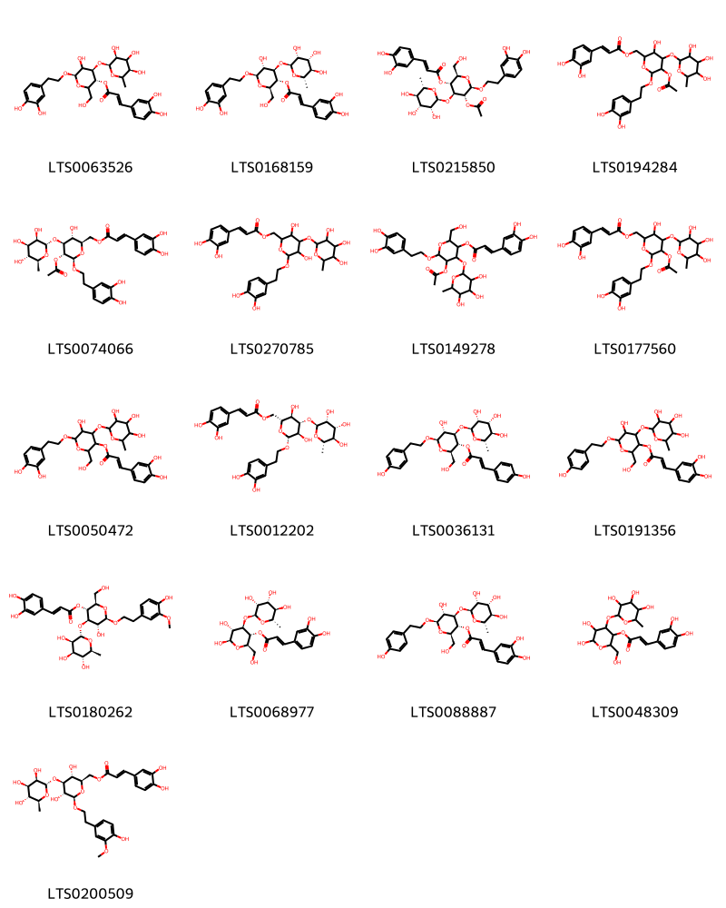
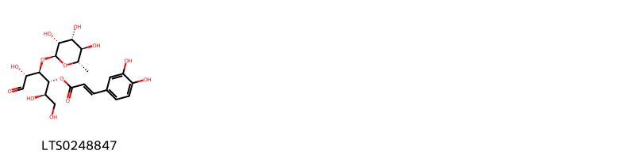
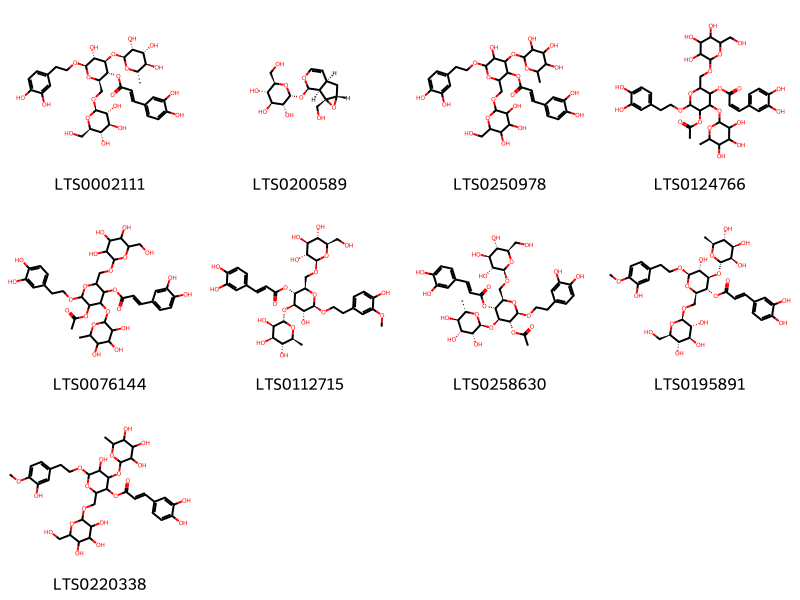
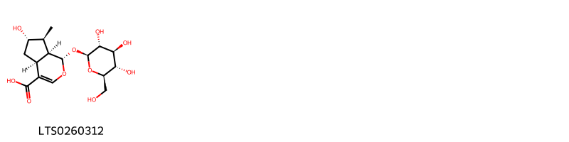

!!! abstract "Tóm tắt"
    Nhục thung dung (Herba Cistanches) là dược liệu quý thuộc họ Lệ dương (Orobanchaceae), được lấy từ các loài thực vật Cistanche deserticola và Cistanche tubulosa. Tại Việt Nam, cây phân bố ở các tỉnh Hòa Bình, Tuyên Quang, Lào Cai, và Lai Châu; trên thế giới, Cistanche deserticola phổ biến tại Trung Quốc (Bắc Trung Bộ, Nội Mông, Tân Cương) và Mông Cổ, còn Cistanche tubulosa xuất hiện ở các vùng sa mạc như Afghanistan, Ấn Độ, Trung Đông, và Bắc Phi. Nhục thung dung được sử dụng trong y học cổ truyền để điều trị các vấn đề như liệt dương, đau lưng, vô sinh, khí hư, táo bón và huyết khô.

Dược liệu này có các tác dụng chính như bổ thận tráng dương, cải thiện chức năng sinh sản, tăng cường miễn dịch, chống oxy hóa, bảo vệ thần kinh, kháng viêm, hỗ trợ tiêu hóa và tăng cường sức khỏe xương khớp. Thành phần hóa học của nhục thung dung gồm boschnaloside, orobanin, 8-epilogahic acid, betaine, hơn 10 loại axit amin, alkaloid và axit hữu cơ, góp phần vào các lợi ích sức khỏe nổi bật của nó.

## Thông tin về thực vật

### Đặc điểm thực vật

Dược liệu **Nhục Thung Dung (Thân)** từ bộ phận **nan** từ loài *Cistanche deserticola* thuộc họ Orobanchaceae. Cistanche deserticola: Dược liệu hình trụ dẹt, hơi cong, dài 3 cm đến 15 cm, đường kính 2 cm đến 8 cm. Mặt ngoài màu nâu sẫm hoặc nâu xám, phủ đầy những phiến vảy, sắp xếp như ngói lợp, đỉnh vảy nhọn thường bị gãy. Chất thịt và hơi dẻo, thể nặng, khó bẻ gãy, mặt gẫy màu nâu sẫm có những đốm nâu nhạt của những bó mạch xếp theo vòng lượn sóng. Mùi nhẹ, vị ngọt hơi đắng.
Cistanche tubulosa: Gần như hình thoi, hình thoi dẹt và hình trụ dẹt, hơi cong, dài 5 cm đến 25 cm, đường kính 2,5 cm đến 9 cm. Mặt ngoài màu nâu sẫm. Mặt gãy trông giống như hạt, màu nâu xám có những đốm với những bó mạch xếp rải rác. 

!!! info "Phân loại thực vật của *Cistanche deserticola*"
    - **Kingdom:** Plantae
    - **Phylum:** Tracheophyta
    - **Order:** Lamiales
    - **Family:** Orobanchaceae
    - **Genus:** Cistanche
    - **Species:** *Cistanche deserticola*

*Tài liệu tham khảo:* Tài liệu khác

 

### Loài thay thế (Nếu có)

Dược liệu này cũng có thể từ loài *Cistanche tubulosa*, thông tin về phân loại thực vật loài này như sau:
!!! info "Thông tin về phân loại thực vật của *Cistanche tubulosa*"
    - **kingdom:** Plantae
    - **phylum:** Tracheophyta
    - **order:** Lamiales
    - **family:** Orobanchaceae
    - **genus:** Cistanche
    - **species:** *Cistanche tubulosa*

Hình ảnh của loài *Cistanche tubulosa*:

### Phân bố trên thế giới
**Từ vườn thực vật KEW: **: Cistanche deserticola: China North-Central, Inner Mongolia, Mongolia, Xinjiang
Cistanche tubulosa: Afghanistan, Cape Verde, Egypt, Gulf States, India, Iran, Iraq, Kazakhstan, Kuwait, Lebanon-Syria, Libya, Mali, Oman, Pakistan, Palestine, Saudi Arabia, Sinai, Socotra, Turkmenistan, Yemen

**Từ CSDL GIBF** nan, Mongolia, United States of America, China

### Phân bố tại Việt Nam
** Tài liệu khác**: Hòa Bình, Tuyên Quang, Lào Cai, Lai Châu

**Từ CSDL GIBF**: Không có ghi nhận ở Việt Nam

---

## Thông tin về dược liệu 

### Định danh

!!! info "Thông tin về tên gọi của nan"
    - Dược liệu tiếng Việt: nan
    - Dược liệu tiếng Trung: nan (nan)
    - Dược liệu tiếng Anh: nan
    - Dược liệu latin thông dụng: nan
    - Dược liệu latin kiểu DĐVN: herba cistanches
    - Dược liệu latin kiểu DĐVN: nan
    - Dược liệu latin kiểu thông tư: nan
    - Bộ phận dùng: nan (nan)

### Mô tả dược liệu 
- **Theo dược điển Việt nam V:** nan

- **Mô tả dược liệu theo thông tư chế biến dược liệu theo phương pháp cổ truyền:** nan

### Chế biến 

- **Chế biến theo dược điển việt nam V**: nan

- **Chế biến theo thông tư:** nan

--- 

## Thành phần hóa học

- Theo tài liệu của GS. Đỗ Tất Lợi:  Boschnaloside, orobanin, 8- epilogahic axit, betaine, axít hữu cơ, hơn 10 loại axit amin, alkaloid (hàm lượng ít)
    
- Theo cơ sở dữ liệu lotus: Từ loài *Cistanche deserticola* đã phân lập và xác định được 29 hoạt chất thuộc về các nhóm Organooxygen compounds, Prenol lipids, Fatty Acyls, Indoles and derivatives, Cinnamic acids and derivatives. 

|    | chemicalTaxonomyClassyfireClass   |   smiles_count |
|---:|:----------------------------------|---------------:|
|  0 | Cinnamic acids and derivatives    |             17 |
|  1 | Fatty Acyls                       |              1 |
|  2 | Indoles and derivatives           |              1 |
|  3 | Organooxygen compounds            |              9 |
|  4 | Prenol lipids                     |              1 |

### Nhóm Cinnamic acids and derivatives
<figure markdown="span">
    { width=100% }
    <figcaption>Hình ảnh cấu trúc hóa học của 17 hoạt chất thuộc nhóm Cinnamic acids and derivatives gồm ['(3r,4r,6r)-6-[2-(3,4-dihydroxyphenyl)ethoxy]-5-hydroxy-2-(hydroxymethyl)-4-{[(2s,3s,5r)-3,4,5-trihydroxy-6-methyloxan-2-yl]oxy}oxan-3-yl (2e)-3-(3,4-dihydroxyphenyl)prop-2-enoate (LTS0063526)', 'verbascoside (LTS0168159)', '(2r,3r,4s,5r,6r)-5-(acetyloxy)-6-[2-(3,4-dihydroxyphenyl)ethoxy]-2-(hydroxymethyl)-4-{[(2s,3r,4r,5r,6s)-3,4,5-trihydroxy-6-methyloxan-2-yl]oxy}oxan-3-yl (2e)-3-(3,4-dihydroxyphenyl)prop-2-enoate (LTS0215850)', '[5-(acetyloxy)-6-[2-(3,4-dihydroxyphenyl)ethoxy]-3-hydroxy-4-[(3,4,5-trihydroxy-6-methyloxan-2-yl)oxy]oxan-2-yl]methyl 3-(3,4-dihydroxyphenyl)prop-2-enoate (LTS0194284)', '[(2r,3r,4s,5r,6r)-5-(acetyloxy)-6-[2-(3,4-dihydroxyphenyl)ethoxy]-3-hydroxy-4-{[(2s,3r,4r,5r,6s)-3,4,5-trihydroxy-6-methyloxan-2-yl]oxy}oxan-2-yl]methyl (2e)-3-(3,4-dihydroxyphenyl)prop-2-enoate (LTS0074066)', '{6-[2-(3,4-dihydroxyphenyl)ethoxy]-3,5-dihydroxy-4-[(3,4,5-trihydroxy-6-methyloxan-2-yl)oxy]oxan-2-yl}methyl 3-(3,4-dihydroxyphenyl)prop-2-enoate (LTS0270785)', '5-(acetyloxy)-6-[2-(3,4-dihydroxyphenyl)ethoxy]-2-(hydroxymethyl)-4-[(3,4,5-trihydroxy-6-methyloxan-2-yl)oxy]oxan-3-yl 3-(3,4-dihydroxyphenyl)prop-2-enoate (LTS0149278)', '[5-(acetyloxy)-6-[2-(3,4-dihydroxyphenyl)ethoxy]-3-hydroxy-4-[(3,4,5-trihydroxy-6-methyloxan-2-yl)oxy]oxan-2-yl]methyl (2e)-3-(3,4-dihydroxyphenyl)prop-2-enoate (LTS0177560)', '6-[2-(3,4-dihydroxyphenyl)ethoxy]-5-hydroxy-2-(hydroxymethyl)-4-[(3,4,5-trihydroxy-6-methyloxan-2-yl)oxy]oxan-3-yl 3-(3,4-dihydroxyphenyl)prop-2-enoate (LTS0050472)', 'isoacteoside (LTS0012202)', '(2r,3r,4r,5r,6r)-5-hydroxy-2-(hydroxymethyl)-6-[2-(4-hydroxyphenyl)ethoxy]-4-{[(2s,3r,4r,5r,6s)-3,4,5-trihydroxy-6-methyloxan-2-yl]oxy}oxan-3-yl (2e)-3-(4-hydroxyphenyl)prop-2-enoate (LTS0036131)', '5-hydroxy-2-(hydroxymethyl)-6-[2-(4-hydroxyphenyl)ethoxy]-4-[(3,4,5-trihydroxy-6-methyloxan-2-yl)oxy]oxan-3-yl 3-(3,4-dihydroxyphenyl)prop-2-enoate (LTS0191356)', '(2r,3r,4r,5r,6r)-5-hydroxy-6-[2-(4-hydroxy-3-methoxyphenyl)ethoxy]-2-(hydroxymethyl)-4-{[(2s,3r,4r,5r,6s)-3,4,5-trihydroxy-6-methyloxan-2-yl]oxy}oxan-3-yl (2e)-3-(3,4-dihydroxyphenyl)prop-2-enoate (LTS0180262)', '(2r,3r,4r,5r,6r)-5,6-dihydroxy-2-(hydroxymethyl)-4-{[(2s,3r,4r,5r,6s)-3,4,5-trihydroxy-6-methyloxan-2-yl]oxy}oxan-3-yl (2e)-3-(3,4-dihydroxyphenyl)prop-2-enoate (LTS0068977)', '(2r,3r,4r,5r,6r)-5-hydroxy-2-(hydroxymethyl)-6-[2-(4-hydroxyphenyl)ethoxy]-4-{[(2s,3r,4r,5r,6s)-3,4,5-trihydroxy-6-methyloxan-2-yl]oxy}oxan-3-yl (2e)-3-(3,4-dihydroxyphenyl)prop-2-enoate (LTS0088887)', '5,6-dihydroxy-2-(hydroxymethyl)-4-[(3,4,5-trihydroxy-6-methyloxan-2-yl)oxy]oxan-3-yl 3-(3,4-dihydroxyphenyl)prop-2-enoate (LTS0048309)', '[(2r,3r,4s,5r,6r)-3,5-dihydroxy-6-[2-(4-hydroxy-3-methoxyphenyl)ethoxy]-4-{[(2s,3r,4r,5r,6s)-3,4,5-trihydroxy-6-methyloxan-2-yl]oxy}oxan-2-yl]methyl (2e)-3-(3,4-dihydroxyphenyl)prop-2-enoate (LTS0200509)'].</figcaption>
</figure>
### Nhóm Fatty Acyls
<figure markdown="span">
    { width=100% }
    <figcaption>Hình ảnh cấu trúc hóa học của 1 hoạt chất thuộc nhóm Fatty Acyls gồm ['(2r,3r,4r,5r)-1,2,5-trihydroxy-6-oxo-4-{[(2s,3r,4r,5r,6s)-3,4,5-trihydroxy-6-methyloxan-2-yl]oxy}hexan-3-yl (2e)-3-(3,4-dihydroxyphenyl)prop-2-enoate (LTS0248847)'].</figcaption>
</figure>
### Nhóm Indoles and derivatives
<figure markdown="span">
    { width=100% }
    <figcaption>Hình ảnh cấu trúc hóa học của 1 hoạt chất thuộc nhóm Indoles and derivatives gồm ['n-[2-(5-methoxy-1h-indol-3-yl)ethyl]ethanimidic acid (LTS0219322)'].</figcaption>
</figure>
### Nhóm Organooxygen compounds
<figure markdown="span">
    { width=100% }
    <figcaption>Hình ảnh cấu trúc hóa học của 9 hoạt chất thuộc nhóm Organooxygen compounds gồm ['echinacoside (LTS0002111)', '(2r,3s,4s,5r,6r)-2-(hydroxymethyl)-6-{[(1s,2s,4s,6r,10r)-2-(hydroxymethyl)-3,9-dioxatricyclo[4.4.0.0²,⁴]dec-7-en-10-yl]oxy}oxane-3,4,5-triol (LTS0200589)', '6-[2-(3,4-dihydroxyphenyl)ethoxy]-5-hydroxy-2-({[3,4,5-trihydroxy-6-(hydroxymethyl)oxan-2-yl]oxy}methyl)-4-[(3,4,5-trihydroxy-6-methyloxan-2-yl)oxy]oxan-3-yl 3-(3,4-dihydroxyphenyl)prop-2-enoate (LTS0250978)', '5-(acetyloxy)-6-[2-(3,4-dihydroxyphenyl)ethoxy]-2-({[3,4,5-trihydroxy-6-(hydroxymethyl)oxan-2-yl]oxy}methyl)-4-[(3,4,5-trihydroxy-6-methyloxan-2-yl)oxy]oxan-3-yl (2z)-3-(3,4-dihydroxyphenyl)prop-2-enoate (LTS0124766)', '5-(acetyloxy)-6-[2-(3,4-dihydroxyphenyl)ethoxy]-2-({[3,4,5-trihydroxy-6-(hydroxymethyl)oxan-2-yl]oxy}methyl)-4-[(3,4,5-trihydroxy-6-methyloxan-2-yl)oxy]oxan-3-yl 3-(3,4-dihydroxyphenyl)prop-2-enoate (LTS0076144)', '(2r,3r,4r,5r,6r)-5-hydroxy-6-[2-(4-hydroxy-3-methoxyphenyl)ethoxy]-2-({[(2r,3r,4s,5s,6r)-3,4,5-trihydroxy-6-(hydroxymethyl)oxan-2-yl]oxy}methyl)-4-{[(2s,3r,4r,5r,6s)-3,4,5-trihydroxy-6-methyloxan-2-yl]oxy}oxan-3-yl (2e)-3-(3,4-dihydroxyphenyl)prop-2-enoate (LTS0112715)', '(2r,3r,4s,5r,6r)-5-(acetyloxy)-6-[2-(3,4-dihydroxyphenyl)ethoxy]-2-({[(2r,3r,4s,5s,6r)-3,4,5-trihydroxy-6-(hydroxymethyl)oxan-2-yl]oxy}methyl)-4-{[(2s,3r,4r,5r,6s)-3,4,5-trihydroxy-6-methyloxan-2-yl]oxy}oxan-3-yl (2e)-3-(3,4-dihydroxyphenyl)prop-2-enoate (LTS0258630)', '(2r,3r,4r,5r,6r)-5-hydroxy-6-[2-(3-hydroxy-4-methoxyphenyl)ethoxy]-2-({[(2r,3r,4s,5s,6r)-3,4,5-trihydroxy-6-(hydroxymethyl)oxan-2-yl]oxy}methyl)-4-{[(2s,3r,4r,5r,6s)-3,4,5-trihydroxy-6-methyloxan-2-yl]oxy}oxan-3-yl (2e)-3-(3,4-dihydroxyphenyl)prop-2-enoate (LTS0195891)', '5-hydroxy-6-[2-(3-hydroxy-4-methoxyphenyl)ethoxy]-2-({[3,4,5-trihydroxy-6-(hydroxymethyl)oxan-2-yl]oxy}methyl)-4-[(3,4,5-trihydroxy-6-methyloxan-2-yl)oxy]oxan-3-yl 3-(3,4-dihydroxyphenyl)prop-2-enoate (LTS0220338)'].</figcaption>
</figure>
### Nhóm Prenol lipids
<figure markdown="span">
    { width=100% }
    <figcaption>Hình ảnh cấu trúc hóa học của 1 hoạt chất thuộc nhóm Prenol lipids gồm ['(1s,4as,6s,7s,7as)-6-hydroxy-7-methyl-1-{[(2s,3r,4s,5s,6r)-3,4,5-trihydroxy-6-(hydroxymethyl)oxan-2-yl]oxy}-1h,4ah,5h,6h,7h,7ah-cyclopenta[c]pyran-4-carboxylic acid (LTS0260312)'].</figcaption>
</figure>

---

## Tác dụng dược lý

Theo tài liệu Tài liệu khác:- Bổ thận, tráng dương 
- Cải thiện chức năng sinh sản 
- Tăng cường miễn dịch 
- Chống oxy hóa
- Tác dụng bảo vệ thần kinh 
- Kháng viêm và bảo vệ gan 
- Hỗ trợ tiêu hóa và điều trị táo bón
- Tăng cường sức khỏe xương khớp

Theo tài liệu quốc tế: nan

---

## Dược điển Việt Nam V

### Soi bột:
nan
<!-- Hình ảnh soi bột sẽ được tự động chèn vào đây sau -->
### Vi phẫu:
nan
<!-- Hình ảnh vi phẫu sẽ được tự động chèn vào đây sau -->
### Định tính

nan

### Định lượng

nan

### Thông tin khác 
- ** Độ ẩm: ** nan

- ** Bảo quản:** nan
## Dược điển Hồng kong

<!-- PDF sẽ được tự động chèn vào đây sau -->

---

## Y dược học cổ truyền

- **Tên vị thuốc:** nan
- **Tính vị quy kinh:** Cam, hàn, ôn. Vào các kinh thận, đại trường.
- **Công năng chủ trị:** Bổ thận dương, ích tinh huyết, nhuận tràng thông tiện. Chủ trị: Liệt dương, di tinh, khó thụ thai, thắt lưng đầu gối đau mỏi, gân xương vô lực, táo bón ở người già, huyết hư tân dịch không đủ.
- **Chú ý:** nan
- **Kiêng kỵ:** nan

