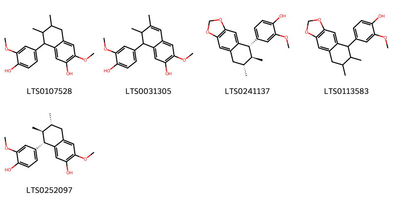
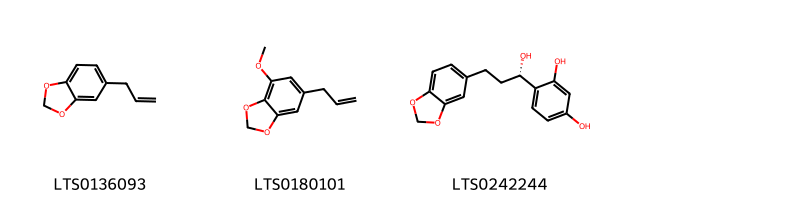
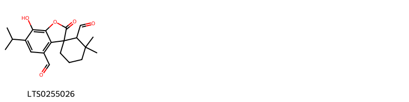
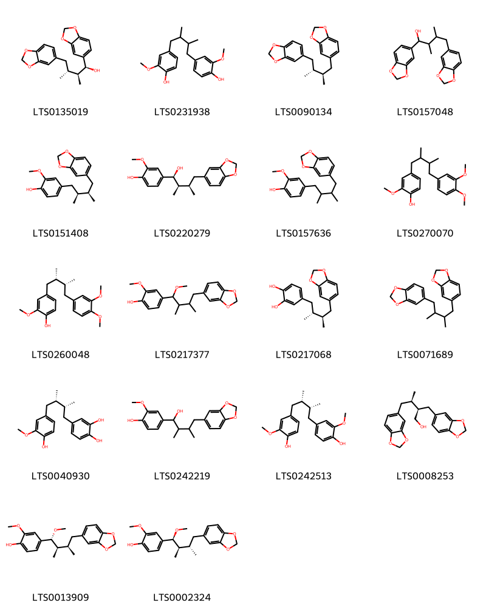
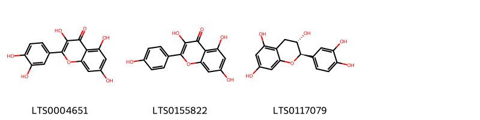
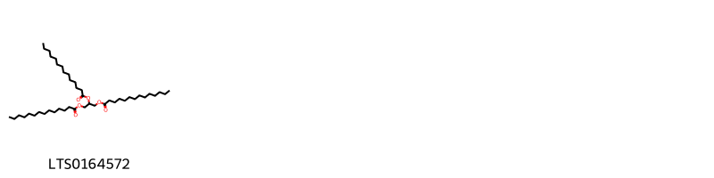
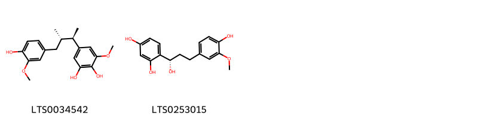
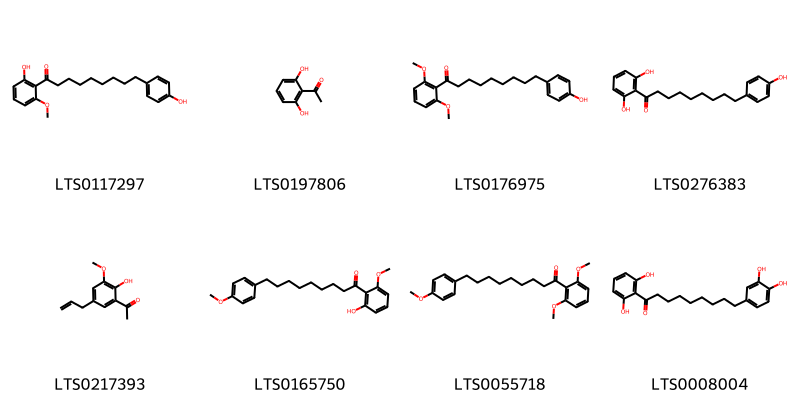
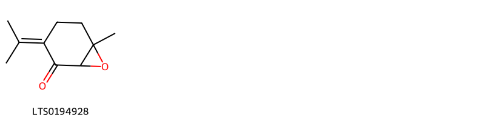
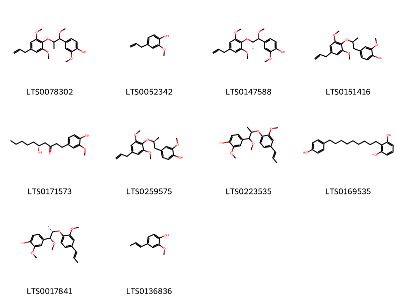

!!! abstract "Tóm tắt"
    Hạt đã phơi khô (Semen Myristicae) của cây Nhục đậu khấu (Myristica fragrans Houtt.) thuộc họ Nhục đậu khấu (Myristicaceae) là phần được sử dụng làm dược liệu, mỗi quả thường chỉ có 1 hạt. Cây phân bố ở nhiều nơi trên thế giới, có nguồn gốc từ Maluku và được du nhập vào nhiều nước như Assam, Bangladesh, Trung Nam Trung Quốc, Đông Nam Trung Quốc, Lào, Philippines, Đài Loan, Thái Lan, Việt Nam,... Tại Việt Nam, nhục đậu khấu được trồng ở miền Nam. Trong y dược học cổ truyền, nó có tác dụng xúc tiến sự bài tiết dịch vị, giúp sự tiêu hóa, kích thích nhu động ruột, gây ăn ngon được sử dụng giúp hỗ trợ hoạt động của hệ thống tiêu hóa nhưng khi dùng với liều cao thì có thể gây độc. Một số thành phần hóa học đã được phát hiện và xác định cấu trúc thuộc các nhóm carbohydrate, chất béo, tinh dầu, chất nhựa, flavonoid, terpene, các dẫn xuất của terpene và phenylpropanoids.

## Thông tin về thực vật

### Đặc điểm thực vật

Dược liệu **Nhục Đậu Khấu (Hạt)** từ bộ phận **nan** từ loài *Myristica fragrans Houtt.* thuộc họ Myristicaceae. Là một cây to, cao 8-10m. Toàn thân nhẵn. Lá mọc so le, xanh tươi quanh năm, dai, phiến lá hình mác rộng, dài 5-15cm, rộng 3-7cm, mép nguyên, cuống lá dài 7-12mm. Hoa khác gốc mọc thành xim ở kẽ lá, có dáng tán. Màu hoa vàng trắng. Quả hạch, hình cầu hay quả lê, màu vàng, đường kính 5-8cm, khi chín nở theo chiều dọc thành 2 mảnh, trong có một hạt có vỏ dày cũng, bảo bọc bởi một áo hạt bị rách, màu hồng. 

!!! info "Phân loại thực vật của *Myristica fragrans*"
    - **Kingdom:** Plantae
    - **Phylum:** Tracheophyta
    - **Order:** Magnoliales
    - **Family:** Myristicaceae
    - **Genus:** Myristica
    - **Species:** *Myristica fragrans*

*Tài liệu tham khảo:* "Những cây thuốc và vị thuốc Việt Nam" - Đỗ Tất Lợi

 

### Loài thay thế (Nếu có)

### Phân bố trên thế giới
**Từ vườn thực vật KEW: **: - Native to: Maluku
- Introduced into: Assam, Bangladesh, China South-Central, China Southeast, Comoros, Gulf of Guinea Is., Jawa, Laos, Mauritius, Philippines, Réunion, Samoa, Taiwan, Thailand, Vietnam

**Từ CSDL GIBF** Grenada, Réunion, Mauritius, nan, Tanzania, United Republic of, Belgium, Spain, Norway, Puerto Rico, unknown or invalid, Côte d’Ivoire, Madagascar, Malaysia, Thailand, Guadeloupe, Papua New Guinea, Brazil, Honduras, Singapore, Georgia, Indonesia, Saint Vincent and the Grenadines, India, Dominica, Panama, Costa Rica, Comoros, Seychelles, Micronesia (Federated States of), Saint Lucia, Nicaragua, Iraq, French Polynesia, China, Türkiye, Peru, Cook Islands, Mayotte, El Salvador, Philippines, Sao Tome and Principe, Dominican Republic, Trinidad and Tobago, Equatorial Guinea, Jamaica, United States of America, Bangladesh, Chinese Taipei, France, Benin, Samoa, Sri Lanka

### Phân bố tại Việt Nam
** "Những cây thuốc và vị thuốc Việt Nam" - Đỗ Tất Lợi**: Được trồng ở miền Nam Việt Nam

**Từ CSDL GIBF**: Không có ghi nhận ở Việt Nam

---

## Thông tin về dược liệu 

### Định danh

!!! info "Thông tin về tên gọi của nan"
    - Dược liệu tiếng Việt: nan
    - Dược liệu tiếng Trung: nan (nan)
    - Dược liệu tiếng Anh: nan
    - Dược liệu latin thông dụng: nan
    - Dược liệu latin kiểu DĐVN: semen myristicae
    - Dược liệu latin kiểu DĐVN: nan
    - Dược liệu latin kiểu thông tư: nan
    - Bộ phận dùng: nan (nan)

### Mô tả dược liệu 
- **Theo dược điển Việt nam V:** nan

- **Mô tả dược liệu theo thông tư chế biến dược liệu theo phương pháp cổ truyền:** nan

### Chế biến 

- **Chế biến theo dược điển việt nam V**: nan

- **Chế biến theo thông tư:** nan

--- 

## Thành phần hóa học

- Theo tài liệu của GS. Đỗ Tất Lợi:  (1) Carbohydrate, chất béo, tinh dầu và chất nhựa, flavonoid, terpen, các dẫn xuất của terpene và phenylpropanoids
(2) Biomarker: Tinh dầu Nhục đậu khấu
    
- Theo cơ sở dữ liệu lotus: Từ loài *Myristica fragrans* đã phân lập và xác định được 178 hoạt chất thuộc về các nhóm Cinnamyl alcohols, Linear 1,3-diarylpropanoids, Stilbenes, Benzene and substituted derivatives, Phenols, Glycerolipids, Benzodioxoles, Phenol ethers, Cinnamic acids and derivatives, Organooxygen compounds, Prenol lipids, Fatty Acyls, Furanoid lignans, Aryltetralin lignans, Oxepanes, Dibenzylbutane lignans, Benzofurans, Phenol esters, Flavonoids, 2-arylbenzofuran flavonoids. 

|    | chemicalTaxonomyClassyfireClass     |   smiles_count |
|---:|:------------------------------------|---------------:|
|  0 |                                     |             25 |
|  1 | 2-arylbenzofuran flavonoids         |             23 |
|  2 | Aryltetralin lignans                |              5 |
|  3 | Benzene and substituted derivatives |              8 |
|  4 | Benzodioxoles                       |              3 |
|  5 | Benzofurans                         |              1 |
|  6 | Cinnamic acids and derivatives      |              4 |
|  7 | Cinnamyl alcohols                   |              4 |
|  8 | Dibenzylbutane lignans              |             18 |
|  9 | Fatty Acyls                         |              6 |
| 10 | Flavonoids                          |              3 |
| 11 | Furanoid lignans                    |             32 |
| 12 | Glycerolipids                       |              1 |
| 13 | Linear 1,3-diarylpropanoids         |              2 |
| 14 | Organooxygen compounds              |              8 |
| 15 | Oxepanes                            |              1 |
| 16 | Phenol esters                       |              1 |
| 17 | Phenol ethers                       |              4 |
| 18 | Phenols                             |             10 |
| 19 | Prenol lipids                       |             16 |
| 20 | Stilbenes                           |              2 |

### Nhóm 
<figure markdown="span">
    { width=100% }
    <figcaption>Hình ảnh cấu trúc hóa học của 25 hoạt chất thuộc nhóm  gồm ['3-(4-{[1-(3,4-dimethoxyphenyl)-1-hydroxypropan-2-yl]oxy}-3,5-dimethoxyphenyl)prop-2-en-1-ol (LTS0136359)', '4-[(1s,2r)-1-hydroxy-2-{2-methoxy-4-[(1e)-prop-1-en-1-yl]phenoxy}propyl]-2-methoxyphenol (LTS0210988)', '5-[(1r,2r)-2-[2,6-dimethoxy-4-(prop-2-en-1-yl)phenoxy]-1-hydroxypropyl]-2,3-dimethoxyphenol (LTS0083044)', '2-[2,6-dimethoxy-4-(prop-2-en-1-yl)phenoxy]-1-(3,4,5-trimethoxyphenyl)propane-1,3-diol (LTS0092870)', '4-[(1r,2s)-2-[2,6-dimethoxy-4-(prop-2-en-1-yl)phenoxy]-1-hydroxypropyl]-2,6-dimethoxyphenol (LTS0064553)', '4-[(1r,2s)-1-hydroxy-2-{2-methoxy-4-[(1e)-prop-1-en-1-yl]phenoxy}propyl]-2,6-dimethoxyphenol (LTS0099784)', '4-[(1r,2s)-1-hydroxy-2-[2-methoxy-4-(prop-2-en-1-yl)phenoxy]propyl]-2-methoxyphenol (LTS0143726)', '(2e)-3-(4-{[(1r,2r)-1-hydroxy-1-(3,4,5-trimethoxyphenyl)propan-2-yl]oxy}-3,5-dimethoxyphenyl)prop-2-en-1-ol (LTS0109843)', '(2e)-3-(4-{[(1s,2r)-1-(3,4-dimethoxyphenyl)-1-hydroxypropan-2-yl]oxy}-3,5-dimethoxyphenyl)prop-2-en-1-ol (LTS0134062)', '4-{1-hydroxy-2-[2-methoxy-4-(prop-1-en-1-yl)phenoxy]propyl}-2,6-dimethoxyphenol (LTS0177606)', '4-[(1r,2s)-1-hydroxy-2-{2-methoxy-4-[(1e)-prop-1-en-1-yl]phenoxy}propyl]-2-methoxyphenol (LTS0231691)', '3-(4-{[1-hydroxy-1-(3,4,5-trimethoxyphenyl)propan-2-yl]oxy}-3,5-dimethoxyphenyl)prop-2-en-1-ol (LTS0047857)', '(1r,2r)-2-[2,6-dimethoxy-4-(prop-2-en-1-yl)phenoxy]-1-(3,4,5-trimethoxyphenyl)propane-1,3-diol (LTS0216672)', '(1s,2r)-2-[2,6-dimethoxy-4-(prop-2-en-1-yl)phenoxy]-1-(3,4-dimethoxyphenyl)propan-1-ol (LTS0235107)', '(2z)-3-(4-{[1-(3,4-dimethoxyphenyl)-1-hydroxypropan-2-yl]oxy}-3,5-dimethoxyphenyl)prop-2-en-1-ol (LTS0065021)', '(2e)-3-(4-{[(1s,2r)-1-hydroxy-1-(3,4,5-trimethoxyphenyl)propan-2-yl]oxy}-3,5-dimethoxyphenyl)prop-2-en-1-ol (LTS0000022)', '5-{2-[2,6-dimethoxy-4-(prop-2-en-1-yl)phenoxy]-1-hydroxypropyl}-2,3-dimethoxyphenol (LTS0000007)', '4-{1-hydroxy-2-[2-methoxy-4-(prop-2-en-1-yl)phenoxy]propyl}-2-methoxyphenol (LTS0046465)', '4-[(1r,2s)-2-[2,6-dimethoxy-4-(prop-2-en-1-yl)phenoxy]-1-hydroxypropyl]-2-methoxyphenol (LTS0228300)', '4-[(1s,2r)-1-hydroxy-2-[2-methoxy-4-(prop-1-en-1-yl)phenoxy]propyl]-2-methoxyphenol (LTS0241902)', '(2e)-3-(4-{[(1r,2s)-1-(3,4-dimethoxyphenyl)-1-hydroxypropan-2-yl]oxy}-3,5-dimethoxyphenyl)prop-2-en-1-ol (LTS0005438)', '4-{2-[2,6-dimethoxy-4-(prop-2-en-1-yl)phenoxy]-1-hydroxypropyl}-2-methoxyphenol (LTS0124088)', '4-{2-[2,6-dimethoxy-4-(prop-2-en-1-yl)phenoxy]-1-hydroxypropyl}-2,6-dimethoxyphenol (LTS0024411)', '(2z)-3-(4-{[1-hydroxy-1-(3,4,5-trimethoxyphenyl)propan-2-yl]oxy}-3,5-dimethoxyphenyl)prop-2-en-1-ol (LTS0264266)', '4-{1-hydroxy-2-[2-methoxy-4-(prop-1-en-1-yl)phenoxy]propyl}-2-methoxyphenol (LTS0121640)'].</figcaption>
</figure>
### Nhóm 2-arylbenzofuran flavonoids
<figure markdown="span">
    { width=100% }
    <figcaption>Hình ảnh cấu trúc hóa học của 23 hoạt chất thuộc nhóm 2-arylbenzofuran flavonoids gồm ['(2e)-3-[7-methoxy-2-(7-methoxy-2h-1,3-benzodioxol-5-yl)-3-methyl-2,3-dihydro-1-benzofuran-5-yl]prop-2-en-1-ol (LTS0075904)', '2-methoxy-4-[(2s,3r)-7-methoxy-3-methyl-5-[(1e)-prop-1-en-1-yl]-2,3-dihydro-1-benzofuran-2-yl]phenol (LTS0125755)', '2-methoxy-4-[(2r,3r)-7-methoxy-3-methyl-5-(prop-2-en-1-yl)-2,3-dihydro-1-benzofuran-2-yl]phenol (LTS0083644)', '2-methoxy-4-[(2r,3r)-7-methoxy-3-methyl-5-[(1e)-prop-1-en-1-yl]-2,3-dihydro-1-benzofuran-2-yl]phenol (LTS0179341)', '(2e)-3-[(2r,3r)-7-methoxy-2-(7-methoxy-2h-1,3-benzodioxol-5-yl)-3-methyl-2,3-dihydro-1-benzofuran-5-yl]prop-2-en-1-ol (LTS0263971)', '2-methoxy-4-{7-methoxy-3-methyl-5-[(1e)-prop-1-en-1-yl]-2,3-dihydro-1-benzofuran-2-yl}phenol (LTS0157894)', '2-methoxy-4-[7-methoxy-3-methyl-5-(prop-1-en-1-yl)-2,3-dihydro-1-benzofuran-2-yl]phenol (LTS0185228)', '4-[5-(2-hydroxy-1-methoxypropyl)-7-methoxy-3-methyl-2,3-dihydro-1-benzofuran-2-yl]-2-methoxyphenol (LTS0159956)', '2-(3,4-dimethoxyphenyl)-7-methoxy-3-methyl-5-(prop-1-en-1-yl)-2,3-dihydro-1-benzofuran (LTS0225858)', '5-[(2r,3r)-7-methoxy-3-methyl-5-[(1e)-prop-1-en-1-yl]-2,3-dihydro-1-benzofuran-2-yl]-2h-1,3-benzodioxole (LTS0116039)', '(2e)-3-[2-(3,4-dimethoxyphenyl)-7-methoxy-3-methyl-2,3-dihydro-1-benzofuran-5-yl]prop-2-en-1-ol (LTS0160235)', '2-methoxy-4-[7-methoxy-3-methyl-5-(prop-2-en-1-yl)-2,3-dihydro-1-benzofuran-2-yl]phenol (LTS0193440)', '3-[2-(3,4-dimethoxyphenyl)-7-methoxy-3-methyl-2,3-dihydro-1-benzofuran-5-yl]prop-2-en-1-ol (LTS0211877)', '4-[(2s,3s)-5-(2-hydroxyethyl)-7-methoxy-3-methyl-2,3-dihydro-1-benzofuran-2-yl]-2-methoxyphenol (LTS0220337)', '5-[(3s)-7-methoxy-3-methyl-5-[(1e)-prop-1-en-1-yl]-2,3-dihydro-1-benzofuran-2-yl]-2h-1,3-benzodioxole (LTS0249202)', '2-methoxy-4-{7-methoxy-3-methyl-5-[(1z)-prop-1-en-1-yl]-2,3-dihydro-1-benzofuran-2-yl}phenol (LTS0038526)', '4-[5-(2-hydroxyethyl)-7-methoxy-3-methyl-2,3-dihydro-1-benzofuran-2-yl]-2-methoxyphenol (LTS0015101)', '4-[(2s,3s)-5-[(1s,2s)-2-hydroxy-1-methoxypropyl]-7-methoxy-3-methyl-2,3-dihydro-1-benzofuran-2-yl]-2-methoxyphenol (LTS0013555)', '(2s,3s)-2-(3,4-dimethoxyphenyl)-7-methoxy-3-methyl-5-[(1e)-prop-1-en-1-yl]-2,3-dihydro-1-benzofuran (LTS0003849)', '(2e)-3-[(2s,3s)-2-(3,4-dimethoxyphenyl)-7-methoxy-3-methyl-2,3-dihydro-1-benzofuran-5-yl]prop-2-en-1-ol (LTS0001731)', '4-[(2r,3r)-5-[(1s,2r)-2-hydroxy-1-methoxypropyl]-7-methoxy-3-methyl-2,3-dihydro-1-benzofuran-2-yl]-2-methoxyphenol (LTS0042981)', 'licarin a (LTS0103625)', '3-[7-methoxy-2-(7-methoxy-2h-1,3-benzodioxol-5-yl)-3-methyl-2,3-dihydro-1-benzofuran-5-yl]prop-2-en-1-ol (LTS0044522)'].</figcaption>
</figure>
### Nhóm Aryltetralin lignans
<figure markdown="span">
    { width=100% }
    <figcaption>Hình ảnh cấu trúc hóa học của 5 hoạt chất thuộc nhóm Aryltetralin lignans gồm ['8-(4-hydroxy-3-methoxyphenyl)-3-methoxy-6,7-dimethyl-5,6,7,8-tetrahydronaphthalen-2-ol (LTS0107528)', '8-(4-hydroxy-3-methoxyphenyl)-3-methoxy-6,7-dimethyl-7,8-dihydronaphthalen-2-ol (LTS0031305)', '4-[(5s,6s,7r)-6,7-dimethyl-2h,5h,6h,7h,8h-naphtho[2,3-d][1,3]dioxol-5-yl]-2-methoxyphenol (LTS0241137)', '4-{6,7-dimethyl-2h,5h,6h,7h,8h-naphtho[2,3-d][1,3]dioxol-5-yl}-2-methoxyphenol (LTS0113583)', '(+)-guaiacin (LTS0252097)'].</figcaption>
</figure>
### Nhóm Benzene and substituted derivatives
<figure markdown="span">
    { width=100% }
    <figcaption>Hình ảnh cấu trúc hóa học của 8 hoạt chất thuộc nhóm Benzene and substituted derivatives gồm ['galop (LTS0222857)', '(1s,2r)-2-[2,6-dimethoxy-4-(prop-2-en-1-yl)phenoxy]-1-(3,4-dimethoxyphenyl)propyl acetate (LTS0135488)', '6-tert-butyl-m-cresol (LTS0083347)', 'syringic acid (LTS0210036)', 'o-cymene (LTS0096514)', 'methyl eugenol (LTS0098881)', '3,4-dihydroxybenzoic acid (LTS0018765)', 'salicyclic acid (LTS0116548)'].</figcaption>
</figure>
### Nhóm Benzodioxoles
<figure markdown="span">
    { width=100% }
    <figcaption>Hình ảnh cấu trúc hóa học của 3 hoạt chất thuộc nhóm Benzodioxoles gồm ['sassafras (LTS0136093)', 'myristicin (LTS0180101)', '4-[(1s)-3-(2h-1,3-benzodioxol-5-yl)-1-hydroxypropyl]benzene-1,3-diol (LTS0242244)'].</figcaption>
</figure>
### Nhóm Benzofurans
<figure markdown="span">
    { width=100% }
    <figcaption>Hình ảnh cấu trúc hóa học của 1 hoạt chất thuộc nhóm Benzofurans gồm ["7-hydroxy-6-isopropyl-3',3'-dimethyl-2-oxospiro[1-benzofuran-3,1'-cyclohexane]-2',4-dicarbaldehyde (LTS0255026)"].</figcaption>
</figure>
### Nhóm Cinnamic acids and derivatives
<figure markdown="span">
    { width=100% }
    <figcaption>Hình ảnh cấu trúc hóa học của 4 hoạt chất thuộc nhóm Cinnamic acids and derivatives gồm ['3,4-dihydroxycinnamic acid (LTS0128050)', 'para-coumaric acid (LTS0266252)', 'rosemary acid (LTS0207820)', 'hydroxycinnamic acid (LTS0233023)'].</figcaption>
</figure>
### Nhóm Cinnamyl alcohols
<figure markdown="span">
    { width=100% }
    <figcaption>Hình ảnh cấu trúc hóa học của 4 hoạt chất thuộc nhóm Cinnamyl alcohols gồm ['3-(3,4,5-trimethoxyphenyl)prop-2-en-1-ol (LTS0071419)', '(2e)-3-(3,4,5-trimethoxyphenyl)prop-2-en-1-ol (LTS0124755)', '(2e)-3-(7-methoxy-2h-1,3-benzodioxol-5-yl)prop-2-en-1-ol (LTS0183275)', '3-(7-methoxy-2h-1,3-benzodioxol-5-yl)prop-2-en-1-ol (LTS0127330)'].</figcaption>
</figure>
### Nhóm Dibenzylbutane lignans
<figure markdown="span">
    { width=100% }
    <figcaption>Hình ảnh cấu trúc hóa học của 18 hoạt chất thuộc nhóm Dibenzylbutane lignans gồm ['(1s,2s,3r)-1,4-bis(2h-1,3-benzodioxol-5-yl)-2,3-dimethylbutan-1-ol (LTS0135019)', '4-[4-(4-hydroxy-3-methoxyphenyl)-2,3-dimethylbutyl]-2-methoxyphenol (LTS0231938)', '5-[(2r,3r)-4-(2h-1,3-benzodioxol-5-yl)-2,3-dimethylbutyl]-2h-1,3-benzodioxole (LTS0090134)', '1,4-bis(2h-1,3-benzodioxol-5-yl)-2,3-dimethylbutan-1-ol (LTS0157048)', 'macelignan (LTS0151408)', '4-[(1s,2r,3r)-4-(2h-1,3-benzodioxol-5-yl)-1-hydroxy-2,3-dimethylbutyl]-2-methoxyphenol (LTS0220279)', 'macelignan (LTS0157636)', '4-[4-(3,4-dimethoxyphenyl)-2,3-dimethylbutyl]-2-methoxyphenol (LTS0270070)', '4-[(2s,3r)-4-(3,4-dimethoxyphenyl)-2,3-dimethylbutyl]-2-methoxyphenol (LTS0260048)', '4-[4-(2h-1,3-benzodioxol-5-yl)-1-methoxy-2,3-dimethylbutyl]-2-methoxyphenol (LTS0217377)', '4-[(2r,3r)-4-(2h-1,3-benzodioxol-5-yl)-2,3-dimethylbutyl]benzene-1,2-diol (LTS0217068)', '5-[4-(2h-1,3-benzodioxol-5-yl)-2,3-dimethylbutyl]-2h-1,3-benzodioxole (LTS0071689)', '4-[(2r,3s)-4-(4-hydroxy-3-methoxyphenyl)-2,3-dimethylbutyl]benzene-1,2-diol (LTS0040930)', '4-[4-(2h-1,3-benzodioxol-5-yl)-1-hydroxy-2,3-dimethylbutyl]-2-methoxyphenol (LTS0242219)', 'meso-dihydroguaiaretic acid (LTS0242513)', '(2r,3r)-4-(2h-1,3-benzodioxol-5-yl)-2-(2h-1,3-benzodioxol-5-ylmethyl)-3-methylbutan-1-ol (LTS0008253)', '4-[(1r,2r,3r)-4-(2h-1,3-benzodioxol-5-yl)-1-methoxy-2,3-dimethylbutyl]-2-methoxyphenol (LTS0013909)', '4-[(1s,2r,3s)-4-(2h-1,3-benzodioxol-5-yl)-1-methoxy-2,3-dimethylbutyl]-2-methoxyphenol (LTS0002324)'].</figcaption>
</figure>
### Nhóm Fatty Acyls
<figure markdown="span">
    { width=100% }
    <figcaption>Hình ảnh cấu trúc hóa học của 6 hoạt chất thuộc nhóm Fatty Acyls gồm ['palmitic acid (LTS0079439)', '5-hydroxy-1-(4-hydroxy-3-methoxycyclohexyl)decan-3-one (LTS0255317)', '2-[1-hydroxy-9-(4-hydroxyphenyl)nonyl]benzene-1,3-diol (LTS0163357)', 'myristic acid (LTS0102566)', 'petroselinic acid (LTS0057266)', 'stearic acid (LTS0237766)'].</figcaption>
</figure>
### Nhóm Flavonoids
<figure markdown="span">
    { width=100% }
    <figcaption>Hình ảnh cấu trúc hóa học của 3 hoạt chất thuộc nhóm Flavonoids gồm ['quercetin (LTS0004651)', 'kaempherol (LTS0155822)', '(+)-catechol (LTS0117079)'].</figcaption>
</figure>
### Nhóm Furanoid lignans
<figure markdown="span">
    { width=100% }
    <figcaption>Hình ảnh cấu trúc hóa học của 32 hoạt chất thuộc nhóm Furanoid lignans gồm ['4-[(2s,3s,4s,5s)-5-(4-hydroxy-3-methoxyphenyl)-3,4-dimethyloxolan-2-yl]-2-methoxyphenol (LTS0041148)', '4-[(2s,3s,4s,5r)-5-(4-hydroxy-3,5-dimethoxyphenyl)-3,4-dimethyloxolan-2-yl]-2,6-dimethoxyphenol (LTS0057793)', '4-[(2r,3s,4s,5r)-5-(4-hydroxy-3-methoxyphenyl)-3,4-dimethyloxolan-2-yl]-2,6-dimethoxyphenol (LTS0180185)', '4-[(2s,3r,4s,5r)-5-(4-hydroxy-3-methoxyphenyl)-3,4-dimethyloxolan-2-yl]-2-methoxyphenol (LTS0068329)', '4-[(2r,3r,4r,5r)-5-(4-hydroxy-3-methoxyphenyl)-3,4-dimethyloxolan-2-yl]-2,6-dimethoxyphenol (LTS0094077)', '4-[(2s,3s,4r,5r)-5-(4-hydroxy-3-methoxyphenyl)-3,4-dimethyloxolan-2-yl]-2,6-dimethoxyphenol (LTS0234555)', '4-[3,4-dimethyl-5-(3,4,5-trimethoxyphenyl)oxolan-2-yl]-2-methoxyphenol (LTS0208544)', '4-[(2r,3r,4s,5s)-3,4-dimethyl-5-(3,4,5-trimethoxyphenyl)oxolan-2-yl]-2-methoxyphenol (LTS0192190)', '4-[5-(4-hydroxy-3-methoxyphenyl)-3,4-dimethyloxolan-2-yl]-2-methoxyphenol (LTS0082058)', '4-[(2s,3s,4r,5r)-5-(4-hydroxy-3,5-dimethoxyphenyl)-3,4-dimethyloxolan-2-yl]-2,6-dimethoxyphenol (LTS0094970)', '4-[5-(4-hydroxy-3-methoxyphenyl)-3,4-dimethyloxolan-2-yl]-2,6-dimethoxyphenol (LTS0013202)', '4-[5-(3,4-dimethoxyphenyl)-3,4-dimethyloxolan-2-yl]-2-methoxyphenol (LTS0031897)', '4-[(2s,3s,4s,5s)-5-(4-hydroxy-3,5-dimethoxyphenyl)-3,4-dimethyloxolan-2-yl]-2,6-dimethoxyphenol (LTS0027890)', '4-[(2s,3r,4s,5s)-3,4-dimethyl-5-(3,4,5-trimethoxyphenyl)oxolan-2-yl]-2-methoxyphenol (LTS0196259)', 'galbacin (LTS0199731)', '4-[(2s,3s,4r,5r)-5-(4-hydroxy-3-methoxyphenyl)-3,4-dimethyloxolan-2-yl]-2-methoxyphenol (LTS0240968)', '4-[(2s,3s,4r,5r)-5-(3,4-dimethoxyphenyl)-3,4-dimethyloxolan-2-yl]-2-methoxyphenol (LTS0242742)', '4-[(2s,3s,4s,5r)-5-(4-hydroxy-3-methoxyphenyl)-3,4-dimethyloxolan-2-yl]-2-methoxyphenol (LTS0167568)', '4-[(2r,3s,4s,5s)-5-(4-hydroxy-3-methoxyphenyl)-3,4-dimethyloxolan-2-yl]-2,6-dimethoxyphenol (LTS0182623)', '4-[(2r,3r,4s,5s)-5-(4-hydroxy-3-methoxyphenyl)-3,4-dimethyloxolan-2-yl]-2,6-dimethoxyphenol (LTS0211692)', '4-[(2r,3s,4s,5r)-5-(4-hydroxy-3-methoxyphenyl)-3,4-dimethyloxolan-2-yl]-2-methoxyphenol (LTS0222790)', '4-[(3s,4r)-5-(4-hydroxy-3-methoxyphenyl)-3,4-dimethyloxolan-2-yl]-2-methoxyphenol (LTS0208212)', '4-[(2s,3s,4s,5r)-5-(4-hydroxy-3-methoxyphenyl)-3,4-dimethyloxolan-2-yl]-2,6-dimethoxyphenol (LTS0148501)', '4-[(2s,3s,4s,5s)-5-(4-hydroxy-3-methoxyphenyl)-3,4-dimethyloxolan-2-yl]-2,6-dimethoxyphenol (LTS0045413)', '4-[5-(2h-1,3-benzodioxol-5-yl)-3,4-dimethyloxolan-2-yl]-2-methoxyphenol (LTS0035152)', '4-[(2r,3s,4r,5r)-5-(4-hydroxy-3,5-dimethoxyphenyl)-3,4-dimethyloxolan-2-yl]-2,6-dimethoxyphenol (LTS0039470)', '4-[5-(4-hydroxy-3,5-dimethoxyphenyl)-3,4-dimethyloxolan-2-yl]-2,6-dimethoxyphenol (LTS0054048)', '4-[(2r,3r,4s)-4-[(4-hydroxy-3-methoxyphenyl)methyl]-3-methyloxolan-2-yl]-2-methoxyphenol (LTS0271318)', '4-[(2r,3s,4s,5s)-3,4-dimethyl-5-(3,4,5-trimethoxyphenyl)oxolan-2-yl]-2-methoxyphenol (LTS0009348)', '4-[(2r,3r,4r,5r)-5-(2h-1,3-benzodioxol-5-yl)-3,4-dimethyloxolan-2-yl]-2-methoxyphenol (LTS0095843)', '5-[5-(2h-1,3-benzodioxol-5-yl)-3,4-dimethyloxolan-2-yl]-2h-1,3-benzodioxole (LTS0252710)', '4-[(2s,3s,4s,5s)-5-(2h-1,3-benzodioxol-5-yl)-3,4-dimethyloxolan-2-yl]-2-methoxyphenol (LTS0263813)'].</figcaption>
</figure>
### Nhóm Glycerolipids
<figure markdown="span">
    { width=100% }
    <figcaption>Hình ảnh cấu trúc hóa học của 1 hoạt chất thuộc nhóm Glycerolipids gồm ['trimyristin (LTS0164572)'].</figcaption>
</figure>
### Nhóm Linear 1_3-diarylpropanoids
<figure markdown="span">
    { width=100% }
    <figcaption>Hình ảnh cấu trúc hóa học của Không tìm thấy chú thích hoạt chất thuộc nhóm Linear 1_3-diarylpropanoids gồm Không tìm thấy chú thích.</figcaption>
</figure>
### Nhóm Organooxygen compounds
<figure markdown="span">
    { width=100% }
    <figcaption>Hình ảnh cấu trúc hóa học của 8 hoạt chất thuộc nhóm Organooxygen compounds gồm ['1-(2-hydroxy-6-methoxyphenyl)-9-(4-hydroxyphenyl)nonan-1-one (LTS0117297)', "2',6'-dihydroxyacetophenone (LTS0197806)", '1-(2,6-dimethoxyphenyl)-9-(4-hydroxyphenyl)nonan-1-one (LTS0176975)', '1-(2,6-dihydroxyphenyl)-9-(4-hydroxyphenyl)nonan-1-one (LTS0276383)', '1-[2-hydroxy-3-methoxy-5-(prop-2-en-1-yl)phenyl]ethanone (LTS0217393)', '1-(2-hydroxy-6-methoxyphenyl)-9-(4-methoxyphenyl)nonan-1-one (LTS0165750)', '1-(2,6-dimethoxyphenyl)-9-(4-methoxyphenyl)nonan-1-one (LTS0055718)', 'malabaricone c (LTS0008004)'].</figcaption>
</figure>
### Nhóm Oxepanes
<figure markdown="span">
    { width=100% }
    <figcaption>Hình ảnh cấu trúc hóa học của 1 hoạt chất thuộc nhóm Oxepanes gồm ['6-methyl-3-(propan-2-ylidene)-7-oxabicyclo[4.1.0]heptan-2-one (LTS0194928)'].</figcaption>
</figure>
### Nhóm Phenol esters
<figure markdown="span">
    { width=100% }
    <figcaption>Hình ảnh cấu trúc hóa học của 1 hoạt chất thuộc nhóm Phenol esters gồm ['eugenyl acetate (LTS0165886)'].</figcaption>
</figure>
### Nhóm Phenol ethers
<figure markdown="span">
    { width=100% }
    <figcaption>Hình ảnh cấu trúc hóa học của 4 hoạt chất thuộc nhóm Phenol ethers gồm ['elemicin (LTS0188875)', 'p-propenylanisole (LTS0177188)', 'tarragon (LTS0245226)', 'anethole (LTS0033696)'].</figcaption>
</figure>
### Nhóm Phenols
<figure markdown="span">
    { width=100% }
    <figcaption>Hình ảnh cấu trúc hóa học của 10 hoạt chất thuộc nhóm Phenols gồm ['4-{2-[2,6-dimethoxy-4-(prop-2-en-1-yl)phenoxy]-1-methoxypropyl}-2-methoxyphenol (LTS0078302)', 'eugenol (LTS0052342)', '4-[(1s,2s)-2-[2,6-dimethoxy-4-(prop-2-en-1-yl)phenoxy]-1-methoxypropyl]-2-methoxyphenol (LTS0147588)', '4-{2-[2,6-dimethoxy-4-(prop-2-en-1-yl)phenoxy]propyl}-2-methoxyphenol (LTS0151416)', 'gingerol (LTS0171573)', '4-[(2s)-2-[2,6-dimethoxy-4-(prop-2-en-1-yl)phenoxy]propyl]-2-methoxyphenol (LTS0259575)', '2-methoxy-4-{1-methoxy-2-[2-methoxy-4-(prop-1-en-1-yl)phenoxy]propyl}phenol (LTS0223535)', '2-[9-(4-hydroxyphenyl)nonyl]benzene-1,3-diol (LTS0169535)', '2-methoxy-4-[(1s,2s)-1-methoxy-2-{2-methoxy-4-[(1e)-prop-1-en-1-yl]phenoxy}propyl]phenol (LTS0017841)', 'isoeugenol (LTS0136836)'].</figcaption>
</figure>
### Nhóm Prenol lipids
<figure markdown="span">
    { width=100% }
    <figcaption>Hình ảnh cấu trúc hóa học của 16 hoạt chất thuộc nhóm Prenol lipids gồm ['terpineol (LTS0136148)', 'linalool, (+-)- (LTS0128839)', 'β-pinene (LTS0117550)', 'α pinene (LTS0132416)', 'camphene (LTS0267242)', 'limonene,  (LTS0155981)', 'thymol (LTS0168527)', 'monoterpenes (LTS0106881)', '(2r,5s)-5-isopropyl-2-methylbicyclo[3.1.0]hexan-2-yl acetate (LTS0235693)', 'β-terpinyl acetate (LTS0161309)', '4-terpineol (LTS0253733)', 'caryophyllene (LTS0085212)', '3,4-dihydroxy-5-isopropyl-11,11-dimethyl-16-oxatetracyclo[6.6.2.0¹,¹⁰.0²,⁷]hexadeca-2(7),3,5-trien-15-one (LTS0266849)', 'carnosic acid (LTS0097375)', '3,4,8-trihydroxy-5-isopropyl-11,11-dimethyl-16-oxatetracyclo[7.5.2.0¹,¹⁰.0²,⁷]hexadeca-2(7),3,5-trien-15-one (LTS0269672)', 'carvacrol (LTS0012882)'].</figcaption>
</figure>
### Nhóm Stilbenes
<figure markdown="span">
    { width=100% }
    <figcaption>Hình ảnh cấu trúc hóa học của 2 hoạt chất thuộc nhóm Stilbenes gồm ['2-[(2s)-1-(4-hydroxy-3-methoxyphenyl)propan-2-yl]-6-methoxy-4-(prop-2-en-1-yl)phenol (LTS0067719)', '2-[1-(4-hydroxy-3-methoxyphenyl)propan-2-yl]-6-methoxy-4-(prop-2-en-1-yl)phenol (LTS0046896)'].</figcaption>
</figure>

---

## Tác dụng dược lý

Theo tài liệu "Những cây thuốc và vị thuốc Việt Nam" - Đỗ Tất Lợi:- Tác dụng kích thích. 
- Dùng với liều cao thì có thể gây độc
- Dùng ít thì xúc tiến sự bài tiết dịch vị, giúp sự tiêu hóa, kích thích nhu động ruột, gây ăn ngon nhưng uống nhiều quá sẽ làm say tẻ, có khi tiểu tiện ra huyết rồi chết.

Theo tài liệu quốc tế: nan

---

## Dược điển Việt Nam V

### Soi bột:
nan
<!-- Hình ảnh soi bột sẽ được tự động chèn vào đây sau -->
### Vi phẫu:
nan
<!-- Hình ảnh vi phẫu sẽ được tự động chèn vào đây sau -->
### Định tính

nan

### Định lượng

nan

### Thông tin khác 
- ** Độ ẩm: ** nan

- ** Bảo quản:** nan
## Dược điển Hồng kong

<!-- PDF sẽ được tự động chèn vào đây sau -->

---

## Y dược học cổ truyền

- **Tên vị thuốc:** nan
- **Tính vị quy kinh:** Tân, ôn. Quy vào kinh tỳ, vị, đại tràng
- **Công năng chủ trị:** Ôn trung, hành khí, sáp trường, chi ta. 
Chủ trị: Cưu lỵ (ỉa chảy lâu ngày) do tỳ vị hư hàn, đau trướng bụng và đau thượng vị, biếng ăn, nôn mửa.
- **Chú ý:** nan
- **Kiêng kỵ:** nan

