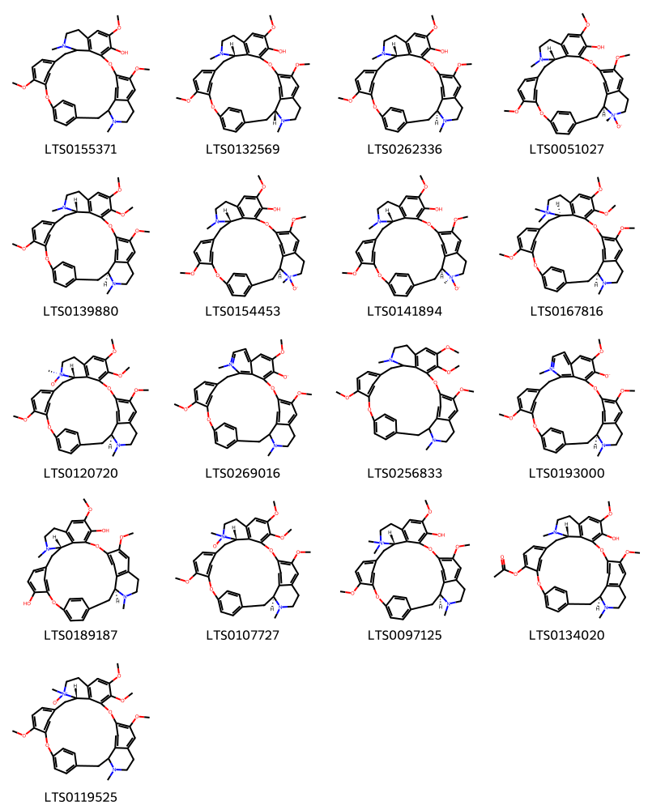
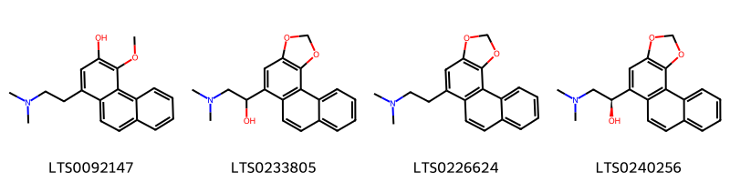
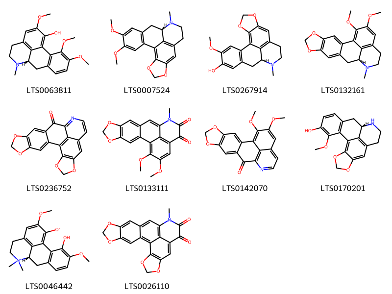
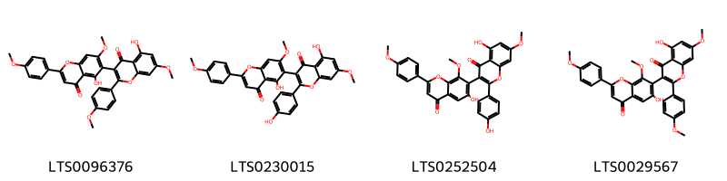
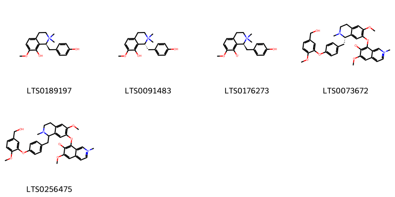
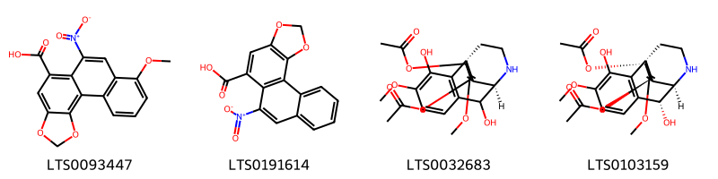
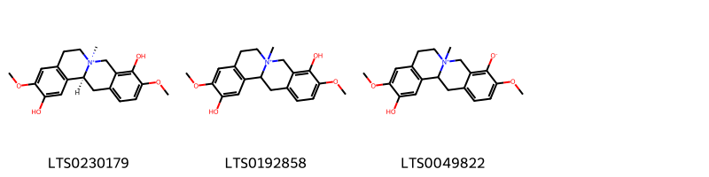

!!! abstract "Tóm tắt"
    Cây Phòng Kỷ (Stephania tetrandra S. Moore), thuộc họ Tiết dê (Menispermaceae), là một vị thuốc quý trong y học cổ truyền, có nguồn gốc từ các khu vực Trung Nam Trung Quốc, Đài Loan, Hainan và Việt Nam. Rễ hình trụ không đều, hoặc hình nửa trụ, thường cong queo, mặt ngoài màu vàng, nơi uốn cong thường có rãnh ngang, trũng sâu, có mấu và mắt gỗ.

Theo tài liệu cổ, phòng kỷ có vị đắng, cay, và tính lạnh, tác động chủ yếu vào kinh bàng quang, giúp khử phong, hành thủy, tả hạ và tiêu huyết phận thấp nhiệt. Nó được sử dụng để điều trị nhiều bệnh lý như thủy thũng, cước khí, thấp thũng, và đau nhức khớp xương. Cây còn có tác dụng kháng khuẩn, kháng nấm (đặc biệt là nấm Candida albicans), kháng virus và chống viêm. Phòng Kỷ chứa nhiều thành phần hóa học quan trọng, trong đó nhóm alkaloid chiếm ưu thế. Các alkaloid chính gồm Tetrandrin (C38H42N2O6), có tác dụng giảm huyết áp, giãn mạch, chống viêm, và chống oxy hóa; Demethyl Tetrandrin (C36H40N2O6), tác dụng tương tự nhưng mạnh hơn trong việc giảm huyết áp và chống viêm; và Alkaloid Phenol (C32H42O6N2), có tác dụng kháng khuẩn và chống viêm. Ngoài ra, cây còn chứa flavonoid, diterpenoid, sesquiterpenoid, tinh dầu, acid hữu cơ như acid citric và acid malic, cùng chất xơ và chất nhầy, giúp hỗ trợ tiêu hóa và bảo vệ cơ thể.

Phòng Kỷ thường được sử dụng dưới dạng thuốc sắc, với liều dùng từ 6-12g mỗi ngày, và được phối hợp với các vị thuốc khác như bạch truật, cam thảo, sinh khương, quế tâm và ô đầu để tăng hiệu quả điều trị. Tuy nhiên, cây không nên dùng cho những người có âm hư hoặc không có thấp nhiệt, vì có thể gây tác dụng phụ.

## Thông tin về thực vật

### Đặc điểm thực vật

Dược liệu **Phòng Kỷ (Rễ)** từ bộ phận **nan** từ loài *Stephania tetrandra S. Moore* thuộc họ Menispermaceae. Phòng kỷ là một cây sống lâu năm, mọc leo, rễ phình thành củ, đường kính của rễ có thể đạt tới 6cm, mặt ngoài rễ có màu tro nhạt, hay màu nâu. Thân mềm, có thể dài tới 2,5 - 4m, vỏ thân màu xanh nhạt, phía gốc hơi đỏ. Lá mọc so le, hình khiên, dài 4 - 6cm, rộng 4,5 - 6cm, gốc lá hình tim, đầu lá nhọn, mép nguyên, hai mặt đều có lông ngắn, mềm, mặt trên màu xanh, mặt dưới màu tro. Cuống lá dài gần bằng chiều dài của lá, không đính vào đáy lá mà vào phía trong phiến lá. Hoa nhỏ, đực cái khác gốc, màu xanh nhạt. Quả hạch, hình cầu hơi dẹt. Mùa hoa tại Trung Quốc vào các tháng 4 - 5; mùa quả vào các tháng 5 - 6. 

!!! info "Phân loại thực vật của *Stephania tetrandra*"
    - **Kingdom:** Plantae
    - **Phylum:** Tracheophyta
    - **Order:** Ranunculales
    - **Family:** Menispermaceae
    - **Genus:** Stephania
    - **Species:** *Stephania tetrandra*

*Tài liệu tham khảo:* "Những cây thuốc và vị thuốc Việt Nam" - Đỗ Tất Lợi

 

### Loài thay thế (Nếu có)

### Phân bố trên thế giới
**Từ vườn thực vật KEW: **: Nguồn gốc: China South-Central, China Southeast, Hainan, Taiwan, Vietnam

**Từ CSDL GIBF** Viet Nam, China, Hong Kong, United States of America, Chinese Taipei

### Phân bố tại Việt Nam
** "Những cây thuốc và vị thuốc Việt Nam" - Đỗ Tất Lợi**: Phân bố rộng rãi ở Việt Nam

**Từ CSDL GIBF**: Không có ghi nhận ở Việt Nam

---

## Thông tin về dược liệu 

### Định danh

!!! info "Thông tin về tên gọi của nan"
    - Dược liệu tiếng Việt: nan
    - Dược liệu tiếng Trung: nan (nan)
    - Dược liệu tiếng Anh: nan
    - Dược liệu latin thông dụng: nan
    - Dược liệu latin kiểu DĐVN: stephania tetrandra s. moore
    - Dược liệu latin kiểu DĐVN: nan
    - Dược liệu latin kiểu thông tư: nan
    - Bộ phận dùng: nan (nan)

### Mô tả dược liệu 
- **Theo dược điển Việt nam V:** nan

- **Mô tả dược liệu theo thông tư chế biến dược liệu theo phương pháp cổ truyền:** nan

### Chế biến 

- **Chế biến theo dược điển việt nam V**: nan

- **Chế biến theo thông tư:** nan

--- 

## Thành phần hóa học

- Theo tài liệu của GS. Đỗ Tất Lợi:  (1)
Nhóm Alkaloid
Alkaloid chính: Tetrandrin (C38H42N2O6), Demethyl Tetrandrin (C36H40N2O6), Alkaloid Phenol (C32H42O6N2)
Nhóm Flavonoid
Nhóm Diterpenoid và Sesquiterpenoid
Nhóm Tinh Dầu
Nhóm Acid Hữu Cơ (Acid citric, acid malic)
Nhóm Chất Xơ và Chất Nhầy
(2) Tetrandrin (C38H42N2O6) là hoạt chất chủ yếu và được coi là biomarker (dấu ấn sinh học) của cây Phòng Kỷ
    
- Theo cơ sở dữ liệu lotus: Từ loài *Stephania tetrandra* đã phân lập và xác định được 50 hoạt chất thuộc về các nhóm Phenanthrenes and derivatives, Organooxygen compounds, Isoflavonoids, 6,6a-secoaporphines, Steroids and steroid derivatives, Aporphines, Protoberberine alkaloids and derivatives, Isoquinolines and derivatives. 

|    | chemicalTaxonomyClassyfireClass          |   smiles_count |
|---:|:-----------------------------------------|---------------:|
|  0 |                                          |             17 |
|  1 | 6,6a-secoaporphines                      |              4 |
|  2 | Aporphines                               |             10 |
|  3 | Isoflavonoids                            |              4 |
|  4 | Isoquinolines and derivatives            |              5 |
|  5 | Organooxygen compounds                   |              1 |
|  6 | Phenanthrenes and derivatives            |              4 |
|  7 | Protoberberine alkaloids and derivatives |              3 |
|  8 | Steroids and steroid derivatives         |              2 |

### Nhóm 
<figure markdown="span">
    { width=100% }
    <figcaption>Hình ảnh cấu trúc hóa học của 17 hoạt chất thuộc nhóm  gồm ['9,20,25-trimethoxy-15,30-dimethyl-7,23-dioxa-15,30-diazaheptacyclo[22.6.2.2³,⁶.1⁸,¹².1¹⁴,¹⁸.0²⁷,³¹.0²²,³³]hexatriaconta-3,5,8(34),9,11,18(33),19,21,24,26,31,35-dodecaen-21-ol (LTS0155371)', '(1r,14s)-9,20,25-trimethoxy-15,30-dimethyl-7,23-dioxa-15,30-diazaheptacyclo[22.6.2.2³,⁶.1⁸,¹².1¹⁴,¹⁸.0²⁷,³¹.0²²,³³]hexatriaconta-3,5,8(34),9,11,18(33),19,21,24,26,31,35-dodecaen-21-ol (LTS0132569)', 'fangchinoline (LTS0262336)', '(1s,14s,30s)-21-hydroxy-9,20,25-trimethoxy-15,30-dimethyl-7,23-dioxa-15,30-diazaheptacyclo[22.6.2.2³,⁶.1⁸,¹².1¹⁴,¹⁸.0²⁷,³¹.0²²,³³]hexatriaconta-3,5,8(34),9,11,18(33),19,21,24,26,31,35-dodecaen-30-ium-30-olate (LTS0051027)', '(1s,14s)-9,20,21,25-tetramethoxy-15,30-dimethyl-7,23-dioxa-15,30-diazaheptacyclo[22.6.2.2³,⁶.1⁸,¹².1¹⁴,¹⁸.0²⁷,³¹.0²²,³³]hexatriaconta-3,5,8(34),9,11,18(33),19,21,24,26,31,35-dodecaene (LTS0139880)', '(1s,14s)-21-hydroxy-9,20,25-trimethoxy-15,30-dimethyl-7,23-dioxa-15,30-diazaheptacyclo[22.6.2.2³,⁶.1⁸,¹².1¹⁴,¹⁸.0²⁷,³¹.0²²,³³]hexatriaconta-3,5,8(34),9,11,18(33),19,21,24,26,31,35-dodecaen-30-ium-30-olate (LTS0154453)', '(1s,14s,30r)-21-hydroxy-9,20,25-trimethoxy-15,30-dimethyl-7,23-dioxa-15,30-diazaheptacyclo[22.6.2.2³,⁶.1⁸,¹².1¹⁴,¹⁸.0²⁷,³¹.0²²,³³]hexatriaconta-3,5,8(34),9,11,18(33),19,21,24,26,31,35-dodecaen-30-ium-30-olate (LTS0141894)', '(1s,14r)-9,20,21,25-tetramethoxy-15,15,30-trimethyl-7,23-dioxa-15,30-diazaheptacyclo[22.6.2.2³,⁶.1⁸,¹².1¹⁴,¹⁸.0²⁷,³¹.0²²,³³]hexatriaconta-3,5,8(34),9,11,18(33),19,21,24,26,31,35-dodecaen-15-ium (LTS0167816)', '(1s,14s,15s)-9,20,21,25-tetramethoxy-15,30-dimethyl-7,23-dioxa-15,30-diazaheptacyclo[22.6.2.2³,⁶.1⁸,¹².1¹⁴,¹⁸.0²⁷,³¹.0²²,³³]hexatriaconta-3,5,8(34),9,11,18(33),19,21,24,26,31,35-dodecaen-15-ium-15-olate (LTS0120720)', '9,20,25-trimethoxy-15,30-dimethyl-7,23-dioxa-15,30-diazaheptacyclo[22.6.2.2³,⁶.1⁸,¹².1¹⁴,¹⁸.0²⁷,³¹.0²²,³³]hexatriaconta-3,5,8(34),9,11,14(33),15,17,19,21,24,26,31,35-tetradecaen-15-ium-21-olate (LTS0269016)', 'isotetrandrine (LTS0256833)', '(1s)-9,20,25-trimethoxy-15,30-dimethyl-7,23-dioxa-15,30-diazaheptacyclo[22.6.2.2³,⁶.1⁸,¹².1¹⁴,¹⁸.0²⁷,³¹.0²²,³³]hexatriaconta-3,5,8(34),9,11,14(33),15,17,19,21,24,26,31,35-tetradecaen-15-ium-21-olate (LTS0193000)', '(1s,14s)-20,25-dimethoxy-15,30-dimethyl-7,23-dioxa-15,30-diazaheptacyclo[22.6.2.2³,⁶.1⁸,¹².1¹⁴,¹⁸.0²⁷,³¹.0²²,³³]hexatriaconta-3,5,8(34),9,11,18(33),19,21,24(32),25,27(31),35-dodecaene-9,21-diol (LTS0189187)', '(1s,14s)-9,20,21,25-tetramethoxy-15,30-dimethyl-7,23-dioxa-15,30-diazaheptacyclo[22.6.2.2³,⁶.1⁸,¹².1¹⁴,¹⁸.0²⁷,³¹.0²²,³³]hexatriaconta-3,5,8(34),9,11,18(33),19,21,24,26,31,35-dodecaen-15-ium-15-olate (LTS0107727)', '(1s,14s)-21-hydroxy-9,20,25-trimethoxy-15,15,30-trimethyl-7,23-dioxa-15,30-diazaheptacyclo[22.6.2.2³,⁶.1⁸,¹².1¹⁴,¹⁸.0²⁷,³¹.0²²,³³]hexatriaconta-3,5,8(34),9,11,18(33),19,21,24,26,31,35-dodecaen-15-ium (LTS0097125)', '(1s,14s)-21-hydroxy-20,25-dimethoxy-15,30-dimethyl-7,23-dioxa-15,30-diazaheptacyclo[22.6.2.2³,⁶.1⁸,¹².1¹⁴,¹⁸.0²⁷,³¹.0²²,³³]hexatriaconta-3,5,8(34),9,11,18(33),19,21,24(32),25,27(31),35-dodecaen-9-yl acetate (LTS0134020)', '(14s)-9,20,21,25-tetramethoxy-15,30-dimethyl-7,23-dioxa-15,30-diazaheptacyclo[22.6.2.2³,⁶.1⁸,¹².1¹⁴,¹⁸.0²⁷,³¹.0²²,³³]hexatriaconta-3,5,8(34),9,11,18(33),19,21,24,26,31,35-dodecaen-15-ium-15-olate (LTS0119525)'].</figcaption>
</figure>
### Nhóm 6_6a-secoaporphines
<figure markdown="span">
    { width=100% }
    <figcaption>Hình ảnh cấu trúc hóa học của Không tìm thấy chú thích hoạt chất thuộc nhóm 6_6a-secoaporphines gồm Không tìm thấy chú thích.</figcaption>
</figure>
### Nhóm Aporphines
<figure markdown="span">
    { width=100% }
    <figcaption>Hình ảnh cấu trúc hóa học của 10 hoạt chất thuộc nhóm Aporphines gồm ['(9s)-3,4,15-trimethoxy-10-methyl-10-azatetracyclo[7.7.1.0²,⁷.0¹³,¹⁷]heptadeca-1(16),2(7),3,5,13(17),14-hexaen-16-ol (LTS0063811)', '(12s)-16,17-dimethoxy-11-methyl-3,5-dioxa-11-azapentacyclo[10.7.1.0²,⁶.0⁸,²⁰.0¹⁴,¹⁹]icosa-1,6,8(20),14(19),15,17-hexaene (LTS0007524)', '(12s)-17-methoxy-11-methyl-3,5-dioxa-11-azapentacyclo[10.7.1.0²,⁶.0⁸,²⁰.0¹⁴,¹⁹]icosa-1,6,8(20),14(19),15,17-hexaen-16-ol (LTS0267914)', 'nantenine (LTS0132161)', '5,7,19,21-tetraoxa-13-azahexacyclo[10.10.1.0²,¹⁰.0⁴,⁸.0¹⁶,²³.0¹⁸,²²]tricosa-1(22),2,4(8),9,12(23),13,15,17-octaen-11-one (LTS0236752)', '18,19-dimethoxy-13-methyl-5,7-dioxa-13-azapentacyclo[10.7.1.0²,¹⁰.0⁴,⁸.0¹⁶,²⁰]icosa-1(20),2(10),3,8,11,16,18-heptaene-14,15-dione (LTS0133111)', 'oxonantenine (LTS0142070)', '(12s)-18-methoxy-3,5-dioxa-11-azapentacyclo[10.7.1.0²,⁶.0⁸,²⁰.0¹⁴,¹⁹]icosa-1,6,8(20),14(19),15,17-hexaen-17-ol (LTS0170201)', '(9s)-3-hydroxy-4,15-dimethoxy-10,10-dimethyl-10-azatetracyclo[7.7.1.0²,⁷.0¹³,¹⁷]heptadeca-1(16),2(7),3,5,13(17),14-hexaen-10-ium-16-olate (LTS0046442)', '13-methyl-5,7,19,21-tetraoxa-13-azahexacyclo[10.10.1.0²,¹⁰.0⁴,⁸.0¹⁶,²³.0¹⁸,²²]tricosa-1(23),2(10),3,8,11,16,18(22)-heptaene-14,15-dione (LTS0026110)'].</figcaption>
</figure>
### Nhóm Isoflavonoids
<figure markdown="span">
    { width=100% }
    <figcaption>Hình ảnh cấu trúc hóa học của 4 hoạt chất thuộc nhóm Isoflavonoids gồm ["5,5'-dihydroxy-7,7'-dimethoxy-2,2'-bis(4-methoxyphenyl)-[3,6'-bichromene]-4,4'-dione (LTS0096376)", "5,5'-dihydroxy-2-(4-hydroxyphenyl)-7,7'-dimethoxy-2'-(4-methoxyphenyl)-[3,6'-bichromene]-4,4'-dione (LTS0230015)", "5,6'-dihydroxy-2-(4-hydroxyphenyl)-7,8'-dimethoxy-2'-(4-methoxyphenyl)-[3,7'-bichromene]-4,4'-dione (LTS0252504)", "5,6'-dihydroxy-7,8'-dimethoxy-2,2'-bis(4-methoxyphenyl)-[3,7'-bichromene]-4,4'-dione (LTS0029567)"].</figcaption>
</figure>
### Nhóm Isoquinolines and derivatives
<figure markdown="span">
    { width=100% }
    <figcaption>Hình ảnh cấu trúc hóa học của 5 hoạt chất thuộc nhóm Isoquinolines and derivatives gồm ['(1s)-8-hydroxy-1-[(4-hydroxyphenyl)methyl]-7-methoxy-2,2-dimethyl-3,4-dihydro-1h-isoquinolin-2-ium (LTS0189197)', '(1r)-8-hydroxy-1-[(4-hydroxyphenyl)methyl]-7-methoxy-2,2-dimethyl-3,4-dihydro-1h-isoquinolin-2-ium (LTS0091483)', '(1s)-1-[(4-hydroxyphenyl)methyl]-7-methoxy-2,2-dimethyl-3,4-dihydro-1h-isoquinolin-2-ium-8-olate (LTS0176273)', '8-{[(1s)-1-({4-[5-(hydroxymethyl)-2-methoxyphenoxy]phenyl}methyl)-6-methoxy-2-methyl-3,4-dihydro-1h-isoquinolin-7-yl]oxy}-6-methoxy-2-methylisoquinolin-2-ium-7-olate (LTS0073672)', '8-{[1-({4-[5-(hydroxymethyl)-2-methoxyphenoxy]phenyl}methyl)-6-methoxy-2-methyl-3,4-dihydro-1h-isoquinolin-7-yl]oxy}-6-methoxy-2-methylisoquinolin-2-ium-7-olate (LTS0256475)'].</figcaption>
</figure>
### Nhóm Organooxygen compounds
<figure markdown="span">
    { width=100% }
    <figcaption>Hình ảnh cấu trúc hóa học của 1 hoạt chất thuộc nhóm Organooxygen compounds gồm ['cycleanine (LTS0196414)'].</figcaption>
</figure>
### Nhóm Phenanthrenes and derivatives
<figure markdown="span">
    { width=100% }
    <figcaption>Hình ảnh cấu trúc hóa học của 4 hoạt chất thuộc nhóm Phenanthrenes and derivatives gồm ['birthwort (LTS0093447)', 'aristolochic acid ii (LTS0191614)', '(1s,9r)-12-(acetyloxy)-3,8-dihydroxy-4,11-dimethoxy-17-azatetracyclo[7.5.3.0¹,¹⁰.0²,⁷]heptadeca-2(7),3,5,10-tetraen-13-yl acetate (LTS0032683)', '(1s,8r,9r,12s,13r)-12-(acetyloxy)-3,8-dihydroxy-4,11-dimethoxy-17-azatetracyclo[7.5.3.0¹,¹⁰.0²,⁷]heptadeca-2(7),3,5,10-tetraen-13-yl acetate (LTS0103159)'].</figcaption>
</figure>
### Nhóm Protoberberine alkaloids and derivatives
<figure markdown="span">
    { width=100% }
    <figcaption>Hình ảnh cấu trúc hóa học của 3 hoạt chất thuộc nhóm Protoberberine alkaloids and derivatives gồm ['cyclanoline (LTS0230179)', '4,11-dihydroxy-3,10-dimethoxy-6-methyl-7,8,12b,13-tetrahydro-5h-6-azatetraphen-6-ium (LTS0192858)', '11-hydroxy-3,10-dimethoxy-6-methyl-7,8,12b,13-tetrahydro-5h-6-azatetraphen-6-ium-4-olate (LTS0049822)'].</figcaption>
</figure>
### Nhóm Steroids and steroid derivatives
<figure markdown="span">
    { width=100% }
    <figcaption>Hình ảnh cấu trúc hóa học của 2 hoạt chất thuộc nhóm Steroids and steroid derivatives gồm ['stigmast-5-en-3-ol, (3β)- (LTS0204616)', 'sitosterol (LTS0168132)'].</figcaption>
</figure>

---

## Tác dụng dược lý

Theo tài liệu "Những cây thuốc và vị thuốc Việt Nam" - Đỗ Tất Lợi:- Thí nghiệm trên chuột, vị phòng kỷ có tác dụng xích thích đối với thần kinh trung ương và hô hấp.
- Một số ancaloit có tác dụng hạ thân nhiệt, gây co bóp ruột thỏ và chuột. Trên mèo, thuốc có tác dụng hạ huyết áp.
- Kháng khuẩn, kháng nấm, kháng virus: tác dụng kháng nấm của Phòng kỷ chủ yếu tập trung vào nấm Candida albicans. 
- Chống viêm.

Theo tài liệu quốc tế: nan

---

## Dược điển Việt Nam V

### Soi bột:
nan
<!-- Hình ảnh soi bột sẽ được tự động chèn vào đây sau -->
### Vi phẫu:
nan
<!-- Hình ảnh vi phẫu sẽ được tự động chèn vào đây sau -->
### Định tính

nan

### Định lượng

nan

### Thông tin khác 
- ** Độ ẩm: ** nan

- ** Bảo quản:** nan
## Dược điển Hồng kong

<!-- PDF sẽ được tự động chèn vào đây sau -->

---

## Y dược học cổ truyền

- **Tên vị thuốc:** nan
- **Tính vị quy kinh:** Khổ, hàn. Vào các kinh bàng quang, thận tỳ.
- **Công năng chủ trị:** Lợi thủy tiêu thũng, khu phong chỉ thống. Chủ trị: Thủy thũng, thấp cước khí, tiểu tiện không thông lợi, thấp chân, nhọt độc, phong thấp tê đau.
- **Chú ý:** nan
- **Kiêng kỵ:** nan

